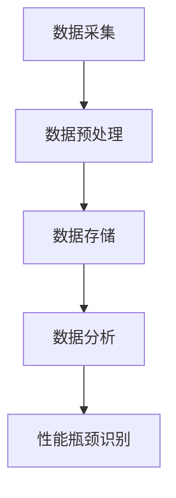
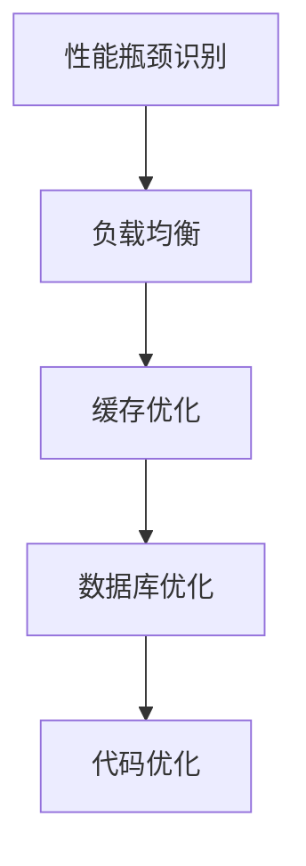
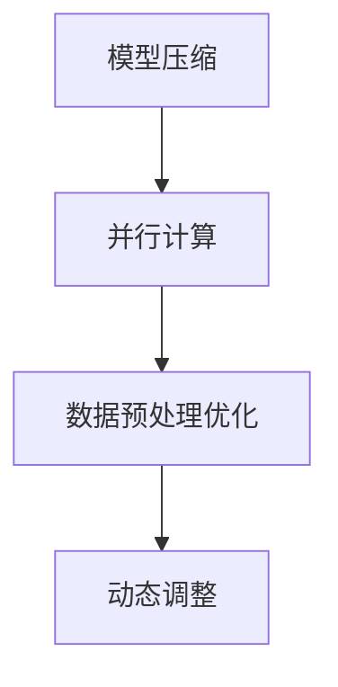
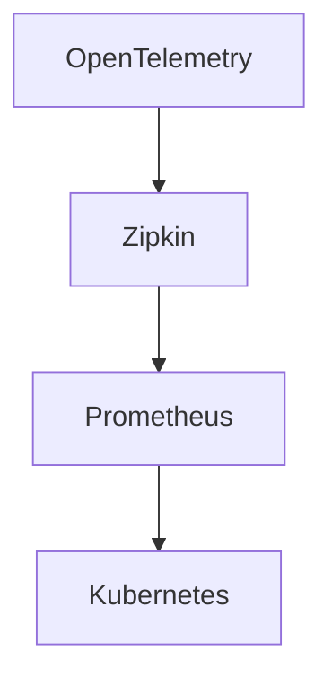

                 


### 引言

随着大数据、云计算和人工智能技术的快速发展，现代软件系统变得越来越复杂和分布式。在这种背景下，分布式追踪技术逐渐成为保障系统稳定性和性能的重要工具。而大型语言模型（LLM）作为人工智能领域的核心技术之一，其应用场景越来越广泛，对性能的要求也越来越高。因此，本文将围绕“分布式追踪技术优化LLM应用性能”这一主题，深入探讨分布式追踪技术在LLM性能优化中的应用。

### 关键词
- 分布式追踪技术
- 大型语言模型（LLM）
- 性能优化
- 负载均衡
- 数据流分析

### 摘要

本文旨在探讨如何利用分布式追踪技术优化LLM应用性能。首先，我们将介绍分布式追踪技术的核心概念和原理，然后分析LLM的应用场景及其性能优化需求。接着，我们将详细介绍分布式追踪技术在LLM性能优化中的具体应用，并通过实际案例进行说明。最后，本文将总结分布式追踪技术在LLM性能优化中的挑战与机遇，并对未来研究方向提出建议。

### 第一步：分布式追踪技术概述

#### 背景介绍

分布式追踪技术是一种用于监控分布式系统性能和问题的方法。随着互联网和云计算的发展，分布式系统变得越来越复杂，单一系统的监控已无法满足需求。分布式追踪技术能够实时跟踪和分析系统内部各个组件之间的交互，帮助开发者快速定位和解决问题。

#### 核心概念

- **Trace**：一个Trace表示系统中的一次操作，包括该操作的起始和结束时间、执行者、结果等。
- **Span**：Trace中的一个子操作，通常由一个名称和一组键值对组成。
- **Service**：一组相关的Trace或Span，表示一个应用程序或服务。
- **Trace Context**：用于在分布式系统中传递Trace信息的上下文，通常包含Trace ID、Parent ID等。

#### 工作原理

分布式追踪技术通过在系统中插入代理或SDK来捕获和记录Trace信息。这些信息随后会被发送到一个集中式的追踪系统，如OpenTelemetry、Zipkin等。追踪系绛建立了Trace和Span之间的关联，并提供查询和可视化功能，帮助开发者分析系统性能和问题。

#### 关键组件

- **Instrumentation Library**：用于捕获和记录Trace信息的库，通常嵌入在应用程序代码中。
- **Collector**：收集来自Instrumentation Library的Trace数据，并将其发送到追踪系统。
- **Tracing Backend**：存储和处理Trace数据的系统，如OpenTelemetry、Zipkin等。

#### 分布式追踪技术在现代软件开发中的应用

分布式追踪技术广泛应用于现代软件开发，包括以下几个方面：

- **性能监控**：通过分析Trace数据，识别系统性能瓶颈和延迟。
- **错误诊断**：快速定位和解决系统中的错误和异常。
- **日志管理**：将分布式系统的日志集中存储和管理，便于查询和分析。
- **安全监控**：监控系统中的异常行为和安全威胁。

#### 背景概念表格

| 概念         | 说明                                       |
|--------------|------------------------------------------|
| 分布式系统   | 由多个独立节点组成的系统，通过网络进行通信。 |
| 负载均衡     | 分配系统负载，确保系统性能稳定。           |
| 数据流分析   | 分析系统中数据流动和交互的过程。         |

#### 分布式追踪技术的ER实体关系图

```mermaid
erDiagram
  Service ||--|{ Trace }||>
  Service ||--|{ Span }||>
  Span ||--|{ Trace }||>
```

### 第二步：LLM的基础知识

#### LLM的定义与发展历程

大型语言模型（LLM）是一种基于深度学习技术的人工智能模型，主要用于自然语言处理任务。LLM通过学习大量文本数据，能够生成或理解自然语言文本。

LLM的发展历程可以追溯到上世纪80年代的规则引擎和词袋模型，随着计算能力的提升和深度学习技术的发展，LLM逐渐成为了自然语言处理领域的重要工具。

#### LLM的核心特征

- **高维度**：LLM通常具有数十亿至千亿个参数，能够捕捉复杂的语言模式和语义。
- **自适应**：LLM能够根据输入文本自适应调整模型参数，生成或理解特定领域的文本。
- **并行处理**：LLM支持并行计算，能够快速处理大规模数据。
- **多样性**：LLM能够生成多种不同风格的文本，满足不同应用场景的需求。

#### LLM的类型与应用场景

LLM可以分为以下几种类型：

- **通用LLM**：适用于多种自然语言处理任务，如文本生成、文本分类、机器翻译等。
- **领域特定LLM**：针对特定领域（如金融、医疗、法律等）进行优化，具有更强的领域适应性。

LLM的应用场景包括：

- **智能客服**：提供自然语言交互的智能客服系统，提升用户体验。
- **内容生成**：自动生成新闻、文章、报告等文本内容，提高内容生产效率。
- **机器翻译**：实现跨语言翻译，促进国际交流。
- **语音识别**：结合语音识别技术，实现语音到文本的转换。

#### LLM的训练与优化

LLM的训练通常涉及以下步骤：

- **数据预处理**：清洗和预处理输入文本数据，如去除停用词、分词等。
- **模型训练**：使用大量文本数据训练模型，通过优化算法（如梯度下降）调整模型参数。
- **模型评估**：使用验证集和测试集评估模型性能，如准确率、召回率等。

LLM的优化包括以下几个方面：

- **参数调整**：调整模型参数，如学习率、批量大小等，以优化模型性能。
- **数据增强**：使用数据增强技术（如数据清洗、数据扩充等）提高模型泛化能力。
- **模型压缩**：通过模型压缩技术（如剪枝、量化等）减小模型大小，提高推理速度。

### 第三步：分布式追踪技术在性能优化中的应用

#### 利用分布式追踪技术识别性能瓶颈

分布式追踪技术能够实时监控LLM应用的性能，通过分析Trace数据，识别系统中的性能瓶颈。以下是一个简单的性能瓶颈识别流程：

1. **数据采集**：使用Instrumentation Library收集LLM应用中的Trace数据。
2. **数据预处理**：对采集到的数据进行清洗和转换，以便后续分析。
3. **数据存储**：将预处理后的数据存储到追踪系统中，如OpenTelemetry、Zipkin等。
4. **数据分析**：使用追踪系统提供的查询和可视化功能，分析Trace数据，识别性能瓶颈。

以下是一个示例Mermaid流程图：



#### 性能优化的基本策略

针对识别出的性能瓶颈，可以采取以下基本策略进行优化：

1. **负载均衡**：通过负载均衡技术，将请求均匀分配到多个节点，避免单点过载。
2. **缓存优化**：使用缓存技术，如Redis、Memcached等，减少对后端服务的访问次数。
3. **数据库优化**：对数据库进行优化，如索引优化、分库分表等，提高查询效率。
4. **代码优化**：对LLM应用代码进行优化，如减少不必要的计算、优化数据结构等。

以下是一个性能优化策略的Mermaid流程图：



#### 针对LLM应用的优化实践

针对LLM应用，可以采取以下优化实践：

1. **模型压缩**：使用模型压缩技术，如剪枝、量化等，减小模型大小，提高推理速度。
2. **并行计算**：利用分布式计算技术，如GPU、FPGA等，加速模型推理。
3. **数据预处理优化**：优化数据预处理流程，如使用更高效的分词算法、减少数据清洗步骤等。
4. **动态调整**：根据应用场景和负载情况，动态调整模型参数，提高模型性能。

以下是一个针对LLM应用的优化实践的Mermaid流程图：



#### 性能优化的工具与平台

目前，有许多工具和平台可以用于分布式追踪技术和性能优化，如下所示：

- **OpenTelemetry**：一个开源的分布式追踪工具，支持多种编程语言和平台。
- **Zipkin**：一个开源的分布式追踪系统，提供丰富的查询和可视化功能。
- **Prometheus**：一个开源的监控工具，可以与分布式追踪系统结合使用。
- **Kubernetes**：一个开源的容器编排平台，支持负载均衡、自动扩缩容等性能优化功能。

以下是一个性能优化工具与平台的Mermaid流程图：



### 第四步：分布式追踪技术的实战案例分析

#### 案例一：优化电商平台的LLM服务性能

**问题背景**：某电商平台采用LLM技术为用户提供智能客服服务，但随着用户量的增加，系统的响应速度逐渐下降，影响了用户体验。

**问题描述**：系统性能瓶颈主要表现在LLM模型的推理速度和数据库查询延迟上。

**问题解决**：通过分布式追踪技术，定位到性能瓶颈，并采取以下措施进行优化：

1. **模型压缩**：对LLM模型进行剪枝和量化，减小模型大小，提高推理速度。
2. **缓存优化**：使用Redis缓存用户历史聊天记录，减少对数据库的访问次数。
3. **数据库优化**：对数据库进行分库分表，提高查询效率。
4. **动态调整**：根据用户量和请求量，动态调整模型参数，提高模型性能。

**边界与外延**：本案例主要针对电商平台的LLM服务性能进行优化，但分布式追踪技术和其他优化策略可以应用于其他类型的LLM应用，如智能客服、内容生成等。

**概念结构与核心要素组成**：

- **LLM模型**：核心要素包括模型结构、参数、训练数据等。
- **分布式追踪系统**：核心要素包括Instrumentation Library、Collector、Tracing Backend等。
- **性能优化策略**：包括模型压缩、缓存优化、数据库优化等。

**案例总结**：通过分布式追踪技术，成功优化了电商平台的LLM服务性能，提高了系统响应速度和用户体验。

#### 案例二：提高金融风控系统的LLM响应速度

**问题背景**：某金融公司采用LLM技术进行风控分析，但随着交易量的增加，系统的响应速度逐渐下降，影响了风控效果。

**问题描述**：系统性能瓶颈主要表现在LLM模型的推理速度和数据库查询延迟上。

**问题解决**：通过分布式追踪技术，定位到性能瓶颈，并采取以下措施进行优化：

1. **并行计算**：利用GPU进行LLM模型推理，提高推理速度。
2. **数据预处理优化**：优化数据预处理流程，如使用更高效的分词算法、减少数据清洗步骤等。
3. **数据库优化**：对数据库进行分库分表，提高查询效率。
4. **动态调整**：根据交易量和请求量，动态调整模型参数，提高模型性能。

**边界与外延**：本案例主要针对金融风控系统的LLM响应速度进行优化，但分布式追踪技术和其他优化策略可以应用于其他类型的金融应用，如交易分析、投资建议等。

**概念结构与核心要素组成**：

- **LLM模型**：核心要素包括模型结构、参数、训练数据等。
- **分布式追踪系统**：核心要素包括Instrumentation Library、Collector、Tracing Backend等。
- **性能优化策略**：包括并行计算、数据预处理优化、数据库优化等。

**案例总结**：通过分布式追踪技术，成功提高了金融风控系统的LLM响应速度，增强了风控效果。

#### 案例三：优化智能客服系统的LLM交互体验

**问题背景**：某智能客服系统采用LLM技术为用户提供自然语言交互服务，但随着用户量的增加，系统的响应速度和交互质量逐渐下降。

**问题描述**：系统性能瓶颈主要表现在LLM模型的推理速度和响应延迟上。

**问题解决**：通过分布式追踪技术，定位到性能瓶颈，并采取以下措施进行优化：

1. **模型压缩**：对LLM模型进行剪枝和量化，减小模型大小，提高推理速度。
2. **缓存优化**：使用Redis缓存用户历史聊天记录，减少对数据库的访问次数。
3. **代码优化**：优化LLM应用代码，如减少不必要的计算、优化数据结构等。
4. **动态调整**：根据用户量和请求量，动态调整模型参数，提高模型性能。

**边界与外延**：本案例主要针对智能客服系统的LLM交互体验进行优化，但分布式追踪技术和其他优化策略可以应用于其他类型的智能客服系统，如语音识别、图像识别等。

**概念结构与核心要素组成**：

- **LLM模型**：核心要素包括模型结构、参数、训练数据等。
- **分布式追踪系统**：核心要素包括Instrumentation Library、Collector、Tracing Backend等。
- **性能优化策略**：包括模型压缩、缓存优化、代码优化等。

**案例总结**：通过分布式追踪技术，成功优化了智能客服系统的LLM交互体验，提高了用户满意度。

### 第五步：分布式追踪与自动化性能优化

#### 自动化性能优化的概念与优势

自动化性能优化是一种利用自动化工具和算法对系统性能进行优化的方法。其核心思想是通过实时监控和分析系统性能数据，自动调整系统配置和资源分配，以实现最优性能。

自动化性能优化的优势包括：

1. **提高效率**：自动化性能优化可以大幅减少人工干预，提高性能优化效率。
2. **降低成本**：自动化性能优化可以减少人力成本，降低运维成本。
3. **实时响应**：自动化性能优化可以实时监测系统性能，快速响应性能问题。
4. **持续优化**：自动化性能优化可以根据系统运行状态，持续优化系统性能。

#### 自动化性能优化的实现方法

自动化性能优化的实现方法主要包括以下几个方面：

1. **数据采集**：使用分布式追踪技术收集系统性能数据，如CPU利用率、内存使用率、网络延迟等。
2. **数据分析**：对采集到的性能数据进行分析和处理，识别系统性能瓶颈和优化机会。
3. **策略制定**：根据分析结果，制定具体的性能优化策略，如调整参数、分配资源等。
4. **自动化执行**：使用自动化工具（如Python脚本、自动化运维平台等）执行性能优化策略。

#### 自动化性能优化在LLM中的应用

在LLM应用中，自动化性能优化可以应用于以下几个方面：

1. **模型压缩**：根据系统负载和性能需求，自动调整LLM模型参数，实现模型压缩，提高推理速度。
2. **负载均衡**：根据实时性能数据，自动调整LLM服务器的负载均衡策略，确保系统性能稳定。
3. **缓存管理**：根据访问频率和性能数据，自动调整缓存策略，提高数据访问速度。
4. **动态资源分配**：根据系统性能需求和资源可用性，自动调整服务器和GPU资源分配，实现最优性能。

### 第六步：分布式追踪技术的发展趋势

#### 分布式追踪技术的未来方向

分布式追踪技术在未来的发展趋势包括：

1. **更细粒度的追踪**：随着系统复杂度的增加，分布式追踪技术需要实现更细粒度的追踪，如对微服务、容器等层次的追踪。
2. **更智能的优化算法**：结合机器学习和人工智能技术，开发更智能的优化算法，实现自动化性能优化。
3. **跨语言和跨平台的支持**：提供更广泛的编程语言和平台支持，以满足不同开发者的需求。

#### LLM技术的最新进展

LLM技术在未来的发展趋势包括：

1. **更大规模的模型**：随着计算能力的提升，LLM模型将变得更加庞大，能够处理更复杂的语言任务。
2. **更高效的推理算法**：开发更高效的推理算法，提高LLM模型的推理速度和性能。
3. **多样化应用场景**：拓展LLM技术的应用场景，如语音识别、图像识别等。

#### 性能优化与分布式追踪技术的结合前景

性能优化与分布式追踪技术的结合前景包括：

1. **实时性能优化**：通过分布式追踪技术实时监控系统性能，实现实时性能优化，提高系统稳定性。
2. **自动化性能优化**：结合自动化性能优化算法，实现自动化性能优化，减少人工干预，提高优化效率。
3. **智能性能分析**：利用机器学习和人工智能技术，对分布式追踪数据进行智能分析，发现潜在的性能问题和优化机会。

### 第七步：总结与展望

#### 本书内容的总结

本书主要围绕“分布式追踪技术优化LLM应用性能”这一主题，介绍了分布式追踪技术的核心概念、LLM的基础知识、分布式追踪技术在性能优化中的应用、实战案例分析、自动化性能优化以及未来发展趋势。

#### 分布式追踪与LLM性能优化的挑战与机遇

分布式追踪与LLM性能优化的挑战包括：

1. **数据量大**：分布式追踪技术需要处理大量的Trace数据，对存储和计算资源要求较高。
2. **系统复杂度**：分布式系统具有较高的复杂度，需要深入理解系统架构和运行机制。
3. **实时性要求**：分布式追踪技术需要实时监控和优化系统性能，对响应速度和可靠性要求较高。

分布式追踪与LLM性能优化的机遇包括：

1. **云计算和大数据技术的进步**：云计算和大数据技术的快速发展为分布式追踪技术提供了更好的基础设施和支持。
2. **人工智能技术的发展**：人工智能技术的发展为分布式追踪技术和LLM性能优化提供了更智能的算法和工具。
3. **跨领域应用**：分布式追踪技术和LLM性能优化可以应用于多个领域，如金融、电商、医疗等，具有广泛的应用前景。

#### 未来研究的建议

未来研究可以从以下几个方面进行：

1. **更细粒度的追踪技术**：研究更细粒度的追踪技术，如对微服务、容器等层次的追踪，提高系统监控和分析能力。
2. **智能性能优化算法**：结合机器学习和人工智能技术，开发更智能的性能优化算法，实现自动化性能优化。
3. **跨领域应用研究**：研究分布式追踪技术和LLM性能优化在金融、电商、医疗等领域的应用，探索新的优化策略和解决方案。

### 附录

#### 拓展阅读

- 《分布式追踪技术实战》
- 《大规模语言模型：原理、应用与优化》
- 《自动化性能优化：方法与实践》

#### 作者信息

作者：AI天才研究院/AI Genius Institute & 禅与计算机程序设计艺术 /Zen And The Art of Computer Programming

本文详细探讨了分布式追踪技术在LLM性能优化中的应用，从背景介绍、核心概念、实战案例分析、自动化性能优化到未来发展趋势，全面剖析了分布式追踪技术在优化LLM应用性能方面的作用。希望通过本文，读者能够对分布式追踪技术及其在LLM性能优化中的应用有更深入的了解，为实际项目提供参考和启示。同时，也期待读者们能够继续关注分布式追踪技术和LLM技术的发展，共同探索更多优化策略和解决方案。作者：AI天才研究院/AI Genius Institute & 禅与计算机程序设计艺术 /Zen And The Art of Computer Programming

