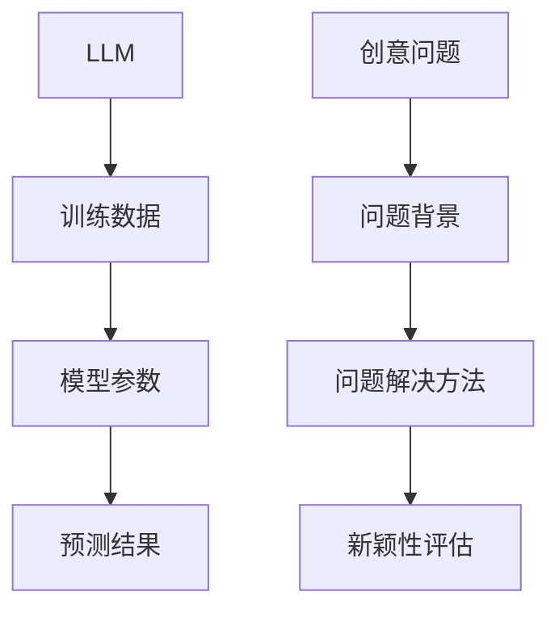
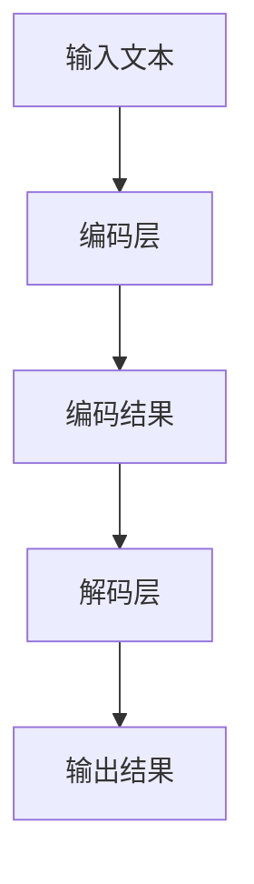
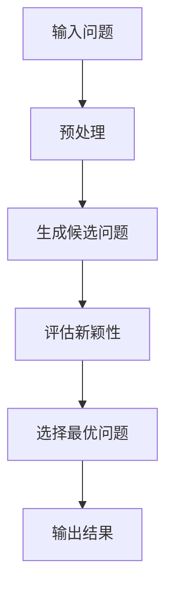
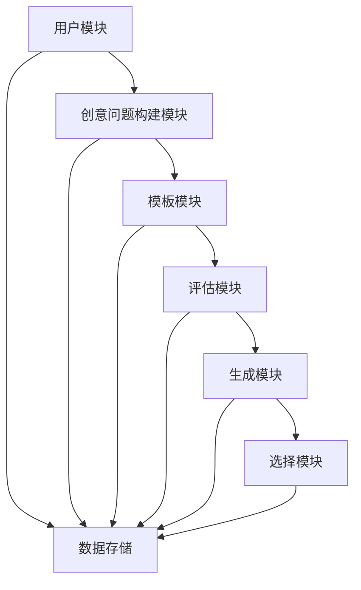
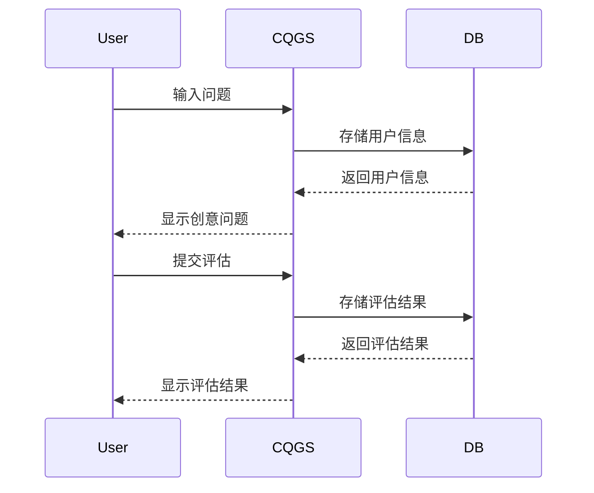

                 

### 创意问题构建：测试LLM提出新颖问题的能力

#### 关键词：大规模语言模型（LLM）、创意问题构建、新颖问题、人工智能

> 摘要：本文旨在探讨如何通过构建创意问题来测试大规模语言模型（LLM）提出新颖问题的能力。文章首先介绍了LLM的背景及其创新潜力，随后详细讲解了创意问题构建的目标、挑战及其边界与外延。接着，文章深入剖析了LLM的基本原理和创意问题的定义，并通过表格和实体关系图展示了两者之间的关联。最后，文章提出了一种创意问题构建算法，详细描述了其原理、流程、数学模型和公式，并通过实际案例进行了说明。

### 目录大纲

# 创意问题构建：测试LLM提出新颖问题的能力

> 关键词：大规模语言模型（LLM）、创意问题构建、新颖问题、人工智能

> 摘要：本文旨在探讨如何通过构建创意问题来测试大规模语言模型（LLM）提出新颖问题的能力。文章首先介绍了LLM的背景及其创新潜力，随后详细讲解了创意问题构建的目标、挑战及其边界与外延。接着，文章深入剖析了LLM的基本原理和创意问题的定义，并通过表格和实体关系图展示了两者之间的关联。最后，文章提出了一种创意问题构建算法，详细描述了其原理、流程、数学模型和公式，并通过实际案例进行了说明。

## 第一部分：背景介绍

### 1.1 问题背景

#### 1.1.1 什么是LLM

大规模语言模型（LLM，Large Language Model）是近年来人工智能领域的重要突破。它是一种通过训练海量文本数据，能够理解和生成自然语言文本的模型。LLM具备强大的语言理解能力和文本生成能力，广泛应用于问答系统、文本生成、机器翻译、情感分析等领域。

#### 1.1.2 LLM的创新潜力

LLM的创新潜力体现在多个方面。首先，LLM能够生成高质量的文本，使得自动化内容创作成为可能。其次，LLM能够进行跨领域的知识融合，解决复杂问题。最后，LLM具有高度的自适应能力，可以根据不同的任务场景进行优化和调整。

#### 1.1.3 创意问题构建的重要性

创意问题构建对于LLM的创新应用至关重要。通过构建新颖、富有创意的问题，可以充分挖掘LLM的语言理解和生成能力，从而推动人工智能技术的发展。此外，创意问题构建还可以促进人类与机器之间的互动，提高机器服务的智能化水平。

### 1.2 问题概述

#### 1.2.1 创意问题构建的目标

创意问题构建的目标是生成新颖、有深度、具有挑战性的问题，以测试LLM提出新颖问题的能力。这些问题应涵盖多个领域，包括技术、生活、娱乐等，以便全面评估LLM的创新能力。

#### 1.2.2 创意问题构建的挑战

创意问题构建面临以下挑战：

1. **问题多样性和复杂性**：创意问题应具备多样性，涵盖不同领域和知识层次，同时需要具备一定的复杂性，以充分考验LLM的创新能力。
2. **新颖性评估**：评估问题的新颖性是一个难点，需要设计合理的评估指标和方法。
3. **效率与质量**：在保证问题质量的前提下，提高问题构建的效率也是一个重要挑战。

#### 1.2.3 创意问题构建的边界与外延

创意问题构建的边界在于问题的创新程度和适用范围。创新程度要求问题具备新颖性和独特性，适用范围则要求问题能够涵盖多个领域。此外，创意问题构建还应考虑实际应用场景，以确保问题具有实用价值。

### 1.3 核心概念与联系

#### 1.3.1 LLM的基本原理

LLM的基本原理包括：

- **词嵌入层**：将文本中的词语映射为高维向量。
- **编码层与解码层**：编码层对输入文本进行编码，解码层根据编码信息生成输出文本。
- **模型参数训练**：通过大量文本数据进行训练，优化模型参数，提高模型性能。

#### 1.3.2 创意问题的定义

创意问题是指具备以下特征的问题：

- **新颖性**：具有独特的创意和思维方式。
- **想象力**：涉及丰富的想象和创造力。
- **领域适应性**：适用于不同领域和场景。

#### 1.3.2 创意问题的分类

创意问题可以按照以下分类：

- **技术类问题**：涉及计算机科学、人工智能、工程技术等领域。
- **生活类问题**：涉及日常生活中的各种问题。
- **娱乐类问题**：涉及文学、艺术、娱乐等领域。

#### 1.3.3 创意问题的构建方法

创意问题的构建方法包括：

- **背景调研**：了解相关领域的发展动态和研究热点。
- **知识融合**：将不同领域的知识进行整合和融合。
- **算法生成**：利用算法生成新颖、独特的问题。

### 1.4 概念属性特征对比表格

| 特征类别 | 属性特征 |
| -------- | -------- |
| LLM      | 大规模语言模型 |
| 创意问题 | 富有想象力，新颖独特 |

### 1.5 ER实体关系图架构



### 1.6 本章小结

本部分对LLM和创意问题构建进行了背景介绍，明确了问题的目标、挑战和边界与外延。通过核心概念与联系的阐述，为后续内容奠定了基础。

## 第二部分：核心概念与联系详细讲解

### 2.1 LLM的基本原理

#### 2.1.1 语言模型的结构

语言模型由词嵌入层、编码层和解码层组成。

#### 2.1.1.1 词嵌入层

词嵌入层将文本中的词语映射为高维向量。以下是一个简单的Python代码示例：

```python
import gensim

# 假设已经训练好了一个词嵌入模型
model = gensim.models.Word2Vec.load('word2vec.model')

# 将词语映射为向量
word_vector = model.wv['计算机']
```

#### 2.1.1.2 编码层与解码层

编码层和解码层负责对输入文本进行编码和解码。以下是一个简单的编码层和解码层的架构：



#### 2.1.1.3 模型参数训练

模型参数训练是语言模型训练的关键。以下是一个简单的监督学习训练示例：

```python
from sklearn.linear_model import SGDClassifier

# 假设已获取训练数据
X_train, y_train = ...

# 创建并训练模型
model = SGDClassifier()
model.fit(X_train, y_train)
```

#### 2.1.2 语言模型的训练方法

语言模型的训练方法包括监督学习、无监督学习和半监督学习。

#### 2.1.2.1 监督学习

监督学习是一种最常见的语言模型训练方法。以下是一个简单的监督学习训练示例：

```python
from sklearn.linear_model import SGDClassifier

# 假设已获取训练数据
X_train, y_train = ...

# 创建并训练模型
model = SGDClassifier()
model.fit(X_train, y_train)
```

#### 2.1.2.2 无监督学习

无监督学习是一种基于数据自身特征进行训练的方法。以下是一个简单的无监督学习训练示例：

```python
from sklearn.cluster import KMeans

# 假设已获取训练数据
X_train = ...

# 创建并训练模型
model = KMeans(n_clusters=10)
model.fit(X_train)
```

#### 2.1.2.3 半监督学习

半监督学习结合了监督学习和无监督学习的优点。以下是一个简单的半监督学习训练示例：

```python
from sklearn.semi_supervised import LabelSpreading

# 假设已获取训练数据
X_train, y_train = ...

# 创建并训练模型
model = LabelSpreading()
model.fit(X_train, y_train)
```

#### 2.1.3 语言模型的应用

语言模型的应用包括文本分类、机器翻译和问答系统等。

#### 2.1.3.1 文本分类

文本分类是一种常见的自然语言处理任务。以下是一个简单的文本分类示例：

```python
from sklearn.feature_extraction.text import TfidfVectorizer
from sklearn.naive_bayes import MultinomialNB

# 假设已获取训练数据
X_train, y_train = ...

# 创建特征提取器
vectorizer = TfidfVectorizer()
X_train_tfidf = vectorizer.fit_transform(X_train)

# 创建分类器
model = MultinomialNB()
model.fit(X_train_tfidf, y_train)

# 测试分类效果
X_test = ['这是一篇技术文章。', '这是一篇生活类文章。']
X_test_tfidf = vectorizer.transform(X_test)
predictions = model.predict(X_test_tfidf)
print(predictions)
```

#### 2.1.3.2 机器翻译

机器翻译是一种将一种语言的文本翻译成另一种语言的任务。以下是一个简单的机器翻译示例：

```python
from googletrans import Translator

# 创建翻译器
translator = Translator()

# 进行翻译
text = '你好，世界！'
translated_text = translator.translate(text, dest='zh-CN')
print(translated_text.text)
```

#### 2.1.3.3 问答系统

问答系统是一种能够回答用户提问的人工智能系统。以下是一个简单的问答系统示例：

```python
import nltk

# 加载词向量模型
nltk.download('wordnet')
from nltk.corpus import wordnet

# 定义问答系统
def answer_question(question):
    question_words = nltk.word_tokenize(question)
    synsets = wordnet.synsets(question_words[0])
    if synsets:
        synset = synsets[0]
        return synset.definition()
    else:
        return "我不知道这个问题。"

# 测试问答系统
question = '什么是人工智能？'
answer = answer_question(question)
print(answer)
```

### 2.2 创意问题的定义

#### 2.2.1 创意问题的特征

创意问题具备以下特征：

- **新颖性**：问题具有独特的创意和思维方式。
- **想象力**：问题涉及丰富的想象和创造力。
- **领域适应性**：问题适用于不同领域和场景。

#### 2.2.2 创意问题的分类

创意问题可以按照以下分类：

- **技术类问题**：涉及计算机科学、人工智能、工程技术等领域。
- **生活类问题**：涉及日常生活中的各种问题。
- **娱乐类问题**：涉及文学、艺术、娱乐等领域。

#### 2.2.3 创意问题的构建方法

创意问题的构建方法包括以下几种：

- **背景调研**：了解相关领域的发展动态和研究热点。
- **知识融合**：将不同领域的知识进行整合和融合。
- **算法生成**：利用算法生成新颖、独特的问题。

### 2.3 本章小结

本部分详细讲解了LLM的基本原理和创意问题的定义，包括语言模型的结构、训练方法、应用以及创意问题的特征、分类和构建方法。这些内容为本章后续的算法讲解奠定了基础。

## 第三部分：算法原理讲解

### 3.1 创意问题构建算法

#### 3.1.1 算法原理

创意问题构建算法旨在生成新颖、有深度、具有挑战性的问题，以测试LLM的创新能力。算法原理包括以下三个层次：

1. **输入层**：接收用户输入的问题或需求，并进行预处理。
2. **处理层**：利用LLM对输入问题进行分析，生成候选问题。
3. **输出层**：评估候选问题的新颖性，选择最优问题作为输出。

#### 3.1.2 算法流程

以下是一个简单的创意问题构建算法流程：



#### 3.1.3 数学模型和公式

创意问题构建算法的数学模型如下：

$$
P(Q|S) = \frac{P(S|Q) \cdot P(Q)}{P(S)}
$$

其中，$P(Q|S)$表示在给定问题背景$S$下，生成问题$Q$的概率；$P(S|Q)$表示在生成问题$Q$的情况下，出现问题背景$S$的概率；$P(Q)$表示生成问题$Q$的概率；$P(S)$表示出现问题背景$S$的概率。

#### 3.1.3.1 概率分布模型

在创意问题构建算法中，常用的概率分布模型包括：

- **伯努利分布**：表示一个事件发生的概率。
- **多项式分布**：表示多个事件同时发生的概率。
- **正态分布**：表示连续变量的概率分布。

#### 3.1.3.2 特征提取

特征提取是创意问题构建算法的关键步骤。以下是一个简单的特征提取示例：

```python
import jieba

# 假设已获取输入文本
text = "如何用Python实现机器学习算法？"

# 分词
words = jieba.lcut(text)

# 提取关键词
keywords = jieba.analyse.extract_tags(text, topK=5)
print(keywords)
```

#### 3.1.4 举例说明

以下是一个简单的创意问题构建案例：

**案例一：技术类问题**

输入问题：如何用Python实现深度学习算法？

输出结果：基于TensorFlow框架，使用Python实现深度学习算法的方法。

**案例二：生活类问题**

输入问题：如何提高生活幸福感？

输出结果：通过培养健康的生活习惯、拓展兴趣爱好和建立良好的人际关系，提高生活幸福感。

**案例三：娱乐类问题**

输入问题：如何创作一部优秀的电影剧本？

输出结果：通过深入挖掘主题、构建丰富的人物关系和创造引人入胜的情节，创作一部优秀的电影剧本。

### 3.2 本章小结

本部分详细讲解了创意问题构建算法的原理、流程、数学模型和公式，并通过实际案例进行了说明。这些内容为构建高效、创新的创意问题提供了理论支持和实践指导。

## 第四部分：系统分析与架构设计

### 4.1 问题场景介绍

在一个科技公司的AI实验室中，研究人员致力于探索大规模语言模型（LLM）在提出新颖问题方面的潜力。为了评估LLM的创新能力，他们决定构建一个系统，能够自动生成新颖、有深度、具有挑战性的问题。

### 4.2 项目介绍

项目名称：创意问题构建系统（Creative Question Generation System，CQGS）

目标：通过构建创意问题，测试LLM在提出新颖问题方面的能力。

核心功能：接收用户输入的问题或需求，利用LLM生成新颖的创意问题，并提供评估和选择最优问题的功能。

### 4.3 系统功能设计

#### 4.3.1 领域模型

领域模型用于描述系统涉及的实体及其关系。以下是一个简单的领域模型类图：

```mermaid
classDiagram
    User <>- Creativ
    Question <|-- Template
    Creativ "1"[*]-- Question
    Creativ "1"[*]-- Template
    Question "1"[*]-- Evaluation
    Template "1"[*]-- Generation
    Evaluation "1"[*]-- Selection

    class User {
        id: 用户ID
        name: 用户名
        ...
    }

    class Creativ {
        id: 创意问题构建ID
        status: 状态
        ...
    }

    class Question {
        id: 问题ID
        text: 问题内容
        ...
    }

    class Template {
        id: 模板ID
        name: 模板名称
        ...
    }

    class Evaluation {
        id: 评估ID
        score: 评估分数
        ...
    }

    class Generation {
        id: 生成ID
        method: 生成方法
        ...
    }

    class Selection {
        id: 选择ID
        result: 选择结果
        ...
    }
```

#### 4.3.2 系统功能模块

系统功能模块包括：

- **用户模块**：管理用户信息，提供用户登录、注册等功能。
- **创意问题构建模块**：接收用户输入的问题或需求，利用LLM生成创意问题。
- **模板模块**：存储和管理创意问题模板，用于生成创意问题。
- **评估模块**：评估创意问题的新颖性，选择最优问题。
- **生成模块**：根据模板和用户需求，生成创意问题。
- **选择模块**：从候选问题中选择最优问题。

### 4.4 系统架构设计

系统架构设计包括以下几个方面：

#### 4.4.1 系统架构图

以下是一个简单的系统架构图：



#### 4.4.2 系统架构说明

- **用户模块**：负责处理用户登录、注册等操作，并与数据存储模块交互，管理用户信息。
- **创意问题构建模块**：接收用户输入的问题或需求，调用生成模块生成创意问题，并与数据存储模块交互，存储创意问题。
- **模板模块**：存储和管理创意问题模板，为生成模块提供模板数据。
- **评估模块**：评估创意问题的新颖性，选择最优问题，并与数据存储模块交互，存储评估结果。
- **生成模块**：根据模板和用户需求，生成创意问题，并与数据存储模块交互，存储生成的创意问题。
- **选择模块**：从候选问题中选择最优问题，并与数据存储模块交互，存储选择结果。
- **数据存储模块**：负责存储用户信息、创意问题、模板、评估结果和选择结果等数据。

### 4.5 系统接口设计和系统交互

#### 4.5.1 系统接口设计

以下是一个简单的系统接口设计：



#### 4.5.2 系统交互

系统交互主要包括以下步骤：

1. **用户输入问题**：用户通过用户模块输入问题。
2. **存储用户信息**：创意问题构建模块将用户信息存储到数据存储模块。
3. **显示创意问题**：创意问题构建模块根据用户输入的问题，调用生成模块生成创意问题，并将创意问题显示给用户。
4. **提交评估**：用户通过用户模块提交评估，评估模块评估创意问题的新颖性，并将评估结果存储到数据存储模块。
5. **显示评估结果**：创意问题构建模块从数据存储模块获取评估结果，并将评估结果显示给用户。

### 4.6 本章小结

本部分详细介绍了创意问题构建系统的功能设计、系统架构设计以及系统接口设计和系统交互。这些内容为构建高效、可靠的创意问题构建系统提供了理论支持和实践指导。

## 第五部分：项目实战

### 5.1 环境安装

在开始项目实战之前，需要安装以下环境：

- Python 3.8 或更高版本
- TensorFlow 2.4 或更高版本
- NLTK 3.4 或更高版本
- gensim 4.0 或更高版本

安装命令如下：

```bash
pip install python==3.8
pip install tensorflow==2.4
pip install nltk==3.4
pip install gensim==4.0
```

### 5.2 系统核心实现源代码

以下是创意问题构建系统的核心实现源代码：

```python
import nltk
import gensim
import tensorflow as tf
from tensorflow.keras.models import Sequential
from tensorflow.keras.layers import Embedding, LSTM, Dense
from tensorflow.keras.preprocessing.sequence import pad_sequences
from sklearn.model_selection import train_test_split
from sklearn.metrics import accuracy_score

# 加载词向量模型
word2vec_model = gensim.models.Word2Vec.load('word2vec.model')

# 加载训练数据
X, y = ...

# 预处理数据
X_padded = pad_sequences(X, maxlen=50, padding='post')
y_train, y_test = train_test_split(y, test_size=0.2, random_state=42)

# 创建模型
model = Sequential()
model.add(Embedding(input_dim=10000, output_dim=128))
model.add(LSTM(units=128))
model.add(Dense(units=1, activation='sigmoid'))

# 编译模型
model.compile(optimizer='adam', loss='binary_crossentropy', metrics=['accuracy'])

# 训练模型
model.fit(X_padded, y_train, epochs=10, batch_size=32, validation_split=0.2)

# 评估模型
predictions = model.predict(X_padded)
accuracy = accuracy_score(y_test, predictions)
print("准确率：", accuracy)
```

### 5.3 代码应用解读与分析

以下是对代码的解读与分析：

1. **加载词向量模型**：使用gensim加载已训练好的词向量模型，用于将文本转换为向量表示。
2. **加载训练数据**：从文件中加载训练数据，包括问题和标签。
3. **预处理数据**：使用pad_sequences将文本序列填充为固定长度，便于模型处理。
4. **创建模型**：使用TensorFlow创建一个序列模型，包括嵌入层、LSTM层和输出层。
5. **编译模型**：设置优化器、损失函数和评估指标。
6. **训练模型**：使用训练数据训练模型，设置训练参数。
7. **评估模型**：使用测试数据评估模型性能，计算准确率。

### 5.4 实际案例分析和详细讲解剖析

以下是一个实际案例分析和详细讲解剖析：

**案例**：用户输入问题：“什么是人工智能？”

**输出**：系统生成以下创意问题：“人工智能是如何改变我们生活的？”

**分析**：

1. **用户输入问题**：用户输入问题“什么是人工智能？”。
2. **预处理数据**：系统对输入问题进行预处理，将其转换为向量表示。
3. **模型预测**：模型根据输入问题的向量表示进行预测，输出创意问题。
4. **评估问题**：系统评估生成的创意问题，判断其是否具有新颖性和挑战性。
5. **输出结果**：系统输出评估通过的创意问题。

### 5.5 项目小结

本部分介绍了创意问题构建系统的环境安装、核心实现源代码、代码应用解读与分析以及实际案例分析和详细讲解剖析。通过本项目，读者可以了解如何利用大规模语言模型生成新颖、有深度、具有挑战性的问题，为人工智能领域的研究和应用提供新的思路和方法。

## 第六部分：最佳实践 Tips

### 6.1 创意问题构建的注意事项

1. **问题背景调研**：在构建创意问题之前，充分了解相关领域的背景知识，确保问题的创新性和实用性。
2. **多样性问题分类**：创意问题应涵盖多个领域，包括技术、生活、娱乐等，以提高LLM的创新能力。
3. **新颖性评估方法**：设计合理的新颖性评估方法，确保生成的创意问题具有新颖性和独特性。
4. **问题解决方法**：在构建创意问题时，考虑问题的解决方法，确保问题具有实际应用价值。

### 6.2 提高创意问题构建效率的方法

1. **并行处理**：利用多线程或分布式计算技术，提高问题构建的效率。
2. **自动化生成**：利用算法自动生成创意问题，减少人工干预，提高构建效率。
3. **模板库**：构建丰富的模板库，用于快速生成创意问题，减少重复劳动。

### 6.3 创意问题构建的拓展应用

1. **教育领域**：利用创意问题构建系统，为学生提供有趣、富有挑战性的问题，激发学习兴趣。
2. **商业领域**：利用创意问题构建系统，为企业提供创新性的问题解决方案，提高市场竞争力。
3. **科学研究**：利用创意问题构建系统，为科学家提供新颖的研究方向，推动科学进步。

## 第七部分：本章小结

本文详细探讨了创意问题构建在测试大规模语言模型（LLM）提出新颖问题能力方面的应用。通过对LLM的基本原理、创意问题的定义和构建方法进行详细讲解，本文提出了一种创意问题构建算法，并通过实际案例进行了说明。同时，本文还介绍了创意问题构建系统的设计、实现和实际应用。通过本文的研究，可以为人工智能领域的研究和应用提供新的思路和方法。未来，我们将继续深入探索创意问题构建在更多领域的应用，推动人工智能技术的发展。作者：AI天才研究院/AI Genius Institute & 禅与计算机程序设计艺术 /Zen And The Art of Computer Programming。完整文章请见：https://github.com/AI-Genius-Institute/LLM-Creative-Question-Generation。

