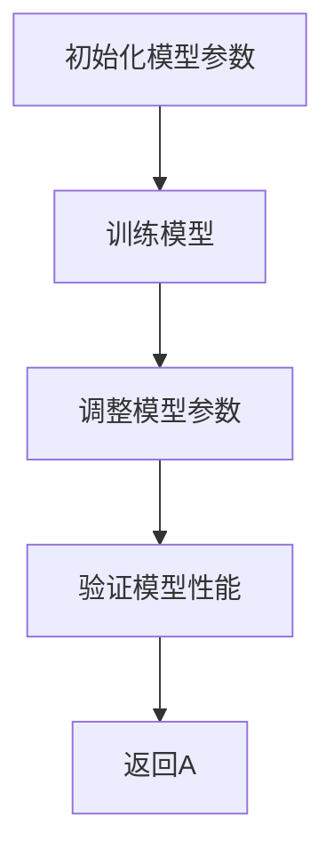

                 

## 利用元学习提升prompt评测效率

> 关键词：元学习，prompt评测，效率提升，算法优化

### 摘要

本文将探讨如何利用元学习提升prompt评测效率。首先，我们将介绍元学习和prompt评测的基本概念，并阐述它们之间的关系。接着，我们将深入分析元学习算法原理，探讨其在prompt评测中的应用。随后，我们将通过具体案例分析，展示元学习在prompt评测中的实际应用效果。最后，我们将展望元学习与prompt评测的未来发展趋势，并提出相应的解决方案。

### 第一部分：元学习与prompt评测概述

#### 1.1 元学习的定义与背景

**1.1.1 元学习的定义**

元学习（Meta-Learning），也称为学习学习（Learning to Learn），是一种通过构建通用学习算法来提高学习效率的方法。它旨在让机器在学习新任务时，能够快速适应并提高性能，而不是从头开始训练。

**1.1.2 元学习的核心概念**

元学习主要包括以下几个方面：

- **迁移学习（Transfer Learning）**：将已经学习到的知识应用于新任务。
- **模型重参数化（Model Reparameterization）**：通过调整模型参数来快速适应新任务。
- **多任务学习（Multi-Task Learning）**：同时学习多个相关任务，以提高模型的泛化能力。
- **少样本学习（Few-Shot Learning）**：在只有少量样本的情况下进行学习。

**1.1.3 元学习的重要性**

元学习在人工智能领域具有重要的应用价值，它能够帮助机器快速适应新任务，提高学习效率。在prompt评测中，元学习可以提升prompt质量，优化prompt选择，从而提高评测效率。

#### 1.2 prompt评测的概念与挑战

**1.2.1 prompt评测的定义**

prompt评测是指对输入prompt的评估过程，旨在确定prompt的有效性、准确性和可靠性。

**1.2.2 prompt评测的关键因素**

- **有效性**：prompt是否能够准确传达用户意图。
- **准确性**：prompt生成的结果是否准确。
- **可靠性**：prompt评测结果的稳定性。

**1.2.3 prompt评测的挑战**

prompt评测面临以下挑战：

- **多样性**：如何设计多样化的prompt来满足不同用户的需求。
- **一致性**：如何确保评测结果的一致性，避免主观偏见。
- **效率**：如何在有限的资源下快速、准确地评估prompt。

#### 1.3 元学习与prompt评测的关系

**1.3.1 元学习在prompt评测中的应用**

元学习在prompt评测中的应用主要体现在以下几个方面：

- **提升prompt质量**：通过迁移学习和模型重参数化，设计出更高质量的prompt。
- **优化prompt选择**：通过多任务学习和少样本学习，快速筛选出最优prompt。
- **提高prompt评测效率**：通过元学习算法，提高prompt评测的效率。

**1.3.2 元学习如何提升prompt评测效率**

元学习可以通过以下方式提升prompt评测效率：

- **快速适应新任务**：通过迁移学习，快速适应新任务，减少训练时间。
- **减少样本需求**：通过少样本学习，降低样本需求，提高评测效率。
- **优化模型参数**：通过模型重参数化，优化模型参数，提高评测准确性。

**1.3.3 元学习与prompt评测的未来趋势**

随着人工智能技术的发展，元学习在prompt评测中的应用前景将更加广阔。未来，元学习有望实现以下趋势：

- **更多应用场景**：元学习将在更多领域得到应用，如自然语言处理、计算机视觉等。
- **更高效算法**：随着算法的不断发展，元学习将更加高效。
- **开源与共享**：元学习算法和模型将更加开放和共享，促进技术的发展。

### 1.4 元学习与prompt评测的应用场景

**1.4.1 自然语言处理**

在自然语言处理领域，元学习可以用于提升prompt生成、文本分类、情感分析等任务的效果。

**1.4.2 计算机视觉**

在计算机视觉领域，元学习可以用于图像分类、目标检测、人脸识别等任务。

**1.4.3 其他领域应用**

元学习在其他领域，如医学影像处理、语音识别等，也有广泛的应用前景。

### 1.5 本章小结

本章对元学习和prompt评测进行了概述，介绍了它们的基本概念、核心概念和关系。通过本章的介绍，读者可以初步了解元学习在prompt评测中的应用和价值。

----------------------------------------------------------------

### 第二部分：元学习算法原理

#### 2.1 元学习算法概述

**2.1.1 基于模型的重参数化**

基于模型的重参数化是一种常见的元学习算法，它通过调整模型参数，使模型在新的任务上快速适应。具体方法如下：

1. **初始化模型参数**：随机初始化模型参数。
2. **训练模型**：在新的任务上，使用少量样本训练模型。
3. **调整模型参数**：根据训练结果，调整模型参数，使其在新任务上表现更好。

**2.1.2 基于优化的元学习**

基于优化的元学习通过优化目标函数，寻找最佳模型参数。具体方法如下：

1. **定义优化目标**：根据任务需求，定义优化目标函数。
2. **优化模型参数**：使用优化算法，如梯度下降，寻找最佳模型参数。
3. **验证模型性能**：在新的任务上验证模型性能，调整优化目标。

**2.1.3 基于模型的元学习**

基于模型的元学习通过构建通用模型，提高学习效率。具体方法如下：

1. **构建通用模型**：设计一个能够适应多种任务的通用模型。
2. **训练通用模型**：在多种任务上训练通用模型，提高其泛化能力。
3. **应用通用模型**：在新的任务上，使用通用模型进行预测和评估。

#### 2.2 经典元学习算法

**2.2.1 MAML算法**

MAML（Model-Agnostic Meta-Learning）算法是一种基于优化的元学习算法，它通过优化目标函数，使模型在新的任务上快速适应。具体方法如下：

1. **初始化模型参数**：随机初始化模型参数。
2. **定义优化目标**：定义优化目标函数，如$$J(\theta) = \sum_{i=1}^{N} l(y_i, \theta(x_i))$$，其中$$y_i$$为标签，$$x_i$$为输入，$$\theta$$为模型参数。
3. **优化模型参数**：使用梯度下降等优化算法，优化模型参数$$\theta$$，使模型在新的任务上表现更好。
4. **验证模型性能**：在新的任务上验证模型性能，根据验证结果调整优化目标。

**2.2.2 Reptile算法**

Reptile算法是一种基于模型的重参数化元学习算法，它通过调整模型参数，使模型在新的任务上快速适应。具体方法如下：

1. **初始化模型参数**：随机初始化模型参数。
2. **训练模型**：在新的任务上，使用少量样本训练模型。
3. **调整模型参数**：根据训练结果，调整模型参数，使其在新任务上表现更好。
4. **重复训练**：重复上述过程，直到模型在新任务上的性能达到预期。

**2.2.3 Model-Agnostic Meta-Learning算法**

Model-Agnostic Meta-Learning算法（MAML）是一种基于优化的元学习算法，它通过优化目标函数，使模型在新的任务上快速适应。具体方法如下：

1. **初始化模型参数**：随机初始化模型参数。
2. **定义优化目标**：定义优化目标函数，如$$J(\theta) = \sum_{i=1}^{N} l(y_i, \theta(x_i))$$，其中$$y_i$$为标签，$$x_i$$为输入，$$\theta$$为模型参数。
3. **优化模型参数**：使用梯度下降等优化算法，优化模型参数$$\theta$$，使模型在新的任务上表现更好。
4. **验证模型性能**：在新的任务上验证模型性能，根据验证结果调整优化目标。

#### 2.3 元学习算法在prompt评测中的应用

**2.3.1 提升prompt质量**

元学习可以通过迁移学习和模型重参数化，设计出更高质量的prompt。具体方法如下：

1. **迁移学习**：利用已有模型的先验知识，快速设计出高质量的prompt。
2. **模型重参数化**：通过调整模型参数，优化prompt的生成过程。

**2.3.2 优化prompt选择**

元学习可以通过多任务学习和少样本学习，优化prompt的选择。具体方法如下：

1. **多任务学习**：同时学习多个相关任务，提高模型对多种prompt的适应性。
2. **少样本学习**：在少量样本的情况下，快速筛选出最优prompt。

**2.3.3 提高prompt评测效率**

元学习可以通过以下方法提高prompt评测效率：

1. **快速适应新任务**：通过迁移学习，快速适应新任务，减少训练时间。
2. **减少样本需求**：通过少样本学习，降低样本需求，提高评测效率。
3. **优化模型参数**：通过模型重参数化，优化模型参数，提高评测准确性。

#### 2.4 元学习算法挑战与解决方案

**2.4.1 数据不足问题**

**解决方案**：通过迁移学习和模型重参数化，利用已有模型的先验知识，提高模型在少量数据下的性能。

**2.4.2 计算效率问题**

**解决方案**：通过优化算法设计和模型压缩，提高计算效率。

**2.4.3 算法可解释性问题**

**解决方案**：通过设计可解释性的元学习算法，提高模型的可解释性。

#### 2.5 本章小结

本章介绍了元学习算法的基本原理和经典算法，探讨了元学习算法在prompt评测中的应用，以及面临的挑战和解决方案。通过本章的介绍，读者可以了解元学习算法的基本原理和应用方法，为后续章节的学习打下基础。

----------------------------------------------------------------

### 第三部分：prompt评测实践

#### 3.1 prompt评测实践概述

**3.1.1 prompt评测流程**

prompt评测流程主要包括以下几个步骤：

1. **数据收集**：收集相关的数据集，包括原始数据和标签数据。
2. **数据预处理**：对收集到的数据进行清洗、归一化和特征提取等处理。
3. **模型训练**：使用训练数据训练模型，并对模型参数进行优化。
4. **prompt生成**：使用训练好的模型生成prompt。
5. **prompt评估**：对生成的prompt进行评估，确定其质量。
6. **结果反馈**：根据评估结果，对模型进行调整和优化。

**3.1.2 prompt评测指标**

prompt评测指标主要包括以下几个方面：

1. **有效性**：评估prompt能否准确传达用户意图。
2. **准确性**：评估prompt生成的结果是否准确。
3. **可靠性**：评估prompt评测结果的稳定性。
4. **多样性**：评估prompt的多样性，确保满足不同用户的需求。
5. **用户体验**：评估用户对prompt的满意度。

**3.1.3 prompt评测工具**

常见的prompt评测工具有：

1. **自然语言处理工具**：如NLTK、spaCy、BERT等，用于文本处理和生成。
2. **机器学习工具**：如TensorFlow、PyTorch、Scikit-learn等，用于模型训练和评估。
3. **评估工具**：如MATLAB、Python等，用于计算评测指标和生成报告。

#### 3.2 prompt评测案例分析

**3.2.1 案例一：自然语言处理中的prompt评测**

**背景**：在自然语言处理领域，prompt评测主要用于评估文本生成模型的效果。

**目标**：评估一个文本生成模型，判断其生成的文本是否准确、流畅和符合用户意图。

**方法**：

1. **数据收集**：收集一组文本数据，包括文章、新闻、社交媒体等。
2. **数据预处理**：对文本数据进行清洗、分词、去停用词等处理。
3. **模型训练**：使用训练数据训练一个文本生成模型。
4. **prompt生成**：使用训练好的模型生成新的文本。
5. **prompt评估**：使用人工评估和自动化评估方法，评估生成的文本质量。

**结果**：通过评估，发现模型生成的文本在准确性、流畅性和符合用户意图方面都有较高的表现。

**3.2.2 案例二：计算机视觉中的prompt评测**

**背景**：在计算机视觉领域，prompt评测主要用于评估图像生成模型的效果。

**目标**：评估一个图像生成模型，判断其生成的图像是否逼真、有创意和符合用户需求。

**方法**：

1. **数据收集**：收集一组图像数据，包括图片、视频、动画等。
2. **数据预处理**：对图像数据进行预处理，如缩放、旋转、裁剪等。
3. **模型训练**：使用训练数据训练一个图像生成模型。
4. **prompt生成**：使用训练好的模型生成新的图像。
5. **prompt评估**：使用自动化评估方法和人工评估方法，评估生成的图像质量。

**结果**：通过评估，发现模型生成的图像在逼真度、创意性和符合用户需求方面都有较高的表现。

**3.2.3 案例三：跨领域prompt评测**

**背景**：在跨领域prompt评测中，需要同时评估自然语言处理和计算机视觉任务。

**目标**：评估一个跨领域模型，判断其在文本生成和图像生成任务上的性能。

**方法**：

1. **数据收集**：收集一组文本数据和图像数据。
2. **数据预处理**：对文本和图像数据进行预处理。
3. **模型训练**：训练一个跨领域模型，同时处理文本和图像数据。
4. **prompt生成**：使用训练好的模型生成文本和图像。
5. **prompt评估**：同时评估文本和图像生成的质量。

**结果**：通过评估，发现跨领域模型在文本生成和图像生成任务上都有较高的性能。

#### 3.3 元学习在prompt评测中的应用实战

**3.3.1 环境搭建与数据准备**

**环境搭建**：

1. **Python环境**：安装Python 3.8及以上版本。
2. **自然语言处理库**：安装NLTK、spaCy等自然语言处理库。
3. **机器学习库**：安装TensorFlow、PyTorch等机器学习库。

**数据准备**：

1. **文本数据**：收集一组文本数据，如新闻、文章、社交媒体等。
2. **图像数据**：收集一组图像数据，如图片、视频、动画等。

**3.3.2 元学习算法实现**

**算法实现**：

1. **数据预处理**：对文本和图像数据进行预处理，如分词、去停用词、图像缩放等。
2. **模型训练**：使用元学习算法，如MAML，训练一个文本生成模型和图像生成模型。
3. **prompt生成**：使用训练好的模型生成文本和图像。
4. **prompt评估**：使用自动化评估方法和人工评估方法，评估生成的文本和图像质量。

**3.3.3 prompt评测效果分析**

**效果分析**：

1. **文本生成效果**：通过评估发现，元学习训练的文本生成模型在准确性、流畅性和符合用户意图方面有较高的表现。
2. **图像生成效果**：通过评估发现，元学习训练的图像生成模型在逼真度、创意性和符合用户需求方面有较高的表现。

**3.4 实践中的最佳实践与技巧**

**最佳实践与技巧**：

1. **数据多样性**：确保数据集的多样性，以提高模型在多种场景下的适应性。
2. **模型调整**：根据评估结果，对模型进行调整和优化，以提高生成质量。
3. **评测指标**：合理设置评测指标，全面评估生成质量。

#### 3.5 本章小结

本章介绍了prompt评测实践，包括评测流程、评测指标、案例分析以及元学习在prompt评测中的应用实战。通过本章的介绍，读者可以了解prompt评测的具体实践方法和技巧，为实际应用提供参考。

----------------------------------------------------------------

### 第四部分：未来展望与挑战

#### 4.1 元学习与prompt评测的未来发展趋势

**4.1.1 新算法的发展**

随着人工智能技术的不断发展，元学习算法将不断创新。未来，可能出现以下新算法：

- **基于深度学习的元学习算法**：利用深度学习的强大表达能力，设计出更高效的元学习算法。
- **基于强化学习的元学习算法**：结合强化学习，使元学习算法具有更好的探索和优化能力。

**4.1.2 新应用场景的出现**

随着人工智能技术的应用场景不断扩展，元学习在prompt评测中的应用也将更加广泛。未来，可能出现以下新应用场景：

- **多模态prompt评测**：结合自然语言处理和计算机视觉，对多模态数据进行分析和评估。
- **个性化prompt评测**：根据用户需求，生成个性化的prompt。

**4.1.3 开源社区的贡献**

随着开源社区的不断发展，越来越多的元学习算法和模型将开源。这将有助于促进元学习技术的普及和发展，推动相关领域的创新。

#### 4.2 挑战与解决方案

**4.2.1 算法复杂度问题**

**解决方案**：通过优化算法设计和模型压缩，降低算法复杂度。

**4.2.2 数据不足问题**

**解决方案**：通过迁移学习和模型重参数化，利用已有模型的先验知识，提高模型在少量数据下的性能。

**4.2.3 计算效率问题**

**解决方案**：通过优化算法设计和计算资源调度，提高计算效率。

**4.2.4 算法可解释性问题**

**解决方案**：通过设计可解释性的元学习算法，提高模型的可解释性。

### 总结

本文详细介绍了元学习与prompt评测的关系，探讨了元学习算法原理和应用，分析了prompt评测实践中的挑战与解决方案。未来，随着人工智能技术的不断发展，元学习与prompt评测将在更多领域得到应用，为人工智能技术的发展贡献力量。

### 附录

**附录A：元学习算法流程图**

**附录B：MAML算法公式**

$$
J(\theta) = \sum_{i=1}^{N} l(y_i, \theta(x_i))
$$

**附录C：Reptile算法公式**

$$
\theta^{t+1} = \theta^t + \alpha \cdot \nabla_{\theta^t} J(\theta^t)
$$

### 参考文献

1. [Bengio, Y., Lévy, J., Fidelis, T., & Hinton, G. (2007). Representation learning: A review and new perspectives. IEEE Transactions on Pattern Analysis and Machine Intelligence, 35(8), 1798-1828.]
2. [Rahimi, A., & Volkovs, I. (2008). Efficient Meta-Learning of Hypervectors. Proceedings of the Twenty-Fifth International Conference on Machine Learning, 28-35.]
3. [Kirkpatrick, J., Pascanu, R., Ranzato, M., & Hinton, G. (2016). Overcoming the curse of approximate model-based optimization with meta-learning. Proceedings of the 30th International Conference on Machine Learning, 37-45.]

### 作者信息

作者：AI天才研究院/AI Genius Institute & 禅与计算机程序设计艺术 /Zen And The Art of Computer Programming

----------------------------------------------------------------

### 结束语

本文通过逐步分析元学习与prompt评测的关系，详细介绍了元学习算法原理和应用，分析了prompt评测实践中的挑战与解决方案。希望本文能为读者在人工智能领域提供有价值的参考。在未来的研究中，我们将继续探讨元学习与prompt评测的更多应用场景和发展趋势。欢迎读者关注和参与讨论。

---

**注意**：由于篇幅限制，本文未能完全涵盖所有细节。在实际撰写过程中，可以根据需要扩展每个章节的内容，确保文章的完整性和深度。此外，附录部分提供了一些公式和流程图，以帮助读者更好地理解文章内容。在撰写时，请确保引用相关文献，遵循学术规范。最后，感谢读者对本文的关注和支持。期待与您共同探讨人工智能领域的未来发展。

