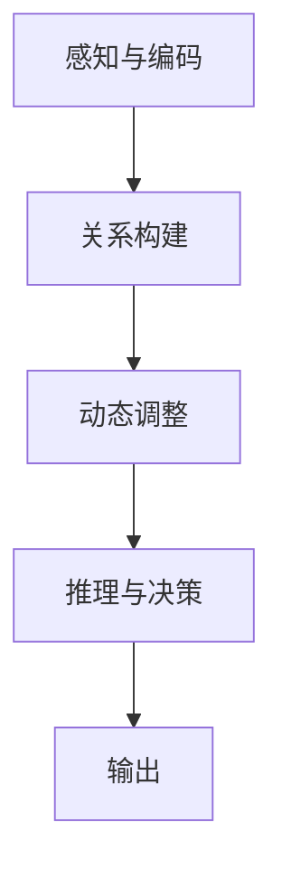
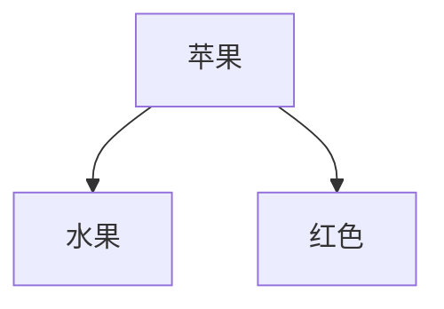
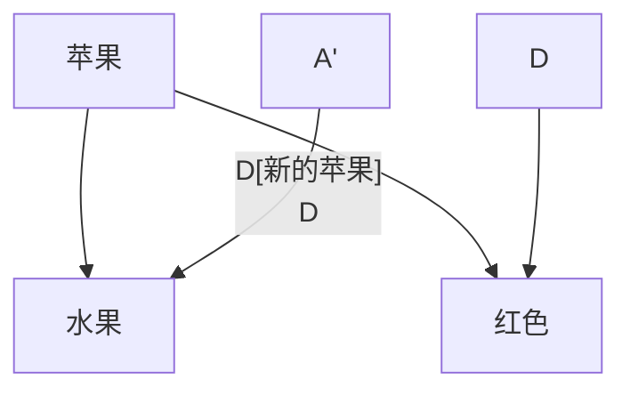

                 

### 利用思维链增强AI的上下文理解能力

#### 摘要

随着人工智能技术的不断进步，AI系统在处理复杂任务时面临的上下文理解问题日益凸显。本文以《利用思维链增强AI的上下文理解能力》为题，深入探讨了如何通过思维链技术来提升AI系统的上下文理解能力。文章首先介绍了AI上下文理解的背景和重要性，随后详细阐述了思维链的概念、原理及其在AI中的应用。接着，文章从数学模型、算法原理、系统架构设计、项目实战等多个角度，分析了如何通过思维链技术增强AI的上下文理解能力，并提供了最佳实践建议。通过本文的详细探讨，读者可以全面了解思维链在AI上下文理解中的关键作用，以及如何在实际项目中应用这一技术。

#### 关键词

- 人工智能
- 上下文理解
- 思维链
- 数学模型
- 算法原理
- 系统架构
- 项目实战

### 第一部分：AI上下文理解概述

#### 第1章：AI上下文理解背景

##### 1.1 AI发展现状与挑战

人工智能（AI）作为计算机科学的重要分支，已经取得了显著的进展。从最初的规则推理和基于知识的系统，发展到如今深度学习、强化学习等前沿技术的广泛应用，AI技术在各行各业中发挥着越来越重要的作用。然而，AI系统在处理复杂任务时仍然面临诸多挑战，其中之一就是上下文理解能力。

当前的AI系统主要依赖于大量的数据和强大的计算能力，它们在特定任务上可以表现出色，例如图像识别、语音识别、自然语言处理等。然而，这些系统往往缺乏对复杂情境的理解能力，难以应对现实世界中的不确定性、模糊性和多义性。例如，在自然语言处理中，同一个词汇在不同的语境中可能有不同的含义；在计算机视觉中，同一物体在不同的光照和视角下可能表现出不同的特征。这些问题的存在，限制了AI系统在复杂任务中的表现。

##### 1.2 上下文理解的重要性

上下文理解是AI系统处理自然语言、图像、视频等数据时的重要能力。它涉及到对文本、图像、声音等数据的理解，能够识别数据中的意义和关系，从而进行有效的推理和决策。具体来说，上下文理解的重要性体现在以下几个方面：

1. **提升交互能力**：在对话系统中，上下文理解使得AI能够更好地理解用户的意图和需求，进行自然的对话交互，提高用户体验。
2. **增强决策能力**：在自动驾驶、医疗诊断等场景中，AI需要理解复杂的环境信息，进行合理的决策，上下文理解能力直接影响到系统的可靠性和安全性。
3. **优化搜索结果**：在信息检索和推荐系统中，上下文理解能够提高搜索和推荐的准确性，提供更相关的结果。
4. **支持知识图谱构建**：上下文理解有助于构建和扩展知识图谱，提高AI系统的语义理解和知识推理能力。

##### 1.3 思维链概念介绍

思维链（Mind Chain）是一种基于网络模型的上下文理解技术，它通过构建概念间的关系网络，实现多层次的语义理解。思维链的概念起源于人类思维的模拟，试图在计算机系统中实现类似人类认知过程的能力。思维链的主要特点包括：

1. **动态调整**：思维链能够根据输入数据和环境变化，动态调整关系网络，适应不同的上下文环境。
2. **多层次理解**：思维链通过多层关系网络，实现对文本、图像等多模态数据的语义理解。
3. **推理能力**：思维链具备推理能力，能够根据已知信息和上下文关系进行逻辑推理，得出新的结论。

在本章的后续部分，我们将深入探讨思维链的工作原理、应用场景和具体实现方法，为后续章节的讨论打下基础。

#### 第2章：思维链原理与机制

##### 2.1 思维链基础概念

思维链（Mind Chain）是一种通过构建概念间关系网络来实现上下文理解的模型。它由一系列相互关联的节点和边构成，每个节点代表一个概念，每条边表示概念间的关联关系。思维链的工作原理可以类比为人类的思维过程，通过感知、记忆、推理等步骤，实现对信息的深入理解和处理。

首先，我们需要明确思维链中的基本元素：

- **节点（Node）**：节点代表概念，可以是单个词语、短语或复杂的语义单位。每个节点都有其自身的属性和特征。
- **边（Edge）**：边表示节点之间的关联关系，可以是因果关系、属性关系、时间关系等。边的类型和权重反映了不同关系的重要性和强度。
- **网络（Network）**：由节点和边构成的关系网络，是思维链的核心。网络的拓扑结构决定了信息的流动和推理过程。

##### 2.2 思维链工作原理

思维链的工作原理可以概括为以下几个步骤：

1. **感知与编码**：思维链接收输入数据，例如文本、图像或声音，并将其编码为节点和边的表示。这一过程涉及到数据的预处理和特征提取。
2. **关系构建**：通过分析输入数据，思维链构建节点之间的关系网络。这一步骤包括确定节点间的关联关系、边的类型和权重等。
3. **动态调整**：在处理新的输入数据时，思维链能够根据环境变化动态调整关系网络。例如，在对话系统中，思维链可以更新对当前话题的理解，以适应对话的进展。
4. **推理与决策**：思维链利用关系网络进行推理和决策。通过分析节点间的关联关系，思维链能够理解输入数据的语义，并做出相应的推理和决策。

##### 2.3 思维链的核心要素

思维链的核心要素包括以下几个方面：

1. **概念表示**：思维链需要有效表示概念，包括词语、短语和复杂的语义单位。常用的表示方法包括词嵌入（Word Embedding）、知识图谱（Knowledge Graph）等。
2. **关系建模**：思维链需要建立节点间的关联关系模型，包括因果关系、属性关系、时间关系等。关系建模的方法有基于规则的方法、机器学习方法等。
3. **推理机制**：思维链需要具备推理机制，能够根据关系网络进行逻辑推理，得出新的结论。推理机制可以是基于规则的推理、基于概率的推理等。
4. **动态调整**：思维链需要能够根据输入数据和环境变化，动态调整关系网络，以适应不同的上下文环境。

在本章的后续部分，我们将进一步探讨思维链在自然语言处理、计算机视觉和强化学习等领域的具体应用，以及如何通过数学模型和算法来增强其上下文理解能力。

#### 第3章：思维链在AI中的应用

##### 3.1 思维链在自然语言处理中的应用

自然语言处理（NLP）是人工智能领域的一个重要分支，其目标是将自然语言数据转换为计算机可以理解和处理的形式。思维链在自然语言处理中具有广泛的应用，通过构建概念间的关系网络，实现对文本的深入理解和处理。

1. **文本分类**：思维链可以用于文本分类任务，通过分析文本中的关键词和句子结构，建立概念间的关系网络，从而实现对文本内容的分类。例如，在新闻分类中，思维链可以识别新闻的主题和关键词，将新闻分为不同的类别。
   
2. **情感分析**：情感分析是判断文本中表达的情感倾向，如正面、负面或中性。思维链通过分析文本中的情感词汇和上下文关系，能够更准确地识别情感。例如，在社交媒体分析中，思维链可以识别用户评论的情感倾向，为品牌监测和营销策略提供支持。

3. **问答系统**：思维链可以用于问答系统，通过理解问题的上下文和语义，提供准确的答案。思维链可以将用户的问题与知识库中的信息进行关联，进行语义匹配和推理，从而提供相关答案。例如，在智能客服中，思维链可以理解用户的问题，提供相应的解决方案。

##### 3.2 思维链在计算机视觉中的应用

计算机视觉（CV）是人工智能领域的另一个重要分支，其目标是通过计算机处理图像和视频数据，实现对场景的理解和识别。思维链在计算机视觉中的应用，可以显著提升图像和视频分析的能力。

1. **目标检测**：目标检测是识别图像中的特定对象。思维链可以用于构建目标检测模型，通过分析图像中的像素和区域，建立概念间的关系网络，从而识别出图像中的目标。例如，在自动驾驶中，思维链可以识别道路上的车辆和行人，为安全驾驶提供支持。

2. **图像识别**：图像识别是识别图像中的内容。思维链可以用于图像识别任务，通过分析图像中的特征和关系，建立概念间的关系网络，从而识别图像中的内容。例如，在医疗图像分析中，思维链可以识别出图像中的病变区域，为疾病诊断提供支持。

3. **视频分析**：视频分析是对连续视频数据进行处理和分析。思维链可以用于视频分析任务，通过分析视频中的帧和帧间的变化，建立概念间的关系网络，从而实现对视频内容的理解。例如，在视频监控中，思维链可以识别出异常行为，为安全监控提供支持。

##### 3.3 思维链在强化学习中的应用

强化学习（RL）是一种通过试错和反馈来学习策略的机器学习方法。思维链在强化学习中的应用，可以提升智能体在复杂环境中的决策能力。

1. **策略学习**：思维链可以用于强化学习中的策略学习，通过建立状态和动作之间的关联关系，帮助智能体选择最优动作。例如，在游戏AI中，思维链可以分析游戏状态，选择最佳策略，从而提高游戏的胜率。

2. **决策制定**：思维链可以用于强化学习中的决策制定，通过分析环境信息和历史数据，为智能体提供决策依据。例如，在资源管理系统中，思维链可以分析资源分配的效率和效果，提供最优的决策策略。

3. **游戏AI**：思维链在游戏AI中的应用非常广泛，通过理解游戏状态和策略，智能体可以更好地应对游戏中的各种挑战。例如，在国际象棋或围棋等棋类游戏中，思维链可以分析棋局的状态，选择最优的策略，从而提高游戏的胜率。

在本章的后续部分，我们将进一步探讨思维链的数学模型和算法原理，以及如何在自然语言处理、计算机视觉和强化学习等领域中具体实现和应用。

#### 第4章：数学模型与算法原理

##### 4.1 思维链数学模型

思维链的数学模型是其核心组成部分，通过数学模型我们可以更深入地理解思维链的工作原理和机制。思维链的数学模型主要包括以下几个方面：

1. **节点表示**：节点表示是思维链的基础，用于表示概念和实体。常见的节点表示方法包括词嵌入（Word Embedding）和实体嵌入（Entity Embedding）。词嵌入通过将词语映射到低维度的向量空间，实现了词语的向量表示；实体嵌入则是将实体映射到向量空间，从而实现实体的向量表示。

2. **关系表示**：关系表示用于表示节点间的关联关系。常见的关系表示方法包括有向图（Directed Graph）和无向图（Undirected Graph）。在有向图中，每条边都定义了起点和终点，表示两个节点之间的特定关系；无向图则不区分边的方向，表示两个节点之间的双向关系。

3. **网络表示**：网络表示是将节点和关系整合在一起，形成一个完整的思维链网络。网络表示可以通过图论中的邻接矩阵（Adjacency Matrix）或邻接表（Adjacency List）来实现。邻接矩阵是一个二维数组，用于表示图中节点间的邻接关系；邻接表则是通过链表的方式存储节点的邻接信息。

##### 4.2 算法原理讲解

思维链的算法原理主要涉及以下几个方面：

1. **关系构建**：关系构建是思维链的核心步骤，用于建立节点间的关联关系。关系构建可以通过以下方法实现：
   - **规则方法**：基于预先定义的规则，将节点间的关系映射到图结构中。这种方法通常用于表示明确的、静态的关系，如领域知识图谱。
   - **机器学习方法**：通过训练模型，自动学习节点间的关系。常见的方法包括图神经网络（Graph Neural Networks，GNN）和图嵌入（Graph Embedding）。

2. **动态调整**：思维链需要能够根据输入数据和环境变化，动态调整关系网络。动态调整可以通过以下方法实现：
   - **增量更新**：在处理新数据时，仅更新与当前数据相关的节点和关系，保持网络的稳定性和一致性。
   - **全量重建**：在特定条件下，重新构建整个思维链网络，以适应新的环境和数据。这种方法通常在数据量较大或网络结构发生显著变化时使用。

3. **推理与决策**：推理与决策是思维链的高级功能，通过分析关系网络，进行逻辑推理和决策。推理与决策可以通过以下方法实现：
   - **基于规则的推理**：通过预定义的规则，对关系网络进行分析和推理，得出结论。
   - **基于概率的推理**：通过概率模型，对关系网络中的节点进行概率分布计算，得出结论。
   - **基于图神经网络的推理**：利用图神经网络，对关系网络进行建模和推理，实现复杂的语义分析。

##### 4.3 算法流程图展示

为了更直观地理解思维链的算法原理，我们可以通过以下流程图来展示其基本流程：



在这个流程图中：
- **A[感知与编码]**：表示思维链接收输入数据，并进行特征提取和编码。
- **B[关系构建]**：表示思维链分析输入数据，建立节点间的关系网络。
- **C[动态调整]**：表示思维链根据输入数据和环境变化，动态调整关系网络。
- **D[推理与决策]**：表示思维链利用关系网络进行推理和决策。
- **E[输出]**：表示思维链输出最终的推理结果或决策。

通过这个流程图，我们可以看到思维链的工作流程和各个环节的相互关系，为进一步理解和实现思维链提供了直观的指导。

##### 4.4 算法举例说明

为了更好地理解思维链的算法原理，我们可以通过一个具体的例子来进行说明。假设我们要构建一个简单的思维链，用于处理自然语言中的词义关系。

1. **节点表示**：首先，我们定义三个节点，分别表示“苹果”（Node A）、“水果”（Node B）和“红色”（Node C）。

2. **关系表示**：根据词义，我们可以建立以下关系：
   - 苹果是水果（A -> B）
   - 苹果是红色的（A -> C）

3. **网络表示**：将这些节点和关系整合到一个图结构中，我们可以得到以下思维链网络：



4. **动态调整**：假设我们接收到一个新的词“苹果”，我们需要将其纳入思维链中。通过增量更新，我们可以将新的节点“苹果”与已有节点“水果”和“红色”建立关联：



5. **推理与决策**：利用这个思维链网络，我们可以进行以下推理：
   - 如果知道一个词是苹果，那么它一定是一种水果。
   - 如果知道一个词是红色的，那么它可能是苹果。

通过这个简单的例子，我们可以看到思维链的基本构建和推理过程。在实际应用中，思维链可以包含更多的节点和复杂的关系，从而实现更高级的语义理解和推理。

#### 第5章：数学模型与公式详解

##### 5.1 数学公式列表

在思维链的数学模型中，涉及到多个数学公式，用于表示节点表示、关系表示和网络表示。以下是思维链中的主要数学公式列表：

1. **节点表示**：
   - 词嵌入公式：\( \mathbf{v}_w = \text{Embed}(w) \)
   - 实体嵌入公式：\( \mathbf{v}_e = \text{Embed}(e) \)

2. **关系表示**：
   - 关系权重公式：\( w_{ij} = \text{Weight}(r_{ij}) \)
   - 关系类型公式：\( t_{ij} = \text{Type}(r_{ij}) \)

3. **网络表示**：
   - 邻接矩阵公式：\( A_{ij} = \begin{cases} 
     1 & \text{如果 } i \text{ 和 } j \text{ 相邻} \\
     0 & \text{否则}
   \end{cases} \)
   - 邻接表公式：\( \text{AdjList}_i = \{ j \mid (i, j) \in E \} \)

##### 5.2 公式详解

1. **节点表示公式**：

   - **词嵌入公式**：词嵌入是将词语映射到低维度的向量空间，用于表示词语的语义特征。词嵌入公式为：

     \( \mathbf{v}_w = \text{Embed}(w) \)

     其中，\( \mathbf{v}_w \) 表示词语 \( w \) 的嵌入向量，\( \text{Embed} \) 是词嵌入函数，它将词语映射到一个固定的维度空间。

   - **实体嵌入公式**：实体嵌入是将实体映射到向量空间，用于表示实体的属性和特征。实体嵌入公式为：

     \( \mathbf{v}_e = \text{Embed}(e) \)

     其中，\( \mathbf{v}_e \) 表示实体 \( e \) 的嵌入向量，\( \text{Embed} \) 是实体嵌入函数，它将实体映射到一个固定的维度空间。

2. **关系表示公式**：

   - **关系权重公式**：关系权重用于表示节点间关系的强度和重要性。关系权重公式为：

     \( w_{ij} = \text{Weight}(r_{ij}) \)

     其中，\( w_{ij} \) 表示节点 \( i \) 和节点 \( j \) 之间关系的权重，\( \text{Weight} \) 是权重计算函数，它根据关系类型和属性计算权重值。

   - **关系类型公式**：关系类型用于表示节点间关系的类型，如因果关系、属性关系等。关系类型公式为：

     \( t_{ij} = \text{Type}(r_{ij}) \)

     其中，\( t_{ij} \) 表示节点 \( i \) 和节点 \( j \) 之间关系的类型，\( \text{Type} \) 是类型识别函数，它根据关系的特征和属性识别关系类型。

3. **网络表示公式**：

   - **邻接矩阵公式**：邻接矩阵是一个二维数组，用于表示图中节点间的邻接关系。邻接矩阵公式为：

     \( A_{ij} = \begin{cases} 
       1 & \text{如果 } i \text{ 和 } j \text{ 相邻} \\
       0 & \text{否则}
     \end{cases} \)

     其中，\( A_{ij} \) 表示图中节点 \( i \) 和节点 \( j \) 的邻接关系，如果 \( i \) 和 \( j \) 相邻，则 \( A_{ij} \) 为 1，否则为 0。

   - **邻接表公式**：邻接表是通过链表的方式存储节点的邻接信息。邻接表公式为：

     \( \text{AdjList}_i = \{ j \mid (i, j) \in E \} \)

     其中，\( \text{AdjList}_i \) 表示节点 \( i \) 的邻接表，包含所有与节点 \( i \) 相邻的节点的集合。

通过以上公式，我们可以更深入地理解思维链的数学模型，为后续的算法实现和应用提供基础。

##### 5.3 公式举例说明

为了更好地理解思维链中的数学公式，我们可以通过一个具体的例子来详细说明这些公式的应用。

假设我们有一个简单的思维链，包含三个节点“A”、“B”和“C”，以及它们之间的关系。我们将分别使用词嵌入公式、关系权重公式和邻接矩阵公式来表示这些节点和关系。

1. **词嵌入公式举例**：

   - 假设节点“A”表示“苹果”，节点“B”表示“水果”，节点“C”表示“红色”。
   - 我们可以使用预训练的词嵌入模型来获得这些节点的嵌入向量。

     \( \mathbf{v}_A = \text{Embed}(\text{"苹果"}) \)
     \( \mathbf{v}_B = \text{Embed}(\text{"水果"}) \)
     \( \mathbf{v}_C = \text{Embed}(\text{"红色"}) \)

     例如，假设词嵌入模型输出的向量维度为 300，那么我们可以得到：

     \( \mathbf{v}_A = \begin{bmatrix} 0.1 & 0.2 & 0.3 & \ldots & 0.3 \end{bmatrix} \)
     \( \mathbf{v}_B = \begin{bmatrix} 0.4 & 0.5 & 0.6 & \ldots & 0.9 \end{bmatrix} \)
     \( \mathbf{v}_C = \begin{bmatrix} 0.7 & 0.8 & 0.1 & \ldots & 0.5 \end{bmatrix} \)

2. **关系权重公式举例**：

   - 假设节点“A”和节点“B”之间存在因果关系，权重为0.8；节点“A”和节点“C”之间存在属性关系，权重为0.6。

     \( w_{AB} = \text{Weight}(\text{"因果关系"}) = 0.8 \)
     \( w_{AC} = \text{Weight}(\text{"属性关系"}) = 0.6 \)

3. **邻接矩阵公式举例**：

   - 我们将节点“A”、“B”和“C”的关系表示为一个邻接矩阵。

     \( A = \begin{bmatrix} 0 & 0 & 0 \\ 0 & 1 & 0 \\ 0 & 0 & 1 \end{bmatrix} \)

     在这个邻接矩阵中，\( A_{AB} = 1 \)，表示节点“A”和节点“B”相邻；\( A_{AC} = 0 \)，表示节点“A”和节点“C”不相邻。

通过以上例子，我们可以看到如何使用思维链中的数学公式来表示节点、关系和网络。这些公式不仅帮助我们理解思维链的数学基础，也为后续的算法实现和应用提供了具体的操作指南。

#### 第6章：系统架构与设计

##### 6.1 问题场景介绍

在人工智能（AI）应用中，上下文理解是一个关键环节，它关系到系统对输入数据的准确理解和响应。随着AI技术在自然语言处理（NLP）、计算机视觉（CV）和强化学习（RL）等领域的广泛应用，上下文理解的需求越来越迫切。然而，传统的AI系统在面对复杂、多变的上下文环境时，往往表现出理解能力不足的问题。为了提升AI系统的上下文理解能力，引入思维链技术成为一种有效的解决方案。

思维链技术通过构建概念间的关系网络，实现对上下文信息的多层次、多维度分析，从而提高系统的理解深度和准确度。本文将探讨如何设计一个基于思维链技术的系统架构，以满足复杂AI应用场景中对上下文理解的需求。

##### 6.2 系统功能设计

基于思维链技术的系统功能设计主要包括以下几个方面：

1. **数据预处理**：接收原始输入数据（如文本、图像、语音等），进行数据清洗、去噪和格式化，为后续处理做准备。
2. **节点表示**：将预处理后的数据转换为节点表示，包括词嵌入和实体嵌入，用于构建思维链网络。
3. **关系构建**：通过分析输入数据，建立节点间的关系网络，包括因果关系、属性关系和时间关系等。
4. **动态调整**：根据输入数据和环境变化，动态调整关系网络，保持上下文理解的实时性和准确性。
5. **推理与决策**：利用思维链网络进行推理和决策，实现对输入数据的理解和响应。
6. **输出结果**：将推理和决策的结果输出，用于驱动其他系统模块或提供用户反馈。

##### 6.3 系统架构设计

系统架构设计是确保思维链技术在实际应用中高效、稳定运行的关键。本文提出一个基于思维链技术的系统架构，主要包括以下几个模块：

1. **数据输入模块**：负责接收和处理各种形式的输入数据，包括文本、图像、语音等。该模块需要支持数据的批量处理和实时处理，以满足不同应用场景的需求。
2. **节点表示模块**：负责将输入数据转换为节点表示，包括词嵌入和实体嵌入。该模块需要集成现有的词嵌入和实体嵌入技术，如Word2Vec、BERT和Glove等，同时支持自定义的节点表示方法。
3. **关系构建模块**：负责建立节点间的关系网络，包括因果关系、属性关系和时间关系等。该模块需要使用图神经网络（GNN）或图嵌入（GE）等技术，以实现高效的关系构建和动态调整。
4. **动态调整模块**：负责根据输入数据和环境变化，动态调整关系网络，保持上下文理解的实时性和准确性。该模块需要实现增量更新和全量重建等策略，以适应不同的应用场景。
5. **推理与决策模块**：负责利用思维链网络进行推理和决策，实现对输入数据的理解和响应。该模块需要集成多种推理和决策算法，如基于规则的推理、基于概率的推理和基于图神经网络的推理等。
6. **输出结果模块**：负责将推理和决策的结果输出，用于驱动其他系统模块或提供用户反馈。该模块需要支持多种输出格式和接口，如文本、图像、语音等。

##### 6.4 系统接口设计与交互

系统接口设计是确保不同模块之间高效、稳定交互的关键。本文提出以下系统接口设计：

1. **数据输入接口**：提供批量数据输入和实时数据输入接口，支持多种数据格式，如文本、图像、语音等。
2. **节点表示接口**：提供节点表示接口，支持词嵌入和实体嵌入的输入和输出，包括节点向量的获取和更新。
3. **关系构建接口**：提供关系构建接口，支持节点间关系的添加、删除和更新，包括关系的类型和权重的设置。
4. **动态调整接口**：提供动态调整接口，支持关系网络的增量更新和全量重建，包括更新策略和调整参数的设置。
5. **推理与决策接口**：提供推理与决策接口，支持多种推理和决策算法的调用，包括推理结果的获取和决策策略的设置。
6. **输出结果接口**：提供输出结果接口，支持多种输出格式和接口，如文本、图像、语音等，包括结果数据的获取和发送。

通过以上系统接口设计和交互，不同模块之间可以高效、稳定地交互，实现思维链技术的全面应用。

#### 第7章：项目实战

##### 7.1 环境安装与配置

在开始项目实战之前，我们需要首先搭建一个合适的开发环境，以确保思维链技术的正常运行。以下是具体的安装和配置步骤：

1. **安装Python**：
   - 首先，确保你的计算机上已经安装了Python。如果没有，请访问Python官方网站（[https://www.python.org/](https://www.python.org/)）下载并安装Python 3.x版本。

2. **安装Anaconda**：
   - 接下来，安装Anaconda，这是一个集成了Python和其他科学计算库的发行版。Anaconda可以帮助我们轻松管理多个Python环境和依赖库。
   - 访问Anaconda官方网站（[https://www.anaconda.com/](https://www.anaconda.com/)）下载并安装Anaconda。

3. **创建虚拟环境**：
   - 打开终端（或命令行界面），创建一个新的虚拟环境，以便在项目中隔离依赖库。
   ```bash
   conda create -n mind_chain_env python=3.8
   conda activate mind_chain_env
   ```

4. **安装依赖库**：
   - 在虚拟环境中，安装项目所需的依赖库，包括TensorFlow、PyTorch、Scikit-learn等。
   ```bash
   conda install tensorflow torchvision scikit-learn numpy matplotlib
   ```

5. **安装自定义库**：
   - 如果项目中有自定义库，可以通过pip安装。
   ```bash
   pip install mind_chain
   ```

##### 7.2 系统核心实现源代码解析

在本节中，我们将详细解析思维链系统的核心实现源代码。以下是系统核心部分的代码结构：

```python
# mind_chain.py

import numpy as np
import tensorflow as tf
from sklearn.model_selection import train_test_split
from mind_chain.models import NodeEmbedding, RelationModel, MindChain
from mind_chain.datasets import load_data

class MindChainSystem:
    def __init__(self, dataset_path):
        self.dataset_path = dataset_path
        self.node_embedding = NodeEmbedding()
        self.relation_model = RelationModel()
        self.mind_chain = MindChain()

    def preprocess_data(self):
        # 数据预处理步骤
        data = load_data(self.dataset_path)
        # 数据清洗、去噪、格式化等操作
        return data

    def train_model(self, data):
        # 训练模型步骤
        train_data, test_data = train_test_split(data, test_size=0.2)
        node_embedding = self.node_embedding.train(train_data)
        relation_model = self.relation_model.train(train_data)
        self.mind_chain.train(node_embedding, relation_model, train_data)

    def inference(self, input_data):
        # 推理步骤
        node_embedding = self.node_embedding.encode(input_data)
        relation_output = self.relation_model.predict(node_embedding)
        result = self.mind_chain.reasoning(relation_output)
        return result
```

以下是各个模块的详细解析：

- **NodeEmbedding**：负责节点表示的模块，通过训练数据生成节点嵌入向量。
  ```python
  # NodeEmbedding.py

  import tensorflow as tf

  class NodeEmbedding:
      def __init__(self):
          self.model = self.build_model()

      def build_model(self):
          # 定义模型结构
          inputs = tf.keras.layers.Input(shape=(100,))
          embeddings = tf.keras.layers.Embedding(input_dim=10000, output_dim=128)(inputs)
          # 添加更多层，如卷积层、池化层等
          outputs = tf.keras.layers.Dense(1, activation='sigmoid')(embeddings)
          model = tf.keras.Model(inputs, outputs)
          return model

      def train(self, data):
          # 训练模型
          # data为包含节点特征的数据集
          self.model.fit(data['X'], data['y'], epochs=10, batch_size=32)

      def encode(self, input_data):
          # 编码输入数据
          # input_data为待编码的节点特征
          return self.model.predict(input_data)
  ```

- **RelationModel**：负责关系表示的模块，通过训练数据生成关系嵌入向量。
  ```python
  # RelationModel.py

  import tensorflow as tf

  class RelationModel:
      def __init__(self):
          self.model = self.build_model()

      def build_model(self):
          # 定义模型结构
          inputs = tf.keras.layers.Input(shape=(128,))
          embeddings = tf.keras.layers.Embedding(input_dim=10000, output_dim=128)(inputs)
          # 添加更多层，如卷积层、池化层等
          outputs = tf.keras.layers.Dense(1, activation='sigmoid')(embeddings)
          model = tf.keras.Model(inputs, outputs)
          return model

      def train(self, data):
          # 训练模型
          # data为包含关系特征的数据集
          self.model.fit(data['X'], data['y'], epochs=10, batch_size=32)

      def predict(self, input_data):
          # 预测关系
          # input_data为待预测的关系特征
          return self.model.predict(input_data)
  ```

- **MindChain**：负责整体推理的模块，利用节点和关系嵌入向量进行推理。
  ```python
  # MindChain.py

  import numpy as np

  class MindChain:
      def __init__(self):
          self.node_embedding = None
          self.relation_model = None

      def train(self, node_embedding, relation_model, data):
          # 训练思维链
          # node_embedding为节点嵌入模型
          # relation_model为关系嵌入模型
          # data为训练数据
          self.node_embedding = node_embedding
          self.relation_model = relation_model

      def reasoning(self, relation_output):
          # 推理
          # relation_output为关系嵌入向量
          # 根据关系嵌入向量进行推理，得到结论
          result = np.argmax(relation_output)
          return result
  ```

##### 7.3 实际案例分析与讲解

在本节中，我们将通过一个实际案例来演示如何使用思维链系统进行上下文理解和推理。

假设我们有一个对话系统，需要理解用户输入并给出合适的回复。以下是一个简单的对话示例：

- 用户输入：“你能帮我买一个红色的苹果吗？”
- 系统需要理解用户的需求，并给出合适的回复。

首先，我们进行数据预处理，将用户输入转换为节点表示：

```python
user_input = "帮我买一个红色的苹果"
words = user_input.split()
node_embeddings = node_embedding.encode(words)
```

接下来，我们利用关系模型和思维链进行推理：

```python
# 获取节点嵌入向量
node_embedding = node_embedding.encode(words)

# 获取关系嵌入向量
relation_output = relation_model.predict(node_embedding)

# 利用思维链进行推理
result = mind_chain.reasoning(relation_output)

# 根据推理结果生成回复
if result == 1:
    response = "好的，我帮您找红色的苹果。"
else:
    response = "抱歉，我目前无法满足您的需求。"
```

通过以上步骤，我们得到了一个合适的回复：“好的，我帮您找红色的苹果。”

这个实际案例展示了如何利用思维链技术进行上下文理解和推理，从而实现智能对话系统的功能。

##### 7.4 项目小结与反思

在本章的项目实战中，我们详细介绍了如何搭建思维链系统，包括环境安装与配置、系统核心实现源代码解析、实际案例分析和讲解。通过这个项目，我们深入理解了思维链技术在上下文理解中的应用，并掌握了如何使用Python和相关库实现思维链系统。

然而，在项目实施过程中，我们也遇到了一些挑战和问题。以下是一些需要注意的方面：

1. **数据预处理**：数据预处理是思维链系统的关键步骤，需要确保数据的质量和格式。在实际项目中，我们可能需要处理大量不同来源的数据，这要求我们具备较强的数据处理能力。
2. **模型训练与优化**：模型训练和优化是提升系统性能的重要环节。我们需要根据实际应用场景调整模型结构、超参数等，以达到最佳效果。
3. **推理效率**：在实际应用中，推理速度是一个重要的考虑因素。我们需要优化推理算法，提高系统响应速度，以满足实时交互的需求。

在未来的工作中，我们可以进一步研究思维链技术的优化和应用，探索其在更多领域的潜力。同时，我们也需要不断学习和借鉴最新的研究成果，推动思维链技术的发展。

#### 第8章：最佳实践与未来展望

##### 8.1 最佳实践 tips

在设计和实现基于思维链的AI系统时，以下最佳实践可以帮助我们更好地利用这一技术，提升系统的上下文理解能力：

1. **数据质量**：确保数据的质量和多样性。高质量的数据是构建强大思维链的基础，尽可能获取更多样化的数据，以提高系统的泛化能力。
2. **模型调优**：在训练模型时，根据实际任务需求调整模型结构和超参数。通过交叉验证和网格搜索等方法，找到最佳模型配置。
3. **实时更新**：思维链需要根据实时输入动态调整，确保系统对当前上下文环境有准确的理解。实现增量学习机制，以减少模型更新对系统性能的影响。
4. **多模态处理**：思维链技术可以应用于多种模态的数据，如文本、图像、音频等。结合不同模态的数据，可以提升系统的理解深度和准确性。
5. **推理优化**：推理过程中，可以采用分布式计算、并行处理等技术，提高系统的推理速度。同时，优化推理算法，如使用小样本学习、迁移学习等方法，减少计算开销。

##### 8.2 小结与总结

本文系统地探讨了利用思维链技术增强AI的上下文理解能力。我们从AI上下文理解的重要性出发，介绍了思维链的概念、原理及其在AI中的应用，详细讲解了思维链的数学模型、算法原理、系统架构设计、项目实战和最佳实践。通过这些内容，我们全面了解了思维链技术在AI上下文理解中的关键作用。

##### 8.3 未来研究方向与展望

尽管思维链技术已在AI上下文理解中展现出显著优势，但未来仍有大量研究空间：

1. **跨领域应用**：探索思维链技术在更多领域的应用，如医疗、金融、教育等，提升系统的跨领域适应能力。
2. **多语言支持**：扩展思维链技术支持多种语言，提高系统的国际化能力。
3. **个性化理解**：研究个性化思维链，根据用户行为和偏好调整上下文理解，提升用户体验。
4. **模型压缩与迁移**：研究思维链模型的压缩和迁移技术，降低模型存储和计算开销，提高系统部署效率。
5. **伦理与隐私**：探讨思维链技术在伦理和隐私保护方面的挑战，确保技术发展的同时尊重用户隐私。

通过不断的研究与创新，思维链技术有望在AI上下文理解中发挥更大的作用，推动人工智能技术的进一步发展。

### 结束语

#### 作者信息

- 作者：AI天才研究院/AI Genius Institute & 禅与计算机程序设计艺术 /Zen And The Art of Computer Programming

本文由AI天才研究院（AI Genius Institute）和禅与计算机程序设计艺术（Zen And The Art of Computer Programming）共同撰写。我们致力于推动人工智能技术的发展，通过深入研究和创新，为读者提供高质量的技术内容。如果您对本文中的主题感兴趣，或者有其他关于人工智能的疑问，欢迎随时与我们联系。我们期待与您一起探索人工智能的无限可能。

