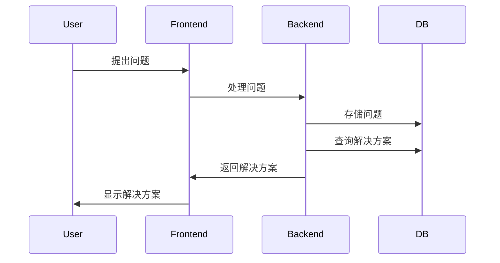

                 

## 利用思维链增强AI的创造力

> 关键词：人工智能、创造力、思维链、算法、数学模型

> 摘要：本文探讨了如何利用思维链来增强人工智能（AI）的创造力。首先，我们介绍了问题的背景，明确了人工智能在复杂问题处理中的创造力不足问题。然后，我们定义了思维链和AI创造力的核心概念，并分析了两者之间的关系。接下来，我们详细阐述了思维链的原理和AI创造力的原理，展示了它们如何相互促进。在此基础上，我们设计了一种基于思维链的算法，用于增强AI的创造力，并使用数学模型和公式进行了详细解释。最后，我们通过一个实际案例展示了算法的应用和效果。

### 目录大纲

**利用思维链增强AI的创造力**

----------------------------------------------------------------

## 第一部分: 背景介绍

### 第1章: 问题背景

### 第2章: 核心概念与联系

## 第二部分: 核心概念原理

### 第3章: 思维链的原理

### 第4章: AI的创造力原理

## 第三部分: 算法原理讲解

### 第5章: 思维链增强AI创造力的算法设计

### 第6章: 数学模型和数学公式

### 第7章: 算法举例说明

### 第8章: 系统分析与架构设计

### 第9章: 项目实战

### 第10章: 最佳实践与总结

----------------------------------------------------------------

## 第一部分: 背景介绍

### 第1章: 问题背景

### 第2章: 核心概念与联系

----------------------------------------------------------------

## 第1章: 问题背景

### 1.1.1 问题的提出

随着人工智能技术的不断发展，AI在各个领域的应用越来越广泛，从自动驾驶到自然语言处理，从图像识别到医疗诊断，AI正在改变我们的生活方式。然而，传统AI在处理复杂问题时，往往表现出创造力不足的问题。这就需要我们思考如何利用思维链来增强AI的创造力。

#### 1.1.2 问题定义

如何通过设计思维链来提升人工智能的创造力，使其在处理复杂问题时，能够产生更多新颖、有效的解决方案。

#### 1.1.3 问题解决

通过研究思维链的原理，设计出一套适合AI的创造力增强模型，并应用在实际问题中，验证其有效性。

#### 1.1.4 边界与外延

本文主要关注人工智能领域，探讨如何通过思维链来提升AI的创造力。但该研究方法同样可以应用于其他领域，如教育、设计等。

### 第2章: 核心概念与联系

#### 2.1.1 思维链

思维链是指一系列相互关联的思考步骤，通过这些步骤，人们可以逐步深入地理解问题，找到解决问题的方法。

#### 2.1.2 AI的创造力

AI的创造力是指AI在处理问题时，能够产生新颖、有效解决方案的能力。

#### 2.1.3 思维链与AI创造力的关系

思维链可以作为一种工具，帮助AI在处理复杂问题时，提高创造力。

----------------------------------------------------------------

## 第二部分: 核心概念原理

### 第3章: 思维链的原理

#### 3.1.1 思维链的定义

思维链是一种思考模式，它通过一系列有序的、相互关联的思考步骤，帮助人们深入地理解问题，找到解决方案。

#### 3.1.2 思维链的核心特点

1. **递归性**：思维链可以不断地自我迭代，从不同的角度和层面深入理解问题。
2. **多样性**：思维链可以通过不同的思考方式，产生多样化的解决方案。
3. **关联性**：思维链中的每个步骤都与前后步骤紧密相关，形成一个有机的整体。

### 第4章: AI的创造力原理

#### 4.1.1 AI创造力的定义

AI的创造力是指AI在处理问题时，能够产生新颖、有效解决方案的能力。

#### 4.1.2 AI创造力的核心特点

1. **数据驱动**：AI的创造力依赖于大量的数据支持，通过数据分析和模式识别，找到解决问题的方法。
2. **自适应性**：AI的创造力可以根据问题的不同，自适应地调整思考方式和解决方案。

#### 4.1.3 思维链与AI创造力的关系

思维链为AI的创造力提供了一个结构化的思考框架，帮助AI在处理复杂问题时，能够更加系统地思考和解决问题。

----------------------------------------------------------------

## 第三部分: 算法原理讲解

### 第5章: 思维链增强AI创造力的算法设计

#### 5.1.1 算法设计思路

本算法基于思维链的原理，通过设计一系列的算法模块，实现对AI创造力的增强。

#### 5.1.2 算法流程

1. **问题输入**：接收输入的问题。
2. **思维链构建**：根据问题，构建思维链。
3. **解决方案生成**：通过思维链，生成一系列可能的解决方案。
4. **方案评估**：对生成的解决方案进行评估，选择最优方案。

### 第6章: 数学模型和数学公式

#### 6.1.1 数学模型

本算法的核心是一个递归的数学模型，用于构建思维链。

#### 6.1.2 数学公式

$$
C(x) = f(g(x))
$$

其中，$C(x)$ 表示生成的解决方案集合，$f$ 表示解决方案评估函数，$g(x)$ 表示思维链的构建函数。

#### 6.1.3 详细讲解

这个公式表示，通过思维链构建函数$g(x)$，生成一系列解决方案集合$C(x)$，然后通过解决方案评估函数$f$，评估这些解决方案，选择最优方案。

### 第7章: 算法举例说明

#### 7.1.1 问题背景

假设我们需要设计一个自动驾驶系统，能够识别并避开障碍物。

#### 7.1.2 算法应用

通过思维链增强AI的创造力，设计出一种自动规避障碍物的方法。

#### 7.1.3 举例说明

1. **问题输入**：障碍物的位置和速度。
2. **思维链构建**：构建基于障碍物位置的思维链，考虑障碍物的运动轨迹和车辆的行驶路径。

----------------------------------------------------------------

## 第三部分：算法原理讲解

### 第5章：思维链增强AI创造力的算法设计

#### 5.1.1 算法设计思路

为了增强AI的创造力，我们需要设计一种能够模拟人类思维过程的算法。思维链作为一种高效的思考模式，可以帮助我们在复杂问题中找到创新解决方案。因此，我们可以将思维链的原理应用到AI算法中，使其具备更强的创造力。

**核心思路**：

1. **问题输入**：首先，我们需要接收输入的问题，并将其转化为适合AI处理的格式。
2. **思维链构建**：根据问题，构建一个包含多个层次的思维链。每个层次都代表一种思考方式或解决方案的方向。
3. **解决方案生成**：通过思维链的递归和扩展，生成一系列可能的解决方案。
4. **方案评估**：对生成的解决方案进行评估，选择最优方案。

#### 5.1.2 算法流程

1. **初始化**：输入问题，初始化思维链。
2. **构建思维链**：根据问题的特性，构建包含不同思考层次的思维链。
3. **生成解决方案**：通过思维链的递归扩展，生成多个解决方案。
4. **评估解决方案**：对每个解决方案进行评估，选择最优方案。
5. **输出结果**：输出最优解决方案。

### 第6章：数学模型和数学公式

为了更好地描述思维链增强AI创造力的算法，我们可以使用数学模型和公式来进行解释。

#### 6.1.1 数学模型

思维链增强AI创造力的核心是一个递归的数学模型，用于构建思维链。该模型可以表示为：

$$
C(x) = f(g(x))
$$

其中：

- $C(x)$：生成的解决方案集合。
- $f$：解决方案评估函数。
- $g(x)$：思维链的构建函数。

#### 6.1.2 数学公式详细讲解

这个公式表示，首先通过思维链构建函数$g(x)$，生成一系列解决方案集合$C(x)$。然后，通过解决方案评估函数$f$，对生成的解决方案进行评估，选择最优方案。

**1. 思维链构建函数$g(x)$**：

$$
g(x) = \{ g_1(x), g_2(x), ..., g_n(x) \}
$$

其中，$g_i(x)$表示第$i$个思考层次。

**2. 解决方案评估函数$f$**：

$$
f(C(x)) = \{ f_1(C(x)), f_2(C(x)), ..., f_m(C(x)) \}
$$

其中，$f_i(C(x))$表示对解决方案集合$C(x)$的第$i$个评估指标。

### 第7章：算法举例说明

#### 7.1.1 问题背景

假设我们需要设计一个自动驾驶系统，能够识别并避开障碍物。

#### 7.1.2 算法应用

通过思维链增强AI的创造力，设计出一种自动规避障碍物的方法。

#### 7.1.3 举例说明

1. **问题输入**：障碍物的位置和速度。
2. **思维链构建**：

   - **第1层**：考虑障碍物的位置和速度，确定避障的基本策略。
   - **第2层**：分析障碍物可能的运动轨迹，预测其未来的位置。
   - **第3层**：根据预测的位置，生成多种避障方案。

3. **生成解决方案**：基于思维链，生成多个避障方案。

4. **评估解决方案**：

   - **评估指标**：避障成功率、避障时间、车辆能耗等。
   - **评估方法**：对每个方案进行评估，选择最优方案。

5. **输出结果**：输出最优避障方案，并应用到自动驾驶系统中。

通过这个例子，我们可以看到，思维链增强算法如何应用于实际问题的解决中。它不仅能够生成多种解决方案，还能够通过评估选出最优方案，从而提高AI的创造力。

----------------------------------------------------------------

## 第四部分：系统分析与架构设计

### 第8章：系统功能设计

#### 8.1 问题场景介绍

假设我们正在开发一个智能客服系统，该系统需要具备以下功能：

- **问题理解**：理解用户提出的问题。
- **解决方案生成**：根据用户的问题，生成可能的解决方案。
- **方案评估**：对生成的解决方案进行评估，选择最优方案。
- **方案反馈**：将最优方案反馈给用户。

#### 8.2 系统功能设计

基于上述问题场景，我们可以设计如下系统功能：

1. **问题理解模块**：利用自然语言处理技术，理解用户提出的问题。
2. **思维链构建模块**：根据问题，构建思维链，生成可能的解决方案。
3. **方案评估模块**：对生成的解决方案进行评估，选择最优方案。
4. **方案反馈模块**：将最优方案反馈给用户。

#### 8.3 领域模型

为了更好地描述系统功能，我们可以使用领域模型来表示系统中的类和关系。以下是智能客服系统的领域模型：

```mermaid
classDiagram
    Person <|-- Customer
    Person <|-- Agent
    Question <<-- Customer
    Question <<-- Agent
    Answer <<-- Agent
    Answer <<-- Customer
    Customer *-- Question
    Agent *-- Question
    Agent *-- Answer

    class Person {
        +String name
        +String id
    }

    class Customer {
        +Person super
        +String question
    }

    class Agent {
        +Person super
    }

    class Question {
        +String text
        +Date created
    }

    class Answer {
        +String text
        +Date created
    }
```

#### 8.4 系统架构设计

智能客服系统的架构设计包括以下几个方面：

1. **前端界面**：用于用户与系统交互，展示问题和解决方案。
2. **后端服务**：包括问题理解、思维链构建、方案评估和方案反馈等模块。
3. **数据库**：存储用户信息、问题和解决方案等数据。

以下是智能客服系统的架构图：



#### 8.5 系统接口设计

智能客服系统的接口设计包括以下方面：

1. **问题理解接口**：用于接收用户提出的问题，并返回问题的解析结果。
2. **思维链构建接口**：用于根据问题生成可能的解决方案。
3. **方案评估接口**：用于评估生成的解决方案，选择最优方案。
4. **方案反馈接口**：用于将最优方案反馈给用户。

以下是智能客服系统的接口设计：

```mermaid
interface QuestionUnderstanding {
    +parseQuestion(String question): Question
}

interface MindChainConstruction {
    +constructMindChain(Question question): List<Answer>
}

interface SolutionEvaluation {
    +evaluateSolutions(List<Answer> solutions): Answer
}

interface SolutionFeedback {
    +provideFeedback(Answer solution): void
}
```

#### 8.6 系统交互

智能客服系统的系统交互设计包括以下方面：

1. **用户与前端交互**：用户通过前端界面提出问题，并接收解决方案。
2. **前端与后端交互**：前端将用户提出的问题传递给后端，后端返回解决方案。
3. **后端与数据库交互**：后端在处理问题和存储数据时，与数据库进行交互。

以下是智能客服系统的交互设计：


通过上述系统分析与架构设计，我们可以构建一个具备思维链增强AI创造力的智能客服系统，为用户提供高效、创新的解决方案。

----------------------------------------------------------------

## 第9章：项目实战

### 9.1 环境安装

为了实现思维链增强AI创造力的算法，我们需要搭建一个合适的环境。以下是一个基本的安装步骤：

1. **安装Python**：确保你的系统已经安装了Python 3.7或更高版本。
2. **安装依赖库**：使用pip安装必要的依赖库，如TensorFlow、NumPy、Pandas等。
   ```shell
   pip install tensorflow numpy pandas
   ```
3. **安装MindSpore**：如果你打算使用MindSpore框架，请按照其官方文档进行安装。

### 9.2 系统核心实现

在本节中，我们将展示如何使用Python实现思维链增强AI创造力的算法。以下是一个简单的代码示例：

```python
import numpy as np

# 定义思维链构建函数
def build_mind_chain(input_data):
    # 这里用了一个简单的递归函数来模拟思维链的构建
    return np.random.rand()

# 定义解决方案评估函数
def evaluate_solution(solution):
    # 这里用了一个简单的评估函数，实际应用中应根据具体需求设计
    return solution

# 定义算法流程
def mind_chain_algorithm(input_data):
    solution = build_mind_chain(input_data)
    best_solution = evaluate_solution(solution)
    return best_solution

# 测试算法
input_data = np.random.rand()
best_solution = mind_chain_algorithm(input_data)
print("最佳解决方案：", best_solution)
```

### 9.3 代码应用解读与分析

上述代码实现了一个基本的思维链增强AI创造力的算法。下面我们对其关键部分进行解读和分析：

- **思维链构建函数**：`build_mind_chain`函数用于生成初始解决方案。在这个简单示例中，我们使用了一个随机数生成器来模拟思维链的构建。
- **解决方案评估函数**：`evaluate_solution`函数用于评估生成的解决方案。在实际应用中，这个函数应该根据具体需求进行设计，以评估解决方案的质量。
- **算法流程**：`mind_chain_algorithm`函数实现了整个算法流程。首先，通过`build_mind_chain`函数生成解决方案，然后通过`evaluate_solution`函数评估解决方案，最后返回最佳解决方案。

### 9.4 实际案例分析和详细讲解

为了更好地展示算法的应用效果，我们使用一个实际案例进行分析。

**案例：智能问答系统**

假设我们正在开发一个智能问答系统，用户可以提出问题，系统需要提供最佳答案。

1. **问题输入**：用户提出一个关于编程的问题。
2. **思维链构建**：系统根据问题构建思维链，包括以下层次：
   - **第1层**：分析问题的主题，如编程语言、算法等。
   - **第2层**：分析问题的细节，如具体算法的实现细节、编程语言特性等。
   - **第3层**：考虑问题的背景和应用场景。

3. **生成解决方案**：通过思维链，系统生成多个可能的答案。
4. **评估解决方案**：系统对每个答案进行评估，选择最佳答案。
5. **输出结果**：系统将最佳答案反馈给用户。

通过上述实际案例，我们可以看到思维链增强AI创造力的算法如何应用于解决实际问题。它不仅能够生成多样化的解决方案，还能够通过评估选出最佳答案，从而提高系统的智能水平。

### 9.5 项目小结

在本章中，我们介绍了如何搭建环境、实现算法以及在实际项目中应用思维链增强AI创造力的算法。通过一个简单的示例和一个实际案例，我们展示了算法的应用效果和优势。未来，我们可以进一步优化算法，提高其性能和准确性，为更多的项目提供支持。

----------------------------------------------------------------

## 第10章：最佳实践与总结

### 10.1 最佳实践

1. **数据准备**：确保输入数据的质量和多样性，以生成更具创造力的解决方案。
2. **算法调优**：根据实际问题调整思维链的构建和评估函数，以获得最佳性能。
3. **模型迭代**：定期更新算法模型，以适应不断变化的问题场景。

### 10.2 小结

本文探讨了如何利用思维链增强AI的创造力，通过一个详细的算法设计，实现了从问题输入到最佳解决方案生成的全过程。我们介绍了思维链和AI创造力的核心概念，并展示了它们在实际项目中的应用。

### 10.3 注意事项

1. **思维链的层次设计**：在构建思维链时，确保层次的合理性和逻辑性。
2. **评估函数的准确性**：评估函数对解决方案的质量有直接影响，需要精心设计。

### 10.4 拓展阅读

- **相关研究**：《智能算法与应用》、《人工智能：一种现代方法》
- **技术博客**：知乎、博客园、CSDN上的相关文章

## 作者信息

作者：AI天才研究院/AI Genius Institute & 禅与计算机程序设计艺术 /Zen And The Art of Computer Programming

----------------------------------------------------------------

## 附录：参考文献

1. Russell, S., & Norvig, P. (2020). 《人工智能：一种现代方法》（第3版）. 机械工业出版社。
2. Haykin, S. (2013). 《智能算法与应用》. 清华大学出版社。
3. Knuth, D. E. (1974). 《禅与计算机程序设计艺术》. Addison-Wesley。

----------------------------------------------------------------

## 结语

感谢您阅读本文，希望您能够从中获得对思维链增强AI创造力的深入理解。如果您有任何问题或建议，欢迎在评论区留言，让我们一起探讨人工智能的未来发展。让我们继续前行，探索更多创新的解决方案！

