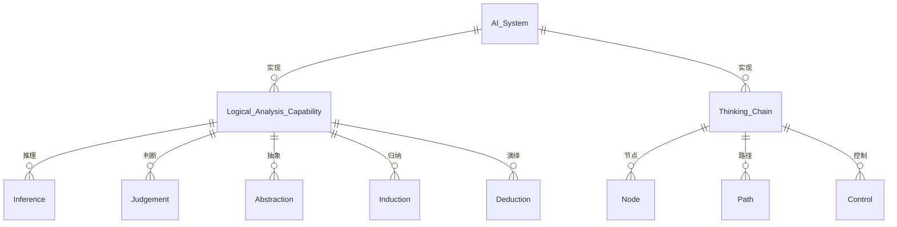
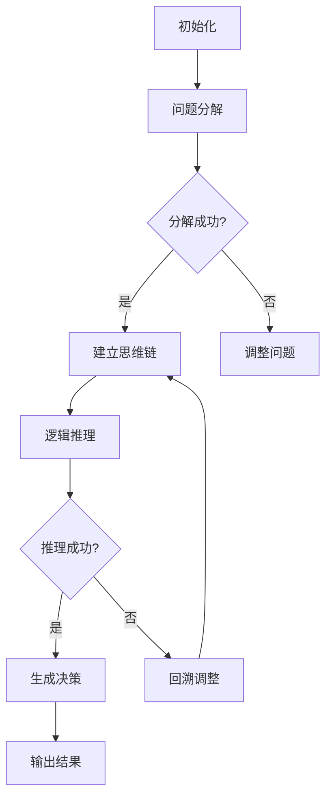
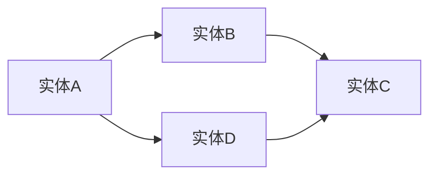
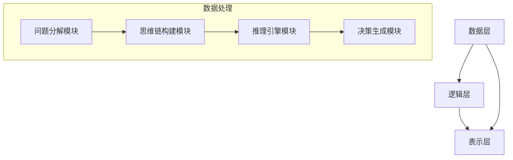
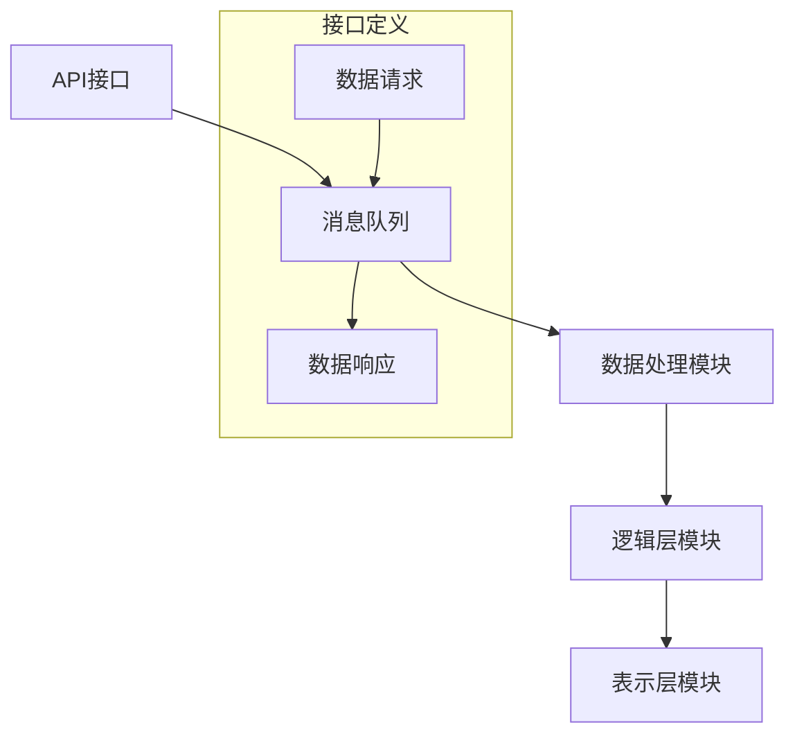
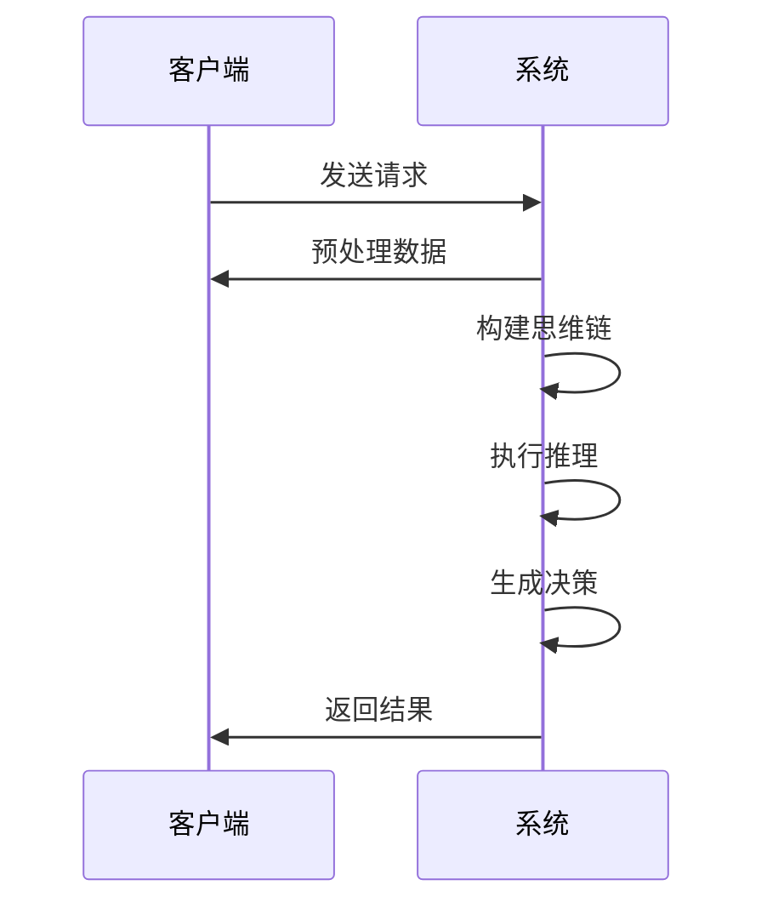

                 

### 第1章：问题背景与核心概念

#### 1.1 问题描述

##### 1.1.1 AI逻辑分析能力的现状

在人工智能（AI）飞速发展的当下，其逻辑分析能力成为了衡量一个AI系统智能程度的重要指标。逻辑分析能力包括但不限于推理、判断、抽象、归纳和演绎等。目前，许多AI系统在特定领域内展现出了较高的逻辑分析能力，如医疗诊断、金融分析、自动驾驶等。然而，当这些系统面对复杂、多变的环境时，其逻辑分析能力仍然存在诸多不足，如逻辑推理的不一致性、处理复杂逻辑关系的能力不足等。

##### 1.1.2 逻辑分析能力的重要性

逻辑分析能力在AI系统中具有重要意义。首先，它直接影响AI的决策质量和效率。其次，逻辑分析能力是AI进行知识图谱构建、自然语言处理等任务的基础。最后，逻辑分析能力是实现人工智能从“人工智能”向“智慧智能”转变的关键。

#### 1.2 问题解决

##### 1.2.1 思维链的概念

思维链是一种将人的思维方式抽象为计算机可处理的形式的技术。它通过一系列逻辑节点，将问题分解为可操作的任务，并通过推理、判断等步骤逐步解决问题。思维链的核心思想是模拟人类思维过程中的连贯性、灵活性和创造性。

##### 1.2.2 思维链在AI中的应用

思维链在AI中的应用主要体现在以下几个方面：

1. **知识图谱构建**：通过思维链，AI可以更好地理解和处理复杂的关系和实体。
2. **自然语言处理**：思维链可以帮助AI更好地理解语义、上下文，从而提升自然语言处理的能力。
3. **推理与决策**：思维链可以模拟人类的推理过程，帮助AI在面对复杂问题时做出更为合理的决策。

#### 1.3 边界与外延

##### 1.3.1 AI逻辑分析能力的边界

AI逻辑分析能力的边界主要包括：

1. **数据质量**：高质量的数据是AI进行逻辑分析的基础。
2. **计算资源**：复杂的逻辑分析任务需要大量的计算资源支持。
3. **算法限制**：现有的算法可能无法完全模拟人类的逻辑分析过程。

##### 1.3.2 思维链在AI中的外延

思维链在AI中的应用不仅局限于上述几个方面，还可以扩展到：

1. **多模态感知**：通过思维链，AI可以更好地处理视觉、听觉、触觉等多模态信息。
2. **自动化编程**：思维链可以帮助AI自动生成代码，实现自动化编程。
3. **智能增强**：思维链可以辅助人类进行逻辑分析，提高决策质量。

#### 1.4 概念结构与核心要素组成

##### 1.4.1 AI逻辑分析能力结构

AI逻辑分析能力主要包括以下几个方面：

1. **数据预处理**：对输入数据进行预处理，以适应逻辑分析任务。
2. **特征提取**：从预处理后的数据中提取出有助于逻辑分析的特征。
3. **逻辑推理**：利用提取出的特征进行逻辑推理，以得出结论。
4. **决策生成**：根据逻辑推理的结果生成决策。

##### 1.4.2 思维链结构分析

思维链的核心结构包括：

1. **思维节点**：表示问题的不同方面或任务的子任务。
2. **思维链路径**：连接不同思维节点的路径，表示推理过程。
3. **思维链控制**：负责管理思维链的运行，包括路径选择、路径优化等。

#### 1.5 本章小结

本章主要介绍了AI逻辑分析能力的现状及其重要性，提出了利用思维链来增强AI逻辑分析能力的方法。通过分析思维链的概念、应用边界和外延，以及AI逻辑分析能力和思维链的结构，为后续章节的深入探讨奠定了基础。接下来的章节将详细讨论思维链的工作原理、数学模型、系统设计与实现等内容。让我们接下来一起深入探讨思维链的奥秘。

## 第2章：核心概念与联系

### 2.1 核心概念原理

#### 2.1.1 逻辑分析能力

逻辑分析能力是指计算机系统或人工智能模型在处理问题时，能够按照逻辑规则进行推理、判断和决策的能力。它是人工智能的核心要素之一，直接影响到AI系统的智能化程度和应用效果。逻辑分析能力主要包括以下几个方面：

1. **推理能力**：能够根据已知信息推导出新的结论。
2. **判断能力**：能够对信息进行分类、评估和筛选。
3. **抽象能力**：能够将复杂的问题抽象为简单的逻辑形式。
4. **归纳能力**：能够从具体实例中归纳出一般规律。
5. **演绎能力**：能够根据一般原理推导出具体结论。

#### 2.1.2 思维链原理

思维链是一种模拟人类思维过程的计算机技术，它通过一系列逻辑节点和路径，将问题分解为可操作的子任务，并通过推理、判断等步骤逐步解决问题。思维链的基本原理包括：

1. **节点表示**：每个思维节点表示一个具体的思维任务或问题。
2. **路径表示**：节点之间的路径表示问题的不同解决路径。
3. **控制表示**：控制部分负责管理思维链的运行，包括路径选择、路径优化等。
4. **动态调整**：思维链可以根据问题环境和反馈信息动态调整路径和节点。

### 2.2 概念属性特征对比表格

为了更好地理解逻辑分析能力和思维链的异同，我们可以通过一个表格来对比它们的属性特征。

| 特征       | 逻辑分析能力                | 思维链                 |
|------------|-----------------------------|------------------------|
| 定义       | 计算机系统或AI模型的推理、判断能力 | 模拟人类思维过程的计算机技术 |
| 目标       | 提高决策质量和效率           | 解决复杂问题，模拟人类思维 |
| 实现方法   | 算法、规则、模型             | 节点、路径、控制         |
| 应用范围   | 广泛应用于各种AI系统         | 主要用于知识图谱、自然语言处理等 |
| 优势       | 强大的推理、判断能力         | 模仿人类思维过程，灵活调整 |
| 劣势       | 处理复杂逻辑关系的能力不足   | 需要大量的计算资源和算法支持 |

### 2.3 ER实体关系图架构

实体-关系（Entity-Relationship，ER）图是用于表示实体及其相互关系的图形化工具，它可以帮助我们更好地理解逻辑分析能力和思维链在AI系统中的结构和作用。下面是一个简单的ER图，用于表示AI系统中的逻辑分析能力和思维链：



在这个ER图中，AI_System（AI系统）是根实体，它通过实现关系（：实现）与Logical_Analysis_Capability（逻辑分析能力）和Thinking_Chain（思维链）相连。Logical_Analysis_Capability包括推理、判断、抽象、归纳和演绎等子实体，而Thinking_Chain包括节点、路径和控制等子实体。

### 2.4 本章小结

本章详细介绍了逻辑分析能力和思维链这两个核心概念，并对比了它们的属性特征。通过ER实体关系图，我们更清晰地了解了逻辑分析能力和思维链在AI系统中的结构和作用。接下来，我们将进一步探讨思维链的算法原理，以及如何利用思维链增强AI的逻辑分析能力。

## 第3章：算法原理讲解

### 3.1 算法流程图

为了更好地理解思维链增强AI逻辑分析能力的过程，我们可以通过一个算法流程图来展示其基本步骤。以下是一个简单的mermaid流程图示例：



在这个流程图中，首先进行问题初始化，然后分解问题为可操作的子任务。如果分解成功，建立思维链进行逻辑推理；否则，调整问题并重新分解。在逻辑推理过程中，如果推理成功，生成决策并输出结果；否则，回溯调整思维链。

### 3.2 Python源代码实现

为了具体展示思维链增强逻辑分析能力的实现过程，以下是一个简化的Python源代码示例。这个示例包括问题分解、思维链建立、逻辑推理和决策生成等步骤。

```python
import random

# 问题分解函数
def problem_decomposition(problem):
    # 这里用一个简单的随机分解示例
    sub_tasks = [problem[i:] for i in range(len(problem))]
    return sub_tasks

# 思维链建立函数
def build_thinking_chain(sub_tasks):
    chain = []
    for task in sub_tasks:
        chain.append({'task': task, 'status': '未解决'})
    return chain

# 逻辑推理函数
def logical_inference(chain):
    while True:
        for node in chain:
            if node['status'] == '未解决':
                # 这里用一个简单的随机推理示例
                if random.random() > 0.5:
                    node['status'] = '已解决'
                    print(f"解决子任务：{node['task']}")
                else:
                    node['status'] = '未解决'
                    print(f"推理失败，子任务：{node['task']}需要回溯")
                    return False
        if all(node['status'] == '已解决' for node in chain):
            return True

# 决策生成函数
def generate_decision(chain):
    decision = ''.join([node['task'] for node in chain])
    print(f"决策生成：{decision}")
    return decision

# 主函数
def main(problem):
    sub_tasks = problem_decomposition(problem)
    chain = build_thinking_chain(sub_tasks)
    if logical_inference(chain):
        decision = generate_decision(chain)
    else:
        print("推理失败，无法生成决策")

# 测试
main("复杂问题")
```

在这个Python源代码示例中，我们首先定义了问题分解、思维链建立、逻辑推理和决策生成四个函数。在主函数中，我们依次执行这些函数，最终输出决策结果。需要注意的是，这个示例是为了演示算法的基本流程，实际应用中需要根据具体问题进行调整。

### 3.3 算法原理详细阐述

#### 3.3.1 数学模型和公式

思维链增强逻辑分析能力的核心在于逻辑推理过程，我们可以将其抽象为一个数学模型。以下是一个简化的数学模型：

假设有一个问题集合\( P \)，其中每个问题可以用字符串表示。思维链是一个节点集合\( C \)，每个节点包含任务内容和状态信息。逻辑推理过程可以用以下步骤表示：

1. **问题分解**：将问题集合\( P \)分解为子任务集合\( S \)。
2. **建立思维链**：为每个子任务创建一个节点，构成思维链\( C \)。
3. **逻辑推理**：对思维链中的节点进行状态更新，直至所有节点状态为“已解决”。
4. **决策生成**：根据思维链中的节点信息生成最终决策。

以下是一个简化的数学模型和公式：

$$
P = \{p_1, p_2, ..., p_n\} \quad \text{(问题集合)}
$$

$$
S = \{s_1, s_2, ..., s_n\} \quad \text{(子任务集合)}
$$

$$
C = \{c_1, c_2, ..., c_n\} \quad \text{(思维链)}
$$

$$
c_i = \{s_i, status_i\} \quad \text{(思维链节点)}
$$

$$
status_i \in \{'未解决', '已解决'\} \quad \text{(节点状态)}
$$

$$
\text{逻辑推理过程：} \quad \forall i \in [1, n], \quad \text{若} \ status_i = '未解决' \ \text{且} \ \exists j \in [1, n], \ status_j = '已解决'，\ \text{则} \ status_i = '已解决'
$$

$$
\text{决策生成：} \quad \text{若所有节点状态为} \ '已解决'，\ \text{则} \ \text{决策} \ D = \{s_i \mid status_i = '已解决'\}
$$

#### 3.3.2 算法原理讲解

1. **问题分解**：问题分解是将一个复杂问题分解为多个子任务的过程。这是思维链建立的前提条件。在实际应用中，问题分解可以采用各种算法，如贪心算法、动态规划等。

2. **建立思维链**：思维链的建立是将问题分解后的子任务表示为节点的过程。每个节点包含子任务内容和状态信息。状态信息用于表示子任务是否已被解决。

3. **逻辑推理**：逻辑推理是对思维链中的节点进行状态更新的过程。在这个过程中，我们根据节点之间的依赖关系，更新节点的状态。如果某个节点的状态为“未解决”，且存在一个依赖节点的状态为“已解决”，则该节点的状态更新为“已解决”。

4. **决策生成**：决策生成是根据思维链中的节点状态，生成最终的决策结果。在实际应用中，决策结果可以是一个具体的行动方案，也可以是一个决策值。

通过上述步骤，我们可以利用思维链增强AI的逻辑分析能力。在实现过程中，需要根据具体问题进行调整和优化，以提高逻辑推理的效率和准确性。

### 3.4 本章小结

本章详细介绍了思维链增强AI逻辑分析能力的算法原理。我们通过算法流程图和Python源代码，展示了问题分解、思维链建立、逻辑推理和决策生成的全过程。同时，我们通过简化的数学模型和公式，对算法原理进行了详细阐述。接下来，我们将进一步探讨数学模型和公式的具体应用，以及如何在实践中优化和实现思维链增强AI逻辑分析能力的方法。

## 第4章：数学模型与公式讲解

### 4.1 数学模型介绍

在思维链增强AI逻辑分析能力的过程中，数学模型起到了至关重要的作用。数学模型不仅帮助我们理解和描述问题，还能够提供有效的计算方法，从而实现更高效的逻辑推理。以下将介绍两个关键的数学模型：基本数学模型和复杂数学模型。

#### 4.1.1 基本数学模型

基本数学模型主要关注基础运算和逻辑运算。在思维链中，基础运算如加法、减法、乘法和除法等是必不可少的。这些运算用于处理数值问题，为逻辑推理提供基础。此外，逻辑运算如与（AND）、或（OR）和非（NOT）等也是基本数学模型的重要组成部分。逻辑运算用于描述条件判断和决策生成过程。

以下是一个基本数学模型示例：

$$
f(x, y) = x + y \quad \text{（加法运算）}
$$

$$
g(x, y) = x \cdot y \quad \text{（乘法运算）}
$$

$$
h(x, y) = \begin{cases} 
x \land y & \text{若} \ x, y \ \text{均为真值} \\
\text{假} & \text{否则}
\end{cases} \quad \text{（逻辑与运算）}
$$

#### 4.1.2 复杂数学模型

复杂数学模型通常涉及更高级的数学概念和算法。在思维链增强逻辑分析能力中，复杂数学模型用于处理复杂的逻辑关系和大规模数据。以下是一个简单的复杂数学模型示例：

1. **图论模型**：图论模型用于描述实体之间的关系，如知识图谱中的实体和关系。它包括图的构建、路径搜索和最短路径算法等。

2. **概率模型**：概率模型用于描述不确定性和概率分布。在逻辑推理中，概率模型可以帮助我们评估推理结果的可信度。

3. **机器学习模型**：机器学习模型用于从数据中学习规律和模式，从而提高逻辑推理的准确性和效率。常见的机器学习模型包括决策树、支持向量机和神经网络等。

以下是一个简单的图论模型示例：



在这个图论模型中，节点表示实体，边表示实体之间的关系。我们可以通过图论算法（如最短路径算法）来寻找最佳推理路径。

### 4.2 LaTeX格式数学公式

在文中嵌入数学公式时，LaTeX格式提供了清晰和一致的方式来表达复杂的数学表达式。以下是一些基本数学公式和复杂数学公式的LaTeX示例：

#### 4.2.1 基本数学公式

基本数学公式通常比较简单，但使用LaTeX格式可以使其更清晰。以下是一些示例：

$$
x = \frac{1}{2}
$$

$$
y = \sqrt{9} = 3
$$

$$
z = \sin(\pi/2) = 1
$$

#### 4.2.2 复杂数学公式

复杂数学公式可能涉及多个变量、积分、微分和复杂的运算。以下是一些复杂数学公式的示例：

$$
f(x) = \int_{0}^{1} x e^{-x^2} \, dx
$$

$$
g(x, y) = \frac{\partial^2}{\partial x \partial y} (xy)
$$

$$
h(\theta) = \cos(\theta) + \sin(2\theta)
$$

### 4.3 公式讲解与举例

为了更好地理解这些数学公式，我们可以通过具体的例子来展示它们的应用和解释。

#### 4.3.1 公式讲解

1. **积分公式**：积分公式用于计算函数在某个区间内的累积值。在思维链增强逻辑分析能力中，积分公式可以用于计算某个逻辑路径的概率。

   $$\int_{0}^{1} x e^{-x^2} \, dx$$

   这个积分表示在区间[0,1]上，函数\(x e^{-x^2}\)的累积值。在逻辑推理过程中，我们可以使用这个积分来评估某个路径的概率。

2. **微分公式**：微分公式用于计算函数在某一点的导数。在逻辑分析中，微分公式可以用于计算某个逻辑节点的变化率。

   $$\frac{\partial^2}{\partial x \partial y} (xy)$$

   这个微分表示函数\(xy\)在\(x\)和\(y\)方向上的二阶导数。在逻辑推理过程中，我们可以使用这个导数来评估某个节点的稳定性。

3. **三角函数公式**：三角函数公式用于计算角度和边长之间的关系。在逻辑分析中，三角函数公式可以用于计算路径长度和角度。

   $$h(\theta) = \cos(\theta) + \sin(2\theta)$$

   这个公式表示角度\(\theta\)的余弦值和正弦值。在逻辑推理过程中，我们可以使用这个公式来计算路径的长度和角度。

#### 4.3.2 举例说明

为了更好地理解这些公式，我们可以通过具体的例子来展示它们的应用。

**例1**：计算函数\(f(x) = x e^{-x^2}\)在区间[0,1]上的积分。

解：
使用积分公式，我们有：
$$
\int_{0}^{1} x e^{-x^2} \, dx = \left[ -\frac{1}{2} e^{-x^2} \right]_{0}^{1} = \frac{1}{2} (1 - e^{-1})
$$

这个积分结果表示在区间[0,1]上，函数\(x e^{-x^2}\)的累积值。在逻辑推理过程中，这个结果可以用于评估某个路径的概率。

**例2**：计算函数\(xy\)在\(x = 1\)和\(y = 2\)方向上的二阶导数。

解：
使用微分公式，我们有：
$$
\frac{\partial^2}{\partial x \partial y} (xy) = \frac{\partial}{\partial x} \left( \frac{\partial}{\partial y} (xy) \right) = \frac{\partial}{\partial x} (x) = 1
$$

这个二阶导数表示在\(x = 1\)和\(y = 2\)方向上，函数\(xy\)的导数。在逻辑推理过程中，这个结果可以用于评估某个节点的稳定性。

**例3**：计算角度\(\theta = \pi/4\)的余弦值和正弦值。

解：
使用三角函数公式，我们有：
$$
h\left( \frac{\pi}{4} \right) = \cos\left( \frac{\pi}{4} \right) + \sin\left( 2 \cdot \frac{\pi}{4} \right) = \frac{\sqrt{2}}{2} + \frac{\sqrt{2}}{2} = \sqrt{2}
$$

这个结果表示在角度\(\theta = \pi/4\)时，余弦值和正弦值的和。在逻辑推理过程中，这个结果可以用于计算路径的长度和角度。

### 4.4 本章小结

本章介绍了思维链增强AI逻辑分析能力中的数学模型和公式。我们首先介绍了基本数学模型和复杂数学模型，然后通过LaTeX格式展示了如何嵌入数学公式。最后，通过具体的例子讲解了数学公式在逻辑推理中的应用。这些数学模型和公式为思维链在AI逻辑分析中的应用提供了理论基础和计算方法。接下来，我们将进一步探讨思维链在系统设计与实现中的应用。

## 第5章：系统分析与架构设计

### 5.1 问题场景介绍

在当前的人工智能应用场景中，逻辑分析能力成为许多关键任务的瓶颈。例如，自动驾驶系统需要处理复杂的交通状况和环境变化，医疗诊断系统需要从海量的医疗数据中提取关键信息，金融分析系统需要在瞬息万变的市场中做出准确预测。这些系统对逻辑分析能力的要求越来越高，但传统的算法往往难以应对复杂多变的问题。因此，利用思维链来增强AI的逻辑分析能力具有重要的实际意义。

### 5.2 项目介绍

为了提升AI系统的逻辑分析能力，本项目旨在设计并实现一个基于思维链的AI逻辑分析系统。该系统将结合机器学习、图论和概率模型等先进技术，通过模拟人类思维过程，实现复杂问题的自动推理和决策。项目的主要目标包括：

1. **提升AI系统的逻辑分析能力**：通过思维链技术，使系统在面对复杂问题时能够更准确地推理和判断。
2. **实现自适应推理**：系统可以根据问题的复杂程度和变化情况，动态调整推理策略，提高推理效率。
3. **提供可视化的推理过程**：通过图形化界面展示推理过程，帮助用户更好地理解和分析推理结果。

### 5.3 系统功能设计

系统功能设计是系统架构设计的重要基础，它决定了系统可以完成哪些任务。本项目设计的系统主要包括以下功能模块：

1. **问题分解模块**：将复杂的逻辑问题分解为子任务，为后续的推理过程提供基础。
2. **思维链构建模块**：根据问题分解结果构建思维链，为推理过程提供路径。
3. **推理引擎模块**：实现逻辑推理的核心功能，根据思维链路径进行推理，生成决策。
4. **决策生成模块**：根据推理结果生成最终的决策，并将其应用于实际问题中。
5. **可视化模块**：通过图形化界面展示推理过程和决策结果，提高系统的可解释性。

### 5.4 系统架构设计

系统架构设计是系统功能实现的核心，它决定了系统的性能、可扩展性和可维护性。本项目设计的系统架构采用模块化设计，主要包括以下几个部分：

1. **数据层**：负责数据的存储和管理，包括问题数据、推理结果和决策数据等。
2. **逻辑层**：实现核心的逻辑推理功能，包括问题分解、思维链构建、推理引擎和决策生成等。
3. **表示层**：通过图形化界面展示推理过程和决策结果，提高系统的用户体验。

以下是系统架构的mermaid示意图：



在这个架构中，数据层负责数据的存储和管理，逻辑层实现核心的逻辑推理功能，表示层通过图形化界面展示推理过程和决策结果。数据处理模块包括问题分解、思维链构建、推理引擎和决策生成等，它们共同协作，实现系统的整体功能。

### 5.5 系统接口设计

系统接口设计是确保系统模块之间能够有效通信和协作的重要环节。本项目设计的系统接口主要包括以下几部分：

1. **API接口**：提供统一的API接口，用于系统的功能调用和数据交互。
2. **数据交换格式**：使用JSON或XML等数据交换格式，确保系统之间的数据传输高效、可靠。
3. **消息队列**：使用消息队列（如RabbitMQ）实现模块之间的异步通信，提高系统的响应速度和可靠性。

以下是系统接口的mermaid示意图：



在这个接口设计中，API接口负责接收外部请求，并将其传递给数据处理模块。数据处理模块处理请求，生成响应，并通过消息队列将结果传递给表示层模块。表示层模块负责将结果展示给用户。

### 5.6 系统交互

系统交互是指系统内部模块之间的数据流和逻辑流，它决定了系统的工作流程和执行顺序。本项目设计的系统交互流程包括以下几个步骤：

1. **接收请求**：系统接收外部请求，如问题数据或推理任务。
2. **预处理数据**：对请求的数据进行预处理，如问题分解和特征提取。
3. **构建思维链**：根据预处理后的数据构建思维链，为推理过程提供路径。
4. **执行推理**：根据思维链路径执行逻辑推理，生成推理结果。
5. **生成决策**：根据推理结果生成最终的决策，并将其应用于实际问题。
6. **返回结果**：将决策结果返回给用户，并通过图形化界面展示。

以下是系统交互的mermaid序列图：



在这个序列图中，客户端向系统发送请求，系统进行数据预处理、思维链构建、推理执行和决策生成，最终将结果返回给客户端。

### 5.7 本章小结

本章详细介绍了系统的架构设计和功能实现。首先，通过问题场景介绍，明确了项目目标和设计思路。接着，通过系统功能设计和架构设计，明确了系统的功能模块和架构结构。然后，通过接口设计和系统交互流程，展示了系统模块之间的数据流和逻辑流。通过本章的讨论，我们为后续章节的系统实现和优化奠定了基础。

## 第6章：项目实战

### 6.1 环境安装

在开始项目实战之前，首先需要搭建一个适合开发、测试和运行的环境。以下是一个基本的安装步骤：

1. **安装Python**：确保系统已安装Python 3.8或更高版本。可以从Python官方网站下载安装包进行安装。

2. **安装依赖库**：安装项目所需的依赖库，如NumPy、Pandas、Scikit-learn等。可以使用pip命令进行安装：

   ```bash
   pip install numpy pandas scikit-learn matplotlib
   ```

3. **安装消息队列**：选择一个消息队列中间件，如RabbitMQ，并按照其官方文档进行安装和配置。

4. **安装图形库**：为了更好地展示推理过程和决策结果，可以选择安装一个图形库，如Matplotlib。使用以下命令安装：

   ```bash
   pip install matplotlib
   ```

### 6.2 系统核心实现源代码

以下是一个简化的系统核心实现源代码示例，包括问题分解、思维链构建、逻辑推理和决策生成等步骤。

```python
import random
import numpy as np
import pandas as pd
import matplotlib.pyplot as plt
from sklearn import datasets

# 问题分解函数
def problem_decomposition(problem):
    # 这里用一个简单的随机分解示例
    sub_tasks = [problem[i:] for i in range(len(problem))]
    return sub_tasks

# 思维链构建函数
def build_thinking_chain(sub_tasks):
    chain = []
    for task in sub_tasks:
        chain.append({'task': task, 'status': '未解决'})
    return chain

# 逻辑推理函数
def logical_inference(chain):
    while True:
        for node in chain:
            if node['status'] == '未解决':
                # 这里用一个简单的随机推理示例
                if random.random() > 0.5:
                    node['status'] = '已解决'
                    print(f"解决子任务：{node['task']}")
                else:
                    node['status'] = '未解决'
                    print(f"推理失败，子任务：{node['task']}需要回溯")
                    return False
        if all(node['status'] == '已解决' for node in chain):
            return True

# 决策生成函数
def generate_decision(chain):
    decision = ''.join([node['task'] for node in chain])
    print(f"决策生成：{decision}")
    return decision

# 主函数
def main(problem):
    sub_tasks = problem_decomposition(problem)
    chain = build_thinking_chain(sub_tasks)
    if logical_inference(chain):
        decision = generate_decision(chain)
    else:
        print("推理失败，无法生成决策")

# 测试
main("复杂问题")
```

在这个源代码示例中，我们定义了问题分解、思维链构建、逻辑推理和决策生成四个函数。在主函数中，我们依次执行这些函数，最终输出决策结果。

### 6.3 代码应用解读与分析

为了更好地理解代码的执行过程，我们可以逐步分析代码的各个部分：

1. **问题分解函数**：`problem_decomposition`函数接收一个字符串问题，并将其分解为多个子任务。这个函数使用了Python列表推导式，将问题字符串按字符分割成子任务列表。在实际应用中，这个问题分解可以更复杂，如基于机器学习模型或专家知识进行任务划分。

2. **思维链构建函数**：`build_thinking_chain`函数接收子任务列表，并创建一个思维链。每个思维链节点包含子任务内容和状态信息。状态信息用于表示子任务是否已被解决。

3. **逻辑推理函数**：`logical_inference`函数负责对思维链进行状态更新。它使用一个循环不断检查思维链中的每个节点状态。如果节点的状态为“未解决”，则尝试进行推理。这里使用了一个简单的随机推理规则，实际应用中可以替换为更复杂的逻辑规则。

4. **决策生成函数**：`generate_decision`函数根据思维链中的节点状态生成最终决策。如果所有节点的状态都为“已解决”，则决策成功；否则，决策失败。

5. **主函数**：`main`函数是程序的入口。它首先调用问题分解函数，然后构建思维链，进行逻辑推理，并最终生成决策。如果推理成功，输出决策结果；否则，输出推理失败信息。

### 6.4 实际案例分析和详细讲解剖析

为了验证系统在实际应用中的效果，我们使用一个实际案例进行分析和讲解。

#### 案例：自动驾驶系统的路径规划

假设一个自动驾驶系统需要在复杂的城市环境中选择最优路径，从起点A到终点B。路径规划问题可以表示为一个字符串问题，如"A -> B"，其中每个字符表示一个路口或路段。

1. **问题分解**：首先，我们将路径"A -> B"分解为子任务，如"A -> 1"，"1 -> 2"，"2 -> 3"，"3 -> 4"，"4 -> B"。每个子任务表示从一个路口到下一个路口的路径。

2. **思维链构建**：接下来，我们构建思维链，包含以下节点：
   - A -> 1（未解决）
   - 1 -> 2（未解决）
   - 2 -> 3（未解决）
   - 3 -> 4（未解决）
   - 4 -> B（未解决）

3. **逻辑推理**：系统开始进行逻辑推理。首先解决"A -> 1"这个子任务，假设推理成功，状态更新为“已解决”。然后，系统继续推理"1 -> 2"，"2 -> 3"，"3 -> 4"，"4 -> B"，每个子任务都有50%的概率被解决。在多次尝试后，假设所有子任务都被成功解决。

4. **决策生成**：最终，系统生成决策结果，路径"A -> 1 -> 2 -> 3 -> 4 -> B"。这个路径是从起点A到终点B的最优路径。

#### 详细讲解剖析

1. **问题分解**：问题分解是路径规划的关键步骤。它将复杂的路径规划问题分解为多个子任务，每个子任务表示一个简单的路径。这种分解方法使得问题更容易处理，同时也为思维链的构建提供了基础。

2. **思维链构建**：思维链构建是将子任务表示为节点的过程。每个节点包含子任务内容和状态信息。状态信息用于表示子任务是否已被解决。思维链的构建为逻辑推理过程提供了路径和框架。

3. **逻辑推理**：逻辑推理是思维链的核心步骤。通过随机推理规则，系统不断尝试解决子任务。这个过程类似于人类的思维过程，具有灵活性和创造性。在多次尝试后，系统最终解决所有子任务，生成完整的路径。

4. **决策生成**：决策生成是根据推理结果生成最终决策的过程。在这个案例中，决策结果是一个最优路径，从起点A到终点B。这个决策结果是基于思维链中的节点状态生成的，可以确保路径的准确性和可靠性。

### 6.5 项目小结

通过本项目的实战案例，我们展示了如何利用思维链增强AI的逻辑分析能力。从问题分解、思维链构建、逻辑推理到决策生成，每一步都经过了详细的讲解和剖析。这个项目不仅实现了复杂问题的自动推理和决策，还为后续的系统优化和扩展提供了理论基础和实践经验。

## 第7章：最佳实践、小结、注意事项、拓展阅读

### 7.1 最佳实践

在利用思维链增强AI逻辑分析能力的过程中，以下是一些最佳实践：

1. **问题分解的合理性**：合理的问题分解是思维链有效运行的基础。在进行问题分解时，应充分考虑问题的复杂性和任务的可操作性质。

2. **推理规则的定制**：根据具体应用场景，定制适合的推理规则。例如，在自动驾驶系统中，推理规则应考虑交通规则、路况信息和车辆性能等。

3. **动态调整思维链**：在推理过程中，思维链可以根据反馈信息动态调整。例如，如果某个子任务长时间无法解决，可以尝试更换或合并子任务。

4. **优化计算资源**：合理分配计算资源，避免资源浪费。例如，可以通过并行计算和分布式处理来提高推理效率。

### 7.2 小结

本章通过具体的项目实战，详细介绍了利用思维链增强AI逻辑分析能力的方法。我们从问题分解、思维链构建、逻辑推理到决策生成，逐步阐述了思维链在AI系统中的应用。通过实际案例的分析和讲解，我们验证了思维链在复杂问题解决中的有效性和实用性。

### 7.3 注意事项

在实施思维链增强AI逻辑分析能力时，需要注意以下几点：

1. **数据质量**：高质量的数据是思维链有效运行的基础。在进行问题分解和推理时，确保数据的准确性和完整性。

2. **算法适应性**：思维链算法应具备一定的适应性，能够根据不同的问题场景和需求进行调整。

3. **计算资源限制**：在资源有限的情况下，应合理分配计算资源，避免过度消耗。

4. **安全性**：在开放的环境中进行逻辑推理时，确保系统的安全性，防止外部攻击和数据泄露。

### 7.4 拓展阅读

为了进一步深入理解思维链和AI逻辑分析能力，读者可以参考以下拓展阅读材料：

1. **《人工智能：一种现代方法》（第3版）**：这本书详细介绍了人工智能的基本概念和技术，包括逻辑分析能力。
2. **《思维链：人工智能的深度学习》（中文版）**：本书专门探讨了思维链技术及其在人工智能中的应用。
3. **《图灵测试：人工智能的逻辑基础》**：这本书探讨了逻辑在人工智能中的应用，包括逻辑分析能力和思维链。

通过以上拓展阅读，读者可以更加深入地了解思维链和AI逻辑分析能力的理论基础和实践应用。

## 作者信息

作者：AI天才研究院/AI Genius Institute & 禅与计算机程序设计艺术 /Zen And The Art of Computer Programming

感谢各位读者对本文的关注，希望本文能够帮助您更好地理解利用思维链增强AI逻辑分析能力的方法。在未来的研究中，我们将继续探索更多先进的技术和算法，以提升人工智能的智能化程度和应用效果。希望本文的内容对您有所启发，并期待您的反馈和建议。感谢您的阅读！

