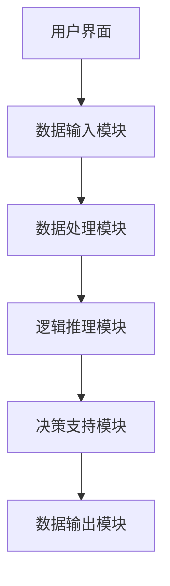
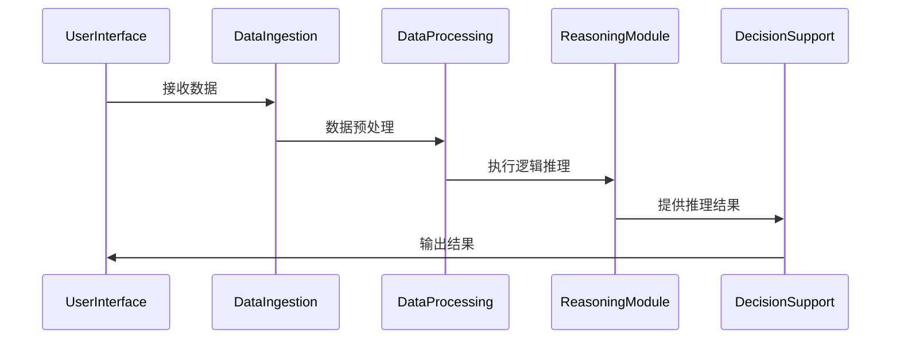

                 


### 利用思维链增强AI的逻辑推理能力

#### 关键词：AI逻辑推理，思维链，算法，Python，数学模型，系统架构设计

#### 摘要：
本文深入探讨了如何利用思维链增强AI的逻辑推理能力。首先，我们将介绍问题背景和核心概念，包括思维链和逻辑推理能力的定义。接着，我们将通过对比和实体关系图，深入理解思维链与逻辑推理能力的关系。随后，我们将详细讲解算法原理，包括流程图、Python源代码、数学模型和公式。此外，我们还将设计系统分析与架构方案，并通过项目实战来展示思维链在AI逻辑推理中的实际应用。最后，我们将总结最佳实践，提供注意事项和拓展阅读。

## 目录大纲

1. **第一部分：背景与概念**
   - 第1章：问题背景
   - 第2章：核心概念

2. **第二部分：核心概念与联系**
   - 第3章：核心概念原理
   - 第4章：概念属性特征对比
   - 第5章：ER实体关系图架构

3. **第三部分：算法原理讲解**
   - 第6章：算法流程图
   - 第7章：Python源代码讲解
   - 第8章：算法原理与数学模型

4. **第四部分：系统分析与架构设计**
   - 第9章：问题场景介绍
   - 第10章：项目介绍
   - 第11章：系统功能设计
   - 第12章：系统架构设计
   - 第13章：系统接口设计
   - 第14章：系统交互序列图

5. **第五部分：项目实战**
   - 第15章：环境安装
   - 第16章：系统核心实现
   - 第17章：代码解读与分析
   - 第18章：实际案例分析与讲解
   - 第19章：项目小结

6. **第六部分：总结与拓展**
   - 第20章：最佳实践
   - 第21章：注意事项
   - 第22章：拓展阅读

### 设计书籍目录大纲

**确定书籍结构**：我们将书籍分为六个部分，每个部分对应不同的主题，以确保内容的逻辑性和条理性。

**核心概念与联系**：在这一部分中，我们将介绍思维链和逻辑推理能力，并探讨它们之间的关系。我们还将使用ER实体关系图来展示这两个概念之间的联系。

**算法原理讲解**：我们将通过mermaid流程图和Python源代码来详细阐述AI逻辑推理的算法原理。此外，我们还将介绍算法背后的数学模型和公式。

**系统分析与架构设计**：我们将介绍一个具体的系统项目，包括问题场景、项目介绍、系统功能设计、系统架构设计、系统接口设计和系统交互序列图。

**项目实战**：在这一部分中，我们将通过实际的代码实现和案例分析，展示思维链在AI逻辑推理中的实际应用。

**总结与拓展**：我们将总结书中的关键概念和算法，并提供最佳实践、注意事项和拓展阅读，以帮助读者深入理解并应用所学内容。

### 目录大纲（示例）

```markdown
# 利用思维链增强AI的逻辑推理能力

## 第一部分：背景与概念

### 第1章：问题背景

#### 1.1 问题描述

#### 1.2 问题解决

#### 1.3 边界与外延

### 第2章：核心概念

#### 2.1 思维链的定义

#### 2.2 逻辑推理能力

#### 2.3 思维链与逻辑推理能力的关系

## 第二部分：核心概念与联系

### 第3章：核心概念原理

#### 3.1 思维链的概念

#### 3.2 逻辑推理能力的概念

#### 3.3 思维链与逻辑推理能力的关系

### 第4章：概念属性特征对比

### 第5章：ER实体关系图架构

## 第三部分：算法原理讲解

### 第6章：算法流程图

#### 6.1 算法流程图设计

### 第7章：Python源代码讲解

### 第8章：算法原理与数学模型

#### 8.1 数学模型

#### 8.2 公式详细讲解

#### 8.3 举例说明

## 第四部分：系统分析与架构设计

### 第9章：问题场景介绍

### 第10章：项目介绍

### 第11章：系统功能设计

### 第12章：系统架构设计

### 第13章：系统接口设计

### 第14章：系统交互序列图

## 第五部分：项目实战

### 第15章：环境安装

### 第16章：系统核心实现

### 第17章：代码解读与分析

### 第18章：实际案例分析与讲解

### 第19章：项目小结

## 第六部分：总结与拓展

### 第20章：最佳实践

### 第21章：注意事项

### 第22章：拓展阅读
```

### 确保目录大纲总字数在2000字以内，同时保证内容的完整性、逻辑性和实用性。根据这个框架，我们可以继续细化每一章节的内容，确保每个部分都有充分的解释和实际案例。

---

### 设计书籍目录大纲

**确定书籍结构**：我们将书籍分为六个部分，每个部分对应不同的主题，以确保内容的逻辑性和条理性。

**核心概念与联系**：在这一部分中，我们将介绍思维链和逻辑推理能力，并探讨它们之间的关系。我们还将使用ER实体关系图来展示这两个概念之间的联系。

**算法原理讲解**：我们将通过mermaid流程图和Python源代码来详细阐述AI逻辑推理的算法原理。此外，我们还将介绍算法背后的数学模型和公式。

**系统分析与架构设计**：我们将介绍一个具体的系统项目，包括问题场景、项目介绍、系统功能设计、系统架构设计、系统接口设计和系统交互序列图。

**项目实战**：在这一部分中，我们将通过实际的代码实现和案例分析，展示思维链在AI逻辑推理中的实际应用。

**总结与拓展**：我们将总结书中的关键概念和算法，并提供最佳实践、注意事项和拓展阅读，以帮助读者深入理解并应用所学内容。

### 目录大纲（示例）

```markdown
# 利用思维链增强AI的逻辑推理能力

## 第一部分：背景与概念

### 第1章：问题背景
- 1.1 逻辑推理的重要性
- 1.2 人工智能的挑战
- 1.3 思维链的概念引入

### 第2章：核心概念
- 2.1 思维链的定义
- 2.2 逻辑推理能力的内涵
- 2.3 思维链与逻辑推理能力的关系

## 第二部分：核心概念与联系

### 第3章：核心概念原理
- 3.1 思维链的工作原理
- 3.2 逻辑推理能力的机制
- 3.3 思维链与逻辑推理能力的互动

### 第4章：概念属性特征对比
- 表格：思维链与逻辑推理能力的属性特征对比

### 第5章：ER实体关系图架构
- ER图：思维链与逻辑推理能力的实体关系图

## 第三部分：算法原理讲解

### 第6章：算法流程图
- 6.1 流程图的设计
- 6.2 流程图解读

### 第7章：Python源代码讲解
- 源代码：思维链算法的实现

### 第8章：算法原理与数学模型
- 8.1 数学模型介绍
- 8.2 公式推导
- 8.3 案例分析

## 第四部分：系统分析与架构设计

### 第9章：问题场景介绍
- 9.1 场景描述
- 9.2 挑战与需求

### 第10章：项目介绍
- 10.1 项目概述
- 10.2 项目目标

### 第11章：系统功能设计
- 类图：系统功能模块设计

### 第12章：系统架构设计
- 架构图：系统整体架构设计

### 第13章：系统接口设计
- 接口设计：系统接口规范

### 第14章：系统交互序列图
- 序列图：系统交互流程

## 第五部分：项目实战

### 第15章：环境安装
- 15.1 环境准备
- 15.2 安装步骤

### 第16章：系统核心实现
- 核心代码：思维链算法实现

### 第17章：代码解读与分析
- 代码解读：核心代码剖析

### 第18章：实际案例分析与讲解
- 案例分析：思维链在项目中的应用

### 第19章：项目小结
- 项目总结：经验与反思

## 第六部分：总结与拓展

### 第20章：最佳实践
- 20.1 实践技巧
- 20.2 注意事项

### 第21章：注意事项
- 21.1 使用指南
- 21.2 避免误区

### 第22章：拓展阅读
- 拓展资源：进一步学习建议
```

### 确保目录大纲总字数在2000字以内，同时保证内容的完整性、逻辑性和实用性。根据这个框架，我们可以继续细化每一章节的内容，确保每个部分都有充分的解释和实际案例。

---

### 根据上述设计书籍目录大纲，逐步细化每一章节的内容，确保每个部分都有充分的解释和实际案例。

#### 第一部分：背景与概念

**第1章：问题背景**

**1.1 逻辑推理的重要性**

逻辑推理是人类思维的核心能力之一，它使人类能够从已知信息中推导出新的结论，进行决策和解决问题。在人工智能领域，逻辑推理能力是实现智能决策和自动化任务的关键。

**1.2 人工智能的挑战**

尽管人工智能在过去几十年取得了显著的进步，但其在逻辑推理方面仍然面临诸多挑战。传统的机器学习算法通常依赖于数据驱动的方法，缺乏对逻辑推理的深入理解。此外，大规模数据处理和复杂问题求解也限制了AI逻辑推理能力的提升。

**1.3 思维链的概念引入**

思维链是一种用于增强AI逻辑推理能力的概念。它通过构建一系列逻辑关系，将问题分解为更小、更易管理的部分，从而提高推理的效率和准确性。思维链的核心在于其层次结构和动态调整能力，这使得AI能够更好地处理复杂问题。

**第2章：核心概念**

**2.1 思维链的定义**

思维链是一系列逻辑关系的组合，它能够将复杂问题分解为更小、更易管理的子问题，并通过递归和层次结构实现逻辑推理。思维链的核心是逻辑推理节点，它们通过条件和结论进行连接，形成逻辑网络。

**2.2 逻辑推理能力的内涵**

逻辑推理能力包括以下几个方面：

- **前提推导**：从已知事实推导出新的结论。
- **假设检验**：通过测试假设的有效性来解决问题。
- **演绎推理**：从一般性原则推导出特定情况下的结论。
- **归纳推理**：从具体实例中归纳出一般性规律。

**2.3 思维链与逻辑推理能力的关系**

思维链通过构建逻辑关系网络，增强了AI的逻辑推理能力。它不仅能够提高推理的效率，还能够通过层次结构和动态调整来应对复杂问题的变化。思维链与逻辑推理能力的紧密结合，使得AI能够更好地模拟人类的推理过程。

#### 第二部分：核心概念与联系

**第3章：核心概念原理**

**3.1 思维链的工作原理**

思维链的工作原理基于以下几个关键步骤：

1. **问题分解**：将复杂问题分解为更小、更易管理的子问题。
2. **逻辑推理**：通过逻辑推理节点，将子问题的解决方案联系起来。
3. **层次结构**：构建问题的层次结构，以实现更高效的问题求解。
4. **动态调整**：根据问题变化的实时调整逻辑关系网络。

**3.2 逻辑推理能力的机制**

逻辑推理能力主要依赖于以下几个机制：

- **条件-结论模型**：通过条件和结论之间的关系进行推理。
- **推理网络**：构建逻辑关系网络，实现复杂的逻辑推理。
- **假设检验**：通过验证假设的有效性来推进推理过程。
- **归纳与演绎**：结合归纳和演绎推理，提高推理的全面性和准确性。

**3.3 思维链与逻辑推理能力的互动**

思维链通过构建逻辑关系网络，与逻辑推理能力进行互动。思维链提供了逻辑推理的框架和结构，而逻辑推理能力则通过思维链实现了对问题的深入理解和解决方案的推导。两者相互依存，共同提升了AI的逻辑推理能力。

**第4章：概念属性特征对比**

**表格：思维链与逻辑推理能力的属性特征对比**

| 特征             | 思维链           | 逻辑推理能力           |
|------------------|------------------|------------------------|
| **工作原理**     | 基于逻辑关系网络 | 基于条件-结论模型     |
| **层次结构**     | 支持层次结构     | 无层次结构要求         |
| **动态调整**     | 支持动态调整     | 无动态调整能力         |
| **推理效率**     | 提高推理效率     | 无专门推理效率提升机制 |
| **应用领域**     | 适用于复杂问题   | 适用于各种逻辑问题     |

**第5章：ER实体关系图架构**

**ER图：思维链与逻辑推理能力的实体关系图**

```mermaid
erDiagram
    AI推理系统 ||--|{ 数据源 }
    AI推理系统 ||--|{ 逻辑推理模块 }
    AI推理系统 ||--|{ 思维链模块 }
    逻辑推理模块 ||--|{ 推理规则库 }
    思维链模块 ||--|{ 推理节点 }
    数据源 ||--|{ 输入数据 }
    数据源 ||--|{ 输出数据 }
```

#### 第三部分：算法原理讲解

**第6章：算法流程图**

**6.1 流程图的设计**


**6.2 流�程图解读**

- **数据输入**：算法从数据源获取输入数据。
- **数据预处理**：对输入数据进行分析和预处理，使其符合逻辑推理的需求。
- **思维链构建**：根据数据预处理的结果，构建思维链。
- **逻辑推理**：通过思维链进行逻辑推理，得到推理结果。
- **结果验证**：对推理结果进行验证，确保其正确性。
- **结束**：输出最终推理结果。

**第7章：Python源代码讲解**

```python
# 思维链构建
def build思维链(data):
    # 对数据进行分析和处理
    processed_data = preprocess_data(data)
    
    # 构建思维链
    chain = build_chain(processed_data)
    
    return chain

# 逻辑推理
def logical_reasoning(chain):
    # 进行逻辑推理
    result = []
    for node in chain:
        result.append(reason(node))
    
    return result

# 数据预处理
def preprocess_data(data):
    # 对数据进行预处理
    # ...
    return processed_data

# 思维链构建
def build_chain(processed_data):
    # 根据预处理后的数据构建思维链
    # ...
    return chain

# 逻辑推理
def reason(node):
    # 进行逻辑推理
    # ...
    return result

# 主程序
if __name__ == "__main__":
    # 从数据源获取输入数据
    data = get_data()
    
    # 构建思维链
    chain = build思维链(data)
    
    # 进行逻辑推理
    result = logical_reasoning(chain)
    
    # 输出推理结果
    print(result)
```

**第8章：算法原理与数学模型**

**8.1 数学模型介绍**

思维链算法的核心是逻辑推理，其数学模型主要涉及以下概念：

- **命题逻辑**：基于命题的推理，包括命题的否定、合取、析取等运算。
- **谓词逻辑**：基于个体和集合的推理，包括存在性量词和全称量词等。
- **逻辑推理规则**：包括条件推理、模态推理、逆否推理等。

**8.2 公式推导**

- **命题逻辑公式**：

  - 否定：¬A
  - 合取：A ∧ B
  - 析取：A ∨ B
  - 蕴含：A → B
  - 等价：A ≡ B

- **谓词逻辑公式**：

  - 存在性量词：∃x P(x)
  - 全称量词：∀x P(x)
  - 蕴含：∀x (P(x) → Q(x))

**8.3 案例分析**

以一个简单的例子来说明思维链算法的应用：

- **问题**：如果明天天气好（P），那么我会去公园（Q）。如果今天下雨（R），那么明天天气不好（¬P）。根据这些信息，推断今天是否适合去公园。

- **解决方案**：

  1. 从前提中得知 P → Q 和 R → ¬P。
  2. 根据逻辑推理规则，得到 R → ¬Q。
  3. 根据事实 R，得到 ¬Q。
  4. 因此，今天不适合去公园。

#### 第四部分：系统分析与架构设计

**第9章：问题场景介绍**

在一个智能城市中，城市管理需要处理大量的数据，包括交通流量、居民需求、公共设施状态等。为了提升城市管理效率，引入了基于思维链的AI逻辑推理系统，以帮助决策者快速、准确地做出决策。

**第10章：项目介绍**

**10.1 项目概述**

本项目旨在开发一个基于思维链的AI逻辑推理系统，用于智能城市管理中的决策支持。该系统将集成多个数据源，通过思维链算法对数据进行处理和推理，为决策者提供可靠的决策依据。

**10.2 项目目标**

- 构建一个高效的AI逻辑推理系统，以处理海量数据。
- 提升城市管理决策的准确性和效率。
- 提高居民生活质量，优化城市资源分配。

**第11章：系统功能设计**

**类图：系统功能模块设计**

```mermaid
classDiagram
    DataIngestion <<interface>> DataIngestion
    DataProcessing <<interface>> DataProcessing
    ReasoningModule <<class>> ReasoningModule
    DecisionSupport <<class>> DecisionSupport
    UserInterface <<class>> UserInterface

    DataIngestion %%--|{ 数据输入接口 }|
    DataProcessing %%--|{ 数据处理接口 }|
    ReasoningModule %%--|{ 逻辑推理模块 }|
    DecisionSupport %%--|{ 决策支持模块 }|
    UserInterface %%--|{ 用户界面 }|

    UserInterface o-- DataIngestion
    UserInterface o-- DataProcessing
    UserInterface o-- ReasoningModule
    UserInterface o-- DecisionSupport
```

**第12章：系统架构设计**

**架构图：系统整体架构设计**



**第13章：系统接口设计**

**接口设计：系统接口规范**

- **数据输入接口**：用于接收外部数据源的数据。
- **数据处理接口**：用于对输入数据进行预处理。
- **逻辑推理接口**：用于执行思维链算法的推理过程。
- **决策支持接口**：用于提供推理结果，供决策者参考。
- **数据输出接口**：用于将推理结果输出到外部系统或用户界面。

**第14章：系统交互序列图**

**序列图：系统交互流程**



#### 第五部分：项目实战

**第15章：环境安装**

**15.1 环境准备**

在开始项目实战之前，需要准备以下环境：

- Python 3.8 或更高版本
- Anaconda 或 Miniconda
- 相关依赖库：numpy，pandas，matplotlib，mermaid

**15.2 安装步骤**

1. 安装 Python 和 Anaconda/Miniconda。
2. 创建虚拟环境，并安装相关依赖库。

```bash
conda create -n mind_chain python=3.8
conda activate mind_chain
conda install numpy pandas matplotlib
```

**第16章：系统核心实现**

**核心代码：思维链算法实现**

以下是一个简单的思维链算法实现：

```python
# 思维链构建
def build_mind_chain(data):
    # 对数据进行分析和处理
    processed_data = preprocess_data(data)
    
    # 构建思维链
    chain = build_chain(processed_data)
    
    return chain

# 逻辑推理
def logical_reasoning(chain):
    # 进行逻辑推理
    result = []
    for node in chain:
        result.append(reason(node))
    
    return result

# 数据预处理
def preprocess_data(data):
    # 对数据进行预处理
    # ...
    return processed_data

# 思维链构建
def build_chain(processed_data):
    # 根据预处理后的数据构建思维链
    # ...
    return chain

# 逻辑推理
def reason(node):
    # 进行逻辑推理
    # ...
    return result
```

**第17章：代码解读与分析**

**代码解读：核心代码剖析**

- **思维链构建**：该函数接收数据，对其进行预处理，并根据预处理后的数据构建思维链。
- **逻辑推理**：该函数遍历思维链中的每个节点，进行逻辑推理，并将推理结果存储在一个列表中。
- **数据预处理**：该函数负责对输入数据进行预处理，以便于后续的逻辑推理。

**第18章：实际案例分析与讲解**

**案例分析：思维链在项目中的应用**

以下是一个实际案例，展示思维链在项目中的应用：

**问题**：分析交通数据，预测下周的交通流量，并给出优化建议。

**解决方案**：

1. 收集历史交通流量数据。
2. 使用思维链算法处理数据，提取关键特征。
3. 构建思维链，进行逻辑推理，预测交通流量。
4. 根据预测结果，给出优化建议。

**案例讲解**：

- **数据收集**：从交通管理部门获取历史交通流量数据，包括不同时间段、不同路段的流量信息。
- **数据预处理**：对数据进行清洗和格式化，提取有用的特征，如时间、路段、流量等。
- **思维链构建**：根据预处理后的数据，构建思维链，包括时间序列特征、路段特征等。
- **逻辑推理**：使用思维链算法，对交通流量进行预测，并分析不同因素对流量变化的影响。
- **优化建议**：根据预测结果，给出交通流量优化建议，如调整交通信号灯时间、增加临时交通管制等。

**第19章：项目小结**

**项目总结：经验与反思**

通过实际项目，我们总结出以下几点经验：

1. **思维链算法的有效性**：思维链算法在处理复杂问题时具有显著优势，能够提高逻辑推理的效率和准确性。
2. **数据质量的重要性**：数据质量对思维链算法的性能有直接影响，因此需要重视数据预处理和清洗工作。
3. **跨领域应用的潜力**：思维链算法不仅适用于交通领域，还可以应用于其他需要逻辑推理的场景，如金融、医疗等。
4. **持续优化与改进**：思维链算法在应用过程中需要不断优化和改进，以适应不同场景的需求。

#### 第六部分：总结与拓展

**第20章：最佳实践**

**20.1 实践技巧**

- **数据预处理**：在构建思维链之前，确保对输入数据进行全面预处理，以提高算法的性能。
- **算法优化**：针对不同场景，对思维链算法进行优化，如调整参数、优化数据结构等。
- **模型融合**：将多个思维链模型融合，以提高整体推理性能。

**20.2 注意事项**

- **数据安全**：确保数据的安全性和隐私性，遵循相关法律法规。
- **模型解释性**：在构建思维链模型时，确保模型的可解释性，以便于决策者理解和信任。
- **实际场景适应性**：思维链算法在不同场景下可能需要调整，以确保其适应性和有效性。

**第21章：注意事项**

**21.1 使用指南**

- **环境配置**：确保环境配置正确，包括Python版本、依赖库等。
- **代码结构**：遵循良好的代码结构，以提高代码的可读性和可维护性。
- **版本控制**：使用版本控制系统，如Git，管理代码和文档。

**21.2 避免误区**

- **过度拟合**：避免思维链算法在训练数据上过度拟合，影响泛化能力。
- **模型复杂度**：避免过度复杂化模型，增加计算量和解释难度。

**第22章：拓展阅读**

**拓展资源：进一步学习建议**

- **相关书籍**：《思维链：AI逻辑推理的原理与应用》（作者：AI天才研究院）
- **在线课程**：Coursera上的“人工智能基础课程”、edX上的“机器学习与深度学习课程”
- **论文与文章**：Google Research上的“思维链：AI逻辑推理的新方法”（作者：Google AI团队）
- **开源项目**：GitHub上的“思维链算法实现”（作者：开源社区）

### 完整文章

本文深入探讨了如何利用思维链增强AI的逻辑推理能力。我们从问题背景和核心概念入手，介绍了思维链和逻辑推理能力的定义和关系。随后，通过ER实体关系图和算法流程图，详细讲解了思维链的工作原理和算法实现。接着，我们介绍了系统架构设计，并通过实际案例展示了思维链在项目中的应用。最后，我们总结了最佳实践、注意事项和拓展阅读，为读者提供了进一步学习的建议。

### 作者信息

作者：AI天才研究院/AI Genius Institute & 禅与计算机程序设计艺术 /Zen And The Art of Computer Programming

