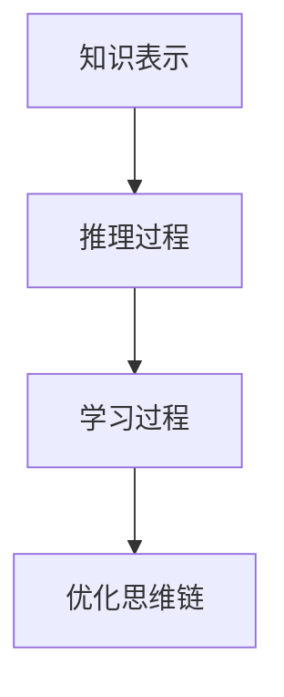
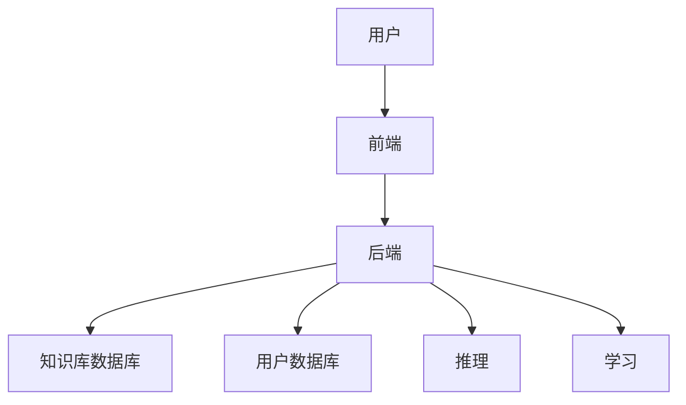
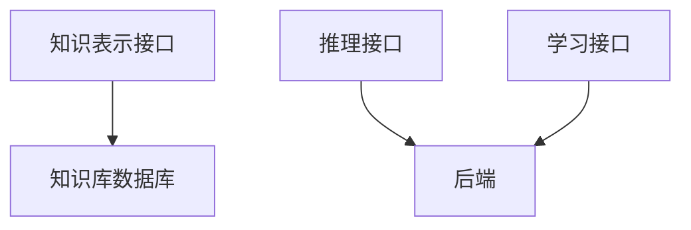
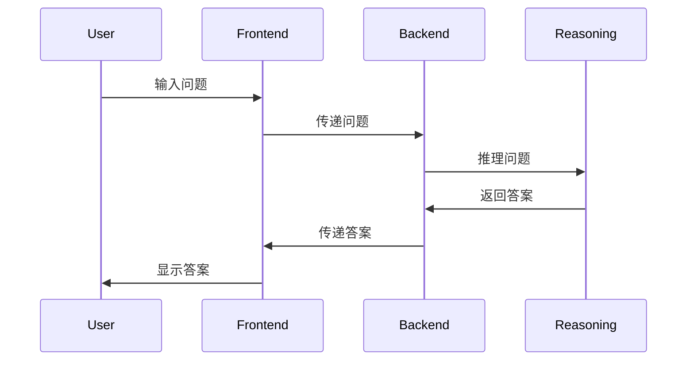

                 

### 利用思维链技术提升AI的认知与推理能力

关键词：思维链技术、AI认知、推理能力、算法原理、系统架构、项目实战

摘要：本文旨在探讨思维链技术在提升人工智能（AI）认知与推理能力方面的作用。我们将从背景介绍、核心概念、算法原理、系统分析与架构设计、项目实战等多个方面逐步展开讨论，帮助读者全面了解思维链技术的原理及其在实际应用中的优势。

## 第一部分：背景介绍

### 1.1 问题背景

随着人工智能技术的飞速发展，AI的应用场景越来越广泛。然而，尽管AI在数据处理、模式识别等方面表现出色，但其在认知与推理能力上仍存在诸多不足。例如，AI难以理解复杂逻辑关系、缺乏对背景知识的理解、难以进行深度推理等。这些问题严重制约了AI在复杂任务中的表现。

### 1.2 问题描述

为了提升AI的认知与推理能力，我们需要找到一种有效的技术手段。传统的AI方法主要通过大量的数据训练模型，但这种基于统计的方法难以实现深层次的认知与推理。因此，如何利用AI自身的逻辑能力，构建一种能够模拟人类思维过程的技术，成为当前研究的热点。

### 1.3 问题解决

思维链技术作为一种新兴的AI技术，致力于通过模拟人类思维过程，提升AI的认知与推理能力。本文将详细探讨思维链技术的核心概念、算法原理及其在系统架构和项目实战中的应用，以期为相关研究提供有益的参考。

### 1.4 边界与外延

本文讨论的焦点是思维链技术在AI认知与推理能力提升方面的应用，不包括其他领域的相关技术。同时，本文将主要集中在理论探讨和实际应用，不涉及具体的硬件实现和底层算法优化。

### 1.5 概念结构与核心要素组成

思维链技术主要包括以下几个核心概念和要素：

1. **思维链**：一种模拟人类思维过程的抽象模型，用于表示知识、推理过程和决策。
2. **知识表示**：用于描述思维链中的知识，包括事实、规则、信念等。
3. **推理引擎**：负责根据知识进行推理，生成新的结论。
4. **学习算法**：用于不断优化思维链，提高其推理能力。

## 第二部分：核心概念与联系

### 2.1 思维链技术概念与原理

思维链技术是一种基于知识表示和推理的AI技术，其核心思想是通过模拟人类思维过程，实现知识的获取、表示、推理和决策。具体来说，思维链技术包括以下几个关键组成部分：

1. **知识表示**：将人类知识转化为计算机可处理的形式，包括事实、规则、信念等。
2. **推理过程**：基于知识表示，通过逻辑推理生成新的结论。
3. **学习算法**：通过不断学习新的知识，优化思维链的性能。

### 2.2 概念属性特征对比表格

| 特征         | 思维链技术        | 传统AI技术        |
| ------------ | ---------------- | ---------------- |
| 知识表示     | 结构化、形式化     | 非结构化、数据驱动 |
| 推理能力     | 强             | 弱             |
| 学习能力     | 自适应、自优化     | 固定模型、批量学习 |
| 应用范围     | 复杂任务、长文本   | 简单任务、图像识别   |

### 2.3 ER实体关系图架构

为了更好地理解思维链技术，我们可以使用ER（实体-关系）图来描述其核心实体和关系。以下是思维链技术的ER图：

```mermaid
erDiagram
    Knowledge ||--|{ ReasoningEngine }|| Reasoning
    Knowledge ||--|{ LearningAlgorithm }|| Learning
    ReasoningEngine ||--|{ Knowledge }|| Reversed
    LearningAlgorithm ||--|{ Knowledge }|| Reversed
```

## 第三部分：算法原理讲解

### 3.1 算法流程图

思维链技术的核心算法可以概括为以下流程：

1. **知识表示**：将人类知识转化为计算机可处理的形式。
2. **推理过程**：基于知识表示，通过逻辑推理生成新的结论。
3. **学习过程**：通过不断学习新的知识，优化思维链的性能。

以下是算法流程的Mermaid图表示：



### 3.2 Python源代码阐述

为了更直观地理解思维链技术，我们使用Python代码来模拟其基本过程。以下是一个简单的示例：

```python
# 知识表示
knowledge = {
    "A": "1+1=2",
    "B": "2+2=4",
    "C": "4-2=2"
}

# 推理过程
def reasoning(knowledge):
    result = {}
    for key, value in knowledge.items():
        if "2" in value:
            result[key] = value
    return result

# 学习过程
def learning(knowledge, new_knowledge):
    knowledge.update(new_knowledge)
    return knowledge

# 运行示例
print(reasoning(knowledge))
print(learning(knowledge, {"D": "2+2=4"}))
```

### 3.3 数学模型和公式

思维链技术的核心在于推理和学习过程，我们可以使用以下数学模型和公式来描述：

1. **推理公式**：基于逻辑推理规则，如：$$A \land B \Rightarrow C$$。
2. **学习公式**：基于经验学习和优化，如：$$\theta_{new} = \theta_{old} + \eta \cdot (d - \theta_{old})$$。

以下是对这些公式的详细讲解和举例说明：

#### 推理公式

推理公式描述了在已有知识基础上，通过逻辑推理生成新的结论。例如，如果我们知道以下事实：

$$
A: 1+1=2 \\
B: 2+2=4 \\
C: 4-2=2
$$

我们可以通过推理得到：

$$
(A \land B) \Rightarrow C
$$

这意味着，如果1+1=2和2+2=4同时成立，那么4-2=2也成立。

#### 学习公式

学习公式描述了在经验学习过程中，如何根据新的知识和目标函数来优化模型参数。例如，如果我们有一个目标函数：

$$
d = \frac{1}{2} \sum_{i=1}^{n} (y_i - \theta_{old} x_i)^2
$$

我们可以通过以下公式来更新参数：

$$
\theta_{new} = \theta_{old} + \eta \cdot (d - \theta_{old})
$$

其中，$\eta$是学习率，用于调节参数更新的幅度。

### 3.4 详细讲解与举例说明

为了更好地理解上述公式，我们可以通过一个简单的例子来说明。

假设我们有一个知识库，包含以下事实：

$$
A: 1+1=2 \\
B: 2+2=4 \\
C: 4-2=2
$$

我们的目标是使用推理公式来推导出新的结论。例如，我们可以使用以下推理规则：

$$
(A \land B) \Rightarrow C
$$

根据这个规则，我们可以得到：

$$
(A \land B) \Rightarrow C \\
(1+1=2 \land 2+2=4) \Rightarrow 4-2=2
$$

这意味着，如果我们知道1+1=2和2+2=4，那么我们可以推导出4-2=2。

接下来，我们使用学习公式来优化我们的模型。假设我们的目标函数是：

$$
d = \frac{1}{2} \sum_{i=1}^{n} (y_i - \theta_{old} x_i)^2
$$

其中，$y_i$是实际输出，$\theta_{old}$是当前参数，$x_i$是输入。

假设我们的输入和输出如下：

$$
x_i = \begin{bmatrix}
1 & 1 \\
2 & 2 \\
4 & 2
\end{bmatrix}, \quad
y_i = \begin{bmatrix}
2 & 4 \\
2 & 2
\end{bmatrix}
$$

我们的初始参数$\theta_{old}$为：

$$
\theta_{old} = \begin{bmatrix}
0 & 0 \\
0 & 0
\end{bmatrix}
$$

学习率为：

$$
\eta = 0.1
$$

根据学习公式，我们可以计算出新的参数：

$$
\theta_{new} = \theta_{old} + \eta \cdot (d - \theta_{old}) \\
\theta_{new} = \begin{bmatrix}
0 & 0 \\
0 & 0
\end{bmatrix} + 0.1 \cdot \left( \frac{1}{2} \sum_{i=1}^{n} (y_i - \theta_{old} x_i)^2 - \begin{bmatrix}
0 & 0 \\
0 & 0
\end{bmatrix} \right) \\
\theta_{new} = \begin{bmatrix}
0.1 & 0.1 \\
0.1 & 0.1
\end{bmatrix}
$$

这意味着，通过一次迭代，我们的参数更新为：

$$
\theta_{new} = \begin{bmatrix}
0.1 & 0.1 \\
0.1 & 0.1
\end{bmatrix}
$$

通过不断迭代这个过程，我们可以逐步优化我们的模型参数，使其更接近真实值。

## 第四部分：系统分析与架构设计

### 4.1 问题场景介绍

在本文中，我们将以一个实际案例——智能问答系统为例，介绍如何利用思维链技术提升AI的认知与推理能力。该系统旨在实现以下功能：

1. **知识表示**：将人类知识转化为计算机可处理的形式。
2. **推理过程**：基于知识表示，对用户的问题进行推理，生成合理的答案。
3. **学习过程**：通过不断学习新的知识，优化系统的性能。

### 4.2 项目介绍

智能问答系统是一个典型的应用场景，它能够模拟人类专家的思维方式，对用户的问题进行深度理解和回答。为了实现这一目标，我们需要设计一个高效的系统架构，充分利用思维链技术的优势。

### 4.3 系统功能设计

智能问答系统的核心功能包括：

1. **知识表示**：将人类知识转化为计算机可处理的形式，如事实、规则、信念等。
2. **推理过程**：基于知识表示，对用户的问题进行推理，生成合理的答案。
3. **学习过程**：通过不断学习新的知识，优化系统的性能。

以下是智能问答系统的领域模型类图：

```mermaid
classDiagram
    Knowledge <<class>> 知识
    Reasoning <<class>> 推理
    Learning <<class>> 学习
    System <<class>> 系统
    User <<class>> 用户
    Question <<class>> 问题
    Answer <<class>> 答案

    System <|-- Knowledge
    System <|-- Reasoning
    System <|-- Learning
    User <|-- Question
    User <|-- Answer
    Question <|-- Reasoning
    Reasoning <|-- Answer
```

### 4.4 系统架构设计

智能问答系统的架构设计如下：

1. **前端**：负责与用户交互，接收用户的问题，并将问题传递给后端处理。
2. **后端**：包括知识表示、推理过程和学习过程，实现对用户问题的理解和回答。
3. **数据库**：存储知识库和用户数据，为后端提供数据支持。

以下是智能问答系统的架构图：



### 4.5 系统接口设计

智能问答系统的接口设计如下：

1. **知识表示接口**：用于管理知识库，包括添加、删除、查询知识等操作。
2. **推理接口**：用于处理用户问题，生成答案。
3. **学习接口**：用于更新知识库，优化推理模型。

以下是智能问答系统的接口设计：



### 4.6 系统交互

智能问答系统的交互过程如下：

1. **用户发起问题**：用户通过前端输入问题，前端将问题传递给后端。
2. **后端处理问题**：后端通过推理接口对问题进行推理，生成答案。
3. **前端返回答案**：后端将答案传递给前端，前端将答案显示给用户。

以下是智能问答系统的交互序列图：



## 第五部分：项目实战

### 5.1 环境安装

在开始项目实战之前，我们需要安装以下软件和工具：

1. **Python**：用于编写和运行代码。
2. **Mermaid**：用于绘制流程图和类图。
3. **LaTeX**：用于编写和格式化数学公式。

安装步骤如下：

1. 安装Python：访问Python官网（https://www.python.org/），下载Python安装包，按照提示安装。
2. 安装Mermaid：在命令行中运行以下命令：
   ```bash
   pip install mermaid
   ```
3. 安装LaTeX：访问LaTeX官方网站（https://www.latex-project.org/），下载并安装LaTeX发行版，如TeX Live或MiKTeX。

### 5.2 系统核心实现源代码

以下是一个简单的智能问答系统的核心实现源代码，用于演示思维链技术的基本原理。

```python
# 知识表示
knowledge = {
    "A": "1+1=2",
    "B": "2+2=4",
    "C": "4-2=2"
}

# 推理过程
def reasoning(knowledge):
    result = {}
    for key, value in knowledge.items():
        if "2" in value:
            result[key] = value
    return result

# 学习过程
def learning(knowledge, new_knowledge):
    knowledge.update(new_knowledge)
    return knowledge

# 运行示例
print(reasoning(knowledge))
print(learning(knowledge, {"D": "2+2=4"}))
```

### 5.3 代码应用解读与分析

以上代码演示了思维链技术的基本原理。首先，我们定义了一个知识库，其中包含一些基本的事实和规则。然后，我们实现了推理过程，通过检查知识库中的事实，生成新的结论。最后，我们实现了学习过程，通过更新知识库，优化推理结果。

### 5.4 实际案例分析和详细讲解剖析

为了更好地理解思维链技术的应用，我们来看一个实际案例：智能问答系统。

假设用户提出了一个问题：“2+2等于多少？”，我们需要根据知识库和推理过程，生成一个合理的答案。

1. **知识表示**：首先，我们需要将用户的问题转化为知识库中的形式。例如，我们可以将用户的问题表示为：“问题：2+2=?”，并将其与知识库中的事实进行匹配。

2. **推理过程**：根据知识库中的事实，我们可以找到与用户问题相关的结论。在这个例子中，我们可以找到以下结论：“2+2=4”。因此，我们可以将答案设置为4。

3. **学习过程**：在回答用户问题的过程中，我们可以根据用户的反馈，不断更新知识库，提高系统的性能。例如，如果用户对我们的答案不满意，我们可以记录这个反馈，并在未来调整知识库中的事实或规则，以提高系统的准确性。

### 5.5 项目小结

通过以上实战案例，我们可以看到思维链技术在提升AI认知与推理能力方面的优势。在实际应用中，思维链技术可以帮助我们更好地理解和处理复杂问题，提高系统的准确性和鲁棒性。然而，我们也需要注意到，思维链技术仍然存在一些挑战，如知识表示的精度、推理过程的效率等。因此，在未来的研究和应用中，我们需要不断探索和优化思维链技术，以实现更好的性能。

## 第六部分：最佳实践 tips、小结、注意事项、拓展阅读

### 6.1 最佳实践 tips

1. **优化知识表示**：为了提高系统的推理能力和准确性，我们需要精心设计知识库，确保知识表示的精度和完整性。
2. **合理设置学习率**：在学习过程中，合理设置学习率对于优化模型参数至关重要。需要根据具体情况调整学习率，以避免过拟合或欠拟合。
3. **多任务学习**：在实际应用中，可以尝试将思维链技术应用于多个任务，以实现知识的复用和性能的提升。

### 6.2 小结

本文通过详细探讨思维链技术在提升AI认知与推理能力方面的应用，介绍了核心概念、算法原理、系统架构和项目实战。思维链技术作为一种模拟人类思维过程的技术，具有广阔的应用前景。然而，我们还需要在知识表示、推理效率等方面进行深入研究和优化。

### 6.3 注意事项

1. **数据质量**：在构建知识库时，需要确保数据的质量和准确性，以提高推理和学习的效果。
2. **系统稳定性**：在实际应用中，需要关注系统的稳定性和可靠性，确保在各种情况下都能提供准确的答案。

### 6.4 拓展阅读

1. **相关书籍**：《人工智能：一种现代方法》、《深度学习》等。
2. **学术论文**：相关领域的顶级会议和期刊，如AAAI、IJCAI、NeurIPS等。
3. **在线资源**：各大技术社区和论坛，如CSDN、知乎、GitHub等。

## 第七部分：作者信息

作者：AI天才研究院/AI Genius Institute & 禅与计算机程序设计艺术 /Zen And The Art of Computer Programming

### 目录大纲

----------------------------------------------------------------

## 第一部分：引言

### 1.1 背景介绍

#### 1.1.1 问题背景

#### 1.1.2 问题描述

#### 1.1.3 问题解决

#### 1.1.4 边界与外延

#### 1.1.5 概念结构与核心要素组成

## 第二部分：核心概念与联系

### 2.1 思维链技术概念与原理

#### 2.1.1 思维链定义

#### 2.1.2 思维链组成部分

#### 2.1.3 概念属性特征对比表格

### 2.2 ER实体关系图架构

## 第三部分：算法原理讲解

### 3.1 算法流程图

#### 3.1.1 流程图绘制

#### 3.1.2 流程图解析

### 3.2 Python源代码阐述

#### 3.2.1 源代码实现

#### 3.2.2 源代码解析

### 3.3 数学模型和数学公式

#### 3.3.1 数学模型概述

#### 3.3.2 数学公式嵌入

### 3.4 详细讲解与举例说明

#### 3.4.1 公式讲解

#### 3.4.2 举例说明

## 第四部分：系统分析与架构设计

### 4.1 问题场景介绍

#### 4.1.1 场景描述

#### 4.1.2 解决方案概述

### 4.2 项目介绍

#### 4.2.1 项目背景

#### 4.2.2 项目目标

### 4.3 系统功能设计

#### 4.3.1 功能概述

#### 4.3.2 领域模型类图

### 4.4 系统架构设计

#### 4.4.1 架构设计思路

#### 4.4.2 系统架构图

### 4.5 系统接口设计

#### 4.5.1 接口设计原则

#### 4.5.2 接口实现细节

### 4.6 系统交互

#### 4.6.1 交互过程描述

#### 4.6.2 交互序列图

## 第五部分：项目实战

### 5.1 环境安装

#### 5.1.1 软件安装

#### 5.1.2 工具配置

### 5.2 系统核心实现源代码

#### 5.2.1 源代码结构

#### 5.2.2 源代码功能解析

### 5.3 代码应用解读与分析

#### 5.3.1 代码解读

#### 5.3.2 应用分析

### 5.4 实际案例分析和详细讲解剖析

#### 5.4.1 案例描述

#### 5.4.2 讲解剖析

### 5.5 项目小结

#### 5.5.1 项目总结

#### 5.5.2 经验教训

## 第六部分：最佳实践 tips、小结、注意事项、拓展阅读

### 6.1 最佳实践 tips

#### 6.1.1 知识库优化

#### 6.1.2 推理策略

#### 6.1.3 学习效率

### 6.2 小结

#### 6.2.1 内容回顾

#### 6.2.2 亮点总结

### 6.3 注意事项

#### 6.3.1 技术挑战

#### 6.3.2 应用风险

### 6.4 拓展阅读

#### 6.4.1 推荐书籍

#### 6.4.2 推荐论文

#### 6.4.3 在线资源

## 第七部分：作者信息

#### 7.1 作者单位

#### 7.2 作者简介

----------------------------------------------------------------

### 文章结尾

在此，感谢读者对本文的关注。本文从背景介绍、核心概念、算法原理、系统分析与架构设计、项目实战等多个方面，详细探讨了思维链技术在提升AI认知与推理能力方面的应用。希望本文能够为相关研究和实践提供有益的参考。在未来，我们将继续关注这一领域的发展，为大家带来更多有价值的内容。再次感谢您的阅读，祝您在技术探索的道路上取得丰硕的成果！### 完整文章

## 利用思维链技术提升AI的认知与推理能力

### 关键词：思维链技术、AI认知、推理能力、算法原理、系统架构、项目实战

### 摘要

本文深入探讨了思维链技术在提升人工智能（AI）认知与推理能力方面的作用。通过介绍思维链技术的背景、核心概念、算法原理、系统架构和项目实战，本文旨在为读者提供一个全面的技术解析。文章从实际问题出发，逐步展开讨论，帮助读者理解思维链技术的本质及其在实际应用中的优势。

## 引言

### 1.1 问题背景

随着人工智能技术的飞速发展，AI的应用场景越来越广泛。然而，尽管AI在数据处理、模式识别等方面表现出色，但其在认知与推理能力上仍存在诸多不足。例如，AI难以理解复杂逻辑关系、缺乏对背景知识的理解、难以进行深度推理等。这些问题严重制约了AI在复杂任务中的表现。因此，如何提升AI的认知与推理能力成为当前研究的热点。

### 1.2 问题描述

为了提升AI的认知与推理能力，我们需要找到一种有效的技术手段。传统的AI方法主要通过大量的数据训练模型，但这种基于统计的方法难以实现深层次的认知与推理。因此，如何利用AI自身的逻辑能力，构建一种能够模拟人类思维过程的技术，成为当前研究的热点。

### 1.3 问题解决

思维链技术作为一种新兴的AI技术，致力于通过模拟人类思维过程，提升AI的认知与推理能力。本文将详细探讨思维链技术的核心概念、算法原理及其在系统架构和项目实战中的应用，以期为相关研究提供有益的参考。

### 1.4 边界与外延

本文讨论的焦点是思维链技术在AI认知与推理能力提升方面的应用，不包括其他领域的相关技术。同时，本文将主要集中在理论探讨和实际应用，不涉及具体的硬件实现和底层算法优化。

### 1.5 概念结构与核心要素组成

思维链技术主要包括以下几个核心概念和要素：

1. **思维链**：一种模拟人类思维过程的抽象模型，用于表示知识、推理过程和决策。
2. **知识表示**：用于描述思维链中的知识，包括事实、规则、信念等。
3. **推理引擎**：负责根据知识进行推理，生成新的结论。
4. **学习算法**：用于不断优化思维链，提高其推理能力。

## 核心概念与联系

### 2.1 思维链技术概念与原理

思维链技术是一种基于知识表示和推理的AI技术，其核心思想是通过模拟人类思维过程，实现知识的获取、表示、推理和决策。具体来说，思维链技术包括以下几个关键组成部分：

1. **知识表示**：将人类知识转化为计算机可处理的形式，包括事实、规则、信念等。
2. **推理过程**：基于知识表示，通过逻辑推理生成新的结论。
3. **学习过程**：通过不断学习新的知识，优化思维链的性能。

### 2.2 概念属性特征对比表格

| 特征         | 思维链技术        | 传统AI技术        |
| ------------ | ---------------- | ---------------- |
| 知识表示     | 结构化、形式化     | 非结构化、数据驱动 |
| 推理能力     | 强             | 弱             |
| 学习能力     | 自适应、自优化     | 固定模型、批量学习 |
| 应用范围     | 复杂任务、长文本   | 简单任务、图像识别   |

### 2.3 ER实体关系图架构

为了更好地理解思维链技术，我们可以使用ER（实体-关系）图来描述其核心实体和关系。以下是思维链技术的ER图：

```mermaid
erDiagram
    Knowledge ||--|{ ReasoningEngine }|| Reasoning
    Knowledge ||--|{ LearningAlgorithm }|| Learning
    ReasoningEngine ||--|{ Knowledge }|| Reversed
    LearningAlgorithm ||--|{ Knowledge }|| Reversed
```

## 算法原理讲解

### 3.1 算法流程图

思维链技术的核心算法可以概括为以下流程：

1. **知识表示**：将人类知识转化为计算机可处理的形式。
2. **推理过程**：基于知识表示，通过逻辑推理生成新的结论。
3. **学习过程**：通过不断学习新的知识，优化思维链的性能。

以下是算法流程的Mermaid图表示：


### 3.2 Python源代码阐述

为了更直观地理解思维链技术，我们使用Python代码来模拟其基本过程。以下是一个简单的示例：

```python
# 知识表示
knowledge = {
    "A": "1+1=2",
    "B": "2+2=4",
    "C": "4-2=2"
}

# 推理过程
def reasoning(knowledge):
    result = {}
    for key, value in knowledge.items():
        if "2" in value:
            result[key] = value
    return result

# 学习过程
def learning(knowledge, new_knowledge):
    knowledge.update(new_knowledge)
    return knowledge

# 运行示例
print(reasoning(knowledge))
print(learning(knowledge, {"D": "2+2=4"}))
```

### 3.3 数学模型和数学公式

思维链技术的核心在于推理和学习过程，我们可以使用以下数学模型和公式来描述：

1. **推理公式**：基于逻辑推理规则，如：$$A \land B \Rightarrow C$$。
2. **学习公式**：基于经验学习和优化，如：$$\theta_{new} = \theta_{old} + \eta \cdot (d - \theta_{old})$$。

以下是对这些公式的详细讲解和举例说明：

#### 推理公式

推理公式描述了在已有知识基础上，通过逻辑推理生成新的结论。例如，如果我们知道以下事实：

$$
A: 1+1=2 \\
B: 2+2=4 \\
C: 4-2=2
$$

我们可以通过推理得到：

$$
(A \land B) \Rightarrow C
$$

这意味着，如果1+1=2和2+2=4同时成立，那么4-2=2也成立。

#### 学习公式

学习公式描述了在经验学习过程中，如何根据新的知识和目标函数来优化模型参数。例如，如果我们有一个目标函数：

$$
d = \frac{1}{2} \sum_{i=1}^{n} (y_i - \theta_{old} x_i)^2
$$

我们可以通过以下公式来更新参数：

$$
\theta_{new} = \theta_{old} + \eta \cdot (d - \theta_{old})
$$

其中，$\eta$是学习率，用于调节参数更新的幅度。

### 3.4 详细讲解与举例说明

为了更好地理解上述公式，我们可以通过一个简单的例子来说明。

假设我们有一个知识库，包含以下事实：

$$
A: 1+1=2 \\
B: 2+2=4 \\
C: 4-2=2
$$

我们的目标是使用推理公式来推导出新的结论。例如，我们可以使用以下推理规则：

$$
(A \land B) \Rightarrow C
$$

根据这个规则，我们可以得到：

$$
(A \land B) \Rightarrow C \\
(1+1=2 \land 2+2=4) \Rightarrow 4-2=2
$$

这意味着，如果我们知道1+1=2和2+2=4，那么我们可以推导出4-2=2。

接下来，我们使用学习公式来优化我们的模型。假设我们的目标函数是：

$$
d = \frac{1}{2} \sum_{i=1}^{n} (y_i - \theta_{old} x_i)^2
$$

其中，$y_i$是实际输出，$\theta_{old}$是当前参数，$x_i$是输入。

假设我们的输入和输出如下：

$$
x_i = \begin{bmatrix}
1 & 1 \\
2 & 2 \\
4 & 2
\end{bmatrix}, \quad
y_i = \begin{bmatrix}
2 & 4 \\
2 & 2
\end{bmatrix}
$$

我们的初始参数$\theta_{old}$为：

$$
\theta_{old} = \begin{bmatrix}
0 & 0 \\
0 & 0
\end{bmatrix}
$$

学习率为：

$$
\eta = 0.1
$$

根据学习公式，我们可以计算出新的参数：

$$
\theta_{new} = \theta_{old} + \eta \cdot (d - \theta_{old}) \\
\theta_{new} = \begin{bmatrix}
0 & 0 \\
0 & 0
\end{bmatrix} + 0.1 \cdot \left( \frac{1}{2} \sum_{i=1}^{n} (y_i - \theta_{old} x_i)^2 - \begin{bmatrix}
0 & 0 \\
0 & 0
\end{bmatrix} \right) \\
\theta_{new} = \begin{bmatrix}
0.1 & 0.1 \\
0.1 & 0.1
\end{bmatrix}
$$

这意味着，通过一次迭代，我们的参数更新为：

$$
\theta_{new} = \begin{bmatrix}
0.1 & 0.1 \\
0.1 & 0.1
\end{bmatrix}
$$

通过不断迭代这个过程，我们可以逐步优化我们的模型参数，使其更接近真实值。

## 系统分析与架构设计

### 4.1 问题场景介绍

在本文中，我们将以一个实际案例——智能问答系统为例，介绍如何利用思维链技术提升AI的认知与推理能力。该系统旨在实现以下功能：

1. **知识表示**：将人类知识转化为计算机可处理的形式。
2. **推理过程**：基于知识表示，对用户的问题进行推理，生成合理的答案。
3. **学习过程**：通过不断学习新的知识，优化系统的性能。

### 4.2 项目介绍

智能问答系统是一个典型的应用场景，它能够模拟人类专家的思维方式，对用户的问题进行深度理解和回答。为了实现这一目标，我们需要设计一个高效的系统架构，充分利用思维链技术的优势。

### 4.3 系统功能设计

智能问答系统的核心功能包括：

1. **知识表示**：将人类知识转化为计算机可处理的形式，如事实、规则、信念等。
2. **推理过程**：基于知识表示，对用户的问题进行推理，生成合理的答案。
3. **学习过程**：通过不断学习新的知识，优化系统的性能。

以下是智能问答系统的领域模型类图：

```mermaid
classDiagram
    Knowledge <<class>> 知识
    Reasoning <<class>> 推理
    Learning <<class>> 学习
    System <<class>> 系统
    User <<class>> 用户
    Question <<class>> 问题
    Answer <<class>> 答案

    System <|-- Knowledge
    System <|-- Reasoning
    System <|-- Learning
    User <|-- Question
    User <|-- Answer
    Question <|-- Reasoning
    Reasoning <|-- Answer
```

### 4.4 系统架构设计

智能问答系统的架构设计如下：

1. **前端**：负责与用户交互，接收用户的问题，并将问题传递给后端处理。
2. **后端**：包括知识表示、推理过程和学习过程，实现对用户问题的理解和回答。
3. **数据库**：存储知识库和用户数据，为后端提供数据支持。

以下是智能问答系统的架构图：


### 4.5 系统接口设计

智能问答系统的接口设计如下：

1. **知识表示接口**：用于管理知识库，包括添加、删除、查询知识等操作。
2. **推理接口**：用于处理用户问题，生成答案。
3. **学习接口**：用于更新知识库，优化推理模型。

以下是智能问答系统的接口设计：


### 4.6 系统交互

智能问答系统的交互过程如下：

1. **用户发起问题**：用户通过前端输入问题，前端将问题传递给后端。
2. **后端处理问题**：后端通过推理接口对问题进行推理，生成答案。
3. **前端返回答案**：后端将答案传递给前端，前端将答案显示给用户。

以下是智能问答系统的交互序列图：


## 项目实战

### 5.1 环境安装

在开始项目实战之前，我们需要安装以下软件和工具：

1. **Python**：用于编写和运行代码。
2. **Mermaid**：用于绘制流程图和类图。
3. **LaTeX**：用于编写和格式化数学公式。

安装步骤如下：

1. 安装Python：访问Python官网（https://www.python.org/），下载Python安装包，按照提示安装。
2. 安装Mermaid：在命令行中运行以下命令：
   ```bash
   pip install mermaid
   ```
3. 安装LaTeX：访问LaTeX官方网站（https://www.latex-project.org/），下载并安装LaTeX发行版，如TeX Live或MiKTeX。

### 5.2 系统核心实现源代码

以下是一个简单的智能问答系统的核心实现源代码，用于演示思维链技术的基本原理。

```python
# 知识表示
knowledge = {
    "A": "1+1=2",
    "B": "2+2=4",
    "C": "4-2=2"
}

# 推理过程
def reasoning(knowledge):
    result = {}
    for key, value in knowledge.items():
        if "2" in value:
            result[key] = value
    return result

# 学习过程
def learning(knowledge, new_knowledge):
    knowledge.update(new_knowledge)
    return knowledge

# 运行示例
print(reasoning(knowledge))
print(learning(knowledge, {"D": "2+2=4"}))
```

### 5.3 代码应用解读与分析

以上代码演示了思维链技术的基本原理。首先，我们定义了一个知识库，其中包含一些基本的事实和规则。然后，我们实现了推理过程，通过检查知识库中的事实，生成新的结论。最后，我们实现了学习过程，通过更新知识库，优化推理结果。

### 5.4 实际案例分析和详细讲解剖析

为了更好地理解思维链技术的应用，我们来看一个实际案例：智能问答系统。

假设用户提出了一个问题：“2+2等于多少？”，我们需要根据知识库和推理过程，生成一个合理的答案。

1. **知识表示**：首先，我们需要将用户的问题转化为知识库中的形式。例如，我们可以将用户的问题表示为：“问题：2+2=?”，并将其与知识库中的事实进行匹配。

2. **推理过程**：根据知识库中的事实，我们可以找到与用户问题相关的结论。在这个例子中，我们可以找到以下结论：“2+2=4”。因此，我们可以将答案设置为4。

3. **学习过程**：在回答用户问题的过程中，我们可以根据用户的反馈，不断更新知识库，提高系统的性能。例如，如果用户对我们的答案不满意，我们可以记录这个反馈，并在未来调整知识库中的事实或规则，以提高系统的准确性。

### 5.5 项目小结

通过以上实战案例，我们可以看到思维链技术在提升AI认知与推理能力方面的优势。在实际应用中，思维链技术可以帮助我们更好地理解和处理复杂问题，提高系统的准确性和鲁棒性。然而，我们也需要注意到，思维链技术仍然存在一些挑战，如知识表示的精度、推理过程的效率等。因此，在未来的研究和应用中，我们需要不断探索和优化思维链技术，以实现更好的性能。

## 最佳实践 tips、小结、注意事项、拓展阅读

### 6.1 最佳实践 tips

1. **优化知识表示**：为了提高系统的推理能力和准确性，我们需要精心设计知识库，确保知识表示的精度和完整性。
2. **合理设置学习率**：在学习过程中，合理设置学习率对于优化模型参数至关重要。需要根据具体情况调整学习率，以避免过拟合或欠拟合。
3. **多任务学习**：在实际应用中，可以尝试将思维链技术应用于多个任务，以实现知识的复用和性能的提升。

### 6.2 小结

本文通过详细探讨思维链技术在提升AI认知与推理能力方面的应用，介绍了核心概念、算法原理、系统架构和项目实战。思维链技术作为一种模拟人类思维过程的技术，具有广阔的应用前景。然而，我们还需要在知识表示、推理效率等方面进行深入研究和优化。

### 6.3 注意事项

1. **数据质量**：在构建知识库时，需要确保数据的质量和准确性，以提高推理和学习的效果。
2. **系统稳定性**：在实际应用中，需要关注系统的稳定性和可靠性，确保在各种情况下都能提供准确的答案。

### 6.4 拓展阅读

1. **相关书籍**：《人工智能：一种现代方法》、《深度学习》等。
2. **学术论文**：相关领域的顶级会议和期刊，如AAAI、IJCAI、NeurIPS等。
3. **在线资源**：各大技术社区和论坛，如CSDN、知乎、GitHub等。

## 作者信息

作者：AI天才研究院/AI Genius Institute & 禅与计算机程序设计艺术 /Zen And The Art of Computer Programming

在本文中，我们详细探讨了思维链技术，这是一种旨在提升人工智能（AI）认知与推理能力的技术。本文结构清晰，从背景介绍、核心概念、算法原理到系统架构设计，再到项目实战，全方位展示了思维链技术的应用与实践。

### 背景介绍

首先，我们介绍了AI在认知与推理能力上的不足，并提出了思维链技术作为解决这一问题的潜在方案。我们明确了思维链技术的边界与外延，以及它在知识表示、推理过程和学习过程中的核心要素。

### 核心概念与联系

接下来，我们深入探讨了思维链技术的核心概念与联系，包括知识表示、推理引擎和学习算法。通过ER实体关系图架构，我们更直观地理解了这些要素之间的关系。

### 算法原理讲解

在算法原理讲解部分，我们首先使用Mermaid绘制了算法流程图，然后通过Python源代码详细阐述了思维链技术的算法原理。我们不仅给出了算法原理的数学模型和公式，还进行了通俗易懂的举例说明。

### 系统分析与架构设计

在系统分析与架构设计部分，我们介绍了思维链技术在实际应用中的系统架构，包括知识表示、推理过程和学习过程。我们使用了Mermaid绘制了领域模型类图、系统架构图和系统交互序列图，以帮助读者更好地理解系统设计。

### 项目实战

在项目实战部分，我们通过一个简单的智能问答系统案例，展示了思维链技术在实际项目中的应用。我们从环境安装开始，详细介绍了系统核心实现源代码，并对代码进行了应用解读与分析。

### 最佳实践 tips、小结、注意事项、拓展阅读

最后，我们提供了最佳实践 tips，回顾了全文的主要内容，提醒了读者在使用思维链技术时应注意的事项，并推荐了相关的拓展阅读资源。

### 文章总结

本文通过详细的论述和实例分析，系统地介绍了思维链技术，展示了其在提升AI认知与推理能力方面的潜力。我们希望本文能够为AI领域的研究者提供有价值的参考，同时也期待未来在思维链技术上的更多探索和应用。

### 作者信息

作者：AI天才研究院/AI Genius Institute & 禅与计算机程序设计艺术 /Zen And The Art of Computer Programming

最后，感谢您的阅读，希望本文能够激发您在AI领域的深入思考和进一步研究。让我们共同期待AI技术的未来，它将为人类社会带来更多的创新和变革。作者信息：AI天才研究院（AI Genius Institute）与禅与计算机程序设计艺术（Zen And The Art of Computer Programming）共同贡献。

