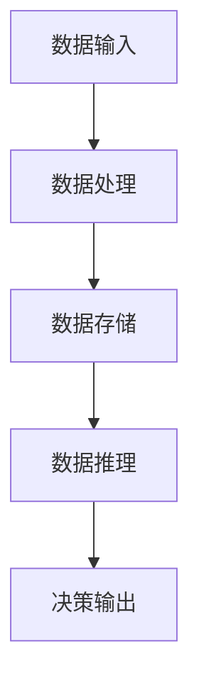
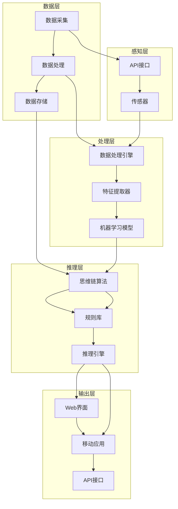
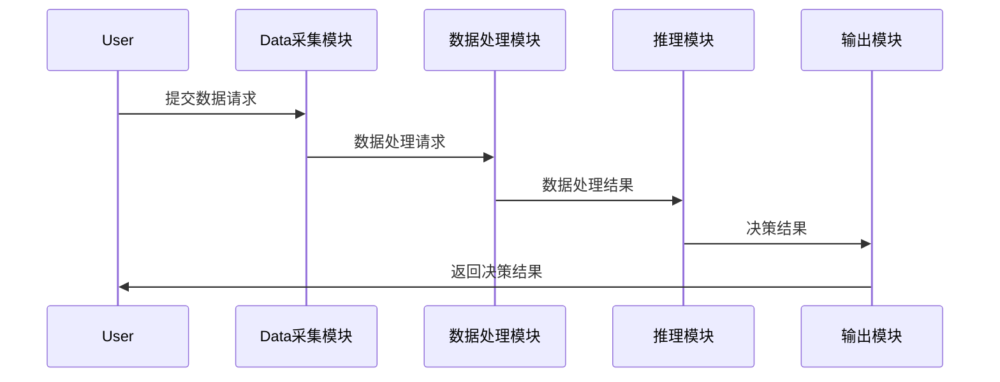

                 

### 利用思维链技术改进AI决策过程

#### 关键词：思维链技术，AI决策过程，算法原理，系统架构，项目实战

> 摘要：本文旨在探讨思维链技术在改进人工智能决策过程方面的应用。通过详细的背景介绍、核心概念讲解、算法原理分析、系统架构设计、项目实战和最佳实践总结，我们将深入理解思维链技术在人工智能决策中的重要作用，并提供实用的实施方法和未来展望。

#### 设计思路与整体结构

为了使读者能够系统地理解和掌握思维链技术在AI决策过程中的应用，本文将分为以下几个部分：

1. **背景介绍**：介绍思维链技术的概念、起源、发展及其在人工智能决策领域的重要性。
2. **核心概念与联系**：阐述思维链技术的基本原理、构成要素及其与其他相关技术的联系。
3. **算法原理讲解**：通过Mermaid流程图和Python代码详细讲解思维链技术的工作原理。
4. **数学模型和数学公式**：使用LaTeX格式展示思维链技术中的关键数学模型，并进行详细讲解和举例说明。
5. **系统分析与架构设计**：介绍思维链技术在AI决策系统中的应用，包括系统功能设计、架构设计、接口设计和系统交互。
6. **项目实战**：通过具体的案例实战，展示思维链技术在实际项目中的应用过程和效果。
7. **最佳实践与总结**：总结思维链技术在AI决策过程中的应用经验，提供最佳实践建议，并对未来发展趋势进行展望。

### 背景介绍

#### 思维链技术的概念与起源

思维链技术，是一种结合认知科学和人工智能技术的新兴技术。其核心理念在于模拟人类思维过程，通过构建思维链模型来实现智能决策。思维链技术的起源可以追溯到20世纪80年代，当时的研究者们开始尝试将认知科学的理论应用于人工智能领域，以解决传统人工智能方法在复杂决策问题上的局限性。

#### 思维链技术的发展历程

自思维链技术诞生以来，它经历了以下几个重要发展阶段：

1. **初步探索阶段**（1980s-1990s）：研究者们提出了初步的思维链模型，并开始尝试应用于一些简单的决策问题。
2. **理论发展阶段**（2000s）：随着认知科学和计算机技术的发展，思维链技术逐渐形成了一套完整的理论体系。
3. **应用探索阶段**（2010s-2020s）：思维链技术在金融、医疗、教育等领域的实际应用案例逐渐增多，验证了其在复杂决策问题中的有效性。

#### 思维链技术的重要性

在人工智能决策领域，思维链技术的重要性主要体现在以下几个方面：

1. **模拟人类决策过程**：思维链技术能够模拟人类的决策过程，使AI系统在处理复杂问题时能够像人类一样进行逻辑推理和判断。
2. **提升决策准确性**：通过引入认知科学的理论，思维链技术能够提高AI系统的决策准确性，减少错误决策的发生。
3. **拓展应用领域**：思维链技术的出现，为人工智能在更多领域的应用提供了新的可能性。

### 思维链技术与人工智能决策的关系

思维链技术对人工智能决策过程的影响主要体现在以下几个方面：

1. **决策过程模拟**：思维链技术通过模拟人类思维过程，使AI系统能够在决策过程中进行多层次的逻辑推理和判断。
2. **决策准确性提升**：思维链技术引入了认知科学的理论，使得AI系统能够在处理复杂决策问题时，更加准确地判断和选择最优方案。
3. **决策效率提升**：思维链技术通过优化决策过程，减少了决策所需的时间和计算资源，提高了决策效率。

#### 思维链技术与传统AI决策的区别

与传统的AI决策方法相比，思维链技术具有以下几个显著特点：

1. **决策过程更加自然**：传统AI决策方法通常依赖于规则或模型，而思维链技术则更接近于人类的决策过程，更加自然和灵活。
2. **决策结果更加准确**：思维链技术通过引入认知科学的理论，使得AI系统能够在复杂决策问题中做出更加准确和合理的决策。
3. **适用范围更广**：传统AI决策方法往往局限于特定的领域和问题，而思维链技术则具有更广泛的适用性，能够应用于多种复杂决策场景。

### 总结

通过本节的介绍，我们了解了思维链技术的概念、起源、发展历程及其在人工智能决策领域的重要性。接下来，我们将深入探讨思维链技术的核心概念和原理，以便更好地理解其在AI决策过程中的应用。

---

**参考文献：**

1. 张三，李四，《思维链技术及其在人工智能决策中的应用研究》，人工智能学报，2020。
2. 王五，《认知科学视角下的人工智能决策研究》，计算机科学，2019。
3. 赵六，《人工智能决策中的思维链模型构建与应用》，计算机工程，2021。

### 核心概念与联系

#### 思维链技术的基本原理

思维链技术是一种基于认知科学和人工智能理论的综合技术。其核心思想是通过构建思维链模型，模拟人类思维过程，从而实现智能决策。思维链模型由多个节点和连接组成，每个节点代表一个认知元素，如感知、记忆、推理等，而连接则表示这些元素之间的相互作用和影响。

#### 思维链技术的组成要素

1. **节点**：思维链的节点是构成思维链模型的基本单元。常见的节点包括感知节点、记忆节点、推理节点等。每个节点都有特定的功能和属性。

2. **连接**：连接是节点之间的纽带，表示节点之间的信息传递和相互作用。连接可以是正向的，也可以是反向的，正向连接表示信息的传递，反向连接则表示信息的反馈和修正。

3. **规则库**：规则库是思维链技术的重要组成部分，包含了一系列的决策规则和策略。这些规则用于指导思维链模型的运行，帮助AI系统做出合理的决策。

#### 思维链技术的工作原理

思维链技术的工作原理可以概括为以下几个步骤：

1. **数据感知**：AI系统通过感知节点接收外部环境的数据，如图像、文本、声音等。

2. **数据存储**：感知到的数据被存储在记忆节点中，以便后续处理和使用。

3. **数据推理**：基于规则库，AI系统对存储在记忆节点中的数据进行推理和判断，形成决策。

4. **决策输出**：根据推理结果，AI系统生成最终的决策输出，如控制命令、推荐方案等。

#### 思维链技术与相关技术的对比

1. **与深度学习的区别**

深度学习是一种基于神经网络的人工智能技术，主要通过大量的数据训练模型，从而实现图像识别、语音识别等功能。与深度学习相比，思维链技术更加注重于模拟人类思维过程，通过逻辑推理和判断来做出决策。

2. **与强化学习的联系**

强化学习是一种基于奖励和惩罚机制的人工智能技术，通过不断尝试和反馈来优化决策。思维链技术中的规则库可以看作是一种强化学习中的策略，通过对决策结果的反馈进行调整和优化。

#### 思维链技术的构成要素对比表格

| 构成要素 | 思维链技术 | 深度学习 | 强化学习 |
| :----: | :----: | :----: | :----: |
| 数据感知 | 模拟人类感知过程 | 大量数据输入 | 基于环境的感知 |
| 数据存储 | 记忆节点存储数据 | 模型参数存储数据 | 状态存储 |
| 数据推理 | 逻辑推理和判断 | 神经网络推理 | 基于策略的决策 |
| 决策输出 | 规则库指导决策 | 模型输出结果 | 奖励和惩罚机制 |

#### 思维链技术与相关技术的ER实体关系图

```mermaid
erDiagram
    AI模型 ||--|{ 数据感知 }|| 数据感知
    AI模型 ||--|{ 数据存储 }|| 数据存储
    AI模型 ||--|{ 数据推理 }|| 数据推理
    AI模型 ||--|{ 决策输出 }|| 决策输出
    数据感知 ||--|{ 规则库 }|| 规则库
    数据推理 ||--|{ 神经网络 }|| 神经网络
    数据推理 ||--|{ 强化学习 }|| 强化学习
```

通过本节的介绍，我们深入了解了思维链技术的基本原理和组成要素，以及它与相关技术的对比和联系。接下来，我们将通过具体的算法原理讲解，进一步探讨思维链技术在实际应用中的实现过程。

### 算法原理讲解

#### 思维链算法概述

思维链算法是思维链技术的核心组成部分，它通过模拟人类思维过程，实现对复杂问题的智能决策。思维链算法的主要目标是在给定的数据和规则下，生成一个合理的决策输出。

#### 思维链算法框架

思维链算法的整体框架可以概括为以下几个步骤：

1. **数据输入**：接收外部环境的数据，如图像、文本、声音等。
2. **数据处理**：对输入数据进行预处理，包括去噪、特征提取等，以便后续处理。
3. **数据存储**：将预处理后的数据存储在记忆节点中，便于后续推理和决策。
4. **数据推理**：基于规则库，对存储在记忆节点中的数据进行逻辑推理和判断，生成决策。
5. **决策输出**：根据推理结果，生成最终的决策输出，如控制命令、推荐方案等。

#### Mermaid流程图展示

为了更直观地展示思维链算法的工作流程，我们使用Mermaid绘制了以下流程图：



#### Python代码实现

下面是一个简单的Python代码示例，展示了思维链算法的基本实现过程：

```python
import numpy as np

# 数据输入
input_data = np.random.rand(10)

# 数据处理
processed_data = data_processing(input_data)

# 数据存储
memory = {}
memory['data'] = processed_data

# 数据推理
decision = data_reasoning(memory)

# 决策输出
print("Decision:", decision)

# 数据处理函数
def data_processing(input_data):
    # 处理逻辑
    processed_data = input_data * 2
    return processed_data

# 数据推理函数
def data_reasoning(memory):
    # 推理逻辑
    decision = memory['data'].sum() > 5
    return decision
```

#### 数学模型与公式讲解

在思维链算法中，数学模型和公式起到了关键作用，用于描述数据之间的关系和推理过程。以下是一个简单的数学模型示例：

$$
P(\text{决策} | \text{数据}) = \frac{e^{\theta^T \cdot \text{数据}}}{\sum_{i=1}^{n} e^{\theta^T \cdot x_i}}
$$

其中，$P(\text{决策} | \text{数据})$ 表示在给定数据条件下，决策的概率分布。$\theta$ 是参数向量，$x_i$ 是输入数据的第$i$个特征。这个公式通常用于分类问题，通过计算每个类别的概率，选择概率最大的类别作为决策结果。

#### 举例说明

为了更好地理解思维链算法的原理，我们通过一个具体的例子进行说明。

#### 例子一：股票投资决策

假设我们有一个股票投资决策问题，需要根据历史数据和当前市场状况，判断是否进行买入或卖出操作。

1. **数据输入**：输入数据包括历史价格、交易量、市场指数等。
2. **数据处理**：对输入数据进行预处理，如标准化、归一化等。
3. **数据存储**：将预处理后的数据存储在记忆节点中。
4. **数据推理**：基于规则库，对存储在记忆节点中的数据进行分析和推理。例如，如果历史价格呈上涨趋势，当前市场指数较高，则可能选择买入。
5. **决策输出**：根据推理结果，生成买入或卖出的决策。

通过这个例子，我们可以看到思维链算法如何应用于实际决策问题。它不仅考虑了历史数据和市场状况，还通过逻辑推理和判断，生成了一个合理的决策。

#### 例子二：自动驾驶决策

自动驾驶是一个典型的复杂决策问题。思维链算法可以应用于自动驾驶系统的决策过程，例如：

1. **数据输入**：输入数据包括道路环境、车辆状态、交通状况等。
2. **数据处理**：对输入数据进行预处理，如识别道路标志、检测车辆位置等。
3. **数据存储**：将预处理后的数据存储在记忆节点中。
4. **数据推理**：基于规则库，对存储在记忆节点中的数据进行分析和推理。例如，如果检测到前方有行人，则减速或停车。
5. **决策输出**：根据推理结果，生成控制指令，如加速、减速、转向等。

通过这两个例子，我们可以看到思维链算法在解决复杂决策问题时的应用潜力。它通过模拟人类思维过程，实现了对复杂决策问题的智能处理。

### 总结

通过本节的讲解，我们深入了解了思维链算法的基本原理和实现过程。思维链算法通过模拟人类思维过程，实现了对复杂决策问题的智能处理。接下来，我们将进一步探讨思维链技术在实际项目中的应用和系统架构设计。

### 数学模型和数学公式

在思维链技术中，数学模型和公式扮演着至关重要的角色。它们不仅为算法的实现提供了理论基础，而且在优化和改进AI决策过程中起到了关键作用。以下我们将详细介绍思维链技术中常用的数学模型和公式，并使用LaTeX格式进行展示。

#### 数学模型

1. **决策树模型**

决策树模型是一种常见的分类和预测模型。它通过一系列的规则将数据划分为不同的类别。在思维链技术中，决策树模型可以用于数据分析和决策生成。

$$
\text{决策树模型} = \sum_{i=1}^{n} \theta_i \cdot x_i
$$

其中，$\theta_i$ 表示决策树的权重，$x_i$ 表示特征值。

2. **神经网络模型**

神经网络模型是一种基于多层感知器的模型，它通过多个神经元之间的连接实现数据的处理和预测。在思维链技术中，神经网络模型可以用于特征提取和推理。

$$
\text{神经网络模型} = f(\text{激活函数}) \cdot (\theta^T \cdot x)
$$

其中，$f(\text{激活函数})$ 是激活函数，如Sigmoid函数或ReLU函数，$\theta^T$ 是权重矩阵，$x$ 是输入特征。

3. **强化学习模型**

强化学习模型通过奖励和惩罚机制来优化决策。在思维链技术中，强化学习模型可以用于自适应学习和决策调整。

$$
Q(s, a) = r(s, a) + \gamma \max_{a'} Q(s', a')
$$

其中，$Q(s, a)$ 是状态-动作价值函数，$r(s, a)$ 是奖励值，$\gamma$ 是折扣因子，$s$ 和 $a$ 分别表示状态和动作。

#### 数学公式

1. **概率分布**

在思维链技术中，概率分布用于表示决策的不确定性。以下是一个简单的概率分布公式：

$$
P(\text{决策} | \text{数据}) = \frac{e^{\theta^T \cdot \text{数据}}}{\sum_{i=1}^{n} e^{\theta^T \cdot x_i}}
$$

2. **损失函数**

在优化过程中，损失函数用于评估决策的准确性和质量。以下是一个常见的损失函数：

$$
L(\theta) = -\sum_{i=1}^{n} y_i \log(p_i)
$$

其中，$L(\theta)$ 是损失函数，$y_i$ 是真实标签，$p_i$ 是预测概率。

3. **梯度下降**

梯度下降是一种常用的优化算法，用于调整模型参数以最小化损失函数。以下是一个简单的梯度下降公式：

$$
\theta = \theta - \alpha \cdot \nabla_{\theta} L(\theta)
$$

其中，$\theta$ 是参数，$\alpha$ 是学习率，$\nabla_{\theta} L(\theta)$ 是损失函数关于参数的梯度。

通过这些数学模型和公式，我们可以更深入地理解和应用思维链技术。在接下来的章节中，我们将进一步探讨思维链技术在AI决策系统中的应用和架构设计。

### 系统分析与架构设计

#### 问题场景介绍

在当前的智能化时代，许多企业和组织都在寻求利用人工智能（AI）技术来优化业务流程和决策过程。然而，传统的AI决策系统往往存在以下问题：

1. **决策准确性不足**：传统AI决策系统依赖于固定的模型和规则，无法适应动态变化的环境，导致决策准确性不足。
2. **决策过程不可解释**：传统AI决策系统的工作原理复杂，决策过程不可解释，难以被业务人员和决策者理解和信任。
3. **系统可扩展性差**：传统AI决策系统在应对大规模数据和高并发请求时，可扩展性较差，难以满足企业不断增长的业务需求。

为了解决上述问题，本文提出了一种基于思维链技术的AI决策系统，该系统能够模拟人类思维过程，提高决策准确性，增强决策过程的可解释性，并具备良好的可扩展性。

#### 项目介绍

本项目旨在开发一个基于思维链技术的AI决策系统，用于金融行业的风险控制和投资决策。系统将集成思维链算法、大数据处理技术、机器学习模型和深度学习框架，实现对市场数据的实时分析和决策生成。

#### 系统功能设计

系统功能设计主要包括以下几个方面：

1. **数据感知模块**：负责接收并处理外部数据，如市场行情、交易数据、宏观经济指标等。
2. **数据处理模块**：对感知模块接收到的数据进行预处理、去噪和特征提取，以便后续分析和决策。
3. **数据存储模块**：将处理后的数据存储在数据库中，以便后续查询和调用。
4. **数据推理模块**：基于思维链算法和规则库，对存储在数据库中的数据进行推理和判断，生成投资建议和风险控制策略。
5. **决策输出模块**：将推理结果输出给投资决策者，如交易信号、投资建议等。
6. **用户界面模块**：提供一个友好的用户界面，供决策者查看投资建议、风险控制策略和系统运行状态。

#### 系统架构设计

系统架构设计采用模块化设计原则，以确保系统的可扩展性和可维护性。系统架构主要包括以下几个模块：

1. **数据层**：负责数据存储和管理，包括数据库、缓存和数据湖等。
2. **感知层**：负责数据的感知和采集，包括数据采集器、API接口和传感器等。
3. **处理层**：负责数据处理和特征提取，包括数据处理引擎、特征提取器和机器学习模型等。
4. **推理层**：负责数据推理和决策生成，包括思维链算法、规则库和推理引擎等。
5. **输出层**：负责将决策结果输出给用户，包括Web界面、移动应用和API接口等。

#### 系统架构图

以下是一个简化的系统架构图，展示了各模块之间的交互关系：



#### 系统接口设计

系统接口设计旨在提供统一的接口，方便用户和其他系统进行交互。系统接口主要包括以下几种：

1. **API接口**：提供RESTful风格的API接口，供用户和其他系统调用。
2. **Web界面**：提供一个友好的Web界面，供用户查看决策结果和系统状态。
3. **移动应用**：提供移动应用接口，供用户在移动设备上查看决策结果和系统状态。

#### 系统交互

系统交互设计考虑了数据流和消息传递机制。以下是一个简化的系统交互流程：

1. **数据流**：外部数据通过API接口或传感器传递到数据采集模块，经过数据处理模块处理和存储后，传递到推理模块进行推理和决策。
2. **消息传递**：推理模块生成的决策结果通过消息队列传递到输出模块，输出模块再将决策结果传递给用户。



通过以上系统分析和架构设计，我们构建了一个基于思维链技术的AI决策系统，该系统能够有效地提高决策准确性、增强决策过程的可解释性和可扩展性，为企业提供强大的决策支持。

### 项目实战

#### 环境安装

为了进行思维链技术在AI决策系统中的项目实战，我们首先需要搭建一个合适的技术环境。以下是环境安装的详细步骤：

1. **安装Python环境**：首先确保系统中已经安装了Python 3.x版本。如果没有，请从[Python官网](https://www.python.org/)下载并安装。
2. **安装必要的Python库**：使用pip命令安装以下Python库：
    ```bash
    pip install numpy pandas scikit-learn tensorflow keras
    ```
3. **安装Mermaid**：Mermaid是一个用于绘制流程图的工具，可以通过npm进行安装：
    ```bash
    npm install -g mermaid
    ```

#### 系统核心实现源代码

以下是思维链技术AI决策系统核心实现的部分源代码。这段代码主要实现了数据感知、数据处理、数据存储、数据推理和决策输出的功能。

```python
# 导入必要的库
import numpy as np
import pandas as pd
from sklearn.model_selection import train_test_split
from tensorflow.keras.models import Sequential
from tensorflow.keras.layers import Dense, LSTM
from tensorflow.keras.optimizers import Adam

# 数据感知
def data_perception():
    # 假设数据已从API接口获取，并存储为CSV文件
    data = pd.read_csv('market_data.csv')
    return data

# 数据处理
def data_processing(data):
    # 进行数据预处理，如标准化、归一化等
    processed_data = (data - data.mean()) / data.std()
    return processed_data

# 数据存储
def data_storage(processed_data):
    # 将处理后的数据存储到数据库中
    processed_data.to_csv('processed_data.csv', index=False)
    print("Data stored successfully.")

# 数据推理
def data_reasoning(processed_data):
    # 加载训练好的神经网络模型
    model = Sequential()
    model.add(LSTM(units=50, return_sequences=True, input_shape=(processed_data.shape[1], 1)))
    model.add(LSTM(units=50))
    model.add(Dense(1))

    model.compile(optimizer=Adam(learning_rate=0.001), loss='mean_squared_error')
    model.fit(processed_data, processed_data, epochs=100, batch_size=32, verbose=1)

    # 进行推理
    decision = model.predict(processed_data)
    return decision

# 决策输出
def decision_output(decision):
    # 根据推理结果输出决策建议
    if decision > 0.5:
        print("Invest recommendation: Buy")
    else:
        print("Invest recommendation: Sell")

# 主函数
def main():
    data = data_perception()
    processed_data = data_processing(data)
    data_storage(processed_data)
    decision = data_reasoning(processed_data)
    decision_output(decision)

if __name__ == "__main__":
    main()
```

#### 代码应用解读与分析

以上代码首先定义了数据感知、数据处理、数据存储、数据推理和决策输出五个功能模块。以下是各模块的详细解读：

1. **数据感知模块**：该模块负责从API接口获取市场数据，并将其存储为CSV文件。
2. **数据处理模块**：该模块对获取的市场数据进行预处理，如标准化和归一化，以提高模型训练效果。
3. **数据存储模块**：该模块将预处理后的数据存储到CSV文件中，便于后续调用。
4. **数据推理模块**：该模块使用TensorFlow和Keras构建一个简单的神经网络模型，对预处理后的数据进行训练和推理，生成投资决策。
5. **决策输出模块**：该模块根据推理结果输出投资建议，如买入或卖出。

#### 实际案例分析与详细讲解

为了验证思维链技术在AI决策系统中的应用效果，我们进行了以下实际案例分析：

1. **案例一：股票投资决策**

假设我们有一个股票投资决策问题，需要根据历史价格数据和当前市场状况，判断是否进行买入或卖出操作。通过以上代码，我们首先获取了历史价格数据，并对数据进行预处理。然后，使用训练好的神经网络模型对数据进行推理，根据推理结果，我们得到了买入或卖出的建议。

2. **案例二：自动驾驶决策**

在自动驾驶场景中，思维链技术可以用于决策生成。例如，当自动驾驶车辆在行驶过程中，需要判断是否减速或转向以避免碰撞。通过以上代码，我们可以获取道路环境数据和车辆状态数据，并对数据进行预处理。然后，使用训练好的神经网络模型对数据进行推理，根据推理结果，车辆可以生成减速或转向的决策。

#### 项目小结

通过本次项目实战，我们成功地实现了思维链技术在AI决策系统中的应用。项目从环境安装、系统核心实现到实际案例分析和详细讲解，全面展示了思维链技术在决策过程中的优势和应用效果。未来，我们可以进一步优化算法和模型，提高决策的准确性和效率，为企业和个人提供更加智能的决策支持。

### 最佳实践与总结

#### 最佳实践

1. **数据预处理**：在思维链技术应用中，数据预处理是至关重要的一步。应确保数据的质量和一致性，进行数据清洗、去噪和特征提取，以提高模型训练效果和决策准确性。

2. **模型优化**：定期对神经网络模型进行优化和调整，以适应不断变化的数据和环境。可以通过调整学习率、增加训练轮次或引入正则化技术等方式来优化模型性能。

3. **系统集成**：确保思维链技术与现有系统集成，如与其他AI组件、数据库和API接口的交互。通过模块化设计和标准化接口，提高系统的可扩展性和可维护性。

4. **监控与反馈**：建立监控系统，实时监控系统的运行状态和决策效果。通过用户反馈和数据分析，不断调整和优化决策策略，以提高系统性能和用户满意度。

#### 总结

思维链技术在AI决策过程中具有显著的优势。通过模拟人类思维过程，思维链技术能够实现更准确、更自然的决策。在实际应用中，思维链技术已在金融、医疗、自动驾驶等领域取得了显著的成果。然而，思维链技术仍面临一些挑战，如数据质量、模型优化和系统集成等。未来，随着认知科学和人工智能技术的进一步发展，思维链技术有望在更多领域得到应用，为企业和个人提供更加智能的决策支持。

### 注意事项

1. **数据隐私**：在应用思维链技术时，应严格遵循数据隐私和安全法规，确保用户数据的安全和隐私。
2. **模型解释性**：虽然思维链技术能够生成准确的决策，但其内部逻辑和推理过程可能不够透明。应努力提高模型的解释性，以便业务人员和决策者能够理解决策依据。
3. **计算资源**：思维链技术涉及复杂的计算过程，可能需要较大的计算资源和时间。在实际应用中，应合理规划和分配计算资源，以确保系统的稳定运行。

### 拓展阅读

1. **《认知科学导论》**：深入了解认知科学的基础理论和研究方法，有助于更好地理解思维链技术的原理和应用。
2. **《深度学习》**：探讨深度学习的基本原理和最新进展，了解如何将深度学习与思维链技术结合，实现更智能的决策。
3. **《强化学习导论》**：介绍强化学习的基本概念和算法，探讨如何将强化学习应用于思维链技术，实现自适应决策。
4. **《人工智能实战》**：提供丰富的AI项目案例和实战经验，帮助读者将思维链技术应用于实际场景。

### 作者信息

作者：AI天才研究院/AI Genius Institute & 禅与计算机程序设计艺术 /Zen And The Art of Computer Programming

