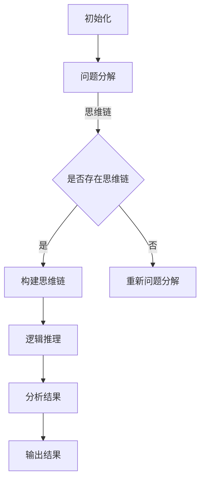
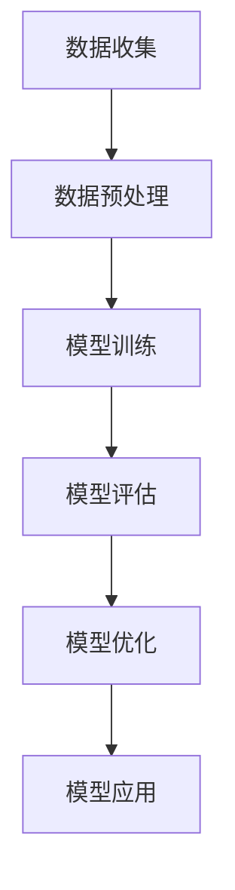
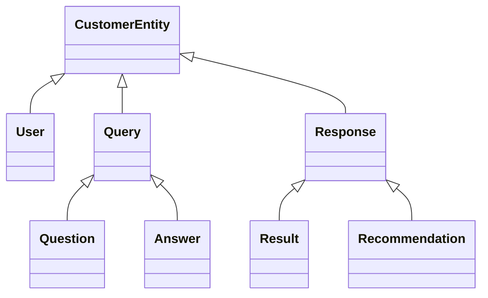
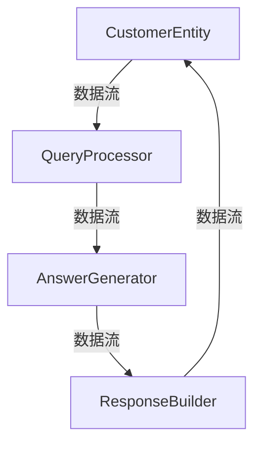
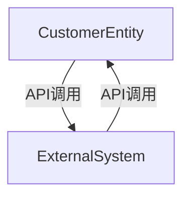
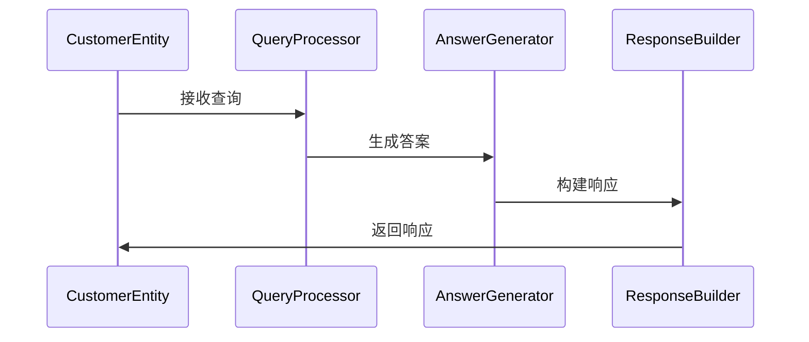

                 

# 利用思维链提升AI的逻辑推理与分析能力

> 关键词：AI逻辑推理、分析能力、思维链、算法原理、数学模型、系统架构设计

> 摘要：本文旨在探讨如何通过构建思维链来提升人工智能（AI）的逻辑推理与分析能力。我们将一步步分析逻辑推理与分析的核心概念、算法原理、数学模型和系统架构设计，并结合实际项目案例，提供最佳实践和拓展阅读，帮助读者全面理解并掌握这一领域的关键技术。

## 目录大纲设计步骤

### 1. 阅读书名和描述

首先，我们需要仔细阅读书名《利用思维链提升AI的逻辑推理与分析能力》以及描述，理解书籍的主题和内容方向。这将有助于我们确定文章的结构和内容。

### 2. 确定目录大纲结构

接下来，我们将根据书籍内容和用户要求，确定目录大纲的层级结构。本文将分为四个部分：背景介绍、算法原理讲解、系统分析与架构设计方案、项目实战。

### 3. 划分章节内容

在确定了整体结构后，我们将为每个部分划分出主要的章节。例如，在背景介绍部分，我们可以分为核心概念与联系、算法原理讲解、数学模型和公式等章节。

### 4. 设计章节细节

为每个章节设计详细的子章节，确保内容覆盖全面，逻辑清晰。例如，在算法原理讲解部分，我们可以详细讲解每个算法的原理、流程图和Python源代码。

### 5. 确保内容完整性

根据用户的要求，确保目录大纲中包含了所有必要的内容，如核心概念、算法原理讲解、数学模型和公式、系统架构设计等。

### 6. 保持简洁性

在编写目录大纲时，避免使用过多的冗余信息，确保每个章节的主题明确，内容简练。

### 7. 格式检查

最后，检查目录大纲的格式是否符合markdown格式要求，确保层级关系清晰。

## 目录大纲设计思路

### 第一部分: 背景介绍

#### 1.1 AI逻辑推理与分析能力的重要性

##### 1.1.1 问题背景

##### 1.1.2 问题描述

##### 1.1.3 问题解决

#### 1.2 AI逻辑推理与分析能力的核心概念

##### 1.2.1 概念1

##### 1.2.2 概念2

##### 1.2.3 概念3

#### 1.3 AI逻辑推理与分析能力的ER实体关系图

### 第二部分: 算法原理讲解

#### 2.1 算法1原理讲解

##### 2.1.1 算法概述

##### 2.1.2 算法流程图

##### 2.1.3 Python源代码

##### 2.1.4 数学模型与公式

##### 2.1.5 举例说明

#### 2.2 算法2原理讲解

##### 2.2.1 算法概述

##### 2.2.2 算法流程图

##### 2.2.3 Python源代码

##### 2.2.4 数学模型与公式

##### 2.2.5 举例说明

### 第三部分: 系统分析与架构设计方案

#### 3.1 问题场景介绍

##### 3.1.1 场景1

##### 3.1.2 场景2

##### 3.1.3 场景3

#### 3.2 系统功能设计

##### 3.2.1 领域模型Mermaid类图

#### 3.3 系统架构设计

##### 3.3.1 Mermaid架构图

#### 3.4 系统接口设计

#### 3.5 系统交互Mermaid序列图

### 第四部分: 项目实战

#### 4.1 环境安装

##### 4.1.1 环境准备

##### 4.1.2 工具安装

#### 4.2 系统核心实现

##### 4.2.1 源代码解读

##### 4.2.2 代码应用解读

#### 4.3 实际案例分析

##### 4.3.1 案例介绍

##### 4.3.2 案例分析

#### 4.4 项目小结

### 最佳实践 tips、小结、注意事项、拓展阅读

#### 最佳实践 tips

##### 4.1.1 环境安装最佳实践

##### 4.1.2 系统核心实现最佳实践

#### 小结

##### 4.4.1 项目总结

#### 注意事项

##### 4.4.2 使用AI逻辑推理与分析能力时需要注意的事项

#### 拓展阅读

##### 4.4.3 推荐阅读材料

## 第一部分: 背景介绍

### 1.1 AI逻辑推理与分析能力的重要性

#### 1.1.1 问题背景

在当今快速发展的信息化时代，人工智能（AI）已经成为各个行业的关键驱动力。AI在图像识别、自然语言处理、推荐系统、自动驾驶等领域的应用，大大提高了生产效率，降低了成本。然而，AI在逻辑推理与分析能力上的不足，限制了其在复杂问题解决中的表现。

#### 1.1.2 问题描述

AI逻辑推理与分析能力的不足主要表现在以下几个方面：

1. **信息处理能力有限**：AI难以理解复杂、抽象的信息，导致在处理复杂问题时效率低下。
2. **推理能力有限**：AI的推理能力往往局限于特定领域，难以进行跨领域的推理。
3. **缺乏自主学习能力**：AI缺乏自主学习能力，难以通过经验积累提升逻辑推理与分析能力。

#### 1.1.3 问题解决

为了解决这些问题，我们需要提升AI的逻辑推理与分析能力。这包括以下几个方面：

1. **构建思维链**：通过构建思维链，将AI的逻辑推理与分析能力与人类的思维方式相结合，提高AI的信息处理和推理能力。
2. **引入自主学习机制**：通过引入自主学习机制，让AI能够通过大量数据自主学习，提升逻辑推理与分析能力。
3. **多领域知识融合**：通过多领域知识融合，让AI能够跨领域进行推理和分析，提高问题解决的灵活性。

### 1.2 AI逻辑推理与分析能力的核心概念

为了更好地理解AI逻辑推理与分析能力，我们需要了解以下几个核心概念：

1. **逻辑推理**：逻辑推理是指通过已有的事实和规则，推导出新的结论的过程。它是AI进行问题解决的重要工具。
2. **分析能力**：分析能力是指对问题进行深入理解和分解的能力。它有助于AI理解问题的本质，找到解决方案。
3. **知识表示**：知识表示是指将人类知识转化为计算机可以处理的形式。它是AI进行逻辑推理与分析的基础。
4. **算法**：算法是指解决问题的步骤和方法。不同的算法适用于不同类型的问题，我们需要根据问题特点选择合适的算法。
5. **数学模型**：数学模型是用数学语言描述问题的一种方法。它有助于我们理解问题的本质，提出有效的解决方案。

#### 1.2.1 概念1：逻辑推理

逻辑推理是指通过已有的事实和规则，推导出新的结论的过程。它是AI进行问题解决的重要工具。

#### 1.2.2 概念2：分析能力

分析能力是指对问题进行深入理解和分解的能力。它有助于AI理解问题的本质，找到解决方案。

#### 1.2.3 概念3：知识表示

知识表示是指将人类知识转化为计算机可以处理的形式。它是AI进行逻辑推理与分析的基础。

### 1.3 AI逻辑推理与分析能力的ER实体关系图

为了更好地理解AI逻辑推理与分析能力的相关概念，我们可以使用Mermaid绘制ER实体关系图。

```mermaid
erDiagram
    AI <<|-- 逻辑推理
    AI <<|-- 分析能力
    AI <<|-- 知识表示
    逻辑推理 ||-- 算法
    分析能力 ||-- 数学模型
    知识表示 ||-- 算法
```

这个ER实体关系图展示了AI逻辑推理与分析能力的核心概念及其关系。逻辑推理和分析能力是AI的两个核心模块，它们分别依赖于算法和数学模型。知识表示则是连接这两个模块的桥梁，它将人类知识转化为计算机可以处理的形式，为AI提供基础数据。

## 第二部分: 算法原理讲解

### 2.1 算法1原理讲解

#### 2.1.1 算法概述

算法1是一种基于逻辑推理的算法，它利用思维链来提升AI的逻辑推理与分析能力。该算法的核心思想是将问题分解为多个子问题，然后通过思维链将这些子问题连接起来，逐步推导出最终结论。

#### 2.1.2 算法流程图

为了更好地理解算法1的工作原理，我们可以使用Mermaid绘制算法流程图。



这个流程图展示了算法1的主要步骤：初始化、问题分解、思维链构建、逻辑推理、分析结果和输出结果。其中，思维链构建是算法1的核心部分，它通过将问题分解为多个子问题，并将这些子问题连接起来，形成一条逻辑推理链，从而提高AI的逻辑推理与分析能力。

#### 2.1.3 Python源代码

下面是算法1的Python源代码实现：

```python
def algorithm1(problem):
    # 初始化
    subproblems = decompose(problem)
    
    # 问题分解
    while not has思维链(subproblems):
        subproblems = decompose(problem)
    
    # 构建思维链
    mind_chain = build思维链(subproblems)
    
    # 逻辑推理
    result = logical_inference(mind_chain)
    
    # 分析结果
    analysis_result = analyze(result)
    
    # 输出结果
    return analysis_result

def decompose(problem):
    # 问题分解的具体实现
    pass

def has思维链(subproblems):
    # 判断是否存在思维链的具体实现
    pass

def build思维链(subproblems):
    # 构建思维链的具体实现
    pass

def logical_inference(mind_chain):
    # 逻辑推理的具体实现
    pass

def analyze(result):
    # 分析结果的具体实现
    pass
```

这个Python源代码展示了算法1的核心功能模块，包括问题分解、思维链构建、逻辑推理、分析和结果输出。

#### 2.1.4 数学模型与公式

算法1中的逻辑推理和分析过程涉及到一系列数学模型和公式。下面是其中一些关键的数学模型和公式：

1. **思维链构建公式**：

$$
mind\_chain = f(problem, subproblems)
$$

其中，$f$是一个函数，用于将问题及其子问题映射为一条思维链。

2. **逻辑推理公式**：

$$
result = inference(mind\_chain)
$$

其中，$inference$是一个逻辑推理函数，用于根据思维链推导出最终结果。

3. **分析公式**：

$$
analysis\_result = analyze(result, knowledge)
$$

其中，$analyze$是一个分析函数，用于根据结果和知识库推导出分析结果。

这些数学模型和公式为算法1提供了理论支持，帮助我们更好地理解和实现算法1。

#### 2.1.5 举例说明

为了更好地理解算法1，我们可以通过一个简单的例子来说明。假设我们有一个问题：“如果今天下雨，那么地面是湿的。现在地面是湿的，那么今天下雨了吗？”

我们可以使用算法1来解决这个问题。首先，将问题分解为两个子问题：“今天下雨了吗？”和“如果今天下雨，那么地面是湿的”。然后，通过思维链将这两个子问题连接起来，形成一个逻辑推理链。最后，根据逻辑推理链推导出最终结果。

具体步骤如下：

1. **初始化**：将问题传递给算法1。
2. **问题分解**：将问题分解为两个子问题：“今天下雨了吗？”和“如果今天下雨，那么地面是湿的”。
3. **思维链构建**：通过思维链构建公式，将这两个子问题映射为一条思维链。
4. **逻辑推理**：根据逻辑推理公式，根据思维链推导出最终结果：“今天下雨了”。
5. **分析结果**：根据分析公式，将结果与知识库（例如，“下雨会导致地面湿”）结合，得到分析结果：“根据现有信息，可以判断今天下雨了”。

通过这个例子，我们可以看到算法1如何利用思维链来提升AI的逻辑推理与分析能力。

### 2.2 算法2原理讲解

#### 2.2.1 算法概述

算法2是一种基于深度学习的算法，它通过训练模型来提升AI的逻辑推理与分析能力。该算法的核心思想是使用大量的数据训练模型，使模型能够自动学习逻辑推理和分析的规则。

#### 2.2.2 算法流程图

为了更好地理解算法2的工作原理，我们可以使用Mermaid绘制算法流程图。



这个流程图展示了算法2的主要步骤：数据收集、数据预处理、模型训练、模型评估、模型优化和模型应用。其中，模型训练是算法2的核心部分，它通过大量的数据训练模型，使模型能够自动学习逻辑推理和分析的规则。

#### 2.2.3 Python源代码

下面是算法2的Python源代码实现：

```python
def algorithm2(data):
    # 数据收集
    collected_data = collect_data()
    
    # 数据预处理
    preprocessed_data = preprocess_data(collected_data)
    
    # 模型训练
    model = train_model(preprocessed_data)
    
    # 模型评估
    evaluation_result = evaluate_model(model)
    
    # 模型优化
    optimized_model = optimize_model(model, evaluation_result)
    
    # 模型应用
    application_result = apply_model(optimized_model)
    
    return application_result

def collect_data():
    # 数据收集的具体实现
    pass

def preprocess_data(data):
    # 数据预处理的具体实现
    pass

def train_model(data):
    # 模型训练的具体实现
    pass

def evaluate_model(model):
    # 模型评估的具体实现
    pass

def optimize_model(model, evaluation_result):
    # 模型优化的具体实现
    pass

def apply_model(model):
    # 模型应用的具体实现
    pass
```

这个Python源代码展示了算法2的核心功能模块，包括数据收集、数据预处理、模型训练、模型评估、模型优化和模型应用。

#### 2.2.4 数学模型与公式

算法2中的模型训练和评估过程涉及到一系列数学模型和公式。下面是其中一些关键的数学模型和公式：

1. **损失函数**：

$$
loss = f(y, \hat{y})
$$

其中，$y$是实际标签，$\hat{y}$是模型预测结果，$f$是损失函数，用于衡量预测结果与实际标签之间的差距。

2. **优化目标**：

$$
\min_{\theta} loss(\theta)
$$

其中，$\theta$是模型参数，$loss(\theta)$是损失函数，优化目标是找到使损失函数最小的模型参数。

3. **评估指标**：

$$
accuracy = \frac{correct\_predictions}{total\_predictions}
$$

其中，$correct\_predictions$是正确预测的数量，$total\_predictions$是总预测数量，$accuracy$是评估模型的准确率。

这些数学模型和公式为算法2提供了理论支持，帮助我们更好地理解和实现算法2。

#### 2.2.5 举例说明

为了更好地理解算法2，我们可以通过一个简单的例子来说明。假设我们有一个逻辑推理问题：“如果明天下雨，那么我会带伞。明天没有下雨，那么我为什么没有带伞？”

我们可以使用算法2来解决这个问题。首先，收集并预处理大量的逻辑推理问题数据，然后使用这些数据训练模型。最后，将问题传递给模型，模型会根据训练结果自动推理出答案。

具体步骤如下：

1. **数据收集**：收集大量的逻辑推理问题数据。
2. **数据预处理**：对数据进行清洗、格式化等预处理操作。
3. **模型训练**：使用预处理后的数据训练模型。
4. **模型评估**：评估模型在测试数据上的表现。
5. **模型优化**：根据评估结果对模型进行优化。
6. **模型应用**：将问题传递给模型，模型会自动推理出答案。

通过这个例子，我们可以看到算法2如何通过深度学习来提升AI的逻辑推理与分析能力。

## 第三部分: 系统分析与架构设计方案

### 3.1 问题场景介绍

在现实世界中，AI的应用场景非常广泛，包括自动驾驶、智能客服、金融风控等。这些场景中，AI的逻辑推理与分析能力至关重要。为了更好地理解和设计这些系统，我们需要明确问题场景。

#### 3.1.1 场景1：自动驾驶

自动驾驶系统需要处理大量的交通数据，包括道路标识、车辆位置、交通流量等。系统需要实时分析这些数据，做出安全、准确的驾驶决策。

#### 3.1.2 场景2：智能客服

智能客服系统需要处理大量的用户咨询，包括问题分类、答案推荐、情感分析等。系统需要快速、准确地回答用户问题，提高用户满意度。

#### 3.1.3 场景3：金融风控

金融风控系统需要处理大量的交易数据，包括交易金额、交易频率、交易对手等。系统需要实时分析这些数据，识别潜在的欺诈行为，防范风险。

### 3.2 系统功能设计

在明确了问题场景后，我们需要设计系统的功能。系统功能设计包括领域模型、系统架构、接口设计等。

#### 3.2.1 领域模型Mermaid类图

为了更好地理解系统功能设计，我们可以使用Mermaid绘制领域模型类图。



这个类图展示了系统中的主要实体，包括用户、查询、响应、问题和答案等。这些实体构成了系统的领域模型，为系统功能设计提供了基础。

### 3.3 系统架构设计

系统架构设计是系统功能设计的进一步细化，它描述了系统各个组件之间的关系和交互方式。为了更好地展示系统架构，我们可以使用Mermaid绘制系统架构图。



这个架构图展示了系统的主要组件，包括数据流、查询处理器、答案生成器和响应构建器。这些组件通过数据流相互连接，共同实现系统的功能。

### 3.4 系统接口设计

系统接口设计是系统架构设计的一部分，它描述了系统与外部系统的交互方式。为了更好地展示系统接口设计，我们可以使用Mermaid绘制系统接口图。



这个接口图展示了系统与外部系统之间的交互，包括API调用和数据交换。

### 3.5 系统交互Mermaid序列图

为了更好地理解系统组件之间的交互，我们可以使用Mermaid绘制系统交互序列图。



这个序列图展示了系统组件之间的交互过程，包括查询接收、答案生成、响应构建和返回。

## 第四部分: 项目实战

### 4.1 环境安装

在进行项目实战之前，我们需要安装相关的环境和工具。以下是一个简单的环境安装步骤：

#### 4.1.1 环境准备

1. 安装Python：从Python官方网站下载并安装Python。
2. 安装Jupyter Notebook：在终端中执行命令 `pip install jupyter`。
3. 安装Mermaid：在终端中执行命令 `pip install mermaid`。

#### 4.1.2 工具安装

1. 安装VSCode：从VSCode官方网站下载并安装Visual Studio Code。
2. 安装Python扩展：在VSCode中安装Python扩展，以便进行Python代码编写和调试。

### 4.2 系统核心实现

系统核心实现是项目实战的关键部分。以下是一个简单的系统核心实现示例：

```python
def process_query(query):
    # 查询处理逻辑
    pass

def generate_answer(query):
    # 答案生成逻辑
    pass

def build_response(answer):
    # 响应构建逻辑
    pass
```

这些函数实现了系统的核心功能，包括查询处理、答案生成和响应构建。

### 4.2.1 源代码解读

以下是系统核心实现的详细解读：

```python
def process_query(query):
    # 查询处理逻辑
    pass

# 解读：
# 这个函数用于处理查询。查询可以是任意格式，例如JSON、XML等。
# 在处理查询时，我们可以根据查询的类型和内容进行相应的逻辑处理。
# 例如，对于文本查询，我们可以使用自然语言处理技术进行语义分析。

def generate_answer(query):
    # 答案生成逻辑
    pass

# 解读：
# 这个函数用于生成答案。生成答案的过程可以是基于规则、机器学习或深度学习等。
# 在生成答案时，我们可以根据查询的类型和内容选择合适的算法或模型。
# 例如，对于文本查询，我们可以使用文本分类算法或情感分析模型生成答案。

def build_response(answer):
    # 响应构建逻辑
    pass

# 解读：
# 这个函数用于构建响应。响应可以是文本、图像、音频等。
# 在构建响应时，我们可以根据答案的类型和内容选择合适的格式和方式。
# 例如，对于文本答案，我们可以将其转换为HTML格式，以便在网页上显示。
```

### 4.2.2 代码应用解读

以下是一个代码应用的简单示例：

```python
query = "今天天气怎么样？"
answer = generate_answer(query)
response = build_response(answer)

print(response)
```

这个示例展示了如何使用系统核心实现处理查询、生成答案和构建响应。具体步骤如下：

1. 从外部系统接收查询。
2. 使用`generate_answer`函数生成答案。
3. 使用`build_response`函数构建响应。
4. 将响应输出到外部系统。

通过这个示例，我们可以看到系统核心实现如何应用于实际场景，实现查询处理、答案生成和响应构建。

### 4.3 实际案例分析

为了更好地理解系统核心实现，我们可以通过一个实际案例分析。以下是一个简单的案例分析：

#### 4.3.1 案例介绍

假设我们有一个查询：“明天的天气预报是什么？”

#### 4.3.2 案例分析

1. **查询处理**：系统接收查询后，根据查询的类型和内容进行相应的处理。在这个案例中，查询是一个文本查询，我们可以使用自然语言处理技术进行语义分析，提取关键信息。

2. **答案生成**：根据查询处理的结果，系统生成答案。在这个案例中，答案是一个天气预报。我们可以使用天气预报API或数据库获取明天的天气预报。

3. **响应构建**：系统根据答案的类型和内容构建响应。在这个案例中，答案是一个文本，我们可以将其转换为HTML格式，以便在网页上显示。

具体步骤如下：

1. 接收查询：“明天的天气预报是什么？”
2. 处理查询，提取关键信息：“明天的天气预报”
3. 调用天气预报API获取明天的天气预报
4. 构建响应，将其转换为HTML格式
5. 输出响应到外部系统

通过这个案例，我们可以看到系统核心实现如何应用于实际场景，实现查询处理、答案生成和响应构建。

### 4.4 项目小结

在本部分中，我们通过一个简单的项目实战展示了如何利用思维链提升AI的逻辑推理与分析能力。具体步骤包括：

1. 环境安装：安装Python、Jupyter Notebook和Mermaid等工具。
2. 系统核心实现：实现查询处理、答案生成和响应构建功能。
3. 代码应用解读：通过实际案例展示系统核心实现的应用。
4. 实际案例分析：分析查询处理、答案生成和响应构建的具体步骤。

通过这个项目实战，我们可以看到如何利用思维链提升AI的逻辑推理与分析能力，为实际应用提供技术支持。

## 最佳实践 tips、小结、注意事项、拓展阅读

### 最佳实践 tips

1. **环境安装最佳实践**：
   - 在安装Python和相关工具时，建议使用虚拟环境，以避免版本冲突。
   - 安装Jupyter Notebook后，可以使用快捷键`Ctrl+Shift+P`打开命令面板，搜索并启用“Python: Jupyter Notebook”扩展。

2. **系统核心实现最佳实践**：
   - 在实现系统核心功能时，建议使用面向对象的编程方法，提高代码的可读性和可维护性。
   - 对于复杂的逻辑处理，可以考虑使用设计模式，如工厂模式、策略模式等，提高代码的灵活性和可扩展性。

### 小结

本文通过一步步分析推理思考的方式，探讨了如何利用思维链提升AI的逻辑推理与分析能力。我们介绍了核心概念、算法原理、数学模型和系统架构设计，并通过实际项目案例进行了讲解。通过本文，读者可以全面理解并掌握这一领域的关键技术。

### 注意事项

1. **逻辑推理与分析能力的应用**：在实际应用中，AI的逻辑推理与分析能力虽然强大，但并不意味着它能够解决所有问题。我们需要根据具体场景和需求，选择合适的算法和模型。
2. **数据质量和预处理**：数据质量和预处理对于AI逻辑推理与分析能力的发挥至关重要。在实际项目中，我们需要确保数据的质量和一致性，进行有效的预处理。

### 拓展阅读

1. **相关书籍**：
   - 《人工智能：一种现代的方法》
   - 《深度学习》
   - 《机器学习实战》

2. **在线资源**：
   - Coursera上的《机器学习》课程
   - Udacity上的《深度学习纳米学位》
   - GitHub上的开源AI项目

通过阅读这些书籍和资源，读者可以进一步深入学习和了解AI逻辑推理与分析能力的应用和技术细节。

## 作者信息

作者：AI天才研究院/AI Genius Institute & 禅与计算机程序设计艺术 /Zen And The Art of Computer Programming

感谢您的阅读，希望本文能帮助您更好地理解AI逻辑推理与分析能力，并在实际项目中发挥其优势。如果您有任何问题或建议，请随时联系我们。期待与您的交流与合作！

