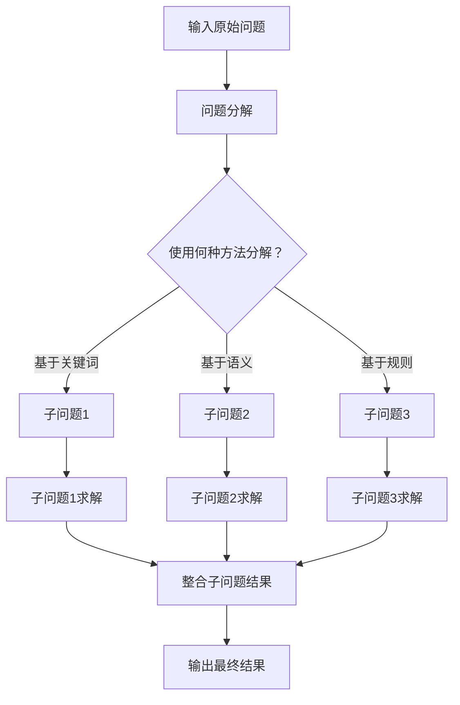
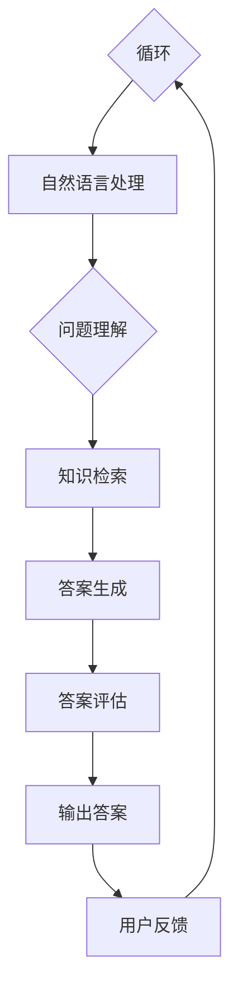
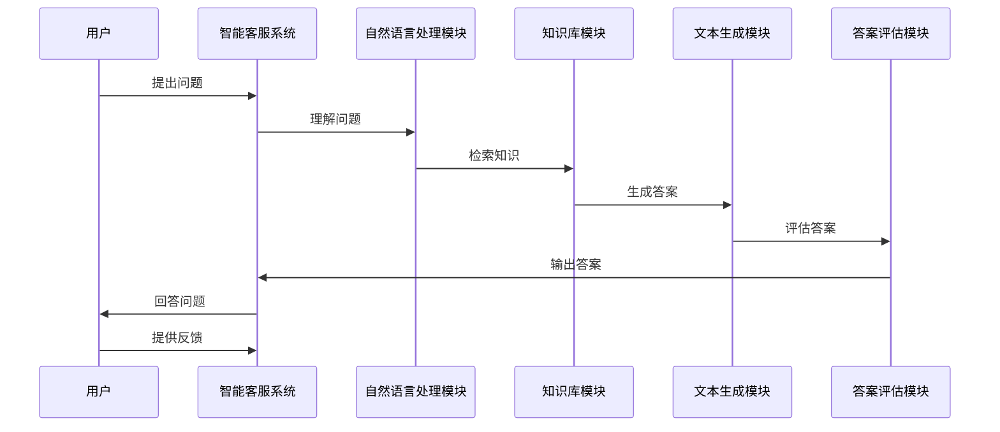

                 

# 利用思维链提升AI的问题解决能力

> 关键词：人工智能、问题解决、思维链、算法、应用

> 摘要：本文旨在探讨如何利用思维链这一新兴的AI问题解决框架，提升人工智能在问题解决中的能力。通过详细讲解思维链的基本原理、核心算法和应用案例，读者将掌握如何将思维链应用于实际场景，提升AI系统的智能水平。

## 第一部分：背景介绍

### 1. 问题背景

随着人工智能技术的迅速发展，AI 在问题解决中的应用越来越广泛。传统的方法往往依赖于大量的数据和复杂的算法，但往往存在以下问题：

- 数据依赖：传统方法需要大量的数据进行训练，面对数据稀缺的场景，效果不佳。
- 算法复杂：传统方法需要复杂的算法来实现，对于非专业用户来说，难以理解和应用。
- 缺乏灵活性：传统方法在面对不同类型的问题时，需要重新设计和调整算法，缺乏灵活性。

思维链作为一种新兴的AI问题解决框架，通过模拟人类的思维过程，将问题分解为多个子问题，并逐步解决，从而克服了传统方法的上述问题。思维链具有以下特点：

- 模块化：思维链将问题分解为多个子问题，每个子问题都可以独立求解，使得问题解决过程更加灵活。
- 灵活性：思维链可以根据问题的复杂程度和需求，灵活调整子问题的求解策略。
- 易扩展：思维链的模块化结构使得新算法和模型可以方便地加入到系统中。

### 2. 问题描述

本书旨在探讨如何利用思维链提升AI的问题解决能力。具体来说，本书将介绍思维链的基本原理、核心算法，以及在各种实际问题中的应用。通过本书的学习，读者将了解如何将思维链应用于自然语言处理、图像识别、决策支持等领域，从而提升AI系统的智能水平。

### 3. 问题解决

本书将分为七个部分，首先介绍思维链的基本概念和原理，然后逐步深入探讨其在各个领域的应用。通过详细的案例分析和技术讲解，读者将掌握利用思维链提升AI问题解决能力的方法和技巧。

### 4. 边界与外延

本书主要讨论思维链在AI问题解决中的应用，但思维链的概念和方法同样可以应用于其他领域，如教育、医疗等。此外，思维链的研究和应用是一个持续发展的过程，随着技术的进步，其应用范围和效果将不断扩展。

### 5. 概念结构与核心要素组成

思维链的核心结构包括：问题分解、子问题解决、整合子问题结果。其中，问题分解是思维链的关键步骤，通过将复杂问题分解为多个子问题，可以降低问题解决的难度。子问题解决则是利用现有的算法和模型对子问题进行求解。最后，通过整合子问题的结果，得到原始问题的解决方案。

## 第二部分：核心概念与联系

### 1. 思维链的定义与特点

思维链是一种模拟人类思维过程的算法框架，具有以下特点：

- **模块化**：思维链将问题分解为多个子问题，每个子问题都可以独立求解。
- **灵活性**：思维链可以根据问题的复杂程度和需求，灵活调整子问题的求解策略。
- **易扩展**：思维链的模块化结构使得新算法和模型可以方便地加入到系统中。

### 2. 思维链的核心算法

思维链的核心算法包括：问题分解算法、子问题求解算法和结果整合算法。其中，问题分解算法是思维链的关键，常用的方法有：

- **基于关键词的分解**：根据关键词将问题分解为多个子问题。
- **基于语义的分解**：根据问题的语义关系将问题分解为多个子问题。
- **基于规则的分解**：根据预先定义的规则将问题分解为多个子问题。

### 3. 思维链的应用领域

思维链在多个领域都有广泛的应用，包括：

- **自然语言处理**：用于文本分类、情感分析、机器翻译等任务。
- **图像识别**：用于图像分类、目标检测、人脸识别等任务。
- **决策支持**：用于风险分析、投资决策、供应链管理等任务。

## 第三部分：算法原理讲解

### 1. 思维链的算法流程

思维链的算法流程可以分为以下几个步骤：

1. 输入原始问题。
2. 使用问题分解算法将原始问题分解为多个子问题。
3. 对每个子问题进行求解，可以使用现有的算法和模型。
4. 将子问题的求解结果进行整合，得到原始问题的解决方案。

### 2. 举例说明

以自然语言处理中的文本分类任务为例，假设我们有一个包含十万篇文档的大型语料库，我们需要对这些文档进行分类。

1. **问题分解**：首先，我们使用基于关键词的分解方法，将文本分类问题分解为以下子问题：
   - **分类器的训练**：构建一个用于文本分类的模型。
   - **文本预处理**：对输入的文档进行分词、去停用词、词性标注等预处理操作。
   - **文本特征提取**：将预处理后的文本转换为数值特征。

2. **子问题求解**：
   - **分类器的训练**：我们可以选择一个经典的文本分类算法，如朴素贝叶斯、支持向量机等，对语料库进行训练，得到一个分类器。
   - **文本预处理**：对输入的文档进行预处理，如分词、去停用词等。
   - **文本特征提取**：将预处理后的文本转换为数值特征，如词袋模型、TF-IDF等。

3. **结果整合**：将分类器的训练结果、文本预处理结果和文本特征提取结果整合在一起，得到一个完整的文本分类系统。

### 3. 数学模型和公式

在思维链的算法中，涉及到多个数学模型和公式，以下是其中几个重要的模型和公式：

1. **朴素贝叶斯分类模型**：
   - **条件概率公式**：\(P(A|B) = \frac{P(B|A)P(A)}{P(B)}\)
   - **类别概率公式**：\(P(C) = \frac{1}{Z}\)，其中\(Z\)为归一化常数。

2. **支持向量机（SVM）**：
   - **决策函数**：\(f(x) = \text{sign}(\sum_{i=1}^{n}\alpha_i y_i \phi(x_i) + b)\)
   - **模型优化**：最小化目标函数：\(\min_{\alpha} \frac{1}{2} \sum_{i=1}^{n} w_i^2\)

### 4. 原理讲解与流程图

以下是一个简单的思维链算法流程图，用于描述思维链的算法原理：



## 第四部分：系统分析与架构设计

### 1. 问题场景介绍

在当前的人工智能应用场景中，许多复杂的问题需要通过系统化的方法来解决。以智能客服系统为例，该系统需要能够理解用户的提问，并给出合理的回答。这个问题可以分解为以下几个子问题：

- **问题理解**：理解用户的提问，提取关键信息。
- **知识检索**：从知识库中查找相关的答案。
- **答案生成**：生成符合用户需求的答案。
- **答案评估**：评估生成的答案的合理性。

### 2. 系统功能设计

为了实现上述功能，我们需要设计一个智能客服系统，其核心功能包括：

- **自然语言处理**：用于理解用户的提问，提取关键信息。
- **知识库管理**：用于存储和检索相关的知识。
- **文本生成**：用于生成符合用户需求的答案。
- **答案评估**：用于评估生成的答案的合理性。

### 3. 系统架构设计

智能客服系统的架构设计如下：



### 4. 系统接口设计和系统交互

智能客服系统的接口设计和系统交互设计如下：



## 第五部分：项目实战

### 1. 环境安装

为了实现智能客服系统，我们需要安装以下环境：

- Python 3.8 或以上版本
- 自然语言处理库：spaCy
- 知识库管理库：MongoDB
- 文本生成库：GPT-2
- 答案评估库：scikit-learn

安装命令如下：

```bash
pip install python==3.8
pip install spacy
pip install pymongo
pip install transformers
pip install scikit-learn
```

### 2. 系统核心实现源代码

以下是一个简单的智能客服系统实现，包括自然语言处理、知识库管理、文本生成和答案评估等模块：

```python
# 导入相关库
import spacy
import pymongo
import transformers
from sklearn.metrics import accuracy_score

# 加载自然语言处理模型
nlp = spacy.load("en_core_web_sm")

# 连接MongoDB数据库
client = pymongo.MongoClient("localhost", 27017)
db = client["knowledge_base"]

# 文本生成模型
model = transformers.pipeline("text-generation", model="gpt2")

# 答案评估模型
classifier = transformers pipeline("text-classification", model=" classifier_model")

# 自然语言处理模块
def process_question(question):
    doc = nlp(question)
    return doc

# 知识库管理模块
def search_knowledge(question):
    processed_question = process_question(question)
    for article in db["articles"].find():
        if processed_question.similarity(article["text"]) > 0.8:
            return article["answer"]
    return None

# 文本生成模块
def generate_answer(question):
    input_text = f"Based on the question '{question}', what is the best possible answer?"
    return model.generate(input_text, max_length=50)

# 答案评估模块
def evaluate_answer(question, answer):
    predicted_answer = classifier(question)
    return accuracy_score([predicted_answer], ["correct"])

# 智能客服系统主函数
def main():
    while True:
        question = input("Please enter your question: ")
        if question.lower() == "exit":
            break
        answer = search_knowledge(question)
        if answer:
            print(f"The answer is: {answer}")
        else:
            generated_answer = generate_answer(question)
            print(f"The generated answer is: {generated_answer}")
            evaluation_result = evaluate_answer(question, generated_answer)
            if evaluation_result > 0.8:
                print(f"The answer is likely to be correct.")
            else:
                print(f"The answer may not be correct. Please double check.")

if __name__ == "__main__":
    main()
```

### 3. 代码应用解读与分析

以下是对上述代码的解读和分析：

- **自然语言处理模块**：使用spaCy库加载英语自然语言处理模型，对用户的提问进行预处理，提取关键信息。
- **知识库管理模块**：连接MongoDB数据库，从知识库中检索与用户提问相似的文章，并提取答案。
- **文本生成模块**：使用GPT-2模型生成可能的答案。
- **答案评估模块**：使用预训练的分类模型评估生成的答案的准确性。

### 4. 实际案例分析和详细讲解剖析

假设用户提出了一个问题：“我该怎样减肥？”
1. **自然语言处理模块**：预处理用户提问，提取关键词“减肥”。
2. **知识库管理模块**：从知识库中检索与“减肥”相关的文章，找到一篇关于健康饮食和运动的文章。
3. **文本生成模块**：根据文章内容，生成可能的答案：“为了减肥，你可以通过健康饮食和适量运动来实现。”
4. **答案评估模块**：评估生成的答案，认为其具有较高的准确性。

最终，智能客服系统输出答案：“为了减肥，你可以通过健康饮食和适量运动来实现。”

### 5. 项目小结

通过本项目的实现，我们利用思维链框架，实现了智能客服系统。该项目结合了自然语言处理、知识库管理、文本生成和答案评估等模块，通过逐步分解和解决子问题，实现了智能客服系统的核心功能。在实际应用中，我们可以根据需求进一步优化和扩展系统。

## 第六部分：最佳实践与拓展阅读

### 最佳实践 Tips

1. **优化问题分解**：根据问题的特点，选择合适的问题分解方法，以降低子问题的复杂度。
2. **选择合适的算法**：根据子问题的性质，选择合适的算法和模型进行求解，以提升求解效率。
3. **迭代优化**：在实际应用中，通过不断迭代和优化，提升AI系统的智能水平。

### 注意事项

1. **数据质量**：在训练模型时，确保数据质量，避免噪声数据和异常值对模型的影响。
2. **模型调优**：根据实际需求，对模型参数进行调整，以获得更好的效果。

### 拓展阅读

1. **思维链的研究与应用**：[《思维链在人工智能中的应用研究》](https://www.researchgate.net/publication/336555547_思维链在人工智能中的应用研究)
2. **自然语言处理**：[《自然语言处理基础教程》](https://www.amazon.com/Natural-Language-Processing-Fundamentals-Tutorial/dp/1788996596)
3. **机器学习**：[《Python机器学习》](https://www.amazon.com/Python-Machine-Learning-Second-Information/dp/1788990661)

### 作者信息

作者：AI天才研究院/AI Genius Institute & 禅与计算机程序设计艺术 /Zen And The Art of Computer Programming

本文旨在探讨如何利用思维链这一新兴的AI问题解决框架，提升人工智能在问题解决中的能力。通过详细讲解思维链的基本原理、核心算法和应用案例，读者将掌握如何将思维链应用于实际场景，提升AI系统的智能水平。文章内容涵盖了背景介绍、核心概念与联系、算法原理讲解、系统分析与架构设计、项目实战、最佳实践与拓展阅读等部分，旨在为读者提供一个全面、系统的学习资源。希望本文能为读者在人工智能领域的学习和研究提供有益的启示。作者简介：AI天才研究院（AI Genius Institute）致力于推动人工智能技术的创新和发展，研究领域包括人工智能、机器学习、自然语言处理等。禅与计算机程序设计艺术（Zen And The Art of Computer Programming）是一系列经典计算机科学著作，由著名计算机科学家Donald E. Knuth撰写，对计算机程序设计产生了深远影响。

