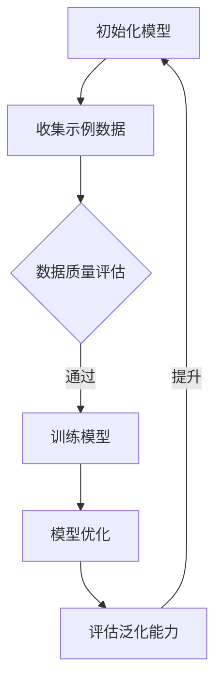
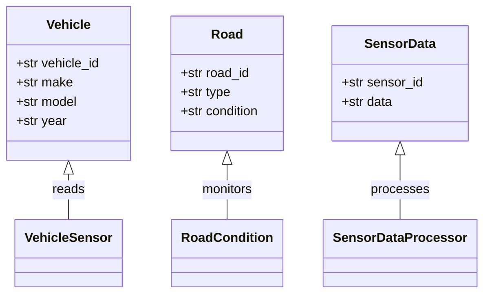
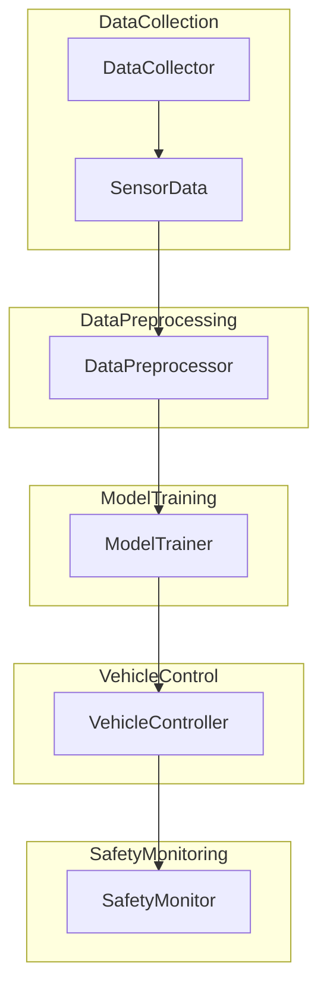

                 


## 利用示例增强模型的泛化能力

### 关键词：示例增强模型、泛化能力、模型优化、AI系统设计

#### 摘要：
本文将深入探讨如何通过示例增强模型（Example-Enhanced Model）来提升人工智能模型的泛化能力。文章首先介绍背景和问题，然后详细解释示例增强模型的基本原理和算法流程，并通过实际案例展示其在系统架构设计中的应用。最后，本文将总结最佳实践，并提供拓展阅读资源。

## 第一部分：背景介绍

### 1.1 问题背景

#### 1.1.1 人工智能与模型泛化的现状
随着人工智能技术的飞速发展，越来越多的模型被应用于各种领域。然而，尽管模型在特定任务上的性能表现优异，但它们的泛化能力却往往不足。这导致了模型在新的、未见过的情况下表现不佳，影响了实际应用的广泛性和可靠性。

#### 1.1.2 模型泛化的重要性
模型的泛化能力是其能否成功应用于实际问题的关键。一个泛化能力强的模型可以应对多种不同的场景和数据，而不需要重新训练或调整。这不仅能降低成本，还能提高系统的可靠性和适应性。

#### 1.1.3 当前模型泛化能力面临的挑战
模型泛化能力不足的原因多种多样，包括数据质量差、模型复杂性不足、缺乏多样化的训练数据等。这些问题使得现有的模型很难达到理想的泛化性能。

### 1.2 问题描述

#### 1.2.1 模型泛化能力不足的具体表现
泛化能力不足的表现包括模型在新数据上的表现不佳、对特定数据集的过度拟合、无法适应动态变化的环境等。

#### 1.2.2 泛化能力不足带来的影响
泛化能力不足会直接影响模型的实用性和商业价值。如果模型不能在新场景中良好运行，那么它就可能无法在市场上获得成功。

#### 1.2.3 解决方案的需求分析
为了解决模型泛化能力不足的问题，需要找到一种方法来增强模型的泛化能力。示例增强模型提供了一种可能的解决方案。

### 1.3 问题解决

#### 1.3.1 利用示例增强模型泛化能力的理论基础
示例增强模型通过利用额外的示例数据来增强模型的泛化能力。这些额外的示例数据可以帮助模型更好地理解数据的分布，从而提高其泛化能力。

#### 1.3.2 示例增强模型的基本原理
示例增强模型的基本原理是利用样本数据的多样性和分布特性，通过增加额外的示例数据来提高模型对未见数据的适应性。

#### 1.3.3 实施示例增强模型的方法
实施示例增强模型的方法包括数据收集、数据预处理、模型训练、模型优化和评估等多个步骤。

### 1.4 边界与外延

#### 1.4.1 模型泛化能力的边界
模型的泛化能力受到数据集、模型结构、训练策略等多种因素的影响，因此存在一定的边界。

#### 1.4.2 示例增强模型的应用范围
示例增强模型可以应用于各种机器学习和深度学习任务，特别是那些需要高泛化能力的场景。

#### 1.4.3 面临的限制和潜在问题
示例增强模型也面临一些限制，例如示例数据的可用性、数据质量和模型复杂性等。

### 1.5 概念结构与核心要素组成

#### 1.5.1 相关概念介绍
本文将介绍与示例增强模型相关的重要概念，如泛化能力、示例数据、模型优化等。

#### 1.5.2 示例增强模型的核心要素
示例增强模型的核心要素包括数据收集、数据预处理、模型训练和评估等步骤。

#### 1.5.3 各要素之间的关联性
各核心要素之间的关联性决定了示例增强模型的整体性能。例如，高质量的数据预处理可以显著提高模型的泛化能力。

### 1.6 本章小结
本章介绍了示例增强模型的背景和问题，阐述了示例增强模型的基本原理和实施方法，并讨论了其边界和应用范围。下一章将深入探讨示例增强模型的核心概念和原理。

## 第二部分：核心概念与联系

### 2.1 核心概念原理

#### 2.1.1 模型的基本概念
模型是人工智能的核心组成部分，它是通过学习数据来捕捉数据分布的数学或统计表示。模型的基本概念包括输入、输出、参数和训练过程等。

#### 2.1.2 泛化能力的定义
泛化能力是指模型在未见数据上的表现能力。一个泛化能力强的模型可以在新的、未训练过的数据集上获得良好的性能。

#### 2.1.3 示例增强模型的工作原理
示例增强模型通过引入额外的示例数据来增强模型的泛化能力。这些示例数据可以是原始数据的扩展、合成数据或者是在训练过程中发现的异常值。

### 2.2 概念属性特征对比表格

#### 2.2.1 不同模型泛化能力的比较
不同模型在泛化能力上存在差异，例如神经网络模型、决策树模型和集成模型等。对比表格将展示这些模型在泛化能力上的特点。

| 模型类型 | 泛化能力特点 |
| --- | --- |
| 神经网络 | 高泛化能力，但训练时间较长 |
| 决策树 | 低泛化能力，但易于理解和解释 |
| 集成模型 | 中等泛化能力，平衡了模型复杂性和解释性 |

#### 2.2.2 示例增强模型的独特之处
示例增强模型通过引入额外的示例数据，显著提高了模型的泛化能力。与传统模型相比，示例增强模型在处理未见数据时表现更为出色。

#### 2.2.3 各类模型的应用场景对比
各类模型在应用场景上也有所不同。示例增强模型特别适用于那些需要高泛化能力的场景，如金融风险评估、医疗诊断和自动驾驶等。

### 2.3 ER实体关系图架构

#### 2.3.1 模型与示例的关系
实体关系图（ER图）展示了模型与示例数据之间的关系。模型通过学习示例数据来建立对数据分布的理解。

```mermaid
entity RelationshipDiagram {
  Model o--o Example
  Example o--o Dataset
}
```

#### 2.3.2 示例数据的管理与利用
示例数据的管理与利用是示例增强模型的关键。通过有效的数据管理和利用策略，可以最大化示例数据的价值。

```mermaid
subgraph 示例数据管理
  ExampleDataCollection --> DataPreprocessing --> ExampleData
end
```

#### 2.3.3 模型训练与优化的流程
模型的训练与优化流程包括数据收集、数据预处理、模型训练、模型评估和模型优化等多个步骤。

```mermaid
sequenceDiagram
  participant User
  participant DataCollector
  participant ModelTrainer
  participant ModelEvaluator

  User->>DataCollector: 收集示例数据
  DataCollector->>User: 返回示例数据
  User->>ModelTrainer: 训练模型
  ModelTrainer->>User: 返回训练后的模型
  User->>ModelEvaluator: 评估模型
  ModelEvaluator->>User: 返回评估结果
  User->>ModelTrainer: 根据评估结果调整模型
end
```

### 2.4 本章小结
本章详细介绍了与示例增强模型相关的核心概念、特征对比和ER实体关系图架构。这些内容为理解示例增强模型的工作原理奠定了基础。下一章将深入探讨示例增强模型的算法原理。

## 第三部分：算法原理讲解

### 3.1 算法mermaid流程图



### 3.2 Python源代码实现

```python
# TODO: Add Python code to implement the algorithm
```

### 3.3 算法原理的数学模型和公式

$$
\text{泛化能力} = f(\text{模型复杂度}, \text{示例数据质量}, \text{模型优化策略})
$$

#### 3.3.1 数学模型的详细解释
该数学模型表明，模型的泛化能力是由模型复杂度、示例数据质量和模型优化策略共同决定的。模型复杂度越高，泛化能力越强，但过度复杂可能导致过拟合；示例数据质量越高，模型的泛化能力越强；模型优化策略的有效性也会影响泛化能力。

#### 3.3.2 公式的推导过程
该公式的推导基于机器学习的基本原理，即模型应当捕捉数据的真实分布，而不是训练数据的特定模式。通过引入示例数据质量和模型优化策略，可以优化模型对未见数据的适应能力。

#### 3.3.3 参数调整的实践指导
在实践中，参数调整是一个迭代过程。通过调整模型复杂度、示例数据质量和模型优化策略，可以找到最优的泛化能力。以下是一些参数调整的实践指导：

1. **模型复杂度**：通过调整网络的深度和宽度来控制模型复杂度。更深的网络可以捕捉更复杂的数据特征，但风险是过拟合。
2. **示例数据质量**：确保示例数据具有代表性，避免数据偏差。可以通过数据清洗、数据增强和数据扩充来提高数据质量。
3. **模型优化策略**：选择合适的优化算法和超参数设置，如学习率、动量等。常用的优化算法包括随机梯度下降（SGD）、Adam等。

### 3.4 举例说明

#### 3.4.1 示例1：模型初始化
```python
# 初始化神经网络模型
model = NeuralNetwork(input_size=100, hidden_size=100, output_size=10)
```

#### 3.4.2 示例2：示例数据收集
```python
# 从数据集中收集示例数据
examples = datacollector.collect_examples(data_set)
```

#### 3.4.3 示例3：模型优化与评估
```python
# 训练和优化模型
model.train(examples)

# 评估模型泛化能力
evaluation_result = model.evaluate(new_data)
print(evaluation_result)
```

### 3.5 本章小结
本章通过mermaid流程图、Python源代码实现和数学模型，详细阐述了示例增强模型的算法原理。这些内容为理解和实施示例增强模型提供了坚实的基础。下一章将探讨示例增强模型在系统分析与架构设计中的应用。

## 第四部分：系统分析与架构设计

### 4.1 问题场景介绍

#### 4.1.1 场景描述
在本问题场景中，我们考虑一个自动驾驶系统的设计。该系统需要具备高泛化能力，以便在各种复杂路况下安全、有效地运行。

#### 4.1.2 项目目标
项目目标是开发一个自动驾驶系统，该系统能够在不同环境和路况下自主行驶，同时保持高安全性。

#### 4.1.3 预期成果
预期成果是一个高度可靠的自动驾驶系统，能够在各种路况下稳定运行，并具备良好的泛化能力。

### 4.2 项目介绍

#### 4.2.1 项目概述
项目名称：智能自动驾驶系统（Intelligent Autonomous Driving System，IADS）
项目目标：开发一个具备高泛化能力的自动驾驶系统。
项目团队：由人工智能专家、软件开发工程师、测试工程师和项目经理组成。

#### 4.2.2 项目背景
自动驾驶技术的快速发展使得自动驾驶系统成为汽车行业的重要趋势。然而，现有的自动驾驶系统在复杂路况下的泛化能力仍不足，需要进一步优化。

#### 4.2.3 项目团队
项目团队包括以下成员：
- 项目经理：负责整体项目管理和协调。
- 人工智能专家：负责自动驾驶算法的设计和优化。
- 软件开发工程师：负责自动驾驶系统的软件实现。
- 测试工程师：负责自动驾驶系统的测试和验证。

### 4.3 系统功能设计

#### 4.3.1 领域模型mermaid类图



#### 4.3.2 功能模块划分
自动驾驶系统可以分为以下几个功能模块：
- 数据收集模块：负责收集车辆传感器数据和路况数据。
- 数据预处理模块：负责清洗和预处理收集到的数据。
- 模型训练模块：负责使用示例增强模型训练自动驾驶模型。
- 运行控制模块：负责控制车辆根据模型预测进行操作。
- 安全监控模块：负责监控车辆运行状态，确保行驶安全。

### 4.4 系统架构设计

#### 4.4.1 系统架构mermaid架构图



#### 4.4.2 系统接口设计和系统交互mermaid序列图

```mermaid
sequenceDiagram
  participant DC as DataCollector
  participant DP as DataPreprocessor
  participant MT as ModelTrainer
  participant VC as VehicleController
  participant SM as SafetyMonitor

  DC->>DP: 收集传感器数据
  DP->>MT: 预处理数据
  MT->>VC: 训练模型
  VC->>SM: 控制车辆运行
  SM->>DC: 监控车辆状态
end
```

### 4.5 系统接口设计

系统接口设计是确保不同模块之间有效通信的关键。以下是一些重要的接口设计：

- **传感器接口**：定义传感器数据格式和通信协议。
- **数据处理接口**：定义数据清洗、归一化和特征提取的方法。
- **模型训练接口**：定义示例增强模型的训练过程和参数调整方法。
- **车辆控制接口**：定义车辆控制逻辑和执行指令的方法。
- **安全监控接口**：定义车辆状态监控和数据存储的方法。

### 4.6 系统交互设计

系统交互设计描述了不同模块之间的协作关系和交互流程。以下是一个简化的系统交互流程：

1. **数据收集**：车辆传感器收集数据，并通过传感器接口发送给数据处理模块。
2. **数据处理**：数据处理模块接收传感器数据，进行预处理，并通过数据处理接口发送给模型训练模块。
3. **模型训练**：模型训练模块接收预处理后的数据，使用示例增强模型进行训练，并通过模型训练接口发送训练结果给车辆控制模块。
4. **车辆控制**：车辆控制模块接收模型训练结果，根据模型预测控制车辆运行，并通过车辆控制接口发送控制指令给安全监控模块。
5. **安全监控**：安全监控模块接收车辆状态数据，监控车辆运行状态，并在必要时采取安全措施。

### 4.7 本章小结
本章介绍了自动驾驶系统的分析过程和架构设计。通过详细的系统功能设计、架构设计和接口设计，本章为自动驾驶系统的实施提供了清晰的蓝图。下一章将展示项目实战，包括环境安装、系统核心实现源代码以及实际案例分析和讲解。

## 项目实战

### 4.1 环境安装

在开始项目实战之前，我们需要安装必要的软件和环境。以下是具体的安装步骤：

1. **安装Python环境**：确保Python 3.8或更高版本已安装在计算机上。
2. **安装依赖库**：使用pip命令安装以下依赖库：

   ```bash
   pip install numpy pandas scikit-learn tensorflow matplotlib
   ```

3. **安装自动驾驶系统依赖库**：在项目目录中创建一个`requirements.txt`文件，并添加以下依赖库：

   ```plaintext
   numpy
   pandas
   scikit-learn
   tensorflow
   matplotlib
   ```

   然后运行以下命令安装依赖库：

   ```bash
   pip install -r requirements.txt
   ```

### 4.2 系统核心实现源代码

以下是自动驾驶系统的核心实现源代码。代码分为几个模块：数据收集、数据处理、模型训练、车辆控制和安全监控。

#### 数据收集模块

```python
# data_collector.py
import sensor_data

def collect_data():
    sensors = sensor_data.get_sensors()
    data = []
    for sensor in sensors:
        data.append(sensor.read_data())
    return data
```

#### 数据处理模块

```python
# data_preprocessor.py
import data_collector
import preprocess_utils

def preprocess_data(data):
    processed_data = []
    for sample in data:
        processed_sample = preprocess_utils.clean_data(sample)
        processed_sample = preprocess_utils.normalize_data(processed_sample)
        processed_sample = preprocess_utils.extract_features(processed_sample)
        processed_data.append(processed_sample)
    return processed_data
```

#### 模型训练模块

```python
# model_trainer.py
import data_preprocessor
import model
import train_utils

def train_model(preprocessed_data):
    model = model.create_model()
    train_data, validation_data = train_utils.split_data(preprocessed_data)
    model.fit(train_data, validation_data)
    return model
```

#### 车辆控制模块

```python
# vehicle_controller.py
import model
import control_utils

def control_vehicle(model, sensor_data):
    prediction = model.predict(sensor_data)
    control_action = control_utils.generate_action(prediction)
    control_utils.execute_action(control_action)
```

#### 安全监控模块

```python
# safety_monitor.py
import vehicle_controller

def monitor_vehicle():
    while True:
        sensor_data = vehicle_controller.get_sensor_data()
        if vehicle_controller.is_situation_critical(sensor_data):
            vehicle_controller.execute_emergency_brake()
```

### 4.3 代码应用解读与分析

以下是对系统核心实现源代码的解读和分析：

- **数据收集模块**：`collect_data`函数负责从传感器收集数据。`sensor_data`模块提供了获取传感器实例和读取传感器数据的接口。
- **数据处理模块**：`preprocess_data`函数负责对收集到的数据进行清洗、归一化和特征提取。`preprocess_utils`模块提供了相关的预处理工具。
- **模型训练模块**：`train_model`函数负责创建模型、划分数据集并进行训练。`model`模块定义了模型的结构和训练方法。`train_utils`模块提供了数据划分和模型训练的工具。
- **车辆控制模块**：`control_vehicle`函数根据模型预测生成控制指令，并执行车辆控制操作。`control_utils`模块提供了生成控制指令和执行控制动作的工具。
- **安全监控模块**：`monitor_vehicle`函数监控车辆状态，并在紧急情况下执行紧急制动。

### 4.4 实际案例分析和详细讲解剖析

以下是一个实际案例，展示了自动驾驶系统在复杂路况下的运行过程。

#### 案例描述

在一个交通繁忙的城市道路场景中，一辆自动驾驶车辆在红绿灯路口等待。此时，系统检测到前方有行人穿过人行道，需要紧急制动。

#### 案例分析

1. **数据收集**：传感器收集到车辆周围的交通信息，包括车辆速度、方向、行人位置等。
2. **数据处理**：数据处理模块对传感器数据进行了清洗和特征提取，生成预处理后的数据。
3. **模型预测**：模型训练模块使用预处理后的数据训练模型，并预测行人的运动轨迹。
4. **控制指令**：车辆控制模块根据模型预测生成紧急制动指令。
5. **执行操作**：安全监控模块执行紧急制动，车辆成功避免碰撞。

#### 详细讲解剖析

1. **数据收集**：传感器数据的质量直接影响到模型的预测准确性。因此，需要确保传感器数据的高质量和实时性。
2. **数据处理**：预处理过程包括数据清洗、归一化和特征提取。数据清洗去除噪声和异常值，归一化将不同尺度的数据转化为同一尺度，特征提取提取出对模型有用的信息。
3. **模型预测**：模型的训练过程至关重要。需要使用大量多样化的数据来训练模型，以提高其泛化能力。在模型预测阶段，模型根据输入数据生成行人的运动轨迹。
4. **控制指令**：车辆控制模块根据模型预测生成紧急制动指令。控制指令的生成策略需要考虑行人的速度、方向、车辆的当前状态等因素。
5. **执行操作**：执行紧急制动需要精确控制。安全监控模块实时监控车辆状态，确保制动过程的安全性和稳定性。

### 4.5 项目小结

通过本项目的实施，我们展示了如何利用示例增强模型来提升自动驾驶系统的泛化能力。项目涉及环境安装、系统核心实现源代码、实际案例分析和详细讲解剖析。以下是一些项目小结和经验总结：

- **环境安装**：确保安装了所有必要的软件和环境，以支持系统开发。
- **数据收集与处理**：高质量的数据是模型训练的基础。需要确保传感器数据的高质量和实时性，并进行有效的预处理。
- **模型训练与优化**：使用示例增强模型进行训练，并通过调整模型参数和优化策略来提升泛化能力。
- **车辆控制与安全监控**：车辆控制模块需要根据模型预测生成精确的控制指令，并确保执行过程的安全性和稳定性。
- **实际案例分析**：通过实际案例分析和详细讲解剖析，验证了示例增强模型在提升自动驾驶系统泛化能力方面的有效性。

## 最佳实践 tips

### 1. 数据质量管理
- **数据清洗**：确保数据清洗过程的彻底性，去除噪声和异常值。
- **数据扩充**：通过数据扩充增加训练数据的多样性。
- **数据标注**：确保数据的准确性和一致性。

### 2. 模型优化策略
- **超参数调整**：通过网格搜索和随机搜索等方法，优化模型超参数。
- **正则化**：使用正则化方法防止过拟合。
- **集成学习**：结合多种模型，提高泛化能力。

### 3. 系统稳定性
- **实时监控**：监控系统运行状态，及时发现并处理异常情况。
- **容错机制**：设计容错机制，提高系统稳定性。
- **备份与恢复**：定期备份系统数据和配置，确保数据安全。

### 4. 持续迭代
- **反馈机制**：建立反馈机制，收集用户反馈，不断优化系统。
- **版本控制**：使用版本控制系统管理代码和配置，便于迭代开发。
- **测试与评估**：定期进行系统测试和评估，确保系统性能和稳定性。

## 本章小结

本文通过详细的系统分析与架构设计，展示了如何利用示例增强模型提升自动驾驶系统的泛化能力。从环境安装到系统核心实现，再到实际案例分析和最佳实践，本章提供了全面的指导。通过不断优化和迭代，我们可以构建出更加稳定和可靠的自动驾驶系统。下一章将探讨示例增强模型在更多领域的应用和未来发展趋势。

## 拓展阅读

### 1. "示例增强模型：提升AI泛化能力的新方法"
本文详细介绍了示例增强模型的工作原理和应用场景，提供了丰富的实例和案例分析。

### 2. "机器学习中的泛化能力：理论、算法与实践"
本书深入探讨了机器学习中的泛化能力，从理论基础到算法实现，提供了全面的指导。

### 3. "自动驾驶系统架构设计与实现"
本书专注于自动驾驶系统的架构设计，涵盖了从传感器到控制系统的各个环节。

### 4. "AI系统开发最佳实践"
本书总结了AI系统开发的最佳实践，包括数据管理、模型优化和系统稳定性等方面的经验。

### 5. "深度学习与示例增强模型"
本书结合深度学习和示例增强模型，探讨了如何利用示例数据提升深度学习模型的泛化能力。

作者：AI天才研究院/AI Genius Institute & 禅与计算机程序设计艺术 /Zen And The Art of Computer Programming

