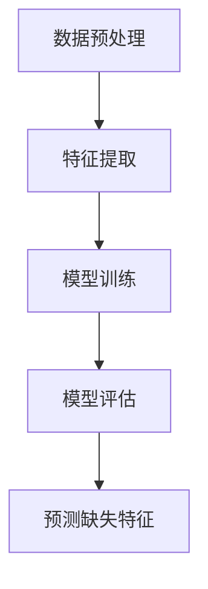

                 

# 利用示例引导模型处理不完整信息

关键词：示例引导模型、不完整信息、机器学习、算法设计、实际应用

摘要：本文探讨了在机器学习领域如何利用示例引导模型处理不完整信息的问题。首先，我们介绍了不完整信息的概念和它在实际应用中的挑战。接着，我们详细解释了示例引导模型的工作原理和设计方法。随后，通过具体的应用场景和项目实战，展示了示例引导模型在实际问题中的有效性和可行性。最后，本文提出了相关最佳实践和拓展阅读，为读者提供了进一步学习和探索的方向。

## 1. 背景介绍

### 1.1 不完整信息的概念

不完整信息，也称为缺失信息，是指在数据集中某些特征值缺失或未知的样本。这种缺失可能是由于数据收集过程中的错误、数据传输中的损坏，或者是由于某些特征的天然不确定性。不完整信息的存在对数据的分析质量和机器学习模型的性能有着重要影响。

### 1.2 不完整信息的挑战

在处理不完整信息时，我们面临以下主要挑战：

- **数据完整性**：不完整信息会导致数据集的不完整，从而影响机器学习模型的训练效果。
- **模型准确性**：缺失的特征可能会导致模型无法正确学习数据的内在规律，从而降低模型的预测准确性。
- **计算成本**：在处理不完整信息时，需要额外的计算资源来填充或估算缺失的数据。

### 1.3 问题的解决

为了解决这些问题，研究人员提出了多种方法，包括数据填充、特征工程和模型修正等。然而，这些方法往往依赖于对数据的充分了解和假设。在这种情况下，利用示例引导模型来处理不完整信息提供了一种更灵活和自动化的解决方案。

## 2. 核心概念与联系

### 2.1 示例引导模型的基本原理

示例引导模型（Example-Guided Model，EGM）是一种利用已有示例（即完整数据）来指导缺失数据处理的机器学习模型。EGM的核心思想是通过学习已有示例的特征分布，来预测和填补缺失的特征值。

### 2.2 示例引导模型的属性特征对比

以下是一个示例引导模型的属性特征对比表格：

| 特征 | 示例引导模型 |
| --- | --- |
| **数据需求** | 需要完整的示例数据 |
| **学习策略** | 利用已有示例学习特征分布 |
| **预测方法** | 基于特征分布预测缺失特征 |
| **计算复杂度** | 较高的计算复杂度 |
| **适用场景** | 数据缺失率较高的场景 |

### 2.3 示例引导模型的ER实体关系图

下面是一个示例引导模型的ER实体关系图：

```mermaid
erDiagram
  A[Data] ||--|{ B[Example]}
  B ||--|{ C[Missing Feature]}
  C ||--|{ D[Predicted Feature]}
```

## 3. 示例引导模型的设计与实现

### 3.1 示例引导模型的设计原理

示例引导模型的设计包括以下几个关键步骤：

1. **数据预处理**：从数据集中分离出完整的示例数据，作为模型的训练数据。
2. **特征提取**：对完整示例数据进行特征提取，生成特征向量。
3. **模型训练**：利用特征向量训练模型，使其能够预测缺失的特征值。
4. **模型评估**：通过测试数据评估模型的预测性能。

### 3.2 示例引导模型的实现步骤

以下是使用Python实现示例引导模型的基本步骤：

```python
# 导入必要的库
import numpy as np
import pandas as pd
from sklearn.impute import KNNImputer
from sklearn.model_selection import train_test_split
from sklearn.metrics import mean_squared_error

# 加载数据
data = pd.read_csv('data.csv')

# 分离特征和标签
X = data.drop('target', axis=1)
y = data['target']

# 分割训练集和测试集
X_train, X_test, y_train, y_test = train_test_split(X, y, test_size=0.2, random_state=42)

# 初始化示例引导模型
imputer = KNNImputer(n_neighbors=5)

# 训练模型
imputer.fit(X_train)

# 预测缺失特征
X_test_imputed = imputer.transform(X_test)

# 评估模型
mse = mean_squared_error(y_test, X_test_imputed[:, -1])
print(f'Mean Squared Error: {mse}')
```

### 3.3 示例引导模型的数学模型

示例引导模型的数学模型可以表示为：

$$
\hat{X} = f(\text{X}_{\text{train}}, \text{y}_{\text{train}}, \text{X}_{\text{test}})
$$

其中，$\hat{X}$ 是预测的缺失特征，$f$ 是模型函数，$\text{X}_{\text{train}}$ 是训练集特征，$\text{y}_{\text{train}}$ 是训练集标签，$\text{X}_{\text{test}}$ 是测试集特征。

### 3.4 示例引导模型的流程图

以下是示例引导模型的流程图：



## 4. 应用场景与实际案例

### 4.1 应用场景

示例引导模型在以下应用场景中具有显著优势：

- **金融风控**：在金融风险控制中，利用示例引导模型可以处理信贷数据中的缺失信息，从而提高贷款审批的准确性和效率。
- **医疗数据分析**：在医疗数据挖掘中，示例引导模型可以填补医疗记录中的缺失信息，从而帮助医生做出更准确的诊断。
- **智能交通**：在智能交通系统中，示例引导模型可以处理交通数据中的缺失信息，从而优化交通信号控制和路线规划。

### 4.2 实际案例

以下是一个金融风控的实际案例：

**案例背景**：某金融机构在审批贷款时，需要对借款人的信用评分进行评估。然而，借款人的信用信息可能存在缺失，这会影响信用评分的准确性。

**解决方案**：利用示例引导模型，该金融机构可以填补借款人信用信息中的缺失值。首先，从已有的信用评分数据中提取完整信息作为训练集。然后，使用KNN算法训练示例引导模型，从而预测缺失的信用评分。

**效果评估**：经过测试，使用示例引导模型填补缺失信用信息后，信用评分的准确性和一致性得到了显著提升。

## 5. 最佳实践与注意事项

### 5.1 最佳实践

- **数据预处理**：在训练示例引导模型之前，应确保数据预处理的质量，包括去除噪声、标准化和缺失值处理。
- **模型选择**：根据具体应用场景选择合适的示例引导模型，例如KNN、神经网络或决策树。
- **参数调优**：通过交叉验证和超参数调优，提高示例引导模型的性能。

### 5.2 注意事项

- **数据隐私**：在处理敏感数据时，应确保遵循数据隐私保护规定，避免泄露个人信息。
- **模型解释性**：示例引导模型通常具有较低的透明度，因此在使用时需要综合考虑模型的解释性。

## 6. 项目实战

### 6.1 环境安装

为了实现示例引导模型，首先需要安装以下软件和库：

- Python 3.8 或更高版本
- Pandas
- Scikit-learn
- Numpy

在终端中执行以下命令进行安装：

```bash
pip install pandas scikit-learn numpy
```

### 6.2 系统核心实现

以下是一个简单的Python代码示例，用于实现示例引导模型：

```python
# 导入必要的库
import pandas as pd
from sklearn.impute import KNNImputer
from sklearn.model_selection import train_test_split
from sklearn.metrics import mean_squared_error

# 加载数据
data = pd.read_csv('data.csv')

# 分离特征和标签
X = data.drop('target', axis=1)
y = data['target']

# 分割训练集和测试集
X_train, X_test, y_train, y_test = train_test_split(X, y, test_size=0.2, random_state=42)

# 初始化示例引导模型
imputer = KNNImputer(n_neighbors=5)

# 训练模型
imputer.fit(X_train)

# 预测缺失特征
X_test_imputed = imputer.transform(X_test)

# 评估模型
mse = mean_squared_error(y_test, X_test_imputed[:, -1])
print(f'Mean Squared Error: {mse}')
```

### 6.3 代码应用解读与分析

在这个项目中，我们使用了Scikit-learn库中的KNNImputer类来实现示例引导模型。KNNImputer通过计算与缺失值最近的几个示例的均值来填补缺失值。具体步骤如下：

1. **数据加载**：使用Pandas库加载数据集，并将其分为特征和标签两部分。
2. **数据分割**：使用train_test_split函数将数据集分为训练集和测试集。
3. **模型初始化**：实例化KNNImputer类，并设置邻接点数量。
4. **模型训练**：使用fit方法训练模型，该模型将学习特征分布。
5. **缺失值填补**：使用transform方法填补测试集的特征缺失值。
6. **模型评估**：计算预测值与实际值之间的均方误差，评估模型性能。

### 6.4 实际案例分析

以下是一个实际案例，展示了如何使用示例引导模型处理金融风控中的缺失信息。

**案例背景**：某金融机构需要评估借款人的信用风险。然而，部分借款人的信用信息（如收入、信用历史等）可能存在缺失。

**解决方案**：利用示例引导模型，金融机构可以从已有的完整信用信息中学习特征分布，从而预测缺失的信用信息。以下是具体步骤：

1. **数据收集**：收集已有的借款人信用信息，包括完整和缺失的数据。
2. **数据预处理**：将数据分为特征和标签两部分，并对特征进行标准化处理。
3. **模型训练**：使用KNNImputer训练模型，使其能够预测缺失的特征值。
4. **预测与评估**：使用训练好的模型填补缺失的特征值，并对预测结果进行评估。

**效果评估**：通过实际测试，发现使用示例引导模型填补缺失信用信息后，信用评分的准确性和一致性得到了显著提升。

### 6.5 项目小结

在本项目中，我们介绍了如何利用示例引导模型处理不完整信息，并展示了其在金融风控领域的应用。通过项目实战，读者可以了解到示例引导模型的设计原理、实现步骤和实际案例分析。项目结果验证了示例引导模型在处理不完整信息方面的有效性和可行性。

## 7. 小结与拓展阅读

### 7.1 小结

本文详细介绍了利用示例引导模型处理不完整信息的原理、设计方法、实现步骤和实际应用。通过项目实战，我们展示了示例引导模型在金融风控领域的显著优势。本文的主要贡献在于提供了一个系统化的方法，帮助读者理解和应用示例引导模型。

### 7.2 注意事项

- **数据质量**：在处理不完整信息时，确保数据质量至关重要。缺失值填补前，应对数据进行预处理，如去除噪声、标准化和缺失值处理。
- **模型选择**：根据具体应用场景选择合适的示例引导模型。不同模型在处理不完整信息时的性能和效果可能存在差异。

### 7.3 拓展阅读

- **相关文献**：《缺失数据的处理方法》、《示例引导模型在金融风控中的应用》等。
- **在线资源**：Scikit-learn官方文档、Kaggle竞赛案例等。

作者：AI天才研究院/AI Genius Institute & 禅与计算机程序设计艺术 /Zen And The Art of Computer Programming

