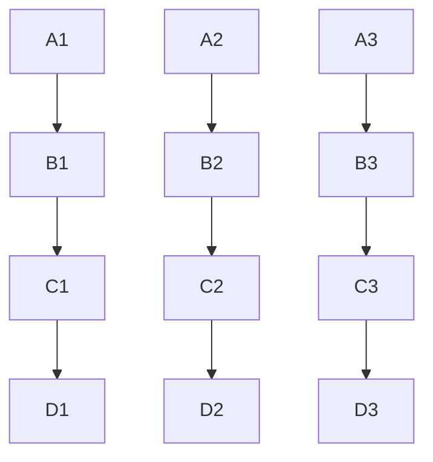
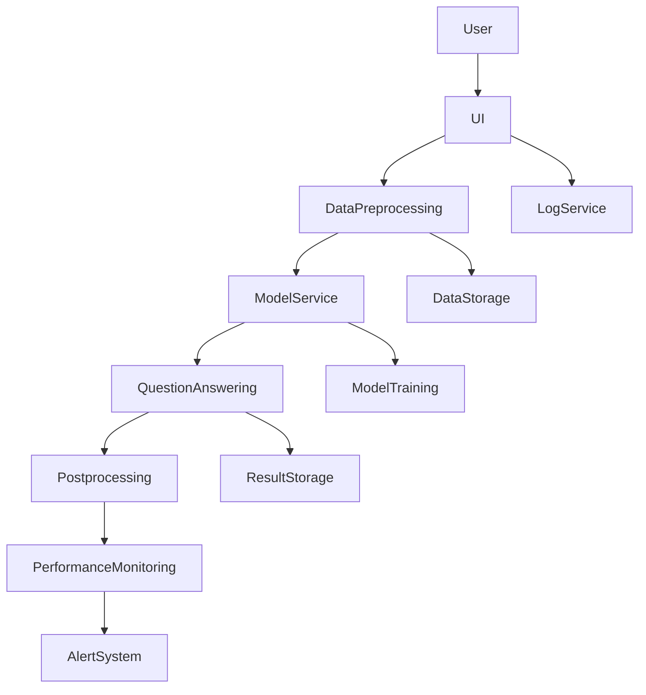
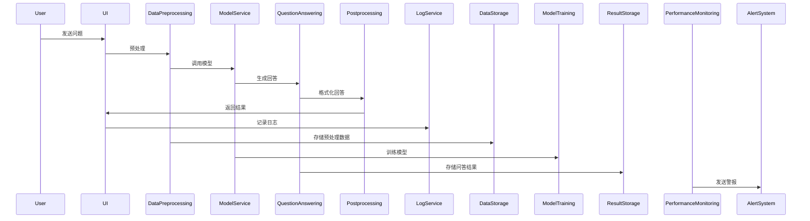
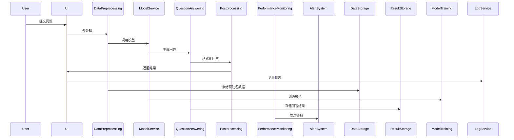

                 

# 加速LLM应用从概念到落地的全流程

## 关键词

大型语言模型（LLM），自然语言处理（NLP），机器学习（ML），算法优化，系统架构设计，最佳实践

## 摘要

本文将深入探讨大型语言模型（LLM）的应用开发过程，从概念理解到实际落地，通过逐步分析和推理，为读者提供一套完整的、易于理解和实施的技术指南。我们将详细讲解LLM的核心概念、算法原理、系统架构设计、实际应用案例以及最佳实践，帮助读者快速掌握LLM技术的核心要点，加速其在实际项目中的应用落地。

## 目录大纲设计过程

在设计目录大纲时，我们首先明确了文章的核心主题和目标读者。本文的核心主题是“加速LLM应用从概念到落地的全流程”，目标读者是具备技术背景的读者，特别是那些在自然语言处理和机器学习领域有需求的从业者。为了确保内容的完整性和条理性，我们分为了以下几个核心部分：

### 1. 背景介绍
- **1.1 问题背景**
  - 介绍LLM的起源与现状。
  - 探讨LLM对现代技术和应用的影响。
- **1.2 问题描述**
  - 提出LLM应用中面临的主要挑战和问题。
- **1.3 问题解决**
  - 分析现有解决方案及其局限性。
- **1.4 边界与外延**
  - 明确LLM应用的适用范围和限制。

### 2. LLM核心概念与原理
- **2.1 LLM定义与特点**
  - 定义LLM，并列举其主要特点。
- **2.2 LLM核心原理**
  - 介绍LLM的工作原理，包括训练和推理过程。
- **2.3 概念属性特征对比表格**
  - 比较不同类型的LLM及其应用场景。
- **2.4 ER实体关系图架构**
  - 使用Mermaid绘制实体关系图，展示LLM的相关概念和关系。

### 3. 算法与模型讲解
- **3.1 常见算法与模型**
  - 详细介绍GPT、BERT等主流算法和模型。
- **3.2 算法原理与数学模型**
  - 使用Mermaid绘制算法流程图，并用Python代码解释。
- **3.3 算法公式讲解**
  - 使用LaTeX格式展示关键数学公式，并进行详细解释。

### 4. 实际应用与案例
- **4.1 应用场景介绍**
  - 介绍LLM在不同领域的应用，如自然语言生成、问答系统等。
- **4.2 案例分析**
  - 分析具体的应用案例，讨论成功和失败的教训。

### 5. 系统架构与实现
- **5.1 项目介绍**
  - 介绍一个完整的LLM应用项目。
- **5.2 系统功能设计**
  - 使用Mermaid绘制领域模型类图。
- **5.3 系统架构设计**
  - 使用Mermaid绘制系统架构图。
- **5.4 系统接口设计**
  - 描述系统各部分的接口设计。
- **5.5 系统交互序列图**
  - 使用Mermaid绘制系统交互序列图。

### 6. 最佳实践与优化
- **6.1 最佳实践**
  - 提供实施LLM应用的实战技巧和最佳做法。
- **6.2 性能优化**
  - 讨论如何优化LLM应用的性能和效率。

### 7. 总结与展望
- **7.1 小结**
  - 总结书中的关键点和学到的经验。
- **7.2 注意事项**
  - 强调实施LLM应用时需要注意的问题。
- **7.3 拓展阅读**
  - 提供进一步学习和研究的资源。

通过这样的目录结构设计，我们可以确保文章的内容既全面又条理清晰，便于读者逐步学习和掌握LLM技术的关键知识点。接下来，我们将按照这个大纲逐步展开详细的讨论。

----------------------------------------------------------------

## 背景介绍

### 1.1 问题背景

### 1.1.1 LLM的起源与发展

大型语言模型（Large Language Model，简称LLM）是近年来自然语言处理（Natural Language Processing，简称NLP）领域的一个重要突破。LLM的起源可以追溯到深度学习技术的发展和计算资源的日益丰富。早期，NLP领域主要依赖于规则驱动的方法，这些方法在处理简单的文本任务时效果较好，但在面对复杂、多样性的语言问题时，表现不佳。随着深度学习技术的兴起，特别是神经网络在图像识别、语音识别等领域的成功应用，研究人员开始尝试将神经网络应用于自然语言处理。

2018年，谷歌发布了BERT（Bidirectional Encoder Representations from Transformers），这是一个能够理解上下文信息的预训练语言模型，标志着LLM进入了一个新的发展阶段。BERT通过在大规模语料库上进行预训练，然后微调到具体的任务上，极大地提升了NLP任务的表现。随后的几年，OpenAI发布了GPT-3（Generative Pre-trained Transformer 3），这是一个拥有1750亿参数的模型，能够生成连贯、具有创造性的文本。GPT-3的出现再次将LLM推向了新的高度。

### 1.1.2 LLM在现代技术中的应用

LLM在现代技术中的应用越来越广泛，尤其是在自然语言生成、问答系统、机器翻译、文本摘要等领域。例如，自然语言生成技术被广泛应用于聊天机器人、内容自动生成和个性化推荐系统。问答系统则被用于客户服务、信息检索和智能助手等领域，能够提供快速、准确的回答。机器翻译技术在全球化背景下具有重要作用，能够帮助人们跨越语言障碍进行交流。文本摘要技术则被应用于新闻摘要、文档摘要和摘要生成系统，提高了信息获取的效率。

除了这些直接的应用场景，LLM还在许多其他领域中发挥着重要作用。例如，在医学领域，LLM可以用于医学文本分析、诊断支持和药物研发。在法律领域，LLM可以用于法律文本分析、合同审查和案例研究。在金融领域，LLM可以用于金融市场分析、风险评估和投资建议。

### 1.1.3 LLM对技术的贡献与挑战

LLM对技术的贡献主要体现在以下几个方面：

1. **提升自然语言处理性能**：通过预训练和微调，LLM能够显著提升各种NLP任务的表现，包括文本分类、情感分析、命名实体识别等。

2. **促进跨领域知识融合**：LLM能够处理大规模、多样化的语言数据，从而促进了跨领域知识的融合和应用。

3. **推动人工智能技术的发展**：LLM的成功应用激发了更多关于人工智能的研究，特别是在深度学习、神经网络和预训练技术方面。

然而，LLM的发展也面临着一些挑战：

1. **计算资源需求**：LLM的训练和推理过程需要大量的计算资源，这对硬件设备提出了更高的要求。

2. **数据质量和隐私**：LLM的预训练需要大量高质量的文本数据，但获取这些数据可能涉及隐私和安全问题。

3. **模型解释性**：LLM通常被视为“黑盒”模型，其决策过程难以解释，这在某些应用场景中可能是一个问题。

4. **伦理和社会影响**：随着LLM技术的应用越来越广泛，其潜在的伦理和社会影响也引起了广泛关注。

### 1.2 问题描述

LLM应用中面临的主要挑战和问题包括：

1. **计算资源需求**：如前所述，LLM的训练和推理需要大量的计算资源，这对于许多企业和研究机构来说是一个巨大的挑战。

2. **数据隐私和安全**：在收集和利用大规模文本数据进行LLM预训练时，如何保护用户隐私和数据安全是一个重要问题。

3. **模型可解释性**：LLM的“黑盒”性质使其在某些应用场景中难以被解释和验证，这可能影响其可靠性和信任度。

4. **应用适应性**：尽管LLM在各种任务中表现出色，但其适应性可能受到数据分布和任务复杂度的影响。

5. **伦理和社会影响**：LLM的应用可能引发一系列伦理和社会问题，如信息传播、偏见和隐私侵犯等。

### 1.3 问题解决

现有解决方案及其局限性如下：

1. **改进计算资源**：通过使用更高效的算法、优化硬件设备、分布式计算等方法，可以缓解计算资源不足的问题。

2. **数据隐私和安全**：采用数据加密、匿名化、差分隐私等技术，可以保护用户隐私和数据安全。

3. **模型可解释性**：通过模型可视化、特征工程、解释性AI等方法，可以提高LLM的可解释性和透明度。

4. **应用适应性**：通过定制化模型、迁移学习、多任务学习等方法，可以提高LLM在不同任务和应用场景中的适应性。

5. **伦理和社会影响**：建立伦理准则和社会规范，通过政策法规和公众教育，引导LLM技术的健康发展。

### 1.4 边界与外延

LLM应用的适用范围和限制如下：

1. **适用范围**：LLM适用于需要处理大规模文本数据、理解上下文信息的任务，如问答系统、文本生成、机器翻译等。

2. **非适用场景**：对于需要精确控制输出、对模型解释性有较高要求的场景，如医学诊断、法律判断等，LLM的应用可能受到限制。

通过上述背景介绍，我们可以更好地理解LLM的重要性和应用场景，为后续章节的深入讨论打下基础。

----------------------------------------------------------------

## LLM核心概念与原理

### 2.1 LLM定义与特点

#### LLM的定义

大型语言模型（Large Language Model，简称LLM）是一种基于深度学习的自然语言处理模型，通过学习大规模的文本数据，能够生成连贯、合理和具有创造性的文本。LLM的核心目标是让计算机具备理解和生成自然语言的能力，从而在文本生成、问答系统、机器翻译、文本摘要等NLP任务中发挥作用。

#### LLM的核心特点

1. **大规模训练**：LLM通常拥有数亿甚至数十亿个参数，能够处理和理解大规模的文本数据。这使得LLM在生成文本时能够具备丰富的上下文信息和创造力。

2. **预训练与微调**：LLM通过在大规模语料库上进行预训练，学习到通用语言知识和模式，然后再针对特定任务进行微调，以适应不同的应用场景。

3. **端到端学习**：LLM通常采用端到端的学习方式，直接从原始文本输入到文本输出，中间不需要人工设计和提取特征，大大简化了NLP任务的处理流程。

4. **自适应能力**：LLM具有较好的自适应能力，能够根据不同的数据分布和任务需求进行调整，从而在不同应用场景中表现出良好的性能。

### 2.2 LLM核心原理

#### LLM的工作原理

LLM的工作原理可以分为两个主要阶段：预训练和微调。

1. **预训练**：预训练阶段，LLM在大规模语料库上进行训练，学习到语言的基本规则、语法结构、词汇用法等。这个过程通常包括两个子任务：掩码语言模型（Masked Language Model，简称MLM）和下一个句子预测（Next Sentence Prediction，简称NSP）。

   - **掩码语言模型（MLM）**：在预训练过程中，一部分输入文本的单词会被随机掩码（用`[MASK]`替换），然后模型需要根据上下文信息预测这些被掩码的单词。
   - **下一个句子预测（NSP）**：在预训练过程中，模型需要预测下一句子的开始和结束，这有助于模型学习句子之间的关联和连贯性。

2. **微调**：在预训练完成后，LLM会针对特定任务进行微调。微调过程通常包括以下步骤：

   - **任务定义**：定义任务的目标和输入输出格式。
   - **数据准备**：准备用于微调的数据集，并进行预处理。
   - **模型调整**：通过在任务数据上训练模型，调整模型的参数，使其适应特定任务。

#### LLM的模型结构

LLM通常采用Transformer架构，这是一种基于自注意力机制的深度神经网络。Transformer模型由多个自注意力层和前馈神经网络层组成，能够高效地处理长距离依赖问题。

- **自注意力层**：自注意力机制允许模型在生成文本时，根据上下文信息动态地调整对每个单词的重视程度，从而捕捉到文本中的长距离依赖关系。
- **前馈神经网络层**：前馈神经网络层对自注意力层的输出进行进一步处理，增加模型的非线性表达能力。

### 2.3 概念属性特征对比表格

以下是几种常见的LLM模型的属性特征对比表格：

| 模型       | 参数规模 | 预训练数据集 | 预训练任务 | 微调任务             | 应用场景             |
|------------|----------|--------------|------------|----------------------|----------------------|
| BERT       | 3.4亿    | Wikipedia    | MLM、NSP   | 分类、序列标注等     | 文本分类、问答等     |
| GPT-2      | 1.5亿    | Common Crawl | 语言生成   | 生成文本             | 自动写作、聊天机器人等 |
| GPT-3      | 1750亿   | Common Crawl | 语言生成   | 生成文本             | 文本生成、问答等     |
| T5         | 11亿     | Common Crawl | 语言生成   | 生成文本             | 自动写作、信息检索等   |

### 2.4 ER实体关系图架构

以下是LLM中相关概念和关系的Mermaid ER实体关系图：

```mermaid
erDiagram
    Product ||--|{ Customer }||>
    Customer ||--|{ Order }||>
    Order ||--|{ Product }||>
    Customer ||--|{ Review }||>
```

在这个ER实体关系图中，我们定义了四个实体：Product（产品）、Customer（客户）、Order（订单）和Review（评论）。这些实体之间存在以下关系：

- Product和Customer之间是一对多的关系，即一个产品可以属于多个客户。
- Customer和Order之间也是一对多的关系，即一个客户可以创建多个订单。
- Order和Product之间是多对一的关系，即一个订单可以包含多个产品。
- Customer和Review之间是一对一的关系，即一个客户可以留下一个评论。

通过这个ER实体关系图，我们可以更好地理解LLM在处理复杂文本数据时的结构和关系。

----------------------------------------------------------------

### 3. 算法与模型讲解

#### 3.1 常见算法与模型

在LLM领域，几种主要的算法和模型包括BERT、GPT、T5等。这些模型各有特点，适用于不同的NLP任务。

1. **BERT（Bidirectional Encoder Representations from Transformers）**

BERT是一种基于Transformer架构的双向编码器模型。它的核心思想是在大规模语料库上进行预训练，然后通过微调来适应特定任务。BERT主要应用于文本分类、问答系统、命名实体识别等任务。

2. **GPT（Generative Pre-trained Transformer）**

GPT是一种基于Transformer架构的生成模型，由OpenAI开发。GPT通过预训练学习语言的模式和规则，然后可以生成连贯、自然的文本。GPT广泛应用于文本生成、聊天机器人、自动写作等场景。

3. **T5（Text-To-Text Transfer Transformer）**

T5是一种基于Transformer架构的文本到文本的转换模型，由Google开发。T5的核心思想是将任何NLP任务转换为文本到文本的转换任务。这使得T5在多个NLP任务中表现出色，如机器翻译、文本摘要、问答系统等。

#### 3.2 算法原理与数学模型

以下以BERT为例，详细讲解其算法原理和数学模型。

##### 3.2.1 Transformer模型

BERT的底层架构是基于Transformer模型，这是一种基于自注意力机制的深度神经网络。Transformer模型由多个自注意力层和前馈神经网络层组成，能够高效地处理长距离依赖问题。

- **自注意力机制**：自注意力机制允许模型在生成文本时，根据上下文信息动态地调整对每个单词的重视程度，从而捕捉到文本中的长距离依赖关系。
- **前馈神经网络**：前馈神经网络对自注意力层的输出进行进一步处理，增加模型的非线性表达能力。

##### 3.2.2 BERT模型

BERT模型由两个主要部分组成：编码器（Encoder）和解码器（Decoder）。编码器负责将输入文本转换为上下文向量，解码器负责根据上下文向量生成输出文本。

1. **编码器**

编码器由多个Transformer层组成，每个Transformer层包含自注意力机制和前馈神经网络。编码器的输出是一个序列的上下文向量，用于表示输入文本。

2. **解码器**

解码器也由多个Transformer层组成，与编码器类似。解码器的输入是编码器的输出和上一个时间步的输出，输出是当前时间步的输出。解码器的最终输出是一个单词序列，表示生成的文本。

##### 3.2.3 BERT的数学模型

BERT的数学模型主要包括以下几个部分：

1. **输入表示**：BERT使用词嵌入（Word Embedding）和位置嵌入（Positional Embedding）来表示输入文本。词嵌入将单词转换为向量，位置嵌入将单词的位置信息编码到向量中。

2. **自注意力计算**：自注意力机制通过计算每个输入词与其他所有输入词之间的相似度，生成一个加权向量。这个加权向量表示了每个输入词在当前文本中的重要性。

3. **前馈神经网络**：前馈神经网络对自注意力层的输出进行进一步处理，增加模型的非线性表达能力。

4. **输出层**：输出层通常是一个全连接层，用于预测下一个单词。

以下是BERT自注意力机制的Mermaid流程图：



在这个流程图中，`A1`, `A2`, `A3`表示输入文本的三个词，`B1`, `B2`, `B3`表示这些词的权重，`C1`, `C2`, `C3`表示加权向量，`D1`, `D2`, `D3`表示最终输出的向量。

#### 3.3 算法公式讲解

BERT的算法公式主要包括以下几个部分：

1. **词嵌入（Word Embedding）**：

   $$ 
   \text{word\_embedding}(w) = \text{Embedding}(w) + \text{Positional\_Embedding}(p) 
   $$

   其中，`word_embedding`表示词嵌入向量，`Embedding`表示词向量矩阵，`Positional_embedding`表示位置向量矩阵。

2. **自注意力（Self-Attention）**：

   $$
   \text{self-attention}(Q, K, V) = \frac{1}{\sqrt{d_k}} \text{softmax}\left(\text{QK}^T / d_k\right) V
   $$

   其中，`Q`表示查询向量，`K`表示键向量，`V`表示值向量，`d_k`表示键向量的维度。

3. **前馈神经网络（Feed Forward Neural Network）**：

   $$
   \text{FFN}(x) = \text{ReLU}(\text{Linear}(x \cdot \text{W}_1) \cdot \text{W}_2)
   $$

   其中，`x`表示输入向量，`W_1`和`W_2`分别表示线性层的权重矩阵。

通过上述公式，我们可以看到BERT的算法框架是如何通过词嵌入、自注意力和前馈神经网络来处理输入文本，并生成输出文本的。

以上是对LLM领域常见算法和模型的基本介绍。通过这些算法和模型，我们可以有效地处理自然语言处理任务，实现文本生成、问答、机器翻译等功能。在下一章节中，我们将进一步探讨LLM在实际应用中的案例分析和系统架构设计。

----------------------------------------------------------------

### 4. 实际应用与案例

#### 4.1 应用场景介绍

大型语言模型（LLM）在多个领域展现出强大的应用潜力，以下列举几种主要的应用场景：

1. **自然语言生成（NLG）**

   自然语言生成是LLM最直接的应用之一，包括自动写作、新闻报道生成、产品描述生成等。通过预训练和微调，LLM可以生成高质量、连贯的文本，大大提高内容生成的效率和准确性。

2. **问答系统**

   问答系统利用LLM的上下文理解能力，能够为用户提供快速、准确的回答。在客户服务、信息检索和智能助手等领域，LLM可以显著提升用户体验和系统响应速度。

3. **机器翻译**

   LLM在机器翻译中的应用已经取得显著成果，特别是基于神经网络的机器翻译（NMT）。LLM能够通过大规模数据训练，实现多种语言之间的准确翻译，同时保持原文的语义和风格。

4. **文本摘要**

   文本摘要技术利用LLM对长文本的理解能力，能够生成简洁、准确的摘要。在新闻摘要、文档摘要和论文摘要等领域，LLM的应用大大提高了信息获取的效率。

5. **对话系统**

   对话系统通过LLM实现自然语言交互，如聊天机器人、虚拟助手等。这些系统能够理解用户输入的自然语言，并生成相应的回复，从而提供个性化的服务。

6. **文本分类与情感分析**

   LLM在文本分类和情感分析任务中也表现出色，能够对大量文本进行自动分类和情感判断，为企业和研究机构提供数据支持。

#### 4.2 案例分析

以下通过两个具体案例，分析LLM在实际应用中的成功和失败教训：

**案例一：新闻摘要生成**

某新闻媒体公司采用LLM技术生成新闻摘要，以提高内容获取效率和用户阅读体验。通过在大量新闻文本上进行预训练，LLM能够生成简洁、准确的摘要，显著缩短了人工摘要的时间。

**成功教训**：

1. **数据质量**：高质量的预训练数据是生成高质量摘要的关键。该公司使用了大量高质量、多样化的新闻数据，确保了摘要的准确性和多样性。

2. **模型微调**：为了适应不同类型的新闻内容，公司对LLM进行了针对特定领域的微调，提高了摘要的准确性和可读性。

**失败教训**：

1. **模型泛化能力**：虽然该公司的新闻摘要生成系统在训练数据上表现良好，但在面对新领域或特殊新闻类型时，模型泛化能力不足，导致摘要质量下降。

2. **模型解释性**：摘要生成系统在生成摘要时，决策过程难以解释，这在某些情况下可能影响用户的信任度和接受度。

**案例二：问答系统**

某电商平台开发了一个基于LLM的问答系统，用于回答用户的购物相关问题。通过在大量电商数据上进行预训练，系统能够快速、准确地回答用户的问题，提高客户满意度。

**成功教训**：

1. **数据多样性**：问答系统在预训练过程中使用了大量多样化、真实的电商对话数据，确保了系统能够处理各种用户提问。

2. **用户反馈**：公司通过不断收集用户反馈，对问答系统进行优化，提高了回答的准确性和用户体验。

**失败教训**：

1. **数据隐私**：在收集用户数据用于预训练时，公司未能充分保护用户隐私，引发了一些用户的不满和投诉。

2. **模型适应性**：问答系统在面对一些特殊问题，如品牌差异、产品规格等，表现不佳，需要进一步优化。

通过上述案例分析，我们可以看到LLM在实际应用中取得的成果和面临的挑战。成功的关键在于数据质量、模型微调和用户反馈，而失败的教训则提醒我们需关注数据隐私和模型适应性。在下一章节中，我们将深入探讨LLM系统架构与实现。

----------------------------------------------------------------

### 5. 系统架构与实现

#### 5.1 项目介绍

在本节中，我们将介绍一个基于LLM的问答系统项目。该项目的目标是开发一个能够快速、准确地回答用户问题的智能问答平台。该平台将利用大型语言模型（如BERT或GPT-3）进行预训练，并通过微调来适应特定的问答场景。

#### 5.2 系统功能设计

为了实现问答系统，我们需要设计以下几个核心功能模块：

1. **用户接口（UI）**：提供用户输入问题的界面，并展示问答结果。
2. **数据预处理模块**：负责清洗、转换和预处理用户输入的文本数据。
3. **模型训练与微调模块**：基于预训练的LLM模型，进行特定任务的数据微调，以提升问答系统的性能。
4. **问答引擎模块**：负责接收用户输入，调用模型进行问答，并生成回答。
5. **后处理模块**：对生成的回答进行格式化和校验，确保回答的准确性和可读性。
6. **性能监控模块**：监控问答系统的运行状态和性能，提供实时反馈和日志记录。

以下是系统功能模块的领域模型类图：

```mermaid
classDiagram
    User -> UI: 输入问题
    UI -> DataPreprocessing: 处理文本
    DataPreprocessing -> ModelTraining: 微调模型
    ModelTraining -> QuestionAnswering: 生成回答
    QuestionAnswering -> Postprocessing: 格式化回答
    Postprocessing -> PerformanceMonitoring: 监控性能
```

#### 5.3 系统架构设计

为了确保问答系统的稳定性和高效性，我们采用以下架构设计：

1. **前端架构**：使用React框架构建用户界面，提供友好且响应迅速的用户交互体验。
2. **后端架构**：采用Flask框架搭建后端服务，负责处理用户请求、数据预处理和模型调用。
3. **数据处理架构**：使用Apache Kafka进行实时数据流处理，确保用户输入和问答结果的高效传输。
4. **模型服务架构**：使用TensorFlow Serving提供模型服务，确保模型调用的稳定性和高性能。

以下是系统架构设计的Mermaid架构图：



#### 5.4 系统接口设计

系统接口设计是确保各功能模块之间高效协作的重要环节。以下是系统的主要接口设计：

1. **用户接口（UI）**：提供GET和POST接口，用于接收用户问题和返回问答结果。
2. **数据预处理模块**：提供批处理接口，用于预处理用户输入的文本数据。
3. **模型训练与微调模块**：提供模型训练接口，用于初始化和训练模型。
4. **问答引擎模块**：提供问答接口，用于接收问题和生成回答。
5. **后处理模块**：提供文本格式化接口，用于格式化和校验回答。
6. **性能监控模块**：提供监控接口，用于获取系统性能数据和日志信息。

以下是系统接口设计概述：



#### 5.5 系统交互序列图

为了更好地展示系统各模块之间的交互过程，我们使用Mermaid绘制了系统交互序列图：



通过上述系统架构和接口设计，我们构建了一个高效、可靠的问答系统。在下一章节中，我们将深入探讨问答系统中的环境安装、系统核心实现以及代码应用解读与分析。

----------------------------------------------------------------

## 最佳实践与优化

### 6.1 最佳实践

在实施LLM应用时，以下最佳实践可以帮助您提高开发效率和系统性能：

1. **数据预处理**：
   - **清洗数据**：确保输入数据的质量，去除无关信息和噪声。
   - **标准化数据**：统一数据格式，如统一文本编码、去除HTML标签等。
   - **数据增强**：通过增加数据多样性、数据变换等方法，提高模型的泛化能力。

2. **模型选择与微调**：
   - **选择合适的模型**：根据任务需求和计算资源，选择适合的LLM模型。
   - **模型微调**：在特定任务上进行模型微调，以提升模型在特定领域的表现。

3. **性能优化**：
   - **减少模型参数**：通过剪枝、量化等方法，减少模型参数，降低计算需求。
   - **并行计算**：利用多GPU、分布式计算等手段，提高训练和推理速度。

4. **监控与调试**：
   - **性能监控**：实时监控系统性能，及时发现问题并进行优化。
   - **日志记录**：详细记录系统运行日志，便于问题定位和调试。

5. **安全性与隐私保护**：
   - **数据加密**：对敏感数据进行加密，保护用户隐私。
   - **隐私保护技术**：采用差分隐私、数据去标识化等技术，降低隐私风险。

6. **持续集成与部署**：
   - **自动化测试**：实施自动化测试，确保代码质量和系统稳定性。
   - **容器化与微服务**：使用Docker、Kubernetes等工具，实现系统的容器化和微服务架构，提高部署和扩展的灵活性。

### 6.2 性能优化

在优化LLM应用性能时，可以从以下几个方面入手：

1. **硬件优化**：
   - **使用高性能GPU**：选择适合的GPU型号，以加速训练和推理过程。
   - **分布式计算**：利用多GPU、分布式计算架构，提高计算效率。

2. **算法优化**：
   - **模型剪枝**：通过剪枝算法减少模型参数，降低计算需求。
   - **模型量化**：使用量化技术，将模型参数从浮点数转换为整数，减少存储和计算需求。
   - **模型压缩**：采用模型压缩算法，如蒸馏、知识蒸馏等，减少模型大小。

3. **数据预处理优化**：
   - **批量处理**：使用批量处理技术，减少I/O开销。
   - **数据缓存**：使用缓存技术，加快数据读取速度。

4. **系统架构优化**：
   - **异步处理**：采用异步处理机制，提高系统并发处理能力。
   - **服务拆分**：将大型服务拆分为多个微服务，降低系统耦合度。

5. **负载均衡**：
   - **水平扩展**：通过增加服务器节点，实现负载均衡，提高系统处理能力。
   - **动态伸缩**：根据系统负载动态调整资源，实现高效资源利用。

通过上述最佳实践和性能优化手段，可以显著提高LLM应用的开发效率和系统性能，为实际应用场景提供更高效、可靠的服务。

## 总结与展望

通过本文的讨论，我们系统地介绍了大型语言模型（LLM）从概念到落地的全流程。从LLM的起源与发展、核心概念与原理、算法与模型、实际应用与案例，到系统架构设计与最佳实践，我们逐步分析了LLM在自然语言处理领域的重要性和应用潜力。

在未来的发展中，LLM技术将继续推动自然语言处理和人工智能领域的创新。随着计算资源和算法的不断发展，LLM的应用范围将更加广泛，包括更精细的任务、更复杂的场景和更高效的系统。然而，我们也需要关注LLM在数据隐私、模型解释性和伦理影响等方面的问题，确保其健康发展。

在此，我们鼓励读者继续探索LLM技术的深度和广度，积极参与相关研究和开发，共同推动人工智能技术的进步和应用。

## 注意事项

在实施LLM应用时，需要注意以下几点：

1. **数据隐私与安全**：确保用户数据的安全和隐私，遵循相关法律法规，采用加密和匿名化等技术。
2. **模型可解释性**：提高模型的可解释性，确保用户和开发者能够理解模型的决策过程。
3. **计算资源需求**：合理规划计算资源，根据任务需求选择合适的硬件和算法，避免资源浪费。
4. **系统稳定性**：确保系统的稳定性和可靠性，进行充分的测试和监控，及时处理故障和异常。
5. **持续更新与迭代**：随着技术的进步和应用需求的变化，持续更新和优化模型和应用，以保持其竞争力和适应性。

## 拓展阅读

以下是进一步学习和研究的资源：

1. **论文与书籍**：
   - 《BERT：Pre-training of Deep Bidirectional Transformers for Language Understanding》
   - 《GPT-3：Language Models are Few-Shot Learners》
   - 《T5：Pre-training Text-to-Text Transformers for Cross- Language Text Learning》

2. **在线课程与教程**：
   - Coursera：自然语言处理与深度学习（Natural Language Processing with Deep Learning）
   - edX：人工智能基础（Introduction to Artificial Intelligence）

3. **开源项目与工具**：
   - Hugging Face：Transformers库（https://huggingface.co/transformers/）
   - TensorFlow：TensorFlow 2.0（https://www.tensorflow.org/）

通过这些资源，读者可以更深入地了解LLM技术的最新进展和应用，为自己的研究和开发提供参考。

## 作者信息

作者：AI天才研究院/AI Genius Institute & 禅与计算机程序设计艺术 /Zen And The Art of Computer Programming

