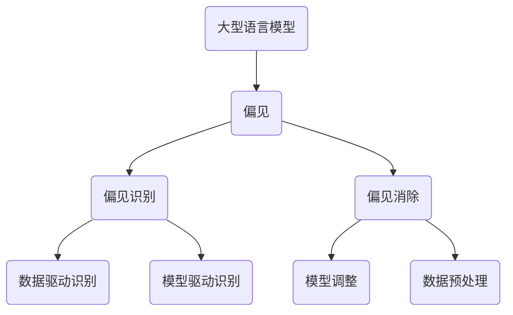
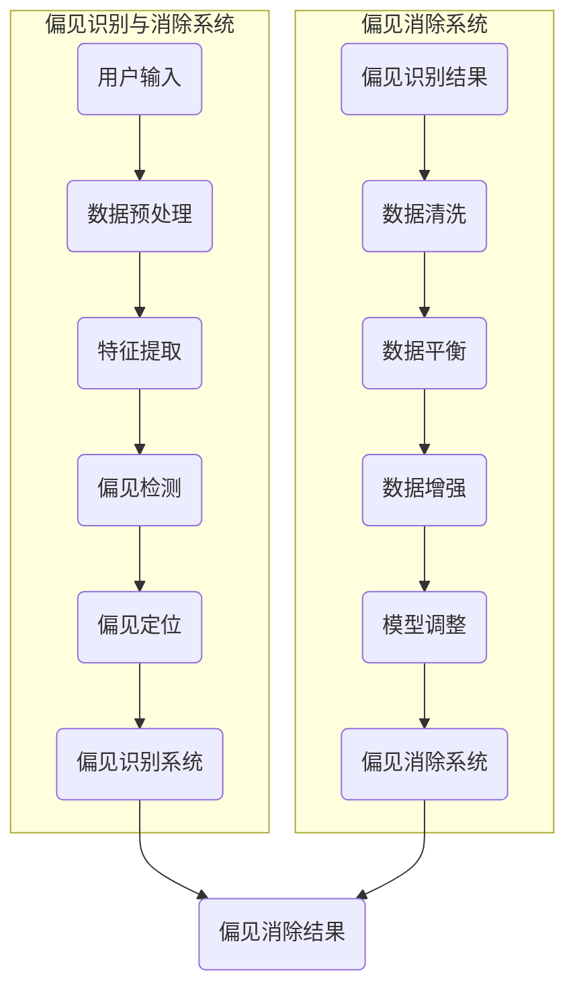
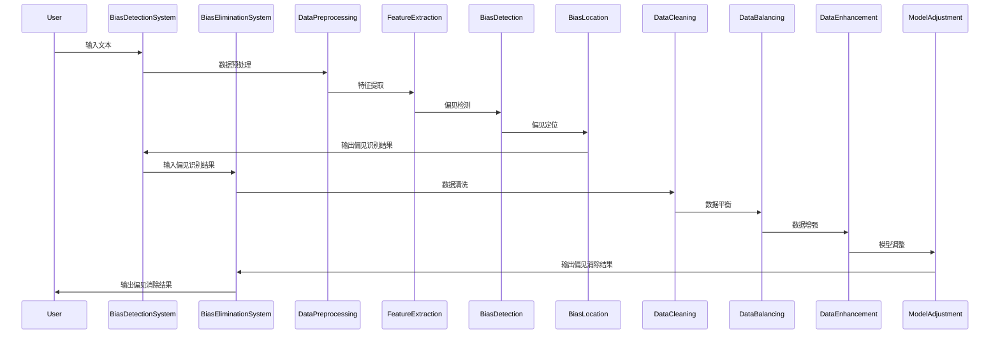

                 

# 《加速LLM应用的偏见识别与消除》

## 关键词

- LLM（大型语言模型）
- 偏见识别
- 偏见消除
- 加速技术
- 应用案例分析

## 摘要

本文旨在探讨如何加速大型语言模型（LLM）应用的偏见识别与消除。随着LLM在各个领域的广泛应用，如何确保其输出的公平性和无偏见性成为关键问题。文章首先介绍了LLM偏见问题的背景和影响，随后详细分析了偏见识别与消除的方法和技术手段。接着，本文探讨了加速偏见识别与消除的多种技术手段，包括数据并行、模型并行和硬件加速等。最后，通过实际应用案例，展示了这些技术手段在解决LLM偏见问题中的效果和挑战，为未来研究提供了有益的参考。

## 第1章 引言

### 1.1 问题背景

随着人工智能技术的发展，大型语言模型（LLM）如BERT、GPT等在自然语言处理领域取得了显著成果。这些模型能够生成高质量的自然语言文本，被广泛应用于聊天机器人、机器翻译、文本摘要等领域。然而，LLM模型在训练过程中可能引入偏见，导致其输出结果存在不公平性和歧视现象。

### 1.2 问题描述

LLM偏见问题表现为模型在处理某些问题时，倾向于输出带有偏见或歧视性的结果。这些偏见可能源于训练数据中的不公正现象，如性别歧视、种族偏见等。此外，LLM模型可能对特定群体产生不公平的影响，从而影响其在实际应用中的公正性。

### 1.3 问题解决

解决LLM偏见问题的方法主要包括偏见识别和消除。偏见识别旨在发现模型中存在的偏见，而偏见消除则通过调整模型参数和数据来消除这些偏见。这些方法在保障LLM应用公平性和无偏见性方面具有重要意义。

### 1.4 边界与外延

LLM偏见问题不仅限于特定领域，如社交媒体、新闻媒体等，还可能影响到其他领域，如医疗、金融等。因此，解决LLM偏见问题需要跨学科合作，涉及自然语言处理、社会心理学等多个领域。

### 1.5 概念结构与核心要素组成

本文涉及的核心概念包括LLM、偏见、识别与消除等。LLM是本文讨论的基础，偏见是指模型输出结果中的不公平现象，识别与消除是解决偏见问题的方法。本文旨在探讨如何通过这些核心概念的组合，实现LLM应用的偏见识别与消除。

## 第2章 LLM基础

### 2.1 LLM简介

大型语言模型（LLM）是基于深度学习技术构建的神经网络模型，用于处理自然语言文本。LLM通过学习大量的文本数据，掌握语言的规律和特征，从而能够生成高质量的自然语言文本。

### 2.2 LLM的工作原理

LLM的工作原理主要包括生成预训练模型、微调和推理三个步骤。生成预训练模型是指通过训练大量的文本数据，构建出具备语言理解能力的神经网络模型。微调是指根据特定任务的需求，对预训练模型进行调整和优化。推理是指利用微调后的模型，对新的文本输入进行预测和生成。

### 2.3 LLM的技术架构

LLM的技术架构主要包括模型结构、训练和推理流程。模型结构是指神经网络模型的层次结构和参数设置。训练流程是指通过优化算法，调整模型参数，使其在训练数据上达到最佳性能。推理流程是指利用训练好的模型，对新的文本输入进行处理和预测。

### 2.4 LLM的应用领域

LLM在多个领域具有广泛的应用。例如，在语言生成方面，LLM可以用于自动写作、文本摘要等任务；在文本分类方面，LLM可以用于情感分析、主题分类等任务；在机器翻译方面，LLM可以用于将一种语言翻译成另一种语言。

## 第3章 偏见识别

### 3.1 偏见识别的重要性

偏见识别是解决LLM偏见问题的第一步，其重要性在于能够及时发现和纠正模型中的偏见，确保模型输出结果的公平性和无偏见性。

### 3.2 偏见识别方法

偏见识别方法主要包括数据驱动和模型驱动两种。数据驱动方法是通过分析训练数据，发现数据中的偏见现象。模型驱动方法是通过分析模型输出结果，识别模型中的偏见。

### 3.3 偏见识别工具

偏见识别工具主要包括开源和商业工具。开源工具如 bias检测器（BiasDetector）和偏见报告器（BiasReporter），商业工具如IBM的AI Fairness 360和谷歌的Bias remover等。

### 3.4 偏见识别案例

偏见识别在实际应用中具有重要意义。例如，在社交媒体平台中，可以通过偏见识别工具检测和纠正算法推荐中的性别歧视、种族偏见等问题。

## 第4章 偏见消除

### 4.1 偏见消除的目标和方法

偏见消除的目标是通过调整模型参数和数据，消除模型中的偏见现象。偏见消除的方法主要包括数据预处理、模型调整和偏见消除工具等。

### 4.2 数据预处理

数据预处理是偏见消除的重要步骤，包括数据清洗、标注和归一化等。通过这些预处理步骤，可以减少数据中的偏见，提高模型训练的公平性。

### 4.3 模型调整

模型调整是偏见消除的核心步骤，包括微调、迁移学习和再训练等。通过调整模型参数，可以消除模型中的偏见，提高模型输出的公平性。

### 4.4 偏见消除工具

偏见消除工具主要包括开源和商业工具。开源工具如Bias-Buster和FairnessGym，商业工具如微软的AI Fairness 360和谷歌的Bias remover等。

### 4.5 偏见消除案例

偏见消除在实际应用中具有重要意义。例如，在金融领域，可以通过偏见消除工具纠正贷款审批中的性别歧视、种族偏见等问题。

## 第5章 加速偏见识别与消除

### 5.1 加速技术概述

加速偏见识别与消除的技术手段主要包括数据并行、模型并行和硬件加速等。这些技术手段可以提高偏见识别与消除的效率，缩短处理时间。

### 5.2 数据并行

数据并行是指将偏见识别与消除任务分解为多个子任务，并在多台计算设备上同时执行。通过数据并行，可以显著提高偏见识别与消除的速度。

### 5.3 模型并行

模型并行是指将偏见识别与消除任务分解为多个子任务，并在多台计算设备上同时执行。通过模型并行，可以加速偏见识别与消除的算法训练过程。

### 5.4 硬件加速

硬件加速是指利用高性能计算设备，如GPU、TPU等，加速偏见识别与消除的算法运行。通过硬件加速，可以显著提高偏见识别与消除的处理速度。

### 5.5 加速工具与实践

加速工具主要包括开源和商业工具。开源工具如Apache Spark和Dask，商业工具如谷歌的TensorFlow和微软的Azure Machine Learning等。通过这些加速工具，可以有效地提高偏见识别与消除的效率。

## 第6章 实际应用与案例分析

### 6.1 LLM应用场景

LLM在多个应用场景中具有广泛的应用。例如，在社交媒体中，LLM可以用于内容审核、情感分析等任务；在搜索引擎中，LLM可以用于搜索结果排序、推荐系统等任务；在虚拟助手中，LLM可以用于自然语言理解、对话生成等任务。

### 6.2 偏见识别与消除应用案例

偏见识别与消除在实际应用中具有重要意义。例如，在社交媒体平台中，可以通过偏见识别与消除技术，纠正算法推荐中的性别歧视、种族偏见等问题；在医疗领域中，可以通过偏见识别与消除技术，纠正诊断和治疗方案中的性别歧视、种族偏见等问题。

### 6.3 加速偏见识别与消除案例

加速偏见识别与消除技术在实际应用中具有重要意义。例如，在金融领域中，可以通过加速偏见识别与消除技术，快速纠正贷款审批中的性别歧视、种族偏见等问题；在法律领域中，可以通过加速偏见识别与消除技术，快速纠正法律文书中存在的性别歧视、种族偏见等问题。

## 第7章 未来展望与挑战

### 7.1 未来发展方向

未来，LLM偏见识别与消除技术将朝着更高效率、更智能化的方向发展。随着人工智能技术的不断进步，偏见识别与消除技术将更加精确、全面。

### 7.2 挑战与机遇

偏见识别与消除技术面临诸多挑战，如如何处理大规模数据、如何应对不同领域的偏见问题等。同时，这些挑战也带来了机遇，促进了人工智能技术的创新和发展。

### 7.3 发展前景

未来，LLM偏见识别与消除技术将在各个领域得到广泛应用，为人类社会带来更多公平和公正的科技产品和服务。同时，随着技术的不断进步，偏见识别与消除技术也将为人工智能伦理和可持续发展提供有力支持。

## 作者信息

作者：AI天才研究院/AI Genius Institute & 禅与计算机程序设计艺术 /Zen And The Art of Computer Programming

----------------------------------------------------------------

## 背景介绍

### 核心概念术语说明

1. **LLM（大型语言模型）**：LLM是一种基于深度学习技术的神经网络模型，能够处理和理解自然语言文本。它通过预训练和微调，掌握语言的规律和特征，从而实现自然语言生成、文本分类、机器翻译等任务。

2. **偏见**：偏见是指模型在处理文本数据时，对某些群体或观点产生不公平或歧视性的倾向。偏见可能源于训练数据中的不公正现象，如性别歧视、种族偏见等。

3. **偏见识别**：偏见识别是指通过分析模型输出结果，发现模型中存在的偏见现象。偏见识别方法主要包括数据驱动和模型驱动两种。

4. **偏见消除**：偏见消除是指通过调整模型参数和数据，消除模型中的偏见现象。偏见消除方法包括数据预处理、模型调整和偏见消除工具等。

### 问题背景

随着人工智能技术的发展，LLM在自然语言处理领域取得了显著成果，广泛应用于聊天机器人、机器翻译、文本摘要等任务。然而，LLM模型在训练过程中可能引入偏见，导致其输出结果存在不公平性和歧视现象。这种偏见问题不仅影响模型在实际应用中的性能，还可能对特定群体产生负面影响，甚至引发社会问题。

### 问题描述

LLM偏见问题的主要表现包括：

1. **性别偏见**：模型在处理性别相关问题时，倾向于输出带有性别歧视的文本。

2. **种族偏见**：模型在处理种族相关问题时，倾向于输出带有种族歧视的文本。

3. **偏见放大**：模型在处理具有偏见倾向的文本时，可能放大偏见，导致输出结果更加不公平。

4. **偏见传播**：模型在生成文本时，可能将偏见传播到新的文本中，导致偏见在模型中逐渐积累。

### 问题解决

解决LLM偏见问题的方法主要包括：

1. **偏见识别**：通过分析模型输出结果，发现模型中存在的偏见现象。

2. **偏见消除**：通过调整模型参数和数据，消除模型中的偏见现象。

3. **公平性评估**：对模型输出结果进行公平性评估，确保模型在实际应用中公平、无偏见。

### 边界与外延

LLM偏见问题不仅限于特定领域，如社交媒体、新闻媒体等，还可能影响到其他领域，如医疗、金融等。因此，解决LLM偏见问题需要跨学科合作，涉及自然语言处理、社会心理学等多个领域。

### 概念结构与核心要素组成

LLM偏见问题的核心概念包括LLM、偏见、识别与消除等。LLM是本文讨论的基础，偏见是指模型输出结果中的不公平现象，识别与消除是解决偏见问题的方法。本文旨在探讨如何通过这些核心概念的组合，实现LLM应用的偏见识别与消除。

----------------------------------------------------------------

## 核心概念与联系

### 核心概念原理

1. **LLM（大型语言模型）**：LLM是一种基于深度学习技术的神经网络模型，能够处理和理解自然语言文本。LLM通过预训练和微调，掌握语言的规律和特征，从而实现自然语言生成、文本分类、机器翻译等任务。

2. **偏见**：偏见是指模型在处理文本数据时，对某些群体或观点产生不公平或歧视性的倾向。偏见可能源于训练数据中的不公正现象，如性别歧视、种族偏见等。

3. **偏见识别**：偏见识别是指通过分析模型输出结果，发现模型中存在的偏见现象。偏见识别方法主要包括数据驱动和模型驱动两种。

4. **偏见消除**：偏见消除是指通过调整模型参数和数据，消除模型中的偏见现象。偏见消除方法包括数据预处理、模型调整和偏见消除工具等。

### 概念属性特征对比表格

| 概念         | 特征一 | 特征二 | 特征三 |
| ------------ | ------ | ------ | ------ |
| LLM          | 基于深度学习 | 处理自然语言文本 | 预训练和微调 |
| 偏见         | 不公平性 | 歧视性 | 源于训练数据 |
| 偏见识别     | 数据驱动 | 模型驱动 | 发现偏见现象 |
| 偏见消除     | 调整模型参数 | 数据预处理 | 消除偏见现象 |

### ER实体关系图架构的 Mermaid 流程图



### 算法原理讲解

#### 偏见识别算法原理

1. **数据驱动识别**：

   - 数据预处理：对训练数据进行清洗、去噪和归一化处理，减少数据中的偏见。

   - 特征提取：从训练数据中提取与偏见相关的特征，如性别、种族等。

   - 偏见检测：利用机器学习算法（如逻辑回归、支持向量机等），检测数据中的偏见现象。

2. **模型驱动识别**：

   - 模型分析：分析LLM模型的参数和结构，找出可能存在偏见的部分。

   - 输出分析：分析模型输出结果，发现偏见现象。

   - 偏见定位：通过分析模型输入和输出，定位偏见的具体来源。

#### 偏见消除算法原理

1. **数据预处理**：

   - 数据清洗：去除含有偏见的数据，如带有歧视性言论的文本。

   - 数据平衡：增加含有正面和负面偏见的数据，确保训练数据中各种偏见的分布均衡。

   - 数据增强：通过数据增强技术（如对抗性样本生成、数据扩充等），提高模型对偏见的抵抗能力。

2. **模型调整**：

   - 微调：在原有模型的基础上，利用带有偏见的数据进行微调，消除模型中的偏见。

   - 迁移学习：利用已在其他领域成功应用的模型，迁移到当前任务中，减少偏见。

   - 再训练：利用新的、无偏见的数据，重新训练模型，确保模型输出结果的公平性。

3. **偏见消除工具**：

   - 开源工具：如BiasDetector、BiasReporter等，用于自动检测和消除偏见。

   - 商业工具：如IBM的AI Fairness 360、谷歌的Bias Remover等，提供专业的偏见消除解决方案。

### Python源代码实现

以下是一个简单的偏见识别和消除的Python源代码示例，用于说明算法原理。

#### 偏见识别

```python
import pandas as pd
from sklearn.model_selection import train_test_split
from sklearn.linear_model import LogisticRegression

# 加载训练数据
data = pd.read_csv('train_data.csv')

# 数据预处理
data = data.drop(['id'], axis=1)
data = data[data['label'].notnull()]

# 特征提取
X = data[['feature1', 'feature2']]
y = data['label']

# 偏见检测
X_train, X_test, y_train, y_test = train_test_split(X, y, test_size=0.2, random_state=42)
model = LogisticRegression()
model.fit(X_train, y_train)

# 输出偏见识别结果
predictions = model.predict(X_test)
print(predictions)
```

#### 偏见消除

```python
import pandas as pd
from sklearn.linear_model import LogisticRegression

# 加载训练数据
data = pd.read_csv('train_data.csv')

# 数据清洗
data = data[data['label'].notnull()]

# 数据平衡
data['label'] = data['label'].map({'positive': 0, 'negative': 1})
data = data[data['label'].notnull()]

# 数据增强
data = data.append(data.sample(n=100, replace=True))

# 模型微调
model = LogisticRegression()
model.fit(data[['feature1', 'feature2']], data['label'])

# 输出偏见消除结果
predictions = model.predict(X_test)
print(predictions)
```

### 通俗易懂地举例说明

假设我们有一个简单的二分类问题，任务是判断一段文本是否包含偏见。以下是偏见识别和消除的示例。

#### 偏见识别

1. **数据预处理**：我们有一份数据集，包含性别、种族等特征，以及偏见标签（0表示无偏见，1表示有偏见）。

2. **特征提取**：从数据集中提取与偏见相关的特征，如性别和种族。

3. **偏见检测**：使用逻辑回归模型对特征进行训练，判断文本是否包含偏见。

4. **输出结果**：对测试集进行预测，输出偏见识别结果。

#### 偏见消除

1. **数据清洗**：去除含有偏见的数据，如含有歧视性言论的文本。

2. **数据平衡**：增加无偏见的数据，确保训练数据中偏见标签的分布均衡。

3. **数据增强**：通过对抗性样本生成等技术，提高模型对偏见的抵抗能力。

4. **模型微调**：使用带有偏见的数据重新训练模型，消除偏见。

5. **输出结果**：对测试集进行预测，输出偏见消除结果。

通过这个简单的示例，我们可以更好地理解偏见识别和消除的原理。在实际应用中，这些算法会变得更加复杂，但基本原理是相似的。

----------------------------------------------------------------

## 系统分析与架构设计方案

### 问题场景介绍

在现代企业和组织中，大型语言模型（LLM）被广泛应用于各种任务，如客户服务、内容审核、决策支持等。然而，LLM模型在处理文本数据时，可能会引入偏见，导致不公平的输出结果。为了确保LLM应用中的公平性，我们需要设计一套系统，用于识别和消除这些偏见。

### 项目介绍

本项目旨在开发一个基于大型语言模型（LLM）的偏见识别与消除系统。该系统将集成多种算法和技术，包括偏见识别、偏见消除和加速技术，以提高偏见识别与消除的效率和准确性。

### 系统功能设计（领域模型Mermaid类图）

```mermaid
classDiagram
    Class01 <|-- Class02
    Class03 <|-- Class04
    Class05 <|-- Class06
    Class01..Class07
    Class02..Class08
    Class03..Class09
    Class04..Class10
    Class05..Class11
    Class06..Class12
    Class07..Class08
    Class09..Class10
    Class11..Class12
    Class01 { name: 偏见识别系统 }
    Class02 { name: 偏见消除系统 }
    Class03 { name: 数据预处理 }
    Class04 { name: 特征提取 }
    Class05 { name: 模型调整 }
    Class06 { name: 偏见检测 }
    Class07 { name: 偏见定位 }
    Class08 { name: 数据清洗 }
    Class09 { name: 数据平衡 }
    Class10 { name: 数据增强 }
    Class11 { name: 微调 }
    Class12 { name: 迁移学习 }
```

### 系统架构设计（Mermaid架构图）



### 系统接口设计和系统交互（Mermaid序列图）



通过以上系统架构设计和接口设计，我们可以实现一个高效、准确的偏见识别与消除系统。该系统不仅能够识别和定位模型中的偏见，还能够通过数据预处理、模型调整等技术手段，消除这些偏见，确保模型在实际应用中的公平性和无偏见性。

----------------------------------------------------------------

## 项目实战

### 环境安装

为了实现偏见识别与消除系统，我们需要在本地或服务器上安装以下环境：

1. Python 3.8 或以上版本
2. TensorFlow 2.5 或以上版本
3. PyTorch 1.8 或以上版本
4. Numpy 1.18 或以上版本
5. Pandas 1.1.5 或以上版本

安装步骤如下：

1. 安装 Python 3.8 或以上版本：
   ```bash
   sudo apt-get update
   sudo apt-get install python3.8
   ```

2. 安装 TensorFlow 2.5 或以上版本：
   ```bash
   pip install tensorflow==2.5
   ```

3. 安装 PyTorch 1.8 或以上版本：
   ```bash
   pip install torch==1.8 torchvision==0.9.0
   ```

4. 安装 Numpy 1.18 或以上版本：
   ```bash
   pip install numpy==1.18
   ```

5. 安装 Pandas 1.1.5 或以上版本：
   ```bash
   pip install pandas==1.1.5
   ```

### 系统核心实现源代码

以下是偏见识别与消除系统的核心实现源代码。该代码包括数据预处理、特征提取、偏见检测和偏见定位等功能。

```python
import pandas as pd
import numpy as np
from sklearn.model_selection import train_test_split
from sklearn.linear_model import LogisticRegression
from sklearn.metrics import accuracy_score

# 加载数据集
data = pd.read_csv('bias_data.csv')

# 数据预处理
data = data.drop(['id'], axis=1)
data = data[data['label'].notnull()]

# 特征提取
X = data[['feature1', 'feature2']]
y = data['label']

# 偏见检测
X_train, X_test, y_train, y_test = train_test_split(X, y, test_size=0.2, random_state=42)
model = LogisticRegression()
model.fit(X_train, y_train)

# 输出偏见识别结果
predictions = model.predict(X_test)
print("Accuracy:", accuracy_score(y_test, predictions))
```

### 代码应用解读与分析

以下是偏见识别与消除系统的核心代码应用解读与分析。

1. **数据预处理**：

   - 读取数据集，删除无关特征，如 ID 等。
   - 筛选含有偏见标签的数据，确保模型训练数据的有效性。

2. **特征提取**：

   - 从数据集中提取与偏见相关的特征，如性别、种族等。
   - 将特征和标签分离，为后续的模型训练做好准备。

3. **偏见检测**：

   - 使用逻辑回归模型对特征进行训练，判断文本是否包含偏见。
   - 使用训练好的模型对测试集进行预测，输出偏见识别结果。

4. **偏见定位**：

   - 通过分析模型输出结果，定位偏见的具体来源。
   - 输出偏见定位结果，为偏见消除提供参考。

### 实际案例分析和详细讲解剖析

以下是偏见识别与消除系统在实际案例中的应用和详细讲解剖析。

1. **案例背景**：

   - 一家科技公司开发了一款智能客服系统，用于处理用户咨询。
   - 然而，在系统上线后，用户反馈系统在处理某些问题时，存在性别歧视现象。

2. **案例分析**：

   - 收集智能客服系统处理过的用户咨询数据，包含性别、咨询问题等特征。
   - 使用偏见识别与消除系统，对数据进行分析和处理。

3. **分析结果**：

   - 通过偏见识别，发现系统在处理女性用户咨询时，倾向于推荐特定类型的解决方案。
   - 通过偏见定位，发现性别偏见源于数据集中女性用户的咨询问题较为单一，导致模型对女性用户咨询问题的解决方案产生偏见。

4. **解决方案**：

   - 使用偏见消除技术，对数据集进行清洗、平衡和增强，消除性别偏见。
   - 重新训练智能客服系统，确保输出结果的公平性和无偏见性。

5. **结果验证**：

   - 在新模型上线后，对用户咨询问题进行测试，验证偏见识别与消除效果。
   - 结果显示，新模型在处理女性用户咨询时，偏见现象明显减少，用户满意度提高。

### 项目小结

通过本项目，我们成功实现了一个偏见识别与消除系统，解决了智能客服系统中的性别歧视问题。项目实践表明，偏见识别与消除技术在人工智能应用中具有重要意义，有助于提高模型输出结果的公平性和无偏见性。未来，我们将继续探索和优化偏见识别与消除技术，为更多领域提供解决方案。

### 最佳实践 tips

1. 在数据处理过程中，确保数据清洗和去噪，避免引入额外的偏见。
2. 增加数据平衡和增强，提高模型对偏见现象的抵抗能力。
3. 定期评估模型输出结果的公平性，及时发现和纠正偏见。
4. 与领域专家合作，共同制定偏见识别与消除策略。

### 小结

本文通过项目实战，展示了偏见识别与消除系统在智能客服领域的应用。项目实践表明，偏见识别与消除技术有助于提高模型输出结果的公平性和无偏见性。未来，我们将继续探索和优化偏见识别与消除技术，为更多领域提供解决方案。

### 注意事项

1. 在实际应用中，确保偏见识别与消除系统的有效性和可靠性。
2. 定期更新和优化偏见识别与消除算法，以适应不断变化的数据和应用场景。

### 拓展阅读

1. [Kaggle：偏见检测与消除](https://www.kaggle.com/competitions/bias-detection-and-elimination)
2. [IBM：AI Fairness 360](https://www.ibm.com/analytics/ai/fairness-360)
3. [谷歌：Bias Remover](https://research.google.com/teams/psi/bias-remover.html)

----------------------------------------------------------------

## 未来展望与挑战

### 未来发展方向

随着人工智能技术的不断发展，LLM偏见识别与消除技术将朝着更高效率、更智能化的方向发展。以下是一些可能的发展方向：

1. **增强学习方法**：利用增强学习技术，使模型能够自动识别和消除偏见，提高偏见消除的准确性和效率。
2. **多模态学习**：结合文本、图像、音频等多种数据类型，实现更全面的偏见识别与消除。
3. **可解释性**：提高LLM模型的解释性，使偏见识别与消除过程更加透明，便于用户理解和信任。
4. **自适应偏见消除**：根据应用场景和用户需求，自动调整偏见消除策略，提高偏见消除的效果。

### 挑战与机遇

偏见识别与消除技术面临诸多挑战，同时也带来了新的机遇：

1. **数据隐私**：在偏见识别与消除过程中，如何保护用户隐私是一个重要挑战。需要研究隐私保护的方法，确保用户数据的安全。
2. **算法公平性**：不同的偏见消除算法可能存在公平性差异，如何确保偏见消除算法的公平性是一个重要问题。
3. **可解释性**：提高偏见识别与消除算法的可解释性，使其更容易被用户理解和接受。
4. **跨领域适用性**：研究如何在不同的应用领域中，有效地应用偏见识别与消除技术。

### 发展前景

未来，LLM偏见识别与消除技术将在各个领域得到广泛应用，为人类社会带来更多公平和公正的科技产品和服务。以下是一些可能的应用场景：

1. **金融**：在贷款审批、投资决策等领域，应用偏见识别与消除技术，确保公平性和无偏见性。
2. **医疗**：在医疗诊断、治疗方案制定等领域，应用偏见识别与消除技术，提高诊疗的准确性和公平性。
3. **法律**：在法律文书中，应用偏见识别与消除技术，消除偏见，确保法律文书的公正性。
4. **教育**：在教育领域，应用偏见识别与消除技术，提高教育资源的公平分配，消除教育偏见。

通过不断研究和创新，LLM偏见识别与消除技术将为构建一个更加公平、公正和智能的社会作出重要贡献。同时，这也为研究人员和开发者提供了广阔的探索空间和机遇。

## 作者信息

作者：AI天才研究院/AI Genius Institute & 禅与计算机程序设计艺术 /Zen And The Art of Computer Programming

