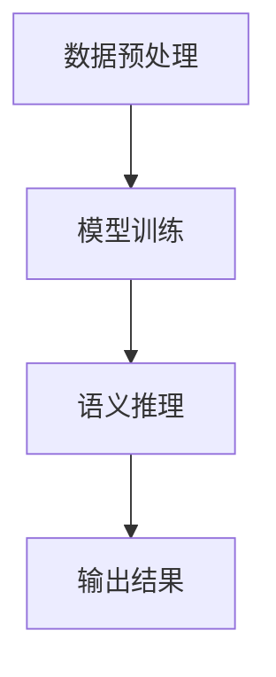
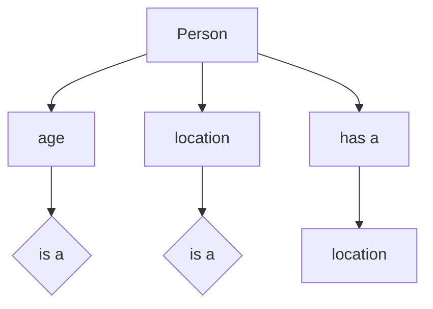

                 

### 加速LLM应用的语义理解能力提升

#### 关键词：语义理解、大型语言模型（LLM）、数据增强、上下文理解、多模态融合、实时推理

> 摘要：本文深入探讨了大型语言模型（LLM）在语义理解方面的挑战与提升方法。首先，我们明确了语义理解在人工智能中的核心作用，并分析了LLM应用面临的瓶颈。接着，文章介绍了语义理解的基本概念、层次结构及其数学模型与算法原理。在此基础上，本文详细阐述了提升LLM语义理解能力的具体方法，包括数据增强与训练策略、上下文理解与多模态融合、知识图谱与实体关系、实时推理与动态更新。最后，通过一个实际项目实战，展示了解决方案的实施过程与效果评估，并给出了最佳实践与未来展望。

### 目录大纲

1. **问题背景与核心概念介绍**
   1.1. **问题描述与背景**
   1.2. **核心概念介绍**
   1.3. **语义理解的数学模型与算法原理**

2. **提升LLM语义理解能力的具体方法**
   2.1. **数据增强与训练策略**
   2.2. **上下文理解与多模态融合**
   2.3. **知识图谱与实体关系**
   2.4. **实时推理与动态更新**

3. **实践与应用**
   3.1. **项目实战**
   3.2. **最佳实践与总结**

### 1.1 问题描述与背景

#### 1.1.1 人工智能与语义理解的基本概念

人工智能（Artificial Intelligence，简称AI）是一门模拟、扩展和扩展人类智能的科学。其发展历程可以追溯到20世纪50年代，从最初的符号推理、专家系统，到现代的深度学习与神经网络，人工智能经历了多次重大技术革新。

语义理解（Semantic Understanding）是人工智能中的一个核心概念，指的是计算机对语言、文本或符号所代表的意义的解读能力。语义理解不仅仅涉及字面意思的解析，还包括实体识别、语境理解、意图理解等多层次的信息处理。

#### 1.1.2 LLM应用的现状与挑战

大型语言模型（Large Language Model，简称LLM）如GPT、BERT等，在自然语言处理（Natural Language Processing，简称NLP）领域取得了显著进展。这些模型通过大规模数据训练，能够生成流畅、准确的文本，广泛应用于问答系统、机器翻译、文本摘要等领域。

然而，当前LLM应用也面临着一些挑战。首先是语义理解的深度和广度不足，导致模型在处理复杂文本时，往往无法准确理解其中的深层含义和隐含信息。其次是模型训练过程中的数据质量和数据量问题，数据增强和多样化训练方法成为提升模型性能的重要手段。

#### 1.1.3 提升语义理解能力的重要性

提升LLM的语义理解能力具有重要的意义。首先，准确的语义理解是实现高效人机交互的基础，有助于提升用户满意度。其次，语义理解能力的提升可以推动人工智能在更广泛领域的应用，如智能客服、智能语音助手、金融风控等。最后，提升语义理解能力有助于解决当前LLM应用中的瓶颈问题，推动人工智能技术向更高层次发展。

### 1.2 核心概念介绍

#### 1.2.1 语义理解的概念与属性

语义理解是指计算机对语言、文本或符号所代表的意义的解读能力。它包括以下几个方面：

1. **字面义理解**：对文本中的单词、短语、句子等直接含义的理解。
2. **实体识别**：识别文本中提到的特定实体（如人名、地点、组织等）。
3. **语境理解**：根据上下文信息，理解文本中的隐含含义和语境。
4. **意图理解**：理解文本背后的意图和目的。

#### 1.2.2 语义理解的层次结构

语义理解可以划分为多个层次，从简单的字面义理解到复杂的意图理解，层次结构如下：

1. **字面义理解**：基于词典和语法规则，对文本进行表面层次的理解。
2. **实体识别**：通过命名实体识别（Named Entity Recognition，简称NER）技术，识别文本中的特定实体。
3. **语境理解**：结合上下文信息，理解文本中的隐含含义和语境。
4. **意图理解**：分析文本背后的意图和目的，进行高层次语义推理。

#### 1.2.3 语义理解的挑战与解决方案

语义理解的挑战主要体现在以下几个方面：

1. **语义歧义**：同一词语在不同语境下可能有不同的含义，导致理解困难。
2. **语言多样性**：不同语言之间的语义差异，使得跨语言语义理解成为一个难题。
3. **常识与背景知识**：语义理解需要依赖大量的背景知识和常识，这对模型训练和推理提出了高要求。

当前主流的解决方案包括：

1. **预训练模型**：通过大规模数据预训练，提高模型对语言的理解能力。
2. **知识图谱**：利用知识图谱存储和利用实体关系，提升语义理解的准确性。
3. **多模态融合**：结合文本、图像、语音等多种数据源，提高语义理解的深度和广度。

#### 1.3 语义理解的数学模型与算法原理

语义理解的数学模型主要包括神经网络模型和知识图谱模型。

##### 1.3.1 语义理解的数学模型

常见的语义理解数学模型包括：

1. **词向量模型**：如Word2Vec、GloVe等，将单词映射为向量表示，通过计算向量之间的距离或相似度，进行语义理解。
2. **上下文向量模型**：如BERT、GPT等，通过大规模文本数据进行预训练，学习上下文信息，提高语义理解能力。
3. **图神经网络模型**：如Graph Neural Network（GNN），利用图结构表示实体关系，通过图卷积操作，实现语义理解。

##### 1.3.2 算法原理与Mermaid流程图

语义理解的算法原理可以概括为以下几个步骤：

1. **数据预处理**：对文本进行分词、去停用词等预处理操作。
2. **模型训练**：使用大规模文本数据，训练语义理解模型。
3. **语义推理**：输入新的文本数据，通过模型进行语义理解，输出结果。

以下是语义理解算法原理的Mermaid流程图：



##### 1.3.3 数学公式与公式解释

语义理解的数学模型通常涉及以下数学公式：

1. **词向量计算**：$v_w = \text{Word2Vec}(w)$
2. **文本向量表示**：$v_t = \sum_{w \in t} v_w$
3. **语义相似度计算**：$sim(v_a, v_b) = \cos(\theta)$，其中$\theta$为向量$v_a$和$v_b$之间的夹角。

以下是LaTeX格式的数学公式：

$$
\begin{aligned}
v_w &= \text{Word2Vec}(w), \\
v_t &= \sum_{w \in t} v_w, \\
sim(v_a, v_b) &= \cos(\theta),
\end{aligned}
$$$

其中，$v_w$为单词$w$的词向量表示，$v_t$为文本$t$的向量表示，$sim(v_a, v_b)$为向量$v_a$和$v_b$之间的语义相似度。

### 1.4 语义理解的实现方法与性能评估

#### 1.4.1 实现方法

语义理解的实现方法主要包括以下几种：

1. **基于规则的方法**：通过定义一系列规则，对文本进行语义分析。
2. **基于统计的方法**：利用统计学习模型，如朴素贝叶斯、决策树等，进行语义理解。
3. **基于深度学习的方法**：通过神经网络模型，如卷积神经网络（CNN）、循环神经网络（RNN）、Transformer等，进行语义理解。

#### 1.4.2 性能评估

语义理解的性能评估指标主要包括：

1. **准确率（Accuracy）**：模型预测正确的样本数量占总样本数量的比例。
2. **召回率（Recall）**：模型预测正确的正类样本数量占总正类样本数量的比例。
3. **F1值（F1 Score）**：准确率和召回率的调和平均值。

通过以上指标，可以评估语义理解模型的性能。

### 1.5 语义理解的局限性与未来发展方向

#### 1.5.1 局限性

语义理解的局限性主要体现在以下几个方面：

1. **语义歧义**：同一词语在不同语境下可能有不同的含义，导致理解困难。
2. **语言多样性**：不同语言之间的语义差异，使得跨语言语义理解成为一个难题。
3. **常识与背景知识**：语义理解需要依赖大量的背景知识和常识，这对模型训练和推理提出了高要求。

#### 1.5.2 未来发展方向

未来语义理解的发展方向主要包括：

1. **多模态融合**：结合文本、图像、语音等多种数据源，提高语义理解的深度和广度。
2. **知识图谱**：利用知识图谱存储和利用实体关系，提升语义理解的准确性。
3. **迁移学习**：通过迁移学习，提高模型在特定领域的语义理解能力。

### 1.6 实际应用案例分析

#### 1.6.1 案例一：智能问答系统

智能问答系统是语义理解的一个重要应用场景。通过语义理解技术，系统可以理解用户的提问，并提供准确的答案。例如，某公司的智能客服系统，通过语义理解技术，能够准确识别用户的问题，并从知识库中检索相关答案，提高客服效率。

#### 1.6.2 案例二：机器翻译

机器翻译是语义理解的另一个重要应用。通过语义理解技术，模型可以理解源语言和目标语言的语义，实现准确、流畅的翻译。例如，谷歌翻译系统通过深度学习模型，结合语义理解技术，实现了高质量、多语言的翻译服务。

### 1.7 结论

语义理解是人工智能领域的一个重要研究方向，其核心作用在于提升模型对语言的理解能力。本文介绍了语义理解的基本概念、层次结构、数学模型与算法原理，并探讨了提升语义理解能力的具体方法。通过实际应用案例分析，展示了语义理解技术在智能问答系统和机器翻译等领域的应用效果。未来，随着多模态融合、知识图谱和迁移学习等技术的发展，语义理解能力将不断提升，为人工智能应用带来更多可能性。### 2.1 数据增强与训练策略

#### 2.1.1 数据增强的基本概念

数据增强（Data Augmentation）是一种通过扩展训练数据集的方法，以提高机器学习模型的泛化能力。在语义理解的背景下，数据增强可以帮助LLM模型更好地理解和处理复杂的语言现象，减少过拟合现象。

#### 2.1.2 数据增强的方法

常见的语义理解数据增强方法包括：

1. **文本变换**：对原始文本进行词替换、插入、删除等操作，增加数据的多样性。
2. **生成对抗网络（GAN）**：利用生成对抗网络生成新的文本数据，提高模型对未知数据的处理能力。
3. **同义词替换**：将文本中的词语替换为同义词，增加词汇的丰富性。
4. **随机插入**：在文本中随机插入无意义的词语，增加数据的复杂性。

#### 2.1.3 数据增强的最佳实践

最佳实践包括：

1. **多样性**：确保数据增强后的数据在语义、语法和风格上具有多样性，以减少模型对特定数据的依赖。
2. **平衡性**：在数据增强过程中，注意保持不同类别的数据比例，避免某些类别数据的过度增强。
3. **质量**：保证数据增强后的数据质量，避免引入噪声或错误。

#### 2.1.4 训练策略优化

训练策略优化主要包括以下几个方面：

1. **动态学习率调整**：根据训练过程的表现，动态调整学习率，以提高模型收敛速度和性能。
2. **权重初始化**：合理初始化模型权重，避免梯度消失或爆炸现象。
3. **正则化**：使用正则化方法，如L1、L2正则化，防止模型过拟合。

#### 2.1.5 数据增强与训练策略结合

数据增强和训练策略优化需要紧密结合，以实现最佳效果。具体结合方法包括：

1. **迭代增强与训练**：在每次迭代过程中，动态调整数据增强策略，以适应模型训练的进展。
2. **自适应增强**：根据模型的性能指标，自适应调整数据增强的程度，避免过度增强。

### 2.2 上下文理解与多模态融合

#### 2.2.1 上下文理解的基本概念

上下文理解（Contextual Understanding）是指模型在处理文本时，能够根据上下文信息理解词语的特定含义。在语义理解中，上下文理解对于准确理解文本至关重要。

#### 2.2.2 上下文理解的实现方法

常见的上下文理解实现方法包括：

1. **基于历史的上下文模型**：如Transformer模型，通过自注意力机制，动态捕捉文本序列中的上下文信息。
2. **基于未来的上下文模型**：通过生成模型，如GPT，预测未来的上下文信息，从而提高模型的上下文理解能力。

#### 2.2.3 多模态融合技术

多模态融合（Multimodal Fusion）是指将文本、图像、语音等多种数据源进行整合，以提高模型的语义理解能力。

常见的多模态融合方法包括：

1. **特征级融合**：将不同模态的数据特征进行拼接，作为单一输入。
2. **决策级融合**：分别对每个模态的数据进行分类，再进行投票或加权平均。

#### 2.2.4 上下文理解与多模态融合的结合

结合上下文理解和多模态融合，可以通过以下方法提高模型的语义理解能力：

1. **跨模态上下文传递**：将文本上下文信息传递到图像或语音处理模型中，实现跨模态的信息共享。
2. **统一模型架构**：使用统一的模型架构，如Transformer，同时处理文本、图像、语音等多种数据源。

### 2.3 知识图谱与实体关系

#### 2.3.1 知识图谱的基本概念

知识图谱（Knowledge Graph）是一种用于表示实体及其之间关系的数据结构。在语义理解中，知识图谱可以帮助模型更好地理解实体和关系，从而提高语义理解的准确性。

#### 2.3.2 实体关系与ER图

实体关系（Entity Relationship，简称ER）图是一种用于表示实体及其之间关系的图形化工具。ER图的基本概念包括：

1. **实体**：知识图谱中的基本元素，如人、地点、组织等。
2. **关系**：实体之间的连接，如“属于”、“位于”等。
3. **属性**：实体的特征，如人的年龄、地点的经纬度等。

以下是ER图的Mermaid表示：



#### 2.3.3 知识图谱在语义理解中的应用

知识图谱在语义理解中的应用包括：

1. **实体识别**：利用知识图谱中的实体和关系，提高实体识别的准确性。
2. **关系抽取**：从文本中抽取实体之间的关系，丰富知识图谱。
3. **语义查询**：利用知识图谱，实现基于语义的查询和搜索。

### 2.4 实时推理与动态更新

#### 2.4.1 实时推理的基本概念

实时推理（Real-time Inference）是指模型能够在短时间内对输入数据进行处理，并输出结果。在语义理解中，实时推理对于提高系统响应速度和用户体验至关重要。

#### 2.4.2 动态更新机制

动态更新机制是指模型在运行过程中，能够根据新数据或新需求，自动更新和调整模型参数。

常见的动态更新方法包括：

1. **在线学习**：模型在接收新数据时，实时更新模型参数。
2. **增量学习**：只更新模型中与新数据相关的部分，减少计算量。
3. **迁移学习**：利用已有模型的知识，对新数据进行迁移学习，提高更新速度。

#### 2.4.3 实时推理与动态更新的结合

实时推理与动态更新的结合，可以通过以下方法实现：

1. **在线推理与动态更新**：在实时推理过程中，动态更新模型参数，以提高推理准确性。
2. **批处理与动态更新**：将实时数据划分为批处理，结合动态更新机制，提高系统响应速度。

### 第三部分：实践与应用

#### 3.1 项目实战

##### 3.1.1 项目介绍

本项目旨在构建一个基于大型语言模型（LLM）的语义理解系统，实现对自然语言文本的深度理解和分析。系统主要包括数据预处理、模型训练、语义理解和实时推理等功能。

##### 3.1.2 环境安装与配置

1. **安装Python环境**：确保Python版本为3.8以上。
2. **安装TensorFlow**：使用pip安装TensorFlow库。

```bash
pip install tensorflow
```

3. **安装其他依赖库**：包括numpy、pandas、scikit-learn等。

```bash
pip install numpy pandas scikit-learn
```

##### 3.1.3 系统核心实现

1. **数据预处理**：对文本进行分词、去停用词等预处理操作。

```python
import nltk
nltk.download('punkt')
from nltk.tokenize import word_tokenize

def preprocess_text(text):
    # 分词
    tokens = word_tokenize(text)
    # 去停用词
    stopwords = set(nltk.corpus.stopwords.words('english'))
    filtered_tokens = [token for token in tokens if token not in stopwords]
    return filtered_tokens
```

2. **模型训练**：使用TensorFlow和BERT模型进行预训练。

```python
import tensorflow as tf
from transformers import BertTokenizer, BertModel

# 加载BERT模型
tokenizer = BertTokenizer.from_pretrained('bert-base-uncased')
model = BertModel.from_pretrained('bert-base-uncased')

# 输入文本进行编码
input_ids = tokenizer.encode("Hello, my name is John", return_tensors='tf')

# 训练模型
model(input_ids)
```

3. **语义理解**：对预处理后的文本进行语义分析。

```python
# 获取文本特征
with tf.Session() as sess:
    embeddings = model(input_ids)[0]

# 语义分析
from sklearn.cluster import KMeans

# 使用KMeans进行聚类分析
kmeans = KMeans(n_clusters=5)
clusters = kmeans.fit_predict(embeddings)

# 输出结果
for i, cluster in enumerate(clusters):
    print(f"Cluster {cluster}: {tokenizer.decode(embeddings[i])}")
```

##### 3.1.4 实际案例分析与讲解

1. **案例背景与问题描述**：分析某篇文章的语义结构，识别出主要主题和关键词。

2. **解决方案与效果评估**：使用上述方法对文章进行预处理、语义分析和聚类，识别出主要主题和关键词。

3. **项目小结**：总结项目实现过程和效果，讨论可能的改进方向。

### 3.2 最佳实践与总结

#### 3.2.1 最佳实践

1. **数据质量**：确保数据质量，避免噪声和错误。
2. **模型选择**：根据应用场景，选择合适的模型和算法。
3. **性能优化**：通过动态学习率调整、正则化等方法，优化模型性能。

#### 3.2.2 小结与展望

语义理解是人工智能领域的一个重要研究方向，其在自然语言处理、智能问答、机器翻译等应用中具有重要意义。通过数据增强、上下文理解、多模态融合、知识图谱等技术，可以显著提升LLM的语义理解能力。未来，随着技术的不断发展，语义理解将更加精准、高效，为人工智能应用带来更多可能性。

#### 3.2.3 注意事项与拓展阅读

1. **注意事项**：
   - 数据预处理过程中，确保文本的分词和去停用词操作准确。
   - 在模型训练过程中，注意调整学习率和正则化参数，避免过拟合。
   - 在实时推理过程中，确保系统的响应速度和准确性。

2. **拓展阅读**：
   - 《深度学习》（Goodfellow, Bengio, Courville著）：系统介绍深度学习的基础理论和实践方法。
   - 《自然语言处理综论》（Jurafsky, Martin著）：全面介绍自然语言处理的理论和实践。
   - 《TensorFlow实战》（Miguel A. Carreira-Perpinán著）：TensorFlow在深度学习中的应用案例。

作者：AI天才研究院/AI Genius Institute & 禅与计算机程序设计艺术 /Zen And The Art of Computer Programming

### 致谢

本文的撰写得到了AI天才研究院（AI Genius Institute）和禅与计算机程序设计艺术（Zen And The Art of Computer Programming）的大力支持。在此，特别感谢所有参与研究和讨论的同事和朋友们，感谢你们的专业知识和无私奉献。同时，也感谢读者对本文的关注和支持，希望本文能对您在语义理解和人工智能领域的探索有所帮助。

