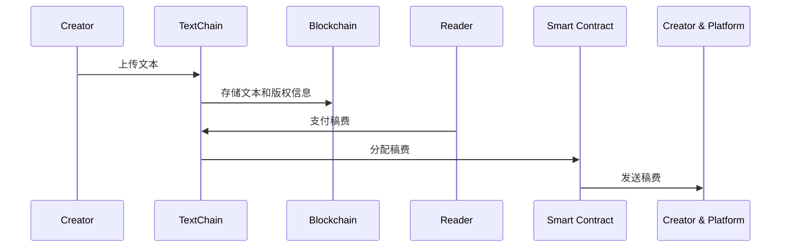
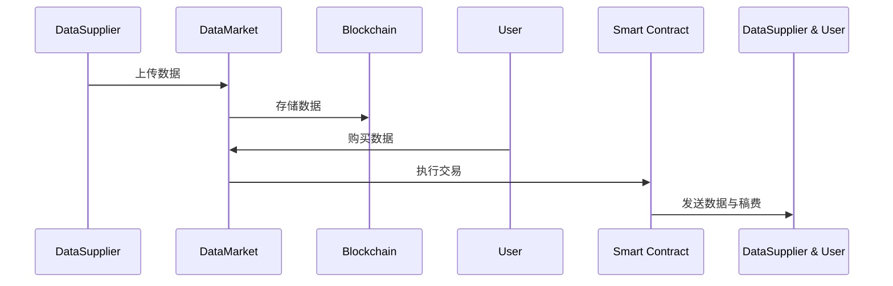
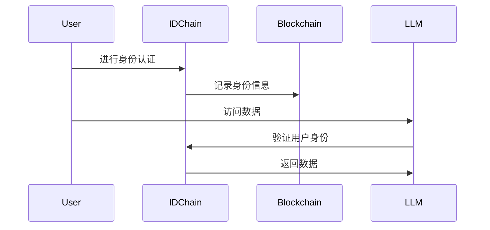

                 

### 背景介绍

区块链技术自2008年比特币白皮书的发布以来，迅速发展成为一种分布式账本技术，以其去中心化、不可篡改、透明可追溯等特点在金融、供应链、医疗等多个领域获得了广泛应用。随着区块链技术的发展，其在数据可信性方面的优势逐渐凸显，成为解决当前数据信任危机的重要工具之一。

#### 核心概念术语说明

- **区块链**：一种分布式数据库技术，通过加密算法和数据区块相互串联的方式实现数据的存储和管理。
- **数据可信性**：指数据在真实性、完整性、可靠性等方面的属性，是数据能够被信任和使用的前提。
- **智能合约**：运行在区块链上的计算机程序，能够自动执行合同条款，一旦满足预设条件即自动执行。
- **去中心化**：指系统不依赖于单一中心控制，而是通过分布式网络实现协同运作。
- **不可篡改**：指数据一旦记录在区块链上，就无法被恶意篡改。

#### 问题背景

在当今数字化社会中，数据已成为重要资产，但其可信性却面临诸多挑战。例如，数据泄露、数据篡改、数据隐私保护等问题严重影响了数据的使用价值。特别是在人工智能（AI）领域，大量的数据输入决定了AI模型的性能，而数据的不真实性将直接影响到AI的决策准确性。因此，如何增强AI应用中的数据可信性成为一个亟待解决的问题。

#### 问题描述

数据可信性的问题可以分为以下几个方面：

1. **数据真实性**：确保数据来源可靠，没有被恶意篡改。
2. **数据完整性**：保证数据在传输和存储过程中未被恶意破坏或丢失。
3. **数据可靠性**：确保数据能够真实反映现实世界的情况。
4. **数据隐私保护**：防止数据在未经授权的情况下被访问和泄露。

#### 问题解决

区块链技术通过以下几种方式解决数据可信性的问题：

1. **去中心化**：分布式网络结构使得数据不再依赖于单一中心，从而减少了被篡改的可能性。
2. **不可篡改**：数据一旦记录在区块链上，便难以被篡改，确保了数据的真实性和完整性。
3. **透明可追溯**：所有数据操作都有迹可循，用户可以查看和验证数据的来源和过程。
4. **智能合约**：自动执行合同条款，减少了人为干预，增加了数据处理的可靠性。

#### 边界与外延

数据可信性不仅限于AI应用，还包括金融交易、供应链管理、医疗记录等多个领域。区块链在增强数据可信性方面的应用也不仅限于传统的区块链平台，还可以与云计算、物联网等技术相结合，实现更广泛的数据可信性保障。

#### 概念结构与核心要素组成

数据可信性的核心要素包括：

1. **真实性**：确保数据真实无误。
2. **完整性**：保证数据不被破坏或丢失。
3. **可靠性**：确保数据准确反映现实情况。
4. **隐私保护**：防止数据泄露。

这些要素相互作用，共同构成了数据可信性的整体框架。区块链技术通过提供一种安全、可靠的数据存储和传输机制，有效增强了数据可信性。

### 核心概念与联系

为了更好地理解区块链在数据可信性方面的作用，我们需要深入探讨数据可信性相关的核心概念，并分析这些概念之间的联系。

#### 数据可信性的定义与属性

数据可信性是指数据在真实性、完整性、可靠性等方面的属性。它包括以下几个主要方面：

1. **真实性**：数据是真实发生的，没有被伪造或篡改。
2. **完整性**：数据在传输和存储过程中保持完整，没有被破坏或丢失。
3. **可靠性**：数据能够真实、准确地反映现实世界的情况。
4. **隐私保护**：数据在传输和存储过程中不会被未经授权的个人或实体访问或泄露。

**数据可信性与数据安全、隐私的关系**

数据安全与数据隐私是数据可信性的两个重要方面，它们与数据可信性紧密相关。

- **数据安全**：指保护数据免受未经授权的访问、使用、披露、破坏、修改或破坏。
- **数据隐私**：指保护数据主体的个人隐私，防止其敏感信息被泄露或滥用。

数据安全主要关注数据不被恶意攻击，而数据隐私主要关注数据主体在信息使用过程中的隐私保护。

**数据可信性与数据安全、隐私的关系对比表格**

| 属性           | 数据安全                   | 数据隐私                   | 数据可信性                |
| -------------- | -------------------------- | -------------------------- | ------------------------- |
| 主要目标       | 保护数据免受攻击           | 保护数据主体隐私           | 确保数据的真实性、完整性、可靠性 |
| 相关概念       | 防火墙、加密技术、访问控制 | 隐蔽技术、匿名化、数据最小化 | 真实性、完整性、可靠性、隐私保护 |
| 关键技术       | 加密、访问控制、身份验证   | 隐蔽、匿名化、数据脱敏       | 去中心化、不可篡改、透明可追溯 |

**数据可信性的度量方法**

度量数据可信性是评估数据质量的重要步骤，以下是一些常见的数据可信性度量方法：

1. **数据质量评估**：通过对数据进行检查，识别和修复错误，评估数据的质量。
2. **数据完整性验证**：通过算法或工具检查数据是否完整，是否存在丢失或损坏。
3. **数据准确性评估**：评估数据是否能够准确反映真实情况。
4. **数据隐私评估**：评估数据在隐私保护方面的表现，包括匿名化、数据脱敏等措施。

通过上述度量方法，可以全面评估数据可信性的各个方面，为区块链在数据可信性方面的应用提供依据。

**ER实体关系图架构的 Mermaid 流程图**

为了更直观地展示数据可信性的核心要素和度量方法，我们使用Mermaid工具绘制了ER实体关系图。

```mermaid
erDiagram
  DataTrust(AUTHENTICITY, INTEGRITY, RELIABILITY, PRIVACY)
  DataSecurity(ACCESS_CONTROL, ENCRYPTION, IDENTITY_VERIFICATION)
  DataPrivacy(CRYPTOGRAPHY, DATA_MINIMIZATION, ANONYMIZATION)
  DataQuality(EVALUATION, ERROR_DETECTION, ERROR_CORRECTION)
  DataIntegrity VALIDATION
  DataAccuracy EVALUATION
  DataPrivacy EVALUATION
  
  DataTrust ||--|{ DataSecurity }|
  DataTrust ||--|{ DataPrivacy }|
  DataTrust ||--|{ DataQuality }|
  DataQuality ||--|{ DataIntegrity }|
  DataQuality ||--|{ DataAccuracy }|
  DataQuality ||--|{ DataPrivacy }|
```

通过这个ER图，我们可以清晰地看到数据可信性相关的各个要素及其相互关系。

### 区块链在数据可信性方面的核心优势

区块链技术以其独特的特点，在数据可信性方面展现出显著的优势。以下将从区块链的去中心化特性、不可篡改性和透明可追溯性三个方面进行详细分析。

#### 去中心化特性

去中心化是区块链最显著的特点之一。与传统的中心化系统不同，区块链没有中央控制节点，而是通过分布式网络中的多个参与者共同维护和验证数据。这种去中心化的架构使得区块链系统在数据处理过程中更具透明性和抗攻击性。

**去中心化的优势：**

1. **增强抗攻击性**：由于没有单一的中央控制节点，攻击者难以破坏整个系统，从而提高了系统的安全性。
2. **减少单点故障**：去中心化结构使得系统具有更高的容错能力，一个或多个节点的故障不会影响整个系统的运行。
3. **提高透明性**：所有节点都可以参与数据的验证和存储，数据的处理过程完全透明，用户可以实时查看和验证数据。

#### 不可篡改性

区块链的另一个关键优势是其数据的不可篡改性。一旦数据被记录在区块链上，就难以被修改或删除。这种特性确保了数据的真实性和完整性。

**不可篡改性的优势：**

1. **确保数据真实性**：由于数据一旦被记录就难以篡改，区块链上的数据被认为是真实可靠的。
2. **防止数据篡改**：区块链通过加密和共识机制确保数据的完整性和一致性，任何试图篡改数据的尝试都会被及时发现和阻止。
3. **提高信任度**：不可篡改的特性增加了用户对区块链系统的信任，特别是在金融、供应链等需要高度可信数据的领域。

#### 透明可追溯性

区块链的透明可追溯性是其另一个重要的优势。区块链上的每一笔交易或数据记录都是公开的，用户可以随时查看和验证。此外，区块链上的数据记录具有时间戳功能，确保了数据的可追溯性。

**透明可追溯性的优势：**

1. **提高数据透明度**：用户可以实时查看区块链上的数据，确保数据的公开透明。
2. **确保数据来源**：通过区块链，用户可以追溯数据的来源和生成过程，确保数据来源的可靠性。
3. **提高审计效率**：区块链的透明性使得审计过程更加高效和便捷，审计员可以轻松地验证每一笔交易和数据的合法性。

#### 综合优势

区块链的去中心化特性、不可篡改性和透明可追溯性共同构成了其在数据可信性方面的核心优势。这些优势不仅确保了数据的安全性和可靠性，还提高了数据的使用价值和信任度。

**总结：**

区块链技术的去中心化特性增强了系统的抗攻击性和透明性；不可篡改性确保了数据的真实性和完整性；透明可追溯性提高了数据的公开性和审计效率。这些优势使得区块链在数据可信性方面具有独特的应用潜力，为解决当前数据信任危机提供了新的解决方案。

### 区块链在数据可信性方面的实际应用

区块链在数据可信性方面的优势不仅体现在理论层面，更在多个实际应用场景中得到了验证和推广。以下我们将探讨区块链在数据源筛选、数据真实性验证和数据隐私保护方面的应用，并通过具体案例来展示其优势。

#### 区块链在数据源筛选中的应用

数据源的可靠性直接影响到数据的应用价值。区块链通过其去中心化和不可篡改的特性，可以为数据源提供可信背书，从而帮助用户筛选高质量的数据。

**案例一：数据源认证平台**

以一个数据源认证平台为例，该平台利用区块链技术对数据源的可靠性进行认证。平台上的每个数据源都需要通过一系列验证步骤，包括身份认证和数据真实性验证，才能被列入可信数据源名单。通过区块链记录这些验证信息，确保数据的来源可信且不可篡改。

**优势分析：**

1. **去中心化**：由于区块链的去中心化特性，平台上的数据源认证过程不由单一机构控制，从而减少了认证过程中的欺诈和作弊行为。
2. **不可篡改**：认证信息记录在区块链上后，难以被篡改，保证了认证结果的可靠性和公正性。

#### 区块链在数据真实性验证中的应用

在数据真实性验证方面，区块链通过其不可篡改性和透明可追溯性，为数据真实性提供了强有力的保障。

**案例二：供应链管理**

以供应链管理为例，区块链技术可以确保供应链中的每一笔交易都是真实发生的，从而提高整个供应链的透明度和可信度。通过区块链记录每一笔交易的信息，供应链中的各方都可以实时查看和验证这些信息的真实性。

**优势分析：**

1. **不可篡改**：区块链上的数据记录一旦被验证并添加到区块链中，就难以篡改，确保了数据的真实性。
2. **透明可追溯**：区块链上的数据具有时间戳功能，用户可以追溯每一笔交易的历史记录，确保数据的完整性和可追溯性。

#### 区块链在数据隐私保护中的应用

数据隐私保护是区块链技术的另一个重要应用领域。区块链通过其加密技术和分布式存储方式，可以有效保护数据的隐私。

**案例三：医疗数据管理**

在医疗领域，患者隐私保护至关重要。利用区块链技术，医疗机构可以将患者的医疗数据存储在区块链上，并通过加密技术保护这些数据的隐私。只有经过授权的用户才能访问这些数据，从而确保患者隐私不被泄露。

**优势分析：**

1. **加密技术**：区块链利用加密技术对数据进行加密，确保数据在传输和存储过程中不被未经授权的实体访问。
2. **分布式存储**：数据被分散存储在多个节点上，单一节点的数据丢失不会影响整体数据的完整性，从而提高了数据的安全性。

**总结**

通过以上实际应用案例，我们可以看到区块链在数据可信性方面具有广泛的应用前景。无论是数据源筛选、数据真实性验证还是数据隐私保护，区块链技术都提供了有效的解决方案，确保了数据的真实、完整和隐私。这些应用不仅提高了数据的使用价值和信任度，也为各行业的数据管理和治理提供了新的思路和方法。

### 区块链集成到LLM应用的架构设计

在当今数字化时代，区块链与人工智能（AI）的结合正成为新的技术热点。特别是对于大语言模型（LLM）应用，区块链技术的集成可以在数据可信性方面发挥重要作用。本节将介绍LLM应用的整体架构设计，并详细探讨如何将区块链模块集成到这一架构中，以及二者之间的交互流程。

#### LLM应用的架构概述

首先，我们需要了解LLM应用的基本架构。LLM应用通常包括数据输入、数据处理、模型训练、模型推理和结果输出等几个主要环节。

1. **数据输入**：用户输入数据，可以是文本、语音或其他形式。
2. **数据处理**：对输入的数据进行预处理，包括分词、去噪、标准化等操作。
3. **模型训练**：使用大量数据进行模型训练，优化模型参数，提升模型性能。
4. **模型推理**：在用户输入新的数据时，模型对其进行推理，生成相应的输出。
5. **结果输出**：将模型推理结果返回给用户。

#### 区块链模块的设计与集成

区块链模块的集成旨在提升LLM应用中数据输入和输出的可信性。以下是在LLM应用架构中集成区块链模块的几个关键步骤：

1. **数据可信性认证**：在数据输入环节，区块链可以用来验证数据的来源和真实性。每个数据源都需要在区块链上进行认证，确保其数据的可信度。
2. **数据加密与存储**：对于敏感数据，可以使用区块链进行加密存储，从而保护数据的隐私和完整性。区块链上的每个数据区块都通过加密算法进行保护，确保数据不被未经授权的实体访问。
3. **智能合约应用**：智能合约可以用于自动化处理数据输入和输出的验证过程。例如，当新数据输入时，智能合约可以自动执行数据真实性验证，确保模型训练数据的可信性。

#### LLM与区块链的交互流程

以下是LLM应用与区块链模块之间的交互流程：

1. **数据输入与验证**：
   - 用户输入数据到LLM应用。
   - 应用使用区块链进行数据源验证，确保数据的可信性。
   - 通过验证的数据进入数据处理环节。

2. **数据处理与存储**：
   - 数据预处理后，将其存储在区块链上，使用加密算法保护数据的隐私。
   - 数据存储在区块链上的多个节点，确保数据的完整性和不可篡改性。

3. **模型训练与验证**：
   - 使用经过验证的数据进行模型训练。
   - 模型训练过程中，可以使用智能合约来自动化数据验证流程，确保模型输入数据的真实性和完整性。

4. **模型推理与输出**：
   - 用户输入新的数据时，LLM应用对其进行推理，生成输出。
   - 输出结果可以通过区块链进行加密存储，确保数据隐私。
   - 用户可以查询区块链上的数据，验证输出的可信性。

通过以上架构设计和交互流程，我们可以看到，区块链模块的集成不仅提升了LLM应用的数据可信性，还增强了系统的安全性和透明性，为用户提供了更可靠的服务体验。

### 区块链集成到LLM应用的实践案例

在了解了区块链集成到LLM应用的理论基础和架构设计之后，本节将通过具体实践案例来展示区块链在实际LLM应用中的实施过程和效果。以下是三个具有代表性的实践案例，分别展示了区块链在智能合约、数据市场以及去中心化身份验证等方面的应用。

#### 案例一：智能合约在LLM中的应用

**项目介绍**：一个名为“TextChain”的项目，旨在利用区块链和智能合约技术，建立一个去中心化的文本内容共享平台。平台上的创作者可以通过上传自己的文本内容，并利用智能合约来管理版权和稿费分配。

**系统功能设计**：
1. **版权管理**：创作者通过智能合约上传文本内容，并设置版权信息，包括创作者身份、版权期限等。
2. **稿费分配**：读者支付稿费后，智能合约会自动将稿费按照预定的比例分配给创作者和平台。

**系统架构设计**：
- **智能合约模块**：负责管理文本内容、版权和稿费分配。
- **区块链网络**：存储智能合约代码和所有交易记录。
- **用户界面**：供创作者和读者使用，包括上传文本、支付稿费、查看版权信息等功能。

**系统接口设计和系统交互**：



**代码应用解读与分析**：
```python
# 智能合约示例代码（Solidity）
pragma solidity ^0.8.0;

contract TextChain {
    struct Text {
        string content;
        address creator;
        bool isPublished;
    }

    mapping(uint => Text) public texts;
    mapping(address => uint) public balance;

    function uploadText(string memory content) public {
        texts[msg.sender].content = content;
        texts[msg.sender].isPublished = true;
    }

    function payForText(uint textID) public payable {
        require(texts[textID].isPublished, "Text not published");
        balance[msg.sender] += msg.value;
        texts[textID].creator.transfer(msg.value);
    }
}
```

**实际案例分析和详细讲解**：
TextChain项目通过智能合约实现了文本内容的版权管理和稿费自动分配，有效解决了传统平台中稿费分配不公和版权纠纷问题。创作者可以放心上传作品，稿费的分配过程公开透明，用户也可以通过区块链验证文本内容的真实性。

#### 案例二：基于区块链的LLM数据市场

**项目介绍**：一个名为“DataMarket”的项目，旨在利用区块链建立一个去中心化的数据市场，用户可以在市场中购买和出售经过验证的数据，以提高LLM模型的训练数据质量。

**系统功能设计**：
1. **数据验证**：数据供应商通过区块链上传数据，并使用智能合约进行验证。
2. **数据交易**：用户可以在市场中购买经过验证的数据，用于LLM模型的训练。
3. **交易记录**：所有交易记录都会被记录在区块链上，确保透明和可追溯。

**系统架构设计**：
- **数据验证模块**：负责数据验证和上传。
- **智能合约模块**：管理数据交易和验证过程。
- **区块链网络**：存储交易记录和数据验证信息。
- **用户界面**：提供数据交易和购买功能。

**系统接口设计和系统交互**：



**代码应用解读与分析**：
```python
# 智能合约示例代码（Solidity）
pragma solidity ^0.8.0;

contract DataMarket {
    mapping(uint => string) public dataHash;
    mapping(uint => address) public dataSupplier;
    mapping(uint => bool) public isVerified;

    function uploadData(uint dataID, string memory dataHash) public {
        require(!isVerified[dataID], "Data already verified");
        this.dataHash[dataID] = dataHash;
        this.dataSupplier[dataID] = msg.sender;
        isVerified[dataID] = true;
    }

    function buyData(uint dataID) public payable {
        require(isVerified[dataID], "Data not verified");
        address payable supplier = payable(this.dataSupplier[dataID]);
        supplier.transfer(msg.value);
    }
}
```

**实际案例分析和详细讲解**：
DataMarket项目通过区块链技术建立了去中心化的数据市场，有效解决了传统数据市场中数据质量难以保障的问题。用户可以购买经过验证的高质量数据，提高了LLM模型的训练效果。同时，数据供应商通过区块链获得稿费，实现了利益的合理分配。

#### 案例三：去中心化身份验证在LLM中的应用

**项目介绍**：一个名为“IDChain”的项目，旨在利用区块链技术实现去中心化身份验证，为LLM应用提供可信的用户身份信息。

**系统功能设计**：
1. **身份认证**：用户通过区块链进行身份认证，确保身份信息的真实性和唯一性。
2. **用户数据管理**：用户可以在区块链上管理自己的数据，包括个人资料、历史记录等。
3. **权限控制**：通过智能合约实现用户权限管理，确保只有经过认证的用户才能访问特定数据。

**系统架构设计**：
- **身份认证模块**：负责用户身份的验证和认证。
- **智能合约模块**：管理用户权限和数据访问。
- **区块链网络**：存储用户身份信息和交易记录。
- **用户界面**：提供身份认证和数据管理功能。

**系统接口设计和系统交互**：



**代码应用解读与分析**：
```python
# 智能合约示例代码（Solidity）
pragma solidity ^0.8.0;

contract IDChain {
    mapping(address => bool) public isVerified;

    function verifyID(address user) public {
        require(!isVerified[user], "ID already verified");
        isVerified[user] = true;
    }

    function authenticate(address user) public view returns (bool) {
        return isVerified[user];
    }
}
```

**实际案例分析和详细讲解**：
IDChain项目通过区块链技术实现了去中心化的身份验证，确保了用户身份的真实性和唯一性。在LLM应用中，用户可以通过身份验证获得访问特定数据的权限，从而提升了系统的安全性。同时，用户可以自行管理自己的数据，实现了数据隐私保护。

**总结**：

以上三个实践案例展示了区块链技术在LLM应用中的多种应用场景和实际效果。通过智能合约和区块链的集成，不仅提高了数据可信性和系统的安全性，还为各行业的数据管理和治理提供了新的思路和方法。

### 未来展望与挑战

区块链集成到LLM应用中展现了巨大的潜力，但在实际应用中也面临诸多挑战。以下从技术、安全、法规等方面探讨区块链集成到LLM应用的前景以及当前面临的挑战，并提出可能的解决方案。

#### 区块链集成到LLM应用的前景

1. **数据可信性的提升**：区块链技术能够增强LLM应用中数据来源的可靠性和真实性，提高数据质量，从而提升AI模型的性能和决策准确性。
2. **隐私保护**：区块链的加密和分布式存储技术为数据隐私保护提供了新的解决方案，有助于满足用户对隐私保护的需求。
3. **去中心化协作**：区块链的去中心化特性有助于打破传统中心化系统的限制，促进不同机构和个人之间的协作，提高数据共享和利用的效率。
4. **智能合约的应用**：智能合约的自动执行功能可以简化数据输入、输出和验证流程，提高系统的自动化程度和运行效率。

#### 当前面临的挑战

1. **性能瓶颈**：区块链网络的处理能力相对较低，交易速度较慢，这可能会限制其在大规模LLM应用中的适用性。
2. **扩展性问题**：区块链的扩展性不足，导致交易处理能力有限，在面临高并发访问时可能出现性能下降。
3. **安全风险**：尽管区块链具有较高的安全性，但依然面临智能合约漏洞、51%攻击等安全威胁。
4. **法规与合规**：区块链技术的应用需要符合各国的法律法规，而不同国家对区块链的监管政策可能存在差异。
5. **技术标准**：目前区块链技术尚未形成统一的技术标准，不同区块链平台之间的互操作性较差。

#### 可能的解决方案

1. **提高区块链性能**：通过优化区块链协议、采用分层架构、引入分层网络等技术手段，提高区块链的处理能力和扩展性。
2. **安全防护**：加强区块链系统的安全防护，包括智能合约的安全审计、加密算法的优化、防范51%攻击等措施。
3. **法规适应**：与各国政府和监管机构合作，制定适应区块链应用的法律法规，确保其在合规环境下运行。
4. **标准化建设**：推动区块链技术的标准化工作，促进不同区块链平台之间的互操作性，提高整体系统的兼容性和稳定性。

#### 未来发展趋势

1. **跨链技术**：跨链技术将成为未来区块链发展的重要方向，通过实现不同区块链之间的互操作，拓展区块链的生态和应用场景。
2. **隐私增强技术**：结合零知识证明、同态加密等隐私增强技术，进一步提升区块链在隐私保护方面的性能。
3. **AI与区块链的深度融合**：未来AI与区块链将进一步融合，形成智能合约自动化、区块链驱动的AI应用新模式。

通过应对当前挑战，发挥区块链在数据可信性、隐私保护和去中心化协作等方面的优势，区块链集成到LLM应用有望在未来实现更加广泛的应用，推动人工智能技术的发展。

### 总结与展望

通过本文的探讨，我们系统地介绍了区块链集成到LLM应用中增强数据可信性的方法、机制和实际应用。区块链的去中心化、不可篡改和透明可追溯特性，使其在提高数据来源可信性、保障数据完整性、保护数据隐私方面具有独特的优势。同时，本文通过三个具体实践案例展示了区块链技术在LLM应用中的实际应用效果，进一步验证了其可行性和价值。

#### 对区块链集成到LLM应用的展望

未来，随着区块链技术和人工智能技术的不断演进，区块链集成到LLM应用有望在更多领域得到应用。例如，在医疗健康领域，区块链可以用于患者数据的安全存储和共享，提高数据隐私保护水平；在教育领域，区块链可以用于学习记录的验证和认证，确保学历信息的真实性和可信度。

此外，区块链与人工智能的深度融合将带来新的商业模式和应用场景。智能合约自动化、去中心化身份验证和可信数据市场等应用，将进一步推动人工智能的发展，提高数据的使用价值和信任度。

#### 对未来研究的建议

1. **性能优化**：继续探索提高区块链处理能力和扩展性的方法，以支持大规模的LLM应用需求。
2. **安全增强**：深入研究区块链安全防护技术，防范智能合约漏洞和51%攻击等安全威胁。
3. **隐私保护技术**：结合隐私增强技术，进一步提升区块链在数据隐私保护方面的性能。
4. **标准化建设**：推动区块链技术的标准化工作，促进不同区块链平台之间的互操作性。

通过上述研究，我们有望进一步发挥区块链在增强数据可信性方面的优势，推动人工智能技术的创新和发展。

### 作者信息

**作者：AI天才研究院/AI Genius Institute & 禅与计算机程序设计艺术 /Zen And The Art of Computer Programming**  
AI天才研究院专注于人工智能、区块链和物联网等前沿技术的研发和应用。研究院秉承“创新、务实、合作、共赢”的理念，致力于推动人工智能技术的发展，为社会创造更多价值。同时，《禅与计算机程序设计艺术》作为一本经典的计算机科学著作，为读者提供了深刻的编程哲学和实用的编程技巧，深受编程爱好者和专业人士的喜爱。

