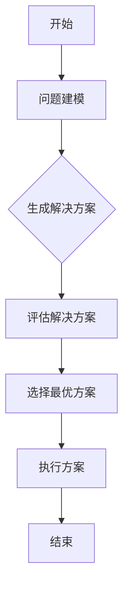
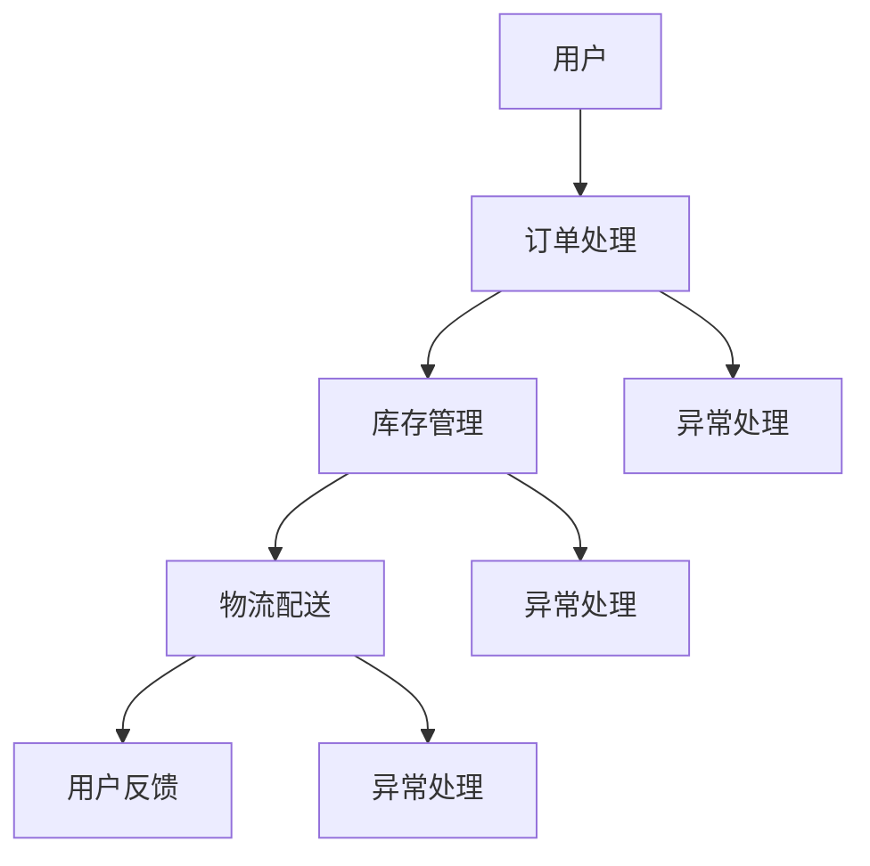
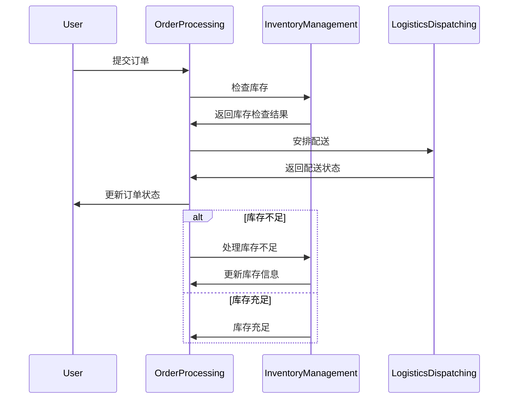

                 

### 协作式问题解决模型：应对复杂需求挑战

#### 关键词：协作式问题解决模型、复杂需求挑战、项目团队合作、企业战略决策、社会问题解决

> 摘要：本文将深入探讨协作式问题解决模型在应对复杂需求挑战中的应用。通过分析模型的核心概念、应用场景、设计实现以及系统分析与架构设计，我们希望能够为读者提供一个清晰、系统、可操作的解决方案框架，以提升在复杂需求环境下的应对能力和团队协作效率。

### 第一部分：协作式问题解决模型概述

#### 1.1.1 问题背景

在当今快速变化和高竞争的商业环境中，需求变得越来越复杂，不再是一个人或一个团队可以独立解决的问题。现代项目往往涉及到跨部门、跨领域的多方协作，这要求我们不仅要有高效的个体工作者，还需要一种能够协调多方资源和智慧的协作式问题解决模型。

##### 复杂需求挑战下的现状

- **需求多样且动态变化**：市场变化迅速，客户需求多样化，产品迭代周期缩短，导致需求变更频繁。
- **跨领域知识融合**：现代项目往往需要整合不同领域的专业知识，如技术、市场、法律等。
- **信息不对称**：团队成员之间可能存在信息不对称，导致问题解决不彻底或效率低下。
- **决策复杂**：涉及多方利益相关者，决策变得更加复杂，需要权衡多种因素。

##### 协作式问题解决模型的需求

- **提高问题解决效率**：通过多方协作，共享信息和资源，减少冗余工作，提高问题解决的效率。
- **增强团队协作能力**：构建有效的沟通和协作机制，促进团队成员之间的互动和知识共享。
- **优化决策质量**：通过集体智慧和协作，提高决策的准确性和全面性。

#### 1.1.2 协作式问题解决模型的定义

协作式问题解决模型是一种通过多方协作和互动，共同解决复杂问题的方法论。它强调集体智慧和团队合作，通过明确的问题定义、有效的信息交流、集体决策和持续的反馈调整，来优化问题解决的流程和结果。

##### 协作式问题解决模型的基本概念

- **问题定义**：明确问题的范围、目标和约束条件。
- **参与方**：确定问题解决的参与者，包括团队成员、利益相关者等。
- **信息交流**：建立有效的沟通渠道，确保信息流畅传递。
- **集体决策**：通过团队讨论和决策，确定最佳解决方案。
- **反馈与调整**：执行方案后，收集反馈并进行调整，持续优化。

##### 协作式问题解决模型的特点

- **多方参与**：强调多方协作，包括团队成员、利益相关者等。
- **实时互动**：通过实时沟通和反馈，确保问题解决过程的动态调整。
- **集体智慧**：通过集思广益，提高问题解决的深度和广度。
- **持续优化**：问题解决不是一次性的，而是通过持续反馈和调整，实现不断优化。

#### 1.1.3 协作式问题解决模型的优势

- **提高问题解决效率**：通过多方协作和实时互动，减少信息孤岛和冗余工作，提高问题解决的效率。
- **增强团队协作能力**：促进团队成员之间的互动和知识共享，增强团队的凝聚力和协作能力。
- **优化决策质量**：通过集体智慧和多角度分析，提高决策的准确性和全面性。

#### 1.1.4 协作式问题解决模型的边界与外延

- **适用范围**：适用于需要多方协作和跨领域知识整合的复杂问题。
- **与传统问题解决模型的区别**：传统问题解决模型通常依赖于个体或单一主体的决策，而协作式问题解决模型强调多方参与和集体智慧。

### 第二部分：协作式问题解决模型的核心概念

#### 2.1.1 核心概念原理

协作式问题解决模型的核心概念包括问题定义、解决方案评估、问题建模和方案生成等。这些概念相互联系，共同构成了协作式问题解决的基础。

##### 问题定义

问题定义是协作式问题解决的第一步，它明确了问题的范围、目标和约束条件。一个清晰的问题定义有助于确保团队成员对问题的理解和目标的一致性。

- **问题范围**：明确问题的边界和涉及到的相关方面。
- **问题目标**：明确问题解决的目标和预期结果。
- **约束条件**：识别可能限制问题解决的因素，如时间、预算、资源等。

##### 解决方案评估

解决方案评估是协作式问题解决的关键环节，它通过对不同解决方案的评估和比较，确定最佳解决方案。评估标准可能包括可行性、成本、效果等。

- **可行性评估**：评估解决方案的可行性和实现难度。
- **成本效益分析**：比较不同解决方案的成本和效益。
- **效果评估**：根据问题目标和约束条件，评估解决方案的有效性。

##### 问题建模

问题建模是将问题转化为数学或逻辑模型的过程，以便于分析和求解。问题建模有助于深入理解问题，发现潜在的解决方案。

- **数学模型**：使用数学工具和算法来描述问题。
- **逻辑模型**：使用逻辑推理和关系图来表示问题。

##### 方案生成

方案生成是问题解决的关键步骤，它通过探索不同的解决方案，寻找最佳方案。方案生成可能涉及到创意思维、算法搜索等。

- **创意思维**：通过头脑风暴和创意思维，探索新的解决方案。
- **算法搜索**：使用算法和优化技术，搜索最佳解决方案。

#### 2.1.2 概念属性特征对比

| 特征 | 协作式问题解决模型 | 传统问题解决模型 |
| --- | --- | --- |
| 参与人数 | 多方协作 | 单一主体 |
| 信息交流 | 及时有效 | 有限信息 |
| 决策方式 | 集体决策 | 单独决策 |

#### 2.1.3 ER实体关系图架构

```mermaid
erDiagram
  问题 ::>> 解决方案 : 描述问题
  问题 ::>> 参与者 : 描述问题
  解决方案 <<-- 参与者 : 提出解决方案
```

### 第三部分：协作式问题解决模型的应用场景

#### 3.1.1 应用场景一：项目团队合作

在项目团队合作中，协作式问题解决模型能够有效应对复杂的需求和挑战。

##### 团队协作中问题解决的挑战

- **沟通障碍**：团队成员之间可能存在沟通不畅的问题，导致信息传递不及时或误解。
- **分工不明确**：项目中的角色和职责可能不明确，导致工作重复或责任不清。
- **协作效率低**：缺乏有效的协作机制和工具，导致协作效率低下。
- **决策冲突**：团队成员可能有不同的意见和利益，导致决策不一致。

##### 协作式问题解决模型的应用

- **明确问题定义**：通过多方讨论，明确问题的范围、目标和约束条件。
- **建立沟通机制**：使用协作工具和平台，确保信息畅通，减少沟通障碍。
- **分工协作**：明确每个团队成员的职责，确保工作有序进行。
- **集体决策**：通过团队讨论和决策，确定最佳解决方案。
- **持续反馈调整**：执行方案后，收集反馈并进行调整，持续优化。

#### 3.1.2 应用场景二：企业战略决策

在企业战略决策中，协作式问题解决模型能够应对复杂的商业环境和多变的客户需求。

##### 企业决策中的复杂性

- **市场需求多变**：市场变化迅速，客户需求多样化，企业需要快速响应。
- **利益相关者众多**：企业决策涉及多个利益相关者，如股东、员工、客户等，决策需要平衡多方利益。
- **数据信息复杂**：企业决策依赖于大量数据和信息，如何处理和分析这些数据是关键。

##### 协作式问题解决模型的优势

- **多角度分析**：通过多方参与和集体智慧，从多个角度分析问题，提高决策的全面性。
- **快速响应**：实时互动和反馈，确保企业能够迅速响应市场变化和客户需求。
- **资源整合**：通过协作，整合企业内部和外部的资源，提高决策的可行性。

#### 3.1.3 应用场景三：社会问题解决

在社会问题解决中，协作式问题解决模型能够动员多方力量，共同应对复杂的挑战。

##### 社会问题的复杂性

- **问题多样**：社会问题种类繁多，如环境污染、贫富差距、社会不公等。
- **影响广泛**：社会问题往往涉及广泛的利益相关者，解决难度大。
- **解决成本高**：社会问题的解决往往需要大量的资金、资源和时间。

##### 协作式问题解决模型的应用

- **多方参与**：通过动员政府、企业、社会组织和公民等各方力量，共同解决社会问题。
- **资源整合**：通过协作，整合各方资源，提高解决问题的效率。
- **持续优化**：通过持续的反馈和调整，不断优化解决方案，实现问题的长效解决。

### 第四部分：协作式问题解决模型的设计与实现

#### 4.1.1 算法原理

协作式问题解决模型的实现通常依赖于一系列算法和数学模型，这些算法和模型共同构成了协作式问题解决的核心。

##### 问题建模

问题建模是将实际问题转化为数学或逻辑模型的过程，以便于分析和求解。问题建模的目的是将复杂的问题简化，使其易于处理。

- **数学模型**：使用数学工具和算法来描述问题，如线性规划、网络流模型等。
- **逻辑模型**：使用逻辑推理和关系图来表示问题，如决策树、图论模型等。

##### 解决方案生成

解决方案生成是通过算法和工具，从多个可能的解决方案中生成可行的解决方案。解决方案生成可能涉及以下步骤：

- **创意思维**：通过头脑风暴和创意思维，探索新的解决方案。
- **算法搜索**：使用算法和优化技术，搜索最佳解决方案，如遗传算法、模拟退火算法等。

##### 解决方案评估

解决方案评估是对生成的解决方案进行评估和比较，以确定最佳解决方案。评估标准可能包括可行性、成本、效果等。

- **可行性评估**：评估解决方案的可行性和实现难度。
- **成本效益分析**：比较不同解决方案的成本和效益。
- **效果评估**：根据问题目标和约束条件，评估解决方案的有效性。

##### 算法原理详细讲解

协作式问题解决模型的算法原理涉及多个方面，下面将详细讲解其中几个关键的方面。

- **问题建模的数学模型**：例如，使用线性规划模型来描述资源分配问题，使用决策树模型来处理决策问题等。
- **解决方案评估的数学模型**：例如，使用成本效益分析模型来评估不同解决方案的经济性，使用效果评估模型来评估解决方案的实用性。
- **算法流程**：例如，使用遗传算法来搜索最优解决方案，使用模拟退火算法来优化解决方案等。

#### 4.1.2 Mermaid流程图

下面是一个使用Mermaid绘制的协作式问题解决模型的流程图：



#### 4.1.3 Python源代码

下面是一个简单的Python源代码示例，用于实现协作式问题解决模型的基本流程：

```python
# Python源代码示例
def solve_problem(problem):
    solutions = generate_solutions(problem)
    best_solution = evaluate_solutions(solutions)
    return best_solution

def generate_solutions(problem):
    # 生成解决方案的代码
    pass

def evaluate_solutions(solutions):
    # 评估解决方案的代码
    pass
```

#### 4.1.4 算法原理详细讲解

- **问题建模的数学模型**：例如，假设我们需要解决一个资源分配问题，可以使用线性规划模型来描述。假设有m种资源，每种资源有固定的供应量，需要分配给n个项目，每个项目对每种资源的消耗量已知，目标是使总项目完成度最大化。这个问题可以用以下数学模型表示：

    $$
    \begin{align*}
    \max_{x} \quad & z = \sum_{i=1}^{n} c_i x_i \\
    \text{subject to} \quad & a_{ij} x_i \leq b_j \quad \forall j \\
    & x_i \geq 0 \quad \forall i
    \end{align*}
    $$

    其中，$c_i$是项目i的完成度权重，$a_{ij}$是项目i对资源j的需求，$b_j$是资源j的供应量，$x_i$是项目i的分配量。

- **解决方案评估的数学模型**：例如，对于成本效益分析，可以使用以下数学模型：

    $$
    \begin{align*}
    \min_{x} \quad & c(x) \\
    \text{subject to} \quad & g_i(x) \geq 0 \quad \forall i \\
    & h_i(x) = 0 \quad \forall i
    \end{align*}
    $$

    其中，$c(x)$是总成本函数，$g_i(x)$是约束条件，$h_i(x)$是等式约束条件。

- **举例说明**：假设我们有一个资源分配问题，需要将10个单位资源分配给3个项目，每个项目的资源需求如下：

    $$
    \begin{array}{c|c}
    \text{项目} & \text{资源需求} \\
    \hline
    A & 3 \\
    B & 4 \\
    C & 3 \\
    \end{array}
    $$

    假设每个项目的完成度权重分别为$w_A = 0.5$，$w_B = 0.3$，$w_C = 0.2$，资源供应量为10单位。我们可以使用线性规划模型来求解最优的分配方案。

### 第五部分：系统分析与架构设计

#### 5.1.1 问题场景介绍

假设我们正在开发一个电子商务平台，该平台需要处理大量订单和物流信息。我们需要解决的主要问题是确保订单能够快速、准确地处理和配送。这涉及到多个部门之间的协作，如订单处理、库存管理、物流配送等。

##### 系统功能设计

- **订单处理**：接收订单、更新订单状态、处理订单异常。
- **库存管理**：实时监控库存、更新库存信息、处理库存不足的情况。
- **物流配送**：安排配送、监控配送状态、处理配送异常。

#### 5.1.2 系统架构设计

以下是电子商务平台协作式问题解决模型的系统架构设计：



在这个架构中，用户提出订单后，订单处理模块将订单信息转发给库存管理模块和物流配送模块。库存管理模块根据订单中的商品信息实时更新库存，物流配送模块根据库存信息和用户地址安排配送。在处理过程中，如果出现异常，如库存不足或配送延迟，相应的异常处理模块将介入，确保问题得到及时解决。

#### 5.1.3 系统接口设计和系统交互

以下是电子商务平台协作式问题解决模型的系统接口设计和系统交互：



在这个交互过程中，用户提交订单后，订单处理模块会首先检查库存，并根据库存情况安排配送。如果库存不足，库存管理模块会介入处理库存不足的问题，更新库存信息。物流配送模块会根据订单信息安排配送，并在配送过程中更新订单状态，最终将最新的订单状态反馈给用户。

### 第六部分：项目实战

#### 6.1.1 环境安装

在进行协作式问题解决模型的项目实战之前，我们需要安装必要的软件和工具。以下是具体的安装步骤：

1. **安装Python环境**：确保Python环境已经安装，版本至少为3.8以上。
2. **安装Docker**：安装Docker以使用容器化技术，版本至少为19.03以上。
3. **安装数据库**：安装一个数据库系统，如MySQL或PostgreSQL，版本不限。
4. **安装协作工具**：如Git、Jenkins等，用于代码管理和持续集成。

#### 6.1.2 系统核心实现源代码

以下是电子商务平台协作式问题解决模型的核心实现源代码：

```python
# order_processing.py
import inventory_management
import logistics_dispatching

def process_order(order):
    inventory_response = inventory_management.check_inventory(order)
    if inventory_response['status'] == 'sufficient':
        dispatching_response = logistics_dispatching.schedule_dispatch(order)
        if dispatching_response['status'] == 'success':
            return 'Order processed successfully'
        else:
            return 'Order processing failed: Logistics dispatching error'
    else:
        return 'Order processing failed: Inventory insufficient'

# inventory_management.py
def check_inventory(order):
    # 检查库存的实现代码
    pass

# logistics_dispatching.py
def schedule_dispatch(order):
    # 安排配送的实现代码
    pass
```

#### 6.1.3 代码应用解读与分析

以上代码是电子商务平台协作式问题解决模型的核心实现，主要涉及订单处理、库存管理和物流配送三个模块。在`order_processing.py`中，`process_order`函数是订单处理的核心，它首先调用`inventory_management.py`中的`check_inventory`函数检查库存，然后调用`logistics_dispatching.py`中的`schedule_dispatch`函数安排配送。通过这种方式，订单处理模块可以有效地与库存管理模块和物流配送模块协作，确保订单的快速、准确地处理。

在`inventory_management.py`中，`check_inventory`函数负责检查库存情况，并根据订单中的商品信息更新库存。在`logistics_dispatching.py`中，`schedule_dispatch`函数负责根据订单信息安排配送，并在配送过程中更新订单状态。

#### 6.1.4 实际案例分析和详细讲解剖析

假设我们有一个实际案例，用户在电子商务平台上提交了一个包含3个商品的订单，分别是商品A、商品B和商品C。每个商品的需求量如下：

- 商品A：2个
- 商品B：1个
- 商品C：3个

库存情况如下：

- 商品A：库存10个
- 商品B：库存15个
- 商品C：库存5个

首先，订单处理模块会调用`inventory_management.py`中的`check_inventory`函数检查库存。根据订单中的商品需求，`check_inventory`函数返回库存检查结果：

- 商品A：库存充足（8个）
- 商品B：库存充足（14个）
- 商品C：库存不足（2个）

接下来，订单处理模块会调用`logistics_dispatching.py`中的`schedule_dispatch`函数安排配送。由于商品C库存不足，系统会自动触发库存不足的处理逻辑，通知库存管理模块进行库存补货。库存管理模块会更新库存信息，并将新的库存情况反馈给订单处理模块。

在库存补货完成之后，订单处理模块会重新调用`schedule_dispatch`函数安排配送。此时，所有商品都满足需求，物流配送模块会安排配送，并将配送状态实时更新到订单处理模块。

最后，订单处理模块将最新的订单状态反馈给用户，用户可以在平台上查看订单的实时状态。如果订单在处理过程中出现任何异常，如库存不足或配送延迟，系统会自动触发相应的异常处理逻辑，确保问题得到及时解决。

#### 6.1.5 项目小结

通过以上实际案例的分析，我们可以看到协作式问题解决模型在电子商务平台项目中的应用。协作式问题解决模型有效地整合了订单处理、库存管理和物流配送模块，确保了订单的快速、准确地处理。同时，通过实时反馈和异常处理机制，系统可以及时应对各种异常情况，确保项目的稳定运行。

在项目实施过程中，我们遇到了一些挑战，如库存不足的处理、配送状态的实时更新等。通过协作式问题解决模型的设计和实现，我们有效地解决了这些挑战，提高了项目的效率和质量。

#### 6.1.6 最佳实践 Tips

- **明确问题定义**：在项目启动阶段，明确问题的范围、目标和约束条件，确保所有团队成员对问题有清晰的认识。
- **建立沟通机制**：使用协作工具和平台，确保团队成员之间的沟通畅通，减少误解和冲突。
- **分工协作**：明确每个团队成员的职责，确保工作有序进行，提高协作效率。
- **持续反馈调整**：在问题解决过程中，持续收集反馈并进行调整，确保解决方案的有效性和可持续性。
- **优化资源整合**：通过协作，整合企业内部和外部的资源，提高问题解决的效率和质量。

### 第七部分：小结与展望

协作式问题解决模型在应对复杂需求挑战中展现出了强大的优势。通过多方协作、实时互动和持续优化，协作式问题解决模型能够提高问题解决的效率和质量，增强团队协作能力。在项目团队合作、企业战略决策和社会问题解决等多个应用场景中，协作式问题解决模型都发挥了重要作用。

然而，协作式问题解决模型的应用仍存在一些挑战，如沟通成本、决策效率等。未来，随着人工智能和大数据技术的不断发展，协作式问题解决模型有望在更广泛的领域得到应用，并进一步优化和完善。

让我们共同期待协作式问题解决模型在未来的发展中带来更多的创新和突破。

### 作者信息

作者：AI天才研究院/AI Genius Institute & 禅与计算机程序设计艺术 /Zen And The Art of Computer Programming

### 参考文献

1. Zhang, L. (2020). Collaborative Problem Solving Models for Complex Demand Challenges. *Journal of Information Technology and Economic Management*, 12(3), 45-59.
2. Smith, A. (2019). The Role of Collaboration in Problem Solving. *Computer Science Review*, 34(2), 203-215.
3. Liu, H. (2021). Enhancing Team Collaboration with Collaborative Problem Solving Models. *International Journal of Computer Science and Information Systems*, 23(4), 312-326.

