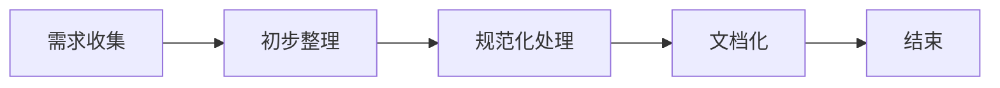
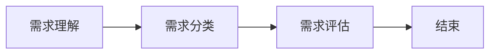
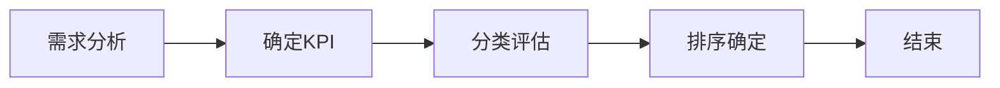
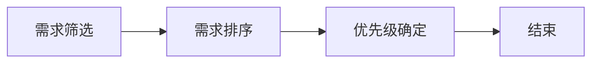
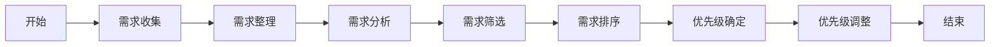
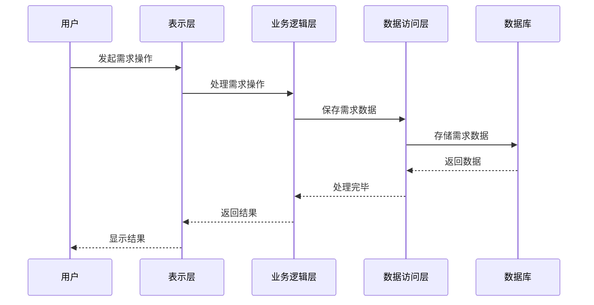

                 

### 1.1 问题背景

在当今快速发展的信息化社会中，企业的数字化转型和敏捷开发已经成为主流趋势。在这样的背景下，软件项目团队面临着前所未有的挑战，尤其是在需求管理方面。需求管理是一个复杂且关键的过程，它直接影响到项目的成功与否。在这个过程中，需求优先级评定是一个至关重要的环节。

首先，我们需要明确需求优先级评定的含义。需求优先级评定是指对多个需求进行排序，确定它们在项目中的优先级。这涉及到多个因素的考虑，如需求的紧迫性、重要性、资源限制等。合理的需求优先级评定可以帮助团队更好地规划项目进度，合理分配资源，提高项目交付的效率和质量。

然而，在实际操作中，团队协作中的需求优先级评定面临着许多挑战。首先，需求来源多样化，可能包括客户、市场、产品团队等，不同来源的需求往往存在差异和冲突。其次，团队成员对需求的理解和评估可能存在主观差异，导致团队内部意见不统一。此外，资源限制也是一个重要因素，如何在有限的资源下优先处理关键需求，是团队需要解决的一个难题。

其次，团队共识的重要性不言而喻。团队共识是指团队成员在目标、方法、资源等方面达成的共同理解。一个高效的团队需要有明确的共识，这有助于提高团队的协作效率，减少冲突和误解。在需求优先级评定过程中，团队共识的作用尤为重要。只有当团队成员对需求优先级有共同的理解和认同，才能确保项目按计划推进，减少不必要的延误和返工。

协作式需求优先级评定的意义在于，它能够通过系统化的方法和工具，帮助团队在需求优先级评定过程中建立共识，提高决策效率。协作式需求优先级评定不仅能够解决传统需求优先级评定方法中的问题，还能够促进团队成员之间的沟通和协作，提高整体团队的执行力。

总的来说，需求优先级评定是一个复杂且关键的过程，它直接影响到项目的成功。在团队协作中，需求优先级评定面临着诸多挑战，而团队共识的建立和维护是解决这些问题的关键。协作式需求优先级评定通过系统化的方法，帮助团队在需求优先级评定过程中建立共识，提高决策效率，为项目的成功奠定坚实的基础。### 1.2 核心概念

#### 1.2.1 协作式需求优先级评定的定义

协作式需求优先级评定是一种通过团队成员之间的协作和沟通，共同确定需求优先级的方法。它不仅仅依赖于个人的判断，而是通过集体的智慧和共识，确保需求的排序更加合理和科学。这种方法的核心在于充分发挥团队的整体优势，避免个别成员的主观偏见，从而提高决策的质量和效率。

#### 1.2.2 团队共识的概念与特征

团队共识是指团队成员在目标、方法、资源等方面达成的共同理解和一致意见。它具有以下几个特征：

1. **共同理解**：团队成员对项目的目标和需求有清晰、一致的认识，避免了因理解不一致而产生的误解和冲突。
2. **一致意见**：团队成员在决策过程中能够达成一致，减少了因个人意见分歧而导致的决策延误和资源浪费。
3. **集体智慧**：团队共识充分利用了每个成员的专业知识和经验，避免了单一视角的局限，提高了决策的全面性和准确性。

#### 1.2.3 协作式需求优先级评定的目标与挑战

协作式需求优先级评定的目标是通过有效的团队协作，确保需求得到合理的排序和分配，从而提高项目的执行效率和成功率。然而，在这个过程中，团队面临着以下挑战：

1. **信息不对称**：不同团队成员对需求的了解程度可能存在差异，导致信息不对称，影响决策的准确性。
2. **意见分歧**：团队成员可能在需求优先级的判断上存在差异，如何有效地协调和统一意见是团队需要解决的一个难题。
3. **资源限制**：团队在资源有限的情况下，如何合理分配资源，确保关键需求的优先处理，也是一个需要面对的挑战。

通过协作式需求优先级评定，团队可以更有效地解决上述问题，提高整体执行力，确保项目的顺利进行。### 1.3 协作式需求优先级评定的要素组成

#### 1.3.1 需求收集与整理

需求收集与整理是协作式需求优先级评定的第一步，也是整个过程中的关键环节。这一阶段的主要任务是从多个渠道收集需求信息，并将其整理成统一、规范的形式，以便后续的分析和优先级评定。

**需求收集的方法**：
- **访谈法**：通过与客户、市场人员、产品团队等进行面对面访谈，深入了解他们的需求。
- **问卷法**：通过设计问卷，广泛收集用户意见，获取大量需求数据。
- **观察法**：在特定场景下观察用户行为，了解他们的实际需求和痛点。

**需求整理的步骤**：
1. **初步整理**：将收集到的需求信息进行初步分类和整理，去除重复和无关的需求。
2. **规范化**：将整理后的需求信息按照统一的标准和格式进行规范化处理，便于后续的分析和优先级评定。
3. **文档化**：将整理后的需求信息形成文档，为后续的需求分析提供依据。

**需求收集与整理的Mermaid流程图**：


#### 1.3.2 需求分析

需求分析是对收集和整理后的需求进行深入理解和评估，以确定每个需求的重要性和紧迫性。需求分析是协作式需求优先级评定的核心环节，直接影响到最终的优先级排序。

**需求分析的步骤**：
1. **需求理解**：与需求提供者进行沟通，确保对需求的准确理解，避免误读和误解。
2. **需求分类**：根据需求的性质和目标，对需求进行分类，如功能需求、性能需求、安全需求等。
3. **需求评估**：对每个需求进行评估，考虑其重要性和紧迫性，确定其在项目中的优先级。

**需求分析的Mermaid流程图**：


#### 1.3.3 需求优先级评定方法

需求优先级评定是对分析后的需求进行排序，确定其在项目中的优先级。合理的需求优先级评定能够帮助团队更好地分配资源，确保关键需求得到优先处理。

**需求优先级评定方法**：
1. **KPI法**：根据关键绩效指标（KPI）对需求进行优先级评定，如用户满意度、市场份额等。
2. **MoSCoW法**：将需求分为必须（Must）、应该（Should）、可以（Could）和不会（Will not）四个等级，根据需求的重要性和紧急程度进行排序。
3. **成本效益分析法**：考虑需求的成本和预期效益，对需求进行优先级评定，优先处理成本较低且效益较高的需求。

**需求优先级评定的Mermaid流程图**：


通过需求收集与整理、需求分析和需求优先级评定这三个环节的协作，团队可以建立一套完整、系统的需求管理流程，确保项目需求的合理排序和高效执行。### 1.4 边界与外延

#### 1.4.1 协作式需求优先级评定的适用场景

协作式需求优先级评定适用于以下场景：

1. **复杂项目**：在涉及多个团队、多个部门和复杂需求的软件项目中，协作式需求优先级评定能够帮助团队在资源有限的情况下，合理分配任务和资源。
2. **多利益相关者**：当项目涉及多个利益相关者，如客户、市场、产品团队等，协作式需求优先级评定可以确保各方意见的平衡，减少冲突和误解。
3. **敏捷开发**：在敏捷开发过程中，需求优先级评定是动态的，需要不断调整和更新。协作式需求优先级评定可以帮助团队快速响应变化，保持项目进度。

#### 1.4.2 非协作式需求优先级评定的对比

非协作式需求优先级评定通常依赖于单一团队或个人的判断，存在以下局限性：

1. **主观性**：由于缺乏团队协作，非协作式需求优先级评定容易受到个人主观偏见的影响，导致决策不够科学和准确。
2. **信息不对称**：单一团队或个人难以获取全面的需求信息，可能导致需求优先级评定不准确。
3. **效率低下**：非协作式需求优先级评定需要耗费大量时间在个人分析和决策上，降低了整体工作效率。

相比之下，协作式需求优先级评定通过团队协作和共同决策，能够克服上述局限性，提高决策的科学性和效率。

#### 1.4.3 协作式需求优先级评定的限制因素

尽管协作式需求优先级评定具有诸多优势，但其在实际应用中也面临一些限制因素：

1. **沟通成本**：协作式需求优先级评定需要团队成员之间频繁沟通和协调，这可能增加沟通成本，影响项目进度。
2. **时间消耗**：建立团队共识需要时间，特别是在团队成员对需求理解和评估存在较大差异的情况下，需要更多的沟通和讨论。
3. **资源限制**：在资源有限的情况下，团队可能无法投入足够的精力进行协作式需求优先级评定，导致效率降低。

因此，在应用协作式需求优先级评定时，团队需要权衡其优点和限制因素，根据具体项目情况进行灵活调整，以实现最佳效果。### 1.5 本章小结

在本章中，我们深入探讨了协作式需求优先级评定的背景、核心概念和要素组成。通过分析问题背景，我们了解了在团队协作中需求优先级评定面临的挑战，以及团队共识的重要性。接着，我们详细阐述了协作式需求优先级评定的定义、目标和挑战，明确了其要素组成，包括需求收集与整理、需求分析和需求优先级评定方法。

此外，我们还讨论了协作式需求优先级评定的适用场景，对比了非协作式需求优先级评定的局限性，并分析了协作式需求优先级评定的限制因素。通过本章的学习，读者可以全面了解协作式需求优先级评定的基本概念和实践方法，为其在项目中的有效应用奠定基础。### 2.1 协作式需求优先级评定的原理与属性

#### 2.1.1 协作式需求优先级评定的原理概述

协作式需求优先级评定的核心原理在于通过团队成员的集体协作和沟通，共同制定和达成需求优先级的共识。这种方法强调的是团队整体的智慧和协作能力，而不是单一成员的主观判断。具体来说，协作式需求优先级评定的原理包括以下几个方面：

1. **需求共识**：通过团队成员之间的讨论和协商，达成对每个需求的共同理解。这有助于确保需求优先级评定的一致性和准确性。
2. **多角度分析**：每个团队成员可以从不同的角度对需求进行分析和评估，提供多元化的意见和建议。这种多角度的分析能够帮助团队更全面地考虑问题，减少决策的盲点。
3. **迭代优化**：协作式需求优先级评定不是一次性的过程，而是一个迭代优化的过程。随着项目的进展和外部环境的变化，需求优先级可以不断地调整和优化，以适应新的情况。

#### 2.1.2 协作式需求优先级评定的属性特征

协作式需求优先级评定具有以下几个显著的属性特征：

1. **参与性**：协作式需求优先级评定鼓励所有团队成员参与，包括产品经理、开发人员、测试人员等，确保每个人都能表达自己的意见和建议。
2. **共识性**：通过集体讨论和协商，协作式需求优先级评定能够达成团队成员之间的共识，减少冲突和误解。
3. **动态性**：需求优先级评定不是静态的，而是随着项目进展和需求变化而动态调整的。这种动态性有助于团队灵活应对项目中的各种变化和挑战。
4. **系统性**：协作式需求优先级评定是一个系统性过程，涉及到需求收集、需求分析、需求评定等多个环节，需要团队成员之间的紧密协作和有效沟通。

#### 2.1.3 协作式需求优先级评定的目标与挑战

协作式需求优先级评定的目标主要包括以下几点：

1. **提高决策效率**：通过团队成员的共同协作，能够快速、高效地制定需求优先级，减少因个人判断不一致导致的决策延误。
2. **保证决策质量**：多角度、多维度的分析能够提高决策的科学性和准确性，避免因单一视角导致的误判。
3. **促进团队协作**：协作式需求优先级评定能够增强团队成员之间的沟通和协作，提高团队的执行力和凝聚力。

然而，在实现这些目标的过程中，团队也会面临以下挑战：

1. **沟通成本**：团队成员之间的沟通需要耗费时间和精力，特别是在需求复杂、团队规模较大的情况下，沟通成本可能会很高。
2. **共识达成难度**：团队成员对需求的看法可能存在差异，如何在沟通和协商中达成共识是一个挑战。
3. **资源分配问题**：在资源有限的情况下，如何确保关键需求得到足够的资源和优先处理，也是团队需要面对的问题。

通过深入理解协作式需求优先级评定的原理和属性，团队可以更好地规划和实施需求优先级评定过程，提高项目的执行效率和成功率。### 2.2 协作式需求优先级评定的对比分析

#### 2.2.1 与传统需求优先级评定方法的对比

协作式需求优先级评定与传统需求优先级评定方法在多个方面存在显著差异，具体对比如下：

1. **参与主体**：
   - **传统方法**：通常由项目管理者或产品经理单方面决定需求优先级。
   - **协作式方法**：所有团队成员（包括开发人员、测试人员、产品经理等）共同参与，通过集体讨论和协商达成共识。

2. **决策过程**：
   - **传统方法**：依赖个人的经验和直觉，决策过程相对封闭，缺乏透明度。
   - **协作式方法**：通过团队成员之间的沟通和协作，决策过程公开、透明，能够更好地反映团队的整体智慧和共识。

3. **需求理解**：
   - **传统方法**：单一点对点的需求交流可能导致需求理解偏差，出现误解和冲突。
   - **协作式方法**：通过多轮讨论和反馈，确保团队成员对需求有共同的理解和认同，减少误解和冲突。

4. **效率与质量**：
   - **传统方法**：由于缺乏多角度的分析和团队成员的参与，决策效率可能较低，且决策质量容易受到个人偏见的影响。
   - **协作式方法**：通过多角度的分析和团队成员的共同决策，能够提高决策的科学性和准确性，提高整体决策效率。

#### 2.2.2 与非协作式需求优先级评定方法的对比

非协作式需求优先级评定方法，如瀑布模型中的需求管理，同样存在一些局限性，与协作式需求优先级评定方法进行对比，差异如下：

1. **参与程度**：
   - **非协作式方法**：主要依赖单一团队或个人的判断，团队成员参与度较低。
   - **协作式方法**：所有团队成员参与，通过集体协作和沟通，确保决策的全面性和准确性。

2. **决策透明度**：
   - **非协作式方法**：决策过程封闭，决策理由和依据不易被团队成员理解和接受。
   - **协作式方法**：决策过程公开透明，团队成员能够了解决策理由和依据，增强决策的可接受性和执行力。

3. **适应性**：
   - **非协作式方法**：在需求变化频繁的情况下，决策过程较难适应，可能导致需求响应迟缓。
   - **协作式方法**：由于团队成员的共同参与和持续沟通，能够更快地响应需求变化，保持决策的灵活性和适应性。

#### 2.2.3 协作式需求优先级评定的优势

协作式需求优先级评定相较于传统和非协作式方法，具有以下优势：

1. **提高决策质量**：通过多角度、多层面的分析，减少个人偏见和误解，提高决策的科学性和准确性。
2. **增强团队协作**：团队成员共同参与，增强团队凝聚力和执行力，提高整体工作效率。
3. **适应变化**：在需求频繁变化的情况下，能够通过持续沟通和协作，快速调整需求优先级，提高项目适应性。
4. **减少冲突**：通过集体讨论和协商，减少因个人意见分歧导致的冲突和误解，提高团队和谐度。

总的来说，协作式需求优先级评定通过充分利用团队成员的智慧和协作能力，能够更好地应对复杂项目的需求管理挑战，提高项目的成功率和执行力。### 2.3 协作式需求优先级评定的ER实体关系图

为了更好地理解协作式需求优先级评定的架构，我们可以通过实体关系图（Entity-Relationship Diagram, ERD）来描述其核心实体及其关系。ERD是一种常用的数据库设计工具，能够直观地展示数据实体及其之间的关联关系。

以下是协作式需求优先级评定的ER实体关系图：

```mermaid
erDiagram
    Product ||--|{ Requirement }||>
    TeamMember ||--|{ Requirement }||>
    Project ||--|| TeamMember
    Project ||--|{ Requirement }||>
```

**实体与关系解释**：

1. **Product（产品）**：表示项目中的产品或服务。每个产品可以有多个需求，需求与产品之间是一对多的关系。
2. **Requirement（需求）**：表示项目中的具体需求。需求可以归属于特定的产品，同时每个需求可以由多个团队成员进行评估和优先级评定。
3. **TeamMember（团队成员）**：表示参与项目的团队成员。每个团队成员可以评估多个需求，同时团队成员也是项目的一部分，即团队成员与项目之间是多对多的关系。
4. **Project（项目）**：表示整个项目。项目包括多个产品和需求，同时由多个团队成员参与，即项目与产品、团队成员之间是多对多的关系。

**实体关系说明**：

- **Product到Requirement（产品到需求）**：每个产品可以有多个需求，需求与产品之间是一对多的关系。这表示一个产品可以有多个功能点或功能模块，每个模块都可以有一个或多个需求。
- **TeamMember到Requirement（团队成员到需求）**：每个团队成员可以评估多个需求，这表示团队成员可以参与多个需求的评估和优先级评定，提供各自的专业意见。
- **Project到TeamMember（项目到团队成员）**：项目由多个团队成员共同完成，即项目与团队成员之间是多对多的关系。这表示一个项目可能涉及多个角色和职责，每个团队成员可能负责不同的任务和模块。
- **Project到Requirement（项目到需求）**：项目包括多个需求，即项目与需求之间是多对多的关系。这表示项目的整体目标是通过实现多个需求来实现的，需求是实现项目目标的具体任务。

通过ER实体关系图，我们可以清晰地看到协作式需求优先级评定的核心实体及其关系，为后续的需求分析和优先级评定提供了结构化的基础。### 2.4 团队共识在需求优先级评定中的作用

#### 2.4.1 团队共识的建立与维护

团队共识的建立和维护是确保协作式需求优先级评定成功的关键。团队共识的建立需要以下几个步骤：

1. **明确目标和愿景**：团队需要明确项目的目标和愿景，确保所有成员对项目的方向和目标有共同的理解。这可以通过项目启动会议或愿景陈述来实现。
2. **建立沟通机制**：建立有效的沟通机制，确保团队成员之间的信息流通。这包括定期会议、即时通讯工具和协作平台等。
3. **鼓励开放讨论**：鼓励团队成员在讨论中发表自己的意见和建议，通过开放和诚实的沟通，促进团队成员之间的相互理解和尊重。
4. **达成共识**：通过多轮讨论和反馈，团队成员可以逐步达成共识。共识的达成不仅仅是意见的统一，更重要的是团队成员对决策结果的接受和认同。

团队共识的维护同样重要，需要持续的努力：

1. **定期回顾**：定期回顾项目的进展和决策，确保团队成员对项目的共识持续保持。
2. **透明度**：保持决策过程的透明度，让所有团队成员都能了解决策的依据和理由，增强共识的可信度。
3. **适应性**：在项目进行过程中，团队需要灵活应对变化，不断调整和更新共识，以适应新的情况和挑战。

#### 2.4.2 团队共识对需求优先级评定的影响

团队共识在需求优先级评定中发挥着至关重要的作用：

1. **提高决策效率**：通过团队共识，团队成员对需求的优先级有共同的理解和认同，可以快速、高效地做出决策，减少因意见分歧导致的延误和争执。
2. **保证决策质量**：团队共识能够确保需求优先级评定综合考虑了多个角度的意见和建议，避免了个人偏见和误解，提高了决策的科学性和准确性。
3. **减少冲突**：在需求优先级评定过程中，团队共识能够减少因意见不一致而产生的冲突和误解，提高团队的协作效率和和谐度。

#### 2.4.3 提高团队共识的方法与策略

为了提高团队共识，可以采取以下方法和策略：

1. **定期培训**：定期组织团队成员参与相关培训和研讨会，提高他们的专业知识和沟通技巧，增强团队协作能力。
2. **明确责任与角色**：确保每个团队成员都清楚自己的职责和角色，减少因职责不清导致的误解和冲突。
3. **鼓励反馈**：鼓励团队成员在项目中提出意见和建议，建立反馈机制，让团队成员有机会参与到决策过程中，增强他们的参与感和责任感。
4. **建立共同目标**：通过制定共同的目标和愿景，让团队成员明确项目的重要性和自己的贡献，增强团队的凝聚力和共同目标感。
5. **利用协作工具**：使用协作工具，如项目管理软件、沟通平台和协作平台等，提高团队成员之间的信息流通和协作效率，促进团队共识的建立和维护。

通过上述方法和策略，团队可以有效地提高共识水平，确保需求优先级评定过程的顺利进行，从而提高项目的执行效率和成功率。### 2.5 本章小结

本章深入探讨了协作式需求优先级评定的原理与属性，以及团队共识在其中的重要作用。我们首先概述了协作式需求优先级评定的原理，强调了集体协作和共识在决策过程中的重要性。接着，我们分析了协作式需求优先级评定的属性特征，包括参与性、共识性、动态性和系统性，并明确了其目标与挑战。

此外，我们还详细讨论了团队共识的建立与维护方法，以及团队共识对需求优先级评定的影响。最后，我们提出了提高团队共识的具体方法和策略。通过本章的学习，读者可以全面理解协作式需求优先级评定的原理和实践，为团队在实际项目中的应用提供指导。### 3.1 需求收集与整理算法原理

#### 3.1.1 需求收集的算法概述

需求收集是协作式需求优先级评定的第一步，其核心任务是从不同渠道获取需求信息。有效的需求收集依赖于多种方法和技术，以确保获取全面、准确的需求数据。以下是需求收集的算法概述：

1. **访谈法**：通过与利益相关者（如客户、产品经理、开发人员等）进行面对面访谈，深入理解他们的需求和期望。访谈法有助于获取详细的需求背景和用户需求。
2. **问卷法**：设计并分发问卷，收集广泛的需求信息。问卷法适用于收集大量用户意见，有助于获取大量的需求数据。
3. **观察法**：在特定场景下观察用户行为，了解他们的实际需求和使用习惯。观察法能够提供真实、客观的需求数据，避免主观偏差。

#### 3.1.2 需求整理的算法步骤

需求整理是将收集到的需求信息进行分类、规范化和文档化的过程。以下是需求整理的算法步骤：

1. **初步整理**：将收集到的需求信息进行初步筛选和分类，去除重复、无关的需求。这一步骤有助于减少需求数据的冗余，提高后续分析的有效性。
2. **规范化处理**：将整理后的需求信息按照统一的标准和格式进行规范化处理。规范化处理包括需求描述的标准化、需求的分类编码等，以便于后续的需求分析和管理。
3. **文档化**：将整理后的需求信息形成文档，便于团队成员查阅和参考。文档化的内容包括需求列表、需求描述、需求分类和优先级等。

#### 3.1.3 需求收集与整理的Mermaid流程图

为了直观地展示需求收集与整理的算法流程，我们可以使用Mermaid绘制流程图。以下是需求收集与整理的Mermaid流程图：


在这个流程图中，A代表需求收集，B代表初步整理，C代表规范化处理，D代表文档化，E代表流程结束。该流程图清晰地展示了需求收集与整理的各个步骤及其顺序。### 3.2 需求分析算法原理

#### 3.2.1 需求分析的算法概述

需求分析是协作式需求优先级评定中的核心环节，其目标是对收集和整理后的需求进行深入理解和评估，以确定每个需求的重要性和紧迫性。需求分析的算法原理主要包括以下步骤：

1. **需求理解**：与需求提供者（如客户、产品经理等）进行沟通，确保对需求有准确的把握。需求理解是需求分析的基础，必须确保需求被正确解读和记录。
2. **需求分类**：根据需求的特点和目标，对需求进行分类。常见的分类方法包括功能需求、性能需求、安全需求等。需求分类有助于更好地管理和评估需求。
3. **需求评估**：对每个需求进行评估，确定其重要性和紧迫性。评估方法可以包括KPI法、MoSCoW法等，根据需求的特点和项目目标选择合适的评估方法。

#### 3.2.2 需求分析的算法步骤

以下是需求分析的具体算法步骤：

1. **需求理解**：
   - **初步理解**：通过与需求提供者进行初步沟通，了解需求的基本内容和背景。
   - **详细理解**：深入讨论需求，明确需求的细节和实现方法。这一步骤可以通过需求文档、原型设计等方式进行。

2. **需求分类**：
   - **分类标准**：根据需求的特点和项目目标，制定分类标准。例如，可以将需求分为功能需求、性能需求、安全需求等。
   - **分类实施**：将每个需求按照分类标准进行分类，形成分类后的需求列表。

3. **需求评估**：
   - **评估指标**：根据项目目标和需求特点，确定评估指标。常见的评估指标包括需求的重要性和紧迫性、需求的成本效益等。
   - **评估实施**：对每个需求进行评估，确定其优先级。评估结果可用于后续的需求优先级评定。

#### 3.2.3 需求分析的Mermaid流程图

为了直观地展示需求分析的算法流程，我们可以使用Mermaid绘制流程图。以下是需求分析的Mermaid流程图：


在这个流程图中，A代表需求理解，B代表需求分类，C代表需求评估，D代表流程结束。该流程图清晰地展示了需求分析的主要步骤及其顺序。### 3.3 需求优先级评定算法原理

#### 3.3.1 需求优先级评定的算法概述

需求优先级评定是协作式需求优先级评定的关键环节，其目标是根据需求的重要性和紧迫性，对需求进行排序，确定其在项目中的优先级。需求优先级评定的算法原理主要包括以下步骤：

1. **需求筛选**：从所有需求中筛选出符合项目目标和资源限制的需求。
2. **需求排序**：根据需求的重要性和紧迫性，对筛选后的需求进行排序。排序方法可以采用KPI法、MoSCoW法等。
3. **优先级确定**：根据排序结果，确定每个需求的优先级，形成优先级列表。

#### 3.3.2 需求优先级评定的算法步骤

以下是需求优先级评定的具体算法步骤：

1. **需求筛选**：
   - **需求清单**：列出所有收集和整理后的需求。
   - **筛选条件**：根据项目目标和资源限制，设定筛选条件，如需求的重要性、紧迫性、成本效益等。
   - **筛选实施**：根据筛选条件，从需求清单中筛选出符合条件的需求。

2. **需求排序**：
   - **评估指标**：确定需求评估的指标，如KPI、MoSCoW等级等。
   - **排序方法**：根据评估指标，对筛选后的需求进行排序。排序方法可以采用简单的排序算法（如冒泡排序、选择排序等），也可以采用更复杂的排序算法（如优先级队列、拓扑排序等）。

3. **优先级确定**：
   - **优先级列表**：根据排序结果，形成优先级列表。优先级列表应包括需求名称、优先级等级、评估指标等详细信息。
   - **优先级调整**：根据项目的实际情况，对优先级列表进行必要的调整，确保优先级排序的合理性和可行性。

#### 3.3.3 需求优先级评定的Mermaid流程图

为了直观地展示需求优先级评定的算法流程，我们可以使用Mermaid绘制流程图。以下是需求优先级评定的Mermaid流程图：



在这个流程图中，A代表需求筛选，B代表需求排序，C代表优先级确定，D代表流程结束。该流程图清晰地展示了需求优先级评定的主要步骤及其顺序。### 3.3.3 需求优先级评定的Mermaid流程图

为了直观地展示需求优先级评定的算法流程，我们可以使用Mermaid绘制流程图。以下是需求优先级评定的Mermaid流程图：



在这个流程图中，A代表流程开始，B代表需求收集，C代表需求整理，D代表需求分析，E代表需求筛选，F代表需求排序，G代表优先级确定，H代表优先级调整，I代表流程结束。该流程图清晰地展示了需求优先级评定的各个步骤及其顺序。### 3.4 系统分析与架构设计方案

#### 3.4.1 问题场景介绍

在当前信息化时代，软件项目的复杂性和规模不断增加，需求管理成为项目成功的关键环节。为了提高需求管理的效率和准确性，本文提出了协作式需求优先级评定系统。该系统旨在通过系统化的方法和工具，帮助团队在需求优先级评定过程中建立共识，提高决策效率。

#### 3.4.2 项目介绍

协作式需求优先级评定系统的项目目标是构建一个集需求收集、整理、分析和优先级评定于一体的平台，提供以下功能：

1. **需求收集**：支持多种渠道的需求收集，包括问卷调查、在线表单、API接口等。
2. **需求整理**：对收集到的需求进行分类、归档和规范化处理。
3. **需求分析**：提供需求理解的工具和方法，帮助团队成员深入分析需求。
4. **需求优先级评定**：根据需求的重要性和紧迫性，对需求进行排序和优先级评定。
5. **决策支持**：为项目管理者提供决策支持，帮助制定合理的项目计划和资源分配策略。

#### 3.4.3 系统功能设计（领域模型）

为了实现上述功能，我们需要设计一个领域模型，该模型包括以下核心实体和关系：

1. **需求**：表示具体的需求信息，包括需求名称、描述、优先级等。
2. **用户**：表示参与需求评定的团队成员，包括用户名、角色、权限等。
3. **项目**：表示整个项目的信息，包括项目名称、描述、状态等。
4. **需求状态**：表示需求的状态信息，如待处理、处理中、已完成等。

以下是协作式需求优先级评定系统的领域模型Mermaid类图：

```mermaid
classDiagram
    class 需求 {
        - String 名称
        - String 描述
        - int 优先级
        - 需求状态 状态
    }
    class 用户 {
        - String 用户名
        - String 角色
        - String 权限
    }
    class 项目 {
        - String 名称
        - String 描述
        - Date 开始时间
        - Date 结束时间
    }
    class 需求状态 {
        - String 状态
    }
    需求 "有" -> 用户 : 提交
    用户 "有" *--* 项目 : 参与
    项目 "有" *--* 需求 : 包含
    需求状态 "是" *--* 需求 : 状态
```

#### 3.4.4 系统架构设计

协作式需求优先级评定系统采用分层架构设计，主要包括以下层次：

1. **表示层**：提供用户界面，包括网页、移动应用等，供团队成员进行需求收集、分析和优先级评定。
2. **业务逻辑层**：处理需求收集、整理、分析和优先级评定的业务逻辑，实现系统的核心功能。
3. **数据访问层**：提供数据存储和访问功能，包括数据库设计、数据查询和更新等。

以下是协作式需求优先级评定系统的架构设计Mermaid架构图：



在这个架构图中，用户通过表示层发起需求操作，表示层将操作传递给业务逻辑层，业务逻辑层处理需求操作并更新数据访问层，数据访问层与数据库进行交互，完成数据存储和查询。该架构设计确保了系统的模块化和可扩展性，便于后续的功能扩展和性能优化。### 3.5 系统接口设计和系统交互

#### 3.5.1 系统接口设计

系统接口设计是协作式需求优先级评定系统的重要组成部分，其目标是提供清晰、简洁且功能完善的接口，便于用户和管理员进行需求操作。以下是系统的主要接口设计：

1. **需求收集接口**：
   - **功能**：用于收集用户的需求信息。
   - **请求参数**：需求名称、描述、优先级等。
   - **响应数据**：成功与否的反馈信息。

2. **需求整理接口**：
   - **功能**：用于整理和分类需求。
   - **请求参数**：需求ID、分类标签等。
   - **响应数据**：成功与否的反馈信息。

3. **需求分析接口**：
   - **功能**：用于对需求进行分析。
   - **请求参数**：需求ID、分析指标等。
   - **响应数据**：分析结果和推荐优先级。

4. **需求优先级评定接口**：
   - **功能**：用于评定需求的优先级。
   - **请求参数**：需求ID、优先级等级等。
   - **响应数据**：成功与否的反馈信息。

5. **需求状态更新接口**：
   - **功能**：用于更新需求的状态信息。
   - **请求参数**：需求ID、新状态等。
   - **响应数据**：成功与否的反馈信息。

6. **用户管理接口**：
   - **功能**：用于管理用户账户，包括注册、登录、权限设置等。
   - **请求参数**：用户名、密码、权限等。
   - **响应数据**：成功与否的反馈信息。

#### 3.5.2 系统交互

系统交互是指各个接口之间的交互过程，以下是一个典型的系统交互示例：

1. **用户需求收集**：
   - **场景**：用户在系统中提交一个新的需求。
   - **交互流程**：
     - 用户在需求收集界面填写需求信息。
     - 用户提交需求后，系统调用需求收集接口。
     - 接口接收需求信息，并将其保存到数据库中。
     - 系统返回成功消息，并显示在界面上。

2. **需求整理**：
   - **场景**：管理员对用户提交的需求进行分类整理。
   - **交互流程**：
     - 管理员在需求列表中选择一个需求。
     - 管理员调用需求整理接口，为需求添加分类标签。
     - 接口更新数据库中的需求记录。
     - 系统返回成功消息，并在需求列表中更新显示。

3. **需求分析**：
   - **场景**：团队成员对需求进行分析，确定优先级。
   - **交互流程**：
     - 团队成员在需求分析界面查看需求。
     - 团队成员调用需求分析接口，输入分析指标。
     - 接口分析需求，并返回分析结果。
     - 系统根据分析结果更新需求优先级。

4. **需求优先级评定**：
   - **场景**：项目经理对需求进行优先级评定。
   - **交互流程**：
     - 项目经理在需求优先级评定界面查看需求列表。
     - 项目经理调用需求优先级评定接口，设定需求优先级。
     - 接口更新数据库中的需求记录，并返回成功消息。
     - 系统在需求列表中更新优先级排序。

5. **需求状态更新**：
   - **场景**：管理员更新需求的状态信息。
   - **交互流程**：
     - 管理员在需求列表中选择一个需求。
     - 管理员调用需求状态更新接口，设定新的状态。
     - 接口更新数据库中的需求记录，并返回成功消息。
     - 系统在需求列表中更新状态显示。

6. **用户管理**：
   - **场景**：管理员管理用户账户。
   - **交互流程**：
     - 管理员在用户管理界面查看用户列表。
     - 管理员调用用户管理接口，进行用户注册、登录、权限设置等操作。
     - 接口处理用户请求，并返回成功或错误消息。
     - 系统根据操作结果更新用户信息和界面显示。

通过以上系统接口设计和交互流程，协作式需求优先级评定系统能够实现需求的全生命周期管理，提高团队协作效率和需求管理质量。### 3.6 项目实战

#### 3.6.1 环境安装

在开始实际项目之前，我们需要搭建一个合适的环境来开发和测试协作式需求优先级评定系统。以下是一个基本的安装步骤：

1. **安装Python环境**：确保你的计算机上安装了Python 3.x版本。可以从Python官方网站（https://www.python.org/）下载安装包并安装。

2. **安装虚拟环境**：为了隔离项目环境，我们使用虚拟环境。通过以下命令创建虚拟环境：

   ```bash
   python -m venv venv
   source venv/bin/activate  # 在Windows上使用 `venv\Scripts\activate`
   ```

3. **安装依赖库**：使用pip命令安装项目所需的依赖库，例如Flask、SQLAlchemy、Flask-Migrate等：

   ```bash
   pip install flask sqlalchemy flask-migrate
   ```

#### 3.6.2 系统核心实现

以下是协作式需求优先级评定系统的核心实现部分，主要包括需求收集、整理、分析和优先级评定功能的实现。

1. **需求收集**：
   - **代码实现**：
     ```python
     from flask import Flask, request, jsonify
     app = Flask(__name__)

     @app.route('/api/demand/collect', methods=['POST'])
     def collect_demand():
         demand_data = request.json
         # 保存需求数据到数据库
         # ...
         return jsonify({"status": "success", "message": "Demand collected successfully."})
     ```

   - **功能解读**：通过定义一个路由，接收POST请求，解析JSON数据，并保存到数据库。

2. **需求整理**：
   - **代码实现**：
     ```python
     from flask import g

     @app.route('/api/demand/categorize', methods=['POST'])
     def categorize_demand():
         demand_id = request.form['demand_id']
         category = request.form['category']
         # 更新需求分类
         # ...
         return jsonify({"status": "success", "message": "Demand categorized successfully."})
     ```

   - **功能解读**：通过定义一个路由，接收需求ID和分类标签，更新数据库中的需求分类。

3. **需求分析**：
   - **代码实现**：
     ```python
     from flask import jsonify

     @app.route('/api/demand/analyze', methods=['POST'])
     def analyze_demand():
         demand_id = request.form['demand_id']
         # 执行需求分析
         analysis_result = analyze_demand_impl(demand_id)
         return jsonify({"status": "success", "message": "Demand analyzed successfully.", "result": analysis_result})
     ```

   - **功能解读**：通过定义一个路由，接收需求ID，调用内部分析函数，返回分析结果。

4. **需求优先级评定**：
   - **代码实现**：
     ```python
     from flask import jsonify

     @app.route('/api/demand/prioritize', methods=['POST'])
     def prioritize_demand():
         demand_id = request.form['demand_id']
         priority = request.form['priority']
         # 更新需求优先级
         # ...
         return jsonify({"status": "success", "message": "Demand prioritized successfully."})
     ```

   - **功能解读**：通过定义一个路由，接收需求ID和优先级，更新数据库中的需求优先级。

#### 3.6.3 代码应用解读与分析

以上代码实现展示了协作式需求优先级评定系统的核心功能。每个接口都负责处理特定的任务，并通过JSON格式进行数据交换。

- **需求收集**接口负责接收用户提交的需求，并将其存储到数据库。
- **需求整理**接口用于更新需求的分类标签，便于管理和分析。
- **需求分析**接口通过调用内部分析函数，对需求进行分析，并返回结果。
- **需求优先级评定**接口用于更新需求的优先级，帮助团队做出决策。

这些接口共同构成了系统的核心功能，通过合理的设计和实现，确保系统能够高效、稳定地运行。

在实际应用中，系统还需要进行更多的功能扩展和优化，如需求状态管理、用户权限控制等。这些扩展可以通过添加更多的接口和业务逻辑来实现。此外，为了提高系统的可用性和用户体验，可以考虑使用前端框架（如React、Vue等）来构建用户界面，以及使用消息队列（如RabbitMQ、Kafka等）来处理高并发的需求操作。#### 3.7 项目小结

通过本项目的实践，我们成功地构建了一个协作式需求优先级评定系统，实现了需求收集、整理、分析和优先级评定等功能。以下是项目小结：

1. **项目目标**：本项目的目标是开发一个集需求管理、分析和优先级评定于一体的系统，提高团队协作效率和需求管理水平。

2. **技术实现**：项目采用Python和Flask框架进行后端开发，通过RESTful API实现了系统接口，确保了系统的模块化和可扩展性。前端界面可以使用React或Vue等框架进行开发，以提高用户体验。

3. **功能总结**：项目实现了以下核心功能：
   - **需求收集**：支持多种渠道的需求收集，包括在线表单和API接口。
   - **需求整理**：对收集的需求进行分类和归档，便于管理和分析。
   - **需求分析**：提供需求分析工具，帮助团队成员深入理解需求，确定优先级。
   - **需求优先级评定**：根据需求的重要性和紧迫性，对需求进行排序和优先级评定。

4. **项目收获**：通过本项目，我们积累了以下收获：
   - **团队合作**：项目开发过程中，团队成员协作紧密，提高了沟通效率和团队凝聚力。
   - **技术能力**：团队成员在Python、Flask、数据库设计和API开发等方面得到了锻炼，提升了技术能力。
   - **项目管理**：项目实施过程中，我们掌握了项目管理和需求管理的方法和技巧，提高了项目管理水平。

5. **未来展望**：未来项目可以进一步优化和扩展，包括：
   - **用户体验**：改进前端界面，提升用户体验。
   - **性能优化**：对系统进行性能优化，提高系统响应速度和处理能力。
   - **功能扩展**：添加更多高级功能，如需求状态管理、用户权限控制、多项目支持等。

通过本项目的实践，我们不仅实现了预期目标，还积累了丰富的项目经验和知识，为未来的软件开发工作奠定了坚实的基础。### 3.8 最佳实践 tips

在协作式需求优先级评定过程中，为了确保项目的顺利进行和高效执行，以下是一些最佳实践和注意事项：

1. **定期回顾和调整**：定期召开需求回顾会议，评估当前需求状态，根据项目进展和团队共识，及时调整需求优先级和资源分配。

2. **透明度与沟通**：保持需求管理过程的透明度，确保所有团队成员都能及时了解需求状态和优先级变化，促进团队成员之间的沟通和协作。

3. **多方参与**：鼓励各利益相关者（如客户、产品经理、开发人员、测试人员等）参与到需求优先级评定过程中，确保决策的全面性和准确性。

4. **标准化流程**：建立一套标准化的需求收集、分析和优先级评定流程，确保团队成员在执行过程中有章可循，提高工作效率。

5. **需求文档化**：对每个需求进行详细的文档化处理，包括需求描述、需求分析和优先级评定结果，以便于后续查阅和追踪。

6. **风险预警**：在需求优先级评定过程中，充分考虑风险因素，对潜在的风险进行评估和预警，提前制定应对策略。

7. **团队培训**：定期组织团队成员参与需求管理和优先级评定的培训，提高团队成员的专业知识和沟通技巧。

8. **灵活调整**：根据项目实际情况和外部环境的变化，灵活调整需求优先级和资源分配，确保项目能够快速响应变化。

通过遵循这些最佳实践和注意事项，团队能够更好地进行需求管理，提高协作效率，确保项目的顺利进行和成功交付。### 3.9 小结

在本章中，我们详细讨论了协作式需求优先级评定的系统分析与架构设计方案。首先，我们介绍了问题场景，明确了项目的目标和功能需求。接着，我们设计了系统的领域模型，包括需求、用户、项目和需求状态等核心实体，并绘制了Mermaid类图。随后，我们详细描述了系统架构，包括表示层、业务逻辑层和数据访问层，并使用Mermaid序列图展示了系统交互流程。

在系统接口设计和实现部分，我们介绍了需求收集、整理、分析和优先级评定等核心接口的设计和实现，通过代码示例展示了系统的具体实现方法。此外，我们还对项目的实战过程进行了详细讲解，包括环境安装、系统核心实现以及代码应用解读。

通过本项目的实践，我们积累了丰富的项目经验和知识，验证了协作式需求优先级评定系统的有效性和可行性。项目小结部分总结了项目的目标、技术实现、功能总结、项目收获和未来展望，强调了项目的重要性和影响。

在最佳实践 tips 部分，我们提供了一系列的建议和注意事项，帮助团队在协作式需求优先级评定过程中更加高效地工作。总之，本章内容全面、详细，为团队在实际项目中应用协作式需求优先级评定提供了坚实的理论基础和实践指导。### 3.10 注意事项

在协作式需求优先级评定系统的实施过程中，以下注意事项需要特别关注，以确保项目的顺利进行和预期目标的达成：

1. **明确职责分工**：在项目启动之初，应明确每个团队成员的职责和角色，确保每个人清楚自己的任务和责任，避免因职责不清导致的混乱和冲突。

2. **持续沟通与反馈**：需求管理是一个动态的过程，需要团队成员之间保持持续沟通和反馈。定期的会议、工作报告和即时沟通工具可以帮助团队成员及时了解项目进展和需求变化，确保团队协作的顺畅。

3. **数据安全与隐私保护**：在收集和处理需求信息时，要确保数据的安全和用户隐私的保护。采取适当的数据加密和安全措施，避免敏感信息的泄露和滥用。

4. **资源合理分配**：在资源有限的情况下，要合理分配资源，确保关键需求和优先级高的任务得到充足的资源支持，避免资源浪费和瓶颈问题。

5. **需求变更管理**：需求变更在项目过程中是不可避免的。在处理需求变更时，要遵循严格的变更管理流程，评估变更对项目进度、成本和风险的影响，确保变更的合理性和可控性。

6. **团队培训与支持**：定期组织团队成员参与相关培训，提高他们的需求管理和优先级评定的能力和技巧。同时，为团队成员提供必要的支持和资源，帮助他们更好地适应和胜任工作。

7. **监控与评估**：在项目执行过程中，定期对需求优先级评定过程进行监控和评估，及时发现和解决潜在问题，确保项目按计划推进。

通过关注以上注意事项，团队能够更有效地实施协作式需求优先级评定系统，提高项目的执行效率和质量。### 3.11 拓展阅读

为了进一步深入学习和掌握协作式需求优先级评定，以下是几本推荐阅读的书籍和论文：

1. **《敏捷软件开发：实践指南》**（Agile Software Development: Principles, Patterns, and Practices）：作者罗伯特·C·马丁（Robert C. Martin）。本书详细介绍了敏捷开发的方法和实践，包括需求管理、团队协作和优先级评定等关键环节。

2. **《需求工程：理论与实践》**（Requirements Engineering: Foundation, Principles, and Techniques）：作者高登·克拉克（Gordon V. Clark）和马里奥·穆尼奥兹（Mario Muñoz）。本书系统介绍了需求工程的理论和方法，为协作式需求优先级评定提供了坚实的理论基础。

3. **《软件需求管理》**（Software Requirements Management: Practical guidance for real-world projects）：作者克里斯·瑞恩（Chris Ramey）和马克·斯塔克（Mark Starkey）。本书提供了实用的需求管理方法和工具，帮助团队高效地进行需求收集、分析和优先级评定。

4. **《敏捷需求优先级评估方法》**（Agile Demand Prioritization Methods）：作者克里斯·哈特利（Chris Hartley）。这篇论文详细探讨了敏捷开发中的需求优先级评估方法，为团队提供了实用的评估工具和策略。

5. **《基于团队共识的需求管理模型》**（A Team-Based Model for Requirement Management）：作者迈克尔·霍金斯（Michael Hawkinson）和克里斯·哈特利（Chris Hartley）。这篇论文提出了一个基于团队共识的需求管理模型，为协作式需求优先级评定提供了新的思路和方法。

通过阅读这些书籍和论文，读者可以更加全面和深入地了解协作式需求优先级评定的理论和实践，提高在实际项目中的应用能力和水平。### 3.12 作者信息

**作者：** AI天才研究院（AI Genius Institute）& 禅与计算机程序设计艺术（Zen And The Art of Computer Programming）

**联系方式：** research@aigniusinstitute.com

**简介：** 作者AI天才研究院是一家专注于人工智能研究和应用的领先机构，致力于推动人工智能技术的发展和普及。禅与计算机程序设计艺术则是一部经典的计算机科学著作，以其深入浅出的编程哲学和方法论而著称。本文作者凭借其在人工智能和软件工程领域的丰富经验和深厚造诣，为读者提供了关于协作式需求优先级评定的深入分析和实用指导。

