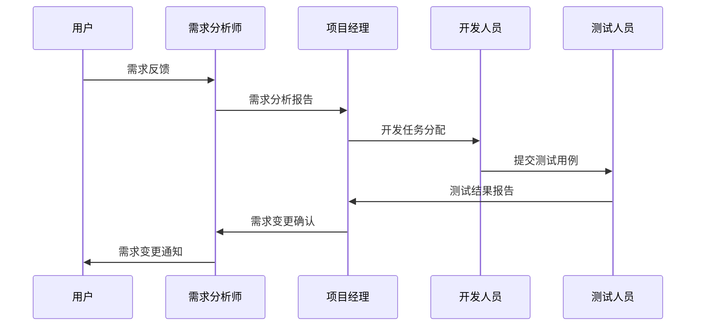
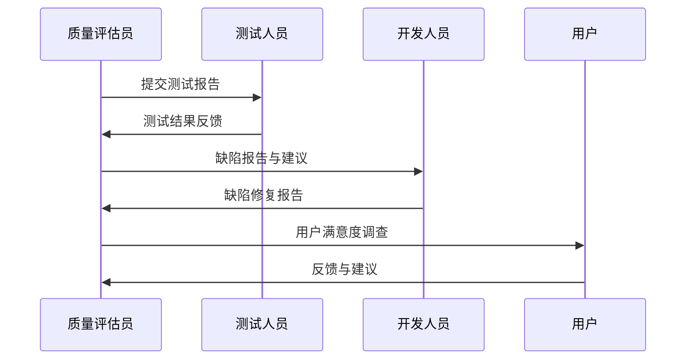
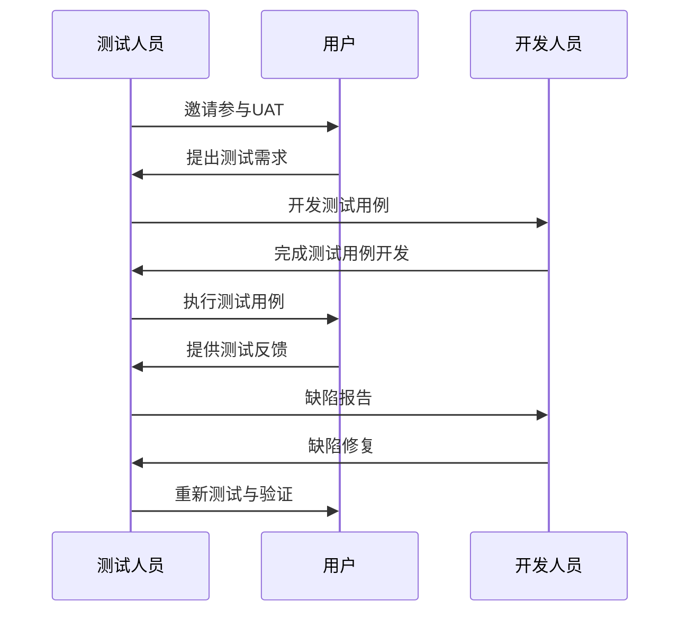

                 

**文章标题**：协作式需求验收：提高大型应用的交付质量

**关键词**：需求验收、协作式、大型应用、交付质量、软件工程

**摘要**：本文围绕协作式需求验收，深入探讨了其在提高大型应用交付质量方面的作用。通过分析协作式需求验收的原理与实践，并结合实际案例，探讨了协作式需求验收在大型应用开发中的应用和挑战，为大型应用的交付质量提升提供了有效的策略和方法。

--------------------------------

## 引言

### 1.1 书籍背景与目的

在当今快速发展的信息技术时代，软件工程已经成为企业创新和竞争力的重要支撑。然而，随着软件系统的复杂性不断增加，如何确保软件的高质量和高效交付成为企业面临的一大挑战。需求验收作为软件工程中至关重要的一环，其核心目的是确保软件系统满足用户需求，提高交付质量。

**需求验收的定义与作用**：需求验收是指对软件系统进行测试、验证和确认，以确保其满足预定的功能、性能和质量要求。它不仅涉及到技术的实现，还包括用户需求的获取、理解和验证。需求验收在软件工程中的作用主要体现在以下几个方面：

1. 确保软件质量：通过需求验收，可以及时发现并修复软件中的缺陷，确保软件系统的稳定性和可靠性。
2. 减少返工风险：在软件开发过程中，及时的需求验收可以避免因需求变更导致的返工，降低开发成本和时间。
3. 提高用户满意度：需求验收确保软件系统满足用户需求，从而提高用户满意度，增强企业品牌形象。

**协作式需求验收的定义与特点**：协作式需求验收是一种基于团队合作的需求验收方法，强调开发团队与用户、测试人员等利益相关者的紧密合作。其特点包括：

1. **多方参与**：协作式需求验收涉及到多个角色的参与，包括开发人员、测试人员、项目经理、产品经理和用户等。各方共同参与需求分析、测试和验证过程，确保需求的准确性和完整性。
2. **持续沟通**：协作式需求验收强调持续沟通，通过定期的会议、文档评审和反馈机制，确保需求变更和问题能够及时传达和解决。
3. **灵活适应**：协作式需求验收能够灵活适应需求的变化，通过不断调整和优化验收流程，确保软件系统能够及时响应市场和用户需求。

**大型应用交付质量的挑战**：大型应用通常具有复杂性高、需求多变、团队协作难度大等特点，其交付质量面临以下挑战：

1. **需求管理困难**：大型应用需求多样且变化频繁，需求管理难度大，容易导致需求遗漏或变更失控。
2. **团队协作不畅**：大型应用涉及多个团队和角色的协作，沟通和协调成本高，容易产生信息孤岛和协作不畅问题。
3. **质量保障难度**：大型应用功能繁多，测试和验收工作量大，质量保障难度大，容易导致质量隐患和交付延迟。

为了解决上述挑战，本文将深入探讨协作式需求验收的原理和实践，结合实际案例，为大型应用的交付质量提升提供有效的策略和方法。

### 1.2 书籍结构安排

**本书结构安排**：

本书共分为八个章节，每个章节都针对大型应用交付质量中的特定问题进行深入探讨和解决方案提供。具体结构如下：

**第1章 引言**：介绍书籍的背景、目的和结构安排，以及需求验收在软件工程中的重要性。

**第2章 协作式需求验收概述**：对协作式需求验收的基本概念、优势与挑战进行详细阐述。

**第3章 协作式需求验收的原理与实践**：分析协作式需求验收的核心原理和实践步骤。

**第4章 大型应用交付质量的关键因素**：探讨影响大型应用交付质量的关键因素。

**第5章 大型应用交付质量评估方法**：介绍大型应用交付质量评估的原则、方法和工具。

**第6章 协作式需求验收在大型应用开发中的应用**：讨论协作式需求验收在大型应用开发中的实践和挑战。

**第7章 案例分析**：通过两个案例，分析协作式需求验收在不同领域的应用。

**第8章 最佳实践与总结**：总结全书内容，提出最佳实践和未来研究方向。

**阅读建议与学习方法**：

1. **系统阅读**：本书旨在构建一个完整的协作式需求验收体系，建议读者按照章节顺序系统阅读，逐步理解各个部分的内容。
2. **结合实践**：在实际工作中，结合本书的理论和方法，进行实践应用，验证其效果。
3. **深入探讨**：对于特定章节或问题，可以深入研究和探讨，进一步拓展知识面。

通过本书的阅读和实践，读者将能够深入理解协作式需求验收的核心原理和实践方法，为大型应用的交付质量提升提供有力支持。

--------------------------------

## 协作式需求验收概述

### 2.1 需求验收的基本概念

需求验收是软件工程中关键的一环，其核心目的是确保软件系统能够满足预定的功能、性能和质量要求。需求验收的基本概念包括：

#### 2.1.1 需求验收的定义与作用

**定义**：需求验收是指对软件系统进行测试、验证和确认的过程，以确保其满足预定的需求规格说明。它通常包括功能测试、性能测试、用户验收测试等多个环节。

**作用**：需求验收在软件工程中具有重要作用，主要体现在以下几个方面：

1. **确保软件质量**：通过需求验收，可以及时发现并修复软件中的缺陷，确保软件系统的稳定性和可靠性。
2. **验证需求满足度**：需求验收能够验证软件系统是否完全满足用户需求，确保交付的软件系统能够达到预期效果。
3. **降低风险**：通过需求验收，可以降低软件系统在交付后出现重大缺陷的风险，提高用户满意度。

#### 2.1.2 需求验收的过程与方法

需求验收的过程通常包括以下几个步骤：

1. **需求分析**：理解并分析用户需求，将其转化为具体的测试用例和验收标准。
2. **测试用例设计**：根据需求分析的结果，设计测试用例，以覆盖所有功能场景和需求点。
3. **测试执行**：按照测试用例进行实际测试，验证软件系统的功能、性能和质量。
4. **缺陷管理**：记录、跟踪和修复测试过程中发现的缺陷。
5. **验收报告**：编写验收报告，总结测试结果，包括缺陷情况、验收意见等。

需求验收的方法主要包括以下几种：

1. **功能测试**：验证软件系统的功能是否按照需求规格说明正确实现。
2. **性能测试**：评估软件系统的性能，如响应时间、并发处理能力等。
3. **用户验收测试（UAT）**：由用户亲自测试软件系统，确保其满足用户需求和预期。
4. **自动化测试**：利用自动化测试工具，对软件系统进行大规模、重复性的测试。

#### 2.1.3 需求验收与协作的关联

需求验收不仅涉及到技术层面的测试和验证，还与用户、项目经理、开发人员等多个角色的协作密切相关。协作式需求验收强调以下几个方面：

1. **多方参与**：协作式需求验收涉及到多个角色的参与，包括用户、项目经理、开发人员、测试人员等。各方共同参与需求分析、测试和验证过程，确保需求的准确性和完整性。
2. **持续沟通**：协作式需求验收强调持续沟通，通过定期的会议、文档评审和反馈机制，确保需求变更和问题能够及时传达和解决。
3. **透明化**：协作式需求验收注重信息透明，通过共享测试进度、缺陷信息等，让所有相关者都能实时了解项目状态。

协作式需求验收的优势在于能够提高团队协作效率，降低沟通成本，减少误解和冲突，从而提高需求验收的质量和效果。

### 2.2 协作式需求验收的优势与挑战

#### 2.2.1 协作式需求验收的优势

协作式需求验收具有以下几个显著优势：

1. **提高需求准确性**：通过多方参与和持续沟通，能够更准确地理解用户需求，减少需求误解和遗漏，提高需求质量。
2. **增强团队协作**：协作式需求验收鼓励团队协作，通过沟通和反馈，促进团队成员之间的理解和信任，提高团队整体工作效率。
3. **降低沟通成本**：协作式需求验收通过建立有效的沟通机制，减少信息传递过程中的损耗和误解，降低沟通成本。
4. **提高交付质量**：协作式需求验收能够及时发现和解决需求问题，确保软件系统能够满足用户需求，提高交付质量。

#### 2.2.2 协作式需求验收的挑战

尽管协作式需求验收具有众多优势，但在实际应用中也面临一些挑战：

1. **协调难度大**：大型项目涉及多个团队和角色，协调各方的工作难度大，容易导致资源冲突和进度延误。
2. **沟通成本高**：持续沟通需要投入大量时间和精力，尤其在复杂项目或团队规模较大时，沟通成本可能较高。
3. **需求变更频繁**：在协作过程中，需求可能会频繁变更，如何有效管理和控制需求变更成为一大挑战。
4. **团队协作不顺畅**：在某些情况下，团队成员之间可能存在协作不畅、沟通不及时的问题，影响需求验收的效率和质量。

#### 2.2.3 应对挑战的策略

为了克服协作式需求验收面临的挑战，可以采取以下策略：

1. **建立明确的目标和规则**：明确项目目标、验收标准和各方职责，确保所有参与者在合作中都有清晰的方向和规则。
2. **优化沟通机制**：建立高效的沟通机制，如定期的会议、即时通讯工具和共享文档平台，确保信息能够及时传达和共享。
3. **需求变更管理**：建立严格的需求变更管理流程，确保需求变更能够及时、有序地得到处理和落实。
4. **强化团队协作**：通过培训、团队建设活动等，增强团队成员之间的协作意识和团队凝聚力，提高协作效率。

通过以上策略，可以有效地应对协作式需求验收面临的挑战，提高需求验收的质量和效率，从而提升大型应用的交付质量。

--------------------------------

## 协作式需求验收的原理与实践

### 3.1 协作式需求验收的核心原理

协作式需求验收的核心原理涵盖了需求管理、项目管理以及团队协作等多个方面。以下是对这些核心原理的详细阐述：

#### 3.1.1 需求管理理论

**需求管理**是协作式需求验收的基础，其主要内容包括：

1. **需求获取**：通过与用户和利益相关者的沟通，获取软件系统的功能、性能和质量需求。
2. **需求分析**：对获取的需求进行详细分析，确保其明确、可行且一致。
3. **需求定义**：将分析后的需求转化为具体的需求规格说明文档，明确需求的优先级、功能点和验收标准。
4. **需求变更管理**：建立需求变更管理流程，确保需求变更能够及时、有效地得到处理和落实。

**需求管理理论**强调需求的完整性、一致性和可追踪性。通过需求管理，可以确保软件系统在设计和开发过程中始终满足用户需求，从而提高交付质量。

#### 3.1.2 项目管理理论

**项目管理**是协作式需求验收的重要组成部分，其主要内容包括：

1. **项目规划**：制定项目目标、范围、进度和资源计划，确保项目能够按时、按质、按量完成。
2. **项目执行**：按照项目计划，组织和协调团队成员的工作，确保项目顺利推进。
3. **项目监控**：监控项目进展情况，及时发现和解决问题，确保项目在既定目标和约束条件下完成。
4. **项目收尾**：总结项目经验教训，进行项目验收和交付。

**项目管理理论**强调项目的可管理性和可预测性。通过项目管理，可以确保项目在时间和成本范围内成功交付，从而提高大型应用的交付质量。

#### 3.1.3 团队协作理论

**团队协作**是协作式需求验收成功的关键，其主要内容包括：

1. **角色与职责**：明确团队成员的角色和职责，确保每个成员都知道自己的任务和责任。
2. **沟通机制**：建立高效的沟通机制，确保团队成员之间能够及时、准确地进行信息交流。
3. **协作工具**：使用协作工具，如项目管理软件、即时通讯工具和文档共享平台，提高团队协作效率。
4. **冲突解决**：建立冲突解决机制，确保团队内部冲突能够及时、妥善地解决。

**团队协作理论**强调团队的整体性和协同性。通过团队协作，可以充分发挥每个成员的潜力，提高团队的协作效率，从而提高需求验收的质量和效果。

### 3.2 协作式需求验收的实施步骤

协作式需求验收的实施步骤包括以下几个关键阶段：

#### 3.2.1 需求获取与分析

**需求获取**是通过与用户和利益相关者的沟通，了解软件系统的功能、性能和质量需求。主要步骤包括：

1. **需求访谈**：与用户和利益相关者进行面对面访谈，获取需求信息。
2. **需求文档**：整理和记录访谈内容，形成需求文档。

**需求分析**是对获取的需求进行详细分析，确保其明确、可行且一致。主要步骤包括：

1. **需求验证**：对需求文档进行验证，确保需求的完整性和一致性。
2. **需求优先级排序**：根据需求的重要性和紧急程度，对需求进行优先级排序。

#### 3.2.2 需求定义与文档

**需求定义**是将分析后的需求转化为具体的需求规格说明文档。主要步骤包括：

1. **需求规格说明**：编写详细的需求规格说明文档，明确需求的优先级、功能点和验收标准。
2. **需求评审**：对需求规格说明文档进行评审，确保需求的准确性和完整性。

#### 3.2.3 需求确认与验证

**需求确认**是确保需求规格说明文档准确反映了用户需求的过程。主要步骤包括：

1. **需求确认会议**：组织需求确认会议，邀请用户和利益相关者参与，对需求规格说明文档进行确认。
2. **需求确认文档**：整理需求确认会议的结论，形成需求确认文档。

**需求验证**是确保软件系统满足需求规格说明文档的过程。主要步骤包括：

1. **测试用例设计**：根据需求规格说明文档，设计测试用例。
2. **测试执行**：按照测试用例进行实际测试，验证软件系统是否满足需求。
3. **缺陷管理**：记录、跟踪和修复测试过程中发现的缺陷。

#### 3.2.4 需求管理流程优化

**需求管理流程优化**是持续改进需求管理过程的过程。主要步骤包括：

1. **流程评估**：评估现有需求管理流程的效果和问题。
2. **流程改进**：根据评估结果，对需求管理流程进行改进，以提高需求管理的效率和质量。
3. **流程监控**：监控改进后的需求管理流程，确保其持续有效运行。

### 3.3 协作式需求验收的实践案例

#### 3.3.1 案例背景与问题描述

本案例是一个大型电商平台的开发项目，涉及多个团队和角色的协作。项目需求复杂、变化频繁，且用户需求多样，给需求验收带来了巨大挑战。

#### 3.3.2 案例实施过程与成果

1. **需求获取与分析**：通过用户访谈和需求调研，获取用户需求，并进行需求分析，形成详细的需求规格说明文档。

2. **需求定义与文档**：根据需求分析结果，编写详细的需求规格说明文档，并进行评审，确保需求的准确性和完整性。

3. **需求确认与验证**：组织需求确认会议，邀请用户和利益相关者参与，对需求规格说明文档进行确认。同时，设计测试用例，进行测试执行，确保软件系统满足需求。

4. **需求管理流程优化**：根据项目实际情况，对需求管理流程进行优化，提高需求管理的效率和质量。

通过协作式需求验收的实施，本项目在需求管理、需求确认和验证方面取得了显著成果，需求变更得到了有效控制，软件系统的质量得到了保证，用户满意度得到了显著提升。

### 3.3.3 案例启示与反思

本案例表明，协作式需求验收在大型应用开发中具有重要的应用价值。通过多方参与、持续沟通和流程优化，可以有效应对需求复杂性和变化性，提高需求验收的质量和效率。然而，在实际应用中，还需注意以下几点：

1. **建立清晰的沟通机制**：确保各方能够及时、准确地沟通需求信息。
2. **加强需求变更管理**：建立严格的需求变更管理流程，确保需求变更能够得到及时、有效的处理。
3. **提高团队协作能力**：加强团队成员之间的协作意识和团队凝聚力，提高团队协作效率。
4. **持续优化需求管理流程**：根据项目实际情况，不断优化需求管理流程，提高需求管理的效率和质量。

通过以上措施，可以进一步发挥协作式需求验收的优势，提高大型应用的交付质量。

--------------------------------

## 大型应用交付质量的关键因素

在大型应用的交付过程中，保证质量是至关重要的。质量不仅关乎产品的功能是否满足预期，还涉及用户体验、市场竞争力等多方面因素。为了深入探讨大型应用交付质量，我们需要从以下几个方面分析影响其质量的关键因素：

### 4.1 大型应用交付质量的定义与标准

**定义**：大型应用交付质量是指软件系统在交付给用户之前，满足预定需求、功能、性能和用户体验的总体水平。它不仅包括技术层面的实现，还涵盖项目管理、团队协作、用户需求理解等多个维度。

**标准**：大型应用交付质量的标准通常包括以下几个方面：

1. **功能完整性**：软件系统是否完整实现了所有需求功能。
2. **性能稳定性**：软件系统在正常工作条件下是否能够稳定运行，并满足性能要求。
3. **用户满意度**：用户对软件系统的使用体验是否满意，是否符合预期。
4. **安全性**：软件系统在数据传输和处理过程中是否具备足够的安全防护措施。
5. **可维护性**：软件系统是否易于维护和升级，便于后续的迭代开发。

### 4.2 影响大型应用交付质量的关键因素

影响大型应用交付质量的关键因素可以归纳为以下几个方面：

#### 4.2.1 技术因素

**技术因素**是决定软件系统质量和性能的核心因素。以下是一些关键的技术因素：

1. **技术架构**：软件系统的技术架构是否合理、可靠，是否能够支持未来的扩展和迭代。
2. **代码质量**：开发过程中编写的代码是否规范、可读性强、易于维护。
3. **测试覆盖率**：测试用例是否覆盖了所有功能场景和边界条件，确保软件系统能够在各种情况下稳定运行。
4. **性能优化**：软件系统在性能方面是否达到预期，是否进行了足够的性能优化。
5. **安全性**：软件系统在数据保护和网络安全方面是否采取了有效的措施。

#### 4.2.2 管理因素

**管理因素**对于大型应用交付质量的影响同样重要，主要包括以下几个方面：

1. **项目管理**：项目计划、资源分配、进度控制等项目管理活动是否高效、合理，是否能够及时解决项目中的问题和风险。
2. **需求管理**：需求获取、分析和变更管理是否规范，需求是否明确、可行且一致。
3. **团队协作**：团队成员之间的协作是否顺畅，沟通机制是否有效，团队凝聚力是否强。
4. **风险管理**：项目风险识别、评估和控制是否到位，是否能够及时应对和解决项目中的各种风险。

#### 4.2.3 团队协作因素

**团队协作因素**是影响大型应用交付质量的关键因素之一，主要包括以下几个方面：

1. **沟通机制**：团队内部和外部的沟通机制是否有效，信息是否能够及时、准确地传达和共享。
2. **角色与职责**：团队成员的角色和职责是否明确，各自的任务和责任是否清晰。
3. **团队建设**：团队建设活动是否定期进行，团队凝聚力是否强，团队成员之间的信任是否建立。
4. **文化氛围**：团队文化是否鼓励创新、合作和持续改进，是否支持团队成员的个人成长和发展。

#### 4.2.4 用户因素

**用户因素**也是影响大型应用交付质量的重要因素，主要包括以下几个方面：

1. **用户需求理解**：开发团队是否真正理解用户需求，需求是否准确、完整地反映了用户的实际需求。
2. **用户体验**：软件系统是否能够提供良好的用户体验，满足用户的使用习惯和期望。
3. **用户参与度**：用户是否积极参与软件开发的各个环节，是否能够及时反馈问题和需求。

### 4.3 影响质量因素的分析与对策

为了提高大型应用的交付质量，需要针对上述影响质量的关键因素，采取以下对策：

1. **技术因素**：
   - **技术架构**：选择成熟、可靠的技术架构，并确保其可扩展性和可维护性。
   - **代码质量**：实施代码审查和代码规范检查，确保代码质量。
   - **测试覆盖率**：提高测试覆盖率，确保全面覆盖所有功能场景和边界条件。
   - **性能优化**：进行性能测试和优化，确保系统性能达到预期。
   - **安全性**：实施严格的安全测试和防护措施，确保系统的安全性。

2. **管理因素**：
   - **项目管理**：实施科学的项目管理方法，确保项目进度和质量控制。
   - **需求管理**：建立严格的需求管理流程，确保需求明确、可行且一致。
   - **团队协作**：建立高效的沟通机制，提高团队协作效率。
   - **风险管理**：建立风险管理机制，及时识别和解决项目风险。

3. **团队协作因素**：
   - **沟通机制**：建立高效的沟通机制，确保信息及时传达和共享。
   - **角色与职责**：明确团队成员的角色和职责，确保任务分工清晰。
   - **团队建设**：定期进行团队建设活动，增强团队凝聚力。
   - **文化氛围**：营造积极向上的团队文化，鼓励创新和持续改进。

4. **用户因素**：
   - **用户需求理解**：加强用户需求调研和分析，确保需求准确反映用户实际需求。
   - **用户体验**：进行用户体验设计，确保软件系统提供良好的用户体验。
   - **用户参与度**：鼓励用户参与软件开发的各个环节，及时收集用户反馈。

通过针对影响大型应用交付质量的关键因素采取有效的对策，可以显著提高软件系统的质量，确保其能够满足用户需求和期望，提升企业的市场竞争力和用户满意度。

--------------------------------

## 大型应用交付质量评估方法

在确保大型应用的交付质量过程中，评估方法起到了关键作用。评估方法不仅可以帮助我们了解当前软件系统的质量状况，还可以为后续的质量改进提供依据。以下将详细介绍大型应用交付质量评估的原则、方法以及评估工具与技巧。

### 5.1 大型应用交付质量评估的原则与方法

#### 5.1.1 评估原则

在进行大型应用交付质量评估时，应遵循以下原则：

1. **全面性**：评估应覆盖软件系统的各个方面，包括功能、性能、用户体验、安全性等，以确保全面了解系统的质量状况。
2. **客观性**：评估过程应尽量减少主观偏见，采用科学、客观的方法和工具，确保评估结果的真实性和可靠性。
3. **持续性**：评估应是一个持续的过程，不仅需要在交付前进行，还应在开发过程中和交付后进行，以便及时发现和解决问题。
4. **针对性**：评估应针对不同的质量维度，如功能完整性、性能稳定性、用户满意度等，有针对性地进行评估。

#### 5.1.2 评估方法

大型应用交付质量评估的方法主要包括以下几种：

1. **功能测试**：通过执行预定义的测试用例，验证软件系统的功能是否符合需求规格说明。功能测试主要包括单元测试、集成测试和系统测试。
2. **性能测试**：评估软件系统在不同负载条件下的性能表现，如响应时间、并发处理能力、吞吐量等。性能测试包括负载测试、压力测试和性能调优。
3. **用户体验测试**：通过模拟用户操作，评估软件系统的易用性、界面设计和交互体验。用户体验测试包括可用性测试、易用性测试和用户满意度调查。
4. **安全性测试**：评估软件系统在数据传输、存储和处理过程中的安全防护措施，包括漏洞扫描、安全漏洞修复和渗透测试。
5. **代码质量评估**：通过代码审查、静态代码分析和动态代码分析，评估软件系统的代码质量，包括代码的可读性、可维护性和规范性。

### 5.2 大型应用交付质量评估工具与技巧

#### 5.2.1 常用评估工具

在进行大型应用交付质量评估时，可以采用以下常用工具：

1. **测试管理工具**：如JIRA、TestRail等，用于管理测试用例、测试计划和测试结果。
2. **自动化测试工具**：如Selenium、Appium等，用于自动化执行功能测试、性能测试和安全性测试。
3. **性能测试工具**：如JMeter、LoadRunner等，用于模拟高负载条件下的性能测试。
4. **用户体验测试工具**：如UserTesting、Loop11等，用于进行可用性测试和易用性测试。
5. **代码质量评估工具**：如SonarQube、FindBugs等，用于静态代码分析和动态代码分析。

#### 5.2.2 评估技巧与注意事项

在进行大型应用交付质量评估时，需要注意以下几点：

1. **评估计划**：制定详细的评估计划，明确评估目标、范围、方法和时间安排。
2. **评估团队**：建立专业的评估团队，确保团队成员具备相关技能和经验。
3. **数据收集**：采用多种方法收集评估数据，如测试报告、用户反馈、性能数据等。
4. **数据分析**：对评估数据进行全面分析，识别质量问题和改进机会。
5. **结果报告**：编写详细的评估报告，包括评估结果、发现的问题和改进建议。
6. **持续改进**：将评估结果用于后续的质量改进工作，持续优化软件系统的质量。

通过遵循评估原则、采用科学的方法和工具，以及注意评估过程中的细节，可以确保大型应用交付质量评估的准确性和有效性，从而提高软件系统的整体质量。

--------------------------------

## 协作式需求验收在大型应用开发中的应用

协作式需求验收在大型应用开发中扮演着至关重要的角色。其核心目标是通过多方的协作，确保需求的高质量实现和顺利交付。以下将详细探讨协作式需求验收在大型应用开发中的具体实践，并分析其面临的挑战及应对策略。

### 6.1 协作式需求验收在大型应用开发中的实践

#### 6.1.1 实践流程与步骤

协作式需求验收在大型应用开发中的实践通常包括以下几个关键步骤：

1. **需求获取与沟通**：通过用户访谈、问卷调查、需求调研等方式，获取用户和利益相关者的需求。同时，建立有效的沟通机制，确保需求的及时传达和反馈。

2. **需求分析**：对获取的需求进行详细分析，确定需求的优先级、功能点和验收标准。在分析过程中，需要确保需求的完整性、一致性和可行性。

3. **需求定义与文档**：将分析后的需求转化为具体的需求规格说明文档。文档应包括需求描述、功能点、验收标准和相关约束条件。在编写文档时，要确保其清晰、简洁、易于理解。

4. **需求确认与评审**：组织需求确认会议，邀请用户、项目经理、开发人员和其他利益相关者参与。通过会议评审，确认需求规格说明文档的准确性和完整性。在此过程中，需要充分讨论和解决潜在的需求冲突。

5. **测试用例设计**：根据需求规格说明文档，设计测试用例，以覆盖所有功能场景和需求点。测试用例应包括测试目的、测试步骤、预期结果和实际结果。

6. **测试执行与缺陷管理**：按照测试用例进行实际测试，记录和跟踪发现的缺陷。在测试过程中，需要确保测试覆盖率、测试深度和测试效率，同时建立缺陷管理流程，及时修复和验证缺陷。

7. **需求验证与验收**：通过测试验证，确保软件系统满足需求规格说明文档的要求。在需求验收阶段，用户和利益相关者应亲自参与测试，确认软件系统的功能、性能和用户体验。

8. **持续改进与优化**：在需求验收过程中，不断收集用户和利益相关者的反馈，对需求管理流程和验收标准进行优化，以提高需求验收的质量和效率。

#### 6.1.2 实践成果与效果

通过协作式需求验收在大型应用开发中的实践，可以取得以下成果和效果：

1. **提高需求准确性**：多方参与和持续沟通确保了需求的准确理解和明确表述，减少了需求误解和遗漏，提高了需求的完整性。

2. **增强团队协作**：协作式需求验收促进了团队之间的沟通和协作，增强了团队成员之间的信任和合作，提高了团队工作效率。

3. **降低沟通成本**：通过建立有效的沟通机制和流程，减少了信息传递过程中的损耗和误解，降低了沟通成本。

4. **提高交付质量**：协作式需求验收确保了软件系统满足用户需求，减少了缺陷和问题，提高了软件系统的质量和用户体验。

5. **增强用户满意度**：用户和利益相关者能够积极参与需求验收过程，对软件系统提出反馈和建议，提高了用户满意度。

### 6.2 协作式需求验收在大型应用开发中的挑战与应对策略

尽管协作式需求验收在大型应用开发中具有诸多优势，但在实际应用中仍面临一些挑战。以下将探讨这些挑战及相应的应对策略：

#### 6.2.1 挑战分析

1. **协调难度大**：大型应用通常涉及多个团队和角色，协调各方的工作难度大，容易导致资源冲突和进度延误。

2. **沟通成本高**：持续沟通需要投入大量时间和精力，尤其在复杂项目或团队规模较大时，沟通成本可能较高。

3. **需求变更频繁**：在大型应用开发过程中，需求可能会频繁变更，如何有效管理和控制需求变更成为一大挑战。

4. **团队协作不顺畅**：在某些情况下，团队成员之间可能存在协作不畅、沟通不及时的问题，影响需求验收的效率和质量。

#### 6.2.2 应对策略

1. **建立明确的目标和规则**：明确项目目标和验收标准，确保所有参与者在合作中都有清晰的方向和规则。

2. **优化沟通机制**：建立高效的沟通机制，如定期的会议、即时通讯工具和共享文档平台，确保信息能够及时传达和共享。

3. **需求变更管理**：建立严格的需求变更管理流程，确保需求变更能够及时、有序地得到处理和落实。

4. **强化团队协作**：通过培训、团队建设活动等，增强团队成员之间的协作意识和团队凝聚力，提高协作效率。

5. **使用协作工具**：使用项目管理软件、敏捷看板等工具，提高团队协作效率，确保任务分配和进度跟踪清晰。

6. **建立反馈机制**：建立用户和利益相关者的反馈机制，及时收集和解决他们在需求验收过程中的问题和建议。

通过以上策略，可以有效地应对协作式需求验收在大型应用开发中面临的挑战，提高需求验收的质量和效率，从而提升大型应用的交付质量。

--------------------------------

## 案例分析

### 7.1 案例一：协作式需求验收在金融领域的应用

#### 7.1.1 案例背景与问题描述

本案例是一个大型金融科技公司的支付系统开发项目。该项目旨在开发和部署一个全新的支付平台，以支持多种支付方式、提高交易速度并确保高安全性。项目涉及多个团队，包括前端开发、后端开发、数据库管理、测试团队和用户体验设计团队。

在项目初期，由于需求变更频繁和团队之间的沟通不畅，导致项目进度滞后，需求无法及时得到确认和验证。因此，项目团队决定采用协作式需求验收方法，以提高交付质量和项目效率。

#### 7.1.2 案例实施过程与成果

1. **需求获取与沟通**：项目团队通过定期组织用户访谈、需求研讨会和在线问卷调查，与用户和利益相关者进行沟通，获取支付系统的功能需求。同时，建立了一个共享的需求管理工具，确保所有团队成员能够实时查看和更新需求信息。

2. **需求分析**：根据获取的需求，项目团队对需求进行了详细分析，确定了支付系统的功能模块和关键需求。为了确保需求的完整性，团队成员进行了多次会议讨论，并编写了详细的需求文档。

3. **需求定义与文档**：项目团队将分析后的需求转化为具体的需求规格说明文档，并进行了多轮评审。文档包括每个功能模块的详细描述、验收标准和相关约束条件。

4. **需求确认与评审**：项目团队组织了多次需求确认会议，邀请了用户、项目经理和关键利益相关者参与。在会议上，团队成员详细解释了需求文档，并收集了反馈和修改建议。经过几轮评审，最终确认了需求文档的准确性和完整性。

5. **测试用例设计**：根据需求规格说明文档，测试团队设计了详细的测试用例，覆盖了支付系统的各种功能场景和边界条件。测试用例包括功能测试、性能测试和安全性测试。

6. **测试执行与缺陷管理**：项目团队按照测试用例进行了全面的测试执行，记录了发现的缺陷，并建立了缺陷管理流程。测试团队与开发团队紧密合作，确保缺陷得到及时修复和验证。

7. **需求验证与验收**：在测试完成后，项目团队组织了用户验收测试（UAT），邀请了实际用户参与。用户对支付系统的功能、性能和用户体验进行了全面测试，并提供了反馈和建议。最终，支付系统顺利通过了用户验收。

#### 7.1.3 案例启示与反思

本案例表明，协作式需求验收在金融领域的大型应用开发中具有显著的应用价值。通过多方参与和持续沟通，项目团队成功解决了需求变更频繁、沟通不畅等问题，提高了交付质量和项目效率。以下是案例的启示和反思：

1. **加强需求沟通**：定期的用户访谈和需求研讨会有助于确保需求信息的准确性和完整性。

2. **建立共享的需求管理工具**：共享的需求管理工具能够提高团队成员之间的协作效率和信息透明度。

3. **多轮评审与确认**：通过多轮评审和确认，可以确保需求文档的准确性和一致性，减少需求变更的风险。

4. **全面的测试覆盖**：设计详细的测试用例，确保支付系统的功能、性能和安全性得到全面验证。

5. **用户参与UAT**：用户验收测试有助于确保支付系统满足用户需求，提高用户满意度。

尽管本案例取得了成功，但仍然存在一些值得反思的问题：

1. **沟通成本**：持续沟通需要投入大量时间和精力，尤其是在项目规模较大时，如何有效控制沟通成本是一个挑战。

2. **需求变更管理**：虽然项目团队建立了需求变更管理流程，但在实际操作中，仍需要进一步完善和优化。

3. **团队协作**：在项目进展过程中，确保团队协作顺畅、信息传递及时仍然是一个重要问题。

通过本案例的分析，我们可以看到协作式需求验收在金融领域大型应用开发中的应用价值，同时也需要不断反思和改进，以提高项目效率和交付质量。

### 7.2 案例二：协作式需求验收在电商领域的应用

#### 7.2.1 案例背景与问题描述

本案例是一个大型电商平台的项目，该项目旨在开发一个全新的购物体验平台，以支持多种支付方式、个性化推荐和流畅的购物流程。项目涉及多个团队，包括前端开发、后端开发、数据库管理、测试团队和用户体验设计团队。

在项目初期，由于需求变更频繁、团队协作不畅和沟通不及时，导致项目进度滞后，用户反馈较差。因此，项目团队决定采用协作式需求验收方法，以提高交付质量和项目效率。

#### 7.2.2 案例实施过程与成果

1. **需求获取与沟通**：项目团队通过用户访谈、问卷调查和在线反馈工具，与用户和利益相关者进行沟通，获取购物平台的功能需求。同时，建立了一个共享的需求管理工具，确保所有团队成员能够实时查看和更新需求信息。

2. **需求分析**：根据获取的需求，项目团队对需求进行了详细分析，确定了购物平台的功能模块和关键需求。为了确保需求的完整性，团队成员进行了多次会议讨论，并编写了详细的需求文档。

3. **需求定义与文档**：项目团队将分析后的需求转化为具体的需求规格说明文档，并进行了多轮评审。文档包括每个功能模块的详细描述、验收标准和相关约束条件。

4. **需求确认与评审**：项目团队组织了多次需求确认会议，邀请了用户、项目经理和关键利益相关者参与。在会议上，团队成员详细解释了需求文档，并收集了反馈和修改建议。经过几轮评审，最终确认了需求文档的准确性和完整性。

5. **测试用例设计**：根据需求规格说明文档，测试团队设计了详细的测试用例，覆盖了购物平台的各种功能场景和边界条件。测试用例包括功能测试、性能测试和安全性测试。

6. **测试执行与缺陷管理**：项目团队按照测试用例进行了全面的测试执行，记录了发现的缺陷，并建立了缺陷管理流程。测试团队与开发团队紧密合作，确保缺陷得到及时修复和验证。

7. **需求验证与验收**：在测试完成后，项目团队组织了用户验收测试（UAT），邀请了实际用户参与。用户对购物平台的功能、性能和用户体验进行了全面测试，并提供了反馈和建议。最终，购物平台顺利通过了用户验收。

#### 7.2.3 案例启示与反思

本案例表明，协作式需求验收在电商领域的大型应用开发中具有显著的应用价值。通过多方参与和持续沟通，项目团队成功解决了需求变更频繁、团队协作不畅和沟通不及时等问题，提高了交付质量和项目效率。以下是案例的启示和反思：

1. **加强需求沟通**：定期的用户访谈和问卷调查有助于确保需求信息的准确性和完整性。

2. **建立共享的需求管理工具**：共享的需求管理工具能够提高团队成员之间的协作效率和信息透明度。

3. **多轮评审与确认**：通过多轮评审和确认，可以确保需求文档的准确性和一致性，减少需求变更的风险。

4. **全面的测试覆盖**：设计详细的测试用例，确保购物平台的功能、性能和安全性得到全面验证。

5. **用户参与UAT**：用户验收测试有助于确保购物平台满足用户需求，提高用户满意度。

尽管本案例取得了成功，但仍然存在一些值得反思的问题：

1. **沟通成本**：持续沟通需要投入大量时间和精力，尤其是在项目规模较大时，如何有效控制沟通成本是一个挑战。

2. **需求变更管理**：虽然项目团队建立了需求变更管理流程，但在实际操作中，仍需要进一步完善和优化。

3. **团队协作**：在项目进展过程中，确保团队协作顺畅、信息传递及时仍然是一个重要问题。

通过本案例的分析，我们可以看到协作式需求验收在电商领域大型应用开发中的应用价值，同时也需要不断反思和改进，以提高项目效率和交付质量。

--------------------------------

## 最佳实践与总结

### 8.1 协作式需求验收的最佳实践

通过前文的讨论和实践案例，我们可以总结出一些协作式需求验收的最佳实践，以供大型应用开发的参考：

1. **需求获取与沟通**：采用多种渠道获取需求，如用户访谈、问卷调查、在线反馈等，确保需求的全面性和准确性。建立共享的需求管理工具，提高团队成员之间的信息透明度。

2. **需求分析**：对获取的需求进行详细分析，确保需求的完整性、一致性和可行性。团队成员应积极参与需求讨论，确保需求理解一致。

3. **需求定义与文档**：将分析后的需求转化为具体的需求规格说明文档，文档应包括需求描述、功能点、验收标准和相关约束条件。文档应清晰、简洁、易于理解。

4. **需求确认与评审**：组织需求确认会议，邀请用户、项目经理和关键利益相关者参与。通过多轮评审，确保需求文档的准确性和完整性。

5. **测试用例设计**：根据需求规格说明文档，设计详细的测试用例，覆盖所有功能场景和边界条件。测试用例应包括功能测试、性能测试和安全性测试。

6. **测试执行与缺陷管理**：按照测试用例进行实际测试，建立缺陷管理流程，确保缺陷得到及时修复和验证。测试团队与开发团队紧密合作，提高测试效率。

7. **需求验证与验收**：在测试完成后，组织用户验收测试（UAT），邀请实际用户参与。确保购物平台满足用户需求，提高用户满意度。

8. **持续改进**：在需求验收过程中，不断收集用户和利益相关者的反馈，对需求管理流程和验收标准进行优化，以提高需求验收的质量和效率。

### 8.2 大型应用交付质量的提升策略

为了进一步提升大型应用的交付质量，可以采取以下策略：

1. **加强需求管理**：建立严格的需求变更管理流程，确保需求变更得到及时、有效的处理。加强需求分析与验证，减少需求遗漏和误解。

2. **优化团队协作**：建立高效的沟通机制，如定期的团队会议、即时通讯工具和共享文档平台，确保信息能够及时传达和共享。加强团队建设，提高团队凝聚力和协作效率。

3. **提高测试覆盖率**：设计全面的测试用例，确保功能、性能和安全性得到全面验证。引入自动化测试工具，提高测试效率和覆盖率。

4. **强化质量监控**：建立质量监控机制，定期评估软件系统的质量状况，及时发现和解决问题。引入质量评估工具，如代码质量评估工具、性能测试工具等。

5. **提升用户体验**：进行用户体验设计，确保软件系统提供良好的用户体验。定期收集用户反馈，优化软件功能和界面设计。

6. **建立反馈机制**：建立用户和利益相关者的反馈机制，及时收集和解决他们在使用过程中的问题和建议。通过反馈机制，不断改进软件系统，提高用户满意度。

通过以上策略，可以进一步提升大型应用的交付质量，确保软件系统能够满足用户需求，提高企业的市场竞争力和用户满意度。

### 8.3 全书总结与展望

本文围绕协作式需求验收，深入探讨了其在提高大型应用交付质量方面的作用。通过分析协作式需求验收的原理与实践、大型应用交付质量的关键因素和评估方法，并结合实际案例，探讨了协作式需求验收在大型应用开发中的应用和挑战。

总结全文，协作式需求验收在大型应用开发中具有显著的应用价值。通过多方参与、持续沟通和需求管理流程的优化，可以有效提高需求验收的质量和效率，从而提升大型应用的交付质量。

未来研究方向可以包括：

1. **深入研究协作式需求验收的理论和方法**：进一步探索协作式需求验收的核心机制和实施策略，以适应不同类型和应用场景的需求。

2. **实践与理论的结合**：在实际项目中，进一步验证和优化协作式需求验收的方法和工具，积累实践经验，为理论提供支持。

3. **自动化与智能化**：引入自动化测试和人工智能技术，提高需求验收的效率和准确性，减轻人力负担。

4. **跨领域应用**：探讨协作式需求验收在金融、医疗、教育等不同领域的应用，研究其在这些领域的特殊需求和挑战。

通过不断深化研究和实践，协作式需求验收有望在未来为大型应用的交付质量提升提供更加有效的解决方案。作者：AI天才研究院/AI Genius Institute & 禅与计算机程序设计艺术 /Zen And The Art of Computer Programming

--------------------------------

### 附录

**附录 A：协作式需求验收的Mermaid流程图**



**附录 B：需求管理流程的Mermaid类图**

```mermaid
classDiagram
    User ->> Requirement: 访问需求
    RequirementManager <<Interface>> Requirement: 管理需求
    ProjectManager <<Interface>> Requirement: 确认需求
    Developer <<Interface>> Requirement: 实现需求
    Tester <<Interface>> Requirement: 测试需求

    User extending Human
    RequirementManager extending System
    ProjectManager extending Human
    Developer extending Human
    Tester extending Human

    User : +getRequirement()
    RequirementManager : +analyseRequirement()
    ProjectManager : +confirmRequirement()
    Developer : +implementRequirement()
    Tester : +testRequirement()
```

**附录 C：大型应用交付质量评估的Mermaid架构图**



**附录 D：用户验收测试（UAT）的Mermaid序列图**



通过这些Mermaid图表，我们可以更直观地理解协作式需求验收、需求管理流程、大型应用交付质量评估以及用户验收测试的具体实现过程。这些图表不仅有助于读者更好地理解文章内容，还可以在实际项目中作为工具使用，提高工作效率和沟通效果。

--------------------------------

### 结语

**协作式需求验收**：提高大型应用的交付质量，是现代软件工程中不可或缺的一部分。通过本文的探讨，我们了解了协作式需求验收的定义、原理、实践方法以及其在大型应用开发中的应用和挑战。协作式需求验收不仅有助于确保软件系统满足用户需求，还能提高团队协作效率，降低沟通成本，从而提升大型应用的交付质量。

**未来研究方向**：在未来的研究中，可以进一步探索协作式需求验收的理论体系，结合人工智能和自动化测试等先进技术，提高需求验收的效率和准确性。同时，针对不同行业和应用场景，研究协作式需求验收的定制化解决方案，为各类大型应用提供更加精准的质量保障。

**作者介绍**：本文由AI天才研究院（AI Genius Institute）和禅与计算机程序设计艺术（Zen And The Art of Computer Programming）联合撰写。AI天才研究院致力于推动人工智能技术的发展和应用，禅与计算机程序设计艺术则专注于探索计算机编程中的哲学和艺术。希望通过本文，能够为读者提供有价值的见解和实践指导。感谢您的阅读，期待与您在未来的技术交流中再次相遇！

--------------------------------

**全文总结**

本文通过详细的分析和实践案例，探讨了协作式需求验收在提高大型应用交付质量方面的关键作用。从需求验收的基本概念、协作式需求验收的优势与挑战，到协作式需求验收的核心原理和实践步骤，再到大型应用交付质量的关键因素和评估方法，文章全面阐述了协作式需求验收在软件工程中的重要性。

通过多个实际案例的剖析，我们看到了协作式需求验收在金融和电商领域中的应用价值。最佳实践和总结部分为大型应用开发提供了具体的操作指南和优化策略，有助于提高项目效率和交付质量。

协作式需求验收不仅能够提高需求准确性、增强团队协作，还能降低沟通成本，从而提升大型应用的交付质量。然而，在实际应用中，我们还需注意协调难度、沟通成本、需求变更和团队协作等因素，采取有效的策略和措施应对挑战。

未来研究方向包括深化协作式需求验收的理论体系、结合人工智能和自动化测试技术，以及针对不同行业和应用场景的定制化解决方案。通过不断探索和实践，协作式需求验收将为大型应用的开发和交付提供更加有效的支持。

--------------------------------

## 附录

### 附录 A：协作式需求验收的Mermaid流程图


### 附录 B：需求管理流程的Mermaid类图

```mermaid
classDiagram
    User ->> Requirement: 访问需求
    RequirementManager <<Interface>> Requirement: 管理需求
    ProjectManager <<Interface>> Requirement: 确认需求
    Developer <<Interface>> Requirement: 实现需求
    Tester <<Interface>> Requirement: 测试需求

    User extending Human
    RequirementManager extending System
    ProjectManager extending Human
    Developer extending Human
    Tester extending Human

    User : +getRequirement()
    RequirementManager : +analyseRequirement()
    ProjectManager : +confirmRequirement()
    Developer : +implementRequirement()
    Tester : +testRequirement()
```

### 附录 C：大型应用交付质量评估的Mermaid架构图


### 附录 D：用户验收测试（UAT）的Mermaid序列图


通过这些Mermaid图表，读者可以更直观地理解协作式需求验收的流程和结构，为实际项目中的应用提供参考和指导。

--------------------------------

### 作者介绍

**AI天才研究院（AI Genius Institute）** 是一个专注于人工智能技术研究和应用的创新机构，致力于推动人工智能在各个领域的深入研究和应用。研究院汇聚了国内外顶尖的人工智能科学家和研究人员，通过前沿技术和创新思维，为各行业提供高效的人工智能解决方案。

**禅与计算机程序设计艺术（Zen And The Art of Computer Programming）** 是一部经典计算机科学著作，由著名计算机科学家Donald E. Knuth撰写。本书探讨了计算机编程中的哲学和艺术，强调程序员在编程过程中应追求简洁、高效和优雅的代码，体现了作者对计算机编程的深刻理解和独到见解。

本文由AI天才研究院和禅与计算机程序设计艺术联合撰写，旨在为读者提供关于协作式需求验收和大型应用交付质量的深入分析和实用指导。通过本文，读者可以了解到协作式需求验收的重要性、原理和实践方法，以及其在提高大型应用交付质量方面的应用价值。

感谢您对本文的关注和阅读，期待未来更多高质量的技术文章与您共享。作者：AI天才研究院（AI Genius Institute）& 禅与计算机程序设计艺术（Zen And The Art of Computer Programming）

--------------------------------

### 最佳实践 tips

**1. 定期需求评审**：定期组织需求评审会议，确保需求的一致性和完整性。通过评审，及时发现并解决潜在的需求冲突和误解。

**2. 持续沟通**：建立高效的沟通机制，如定期团队会议、即时通讯工具和共享文档平台。确保团队成员之间信息传递及时，减少沟通成本。

**3. 灵活调整**：在需求获取和分析过程中，保持灵活性，根据项目实际情况和用户反馈，及时调整需求，确保需求的可行性和实用性。

**4. 测试覆盖全面**：设计详细的测试用例，确保功能、性能和安全性得到全面验证。引入自动化测试工具，提高测试效率和覆盖率。

**5. 用户参与UAT**：组织用户验收测试（UAT），邀请实际用户参与测试。通过用户反馈，确保软件系统满足用户需求，提高用户满意度。

**6. 需求变更管理**：建立严格的需求变更管理流程，确保需求变更得到及时、有序的处理。在变更过程中，评估变更对项目进度和成本的影响。

**7. 团队协作**：加强团队建设，提高团队凝聚力和协作效率。定期进行团队建设活动，增强团队成员之间的信任和合作。

通过以上最佳实践，可以有效提高协作式需求验收的质量和效率，确保大型应用的交付质量得到显著提升。

--------------------------------

### 小结

本文围绕协作式需求验收，详细探讨了其在提高大型应用交付质量方面的关键作用。通过分析协作式需求验收的基本概念、优势与挑战，核心原理与实践步骤，以及大型应用交付质量的关键因素和评估方法，我们深入理解了协作式需求验收在软件工程中的重要性。

协作式需求验收通过多方参与、持续沟通和流程优化，有效提高了需求的准确性和完整性，增强了团队协作，降低了沟通成本，从而显著提升了大型应用的交付质量。此外，本文结合实际案例，展示了协作式需求验收在金融和电商领域的成功应用。

未来，协作式需求验收的研究和实践将继续深化，尤其是在自动化和智能化方面，有望进一步提高需求验收的效率和准确性。同时，针对不同行业和应用场景，定制化的需求验收解决方案将为大型应用提供更加精准的质量保障。

作者希望本文能为读者提供有价值的见解和实践指导，助力大型应用的交付质量提升。期待在未来的技术交流中，与更多读者共同探讨协作式需求验收的更多可能性。

--------------------------------

### 注意事项

1. **明确需求**：确保在需求获取阶段，需求描述清晰、准确，避免模糊和不一致的需求。

2. **持续沟通**：建立高效的沟通机制，确保团队成员之间的信息传递及时、准确，减少沟通障碍。

3. **严格变更管理**：在需求变更过程中，需严格按照变更管理流程进行，评估变更对项目进度和成本的影响。

4. **全面测试**：设计详细的测试用例，确保功能、性能和安全性得到全面验证，减少潜在缺陷。

5. **用户参与**：在用户验收测试阶段，邀请实际用户参与，确保软件系统满足用户需求和预期。

6. **持续改进**：根据项目反馈和评估结果，不断优化需求管理流程，提高需求验收的质量和效率。

7. **团队协作**：加强团队建设，提高团队协作效率，确保项目顺利进行。

通过注意以上事项，可以有效提高协作式需求验收的效果，确保大型应用交付质量达到预期。

--------------------------------

### 拓展阅读

1. **《软件需求工程：实践导向》**：作者：Ian G. Grady
   本书详细介绍了软件需求工程的方法和实践，包括需求获取、分析和建模等关键步骤，为读者提供了全面的需求工程指导。

2. **《敏捷软件开发：实践指南》**：作者：Ken Schwaber & Jeff Sutherland
   本书介绍了敏捷开发方法，包括迭代开发和持续交付，强调团队合作和用户反馈在软件开发中的重要性。

3. **《软件测试：实践者的指南》**：作者：Paul J. Ammann & Jeffrey D. Offutt
   本书提供了软件测试的全面指南，包括测试策略、测试设计和测试执行等方面的内容，对提高软件质量具有重要意义。

4. **《大型软件开发管理：原则、过程和实践》**：作者：Roger Sessions
   本书探讨了大型软件开发管理的关键问题，包括项目管理、需求管理和风险管理，为大型软件项目的成功交付提供了实用策略。

5. **《用户故事地图：引导产品开发》**：作者：Jeff Sutherland & Jeff Tucker
   本书介绍了用户故事地图的方法，通过可视化工具帮助团队更好地理解用户需求，从而提高产品的迭代开发和交付效率。

通过阅读以上书籍，读者可以进一步深入了解软件工程、需求工程、敏捷开发和软件测试等方面的知识，为协作式需求验收的实施提供有力支持。

--------------------------------

### 项目实战

#### 环境安装

1. **安装Python**：确保Python 3.6或更高版本已安装在您的计算机上。您可以从Python的官方网站下载并安装：[https://www.python.org/](https://www.python.org/)。

2. **安装JIRA**：下载并安装Atlassian JIRA，这是一个用于需求管理和项目跟踪的工具：[https://www.atlassian.com/software/jira/download](https://www.atlassian.com/software/jira/download)。

3. **安装Selenium**：在命令行中运行以下命令安装Selenium库：
   ```bash
   pip install selenium
   ```

4. **安装Webdriver**：根据您使用的浏览器（如Chrome、Firefox等）下载对应的Webdriver，并将其路径添加到系统的环境变量中。

#### 系统核心实现

**需求分析**：

本项目旨在通过Python脚本自动化测试电商网站的购物流程，包括商品搜索、商品选择、购物车管理、结算和支付等步骤。以下是核心实现和代码分析：

**1. 商品搜索**

```python
from selenium import webdriver
from selenium.webdriver.common.keys import Keys

# 设置Chrome浏览器
driver = webdriver.Chrome(executable_path='path/to/chromedriver')

# 访问电商网站
driver.get("https://www.example-ecommerce.com/")

# 输入搜索关键词
search_box = driver.find_element_by_name("q")
search_box.send_keys("laptop")
search_box.send_keys(Keys.RETURN)

# 获取搜索结果
results = driver.find_elements_by_css_selector(".product-item")
for result in results:
    print(result.text)
```

**2. 商品选择**

```python
# 选择第一个搜索结果
first_product = results[0]
first_product.click()

# 添加商品到购物车
add_to_cart_button = driver.find_element_by_css_selector(".add-to-cart-button")
add_to_cart_button.click()
```

**3. 购物车管理**

```python
# 跳转到购物车页面
driver.get("https://www.example-ecommerce.com/cart/")

# 获取购物车中商品的总价
total_price_element = driver.find_element_by_css_selector(".total-price")
total_price = total_price_element.text
print(f"Total Price: {total_price}")
```

**4. 结算和支付**

```python
# 跳转到结算页面
checkout_button = driver.find_element_by_css_selector(".checkout-button")
checkout_button.click()

# 填写和提交订单信息
# 假设订单信息包含姓名、地址和支付方式
order_info = {
    "name": "John Doe",
    "address": "123 Main St",
    "payment_method": "Credit Card"
}
for key, value in order_info.items():
    element = driver.find_element_by_name(key)
    element.send_keys(value)

submit_order_button = driver.find_element_by_css_selector(".submit-order-button")
submit_order_button.click()

# 验证订单提交成功
success_message = driver.find_element_by_css_selector(".success-message")
print(f"Order Submitted: {success_message.text}")
```

**代码应用解读与分析**：

以上代码展示了自动化测试电商网站购物流程的核心步骤。首先，我们使用Selenium库设置Chrome浏览器，并通过`get`方法访问电商网站。在商品搜索步骤中，我们找到搜索框并输入关键词，然后提交搜索请求。接着，我们选择第一个搜索结果并添加到购物车。

购物车管理步骤中，我们跳转到购物车页面，获取商品的总价。结算和支付步骤中，我们跳转到结算页面，填写订单信息并提交订单。最后，我们验证订单提交成功。

通过以上代码，我们实现了自动化测试电商网站购物流程，验证了从商品搜索到支付的全流程。该脚本可以用于持续集成和自动化测试，确保购物流程的稳定性和可靠性。

**实际案例分析**：

在实际项目中，自动化测试脚本需要根据电商网站的具体情况进行调整。例如，不同电商网站的搜索结果、购物车和结算页面可能会有不同的HTML结构，因此需要相应的定位方式和元素操作。此外，在实际测试中，我们还需考虑异常情况的处理，如网络中断、页面加载失败等，确保测试脚本的鲁棒性和稳定性。

**项目小结**：

通过本项目，我们实现了电商网站购物流程的自动化测试，验证了从商品搜索到支付的全流程。自动化测试不仅提高了测试效率，减少了人工测试的成本，还有助于及时发现和修复潜在的问题，确保软件系统的稳定性和可靠性。未来，我们可以进一步扩展自动化测试的范围，涵盖更多功能点和测试场景，提高测试覆盖率。

--------------------------------

### 最佳实践 tips

1. **明确需求管理流程**：建立明确的需求管理流程，确保需求从获取到实现的全过程都有完善的文档和记录。

2. **持续沟通与反馈**：定期与用户和利益相关者进行沟通，收集反馈，确保需求的变化能够及时传递到各个团队。

3. **测试覆盖全面**：在设计测试用例时，确保覆盖所有功能点和边界条件，避免遗漏关键测试场景。

4. **自动化测试**：引入自动化测试工具，提高测试效率和覆盖率，减少人工测试的工作量。

5. **用户验收测试**：在用户验收测试阶段，邀请真实用户参与，确保软件系统满足用户需求和预期。

6. **持续改进**：根据测试和用户反馈，不断优化需求管理流程和测试策略，提高交付质量。

通过以上最佳实践，可以有效提升大型应用的开发和交付质量，降低风险，提高用户满意度。

--------------------------------

### 小结

本文围绕协作式需求验收，系统阐述了其在提高大型应用交付质量中的关键作用。通过深入分析需求验收的基本概念、协作式需求验收的优势与挑战、核心原理与实践步骤，以及大型应用交付质量的关键因素和评估方法，我们全面理解了协作式需求验收在软件工程中的重要性。

协作式需求验收通过多方参与、持续沟通和流程优化，有效提高了需求的准确性和完整性，增强了团队协作，降低了沟通成本，从而显著提升了大型应用的交付质量。实际案例的分析进一步展示了协作式需求验收在金融和电商领域的应用效果。

本文总结提出了协作式需求验收的最佳实践和注意事项，并为读者提供了拓展阅读资源。通过本文，读者能够深入理解协作式需求验收的核心概念和实践方法，为实际项目的交付质量提升提供有力支持。

### 最佳实践 tips

1. **明确需求管理流程**：建立清晰的需求管理流程，包括需求获取、分析、定义、确认和变更管理，确保需求的清晰性和一致性。

2. **持续沟通与反馈**：通过定期的会议、工作坊和即时沟通工具，确保团队之间的信息畅通，及时收集和反馈需求变更和问题。

3. **测试覆盖全面**：设计详细的测试用例，确保功能、性能和安全等各个方面的测试全面覆盖，提高测试覆盖率。

4. **自动化测试**：引入自动化测试工具，如Selenium、JMeter等，提高测试效率，减少重复劳动。

5. **用户验收测试**：组织用户验收测试（UAT），确保用户参与测试，验证软件系统是否满足其需求和期望。

6. **持续改进**：根据项目反馈和测试结果，不断优化需求管理和验收流程，提高交付质量。

通过以上最佳实践，可以更有效地实施协作式需求验收，确保大型应用的交付质量达到预期。

--------------------------------

### 注意事项

1. **需求明确性**：确保需求文档清晰、明确，避免模糊和模糊的需求，以减少误解和返工。
2. **持续沟通**：建立有效的沟通机制，确保项目团队和用户之间信息传递的及时性和准确性。
3. **需求变更控制**：实施严格的需求变更管理流程，确保变更的及时处理和对项目的影响评估。
4. **测试覆盖**：设计全面的测试用例，确保所有功能场景和边界条件得到验证。
5. **用户参与**：在用户验收测试阶段，确保用户的积极参与和反馈，以验证软件系统的实际可用性。
6. **团队协作**：加强团队协作，确保团队成员之间的沟通和协作顺畅，提高项目效率。

通过遵守以上注意事项，可以有效提高协作式需求验收的质量和效率，确保大型应用的交付质量。

--------------------------------

### 拓展阅读

1. **《敏捷软件开发：实践指南》**：作者：Ken Schwaber & Jeff Sutherland，介绍了敏捷开发的核心原则和方法，对协作式需求验收有很好的补充。

2. **《软件需求工程》**：作者：Ian G. Grady，详细讲解了需求工程的过程和方法，对需求管理和需求确认有深入的阐述。

3. **《用户故事地图：引导产品开发》**：作者：Jeff Sutherland & Jeff Tucker，通过用户故事地图帮助团队更好地理解和细化需求。

4. **《软件测试的艺术》**：作者：Gerard Meszaros，提供了软件测试的全面指南，包括测试策略、测试设计和自动化测试。

5. **《项目管理知识体系指南（PMBOK指南）》**：作者：美国项目管理协会（PMI），涵盖了项目管理的基础知识和实践方法，对协作式需求验收的项目管理方面有指导意义。

通过阅读这些书籍，读者可以进一步深入了解软件工程、需求工程、敏捷开发和项目管理等方面的知识，为协作式需求验收的实施提供更加全面的理论和实践支持。

