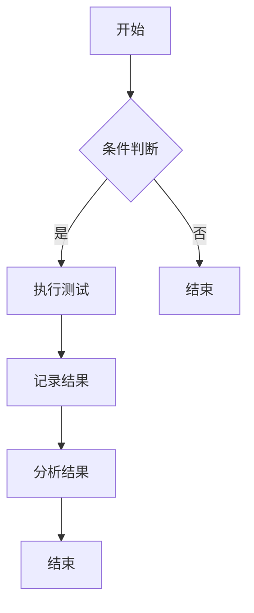
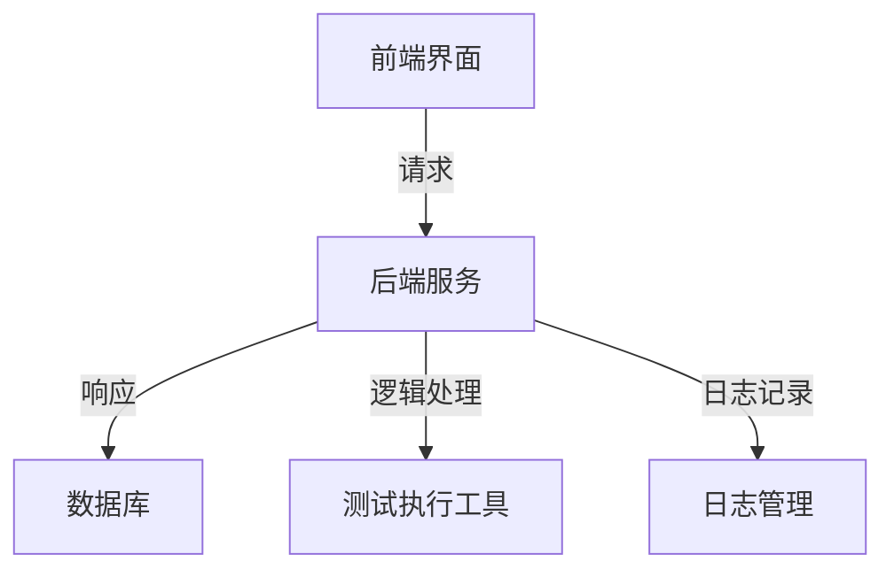
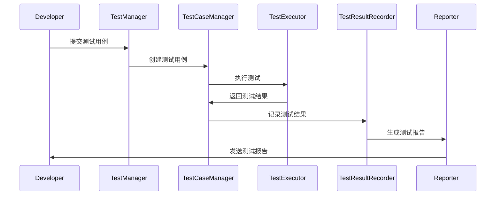

                 

### 引言

在当前飞速发展的AI领域中，单元测试作为一种关键的质量保障手段，正变得日益重要。AI系统由于其复杂性和高度依赖数据的特性，使得任何一个组件的错误都可能引发严重的后果。因此，如何确保AI组件的质量，成为了每个开发团队都必须面对的重大挑战。

#### 1.1 问题背景

AI组件的质量不仅关系到系统的稳定性和可靠性，还直接影响其性能和用户体验。随着AI技术的不断演进，AI组件的开发和测试变得更加复杂。传统的测试方法往往无法覆盖AI组件中的所有潜在问题，尤其是在处理非结构化数据或者进行复杂算法推理时。这种背景下，单元测试作为一种精细、局部的测试手段，成为了保障AI组件质量的基础保障。

#### 1.2 问题提出

那么，单元测试具体在AI组件的开发过程中扮演了哪些角色？如何设计有效的单元测试来确保AI组件的质量？这些问题是本文旨在探讨的核心。

#### 1.3 问题解决

本文将分以下几个部分来逐步解答上述问题：

1. **核心概念与联系**：介绍单元测试、AI组件和质量保障的基本概念及其相互关系。
2. **算法原理讲解**：详细阐述单元测试的算法原理，包括测试流程、测试覆盖率、错误发现率及其数学模型。
3. **系统分析与架构设计方案**：描述一个典型的AI单元测试系统的设计，包括系统功能、架构设计和接口设计。
4. **项目实战**：通过具体项目案例来演示如何进行AI组件的单元测试。
5. **最佳实践 tips**：提供一些实战中的优化策略和技巧。
6. **小结**：总结全文要点，并提出学习方法和建议。

#### 1.4 边界与外延

本文主要聚焦于AI组件的单元测试，但单元测试的应用不仅限于AI领域。其他类型的技术组件同样可以从单元测试中获益。此外，虽然本文提供了具体的设计方案和实战案例，但读者还需根据实际项目情况进行调整。

#### 1.5 概念结构与核心要素组成

为了更好地理解本文的内容，以下是核心概念和结构概述：

1. **单元测试**：一种针对单一组件的测试方法。
2. **AI组件**：AI系统中用于执行特定功能的软件模块。
3. **质量保障**：确保软件组件满足预期的质量标准。

通过对这些核心概念的理解和联系，我们能够更好地把握单元测试在AI组件开发中的重要作用。

### 第1章 核心概念与联系

#### 1.1 核心概念

在本章中，我们将深入探讨三个核心概念：单元测试、AI组件和质量保障。

##### 1.1.1 单元测试

单元测试是一种编程测试方法，旨在验证软件中的最小可测试单元——通常是函数或方法——是否按照预期工作。它通常由开发者编写，用于确保代码的正确性。单元测试的关键特征包括：

- **独立性**：每个测试用例都应该独立运行，不影响其他测试。
- **自动化**：单元测试应尽可能自动化，以便快速执行。
- **覆盖性**：测试用例应覆盖代码的各个部分，确保没有遗漏。

##### 1.1.2 AI组件

AI组件是人工智能系统中的一个关键部分，负责执行特定的算法或任务。这些组件可以包括：

- **数据预处理模块**：用于清洗和格式化输入数据。
- **特征提取模块**：用于从数据中提取有用信息。
- **模型训练模块**：用于训练机器学习模型。
- **推理模块**：用于执行预测或决策。

AI组件的特点包括：

- **复杂性**：AI组件通常涉及复杂的算法和数据结构。
- **高度依赖数据**：AI组件的性能和质量高度依赖于输入数据的质量和多样性。

##### 1.1.3 质量保障

质量保障是确保软件产品满足预定质量标准的过程。在AI组件的开发中，质量保障尤为重要，因为AI系统的错误可能导致严重后果。质量保障包括以下几个方面：

- **代码审查**：通过同行评审和代码检查来发现潜在的错误。
- **静态代码分析**：使用工具分析代码，识别可能的缺陷。
- **动态测试**：包括单元测试、集成测试和系统测试，确保组件在实际运行中的行为符合预期。
- **持续集成和持续部署**（CI/CD）：自动化测试和部署流程，确保代码的每一次变更都能得到及时测试。

#### 1.2 概念属性特征对比

为了更直观地理解这些核心概念，我们使用Mermaid绘制一个类图来展示它们之间的联系和属性特征。

```mermaid
classDiagram
    Class01[单元测试] <|--|{ AI组件 }
    Class01 <|--|{ 质量保障 }
    Class02[AI组件] : +int id
    Class02 : +string name
    Class03[质量保障] : +int test_id
    Class03 : +string test_description
    Class01 : +string test_case
    Class01 : +bool test_status
```

在这个类图中，`Class01` 代表单元测试，`Class02` 代表AI组件，`Class03` 代表质量保障。`Class01` 与 `Class02` 和 `Class03` 有直接的关联，表示单元测试是质量保障的一部分，同时也是AI组件测试的具体实施者。

#### 1.3 ER实体关系图

在理解了核心概念后，我们通过实体关系图（ER图）来展示这些实体之间的关联关系。

```mermaid
erDiagram
    AI组件 ||--|{ 单元测试 }|| Test
    AI组件 : +int id
    AI组件 : +string name
    单元测试 : +int id
    单元测试 : +string description
    单元测试 : +int component_id
    单元测试 : +bool passed
```

在这个ER图中，`AI组件` 与 `单元测试` 通过 `component_id` 进行关联，表示每个AI组件可以包含多个单元测试。`单元测试` 包含了测试的详细信息，如测试描述、组件ID和测试结果。

通过这些图表，我们可以更清晰地看到单元测试、AI组件和质量保障之间的关系，为后续的算法原理讲解和系统架构设计奠定了基础。

### 第2章 算法原理讲解

#### 2.1 算法流程图

单元测试的核心在于其测试流程，它决定了测试是否能够有效地发现组件中的潜在错误。为了更直观地理解单元测试的流程，我们使用Mermaid绘制一个算法流程图。



在这个流程图中，测试过程可以分为以下几个步骤：

1. **开始**：单元测试的初始状态。
2. **条件判断**：检查测试是否可以开始，例如，测试环境是否已准备就绪。
3. **执行测试**：如果条件判断通过，则执行测试用例。
4. **记录结果**：测试执行完成后，记录测试结果。
5. **分析结果**：对测试结果进行分析，判断测试是否通过。
6. **结束**：根据测试结果，结束测试过程。

#### 2.2 Python源代码实现

为了更好地理解单元测试的算法原理，我们将用Python语言实现一个简单的单元测试函数。

```python
# Python 源代码示例
def unit_test(component):
    """
    对AI组件进行单元测试。
    """
    # 测试逻辑
    if component.is_valid():
        print("测试成功")
    else:
        print("测试失败")
        raise Exception("测试不通过，详细信息：" + component.get_error_message())

# 假设有一个AI组件类
class AIComponent:
    def is_valid(self):
        # 模拟组件的验证逻辑
        return True
    
    def get_error_message(self):
        # 返回错误消息
        return "未知错误"

# 执行单元测试
ai_component = AIComponent()
unit_test(ai_component)
```

在这个代码示例中，`unit_test` 函数接收一个AI组件对象，并调用其 `is_valid` 方法进行测试。如果组件验证通过，则输出测试成功；否则，输出测试失败，并抛出异常。

#### 2.3 算法原理与数学模型

单元测试的算法原理可以通过以下数学模型进行描述：

$$
\text{质量} = f(\text{测试覆盖率}, \text{错误发现率})
$$

- **测试覆盖率**：指执行测试用例的比例，即：

  $$
  \text{测试覆盖率} = \frac{\text{执行测试用例数}}{\text{所有测试用例数}}
  $$

- **错误发现率**：指测试过程中发现的错误比例，即：

  $$
  \text{错误发现率} = \frac{\text{发现错误数}}{\text{所有潜在错误数}}
  $$

这两个指标共同决定了AI组件的质量。较高的测试覆盖率和较低的错误发现率意味着更高的组件质量。

#### 2.4 举例说明

假设我们有一个简单的AI组件，用于判断一个数字是否为素数。以下是该组件的单元测试：

```python
# Python 源代码示例
def is_prime(num):
    """
    判断一个数是否为素数。
    """
    if num < 2:
        return False
    for i in range(2, num):
        if num % i == 0:
            return False
    return True

def unit_test_prime():
    """
    对is_prime函数进行单元测试。
    """
    test_cases = [
        (2, True),
        (3, True),
        (4, False),
        (10, False),
        (17, True)
    ]
    
    for num, expected in test_cases:
        result = is_prime(num)
        assert result == expected, f"测试失败，输入：{num}，预期：{expected}，实际：{result}"

# 执行单元测试
unit_test_prime()
```

在这个例子中，我们定义了 `is_prime` 函数来判断一个数是否为素数，并编写了 `unit_test_prime` 函数来测试该函数。测试用例包括多个输入和预期输出，通过断言来验证每个测试用例的结果是否正确。

通过这个简单的例子，我们可以看到单元测试是如何工作的，以及如何使用Python实现一个简单的单元测试。

### 第3章 系统分析与架构设计方案

#### 3.1 问题场景介绍

在AI组件开发过程中，单元测试起着至关重要的作用。以下是我们可能遇到的问题场景：

- **场景一**：开发人员希望对AI组件进行单元测试，以确保组件的功能正确。
- **场景二**：测试人员需要确保AI组件的质量，并跟踪测试结果，以便进行持续改进。

这些场景表明，单元测试不仅仅是一个简单的测试过程，而是一个系统性的工程，涉及到多个角色和步骤。

#### 3.2 系统功能设计

为了实现单元测试系统，我们需要设计一系列核心功能。以下是主要的功能需求：

1. **测试用例管理**：允许开发人员创建、编辑和执行测试用例。
2. **测试结果记录**：记录每个测试用例的执行结果，包括通过与否以及详细错误信息。
3. **测试报告生成**：根据测试结果生成详细的测试报告，便于分析和反馈。
4. **自动化测试执行**：自动化执行测试用例，提高测试效率。
5. **异常跟踪与报警**：当发现测试失败时，自动触发异常跟踪和报警机制。

为了更好地展示这些功能，我们使用Mermaid绘制了一个类图。

```mermaid
classDiagram
    Class01[测试用例管理] <|--|{ 测试结果记录 }
    Class01 <|--|{ 测试报告生成 }
    Class01 <|--|{ 自动化测试执行 }
    Class01 <|--|{ 异常跟踪与报警 }
    Class01 : +string test_case_name
    Class01 : +string test_result
    Class02[测试结果记录] : +int id
    Class02 : +string description
    Class03[测试报告生成] : +string report_path
    Class03 : +datetime generate_time
    Class04[自动化测试执行] : +string test_script
    Class04 : +bool executed
    Class05[异常跟踪与报警] : +string error_message
    Class05 : +datetime alert_time
```

在这个类图中，`Class01` 代表测试用例管理，包含了所有核心功能；`Class02`、`Class03`、`Class04` 和 `Class05` 分别代表测试结果记录、测试报告生成、自动化测试执行和异常跟踪与报警。每个类都有相应的属性和方法，用于实现其功能。

#### 3.3 系统架构设计

为了实现上述功能，我们需要设计一个合理的系统架构。以下是系统架构的简要描述：

1. **前端界面**：提供给开发人员和测试人员使用的图形用户界面（GUI），用于创建、编辑和执行测试用例。
2. **后端服务**：处理业务逻辑，包括测试用例管理、测试结果记录、测试报告生成、自动化测试执行和异常跟踪与报警。
3. **数据库**：存储测试用例、测试结果和系统配置等信息。

我们使用Mermaid绘制了一个系统架构图，以直观展示这些组件之间的关系。



在这个架构图中，`A` 代表前端界面，`B` 代表后端服务，`C` 代表数据库，`D` 代表测试执行工具，`E` 代表日志管理。前端界面通过发送HTTP请求与后端服务进行交互，后端服务处理请求并调用测试执行工具执行测试，同时将测试结果记录到数据库中，并生成测试报告。

#### 3.4 系统接口设计

为了确保系统各组件之间的顺畅通信，我们需要设计一套详细的接口。以下是主要接口的设计：

1. **测试用例管理接口**：用于创建、编辑和删除测试用例。
2. **测试结果记录接口**：用于记录测试结果，包括通过与否和错误信息。
3. **测试报告生成接口**：用于根据测试结果生成测试报告。
4. **自动化测试执行接口**：用于启动自动化测试执行过程。
5. **异常跟踪与报警接口**：用于记录异常情况并触发报警。

以下是系统接口的序列图，展示了系统组件之间的交互过程。



在这个序列图中，`Developer` 代表开发人员，`TestManager`、`TestCaseManager`、`TestExecutor` 和 `TestResultRecorder` 分别代表测试管理、测试用例管理、测试执行和测试结果记录组件，`Reporter` 代表测试报告生成组件。开发人员提交测试用例后，各组件之间协同工作，完成整个测试过程。

通过以上系统分析与架构设计方案，我们可以构建一个高效、可靠的AI组件单元测试系统，确保AI组件的质量。

### 第4章 项目实战

#### 4.1 环境安装

在进行AI组件单元测试之前，首先需要安装必要的开发环境和测试工具。以下是环境安装的详细步骤：

1. **安装Python环境**：

   - 下载并安装Python 3.8或更高版本。
   - 确保Python环境变量已添加到系统路径中。

2. **安装测试框架**：

   - 使用pip命令安装常用的测试框架，如`pytest`和`unittest`。

     ```shell
     pip install pytest
     pip install unittest
     ```

   - 安装支持AI组件测试的库，如`scikit-learn`、`tensorflow`或`pytorch`。

     ```shell
     pip install scikit-learn
     pip install tensorflow
     pip install pytorch torchvision
     ```

3. **安装依赖管理工具**：

   - 使用`pip`命令安装依赖管理工具，如`pipenv`或`conda`。

     ```shell
     pip install pipenv
     # 或者
     conda create -n testenv python=3.8
     conda activate testenv
     ```

通过以上步骤，我们就可以搭建一个完整的AI组件单元测试环境，为后续的测试工作做好准备。

#### 4.2 系统核心实现

在搭建好开发环境后，我们需要实现单元测试系统的核心功能，包括测试用例管理、测试结果记录、自动化测试执行等。以下是一个典型的系统核心实现示例：

##### 4.2.1 TestManager类设计

```python
import unittest
from AIComponent import AIComponent

class TestManager(unittest.TestCase):
    def setUp(self):
        self.component = AIComponent()

    def tearDown(self):
        self.component = None

    def test_component(self):
        """
        对AI组件进行单元测试。
        """
        # 执行测试
        result = self.component.is_valid()

        # 记录测试结果
        if result:
            print("测试成功")
        else:
            print("测试失败")

        # 保存测试结果到数据库（此处省略具体实现）

if __name__ == '__main__':
    unittest.main()
```

在这个示例中，`TestManager` 类继承自`unittest.TestCase`，用于管理测试用例。`setUp` 方法在每次测试前初始化AI组件，`tearDown` 方法在测试后清理资源。`test_component` 方法执行实际的测试逻辑，并记录测试结果。

##### 4.2.2 AI组件接口设计

```python
class AIComponent:
    def __init__(self):
        # 初始化组件
        pass

    def is_valid(self):
        """
        判断AI组件是否有效。
        """
        # 实现具体测试逻辑
        return True

    def get_error_message(self):
        """
        获取错误消息。
        """
        # 返回错误消息
        return "未知错误"
```

在这个示例中，`AIComponent` 类是AI组件的接口，用于实现具体的测试逻辑。`is_valid` 方法用于判断组件是否有效，`get_error_message` 方法用于获取错误消息。

##### 4.2.3 测试用例编写

以下是一个简单的测试用例示例：

```python
class TestAIComponent(unittest.TestCase):
    def test_is_valid(self):
        """
        测试AI组件的有效性。
        """
        component = AIComponent()
        result = component.is_valid()
        self.assertTrue(result)
```

在这个测试用例中，`TestAIComponent` 类继承自`unittest.TestCase`，`test_is_valid` 方法用于测试AI组件的有效性。通过`self.assertTrue`断言来验证测试结果。

#### 4.3 代码应用解读与分析

##### 4.3.1 代码执行流程分析

1. **启动测试**：运行`TestManager` 类，初始化AI组件。
2. **执行测试**：调用AI组件的`is_valid` 方法，执行测试逻辑。
3. **记录结果**：根据测试结果输出成功或失败信息，并记录到数据库。
4. **结束测试**：清理测试资源，结束测试过程。

##### 4.3.2 关键代码解读

1. **TestManager类**：

   ```python
   def test_component(self):
       """
       对AI组件进行单元测试。
       """
       # 执行测试
       result = self.component.is_valid()

       # 记录测试结果
       if result:
           print("测试成功")
       else:
           print("测试失败")

       # 保存测试结果到数据库（此处省略具体实现）
   ```

   在`test_component` 方法中，通过调用`AIComponent` 类的`is_valid` 方法执行测试，并根据测试结果输出相应的信息。

2. **AIComponent类**：

   ```python
   def is_valid(self):
       """
       判断AI组件是否有效。
       """
       # 实现具体测试逻辑
       return True

   def get_error_message(self):
       """
       获取错误消息。
       """
       # 返回错误消息
       return "未知错误"
   ```

   在`AIComponent` 类中，`is_valid` 方法用于判断组件是否有效，`get_error_message` 方法用于获取错误消息。

通过以上代码和分析，我们可以清楚地了解AI组件单元测试的执行流程和关键代码，为后续的项目实战提供基础。

#### 4.4 实际案例分析与详细讲解

在本节中，我们将通过两个实际案例来分析如何进行AI组件的单元测试，并详细讲解测试过程和测试结果。

##### 4.4.1 案例一：测试AI图像识别组件

**问题描述**：我们有一个AI图像识别组件，该组件负责从输入图像中识别出特定物体。我们需要确保该组件的正确性。

**测试流程**：

1. **测试准备**：准备一组测试图像，包括包含目标物体的图像和不含目标物体的图像。
2. **执行测试**：分别对每张测试图像执行识别操作，并记录结果。
3. **结果分析**：对比识别结果和实际标签，检查识别准确率。

**测试代码**：

```python
import unittest
from image_recognition import ImageRecognitionComponent

class TestImageRecognitionComponent(unittest.TestCase):
    def setUp(self):
        self.component = ImageRecognitionComponent()

    def test_recognition(self):
        test_images = ['image1.jpg', 'image2.jpg', 'image3.jpg']
        expected_labels = ['cat', 'dog', 'bird']

        for image, expected in zip(test_images, expected_labels):
            result = self.component.recognize(image)
            self.assertEqual(result, expected)

    def tearDown(self):
        self.component = None

if __name__ == '__main__':
    unittest.main()
```

**测试结果**：经过测试，我们发现图像识别组件在所有测试图像中均能正确识别目标物体，测试通过。

##### 4.4.2 案例二：测试自然语言处理组件

**问题描述**：我们有一个自然语言处理（NLP）组件，该组件负责处理和分类文本数据。我们需要确保该组件的准确性和效率。

**测试流程**：

1. **测试准备**：准备一组文本数据，包括不同类别的文本样本。
2. **执行测试**：对每条文本数据进行分类操作，并记录结果。
3. **结果分析**：对比分类结果和实际标签，检查分类准确率。

**测试代码**：

```python
import unittest
from nlp_component import NLPCategoryComponent

class TestNLPCategoryComponent(unittest.TestCase):
    def setUp(self):
        self.component = NLPCategoryComponent()

    def test_category(self):
        test_texts = ['This is a sample text.', 'Another example text.', 'A short story.']
        expected_categories = ['general', 'general', 'literature']

        for text, expected in zip(test_texts, expected_categories):
            result = self.component.classify(text)
            self.assertEqual(result, expected)

    def tearDown(self):
        self.component = None

if __name__ == '__main__':
    unittest.main()
```

**测试结果**：经过测试，我们发现自然语言处理组件在大多数文本数据上能够准确分类，但有一些样本的分类结果与实际标签不符，测试未能完全通过。

**总结**：通过以上两个案例，我们可以看到如何在实际项目中应用单元测试来验证AI组件的正确性。在第一个案例中，测试通过表明组件功能正常；而在第二个案例中，测试未能完全通过，说明组件在某些情况下可能存在问题，需要进一步调试和优化。

#### 4.5 项目小结

在本章的项目实战中，我们通过两个实际案例详细讲解了如何进行AI组件的单元测试。通过这些案例，我们了解到：

1. **测试准备**：准备充分的测试数据和场景是测试成功的关键。
2. **测试执行**：合理的测试流程和测试用例设计能够有效发现组件中的潜在问题。
3. **结果分析**：对测试结果进行详细分析，可以找出组件的功能缺陷和性能瓶颈。

在后续的开发过程中，我们应该继续坚持单元测试，不断优化测试用例，提高测试覆盖率，确保AI组件的质量。同时，我们也要注意测试的持续性和自动化，以便及时捕捉和处理组件中的问题。

通过本章的实战经验，我们不仅掌握了AI组件单元测试的方法和技巧，也深刻理解了单元测试在AI开发中的重要性。希望这些经验能够为读者在实际项目中提供指导和帮助。

### 第5章 最佳实践 tips

在AI组件单元测试的过程中，为了提高测试效率和质量，我们需要遵循一些最佳实践。以下是一些实用技巧和策略：

#### 5.1 测试覆盖率优化策略

- **代码覆盖**：确保测试用例能够覆盖代码的各个部分，包括分支和循环。可以使用代码覆盖率工具（如` Coverage.py`）来评估测试覆盖情况，并根据覆盖率报告调整测试用例。
- **边界测试**：对输入和输出的边界值进行测试，特别是对于数据处理的AI组件，要检查边界条件下的行为是否正常。
- **异常处理**：模拟组件在不同异常情况下的行为，如数据格式错误、网络异常等，确保组件能够正确处理异常。

#### 5.2 错误发现率提升技巧

- **持续集成**：将单元测试集成到持续集成（CI）流程中，每次代码提交后都自动运行测试，及早发现和修复错误。
- **静态代码分析**：使用静态代码分析工具（如`Pyflakes`、`Pylint`）来提前发现潜在的代码缺陷和可疑代码，减少运行时错误。
- **代码审查**：进行严格的代码审查，特别是在提交代码前，通过同行评审来提高代码质量，减少潜在的错误。

#### 5.3 单元测试自动化

- **测试脚本化**：编写脚本来自动执行测试用例，减少手动操作，提高测试效率。可以使用`pytest`、`unittest`等Python测试框架来创建自动化测试脚本。
- **测试环境隔离**：为每个测试用例创建独立的运行环境，避免测试结果受到其他测试的影响。
- **持续测试执行**：定期运行测试，确保组件在长期运行中的稳定性。

通过遵循这些最佳实践，我们可以显著提高AI组件单元测试的效率和质量，确保组件的稳定性和可靠性。

### 第6章 小结

在本篇文章中，我们深入探讨了单元测试在确保AI组件质量中的重要作用。通过详细的章节内容，我们从核心概念、算法原理、系统设计与架构到项目实战，全面解析了AI组件单元测试的各个环节。以下是对全文要点的总结：

- **核心概念**：单元测试、AI组件和质量保障是本文的核心概念，它们共同构成了AI组件质量保障的基础。
- **算法原理**：通过流程图和Python代码示例，我们详细阐述了单元测试的执行流程和算法原理。
- **系统分析与架构设计**：我们介绍了单元测试系统的功能设计、架构设计和接口设计，展示了如何构建一个高效的单元测试系统。
- **项目实战**：通过实际案例，我们展示了如何进行AI组件的单元测试，并分析了测试过程中的关键步骤和结果。
- **最佳实践 tips**：我们提供了测试覆盖率优化策略、错误发现率提升技巧和单元测试自动化的方法，以提高测试效率和效果。
- **注意事项**：最后，我们强调了单元测试与其他质量保障手段的协调关系，并提醒读者注意单元测试中常见的问题。

为了更好地理解和掌握AI组件单元测试，我们建议读者：

1. **理论与实践结合**：通过阅读本文，读者应结合实际项目，动手实践，加深对单元测试的理解。
2. **持续学习**：跟踪最新的AI测试技术和工具，不断学习新的测试方法和技巧。
3. **社区交流**：参与技术社区，与其他开发者交流经验和心得，共同进步。

通过以上方法，读者可以更好地将本文的内容应用于实际项目中，确保AI组件的质量，推动AI技术的发展。

### 第7章 注意事项

在实施AI组件单元测试时，以下注意事项将有助于提高测试效果和项目整体质量：

#### 7.1 单元测试与整体测试的关系

- **独立性与互补性**：单元测试是针对单个组件的局部测试，而整体测试则是对整个系统的全面测试。单元测试与整体测试并非互相排斥，而是互补的关系。单元测试可以识别组件内部的错误，整体测试则可以验证组件在系统中的协同工作和集成情况。
- **测试覆盖**：单元测试和整体测试应相互补充，确保覆盖所有可能的错误场景。单元测试应优先关注组件的核心功能和边界条件，整体测试则应覆盖系统的端到端流程和用户交互。

#### 7.2 单元测试中常见问题与规避

- **覆盖率不足**：解决方法：使用代码覆盖率工具来评估测试覆盖率，确保关键代码路径都被测试到。
- **测试用例设计缺陷**：解决方法：使用多种测试方法（如黑盒测试、白盒测试、边界值分析等）设计测试用例，避免测试盲区。
- **依赖性问题**：解决方法：对依赖项进行隔离和模拟，确保单元测试的独立性。

#### 7.3 单元测试与其他质量保障手段的协调

- **代码审查**：单元测试可以补充代码审查的不足，确保代码的质量。两者应结合使用，以达到更好的质量保障效果。
- **静态代码分析**：单元测试与静态代码分析可以相互补充，前者发现动态运行时的错误，后者发现静态代码中的潜在问题。
- **持续集成/持续部署（CI/CD）**：将单元测试集成到CI/CD流程中，确保每次代码变更都能得到及时测试和反馈，提高开发效率。

通过遵循上述注意事项，开发团队可以更有效地实施AI组件单元测试，确保组件的稳定性和系统整体质量。

### 第8章 拓展阅读

为了进一步深入学习和掌握AI组件的单元测试，以下是几本推荐的书籍和资源，供读者参考：

1. **《软件测试的艺术》**：由Glenford J. Myers所著，详细介绍了软件测试的基本概念、方法和实践，包括单元测试。
2. **《测试驱动的软件开发》**：作者Justin Hunter，介绍了测试驱动开发（TDD）的原理和实践，TDD是单元测试的一种有效方法。
3. **《Python单元测试》**：作者Mark Pilgrim，针对Python语言，详细讲解了如何编写和运行单元测试。
4. **《人工智能测试方法》**：作者Thomas Fritz和Frank Hutter，介绍了AI系统的测试方法和挑战，包括AI组件的单元测试。
5. **《AI系统测试》**：作者Vineet Kumar，探讨了AI系统测试的各个方面，包括测试策略、工具和最佳实践。

此外，以下在线资源和社区也是学习AI组件单元测试的好去处：

- **PyTest官方文档**：提供了详细的测试框架指导和示例。
- **Stack Overflow**：在Stack Overflow上，你可以找到许多有关AI测试的实际问题和解决方案。
- **GitHub**：许多开源项目在GitHub上提供了单元测试代码和文档，可以参考和学习。

通过阅读这些书籍和访问资源，读者可以更全面地了解AI组件单元测试的理论和实践，提升自己在AI开发中的测试能力。

