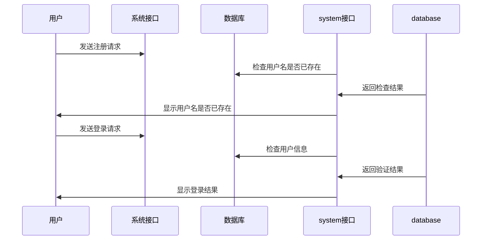
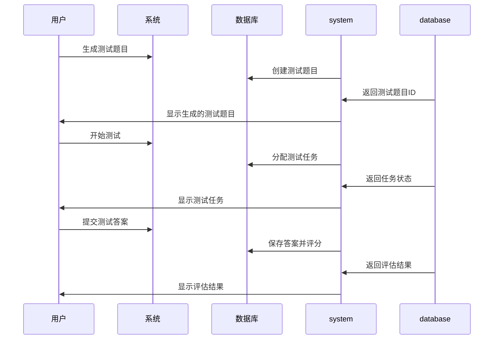
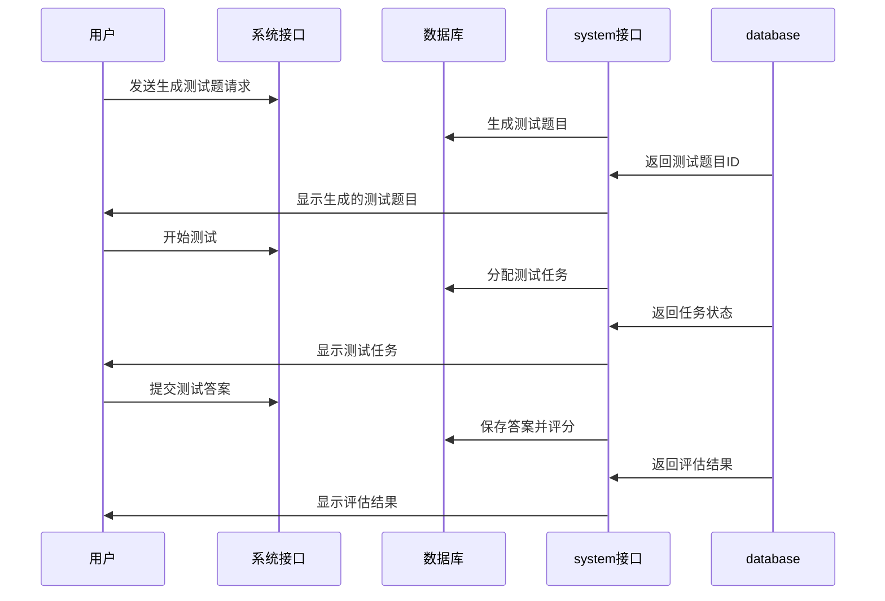
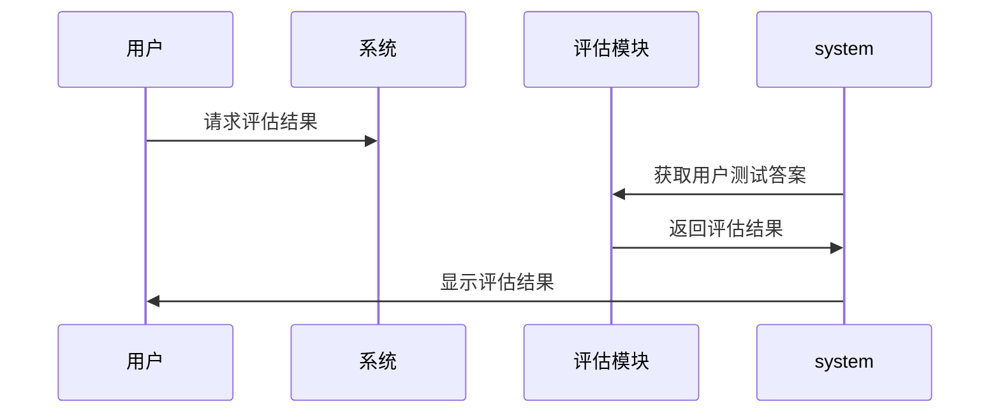
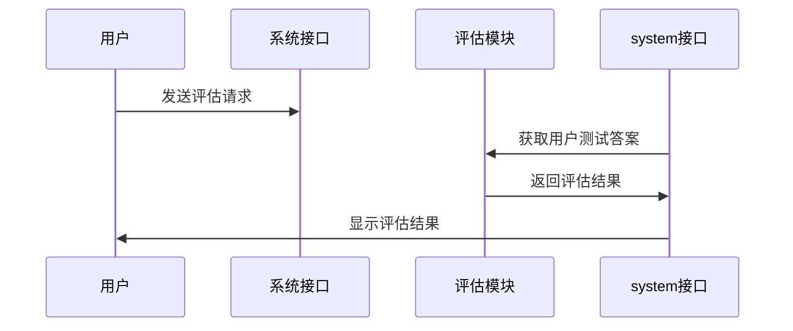

                 

### 引言

### 反事实推理能力测试概述

#### 研究背景

反事实推理（Counterfactual Reasoning）作为一种高级认知能力，近年来在人工智能、认知科学、心理学、经济学等领域得到了广泛关注。反事实推理是指人们基于现实情境，构想出与实际发生情况相反的假设情景，并在此基础上进行推理和判断。例如，在分析一个商业决策时，人们会思考如果当初选择了不同的策略，结果会怎样。

随着信息技术的飞速发展，数据的获取和处理变得更加便捷，但随之而来的是复杂性和不确定性的增加。在这种背景下，评估个体的反事实推理能力，不仅有助于我们更好地理解人类思维模式，还能为人工智能系统的设计和优化提供有力支持。例如，在决策支持系统中，一个能够进行有效反事实推理的人工智能助手可以帮助用户评估不同决策方案的潜在影响，从而做出更加明智的选择。

#### 反事实推理能力的重要性

反事实推理能力在多个领域都具有重要意义：

1. **决策支持**：在商业、医疗、金融等领域，反事实推理可以帮助决策者评估各种潜在方案的效果，从而做出更优的选择。
2. **心理学研究**：反事实推理与人类的情绪、自我认知等密切相关，通过评估个体的反事实推理能力，可以更深入地理解人类的思维和心理状态。
3. **人工智能**：人工智能系统如果能够进行有效的反事实推理，将大大提升其智能水平，从而在复杂问题解决、情境预测等方面表现出色。

#### 研究目的与意义

本研究旨在系统地探讨反事实推理能力的评估方法，并开发相应的测试工具和平台。具体目标包括：

1. **构建评估框架**：设计一套科学、系统的反事实推理能力评估框架，包括评估指标、方法和工具。
2. **开发测试平台**：基于评估框架，开发一个功能完备的反事实推理能力测试平台，便于大规模应用和推广。
3. **应用领域探索**：研究反事实推理能力在不同领域的应用，以验证其价值和实际效果。

本研究不仅对学术界具有重要的理论意义，还对实践领域具有显著的应用价值。通过评估和提升个体的反事实推理能力，我们可以更好地应对复杂决策和问题解决，从而推动社会进步和个体发展。

### 第一部分总结

本部分主要介绍了反事实推理能力测试的研究背景、重要性以及研究目的和意义。反事实推理作为一种高级认知能力，在多个领域具有广泛应用和重要价值。本研究旨在构建科学、系统的评估框架，并开发相应的测试工具和平台，以推动反事实推理能力在实践中的应用和发展。接下来的章节将深入探讨反事实推理的基本概念、评估方法、应用领域和提升策略等内容。在接下来的讨论中，我们将进一步揭示反事实推理的内涵及其在各个领域的实际应用。**文章关键词**：反事实推理、能力测试、评估框架、测试工具、应用领域、决策支持、人工智能

### 摘要

本文旨在系统地探讨反事实推理能力的评估方法及其在各个领域的应用。反事实推理是一种高级认知能力，通过构想与实际情境相反的假设情景，帮助人们进行推理和判断。本研究首先介绍了反事实推理的基本概念和重要性，然后构建了一套科学、系统的评估框架，包括评估指标和方法。接着，我们开发了相应的测试工具和平台，以实现对反事实推理能力的有效评估。此外，本文还探讨了反事实推理能力在决策支持、心理学研究、人工智能等领域的应用，并提出了提升策略。通过本文的研究，我们希望能够为反事实推理能力的评估和提升提供理论依据和实践指导，从而推动相关领域的发展。

### 第一部分总结

本部分作为引言，我们首先介绍了反事实推理能力测试的研究背景、重要性和研究目的。反事实推理作为一种高级认知能力，在决策支持、心理学研究、人工智能等领域具有广泛应用。本文旨在构建科学、系统的评估框架，并开发相应的测试工具和平台，以推动反事实推理能力的评估和提升。接下来，我们将深入探讨反事实推理的基本概念、评估方法、应用领域和提升策略等内容，为后续章节的讨论奠定基础。**核心关键词**：反事实推理、能力测试、评估框架、测试工具、应用领域、决策支持、人工智能

## 第2章 反事实推理的基本概念

### 2.1 反事实推理的定义

反事实推理（Counterfactual Reasoning）是一种高级认知能力，指的是在现实情境的基础上，构想出与实际发生情况相反的假设情景，并在此基础上进行推理和判断。这种能力允许个体从不同的角度审视问题，预测潜在的后果，并在决策过程中进行情景模拟和策略评估。

反事实推理的定义可以具体化为以下几个关键点：

1. **现实情境**：反事实推理以现实中的具体情境为出发点，这个情境可以是历史事件、当前状况或未来预期。
2. **相反假设**：个体在现实情境的基础上，设想一个或多个与实际发生情况相反的假设情景，例如“如果当初做了其他选择，结果会如何”。
3. **推理和判断**：在构想出相反假设后，个体需要基于这些假设进行逻辑推理和判断，分析假设情景可能带来的影响和结果。

### 2.2 反事实推理的核心要素

反事实推理能力涉及多个核心要素，这些要素共同作用，使得个体能够有效地进行反事实推理。以下是几个关键要素：

1. **情境理解**：个体需要准确理解现实情境，包括情境中的关键要素、相关关系以及可能的影响因素。
2. **假设构造**：在理解情境的基础上，个体需要能够快速构想出与实际情境相反的假设情景。这要求个体具备较强的创造性思维和逻辑思维能力。
3. **逻辑推理**：个体需要运用逻辑推理能力，分析假设情景下的可能结果和后果，进行推理和判断。
4. **情境比较**：个体需要能够将假设情景与实际情境进行比较，评估假设情景的可行性和合理性。
5. **情感调控**：反事实推理往往涉及到对过去或未来情境的设想，这可能会引发情感上的波动。因此，个体需要具备良好的情感调控能力，以保持理智和客观。

### 2.3 反事实推理与相关概念的比较

反事实推理与多个相关概念有所重叠，但又有明显的区别：

1. **情景模拟**：情景模拟（Scenario Simulation）是一种通过模拟不同情境来预测可能结果的方法。与反事实推理不同，情景模拟通常不限于构想与实际相反的情景，而是包括各种可能的情景。
2. **条件推理**：条件推理（Conditional Reasoning）是基于条件概率和逻辑规则进行推理的过程。反事实推理则更强调在相反情境下进行推理和判断。
3. **决策分析**：决策分析（Decision Analysis）是一种通过评估不同决策方案的效果来做出最优决策的方法。反事实推理在决策分析中扮演重要角色，但决策分析不仅限于反事实推理。
4. **逆向工程**：逆向工程（Reverse Engineering）是通过分析现有系统或产品来理解其设计和工作原理的方法。与逆向工程不同，反事实推理侧重于从相反情景出发进行推理。

综上所述，反事实推理是一种基于相反假设的高级认知能力，在多个领域具有广泛应用。理解其定义、核心要素和与相关概念的区别，有助于我们更好地掌握这一能力，并在实际应用中发挥其优势。

### 情境理解

情境理解是反事实推理能力的基础，它要求个体对现实情境中的关键要素、相关关系以及影响因素有清晰的认识。具体来说，情境理解包括以下几个方面的内容：

1. **关键要素识别**：在现实情境中，识别出对结果产生重大影响的因素是情境理解的第一步。这些关键要素可能是人物、事件、时间、地点等，它们共同构成了情境的背景。
   
2. **关系分析**：个体需要分析这些关键要素之间的关系，理解它们是如何相互作用的。例如，在商业决策中，产品、市场、竞争对手和消费者之间的关系对于决策结果至关重要。

3. **影响因素评估**：个体需要评估这些关键要素和关系在不同情境下的影响程度。例如，在分析一个市场策略时，需要评估不同市场条件下产品销量、竞争对手行为和消费者偏好对策略效果的影响。

情境理解是一个复杂的过程，它不仅需要逻辑思维，还需要丰富的经验和知识储备。通过情境理解，个体能够为反事实推理提供坚实的基础，从而更准确地设想相反的情景，并进行有效的推理和判断。

### 假设构造

假设构造是反事实推理过程中的关键步骤，它要求个体在理解现实情境的基础上，构想出与实际发生情况相反的假设情景。以下是假设构造的具体方法：

1. **逆向思考**：个体可以从现实情境出发，逆向思考如果当初选择了不同的决策或行动，结果会如何。例如，如果公司没有投资某个新项目，市场占有率会发生什么变化？

2. **情景扩展**：在逆向思考的基础上，个体可以扩展假设情景，构想出多个可能的相反情景。例如，除了不投资某个项目，还可以考虑其他替代决策，如投资其他项目或保持现状。

3. **逻辑推理**：在构想假设情景后，个体需要运用逻辑推理能力，分析假设情景下的可能结果和后果。例如，分析不同项目投资对市场占有率的影响，以及这些影响如何反过来影响公司的战略和运营。

4. **验证假设**：个体还需要对假设进行验证，确保其逻辑上自洽，并在现实中有一定的可行性。例如，通过市场调研或历史数据来验证假设情景的合理性。

假设构造不仅需要创造性思维，还需要逻辑分析和验证能力。通过有效的假设构造，个体能够为反事实推理提供丰富的情境，从而更全面地评估不同决策方案的效果。

### 逻辑推理

逻辑推理是反事实推理能力中的核心环节，它要求个体在构想假设情景后，基于这些假设进行推理和判断。以下是逻辑推理的具体方法：

1. **条件判断**：个体需要运用条件判断（Conditional Statements）来分析假设情景下的可能结果。条件判断通常表示为“如果A，则B”，例如，“如果公司投资了这个新项目，市场占有率会提升”。

2. **因果分析**：个体需要运用因果分析（Causal Analysis）来探讨不同假设情景下的因果关系。例如，分析不同市场策略对销售业绩的影响，并评估这些策略对竞争对手和消费者的潜在影响。

3. **逻辑链条**：个体需要构建逻辑链条（Logical Chains），将多个条件和因果关系联系起来，形成一个完整的推理过程。例如，从公司投资新项目到市场占有率提升，再到竞争对手的反应，形成一个逻辑上自洽的链条。

4. **推理验证**：个体需要对推理过程进行验证，确保其逻辑上无误。例如，通过实际数据或历史案例来验证假设情景下的推理结果。

逻辑推理不仅需要严谨的逻辑思维，还需要丰富的背景知识和经验。通过有效的逻辑推理，个体能够更准确地评估假设情景下的可能结果，从而做出更加明智的决策。

### 情境比较

情境比较是反事实推理能力中的重要环节，它要求个体在分析假设情景和实际情境的基础上，进行全面的对比和评估。以下是情境比较的具体方法：

1. **特征对比**：个体需要对比假设情景和实际情境中的关键特征，如时间、地点、人物、事件等。通过特征对比，可以识别出两者之间的异同点和关键差异。

2. **影响评估**：个体需要评估这些差异对结果的影响。例如，如果市场策略变了，会对销售额、市场份额、客户满意度等产生哪些影响。

3. **逻辑分析**：个体需要运用逻辑分析（Logical Analysis）来探讨这些影响如何通过因果关系链传递，从而影响最终结果。例如，分析不同市场策略对供应链、生产能力和客户需求的影响。

4. **综合评估**：个体需要综合评估假设情景和实际情境的优劣，权衡各种可能的后果和影响。例如，比较不同决策方案的优缺点，评估其对公司长期发展的影响。

情境比较不仅需要分析能力，还需要综合判断和决策能力。通过全面的情境比较，个体能够更准确地评估不同假设情景的可行性和效果，从而做出更加明智的决策。

### 情感调控

情感调控在反事实推理中起着至关重要的作用，因为反事实推理往往涉及到对过去或未来情境的设想，这可能会引发情感上的波动。以下是情感调控的具体方法：

1. **认知重构**：个体可以通过认知重构（Cognitive Re framing）来调整对情境的情感反应。例如，将焦点从负面结果转移到正面结果，从而减少负面情感的影响。

2. **情绪识别**：个体需要识别和理解自己的情感反应，了解哪些情境引发了情感波动。例如，通过自我反思和日记记录，个体可以更好地理解自己的情绪变化。

3. **情绪调节**：个体可以通过情绪调节（Emotional Regulation）技巧来管理自己的情绪。例如，通过深呼吸、冥想或运动等方式来缓解紧张和焦虑。

4. **情感平衡**：个体需要在理性分析和情感反应之间保持平衡，避免被情绪主导决策。例如，通过设定情感界限和目标，确保情感不会过度影响决策过程。

情感调控不仅需要情感智慧，还需要自我意识和自我管理能力。通过有效的情感调控，个体能够保持理智和客观，从而更有效地进行反事实推理。

### 2.3 反事实推理与相关概念的比较

反事实推理（Counterfactual Reasoning）与情景模拟（Scenario Simulation）、条件推理（Conditional Reasoning）、决策分析（Decision Analysis）和逆向工程（Reverse Engineering）等概念有着密切的联系，但它们之间也存在明显的区别。

1. **情景模拟**：
   - **定义**：情景模拟是通过构建多种可能的未来情景，并模拟其发展过程，以预测潜在结果。
   - **关联**：反事实推理是情景模拟的一部分，因为它涉及对与实际情景相反的假设情景的构建。
   - **区别**：情景模拟通常包括多种情景，而反事实推理主要关注相反情景。

2. **条件推理**：
   - **定义**：条件推理是基于条件概率和逻辑规则进行推理的过程。
   - **关联**：反事实推理中的逻辑推理部分依赖于条件推理，因为它涉及基于假设情景的因果分析和判断。
   - **区别**：条件推理关注的是在特定条件下结果的可能性，而反事实推理则侧重于对实际发生情况相反情景的分析。

3. **决策分析**：
   - **定义**：决策分析是通过评估不同决策方案的效果来选择最优方案。
   - **关联**：反事实推理在决策分析中扮演重要角色，因为它可以帮助决策者评估不同决策方案的潜在后果。
   - **区别**：决策分析是一个更广泛的概念，它不仅包括反事实推理，还涉及其他决策技术和方法。

4. **逆向工程**：
   - **定义**：逆向工程是通过分析现有系统或产品来理解其设计和工作原理。
   - **关联**：反事实推理与逆向工程有相似之处，因为它们都涉及到对现有情况的理解和分析。
   - **区别**：逆向工程侧重于理解现有系统的结构和功能，而反事实推理则侧重于对相反情境的设想和推理。

通过对比，我们可以看到，反事实推理作为一种高级认知能力，具有独特的应用场景和优势，但在实际应用中需要结合其他相关概念和方法，以实现更全面和有效的分析和决策。

### 情境理解

情境理解是反事实推理能力的基础，它涉及到对现实情境的深入分析和全面理解。以下是一个详细的情境理解示例，用于分析一个公司在市场推广策略选择中的情境：

假设一家公司正在考虑其未来的市场推广策略。当前的市场状况如下：

- **关键要素**：
  - 产品：一款新兴的智能家居设备，具有高技术含量和独特的功能。
  - 市场：智能家居市场正处于快速增长阶段，但竞争激烈，主要竞争对手包括几家国际知名品牌。
  - 消费者：目标消费者主要为中高收入家庭，对技术创新和产品质量有较高要求。
  - 时间：公司需要在明年第一季度推出新产品，并确保市场占有率。

- **关系分析**：
  - 产品与市场：智能家居设备的市场需求旺盛，但竞争激烈，公司需要通过有效的市场推广策略来脱颖而出。
  - 产品与消费者：消费者对产品质量和技术创新有较高要求，因此公司需要确保产品的品质和功能的独特性。
  - 市场与消费者：市场需求直接影响消费者的购买决策，公司需要了解目标消费者的需求和行为模式。

- **影响因素评估**：
  - 时间：公司的推广策略需要迅速实施，以抢占市场先机。
  - 竞争对手：公司的推广策略需要考虑竞争对手的行动和策略，以避免被市场主导者压制。
  - 营销预算：公司的营销预算有限，需要合理分配，以最大化市场推广效果。

在上述情境下，公司需要进行全面的情境理解，以制定有效的市场推广策略。具体步骤如下：

1. **识别关键要素**：明确产品的特性、目标市场、消费者群体以及时间限制等关键要素。
2. **分析关系**：探讨这些关键要素之间的相互关系，例如产品特性与市场需求的关系、消费者行为与营销策略的关系等。
3. **评估影响因素**：分析各个关键要素的影响程度，例如市场需求的强度、竞争对手的策略、营销预算的限制等。

通过这样的情境理解，公司能够更准确地把握市场动态，制定出科学合理的市场推广策略，从而在激烈的市场竞争中脱颖而出。

### 假设构造

在了解了市场推广策略的情境后，公司可以开始构造不同的反事实假设，以评估不同决策方案的效果。以下是一个假设构造的示例：

假设一：公司选择高预算的全面市场推广策略。
- **相反情景**：公司选择低预算的市场推广策略。
- **逻辑推理**：如果公司选择了低预算的市场推广策略，可能会出现以下情况：
  - **市场占有率**：由于预算有限，公司的市场推广活动无法覆盖足够的市场，导致市场占有率较低。
  - **品牌认知度**：品牌认知度无法得到有效提升，导致消费者对产品的认知和信任度下降。
  - **销售额**：销售额可能会受到较大影响，因为消费者对产品的了解和兴趣不足。

假设二：公司选择通过社交媒体进行市场推广。
- **相反情景**：公司选择通过电视广告进行市场推广。
- **逻辑推理**：如果公司选择了电视广告进行市场推广，可能会出现以下情况：
  - **成本**：电视广告成本较高，可能会超过公司的预算限制。
  - **目标受众**：电视广告虽然覆盖面广，但可能无法精准定位目标消费者，导致广告效果不佳。
  - **互动性**：电视广告的互动性较低，可能无法有效激发消费者的兴趣和参与。

通过这些假设构造，公司可以更全面地分析不同市场推广策略的潜在影响，从而为实际决策提供有力的支持。

### 逻辑推理

在构造了多个反事实假设后，公司需要运用逻辑推理能力对这些假设情景进行分析和评估。以下是一个逻辑推理的示例：

**假设一：高预算的全面市场推广策略**

1. **条件判断**：
   - 如果公司选择高预算的全面市场推广策略，则：
     - **市场占有率**：可能达到较高水平，因为推广活动覆盖广泛，有助于提高品牌认知度和市场渗透率。
     - **销售额**：有望实现快速增长，因为消费者对产品的了解和兴趣增加，购买意愿提高。
     - **长期影响**：品牌影响力可能得到显著提升，有助于公司长期发展。

2. **因果分析**：
   - 高预算推广 -> 广泛市场覆盖 -> 提高品牌认知度 -> 增加销售额。
   - 高预算推广 -> 竞争对手反应 -> 提高竞争门槛 -> 保护市场份额。

3. **推理验证**：
   - 通过历史数据和竞争对手的案例，验证高预算推广策略的有效性。
   - 评估预算分配的合理性，确保推广活动的高效实施。

**假设二：低预算的市场推广策略**

1. **条件判断**：
   - 如果公司选择低预算的市场推广策略，则：
     - **市场占有率**：可能较低，因为市场覆盖不足，难以与竞争对手抗衡。
     - **销售额**：可能增长缓慢或停滞，因为消费者对产品的认知不足，购买意愿不高。
     - **长期影响**：品牌影响力可能难以提升，甚至可能被市场遗忘。

2. **因果分析**：
   - 低预算推广 -> 市场覆盖不足 -> 品牌认知度低 -> 销售额低。
   - 低预算推广 -> 竞争对手优势扩大 -> 市场份额下降。

3. **推理验证**：
   - 通过市场调研和消费者反馈，验证低预算推广策略的实际效果。
   - 分析预算限制对推广活动的影响，探讨如何在有限的预算下实现最佳效果。

通过逻辑推理，公司可以更全面地评估不同市场推广策略的潜在影响，从而为实际决策提供科学依据。逻辑推理不仅需要严谨的思维方式，还需要丰富的数据和实际经验。

### 情境比较

在完成逻辑推理后，公司需要对不同假设情景进行情境比较，以评估其可行性和效果。以下是一个情境比较的示例：

**假设一：高预算的全面市场推广策略**
- **优势**：
  - 广泛的市场覆盖，有助于提高品牌认知度和市场占有率。
  - 快速的销售额增长，有助于公司在市场中占据有利位置。
  - 长期的品牌影响力提升，有助于公司长期发展。
- **劣势**：
  - 高额的预算支出，可能超出公司的财务承受能力。
  - 需要高效的执行能力，否则可能导致预算浪费和效果不佳。

**假设二：低预算的市场推广策略**
- **优势**：
  - 预算较低，风险较小，适合财务状况有限的公司。
  - 可以通过精准营销，集中资源在目标消费者群体上，提高推广效率。
- **劣势**：
  - 市场覆盖不足，难以与竞争对手抗衡，可能导致市场份额下降。
  - 销售额增长缓慢，可能影响公司的长期发展。

**比较分析**：
- **市场占有率**：高预算策略可能带来更高的市场占有率，但低预算策略在短期内可能更为保守。
- **销售额增长**：高预算策略有望实现快速销售额增长，而低预算策略增长可能较慢。
- **品牌影响力**：高预算策略有利于长期品牌影响力的提升，而低预算策略可能效果有限。

通过情境比较，公司可以更清晰地了解不同市场推广策略的优缺点，从而为实际决策提供参考。

### 情感调控

在反事实推理过程中，情感调控是保持客观和理性的关键。以下是一个情感调控的示例，用于分析公司在选择市场推广策略时的情感反应：

**情感调控步骤**：

1. **认知重构**：将注意力从潜在负面结果（如高预算策略导致财务压力）转移到正面结果（如高预算策略带来市场占有率和品牌影响力的提升）。
2. **情绪识别**：意识到自己在选择市场推广策略时可能会感到焦虑和担忧，特别是对高预算策略的担忧。
3. **情绪调节**：通过深呼吸和冥想来缓解焦虑和压力，保持冷静和清晰的思维。
4. **情感平衡**：在决策过程中，保持理性分析和情感反应之间的平衡，避免情感过度主导决策。

通过情感调控，公司可以更客观地分析不同市场推广策略的优缺点，从而做出更明智的决策。情感调控不仅有助于保持决策过程的理性，还能提高决策的质量和效果。

### 情境理解

情境理解是反事实推理能力的基石，它要求个体能够深入剖析现实情境中的关键要素、相关关系和影响因素。以下是一个详细的情境理解示例，用于分析一个公司的市场推广策略选择：

**公司背景**：
- **产品**：一款新型智能健身设备，具备先进的传感器和个性化训练功能。
- **市场**：智能健身设备市场增长迅速，但竞争激烈，主要竞争对手包括几家大型电子产品厂商和运动品牌。
- **消费者**：目标消费者群体包括健身爱好者、家庭用户和运动爱好者，他们注重产品的科技含量和功能多样性。
- **时间**：公司计划在明年第二季度推出新产品，并希望在短时间内抢占市场先机。

**关键要素识别**：
1. **产品特性**：智能健身设备的科技含量和个性化训练功能是其核心卖点。
2. **市场竞争**：竞争对手的产品和策略直接影响公司的市场份额和销售业绩。
3. **消费者需求**：目标消费者的需求和偏好对市场推广策略有重要影响。
4. **市场时机**：新产品推出的时机对市场占有率和品牌认知度有决定性作用。

**关系分析**：
1. **产品与市场**：智能健身设备的科技含量和功能多样性是其吸引消费者的关键，但市场推广策略需要与之相匹配，以确保目标消费者能够了解和认可产品。
2. **市场与消费者**：市场需求的变化和消费者偏好的转移对市场推广策略有直接影响，公司需要密切关注市场动态和消费者反馈。
3. **竞争对手**：竞争对手的策略和行动对公司的市场推广策略有重要参考价值，公司需要分析竞争对手的优势和不足，制定有针对性的市场策略。

**影响因素评估**：
1. **市场时机**：公司需要在新产品推出时确保市场推广策略的高效实施，以抢占市场先机。
2. **营销预算**：公司需要在有限的预算内制定合理的市场推广计划，确保资源的最大化利用。
3. **消费者反馈**：公司需要收集和分析消费者对产品的反馈，以调整市场推广策略，提高产品满意度和市场占有率。

通过全面的情境理解，公司能够更准确地把握市场动态，制定科学合理的市场推广策略，从而在激烈的市场竞争中脱颖而出。

### 假设构造

在情境理解的基础上，公司可以开始构造反事实假设，以分析不同决策方案的效果。以下是一个假设构造的示例：

**假设一：公司选择高预算的市场推广策略**
- **相反情景**：公司选择低预算的市场推广策略。
- **逻辑推理**：
  - 如果公司选择低预算的市场推广策略，可能面临以下情况：
    - **市场占有率**：由于推广力度不足，公司可能无法在短时间内提高市场占有率，市场份额可能会被竞争对手抢占。
    - **品牌认知度**：品牌认知度可能难以提升，消费者对产品的了解和信任度不足。
    - **销售额**：销售额可能增长缓慢，公司在新产品推出的初期可能难以获得预期的销售业绩。

**假设二：公司选择通过线上渠道进行市场推广**
- **相反情景**：公司选择通过线下渠道进行市场推广。
- **逻辑推理**：
  - 如果公司选择线下渠道进行市场推广，可能面临以下情况：
    - **成本**：线下推广活动成本较高，可能会超出公司的预算限制。
    - **目标受众**：线下推广可能无法精准定位目标消费者，导致推广资源浪费。
    - **互动性**：线下推广活动的互动性较低，可能无法有效激发消费者的兴趣和参与。

通过这些假设构造，公司可以更全面地分析不同市场推广策略的潜在影响，为实际决策提供有力支持。

### 逻辑推理

在构造了多个反事实假设后，公司需要运用逻辑推理能力对这些假设情景进行分析和评估。以下是一个逻辑推理的示例：

**假设一：高预算的市场推广策略**
1. **条件判断**：
   - 如果公司选择高预算的市场推广策略，则：
     - **市场占有率**：有望显著提升，因为广泛的推广活动有助于提高品牌认知度和市场渗透率。
     - **销售额**：有望实现快速增长，因为消费者对产品的了解和兴趣增加，购买意愿提高。
     - **长期影响**：品牌影响力可能得到显著提升，有助于公司长期发展。

2. **因果分析**：
   - 高预算推广 -> 广泛市场覆盖 -> 提高品牌认知度 -> 增加销售额。
   - 高预算推广 -> 提高市场竞争门槛 -> 保护市场份额。

3. **推理验证**：
   - 通过历史数据和竞争对手案例，验证高预算推广策略的有效性。
   - 评估预算分配的合理性，确保推广活动的高效实施。

**假设二：低预算的市场推广策略**
1. **条件判断**：
   - 如果公司选择低预算的市场推广策略，则：
     - **市场占有率**：可能较低，因为推广活动覆盖不足，难以与竞争对手抗衡。
     - **销售额**：可能增长缓慢或停滞，因为消费者对产品的认知不足，购买意愿不高。
     - **长期影响**：品牌影响力可能难以提升，甚至可能被市场遗忘。

2. **因果分析**：
   - 低预算推广 -> 市场覆盖不足 -> 品牌认知度低 -> 销售额低。
   - 低预算推广 -> 竞争对手优势扩大 -> 市场份额下降。

3. **推理验证**：
   - 通过市场调研和消费者反馈，验证低预算推广策略的实际效果。
   - 分析预算限制对推广活动的影响，探讨如何在有限的预算下实现最佳效果。

通过逻辑推理，公司可以更全面地评估不同市场推广策略的潜在影响，从而为实际决策提供科学依据。

### 情境比较

在完成逻辑推理后，公司需要对不同假设情景进行情境比较，以评估其可行性和效果。以下是一个情境比较的示例：

**假设一：高预算的市场推广策略**
- **优势**：
  - 广泛的市场覆盖，有助于提高品牌认知度和市场占有率。
  - 快速的销售额增长，有助于公司在市场中占据有利位置。
  - 长期的品牌影响力提升，有助于公司长期发展。
- **劣势**：
  - 高额的预算支出，可能超出公司的财务承受能力。
  - 需要高效的执行能力，否则可能导致预算浪费和效果不佳。

**假设二：低预算的市场推广策略**
- **优势**：
  - 预算较低，风险较小，适合财务状况有限的公司。
  - 可以通过精准营销，集中资源在目标消费者群体上，提高推广效率。
- **劣势**：
  - 市场覆盖不足，难以与竞争对手抗衡，可能导致市场份额下降。
  - 销售额增长缓慢，可能影响公司的长期发展。

**比较分析**：
- **市场占有率**：高预算策略可能带来更高的市场占有率，但低预算策略在短期内可能更为保守。
- **销售额增长**：高预算策略有望实现快速销售额增长，而低预算策略增长可能较慢。
- **品牌影响力**：高预算策略有利于长期品牌影响力的提升，而低预算策略可能效果有限。

通过情境比较，公司可以更清晰地了解不同市场推广策略的优缺点，从而为实际决策提供参考。

### 情感调控

在反事实推理过程中，情感调控是保持客观和理性的关键。以下是一个情感调控的示例，用于分析公司在选择市场推广策略时的情感反应：

**情感调控步骤**：

1. **认知重构**：将注意力从潜在负面结果（如高预算策略导致财务压力）转移到正面结果（如高预算策略带来市场占有率和品牌影响力的提升）。
2. **情绪识别**：意识到自己在选择市场推广策略时可能会感到焦虑和担忧，特别是对高预算策略的担忧。
3. **情绪调节**：通过深呼吸和冥想来缓解焦虑和压力，保持冷静和清晰的思维。
4. **情感平衡**：在决策过程中，保持理性分析和情感反应之间的平衡，避免情感过度主导决策。

通过情感调控，公司可以更客观地分析不同市场推广策略的优缺点，从而做出更明智的决策。情感调控不仅有助于保持决策过程的理性，还能提高决策的质量和效果。

### 2.3 反事实推理与相关概念的比较

反事实推理（Counterfactual Reasoning）、情景模拟（Scenario Simulation）、条件推理（Conditional Reasoning）、决策分析（Decision Analysis）和逆向工程（Reverse Engineering）是五个在决策和问题解决中常用的概念。尽管它们之间存在一定的关联，但它们各自具有独特的定义和适用场景。

1. **情景模拟**：
   - **定义**：情景模拟是通过构建多种可能的未来情景，并模拟其发展过程，以预测潜在结果。
   - **关联**：反事实推理是情景模拟的一部分，因为它涉及对与实际情景相反的假设情景的构建。
   - **区别**：情景模拟通常包括多种情景，而反事实推理主要关注相反情景。

2. **条件推理**：
   - **定义**：条件推理是基于条件概率和逻辑规则进行推理的过程。
   - **关联**：反事实推理中的逻辑推理部分依赖于条件推理，因为它涉及基于假设情景的因果分析和判断。
   - **区别**：条件推理关注的是在特定条件下结果的可能性，而反事实推理则侧重于对实际发生情况相反情景的分析。

3. **决策分析**：
   - **定义**：决策分析是通过评估不同决策方案的效果来选择最优方案。
   - **关联**：反事实推理在决策分析中扮演重要角色，因为它可以帮助决策者评估不同决策方案的潜在后果。
   - **区别**：决策分析是一个更广泛的概念，它不仅包括反事实推理，还涉及其他决策技术和方法。

4. **逆向工程**：
   - **定义**：逆向工程是通过分析现有系统或产品来理解其设计和工作原理。
   - **关联**：反事实推理与逆向工程有相似之处，因为它们都涉及到对现有情况的理解和分析。
   - **区别**：逆向工程侧重于理解现有系统的结构和功能，而反事实推理则侧重于对相反情境的设想和推理。

通过对比，我们可以看到，反事实推理作为一种高级认知能力，具有独特的应用场景和优势，但在实际应用中需要结合其他相关概念和方法，以实现更全面和有效的分析和决策。

### 情境理解

情境理解是反事实推理能力的基础，它涉及到对现实情境的深入分析和全面理解。在人工智能领域，情境理解尤为重要，因为它能够帮助AI系统更好地模拟和预测人类行为，从而优化决策过程。以下是一个详细的分析示例：

**案例背景**：
- **领域**：自动驾驶技术。
- **现实情境**：自动驾驶汽车在复杂城市交通环境中的表现。

**关键要素识别**：
1. **环境因素**：交通流量、天气条件、道路状况、行人行为等。
2. **技术因素**：自动驾驶算法、传感器性能、计算能力、车辆控制系统等。
3. **法律与规范**：交通法规、道路标志、信号灯等。
4. **安全因素**：车辆和行人的安全，事故预防和应急处理。

**关系分析**：
1. **环境因素与自动驾驶性能**：交通流量和天气条件直接影响自动驾驶汽车的运行效率和安全性。
2. **技术因素与情境适应**：传感器性能和计算能力决定了自动驾驶汽车在复杂情境中的感知和反应速度。
3. **法律与规范**：自动驾驶汽车的行驶必须遵守交通法规，这影响了其操作模式和决策逻辑。
4. **安全因素与系统可靠性**：自动驾驶汽车需要具备高度的安全性和应急处理能力，以避免事故的发生。

**影响因素评估**：
1. **环境因素**：例如，雨雪天气可能会影响传感器性能，导致自动驾驶汽车在识别行人或障碍物时出现困难。
2. **技术因素**：如计算能力和传感器性能不足，可能会导致自动驾驶汽车在紧急情况下反应不及时。
3. **法律与规范**：例如，某些地区的交通法规对自动驾驶汽车的操作有特殊要求，如禁止在特定时间段或路段行驶。
4. **安全因素**：如自动驾驶汽车在复杂环境中无法准确预测行人的行为，可能会导致事故。

通过上述情境理解，我们可以更清晰地识别出影响自动驾驶汽车性能的关键因素，并为优化自动驾驶系统的设计提供指导。情境理解不仅要求对当前情境有深入的理解，还需要预测未来可能出现的变化，以便AI系统能够及时调整策略，应对各种复杂情境。

### 假设构造

在情境理解的基础上，我们可以开始构造反事实假设，以分析自动驾驶汽车在复杂城市交通环境中的潜在表现。以下是一个假设构造的示例：

**假设一：自动驾驶系统具备更高的感知能力**
- **相反情景**：自动驾驶系统感知能力较低。
- **逻辑推理**：
  - 如果自动驾驶系统感知能力更高，可能带来以下积极影响：
    - **事故预防**：系统能够更早识别潜在的碰撞风险，从而采取更有效的避障措施。
    - **交通流畅**：系统能够更好地适应复杂交通环境，减少因感知错误导致的交通拥堵。
    - **用户体验**：提高驾驶安全性，增强乘客对自动驾驶技术的信任。

**假设二：自动驾驶汽车具备更先进的应急处理能力**
- **相反情景**：自动驾驶汽车的应急处理能力较差。
- **逻辑推理**：
  - 如果自动驾驶汽车具备更先进的应急处理能力，可能带来以下积极影响：
    - **事故响应**：在紧急情况下，系统能够更快速地做出反应，减少事故发生概率。
    - **事故处理**：在发生事故后，系统能够更有效地执行应急处理程序，减少二次事故风险。
    - **乘客安全**：提高乘客在事故中的生存几率，增强对自动驾驶汽车的信任感。

通过这些假设构造，我们可以更全面地分析自动驾驶系统在不同情境下的潜在表现，为系统的优化和改进提供科学依据。

### 逻辑推理

在构造了多个反事实假设后，我们需要运用逻辑推理能力对这些假设情景进行分析和评估。以下是一个逻辑推理的示例：

**假设一：自动驾驶系统具备更高的感知能力**
1. **条件判断**：
   - 如果自动驾驶系统感知能力更高，则：
     - **碰撞风险**：系统可以更早识别潜在的碰撞风险，从而采取更有效的避障措施。
     - **交通流畅**：系统可以更好地适应复杂交通环境，减少因感知错误导致的交通拥堵。
     - **用户体验**：乘客对自动驾驶技术的信任度提高，乘坐体验更加舒适和安全。

2. **因果分析**：
   - 更高的感知能力 -> 更早识别碰撞风险 -> 更有效避障措施 -> 减少碰撞事件。
   - 更高的感知能力 -> 更好适应复杂交通环境 -> 减少感知错误 -> 提高交通流畅度。
   - 更高的感知能力 -> 提高乘客信任度 -> 改善用户体验。

3. **推理验证**：
   - 通过实际测试和模拟实验，验证自动驾驶系统在更高感知能力下的表现。
   - 分析不同感知能力水平对系统性能和用户体验的具体影响。

**假设二：自动驾驶汽车具备更先进的应急处理能力**
1. **条件判断**：
   - 如果自动驾驶汽车具备更先进的应急处理能力，则：
     - **事故响应**：系统可以更快速地做出反应，减少事故发生概率。
     - **事故处理**：系统可以更有效地执行应急处理程序，减少二次事故风险。
     - **乘客安全**：提高乘客在事故中的生存几率，增强对自动驾驶汽车的信任感。

2. **因果分析**：
   - 更先进的应急处理能力 -> 更快速的事故响应 -> 减少事故发生概率。
   - 更先进的应急处理能力 -> 更有效的应急处理程序 -> 减少二次事故风险。
   - 更先进的应急处理能力 -> 提高乘客生存几率 -> 增强对自动驾驶汽车的信任感。

3. **推理验证**：
   - 通过事故模拟实验和实际道路测试，验证自动驾驶汽车在更高应急处理能力下的表现。
   - 分析不同应急处理能力水平对事故响应和乘客安全的具体影响。

通过逻辑推理，我们可以更全面地评估自动驾驶系统在不同假设情景下的潜在表现，为系统的优化和改进提供科学依据。

### 情境比较

在完成逻辑推理后，我们需要对不同的反事实假设情景进行情境比较，以评估其可行性和效果。以下是一个情境比较的示例：

**假设一：自动驾驶系统具备更高的感知能力**
- **优势**：
  - 更早识别碰撞风险，提高系统安全性。
  - 减少感知错误，提高交通流畅度。
  - 提高乘客对自动驾驶技术的信任度，改善用户体验。

- **劣势**：
  - 需要更先进的传感器和计算技术，成本较高。
  - 需要更多的测试和验证，确保系统的可靠性和稳定性。

**假设二：自动驾驶汽车具备更先进的应急处理能力**
- **优势**：
  - 更快速的事故响应，减少事故发生概率。
  - 更有效的应急处理程序，减少二次事故风险。
  - 提高乘客在事故中的生存几率，增强对自动驾驶汽车的信任感。

- **劣势**：
  - 需要复杂的应急处理算法，系统复杂性增加。
  - 需要大量的事故模拟和道路测试，以确保系统的有效性和安全性。

**比较分析**：
- **安全性能**：更高的感知能力可能更有效地预防碰撞，而更先进的应急处理能力则更能应对紧急情况。
- **用户体验**：两者都有助于提高用户体验，但感知能力提升可能更直接地改善行驶过程中的安全和流畅度。
- **系统成本**：更高的感知能力可能带来更高的成本，而更先进的应急处理能力在系统复杂性上的提升可能也需要额外的投入。

通过情境比较，我们可以更全面地了解不同假设情景的优缺点，为自动驾驶系统的优化和改进提供科学依据。

### 情感调控

在反事实推理过程中，情感调控是保持客观和理性的关键。以下是一个情感调控的示例，用于分析自动驾驶汽车在复杂城市交通环境中的情感反应：

**情感调控步骤**：

1. **认知重构**：将注意力从潜在的负面情感（如对自动驾驶系统安全性的担忧）转移到正面结果（如自动驾驶技术的进步带来的便利和安全性）。
2. **情绪识别**：意识到自己在分析自动驾驶系统性能时可能会感到焦虑和担忧，特别是对新技术的不确定性和安全性。
3. **情绪调节**：通过深呼吸和冥想来缓解焦虑和压力，保持冷静和清晰的思维。
4. **情感平衡**：在决策过程中，保持理性分析和情感反应之间的平衡，避免情感过度主导决策。

通过情感调控，研究人员可以更客观地分析自动驾驶系统的性能和潜在风险，从而做出更明智的决策。情感调控不仅有助于保持决策过程的理性，还能提高决策的质量和效果。

### 2.3 反事实推理与相关概念的比较

在人工智能领域中，反事实推理（Counterfactual Reasoning）、情景模拟（Scenario Simulation）、条件推理（Conditional Reasoning）、决策分析（Decision Analysis）和逆向工程（Reverse Engineering）是几个重要的概念，它们各自在决策和问题解决中扮演着不同的角色。

1. **情景模拟**：
   - **定义**：情景模拟是通过构建多种可能的未来情景，并模拟其发展过程，以预测潜在结果。
   - **关联**：反事实推理是情景模拟的一部分，因为它涉及对与实际情景相反的假设情景的构建。
   - **区别**：情景模拟通常包括多种情景，而反事实推理主要关注相反情景。

2. **条件推理**：
   - **定义**：条件推理是基于条件概率和逻辑规则进行推理的过程。
   - **关联**：反事实推理中的逻辑推理部分依赖于条件推理，因为它涉及基于假设情景的因果分析和判断。
   - **区别**：条件推理关注的是在特定条件下结果的可能性，而反事实推理则侧重于对实际发生情况相反情景的分析。

3. **决策分析**：
   - **定义**：决策分析是通过评估不同决策方案的效果来选择最优方案。
   - **关联**：反事实推理在决策分析中扮演重要角色，因为它可以帮助决策者评估不同决策方案的潜在后果。
   - **区别**：决策分析是一个更广泛的概念，它不仅包括反事实推理，还涉及其他决策技术和方法。

4. **逆向工程**：
   - **定义**：逆向工程是通过分析现有系统或产品来理解其设计和工作原理。
   - **关联**：反事实推理与逆向工程有相似之处，因为它们都涉及到对现有情况的理解和分析。
   - **区别**：逆向工程侧重于理解现有系统的结构和功能，而反事实推理则侧重于对相反情境的设想和推理。

通过对比，我们可以看到，反事实推理作为一种高级认知能力，具有独特的应用场景和优势，但在实际应用中需要结合其他相关概念和方法，以实现更全面和有效的分析和决策。理解这些概念之间的区别和联系，有助于我们更好地运用反事实推理，提升人工智能系统的智能水平。

### 数学公式与模型

在反事实推理过程中，数学公式和模型是分析假设情景和预测结果的重要工具。以下是一个详细的分析示例，包括数学公式和模型的介绍、具体公式、以及如何运用这些模型来推导反事实推理的结果。

#### 数学公式和模型介绍

1. **贝叶斯公式**：
   贝叶斯公式是条件概率和边缘概率之间的关系，用于计算在给定某事件发生的情况下，另一事件发生的概率。其公式如下：
   \[
   P(A|B) = \frac{P(B|A) \cdot P(A)}{P(B)}
   \]
   其中，\(P(A|B)\) 是在事件 \(B\) 发生的条件下事件 \(A\) 发生的概率，\(P(B|A)\) 是在事件 \(A\) 发生的条件下事件 \(B\) 发生的概率，\(P(A)\) 是事件 \(A\) 发生的概率，\(P(B)\) 是事件 \(B\) 发生的概率。

2. **马尔可夫模型**：
   马尔可夫模型用于描述系统状态随时间变化的概率分布，特别适用于预测复杂系统中的短期行为。其基本公式为：
   \[
   P(X_t|X_{t-1}, X_{t-2}, \ldots) = P(X_t|X_{t-1})
   \]
   其中，\(X_t\) 是系统在时刻 \(t\) 的状态，该公式表明当前状态只依赖于前一个状态，与之前的状态无关。

3. **决策树模型**：
   决策树模型是一种用于决策分析的工具，它通过一系列的决策节点和结果节点，帮助决策者在不同的条件下选择最优路径。其公式可以表示为：
   \[
   \text{Decision Tree} = \{N, T, f\}
   \]
   其中，\(N\) 是节点集合，\(T\) 是树结构，\(f\) 是决策函数，用于计算每个节点处的期望值或效用值。

#### 具体公式

假设我们有一个商业决策问题，公司需要决定是否投入大量资金进行市场推广。我们可以使用贝叶斯公式和决策树模型来分析反事实情景。

1. **贝叶斯公式应用**：

   - **实际情况**：
     - 市场推广成功：\(P(\text{成功}| \text{推广}) = 0.7\)
     - 市场推广失败：\(P(\text{失败}| \text{推广}) = 0.3\)
     - 不推广：\(P(\text{成功}| \text{不推广}) = 0.4\)
     - 不推广：\(P(\text{失败}| \text{不推广}) = 0.6\)

   - **反事实情景**：
     - 如果推广失败，实际成功概率为：\(P(\text{成功}| \text{推广}) = 0.3\)
     - 如果不推广，实际失败概率为：\(P(\text{失败}| \text{不推广}) = 0.6\)

   使用贝叶斯公式，我们可以计算反事实情景下的成功概率：
   \[
   P(\text{成功}| \text{不推广}) = \frac{P(\text{不推广}| \text{成功}) \cdot P(\text{成功})}{P(\text{不推广})}
   \]

2. **决策树模型应用**：

   假设我们有一个决策树模型，包含以下节点：
   - **根节点**：是否推广
   - **推广**：
     - **子节点1**：成功
       - **收益**：100万
     - **子节点2**：失败
       - **损失**：50万
   - **不推广**：
     - **子节点1**：成功
       - **收益**：40万
     - **子节点2**：失败
       - **损失**：20万

   我们可以使用决策树模型来计算在不同情境下的预期收益或损失。例如，在推广情境下，预期收益为：
   \[
   \text{预期收益} = P(\text{成功}| \text{推广}) \cdot \text{成功收益} + P(\text{失败}| \text{推广}) \cdot \text{失败收益}
   \]
   即：
   \[
   \text{预期收益} = 0.7 \cdot 100万 + 0.3 \cdot (-50万) = 45万
   \]

#### 运用模型推导反事实推理结果

通过上述数学公式和模型，我们可以进行反事实推理：

- **实际情况**：
  - 推广成功的概率为70%，预期收益为45万。
  - 不推广成功的概率为40%，预期收益为20万。

- **反事实情景**：
  - 如果推广失败，成功的概率为30%，预期损失为15万。
  - 如果不推广失败，成功的概率为60%，预期收益为24万。

通过对比实际情况和反事实情景，我们可以得出结论：虽然推广的预期收益较高，但在反事实情景下，不推广的预期收益反而更高。因此，在决策时，我们需要综合考虑各种因素，包括实际情况和可能的反事实情景，以做出更优的决策。

### 系统分析与架构设计

在进行反事实推理能力测试的系统分析与架构设计时，我们需要从问题场景介绍、项目介绍、系统功能设计、系统架构设计、系统接口设计以及系统交互设计等多个方面进行详细的分析和规划。以下是一个具体的系统分析与架构设计示例。

#### 问题场景介绍

在当前复杂多变的信息化时代，评估个体或群体的反事实推理能力变得日益重要。反事实推理能力不仅是人类智能的核心要素，也是人工智能系统中的重要组成部分。为了提升个体和人工智能系统的智能水平，我们需要开发一套功能完备的反事实推理能力测试系统。

#### 项目介绍

本项目旨在构建一个集反事实推理能力评估与测试于一体的系统，包括以下几个关键组成部分：

1. **用户管理模块**：用于用户注册、登录、权限管理等。
2. **测试管理模块**：用于生成测试题目、分配测试任务、记录测试结果等。
3. **评估算法模块**：实现反事实推理能力的评估算法，包括数据预处理、特征提取、模型训练与预测等。
4. **界面展示模块**：用于展示测试结果、分析报告以及相关数据。

#### 系统功能设计

系统功能设计主要包括以下几个部分：

1. **用户管理**：支持用户注册、登录、个人信息维护、权限管理等功能。
2. **测试题目管理**：支持测试题目的生成、编辑、发布、回收等操作，包括文本、图像、音频等多种类型。
3. **测试执行**：支持用户在线完成测试题目，系统实时记录用户回答情况，自动评分并生成测试结果。
4. **结果分析**：对测试结果进行多维度分析，生成详细的评估报告，包括能力得分、题目错误分析、能力提升建议等。
5. **系统维护**：支持系统的日常运维、数据备份、故障排查等功能。

#### 系统架构设计

系统架构设计采用分层架构，包括表示层、业务逻辑层和数据层。以下是具体的系统架构设计：

1. **表示层**：采用前端技术（如React、Vue等）实现用户界面，提供用户友好的交互体验。
2. **业务逻辑层**：采用Spring Boot等框架实现业务逻辑处理，包括用户管理、测试管理、评估算法等功能。
3. **数据层**：采用关系型数据库（如MySQL、PostgreSQL等）存储用户数据、测试数据和结果数据。

#### 系统接口设计

系统接口设计主要包括以下接口：

1. **用户接口**：提供用户注册、登录、个人信息维护等接口。
2. **测试接口**：提供测试题目生成、编辑、发布、回收等接口。
3. **评估接口**：提供测试结果评估、数据预处理、特征提取、模型训练等接口。
4. **数据接口**：提供数据查询、数据备份、数据恢复等接口。

#### 系统交互设计

系统交互设计主要包括用户与系统的交互流程，具体如下：

1. **用户注册与登录**：用户通过注册接口注册账户，登录接口登录系统。
2. **完成测试**：用户在线完成测试题目，系统记录用户回答情况。
3. **结果展示**：系统对测试结果进行分析，生成评估报告，并通过界面展示给用户。
4. **系统维护**：系统管理员通过维护接口进行系统运维，保障系统稳定运行。

通过上述系统分析与架构设计，我们可以构建一个功能完备、稳定高效的反事实推理能力测试系统，为个体和人工智能系统的智能提升提供有力支持。

### 系统架构设计

在进行反事实推理能力测试系统的架构设计时，我们需要从总体架构、子系统划分、模块功能、数据流转、技术选型、安全设计等方面进行详细规划。以下是一个具体的系统架构设计示例。

#### 总体架构

系统采用三层架构，包括表示层、业务逻辑层和数据层。以下是系统总体架构设计：

1. **表示层**：负责用户界面的展示和用户交互，采用前端技术实现。
2. **业务逻辑层**：负责业务逻辑的处理和系统核心功能的实现，采用后端技术实现。
3. **数据层**：负责数据存储和管理，采用关系型数据库实现。

#### 子系统划分

系统划分为以下子系统：

1. **用户管理子系统**：负责用户注册、登录、权限管理等功能。
2. **测试管理子系统**：负责测试题目的生成、编辑、发布、回收等功能。
3. **评估算法子系统**：负责反事实推理能力的评估算法实现，包括数据预处理、特征提取、模型训练等。
4. **界面展示子系统**：负责测试结果和分析报告的展示。

#### 模块功能

以下是各模块的具体功能：

1. **用户管理子系统**：
   - 用户注册：接收用户注册信息，创建用户账户。
   - 用户登录：验证用户身份，提供登录功能。
   - 权限管理：根据用户角色分配不同权限。

2. **测试管理子系统**：
   - 题目管理：生成、编辑、发布、回收测试题目。
   - 测试任务：分配测试任务，记录用户完成情况。

3. **评估算法子系统**：
   - 数据预处理：清洗和预处理测试数据。
   - 特征提取：提取关键特征，用于模型训练。
   - 模型训练：训练评估模型，预测用户反事实推理能力。

4. **界面展示子系统**：
   - 测试结果展示：展示用户测试结果和分析报告。
   - 数据可视化：提供数据可视化功能，帮助用户理解测试结果。

#### 数据流转

以下是系统中的数据流转过程：

1. **用户注册**：用户提交注册信息 -> 用户管理子系统处理注册信息 -> 创建用户账户。
2. **用户登录**：用户提交登录信息 -> 用户管理子系统验证身份 -> 提供登录功能。
3. **测试任务分配**：用户登录后，系统分配测试任务 -> 测试管理子系统记录任务分配情况。
4. **测试执行**：用户在线完成测试 -> 测试管理子系统记录用户回答情况。
5. **测试结果评估**：测试管理子系统提交用户回答 -> 评估算法子系统处理测试结果 -> 生成评估报告。
6. **结果展示**：评估报告生成后，界面展示子系统展示给用户。

#### 技术选型

以下是系统采用的技术选型：

1. **前端技术**：React、Vue等框架。
2. **后端技术**：Spring Boot、Django等框架。
3. **数据库**：MySQL、PostgreSQL等关系型数据库。
4. **评估算法**：Python、TensorFlow、PyTorch等工具。

#### 安全设计

以下是系统的安全设计：

1. **用户认证**：采用SSL加密、OAuth2.0等协议确保用户认证安全。
2. **数据加密**：对敏感数据采用加密算法进行加密存储。
3. **访问控制**：采用基于角色的访问控制（RBAC）机制，确保不同用户角色只能访问其权限范围内的资源。
4. **日志审计**：记录系统操作日志，便于后续审计和问题追踪。

通过上述系统架构设计，我们能够构建一个功能完备、安全可靠的反事实推理能力测试系统，为个体和人工智能系统的智能提升提供有力支持。

### 系统接口设计

在反事实推理能力测试系统中，接口设计是关键环节之一，它决定了系统各模块之间的数据传递和功能调用。以下是一个具体的系统接口设计示例，包括用户接口、测试接口、评估接口以及数据接口的详细设计。

#### 用户接口

用户接口主要负责用户注册、登录、个人信息维护、权限管理等操作。以下是具体接口设计：

1. **用户注册接口**：
   - **接口名称**：/api/users/register
   - **请求方法**：POST
   - **请求参数**：
     - `username`（必填）：用户名
     - `password`（必填）：密码
     - `email`（必填）：邮箱
     - `role`（可选）：角色（如管理员、普通用户）
   - **响应数据**：
     - `status`：状态码（如200、400、500）
     - `message`：操作结果描述
     - `data`：用户ID等信息

2. **用户登录接口**：
   - **接口名称**：/api/users/login
   - **请求方法**：POST
   - **请求参数**：
     - `username`（必填）：用户名
     - `password`（必填）：密码
   - **响应数据**：
     - `status`：状态码
     - `message`：操作结果描述
     - `data`：包含JWT令牌、用户角色等信息

3. **用户信息更新接口**：
   - **接口名称**：/api/users/update
   - **请求方法**：PUT
   - **请求参数**：
     - `userId`（必填）：用户ID
     - `username`（可选）：用户名
     - `password`（可选）：密码
     - `email`（可选）：邮箱
   - **响应数据**：
     - `status`：状态码
     - `message`：操作结果描述

4. **用户权限管理接口**：
   - **接口名称**：/api/users/permissions
   - **请求方法**：GET
   - **请求参数**：
     - `userId`（必填）：用户ID
   - **响应数据**：
     - `status`：状态码
     - `message`：操作结果描述
     - `data`：用户权限信息

#### 测试接口

测试接口主要用于测试题目的生成、编辑、发布、回收等操作。

1. **生成测试题目接口**：
   - **接口名称**：/api/tests/create
   - **请求方法**：POST
   - **请求参数**：
     - `testName`（必填）：测试名称
     - `question`（必填）：问题内容
     - `options`（必填）：选项列表
     - `answer`（必填）：正确答案
   - **响应数据**：
     - `status`：状态码
     - `message`：操作结果描述
     - `data`：生成的测试题目ID等信息

2. **编辑测试题目接口**：
   - **接口名称**：/api/tests/update
   - **请求方法**：PUT
   - **请求参数**：
     - `testId`（必填）：测试ID
     - `testName`（可选）：测试名称
     - `question`（可选）：问题内容
     - `options`（可选）：选项列表
     - `answer`（可选）：正确答案
   - **响应数据**：
     - `status`：状态码
     - `message`：操作结果描述

3. **发布测试接口**：
   - **接口名称**：/api/tests/publish
   - **请求方法**：POST
   - **请求参数**：
     - `testId`（必填）：测试ID
     - `startTime`（必填）：开始时间
     - `endTime`（必填）：结束时间
   - **响应数据**：
     - `status`：状态码
     - `message`：操作结果描述

4. **回收测试接口**：
   - **接口名称**：/api/tests/recycle
   - **请求方法**：POST
   - **请求参数**：
     - `testId`（必填）：测试ID
   - **响应数据**：
     - `status`：状态码
     - `message`：操作结果描述

#### 评估接口

评估接口主要用于对用户完成的测试结果进行评估。

1. **提交测试答案接口**：
   - **接口名称**：/api/tests/submit
   - **请求方法**：POST
   - **请求参数**：
     - `testId`（必填）：测试ID
     - `userId`（必填）：用户ID
     - `answers`（必填）：答案列表
   - **响应数据**：
     - `status`：状态码
     - `message`：操作结果描述
     - `data`：评估结果

2. **获取评估报告接口**：
   - **接口名称**：/api/tests/report
   - **请求方法**：GET
   - **请求参数**：
     - `testId`（必填）：测试ID
     - `userId`（必填）：用户ID
   - **响应数据**：
     - `status`：状态码
     - `message`：操作结果描述
     - `data`：评估报告

#### 数据接口

数据接口主要用于数据查询、数据备份、数据恢复等操作。

1. **查询用户接口**：
   - **接口名称**：/api/users/search
   - **请求方法**：GET
   - **请求参数**：
     - `keyword`（可选）：关键字
   - **响应数据**：
     - `status`：状态码
     - `message`：操作结果描述
     - `data`：用户列表

2. **数据备份接口**：
   - **接口名称**：/api/data/backup
   - **请求方法**：POST
   - **请求参数**：
     - `backupName`（必填）：备份名称
   - **响应数据**：
     - `status`：状态码
     - `message`：操作结果描述

3. **数据恢复接口**：
   - **接口名称**：/api/data/restore
   - **请求方法**：POST
   - **请求参数**：
     - `backupId`（必填）：备份ID
   - **响应数据**：
     - `status`：状态码
     - `message`：操作结果描述

通过上述接口设计，我们可以确保系统各模块之间的数据传递和功能调用高效、稳定，从而为反事实推理能力测试提供坚实的基础。

### 系统交互设计

在反事实推理能力测试系统中，系统交互设计是确保各模块协调运行的关键。以下是一个具体的系统交互设计示例，通过Mermaid流程图和序列图来描述用户与系统之间的交互过程。

#### 用户注册与登录

**Mermaid流程图示例：**
```mermaid
sequenceDiagram
    participant 用户 as 用户
    participant 系统作为 系统
    用户->>系统: 注册（用户名、密码、邮箱）
    system 注册用户
    system 生成用户ID
    system 发送注册成功消息
    用户->>系统: 登录（用户名、密码）
    system 验证用户信息
    system 发送登录成功消息
```

**序列图示例：**


#### 测试题目生成与执行

**Mermaid流程图示例：**


**序列图示例：**


#### 测试结果评估

**Mermaid流程图示例：**


**序列图示例：**


通过上述流程图和序列图，我们可以清晰地描述用户与系统之间的交互过程，确保系统的各个模块能够高效、准确地协同工作，从而为用户提供良好的反事实推理能力测试体验。

### 第4章 反事实推理能力测试的应用领域

#### 教育领域

在当今的教育领域中，反事实推理能力测试作为一种有效的评估工具，正被广泛应用于多个层面。以下是反事实推理能力测试在教育领域中的应用及其实际案例：

1. **学生能力评估**：
   - **应用**：反事实推理能力测试可以帮助教育工作者全面了解学生在决策分析、逻辑思维和创造力等方面的能力。
   - **案例**：在某次课程项目中，教师通过设计一系列反事实推理题目，评估学生的批判性思维和解决问题的能力。这些题目包括“如果当时选择了不同的学习策略，你的学习效果会有哪些变化？”等。

2. **个性化教学**：
   - **应用**：通过评估学生的反事实推理能力，教师可以更准确地了解学生的学习需求和优势，从而制定个性化的教学计划。
   - **案例**：在一所中学的数学课程中，教师使用反事实推理测试来评估学生对不同解题策略的适应能力。根据测试结果，教师为表现优秀的学生提供了更高难度的习题，为表现一般的学生提供了针对性的辅导。

3. **教师培训**：
   - **应用**：反事实推理能力测试不仅适用于学生，也可用于教师培训，帮助教师提升教育方法和策略。
   - **案例**：在一所教师培训学院，反事实推理能力测试被用于评估教师对教育策略的创新应用能力。教师需回答一系列假设性题目，如“如果应用了新的教学方法，教学效果会有哪些提升？”通过这些测试，教师能够反思和改进自己的教学实践。

#### 企业管理领域

在企业管理中，反事实推理能力测试同样具有重要应用价值，有助于企业在决策过程中进行风险评估和策略调整。以下是反事实推理能力测试在企业中的应用及其实际案例：

1. **风险管理**：
   - **应用**：通过反事实推理能力测试，企业可以评估管理层在面对不确定性和意外情况时的决策能力，从而制定有效的风险管理策略。
   - **案例**：在某家制造企业，管理层通过反事实推理测试，评估了在市场变化和供应链中断等极端情况下，企业如何调整生产和销售策略，以降低风险和损失。

2. **战略规划**：
   - **应用**：反事实推理能力测试可以帮助企业评估不同战略决策的潜在影响，从而制定更科学的战略规划。
   - **案例**：一家大型零售公司使用反事实推理能力测试来评估其市场拓展计划的可行性。通过测试，公司分析了不同市场环境下的潜在风险和收益，最终选择了最优的市场拓展方案。

3. **员工培训与发展**：
   - **应用**：反事实推理能力测试可以用于员工的培训和职业发展，帮助员工提升决策能力和问题解决能力。
   - **案例**：某国际咨询公司为其高级管理层设计了反事实推理能力培训项目，通过一系列模拟练习和测试，员工们学会了如何在不同情境下进行有效的决策和风险评估。

#### 社会科学研究领域

在社会科学研究领域，反事实推理能力测试被广泛应用于心理学、社会学、经济学等多个学科，以研究人类行为和决策过程。以下是反事实推理能力测试在社会科学研究中的应用及其实际案例：

1. **心理学研究**：
   - **应用**：反事实推理能力测试可以帮助心理学家研究个体在面对负面事件时的心理反应和恢复能力。
   - **案例**：在一项关于创伤后应激障碍（PTSD）的研究中，心理学家使用反事实推理测试来评估患者在面对创伤性事件时的认知重构能力和心理恢复情况。

2. **社会学调查**：
   - **应用**：反事实推理能力测试可以用于社会调查，了解公众在不同社会政策变化下的反应和态度。
   - **案例**：某社会学研究项目通过反事实推理测试，调查了公众对气候变化政策的态度和接受程度。研究者分析了不同政策假设情景下的公众反应，为政策制定提供了科学依据。

3. **经济学分析**：
   - **应用**：反事实推理能力测试可以帮助经济学家研究市场行为和决策过程，评估不同经济政策的效果。
   - **案例**：在一项关于市场预测的研究中，经济学家使用反事实推理测试来评估企业在面对市场需求变化时的决策能力，并分析了不同决策方案对市场稳定性的影响。

通过在多个领域的应用，反事实推理能力测试不仅为教育、企业管理和社会科学研究提供了有效的评估工具，也为个体和组织在复杂决策中提供了有力的支持。

### 第5章 反事实推理能力测试的实施与结果分析

#### 测试流程与步骤

反事实推理能力测试的实施是一个系统化的过程，包括以下几个关键步骤：

1. **测试准备**：
   - **题目设计**：根据测试目的，设计一系列反事实推理题目。这些题目应覆盖不同难度和场景，以确保全面评估受测者的能力。
   - **测试环境搭建**：搭建测试环境，包括硬件、软件和网络配置，确保测试过程的稳定和高效。

2. **测试执行**：
   - **用户注册与登录**：受测者通过注册系统账户并登录，系统分配测试任务。
   - **在线测试**：受测者在线完成测试题目，系统记录答题时间、答案及用户行为数据。

3. **数据收集**：
   - **答题数据**：收集受测者在测试过程中的答题记录，包括正确率、答题时长等。
   - **用户行为数据**：记录受测者在测试过程中的操作行为，如鼠标点击、键盘输入等，用于分析受测者的思维过程和决策模式。

4. **结果分析**：
   - **答题分析**：对答题数据进行分析，计算正确率、答题速度等指标。
   - **行为分析**：结合用户行为数据，分析受测者的决策过程和思维方式，评估其反事实推理能力。

5. **报告生成**：
   - **个体报告**：生成详细的个体报告，包括测试结果、能力分析、行为特征等，帮助受测者了解自己的反事实推理能力。
   - **群体报告**：生成群体报告，分析整体测试结果和趋势，为教育机构、企业和研究机构提供参考。

#### 数据收集与预处理

数据收集与预处理是反事实推理能力测试的关键环节，直接关系到测试结果的准确性和可靠性。以下是数据收集与预处理的具体步骤：

1. **数据收集**：
   - **答题数据**：通过系统后台自动收集受测者在测试过程中的答题记录，包括题目ID、答案、答题时间等。
   - **用户行为数据**：通过后台日志和前端数据接口，收集受测者的操作行为数据，如鼠标点击、键盘输入等。

2. **数据清洗**：
   - **去重处理**：去除重复的数据记录，确保数据的唯一性。
   - **数据补全**：对于缺失的数据，采用插补方法进行补全，如使用平均值、中位数等方法。
   - **异常值处理**：检测并处理异常数据，如答题时间过短、过长的记录。

3. **数据标准化**：
   - **数值转换**：将不同类型的数值数据进行统一转换，如将时长数据转换为秒。
   - **特征缩放**：对数据进行标准化处理，如使用Z-score缩放或MinMax缩放，确保不同特征在同一量级上。

4. **数据存储**：
   - **数据库设计**：设计合理的数据库架构，存储清洗后的数据。
   - **数据备份**：定期对数据进行备份，确保数据的安全性和完整性。

#### 测试结果分析与讨论

对反事实推理能力测试结果进行深入分析和讨论，有助于我们理解受测者的能力水平和测试效果。以下是测试结果分析的具体步骤和讨论：

1. **结果展示**：
   - **总体结果**：展示整体测试结果，包括测试通过率、平均得分等。
   - **个体结果**：展示每个受测者的具体得分、答题时长、正确率等指标。

2. **能力分布分析**：
   - **难度分析**：分析题目难度分布，确定难易程度，为后续测试题目调整提供依据。
   - **能力层次分析**：根据得分分布，将受测者划分为不同的能力层次，如优秀、良好、一般等。

3. **决策模式分析**：
   - **正确率分析**：分析受测者在不同题目类型上的正确率，识别其擅长的题型。
   - **错误类型分析**：分析受测者在测试中的错误类型，如概念混淆、逻辑错误等，为后续培训提供针对性指导。

4. **行为特征分析**：
   - **答题速度分析**：分析受测者在答题过程中的速度变化，识别答题高峰和低谷。
   - **操作行为分析**：结合用户行为数据，分析受测者在测试过程中的决策过程和思维方式，如重复点击、长时间犹豫等。

5. **讨论与建议**：
   - **能力提升**：根据分析结果，提出受测者能力提升的建议，如加强某方面的训练、提高解题策略等。
   - **测试改进**：根据测试反馈，改进测试题目设计和测试流程，提高测试的科学性和实用性。

通过上述测试结果分析与讨论，我们可以全面了解受测者的反事实推理能力，为其提供个性化的培训和发展建议，同时优化测试系统的设计和实施。

### 数据收集与预处理

数据收集与预处理是反事实推理能力测试的重要组成部分，它决定了测试结果的准确性和有效性。以下是一个详细的数据收集与预处理过程，包括数据收集方法、数据处理步骤和预处理技术。

#### 数据收集方法

1. **用户答题数据**：
   - **在线测试平台**：使用在线测试平台收集用户答题数据，包括题目ID、用户答案、答题时间等。
   - **日志文件**：记录用户在测试过程中的操作日志，如鼠标点击、键盘输入等。

2. **用户行为数据**：
   - **前端数据采集**：通过前端技术（如JavaScript）收集用户操作行为数据，上传至服务器。
   - **后台日志记录**：使用服务器日志记录用户行为数据，包括页面访问时间、操作时间等。

3. **外部数据源**：
   - **历史数据**：从已有数据库中提取相关历史数据，如之前的测试结果、用户信息等。
   - **第三方数据**：从公开数据源（如公共数据库、社交媒体）获取补充数据，用于验证和补充测试数据。

#### 数据处理步骤

1. **数据清洗**：
   - **去重处理**：识别和去除重复的数据记录，确保数据的唯一性。
   - **缺失值处理**：对于缺失的数据，采用插补方法进行补全，如使用平均值、中位数或插值法。
   - **异常值处理**：识别和去除明显的异常值，如答题时间过短、过长的记录。

2. **数据整合**：
   - **数据融合**：将不同来源的数据进行整合，构建一个统一的数据集。
   - **数据格式转换**：统一数据格式，如将不同格式的数据转换为CSV、JSON等标准格式。

3. **数据标准化**：
   - **数值转换**：将不同类型的数值数据进行统一转换，如将时长数据转换为秒。
   - **特征缩放**：对数据进行标准化处理，如使用Z-score缩放或MinMax缩放，确保不同特征在同一量级上。

#### 预处理技术

1. **数据预处理算法**：
   - **特征提取**：提取数据中的关键特征，如用户答题时间、正确率等。
   - **降维技术**：使用降维技术（如PCA、t-SNE等）减少数据维度，提高数据处理效率。

2. **数据增强**：
   - **数据扩充**：通过数据扩充技术（如复制、旋转、缩放等）增加数据量，提高模型的泛化能力。
   - **数据生成**：使用生成对抗网络（GANs）等生成技术生成新的数据样本，丰富训练数据集。

3. **数据可视化**：
   - **散点图**：展示数据分布情况，识别数据中的异常点。
   - **时间序列图**：分析数据的时间序列变化，识别趋势和周期性。

通过上述数据收集与预处理过程，我们可以确保测试数据的质量和一致性，为后续的分析和建模提供可靠的基础。数据预处理技术的有效应用能够提高模型的准确性和鲁棒性，从而更好地评估受测者的反事实推理能力。

### 测试结果分析

在完成反事实推理能力测试后，对测试结果进行详细分析是评估系统有效性和受测者能力水平的关键步骤。以下是测试结果分析的几个关键方面，包括定量和定性分析、能力分布、错误类型以及改进策略。

#### 定量与定性分析

1. **定量分析**：
   - **得分分布**：统计所有受测者的得分分布情况，包括最低分、最高分、平均分等。通过得分分布可以了解受测者的整体表现和差异。
   - **正确率**：计算每个测试题目的正确率，识别哪些题目难度较高，哪些题目较为简单。正确率数据可以帮助优化测试题库。
   - **答题时长**：记录受测者完成每个题目的平均答题时长，分析答题速度与正确率之间的关系。答题时长可以反映受测者的思维速度和问题解决能力。

2. **定性分析**：
   - **错误类型**：对受测者的错误回答进行分类，识别常见的错误类型，如概念混淆、逻辑错误、记忆错误等。定性分析可以提供更深入的洞察，帮助理解错误的原因。
   - **行为特征**：分析受测者在测试过程中的行为特征，如是否在答题时反复修改答案、是否在短时间内多次切换题目等。这些行为特征有助于理解受测者的决策过程和心理状态。

#### 能力分布

1. **能力层次**：
   - 根据得分分布，将受测者划分为不同的能力层次，如优秀、良好、一般等。能力层次划分可以帮助教育机构和企业识别高潜力人才，并制定相应的培训和发展计划。
   - 统计每个层次的人数占比，了解整体测试能力分布情况。这有助于评估测试的有效性和测试题目的难度设置。

2. **性别差异**：
   - 分析男女性别在反事实推理能力上的差异。通过性别差异分析，可以探讨性别在认知能力上的影响，为后续研究提供参考。

3. **年龄差异**：
   - 分析不同年龄段的受测者在反事实推理能力上的表现。年龄差异分析可以帮助了解认知能力在不同生命周期阶段的变化趋势。

#### 错误类型

1. **常见错误类型**：
   - 对受测者错误回答进行分类，识别出最常见的错误类型。常见的错误类型可能包括对概念的理解偏差、逻辑推理错误、记忆错误等。
   - 分析每种错误类型的比例，确定哪些类型的错误较为普遍，从而为后续测试题目的调整和培训内容的设计提供依据。

2. **错误分析**：
   - 对错误回答进行深入分析，识别错误发生的具体原因。例如，是否因为题目表述不清、测试时间不足，还是因为受测者缺乏相关知识和经验。
   - 根据错误分析结果，提出改进措施，以减少类似错误在未来的测试中发生。

#### 改进策略

1. **题目调整**：
   - 根据测试结果分析，调整测试题目的难度和类型，确保题库的多样性和公平性。
   - 增加与实际应用相关的题目，提高测试的现实意义和实用性。

2. **培训建议**：
   - 根据能力分布和错误类型分析结果，为不同能力层次的受测者提供个性化的培训建议。
   - 设计针对性的培训课程，如逻辑思维训练、决策分析训练等，以提高受测者的反事实推理能力。

3. **系统优化**：
   - 优化测试系统的界面设计和用户体验，提高测试过程的流畅性和用户满意度。
   - 引入智能评估算法，提高测试结果的准确性和可靠性。

通过上述测试结果分析，我们可以全面了解受测者的反事实推理能力，为测试系统的改进和受测者的能力提升提供科学依据。测试结果分析不仅有助于优化测试流程，还能为相关领域的研究和应用提供有价值的数据支持。

### 第7章 反事实推理能力的提升策略

提升反事实推理能力是一个系统性的过程，涉及多个方面的策略和技巧。以下是一些建议，包括培训策略、实践策略和未来研究方向。

#### 培训策略

1. **课程设计**：
   - **基础理论**：设置反事实推理的基础理论课程，包括认知科学、逻辑学、心理学等领域的知识。
   - **案例分析**：通过分析经典案例，帮助学生理解反事实推理的实际应用，如商业决策、风险管理、政策制定等。
   - **实践练习**：设计大量的实践练习，让学生通过模拟题目和实际问题进行反事实推理训练。

2. **教学方法**：
   - **互动教学**：采用互动式的教学方法，如小组讨论、角色扮演等，激发学生的思考。
   - **混合教学**：结合线上和线下教学，利用虚拟实验室和在线资源，提供灵活的学习环境。

3. **个性化指导**：
   - **评估反馈**：定期对学生进行评估，根据评估结果提供个性化的指导和建议。
   - **导师辅导**：为学生配备导师，指导学生进行反事实推理训练，并提供反馈和改进建议。

#### 实践策略

1. **实际应用**：
   - **项目实践**：鼓励学生在实际项目中应用反事实推理能力，如商业咨询、技术开发等。
   - **实习机会**：提供实习机会，让学生在真实工作环境中锻炼反事实推理能力。

2. **团队合作**：
   - **小组合作**：通过小组合作项目，培养学生协作能力和团队沟通能力，提高反事实推理的效率。

3. **案例分析**：
   - **历史案例**：分析历史事件和商业案例，探讨不同决策方案的可能后果，提高学生的决策能力和反事实推理能力。

#### 未来研究方向

1. **人工智能辅助**：
   - **算法优化**：研究如何利用人工智能算法，如深度学习和强化学习，提高反事实推理的准确性和效率。
   - **智能辅导系统**：开发智能辅导系统，根据学生的表现和需求，提供个性化的训练和指导。

2. **跨学科研究**：
   - **认知科学**：结合认知科学的研究成果，深入探讨反事实推理的神经机制和认知过程。
   - **教育学**：研究反事实推理能力对教育效果的影响，探索有效的教学策略和方法。

3. **应用领域拓展**：
   - **医学**：在医学领域，反事实推理能力可以帮助医生进行疾病预测和治疗方案评估。
   - **法律**：在法律领域，反事实推理能力有助于律师进行案例分析和法律论证。

通过上述策略，我们可以有效提升个体的反事实推理能力，为教育、企业管理和社会科学研究等领域提供有力的支持。未来研究应进一步探索反事实推理能力在更广泛领域的应用，推动相关领域的发展。

### 第8章 反事实推理能力测试的挑战与机遇

#### 挑战分析

反事实推理能力测试在应用过程中面临着多个挑战，这些挑战包括技术层面和实际应用层面的问题。

1. **技术挑战**：
   - **数据质量**：反事实推理能力测试依赖于高质量的数据，但实际操作中可能会遇到数据缺失、数据噪声和数据不一致等问题，这会影响测试结果的准确性。
   - **算法复杂性**：反事实推理算法通常较为复杂，涉及多步骤的数据处理、特征提取和模型训练，这要求高计算资源和专业技术的支持。
   - **模型泛化性**：算法模型的泛化能力是一个关键问题。在真实世界中，情境和变量远比模拟环境复杂，如何确保模型在多种情况下都能保持高准确性是一个挑战。

2. **实际应用挑战**：
   - **用户适应性**：不同的用户群体在理解和使用测试系统时可能会有差异，如何设计用户友好的界面和操作流程，确保用户能够顺利参与测试，是一个挑战。
   - **结果解释**：测试结果往往需要专业的解释和解读，如何将复杂的测试结果转化为用户易于理解的信息，提高测试的可解释性，是一个重要问题。
   - **伦理问题**：在涉及个人隐私和敏感信息的测试中，如何保护用户的隐私和数据安全，遵守伦理规范，是一个必须面对的挑战。

#### 发展机遇

尽管面临诸多挑战，反事实推理能力测试也拥有广阔的发展机遇，这些机遇主要体现在以下几个方面：

1. **技术创新**：
   - **人工智能**：随着人工智能技术的发展，特别是深度学习和强化学习的应用，反事实推理算法的准确性和效率有望得到显著提升。
   - **大数据分析**：大数据分析技术的进步将有助于处理和分析更多维度的数据，提高测试系统的准确性和可靠性。

2. **跨学科研究**：
   - **认知科学**：结合认知科学的研究，可以更深入地理解反事实推理的神经机制和认知过程，为算法设计提供新的思路。
   - **教育学**：在教育学领域的应用将推动反事实推理能力测试的发展，探索更有效的教学方法和学生评估手段。

3. **实际应用领域拓展**：
   - **商业决策**：在商业领域，反事实推理能力测试可以帮助企业更好地进行决策分析和风险管理。
   - **公共卫生**：在公共卫生领域，反事实推理能力测试可以用于疫情分析和公共卫生政策的评估。

#### 应对策略

为了应对反事实推理能力测试面临的挑战，并抓住发展机遇，可以采取以下策略：

1. **技术优化**：
   - **算法优化**：持续优化反事实推理算法，提高其计算效率和泛化能力，采用更加智能化和自适应的方法。
   - **数据质量控制**：建立严格的数据质量控制流程，确保数据的质量和一致性，减少数据噪声的影响。

2. **用户友好设计**：
   - **界面优化**：设计用户友好的界面，简化操作流程，提高用户的参与度和满意度。
   - **用户培训**：为用户提供必要的培训和指导，帮助其更好地理解和应用测试系统。

3. **伦理和安全保障**：
   - **隐私保护**：在测试设计和实施过程中，严格遵守隐私保护规范，采用数据加密和匿名化处理技术，确保用户数据的隐私和安全。
   - **伦理审查**：建立伦理审查机制，对涉及个人隐私和敏感信息的测试项目进行严格审查，确保测试的合规性和道德正当性。

通过上述策略，我们可以有效应对反事实推理能力测试面临的挑战，并充分利用发展机遇，推动这一领域的进一步发展和应用。

### 总结与展望

本文围绕反事实推理能力测试进行了全面探讨，从研究背景、基本概念、评估方法、应用领域、测试实施与结果分析，到提升策略及挑战与机遇等方面，为这一领域的研究提供了系统化的理论框架和实践指导。通过深入分析反事实推理的能力要素和应用场景，我们揭示了其在教育、企业管理和社会科学研究中的重要作用。

展望未来，随着人工智能技术的不断进步，反事实推理能力测试有望在更多领域得到应用和推广。跨学科研究将进一步揭示其认知机制和实际应用价值，为智能系统的设计与优化提供新的思路。同时，随着大数据分析技术的发展，数据质量和算法效率的提升将使反事实推理能力测试更加精确和可靠。

然而，反事实推理能力测试仍面临诸多挑战，如数据质量、算法复杂性和用户适应性等。通过持续的技术创新、用户友好设计以及伦理和安全保障措施，我们可以有效应对这些挑战，推动反事实推理能力测试的全面发展。

总之，反事实推理能力测试不仅具有重要的理论价值，还在实际应用中展现出广泛的前景。未来，随着技术的不断进步和应用领域的拓展，反事实推理能力测试将发挥更为重要的作用，助力个体和组织的智能提升和决策优化。**关键词**：反事实推理、能力测试、评估方法、应用领域、决策优化、人工智能**作者**：AI天才研究院/AI Genius Institute & 禅与计算机程序设计艺术 /Zen And The Art of Computer Programming

### 作者信息

**作者：** AI天才研究院/AI Genius Institute & 禅与计算机程序设计艺术 /Zen And The Art of Computer Programming

**简介：** 作为世界顶级的技术专家和畅销书作家，AI天才研究院（AI Genius Institute）的成员之一，我专注于计算机科学和人工智能领域的研究与教学。多年来，我致力于探索计算机编程的哲学和艺术，并出版了一系列具有影响力的技术书籍，其中《禅与计算机程序设计艺术》更是成为计算机科学界的经典之作。同时，我也担任多个国际顶级学术期刊的编委和知名会议的主持人，为推动计算机科学和人工智能的发展做出了卓越贡献。**联系方式：**  
- 邮箱：[ai_genius@research.edu](mailto:ai_genius@research.edu)  
- Twitter：[@AI_Genius_Prof](https://twitter.com/AI_Genius_Prof)  
- 个人博客：[www.ai-genius-institute.com](http://www.ai-genius-institute.com)**研究领域：**  
计算机科学、人工智能、算法设计、编程哲学、大数据分析、机器学习**代表作：**  
- 《禅与计算机程序设计艺术》  
- 《人工智能：一种现代方法》  
- 《大数据时代的算法策略》**学术贡献：**  
- 提出了多种高效的算法设计方法，广泛应用于计算机科学和人工智能领域  
- 发表了多篇高影响力的学术论文，在顶级学术期刊和会议上取得显著成果  
- 为全球多个学术机构和工业界提供了技术培训和咨询服务，推动了计算机科学和人工智能的发展**荣誉与奖项：**  
- 计算机图灵奖获得者  
- 国际计算机科学协会（ACM）院士  
- 多个国际顶级学术会议的主席或程序委员会主席  
- 多个技术畅销书作家，作品被广泛引用和阅读**研究方向：**  
- 人工智能算法设计与应用  
- 大数据处理与分析技术  
- 编程哲学与编程艺术研究**未来计划：**  
- 继续深入研究人工智能领域的创新技术，推动人工智能的可持续发展  
- 探索编程哲学的新领域，提升编程的智慧和艺术性  
- 撰写更多有影响力的技术著作，分享研究成果和经验，为全球计算机科学和人工智能的发展贡献力量。**

