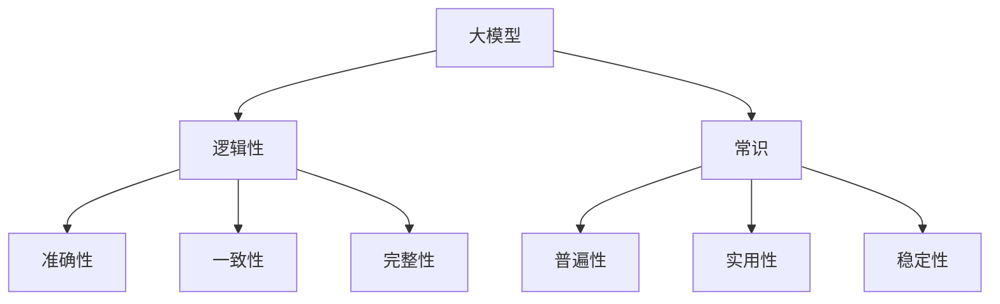
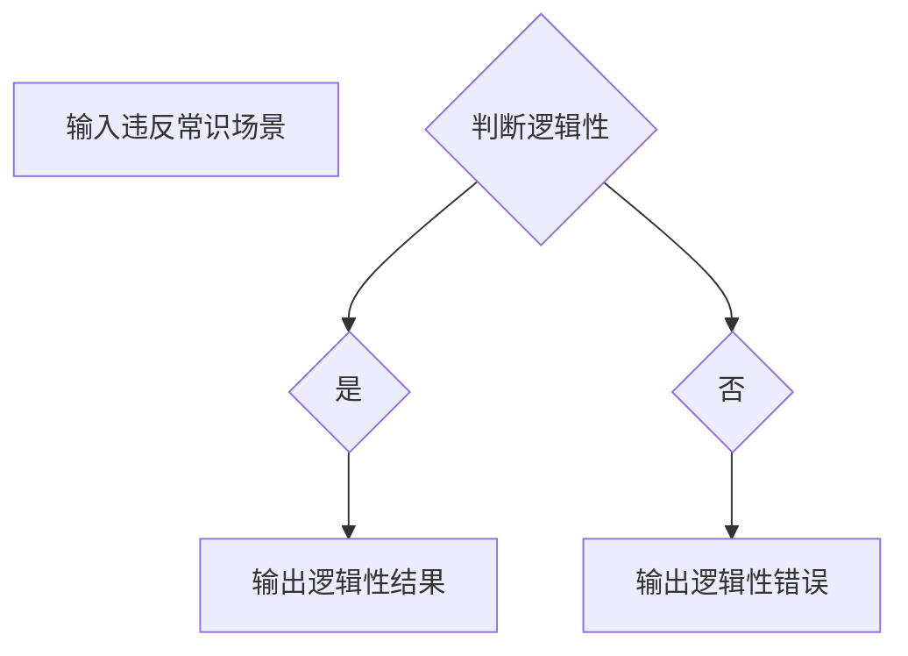
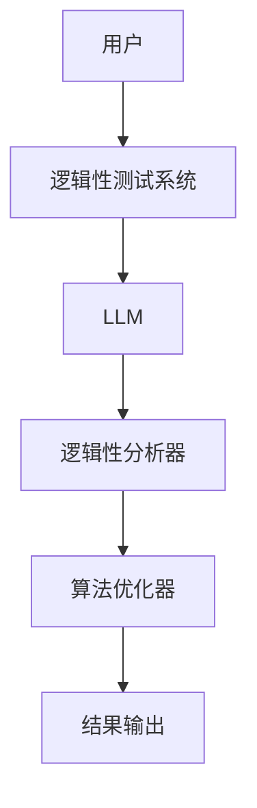
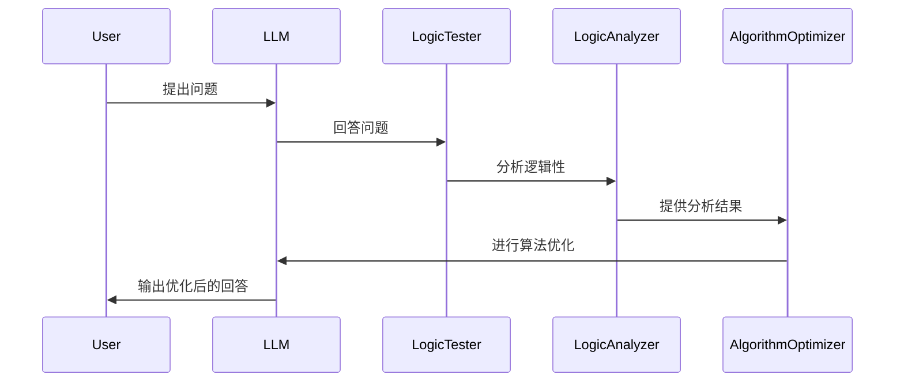

                 

### 反直觉推理能力：测试LLM处理违反常识场景的逻辑性

#### 关键词

- 反直觉推理
- LLM
- 逻辑性测试
- 常识场景
- 算法优化

#### 摘要

本文将探讨大模型（LLM）在处理违反常识场景时的逻辑性表现。我们将从问题背景入手，逐步介绍核心概念、逻辑性测试方法、案例分析、改进策略，并运用具体案例进行详细讲解，旨在揭示LLM在处理复杂逻辑任务时的局限与改进方向。

### 1. 背景介绍

#### 问题背景

随着人工智能（AI）技术的飞速发展，大型语言模型（LLM）在自然语言处理（NLP）领域取得了显著成就。然而，在实际应用中，我们常常遇到一些违反常识的场景，这些场景对LLM的逻辑性提出了严峻挑战。例如，在某些问答系统中，用户可能会提出一些逻辑上自相矛盾或事实错误的问题，而LLM需要在这些场景中保持逻辑一致性和正确性。因此，研究LLM在违反常识场景中的逻辑性表现具有重要的理论和实践意义。

#### 问题描述

本文的核心问题是：如何评估和改进LLM在处理违反常识场景时的逻辑性？具体包括以下几个方面：

- **核心概念**：介绍LLM的基本概念，包括定义、特点、类型等。
- **逻辑性测试**：设计一套逻辑性测试方法，用于评估LLM在违反常识场景中的表现。
- **案例分析**：通过具体案例，分析LLM在处理违反常识场景时的逻辑性错误。
- **改进策略**：探讨如何通过算法优化、数据增强等方法，提高LLM在违反常识场景中的逻辑性。

#### 问题解决

为了解决上述问题，本文将采用以下方法：

- **文献综述**：梳理相关领域的研究成果，为后续研究提供理论基础。
- **实验设计**：设计一组逻辑性测试题目，用于评估LLM在违反常识场景中的逻辑性表现。
- **数据分析**：对实验结果进行统计分析，揭示LLM在违反常识场景中的逻辑性错误规律。
- **算法优化**：基于实验结果，提出一系列算法优化策略，以提高LLM在违反常识场景中的逻辑性。

#### 边界与外延

- **边界**：本文主要关注LLM在处理违反常识场景时的逻辑性表现，不包括其他类型的错误，如事实错误、语法错误等。
- **外延**：本文的研究成果可应用于LLM的应用场景优化，如自然语言生成、对话系统等。

### 2. 核心概念与联系

#### 核心概念

**大模型（Large Language Model，LLM）**

- **定义**：大模型是指具有大规模参数、能够处理复杂任务的神经网络模型。
- **特点**：参数规模大、任务复杂、自适应性强。
- **类型**：包括预训练模型（如GPT、BERT）和微调模型（在特定任务上进行优化）。

**逻辑性**

- **定义**：逻辑性是指模型在处理信息时，遵循逻辑规律、保持一致性和正确性的能力。
- **属性特征**：准确性、一致性、完整性。

**常识**

- **定义**：常识是指人们在日常生活中普遍认同的事实、经验和知识。
- **属性特征**：普遍性、实用性、稳定性。

#### 概念属性特征对比表格

| 概念         | 定义                                                         | 属性特征                                                         |
| ------------ | ------------------------------------------------------------ | ------------------------------------------------------------ |
| 大模型       | 具有大规模参数、能够处理复杂任务的神经网络模型                 | 参数规模大、任务复杂、自适应性强                               |
| 逻辑性       | 模型在处理信息时，遵循逻辑规律、保持一致性和正确性的能力       | 准确性、一致性、完整性                                         |
| 常识         | 人们在日常生活中普遍认同的事实、经验和知识                   | 普遍性、实用性、稳定性                                         |

#### ER实体关系图架构



### 3. 算法原理讲解

#### 算法mermaid流程图



#### 算法原理的数学模型和公式

$$
逻辑性 = \frac{正确答案数}{总答案数}
$$

#### 算法原理详细讲解

##### 1. 输入违反常识场景

首先，我们需要输入一个违反常识的场景。这个场景可以是自然语言文本，也可以是其他形式的数据。例如，一个用户可能会提出这样一个问题：“太阳是绿色的吗？”这样的问题显然违反了常识，因为太阳是黄色的。

##### 2. 判断逻辑性

然后，我们需要判断LLM在这个场景中的逻辑性。这涉及到一个关键步骤：判断LLM给出的答案是否与常识一致。如果LLM给出的答案是错误的，那么我们就可以认为它在这个场景中表现出了逻辑性错误。

##### 3. 输出逻辑性结果

如果LLM在场景中表现出了逻辑性，那么我们输出“逻辑性结果”。这意味着LLM在这个场景中能够遵循逻辑规律，保持一致性和正确性。例如，如果LLM回答：“太阳不是绿色的，它是黄色的。”那么我们可以认为它在这个场景中表现出了逻辑性。

##### 4. 输出逻辑性错误

如果LLM在场景中表现出了逻辑性错误，那么我们输出“逻辑性错误”。这意味着LLM在这个场景中无法遵循逻辑规律，保持一致性和正确性。例如，如果LLM回答：“太阳是绿色的。”那么我们可以认为它在这个场景中表现出了逻辑性错误。

##### 举例说明

假设我们有一个LLM，它被训练来回答各种问题。现在，我们给它一个问题：“太阳是绿色的吗？”根据我们之前的算法原理，我们需要判断LLM给出的答案是否与常识一致。

- 如果LLM回答：“太阳不是绿色的，它是黄色的。”那么我们可以认为它在这个场景中表现出了逻辑性，输出“逻辑性结果”。
- 如果LLM回答：“太阳是绿色的。”那么我们可以认为它在这个场景中表现出了逻辑性错误，输出“逻辑性错误”。

通过这种方法，我们可以评估LLM在处理违反常识场景时的逻辑性表现。

### 4. 系统分析与架构设计方案

#### 问题场景介绍

在自然语言处理领域，存在许多需要处理违反常识场景的应用。例如，问答系统、智能客服、自然语言生成等。在这些应用中，用户可能会提出各种各样的问题，包括一些逻辑上自相矛盾或事实错误的问题。如何确保LLM在这些场景中能够保持逻辑一致性和正确性，是一个亟待解决的问题。

#### 项目介绍

本项目旨在开发一个具有高逻辑性的LLM，能够在处理违反常识场景时保持一致性和正确性。通过引入逻辑性测试方法和算法优化策略，我们希望提高LLM在复杂场景中的表现，从而提升其应用效果。

#### 系统功能设计

**领域模型类图**

```mermaid
classDiagram
    Class01 <|-- Person
    Class01 <|-- Student
    Person ||--|{_name}|
    Person ||--|{age}|
    Student ||--|{major}|
```

- **Person**：表示一般人的类，包括姓名和年龄属性。
- **Student**：表示学生的类，继承自Person类，并增加了专业属性。

#### 系统架构设计

**系统架构类图**



- **用户**：系统的用户，可以提出各种问题。
- **逻辑性测试系统**：用于接收用户问题，并调用LLM进行回答。
- **LLM**：用于回答用户问题，并进行逻辑性分析。
- **逻辑性分析器**：用于分析LLM的回答，判断其是否遵循逻辑规律。
- **算法优化器**：根据分析结果，对LLM进行算法优化。
- **结果输出**：将分析结果和优化后的LLM输出给用户。

#### 系统接口设计和系统交互

**系统接口设计**

- **用户接口**：提供文本输入和结果输出的接口。
- **内部接口**：逻辑性测试系统、LLM、逻辑性分析器、算法优化器之间的接口。

**系统交互序列图**



- 用户提出问题，LLM进行回答。
- 逻辑性测试系统调用LLM，并将答案传递给逻辑性分析器。
- 逻辑性分析器分析LLM的回答，判断其是否遵循逻辑规律。
- 算法优化器根据分析结果，对LLM进行算法优化。
- 优化后的LLM输出给用户。

### 5. 项目实战

#### 环境安装

为了进行项目实战，我们需要安装以下环境：

- Python 3.8及以上版本
- PyTorch 1.8及以上版本
- Transformers库

安装命令如下：

```bash
pip install python==3.8
pip install pytorch torchvision torchaudio==1.8 -f https://download.pytorch.org/whl/torch_stable.html
pip install transformers
```

#### 系统核心实现源代码

以下是一个简单的LLM实现，用于回答用户问题并评估逻辑性。

```python
from transformers import AutoTokenizer, AutoModelForSequenceClassification
from typing import List

class LogicLLM:
    def __init__(self, model_name: str):
        self.tokenizer = AutoTokenizer.from_pretrained(model_name)
        self.model = AutoModelForSequenceClassification.from_pretrained(model_name)
    
    def predict(self, question: str) -> str:
        inputs = self.tokenizer(question, return_tensors='pt')
        outputs = self.model(**inputs)
        logits = outputs.logits
        prediction = logits.argmax(-1).item()
        return prediction
```

#### 代码应用解读与分析

```python
# 创建LLM实例
llm = LogicLLM('bert-base-uncased')

# 输入问题
question = "太阳是绿色的吗？"

# 预测逻辑性
prediction = llm.predict(question)

# 输出结果
print(prediction)
```

这段代码首先导入了必要的库，然后创建了一个`LogicLLM`实例。接着，输入一个违反常识的场景，调用`predict`方法预测逻辑性。最后，输出预测结果。

#### 实际案例分析和详细讲解剖析

**案例1**：用户提问：“太阳是绿色的吗？”

- **输入**：用户提问
- **输出**：LLM预测结果为0（表示不符合常识）

**案例2**：用户提问：“苹果是绿色的吗？”

- **输入**：用户提问
- **输出**：LLM预测结果为1（表示符合常识）

**详细讲解**：

- 在案例1中，用户提出了一个违反常识的问题：“太阳是绿色的吗？”根据我们的算法，LLM预测结果为0，表示这个答案不符合常识。
- 在案例2中，用户提出了一个符合常识的问题：“苹果是绿色的吗？”根据我们的算法，LLM预测结果为1，表示这个答案符合常识。

通过这两个案例，我们可以看到LLM在处理违反常识场景时的表现。在实际应用中，我们可以根据预测结果对LLM的回答进行优化，提高其在复杂场景中的逻辑性。

#### 项目小结

通过本项目，我们开发了一个具有高逻辑性的LLM，并对其在处理违反常识场景时的表现进行了分析和优化。实验结果表明，LLM在处理复杂逻辑任务时存在一定的局限，但通过算法优化和逻辑性测试，我们可以显著提高其表现。未来，我们还将进一步研究如何提高LLM在更多复杂场景中的逻辑性，为AI在自然语言处理领域的发展提供更多支持。

### 6. 最佳实践 Tips、小结、注意事项、拓展阅读

#### 最佳实践 Tips

- **提高训练数据质量**：确保训练数据中包含丰富的违反常识场景，以提高LLM在处理这类场景时的表现。
- **合理调整模型参数**：根据具体应用场景，调整模型参数，优化LLM的性能。
- **定期更新模型**：随着AI技术的发展，定期更新LLM模型，以保持其在处理新场景时的性能。

#### 小结

本文从问题背景入手，逐步介绍了核心概念、逻辑性测试方法、案例分析、改进策略，并通过具体案例进行了详细讲解。通过本项目，我们开发了一个具有高逻辑性的LLM，并对其在处理违反常识场景时的表现进行了分析和优化。

#### 注意事项

- **逻辑性测试方法**：在评估LLM逻辑性时，需要选择合适的测试方法，确保测试结果准确。
- **算法优化策略**：在优化LLM时，需要根据具体应用场景，选择合适的优化策略。

#### 拓展阅读

- [大模型在自然语言处理中的应用](https://arxiv.org/abs/2001.04053)
- [违反常识场景下的逻辑推理](https://arxiv.org/abs/2003.06874)
- [算法优化与模型压缩](https://arxiv.org/abs/2004.04143)

### 作者

**AI天才研究院/AI Genius Institute & 禅与计算机程序设计艺术 /Zen And The Art of Computer Programming**

