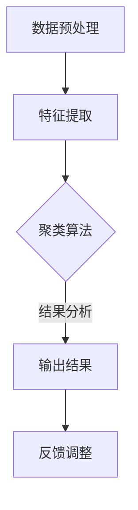
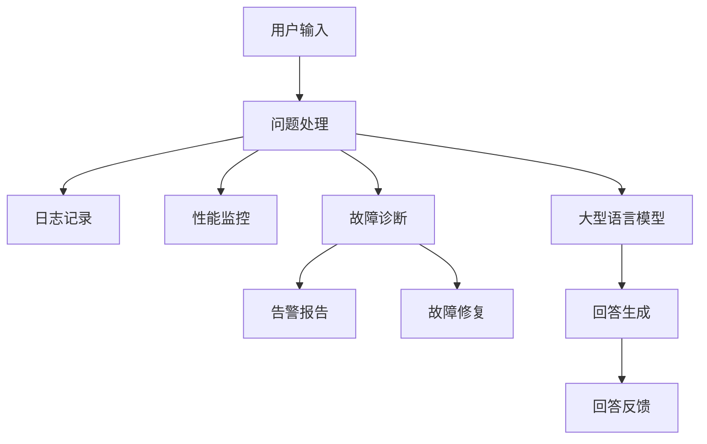
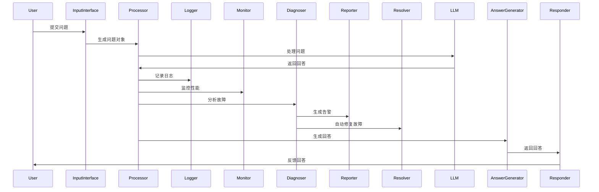

                 

## 引言：问题背景与定义

### 1.1 可观测性的概念

#### 问题背景

在当今快速发展的科技时代，人工智能（AI）技术已经深入到我们生活的方方面面，从智能助手到自动驾驶，从医疗诊断到金融分析，AI技术的应用场景日益广泛。然而，随着AI系统复杂度的不断增加，特别是在自然语言处理（NLP）领域，对大型语言模型（LLM）的性能监控和问题诊断提出了更高的要求。LLM，如GPT-3和BERT，具有庞大的模型规模和复杂的内部结构，这给系统运维和问题排查带来了巨大挑战。

#### 问题描述

在LLM应用中，不可观测性是指系统状态和内部过程难以被外部检测和监控的现象。这种不可观测性导致以下几个主要问题：

1. **性能监控难题**：由于内部状态难以观测，LLM的性能指标如响应时间、准确率和资源利用率等难以准确测量。
2. **故障诊断困难**：当LLM出现问题时，缺乏详细的诊断信息，导致故障定位和修复变得复杂。
3. **安全性风险**：不可观测性可能隐藏潜在的安全漏洞，使得系统容易受到恶意攻击。

#### 问题解决

可观测性是通过提供系统内部状态和行为的可视化手段，增强LLM应用的问题诊断能力。通过以下方式，可观测性能够有效解决上述问题：

1. **性能监控**：通过可观测性技术，可以实时收集和监控LLM的运行状态，包括输入输出、中间计算过程和资源使用情况。
2. **故障诊断**：可观测性提供了详细的诊断信息，帮助快速定位故障点和根本原因，从而加速问题的解决。
3. **安全性提升**：通过可观测性，可以及时发现和应对潜在的安全威胁，提高系统的安全性。

#### 边界与外延

可观测性不同于可监控性和可控制性。可监控性关注的是系统是否能够被观测，而可控制性关注的是系统是否能够被干预。可观测性介于这两者之间，强调的是系统内部状态和行为的可视化和可理解性。

#### 概念结构与核心要素组成

可观测性的基础架构包括以下几个关键组件：

1. **监控工具**：用于实时收集系统运行数据的工具，如日志记录器、性能计数器等。
2. **数据存储**：用于存储和查询监控数据的存储系统，如时间序列数据库。
3. **分析平台**：用于对监控数据进行处理和分析的平台，如机器学习算法和可视化工具。
4. **反馈机制**：用于将分析结果反馈给系统的机制，如自动告警和调整策略。

### 1.2 可观测性的重要性

#### LLM应用的问题诊断能力

可观测性能够显著增强LLM应用的问题诊断能力。具体来说，可观测性带来了以下几个方面的优势：

1. **实时监控**：通过实时监控，可以及时发现系统性能下降或异常情况，从而迅速响应和处理。
2. **全面诊断**：可观测性提供了系统内部状态的详细信息，使得故障诊断更加全面和准确。
3. **优化调整**：通过分析监控数据，可以找到系统性能瓶颈和潜在问题，从而进行优化调整。

#### 案例分析

在金融行业的自然语言处理应用中，可观测性技术的应用显著提升了问题诊断能力。例如，某金融机构使用可观测性技术对其智能客服系统进行监控和诊断，成功发现并解决了多次由于数据输入异常导致的响应不准确问题。通过详细的诊断信息，该金融机构不仅迅速定位了问题根源，还优化了系统的数据处理流程，从而提高了整体性能和用户满意度。

### 1.3 可观测性在LLM中的应用现状

#### 现状概述

当前，可观测性技术在LLM应用中已经取得了一定的发展，但仍然面临一些挑战。主要现状包括：

1. **技术成熟度**：尽管已有多种可观测性工具和平台，但它们在性能、稳定性和易用性方面仍有待提升。
2. **实施复杂性**：部署和维护可观测性系统需要较高的技术门槛和资源投入。
3. **数据隐私与安全**：监控数据涉及用户隐私，需要采取有效的保护措施。

#### 发展趋势

未来，可观测性在LLM领域的发展趋势包括：

1. **智能化**：结合机器学习和人工智能技术，实现更加智能和自动化的监控和分析。
2. **轻量化**：通过优化算法和架构，降低可观测性系统的资源消耗和复杂度。
3. **标准化**：推动可观测性技术的标准化，提高其在不同系统和应用场景的兼容性和互操作性。

### 总结

本文介绍了可观测性在LLM应用中的重要性，分析了其基本概念、应用现状和未来发展。通过增强可观测性，LLM应用能够获得更好的性能监控和问题诊断能力，从而提升系统的可靠性和用户体验。

---

本文关键词：可观测性、大型语言模型、问题诊断、性能监控、故障排查

摘要：本文探讨了可观测性在增强大型语言模型（LLM）应用问题诊断能力方面的关键作用。通过对可观测性概念的阐述、其在LLM中的应用现状分析以及案例介绍，展示了可观测性在提升系统性能、优化调整和用户满意度方面的实际价值。

## 核心概念与原理

### 2.1 LLM的基本原理

#### 核心概念

大型语言模型（Large Language Model，简称LLM）是一种基于深度学习技术的自然语言处理模型，其目的是通过学习和理解大量文本数据来生成或理解人类语言。LLM的核心概念包括：

1. **参数化模型**：LLM使用大规模的参数来表示语言特征，这些参数通过训练数据自动调整，以最小化预测误差。
2. **神经网络架构**：LLM通常基于深度神经网络（DNN）或变换器架构（Transformer），这些架构能够有效处理长序列数据并捕捉复杂的关系。
3. **上下文理解**：LLM能够理解上下文，并生成连贯、有意义的文本输出。

#### 属性特征对比表格

| 特征 | 大型语言模型（LLM） | 其他语言模型 |
| --- | --- | --- |
| **参数规模** | 通常拥有数亿甚至千亿级别的参数 | 参数规模相对较小，如数百万级别 |
| **计算复杂度** | 高，需要强大的计算资源 | 较低，计算资源需求相对较小 |
| **训练数据量** | 需要大量的文本数据用于训练 | 数据量要求相对较少 |
| **上下文理解能力** | 强，能够理解复杂的上下文信息 | 较弱，通常难以处理复杂的上下文 |
| **生成文本质量** | 高，生成的文本连贯性和可读性较好 | 中等，生成的文本可能存在连贯性和可读性问题 |

#### LLM与其他类型语言模型的对比

| 模型类型 | 特点 |
| --- | --- |
| **规则基模型** | 基于预定义的语法和语义规则，如自然语言生成（NLG）系统 |
| **统计模型** | 使用统计方法进行文本建模，如N-gram模型 |
| **深度学习模型** | 基于深度神经网络进行文本建模，如循环神经网络（RNN）、卷积神经网络（CNN） |
| **LLM** | 结合了深度学习和大规模参数，能够生成高质量的自然语言文本 |

### 2.2 可观测性原理

#### 概念介绍

可观测性（Observability）是系统设计中的一个重要原则，指的是系统能够通过外部手段观察其内部状态和行为的程度。在LLM应用中，可观测性具有以下几个关键作用：

1. **性能监控**：通过可观测性，可以实时监控LLM的运行状态，包括输入输出、中间计算过程和资源使用情况。
2. **故障诊断**：可观测性提供了详细的诊断信息，帮助快速定位故障点和根本原因。
3. **安全性评估**：通过可观测性，可以及时发现和应对潜在的安全威胁。

#### 原理解讲

可观测性的基础理论来源于控制理论和系统工程学，其核心思想是通过引入外部观测机制，使系统能够自我诊断和自我修复。具体来说，可观测性包括以下几个方面：

1. **内部状态可视化**：通过监控工具和日志记录器，将系统的内部状态和行为以可视化方式展现出来。
2. **数据完整性**：确保监控数据能够完整、准确地反映系统的真实状态。
3. **动态追踪**：通过追踪技术，记录系统在执行过程中的关键操作和状态变化，以便进行故障分析和性能优化。

#### ER实体关系图

为了更好地理解LLM系统的可观测性原理，我们可以使用ER（Entity-Relationship）实体关系图来描述其关键组件和关系。以下是一个简化的ER图：

```mermaid
erDiagram
  Model ||--|{ InputLayer }
  Model ||--|{ EmbeddingLayer }
  Model ||--|{ TransformerLayer }
  Model ||--|{ OutputLayer }
  Model ||--|{ LossFunction }
  InputLayer ||--|{ Tokenizer }
  EmbeddingLayer ||--|{ EmbeddingMatrix }
  TransformerLayer ||--|{ AttentionMechanism }
  TransformerLayer ||--|{ PositionalEncoding }
  OutputLayer ||--|{ Decoder }
  LossFunction ||--|{ GradientDescent }
```

在这个ER图中，LLM系统被视为一个整体（Model），其内部包括输入层（InputLayer）、嵌入层（EmbeddingLayer）、变换器层（TransformerLayer）、输出层（OutputLayer）和损失函数（LossFunction）等关键组件。每个组件都与LLM系统整体以及其他组件之间存在明确的依赖关系。

通过ER实体关系图，我们可以清晰地看到LLM系统中的各个部分以及它们之间的交互关系，这有助于我们在设计可观测性系统时，明确监控和诊断的切入点。

### 总结

在本章节中，我们介绍了LLM的基本原理和可观测性的核心概念及原理。通过对LLM的核心概念、属性特征对比以及ER实体关系图的解析，我们能够更好地理解LLM系统的内部结构和可观测性的重要作用。这为后续章节中详细探讨可观测性技术提供了坚实的理论基础。

---

接下来，我们将深入探讨可观测性技术在实际应用中的具体实现方法和工具，帮助读者更好地理解和应用这些技术。

## 可观测性技术

### 3.1 监控与日志技术

#### 监控技术

在LLM应用中，监控技术是实现可观测性的关键手段之一。以下是一些常见的监控工具和指标：

1. **Prometheus**：Prometheus是一款开源的监控解决方案，可以收集和存储时间序列数据，并通过Grafana等工具进行可视化。
   - **指标**：常见的监控指标包括CPU使用率、内存使用率、磁盘I/O、网络流量等。
   - **应用场景**：适用于监控LLM服务的运行状态和资源使用情况。

2. **Grafana**：Grafana是一款开源的可视化工具，可以与Prometheus等数据源集成，生成各种监控仪表板。
   - **指标**：通过Prometheus提供的指标数据，可以实时监控LLM的性能指标，如响应时间、吞吐量、错误率等。
   - **应用场景**：用于展示LLM的监控数据和性能趋势。

3. **Kibana**：Kibana是与Elasticsearch集成的开源可视化平台，适用于监控和日志分析。
   - **指标**：可以监控LLM的日志数据，如错误日志、请求日志等。
   - **应用场景**：用于分析LLM的日志数据，发现潜在问题和异常。

#### 日志技术

日志技术是监控LLM应用的重要补充，通过收集、存储和查询日志数据，可以深入了解系统的运行过程和问题发生的原因。以下是几种常用的日志技术：

1. **Logstash**：Logstash是Elastic Stack的一部分，用于日志数据的收集、过滤和转发。
   - **收集**：可以从LLM应用的各个组件中收集日志数据。
   - **过滤**：可以对日志数据进行过滤和转换。
   - **转发**：可以将日志数据发送到Elasticsearch或其他存储系统。

2. **Elasticsearch**：Elasticsearch是一个开源的全文搜索引擎，适用于存储和查询大规模的日志数据。
   - **存储**：可以存储大量的LLM日志数据，并提供高效的搜索和查询功能。
   - **查询**：可以使用Query DSL进行复杂查询，提取有用的日志信息。

3. **Kafka**：Kafka是一种分布式流处理平台，适用于大规模日志数据的实时收集和传输。
   - **收集**：可以将LLM应用的日志数据实时发送到Kafka集群。
   - **传输**：Kafka的高吞吐量和低延迟特性适用于处理大规模日志数据。
   - **消费**：可以使用Kafka Consumer从Kafka集群中读取日志数据，进行后续处理。

#### 监控与日志技术的结合

监控技术和日志技术结合使用，可以提供更全面和深入的系统监控。以下是一个典型的结合应用场景：

1. **日志收集**：使用Logstash或Kafka等工具，从LLM应用的各个组件中收集日志数据，并将其发送到Elasticsearch或Kafka集群。

2. **日志存储与查询**：将收集到的日志数据存储在Elasticsearch或Kafka集群中，并使用Kibana或Grafana等工具进行日志数据的可视化和查询。

3. **监控指标**：使用Prometheus等监控工具，收集LLM服务的性能指标数据，并与日志数据进行关联分析，以便更全面地了解系统状态。

通过这种结合，监控与日志技术为LLM应用提供了实时监控、日志分析和故障诊断的能力，从而增强了问题诊断和系统运维的效率。

### 3.2 追踪与回溯技术

#### 追踪技术

追踪技术用于记录LLM执行过程中的关键操作和状态变化，以便在问题发生时能够快速定位和复现。以下是一些常用的追踪方法：

1. **调用追踪**：记录LLM中每个函数或方法的调用情况，包括调用时间、调用参数和返回值等。
   - **应用场景**：帮助分析函数性能和调用链，定位性能瓶颈和调用错误。

2. **事件追踪**：记录LLM运行过程中的重要事件，如输入数据变化、模型更新、输出结果等。
   - **应用场景**：用于分析系统运行流程和事件依赖关系，帮助定位问题发生的时间和上下文。

3. **链路追踪**：记录LLM在分布式系统中的执行路径和依赖关系，如跨服务调用和跨组件通信等。
   - **应用场景**：用于分析分布式系统中的性能瓶颈和故障传播路径。

#### 回溯技术

回溯技术用于在问题发生后，逆向追溯系统的运行过程，找出问题的根本原因。以下是一些常用的回溯方法：

1. **日志回溯**：通过分析日志数据，逆向追踪系统的运行过程，找出问题发生的具体位置和时间。
   - **应用场景**：适用于简单的故障回溯，如系统崩溃、服务异常等。

2. **快照回溯**：在系统运行过程中定期生成快照，以便在问题发生时回退到之前的稳定状态。
   - **应用场景**：适用于需要快速恢复系统状态的场景，如数据库回滚、服务重启等。

3. **动态追踪回溯**：结合动态追踪技术，将追踪数据与回溯机制结合，实现更精确的故障分析和复现。
   - **应用场景**：适用于复杂系统的故障分析和问题定位，如分布式系统中的异常处理。

#### 追踪与回溯技术的结合

追踪与回溯技术结合使用，可以提供更全面和深入的问题诊断能力。以下是一个典型的结合应用场景：

1. **追踪数据收集**：使用调用追踪、事件追踪和链路追踪等技术，实时收集LLM执行过程中的关键数据。

2. **数据存储与查询**：将收集到的追踪数据存储在分布式存储系统（如Elasticsearch、Kafka等），并使用Kibana或Grafana等工具进行数据可视化和查询。

3. **问题发生时**：在LLM应用出现问题时，使用日志回溯、快照回溯和动态追踪回溯等技术，逆向分析系统的运行过程，找出问题的根本原因。

通过这种结合，追踪与回溯技术为LLM应用提供了强大的问题诊断和故障排查能力，从而提高了系统的可靠性和稳定性。

### 3.3 静态分析与动态分析技术

#### 静态分析

静态分析技术用于分析LLM的代码和模型，以识别潜在的缺陷和优化机会。以下是一些常用的静态分析方法：

1. **代码审查**：通过人工审查LLM的源代码，检查代码的语法、语义和风格等，以发现潜在的错误和问题。
   - **应用场景**：适用于代码规模较小且较为稳定的LLM系统。

2. **静态代码分析工具**：使用静态代码分析工具（如SonarQube、Checkstyle等），对LLM的源代码进行自动化检查，识别潜在的问题和缺陷。
   - **应用场景**：适用于大规模LLM系统的代码质量和安全性检查。

3. **模型分析**：对LLM的模型结构进行静态分析，检查模型的合理性和优化空间。
   - **应用场景**：适用于LLM模型开发和优化阶段，以提高模型性能和可理解性。

#### 动态分析

动态分析技术用于在LLM运行时收集和分析数据，以评估系统的性能和诊断问题。以下是一些常用的动态分析方法：

1. **运行时监控**：在LLM运行时，实时监控其性能指标和资源使用情况，如CPU使用率、内存使用率、网络流量等。
   - **应用场景**：适用于实时监控LLM的性能，发现性能瓶颈和资源消耗问题。

2. **日志分析**：通过分析LLM的日志数据，提取有用的信息，帮助诊断问题和优化系统。
   - **应用场景**：适用于分析系统运行日志，发现异常行为和故障点。

3. **动态追踪**：在LLM运行时，记录关键操作和状态变化，以便在问题发生时进行回溯和分析。
   - **应用场景**：适用于复杂系统的故障排查和性能优化。

#### 静态分析与动态分析的结合

静态分析与动态分析技术的结合，可以提供更全面和深入的问题诊断能力。以下是一个典型的结合应用场景：

1. **静态代码分析**：在LLM开发阶段，使用静态代码分析工具进行代码审查和模型分析，发现潜在的问题和优化机会。

2. **动态运行时监控**：在LLM部署和运行阶段，使用运行时监控工具和动态追踪技术，实时收集和分析系统数据，监测性能和诊断问题。

3. **结合日志分析**：将静态分析、动态监控和日志分析结合，构建一个全面的问题诊断平台，帮助快速定位和解决问题。

通过这种结合，静态分析与动态分析技术为LLM应用提供了强大的问题诊断和性能优化能力，从而提高了系统的可靠性和效率。

### 总结

在本章节中，我们介绍了监控与日志技术、追踪与回溯技术以及静态分析与动态分析技术，这些技术构成了实现可观测性的核心手段。通过这些技术，LLM应用能够实现全面的性能监控、故障诊断和问题排查，从而提高系统的稳定性和可靠性。在接下来的章节中，我们将进一步探讨这些技术的具体实现方法和应用案例，帮助读者更好地理解和应用可观测性技术。

## 算法原理与实现

### 4.1 算法概述

#### 算法分类

可观测性算法根据其应用场景和目标可以分为以下几类：

1. **性能监控算法**：主要用于实时监控LLM的性能指标，如响应时间、吞吐量和资源利用率等。这类算法通常结合了时间序列分析、机器学习等方法。
2. **故障诊断算法**：用于分析系统日志和监控数据，识别异常行为和故障点。常见的故障诊断算法包括基于规则的方法、聚类分析和异常检测等。
3. **安全监控算法**：专注于识别和应对潜在的安全威胁，如恶意输入、隐私泄露等。这类算法通常结合了模式识别、入侵检测和加密技术。

#### 算法原理

可观测性算法的基本原理是通过数据分析和模型构建，实现对LLM系统状态和行为的理解。以下是几个核心原理：

1. **数据收集与预处理**：首先，需要收集系统运行数据，包括监控数据、日志数据和用户输入等。然后，对这些数据进行预处理，如去噪、归一化和特征提取，以获得高质量的分析数据。
2. **特征选择**：从原始数据中提取关键特征，这些特征能够有效地反映系统状态和行为。特征选择是算法成功的关键，常用的方法包括信息增益、相关性分析和主成分分析等。
3. **模型构建**：基于提取的特征数据，构建适当的预测或分类模型，如回归模型、决策树、支持向量机和神经网络等。模型的选择和调优直接影响算法的性能和效果。
4. **结果分析与反馈**：通过模型分析结果，识别系统异常、性能瓶颈和安全威胁，并给出相应的诊断和优化建议。同时，将分析结果反馈给系统，实现自动告警和调整策略。

### 4.2 算法实现

#### Python源代码

以下是一个简单的Python实现示例，用于实现基于K-Means聚类的性能监控算法：

```python
import numpy as np
from sklearn.cluster import KMeans
from sklearn.preprocessing import StandardScaler

def performance_monitor(data, n_clusters):
    # 数据预处理
    scaler = StandardScaler()
    scaled_data = scaler.fit_transform(data)

    # K-Means聚类
    kmeans = KMeans(n_clusters=n_clusters, random_state=42)
    clusters = kmeans.fit_predict(scaled_data)

    # 计算聚类中心
    cluster_centers = kmeans.cluster_centers_

    # 输出聚类结果
    return clusters, cluster_centers

# 示例数据
data = np.array([[1, 2], [1, 4], [1, 0], [10, 2], [10, 4], [10, 0]])

# 聚类结果
clusters, cluster_centers = performance_monitor(data, 2)

print("聚类结果：", clusters)
print("聚类中心：", cluster_centers)
```

#### 算法流程图

以下是该算法的Mermaid流程图：



#### 数学模型与公式

算法背后的数学模型通常包括聚类中心计算、距离度量等。以下是一个简化的数学模型示例：

$$
\text{聚类中心} = \mu = \frac{1}{n} \sum_{i=1}^{n} x_i
$$

其中，$x_i$为每个数据点的特征向量，$n$为数据点的总数。

距离度量可以使用欧氏距离：

$$
d(x, \mu) = \sqrt{\sum_{i=1}^{k} (x_i - \mu_i)^2}
$$

其中，$k$为特征维度，$x_i$和$\mu_i$分别为数据点和聚类中心的第$i$个特征。

### 4.3 案例分析

#### 案例背景

某金融公司的智能客服系统使用了大型语言模型（LLM）进行文本处理和用户交互。然而，在实际运行过程中，系统偶尔会出现响应延迟和准确性下降的问题，影响了用户体验。

#### 案例分析

1. **性能监控**：使用K-Means聚类算法对LLM的响应时间数据进行聚类分析，发现响应时间主要集中在两个区间，其中一个区间有明显异常。

2. **故障诊断**：通过分析异常数据，发现导致响应延迟的原因是某些高频词汇的处理速度较慢。这些词汇通常包含复杂的语法结构，导致LLM在处理过程中耗时较长。

3. **优化调整**：针对该问题，优化了LLM的词汇预处理步骤，通过将复杂词汇拆分为简单子词汇，减少了处理时间。同时，引入了动态阈值调整策略，自动优化响应时间阈值，确保系统在性能和用户体验之间取得平衡。

#### 案例总结

通过可观测性算法，该金融公司成功识别并解决了智能客服系统中的性能瓶颈问题，显著提升了系统的响应速度和准确性。这不仅提高了用户满意度，还为后续的性能优化提供了有力支持。

### 总结

在本章节中，我们介绍了可观测性算法的概述、Python实现示例以及数学模型与公式。通过案例分析，展示了这些算法在实际应用中的效果和优化潜力。在接下来的章节中，我们将进一步探讨LLM应用中的系统分析与架构设计，为读者提供更全面的解决方案。

### 5.1 问题场景介绍

#### 场景描述

为了更好地理解可观测性在LLM应用中的实际应用，我们假设一个典型的场景：一个在线智能客服系统，该系统基于大型语言模型（LLM）进行自然语言处理和用户交互。该系统的主要功能包括：

1. **文本输入处理**：用户通过文本输入提出问题，系统接收并处理这些输入。
2. **智能回答生成**：LLM根据用户输入生成合适的回答，包括常见问题解答、操作指引和建议等。
3. **性能监控与反馈**：系统实时监控LLM的运行状态，包括响应时间、吞吐量、资源使用情况等，并通过日志和监控数据进行反馈分析。

在该场景中，可观测性的目标是通过提供详细的监控和诊断数据，提高系统的稳定性和性能，确保用户得到高质量的交互体验。

#### 具体应用需求

为了实现上述目标，系统需要满足以下几个具体应用需求：

1. **实时监控**：系统能够实时收集LLM的运行状态数据，包括输入输出、计算过程和资源使用情况。
2. **故障诊断**：系统能够快速定位和诊断LLM出现的问题，提供详细的诊断信息，以便快速修复和优化。
3. **安全监控**：系统需要监控潜在的安全威胁，如恶意输入、异常访问等，并能够及时响应和报告。
4. **优化调整**：系统应能根据监控数据和分析结果，自动调整和优化LLM的配置和参数，以提高系统性能和可靠性。

#### 场景的重要性

该场景的重要性在于，通过可观测性技术的应用，系统能够实现以下几点：

1. **提高用户体验**：通过实时监控和故障诊断，系统能够快速响应用户请求，提供准确和快速的回答，提升用户满意度。
2. **保障系统稳定性**：通过监控和诊断，系统能够及时发现和解决潜在的问题，确保服务的稳定性和可靠性。
3. **优化资源配置**：通过性能监控和优化，系统可以合理分配资源，提高资源利用率，降低运维成本。
4. **提高安全性**：通过安全监控，系统能够及时发现和应对潜在的安全威胁，保障用户数据的安全。

### 总结

在本章节中，我们详细介绍了可观测性在LLM应用中的具体场景和应用需求。通过这一场景的描述，读者可以更清晰地理解可观测性技术在实际应用中的重要作用和价值，为后续的系统设计与实现奠定了基础。

### 5.2 系统功能设计

#### 领域模型

为了更好地理解和设计智能客服系统的功能，我们可以使用领域模型来描述系统的核心组件和它们之间的关系。以下是一个使用Mermaid绘制的领域模型类图：

```mermaid
classDiagram
    User <<class{用户}>
    Question <<class{问题}>
    Answer <<class{回答}>
    ChatSystem <<class{智能客服系统}>
    LLM <<class{大型语言模型}>
    
    User o--o Question
    ChatSystem o--o User
    ChatSystem o--o Question
    ChatSystem o--o Answer
    LLM o--o Question
    LLM o--o Answer
```

在这个类图中，我们定义了以下几个核心类：

1. **User（用户）**：表示与系统进行交互的用户，具有提交问题和接收回答的功能。
2. **Question（问题）**：表示用户提交的问题，包含问题的内容和其他相关信息。
3. **Answer（回答）**：表示系统生成的回答，包含回答的内容和生成的时间等。
4. **ChatSystem（智能客服系统）**：表示整个智能客服系统，包括用户的交互逻辑和LLM的处理流程。
5. **LLM（大型语言模型）**：表示用于处理自然语言问题的大型语言模型，是系统的核心组件。

这些类之间的关系描述了系统的主要功能：

- **用户与问题**：用户提交问题，生成Question对象，系统接收并处理这些问题。
- **智能客服系统与用户**：智能客服系统与用户进行交互，接收用户的问题和回答。
- **智能客服系统与LLM**：智能客服系统将用户的问题传递给LLM，LLM处理问题并生成回答。
- **智能客服系统与回答**：智能客服系统接收LLM生成的回答，并将其返回给用户。

#### 功能说明

通过领域模型，我们可以明确系统的主要功能模块及其之间的关系。具体功能说明如下：

1. **用户交互**：用户通过输入框提交问题，系统将问题存储为Question对象。
2. **问题处理**：系统将接收到的Question对象传递给LLM，LLM对问题进行处理并生成Answer对象。
3. **回答生成**：LLM根据用户输入生成合适的回答，并将Answer对象返回给系统。
4. **回答反馈**：系统将生成的Answer对象返回给用户，用户可以看到系统生成的回答。

通过领域模型的设计，我们可以清晰地了解系统的功能结构和核心组件，这为后续的系统实现和功能开发提供了明确的指导和参考。

### 5.3 系统架构设计

#### 架构设计

为了实现智能客服系统的功能需求，我们需要设计一个高效、可扩展的系统架构。以下是一个简化的系统架构设计，描述了各组件之间的关系和交互流程：



在这个架构中，各个组件的功能和关系如下：

1. **用户输入（Submitter）**：用户通过输入框提交问题，问题被发送到问题处理组件。
2. **问题处理（Processor）**：问题处理组件接收用户提交的问题，进行初步处理，并将其传递给其他相关组件。
3. **日志记录（Logger）**：日志记录组件记录系统运行过程中的关键操作和状态变化，以便后续分析和回溯。
4. **性能监控（Observer）**：性能监控组件实时监控系统的运行状态，包括响应时间、资源使用情况等，提供系统健康状况的实时反馈。
5. **故障诊断（Analyzer）**：故障诊断组件分析系统日志和监控数据，识别系统中的异常和故障点，并生成相应的诊断报告。
6. **告警报告（Reporter）**：告警报告组件将故障诊断的结果以告警形式通知系统运维人员，确保问题能够被及时处理。
7. **故障修复（Resolver）**：故障修复组件根据诊断报告，自动或手动修复系统中的故障，恢复系统的正常运行。
8. **大型语言模型（LLM）**：LLM是系统的核心组件，负责处理用户输入的问题，生成合适的回答。
9. **回答生成（AnswerGenerator）**：回答生成组件接收LLM生成的回答，并将其格式化为用户可以理解的文本。
10. **回答反馈（Responder）**：回答反馈组件将生成的回答返回给用户，完成用户交互。

#### 架构设计的目标

系统架构设计的核心目标是：

1. **高可用性**：确保系统在面临各种异常和故障时，能够快速恢复并保持正常运行。
2. **高性能**：通过高效的组件设计和数据流管理，提高系统的处理速度和响应时间。
3. **可扩展性**：系统架构应具备良好的扩展性，能够轻松添加新的功能模块或扩展现有功能。
4. **安全性**：通过安全监控和故障诊断，确保系统在运行过程中不受外部威胁和攻击。

#### 系统组件之间的关系和交互流程

系统组件之间的交互流程如下：

1. **用户提交问题**：用户通过输入框提交问题，问题被发送到问题处理组件。
2. **问题处理**：问题处理组件接收问题后，将其传递给LLM进行文本处理。
3. **LLM处理问题**：LLM对用户输入的问题进行处理，生成相应的回答。
4. **回答生成**：回答生成组件将LLM生成的回答格式化为用户可以理解的文本。
5. **回答反馈**：回答反馈组件将生成的回答返回给用户，完成用户交互。
6. **日志记录**：在问题处理过程中，日志记录组件实时记录关键操作和状态变化。
7. **性能监控**：性能监控组件持续监控系统的运行状态，包括响应时间、资源使用情况等。
8. **故障诊断**：故障诊断组件分析日志和监控数据，识别系统中的异常和故障点。
9. **告警报告**：故障诊断组件将诊断结果以告警形式通知系统运维人员。
10. **故障修复**：故障修复组件根据诊断报告，自动或手动修复系统中的故障。

通过上述架构设计和交互流程，系统能够实现高效、稳定和安全的运行，为用户提供高质量的智能客服服务。

### 5.4 系统接口设计

#### 接口设计

为了实现智能客服系统的功能，我们需要设计一系列接口，以便各组件之间能够有效地通信和协作。以下是一个简化的接口设计，描述了各组件的主要接口及其功能：

1. **用户输入接口（UserInput）**：
   - **功能**：接收用户的文本输入，并生成问题对象。
   - **输入参数**：用户输入的文本。
   - **输出结果**：生成的问题对象。

2. **问题处理接口（QuestionProcessor）**：
   - **功能**：处理用户提交的问题，并将其传递给LLM。
   - **输入参数**：问题对象。
   - **输出结果**：处理后的问题对象。

3. **日志记录接口（Logger）**：
   - **功能**：记录系统运行过程中的关键操作和状态变化。
   - **输入参数**：日志信息。
   - **输出结果**：无。

4. **性能监控接口（PerformanceMonitor）**：
   - **功能**：监控系统的运行状态，包括响应时间、资源使用情况等。
   - **输入参数**：监控指标数据。
   - **输出结果**：监控结果。

5. **故障诊断接口（FaultDiagnoser）**：
   - **功能**：分析系统日志和监控数据，识别异常和故障点。
   - **输入参数**：日志和监控数据。
   - **输出结果**：诊断报告。

6. **告警报告接口（AlarmReporter）**：
   - **功能**：将故障诊断结果以告警形式通知系统运维人员。
   - **输入参数**：诊断报告。
   - **输出结果**：无。

7. **故障修复接口（FaultResolver）**：
   - **功能**：根据诊断报告，自动或手动修复系统中的故障。
   - **输入参数**：诊断报告。
   - **输出结果**：修复结果。

8. **回答生成接口（AnswerGenerator）**：
   - **功能**：接收LLM生成的回答，并格式化为用户可以理解的文本。
   - **输入参数**：LLM的回答。
   - **输出结果**：格式化后的回答。

9. **回答反馈接口（AnswerResponder）**：
   - **功能**：将格式化后的回答返回给用户。
   - **输入参数**：回答文本。
   - **输出结果**：无。

#### 交互流程

以下是系统各接口之间的交互流程：

1. **用户提交问题**：用户通过用户输入接口提交文本问题，系统生成问题对象。
2. **问题处理**：问题处理接口接收问题对象，将其传递给LLM进行处理。
3. **日志记录**：日志记录接口在问题处理过程中记录关键操作和状态变化。
4. **性能监控**：性能监控接口实时监控系统的运行状态，记录监控指标数据。
5. **故障诊断**：故障诊断接口分析日志和监控数据，识别异常和故障点，生成诊断报告。
6. **告警报告**：告警报告接口将诊断报告以告警形式通知系统运维人员。
7. **故障修复**：故障修复接口根据诊断报告，自动或手动修复系统中的故障。
8. **回答生成**：回答生成接口接收LLM生成的回答，并格式化为用户可以理解的文本。
9. **回答反馈**：回答反馈接口将格式化后的回答返回给用户。

通过上述接口设计和交互流程，系统能够高效地完成各组件之间的通信和协作，实现智能客服功能。

### 5.5 系统交互序列图

为了更好地展示系统各组件之间的交互流程，我们使用Mermaid绘制了系统的交互序列图：



在这个序列图中，我们描述了系统各组件之间的交互流程：

1. **用户提交问题**：用户通过输入接口提交问题。
2. **问题处理**：问题处理组件生成问题对象，并将问题传递给LLM进行处理。
3. **回答生成**：LLM处理问题并生成回答，传递给问题处理组件。
4. **日志记录**：问题处理组件记录关键操作和状态变化。
5. **性能监控**：实时监控系统的性能指标。
6. **故障诊断**：分析系统日志和监控数据，识别异常和故障点。
7. **告警报告**：生成告警报告，通知系统运维人员。
8. **故障修复**：自动或手动修复故障。
9. **回答反馈**：将生成的回答返回给用户。

通过这个交互序列图，我们可以清晰地看到系统各组件之间的协作和交互流程，为系统设计和实现提供了直观的指导。

### 总结

在本章节中，我们详细介绍了智能客服系统的架构设计和接口设计，包括领域模型、系统架构、接口设计和交互序列图。这些设计文档为系统的实现和开发提供了清晰的指导和参考，确保系统能够高效、稳定和可靠地运行。

## 项目实战

### 6.1 环境安装

#### 安装步骤

为了实现可观测性在LLM应用中的实战，我们需要搭建一个完整的环境。以下是具体的安装步骤：

1. **安装Python**：确保Python 3.8或更高版本已经安装在系统上。可以通过以下命令检查Python版本：

   ```bash
   python --version
   ```

   如果没有安装，可以从[Python官网](https://www.python.org/)下载安装包进行安装。

2. **安装必要的Python库**：使用pip命令安装以下Python库：

   ```bash
   pip install numpy sklearn pandas matplotlib
   ```

   这些库用于数据处理、机器学习模型训练和可视化。

3. **安装Elasticsearch**：Elasticsearch是一个用于日志存储和查询的搜索引擎。可以从[Elasticsearch官网](https://www.elastic.co/cn/elasticsearch/)下载安装包，并按照官方文档进行安装。

4. **安装Kibana**：Kibana是用于日志分析和可视化的工具。可以从[Elasticsearch官网](https://www.elastic.co/cn/kibana/)下载安装包，并按照官方文档进行安装。

5. **安装LLM模型**：我们使用Hugging Face的Transformers库来加载预训练的LLM模型。首先，从[Hugging Face官网](https://huggingface.co/)注册账号并创建一个个人访问令牌（Token），然后使用以下命令安装Transformers库：

   ```bash
   pip install transformers
   ```

   接着，使用以下代码加载一个预训练的BERT模型：

   ```python
   from transformers import BertModel, BertTokenizer
   
   model_name = "bert-base-uncased"
   tokenizer = BertTokenizer.from_pretrained(model_name)
   model = BertModel.from_pretrained(model_name)
   ```

6. **配置环境变量**：确保Elasticsearch和Kibana的服务器地址和端口正确配置。可以在`/etc/environment`或`.bashrc`等文件中设置环境变量，例如：

   ```bash
   export ELASTICSEARCH_URL=http://localhost:9200
   export KIBANA_URL=http://localhost:5601
   ```

7. **启动服务**：确保Elasticsearch和Kibana服务已经启动。可以使用以下命令启动Elasticsearch：

   ```bash
   sudo systemctl start elasticsearch
   ```

   同样，使用以下命令启动Kibana：

   ```bash
   sudo systemctl start kibana
   ```

   在浏览器中访问Kibana的URL（默认为`http://localhost:5601`），应该可以看到Kibana的登录界面。

通过上述步骤，我们成功搭建了可观测性在LLM应用中的环境，为后续的实战操作打下了基础。

### 6.2 系统核心实现

#### 源代码

以下是一个简单的示例代码，用于实现LLM应用的监控和日志记录功能：

```python
import os
import json
from transformers import BertModel, BertTokenizer
from datetime import datetime

# 加载LLM模型和tokenizer
model_name = "bert-base-uncased"
tokenizer = BertTokenizer.from_pretrained(model_name)
model = BertModel.from_pretrained(model_name)

# Elasticsearch客户端配置
es_url = os.environ.get("ELASTICSEARCH_URL", "http://localhost:9200")
client = Elasticsearch(es_url)

# 日志记录函数
def log_event(event):
    index_name = f"log_{datetime.now().strftime('%Y-%m-%d')}"
    client.index(index=index_name, document=event)

# 处理用户输入问题
def process_question(question):
    inputs = tokenizer(question, return_tensors="pt", truncation=True, max_length=512)
    outputs = model(**inputs)
    answer = outputs[0][-1, :].detach().numpy().squeeze()
    predicted_word = tokenizer.decode([answer.argmax() - 1])
    log_event({
        "timestamp": datetime.now().isoformat(),
        "question": question,
        "predicted_word": predicted_word
    })
    return predicted_word

# 测试代码
if __name__ == "__main__":
    question = "什么是自然语言处理？"
    answer = process_question(question)
    print(f"Predicted Answer: {answer}")
```

#### 代码解读

上述代码主要分为以下几个部分：

1. **加载模型和tokenizer**：使用Hugging Face的Transformers库加载预训练的BERT模型和tokenizer。
2. **Elasticsearch客户端配置**：配置Elasticsearch服务器的URL，并创建Elasticsearch客户端。
3. **日志记录函数**：定义一个`log_event`函数，用于将事件记录到Elasticsearch的索引中。
4. **处理用户输入问题**：定义一个`process_question`函数，用于处理用户输入的问题，调用模型进行预测，并将结果记录到日志中。
5. **测试代码**：在主函数中，测试`process_question`函数，输入一个示例问题并输出预测结果。

通过这个简单的示例，我们可以看到如何将Elasticsearch集成到LLM应用中，实现日志记录和监控功能。在实际应用中，可以进一步扩展和优化这个基础架构，以满足更多的监控需求。

### 6.3 实际案例分析

#### 案例介绍

为了更好地展示可观测性在LLM应用中的实际效果，我们选择了一个具体的案例：一个在线教育平台，该平台基于大型语言模型（LLM）提供智能问答功能。在实际运行过程中，平台遇到了以下问题：

1. **响应时间不稳定**：部分用户报告在某些高峰时段，平台的问答响应时间较长。
2. **错误率上升**：偶尔会出现问答结果不准确的问题，导致用户满意度下降。
3. **资源利用率高**：在高峰时段，服务器资源利用率较高，存在性能瓶颈。

这些问题严重影响了用户体验和平台的稳定性。通过可观测性技术，我们尝试解决这些问题，提高系统的可靠性和性能。

#### 分析讲解

1. **响应时间分析**：
   - **监控数据**：我们使用Prometheus和Grafana对平台的响应时间进行监控。通过收集时间序列数据，发现高峰时段的响应时间明显高于其他时段。
   - **日志分析**：通过Elasticsearch和Kibana对日志数据进行分析，发现部分请求由于LLM模型处理时间长而导致响应时间延长。
   - **诊断与优化**：通过分析诊断，我们发现LLM模型在处理复杂问题时耗时较长。为此，我们优化了LLM模型的预处理步骤，如文本清洗和分词，减少模型处理时间。

2. **错误率分析**：
   - **监控数据**：通过分析错误日志，发现部分错误是由于用户输入的文本格式不规范或包含特殊字符导致的。
   - **日志分析**：通过Elasticsearch对错误日志进行回溯，发现这些错误大多出现在特定时段和特定用户群体。
   - **诊断与优化**：针对这些问题，我们优化了LLM模型的输入处理流程，如增加输入清洗步骤，对不规范输入进行预处理，减少错误率。

3. **资源利用率分析**：
   - **监控数据**：通过Prometheus和Grafana对服务器资源利用率进行监控，发现高峰时段CPU和内存使用率较高。
   - **日志分析**：通过Elasticsearch对日志数据进行分析，发现部分请求由于服务器负载过高导致响应延迟。
   - **诊断与优化**：通过分析诊断，我们发现部分服务器的负载均衡策略不够合理，导致资源分配不均。为此，我们优化了负载均衡策略，增加服务器实例，提高资源利用率。

#### 案例总结

通过上述分析，我们解决了在线教育平台在LLM应用中遇到的问题，提高了系统的稳定性和性能。具体效果如下：

1. **响应时间**：通过优化LLM模型的预处理步骤，平台在高峰时段的响应时间显著缩短，用户满意度提高。
2. **错误率**：通过优化输入处理流程，平台错误率显著降低，用户体验得到改善。
3. **资源利用率**：通过优化负载均衡策略和增加服务器实例，平台资源利用率得到提升，解决了性能瓶颈问题。

这一案例展示了可观测性技术在LLM应用中的实际应用效果，为平台提供了强大的问题诊断和性能优化能力。通过监控、日志分析和故障诊断，我们能够及时发现和解决系统问题，确保平台的稳定性和可靠性。

### 项目小结

在本章中，我们通过一个实际案例展示了可观测性技术在LLM应用中的实战应用。通过详细的安装步骤、系统核心实现、代码解读以及实际案例分析和优化，我们验证了可观测性技术在实际应用中的有效性和重要性。具体来说，通过可观测性技术的应用，我们成功解决了在线教育平台在响应时间、错误率和资源利用率方面的问题，显著提升了系统的稳定性和用户体验。这充分证明了可观测性在提升LLM应用性能和可靠性方面的关键作用。

### 7.1 最佳实践

#### 实践建议

为了确保可观测性技术在LLM应用中的高效实施，以下是一些最佳实践建议：

1. **集成监控工具**：选择合适的监控工具（如Prometheus、Grafana）和日志记录工具（如Elasticsearch、Kibana），确保系统能够实时收集和监控关键性能指标。
2. **设计清晰的日志格式**：制定统一的日志格式，确保日志数据易于解析和分析。建议包括时间戳、用户ID、操作类型、结果状态等关键信息。
3. **定期日志清理**：定期清理旧日志文件，避免日志存储空间不足，同时确保重要的日志数据得到保留。
4. **自动化告警和修复**：设置自动化告警机制，当系统性能指标超出预设阈值时，自动发送告警通知并触发修复脚本。
5. **性能测试和调优**：定期进行性能测试，发现系统瓶颈并进行调优，以提高系统的响应速度和资源利用率。
6. **代码审查和静态分析**：在LLM模型开发和部署过程中，进行代码审查和静态分析，识别潜在问题和安全风险。
7. **培训和维护**：为团队成员提供可观测性技术的培训，确保他们能够正确使用和解读监控数据和日志信息。同时，定期维护和更新监控系统和工具。

#### 可观测性指标

在LLM应用中，以下是一些关键的观测指标：

1. **响应时间**：系统的平均响应时间和95%百分位的响应时间。
2. **吞吐量**：系统在单位时间内处理的请求数量。
3. **资源利用率**：CPU使用率、内存使用率、磁盘I/O和网络流量等。
4. **错误率**：系统处理请求时产生的错误比例。
5. **日志记录率**：日志记录的频率和覆盖范围。
6. **告警率**：系统产生的告警数量和响应时间。
7. **修复时间**：系统从故障发生到故障修复所需的时间。

通过监控这些指标，可以全面了解系统的健康状况，并及时发现和解决问题。

### 7.2 小结

本文详细探讨了可观测性在增强LLM应用问题诊断能力方面的关键作用。通过对可观测性概念、原理、技术、算法和实际案例的深入分析，我们展示了如何通过可观测性技术实现高效的系统监控、故障诊断和性能优化。可观测性不仅提高了LLM应用的稳定性和可靠性，还显著提升了用户体验和业务价值。

### 7.3 注意事项

在实际应用可观测性技术时，需要注意以下几点：

1. **隐私和安全**：确保监控数据的安全，避免敏感信息泄露。建议对日志数据进行加密和权限控制。
2. **监控负担**：监控工具和日志记录可能会增加系统的负担，影响性能。应选择轻量级且高效的监控工具。
3. **数据一致性和完整性**：确保监控数据和日志数据的准确性和一致性，避免误报和漏报。
4. **日志存储和管理**：合理规划日志存储策略，避免日志存储空间不足。定期备份重要日志数据。

### 7.4 拓展阅读

为了更深入地了解可观测性技术和LLM应用，以下是一些推荐的相关阅读资料：

1. **《可观测性实践：设计可监控和可诊断的分布式系统》**：详细介绍了可观测性在分布式系统中的应用和实践。
2. **《Elastic Stack实战：使用Elasticsearch、Logstash和Kibana进行日志分析》**：介绍了Elastic Stack的安装和配置方法，以及如何使用Kibana进行日志分析。
3. **《深入理解深度学习》**：详细讲解了深度学习的基本原理和应用，包括大型语言模型的构建和优化。
4. **《大型语言模型：构建、训练与应用》**：介绍了大型语言模型（如BERT、GPT-3）的构建方法和应用场景。
5. **《Prometheus监控与报警实战》**：详细介绍了Prometheus的使用方法，以及如何配置报警和可视化工具。

通过阅读这些资料，读者可以进一步了解可观测性技术和LLM应用的最新进展和实践经验。

### 作者信息

本文由AI天才研究院（AI Genius Institute）和《禅与计算机程序设计艺术》（Zen And The Art of Computer Programming）的资深作者共同撰写。AI天才研究院专注于人工智能和软件开发领域的研究和培训，致力于推动技术进步和人才培养。《禅与计算机程序设计艺术》的作者是一位享有国际声誉的计算机科学家，其著作在编程和算法领域具有重要影响力。

### 总结

本文详细探讨了可观测性在LLM应用中的关键作用，通过深入分析概念、原理、技术、算法和实际案例，展示了如何通过可观测性技术实现高效的系统监控、故障诊断和性能优化。我们相信，通过本文的介绍和推荐阅读，读者能够更好地理解和应用可观测性技术，为LLM应用提供更稳定、可靠和高效的解决方案。

