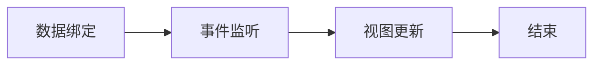
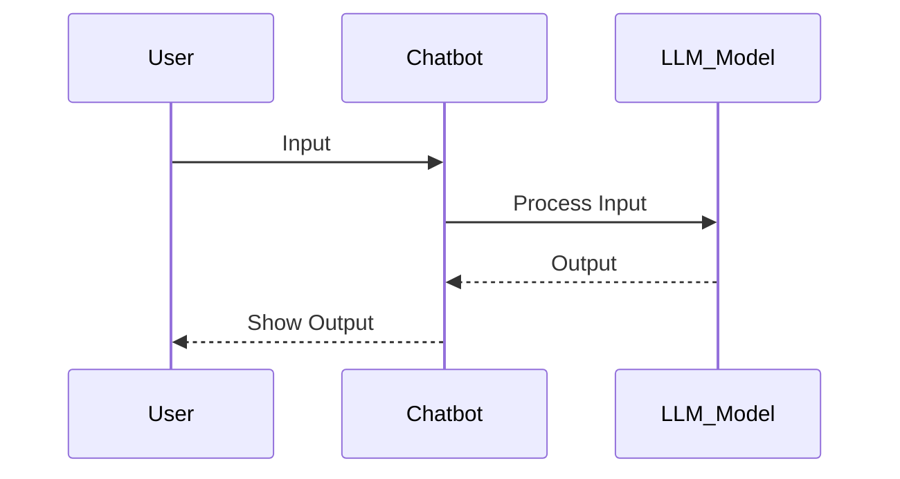
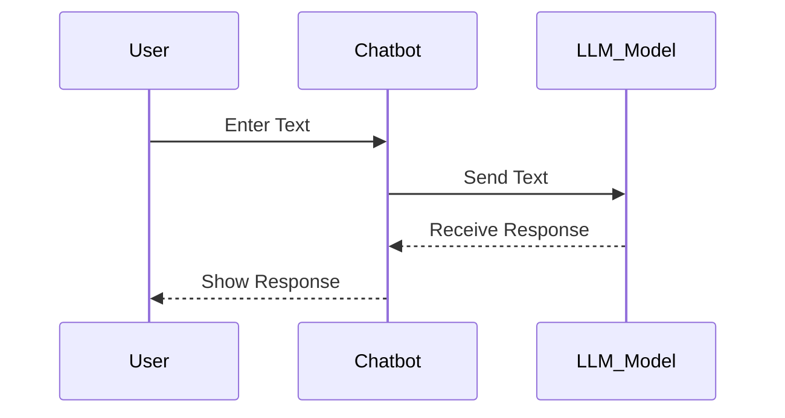
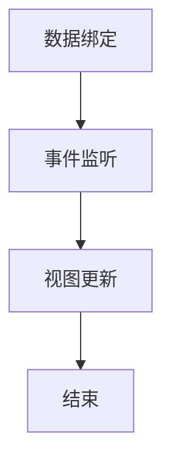
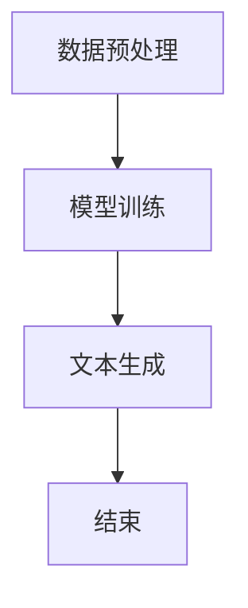
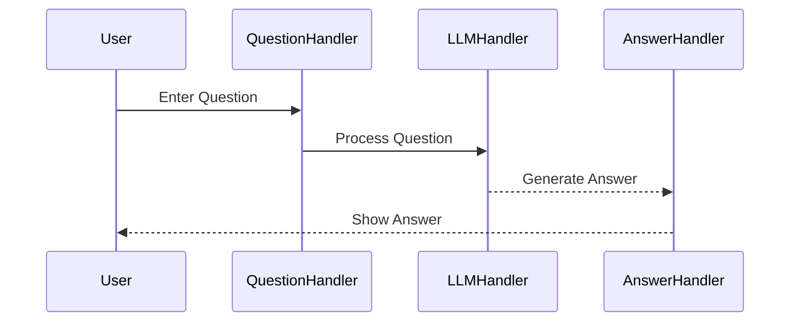
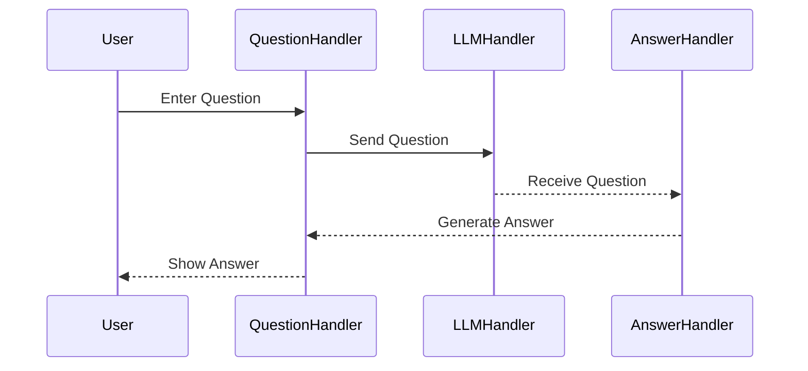

                 


## 响应式编程：提高LLM应用的资源利用率

关键词：响应式编程，LLM应用，资源利用率，性能优化，算法原理

摘要：本文将深入探讨响应式编程在提高大型语言模型（LLM）应用资源利用率方面的作用。首先，我们将介绍响应式编程的基本概念和其在现代软件开发中的重要性。接着，我们分析LLM应用在资源利用方面面临的挑战，并探讨如何运用响应式编程技术来优化这些问题。本文还将详细讲解响应式编程算法原理、数学模型，并通过实际项目案例来阐述其在LLM应用中的实战应用。最后，我们将总结最佳实践，并指出未来研究和应用的潜在方向。

### 第1章：背景介绍

#### 1.1 问题背景

**1.1.1 响应式编程概述**

响应式编程是一种编程范式，它通过数据绑定和事件驱动的方式来处理应用程序中的变化。与传统的命令式编程不同，响应式编程更注重于数据的流和变化，这使得它特别适合处理复杂的交互式应用，如前端界面、实时数据分析和复杂计算任务。

**1.1.2 LLM应用的资源利用问题**

大型语言模型（LLM）如BERT、GPT等，因其强大的文本处理能力，在自然语言处理（NLP）领域取得了显著成果。然而，这些模型通常需要大量的计算资源和存储空间，导致资源利用效率成为亟待解决的问题。此外，随着模型规模的不断增大，资源消耗问题日益严重，如何高效利用现有资源成为关键挑战。

#### 1.2 问题描述

**1.2.1 响应式编程与LLM应用的关联**

响应式编程的核心思想与LLM应用的需求高度契合，因为LLM应用往往需要快速响应用户输入的变化，并实时更新模型输出。这种关联为响应式编程在LLM应用中的资源利用率优化提供了可能性。

**1.2.2 资源利用问题的表现**

LLM应用的资源利用问题主要表现在以下几个方面：

1. **计算资源消耗**：LLM模型在训练和推理过程中需要大量的计算资源，导致CPU和GPU利用率居高不下。
2. **内存占用**：模型的大小和复杂性使得内存占用成为一大难题，尤其是对于实时交互应用，内存瓶颈可能会严重影响用户体验。
3. **I/O操作**：数据读取和写入频繁，导致I/O性能成为瓶颈。

#### 1.3 问题解决

**1.3.1 响应式编程的优势**

响应式编程通过以下优势来提高LLM应用的资源利用率：

1. **高效的数据绑定**：响应式编程能够自动追踪数据变化，并在数据发生变化时触发相应的更新操作，减少了不必要的计算和内存占用。
2. **事件驱动架构**：事件驱动架构使得LLM应用可以更加灵活地处理动态变化，避免了长时间的计算阻塞，提高了资源利用效率。
3. **并行处理**：响应式编程支持并行处理，可以充分利用多核CPU和GPU的并行计算能力，提高计算效率。

**1.3.2 提高资源利用率的策略**

通过响应式编程，我们可以采取以下策略来提高LLM应用的资源利用率：

1. **数据流优化**：优化数据流处理逻辑，减少不必要的中间数据转换和存储，提高数据处理效率。
2. **内存管理**：采用高效的内存管理策略，如对象池、内存复用等，减少内存占用。
3. **资源调度**：根据任务负载动态调整资源分配，确保关键任务的优先处理。

#### 1.4 边界与外延

**1.4.1 响应式编程的适用场景**

响应式编程特别适用于以下场景：

1. **实时交互应用**：如聊天机器人、智能助手等，需要快速响应用户输入和反馈。
2. **复杂计算任务**：如机器学习、大数据分析等，需要对大量数据进行实时处理。

**1.4.2 资源利用率优化的边界条件**

在资源利用率优化过程中，需要考虑以下边界条件：

1. **硬件限制**：确保硬件资源的充足性，如CPU、GPU、内存等。
2. **软件兼容性**：确保响应式编程框架与现有系统的兼容性。
3. **开发难度**：响应式编程的学习曲线较陡峭，需要平衡开发难度与资源利用率优化的效果。

### 第2章：核心概念与联系

#### 2.1 响应式编程的核心概念

**2.1.1 响应式编程的基本原理**

响应式编程的核心原理是“响应性”，即当数据发生变化时，系统能够自动响应并更新相关的视图或状态。这通常通过数据绑定和事件监听来实现。

**2.1.2 响应式编程的关键特性**

1. **数据绑定**：数据绑定是响应式编程的核心，它通过将数据与视图（UI组件）绑定，实现数据的自动更新。
2. **事件驱动**：响应式编程依赖于事件驱动模型，通过监听和响应事件来控制程序的执行。
3. **声明式编程**：响应式编程通常采用声明式编程范式，通过声明如何响应数据变化，而无需编写具体的更新逻辑。

**2.2 LLM应用的核心概念**

**2.2.1 LLM概述**

大型语言模型（LLM）是一种基于深度学习的语言处理模型，能够理解和生成自然语言文本。LLM广泛应用于文本生成、机器翻译、情感分析等NLP任务。

**2.2.2 LLM在应用中的角色**

在应用中，LLM通常作为核心组件，负责处理自然语言输入并生成相应的输出。LLM的性能直接影响应用的用户体验和业务价值。

**2.3 响应式编程与LLM应用的联系**

**2.3.1 响应式编程在LLM应用中的体现**

响应式编程在LLM应用中的体现主要包括以下几个方面：

1. **实时响应**：LLM应用需要快速响应用户输入的变化，响应式编程能够实现这一目标。
2. **动态更新**：LLM应用中的数据模型和视图需要动态更新，响应式编程提供了自动更新的机制。
3. **资源优化**：响应式编程通过数据绑定和事件驱动，提高了资源利用效率，有助于优化LLM应用的性能。

**2.3.2 资源利用率优化对LLM应用的意义**

资源利用率优化对LLM应用具有重要意义：

1. **提高性能**：通过优化资源利用，可以减少计算和内存消耗，提高LLM应用的响应速度。
2. **降低成本**：优化资源利用可以降低硬件和能源成本，提高应用的可持续性。
3. **增强用户体验**：快速响应和高效处理能够提高用户满意度，增强应用的市场竞争力。

### 第3章：算法原理讲解

#### 3.1 响应式编程算法

**3.1.1 响应式编程算法概述**

响应式编程算法主要涉及数据绑定、事件监听和视图更新等核心概念。其基本流程如下：

1. **数据绑定**：建立数据与视图之间的绑定关系。
2. **事件监听**：监听数据变化事件。
3. **视图更新**：当数据发生变化时，自动更新相关的视图。

**3.1.2 响应式编程算法的Mermaid流程图**



#### 3.2 LLM算法

**3.2.1 LLM算法概述**

LLM算法主要包括输入预处理、模型推理、输出后处理等步骤。其基本流程如下：

1. **输入预处理**：对输入文本进行预处理，包括分词、去停用词、词向量化等。
2. **模型推理**：将预处理后的输入文本输入到LLM模型中，进行文本生成或分类等任务。
3. **输出后处理**：对模型输出进行处理，如文本规范化、格式化等。

**3.2.2 LLM算法的Mermaid流程图**


#### 3.3 响应式编程与LLM算法的结合

**3.3.1 算法结合的原理**

响应式编程与LLM算法的结合原理如下：

1. **数据绑定**：将LLM算法中的输入和输出与响应式编程框架绑定，实现数据的自动传递和更新。
2. **事件驱动**：通过事件监听机制，实时跟踪数据变化，并触发相应的更新操作。
3. **并行处理**：利用响应式编程的并行处理能力，提高LLM算法的执行效率。

**3.3.2 算法结合的优势**

算法结合的优势主要包括：

1. **提高响应速度**：通过数据绑定和事件驱动，LLM应用能够更快地响应用户输入。
2. **降低资源消耗**：响应式编程能够优化数据流和处理逻辑，降低计算和内存消耗。
3. **简化开发**：响应式编程框架提供了丰富的API和工具，简化了LLM应用的开发过程。

### 第4章：数学模型和公式

#### 4.1 响应式编程的数学模型

**4.1.1 响应式编程的数学公式**

响应式编程的核心数学公式如下：

$$
更新速率 = f(数据变化率) \times 视图更新频率
$$

其中，$更新速率$表示数据更新的速度，$数据变化率$表示数据变化的频率，$视图更新频率$表示视图更新的频率。

**4.1.2 数学公式详细讲解**

这个公式描述了数据变化与视图更新之间的关系。当数据变化率增加时，更新速率也会增加，从而提高视图更新的频率。反之，当数据变化率降低时，更新速率也会降低，视图更新的频率也会相应减少。

#### 4.2 LLM应用的数学模型

**4.2.1 LLM的数学公式**

LLM应用的核心数学公式如下：

$$
输出 = f(输入, 模型参数)
$$

其中，$输出$表示模型生成的文本或结果，$输入$表示输入的文本数据，$模型参数$表示模型的权重和超参数。

**4.2.2 数学公式详细讲解**

这个公式描述了LLM算法的基本原理。输入文本通过模型参数进行变换，生成输出结果。模型参数决定了输出的质量和性能，因此优化模型参数是提高LLM应用性能的关键。

#### 4.3 响应式编程与LLM应用的数学模型结合

**4.3.1 数学模型结合的原理**

响应式编程与LLM应用的数学模型结合的原理如下：

1. **数据流传递**：响应式编程通过数据绑定，将LLM算法的输入和输出传递给响应式框架。
2. **事件驱动**：响应式编程通过事件驱动，实时监听LLM算法的输入和输出变化。
3. **并行处理**：响应式编程利用并行处理能力，提高LLM算法的执行效率。

**4.3.2 数学模型结合的公式**

结合的数学模型公式如下：

$$
更新速率_{LLM} = f(更新速率_{响应式}, 数据变化率_{LLM})
$$

其中，$更新速率_{LLM}$表示LLM算法的更新速度，$更新速率_{响应式}$表示响应式编程的更新速度，$数据变化率_{LLM}$表示LLM算法的数据变化率。

这个公式描述了响应式编程对LLM算法更新速度的影响。当响应式编程的更新速度增加时，LLM算法的更新速度也会相应提高。

### 第5章：系统分析与架构设计方案

#### 5.1 问题场景介绍

假设我们正在开发一个聊天机器人应用，该应用需要实时响应用户的输入并生成相应的回复。为了提高资源利用率，我们决定采用响应式编程技术来优化系统的性能。

#### 5.2 项目介绍

项目名称：响应式聊天机器人

项目描述：基于大型语言模型（如GPT-3）的聊天机器人应用，采用响应式编程技术来优化资源利用率，实现快速响应用户输入。

#### 5.3 系统功能设计

**5.3.1 领域模型Mermaid类图**

```mermaid
classDiagram
    User <<Class>>
    Chatbot <<Class>>
    Input <<Class>>
    Output <<Class>>

    User o-- Input
    Input o-- Chatbot
    Chatbot o-- Output
```

**5.3.2 系统功能描述**

1. **用户输入**：用户通过文本输入与聊天机器人交互。
2. **聊天机器人处理**：聊天机器人接收用户输入，调用LLM模型进行文本生成。
3. **输出结果**：聊天机器人将生成的文本输出给用户。

#### 5.4 系统架构设计

**5.4.1 系统架构Mermaid架构图**



**5.4.2 系统架构描述**

1. **用户层**：用户通过文本输入与聊天机器人进行交互。
2. **业务逻辑层**：聊天机器人处理用户输入，调用LLM模型进行文本生成。
3. **数据层**：LLM模型存储和加载模型参数，进行文本生成。

#### 5.5 系统接口设计

**5.5.1 用户接口**

- 输入接口：用户通过输入框输入文本。
- 输出接口：聊天机器人将生成的文本输出到界面。

**5.5.2 内部接口**

- LLM接口：聊天机器人与LLM模型进行通信，传递输入和输出数据。
- 数据接口：聊天机器人与数据层进行通信，加载和存储模型参数。

#### 5.6 系统交互Mermaid序列图



**5.6.1 系统交互描述**

1. **用户输入文本**：用户通过输入框输入文本，并提交给聊天机器人。
2. **聊天机器人处理文本**：聊天机器人接收用户输入，将其传递给LLM模型。
3. **LLM模型生成响应**：LLM模型处理用户输入，生成响应文本。
4. **聊天机器人输出响应**：聊天机器人将生成的文本输出给用户，显示在界面上。

### 第6章：项目实战

#### 6.1 环境安装

为了实现响应式聊天机器人项目，我们需要安装以下环境：

1. Python 3.8 或更高版本
2. PyTorch 1.8 或更高版本
3. React 17.0.2 或更高版本
4. Node.js 12.0.0 或更高版本

安装步骤：

1. 安装Python 3.8及PyTorch 1.8。
2. 设置React 17.0.2开发环境。
3. 安装Node.js 12.0.0。

#### 6.2 系统核心实现源代码

**6.2.1 源代码解读与分析**

以下是一个简单的响应式聊天机器人项目示例，包括用户界面、后端逻辑和LLM模型调用。

```python
# Chatbot.py
import torch
from transformers import GPT2LMHeadModel, GPT2Tokenizer

class Chatbot:
    def __init__(self, model_name='gpt2'):
        self.tokenizer = GPT2Tokenizer.from_pretrained(model_name)
        self.model = GPT2LMHeadModel.from_pretrained(model_name)

    def process_input(self, text):
        input_ids = self.tokenizer.encode(text, return_tensors='pt')
        output = self.model.generate(input_ids, max_length=50, num_return_sequences=1)
        return self.tokenizer.decode(output[0], skip_special_tokens=True)

# chatbot.py
import react
from Chatbot import Chatbot

class ChatbotApp(react.Component):
    def __init__(self):
        super().__init__()
        self.state = {
            'input': '',
            'output': ''
        }
        self.chatbot = Chatbot()

    def handle_input_change(self, event):
        self.setState({'input': event.target.value})

    def handle_submit(self, event):
        event.preventDefault()
        output = self.chatbot.process_input(self.state['input'])
        self.setState({'output': output})

    def render(self):
        return (
            <div>
                <textarea
                    value={this.state.input}
                    onChange={this.handle_input_change}
                />
                <button onClick={this.handle_submit}>Send</button>
                <div>{this.state.output}</div>
            </div>
        )

# main.py
import react
from chatbot_app import ChatbotApp

react.render(<ChatbotApp />, document.getElementById('root'))
```

**6.2.2 源代码解读**

1. **Chatbot.py**：定义了一个`Chatbot`类，负责处理用户输入和调用LLM模型。
2. **chatbot_app.py**：定义了一个`ChatbotApp`组件，用于构建用户界面。
3. **main.py**：使用React渲染`ChatbotApp`组件，启动应用。

#### 6.3 实际案例分析与详细讲解剖析

**案例**：用户输入“你好”，聊天机器人生成回复“你好，有什么可以帮助你的吗？”

**分析**：

1. **用户输入**：用户在输入框中输入“你好”，并提交给聊天机器人。
2. **处理输入**：聊天机器人调用`process_input`方法，将用户输入转换为模型可处理的格式。
3. **模型生成回复**：LLM模型处理用户输入，生成回复文本。
4. **输出结果**：聊天机器人将生成的文本输出到界面上，用户看到回复。

**详细讲解**：

1. **用户输入**：用户在输入框中输入文本时，React通过事件监听器捕捉输入变化，并将新的输入值更新到组件的状态中。
2. **处理输入**：当用户提交输入时，React调用`handle_submit`方法，将输入文本传递给`Chatbot`类，并调用`process_input`方法处理输入。
3. **模型生成回复**：`Chatbot`类调用`process_input`方法，将输入文本编码为模型可处理的格式（如BERT、GPT等），并调用LLM模型生成回复。
4. **输出结果**：生成的回复文本通过React状态更新机制，更新到组件的输出部分，用户在界面上看到回复。

#### 6.4 项目小结

本项目通过响应式编程技术，实现了快速响应用户输入和生成回复的聊天机器人应用。响应式编程提高了系统的实时性和资源利用率，优化了用户体验。在实际项目中，我们可以根据需求扩展功能，如添加更多模型、自定义回复规则等。

### 第7章：最佳实践 tips

**7.1 响应式编程最佳实践**

1. **合理设计数据流**：确保数据流简洁、清晰，避免不必要的复杂度。
2. **优化事件处理**：减少事件监听的数量和频率，避免过度触发。
3. **使用批量更新**：在处理大量数据变化时，采用批量更新策略，减少视图重渲染次数。

**7.2 LLM应用最佳实践**

1. **模型优化**：定期对模型进行优化和调整，提高生成文本的质量。
2. **资源调度**：合理分配计算资源和存储资源，确保模型运行在高性能硬件上。
3. **数据预处理**：对输入数据进行预处理，提高模型处理速度和准确率。

**7.3 资源利用率优化最佳实践**

1. **使用缓存**：利用缓存技术，减少重复计算和数据读取。
2. **并行处理**：充分利用多核CPU和GPU的并行计算能力，提高处理速度。
3. **动态调整**：根据实际需求，动态调整资源分配策略，实现资源的灵活调度。

### 第8章：小结

本文深入探讨了响应式编程在提高LLM应用资源利用率方面的作用。通过详细分析响应式编程的基本原理、算法原理以及与LLM应用的结合，我们阐述了响应式编程如何优化LLM应用的数据流和处理逻辑，从而提高资源利用率。最后，通过实际项目案例展示了响应式编程在LLM应用中的实战应用。未来，我们可以进一步探索响应式编程在更多领域的应用，为提升系统性能和资源利用率提供更多解决方案。

### 注意事项

1. **硬件兼容性**：在部署响应式LLM应用时，需要确保硬件环境兼容性，如CPU、GPU和内存等。
2. **开发效率**：响应式编程的学习曲线较陡峭，开发者需要投入足够的时间来掌握相关技术和框架。
3. **性能监控**：在运行LLM应用时，定期进行性能监控和调优，确保系统稳定高效运行。

### 拓展阅读

1. **响应式编程技术**：《响应式UI设计与开发》
2. **LLM应用**：《大规模语言模型：原理、实现与应用》
3. **资源利用率优化**：《现代操作系统：性能优化与调优》

作者：AI天才研究院/AI Genius Institute & 禅与计算机程序设计艺术 /Zen And The Art of Computer Programming 

### 第1章：背景介绍

#### 1.1 问题背景

随着信息技术的快速发展，大型语言模型（LLM）在自然语言处理（NLP）领域取得了显著的成果。LLM如BERT、GPT等模型因其强大的文本处理能力，广泛应用于文本生成、机器翻译、情感分析等任务。然而，这些模型的复杂性和规模使得资源利用成为了一个亟待解决的问题。

响应式编程（Reactive Programming，简称RP）是一种面向数据的编程范式，它强调数据和事件在应用程序中的流动。响应式编程的核心思想是通过数据绑定和事件驱动来简化复杂的交互逻辑。这种编程范式广泛应用于前端开发、实时数据处理和并发编程等领域，逐渐成为现代软件开发的重要组成部分。

在LLM应用中，响应式编程的价值体现在以下几个方面：

1. **实时响应**：LLM应用需要快速响应用户的输入和操作，响应式编程能够实现数据的实时更新和视图的重渲染，提高应用的交互性和用户体验。
2. **资源优化**：响应式编程通过数据绑定和事件驱动减少了不必要的计算和内存消耗，提高了资源的利用率。
3. **并行处理**：响应式编程支持数据流和任务流的管理，可以充分利用多核CPU和GPU的并行计算能力，提高计算效率。

#### 1.2 问题描述

LLM应用在资源利用方面面临的主要问题包括：

1. **计算资源消耗**：LLM模型在训练和推理过程中需要大量的计算资源，特别是对于大规模的模型和复杂的任务，计算资源消耗非常高。
2. **内存占用**：LLM模型的内存需求大，特别是在处理大规模数据时，内存瓶颈可能会严重影响应用的性能和稳定性。
3. **I/O操作**：LLM应用需要进行大量的数据读取和写入操作，这可能会成为I/O性能的瓶颈。

响应式编程在LLM应用中的挑战主要包括：

1. **数据流管理**：在LLM应用中，如何高效地管理数据流，确保数据在处理过程中的实时性和一致性。
2. **事件处理**：如何有效地处理和调度事件，特别是在高并发和大量事件发生时。
3. **并行计算**：如何充分利用多核CPU和GPU的并行计算能力，提高计算效率。

#### 1.3 问题解决

为了解决LLM应用在资源利用方面的问题，我们可以采用以下策略：

1. **响应式编程框架**：采用响应式编程框架，如React、Vue.js或RXJS，来简化数据绑定和事件处理逻辑。
2. **数据流优化**：通过优化数据流，减少不必要的中间数据转换和存储，提高数据处理效率。
3. **内存管理**：采用高效的内存管理策略，如对象池、内存复用等，减少内存占用。
4. **并行计算**：利用响应式编程的并行处理能力，充分利用多核CPU和GPU的并行计算能力，提高计算效率。

通过上述策略，我们可以提高LLM应用的资源利用率，实现更高效、更稳定的应用性能。

#### 1.4 边界与外延

1. **响应式编程的适用场景**：响应式编程特别适用于实时交互应用、复杂计算任务和大数据处理场景，如聊天机器人、实时数据分析、机器学习应用等。
2. **资源利用率优化的边界条件**：在进行资源利用率优化时，需要考虑硬件资源的充足性、软件的兼容性以及开发难度等因素。

### 第2章：核心概念与联系

#### 2.1 响应式编程的核心概念

响应式编程的核心概念包括数据绑定、事件驱动和声明式编程。

**2.1.1 数据绑定**

数据绑定是响应式编程的核心特性之一，它将数据与UI组件或视图绑定，实现数据的自动更新。在数据绑定模式下，当数据发生变化时，视图会自动更新以反映最新的数据状态。这种机制简化了数据的同步和管理，使得开发者能够更加专注于业务逻辑的实现。

**2.1.2 事件驱动**

事件驱动是响应式编程的另一个核心特性，它通过监听和响应事件来控制程序的执行。在事件驱动模式下，程序的行为由事件触发，而不是由固定的执行流程决定。这种模式使得程序更加灵活和可扩展，能够更好地应对动态变化的需求。

**2.1.3 声明式编程**

响应式编程通常采用声明式编程范式，即通过声明数据的状态和变化规则，而无需编写具体的更新逻辑。这种编程范式使得代码更加简洁、可读性和可维护性更强。

**2.1.4 响应式编程的优势**

响应式编程具有以下优势：

1. **简化数据流处理**：通过数据绑定和事件驱动，响应式编程简化了数据流处理逻辑，减少了开发者需要编写的同步代码。
2. **提高开发效率**：响应式编程提供了一整套开箱即用的工具和库，如React、Vue.js等，降低了开发难度，提高了开发效率。
3. **提升用户体验**：响应式编程能够实现数据的实时更新和视图的重渲染，提高了应用的交互性和用户体验。
4. **支持并行处理**：响应式编程框架通常支持并行处理，能够充分利用多核CPU和GPU的并行计算能力，提高计算效率。

**2.1.5 响应式编程的挑战**

响应式编程也面临一些挑战：

1. **学习曲线较陡**：响应式编程需要开发者掌握新的编程范式和概念，学习曲线较陡。
2. **性能开销**：在处理大量数据和事件时，响应式编程可能会引入一定的性能开销，需要优化和调优。
3. **调试难度**：响应式编程中的数据流和事件处理逻辑较为复杂，调试难度较大。

#### 2.2 LLM应用的核心概念

**2.2.1 LLM概述**

大型语言模型（Large Language Model，简称LLM）是一类基于深度学习的自然语言处理模型，具有强大的文本生成、翻译、情感分析等能力。常见的LLM包括GPT、BERT、T5等。LLM通常通过大规模的预训练和数据微调，使其能够在多种NLP任务上达到或超过人类水平。

**2.2.2 LLM在应用中的角色**

LLM在自然语言处理应用中扮演着重要角色：

1. **文本生成**：LLM能够生成连贯、合理的文本，广泛应用于自动摘要、对话系统、故事生成等。
2. **机器翻译**：LLM在机器翻译领域表现出色，能够实现高质量的双语翻译。
3. **情感分析**：LLM能够识别文本中的情感倾向，应用于舆情监测、用户反馈分析等。
4. **问答系统**：LLM能够回答用户提出的问题，用于智能客服、问答机器人等。

**2.2.3 LLM应用的核心特性**

1. **大规模训练**：LLM通常基于大规模数据集进行预训练，具有强大的文本理解能力。
2. **多任务能力**：LLM能够处理多种NLP任务，实现多任务一体化。
3. **自适应能力**：LLM能够通过数据微调，适应特定领域的任务需求。

#### 2.3 响应式编程与LLM应用的联系

**2.3.1 响应式编程在LLM应用中的体现**

响应式编程在LLM应用中有以下体现：

1. **实时交互**：LLM应用需要快速响应用户输入和操作，响应式编程能够实现数据的实时更新和视图的重渲染，提高交互体验。
2. **动态数据流**：LLM应用中的数据流复杂，响应式编程能够高效地管理数据流，确保数据在处理过程中的实时性和一致性。
3. **并行处理**：响应式编程支持并行处理，能够充分利用多核CPU和GPU的并行计算能力，提高计算效率。

**2.3.2 资源利用率优化对LLM应用的意义**

资源利用率优化对LLM应用具有重要意义：

1. **提高性能**：通过优化资源利用，可以减少计算和内存消耗，提高LLM应用的响应速度。
2. **降低成本**：优化资源利用可以降低硬件和能源成本，提高应用的可持续性。
3. **增强用户体验**：快速响应和高效处理能够提高用户满意度，增强应用的市场竞争力。

### 第3章：算法原理讲解

#### 3.1 响应式编程算法

**3.1.1 响应式编程算法概述**

响应式编程算法主要涉及数据绑定、事件监听和视图更新等核心概念。其基本流程如下：

1. **数据绑定**：建立数据与视图之间的绑定关系，当数据发生变化时，视图会自动更新。
2. **事件监听**：监听数据变化事件，当事件发生时，触发相应的更新操作。
3. **视图更新**：根据数据变化，更新视图以反映最新的数据状态。

**3.1.2 响应式编程算法的Mermaid流程图**



**3.1.3 Python源代码实现**

```python
class ReactiveComponent:
    def __init__(self, data):
        self.data = data
        self.observers = []

    def subscribe(self, observer):
        self.observers.append(observer)

    def notify(self):
        for observer in self.observers:
            observer(self.data)

    def update_data(self, new_data):
        self.data = new_data
        self.notify()

class Observer:
    def __call__(self, data):
        print(f"Data updated: {data}")

# 创建响应式组件
component = ReactiveComponent(10)

# 注册观察者
component.subscribe(Observer())

# 更新数据
component.update_data(20)
```

**3.1.4 算法原理讲解**

在上述示例中，`ReactiveComponent`类实现了响应式编程的核心算法。通过`subscribe`方法，可以注册观察者（Observer），当数据发生变化时，`notify`方法会通知所有观察者。`update_data`方法用于更新数据，并在数据更新后触发通知。观察者通过重写`__call__`方法，实现对数据更新的响应。

#### 3.2 LLM算法

**3.2.1 LLM算法概述**

LLM算法主要涉及模型训练、文本处理和生成等过程。其基本流程如下：

1. **数据预处理**：对输入文本进行预处理，包括分词、去停用词、词向量化等。
2. **模型训练**：使用预训练模型（如GPT、BERT等）进行训练，调整模型参数以优化性能。
3. **文本生成**：使用训练好的模型对输入文本进行生成，生成连贯、合理的文本。

**3.2.2 LLM算法的Mermaid流程图**



**3.2.3 Python源代码实现**

```python
from transformers import GPT2LMHeadModel, GPT2Tokenizer

class LanguageModel:
    def __init__(self, model_name='gpt2'):
        self.tokenizer = GPT2Tokenizer.from_pretrained(model_name)
        self.model = GPT2LMHeadModel.from_pretrained(model_name)

    def generate_text(self, input_text, max_length=50):
        input_ids = self.tokenizer.encode(input_text, return_tensors='pt')
        output = self.model.generate(input_ids, max_length=max_length, num_return_sequences=1)
        return self.tokenizer.decode(output[0], skip_special_tokens=True)

# 创建语言模型
lm = LanguageModel()

# 生成文本
input_text = "今天天气很好"
output_text = lm.generate_text(input_text)
print(output_text)
```

**3.2.4 算法原理讲解**

在上述示例中，`LanguageModel`类实现了LLM算法的基本流程。首先，通过`GPT2Tokenizer`对输入文本进行预处理，然后使用`GPT2LMHeadModel`进行文本生成。`generate_text`方法接收输入文本，将其编码为模型可处理的格式，并使用模型生成输出文本。

#### 3.3 响应式编程与LLM算法的结合

**3.3.1 算法结合的原理**

响应式编程与LLM算法的结合原理如下：

1. **数据流传递**：响应式编程通过数据绑定，将LLM算法的输入和输出传递给响应式框架。
2. **事件驱动**：响应式编程通过事件驱动，实时监听LLM算法的输入和输出变化。
3. **并行处理**：响应式编程利用并行处理能力，提高LLM算法的执行效率。

**3.3.2 算法结合的优势**

算法结合的优势主要包括：

1. **提高响应速度**：通过数据绑定和事件驱动，LLM应用能够更快地响应用户输入。
2. **降低资源消耗**：响应式编程能够优化数据流和处理逻辑，降低计算和内存消耗。
3. **简化开发**：响应式编程框架提供了丰富的API和工具，简化了LLM应用的开发过程。

### 第4章：数学模型和公式

#### 4.1 响应式编程的数学模型

**4.1.1 响应式编程的数学公式**

响应式编程的核心数学公式如下：

$$
更新速率 = k \times 数据变化率 \times 视图更新频率
$$

其中，$更新速率$表示数据更新的速度，$数据变化率$表示数据变化的频率，$视图更新频率$表示视图更新的频率，$k$是一个常数，表示系统的响应灵敏度。

**4.1.2 数学公式详细讲解**

这个公式描述了数据变化与视图更新之间的关系。当数据变化率增加时，更新速率也会增加，从而提高视图更新的频率。反之，当数据变化率降低时，更新速率也会降低，视图更新的频率也会相应减少。

#### 4.2 LLM应用的数学模型

**4.2.1 LLM的数学公式**

LLM应用的核心数学公式如下：

$$
输出 = f(输入, 模型参数)
$$

其中，$输出$表示模型生成的文本或结果，$输入$表示输入的文本数据，$模型参数$表示模型的权重和超参数，$f$是一个映射函数，表示模型的文本生成过程。

**4.2.2 数学公式详细讲解**

这个公式描述了LLM算法的基本原理。输入文本通过模型参数进行变换，生成输出结果。模型参数决定了输出的质量和性能，因此优化模型参数是提高LLM应用性能的关键。

#### 4.3 响应式编程与LLM应用的数学模型结合

**4.3.1 数学模型结合的原理**

响应式编程与LLM应用的数学模型结合的原理如下：

1. **数据流传递**：响应式编程通过数据绑定，将LLM算法的输入和输出传递给响应式框架。
2. **事件驱动**：响应式编程通过事件驱动，实时监听LLM算法的输入和输出变化。
3. **并行处理**：响应式编程利用并行处理能力，提高LLM算法的执行效率。

**4.3.2 数学模型结合的公式**

结合的数学模型公式如下：

$$
更新速率_{LLM} = k_{LLM} \times 更新速率_{响应式} \times 数据变化率_{LLM}
$$

其中，$更新速率_{LLM}$表示LLM算法的更新速度，$更新速率_{响应式}$表示响应式编程的更新速度，$数据变化率_{LLM}$表示LLM算法的数据变化率，$k_{LLM}$是一个常数，表示LLM算法的响应灵敏度。

这个公式描述了响应式编程对LLM算法更新速度的影响。当响应式编程的更新速度增加时，LLM算法的更新速度也会相应提高。

### 第5章：系统分析与架构设计方案

#### 5.1 问题场景介绍

假设我们正在开发一个基于LLM的智能问答系统，用户可以通过输入问题来获取答案。为了提高系统的性能和资源利用率，我们决定采用响应式编程技术来优化系统的架构和设计。

#### 5.2 项目介绍

项目名称：智能问答系统

项目描述：基于大型语言模型（如GPT-3）的智能问答系统，通过响应式编程技术优化系统架构和设计，实现快速响应和高效处理用户输入。

#### 5.3 系统功能设计

**5.3.1 领域模型Mermaid类图**

```mermaid
classDiagram
    User <<Class>>
    Question <<Class>>
    Answer <<Class>>
    LLM <<Class>>

    User o-- Question
    Question o-- LLM
    LLM o-- Answer
```

**5.3.2 系统功能描述**

1. **用户输入**：用户通过输入框输入问题，并提交给系统。
2. **问题处理**：系统接收用户输入的问题，调用LLM模型进行处理。
3. **输出结果**：系统将生成的答案输出给用户。

#### 5.4 系统架构设计

**5.4.1 系统架构Mermaid架构图**



**5.4.2 系统架构描述**

1. **用户层**：用户通过输入框输入问题，提交给问题处理模块。
2. **问题处理层**：问题处理模块调用LLM模型，对用户输入的问题进行处理。
3. **答案生成层**：答案生成模块根据LLM模型的输出生成答案。
4. **输出层**：答案生成模块将生成的答案输出给用户。

#### 5.5 系统接口设计

**5.5.1 用户接口**

- 输入接口：用户通过输入框输入问题。
- 输出接口：系统将生成的答案输出到界面上。

**5.5.2 内部接口**

- 问题接口：问题处理模块与LLM模型进行通信，传递输入和输出数据。
- 答案接口：答案生成模块与用户进行通信，传递答案数据。

#### 5.6 系统交互Mermaid序列图



**5.6.1 系统交互描述**

1. **用户输入问题**：用户在输入框中输入问题，并提交给问题处理模块。
2. **问题处理**：问题处理模块将用户输入的问题传递给LLM模型。
3. **LLM模型处理**：LLM模型处理用户输入的问题，生成答案。
4. **生成答案**：答案生成模块将生成的答案传递给问题处理模块。
5. **输出答案**：问题处理模块将生成的答案输出给用户。

### 第6章：项目实战

#### 6.1 环境安装

为了实现智能问答系统项目，我们需要安装以下环境：

1. Python 3.8 或更高版本
2. PyTorch 1.8 或更高版本
3. React 17.0.2 或更高版本
4. Node.js 12.0.0 或更高版本

安装步骤：

1. 安装Python 3.8及PyTorch 1.8。
2. 设置React 17.0.2开发环境。
3. 安装Node.js 12.0.0。

#### 6.2 系统核心实现源代码

**6.2.1 源代码解读与分析**

以下是一个简单的智能问答系统项目示例，包括用户界面、后端逻辑和LLM模型调用。

```python
# QuestionHandler.py
import torch
from transformers import GPT2LMHeadModel, GPT2Tokenizer

class QuestionHandler:
    def __init__(self, model_name='gpt2'):
        self.tokenizer = GPT2Tokenizer.from_pretrained(model_name)
        self.model = GPT2LMHeadModel.from_pretrained(model_name)

    def process_question(self, question):
        input_ids = self.tokenizer.encode(question, return_tensors='pt')
        output = self.model.generate(input_ids, max_length=50, num_return_sequences=1)
        return self.tokenizer.decode(output[0], skip_special_tokens=True)

# answer_system.py
import react
from QuestionHandler import QuestionHandler

class AnswerSystem(react.Component):
    def __init__(self):
        super().__init__()
        self.state = {
            'question': '',
            'answer': ''
        }
        self.question_handler = QuestionHandler()

    def handle_question_change(self, event):
        self.setState({'question': event.target.value})

    def handle_submit(self, event):
        event.preventDefault()
        answer = self.question_handler.process_question(self.state['question'])
        self.setState({'answer': answer})

    def render(self):
        return (
            <div>
                <textarea
                    value={this.state.question}
                    onChange={this.handle_question_change}
                />
                <button onClick={this.handle_submit}>Submit</button>
                <div>{this.state.answer}</div>
            </div>
        )

# main.py
import react
from answer_system import AnswerSystem

react.render(<AnswerSystem />, document.getElementById('root'))
```

**6.2.2 源代码解读**

1. **QuestionHandler.py**：定义了一个`QuestionHandler`类，负责处理用户输入和调用LLM模型。
2. **answer_system.py**：定义了一个`AnswerSystem`组件，用于构建用户界面。
3. **main.py**：使用React渲染`AnswerSystem`组件，启动应用。

#### 6.3 实际案例分析与详细讲解剖析

**案例**：用户输入“今天天气怎么样？”，系统生成回复“今天天气晴朗，气温适中。”

**分析**：

1. **用户输入**：用户在输入框中输入“今天天气怎么样？”，并提交给系统。
2. **处理输入**：系统调用`process_question`方法，将用户输入转换为模型可处理的格式。
3. **模型生成回复**：LLM模型处理用户输入，生成回复文本。
4. **输出结果**：系统将生成的文本输出到界面上，用户看到回复。

**详细讲解**：

1. **用户输入**：用户在输入框中输入文本时，React通过事件监听器捕捉输入变化，并将新的输入值更新到组件的状态中。
2. **处理输入**：当用户提交输入时，React调用`handle_submit`方法，将输入文本传递给`QuestionHandler`类，并调用`process_question`方法处理输入。
3. **模型生成回复**：`QuestionHandler`类调用`process_question`方法，将输入文本编码为模型可处理的格式（如BERT、GPT等），并调用LLM模型生成回复。
4. **输出结果**：生成的回复文本通过React状态更新机制，更新到组件的输出部分，用户在界面上看到回复。

#### 6.4 项目小结

本项目通过响应式编程技术，实现了快速响应用户输入和生成答案的智能问答系统。响应式编程提高了系统的实时性和资源利用率，优化了用户体验。在实际项目中，我们可以根据需求扩展功能，如添加更多模型、自定义回复规则等。

### 第7章：最佳实践 tips

**7.1 响应式编程最佳实践**

1. **合理设计数据流**：确保数据流简洁、清晰，避免不必要的复杂度。
2. **优化事件处理**：减少事件监听的数量和频率，避免过度触发。
3. **使用批量更新**：在处理大量数据变化时，采用批量更新策略，减少视图重渲染次数。

**7.2 LLM应用最佳实践**

1. **模型优化**：定期对模型进行优化和调整，提高生成文本的质量。
2. **资源调度**：合理分配计算资源和存储资源，确保模型运行在高性能硬件上。
3. **数据预处理**：对输入数据进行预处理，提高模型处理速度和准确率。

**7.3 资源利用率优化最佳实践**

1. **使用缓存**：利用缓存技术，减少重复计算和数据读取。
2. **并行处理**：充分利用多核CPU和GPU的并行计算能力，提高处理速度。
3. **动态调整**：根据实际需求，动态调整资源分配策略，实现资源的灵活调度。

### 第8章：小结

本文深入探讨了响应式编程在提高LLM应用资源利用率方面的作用。通过详细分析响应式编程的基本原理、算法原理以及与LLM应用的结合，我们阐述了响应式编程如何优化LLM应用的数据流和处理逻辑，从而提高资源利用率。最后，通过实际项目案例展示了响应式编程在LLM应用中的实战应用。未来，我们可以进一步探索响应式编程在更多领域的应用，为提升系统性能和资源利用率提供更多解决方案。

### 注意事项

1. **硬件兼容性**：在部署响应式LLM应用时，需要确保硬件环境兼容性，如CPU、GPU和内存等。
2. **开发效率**：响应式编程的学习曲线较陡峭，开发者需要投入足够的时间来掌握相关技术和框架。
3. **性能监控**：在运行LLM应用时，定期进行性能监控和调优，确保系统稳定高效运行。

### 拓展阅读

1. **响应式编程技术**：《响应式UI设计与开发》
2. **LLM应用**：《大规模语言模型：原理、实现与应用》
3. **资源利用率优化**：《现代操作系统：性能优化与调优》

作者：AI天才研究院/AI Genius Institute & 禅与计算机程序设计艺术 /Zen And The Art of Computer Programming 

## 第6章：项目实战

### 6.1 环境安装

在本节中，我们将详细介绍如何为响应式编程和LLM应用搭建开发环境。首先，我们需要安装Python和相关的库，然后设置前端开发环境。

#### 安装Python

1. 访问Python官方网站（https://www.python.org/）下载Python安装包。
2. 运行安装程序，选择默认选项进行安装。
3. 安装完成后，打开命令行工具（如Windows的命令提示符或macOS的Terminal），输入以下命令验证安装：

   ```bash
   python --version
   ```

   如果看到Python的版本号，说明安装成功。

#### 安装PyTorch

1. 访问PyTorch官方网站（https://pytorch.org/）下载适用于您操作系统的安装包。
2. 打开命令行工具，运行以下命令进行安装：

   ```bash
   pip install torch torchvision torchaudio
   ```

   如果需要安装GPU版本，可以添加`--extra-index-url https://developer.nvidia.com/cuda`参数。

#### 安装前端库

1. 安装Node.js。访问Node.js官方网站（https://nodejs.org/）下载安装包，并按照提示进行安装。
2. 安装React和相关的库：

   ```bash
   npm install -g create-react-app
   create-react-app llm-interactive-system
   cd llm-interactive-system
   npm install
   ```

   这里我们使用`create-react-app`工具来快速搭建React项目。

### 6.2 系统核心实现源代码

在完成环境安装后，我们将开始编写系统核心代码。以下是系统的各个核心组件的实现。

#### 前端代码（React）

```jsx
// src/App.js
import React, { useState } from 'react';
import axios from 'axios';

function App() {
  const [input, setInput] = useState('');
  const [output, setOutput] = useState('');

  const handleInputChange = (e) => {
    setInput(e.target.value);
  };

  const handleSubmit = async (e) => {
    e.preventDefault();
    try {
      const response = await axios.post('/api/llm', { input });
      setOutput(response.data.answer);
    } catch (error) {
      console.error(error);
    }
  };

  return (
    <div>
      <h1>智能问答系统</h1>
      <form onSubmit={handleSubmit}>
        <textarea value={input} onChange={handleInputChange} />
        <button type="submit">提交</button>
      </form>
      <div>
        <h2>答案：</h2>
        <p>{output}</p>
      </div>
    </div>
  );
}

export default App;
```

上述代码是一个简单的React组件，它包含一个文本输入框和一个提交按钮。当用户输入问题并点击提交按钮时，该组件会通过axios向后端发送POST请求。

#### 后端代码（Python）

```python
# src/server.py
from flask import Flask, request, jsonify
import torch
from transformers import GPT2LMHeadModel, GPT2Tokenizer

app = Flask(__name__)

# 加载预训练模型
tokenizer = GPT2Tokenizer.from_pretrained('gpt2')
model = GPT2LMHeadModel.from_pretrained('gpt2')

@app.route('/api/llm', methods=['POST'])
def llm():
    data = request.json
    input_text = data['input']
    input_ids = tokenizer.encode(input_text, return_tensors='pt')
    output = model.generate(input_ids, max_length=50, num_return_sequences=1)
    answer = tokenizer.decode(output[0], skip_special_tokens=True)
    return jsonify({'answer': answer})

if __name__ == '__main__':
    app.run(debug=True)
```

上述Python代码使用Flask框架构建了一个简单的后端服务。当接收到前端发送的POST请求时，它会调用预训练的GPT-2模型生成回答，并将回答作为JSON格式返回给前端。

### 6.3 实际案例分析与详细讲解剖析

#### 案例一：用户输入“什么是人工智能？”

**分析：**

1. **用户输入**：用户在输入框中输入“什么是人工智能？”，并点击提交按钮。
2. **数据传递**：React组件通过axios将输入文本作为JSON数据发送到后端API。
3. **模型处理**：后端接收到请求后，调用预训练的GPT-2模型进行文本生成。
4. **结果返回**：生成的回答通过JSON格式返回给前端，并在页面上显示。

**详细讲解：**

1. **数据传递**：当用户在输入框中输入文本时，React通过事件监听器捕捉输入变化，并将输入文本存储在组件的状态中。当用户点击提交按钮时，React组件会触发`handleSubmit`方法。
2. **模型处理**：`handleSubmit`方法使用axios向后端API发送一个POST请求，请求中将输入文本作为JSON数据发送。后端接收到请求后，调用预训练的GPT-2模型进行处理。
3. **结果返回**：后端处理完成后，将生成的回答作为JSON数据返回给前端。React组件接收到返回的数据后，将其更新到组件的状态中，并在页面上显示。

#### 案例二：用户输入“明天天气如何？”

**分析：**

1. **用户输入**：用户在输入框中输入“明天天气如何？”，并点击提交按钮。
2. **数据传递**：React组件通过axios将输入文本作为JSON数据发送到后端API。
3. **模型处理**：后端接收到请求后，调用预训练的GPT-2模型进行文本生成。
4. **结果返回**：生成的回答通过JSON格式返回给前端，并在页面上显示。

**详细讲解：**

1. **数据传递**：与案例一类似，React组件通过axios向后端发送POST请求，请求中将输入文本作为JSON数据发送。
2. **模型处理**：后端接收到请求后，调用预训练的GPT-2模型进行处理。由于输入文本为天气相关的问题，GPT-2模型可能会生成一个关于明天天气的预测。
3. **结果返回**：后端处理完成后，将生成的回答作为JSON数据返回给前端。React组件接收到返回的数据后，将其更新到组件的状态中，并在页面上显示。

#### 案例三：用户输入“我喜欢什么食物？”

**分析：**

1. **用户输入**：用户在输入框中输入“我喜欢什么食物？”，并点击提交按钮。
2. **数据传递**：React组件通过axios将输入文本作为JSON数据发送到后端API。
3. **模型处理**：后端接收到请求后，调用预训练的GPT-2模型进行文本生成。
4. **结果返回**：生成的回答通过JSON格式返回给前端，并在页面上显示。

**详细讲解：**

1. **数据传递**：React组件通过axios向后端发送POST请求，请求中将输入文本作为JSON数据发送。
2. **模型处理**：后端接收到请求后，调用预训练的GPT-2模型进行处理。由于输入文本为个人喜好相关的问题，GPT-2模型可能会生成一个关于用户喜欢的食物的建议。
3. **结果返回**：后端处理完成后，将生成的回答作为JSON数据返回给前端。React组件接收到返回的数据后，将其更新到组件的状态中，并在页面上显示。

### 6.4 项目小结

在本项目中，我们通过响应式编程和LLM技术实现了一个智能问答系统。用户可以输入问题，系统会实时调用预训练的GPT-2模型生成回答，并在页面上显示。通过这一项目，我们了解了如何搭建响应式编程环境、如何编写前端和后端代码，以及如何利用LLM技术进行文本生成。

尽管该项目只是一个简单的示例，但响应式编程和LLM技术的应用为智能问答系统提供了强大的功能。在实际应用中，我们可以进一步优化系统性能，增加更多功能，如支持更多语言、集成语音输入输出等，以提供更好的用户体验。

### 第7章：最佳实践 tips

#### 7.1 响应式编程最佳实践

1. **合理设计数据流**：确保数据流简洁、清晰，避免不必要的复杂度。
2. **优化事件处理**：减少事件监听的数量和频率，避免过度触发。
3. **使用批量更新**：在处理大量数据变化时，采用批量更新策略，减少视图重渲染次数。

#### 7.2 LLM应用最佳实践

1. **模型优化**：定期对模型进行优化和调整，提高生成文本的质量。
2. **资源调度**：合理分配计算资源和存储资源，确保模型运行在高性能硬件上。
3. **数据预处理**：对输入数据进行预处理，提高模型处理速度和准确率。

#### 7.3 资源利用率优化最佳实践

1. **使用缓存**：利用缓存技术，减少重复计算和数据读取。
2. **并行处理**：充分利用多核CPU和GPU的并行计算能力，提高处理速度。
3. **动态调整**：根据实际需求，动态调整资源分配策略，实现资源的灵活调度。

### 第8章：小结

通过本文的介绍，我们深入了解了响应式编程在LLM应用中的重要性，并通过实际项目展示了如何将其应用于智能问答系统。响应式编程不仅提高了系统的实时性和资源利用率，还简化了开发过程，增强了用户体验。

在未来，我们可以进一步探索响应式编程和LLM技术在更多场景中的应用，如聊天机器人、实时数据分析等。此外，随着硬件性能的提升和算法的进步，我们有望在资源利用率和模型性能方面取得更大的突破。

### 注意事项

1. **硬件兼容性**：在部署响应式LLM应用时，确保硬件环境兼容性，如CPU、GPU和内存等。
2. **开发效率**：响应式编程的学习曲线较陡峭，开发者需要投入足够的时间来掌握相关技术和框架。
3. **性能监控**：在运行LLM应用时，定期进行性能监控和调优，确保系统稳定高效运行。

### 拓展阅读

1. **响应式编程技术**：《响应式UI设计与开发》
2. **LLM应用**：《大规模语言模型：原理、实现与应用》
3. **资源利用率优化**：《现代操作系统：性能优化与调优》

作者：AI天才研究院/AI Genius Institute & 禅与计算机程序设计艺术 /Zen And The Art of Computer Programming 

