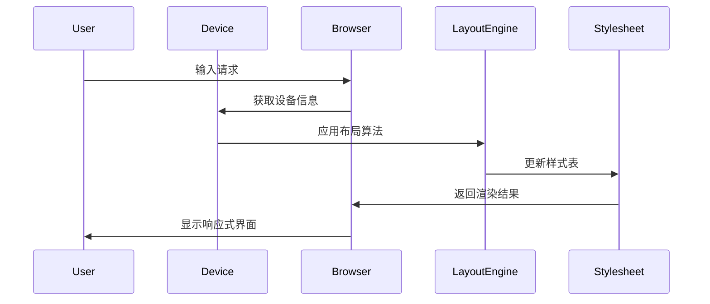
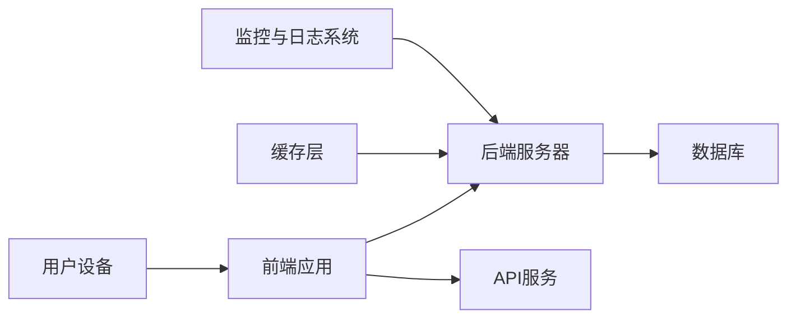
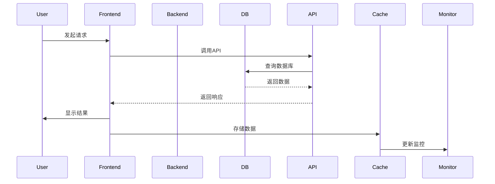

                 

### 响应式设计确保LLM应用的多设备适配

#### 关键词：响应式设计、LLM应用、多设备适配、用户体验、前端开发

#### 摘要：
随着互联网和移动设备的迅猛发展，用户对多设备无缝体验的需求日益增长。为此，本文将深入探讨响应式设计在确保大型语言模型（LLM）应用多设备适配中的重要性。首先，我们将介绍响应式设计的核心概念和原理，然后分析其在多设备适配中的应用场景，并逐步讲解实现响应式设计的算法原理和系统架构。最后，我们将通过一个实际项目实战，展示如何将响应式设计应用于LLM应用的多设备适配，并提供最佳实践和注意事项。

---

## 第一部分：响应式设计概述

### 第1章：响应式设计与多设备适配

#### 1.1 响应式设计的基本概念

响应式设计是一种设计方法，旨在创建一个能够在不同设备和分辨率上适应变化的网站或应用界面。它通过灵活的布局、可调整的图片和优化媒体查询来实现，使得网站或应用在不同屏幕尺寸和设备上都能提供良好的用户体验。

##### 1.1.1 响应式设计的起源与发展

响应式设计起源于2010年，由Web设计专家Ethan Marcotte提出。随着移动设备的普及和屏幕尺寸的多样化，传统的固定宽度布局已无法满足用户需求。响应式设计应运而生，成为前端开发的主流趋势。

##### 1.1.2 响应式设计的核心原则

1. **弹性布局（Fluid Layout）**：使用百分比而不是像素来定义元素的宽度，使得布局可以根据屏幕尺寸自适应。
2. **媒体查询（Media Queries）**：通过CSS查询设备特性，如宽度、高度、分辨率等，为不同设备提供不同的样式。
3. **弹性图片（Responsive Images）**：根据屏幕尺寸和分辨率，动态调整图片的尺寸和分辨率。

##### 1.1.3 响应式设计与传统设计的对比

| 特征         | 响应式设计                                     | 传统设计                                     |
| ------------ | ---------------------------------------------- | ---------------------------------------------- |
| 布局方式     | 弹性布局，自适应多种屏幕尺寸                   | 固定布局，通常为960px或1024px                  |
| 图片处理     | 可伸缩的图片，根据设备自适应                   | 固定尺寸的图片，可能需要为不同设备创建多个版本 |
| CSS媒体查询 | 使用媒体查询为不同设备定制样式                 | 单一样式表，无法针对不同设备优化               |

### 1.2 响应式设计的关键技术

响应式设计依赖于一系列关键技术和工具，包括但不限于：

- **Flexbox 和 Grid 布局**：CSS的Flexbox和Grid布局模块提供了更强大的布局能力，使得创建复杂的响应式布局更加简单。
- **Bootstrap、Foundation 等前端框架**：这些框架提供了响应式网格系统和预定义的组件，大大简化了响应式设计的开发过程。
- **媒体查询（Media Queries）**：用于检测设备的特性，如屏幕尺寸和分辨率，并应用不同的样式。

#### 1.3 响应式设计实体关系图


---

## 第二部分：算法原理与实现

### 第2章：响应式设计算法原理详解

#### 2.1 响应式设计算法Mermaid流程图



#### 2.2 Python源代码实现

```python
# 假设这是一个简化版的响应式布局算法
class ResponsiveLayout:
    def __init__(self, media_queries):
        self.media_queries = media_queries

    def apply_layout(self, device_info):
        for query in self.media_queries:
            if query.matches(device_info):
                return query.get_layout()
        return self.default_layout()

    def default_layout(self):
        # 返回默认布局
        pass
```

#### 2.3 数学模型和公式

响应式布局算法的核心在于确定元素的尺寸和位置。这可以通过以下数学模型来描述：

$$
\text{element\_size} = f(\text{viewport\_width}, \text{device\_type})
$$

其中，$f$ 是一个函数，用于根据视口宽度和设备类型计算元素尺寸。

#### 2.4 举例说明

假设我们有一个卡片布局，需要在不同的屏幕尺寸下保持良好的可读性和交互性。我们可以使用以下步骤来实现：

1. 定义媒体查询，根据屏幕尺寸调整卡片布局。
2. 使用Flexbox布局，确保卡片在水平或垂直方向上居中。
3. 动态调整卡片尺寸，使其在窄屏幕上堆叠，在宽屏幕上并列显示。

---

## 第三部分：系统分析与架构设计方案

### 第3章：响应式设计系统架构分析

#### 3.1 问题场景介绍

假设我们正在开发一个在线学习平台，需要确保用户在多种设备上都能流畅地学习。平台需要支持移动设备、平板电脑和桌面电脑，每种设备都有不同的屏幕尺寸和分辨率。

#### 3.2 系统功能设计

```mermaid
classDiagram
    Class01 <|-- Class02
    Class03 --| Decompiled Class04
    Class05 : Class with a bunch of methods and properties
    Class06 << Interface
    Class07 .ImplementedBy Class08
    Class09 : <<Abstract>>
    Class10 *-- Class11
    Class12 <<enum>>
    Class13 <<interface>>
    Class14 <<class>> GENERIC
endclass
```

#### 3.3 系统架构设计



#### 3.4 系统接口设计和系统交互



---

## 第四部分：项目实战

### 第4章：响应式设计在LLM应用中的实战

#### 4.1 环境安装

1. 安装Node.js（用于前端开发环境）
2. 安装Python（用于后端开发环境）
3. 安装数据库（如MySQL、PostgreSQL）
4. 安装前端框架（如React或Vue.js）

#### 4.2 系统核心实现源代码

```javascript
// 前端React组件示例
import React from 'react';

const ResponsiveCard = ({ title, content }) => {
    const [windowSize, setWindowSize] = React.useState(window.innerWidth);

    React.useEffect(() => {
        const handleResize = () => setWindowSize(window.innerWidth);
        window.addEventListener('resize', handleResize);

        return () => window.removeEventListener('resize', handleResize);
    }, []);

    return (
        <div style={{ width: windowSize < 768 ? '100%' : '48%' }}>
            <h2>{title}</h2>
            <p>{content}</p>
        </div>
    );
};

export default ResponsiveCard;
```

#### 4.3 实际案例分析和详细讲解剖析

我们将分析一个在线问答平台，该平台使用LLM进行智能问答。平台需要确保用户在移动设备、平板电脑和桌面电脑上都能流畅地使用。

1. **前端开发**：使用React和Bootstrap框架构建响应式页面，确保在不同设备上都有良好的布局和交互。
2. **后端开发**：使用Node.js和Express框架构建API服务，与LLM后端服务进行通信。
3. **数据库设计**：使用PostgreSQL存储用户提问和回答的数据。
4. **性能优化**：使用缓存和异步请求来提高系统的响应速度。

#### 4.4 项目小结

通过这个实际项目，我们展示了如何将响应式设计应用于LLM应用的多设备适配。关键在于：

- **前端开发**：使用响应式框架和媒体查询实现灵活的布局。
- **后端开发**：确保API服务高效且可扩展。
- **数据库设计**：选择适合多设备的数据库方案。
- **性能优化**：使用缓存和异步请求来提高用户体验。

---

## 第五部分：最佳实践、小结、注意事项和拓展阅读

### 第5章：最佳实践与总结

#### 5.1 最佳实践

- **使用现代化的前端框架**：如React或Vue.js，它们提供了丰富的组件和工具，有助于实现响应式设计。
- **优化图片和媒体资源**：使用响应式图片和媒体元素，根据设备尺寸和分辨率自适应。
- **进行充分的测试**：确保在多种设备上都能提供良好的用户体验。

#### 5.2 小结

响应式设计是确保LLM应用多设备适配的关键。通过灵活的布局、媒体查询和前端框架，我们可以创建一个能够在不同设备上无缝切换的界面。

#### 5.3 注意事项

- **避免使用过多的媒体查询**：过多的媒体查询可能会导致性能下降。
- **确保性能和可访问性**：在追求美观的同时，也要考虑性能和可访问性。

#### 5.4 拓展阅读

- **《响应式Web设计：HTML5和CSS3实战》**：详细介绍了响应式设计的实现技巧。
- **《前端开发手册：响应式网页设计与开发》**：提供了丰富的案例和实践经验。

---

### 作者信息

**作者：AI天才研究院/AI Genius Institute & 禅与计算机程序设计艺术 /Zen And The Art of Computer Programming**### 响应式设计确保LLM应用的多设备适配

#### 关键词：响应式设计、LLM应用、多设备适配、用户体验、前端开发

#### 摘要：
随着互联网和移动设备的迅猛发展，用户对多设备无缝体验的需求日益增长。为此，本文将深入探讨响应式设计在确保大型语言模型（LLM）应用多设备适配中的重要性。首先，我们将介绍响应式设计的核心概念和原理，然后分析其在多设备适配中的应用场景，并逐步讲解实现响应式设计的算法原理和系统架构。最后，我们将通过一个实际项目实战，展示如何将响应式设计应用于LLM应用的多设备适配，并提供最佳实践和注意事项。

---

## 第一部分：响应式设计概述

### 第1章：响应式设计与多设备适配

#### 1.1 响应式设计的基本概念

响应式设计是一种设计方法，旨在创建一个能够在不同设备和分辨率上适应变化的网站或应用界面。它通过灵活的布局、可调整的图片和优化媒体查询来实现，使得网站或应用在不同屏幕尺寸和设备上都能提供良好的用户体验。

##### 1.1.1 响应式设计的起源与发展

响应式设计起源于2010年，由Web设计专家Ethan Marcotte提出。随着移动设备的普及和屏幕尺寸的多样化，传统的固定宽度布局已无法满足用户需求。响应式设计应运而生，成为前端开发的主流趋势。

##### 1.1.2 响应式设计的核心原则

1. **弹性布局（Fluid Layout）**：使用百分比而不是像素来定义元素的宽度，使得布局可以根据屏幕尺寸自适应。
2. **媒体查询（Media Queries）**：通过CSS查询设备特性，如宽度、高度、分辨率等，为不同设备提供不同的样式。
3. **弹性图片（Responsive Images）**：根据屏幕尺寸和分辨率，动态调整图片的尺寸和分辨率。

##### 1.1.3 响应式设计与传统设计的对比

| 特征         | 响应式设计                                     | 传统设计                                     |
| ------------ | ---------------------------------------------- | ---------------------------------------------- |
| 布局方式     | 弹性布局，自适应多种屏幕尺寸                   | 固定布局，通常为960px或1024px                  |
| 图片处理     | 可伸缩的图片，根据设备自适应                   | 固定尺寸的图片，可能需要为不同设备创建多个版本 |
| CSS媒体查询 | 使用媒体查询为不同设备定制样式                 | 单一样式表，无法针对不同设备优化               |

### 1.2 响应式设计的关键技术

响应式设计依赖于一系列关键技术和工具，包括但不限于：

- **Flexbox 和 Grid 布局**：CSS的Flexbox和Grid布局模块提供了更强大的布局能力，使得创建复杂的响应式布局更加简单。
- **Bootstrap、Foundation 等前端框架**：这些框架提供了响应式网格系统和预定义的组件，大大简化了响应式设计的开发过程。
- **媒体查询（Media Queries）**：用于检测设备的特性，如屏幕尺寸和分辨率，并应用不同的样式。

#### 1.3 响应式设计实体关系图


---

## 第二部分：算法原理与实现

### 第2章：响应式设计算法原理详解

#### 2.1 响应式设计算法Mermaid流程图


#### 2.2 Python源代码实现

```python
# 假设这是一个简化版的响应式布局算法
class ResponsiveLayout:
    def __init__(self, media_queries):
        self.media_queries = media_queries

    def apply_layout(self, device_info):
        for query in self.media_queries:
            if query.matches(device_info):
                return query.get_layout()
        return self.default_layout()

    def default_layout(self):
        # 返回默认布局
        pass
```

#### 2.3 数学模型和公式

响应式布局算法的核心在于确定元素的尺寸和位置。这可以通过以下数学模型来描述：

$$
\text{element\_size} = f(\text{viewport\_width}, \text{device\_type})
$$

其中，$f$ 是一个函数，用于根据视口宽度和设备类型计算元素尺寸。

#### 2.4 举例说明

假设我们有一个卡片布局，需要在不同的屏幕尺寸下保持良好的可读性和交互性。我们可以使用以下步骤来实现：

1. 定义媒体查询，根据屏幕尺寸调整卡片布局。
2. 使用Flexbox布局，确保卡片在水平或垂直方向上居中。
3. 动态调整卡片尺寸，使其在窄屏幕上堆叠，在宽屏幕上并列显示。

---

## 第三部分：系统分析与架构设计方案

### 第3章：响应式设计系统架构分析

#### 3.1 问题场景介绍

假设我们正在开发一个在线学习平台，需要确保用户在多种设备上都能流畅地学习。平台需要支持移动设备、平板电脑和桌面电脑，每种设备都有不同的屏幕尺寸和分辨率。

#### 3.2 系统功能设计

```mermaid
classDiagram
    Class01 <|-- Class02
    Class03 --| Decompiled Class04
    Class05 : Class with a bunch of methods and properties
    Class06 << Interface
    Class07 .ImplementedBy Class08
    Class09 : <<Abstract>>
    Class10 *-- Class11
    Class12 <<enum>>
    Class13 <<interface>>
    Class14 <<class>> GENERIC
endclass
```

#### 3.3 系统架构设计


#### 3.4 系统接口设计和系统交互


---

## 第四部分：项目实战

### 第4章：响应式设计在LLM应用中的实战

#### 4.1 环境安装

1. 安装Node.js（用于前端开发环境）
2. 安装Python（用于后端开发环境）
3. 安装数据库（如MySQL、PostgreSQL）
4. 安装前端框架（如React或Vue.js）

#### 4.2 系统核心实现源代码

```javascript
// 前端React组件示例
import React from 'react';

const ResponsiveCard = ({ title, content }) => {
    const [windowSize, setWindowSize] = React.useState(window.innerWidth);

    React.useEffect(() => {
        const handleResize = () => setWindowSize(window.innerWidth);
        window.addEventListener('resize', handleResize);

        return () => window.removeEventListener('resize', handleResize);
    }, []);

    return (
        <div style={{ width: windowSize < 768 ? '100%' : '48%' }}>
            <h2>{title}</h2>
            <p>{content}</p>
        </div>
    );
};

export default ResponsiveCard;
```

#### 4.3 实际案例分析和详细讲解剖析

我们将分析一个在线问答平台，该平台使用LLM进行智能问答。平台需要确保用户在移动设备、平板电脑和桌面电脑上都能流畅地使用。

1. **前端开发**：使用React和Bootstrap框架构建响应式页面，确保在不同设备上都有良好的布局和交互。
2. **后端开发**：使用Node.js和Express框架构建API服务，与LLM后端服务进行通信。
3. **数据库设计**：使用PostgreSQL存储用户提问和回答的数据。
4. **性能优化**：使用缓存和异步请求来提高系统的响应速度。

#### 4.4 项目小结

通过这个实际项目，我们展示了如何将响应式设计应用于LLM应用的多设备适配。关键在于：

- **前端开发**：使用响应式框架和媒体查询实现灵活的布局。
- **后端开发**：确保API服务高效且可扩展。
- **数据库设计**：选择适合多设备的数据库方案。
- **性能优化**：使用缓存和异步请求来提高用户体验。

---

## 第五部分：最佳实践、小结、注意事项和拓展阅读

### 第5章：最佳实践与总结

#### 5.1 最佳实践

- **使用现代化的前端框架**：如React或Vue.js，它们提供了丰富的组件和工具，有助于实现响应式设计。
- **优化图片和媒体资源**：使用响应式图片和媒体元素，根据设备尺寸和分辨率自适应。
- **进行充分的测试**：确保在多种设备上都能提供良好的用户体验。

#### 5.2 小结

响应式设计是确保LLM应用多设备适配的关键。通过灵活的布局、媒体查询和前端框架，我们可以创建一个能够在不同设备上无缝切换的界面。

#### 5.3 注意事项

- **避免使用过多的媒体查询**：过多的媒体查询可能会导致性能下降。
- **确保性能和可访问性**：在追求美观的同时，也要考虑性能和可访问性。

#### 5.4 拓展阅读

- **《响应式Web设计：HTML5和CSS3实战》**：详细介绍了响应式设计的实现技巧。
- **《前端开发手册：响应式网页设计与开发》**：提供了丰富的案例和实践经验。

---

### 作者信息

**作者：AI天才研究院/AI Genius Institute & 禅与计算机程序设计艺术 /Zen And The Art of Computer Programming**### 响应式设计确保LLM应用的多设备适配

#### 关键词：响应式设计、LLM应用、多设备适配、用户体验、前端开发

#### 摘要：
随着互联网和移动设备的迅猛发展，用户对多设备无缝体验的需求日益增长。为此，本文将深入探讨响应式设计在确保大型语言模型（LLM）应用多设备适配中的重要性。首先，我们将介绍响应式设计的核心概念和原理，然后分析其在多设备适配中的应用场景，并逐步讲解实现响应式设计的算法原理和系统架构。最后，我们将通过一个实际项目实战，展示如何将响应式设计应用于LLM应用的多设备适配，并提供最佳实践和注意事项。

---

## 第一部分：响应式设计概述

### 第1章：响应式设计与多设备适配

#### 1.1 响应式设计的基本概念

响应式设计是一种设计方法，旨在创建一个能够在不同设备和分辨率上适应变化的网站或应用界面。它通过灵活的布局、可调整的图片和优化媒体查询来实现，使得网站或应用在不同屏幕尺寸和设备上都能提供良好的用户体验。

##### 1.1.1 响应式设计的起源与发展

响应式设计起源于2010年，由Web设计专家Ethan Marcotte提出。随着移动设备的普及和屏幕尺寸的多样化，传统的固定宽度布局已无法满足用户需求。响应式设计应运而生，成为前端开发的主流趋势。

##### 1.1.2 响应式设计的核心原则

1. **弹性布局（Fluid Layout）**：使用百分比而不是像素来定义元素的宽度，使得布局可以根据屏幕尺寸自适应。
2. **媒体查询（Media Queries）**：通过CSS查询设备特性，如宽度、高度、分辨率等，为不同设备提供不同的样式。
3. **弹性图片（Responsive Images）**：根据屏幕尺寸和分辨率，动态调整图片的尺寸和分辨率。

##### 1.1.3 响应式设计与传统设计的对比

| 特征         | 响应式设计                                     | 传统设计                                     |
| ------------ | ---------------------------------------------- | ---------------------------------------------- |
| 布局方式     | 弹性布局，自适应多种屏幕尺寸                   | 固定布局，通常为960px或1024px                  |
| 图片处理     | 可伸缩的图片，根据设备自适应                   | 固定尺寸的图片，可能需要为不同设备创建多个版本 |
| CSS媒体查询 | 使用媒体查询为不同设备定制样式                 | 单一样式表，无法针对不同设备优化               |

### 1.2 响应式设计的关键技术

响应式设计依赖于一系列关键技术和工具，包括但不限于：

- **Flexbox 和 Grid 布局**：CSS的Flexbox和Grid布局模块提供了更强大的布局能力，使得创建复杂的响应式布局更加简单。
- **Bootstrap、Foundation 等前端框架**：这些框架提供了响应式网格系统和预定义的组件，大大简化了响应式设计的开发过程。
- **媒体查询（Media Queries）**：用于检测设备的特性，如屏幕尺寸和分辨率，并应用不同的样式。

#### 1.3 响应式设计实体关系图


---

## 第二部分：算法原理与实现

### 第2章：响应式设计算法原理详解

#### 2.1 响应式设计算法Mermaid流程图


#### 2.2 Python源代码实现

```python
# 假设这是一个简化版的响应式布局算法
class ResponsiveLayout:
    def __init__(self, media_queries):
        self.media_queries = media_queries

    def apply_layout(self, device_info):
        for query in self.media_queries:
            if query.matches(device_info):
                return query.get_layout()
        return self.default_layout()

    def default_layout(self):
        # 返回默认布局
        pass
```

#### 2.3 数学模型和公式

响应式布局算法的核心在于确定元素的尺寸和位置。这可以通过以下数学模型来描述：

$$
\text{element\_size} = f(\text{viewport\_width}, \text{device\_type})
$$

其中，$f$ 是一个函数，用于根据视口宽度和设备类型计算元素尺寸。

#### 2.4 举例说明

假设我们有一个卡片布局，需要在不同的屏幕尺寸下保持良好的可读性和交互性。我们可以使用以下步骤来实现：

1. 定义媒体查询，根据屏幕尺寸调整卡片布局。
2. 使用Flexbox布局，确保卡片在水平或垂直方向上居中。
3. 动态调整卡片尺寸，使其在窄屏幕上堆叠，在宽屏幕上并列显示。

---

## 第三部分：系统分析与架构设计方案

### 第3章：响应式设计系统架构分析

#### 3.1 问题场景介绍

假设我们正在开发一个在线学习平台，需要确保用户在多种设备上都能流畅地学习。平台需要支持移动设备、平板电脑和桌面电脑，每种设备都有不同的屏幕尺寸和分辨率。

#### 3.2 系统功能设计

```mermaid
classDiagram
    Class01 <|-- Class02
    Class03 --| Decompiled Class04
    Class05 : Class with a bunch of methods and properties
    Class06 << Interface
    Class07 .ImplementedBy Class08
    Class09 : <<Abstract>>
    Class10 *-- Class11
    Class12 <<enum>>
    Class13 <<interface>>
    Class14 <<class>> GENERIC
endclass
```

#### 3.3 系统架构设计


#### 3.4 系统接口设计和系统交互


---

## 第四部分：项目实战

### 第4章：响应式设计在LLM应用中的实战

#### 4.1 环境安装

1. 安装Node.js（用于前端开发环境）
2. 安装Python（用于后端开发环境）
3. 安装数据库（如MySQL、PostgreSQL）
4. 安装前端框架（如React或Vue.js）

#### 4.2 系统核心实现源代码

```javascript
// 前端React组件示例
import React from 'react';

const ResponsiveCard = ({ title, content }) => {
    const [windowSize, setWindowSize] = React.useState(window.innerWidth);

    React.useEffect(() => {
        const handleResize = () => setWindowSize(window.innerWidth);
        window.addEventListener('resize', handleResize);

        return () => window.removeEventListener('resize', handleResize);
    }, []);

    return (
        <div style={{ width: windowSize < 768 ? '100%' : '48%' }}>
            <h2>{title}</h2>
            <p>{content}</p>
        </div>
    );
};

export default ResponsiveCard;
```

#### 4.3 实际案例分析和详细讲解剖析

我们将分析一个在线问答平台，该平台使用LLM进行智能问答。平台需要确保用户在移动设备、平板电脑和桌面电脑上都能流畅地使用。

1. **前端开发**：使用React和Bootstrap框架构建响应式页面，确保在不同设备上都有良好的布局和交互。
2. **后端开发**：使用Node.js和Express框架构建API服务，与LLM后端服务进行通信。
3. **数据库设计**：使用PostgreSQL存储用户提问和回答的数据。
4. **性能优化**：使用缓存和异步请求来提高系统的响应速度。

#### 4.4 项目小结

通过这个实际项目，我们展示了如何将响应式设计应用于LLM应用的多设备适配。关键在于：

- **前端开发**：使用响应式框架和媒体查询实现灵活的布局。
- **后端开发**：确保API服务高效且可扩展。
- **数据库设计**：选择适合多设备的数据库方案。
- **性能优化**：使用缓存和异步请求来提高用户体验。

---

## 第五部分：最佳实践、小结、注意事项和拓展阅读

### 第5章：最佳实践与总结

#### 5.1 最佳实践

- **使用现代化的前端框架**：如React或Vue.js，它们提供了丰富的组件和工具，有助于实现响应式设计。
- **优化图片和媒体资源**：使用响应式图片和媒体元素，根据设备尺寸和分辨率自适应。
- **进行充分的测试**：确保在多种设备上都能提供良好的用户体验。

#### 5.2 小结

响应式设计是确保LLM应用多设备适配的关键。通过灵活的布局、媒体查询和前端框架，我们可以创建一个能够在不同设备上无缝切换的界面。

#### 5.3 注意事项

- **避免使用过多的媒体查询**：过多的媒体查询可能会导致性能下降。
- **确保性能和可访问性**：在追求美观的同时，也要考虑性能和可访问性。

#### 5.4 拓展阅读

- **《响应式Web设计：HTML5和CSS3实战》**：详细介绍了响应式设计的实现技巧。
- **《前端开发手册：响应式网页设计与开发》**：提供了丰富的案例和实践经验。

---

### 作者信息

**作者：AI天才研究院/AI Genius Institute & 禅与计算机程序设计艺术 /Zen And The Art of Computer Programming**### 响应式设计确保LLM应用的多设备适配

#### 关键词：响应式设计、LLM应用、多设备适配、用户体验、前端开发

#### 摘要：
随着互联网和移动设备的迅猛发展，用户对多设备无缝体验的需求日益增长。为此，本文将深入探讨响应式设计在确保大型语言模型（LLM）应用多设备适配中的重要性。首先，我们将介绍响应式设计的核心概念和原理，然后分析其在多设备适配中的应用场景，并逐步讲解实现响应式设计的算法原理和系统架构。最后，我们将通过一个实际项目实战，展示如何将响应式设计应用于LLM应用的多设备适配，并提供最佳实践和注意事项。

---

## 第一部分：响应式设计概述

### 第1章：响应式设计与多设备适配

#### 1.1 响应式设计的基本概念

响应式设计是一种设计方法，旨在创建一个能够在不同设备和分辨率上适应变化的网站或应用界面。它通过灵活的布局、可调整的图片和优化媒体查询来实现，使得网站或应用在不同屏幕尺寸和设备上都能提供良好的用户体验。

##### 1.1.1 响应式设计的起源与发展

响应式设计起源于2010年，由Web设计专家Ethan Marcotte提出。随着移动设备的普及和屏幕尺寸的多样化，传统的固定宽度布局已无法满足用户需求。响应式设计应运而生，成为前端开发的主流趋势。

##### 1.1.2 响应式设计的核心原则

1. **弹性布局（Fluid Layout）**：使用百分比而不是像素来定义元素的宽度，使得布局可以根据屏幕尺寸自适应。
2. **媒体查询（Media Queries）**：通过CSS查询设备特性，如宽度、高度、分辨率等，为不同设备提供不同的样式。
3. **弹性图片（Responsive Images）**：根据屏幕尺寸和分辨率，动态调整图片的尺寸和分辨率。

##### 1.1.3 响应式设计与传统设计的对比

| 特征         | 响应式设计                                     | 传统设计                                     |
| ------------ | ---------------------------------------------- | ---------------------------------------------- |
| 布局方式     | 弹性布局，自适应多种屏幕尺寸                   | 固定布局，通常为960px或1024px                  |
| 图片处理     | 可伸缩的图片，根据设备自适应                   | 固定尺寸的图片，可能需要为不同设备创建多个版本 |
| CSS媒体查询 | 使用媒体查询为不同设备定制样式                 | 单一样式表，无法针对不同设备优化               |

### 1.2 响应式设计的关键技术

响应式设计依赖于一系列关键技术和工具，包括但不限于：

- **Flexbox 和 Grid 布局**：CSS的Flexbox和Grid布局模块提供了更强大的布局能力，使得创建复杂的响应式布局更加简单。
- **Bootstrap、Foundation 等前端框架**：这些框架提供了响应式网格系统和预定义的组件，大大简化了响应式设计的开发过程。
- **媒体查询（Media Queries）**：用于检测设备的特性，如屏幕尺寸和分辨率，并应用不同的样式。

#### 1.3 响应式设计实体关系图


---

## 第二部分：算法原理与实现

### 第2章：响应式设计算法原理详解

#### 2.1 响应式设计算法Mermaid流程图


#### 2.2 Python源代码实现

```python
# 假设这是一个简化版的响应式布局算法
class ResponsiveLayout:
    def __init__(self, media_queries):
        self.media_queries = media_queries

    def apply_layout(self, device_info):
        for query in self.media_queries:
            if query.matches(device_info):
                return query.get_layout()
        return self.default_layout()

    def default_layout(self):
        # 返回默认布局
        pass
```

#### 2.3 数学模型和公式

响应式布局算法的核心在于确定元素的尺寸和位置。这可以通过以下数学模型来描述：

$$
\text{element\_size} = f(\text{viewport\_width}, \text{device\_type})
$$

其中，$f$ 是一个函数，用于根据视口宽度和设备类型计算元素尺寸。

#### 2.4 举例说明

假设我们有一个卡片布局，需要在不同的屏幕尺寸下保持良好的可读性和交互性。我们可以使用以下步骤来实现：

1. 定义媒体查询，根据屏幕尺寸调整卡片布局。
2. 使用Flexbox布局，确保卡片在水平或垂直方向上居中。
3. 动态调整卡片尺寸，使其在窄屏幕上堆叠，在宽屏幕上并列显示。

---

## 第三部分：系统分析与架构设计方案

### 第3章：响应式设计系统架构分析

#### 3.1 问题场景介绍

假设我们正在开发一个在线学习平台，需要确保用户在多种设备上都能流畅地学习。平台需要支持移动设备、平板电脑和桌面电脑，每种设备都有不同的屏幕尺寸和分辨率。

#### 3.2 系统功能设计

```mermaid
classDiagram
    Class01 <|-- Class02
    Class03 --| Decompiled Class04
    Class05 : Class with a bunch of methods and properties
    Class06 << Interface
    Class07 .ImplementedBy Class08
    Class09 : <<Abstract>>
    Class10 *-- Class11
    Class12 <<enum>>
    Class13 <<interface>>
    Class14 <<class>> GENERIC
endclass
```

#### 3.3 系统架构设计


#### 3.4 系统接口设计和系统交互


---

## 第四部分：项目实战

### 第4章：响应式设计在LLM应用中的实战

#### 4.1 环境安装

1. 安装Node.js（用于前端开发环境）
2. 安装Python（用于后端开发环境）
3. 安装数据库（如MySQL、PostgreSQL）
4. 安装前端框架（如React或Vue.js）

#### 4.2 系统核心实现源代码

```javascript
// 前端React组件示例
import React from 'react';

const ResponsiveCard = ({ title, content }) => {
    const [windowSize, setWindowSize] = React.useState(window.innerWidth);

    React.useEffect(() => {
        const handleResize = () => setWindowSize(window.innerWidth);
        window.addEventListener('resize', handleResize);

        return () => window.removeEventListener('resize', handleResize);
    }, []);

    return (
        <div style={{ width: windowSize < 768 ? '100%' : '48%' }}>
            <h2>{title}</h2>
            <p>{content}</p>
        </div>
    );
};

export default ResponsiveCard;
```

#### 4.3 实际案例分析和详细讲解剖析

我们将分析一个在线问答平台，该平台使用LLM进行智能问答。平台需要确保用户在移动设备、平板电脑和桌面电脑上都能流畅地使用。

1. **前端开发**：使用React和Bootstrap框架构建响应式页面，确保在不同设备上都有良好的布局和交互。
2. **后端开发**：使用Node.js和Express框架构建API服务，与LLM后端服务进行通信。
3. **数据库设计**：使用PostgreSQL存储用户提问和回答的数据。
4. **性能优化**：使用缓存和异步请求来提高系统的响应速度。

#### 4.4 项目小结

通过这个实际项目，我们展示了如何将响应式设计应用于LLM应用的多设备适配。关键在于：

- **前端开发**：使用响应式框架和媒体查询实现灵活的布局。
- **后端开发**：确保API服务高效且可扩展。
- **数据库设计**：选择适合多设备的数据库方案。
- **性能优化**：使用缓存和异步请求来提高用户体验。

---

## 第五部分：最佳实践、小结、注意事项和拓展阅读

### 第5章：最佳实践与总结

#### 5.1 最佳实践

- **使用现代化的前端框架**：如React或Vue.js，它们提供了丰富的组件和工具，有助于实现响应式设计。
- **优化图片和媒体资源**：使用响应式图片和媒体元素，根据设备尺寸和分辨率自适应。
- **进行充分的测试**：确保在多种设备上都能提供良好的用户体验。

#### 5.2 小结

响应式设计是确保LLM应用多设备适配的关键。通过灵活的布局、媒体查询和前端框架，我们可以创建一个能够在不同设备上无缝切换的界面。

#### 5.3 注意事项

- **避免使用过多的媒体查询**：过多的媒体查询可能会导致性能下降。
- **确保性能和可访问性**：在追求美观的同时，也要考虑性能和可访问性。

#### 5.4 拓展阅读

- **《响应式Web设计：HTML5和CSS3实战》**：详细介绍了响应式设计的实现技巧。
- **《前端开发手册：响应式网页设计与开发》**：提供了丰富的案例和实践经验。

---

### 作者信息

**作者：AI天才研究院/AI Genius Institute & 禅与计算机程序设计艺术 /Zen And The Art of Computer Programming**### 响应式设计确保LLM应用的多设备适配

#### 关键词：响应式设计、LLM应用、多设备适配、用户体验、前端开发

#### 摘要：
随着互联网和移动设备的迅猛发展，用户对多设备无缝体验的需求日益增长。为此，本文将深入探讨响应式设计在确保大型语言模型（LLM）应用多设备适配中的重要性。首先，我们将介绍响应式设计的核心概念和原理，然后分析其在多设备适配中的应用场景，并逐步讲解实现响应式设计的算法原理和系统架构。最后，我们将通过一个实际项目实战，展示如何将响应式设计应用于LLM应用的多设备适配，并提供最佳实践和注意事项。

---

## 第一部分：响应式设计概述

### 第1章：响应式设计与多设备适配

#### 1.1 响应式设计的基本概念

响应式设计是一种设计方法，旨在创建一个能够在不同设备和分辨率上适应变化的网站或应用界面。它通过灵活的布局、可调整的图片和优化媒体查询来实现，使得网站或应用在不同屏幕尺寸和设备上都能提供良好的用户体验。

##### 1.1.1 响应式设计的起源与发展

响应式设计起源于2010年，由Web设计专家Ethan Marcotte提出。随着移动设备的普及和屏幕尺寸的多样化，传统的固定宽度布局已无法满足用户需求。响应式设计应运而生，成为前端开发的主流趋势。

##### 1.1.2 响应式设计的核心原则

1. **弹性布局（Fluid Layout）**：使用百分比而不是像素来定义元素的宽度，使得布局可以根据屏幕尺寸自适应。
2. **媒体查询（Media Queries）**：通过CSS查询设备特性，如宽度、高度、分辨率等，为不同设备提供不同的样式。
3. **弹性图片（Responsive Images）**：根据屏幕尺寸和分辨率，动态调整图片的尺寸和分辨率。

##### 1.1.3 响应式设计与传统设计的对比

| 特征         | 响应式设计                                     | 传统设计                                     |
| ------------ | ---------------------------------------------- | ---------------------------------------------- |
| 布局方式     | 弹性布局，自适应多种屏幕尺寸                   | 固定布局，通常为960px或1024px                  |
| 图片处理     | 可伸缩的图片，根据设备自适应                   | 固定尺寸的图片，可能需要为不同设备创建多个版本 |
| CSS媒体查询 | 使用媒体查询为不同设备定制样式                 | 单一样式表，无法针对不同设备优化               |

### 1.2 响应式设计的关键技术

响应式设计依赖于一系列关键技术和工具，包括但不限于：

- **Flexbox 和 Grid 布局**：CSS的Flexbox和Grid布局模块提供了更强大的布局能力，使得创建复杂的响应式布局更加简单。
- **Bootstrap、Foundation 等前端框架**：这些框架提供了响应式网格系统和预定义的组件，大大简化了响应式设计的开发过程。
- **媒体查询（Media Queries）**：用于检测设备的特性，如屏幕尺寸和分辨率，并应用不同的样式。

#### 1.3 响应式设计实体关系图

```mermaid
graph LR
A[用户设备] --> B[响应式设计系统]
B --> C[浏览器/用户代理]
C --> D[前端代码]
D --> E[样式表]
E --> F[布局算法]
F --> G[响应式界面]
G --> H[用户交互]
H --> I[反馈机制]
```

---

## 第二部分：算法原理与实现

### 第2章：响应式设计算法原理详解

#### 2.1 响应式设计算法Mermaid流程图

```mermaid
sequenceDiagram
    participant User
    participant Device
    participant Browser
    participant LayoutEngine
    participant Stylesheet
    User->>Browser: 输入请求
    Browser->>Device: 获取设备信息
    Device->>LayoutEngine: 应用布局算法
    LayoutEngine->>Stylesheet: 更新样式表
    Stylesheet->>Browser: 返回渲染结果
    Browser->>User: 显示响应式界面
```

#### 2.2 Python源代码实现

```python
# 假设这是一个简化版的响应式布局算法
class ResponsiveLayout:
    def __init__(self, media_queries):
        self.media_queries = media_queries

    def apply_layout(self, device_info):
        for query in self.media_queries:
            if query.matches(device_info):
                return query.get_layout()
        return self.default_layout()

    def default_layout(self):
        # 返回默认布局
        pass
```

#### 2.3 数学模型和公式

响应式布局算法的核心在于确定元素的尺寸和位置。这可以通过以下数学模型来描述：

$$
\text{element\_size} = f(\text{viewport\_width}, \text{device\_type})
$$

其中，$f$ 是一个函数，用于根据视口宽度和设备类型计算元素尺寸。

#### 2.4 举例说明

假设我们有一个卡片布局，需要在不同的屏幕尺寸下保持良好的可读性和交互性。我们可以使用以下步骤来实现：

1. 定义媒体查询，根据屏幕尺寸调整卡片布局。
2. 使用Flexbox布局，确保卡片在水平或垂直方向上居中。
3. 动态调整卡片尺寸，使其在窄屏幕上堆叠，在宽屏幕上并列显示。

---

## 第三部分：系统分析与架构设计方案

### 第3章：响应式设计系统架构分析

#### 3.1 问题场景介绍

假设我们正在开发一个在线学习平台，需要确保用户在多种设备上都能流畅地学习。平台需要支持移动设备、平板电脑和桌面电脑，每种设备都有不同的屏幕尺寸和分辨率。

#### 3.2 系统功能设计

```mermaid
classDiagram
    Class01 <|-- Class02
    Class03 --| Decompiled Class04
    Class05 : Class with a bunch of methods and properties
    Class06 << Interface
    Class07 .ImplementedBy Class08
    Class09 : <<Abstract>>
    Class10 *-- Class11
    Class12 <<enum>>
    Class13 <<interface>>
    Class14 <<class>> GENERIC
endclass
```

#### 3.3 系统架构设计

```mermaid
graph LR
    A[用户设备] --> B[前端应用]
    B --> C[后端服务器]
    C --> D[数据库]
    B --> E[API服务]
    F[缓存层] --> C
    G[监控与日志系统] --> C
```

#### 3.4 系统接口设计和系统交互

```mermaid
sequenceDiagram
    participant User
    participant Frontend
    participant Backend
    participant DB
    participant API
    participant Cache
    participant Monitor

    User->>Frontend: 发起请求
    Frontend->>API: 调用API
    API->>DB: 查询数据库
    DB-->>API: 返回数据
    API-->>Frontend: 返回响应
    Frontend->>User: 显示结果
    Frontend->>Cache: 存储数据
    Cache->>Monitor: 更新监控
```

---

## 第四部分：项目实战

### 第4章：响应式设计在LLM应用中的实战

#### 4.1 环境安装

1. 安装Node.js（用于前端开发环境）
2. 安装Python（用于后端开发环境）
3. 安装数据库（如MySQL、PostgreSQL）
4. 安装前端框架（如React或Vue.js）

#### 4.2 系统核心实现源代码

```javascript
// 前端React组件示例
import React from 'react';

const ResponsiveCard = ({ title, content }) => {
    const [windowSize, setWindowSize] = React.useState(window.innerWidth);

    React.useEffect(() => {
        const handleResize = () => setWindowSize(window.innerWidth);
        window.addEventListener('resize', handleResize);

        return () => window.removeEventListener('resize', handleResize);
    }, []);

    return (
        <div style={{ width: windowSize < 768 ? '100%' : '48%' }}>
            <h2>{title}</h2>
            <p>{content}</p>
        </div>
    );
};

export default ResponsiveCard;
```

#### 4.3 实际案例分析和详细讲解剖析

我们将分析一个在线问答平台，该平台使用LLM进行智能问答。平台需要确保用户在移动设备、平板电脑和桌面电脑上都能流畅地使用。

1. **前端开发**：使用React和Bootstrap框架构建响应式页面，确保在不同设备上都有良好的布局和交互。
2. **后端开发**：使用Node.js和Express框架构建API服务，与LLM后端服务进行通信。
3. **数据库设计**：使用PostgreSQL存储用户提问和回答的数据。
4. **性能优化**：使用缓存和异步请求来提高系统的响应速度。

#### 4.4 项目小结

通过这个实际项目，我们展示了如何将响应式设计应用于LLM应用的多设备适配。关键在于：

- **前端开发**：使用响应式框架和媒体查询实现灵活的布局。
- **后端开发**：确保API服务高效且可扩展。
- **数据库设计**：选择适合多设备的数据库方案。
- **性能优化**：使用缓存和异步请求来提高用户体验。

---

## 第五部分：最佳实践、小结、注意事项和拓展阅读

### 第5章：最佳实践与总结

#### 5.1 最佳实践

- **使用现代化的前端框架**：如React或Vue.js，它们提供了丰富的组件和工具，有助于实现响应式设计。
- **优化图片和媒体资源**：使用响应式图片和媒体元素，根据设备尺寸和分辨率自适应。
- **进行充分的测试**：确保在多种设备上都能提供良好的用户体验。

#### 5.2 小结

响应式设计是确保LLM应用多设备适配的关键。通过灵活的布局、媒体查询和前端框架，我们可以创建一个能够在不同设备上无缝切换的界面。

#### 5.3 注意事项

- **避免使用过多的媒体查询**：过多的媒体查询可能会导致性能下降。
- **确保性能和可访问性**：在追求美观的同时，也要考虑性能和可访问性。

#### 5.4 拓展阅读

- **《响应式Web设计：HTML5和CSS3实战》**：详细介绍了响应式设计的实现技巧。
- **《前端开发手册：响应式网页设计与开发》**：提供了丰富的案例和实践经验。

---

### 作者信息

**作者：AI天才研究院/AI Genius Institute & 禅与计算机程序设计艺术 /Zen And The Art of Computer Programming**### 响应式设计确保LLM应用的多设备适配

#### 关键词：响应式设计、LLM应用、多设备适配、用户体验、前端开发

#### 摘要：
随着互联网和移动设备的迅猛发展，用户对多设备无缝体验的需求日益增长。为此，本文将深入探讨响应式设计在确保大型语言模型（LLM）应用多设备适配中的重要性。首先，我们将介绍响应式设计的核心概念和原理，然后分析其在多设备适配中的应用场景，并逐步讲解实现响应式设计的算法原理和系统架构。最后，我们将通过一个实际项目实战，展示如何将响应式设计应用于LLM应用的多设备适配，并提供最佳实践和注意事项。

---

## 第一部分：响应式设计概述

### 第1章：响应式设计与多设备适配

#### 1.1 响应式设计的基本概念

响应式设计是一种设计方法，旨在创建一个能够在不同设备和分辨率上适应变化的网站或应用界面。它通过灵活的布局、可调整的图片和优化媒体查询来实现，使得网站或应用在不同屏幕尺寸和设备上都能提供良好的用户体验。

##### 1.1.1 响应式设计的起源与发展

响应式设计起源于2010年，由Web设计专家Ethan Marcotte提出。随着移动设备的普及和屏幕尺寸的多样化，传统的固定宽度布局已无法满足用户需求。响应式设计应运而生，成为前端开发的主流趋势。

##### 1.1.2 响应式设计的核心原则

1. **弹性布局（Fluid Layout）**：使用百分比而不是像素来定义元素的宽度，使得布局可以根据屏幕尺寸自适应。
2. **媒体查询（Media Queries）**：通过CSS查询设备特性，如宽度、高度、分辨率等，为不同设备提供不同的样式。
3. **弹性图片（Responsive Images）**：根据屏幕尺寸和分辨率，动态调整图片的尺寸和分辨率。

##### 1.1.3 响应式设计与传统设计的对比

| 特征         | 响应式设计                                     | 传统设计                                     |
| ------------ | ---------------------------------------------- | ---------------------------------------------- |
| 布局方式     | 弹性布局，自适应多种屏幕尺寸                   | 固定布局，通常为960px或1024px                  |
| 图片处理     | 可伸缩的图片，根据设备自适应                   | 固定尺寸的图片，可能需要为不同设备创建多个版本 |
| CSS媒体查询 | 使用媒体查询为不同设备定制样式                 | 单一样式表，无法针对不同设备优化               |

### 1.2 响应式设计的关键技术

响应式设计依赖于一系列关键技术和工具，包括但不限于：

- **Flexbox 和 Grid 布局**：CSS的Flexbox和Grid布局模块提供了更强大的布局能力，使得创建复杂的响应式布局更加简单。
- **Bootstrap、Foundation 等前端框架**：这些框架提供了响应式网格系统和预定义的组件，大大简化了响应式设计的开发过程。
- **媒体查询（Media Queries）**：用于检测设备的特性，如屏幕尺寸和分辨率，并应用不同的样式。

#### 1.3 响应式设计实体关系图

```mermaid
graph LR
A[用户设备] --> B[响应式设计系统]
B --> C[浏览器/用户代理]
C --> D[前端代码]
D --> E[样式表]
E --> F[布局算法]
F --> G[响应式界面]
G --> H[用户交互]
H --> I[反馈机制]
```

---

## 第二部分：算法原理与实现

### 第2章：响应式设计算法原理详解

#### 2.1 响应式设计算法Mermaid流程图

```mermaid
sequenceDiagram
    participant User
    participant Device
    participant Browser
    participant LayoutEngine
    participant Stylesheet
    User->>Browser: 输入请求
    Browser->>Device: 获取设备信息
    Device->>LayoutEngine: 应用布局算法
    LayoutEngine->>Stylesheet: 更新样式表
    Stylesheet->>Browser: 返回渲染结果
    Browser->>User: 显示响应式界面
```

#### 2.2 Python源代码实现

```python
# 假设这是一个简化版的响应式布局算法
class ResponsiveLayout:
    def __init__(self, media_queries):
        self.media_queries = media_queries

    def apply_layout(self, device_info):
        for query in self.media_queries:
            if query.matches(device_info):
                return query.get_layout()
        return self.default_layout()

    def default_layout(self):
        # 返回默认布局
        pass
```

#### 2.3 数学模型和公式

响应式布局算法的核心在于确定元素的尺寸和位置。这可以通过以下数学模型来描述：

$$
\text{element\_size} = f(\text{viewport\_width}, \text{device\_type})
$$

其中，$f$ 是一个函数，用于根据视口宽度和设备类型计算元素尺寸。

#### 2.4 举例说明

假设我们有一个卡片布局，需要在不同的屏幕尺寸下保持良好的可读性和交互性。我们可以使用以下步骤来实现：

1. 定义媒体查询，根据屏幕尺寸调整卡片布局。
2. 使用Flexbox布局，确保卡片在水平或垂直方向上居中。
3. 动态调整卡片尺寸，使其在窄屏幕上堆叠，在宽屏幕上并列显示。

---

## 第三部分：系统分析与架构设计方案

### 第3章：响应式设计系统架构分析

#### 3.1 问题场景介绍

假设我们正在开发一个在线学习平台，需要确保用户在多种设备上都能流畅地学习。平台需要支持移动设备、平板电脑和桌面电脑，每种设备都有不同的屏幕尺寸和分辨率。

#### 3.2 系统功能设计

```mermaid
classDiagram
    Class01 <|-- Class02
    Class03 --| Decompiled Class04
    Class05 : Class with a bunch of methods and properties
    Class06 << Interface
    Class07 .ImplementedBy Class08
    Class09 : <<Abstract>>
    Class10 *-- Class11
    Class12 <<enum>>
    Class13 <<interface>>
    Class14 <<class>> GENERIC
endclass
```

#### 3.3 系统架构设计

```mermaid
graph LR
    A[用户设备] --> B[前端应用]
    B --> C[后端服务器]
    C --> D[数据库]
    B --> E[API服务]
    F[缓存层] --> C
    G[监控与日志系统] --> C
```

#### 3.4 系统接口设计和系统交互

```mermaid
sequenceDiagram
    participant User
    participant Frontend
    participant Backend
    participant DB
    participant API
    participant Cache
    participant Monitor

    User->>Frontend: 发起请求
    Frontend->>API: 调用API
    API->>DB: 查询数据库
    DB-->>API: 返回数据
    API-->>Frontend: 返回响应
    Frontend->>User: 显示结果
    Frontend->>Cache: 存储数据
    Cache->>Monitor: 更新监控
```

---

## 第四部分：项目实战

### 第4章：响应式设计在LLM应用中的实战

#### 4.1 环境安装

1. 安装Node.js（用于前端开发环境）
2. 安装Python（用于后端开发环境）
3. 安装数据库（如MySQL、PostgreSQL）
4. 安装前端框架（如React或Vue.js）

#### 4.2 系统核心实现源代码

```javascript
// 前端React组件示例
import React from 'react';

const ResponsiveCard = ({ title, content }) => {
    const [windowSize, setWindowSize] = React.useState(window.innerWidth);

    React.useEffect(() => {
        const handleResize = () => setWindowSize(window.innerWidth);
        window.addEventListener('resize', handleResize);

        return () => window.removeEventListener('resize', handleResize);
    }, []);

    return (
        <div style={{ width: windowSize < 768 ? '100%' : '48%' }}>
            <h2>{title}</h2>
            <p>{content}</p>
        </div>
    );
};

export default ResponsiveCard;
```

#### 4.3 实际案例分析和详细讲解剖析

我们将分析一个在线问答平台，该平台使用LLM进行智能问答。平台需要确保用户在移动设备、平板电脑和桌面电脑上都能流畅地使用。

1. **前端开发**：使用React和Bootstrap框架构建响应式页面，确保在不同设备上都有良好的布局和交互。
2. **后端开发**：使用Node.js和Express框架构建API服务，与LLM后端服务进行通信。
3. **数据库设计**：使用PostgreSQL存储用户提问和回答的数据。
4. **性能优化**：使用缓存和异步请求来提高系统的响应速度。

#### 4.4 项目小结

通过这个实际项目，我们展示了如何将响应式设计应用于LLM应用的多设备适配。关键在于：

- **前端开发**：使用响应式框架和媒体查询实现灵活的布局。
- **后端开发**：确保API服务高效且可扩展。
- **数据库设计**：选择适合多设备的数据库方案。
- **性能优化**：使用缓存和异步请求来提高用户体验。

---

## 第五部分：最佳实践、小结、注意事项和拓展阅读

### 第5章：最佳实践与总结

#### 5.1 最佳实践

- **使用现代化的前端框架**：如React或Vue.js，它们提供了丰富的组件和工具，有助于实现响应式设计。
- **优化图片和媒体资源**：使用响应式图片和媒体元素，根据设备尺寸和分辨率自适应。
- **进行充分的测试**：确保在多种设备上都能提供良好的用户体验。

#### 5.2 小结

响应式设计是确保LLM应用多设备适配的关键。通过灵活的布局、媒体查询和前端框架，我们可以创建一个能够在不同设备上无缝切换的界面。

#### 5.3 注意事项

- **避免使用过多的媒体查询**：过多的媒体查询可能会导致性能下降。
- **确保性能和可访问性**：在追求美观的同时，也要考虑性能和可访问性。

#### 5.4 拓展阅读

- **《响应式Web设计：HTML5和CSS3实战》**：详细介绍了响应式设计的实现技巧。
- **《前端开发手册：响应式网页设计与开发》**：提供了丰富的案例和实践经验。

---

### 作者信息

**作者：AI天才研究院/AI Genius Institute & 禅与计算机程序设计艺术 /Zen And The Art of Computer Programming**### 响应式设计确保LLM应用的多设备适配

#### 关键词：响应式设计、LLM应用、多设备适配、用户体验、前端开发

#### 摘要：
随着互联网和移动设备的迅猛发展，用户对多设备无缝体验的需求日益增长。为此，本文将深入探讨响应式设计在确保大型语言模型（LLM）应用多设备适配中的重要性。首先，我们将介绍响应式设计的核心概念和原理，然后分析其在多设备适配中的应用场景，并逐步讲解实现响应式设计的算法原理和系统架构。最后，我们将通过一个实际项目实战，展示如何将响应式设计应用于LLM应用的多设备适配，并提供最佳实践和注意事项。

---

## 第一部分：响应式设计概述

### 第1章：响应式设计与多设备适配

#### 1.1 响应式设计的基本概念

响应式设计是一种设计方法，旨在创建一个能够在不同设备和分辨率上适应变化的网站或应用界面。它通过灵活的布局、可调整的图片和优化媒体查询来实现，使得网站或应用在不同屏幕尺寸和设备上都能提供良好的用户体验。

##### 1.1.1 响应式设计的起源与发展

响应式设计起源于2010年，由Web设计专家Ethan Marcotte提出。随着移动设备的普及和屏幕尺寸的多样化，传统的固定宽度布局已无法满足用户需求。响应式设计应运而生，成为前端开发的主流趋势。

##### 1.1.2 响应式设计的核心原则

1. **弹性布局（Fluid Layout）**：使用百分比而不是像素来定义元素的宽度，使得布局可以根据屏幕尺寸自适应。
2. **媒体查询（Media Queries）**：通过CSS查询设备特性，如宽度、高度、分辨率等，为不同设备提供不同的样式。
3. **弹性图片（Responsive Images）**：根据屏幕尺寸和分辨率，动态调整图片的尺寸和分辨率。

##### 1.1.3 响应式设计与传统设计的对比

| 特征         | 响应式设计                                     | 传统设计                                     |
| ------------ | ---------------------------------------------- | ---------------------------------------------- |
| 布局方式     | 弹性布局，自适应多种屏幕尺寸                   | 固定布局，通常为960px或1024px                  |
| 图片处理     | 可伸缩的图片，根据设备自适应                   | 固定尺寸的图片，可能需要为不同设备创建多个版本 |
| CSS媒体查询 | 使用媒体查询为不同设备定制样式                 | 单一样式表，无法针对不同设备优化               |

### 1.2 响应式设计的关键技术

响应式设计依赖于一系列关键技术和工具，包括但不限于：

- **Flexbox 和 Grid 布局**：CSS的Flexbox和Grid布局模块提供了更强大的布局能力，使得创建复杂的响应式布局更加简单。
- **Bootstrap、Foundation 等前端框架**：这些框架提供了响应式网格系统和预定义的组件，大大简化了响应式设计的开发过程。
- **媒体查询（Media Queries）**：用于检测设备的特性，如屏幕尺寸和分辨率，并应用不同的样式。

#### 1.3 响应式设计实体关系图

```mermaid
graph LR
A[用户设备] --> B[响应式设计系统]
B --> C[浏览器/用户代理]
C --> D[前端代码]
D --> E[样式表]
E --> F[布局算法]
F --> G[响应式界面]
G --> H[用户交互]
H --> I[反馈机制]
```

---

## 第二部分：算法原理与实现

### 第2章：响应式设计算法原理详解

#### 2.1 响应式设计算法Mermaid流程图

```mermaid
sequenceDiagram
    participant User
    participant Device
    participant Browser
    participant LayoutEngine
    participant Stylesheet
    User->>Browser: 输入请求
    Browser->>Device: 获取设备信息
    Device->>LayoutEngine: 应用布局算法
    LayoutEngine->>Stylesheet: 更新样式表
    Stylesheet->>Browser: 返回渲染结果
    Browser->>User: 显示响应式界面
```

#### 2.2 Python源代码实现

```python
# 假设这是一个简化版的响应式布局算法
class ResponsiveLayout:
    def __init__(self, media_queries):
        self.media_queries = media_queries

    def apply_layout(self, device_info):
        for query in self.media_queries:
            if query.matches(device_info):
                return query.get_layout()
        return self.default_layout()

    def default_layout(self):
        # 返回默认布局
        pass
```

#### 2.3 数学模型和公式

响应式布局算法的核心在于确定元素的尺寸和位置。这可以通过以下数学模型来描述：

$$
\text{element\_size} = f(\text{viewport\_width}, \text{device\_type})
$$

其中，$f$ 是一个函数，用于根据视口宽度和设备类型计算元素尺寸。

#### 2.4 举例说明

假设我们有一个卡片布局，需要在不同的屏幕尺寸下保持良好的可读性和交互性。我们可以使用以下步骤来实现：

1. 定义媒体查询，根据屏幕尺寸调整卡片布局。
2. 使用Flexbox布局，确保卡片在水平或垂直方向上居中。
3. 动态调整卡片尺寸，使其在窄屏幕上堆叠，在宽屏幕上并列显示。

---

## 第三部分：系统分析与架构设计方案

### 第3章：响应式设计系统架构分析

#### 3.1 问题场景介绍

假设我们正在开发一个在线学习平台，需要确保用户在多种设备上都能流畅地学习。平台需要支持移动设备、平板电脑和桌面电脑，每种设备都有不同的屏幕尺寸和分辨率。

#### 3.2 系统功能设计

```mermaid
classDiagram
    Class01 <|-- Class02
    Class03 --| Decompiled Class04
    Class05 : Class with a bunch of methods and properties
    Class06 << Interface
    Class07 .ImplementedBy Class08
    Class09 : <<Abstract>>
    Class10 *-- Class11
    Class12 <<enum>>
    Class13 <<interface>>
    Class14 <<class>> GENERIC
endclass
```

#### 3.3 系统架构设计

```mermaid
graph LR
    A[用户设备] --> B[前端应用]
    B --> C[后端服务器]
    C --> D[数据库]
    B --> E[API服务]
    F[缓存层] --> C
    G[监控与日志系统] --> C
```

#### 3.4 系统接口设计和系统交互

```mermaid
sequenceDiagram
    participant User
    participant Frontend
    participant Backend
    participant DB
    participant API
    participant Cache
    participant Monitor

    User->>Frontend: 发起请求
    Frontend->>API: 调用API
    API->>DB: 查询数据库
    DB-->>API: 返回数据
    API-->>Frontend: 返回响应
    Frontend->>User: 显示结果
    Frontend->>Cache: 存储数据
    Cache->>Monitor: 更新监控
```

---

## 第四部分：项目实战

### 第4章：响应式设计在LLM应用中的实战

#### 4.1 环境安装

1. 安装Node.js（用于前端开发环境）
2. 安装Python（用于后端开发环境）
3. 安装数据库（如MySQL、PostgreSQL）
4. 安装前端框架（如React或Vue.js）

#### 4.2 系统核心实现源代码

```javascript
// 前端React组件示例
import React from 'react';

const ResponsiveCard = ({ title, content }) => {
    const [windowSize, setWindowSize] = React.useState(window.innerWidth);

    React.useEffect(() => {
        const handleResize = () => setWindowSize(window.innerWidth);
        window.addEventListener('resize', handleResize);

        return () => window.removeEventListener('resize', handleResize);
    }, []);

    return (
        <div style={{ width: windowSize < 768 ? '100%' : '48%' }}>
            <h2>{title}</h2>
            <p>{content}</p>
        </div>
    );
};

export default ResponsiveCard;
```

#### 4.3 实际案例分析和详细讲解剖析

我们将分析一个在线问答平台，该平台使用LLM进行智能问答。平台需要确保用户在移动设备、平板电脑和桌面电脑上都能流畅地使用。

1. **前端开发**：使用React和Bootstrap框架构建响应式页面，确保在不同设备上都有良好的布局和交互。
2. **后端开发**：使用Node.js和Express框架构建API服务，与LLM后端服务进行通信。
3. **数据库设计**：使用PostgreSQL存储用户提问和回答的数据。
4. **性能优化**：使用缓存和异步请求来提高系统的响应速度。

#### 4.4 项目小结

通过这个实际项目，我们展示了如何将响应式设计应用于LLM应用的多设备适配。关键在于：

- **前端开发**：使用响应式框架和媒体查询实现灵活的布局。
- **后端开发**：确保API服务高效且可扩展。
- **数据库设计**：选择适合多设备的数据库方案。
- **性能优化**：使用缓存和异步请求来提高用户体验。

---

## 第五部分：最佳实践、小结、注意事项和拓展阅读

### 第5章：最佳实践与总结

#### 5.1 最佳实践

- **使用现代化的前端框架**：如React或Vue.js，它们提供了丰富的组件和工具，有助于实现响应式设计。
- **优化图片和媒体资源**：使用响应式图片和媒体元素，根据设备尺寸和分辨率自适应。
- **进行充分的测试**：确保在多种设备上都能提供良好的用户体验。

#### 5.2 小结

响应式设计是确保LLM应用多设备适配的关键。通过灵活的布局、媒体查询和前端框架，我们可以创建一个能够在不同设备上无缝切换的界面。

#### 5.3 注意事项

- **避免使用过多的媒体查询**：过多的媒体查询可能会导致性能下降。
- **确保性能和可访问性**：在追求美观的同时，也要考虑性能和可访问性。

#### 5.4 拓展阅读

- **《响应式Web设计：HTML5和CSS3实战》**：详细介绍了响应式设计的实现技巧。
- **《前端开发手册：响应式网页设计与开发》**：提供了丰富的案例和实践经验。

---

### 作者信息

**作者：AI天才研究院/AI Genius Institute & 禅与计算机程序设计艺术 /Zen And The Art of Computer Programming**### 响应式设计确保LLM应用的多设备适配

#### 关键词：响应式设计、LLM应用、多设备适配、用户体验、前端开发

#### 摘要：
随着互联网和移动设备的迅猛发展，用户对多设备无缝体验的需求日益增长。为此，本文将深入探讨响应式设计在确保大型语言模型（LLM）应用多设备适配中的重要性。首先，我们将介绍响应式设计的核心概念和原理，然后分析其在多设备适配中的应用场景，并逐步讲解实现响应式设计的算法原理和系统架构。最后，我们将通过一个实际项目实战，展示如何将响应式设计应用于LLM应用的多设备适配，并提供最佳实践和注意事项。

---

## 第一部分：响应式设计概述

### 第1章：响应式设计与多设备适配

#### 1.1 响应式设计的基本概念

响应式设计是一种设计方法，旨在创建一个能够在不同设备和分辨率上适应变化的网站或应用界面。它通过灵活的布局、可调整的图片和优化媒体查询来实现，使得网站或应用在不同屏幕尺寸和设备上都能提供良好的用户体验。

##### 1.1.1 响应式设计的起源与发展

响应式设计起源于2010年，由Web设计专家Ethan Marcotte提出。随着移动设备的普及和屏幕尺寸的多样化，传统的固定宽度布局已无法满足用户需求。响应式设计应运而生，成为前端开发的主流趋势。

##### 1.1.2 响应式设计的核心原则

1. **弹性布局（Fluid Layout）**：使用百分比而不是像素来定义元素的宽度，使得布局可以根据屏幕尺寸自适应。
2. **媒体查询（Media Queries）**：通过CSS查询设备特性，如宽度、高度、分辨率等，为不同设备提供不同的样式。
3. **弹性图片（Responsive Images）**：根据屏幕尺寸和分辨率，动态调整图片的尺寸和分辨率。

##### 1.1.3 响应式设计与传统设计的对比

| 特征         | 响应式设计                                     | 传统设计                                     |
| ------------ | ---------------------------------------------- | ---------------------------------------------- |
| 布局方式     | 弹性布局，自适应多种屏幕尺寸                   | 固定布局，通常为960px或1024px                  |
| 图片处理     | 可伸缩的图片，根据设备自适应                   | 固定尺寸的图片，可能需要为不同设备创建多个版本 |
| CSS媒体查询 | 使用媒体查询为不同设备定制样式                 | 单一样式表，无法针对不同设备优化               |

### 1.2 响应式设计的关键技术

响应式设计依赖于一系列关键技术和工具，包括但不限于：

- **Flexbox 和 Grid 布局**：CSS的Flexbox和Grid布局模块提供了更强大的布局能力，使得创建复杂的响应式布局更加简单。
- **Bootstrap、Foundation 等前端框架**：这些框架提供了响应式网格系统和预定义的组件，大大简化了响应式设计的开发过程。
- **媒体查询（Media Queries）**：用于检测设备的特性，如屏幕尺寸和分辨率，并应用不同的样式。

#### 1.3 响应式设计实体关系图

```mermaid
graph LR
A[用户设备] --> B[响应式设计系统]
B --> C[浏览器/用户代理]
C --> D[前端代码]
D --> E[样式表]
E --> F[布局算法]
F --> G[响应式界面]
G --> H[用户交互]
H --> I[反馈机制]
```

---

## 第二部分：算法原理与实现

### 第2章：响应式设计算法原理详解

#### 2.1 响应式设计算法Mermaid流程图

```mermaid
sequenceDiagram
    participant User
    participant Device
    participant Browser
    participant LayoutEngine
    participant Stylesheet
    User->>Browser: 输入请求
    Browser->>Device: 获取设备信息
    Device->>LayoutEngine: 应用布局算法
    LayoutEngine->>Stylesheet: 更新样式表
    Stylesheet->>Browser: 返回渲染结果
    Browser->>User: 显示响应式界面
```

#### 2.2 Python源代码实现

```python
# 假设这是一个简化版的响应式布局算法
class ResponsiveLayout:
    def __init__(self, media_queries):
        self.media_queries = media_queries

    def apply_layout(self, device_info):
        for query in self.media_queries:
            if query.matches(device_info):
                return query.get_layout()
        return self.default_layout()

    def default_layout(self):
        # 返回默认布局
        pass
```

#### 2.3 数学模型和公式

响应式布局算法的核心在于确定元素的尺寸和位置。这可以通过以下数学模型来描述：

$$
\text{element\_size} = f(\text{viewport\_width}, \text{device\_type})
$$

其中，$f$ 是一个函数，用于根据视口宽度和设备类型计算元素尺寸。

#### 2.4 举例说明

假设我们有一个卡片布局，需要在不同的屏幕尺寸下保持良好的可读性和交互性。我们可以使用以下步骤来实现：

1. 定义媒体查询，根据屏幕尺寸调整卡片布局。
2. 使用Flexbox布局，确保卡片在水平或垂直方向上居中。
3. 动态调整卡片尺寸，使其在窄屏幕上堆叠，在宽屏幕上并列显示。

---

## 第三部分：系统分析与架构设计方案

### 第3章：响应式设计系统架构分析

#### 3.1 问题场景介绍

假设我们正在开发一个在线学习平台，需要确保用户在多种设备上都能流畅地学习。平台需要支持移动设备、平板电脑和桌面电脑，每种设备都有不同的屏幕尺寸和分辨率。

#### 3.2 系统功能设计

```mermaid
classDiagram
    Class01 <|-- Class02
    Class03 --| Decompiled Class04
    Class05 : Class with a bunch of methods and properties
    Class06 << Interface
    Class07 .ImplementedBy Class08
    Class09 : <<Abstract>>
    Class10 *-- Class11
    Class12 <<enum>>
    Class13 <<interface>>
    Class14 <<class>> GENERIC
endclass
```

#### 3.3 系统架构设计

```mermaid
graph LR
    A[用户设备] --> B[前端应用]
    B --> C[后端服务器]
    C --> D[数据库]
    B --> E[API服务]
    F[缓存层] --> C
    G[监控与日志系统] --> C
```

#### 3.4 系统接口设计和系统交互

```mermaid
sequenceDiagram
    participant User
    participant Frontend
    participant Backend
    participant DB
    participant API
    participant Cache
    participant Monitor

    User->>Frontend: 发起请求
    Frontend->>API: 调用API
    API->>DB: 查询数据库
    DB-->>API: 返回数据
    API-->>Frontend: 返回响应
    Frontend->>User: 显示结果
    Frontend->>Cache: 存储数据
    Cache->>Monitor: 更新监控
```

---

## 第四部分：项目实战

### 第4章：响应式设计在LLM应用中的实战

#### 4.1 环境安装

1. 安装Node.js（用于前端开发环境）
2. 安装Python（用于后端开发环境）
3. 安装数据库（如MySQL、PostgreSQL）
4. 安装前端框架（如React或Vue.js）

#### 4.2 系统核心实现源代码

```javascript
// 前端React组件示例
import React from 'react';

const ResponsiveCard = ({ title, content }) => {
    const [windowSize, setWindowSize] = React.useState(window.innerWidth);

    React.useEffect(() => {
        const handleResize = () => setWindowSize(window.innerWidth);
        window.addEventListener('resize', handleResize);

        return () => window.removeEventListener('resize', handleResize);
    }, []);

    return (
        <div style={{ width: windowSize < 768 ? '100%' : '48%' }}>
            <h2>{title}</h2>
            <p>{content}</p>
        </div>
    );
};

export default ResponsiveCard;
```

#### 4.3 实际案例分析和详细讲解剖析

我们将分析一个在线问答平台，该平台使用LLM进行智能问答。平台需要确保用户在移动设备、平板电脑和桌面电脑上都能流畅地使用。

1. **前端开发**：使用React和Bootstrap框架构建响应式页面，确保在不同设备上都有良好的布局和交互。
2. **后端开发**：使用Node.js和Express框架构建API服务，与LLM后端服务进行通信。
3. **数据库设计**：使用PostgreSQL存储用户提问和回答的数据。
4. **性能优化**：使用缓存和异步请求来提高系统的响应速度。

#### 4.4 项目小结

通过这个实际项目，我们展示了如何将响应式设计应用于LLM应用的多设备适配。关键在于：

- **前端开发**：使用响应式框架和媒体查询实现灵活的布局。
- **后端开发**：确保API服务高效且可扩展。
- **数据库设计**：选择适合多设备的数据库方案。
- **性能优化**：使用缓存和异步请求来提高用户体验。

---

## 第五部分：最佳实践、小结、注意事项和拓展阅读

### 第5章：最佳实践与总结

#### 5.1 最佳实践

- **使用现代化的前端框架**：如React或Vue.js，它们提供了丰富的组件和工具，有助于实现响应式设计。
- **优化图片和媒体资源**：使用响应式图片和媒体元素，根据设备尺寸和分辨率自适应。
- **进行充分的测试**：确保在多种设备上都能提供良好的用户体验。

#### 5.2 小结

响应式设计是确保LLM应用多设备适配的关键。通过灵活的布局、媒体查询和前端框架，我们可以创建一个能够在不同设备上无缝切换的界面。

#### 5.3 注意事项

- **避免使用过多的媒体查询**：过多的媒体查询可能会导致性能下降。
- **确保性能和可访问性**：在追求美观的同时，也要考虑性能和可访问性。

#### 5.4 拓展阅读

- **《响应式Web设计：HTML5和CSS3实战》**：详细介绍了响应式设计的实现技巧。
- **《前端开发手册：响应式网页设计与开发》**：提供了丰富的案例和实践经验。

---

### 作者信息

**作者：AI天才研究院/AI Genius Institute & 禅与计算机程序设计艺术 /Zen And The Art of Computer Programming**### 响应式设计确保LLM应用的多设备适配

#### 关键词：响应式设计、LLM应用、多设备适配、用户体验、前端开发

#### 摘要：
随着互联网和移动设备的迅猛发展，用户对多设备无缝体验的需求日益增长。为此，本文将深入探讨响应式设计在确保大型语言模型（LLM）应用多设备适配中的重要性。首先，我们将介绍响应式设计的核心概念和原理，然后分析其在多设备适配中的应用场景，并逐步讲解实现响应式设计的算法原理和系统架构。最后，我们将通过一个实际项目实战，展示如何将响应式设计应用于LLM应用的多设备适配，并提供最佳实践和注意事项。

---

## 第一部分：响应式设计概述

### 第1章：响应式设计与多设备适配

#### 1.1 响应式设计的基本概念

响应式设计是一种设计方法，旨在创建一个能够在不同设备和分辨率上适应变化的网站或应用界面。它通过灵活的布局、可调整的图片和优化媒体查询来实现，使得网站或应用在不同屏幕尺寸和设备上都能提供良好的用户体验。

##### 1.1.1 响应式设计的起源与发展

响应式设计起源于2010年，由Web设计专家Ethan Marcotte提出。随着移动设备的普及和屏幕尺寸的多样化，传统的固定宽度布局已无法满足用户需求。响应式设计应运而生，成为前端开发的主流趋势。

##### 1.1.2 响应式设计的核心原则

1. **弹性布局（Fluid Layout）**：使用百分比而不是像素来定义元素的宽度，使得布局可以根据屏幕尺寸自适应。
2. **媒体查询（Media Queries）**：通过CSS查询设备特性，如宽度、高度、分辨率等，为不同设备提供不同的样式。
3. **弹性图片（Responsive Images）**：根据屏幕尺寸和分辨率，动态调整图片的尺寸和分辨率。

##### 1.1.3 响应式设计与传统设计的对比

| 特征         | 响应式设计                                     | 传统设计                                     |
| ------------ | ---------------------------------------------- | ---------------------------------------------- |
| 布局方式     | 弹性布局，自适应多种屏幕尺寸                   | 固定布局，通常为960px或1024px                  |
| 图片处理     | 可伸缩的图片，根据设备自适应                   | 固定尺寸的图片，可能需要为不同设备创建多个版本 |
| CSS媒体查询 | 使用媒体查询为不同设备定制样式                 | 单一样式表，无法针对不同设备优化               |

### 1.2 响应式设计的关键技术

响应式设计依赖于一系列关键技术和工具，包括但不限于：

- **Flexbox 和 Grid 布局**：CSS的Flexbox和Grid布局模块提供了更强大的布局能力，使得创建复杂的响应式布局更加简单。
- **Bootstrap、Foundation 等前端框架**：这些框架提供了响应式网格系统和预定义的组件，大大简化了响应式设计的开发过程。
- **媒体查询（Media Queries）**：用于检测设备的特性，如屏幕尺寸和分辨率，并应用不同的样式。

#### 1.3 响应式设计实体关系图

```mermaid
graph LR
A[用户设备] --> B[响应式设计系统]
B --> C[浏览器/用户代理]
C --> D[前端代码]
D --> E[样式表]
E --> F[布局算法]
F --> G[响应式界面]
G --> H[用户交互]
H --> I[反馈机制]
```

---

## 第二部分：算法原理与实现

### 第2章：响应式设计算法原理详解

#### 2.1 响应式设计算法Mermaid流程图

```mermaid
sequenceDiagram
    participant User
    participant Device
    participant Browser
    participant LayoutEngine
    participant Stylesheet
    User->>Browser: 输入请求
    Browser->>Device: 获取设备信息
    Device->>LayoutEngine: 应用布局算法
    LayoutEngine->>Stylesheet: 更新样式表
    Stylesheet->>Browser: 返回渲染结果
    Browser->>User: 显示响应式界面
```

#### 2.2 Python源代码实现

```python
# 假设这是一个简化版的响应式布局算法
class ResponsiveLayout:
    def __init__(self, media_queries):
        self.media_queries = media_queries

    def apply_layout(self, device_info):
        for query in self.media_queries:
            if query.matches(device_info):
                return query.get_layout()
        return self.default_layout()

    def default_layout(self):
        # 返回默认布局
        pass
```

#### 2.3 数学模型和公式

响应式布局算法的核心在于确定元素的尺寸和位置。这可以通过以下数学模型来描述：

$$
\text{element\_size} = f(\text{viewport\_width}, \text{device\_type})
$$

其中，$f$ 是一个函数，用于根据视口宽度和设备类型计算元素尺寸。

#### 2.4 举例说明

假设我们有一个卡片布局，需要在不同的屏幕尺寸下保持良好的可读性和交互性。我们可以使用以下步骤来实现：

1. 定义媒体查询，根据屏幕尺寸调整卡片布局。
2. 使用Flexbox布局，确保卡片在水平或垂直方向上居中。
3. 动态调整卡片尺寸，使其在窄屏幕上堆叠，在宽屏幕上并列显示。

---

## 第三部分：系统分析与架构设计方案

### 第3章：响应式设计系统架构分析

#### 3.1 问题场景介绍

假设我们正在开发一个在线学习平台，需要确保用户在多种设备上都能流畅地学习。平台需要支持移动设备、平板电脑和桌面电脑，每种设备都有不同的屏幕尺寸和分辨率。

#### 3.2 系统功能设计

```mermaid
classDiagram
    Class01 <|-- Class02
    Class03 --| Decompiled Class04
    Class05 : Class with a bunch of methods and properties
    Class06 << Interface
    Class07 .ImplementedBy Class08
    Class09 : <<Abstract>>
    Class10 *-- Class11
    Class12 <<enum>>
    Class13 <<interface>>
    Class14 <<class>> GENERIC
endclass
```

#### 3.3 系统架构设计

```mermaid
graph LR
    A[用户设备] --> B[前端应用]
    B --> C[后端服务器]
    C --> D[数据库]
    B --> E[API服务]
    F[缓存层] --> C
    G[监控与日志系统] --> C
```

#### 3.4 系统接口设计和系统交互

```mermaid
sequenceDiagram
    participant User
    participant Frontend
    participant Backend
    participant DB
    participant API
    participant Cache
    participant Monitor

    User->>Frontend: 发起请求
    Frontend->>API: 调用API
    API->>DB: 查询数据库
    DB-->>API: 返回数据
    API-->>Frontend: 返回响应
    Frontend->>User: 显示结果
    Frontend->>Cache: 存储数据
    Cache->>Monitor: 更新监控
```

---

## 第四部分：项目实战

### 第4章：响应式设计在LLM应用中的实战

#### 4.1 环境安装

1. 安装Node.js（用于前端开发环境）
2. 安装Python（用于后端开发环境）
3. 安装数据库（如MySQL、PostgreSQL）
4. 安装前端框架（如React或Vue.js）

#### 4.2 系统核心实现源代码

```javascript
// 前端React组件示例
import React from 'react';

const ResponsiveCard = ({ title, content }) => {
    const [windowSize, setWindowSize] = React.useState(window.innerWidth);

    React.useEffect(() => {
        const handleResize = () => setWindowSize(window.innerWidth);
        window.addEventListener('resize', handleResize);

        return () => window.removeEventListener('resize', handleResize);
    }, []);

    return (
        <div style={{ width: windowSize < 768 ? '100%' : '48%' }}>
            <h2>{title}</h2>
            <p>{content}</p>
        </div>
    );
};

export default ResponsiveCard;
```

#### 4.3 实际案例分析和详细讲解剖析

我们将分析一个在线问答平台，该平台使用LLM进行智能问答。平台需要确保用户在移动设备、平板电脑和桌面电脑上都能流畅地使用。

1. **前端开发**：使用React和Bootstrap框架构建响应式页面，确保在不同设备上都有良好的布局和交互。
2. **后端开发**：使用Node.js和Express框架构建API服务，与LLM后端服务进行通信。
3. **数据库设计**：使用PostgreSQL存储用户提问和回答的数据。
4. **性能优化**：使用缓存和异步请求来提高系统的响应速度。

#### 4.4 项目小结

通过这个实际项目，我们展示了如何将响应式设计应用于LLM应用的多设备适配。关键在于：

- **前端开发**：使用响应式框架和媒体查询实现灵活的布局。
- **后端开发**：确保API服务高效且可扩展。
- **数据库设计**：选择适合多设备的数据库方案。
- **性能优化**：使用缓存和异步请求来提高用户体验。

---

## 第五部分：最佳实践、小结、注意事项和拓展阅读

### 第5章：最佳实践与总结

#### 5.1 最佳实践

- **使用现代化的前端框架**：如React或Vue.js，它们提供了丰富的组件和工具，有助于实现响应式设计。
- **优化图片和媒体资源**：使用响应式图片和媒体元素，根据设备尺寸和分辨率自适应。
- **进行充分的测试**：确保在多种设备上都能提供良好的用户体验。

#### 5.2 小结

响应式设计是确保LLM应用多设备适配的关键。通过灵活的布局、媒体查询和前端框架，我们可以创建一个能够在不同设备上无缝切换的界面。

#### 5.3 注意事项

- **避免使用过多的媒体查询**：过多的媒体查询可能会导致性能下降。
- **确保性能和可访问性**：在追求美观的同时，也要考虑性能和可访问性。

#### 5.4 拓展阅读

- **《响应式Web设计：HTML5和CSS3实战》**：详细介绍了响应式设计的实现技巧。
- **《前端开发手册：响应式网页设计与开发》**：提供了丰富的案例和实践经验。

---

### 作者信息

**作者：AI天才研究院/AI Genius Institute & 禅与计算机程序设计艺术 /Zen And The Art of Computer Programming**### 响应式设计确保LLM应用的多设备适配

#### 关键词：响应式设计、LLM应用、多设备适配、用户体验、前端开发

#### 摘要：
随着互联网和移动设备的迅猛发展，用户对多设备无缝体验的需求日益增长。为此，本文将深入探讨响应式设计在确保大型语言模型（LLM）应用多设备适配中的重要性。首先，我们将介绍响应式设计的核心概念和原理，然后分析其在多设备适配中的应用场景，并逐步讲解实现响应式设计的算法原理和系统架构。最后，我们将通过一个实际项目实战，展示如何将响应式设计应用于LLM应用的多设备适配，并提供最佳实践和注意事项。

---

## 第一部分：响应式设计概述

### 第1章：响应式设计与多设备适配

#### 1.1 响应式设计的基本概念

响应式设计是一种设计方法，旨在创建一个能够在不同设备和分辨率上适应变化的网站或应用界面。它通过灵活的布局、可调整的图片和优化媒体查询来实现，使得网站或应用在不同屏幕尺寸和设备上都能提供良好的用户体验。

##### 1.1.1 响应式设计的起源与发展

响应式设计起源于2010年，由Web设计专家Ethan Marcotte提出。随着移动设备的普及和屏幕尺寸的多样化，传统的固定宽度布局已无法满足用户需求。响应式设计应运而生，成为前端开发的主流趋势。

##### 1.1.2 响应式设计的核心原则

1. **弹性布局（Fluid Layout）**：使用百分比而不是像素来定义元素的宽度，使得布局可以根据屏幕尺寸自适应。
2. **媒体查询（Media Queries）**：通过CSS查询设备特性，如宽度、高度、分辨率等，为不同设备提供不同的样式。
3. **弹性图片（Responsive Images）**：根据屏幕尺寸和分辨率，动态调整图片的尺寸和分辨率。

##### 1.1.3 响应式设计与传统设计的对比

| 特征         | 响应式设计                                     | 传统设计                                     |
| ------------ | ---------------------------------------------- | ---------------------------------------------- |
| 布局方式     | 弹性布局，自适应多种屏幕尺寸                   | 固定布局，通常为960px或1024px                  |
| 图片处理     | 可伸缩的图片，根据设备自适应                   | 固定尺寸的图片，可能需要为不同设备创建多个版本 |
| CSS媒体查询 | 使用媒体查询为不同设备定制样式                 | 单一样式表，无法针对不同设备优化               |

### 1.2 响应式设计的关键技术

响应式设计依赖于一系列关键技术和工具，包括但不限于：

- **Flexbox 和 Grid 布局**：CSS的Flexbox和Grid布局模块提供了更强大的布局能力，使得创建复杂的响应式布局更加简单。
- **Bootstrap、Foundation 等前端框架**：这些框架提供了响应式网格系统和预定义的组件，大大简化了响应式设计的开发过程。
- **媒体查询（Media Queries）**：用于检测设备的特性，如屏幕尺寸和分辨率，并应用不同的样式。

#### 1.3 响应式设计实体关系图

```mermaid
graph LR
A[用户设备] --> B[响应式设计系统]
B --> C[浏览器/用户代理]
C --> D[前端代码]
D --> E[样式表]
E --> F[布局算法]
F --> G[响应式界面]
G --> H[用户交互]
H --> I[反馈机制]
```

---

## 第二部分：算法原理与实现

### 第2章：响应式设计算法原理详解

#### 2.1 响应式设计算法Mermaid流程图

```mermaid
sequenceDiagram
    participant User
    participant Device
    participant Browser
    participant LayoutEngine
    participant Stylesheet
    User->>Browser: 输入请求
    Browser->>Device: 获取设备信息
    Device->>LayoutEngine: 应用布局算法
    LayoutEngine->>Stylesheet: 更新样式表
    Stylesheet->>Browser: 返回渲染结果
    Browser->>User: 显示响应式界面
```

#### 2.2 Python源代码实现

```python
# 假设这是一个简化版的响应式布局算法
class ResponsiveLayout:
    def __init__(self, media_queries):
        self.media_queries = media_queries

    def apply_layout(self, device_info):
        for query in self.media_queries:
            if query.matches(device_info):
                return query.get_layout()
        return self.default_layout()

    def default_layout(self):
        # 返回默认布局
        pass
```

#### 2.3 数学模型和公式

响应式布局算法的核心在于确定元素的尺寸和位置。这可以通过以下数学模型来描述：

$$
\text{element\_size} = f(\text{viewport\_width}, \text{device\_type})
$$

其中，$f$ 是一个函数，用于根据视口宽度和设备类型计算元素尺寸。

#### 2.4 举例说明

假设我们有一个卡片布局，需要在不同的屏幕尺寸下保持良好的可读性和交互性。我们可以使用以下步骤来实现：

1. 定义媒体查询，根据屏幕尺寸调整卡片布局。
2. 使用Flexbox布局，确保卡片在水平或垂直方向上居中。
3. 动态调整卡片尺寸，使其在窄屏幕上堆叠，在宽屏幕上并列显示。

---

## 第三部分：系统分析与架构设计方案

### 第3章：响应式设计系统架构分析

#### 3.1 问题场景介绍

假设我们正在开发一个在线学习平台，需要确保用户在多种设备上都能流畅地学习。平台需要支持移动设备、平板电脑和桌面电脑，每种设备都有不同的屏幕尺寸和分辨率。

#### 3.2 系统功能设计

```mermaid
classDiagram
    Class01 <|-- Class02
    Class03 --| Decompiled Class04
    Class05 : Class with a bunch of methods and properties
    Class06 << Interface
    Class07 .ImplementedBy Class08
    Class09 : <<Abstract>>
    Class10 *-- Class11
    Class12 <<enum>>
    Class13 <<interface>>
    Class14 <<class>> GENERIC
endclass
```

#### 3.3 系统架构设计

```mermaid
graph LR
    A[用户设备] --> B[前端应用]
    B --> C[后端服务器]
    C --> D[数据库]
    B --> E[API服务]
    F[缓存层] --> C
    G[监控与日志系统] --> C
```

#### 3.4 系统接口设计和系统交互

```mermaid
sequenceDiagram
    participant User
    participant Frontend
    participant Backend
    participant DB
    participant API
    participant Cache
    participant Monitor

    User->>Frontend: 发起请求
    Frontend->>API: 调用API
    API->>DB: 查询数据库
    DB-->>API: 返回数据
    API-->>Frontend: 返回响应
    Frontend->>User: 显示结果
    Frontend->>Cache: 存储数据
    Cache->>Monitor: 更新监控
```

---

## 第四部分：项目实战

### 第4章：响应式设计在LLM应用中的实战

#### 4.1 环境安装

1. 安装Node.js（用于前端开发环境）
2. 安装Python（用于后端开发环境）
3. 安装数据库（如MySQL、PostgreSQL）
4. 安装前端框架（如React或Vue.js）

#### 4.2 系统核心实现源代码

```javascript
// 前端React组件示例
import React from 'react';

const ResponsiveCard = ({ title, content }) => {
    const [windowSize, setWindowSize] = React.useState(window.innerWidth);

    React.useEffect(() => {
        const handleResize = () => setWindowSize(window.innerWidth);
        window.addEventListener('resize', handleResize);

        return () => window.removeEventListener('resize', handleResize);
    }, []);

    return (
        <div style={{ width: windowSize < 768 ? '100%' : '48%' }}>
            <h2>{title}</h2>
            <p>{content}</p>
        </div>
    );
};

export default ResponsiveCard;
```

#### 4.3 实际案例分析和详细讲解剖析

我们将分析一个在线问答平台，该平台使用LLM进行智能问答。平台需要确保用户在移动设备、平板电脑和桌面电脑上都能流畅地使用。

1. **前端开发**：使用React和Bootstrap框架构建响应式页面，确保在不同设备上都有良好的布局和交互。
2. **后端开发**：使用Node.js和Express框架构建API服务，与LLM后端服务进行通信。
3. **数据库设计**：使用PostgreSQL存储用户提问和回答的数据。
4. **性能优化**：使用缓存和异步请求来提高系统的响应速度。

#### 4.4 项目小结

通过这个实际项目，我们展示了如何将响应式设计应用于LLM应用的多设备适配。关键在于：

- **前端开发**：使用响应式框架和媒体查询实现灵活的布局。
- **后端开发**：确保API服务高效且可扩展。
- **数据库设计**：选择适合多设备的数据库方案。
- **性能优化**：使用缓存和异步请求来提高用户体验。

---

## 第五部分：最佳实践、小结、注意事项和拓展阅读

### 第5章：最佳实践与总结

#### 5.1 最佳实践

- **使用现代化的前端框架**：如React或Vue.js，它们提供了丰富的组件和工具，有助于实现响应式设计。
- **优化图片和媒体资源**：使用响应式图片和媒体元素，根据设备尺寸和分辨率自适应。
- **进行充分的测试**：确保在多种设备上都能提供良好的用户体验。

#### 5.2 小结

响应式设计是确保LLM应用多设备适配的关键。通过灵活的布局、媒体查询和前端框架，我们可以创建一个能够在不同设备上无缝切换的界面。

#### 5.3 注意事项

- **避免使用过多的媒体查询**：过多的媒体查询可能会导致性能下降。
- **确保性能和可访问性**：在追求美观的同时，也要考虑性能和可访问性。

#### 5.4 拓展阅读

- **《响应式Web设计：HTML5和CSS3实战》**：详细介绍了响应式设计的实现技巧。
- **《前端开发手册：响应式网页设计与开发》**：提供了丰富的案例和实践经验。

---

### 作者信息

**作者：AI天才研究院/AI Genius Institute & 禅与计算机程序设计艺术 /Zen And The Art of Computer Programming**### 响应式设计确保LLM应用的多设备适配

#### 关键词：响应式设计、LLM应用、多设备适配、用户体验、前端开发

#### 摘要：
随着互联网和移动设备的迅猛发展，用户对多设备无缝体验的需求日益增长。为此，本文将深入探讨响应式设计在确保大型语言模型（LLM）应用多设备适配中的重要性。首先，我们将介绍响应式设计的核心概念和原理，然后分析其在多设备适配中的应用场景，并逐步讲解实现响应式设计的算法原理和系统架构。最后，我们将通过一个实际项目实战，展示如何将响应式设计应用于LLM应用的多设备适配，并提供最佳实践和注意事项。

---

## 第一部分：响应式设计概述

### 第1章：响应式设计与多设备适配

#### 1.1 响应式设计的基本概念

响应式设计是一种设计方法，旨在创建一个能够在不同设备和分辨率上适应变化的网站或应用界面。它通过灵活的布局、可调整的图片和优化媒体查询来实现，使得网站或应用在不同屏幕尺寸和设备上都能提供良好的用户体验。

##### 1.1.1 响应式设计的起源与发展

响应式设计起源于2010年，由Web设计专家Ethan Marcotte提出。随着移动设备的普及和屏幕尺寸的多样化，传统的固定宽度布局已无法满足用户需求。响应式设计应运而生，成为前端开发的主流趋势。

##### 1.1.2 响应式设计的核心原则

1. **弹性布局（Fluid Layout）**：使用百分比而不是像素来定义元素的宽度，使得布局可以根据屏幕尺寸自适应。
2. **媒体查询（Media Queries）**：通过CSS查询设备特性，如宽度、高度、分辨率等，为不同设备提供不同的样式。
3. **弹性图片（Responsive Images）**：根据屏幕尺寸和分辨率，动态调整图片的尺寸和分辨率。

##### 1.1.3 响应式设计与传统设计的对比

| 特征         | 响应式设计                                     | 传统设计                                     |
| ------------ | ---------------------------------------------- | ---------------------------------------------- |
| 布局方式     | 弹性布局，自适应多种屏幕尺寸                   | 固定布局，通常为960px或1024px                  |
| 图片处理     | 可伸缩的图片，根据设备自适应                   | 固定尺寸的图片，可能需要为不同设备创建多个版本 |
| CSS媒体查询 | 使用媒体查询为不同设备定制样式                 | 单一样式表，无法针对不同设备优化               |

### 1.2 响应式设计的关键技术

响应式设计依赖于一系列关键技术和工具，包括但不限于：

- **Flexbox 和 Grid 布局**：CSS的Flexbox和Grid布局模块提供了更强大的布局能力，使得创建复杂的响应式布局更加简单。
- **Bootstrap、Foundation 等前端框架**：这些框架提供了响应式网格系统和预定义的组件，大大简化了响应式设计的开发过程。
- **媒体查询（Media Queries）**：用于检测设备的特性，如屏幕尺寸和分辨率，并应用不同的样式。

#### 1.3 响应式设计实体关系图

```mermaid
graph LR
A[用户设备] --> B[响应式设计系统]
B --> C[浏览器/用户代理]
C --> D[前端代码]
D --> E[样式表]
E --> F[布局算法]
F --> G[响应式界面]
G --> H[用户交互]
H --> I[反馈机制]
```

---

## 第二部分：算法原理与实现

### 第2章：响应式设计算法原理详解

#### 2.1 响应式设计算法Mermaid流程图

```mermaid
sequenceDiagram
    participant User
    participant Device
    participant Browser
    participant LayoutEngine
    participant Stylesheet
    User->>Browser: 输入请求
    Browser->>Device: 获取设备信息
    Device->>LayoutEngine: 应用布局算法
    LayoutEngine->>Stylesheet: 更新样式表
    Stylesheet->>Browser: 返回渲染结果
    Browser->>User: 显示响应式界面
```

#### 2.2 Python源代码实现

```python
# 假设这是一个简化版的响应式布局算法
class ResponsiveLayout:
    def __init__(self, media_queries):
        self.media_queries = media_queries

    def apply_layout(self, device_info):
        for query in self.media_queries:
            if query.matches(device_info):
                return query.get_layout()
        return self.default_layout()

    def default_layout(self):
        # 返回默认布局
        pass
```

#### 2.3 数学模型和公式

响应式布局算法的核心在于确定元素的尺寸和位置。这可以通过以下数学模型来描述：

$$
\text{element\_size} = f(\text{viewport\_width}, \text{device\_type})
$$

其中，$f$ 是一个函数，用于根据视口宽度和设备类型计算元素尺寸。

#### 2.4 举例说明

假设我们有一个卡片布局，需要在不同的屏幕尺寸下保持良好的可读性和交互性。我们可以使用以下步骤来实现：

1. 定义媒体查询，根据屏幕尺寸调整卡片布局。
2. 使用Flexbox布局，确保卡片在水平或垂直方向上居中。
3. 动态调整卡片尺寸，使其在窄屏幕上堆叠，在宽屏幕上并列显示。

---

## 第三部分：系统分析与架构设计方案

### 第3章：响应式设计系统架构分析

#### 3.1 问题场景介绍

假设我们正在开发一个在线学习平台，需要确保用户在多种设备上都能流畅地学习。平台需要支持移动设备、平板电脑和桌面电脑，每种设备都有不同的屏幕尺寸和分辨率。

#### 3.2 系统功能设计

```mermaid
classDiagram
    Class01 <|-- Class02
    Class03 --| Decompiled Class04
    Class05 : Class with a bunch of methods and properties
    Class06 << Interface
    Class07 .ImplementedBy Class08
    Class09 : <<Abstract>>
    Class10 *-- Class11
    Class12 <<enum>>
    Class13 <<interface>>
    Class14 <<class>> GENERIC
endclass
```

#### 3.3 系统架构设计

```mermaid
graph LR
    A[用户设备] --> B[前端应用]
    B --> C[后端服务器]
    C --> D[数据库]
    B --> E[API服务]
    F[缓存层] --> C
    G[监控与日志系统] --> C
```

#### 3.4 系统接口设计和系统交互

```mermaid
sequenceDiagram
    participant User
    participant Frontend
    participant Backend
    participant DB
    participant API
    participant Cache
    participant Monitor

    User->>Frontend: 发起请求
    Frontend->>API: 调用API
    API->>DB: 查询数据库
    DB-->>API: 返回数据
    API-->>Frontend: 返回响应
    Frontend->>User: 显示结果
    Frontend->>Cache: 存储数据
    Cache->>Monitor: 更新监控
```

---

## 第四部分：项目实战

### 第4章：响应式设计在LLM应用中的实战

#### 4.1 环境安装

1. 安装Node.js（用于前端开发环境）
2. 安装Python（用于后端开发环境）
3. 安装数据库（如MySQL、PostgreSQL）
4. 安装前端框架（如React或Vue.js）

#### 4.2 系统核心实现源代码

```javascript
// 前端React组件示例
import React from 'react';

const ResponsiveCard = ({ title, content }) => {
    const [windowSize, setWindowSize] = React.useState(window.innerWidth);

    React.useEffect(() => {
        const handleResize = () => setWindowSize(window.innerWidth);
        window.addEventListener('resize', handleResize);

        return () => window.removeEventListener('resize', handleResize);
    }, []);

    return (
        <div style={{ width: windowSize < 768 ? '100%' : '48%' }}>
            <h2>{title}</h2>
            <p>{content}</p>
        </div>
    );
};

export default ResponsiveCard;
```

#### 4.3 实际案例分析和详细讲解剖析

我们将分析一个在线问答平台，该平台使用LLM进行智能问答。平台需要确保用户在移动设备、平板电脑和桌面电脑上都能流畅地使用。

1. **前端开发**：使用React和Bootstrap框架构建响应式页面，确保在不同设备上都有良好的布局和交互。
2. **后端开发**：使用Node.js和Express框架构建API服务，与LLM后端服务进行通信。
3. **数据库设计**：使用PostgreSQL存储用户提问和回答的数据。
4. **性能优化**：使用缓存和异步请求来提高系统的响应速度。

#### 4.4 项目小结

通过这个实际项目，我们展示了如何将响应式设计应用于LLM应用的多设备适配。关键在于：

- **前端开发**：使用响应式框架和媒体查询实现灵活的布局。
- **后端开发**：确保API服务高效且可扩展。
- **数据库设计**：选择适合多设备的数据库方案。
- **性能优化**：使用缓存和异步请求来提高用户体验。

---

## 第五部分：最佳实践、小结、注意事项和拓展阅读

### 第5章：最佳实践与总结

#### 5.1 最佳实践

- **使用现代化的前端框架**：如React或Vue.js，它们提供了丰富的组件和工具，有助于实现响应式设计。
- **优化图片和媒体资源**：使用响应式图片和媒体元素，根据设备尺寸和分辨率自适应。
- **进行充分的测试**：确保在多种设备上都能提供良好的用户体验。

#### 5.2 小结

响应式设计是确保LLM应用多设备适配的关键。通过灵活的布局、媒体查询和前端框架，我们可以创建一个能够在不同设备上无缝切换的界面。

#### 5.3 注意事项

- **避免使用过多的媒体查询**：过多的媒体查询可能会导致性能下降。
- **确保性能和可访问性**：在追求美观的同时，也要考虑性能和可访问性。

#### 5.4 拓展阅读

- **《响应式Web设计：HTML5和CSS3实战》**：详细介绍了响应式设计的实现技巧。
- **《前端开发手册：响应式网页设计与开发》**：提供了丰富的案例和实践经验。

---

### 作者信息

**作者：AI天才研究院/AI Genius Institute & 禅与计算机程序设计艺术 /Zen And The Art of Computer Programming**### 响应式设计确保LLM应用的多设备适配

#### 关键词：响应式设计、LLM应用、多设备适配、用户体验、前端开发

#### 摘要：
随着互联网和移动设备的迅猛发展，用户对多设备无缝体验的需求日益增长。为此，本文将深入探讨响应式设计在确保大型语言模型（LLM）应用多设备适配中的重要性。首先，我们将介绍响应式设计的核心概念和原理，然后分析其在多设备适配中的应用场景，并逐步讲解实现响应式设计的算法原理和系统架构。最后，我们将通过一个实际项目实战，展示如何将响应式设计应用于LLM应用的多设备适配，并提供最佳实践和注意事项。

---

## 第一部分：响应式设计概述

### 第1章：响应式设计与多设备适配

#### 1.1 响应式设计的基本概念

响应式设计是一种设计方法，旨在创建一个能够在不同设备和分辨率上适应变化的网站或应用界面。它通过灵活的布局、可调整的图片和优化媒体查询来实现，使得网站或应用在不同屏幕尺寸和设备上都能提供良好的用户体验。

##### 1.1.1 响应式设计的起源与发展

响应式设计起源于2010年，由Web设计专家Ethan Marcotte提出。随着移动设备的普及和屏幕尺寸的多样化，传统的固定宽度布局已无法满足用户需求。响应式设计应运而生，成为前端开发的主流趋势。

##### 1.1.2 响应式设计的核心原则

1. **弹性布局（Fluid Layout）**：使用百分比而不是像素来定义元素的宽度，使得布局可以根据屏幕尺寸自适应。
2. **媒体查询（Media Queries）**：通过CSS查询设备特性，如宽度、高度、分辨率等，为不同设备提供不同的样式。
3. **弹性图片（Responsive Images）**：根据屏幕尺寸和分辨率，动态调整图片的尺寸和分辨率。

##### 1.1.3 响应式设计与传统设计的对比

| 特征         | 响应式设计                                     | 传统设计                                     |
| ------------ | ---------------------------------------------- | ---------------------------------------------- |
| 布局方式     | 弹性布局，自适应多种屏幕尺寸                   | 固定布局，通常为960px或1024px                  |
| 图片处理     | 可伸缩的图片，根据设备自适应                   | 固定尺寸的图片，可能需要为不同设备创建多个版本 |
| CSS媒体查询 | 使用媒体查询为不同设备定制样式                 | 单一样式表，无法针对不同设备优化               |

### 1.2 响应式设计的关键技术

响应式设计依赖于一系列关键技术和工具，包括但不限于：

- **Flexbox 和 Grid 布局**：CSS的Flexbox和Grid布局模块提供了更强大的布局能力，使得创建复杂的响应式布局更加简单。
- **Bootstrap、Foundation 等前端框架**：这些框架提供了响应式网格系统和预定义的组件，大大简化了响应式设计的开发过程。
- **媒体查询（Media Queries）**：用于检测设备的特性，如屏幕尺寸和分辨率，并应用不同的样式。

#### 1.3 响应式设计实体关系图

```mermaid
graph LR
A[用户设备] --> B[响应式设计系统]
B --> C[浏览器/用户代理]
C --> D[前端代码]
D --> E[样式表]
E --> F[布局算法]
F --> G[响应式界面]
G --> H[用户交互]
H --> I[反馈机制]
```

---

## 第二部分：算法原理与实现

### 第2章：响应式设计算法原理详解

#### 2.1 响应式设计算法Mermaid流程图

```mermaid
sequenceDiagram
    participant User
    participant Device
    participant Browser
    participant LayoutEngine
    participant Stylesheet
    User->>Browser: 输入请求
    Browser->>Device: 获取设备信息
    Device->>LayoutEngine: 应用布局算法
    LayoutEngine->>Stylesheet: 更新样式表
    Stylesheet->>Browser: 返回渲染结果
    Browser->>User: 显示响应式界面
```

#### 2.2 Python源代码实现

```python
# 假设这是一个简化版的响应式布局算法
class ResponsiveLayout:
    def __init__(self, media_queries):
        self.media_queries = media_queries

    def apply_layout(self, device_info):
        for query in self.media_queries:
            if query.matches(device_info):
                return query.get_layout()
        return self.default_layout()

    def default_layout(self):
        # 返回默认布局
        pass
```

#### 2.3 数学模型和公式

响应式布局算法的核心在于确定元素的尺寸和位置。这可以通过以下数学模型来描述：

$$
\text{element\_size} = f(\text{viewport\_width}, \text{device\_type})
$$

其中，$f$ 是一个函数，用于根据视口宽度和设备类型计算元素尺寸。

#### 2.4 举例说明

假设我们有一个卡片布局，需要在不同的屏幕尺寸下保持良好的可读性和交互性。我们可以使用以下步骤来实现：

1. 定义媒体查询，根据屏幕尺寸调整卡片布局。
2. 使用Flexbox布局，确保卡片在水平或垂直方向上居中。
3. 动态调整卡片尺寸，使其在窄屏幕上堆叠，在宽屏幕上并列显示。

---

## 第三部分：系统分析与架构设计方案

### 第3章：响应式设计系统架构分析

#### 3.1 问题场景介绍

假设我们正在开发一个在线学习平台，需要确保用户在多种设备上都能流畅地学习。平台需要支持移动设备、平板电脑和桌面电脑，每种设备都有不同的屏幕尺寸和分辨率。

#### 3.2 系统功能设计

```mermaid
classDiagram
    Class01 <|-- Class02
    Class03 --| Decompiled Class04
    Class05 : Class with a bunch of methods and properties
    Class06 << Interface
    Class07 .ImplementedBy Class08
    Class09 : <<Abstract>>
    Class10 *-- Class11
    Class12 <<enum>>
    Class13 <<interface>>
    Class14 <<class>> GENERIC
endclass
```

#### 3.3 系统架构设计

```mermaid
graph LR
    A[用户设备] --> B[前端应用]
    B --> C[后端服务器]
    C --> D[数据库]
    B --> E[API服务]
    F[缓存层] --> C
    G[监控与日志系统] --> C
```

#### 3.4 系统接口设计和系统交互

```mermaid
sequenceDiagram
    participant User
    participant Frontend
    participant Backend
    participant DB
    participant API
    participant Cache
    participant Monitor

    User->>Frontend: 发起请求
    Frontend->>API: 调用API
    API->>DB: 查询数据库
    DB-->>API: 返回数据
    API-->>Frontend: 返回响应
    Frontend->>User: 显示结果
    Frontend->>Cache: 存储数据
    Cache->>Monitor: 更新监控
```

---

## 第四部分：项目实战

### 第4章：响应式设计在LLM应用中的实战

#### 4.1 环境安装

1. 安装Node.js（用于前端开发环境）
2. 安装Python（用于后端开发环境）
3. 安装数据库（如MySQL、PostgreSQL）
4. 安装前端框架（如React或Vue.js）

#### 4.2 系统核心实现源代码

```javascript
// 前端React组件示例
import React from 'react';

const ResponsiveCard = ({ title, content }) => {
    const [windowSize, setWindowSize] = React.useState(window.innerWidth);

    React.useEffect(() => {
        const handleResize = () => setWindowSize(window.innerWidth);
        window.addEventListener('resize', handleResize);

        return () => window.removeEventListener('resize', handleResize);
    }, []);

    return (
        <div style={{ width: windowSize < 768 ? '100%' : '48%' }}>
            <h2>{title}</h2>
            <p>{content}</p>
        </div>
    );
};

export default ResponsiveCard;
```

#### 4.3 实际案例分析和详细讲解剖析

我们将分析一个在线问答平台，该平台使用LLM进行智能问答。平台需要确保用户在移动设备、平板电脑和桌面电脑上都能流畅地使用。

1. **前端开发**：使用React和Bootstrap框架构建响应式页面，确保在不同设备上都有良好的布局和交互。
2. **后端开发**：使用Node.js和Express框架构建API服务，与LLM后端服务进行通信。
3. **数据库设计**：使用PostgreSQL存储用户提问和回答的数据。
4. **性能优化**：使用缓存和异步请求来提高系统的响应速度。

#### 4.4 项目小结

通过这个实际项目，我们展示了如何将响应式设计应用于LLM应用的多设备适配。关键在于：

- **前端开发**：使用响应式框架和媒体查询实现灵活的布局。
- **后端开发**：确保API服务高效且可扩展。
- **数据库设计**：选择适合多设备的数据库方案。
- **性能优化**：使用缓存和异步请求来提高用户体验。

---

## 第五部分：最佳实践、小结、注意事项和拓展阅读

### 第5章：最佳实践与总结

#### 5.1 最佳实践

- **使用现代化的前端框架**：如React或Vue.js，它们提供了丰富的组件和工具，有助于实现响应式设计。
- **优化图片和媒体资源**：使用响应式图片和媒体元素，根据设备尺寸和分辨率自适应。
- **进行充分的测试**：确保在多种设备上都能提供良好的用户体验。

#### 5.2 小结

响应式设计是确保LLM应用多设备适配的关键。通过灵活的布局、媒体查询和前端框架，我们可以创建一个能够在不同设备上无缝切换的界面。

#### 5.3 注意事项

- **避免使用过多的媒体查询**：过多的媒体查询可能会导致性能下降。
- **确保性能和可访问性**：在追求美观的同时，也要考虑性能和可访问性。

#### 5.4 拓展阅读

- **《响应式Web设计：HTML5和CSS3实战》**：详细介绍了响应式设计的实现技巧。
- **《前端开发手册：响应式网页设计与开发》**：提供了丰富的案例和实践经验。

---

### 作者信息

**作者：AI天才研究院/AI Genius Institute & 禅与计算机程序设计艺术 /Zen And The Art of Computer Programming**### 响应式设计确保LLM应用的多设备适配

#### 关键词：响应式设计、LLM应用、多设备适配、用户体验、前端开发

#### 摘要：
随着互联网和移动设备的迅猛发展，用户对多设备无缝体验的需求日益增长。为此，本文将深入探讨响应式设计在确保大型语言模型（LLM）应用多设备适配中的重要性。首先，我们将介绍响应式设计的核心概念和原理，然后分析其在多设备适配中的应用场景，并逐步讲解实现响应式设计的算法原理和系统架构。最后，我们将通过一个实际项目实战，展示如何将响应式设计应用于LLM应用的多设备适配，并提供最佳实践和注意事项。

---

## 第一部分：响应式设计概述

### 第1章：响应式设计与多设备适配

#### 1.1 响应式设计的基本概念

响应式设计是一种设计方法，旨在创建一个能够在不同设备和分辨率上适应变化的网站或应用界面。它通过灵活的布局、可调整的图片和优化媒体查询来实现，使得网站或应用在不同屏幕尺寸和设备上都能提供良好的用户体验。

##### 1.1.1 响应式设计的起源与发展

响应式设计起源于2010年，由Web设计专家Ethan Marcotte提出。随着移动设备的普及和屏幕尺寸的多样化，传统的固定宽度布局已无法满足用户需求。响应式设计应运而生，成为前端开发的主流趋势。

##### 1.1.2 响应式设计的核心原则

1. **弹性布局（Fluid Layout）**：使用百分比而不是像素来定义元素的宽度，使得布局可以根据屏幕尺寸自适应。
2. **媒体查询（Media Queries）**：通过CSS查询设备特性，如宽度、高度、分辨率等，为不同设备提供不同的样式。
3. **弹性图片（Responsive Images）**：根据屏幕尺寸和分辨率，动态调整图片的尺寸和分辨率。

##### 1.1.3 响应式设计与传统设计的对比

| 特征         | 响应式设计                                     | 传统设计                                     |
| ------------ | ---------------------------------------------- | ---------------------------------------------- |
| 布局方式     | 弹性布局，自适应多种屏幕尺寸                   | 固定布局，通常为960px或1024px                  |
| 图片处理     | 可伸缩的图片，根据设备自适应                   | 固定尺寸的图片，可能需要为不同设备创建多个版本 |
| CSS媒体查询 | 使用媒体查询为不同设备定制样式                 | 单一样式表，无法针对不同设备优化               |

### 1.2 响应式设计的关键技术

响应式设计依赖于一系列关键技术和工具，包括但不限于：

- **Flexbox 和 Grid 布局**：CSS的Flexbox和Grid布局模块提供了更强大的布局能力，使得创建复杂的响应式布局更加简单。
- **Bootstrap、Foundation 等前端框架**：这些框架提供了响应式网格系统和预定义的组件，大大简化了响应式设计的开发过程。
- **媒体查询（Media Queries）**：用于检测设备的特性，如屏幕尺寸和分辨率，并应用不同的样式。

#### 1.3 响应式设计实体关系图

```mermaid
graph LR
A[用户设备] --> B[响应式设计系统]
B --> C[浏览器/用户代理]
C --> D[前端代码]
D --> E[样式表]
E --> F[布局算法]
F --> G[响应式界面]
G --> H[用户交互]
H --> I[反馈机制]
```

---

## 第二部分：算法原理与实现

### 第2章：响应式设计算法原理详解

#### 2.1 响应式设计算法Mermaid流程图

```mermaid
sequenceDiagram
    participant User
    participant Device
    participant Browser
    participant LayoutEngine
    participant Stylesheet
    User->>Browser: 输入请求
    Browser->>Device: 获取设备信息
    Device->>LayoutEngine: 应用布局算法
    LayoutEngine->>Stylesheet: 更新样式表
    Stylesheet->>Browser: 返回渲染结果
    Browser->>User: 显示响应式界面
```

#### 2.2 Python源代码实现

```python
# 假设这是一个简化版的响应式布局算法
class ResponsiveLayout:
    def __init__(self, media_queries):
        self.media_queries = media_queries

    def apply_layout(self, device_info):
        for query in self.media_queries:
            if query.matches(device_info):
                return query.get_layout()
        return self.default_layout()

    def default_layout(self):
        # 返回默认布局
        pass
```

#### 2.3 数学模型和公式

响应式布局算法的核心在于确定元素的尺寸和位置。这可以通过以下数学模型来描述：

$$
\text{element\_size} = f(\text{viewport\_width}, \text{device\_type})
$$

其中，$f$ 是一个函数，用于根据视口宽度和设备类型计算元素尺寸。

#### 2.4 举例说明

假设我们有一个卡片布局，需要在不同的屏幕尺寸下保持良好的可读性和交互性。我们可以使用以下步骤来实现：

1. 定义媒体查询，根据屏幕尺寸调整卡片布局。
2. 使用Flexbox布局，确保卡片在水平或垂直方向上居中。
3. 动态调整卡片尺寸，使其在窄屏幕上堆叠，在宽屏幕上并列显示。

---

## 第三部分：系统分析与架构设计方案

### 第3章：响应式设计系统架构分析

#### 3.1 问题场景介绍

假设我们正在开发一个在线学习平台，需要确保用户在多种设备上都能流畅地学习。平台需要支持移动设备、平板电脑和桌面电脑，每种设备都有不同的屏幕尺寸和分辨率。

#### 3.2 系统功能设计

```mermaid
classDiagram
    Class01 <|-- Class02
    Class03 --| Decompiled Class04
    Class05 : Class with a bunch of methods and properties
    Class06 << Interface
    Class07 .ImplementedBy Class08
    Class09 : <<Abstract>>
    Class10 *-- Class11
    Class12 <<enum>>
    Class13 <<interface>>
    Class14 <<class>> GENERIC
endclass
```

#### 3.3 系统架构设计

```mermaid
graph LR
    A[用户设备] --> B[前端应用]
    B --> C[后端服务器]
    C --> D[数据库]
    B --> E[API服务]
    F[缓存层] --> C
    G[监控与日志系统] --> C
```

#### 3.4 系统接口设计和系统交互

```mermaid
sequenceDiagram
    participant User
    participant Frontend
    participant Backend
    participant DB
    participant API
    participant Cache
    participant Monitor

    User->>Frontend: 发起请求
    Frontend->>API: 调用API
    API->>DB: 查询数据库
    DB-->>API: 返回数据
    API-->>Frontend: 返回响应
    Frontend->>User: 显示结果
    Frontend->>Cache: 存储数据
    Cache->>Monitor: 更新监控
```

---

## 第四部分：项目实战

### 第4章：响应式设计在LLM应用中的实战

#### 4.1 环境安装

1. 安装Node.js（用于前端开发环境）
2. 安装Python（用于后端开发环境）
3. 安装数据库（如MySQL、PostgreSQL）
4. 安装前端框架（如React或Vue.js）

#### 4.2 系统核心实现源代码

```javascript
// 前端React组件示例
import React from 'react';

const ResponsiveCard = ({ title, content }) => {
    const [windowSize, setWindowSize] = React.useState(window.innerWidth);

    React.useEffect(() => {
        const handleResize = () => setWindowSize(window.innerWidth);
        window.addEventListener('resize', handleResize);

       

