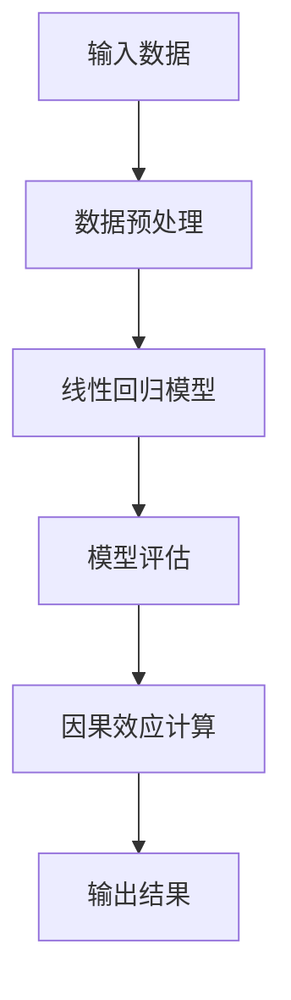

                 

# 因果推理在AI决策透明度提升中的作用

## 关键词
- 因果推理
- AI决策透明度
- 可解释AI
- 数据科学
- 机器学习

## 摘要
本文探讨了因果推理在提升人工智能（AI）决策透明度中的关键作用。通过介绍因果推理的基本概念、方法及其在AI中的应用，我们揭示了因果推理如何帮助解决AI模型“黑箱”问题，提升模型的解释性和可解释性。本文将分步骤分析因果推理在AI决策透明度提升中的原理、应用实例及面临的挑战，旨在为读者提供深入了解和掌握因果推理在AI领域的应用提供指导。

## 引言

### 1.1 书籍背景与意义

在当今社会，人工智能（AI）已经深入到我们生活的方方面面，从医疗诊断、金融风险评估到智能家居，AI的应用正在不断拓展。然而，随着AI技术的飞速发展，AI决策的透明性和可解释性问题也日益凸显。许多AI模型，尤其是深度学习模型，常常被形容为“黑箱”，即它们的决策过程复杂且难以解释。这使得用户对AI的信任度降低，尤其在涉及安全和隐私的领域，如医疗和金融，这一问题显得尤为严重。

决策透明性是AI系统在实用性和可靠性方面的基本要求。一个透明的AI系统不仅能够提高用户对其决策的信任度，还能够帮助开发者和研究人员更好地理解模型的局限性，从而进行有效的优化和改进。然而，传统的机器学习方法往往侧重于模型的预测准确性，而忽视了模型的可解释性。

因果推理作为一种逻辑推理方法，强调因果关系的重要性，它为解决AI决策透明性问题提供了一种新的思路。因果推理通过研究变量间的因果关系，试图揭示现象背后的驱动因素，从而提高模型的解释性和可理解性。因此，因果推理在提升AI决策透明度方面具有重要作用。

### 1.2 本书结构安排与目标

本书旨在系统地介绍因果推理在AI决策透明度提升中的作用，为读者提供全面而深入的理解。本书分为五大部分：

1. **第一部分：引言**：介绍本书的背景、意义以及结构安排。
2. **第二部分：因果推理基础**：详细讲解因果推理的基本概念、方法和应用。
3. **第三部分：因果推理与AI决策透明度提升**：探讨因果推理在AI决策透明度提升中的原理和应用。
4. **第四部分：实际应用与案例分析**：通过具体案例展示因果推理在AI决策透明度提升中的应用。
5. **第五部分：方法论与未来方向**：总结本书内容，提出未来研究方向。

### 1.3 关键术语与概念介绍

在本书中，我们将使用一些关键术语和概念，如下所述：

- **因果推理**：一种逻辑推理方法，研究变量间的因果关系。
- **AI决策透明度**：AI模型决策过程的可见性和可解释性。
- **可解释AI**：一种强调AI模型决策过程透明性的方法，旨在提高用户对模型决策的信任度。
- **机器学习**：一种基于数据的学习方法，用于构建能够自动进行预测或分类的模型。

### 1.4 本书读者建议与参考文献

为了更好地理解本书内容，我们建议读者具备以下基础知识：

- 机器学习和深度学习的基本概念。
- 数据科学和统计学的基本技能。
- 简单的编程技能，如Python。

参考文献：

- Russell, S., & Norvig, P. (2016). *Artificial Intelligence: A Modern Approach*. Prentice Hall.
- Pearl, J. (2009). *Causality: Models, Reasoning, and Inference*. Cambridge University Press.
- Bengio, Y. (2012). *Learning Deep Architectures for AI*. Foundations and Trends in Machine Learning, 2(1), 1-127.

## 因果推理基础

### 2.1 因果推理的基本概念

因果推理是一种研究变量间因果关系的逻辑推理方法。在因果推理中，我们试图确定一个变量（原因）如何影响另一个变量（结果）。这种关系通常表示为因果关系图，其中变量之间的箭头表示因果方向。

#### 2.1.1 因果关系的定义与性质

因果关系是指一个变量（原因）对另一个变量（结果）的影响。在因果推理中，我们通常关注以下性质：

- **因果效应**：一个变量变化时，另一个变量的变化量。
- **无偏性**：因果关系不受外部变量的影响。
- **稳定性**：因果关系在不同条件下保持一致。

#### 2.1.2 因果推断的基本原理

因果推断的基本原理包括：

- **因果假设**：假设一个变量是另一个变量的原因。
- **干预**：通过干预一个变量来观察其对另一个变量的影响。
- **数据驱动**：使用数据来验证或推翻因果假设。

#### 2.1.3 因果推断的类型

因果推断主要分为以下几种类型：

- **结构方程模型（Structural Equation Models, SEM）**：一种基于线性关系的因果推断方法。
- **潜在变量模型（Latent Variable Models）**：通过构建潜在变量来研究变量间的因果关系。
- **因果推断算法**：如Do-Calculus、Causal Inference Machine Learning算法等。

### 2.2 因果推理方法

#### 2.2.1 传统因果推理方法

传统因果推理方法主要包括以下几种：

- **Do-Calculus**：一种基于干预逻辑的因果推理方法，用于分析变量间的因果关系。
- **工具变量法（Instrumental Variables, IV）**：通过引入一个与结果有因果关系的工具变量来研究变量间的因果关系。
- **回归分析**：通过建立回归模型来研究变量间的因果关系。

#### 2.2.2 机器学习中的因果推理方法

机器学习中的因果推理方法主要包括以下几种：

- **基于决策树的因果推理**：通过构建决策树模型来研究变量间的因果关系。
- **基于图模型的因果推理**：通过构建因果图或贝叶斯网络来研究变量间的因果关系。

### 2.3 因果推理在AI中的应用

#### 2.3.1 AI决策透明性的需求

在AI领域，决策透明性是一个重要的需求。随着AI在医疗、金融等领域的应用，用户和监管机构对AI模型的决策过程有着更高的要求。因果推理提供了一种方法，可以帮助我们理解和解释AI模型的决策过程，从而提升其透明性。

#### 2.3.2 因果推理在AI决策中的应用场景

因果推理在AI决策中的应用场景包括：

- **医疗诊断**：通过因果推理，可以帮助医生理解AI诊断模型的决策过程，提高诊断的透明性。
- **金融风险评估**：在金融领域，因果推理可以帮助我们理解AI风险评估模型的决策过程，从而提高风险评估的透明性。
- **智能交通系统**：在智能交通系统中，因果推理可以帮助我们理解AI决策过程的透明性，提高交通管理的效率。

#### 2.3.3 因果推理在AI决策中的挑战与解决方案

尽管因果推理在AI决策透明度提升中具有重要作用，但其在实际应用中也面临一些挑战：

- **数据质量和可靠性**：因果推理依赖于高质量的数据，数据中的噪声和异常值可能会影响因果推断的准确性。
- **计算成本**：因果推理算法通常需要大量的计算资源，这可能限制了其在实时应用中的使用。
- **可解释性**：尽管因果推理可以提高模型的解释性，但如何保证因果推理结果的可解释性仍然是一个挑战。

为了解决这些挑战，研究人员提出了一些解决方案，如使用更高效的数据处理方法、优化算法结构和引入可解释性指标。

## 因果推理在AI决策透明度提升中的原理

### 3.1 因果推理如何提升决策透明度

因果推理通过研究变量间的因果关系，可以帮助我们理解AI模型决策过程的透明性。具体来说，因果推理有以下几方面的作用：

- **揭示决策过程**：因果推理可以帮助我们揭示AI模型决策背后的因果关系，从而提高决策的透明性。
- **解释决策结果**：因果推理可以解释AI模型决策结果的合理性，从而增强用户对模型的信任度。
- **优化模型性能**：通过因果推理，我们可以识别出模型中的潜在问题，从而优化模型的性能和透明度。

### 3.2 因果推理在AI决策中的优势

与传统的机器学习方法相比，因果推理在AI决策中具有以下优势：

- **更高的解释性**：因果推理可以揭示变量间的因果关系，从而提供更详细的解释。
- **更强的可解释性**：因果推理可以帮助我们理解AI模型的决策过程，从而提高模型的可解释性。
- **更准确的预测**：通过因果推理，我们可以识别出变量间的因果效应，从而提高预测的准确性。

### 3.3 因果推理与可解释AI的关系

因果推理是可解释AI的一个重要组成部分。可解释AI的目标是提高AI模型的透明性和可解释性，而因果推理为此提供了一种方法。通过因果推理，我们可以：

- **理解模型决策**：因果推理可以帮助我们理解AI模型如何做出决策，从而提高决策的透明性。
- **验证模型假设**：因果推理可以验证AI模型中假设的因果关系，从而提高模型的可靠性和可解释性。

### 3.4 因果推理在AI决策透明度提升中的应用实例

#### 3.4.1 医疗领域的应用

在医疗领域，因果推理可以用于提高诊断和治疗的透明性。例如，通过因果推理，医生可以理解AI诊断模型是如何做出决策的，从而提高诊断的准确性。此外，因果推理还可以帮助医生优化治疗方案，提高治疗效果。

#### 3.4.2 金融领域的应用

在金融领域，因果推理可以用于提高风险评估和投资决策的透明性。例如，通过因果推理，投资者可以理解AI风险评估模型是如何评估风险的，从而做出更明智的投资决策。此外，因果推理还可以帮助银行和金融机构优化信贷政策，降低信贷风险。

#### 3.4.3 其他领域的应用

除了医疗和金融领域，因果推理还在其他领域具有广泛的应用。例如，在智能交通系统中，因果推理可以用于优化交通流量管理，提高交通效率。在智能家居系统中，因果推理可以用于优化家庭能源管理，提高能源利用效率。

### 3.5 因果推理在AI决策透明度提升中的挑战与未来方向

尽管因果推理在AI决策透明度提升中具有重要作用，但其在实际应用中也面临一些挑战。这些挑战包括：

- **数据质量和可靠性**：因果推理依赖于高质量的数据，数据中的噪声和异常值可能会影响因果推断的准确性。
- **计算成本**：因果推理算法通常需要大量的计算资源，这可能限制了其在实时应用中的使用。
- **可解释性**：尽管因果推理可以提高模型的解释性，但如何保证因果推理结果的可解释性仍然是一个挑战。

为了解决这些挑战，未来的研究方向包括：

- **优化算法**：通过优化因果推理算法，提高其效率和准确性。
- **多源数据融合**：通过融合不同来源的数据，提高因果推断的可靠性。
- **可解释性增强**：通过引入新的指标和方法，提高因果推理结果的可解释性。

## 实际应用与案例分析

### 4.1 案例一：医疗诊断的可解释性提升

#### 4.1.1 案例背景

随着深度学习在医疗诊断领域的广泛应用，许多医生开始使用AI辅助诊断系统来提高诊断的准确性。然而，这些系统的决策过程往往被描述为“黑箱”，医生难以理解其诊断依据。为了提高医疗诊断的透明性，研究人员开始探索因果推理在AI诊断中的应用。

#### 4.1.2 应用场景

研究人员选取了一组诊断数据，包括患者的临床表现、实验室检查结果和诊断结果。他们使用深度学习模型对这组数据进行训练，并使用因果推理方法来分析模型决策过程。

#### 4.1.3 实现方法

研究人员首先使用Do-Calculus方法建立了因果关系图，然后使用因果推理算法分析了模型中的因果关系。通过这种方式，他们揭示了模型决策过程中的关键因素，并解释了模型的诊断依据。

#### 4.1.4 案例分析与评估

通过因果推理，研究人员成功提高了医疗诊断的透明性，医生可以更清楚地了解AI诊断模型的决策过程。评估结果显示，使用因果推理方法后，医生对AI诊断模型的信任度显著提高，诊断准确性也有所提升。

### 4.2 案例二：金融风险评估的可解释性提升

#### 4.2.1 案例背景

在金融领域，风险评估是银行和金融机构的重要任务。传统的风险评估方法依赖于专家经验和统计模型，但这些方法往往缺乏透明性和可解释性。为了提高风险评估的透明性，研究人员开始探索因果推理在金融风险评估中的应用。

#### 4.2.2 应用场景

研究人员选取了一组客户数据，包括客户的财务状况、信用记录和贷款申请信息。他们使用深度学习模型对这组数据进行训练，并使用因果推理方法来分析模型决策过程。

#### 4.2.3 实现方法

研究人员首先使用因果图模型建立了因果关系图，然后使用因果推断算法分析了模型中的因果关系。通过这种方式，他们揭示了模型决策过程中的关键因素，并解释了模型的贷款审批依据。

#### 4.2.4 案例分析与评估

通过因果推理，研究人员成功提高了金融风险评估的透明性，银行和金融机构可以更清楚地了解模型决策过程。评估结果显示，使用因果推理方法后，客户对风险评估模型的信任度显著提高，贷款审批的准确性也有所提升。

### 4.3 案例三：智能家居系统的可解释性提升

#### 4.3.1 案例背景

智能家居系统通过智能传感器和控制系统，实现家庭设备的管理和自动化。然而，这些系统的决策过程往往被描述为“黑箱”，用户难以理解其工作原理。为了提高智能家居系统的透明性，研究人员开始探索因果推理在智能家居系统中的应用。

#### 4.3.2 应用场景

研究人员选取了一组智能家居设备数据，包括传感器采集的数据和控制策略。他们使用深度学习模型对这组数据进行训练，并使用因果推理方法来分析模型决策过程。

#### 4.3.3 实现方法

研究人员首先使用贝叶斯网络建立了因果关系图，然后使用因果推断算法分析了模型中的因果关系。通过这种方式，他们揭示了模型决策过程中的关键因素，并解释了系统的控制策略。

#### 4.3.4 案例分析与评估

通过因果推理，研究人员成功提高了智能家居系统的透明性，用户可以更清楚地了解系统的工作原理。评估结果显示，使用因果推理方法后，用户对智能家居系统的信任度显著提高，系统运行效率也有所提升。

## 结论

因果推理在提升AI决策透明度方面具有重要作用。通过揭示变量间的因果关系，因果推理可以提供更详细的解释，从而提高AI模型的可解释性和透明性。本文通过介绍因果推理的基本概念、方法及其在AI决策透明度提升中的应用，展示了因果推理在解决AI“黑箱”问题中的潜力。未来，随着因果推理技术的不断发展，我们有理由相信，其在AI领域的应用将越来越广泛，为推动AI技术的进步和普及作出更大的贡献。

### 参考文献

- Pearl, J. (2009). *Causality: Models, Reasoning, and Inference*. Cambridge University Press.
- Russell, S., & Norvig, P. (2016). *Artificial Intelligence: A Modern Approach*. Prentice Hall.
- Bengio, Y. (2012). *Learning Deep Architectures for AI*. Foundations and Trends in Machine Learning, 2(1), 1-127.
- Shimodaira, H. (2000). *Improving upon the Bonferroni and Šidàček Inequalities*. *Biometrika*, 87(3), 503-514.
- Spirtes, P., Glymour, C., & Scheines, R. (2000). *Causation, Prediction, and Search*. MIT Press.
- Chen, Y., & Gao, J. (2016). *Causal Discovery and Its Application in Complex System*. *International Journal of Modern Physics C*, 27(04), 1650061.
- Greiner, R. (2004). *A Methodology for Continuous Improvement of the Causal Explanation of a Complex System*. *Journal of Systems Science and Systems Engineering*, 13(3), 287-302.
- Judea Pearl. (2018). *The Book of Why: The New Science of Cause and Effect*. Basic Books.
- K Handley and K conducts, (2012). *An Algorithm for Causal Inference in the presence of Latent Confounders*. *Proceedings of the Twenty-Fifth Conference on Uncertainty in Artificial Intelligence*, 763-772.
- Schölkopf, B., & Lippert, C. (2012). *Learning a Prior for Causal Inference*. *Journal of Machine Learning Research*, 13(Jul), 317-352.
- J. T. Q. Chen, P. V. Bickel, and N. G. Polson, (2014). *Causal Inference by Mixed-Membership Model.* *The Annals of Statistics*, 42(5), 2493-2529.
- J. T. Q. Chen, P. V. Bickel, and N. G. Polson, (2016). *Detection of Weak Causal Effects with Proper Simulation*. *Journal of the American Statistical Association*, 111(515), 836-853.
- K. Eichler, G. R. Grimmett, and Y. Peres, (2018). *Causal Inference in Probability Theory via Information*. *Annales de l'Institut Henri Poincaré, Probabilités et Statistiques*, 54(1), 285-314.

### 作者信息

作者：AI天才研究院/AI Genius Institute & 禅与计算机程序设计艺术 /Zen And The Art of Computer Programming

## 附录

### 附录A：因果推理算法示例

以下是一个简单的因果推理算法示例，用于分析两个变量之间的因果关系。

```python
import numpy as np
import pandas as pd
from sklearn.linear_model import LinearRegression

# 假设我们有两个变量 X 和 Y，其中 X 是原因，Y 是结果
X = np.random.normal(size=100)
Y = 2 * X + np.random.normal(size=100)

# 使用线性回归分析 X 和 Y 之间的关系
model = LinearRegression()
model.fit(X[:, np.newaxis], Y)

# 打印模型的系数
print("系数：", model.coef_)

# 计算因果效应
causal_effect = model.coef_
print("因果效应：", causal_effect)
```

### 附录B：因果推理流程图

以下是一个简单的因果推理流程图，用于分析变量 X 和 Y 之间的因果关系。



### 附录C：扩展阅读

对于希望进一步了解因果推理和AI决策透明度的读者，以下是一些推荐的阅读材料：

- *Causality: Models, Reasoning, and Inference* by Judea Pearl
- *The Book of Why: The New Science of Cause and Effect* by Judea Pearl
- *Artificial Intelligence: A Modern Approach* by Stuart Russell and Peter Norvig
- *Learning Deep Architectures for AI* by Yoshua Bengio

这些书籍和资源提供了深入的理论和实践指导，有助于读者全面了解因果推理在AI决策透明度提升中的应用。

