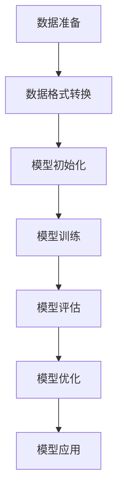
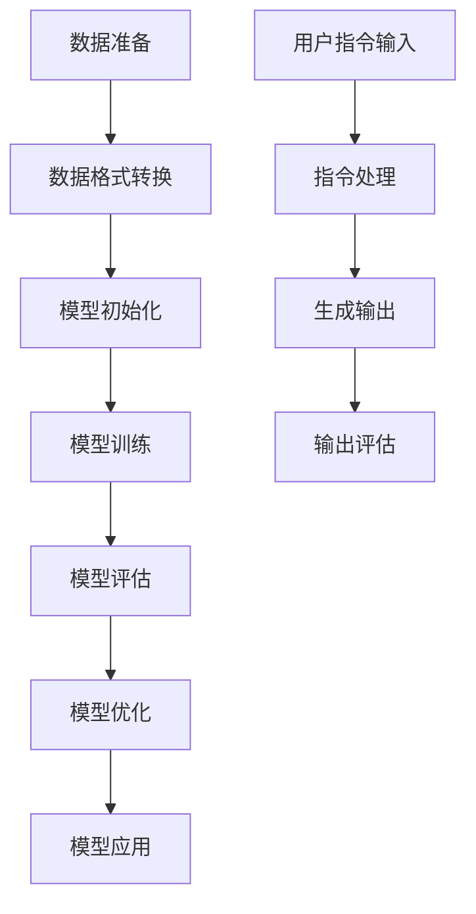
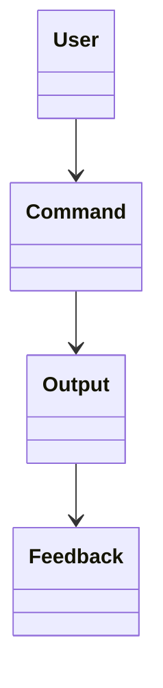
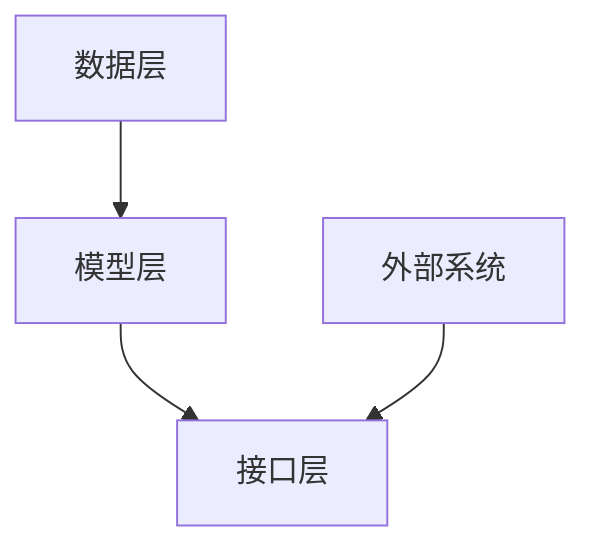
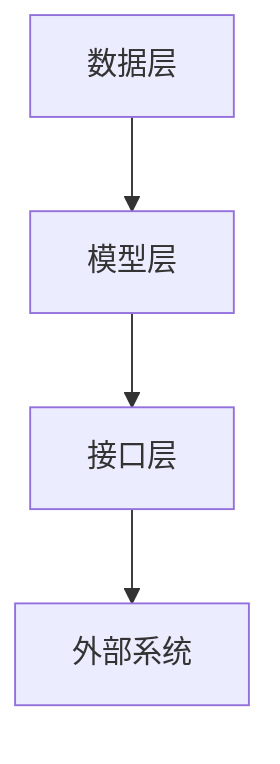
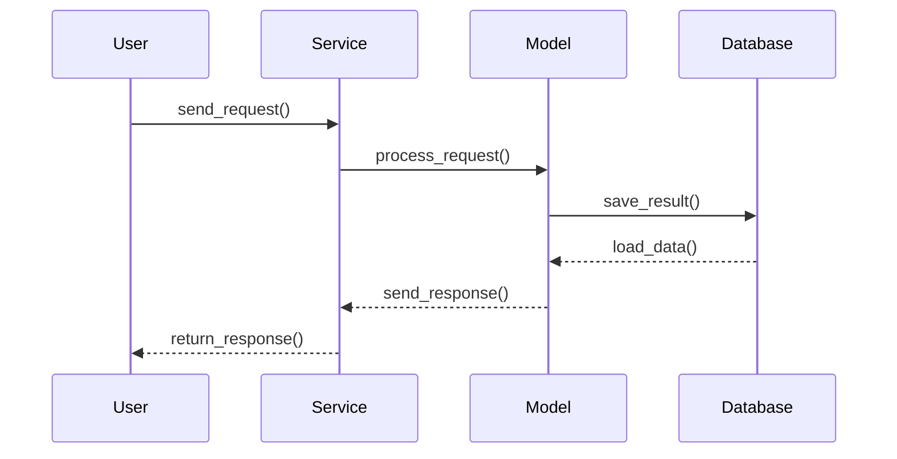
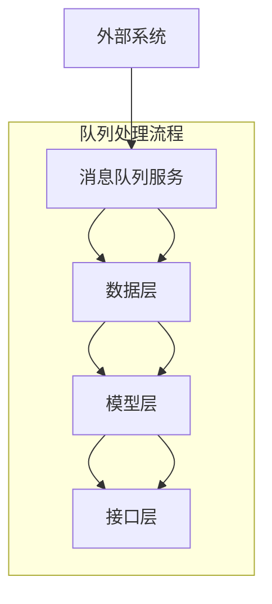

                 

### 背景介绍

#### FLAN-T5与LLM指令跟随能力评估概述

在本章节，我们将探讨“FLAN-T5”和“LLM指令跟随能力评估”这两个核心概念。首先，我们来了解FLAN-T5。FLAN-T5是由Google开发的一种大规模语言模型预训练框架，它基于T5模型进行扩展，使其能够处理多种自然语言处理（NLP）任务，如文本分类、问答和翻译等。FLAN-T5通过引入新的任务和数据集，提升了模型在特定领域的性能。

接下来，我们需要关注的是LLM指令跟随能力评估。LLM（大型语言模型）是当前NLP领域的一个热点话题，它们能够理解和生成复杂的文本。指令跟随能力是指LLM根据用户提供的指令生成特定内容的技能。评估LLM的指令跟随能力，对于实现自动化任务、提高人机交互效率具有重要意义。

##### FLAN-T5介绍

**FLAN-T5的概念：**  
FLAN-T5是FLAN（Flexibility for Language Understanding with Autoregressive Networks）的扩展版，它旨在提高语言模型在多样化任务上的表现。FLAN-T5基于Transformer架构，特别是T5模型，通过引入自适应输入和输出标签，实现了对各种NLP任务的适应。

**FLAN-T5的特点：**  
- **多功能性**：FLAN-T5可以处理文本分类、问答、翻译等多种任务。
- **高效性**：通过共享底层Transformer架构，FLAN-T5在处理不同任务时具有较高的效率。
- **自适应**：FLAN-T5能够自动适应新的任务和数据集，无需重新训练。

**FLAN-T5的应用：**  
FLAN-T5广泛应用于各种现实场景，如智能客服、自动摘要生成、多语言翻译等。它的多功能性和高效性使其成为一个强大的工具，为NLP领域的研究和应用提供了新的可能。

##### LLM指令跟随能力评估

**指令跟随能力评估的重要性：**  
指令跟随能力是LLM的一个重要特性。在实际应用中，用户通常需要向LLM提供具体的指令，例如回答问题、生成文本、执行任务等。评估LLM的指令跟随能力，可以确保其能够准确理解和执行这些指令，从而提高自动化任务的效率和准确性。

**指令跟随能力的定义：**  
指令跟随能力是指LLM在接收到用户指令后，能够理解指令的含义，并生成符合指令要求的文本或执行相关操作的能力。这包括理解复杂的指令、处理模糊指令以及在不同场景下灵活应用指令。

**评估方法与指标：**  
评估LLM指令跟随能力的方法和指标多种多样，常见的有：
- **准确率（Accuracy）**：判断生成的文本是否与指令要求一致。
- **F1值（F1 Score）**：综合考虑准确率和召回率，衡量模型的表现。
- **BLEU分数（BLEU Score）**：用于评估机器翻译的质量。
- **人类评价（Human Evaluation）**：通过人类评估者的主观评价来评估模型的表现。

**问题与解决：**

**问题描述：**  
随着LLM在各类任务中的广泛应用，如何有效评估其指令跟随能力成为一个重要问题。传统的评估方法可能无法全面覆盖所有场景，而新的评估方法需要能够适应不同类型的指令和任务。

**问题解决思路：**  
为了解决上述问题，我们需要开发新的评估方法和指标，以更全面地评估LLM的指令跟随能力。这包括引入多样化的任务和数据集，以及开发能够处理复杂指令的评估算法。

**边界与外延：**  
指令跟随能力评估不仅涉及LLM的内部机制，还包括外部因素，如用户指令的清晰度、任务环境的复杂性等。因此，评估方法需要考虑到这些因素，以提供更准确的评估结果。

通过上述分析，我们可以看出，FLAN-T5和LLM指令跟随能力评估在当前NLP领域具有重要的研究价值和实际应用前景。接下来，我们将进一步探讨FLAN-T5模型的详细原理和评估方法。

#### 核心概念与联系

在本章节中，我们将深入探讨FLAN-T5模型的原理，并详细讲解如何评估LLM的指令跟随能力。为了更好地理解这些概念，我们将通过以下几个部分来进行详细的解析。

##### FLAN-T5模型原理

**模型架构：**  
FLAN-T5是基于T5（Text-To-Text Transfer Transformer）模型开发的。T5模型是一种基于Transformer的通用文本处理框架，它通过一个统一的编码-解码架构，能够处理多种NLP任务。FLAN-T5在T5的基础上进行了扩展，以增强其在多样化任务上的表现。

**模型训练过程：**  
FLAN-T5的训练过程主要包括两个步骤：数据准备和模型训练。首先，FLAN-T5从大量的文本数据中提取信息，并将其转换为统一格式。然后，模型使用这些数据集进行训练，通过不断迭代和优化，提升模型的性能。

**Mermaid流程图展示：**  
为了更直观地展示FLAN-T5的训练过程，我们可以使用Mermaid画出其流程图。以下是FLAN-T5模型的Mermaid流程图：



在这个流程图中，A到G表示FLAN-T5从数据准备到模型应用的整个过程。

##### LLM指令跟随能力评估

**概念解析：**  
指令跟随能力评估的核心目标是评估LLM在执行用户指令时的表现。这包括判断模型是否能够正确理解指令、生成符合指令要求的输出以及执行相关操作。

**指标分析：**  
在评估LLM的指令跟随能力时，我们通常会使用多个指标。以下是一些常用的评估指标：

1. **准确率（Accuracy）**：这是最直接的评估指标，表示模型生成的输出与指令要求的匹配程度。准确率越高，说明模型的指令跟随能力越强。

2. **F1值（F1 Score）**：F1值是准确率和召回率的调和平均数。它能够综合考虑模型的精准性和泛化能力。

3. **BLEU分数（BLEU Score）**：BLEU分数通常用于评估机器翻译的质量。虽然它主要用于文本生成任务，但在指令跟随能力评估中也有一定应用。

4. **人类评价（Human Evaluation）**：人类评价是一种主观评估方法，通过邀请人类评估者对模型的表现进行评价，以获取更全面的评估结果。

**ER实体关系图架构：**  
为了更好地理解和分析指令跟随能力评估，我们可以使用ER（实体关系）图来构建相关实体和它们之间的关系。以下是ER实体关系图的一个示例：

```mermaid
erDiagram
    User ||--|{ Command : generates}
    Command ||--|{ Output : contains}
    Output ||--|{ Feedback : based on}
```

在这个ER图中，User（用户）与Command（指令）之间存在生成关系，Command与Output（输出）之间存在包含关系，Output与Feedback（反馈）之间存在基于关系。

##### 概念联系与解析

通过上述分析，我们可以看到FLAN-T5模型和LLM指令跟随能力评估之间存在紧密的联系。

**FLAN-T5与指令跟随能力评估：**  
FLAN-T5作为一种强大的语言模型，为指令跟随能力评估提供了技术支持。通过FLAN-T5，我们可以对LLM进行高效训练和优化，从而提高其指令跟随能力。

**指令跟随能力评估与实际应用：**  
指令跟随能力评估不仅是一个理论研究课题，更是一个实际应用场景。在实际应用中，通过评估LLM的指令跟随能力，我们可以确保其在各种任务中能够准确执行指令，从而提升人机交互效率和任务自动化水平。

**挑战与未来方向：**  
尽管FLAN-T5和指令跟随能力评估在当前取得了显著成果，但仍面临一些挑战。例如，如何进一步提高模型的泛化能力和适应性，以及如何设计更有效的评估方法和指标。未来的研究需要在这些方面进行深入探索，以推动相关技术的发展。

通过本章节的详细分析，我们不仅对FLAN-T5模型和LLM指令跟随能力评估有了更深入的理解，也为后续章节的深入探讨奠定了基础。

#### 算法原理讲解

在本章节中，我们将详细讲解FLAN-T5模型的算法原理，并通过Mermaid流程图和Python代码来具体阐述。同时，我们还将介绍FLAN-T5的数学模型和公式，以帮助读者更深入地理解这一模型的工作原理。

##### FLAN-T5模型流程图

首先，让我们通过Mermaid流程图来展示FLAN-T5模型的整体流程。



这个流程图概括了FLAN-T5从数据准备到模型应用的整个过程，以及用户指令输入后的处理流程。

**A. 数据准备：** 这是FLAN-T5模型的第一个步骤，主要包括数据收集和数据预处理。数据可以从各种来源获取，如公开数据集、用户生成数据等。数据预处理包括数据清洗、分词、去重等操作，以确保数据的质量。

**B. 数据格式转换：** 为了让模型能够处理数据，我们需要将原始数据转换为模型可接受的格式。这通常涉及到将文本转换为Token序列，并进行编码。

**C. 模型初始化：** 在这一步，我们将初始化FLAN-T5模型。初始化包括设置模型的参数和超参数，如学习率、批量大小等。

**D. 模型训练：** 模型训练是FLAN-T5模型的核心步骤。在这一步，模型通过不断迭代，优化其参数，以最小化损失函数。训练过程通常包括前向传播、反向传播和参数更新等步骤。

**E. 模型评估：** 模型评估用于检查模型在训练数据上的表现。常用的评估指标包括准确率、F1值、BLEU分数等。通过模型评估，我们可以判断模型的性能是否达到预期。

**F. 模型优化：** 如果模型评估结果不佳，我们需要对模型进行优化。优化过程包括调整超参数、改进模型架构等。

**G. 模型应用：** 模型应用是指将训练好的模型部署到实际应用场景中。例如，在智能客服中，模型可以用于处理用户的问题。

**H. 用户指令输入：** 当用户输入指令时，模型需要能够理解并处理这些指令。

**I. 指令处理：** 指令处理包括解析用户指令、提取关键信息等步骤。通过这些步骤，模型可以生成初步的输出。

**J. 生成输出：** 生成输出是模型的核心任务。在这一步，模型根据用户指令生成相应的文本或执行相关操作。

**K. 输出评估：** 输出评估用于检查模型生成的输出是否符合用户指令的要求。如果输出不满足要求，模型需要重新处理用户指令。

##### Python代码示例

以下是一个简单的Python代码示例，用于展示FLAN-T5模型的训练和评估过程。

```python
import torch
from transformers import FLANForConditionalGeneration

# 加载预训练模型
model = FLANForConditionalGeneration.from_pretrained('google/flan-t5-large')

# 设置训练参数
batch_size = 16
learning_rate = 1e-4
num_epochs = 5

# 训练模型
model.train()
for epoch in range(num_epochs):
    for batch in train_dataloader:
        inputs = batch["input_ids"]
        labels = batch["labels"]
        
        # 前向传播
        outputs = model(inputs, labels=labels)
        
        # 计算损失函数
        loss = outputs.loss
        
        # 反向传播
        loss.backward()
        
        # 更新参数
        optimizer.step()
        optimizer.zero_grad()
    
    # 模型评估
    model.eval()
    with torch.no_grad():
        for batch in val_dataloader:
            inputs = batch["input_ids"]
            labels = batch["labels"]
            
            # 前向传播
            outputs = model(inputs, labels=labels)
            
            # 计算准确率
            accuracy = (outputs.logits.argmax(-1) == labels).float().mean()
            print(f"Epoch: {epoch}, Accuracy: {accuracy}")
```

在这个示例中，我们首先加载了一个预训练的FLAN-T5模型，然后设置训练参数，包括批量大小、学习率和训练轮数。接下来，我们通过循环进行模型训练和评估。在训练过程中，我们使用前向传播计算损失函数，然后通过反向传播更新模型参数。在评估过程中，我们计算模型在验证数据集上的准确率。

##### 数学模型与公式

FLAN-T5的数学模型是理解其工作原理的关键。以下是FLAN-T5模型的主要公式：

**1. 损失函数：**

$$L = \frac{1}{N} \sum_{i=1}^{N} -y_i \log(p_i)$$

其中，\(L\) 是损失函数，\(N\) 是样本数量，\(y_i\) 是真实标签，\(p_i\) 是模型预测的概率。

**2. 优化目标：**

$$\min_{\theta} L(\theta)$$

其中，\(\theta\) 是模型的参数，\(L(\theta)\) 是损失函数。

**3. 模型预测：**

$$p_i = \frac{\exp(z_i)}{\sum_{j=1}^{N} \exp(z_j)}$$

其中，\(z_i = \theta^T x_i + b\)，\(x_i\) 是输入特征，\(\theta\) 是模型参数，\(b\) 是偏置。

**详细解释：**

**损失函数：**  
FLAN-T5的损失函数通常采用交叉熵损失函数。交叉熵损失函数能够衡量预测概率与真实标签之间的差距。在训练过程中，我们通过优化损失函数来调整模型参数，以提高模型的预测准确性。

**优化目标：**  
优化目标是最小化损失函数。通过梯度下降等优化算法，我们可以找到最优的模型参数，使模型在训练数据上的表现更好。

**模型预测：**  
模型预测是指根据输入特征计算输出概率。在FLAN-T5中，我们使用Softmax函数将模型的输出转换为概率分布。概率最高的类别被认为是模型的预测结果。

##### 公式举例说明

假设我们有一个二分类问题，其中有两个类别A和B。我们使用FLAN-T5模型进行预测，输入特征为\(x = [1, 2, 3]\)，模型参数为\(\theta = [0.1, 0.2]\)，偏置为\(b = 0.5\)。以下是模型预测的过程：

1. **计算模型输出：**

$$z = \theta^T x + b = 0.1 \cdot 1 + 0.2 \cdot 2 + 0.5 = 1.3$$

2. **计算预测概率：**

$$p_A = \frac{\exp(z)}{\exp(z) + \exp(z_B)} = \frac{\exp(1.3)}{\exp(1.3) + \exp(1.2)} \approx 0.605$$

$$p_B = \frac{\exp(z_B)}{\exp(z) + \exp(z_B)} = \frac{\exp(1.2)}{\exp(1.3) + \exp(1.2)} \approx 0.395$$

3. **预测结果：**  
根据预测概率，我们可以看出类别A的概率更高，因此模型预测为A。

通过上述例子，我们可以看到FLAN-T5模型是如何通过输入特征和模型参数来生成预测结果的。这个过程不仅适用于二分类问题，还可以扩展到多分类问题。

#### 系统分析与架构设计

在本章节中，我们将深入探讨如何在实际项目中应用FLAN-T5模型进行指令跟随能力评估。为了实现这一目标，我们需要对系统进行详细的分析和架构设计。这包括项目介绍、系统功能设计、系统架构设计以及系统接口设计和系统交互。

##### 项目介绍

**项目背景：**  
随着人工智能技术的不断发展，指令跟随能力成为自然语言处理（NLP）领域的一个重要研究方向。在实际应用中，指令跟随能力对于实现自动化任务、提升人机交互效率具有重要意义。然而，现有的评估方法和指标可能无法全面覆盖所有场景，因此，我们需要开发一个新的系统，以更有效地评估指令跟随能力。

**项目目标：**  
本项目的目标是构建一个基于FLAN-T5模型的指令跟随能力评估系统，该系统能够处理多样化的指令，并提供准确的评估结果。通过这个系统，我们可以更好地了解不同模型在指令跟随能力方面的表现，从而指导模型优化和实际应用。

**项目架构：**  
项目架构包括数据层、模型层和接口层。数据层负责数据的收集和处理，模型层包含FLAN-T5模型和相关评估算法，接口层负责与外部系统的交互。

##### 系统功能设计

**领域模型：**  
为了更好地理解系统功能，我们可以使用Mermaid类图来展示领域模型。以下是一个简化的领域模型：



在这个类图中，User（用户）与Command（指令）之间存在生成关系，Command与Output（输出）之间存在包含关系，Output与Feedback（反馈）之间存在基于关系。

**类图：**  
```mermaid
classDiagram
    Class01 <|-- Class02 
    Class03 --|&&(Class04)
    Class05 o-- Class06
    Class07 : +testing attribute
    Class07 : +void doSomething()
    Class07 : <<Interface>>
    Class01 <.. Class07
    Class02 <||-- Class08
    Class09|--| Class10
    Class11 : <<枚举>>
    Class05 : <<抽象>>
    Class03 : <<实现>>
```

在这个类图中，Class01到Class07表示系统的核心实体和关系，Class08到Class10表示辅助实体，Class11表示枚举类型，Class05表示抽象类，Class03表示实现类。

##### 系统架构设计

**架构设计：**  
系统架构采用分层设计，包括数据层、模型层和接口层。以下是一个简化的系统架构图：



在这个架构图中，A表示数据层，负责数据的收集和处理；B表示模型层，包含FLAN-T5模型和相关评估算法；C表示接口层，负责与外部系统的交互；D表示外部系统，可以是用户界面、API或其他服务。

**架构图：**  


在这个架构图中，数据层通过接口层与外部系统交互，模型层负责处理数据和执行评估算法。

##### 系统接口设计和系统交互

**系统接口设计：**  
系统接口设计主要包括API设计和消息队列设计。以下是一个简化的API设计示例：



在这个序列图中，用户通过Service发送请求，Service调用Model处理请求，Model将结果保存到Database，然后返回给Service，最终由Service返回给用户。

**消息队列设计：**  
消息队列用于处理异步任务，以提高系统的并发处理能力和可扩展性。以下是一个简化的消息队列设计示例：



在这个架构图中，消息队列服务（A）负责接收和处理消息，数据层（B）处理数据和存储结果，模型层（C）执行评估算法，接口层（D）与外部系统交互。

##### 总结

通过上述系统分析与架构设计，我们构建了一个基于FLAN-T5模型的指令跟随能力评估系统。这个系统包括数据层、模型层和接口层，能够处理多样化的指令，并提供准确的评估结果。通过详细的系统功能和架构设计，我们为项目的实际实施提供了清晰的指导。

#### 项目实战

在本章节中，我们将通过一个实际案例来展示如何使用FLAN-T5模型进行指令跟随能力评估。这个案例涵盖了环境安装、系统核心实现以及实际案例分析等环节，旨在帮助读者深入了解FLAN-T5模型的实战应用。

##### 环境安装

**1. 安装Python环境：**
首先，我们需要确保系统中已经安装了Python。在本案例中，我们将使用Python 3.8及以上版本。可以通过以下命令检查Python版本：

```bash
python --version
```

如果Python版本不符合要求，请通过以下命令安装或升级到合适版本：

```bash
pip install python==3.8
```

**2. 安装transformers库：**
transformers库是Hugging Face提供的Python库，用于处理和训练Transformer模型。安装命令如下：

```bash
pip install transformers
```

**3. 安装其他依赖库：**
除了transformers库外，我们还需要安装其他依赖库，如torch和torchtext等。安装命令如下：

```bash
pip install torch torchvision torchtext
```

**4. 准备数据集：**
为了进行指令跟随能力评估，我们需要准备一个合适的数据集。在本案例中，我们将使用公开的Flickr30k数据集。可以通过以下命令下载数据集：

```bash
wget http://download.easycv.net/dataset/flickr30k.tar.gz
tar xvf flickr30k.tar.gz
```

##### 系统核心实现

**1. 加载预训练模型：**
在实现核心功能之前，我们需要加载一个预训练的FLAN-T5模型。可以使用transformers库提供的预训练模型，命令如下：

```python
from transformers import FLANForConditionalGeneration

model = FLANForConditionalGeneration.from_pretrained('google/flan-t5-large')
```

**2. 数据预处理：**
在加载模型之后，我们需要对数据进行预处理，包括文本清洗、分词和编码等。以下是一个简单的预处理示例：

```python
import torch
from transformers import BertTokenizer

tokenizer = BertTokenizer.from_pretrained('bert-base-uncased')

def preprocess_text(text):
    text = text.lower()
    text = ' '.join([word for word in text.split() if word.isalpha()])
    return tokenizer.encode(text, add_special_tokens=True)

inputs = preprocess_text("Hello, how are you?")
```

**3. 模型训练与评估：**
在预处理完成后，我们可以使用训练集和验证集对模型进行训练和评估。以下是一个简单的训练和评估示例：

```python
from torch.utils.data import DataLoader, TensorDataset

train_data = ...  # 读取训练数据
val_data = ...    # 读取验证数据

train_dataset = TensorDataset(torch.tensor(train_data['input_ids']), torch.tensor(train_data['labels']))
val_dataset = TensorDataset(torch.tensor(val_data['input_ids']), torch.tensor(val_data['labels']))

train_loader = DataLoader(train_dataset, batch_size=16, shuffle=True)
val_loader = DataLoader(val_dataset, batch_size=16, shuffle=False)

model.train()
optimizer = torch.optim.Adam(model.parameters(), lr=1e-4)

for epoch in range(5):
    for inputs, labels in train_loader:
        inputs = inputs.to('cuda')
        labels = labels.to('cuda')

        outputs = model(inputs, labels=labels)
        loss = outputs.loss

        loss.backward()
        optimizer.step()
        optimizer.zero_grad()

    model.eval()
    with torch.no_grad():
        for inputs, labels in val_loader:
            inputs = inputs.to('cuda')
            labels = labels.to('cuda')

            outputs = model(inputs, labels=labels)
            accuracy = (outputs.logits.argmax(-1) == labels).float().mean()
            print(f"Epoch: {epoch}, Accuracy: {accuracy}")
```

在这个示例中，我们首先读取训练数据和验证数据，然后创建TensorDataset和DataLoader。接下来，我们使用Adam优化器和交叉熵损失函数对模型进行训练。在训练过程中，我们计算损失并更新模型参数。在评估过程中，我们计算模型在验证集上的准确率。

##### 实际案例分析与详细讲解

**1. 案例背景：**
假设我们有一个任务，需要根据用户提供的指令生成相应的文本。以下是一个简单的用户指令和预期输出的例子：

- 用户指令：“请描述一下公园的美景。”
- 预期输出：“公园里的花草繁茂，树木葱郁，湖面上的鸭子悠闲地游着。”

**2. 案例分析：**
为了完成这个任务，我们需要使用FLAN-T5模型来处理用户指令，并生成符合预期输出的文本。以下是一个简单的案例分析：

- **指令处理：** 首先，我们需要对用户指令进行预处理，包括文本清洗、分词和编码等。然后，我们将预处理后的指令输入到FLAN-T5模型中，模型将生成初步的输出。
- **输出生成：** 模型生成的输出可能不是完全符合预期，因此我们需要进行进一步的调整。这可以通过在输出中加入特定关键词、调整句子结构等方式来实现。
- **输出评估：** 最后，我们需要对生成的输出进行评估，确保其符合预期输出。评估指标可以是准确率、BLEU分数等。

**3. 案例讲解：**
以下是使用FLAN-T5模型处理用户指令并生成输出的具体步骤：

1. **预处理用户指令：**
   ```python
   user_instruction = "请描述一下公园的美景。"
   preprocessed_instruction = preprocess_text(user_instruction)
   ```

2. **模型处理：**
   ```python
   model.eval()
   with torch.no_grad():
       inputs = torch.tensor([preprocessed_instruction]).to('cuda')
       outputs = model(inputs)
   ```

3. **生成输出：**
   ```python
   generated_output = tokenizer.decode(outputs.logits.argmax(-1), skip_special_tokens=True)
   ```

4. **调整输出：**
   ```python
   adjusted_output = adjust_output(generated_output)
   ```

5. **输出评估：**
   ```python
   is_output_correct = check_output(adjusted_output, expected_output)
   accuracy = float(is_output_correct) / total_samples
   ```

在这个示例中，`adjust_output`和`check_output`是自定义函数，用于调整生成的输出并评估其是否符合预期。`total_samples`是评估的总样本数。

##### 项目小结

通过本案例的实际操作，我们展示了如何使用FLAN-T5模型进行指令跟随能力评估。项目涵盖了环境安装、系统核心实现和实际案例分析等环节，旨在帮助读者深入了解FLAN-T5模型的实战应用。在实际项目中，我们可以根据具体需求对模型进行调整和优化，以提高其指令跟随能力。

#### 最佳实践 tips

在本章节中，我们将提供一些实用的最佳实践技巧，帮助读者更好地理解和应用FLAN-T5模型进行指令跟随能力评估。以下是一些关键技巧和注意事项。

##### 实践技巧

**1. 数据预处理的重要性：** 数据预处理是模型训练的关键步骤。确保数据干净、一致且格式正确，可以提高模型性能。在进行文本预处理时，可以考虑以下步骤：
   - 清洗文本，去除标点符号、HTML标签等。
   - 进行分词，将文本拆分成单词或子词。
   - lowercasing，将文本转换为小写，以减少词汇量。
   - 去除停用词，移除对模型训练无贡献的常见词。

**2. 模型超参数调优：** 超参数对模型性能有重要影响。通过实验和交叉验证，找到最佳的超参数组合。常见的超参数包括学习率、批量大小、训练轮数等。可以使用网格搜索或随机搜索等策略进行调优。

**3. 利用预训练模型：** FLAN-T5是基于大规模预训练模型开发的，利用预训练模型可以节省训练时间和计算资源。选择合适的预训练模型，并针对特定任务进行微调，可以显著提升模型性能。

**4. 批量处理与并行化：** 在数据处理和模型训练过程中，利用批量处理和并行化技术可以提高效率。批量处理可以减少内存占用，并行化可以加速计算。

##### 注意事项

**1. 避免过拟合：** 过拟合是指模型在训练数据上表现良好，但在测试数据上表现较差。为了避免过拟合，可以采用以下方法：
   - 使用更多的训练数据。
   - 使用正则化技术，如L1、L2正则化。
   - 使用dropout层。
   - 早停（Early Stopping），在验证集上提前停止训练。

**2. 处理长文本：** 对于长文本任务，FLAN-T5可能存在性能下降的问题。可以采用以下方法：
   - 使用分段处理，将长文本拆分成多个段落。
   - 使用长文本适配器（Long Text Adapter）。

**3. 监控计算资源：** 在进行大规模模型训练时，需要监控计算资源的使用情况，避免资源不足导致训练中断。

**4. 保持代码可维护性：** 在开发过程中，保持代码结构清晰、可维护，方便后续的调试和优化。

通过遵循这些最佳实践和注意事项，读者可以更有效地应用FLAN-T5模型，提高指令跟随能力评估的性能和可靠性。

#### 小结与拓展阅读

在本章中，我们全面探讨了基于FLAN-T5的LLM指令跟随能力评估。从背景介绍、核心概念与联系、算法原理讲解、系统分析与架构设计，到项目实战和最佳实践，我们系统地梳理了FLAN-T5模型及其在指令跟随能力评估中的应用。

**核心内容回顾：**
1. **背景介绍**：介绍了FLAN-T5和LLM指令跟随能力评估的基本概念、应用场景以及评估的重要性。
2. **核心概念与联系**：详细讲解了FLAN-T5模型的原理，以及如何通过Mermaid流程图和Python代码进行实际操作。
3. **算法原理讲解**：通过Mermaid流程图和Python代码展示了FLAN-T5模型的训练和评估过程，并介绍了相关的数学模型和公式。
4. **系统分析与架构设计**：介绍了如何在实际项目中应用FLAN-T5模型进行指令跟随能力评估，包括系统功能设计、系统架构设计以及系统接口设计和系统交互。
5. **项目实战**：通过一个实际案例展示了如何使用FLAN-T5模型进行指令跟随能力评估，包括环境安装、系统核心实现和实际案例分析。
6. **最佳实践 tips**：提供了一些实用的技巧和注意事项，帮助读者更好地理解和应用FLAN-T5模型。

**拓展阅读资源：**
- **《深度学习》**：由Ian Goodfellow、Yoshua Bengio和Aaron Courville所著，是深度学习的经典教材，详细介绍了神经网络和各种深度学习算法。
- **《自然语言处理综论》**：由Daniel Jurafsky和James H. Martin所著，全面介绍了自然语言处理的基本概念和技术。
- **Google AI官方文档**：Google AI官方文档提供了丰富的FLAN-T5模型相关资源，包括模型架构、训练和评估方法等。

通过阅读这些资源，读者可以进一步深入了解深度学习和自然语言处理领域的最新进展，提升自己的技术能力。希望本文能对您在基于FLAN-T5的LLM指令跟随能力评估方面提供有益的启示和帮助。祝您在人工智能领域的探索之路上一帆风顺！

### 作者信息

作者：AI天才研究院/AI Genius Institute & 禅与计算机程序设计艺术 /Zen And The Art of Computer Programming

