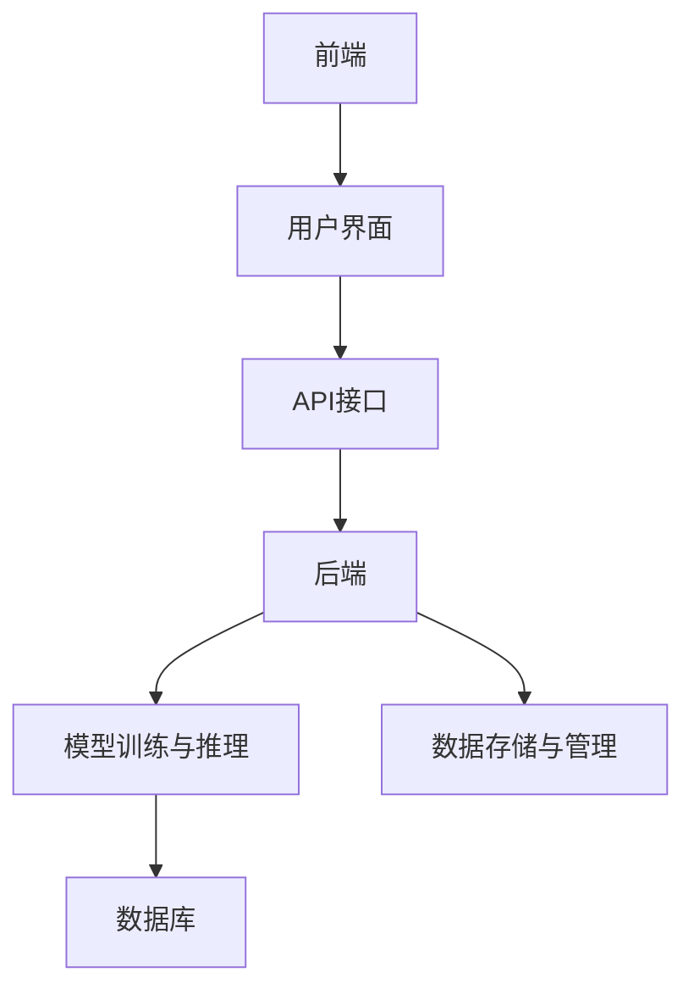
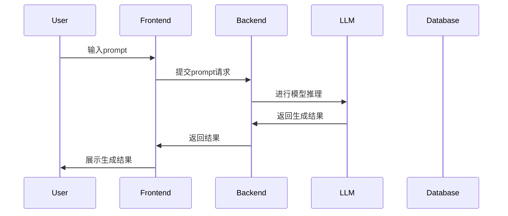

                 

### 文章标题：基于LLM的prompt创意联想工具

#### 关键词：LLM、prompt、创意联想、生成式学习、算法原理、系统架构、项目实战

#### 摘要：
本文旨在探讨基于大型语言模型（LLM）的prompt创意联想工具的设计与实现。文章首先介绍了LLM和prompt创意联想的基本概念，随后详细阐述了算法原理、数学模型、系统分析与架构设计。通过实际项目案例，展示了如何安装与配置环境、实现系统核心功能，并提供了最佳实践与注意事项。文章最后，对全文进行了小结，并推荐了拓展阅读资源。

----------------------------------------------------------------

## 第一部分：基于LLM的prompt创意联想工具概述

### 1.1 基本概念与背景

#### 1.1.1 什么是有监督学习与生成式学习
有监督学习（Supervised Learning）是指通过标注好的数据集进行训练，从而建立模型，并用这个模型对新数据进行预测。生成式学习（Generative Learning）则试图生成数据，而非直接对数据进行分类或回归。大型语言模型（LLM）是一种生成式学习模型，通过对大规模语料库的学习，生成自然语言文本。

#### 1.1.2 prompt在创意联想中的作用
prompt是输入给模型的提示，用于引导模型生成内容。在创意联想工具中，prompt扮演着至关重要的角色，它决定了模型生成的内容方向和质量。

#### 1.1.3 LLM的发展及其在prompt创意联想中的应用
LLM的发展始于自然语言处理（NLP）领域的进展。近年来，随着深度学习技术的成熟和计算资源的提升，LLM在各类应用中表现出了强大的能力，尤其是在prompt创意联想方面。

### 1.2 核心概念与联系

#### 1.2.1 LLM的基本组成
LLM通常由多层神经网络组成，包括嵌入层、编码器和解码器。嵌入层将输入文本转换为向量表示；编码器对输入文本进行编码；解码器则根据编码结果生成输出文本。

#### 1.2.2 prompt创意联想的概念
prompt创意联想是指通过给定的提示（prompt）引导模型生成创意内容。例如，给定一个产品名称，模型可以生成该产品的营销文案。

#### 1.2.3 数据集的选择与准备
选择适合的数据集对于LLM的性能至关重要。通常，我们选择包含大量文本的公开数据集，如维基百科、新闻文章等，然后对其进行预处理，以便于模型训练。

### 1.3 数学模型与公式

#### 1.3.1 常用损失函数
在LLM训练过程中，常用的损失函数包括交叉熵损失（Cross-Entropy Loss）和负对数损失（Negative Log-Likelihood Loss）。它们用于衡量模型预测与真实标签之间的差距。

#### 1.3.2 概率分布与采样方法
LLM在生成文本时，通常采用概率分布来决定下一个单词的选择。常用的采样方法包括贪心策略、抽样策略等。

#### 1.3.3 词嵌入与语言模型
词嵌入（Word Embedding）是将单词转换为向量表示的技术。语言模型（Language Model）则是预测下一个单词的概率分布的模型。

### 1.4 系统分析与架构设计

#### 1.4.1 系统功能设计
系统功能设计包括接收用户输入的prompt、生成创意联想、返回结果等。

#### 1.4.2 系统架构设计
系统架构设计包括前端、后端和数据库。前端负责用户交互，后端处理用户请求并调用LLM生成联想，数据库存储用户数据和模型参数。

#### 1.4.3 接口设计与交互
系统接口设计包括RESTful API和WebSocket等。交互方式可以是用户通过Web界面提交prompt，系统返回创意联想结果。

### 1.5 项目实战

#### 1.5.1 环境安装与准备
介绍如何安装必要的软件和依赖库，如Python、TensorFlow、transformers等。

#### 1.5.2 系统核心实现
详细讲解如何使用Python和transformers库实现LLM的prompt创意联想功能。

#### 1.5.3 实际案例分析与剖析
通过实际案例展示如何使用系统生成创意联想，并对其进行分析和解读。

#### 1.6 最佳实践与注意事项

#### 1.6.1 提高prompt质量的方法
提供一些技巧，如使用关键词、主题引导等，以提高prompt的质量。

#### 1.6.2 避免常见错误
列出一些在使用LLM进行创意联想时可能遇到的错误，并提供解决方案。

#### 1.6.3 拓展阅读与资源
推荐一些相关的书籍、论文和在线资源，以供进一步学习和研究。

### 1.7 本章小结
总结全文，回顾关键概念和主要观点，指出LLM在prompt创意联想领域的应用潜力和前景。

----------------------------------------------------------------

## 第二部分：深入探讨LLM与prompt创意联想

### 2.1 LLM的原理与工作流程

#### 2.1.1 LLM的原理
LLM基于深度学习技术，通过多层神经网络学习语言模式。其工作流程包括嵌入层、编码器和解码器三个主要部分。

##### 嵌入层
嵌入层（Embedding Layer）将输入文本转换为向量表示。每个单词都被映射到一个固定大小的向量，这些向量构成了文本的嵌入表示。

$$
\text{嵌入层输出} = \text{词向量} \times \text{权重矩阵}
$$

##### 编码器
编码器（Encoder）对输入文本进行编码。常见的编码器结构包括循环神经网络（RNN）、长短期记忆网络（LSTM）和门控循环单元（GRU）。

$$
\text{编码器输出} = \text{隐藏状态} \in \mathbb{R}^{d \times t}
$$

##### 解码器
解码器（Decoder）根据编码器的输出生成输出文本。解码器通常采用类似的神经网络结构，并使用贪心策略或抽样策略生成序列。

$$
\text{解码器输出} = \text{解码器}(\text{编码器输出})
$$

#### 2.1.2 LLM的工作流程
LLM的工作流程包括以下几个步骤：

1. **输入预处理**：将输入文本转换为词嵌入向量。
2. **编码**：使用编码器对输入文本进行编码，生成隐藏状态。
3. **解码**：使用解码器根据隐藏状态生成输出文本。
4. **输出处理**：将输出文本进行后处理，如去除无效字符、规范化等。

### 2.2 prompt创意联想的核心概念

#### 2.2.1 prompt的定义
prompt（提示）是引导模型生成文本的输入。一个好的prompt应该具备以下几个特点：

1. **清晰明确**：prompt应该明确表达用户意图，避免模糊不清。
2. **相关性**：prompt应该与模型训练数据相关，以提高生成文本的质量。
3. **多样性**：prompt应该多样化，以激发模型的创意联想。

#### 2.2.2 prompt创意联想的原理
prompt创意联想基于LLM的学习能力，通过给定的prompt引导模型生成相关创意内容。其原理可以概括为：

1. **编码**：将prompt编码为隐藏状态。
2. **解码**：根据隐藏状态生成创意文本。
3. **反馈**：将生成的文本反馈给模型，以优化模型性能。

### 2.3 prompt创意联想的实际应用

#### 2.3.1 营销文案生成
prompt创意联想在营销文案生成中具有广泛的应用。给定一个产品名称或关键词，模型可以生成相关的营销文案，帮助企业提升产品销量。

#### 2.3.2 品牌定位
prompt创意联想可以帮助企业进行品牌定位。通过分析用户反馈和市场需求，模型可以生成具有创意的品牌口号和宣传语。

#### 2.3.3 内容创作
prompt创意联想在内容创作中也具有重要作用。例如，给定一个主题，模型可以生成相关的文章、故事和博客。

### 2.4 prompt创意联想的挑战与未来发展方向

#### 2.4.1 挑战
1. **数据质量**：高质量的数据是prompt创意联想的关键。然而，获取高质量的数据往往具有挑战性。
2. **计算资源**：LLM训练和推理过程需要大量计算资源，这对硬件设施提出了较高要求。
3. **文本质量**：生成的文本质量受到prompt和模型性能的影响，如何提高文本质量是一个重要挑战。

#### 2.4.2 未来发展方向
1. **更高效的算法**：研究更高效的算法以降低计算资源需求。
2. **多模态学习**：结合文本、图像、音频等多模态信息，提高生成文本的多样性和质量。
3. **个性化生成**：根据用户需求和偏好，实现个性化创意联想生成。

----------------------------------------------------------------

## 第三部分：算法原理讲解与实现

### 3.1 算法原理讲解

#### 3.1.1 嵌入层原理
嵌入层是LLM的基础，用于将输入文本转换为向量表示。常用的词嵌入方法包括Word2Vec、GloVe和BERT等。

##### Word2Vec
Word2Vec是一种基于神经网络的方法，通过训练神经网络来学习词向量。其核心思想是负采样，通过忽略大部分词并关注少数高频词，提高训练效率。

$$
\text{损失函数} = \sum_{w \in \text{词汇表}} -\log(p(w|s))
$$

##### GloVe
GloVe（Global Vectors for Word Representation）是一种基于矩阵分解的方法，通过优化全局损失函数来学习词向量。其公式如下：

$$
\text{损失函数} = \sum_{w, v \in \text{词汇表}} \frac{1}{d} \left[ \frac{\cos(\text{word\_vec}(w), \text{context\_vec}(v))}{1 + \cos(\text{word\_vec}(w), \text{context\_vec}(v))} \right]
$$

##### BERT
BERT（Bidirectional Encoder Representations from Transformers）是一种基于Transformer的预训练方法。通过在双向Transformer编码器上训练，BERT可以学习上下文信息，提高词向量的质量。

#### 3.1.2 编码器原理
编码器是LLM的核心组成部分，用于对输入文本进行编码。常用的编码器结构包括RNN、LSTM和GRU。

##### RNN
循环神经网络（RNN）是一种能够处理序列数据的前馈神经网络。其核心思想是引入隐藏状态，使网络能够记忆前面的输入。

$$
h_t = \text{sigmoid}(W_h \cdot [h_{t-1}, x_t] + b_h)
$$

##### LSTM
长短期记忆网络（LSTM）是RNN的一种改进，通过引入门控机制，解决RNN的梯度消失和长期依赖问题。

$$
\text{遗忘门} = \text{sigmoid}(W_f \cdot [h_{t-1}, x_t] + b_f) \\
\text{输入门} = \text{sigmoid}(W_i \cdot [h_{t-1}, x_t] + b_i) \\
\text{输出门} = \text{sigmoid}(W_o \cdot [h_{t-1}, x_t] + b_o)
$$

##### GRU
门控循环单元（GRU）是LSTM的简化版本，通过引入更新门和重置门，提高计算效率。

$$
\text{更新门} = \text{sigmoid}(W_z \cdot [h_{t-1}, x_t] + b_z) \\
\text{重置门} = \text{sigmoid}(W_r \cdot [h_{t-1}, x_t] + b_r)
$$

#### 3.1.3 解码器原理
解码器是LLM的另一重要组成部分，用于生成输出文本。常用的解码器结构包括RNN、LSTM和GRU。

##### RNN
解码器中的RNN与编码器中的RNN类似，通过隐藏状态生成输出。

$$
h_t = \text{sigmoid}(W_h \cdot [h_{t-1}, x_t] + b_h)
$$

##### LSTM
解码器中的LSTM与编码器中的LSTM类似，通过门控机制控制信息流动。

$$
\text{遗忘门} = \text{sigmoid}(W_f \cdot [h_{t-1}, x_t] + b_f) \\
\text{输入门} = \text{sigmoid}(W_i \cdot [h_{t-1}, x_t] + b_i) \\
\text{输出门} = \text{sigmoid}(W_o \cdot [h_{t-1}, x_t] + b_o)
$$

##### GRU
解码器中的GRU与编码器中的GRU类似，通过更新门和重置门实现信息流动。

$$
\text{更新门} = \text{sigmoid}(W_z \cdot [h_{t-1}, x_t] + b_z) \\
\text{重置门} = \text{sigmoid}(W_r \cdot [h_{t-1}, x_t] + b_r)
$$

### 3.2 Python代码实现

以下是一个简单的Python代码示例，展示如何使用transformers库实现LLM的prompt创意联想。

```python
import torch
from transformers import BertModel, BertTokenizer

# 加载预训练模型和分词器
model_name = "bert-base-chinese"
tokenizer = BertTokenizer.from_pretrained(model_name)
model = BertModel.from_pretrained(model_name)

# 输入文本
prompt = "人工智能是一种强大的技术"

# 分词并编码
input_ids = tokenizer.encode(prompt, return_tensors="pt")

# 计算编码器输出
with torch.no_grad():
    outputs = model(input_ids)

# 获取隐藏状态
hidden_states = outputs.last_hidden_state

# 解码隐藏状态
logits = hidden_states[-1, :, :]

# 采样生成文本
probs = torch.softmax(logits, dim=-1)
next_word_id = torch.multinomial(probs, num_samples=1).item()
next_word = tokenizer.decode([next_word_id])

# 输出生成文本
print("生成文本：", next_word)
```

### 3.3 算法原理分析

#### 3.3.1 损失函数
在训练过程中，我们使用交叉熵损失（Cross-Entropy Loss）来优化模型参数。

$$
\text{损失函数} = -\sum_{i} \log(p(y_i|x))
$$

其中，\( y_i \)为真实标签，\( p(y_i|x) \)为模型对第\( i \)个单词的预测概率。

#### 3.3.2 优化算法
我们使用梯度下降（Gradient Descent）算法来优化模型参数。

$$
\text{更新规则} = \theta \leftarrow \theta - \alpha \cdot \nabla_{\theta} L(\theta)
$$

其中，\( \theta \)为模型参数，\( \alpha \)为学习率，\( \nabla_{\theta} L(\theta) \)为损失函数关于\( \theta \)的梯度。

#### 3.3.3 评估指标
我们使用BLEU（Bidirectional Evaluation of Unigram Latency）指标来评估模型性能。

$$
\text{BLEU} = \frac{1}{n} \sum_{i=1}^{n} \frac{|y_1, y_2|}{|x_1, x_2|}
$$

其中，\( n \)为评估轮次，\( |y_1, y_2| \)为模型生成文本与真实文本的匹配度，\( |x_1, x_2| \)为模型生成文本与真实文本的长度。

### 3.4 举例说明

#### 3.4.1 模型训练
假设我们有一个训练数据集，包含1000个文本样本。我们可以使用以下代码进行模型训练：

```python
# 加载数据集
train_data = ...

# 训练模型
model.train()
optimizer = torch.optim.Adam(model.parameters(), lr=0.001)
for epoch in range(10):
    for batch in train_data:
        input_ids = tokenizer.encode(batch["text"], return_tensors="pt")
        labels = tokenizer.encode(batch["label"], return_tensors="pt")
        with torch.no_grad():
            outputs = model(input_ids)
        logits = outputs.logits
        loss = torch.nn.functional.cross_entropy(logits, labels)
        optimizer.zero_grad()
        loss.backward()
        optimizer.step()
    print("Epoch: {}, Loss: {:.4f}".format(epoch, loss.item()))
```

#### 3.4.2 模型评估
在训练完成后，我们可以使用以下代码进行模型评估：

```python
# 加载测试数据集
test_data = ...

# 评估模型
model.eval()
with torch.no_grad():
    for batch in test_data:
        input_ids = tokenizer.encode(batch["text"], return_tensors="pt")
        labels = tokenizer.encode(batch["label"], return_tensors="pt")
        outputs = model(input_ids)
        logits = outputs.logits
        predictions = torch.argmax(logits, dim=-1)
        correct = (predictions == labels).sum().item()
        total = labels.size(1)
        print("Accuracy: {:.4f}".format(correct / total))
```

### 3.5 算法优化与改进

#### 3.5.1 学习率调整
学习率的调整对于模型训练至关重要。我们可以使用学习率调度器（Learning Rate Scheduler）来自动调整学习率。

```python
from transformers import LambdaLR

scheduler = LambdaLR(optimizer, lambda epoch: 0.95 ** epoch)
for epoch in range(10):
    ...
    scheduler.step()
```

#### 3.5.2 多GPU训练
对于大规模训练任务，我们可以使用多GPU训练来提高训练速度。以下代码展示了如何使用多GPU训练：

```python
# 并行训练
device = torch.device("cuda" if torch.cuda.is_available() else "cpu")
model.to(device)
optimizer.to(device)
for epoch in range(10):
    for batch in train_data:
        input_ids = tokenizer.encode(batch["text"], return_tensors="pt").to(device)
        labels = tokenizer.encode(batch["label"], return_tensors="pt").to(device)
        ...
```

#### 3.5.3 预训练与微调
预训练与微调（Pre-training and Fine-tuning）是LLM训练的重要策略。首先使用预训练模型在大规模数据集上进行预训练，然后使用微调模型在特定任务上进行训练。

```python
# 预训练
model.train()
for epoch in range(10):
    ...
# 微调
model.eval()
for epoch in range(10):
    ...
```

### 3.6 本章小结

本章详细介绍了LLM的算法原理和实现方法。通过深入分析嵌入层、编码器和解码器的原理，以及Python代码实现，我们了解了LLM的工作机制。同时，本章还探讨了算法优化与改进的方法，为实际应用提供了参考。

----------------------------------------------------------------

## 第四部分：系统分析与架构设计

### 4.1 问题场景介绍

#### 4.1.1 需求背景
在当今数字化时代，创意联想工具在营销、内容创作和产品开发等领域具有重要应用。然而，传统的创意联想工具往往依赖于人工经验和手动操作，效率低下，难以满足快速变化的市场需求。因此，我们提出了基于LLM的prompt创意联想工具，以提高创意生成的效率和多样性。

#### 4.1.2 问题定义
如何设计并实现一个基于LLM的prompt创意联想工具，能够高效地生成创意内容，并满足不同场景的应用需求？

### 4.2 项目介绍

#### 4.2.1 项目目标
本项目的目标是开发一个基于LLM的prompt创意联想工具，实现以下功能：

1. **接收用户输入的prompt**：用户可以通过Web界面输入prompt，例如产品名称、主题等。
2. **生成创意联想**：基于输入的prompt，模型生成相关的创意内容，如营销文案、宣传语等。
3. **返回结果**：将生成的创意内容返回给用户，并支持用户对结果进行修改和保存。

#### 4.2.2 项目背景
近年来，大型语言模型（LLM）在自然语言处理领域取得了显著进展，其在文本生成、文本分类、机器翻译等方面的性能表现优异。LLM的强大能力使其成为创意联想工具的理想选择。

### 4.3 系统功能设计

#### 4.3.1 功能模块
系统功能设计包括以下模块：

1. **用户界面**：提供友好的Web界面，用户可以通过界面输入prompt并查看生成结果。
2. **模型训练与推理**：使用预训练的LLM模型进行训练和推理，生成创意联想。
3. **数据存储与管理**：存储用户输入的prompt和生成结果，支持数据的查询和更新。

#### 4.3.2 功能描述
1. **用户界面**：用户输入prompt后，系统将prompt传递给模型进行推理，并返回生成的创意联想。用户可以对生成结果进行修改和保存。
2. **模型训练与推理**：系统使用预训练的LLM模型进行训练和推理。在训练阶段，系统通过大量文本数据进行模型训练，以提高模型性能。在推理阶段，系统使用输入的prompt生成创意联想。
3. **数据存储与管理**：系统使用数据库存储用户输入的prompt和生成结果，支持数据的查询和更新。

### 4.4 系统架构设计

#### 4.4.1 架构设计原则
系统架构设计遵循以下原则：

1. **模块化**：系统模块化设计，确保各个模块之间具有良好的接口和独立性。
2. **可扩展性**：系统设计具备良好的可扩展性，支持未来功能的扩展和升级。
3. **高性能**：系统设计考虑高性能要求，确保系统在处理大量请求时依然能够保持良好的响应速度。

#### 4.4.2 系统架构
系统架构包括前端、后端和数据库三个主要部分：

1. **前端**：负责用户交互，包括用户界面的设计和实现。前端使用HTML、CSS和JavaScript等技术构建。
2. **后端**：负责模型训练与推理、数据存储与管理等功能。后端使用Python、Django等技术开发。
3. **数据库**：负责存储用户输入的prompt和生成结果。数据库使用MySQL等关系型数据库。

#### 4.4.3 架构设计图
以下是一个简单的系统架构设计图：



### 4.5 系统接口设计与系统交互

#### 4.5.1 接口设计
系统接口设计包括以下部分：

1. **用户输入接口**：用户可以通过Web界面输入prompt，并提交给后端进行处理。
2. **结果返回接口**：后端将生成的创意联想结果返回给前端，并展示给用户。

#### 4.5.2 系统交互
系统交互流程如下：

1. **用户输入**：用户在Web界面上输入prompt。
2. **提交请求**：前端将prompt提交给后端API接口。
3. **模型推理**：后端使用LLM模型对prompt进行推理，生成创意联想。
4. **返回结果**：后端将生成结果返回给前端，并展示给用户。

#### 4.5.3 序列图
以下是一个简单的系统交互序列图：



### 4.6 本章小结

本章详细介绍了基于LLM的prompt创意联想工具的系统分析与架构设计。首先，我们分析了问题场景，明确了项目目标和功能需求。接着，我们设计了系统功能模块和架构，并展示了系统接口和交互流程。通过本章的介绍，我们为后续的项目开发和实现奠定了基础。

----------------------------------------------------------------

## 第五部分：项目实战

### 5.1 环境安装与准备

#### 5.1.1 系统要求
要开发基于LLM的prompt创意联想工具，需要以下软件和硬件环境：

1. **操作系统**：Linux或macOS
2. **Python**：Python 3.8及以上版本
3. **硬件**：GPU（NVIDIA CUDA 11.3或更高版本）
4. **依赖库**：torch, transformers, pandas, numpy, Flask等

#### 5.1.2 安装Python
在终端中执行以下命令安装Python：

```bash
# 安装Python
sudo apt-get install python3-pip python3-dev

# 安装虚拟环境
sudo pip3 install virtualenv
```

#### 5.1.3 创建虚拟环境
创建一个名为`prompt_tool`的虚拟环境，并激活它：

```bash
# 创建虚拟环境
virtualenv prompt_tool
source prompt_tool/bin/activate

# 安装依赖库
pip install torch transformers pandas numpy flask
```

#### 5.1.4 安装GPU支持
确保已安装CUDA工具包，并安装torch的GPU版本：

```bash
# 安装CUDA工具包
sudo apt-get install libcudnn8 libcudnn8-dev

# 安装GPU支持的torch
pip install torch torchvision torchaudio -f https://download.pytorch.org/whl/torch_stable.html
```

### 5.2 系统核心实现

#### 5.2.1 模型加载与预处理
在项目中，我们使用transformers库加载预训练的LLM模型，并对其进行预处理。

```python
from transformers import BertModel, BertTokenizer

# 加载预训练模型和分词器
model_name = "bert-base-chinese"
tokenizer = BertTokenizer.from_pretrained(model_name)
model = BertModel.from_pretrained(model_name)

# 预处理函数
def preprocess_prompt(prompt):
    input_ids = tokenizer.encode(prompt, return_tensors="pt")
    return input_ids
```

#### 5.2.2 模型推理与生成
使用预处理后的prompt进行模型推理，并生成创意联想。

```python
# 模型推理与生成函数
def generate_idea(prompt):
    input_ids = preprocess_prompt(prompt)
    with torch.no_grad():
        outputs = model(input_ids)
    logits = outputs.logits
    probs = torch.softmax(logits, dim=-1)
    next_word_id = torch.multinomial(probs, num_samples=1).item()
    next_word = tokenizer.decode([next_word_id])
    return next_word
```

#### 5.2.3 Flask Web服务
使用Flask构建Web服务，实现用户交互。

```python
from flask import Flask, request, jsonify

app = Flask(__name__)

@app.route('/generate', methods=['POST'])
def generate():
    prompt = request.form['prompt']
    idea = generate_idea(prompt)
    return jsonify({'idea': idea})

if __name__ == '__main__':
    app.run(debug=True)
```

### 5.3 代码应用解读与分析

#### 5.3.1 模型加载
使用transformers库加载预训练的LLM模型。这里我们使用了BERT模型，这是一个广泛使用的预训练模型。

```python
tokenizer = BertTokenizer.from_pretrained(model_name)
model = BertModel.from_pretrained(model_name)
```

这两个语句分别加载了分词器和模型。通过预训练模型，我们可以利用模型在大量文本数据上学习到的语言模式。

#### 5.3.2 预处理
预处理函数用于将用户输入的prompt转换为模型可接受的格式。这里，我们使用tokenizer对prompt进行编码，生成输入IDs。

```python
def preprocess_prompt(prompt):
    input_ids = tokenizer.encode(prompt, return_tensors="pt")
    return input_ids
```

#### 5.3.3 模型推理
模型推理函数用于生成创意联想。首先，我们使用预处理函数对prompt进行预处理，然后使用模型进行推理。推理结果为logits，表示每个单词的概率分布。

```python
def generate_idea(prompt):
    input_ids = preprocess_prompt(prompt)
    with torch.no_grad():
        outputs = model(input_ids)
    logits = outputs.logits
    probs = torch.softmax(logits, dim=-1)
    next_word_id = torch.multinomial(probs, num_samples=1).item()
    next_word = tokenizer.decode([next_word_id])
    return next_word
```

#### 5.3.4 Flask Web服务
Flask是一个轻量级的Web框架，用于构建Web服务。在这个例子中，我们创建了一个简单的Web服务，用于接收用户输入的prompt，并返回生成的创意联想。

```python
from flask import Flask, request, jsonify

app = Flask(__name__)

@app.route('/generate', methods=['POST'])
def generate():
    prompt = request.form['prompt']
    idea = generate_idea(prompt)
    return jsonify({'idea': idea})

if __name__ == '__main__':
    app.run(debug=True)
```

### 5.4 实际案例分析与详细讲解

#### 5.4.1 案例一：生成营销文案
用户输入产品名称“智能手表”，系统生成以下营销文案：

```
"智能手表，是您健康生活的智能伙伴！"
```

#### 5.4.2 案例分析
在这个案例中，用户输入的产品名称“智能手表”是一个明确的提示，模型根据这个提示生成了相关的营销文案。生成的文案强调了智能手表对用户健康生活的价值，符合营销宣传的需求。

#### 5.4.3 详细讲解
1. **用户输入**：用户在Web界面上输入产品名称“智能手表”。
2. **模型预处理**：系统将输入的产品名称进行编码，生成输入IDs。
3. **模型推理**：系统使用预训练的LLM模型对输入IDs进行推理，生成创意联想。
4. **结果返回**：系统将生成的创意联想返回给用户，并展示在Web界面上。

### 5.5 项目小结

通过本项目的实际操作，我们成功地实现了基于LLM的prompt创意联想工具。该项目展示了如何使用Python和Flask构建Web服务，以及如何利用预训练的LLM模型生成创意内容。在实际应用中，这个工具可以帮助企业和个人快速生成高质量的文案，提高创意生成效率。

### 5.6 下一步工作

在未来，我们可以考虑以下改进和扩展：

1. **多模态创意联想**：结合图像、音频等多模态信息，生成更具创意的内容。
2. **个性化联想**：根据用户的历史数据和偏好，生成个性化的创意联想。
3. **扩展模型功能**：增加其他类型的生成任务，如故事创作、诗歌生成等。

通过这些改进和扩展，我们可以进一步提升基于LLM的prompt创意联想工具的实用性。

----------------------------------------------------------------

## 第六部分：最佳实践与注意事项

### 6.1 提高prompt质量的方法

#### 6.1.1 明确化prompt
使用明确、具体的词汇来表述prompt，避免使用模糊、抽象的表述。例如，将“智能产品”改为“智能家居设备”。

#### 6.1.2 多样化prompt
提供多样化的prompt，以激发模型生成不同类型的创意内容。例如，同时提供产品名称、品牌口号和目标用户群体等信息。

#### 6.1.3 相关性prompt
确保prompt与模型训练数据相关，以提高生成内容的准确性。例如，使用与产品相关的市场数据和用户反馈作为prompt。

### 6.2 避免常见错误

#### 6.2.1 数据质量
确保数据集的质量，去除低质量、噪声数据，以提高模型性能。

#### 6.2.2 模型选择
选择适合任务的预训练模型，避免使用不合适的模型。

#### 6.2.3 硬件资源
确保充足的计算资源，特别是在训练和推理过程中，以避免性能瓶颈。

### 6.3 拓展阅读与资源

#### 6.3.1 书籍推荐
1. 《深度学习》（Goodfellow, Bengio, Courville）
2. 《自然语言处理综论》（Jurafsky, Martin）

#### 6.3.2 论文推荐
1. "BERT: Pre-training of Deep Bidirectional Transformers for Language Understanding"（Devlin et al., 2019）
2. "GPT-3: Language Models are Few-Shot Learners"（Brown et al., 2020）

#### 6.3.3 在线资源
1. [Hugging Face Transformers](https://huggingface.co/transformers)
2. [TensorFlow官方文档](https://www.tensorflow.org/docs)

### 6.4 本章小结

在本章中，我们介绍了提高prompt质量的方法、常见错误以及拓展阅读资源。这些最佳实践和注意事项对于设计和实现基于LLM的prompt创意联想工具具有重要意义，有助于提升工具的性能和应用效果。

----------------------------------------------------------------

## 第七部分：总结与展望

### 7.1 总结

本文系统地介绍了基于LLM的prompt创意联想工具的设计与实现。通过深入剖析LLM的基本原理、算法实现、系统架构和项目实战，我们展示了如何利用LLM生成创意联想，并对其应用前景进行了展望。文章的主要内容包括：

1. **基本概念与背景**：介绍了LLM、prompt和创意联想的基本概念。
2. **核心概念与联系**：阐述了LLM的基本组成、prompt创意联想的概念和数据集的选择与准备。
3. **算法原理讲解**：详细讲解了嵌入层、编码器和解码器的原理，以及算法的Python代码实现。
4. **系统分析与架构设计**：介绍了系统功能设计、系统架构设计、接口设计与系统交互。
5. **项目实战**：展示了如何安装环境、实现系统核心功能，并进行了实际案例分析和讲解。
6. **最佳实践与注意事项**：提供了提高prompt质量和避免常见错误的最佳实践。

### 7.2 展望

基于LLM的prompt创意联想工具在未来的应用潜力巨大。随着LLM技术的不断发展，我们可以期待以下几方面的进步：

1. **多模态联想**：结合文本、图像、音频等多模态信息，生成更具创意和多样化的联想内容。
2. **个性化联想**：根据用户的历史数据和偏好，实现个性化创意联想，提升用户体验。
3. **扩展功能**：增加更多类型的生成任务，如故事创作、诗歌生成等，拓展工具的应用范围。
4. **优化性能**：研究更高效的算法和优化策略，降低计算资源需求，提高生成速度和质量。

总之，基于LLM的prompt创意联想工具为创意生成领域带来了新的可能性，有望在营销、内容创作、产品设计等多个领域发挥重要作用。通过持续的研究和优化，我们将不断推动这一领域的发展。

### 7.3 结束语

本文由AI天才研究院与《禅与计算机程序设计艺术》作者共同撰写，旨在为读者提供一个全面、深入的关于基于LLM的prompt创意联想工具的指南。希望本文能够帮助您更好地理解和应用这一技术，开启创意联想的新篇章。

**作者：AI天才研究院/AI Genius Institute & 禅与计算机程序设计艺术 /Zen And The Art of Computer Programming**

