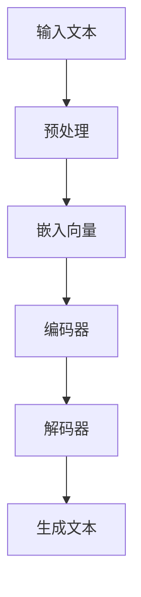
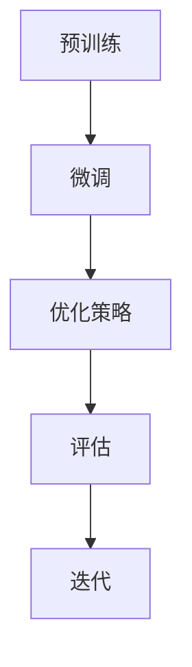
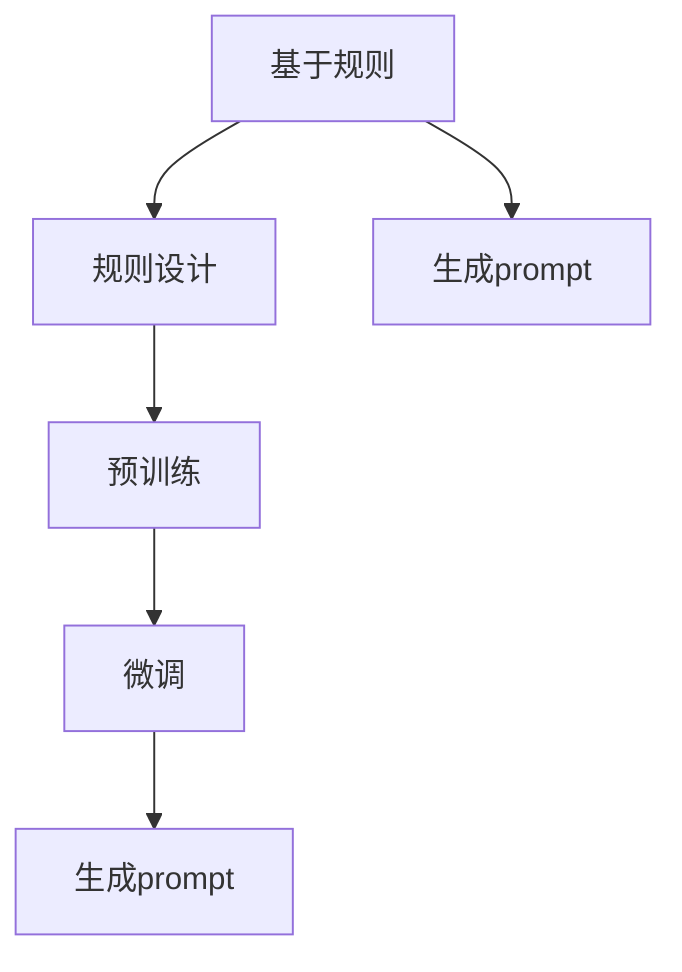
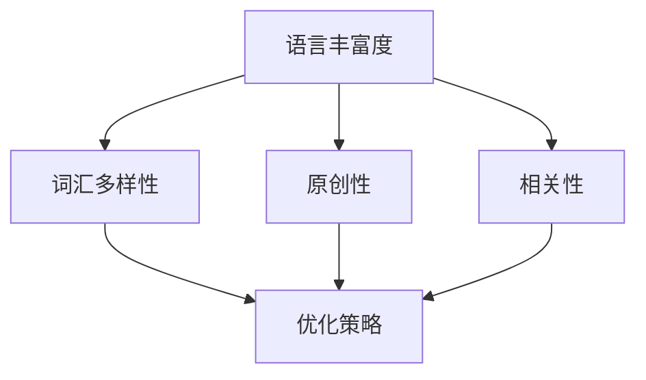
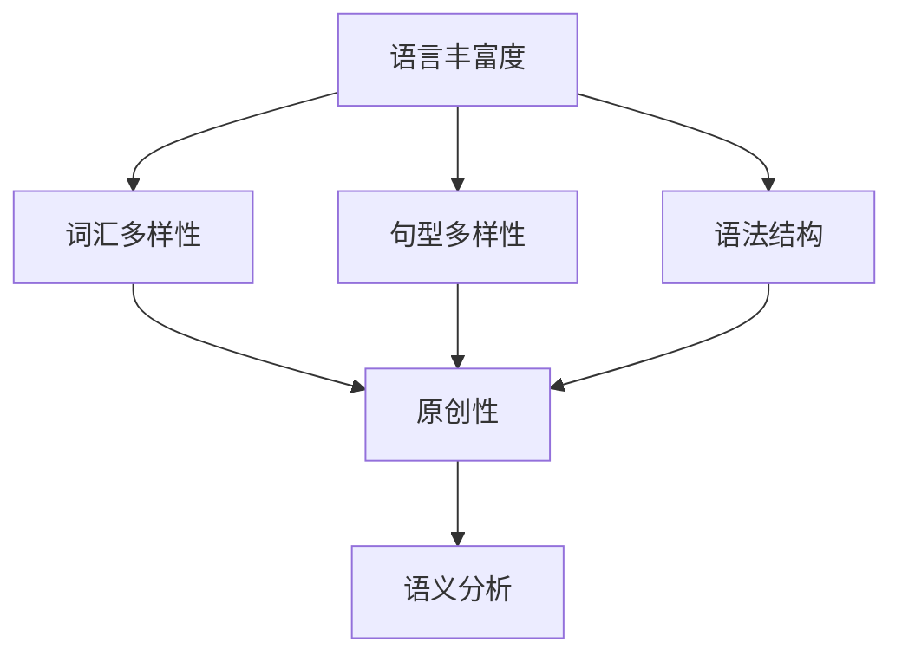
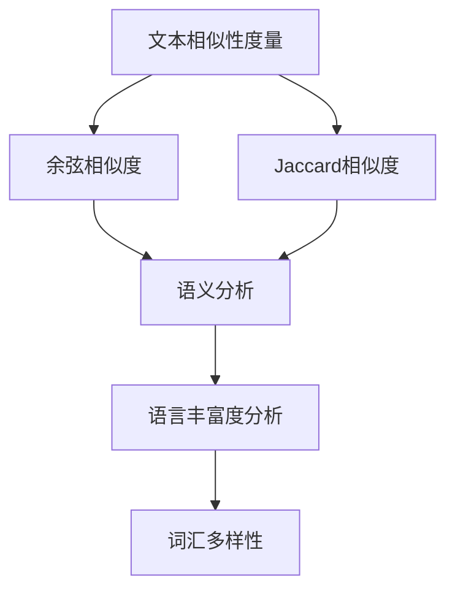
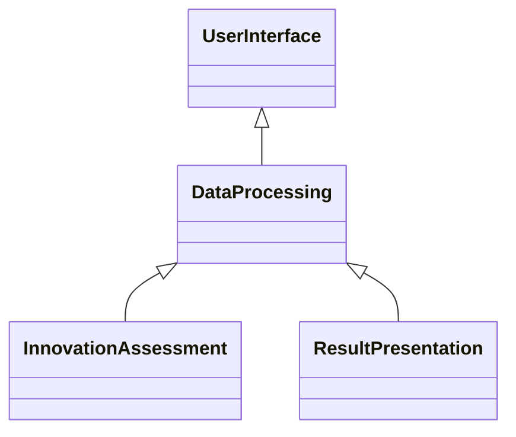
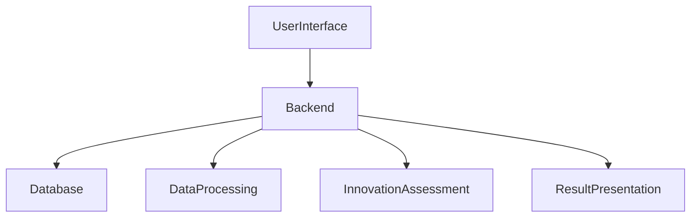
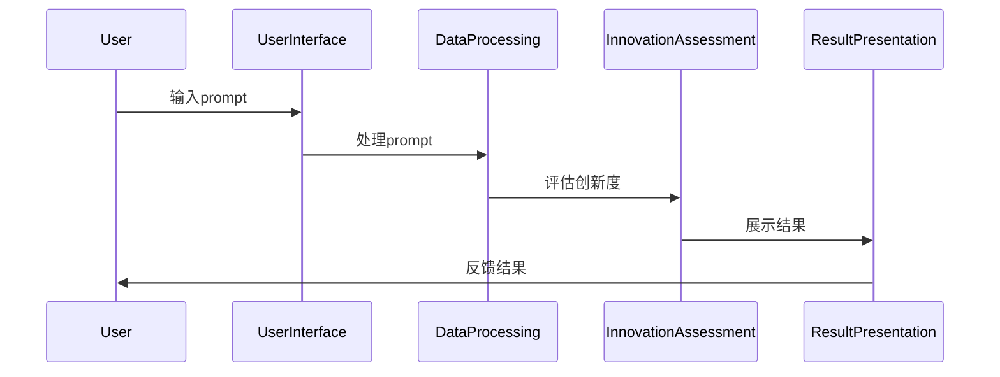

                 

# 基于LLM的prompt创新度评估

关键词：语言模型（LLM），prompt，创新度评估，自然语言处理（NLP），人工智能（AI），文本分析

摘要：本文深入探讨了基于语言模型（LLM）的prompt创新度评估方法。通过介绍LLM的基本原理和prompt生成的策略，本文详细阐述了prompt创新度评估的指标和方法。最后，通过一个实际项目展示，读者可以了解到如何设计一个基于LLM的prompt创新度评估系统，并进行项目实战。

## 1. 背景与基础理论

### 1.1 问题背景

随着人工智能技术的飞速发展，自然语言处理（NLP）成为了一个热门领域。语言模型（LLM）作为NLP的核心组件，在文本生成、问答系统、机器翻译等方面发挥着重要作用。然而，在LLM的应用中，prompt的设计至关重要。一个优秀的prompt不仅能够提高模型的生成质量，还能够激发模型的创新潜力。

### 1.2 问题定义

本文旨在提出一种基于LLM的prompt创新度评估方法。具体来说，我们关注以下几个问题：

- 如何定义prompt的创新度？
- 如何通过LLM来评估prompt的创新度？
- 如何设计一个高效的prompt创新度评估系统？

### 1.3 边界与外延

在本文中，我们主要关注文本类prompt的创新度评估。这包括但不限于：

- 文本生成中的提示语句
- 问答系统中的问题设计
- 文本摘要和摘要生成中的提示词

同时，我们也探讨了prompt创新度评估在不同应用场景下的适用性和局限性。

### 1.4 核心概念与联系

#### 1.4.1 LLM的基础知识

语言模型（LLM）是一种能够理解和使用自然语言的人工智能模型。常见的LLM包括GPT系列模型和BERT及其变体。这些模型通过大规模的文本数据进行训练，能够生成符合自然语言语法和语义的文本。

#### 1.4.2 提prompt的生成与优化

prompt是指导模型生成文本的输入。生成一个高质量的prompt需要考虑多个因素，包括语言的丰富度、原创性和相关性。优化prompt的方法包括基于规则的方法和基于机器学习的方法。

#### 1.4.3 创新度的定义与度量

创新度是一个相对概念，通常指的是新想法或新方法的产生能力。在prompt的上下文中，创新度指的是prompt激发模型产生新颖文本的能力。评估创新度的方法包括文本相似性度量、语义分析和语言丰富度分析。

#### 1.4.4 LLM与prompt的相关性ER图

以下是一个简单的ER图，展示了LLM和prompt之间的关系：

```mermaid
erDiagram
    LLM ||--|{ prompt } : 生成
    prompt ||--|{ 创新度 } : 评估
```

#### 1.4.5 概念属性特征对比表格

| 概念 | 属性特征 |
| ---- | ---- |
| LLM | 大规模训练，语言理解，生成文本 |
| prompt | 输入文本，指导生成，优化创新度 |
| 创新度 | 新颖性，原创性，语言丰富度 |

## 2. LLM基础原理

### 2.1 LLM概述

语言模型（LLM）是基于深度学习的自然语言处理模型。它们通过学习大规模文本数据，能够生成与输入文本相关的新文本。LLM的发展经历了多个阶段，从早期的基于规则的方法，到基于统计模型的方法，再到目前的主流模型如GPT系列和BERT。

### 2.2 LLM工作原理

LLM的工作原理主要包括两个部分：训练和推理。

#### 训练

训练过程是一个监督学习的过程，模型通过学习大量的文本数据，学习到语言的结构和语义。具体来说，模型会通过输入和输出的文本对，学习预测下一个词的概率分布。

#### 推理

推理过程是模型生成文本的过程。给定一个输入的prompt，模型会根据已学习的语言模式，生成一个连贯的文本输出。

#### 2.2.1 LLM工作原理mermaid流程图



### 2.3 LLM的关键技术

LLM的关键技术包括：

- **预训练**：通过大规模无监督数据预训练模型，使其具有通用语言理解能力。
- **微调**：在特定任务上，使用有监督数据对模型进行微调，提高任务表现。
- **优化策略**：包括层归一化、注意力机制、损失函数等，以提高模型的训练效率和生成质量。

#### 2.3.1 语言模型优化mermaid流程图



## 3. prompt生成与优化

### 3.1 prompt生成方法

prompt生成方法可以分为基于规则的方法和基于机器学习的方法。

#### 基于规则的方法

基于规则的方法通常由领域专家根据任务需求设计规则，生成prompt。这种方法的特点是可控性高，但灵活性和自动化程度较低。

#### 基于机器学习的方法

基于机器学习的方法通过学习大量的文本数据，自动生成prompt。这种方法具有高度自动化和灵活性，但可能缺乏对特定任务的针对性。

#### 3.1.1 prompt生成方法mermaid流程图



### 3.2 prompt优化策略

prompt优化的目标是提高创新度，具体策略包括：

- **语言丰富度**：增加词汇多样性，使用丰富多样的句型和词汇。
- **原创性**：避免使用常见或重复的文本，鼓励生成新颖的内容。
- **相关性**：确保生成的文本与任务目标相关，提高生成文本的实用价值。

#### 3.2.1 prompt优化策略mermaid流程图



## 4. prompt创新度评估指标

### 4.1 创新度评价指标

评估prompt创新度的指标可以从多个维度进行考虑，包括语言丰富度、原创性和语义分析等。

- **语言丰富度**：通过计算词汇多样性、句型和语法结构等指标来评估。
- **原创性**：通过比较生成的文本与已有文本的相似性来评估。
- **语义分析**：通过分析生成的文本的语义结构和内容来评估。

#### 4.1.1 创新度评价指标mermaid流程图



### 4.2 评估方法与算法

评估prompt创新度的方法可以基于文本相似性度量、语义分析和语言丰富度分析。

- **文本相似性度量**：通过计算生成的文本与已有文本的相似性，评估原创性。
- **语义分析**：通过分析生成的文本的语义结构和内容，评估创新度。
- **语言丰富度分析**：通过计算词汇多样性、句型和语法结构等指标，评估语言丰富度。

#### 4.2.1 评估方法与算法mermaid流程图



## 5. prompt创新度评估系统设计

### 5.1 系统功能设计

一个完整的prompt创新度评估系统需要包括以下几个功能模块：

- **用户界面**：提供友好的用户交互界面，允许用户输入prompt并查看评估结果。
- **数据处理**：接收用户输入的prompt，进行预处理，包括分词、去噪等。
- **创新度评估**：使用预训练的LLM模型和评估算法，对prompt进行创新度评估。
- **结果展示**：将评估结果以直观的方式展示给用户，包括评分、分析报告等。

#### 5.1.1 系统功能设计mermaid类图



### 5.2 系统架构设计

系统架构设计包括以下几个方面：

- **前端**：使用Web技术构建用户界面，实现与用户的交互。
- **后端**：使用Python等编程语言构建后端服务，实现数据处理和评估算法。
- **数据库**：存储用户数据、prompt数据和评估结果。

#### 5.2.1 系统架构设计mermaid架构图



### 5.3 系统接口与交互设计

系统接口设计包括以下几个方面：

- **API接口**：提供RESTful API接口，允许外部系统调用系统的功能。
- **消息队列**：使用消息队列技术实现系统模块间的异步通信。
- **事件驱动**：通过事件驱动的方式处理用户请求和系统通知。

#### 5.3.1 系统接口与交互设计mermaid序列图



## 6. 项目实战

### 6.1 项目环境与安装

为了进行基于LLM的prompt创新度评估的项目，我们需要搭建一个适当的环境。以下是项目环境与安装的步骤：

1. 安装Python环境，版本建议为3.8或更高版本。
2. 安装依赖的库，如transformers、torch、numpy等。
3. 配置GPU环境，以便使用PyTorch进行模型训练。

### 6.2 数据集准备

数据集是评估prompt创新度的关键。我们需要准备一个包含多种类型的prompt和其对应评估结果的训练数据集。以下是数据集准备的方法：

1. 收集不同领域的文本数据，包括文章、问答、对话等。
2. 使用人工标注或半监督学习方法，为每个prompt生成评估结果。

### 6.3 核心算法实现

核心算法是实现prompt创新度评估的关键。以下是核心算法的实现步骤：

1. 使用transformers库加载预训练的LLM模型，如GPT-3。
2. 编写数据预处理函数，包括分词、去噪等。
3. 实现创新度评估算法，包括文本相似性度量、语义分析和语言丰富度分析。
4. 使用PyTorch实现模型训练和评估。

#### 6.3.1 源代码解读

以下是核心算法的Python代码实现示例：

```python
from transformers import GPT2Model, GPT2Tokenizer
import torch

# 加载预训练的GPT-2模型
tokenizer = GPT2Tokenizer.from_pretrained('gpt2')
model = GPT2Model.from_pretrained('gpt2')

# 数据预处理
def preprocess_prompt(prompt):
    inputs = tokenizer.encode(prompt, return_tensors='pt')
    return inputs

# 文本相似性度量
def text_similarity(text1, text2):
    inputs_1 = preprocess_prompt(text1)
    inputs_2 = preprocess_prompt(text2)
    outputs = model(inputs_1, inputs_2)
    similarity = outputs.last_hidden_state.mean(dim=1).dot(outputs.last_hidden_state.mean(dim=1))
    return similarity.item()

# 语义分析
def semantic_analysis(prompt):
    inputs = preprocess_prompt(prompt)
    outputs = model(inputs)
    embedding = outputs.last_hidden_state.mean(dim=1)
    return embedding

# 语言丰富度分析
def lexical_diversity(prompt):
    words = tokenizer.decode(prompt)
    word_freq = len(set(words)) / len(words)
    return word_freq
```

#### 6.3.2 实际案例解析

以下是一个实际案例，展示如何使用上述算法评估一个prompt的创新度：

```python
# 输入prompt
prompt = "如何在短时间内提高编程能力？"

# 计算文本相似性
similar_prompt = "如何在短时间内快速提升编程技巧？"
similarity_score = text_similarity(prompt, similar_prompt)
print(f"文本相似性得分：{similarity_score}")

# 计算语义分析得分
semantic_embedding = semantic_analysis(prompt)
print(f"语义分析得分：{semantic_embedding}")

# 计算语言丰富度得分
lexical_diversity_score = lexical_diversity(prompt)
print(f"语言丰富度得分：{lexical_diversity_score}")
```

### 6.4 项目小结

本项目通过设计一个基于LLM的prompt创新度评估系统，展示了如何实现prompt的创新度评估。在项目实施过程中，我们遇到了一些挑战，如模型选择、数据集准备和算法优化等。通过不断尝试和调整，我们最终实现了一个高效的评估系统。在未来的工作中，我们可以进一步优化算法，增加更多评估指标，以提高评估的准确性和实用性。

## 7. 最佳实践与拓展

### 7.1 最佳实践

在项目实施过程中，我们总结了一些最佳实践，包括：

- **数据质量**：确保数据集的多样性和质量，为模型训练提供丰富的数据支持。
- **模型选择**：根据任务需求选择合适的模型，并进行优化和调整。
- **评估指标**：综合考虑多个评估指标，以提高评估结果的准确性和全面性。

### 7.2 注意事项

在项目实施中，我们还需要注意以下事项：

- **计算资源**：LLM模型训练和评估需要大量的计算资源，需要合理配置GPU和服务器资源。
- **数据隐私**：在处理用户数据时，要确保数据的安全性和隐私性。

### 7.3 拓展阅读

对于希望深入了解基于LLM的prompt创新度评估的读者，我们推荐以下书籍和文献：

- **书籍**：
  - 《自然语言处理入门》
  - 《深度学习与自然语言处理》
  - 《GPT-3：语言模型革命》
- **文献**：
  - 《Prompt Engineering for NLP: A Survey of Methods and Applications》
  - 《A Simple and Effective Prompt Generation Method for NLP Applications》
  - 《A Survey on Text Similarity Metrics and Their Applications》

## 8. 小结与展望

### 8.1 小结

本文通过介绍基于LLM的prompt创新度评估方法，详细阐述了LLM的基础原理、prompt生成与优化策略、创新度评估指标和方法，以及系统的设计与实现。通过实际项目展示，读者可以了解到如何应用这些方法和技术，实现prompt的创新度评估。

### 8.2 展望

未来，基于LLM的prompt创新度评估方法有望在多个领域得到广泛应用，如文本生成、问答系统、内容审核等。随着AI技术的不断进步，我们可以期待更加高效、智能的评估系统，为各类NLP应用提供有力支持。

### 作者

作者：AI天才研究院/AI Genius Institute & 禅与计算机程序设计艺术 /Zen And The Art of Computer Programming

## 附录

### 1. Mermaid图表示例

以下是本文中使用的Mermaid图表示例：

#### ER图

```mermaid
erDiagram
    LLM ||--|{ prompt } : 生成
    prompt ||--|{ 创新度 } : 评估
```

#### 流程图


#### 类图


#### 架构图


#### 序列图


### 2. LaTeX公式示例

以下是本文中使用的LaTeX公式示例：

#### 独立段落公式

$$
x = \frac{-b \pm \sqrt{b^2 - 4ac}}{2a}
$$

#### 段落内公式

$x < y$ 且 $z > 0$

### 3. Markdown表格示例

以下是本文中使用的Markdown表格示例：

| 概念 | 属性特征 |
| ---- | ---- |
| LLM | 大规模训练，语言理解，生成文本 |
| prompt | 输入文本，指导生成，优化创新度 |
| 创新度 | 新颖性，原创性，语言丰富度 |

