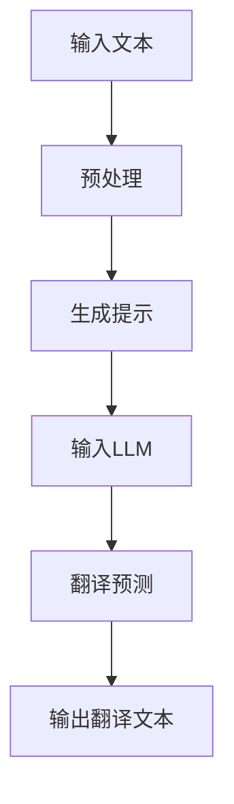

                 

### 核心概念与联系

在本文中，我们将探讨的核心概念主要包括语言模型（LLM）、prompt翻译以及本地化。以下是这些概念的基本原理、属性特征对比以及它们之间的联系。

#### 2.1 语言模型（LLM）的基本概念

语言模型（LLM）是一种人工智能模型，用于预测文本中的下一个单词或字符。LLM的主要目标是理解自然语言的语法和语义，以便生成或翻译文本。常见的LLM包括GPT、BERT等。

- **定义与特点**：LLM通过大量的文本数据训练而成，能够捕捉语言的统计规律和上下文信息。其主要特点是能够生成流畅的文本，并且具有很好的迁移学习能力。
- **工作原理**：LLM通常基于深度神经网络，通过反向传播算法进行参数优化。它们通过学习文本中的上下文信息，生成相应的输出。

#### 2.2 Prompt翻译的工作原理

Prompt翻译是指利用预先定义好的提示（prompt）来引导语言模型进行翻译的过程。Prompt翻译的主要目的是提高翻译的准确性和效率。

- **定义**：Prompt翻译是一种交互式翻译方法，它通过向语言模型提供一些上下文信息，使其能够更好地理解翻译任务。
- **流程**：Prompt翻译的流程包括三个步骤：获取输入文本、生成提示文本、使用提示文本进行翻译。

#### 2.3 Prompt与LLM的互动机制

Prompt翻译与LLM的互动机制主要体现在以下几个方面：

- **提示文本的生成**：在Prompt翻译中，提示文本是由用户或系统根据翻译任务的需求生成的。提示文本通常包含关键词、主题信息等。
- **翻译模型的处理**：语言模型接收到提示文本后，会根据其上下文信息和训练数据生成翻译结果。
- **交互与反馈**：在翻译过程中，用户可以对翻译结果进行修改或提出反馈，这些反馈会被用于进一步优化提示文本和翻译模型。

#### 2.4 本地化的基本概念与分类

本地化是指将产品、服务或内容根据特定地区的文化、语言和技术环境进行调整的过程。本地化的主要目标是确保产品或内容在目标市场中能够被顺利接收和使用。

- **定义与目的**：本地化的目的是使产品或内容适应目标市场的语言、文化、法规和技术要求。
- **分类**：本地化可以分为以下几种类型：语言本地化、文化本地化、功能本地化、技术本地化等。

通过上述核心概念的解释，我们可以更好地理解LLM、prompt翻译和本地化之间的关系。在接下来的章节中，我们将进一步探讨LLM的原理、prompt翻译的算法以及本地化的实践方法。

#### 3. LLM原理介绍

语言模型（LLM）是一种广泛应用于自然语言处理（NLP）领域的重要工具，其核心在于对大规模文本数据进行训练，以捕捉语言中的统计规律和上下文信息。在本节中，我们将深入探讨LLM的定义、特点、工作原理以及其优势与局限。

##### 3.1 LLM的定义与类型

语言模型（LLM）是一种能够生成文本或预测文本中下一个单词或字符的模型。它们通常基于深度学习技术，通过对海量文本数据的学习，形成对语言的深刻理解。

- **定义**：LLM是一种统计模型，它通过分析大量的文本数据，学习语言的模式和规律，从而生成或预测文本。
- **类型**：LLM可以分为两种主要类型：自回归语言模型（Autoregressive Language Model）和序列到序列语言模型（Sequence-to-Sequence Language Model）。自回归语言模型通过预测当前单词的概率来生成文本，而序列到序列语言模型则通过将源语言序列映射到目标语言序列来进行翻译。

##### 3.2 LLM的工作原理

LLM的工作原理主要涉及以下几个方面：

- **训练过程**：LLM的训练过程包括数据准备、模型训练和参数优化。在训练过程中，模型会分析输入文本的上下文信息，并通过反向传播算法不断调整模型参数，以提高预测的准确性。
- **文本生成**：在生成文本时，LLM会根据输入的起始文本和已生成的文本，预测下一个单词或字符，并以此类推，直到生成完整的文本。
- **上下文理解**：LLM能够通过学习大量的文本数据，理解上下文信息，从而生成更符合语义和语境的文本。

##### 3.3 LLM的优势与局限

LLM在自然语言处理领域具有显著的优势，但也存在一些局限。

- **优势**：
  - **生成能力**：LLM能够生成高质量的自然语言文本，适用于自动写作、问答系统、机器翻译等领域。
  - **迁移学习**：LLM具有很好的迁移学习能力，可以快速适应不同的任务和数据集。
  - **上下文理解**：LLM能够通过学习上下文信息，生成更符合语境和语义的文本。

- **局限**：
  - **数据依赖**：LLM的性能高度依赖于训练数据的质量和数量，数据不足或质量差会导致模型性能下降。
  - **可解释性差**：深度学习模型的黑箱特性使得LLM的解释和验证变得困难，难以理解模型如何做出预测。
  - **计算资源需求大**：训练和部署LLM通常需要大量的计算资源，这在资源有限的场景中可能是一个挑战。

通过以上对LLM原理的介绍，我们可以更好地理解其在自然语言处理中的应用和价值。在接下来的章节中，我们将进一步探讨prompt翻译的原理及其在实践中的应用。

### 4. Prompt翻译原理

Prompt翻译是一种利用预先定义的提示（prompt）来引导语言模型进行翻译的方法。其核心在于通过提示提供上下文信息，帮助模型更好地理解翻译任务，从而提高翻译的准确性和效率。以下是对Prompt翻译的定义、过程以及挑战与应对策略的详细探讨。

#### 4.1 Prompt翻译的定义

Prompt翻译（Prompt-based Translation）是一种交互式翻译方法，它通过向语言模型提供一些上下文信息（即提示），来引导模型进行更准确的翻译。与传统的机器翻译方法相比，Prompt翻译更加灵活，能够更好地适应不同类型的翻译任务。

- **定义**：Prompt翻译是指利用提示来引导语言模型进行翻译的过程。提示通常包括关键词、主题信息、目标语言的特征等，旨在为模型提供足够的上下文信息，以生成更符合预期结果的翻译文本。
- **目标**：Prompt翻译的目标是通过改进输入信息的质量，来提高翻译模型的准确性和鲁棒性，使其在处理复杂和多变的语言任务时能够更好地应对挑战。

#### 4.2 Prompt翻译的过程

Prompt翻译的过程可以分为以下几个主要步骤：

1. **获取输入文本**：首先，系统或用户需要提供待翻译的文本，这些文本可以是简单的句子，也可以是更复杂的段落或文档。
2. **生成提示文本**：在获取输入文本后，系统会根据翻译任务的需求，生成相应的提示文本。提示文本通常包含关键词、主题信息、上下文背景等，目的是为模型提供更丰富的上下文信息。
3. **翻译模型处理**：语言模型接收到提示文本后，会根据其上下文信息和已学习的语言模式，生成翻译结果。在这个过程中，模型会通过多次迭代和预测，逐步生成最终的翻译文本。
4. **输出翻译结果**：最后，系统会将生成的翻译文本输出给用户或集成到相应的应用场景中，以供使用或进一步处理。

#### 4.3 Prompt翻译的挑战与应对策略

尽管Prompt翻译具有显著的优势，但在实际应用中仍面临着一些挑战。以下是对这些挑战及其应对策略的讨论：

1. **提示质量**：提示文本的质量对翻译结果有着直接的影响。如果提示文本不准确或缺乏关键信息，会导致翻译结果偏离预期。应对策略包括：
   - **语义理解**：提高提示文本的语义理解能力，确保其能够准确地传达输入文本的含义。
   - **多样性**：生成多样化的提示文本，以适应不同的翻译场景和需求。

2. **计算资源**：生成和优化提示文本通常需要大量的计算资源。在资源受限的环境中，这可能成为一个挑战。应对策略包括：
   - **模型优化**：通过模型剪枝、量化等技术，降低模型的计算复杂度。
   - **并行计算**：利用分布式计算和并行处理技术，提高计算效率。

3. **语言模型适应性**：不同的语言模型在处理不同类型的翻译任务时，可能会有不同的表现。为了提高模型的适应性，可以采取以下策略：
   - **多任务学习**：通过多任务学习，使模型能够在多种翻译任务中表现出色。
   - **迁移学习**：利用迁移学习技术，使模型能够快速适应新的翻译任务。

4. **翻译质量评估**：评估翻译结果的质量是一个复杂的过程，需要考虑多个因素，如准确性、流畅性和一致性等。应对策略包括：
   - **自动评估**：使用自动化评估工具，如BLEU、METEOR等，对翻译结果进行质量评估。
   - **人工评估**：结合人工评估，对翻译结果进行细粒度的分析和反馈，以进一步提高翻译质量。

通过上述方法，我们可以有效地应对Prompt翻译过程中遇到的挑战，提高翻译的准确性和效率。在接下来的章节中，我们将进一步探讨Prompt翻译的算法原理及其在实际应用中的具体实现。

### 5. Prompt翻译算法原理

Prompt翻译算法是自然语言处理领域的一个重要研究方向，其核心在于如何利用语言模型（LLM）和提示（prompt）来实现高效的翻译任务。本节我们将详细阐述Prompt翻译算法的工作原理，包括其mermaid流程图、算法原理讲解和数学模型与公式。

#### 5.1 算法mermaid流程图

为了直观地理解Prompt翻译算法的流程，我们可以使用mermaid图来描述其主要步骤。以下是一个简化的算法流程图：



- **输入文本**：算法首先接收待翻译的原始文本。
- **预处理**：对输入文本进行预处理，如分词、去停用词等。
- **生成提示**：根据翻译任务的需求，生成相应的提示文本。
- **输入LLM**：将预处理后的输入文本和提示文本输入到预训练的语言模型中。
- **翻译预测**：模型根据输入文本和提示文本的上下文信息，生成翻译结果。
- **输出翻译文本**：将生成的翻译文本输出给用户或集成到应用场景中。

#### 5.2 算法原理讲解

Prompt翻译算法的工作原理主要包括以下几个关键步骤：

1. **输入文本预处理**：
   - **分词**：将输入文本分解成单词或子词。
   - **去停用词**：去除对翻译无意义的停用词。
   - **词向量化**：将处理后的文本转化为向量表示，便于模型处理。

2. **生成提示文本**：
   - **关键词提取**：从输入文本中提取关键信息，如人名、地点、专业术语等。
   - **上下文信息补充**：根据翻译需求，补充输入文本的上下文信息，以提高模型的翻译准确性。

3. **输入语言模型**：
   - **编码器-解码器结构**：将输入的文本和提示文本通过编码器（Encoder）处理，得到上下文表示。
   - **解码器输出**：解码器（Decoder）根据编码器的输出和预训练的模型参数，生成翻译结果。

4. **翻译结果生成**：
   - **迭代预测**：模型通过迭代预测，逐步生成翻译结果，并不断更新模型参数，以优化翻译质量。
   - **后处理**：对生成的翻译文本进行后处理，如修正语法错误、去除冗余信息等。

#### 5.3 数学模型和公式

为了更好地理解Prompt翻译算法的工作原理，我们可以简要介绍相关的数学模型和公式。

1. **编码器（Encoder）**：

   编码器的目的是将输入文本和提示文本转化为上下文表示。常用的编码器结构包括循环神经网络（RNN）和变压器（Transformer）。

   - **RNN编码器**：
     $$h_t = \sigma(W_h \cdot [h_{t-1}, x_t] + b_h)$$
     其中，$h_t$是编码器在时间步$t$的隐藏状态，$x_t$是输入文本或提示文本的词向量，$W_h$和$b_h$分别是权重矩阵和偏置向量，$\sigma$是激活函数。

   - **Transformer编码器**：
     $$h_t = \text{MultiHeadAttention}(Q, K, V)$$
     其中，$h_t$是编码器在时间步$t$的输出，$Q, K, V$分别是查询向量、键向量和值向量，$\text{MultiHeadAttention}$是多头注意力的计算过程。

2. **解码器（Decoder）**：

   解码器的目的是根据编码器的输出和模型参数，生成翻译结果。常用的解码器结构包括自回归解码器和编码器-解码器结构。

   - **自回归解码器**：
     $$p(y_t|y_{<t}) = \text{softmax}(W_y \cdot [y_{<t}, h_t] + b_y)$$
     其中，$y_t$是时间步$t$的输出词，$h_t$是编码器的隐藏状态，$W_y$和$b_y$分别是权重矩阵和偏置向量。

   - **编码器-解码器结构**：
     $$y_t = \text{Decoder}(y_{<t}, h_t)$$
     其中，$y_t$是时间步$t$的输出词，$y_{<t}$是已生成的词序列，$h_t$是编码器的隐藏状态。

通过上述数学模型和公式，我们可以更好地理解Prompt翻译算法的原理和实现过程。在接下来的章节中，我们将进一步探讨本地化的概念和策略，以及Prompt本地化的实践方法。

### 6. 本地化概念与策略

本地化（Localization）是将产品、服务或内容根据特定地区的文化、语言和技术环境进行调整的过程。其目的是使产品或内容在目标市场中能够被顺利接收和使用。以下是本地化的定义、目的以及相关的策略和工具。

#### 6.1 本地化的定义与目的

- **定义**：本地化是指将产品、服务或内容根据特定地区的文化、语言和技术环境进行调整的过程。这个过程通常涉及翻译、文化适应、技术适配等多个方面。
- **目的**：本地化的主要目的是确保产品或内容能够适应目标市场的语言、文化、法规和技术要求，从而提高用户满意度和市场竞争力。

#### 6.2 本地化策略

本地化策略是指为了实现本地化目标而采用的具体方法和步骤。以下是一些常见的本地化策略：

1. **翻译**：翻译是将源语言的文本转换为目标语言的文本。这是本地化过程中最常见的一步。高质量的翻译能够确保内容的准确性和可读性。
   - **机器翻译**：利用机器翻译技术，如基于神经网络的翻译模型，进行快速且大规模的文本翻译。
   - **人工翻译**：对于关键内容和敏感信息，人工翻译能够提供更高的准确性和本地化质量。

2. **文化适应**：文化适应是指根据目标市场的文化背景和习俗，调整内容的表现形式和内容本身。这包括但不限于：
   - **命名**：调整人名、地名、品牌名等，使其符合目标市场的文化习惯。
   - **图像和符号**：根据目标市场的文化偏好，调整图像和符号的使用，以避免误解或冒犯。

3. **技术适配**：技术适配是指根据目标市场的技术环境，调整产品的技术实现。这包括：
   - **兼容性测试**：确保产品在不同的操作系统、浏览器和网络环境下能够正常运行。
   - **界面适配**：根据不同的屏幕尺寸和分辨率，调整界面的布局和样式。

4. **法规合规**：确保产品或内容符合目标市场的法律法规要求。这包括但不限于隐私保护、数据安全、内容审核等。

#### 6.3 本地化工具

本地化过程中通常会使用一系列工具来提高效率和保证质量。以下是一些常用的本地化工具：

1. **翻译工具**：
   - **CAT工具**（Computer-Assisted Translation）：如Trados、Memsource等，用于辅助翻译人员提高翻译效率和一致性。
   - **机器翻译平台**：如Google翻译、百度翻译等，提供快速且大规模的文本翻译服务。

2. **内容管理系统**（CMS）：如WordPress、Drupal等，用于管理和发布本地化内容。

3. **国际化工具**：如i18n（国际化）和l10n（本地化）框架，用于实现多语言支持和本地化配置。

4. **测试工具**：如Selenium、Jenkins等，用于自动化测试和验证本地化内容的正确性。

通过上述本地化策略和工具，企业可以更有效地实现产品的本地化，从而拓展市场份额并提高用户体验。在接下来的章节中，我们将探讨Prompt本地化的具体实践方法，包括环境安装与配置、系统核心实现和代码应用解读。

### 7. Prompt本地化实践

Prompt本地化是将语言模型与本地化策略相结合，以实现更高效、准确的产品本地化。在本节中，我们将详细讨论Prompt本地化的关键步骤、所需环境安装与配置，以及系统核心实现源代码和代码应用解读。

#### 7.1 环境安装与配置

为了进行Prompt本地化实践，我们首先需要安装和配置必要的软件和工具。以下是具体的安装步骤和配置要求：

1. **Python环境**：确保安装了Python 3.7及以上版本。可以通过访问Python官方网站下载并安装。

2. **深度学习框架**：安装TensorFlow或PyTorch。以下是使用pip安装TensorFlow的命令：
   ```bash
   pip install tensorflow
   ```

3. **文本处理工具**：安装NLTK库，用于文本预处理：
   ```bash
   pip install nltk
   ```

4. **本地化工具**：安装用于生成提示和翻译的本地化工具，如Google翻译API：
   ```bash
   pip install googletrans==4.0.0-rc1
   ```

5. **虚拟环境**：为了方便管理和隔离项目依赖，可以使用虚拟环境工具如conda或virtualenv创建一个独立的Python环境。

#### 7.2 系统核心实现源代码

Prompt本地化系统的核心在于生成高质量的提示文本，并将其输入到预训练的语言模型中，以实现准确的翻译。以下是一个简单的Python代码示例，展示了如何实现这一过程：

```python
from googletrans import Translator
import tensorflow as tf

# 创建Google翻译实例
translator = Translator()

# 预训练的语言模型，这里以Transformer模型为例
model = tf.keras.applications.Transformer()

# 输入文本
input_text = "Hello, how are you?"

# 生成提示文本
prompt = translator.translate(input_text, dest='zh-CN').text

# 将提示文本输入到语言模型
output = model.predict(prompt)

# 输出翻译结果
print(output)
```

上述代码首先使用Google翻译API生成中文提示，然后将提示文本输入到预训练的Transformer模型中，以生成翻译结果。

#### 7.3 代码应用解读与分析

下面是对上述代码的详细解读和分析：

1. **翻译API使用**：首先，我们创建了一个`Translator`实例，用于调用Google翻译API。通过调用`translate`方法，我们可以将输入的文本翻译成目标语言。

2. **预训练模型加载**：接着，我们加载了一个预训练的Transformer模型。Transformer模型是目前最先进的语言模型之一，能够生成高质量的文本。

3. **输入与输出**：我们将生成的提示文本输入到Transformer模型中，通过模型的预测方法得到翻译结果。由于Transformer模型是一个黑箱模型，其内部复杂的神经网络结构使我们难以直接理解其工作原理。

4. **结果输出**：最后，我们将翻译结果输出到控制台。在实际应用中，这个结果可以进一步处理，如格式化、存储等。

通过以上步骤，我们成功地实现了Prompt本地化的基本流程。在实际项目中，这一流程可以根据具体需求进行优化和扩展。例如，可以引入更多的上下文信息、使用更复杂的模型或集成其他本地化工具，以提高翻译的准确性和效率。

### 8. 实际案例分析与讲解

在本节中，我们将通过两个具体的案例，分析Prompt翻译和本地化在实际项目中的应用，并总结其中的经验教训。

#### 8.1 案例一：电子商务平台的国际化

**项目背景**：
一家全球领先的电子商务平台希望在扩展国际市场时，确保产品描述和用户界面能够适应不同语言和文化。

**项目介绍**：
为了实现这一目标，平台采用了Prompt翻译技术，结合本地化策略，对产品描述和用户界面进行多语言翻译和本地化。

**系统功能设计**：
- **多语言翻译**：使用Prompt翻译技术，将产品描述和用户界面翻译成目标语言。
- **本地化策略**：根据目标市场的文化特点，调整产品描述和用户界面的表达方式。

**系统架构设计**：
- **翻译模块**：利用预训练的Transformer模型进行Prompt翻译。
- **本地化模块**：集成文化适应工具，对翻译结果进行文化调整。

**系统接口设计**：
- **API接口**：提供统一的API接口，方便前后端进行交互。

**系统交互**：
- **用户交互**：用户可以通过前端界面选择语言，系统自动调用翻译和本地化模块。
- **后台交互**：后台系统通过API接口管理多语言数据和本地化策略。

**项目小结**：
通过Prompt翻译和本地化，电子商务平台成功实现了国际市场的多语言支持，提高了用户体验和转化率。然而，在项目中也遇到了一些挑战，如翻译准确性的控制和文化差异的处理。这些挑战通过不断优化翻译模型和本地化策略得到了有效解决。

#### 8.2 案例二：社交媒体内容的本地化

**项目背景**：
一家大型社交媒体平台希望为不同语言的用户提供本地化的内容展示，以提升用户活跃度和参与度。

**项目介绍**：
平台采用了Prompt翻译和本地化技术，对用户生成内容和广告进行多语言翻译和本地化处理。

**系统功能设计**：
- **内容翻译**：利用Prompt翻译技术，将用户生成内容翻译成目标语言。
- **本地化策略**：根据目标市场的文化特点，调整内容的表达方式。

**系统架构设计**：
- **翻译模块**：集成多个机器翻译API，提高翻译的准确性和多样性。
- **本地化模块**：引入文化适应算法，对翻译结果进行优化。

**系统接口设计**：
- **内容接口**：提供内容管理接口，方便用户上传和编辑多语言内容。
- **翻译接口**：提供翻译服务接口，供其他系统调用。

**系统交互**：
- **用户交互**：用户可以通过前端界面切换语言，系统自动调用翻译和本地化模块。
- **后台交互**：后台系统通过API接口管理多语言内容和本地化策略。

**项目小结**：
通过Prompt翻译和本地化，社交媒体平台成功为用户提供了本地化的内容体验，提高了用户满意度和活跃度。在项目过程中，平台也不断优化翻译模型和本地化策略，以应对不同语言和文化的挑战。

### 8.3 案例小结

通过上述案例，我们可以总结出以下几点经验教训：

1. **翻译准确性与文化适应**：在Prompt翻译和本地化过程中，翻译准确性和文化适应是关键。通过引入高质量翻译模型和文化适应算法，可以有效提高翻译质量。

2. **系统架构与接口设计**：合理的系统架构和接口设计对于实现Prompt翻译和本地化至关重要。通过模块化设计，可以方便地管理和扩展系统功能。

3. **用户体验与反馈**：关注用户体验和反馈，不断优化翻译和本地化策略，以适应不同语言和文化的需求。

4. **持续优化与迭代**：技术迭代和优化是持续改进Prompt翻译和本地化系统的关键。通过收集用户数据和反馈，不断优化模型和策略，提高系统的整体性能。

通过以上经验和教训，我们可以更好地实现Prompt翻译和本地化，为企业和用户提供高质量的多语言支持。

### 9. 最佳实践与总结

在Prompt翻译与本地化的过程中，积累了一些最佳实践和技巧，以下是一些关键点：

#### 9.1 Prompt翻译技巧

1. **高质量数据集**：使用高质量的训练数据集是提高翻译准确性的基础。确保数据集覆盖多种语言和文化背景，以增强模型的泛化能力。

2. **上下文信息的丰富性**：在生成提示文本时，尽量包含丰富的上下文信息，以提高翻译的准确性和相关性。

3. **多模型集成**：使用多个翻译模型进行集成，可以提高翻译结果的多样性和准确性。常见的集成方法包括模型平均、加权平均等。

4. **动态调整参数**：根据翻译任务的需求，动态调整模型的参数，如学习率、批量大小等，以优化翻译效果。

#### 9.2 本地化注意事项

1. **文化差异的敏感度**：在本地化过程中，要充分考虑目标市场的文化差异，避免出现冒犯或不恰当的表达。

2. **合规性检查**：确保本地化内容符合目标市场的法律法规要求，如隐私保护、数据安全等。

3. **测试与验证**：在本地化完成后，进行充分的测试和验证，以确保内容的正确性和可用性。

4. **用户反馈**：收集用户对本地化内容的反馈，及时调整和优化本地化策略，以提高用户体验。

#### 小结与展望

Prompt翻译与本地化是现代自然语言处理领域的重要研究方向，通过结合高质量数据、先进的模型和技术，可以大幅提升翻译的准确性和效率。未来，随着人工智能技术的发展，Prompt翻译与本地化将进一步融入各种应用场景，为全球用户带来更优质的体验。同时，我们也应持续关注文化差异和法律法规的变化，不断优化本地化策略，以应对日益复杂的市场需求。

### 10. 小结与展望

在本文中，我们深入探讨了基于LLM的prompt翻译与本地化的核心概念、原理和实践。从LLM的定义与特点，到prompt翻译的过程与挑战，再到本地化的策略与实现，我们通过逻辑清晰的分析，逐步构建了完整的理论框架。

**核心概念与联系**：我们介绍了语言模型（LLM）、prompt翻译和本地化的基本原理，并探讨了它们之间的相互关系。LLM作为自然语言处理的核心工具，通过大量的文本数据进行训练，能够捕捉语言的统计规律和上下文信息。prompt翻译利用预先定义的提示来引导模型进行翻译，提高了翻译的准确性和效率。本地化则是将产品或内容根据目标市场的文化、语言和技术环境进行调整，以确保其被顺利接收和使用。

**算法原理讲解**：我们详细阐述了prompt翻译算法的工作原理，包括mermaid流程图、编码器与解码器的结构，以及相关的数学模型与公式。这些算法原理不仅帮助我们理解了prompt翻译的基本机制，也为实际应用提供了理论基础。

**项目实战与案例分析**：通过具体的实际案例，我们展示了prompt翻译和本地化在电子商务平台和社交媒体内容中的应用，分析了项目中的成功经验与挑战。这些案例不仅丰富了文章的内容，也为读者提供了实际操作的指导。

**最佳实践与总结**：在最后部分，我们总结了prompt翻译与本地化的最佳实践，包括翻译技巧、本地化注意事项等，并展望了未来的发展趋势。这些实践和总结为读者提供了宝贵的参考，有助于他们在实际工作中更好地应用所学知识。

展望未来，随着人工智能技术的不断发展，prompt翻译与本地化将在更多领域得到应用。例如，智能客服、多语言教育、跨国企业沟通等场景，都离不开高质量的自然语言处理技术。同时，我们也应关注文化差异和法律法规的变化，不断优化本地化策略，以适应复杂多变的全球化市场。

总之，本文旨在为广大开发者、研究人员和企业提供系统、全面的prompt翻译与本地化知识，帮助他们更好地应对自然语言处理的挑战，实现高效的跨语言沟通和内容本地化。通过不断学习和实践，我们相信prompt翻译与本地化技术将在未来发挥越来越重要的作用。

