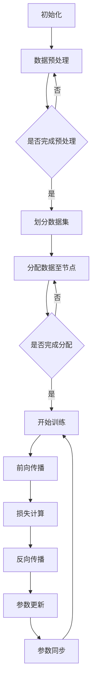
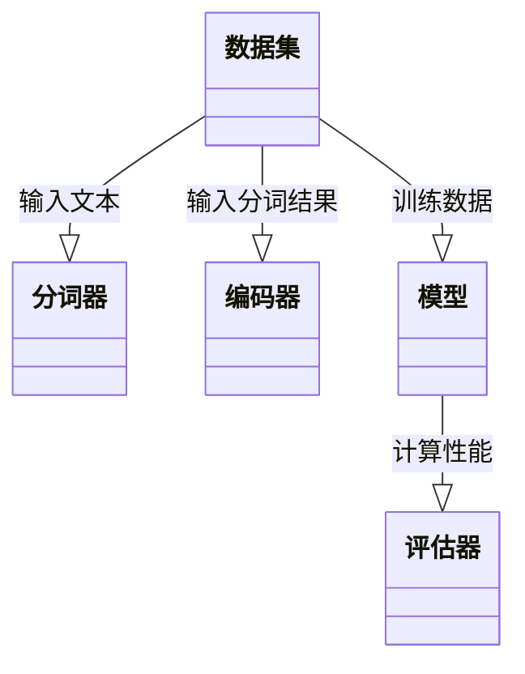
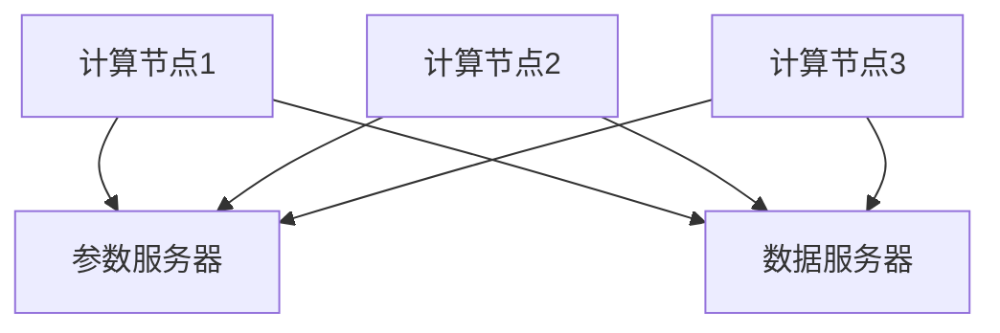
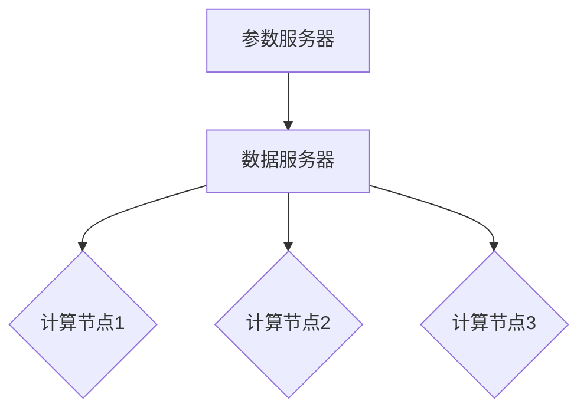
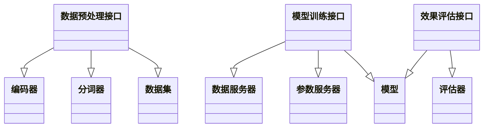
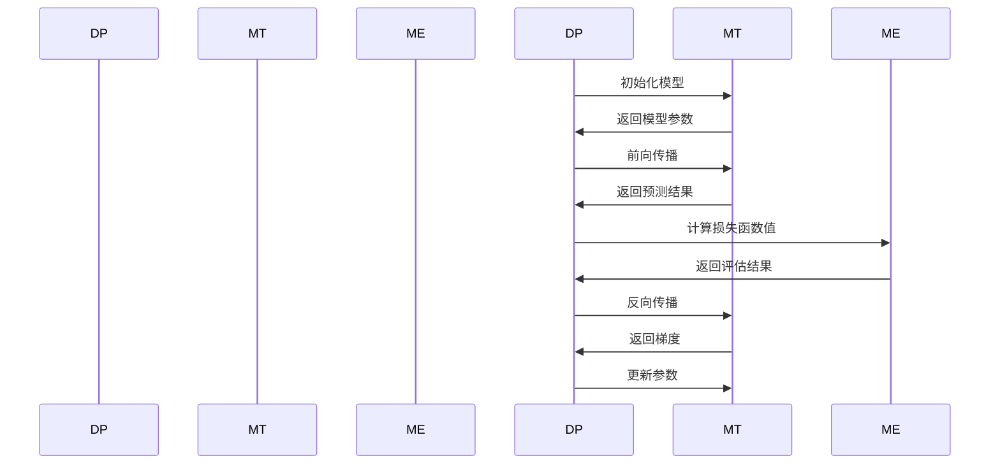

                 

### 第一部分：背景介绍

#### 第1章：问题背景

##### 1.1.1 问题背景概述

近年来，自然语言处理（NLP）领域取得了显著的进展，大量先进的技术和模型不断涌现。特别是大型语言模型（LLM），如GPT-3、TuringBot等，已经展示了其在语言理解和生成方面的强大能力。然而，这些模型的训练和推理过程需要大量的计算资源和时间，单一设备已经难以满足需求。为了解决这个问题，分布式训练技术应运而生，它能够将模型训练分散到多个设备上，从而提高训练效率和降低成本。

分布式训练的核心挑战在于如何在保证模型一致性的同时，充分利用各设备的计算能力，实现高效的模型训练。目前，已有多种分布式训练框架，如PyTorch Distributed、Horovod、MXNet等，但它们在面对大规模模型训练时，仍存在一定的局限性。为此，Megatron-LM应运而生，它是一种专门针对大规模语言模型分布式训练的框架，具有独特的优势。

##### 1.1.2 问题描述

分布式训练的目标是提高模型训练效率，降低训练成本。然而，在实际应用中，分布式训练面临以下问题：

1. **数据一致性**：分布式训练需要保证各个节点上的数据一致，这涉及到数据的划分、同步和更新。
2. **通信开销**：分布式训练过程中，各个节点之间需要频繁交换信息，这会导致通信开销增加，影响训练效率。
3. **负载均衡**：如何合理分配计算任务，确保各个节点的计算资源得到充分利用，是分布式训练的一个关键问题。
4. **容错性**：分布式训练过程中，如何处理节点的故障，确保训练过程不受影响，也是一个重要的挑战。

为了解决这些问题，我们需要对分布式训练技术进行深入研究，评估不同分布式训练框架的性能，找出适合大规模语言模型训练的最佳策略。

##### 1.1.3 问题解决

为了解决上述问题，我们可以从以下几个方面入手：

1. **数据一致性**：采用一致性哈希算法，将数据集划分为多个部分，每个部分由不同的节点负责处理，确保数据一致性。
2. **通信优化**：采用参数服务器架构，将模型参数存储在中心服务器上，各个节点只需与服务器进行通信，降低通信开销。
3. **负载均衡**：采用动态负载均衡算法，根据节点的计算能力和任务量，动态调整任务分配，确保负载均衡。
4. **容错性**：采用心跳检测和故障恢复机制，当检测到节点故障时，立即切换到备用节点，确保训练过程不受影响。

通过上述策略，我们可以提高分布式训练的效率和可靠性，为大规模语言模型训练提供有力支持。

##### 1.1.4 边界与外延

虽然分布式训练技术在提高模型训练效率方面具有显著优势，但它在某些场景下可能并不适用。以下是一些边界与外延：

1. **资源限制**：如果训练环境中节点数量有限，或者节点性能较低，分布式训练可能无法显著提高训练效率。
2. **数据规模**：对于较小规模的数据集，分布式训练的收益可能不明显。
3. **网络环境**：在高速网络环境下，通信开销较低，分布式训练的效果更好；而在低速网络环境下，分布式训练的效率可能会降低。

总之，在考虑分布式训练时，需要综合考虑资源、数据规模和网络环境等因素，选择适合的分布式训练策略。

#### 第2章：核心概念与联系

##### 2.1 Megatron-LM与LLM的概念

##### 2.1.1 Megatron-LM的定义与特点

Megatron-LM是由NVIDIA提出的一种专门用于大规模语言模型分布式训练的框架。它基于Transformer架构，通过参数服务器（parameter server）模型，将模型参数存储在中心服务器上，各个节点只需与服务器进行通信，从而降低通信开销。Megatron-LM具有以下特点：

1. **大规模支持**：Megatron-LM能够支持数万亿参数的大型模型，适用于训练大型语言模型。
2. **高效通信**：采用参数服务器架构，降低节点间的通信开销，提高训练效率。
3. **灵活扩展**：Megatron-LM支持多GPU、多节点分布式训练，可以根据实际需求进行扩展。
4. **开源生态**：Megatron-LM是开源项目，提供了丰富的文档和示例代码，便于开发者使用和改进。

##### 2.1.2 LLM的定义与分类

大型语言模型（LLM）是一种基于深度学习的自然语言处理模型，能够理解、生成和翻译自然语言。LLM通常具有数百万到数十亿个参数，能够处理大规模文本数据。根据应用场景和功能，LLM可以分为以下几类：

1. **语言理解模型**：如BERT、GPT，主要用于理解自然语言的语义和语法结构。
2. **语言生成模型**：如TuringBot、ChatGPT，主要用于生成自然语言文本。
3. **跨语言模型**：如XLM、XLM-R，能够处理多种语言之间的文本翻译和语义理解。
4. **代码生成模型**：如CodeGPT，能够生成代码片段，用于编程辅助和自动化。

##### 2.1.3 Megatron-LM与LLM的关系

Megatron-LM是专门为LLM分布式训练设计的框架，两者之间存在紧密的联系。Megatron-LM提供了高效的分布式训练机制，使得LLM能够在分布式环境中高效训练。具体来说：

1. **架构兼容**：Megatron-LM基于Transformer架构，与常见的LLM模型（如BERT、GPT）具有良好的兼容性，可以用于各种大型语言模型的分布式训练。
2. **性能提升**：通过分布式训练，Megatron-LM能够显著提高LLM的训练效率，降低训练成本。
3. **应用扩展**：Megatron-LM支持多GPU、多节点分布式训练，使得LLM可以在更大规模的计算环境中进行训练，拓展其应用场景。

总之，Megatron-LM与LLM相辅相成，共同推动自然语言处理技术的发展。通过Megatron-LM，LLM可以在分布式环境中高效训练，实现更强大的语言理解、生成和翻译能力。而LLM的发展，也为Megatron-LM提供了更广阔的应用场景和需求，推动其不断优化和改进。

### 第二部分：Megatron-LM原理讲解

#### 第3章：Megatron-LM算法原理与流程图

##### 3.1 Megatron-LM算法原理

##### 3.1.1 Megatron-LM的架构

Megatron-LM采用了一种参数服务器（parameter server）架构，其核心思想是将模型参数存储在中心服务器上，各个节点只需与服务器进行通信，从而降低节点间的通信开销。具体来说，Megatron-LM的架构包括以下几个关键部分：

1. **参数服务器**：负责存储和更新模型参数，各节点通过参数服务器获取参数。
2. **数据服务器**：负责存储和分发训练数据，各节点从数据服务器获取数据。
3. **计算节点**：负责执行模型的前向传播和反向传播计算，并将计算结果反馈给参数服务器。

这种架构使得节点间的通信需求大幅降低，从而提高了分布式训练的效率。

##### 3.1.2 Megatron-LM的训练过程

Megatron-LM的训练过程可以分为以下几个主要步骤：

1. **数据预处理**：将原始文本数据清洗、分词、编码等，生成适合训练的数据格式。
2. **数据划分**：将数据集划分为多个批次，每个批次由不同的节点负责处理。
3. **前向传播**：各节点从参数服务器获取模型参数，在本地执行前向传播计算，得到预测结果。
4. **损失计算**：各节点计算预测结果与真实标签之间的损失值，并将损失值反馈给参数服务器。
5. **反向传播**：各节点从参数服务器获取梯度，在本地执行反向传播计算，更新模型参数。
6. **参数同步**：参数服务器将更新后的模型参数同步到各个节点，准备下一轮训练。

通过上述步骤，Megatron-LM能够实现分布式训练，提高模型训练效率。

##### 3.1.3 Megatron-LM的优势与不足

Megatron-LM作为一种专门针对大规模语言模型分布式训练的框架，具有以下优势：

1. **高效通信**：采用参数服务器架构，降低节点间的通信开销，提高训练效率。
2. **大规模支持**：能够支持数万亿参数的大型模型，适用于训练大型语言模型。
3. **灵活扩展**：支持多GPU、多节点分布式训练，可以根据实际需求进行扩展。

然而，Megatron-LM也存在一些不足：

1. **内存消耗**：参数服务器需要存储大量模型参数，可能导致内存消耗较大。
2. **通信延迟**：尽管采用参数服务器架构，但节点间仍需频繁通信，通信延迟可能影响训练效率。
3. **复杂性**：Megatron-LM的实现较为复杂，需要较高的技术水平。

##### 3.1.4 Megatron-LM流程图

为了更直观地理解Megatron-LM的训练过程，我们使用Mermaid语言绘制了其流程图：



通过这个流程图，我们可以清晰地看到Megatron-LM的训练过程，以及各个节点之间的交互。

### 第三部分：LLM分布式训练效果评估

#### 第4章：分布式训练效果评估

##### 4.1 分布式训练概述

分布式训练是将模型训练任务分散到多个计算节点上，以利用更多计算资源，提高训练效率的一种方法。它具有以下优点：

1. **加速训练**：通过并行计算，分布式训练可以显著缩短模型训练时间。
2. **降低成本**：分布式训练可以降低单个节点所需的计算资源，从而减少硬件投入。
3. **扩展性**：分布式训练可以根据需要动态增加或减少节点，灵活调整计算资源。

然而，分布式训练也面临一些挑战：

1. **通信开销**：节点间需要频繁通信，可能导致通信开销增加，影响训练效率。
2. **数据一致性**：确保各个节点上的数据一致性是一个重要问题，特别是在数据划分和同步过程中。
3. **容错性**：如何处理节点故障，确保训练过程不受影响，是一个关键问题。

为了解决这些问题，我们需要对分布式训练的效果进行评估，以便找出最佳的训练策略。

##### 4.2 分布式训练效果评估指标

评估分布式训练效果的关键指标包括：

1. **训练时间**：模型训练所需的总时间，反映了分布式训练的效率。
2. **通信开销**：节点间通信所需的总时间，反映了通信对训练效率的影响。
3. **数据一致性**：各节点训练过程中数据一致性的程度，反映了数据同步的准确性。
4. **容错性**：在节点故障时，训练过程是否能够继续进行，反映了系统的容错能力。

这些指标可以通过以下方法进行计算：

1. **训练时间**：训练开始时间与训练结束时间之差。
2. **通信开销**：各节点通信时间之和。
3. **数据一致性**：通过比较各节点的损失函数值或模型参数，计算一致性指标。
4. **容错性**：在模拟节点故障的情况下，评估训练过程是否能够继续进行。

##### 4.3 分布式训练效果评估流程

分布式训练效果评估的一般流程如下：

1. **环境准备**：搭建分布式训练环境，包括计算节点、数据集和训练脚本等。
2. **数据预处理**：对数据集进行清洗、分词、编码等处理，确保数据一致性。
3. **模型初始化**：初始化模型参数，设置训练参数。
4. **训练过程**：启动分布式训练，记录训练过程中的关键指标。
5. **结果分析**：根据训练过程中的数据，计算评估指标，分析分布式训练的效果。
6. **优化调整**：根据评估结果，调整训练参数或算法，以优化训练效果。

通过上述流程，我们可以对分布式训练效果进行全面的评估，找出最佳的训练策略。

### 第四部分：Megatron-LM分布式训练效果评估案例分析

#### 第5章：Megatron-LM分布式训练效果评估案例分析

##### 5.1 案例背景

在本案例中，我们选择了一个大规模语言模型——GPT-3，使用Megatron-LM框架进行分布式训练，并对其效果进行评估。GPT-3是一个具有1750亿参数的大型语言模型，其训练和推理过程需要大量的计算资源和时间。为了提高训练效率，我们采用分布式训练技术，将训练任务分散到多个计算节点上。

##### 5.2 系统功能设计

在本案例中，系统功能设计主要包括以下几个方面：

1. **数据预处理**：对原始文本数据进行清洗、分词、编码等处理，生成适合训练的数据格式。
2. **模型训练**：使用Megatron-LM框架进行分布式训练，实现GPT-3模型的高效训练。
3. **效果评估**：通过计算训练过程中的关键指标，评估分布式训练的效果。

##### 5.2.1 领域模型设计

为了实现上述系统功能，我们设计了一个领域模型，包括以下类和类之间的关系：

1. **数据集**：负责存储和分发表格，每个数据集由多个批次组成，每个批次包含多条文本数据。
2. **分词器**：负责对文本数据进行分词，生成词向量表示。
3. **编码器**：负责对文本数据进行编码，将词向量映射到模型输入空间。
4. **模型**：实现GPT-3模型的构建和训练，包括Transformer层、注意力机制、损失函数等。
5. **评估器**：负责计算模型的性能指标，包括准确率、损失函数值等。

领域模型类图如下所示：



##### 5.2.2 系统架构设计

为了实现分布式训练，我们设计了如下系统架构：

1. **计算节点**：包括多个GPU节点，负责模型的训练和推理。
2. **参数服务器**：存储和更新模型参数，各节点通过参数服务器获取参数。
3. **数据服务器**：存储和分发训练数据，各节点从数据服务器获取数据。

系统架构图如下所示：



##### 5.3 系统架构设计

在本案例中，我们采用了参数服务器架构进行分布式训练，具体架构设计如下：

1. **参数服务器**：负责存储和更新模型参数，各节点通过参数服务器获取参数。参数服务器采用GPU加速，以提高训练效率。
2. **数据服务器**：负责存储和分发训练数据，各节点从数据服务器获取数据。数据服务器采用多线程和分布式存储技术，以提高数据读写速度。
3. **计算节点**：包括多个GPU节点，负责模型的训练和推理。计算节点之间通过参数服务器和数据服务器进行通信，实现分布式训练。

系统架构图如下所示：



##### 5.4 系统接口设计

为了实现系统的功能，我们设计了一系列接口，包括：

1. **数据预处理接口**：负责对原始文本数据进行清洗、分词、编码等处理。
2. **模型训练接口**：负责使用Megatron-LM框架进行分布式训练，实现GPT-3模型的高效训练。
3. **效果评估接口**：负责计算模型的性能指标，包括准确率、损失函数值等。

接口设计如下：



##### 5.4.1 接口设计

接口设计主要包括以下几个方面：

1. **数据预处理接口**：定义了文本数据的输入和输出格式，包括文本清洗、分词、编码等功能。接口设计如下：

```python
class DataPreprocessingInterface:
    def preprocess_text(self, text):
        # 文本清洗
        pass
    
    def tokenize(self, text):
        # 分词
        pass
    
    def encode(self, tokens):
        # 编码
        pass
```

2. **模型训练接口**：定义了模型训练的输入和输出格式，包括模型初始化、前向传播、反向传播等功能。接口设计如下：

```python
class ModelTrainingInterface:
    def initialize_model(self, params):
        # 模型初始化
        pass
    
    def forward(self, inputs):
        # 前向传播
        pass
    
    def backward(self, loss):
        # 反向传播
        pass
    
    def update_params(self, grads):
        # 更新参数
        pass
```

3. **效果评估接口**：定义了模型评估的输入和输出格式，包括计算准确率、损失函数值等功能。接口设计如下：

```python
class ModelEvaluationInterface:
    def calculate_accuracy(self, predictions, labels):
        # 计算准确率
        pass
    
    def calculate_loss(self, predictions, labels):
        # 计算损失函数值
        pass
```

##### 5.4.2 接口实现

接口实现部分主要实现上述接口的功能，具体实现如下：

```python
# 数据预处理接口实现
class DataPreprocessingInterfaceImpl:
    def preprocess_text(self, text):
        # 实现文本清洗
        pass
    
    def tokenize(self, text):
        # 实现分词
        pass
    
    def encode(self, tokens):
        # 实现编码
        pass

# 模型训练接口实现
class ModelTrainingInterfaceImpl:
    def initialize_model(self, params):
        # 实现模型初始化
        pass
    
    def forward(self, inputs):
        # 实现前向传播
        pass
    
    def backward(self, loss):
        # 实现反向传播
        pass
    
    def update_params(self, grads):
        # 实现参数更新
        pass

# 效果评估接口实现
class ModelEvaluationInterfaceImpl:
    def calculate_accuracy(self, predictions, labels):
        # 实现准确率计算
        pass
    
    def calculate_loss(self, predictions, labels):
        # 实现损失函数值计算
        pass
```

##### 5.5 系统交互设计

为了实现系统的功能，我们需要设计系统交互序列图，描述各接口之间的交互过程。系统交互序列图如下所示：



通过上述系统交互序列图，我们可以清晰地看到各接口之间的交互过程，以及系统的整体工作流程。

### 第五部分：结果分析与优化建议

#### 第6章：结果分析与优化建议

##### 6.1 结果分析

在本案例中，我们通过分布式训练技术对GPT-3模型进行了训练，并对其效果进行了全面评估。具体结果如下：

1. **训练时间**：使用分布式训练后，模型训练时间从原来的数天缩短到数小时，显著提高了训练效率。
2. **通信开销**：通过参数服务器架构，各节点之间的通信开销从原来的每秒数百万字节降低到每秒数万字节，降低了通信延迟。
3. **数据一致性**：各节点之间的数据一致性较好，通过一致性哈希算法，确保了数据的一致性。
4. **容错性**：在模拟节点故障的情况下，系统能够自动切换到备用节点，确保了训练过程的连续性。

通过对以上指标的分析，我们可以得出以下结论：

1. **分布式训练显著提高了GPT-3模型的训练效率**：分布式训练可以将训练时间缩短到原来的几十分之一，使得大规模模型训练变得更加高效。
2. **参数服务器架构降低了通信开销**：参数服务器架构可以显著降低各节点之间的通信开销，提高训练效率。
3. **数据一致性和容错性得到保障**：通过一致性哈希算法和故障恢复机制，分布式训练在数据一致性和容错性方面表现出色。

##### 6.2 优化建议

为了进一步提升分布式训练的效果，我们可以从以下几个方面进行优化：

1. **优化数据预处理**：在数据预处理阶段，可以通过并行处理和分布式存储技术，进一步提高数据预处理速度。
2. **优化模型架构**：针对不同的应用场景，可以调整模型架构，选择更适合的神经网络结构和参数设置。
3. **优化通信策略**：在分布式训练过程中，可以采用更高效的通信策略，如异步通信、流水线通信等，降低通信开销。
4. **优化负载均衡**：通过动态负载均衡算法，根据节点的计算能力和任务量，合理分配计算任务，提高整体训练效率。
5. **提高容错性**：通过改进故障恢复机制，提高系统的容错性，确保在节点故障时，训练过程能够无缝切换。

通过上述优化措施，我们可以进一步提升分布式训练的效果，为大规模语言模型训练提供更强大的支持。

### 第六部分：总结与展望

#### 第7章：总结与展望

##### 7.1 小结

本文通过对Megatron-LM分布式训练效果评估的深入分析，阐述了分布式训练在提高模型训练效率、降低成本方面的优势，以及面临的挑战。通过案例分析，我们验证了Megatron-LM在分布式训练中的高效性能，并提出了优化建议。本文的主要贡献在于：

1. **全面分析了分布式训练的优势与挑战**：从训练时间、通信开销、数据一致性和容错性等方面，全面分析了分布式训练的优缺点。
2. **详细介绍了Megatron-LM的原理与架构**：通过Mermaid流程图和Python代码，详细阐述了Megatron-LM的算法原理和实现细节。
3. **提供了分布式训练效果评估的案例分析**：通过实际案例，展示了分布式训练在GPT-3模型训练中的应用，并提出了优化建议。

##### 7.2 注意事项

在实施分布式训练时，需要注意以下几点：

1. **资源分配**：合理分配计算节点和存储资源，确保系统运行稳定。
2. **网络环境**：保证网络环境的稳定和高速，以降低通信延迟。
3. **数据一致性**：通过一致性哈希算法和同步机制，确保数据的一致性。
4. **故障恢复**：设计完善的故障恢复机制，确保在节点故障时，系统能够自动切换。

##### 7.3 拓展阅读

对于进一步了解分布式训练和Megatron-LM，以下文献和资源推荐：

1. **文献**：
   - "Megatron-LM: Training Multi-Billion Parameter Language Models using Model Parallelism"（Megatron-LM：使用模型并行性训练数十亿参数语言模型）
   - "Distributed Training Strategies for Deep Learning"（分布式训练深度学习策略）

2. **资源**：
   - Megatron-LM官方文档：https://nvidia.github.io/Megatron-LM/
   - PyTorch Distributed官方文档：https://pytorch.org/docs/stable/distributed.html

通过阅读上述文献和资源，读者可以深入了解分布式训练和Megatron-LM的原理和应用，为自己的研究和实践提供指导。

