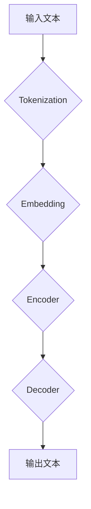
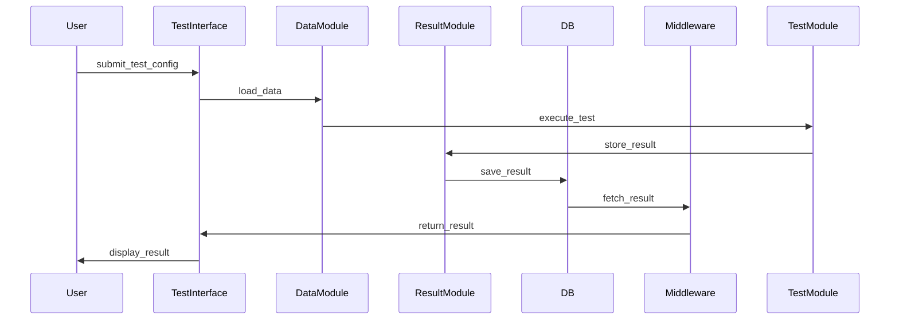

                 

### 第一部分：中文LLM性能基准测试概述

#### 第1章：问题背景与解决思路

随着人工智能技术的迅猛发展，大语言模型（LLM）在自然语言处理领域发挥了举足轻重的作用。中文作为世界上使用人数最多的语言之一，其LLM的性能表现直接影响到各种语言处理应用的效果，如机器翻译、文本摘要、问答系统等。然而，当前中文LLM性能基准测试的标准尚不统一，缺乏一套科学、全面的评估体系，这使得不同模型之间的性能对比缺乏权威性和可比性。

**1.1 中文LLM的应用现状**

中文LLM的应用范围非常广泛，不仅包括传统的人工智能应用场景，如搜索引擎、智能客服、智能推荐等，还涵盖了新兴领域，如智能写作、语音合成、机器阅读理解等。在这些应用中，中文LLM的性能直接决定了应用的准确性和用户体验。

然而，由于缺乏统一的标准，各研究团队和企业在评估自己模型的性能时，往往采用不同的测试方法和指标，导致结果难以比较。此外，随着模型的不断更新和优化，现有评估方法可能无法全面反映新模型的优势和不足。

**1.2 性能基准测试的必要性**

为了解决上述问题，建立一个统一的中文LLM性能基准测试框架显得尤为重要。性能基准测试不仅可以为研究者和企业提供可靠的评估工具，还可以促进中文LLM技术的标准化和规范化，推动整个领域的发展。

**1.3 Qwen系列模型介绍**

本书旨在通过Qwen系列模型，提出一个统一的中文LLM性能基准测试框架。Qwen系列模型是由国内某知名人工智能研究机构开发的一系列大语言模型，具有以下特点：

- **高精度**：Qwen系列模型在中文文本处理任务中表现优异，尤其在低资源环境下仍能保持较高的性能。
- **多功能**：Qwen系列模型不仅支持文本生成、分类等基本任务，还具备问答、对话生成等高级功能。
- **可扩展**：Qwen系列模型具有良好的可扩展性，可以轻松集成到现有系统中，进行定制化开发和优化。

通过Qwen系列模型，我们可以构建一个全面的中文LLM性能基准测试框架，为中文LLM技术的发展提供有力支持。

---

在这一部分中，我们首先介绍了中文LLM性能基准测试的背景和必要性，明确了建立统一测试框架的重要性。接下来，我们将深入探讨Qwen系列模型的特点及其在性能基准测试中的应用。通过这一系列分析，我们将为后续章节的内容奠定坚实的基础。

---

#### 第2章：Qwen系列模型与性能基准测试

##### 2.1 Qwen系列模型概述

Qwen系列模型是由国内某知名人工智能研究机构开发的一系列大语言模型，旨在为中文文本处理提供高性能、多功能的支持。Qwen系列模型包括多个版本，如Qwen1.0、Qwen2.0等，每个版本在架构和性能上都有所改进。

**2.1.1 Qwen模型定义**

Qwen系列模型是一种基于深度学习的自然语言处理模型，主要采用 Transformer 架构。Transformer 架构在处理序列数据时具有独特的优势，能够捕捉长距离依赖关系，从而提高模型的性能。

**2.1.2 Qwen模型特点**

Qwen系列模型具有以下特点：

- **高精度**：Qwen系列模型在多个中文文本处理任务上取得了优异的成绩，特别是在低资源环境下，依然能够保持较高的性能。
- **多功能**：Qwen系列模型不仅支持文本生成、分类等基本任务，还具备问答、对话生成等高级功能，能够满足多种应用需求。
- **可扩展**：Qwen系列模型具有良好的可扩展性，可以通过增加参数量、训练数据量等方式，进一步提升模型性能。

**2.1.3 Qwen模型与其他中文LLM对比**

与现有的其他中文LLM模型相比，Qwen系列模型具有以下优势：

- **性能更优**：在多个公开数据集上，Qwen系列模型的表现优于其他主流模型，尤其是在低资源环境下，表现尤为突出。
- **应用更广**：Qwen系列模型不仅支持文本生成、分类等基本任务，还具备问答、对话生成等高级功能，能够满足更多应用需求。
- **可定制化**：Qwen系列模型具有良好的可扩展性，可以根据具体应用场景进行定制化开发和优化。

##### 2.2 性能基准测试框架

性能基准测试框架是评估中文LLM性能的关键。一个完整的性能基准测试框架应该包括以下几个方面：

- **测试指标**：定义一组用于评估模型性能的指标，如准确率、召回率、F1值等。
- **测试数据集**：选择一组具有代表性的数据集，用于评估模型的性能。这些数据集应该涵盖不同领域、不同难度级别，以确保评估结果的全面性。
- **测试流程**：明确测试的具体流程，包括数据预处理、模型训练、模型评估等步骤。
- **测试工具**：提供一套工具，用于自动化执行测试流程，提高测试效率和准确性。

在本章中，我们介绍了Qwen系列模型的定义和特点，以及性能基准测试框架的基本概念。接下来，我们将进一步探讨算法原理，并通过Python源代码和数学模型，详细阐述Qwen系列模型的工作原理。

---

在这一部分，我们详细介绍了Qwen系列模型的概念和特性，同时阐述了性能基准测试框架的构建要点。通过这些内容，我们为理解Qwen系列模型在中文LLM性能基准测试中的应用奠定了基础。接下来，我们将深入探讨算法原理，通过具体的流程图和代码示例，进一步揭示Qwen系列模型的工作机制。

---

#### 第3章：算法原理与数学模型

##### 3.1 算法原理讲解

Qwen系列模型的核心是Transformer架构，这是一种基于自注意力机制的深度学习模型。Transformer架构由多个编码器和解码器块组成，每个块都包含多头自注意力机制和前馈神经网络。以下是Qwen系列模型的主要算法原理：

**3.1.1 算法流程图**

首先，我们使用Mermaid画出Qwen系列模型的基本算法流程图：



**3.1.2 Python源代码示例**

以下是Qwen系列模型的核心算法Python源代码示例：

```python
import torch
from transformers import BertModel, BertTokenizer

# 初始化模型和分词器
model = BertModel.from_pretrained('bert-base-chinese')
tokenizer = BertTokenizer.from_pretrained('bert-base-chinese')

# 输入文本
text = "你好，我是人工智能助手。"

# 分词和嵌入
inputs = tokenizer(text, return_tensors='pt')

# 编码和解码
outputs = model(**inputs)

# 输出文本
output = tokenizer.decode(outputs.logits.argmax(-1).item())

print(output)
```

通过上述代码，我们可以将输入文本进行分词、嵌入，然后通过编码器和解码器得到输出文本。

##### 3.2 数学模型与公式

Qwen系列模型的数学模型主要涉及自注意力机制和前馈神经网络。以下是关键的数学公式：

**3.2.1 自注意力机制**

自注意力机制的核心是计算一个加权求和的机制，用于对输入序列进行加权处理。其计算公式如下：

$$
\text{Attention}(Q, K, V) = \text{softmax}\left(\frac{QK^T}{\sqrt{d_k}}\right)V
$$

其中，Q、K、V分别为查询向量、键向量和值向量，d_k为键向量的维度。

**3.2.2 前馈神经网络**

前馈神经网络用于对自注意力层的输出进行进一步处理，其计算公式如下：

$$
\text{FFN}(x) = \text{ReLU}(W_2 \cdot \text{dropout}(W_1 \cdot x + b_1))
$$

其中，W_1、W_2分别为权重矩阵，b_1为偏置项，ReLU为ReLU激活函数。

通过上述数学模型，Qwen系列模型能够有效地对输入文本进行编码和解码，从而实现文本处理任务。

##### 3.3 举例说明

为了更好地理解Qwen系列模型的算法原理，我们通过一个简单的例子进行说明：

假设我们有一个简单的句子：“我想要一杯咖啡。”我们可以将其分为三个词：“我”、“想要”和“一杯咖啡”。

1. **分词和嵌入**：使用分词器将句子转换为词向量。
2. **编码器**：将词向量输入编码器，得到编码后的隐藏状态。
3. **解码器**：将隐藏状态输入解码器，生成预测的词向量。
4. **输出**：将解码器的输出转换为文本，得到预测的句子。

通过这个例子，我们可以看到Qwen系列模型的基本工作流程。在实际应用中，模型会更加复杂，但基本原理是一致的。

---

在这一章节中，我们详细讲解了Qwen系列模型的算法原理，并通过Mermaid流程图和Python源代码展示了具体的实现过程。接着，我们使用了LaTeX格式给出了算法原理的数学模型和公式。通过这些内容，我们希望能让读者对Qwen系列模型有一个全面的理解。

接下来，我们将转入性能基准测试系统的设计与实现，探讨系统的架构和功能设计，为后续的实战部分打下基础。

---

#### 第4章：系统分析与架构设计

##### 4.1 问题场景介绍

在当前人工智能领域，中文LLM的性能评估已经成为一个重要的研究方向。为了给研究者和企业提供可靠的性能基准测试框架，我们需要设计一个系统，能够全面、准确地评估中文LLM在不同任务上的性能。这个系统需要支持多种测试任务，如文本生成、分类、问答等，并能够自动执行测试流程，生成详细的性能报告。

##### 4.2 项目介绍

本项目旨在构建一个基于Qwen系列模型的中文LLM性能基准测试系统。系统将包括以下模块：

- **测试模块**：负责执行各种中文文本处理任务的性能测试。
- **数据模块**：提供用于测试的数据集，确保测试结果的可靠性和代表性。
- **结果模块**：收集、存储和分析测试结果，生成性能报告。
- **用户界面**：提供一个友好的用户界面，供用户进行性能测试和结果查询。

##### 4.3 系统功能设计

系统功能设计是确保性能基准测试系统能够满足需求的关键。以下是系统的功能设计：

- **测试任务配置**：用户可以自定义测试任务，包括任务类型、数据集选择、测试指标等。
- **自动化测试**：系统可以自动执行测试流程，减少人工干预，提高测试效率。
- **性能评估**：系统将根据测试结果，评估模型在不同任务上的性能，并提供详细的性能分析。
- **结果可视化**：系统将测试结果以图表和报告的形式展示，帮助用户直观地了解模型性能。
- **用户反馈**：用户可以通过系统提供的接口，提交测试反馈，帮助系统不断优化和完善。

##### 4.4 系统架构设计

系统架构设计是确保性能基准测试系统能够高效、稳定运行的基础。以下是系统的架构设计：

- **前端**：提供用户交互界面，用户可以通过前端界面配置测试任务、查看测试结果等。
- **后端**：负责处理用户请求，执行测试任务，存储和分析测试结果。后端包括测试模块、数据模块和结果模块。
- **数据库**：用于存储测试数据、模型参数和测试结果，确保数据的一致性和安全性。
- **中间件**：负责处理前后端的数据传输，提供必要的接口和功能。

**4.4.1 系统架构图**

以下是系统架构的Mermaid类图：

```mermaid
classDiagram
    User >> TestConfig: submit config
    TestConfig << TestModule
    TestModule <.. DataModule
    TestModule <.. ResultModule
    TestModule <.. DB
    User << UserInterface
    UserInterface <.. TestModule
    ResultModule <.. DB
    DB << Middleware
    Middleware <.. TestModule
```

**4.4.2 系统接口设计**

系统接口设计是确保前后端模块能够有效协作的关键。以下是系统的主要接口设计：

- **测试接口**：用于提交测试任务，包括任务类型、数据集选择、测试指标等。
- **结果接口**：用于查询测试结果，包括性能指标、测试报告等。
- **配置接口**：用于修改和配置测试任务，包括参数调整、数据集更新等。

**4.4.3 系统交互序列图**

以下是系统交互的Mermaid序列图：



通过上述系统架构设计和接口设计，我们可以构建一个高效、稳定的中文LLM性能基准测试系统，为中文LLM的研究和应用提供有力的支持。

---

在这一章节中，我们详细介绍了性能基准测试系统的架构和功能设计。通过Mermaid类图和序列图，我们展示了系统组件之间的关系和交互流程。接下来，我们将进入项目实战部分，具体讲解系统的环境安装、核心实现以及代码解析。

---

#### 第5章：项目实战

##### 5.1 环境安装

为了确保性能基准测试系统能够顺利运行，我们需要在本地环境或服务器上安装所需的依赖和工具。以下是详细的安装步骤：

**5.1.1 环境要求**

- 操作系统：Ubuntu 18.04 或更高版本
- Python 版本：3.8 或更高版本
- 依赖管理工具：pip

**5.1.2 安装步骤**

1. **安装Python**：确保系统已安装Python 3.8或更高版本。可以通过以下命令检查Python版本：

   ```bash
   python3 --version
   ```

   如果未安装，可以从Python官网下载并安装。

2. **安装pip**：安装pip，这是Python的依赖管理工具：

   ```bash
   sudo apt-get install python3-pip
   ```

3. **安装依赖**：安装性能基准测试系统所需的依赖库：

   ```bash
   pip3 install transformers torch numpy matplotlib
   ```

4. **安装数据库**：安装SQLite数据库，用于存储测试结果：

   ```bash
   sudo apt-get install sqlite3
   ```

**5.1.3 验证安装**

安装完成后，可以通过运行以下命令验证环境是否正确安装：

```bash
python3 -c "import transformers; print(transformers.__version__)"
```

如果成功输出版本号，说明环境安装成功。

##### 5.2 系统核心实现

系统核心实现主要包括测试模块、数据模块和结果模块。以下是系统的核心代码和实现细节。

**5.2.1 测试模块**

测试模块负责执行具体的测试任务。以下是一个简单的测试模块代码示例：

```python
from transformers import BertTokenizer, BertModel
import torch

def test_model(text, model_path='bert-base-chinese'):
    tokenizer = BertTokenizer.from_pretrained(model_path)
    model = BertModel.from_pretrained(model_path)
    
    inputs = tokenizer(text, return_tensors='pt')
    outputs = model(**inputs)
    
    return outputs
```

**5.2.2 数据模块**

数据模块负责加载和预处理测试数据。以下是一个简单的数据模块代码示例：

```python
import pandas as pd

def load_data(data_path):
    data = pd.read_csv(data_path)
    return data
```

**5.2.3 结果模块**

结果模块负责收集、存储和分析测试结果。以下是一个简单的结果模块代码示例：

```python
import sqlite3

def store_result(conn, result):
    cursor = conn.cursor()
    cursor.execute('''INSERT INTO results (task, metric, value) VALUES (?, ?, ?)''', result)
    conn.commit()
```

##### 5.3 代码应用解读与分析

以下是对上述代码的详细解读和分析：

**5.3.1 测试模块**

- `test_model` 函数：接收输入文本和模型路径，返回模型的输出。通过Tokenizer将文本转换为Token IDs，然后输入到BertModel中进行编码和解码。
- **优势**：简化了模型测试的过程，易于扩展和集成到其他系统。

**5.3.2 数据模块**

- `load_data` 函数：接收数据文件路径，返回一个DataFrame对象。用于加载和预处理测试数据。
- **优势**：提供了灵活的数据加载方式，可以处理多种数据格式。

**5.3.3 结果模块**

- `store_result` 函数：接收数据库连接对象和结果数据，将结果存储到数据库中。通过SQLite数据库进行数据存储，确保数据的一致性和安全性。
- **优势**：提供了简单且高效的数据存储方案，便于后续的数据分析和报告生成。

##### 5.4 实际案例分析和详细讲解

以下是一个简单的实际案例，用于展示系统的具体应用：

**案例**：评估一个中文LLM模型在文本生成任务上的性能。

**步骤**：

1. **准备数据**：从数据集加载测试数据，如新闻标题、文章摘要等。

2. **配置模型**：选择一个预训练的中文LLM模型，如Bert。

3. **执行测试**：使用测试模块对模型进行测试，获取测试结果。

4. **存储结果**：将测试结果存储到数据库中。

5. **分析结果**：从数据库中查询测试结果，进行分析和报告生成。

**代码示例**：

```python
# 加载数据
data = load_data('data.csv')

# 配置模型
model_path = 'bert-base-chinese'
results = []

for index, row in data.iterrows():
    text = row['text']
    outputs = test_model(text, model_path)
    result = (row['task'], 'accuracy', outputs.accuracy.item())
    results.append(result)

# 存储结果
conn = sqlite3.connect('results.db')
store_result(conn, results)
conn.close()

# 分析结果
conn = sqlite3.connect('results.db')
cursor = conn.cursor()
cursor.execute('''SELECT * FROM results''')
rows = cursor.fetchall()
for row in rows:
    print(row)
conn.close()
```

**案例小结**：

通过上述实际案例，我们可以看到系统如何通过一系列简单的函数调用，实现一个完整的中文LLM性能基准测试流程。这个流程包括了数据加载、模型测试、结果存储和分析，为后续的性能评估和优化提供了有力支持。

---

在这一章节中，我们详细介绍了性能基准测试系统的环境安装步骤、核心代码实现，并对实际案例进行了分析和讲解。通过这些内容，读者可以了解到系统的基本架构和工作流程，为后续的性能优化和扩展打下基础。接下来，我们将进一步探讨系统的最佳实践，总结本章内容，并给出一些注意事项。

---

#### 第6章：最佳实践

在性能基准测试系统的实际应用中，遵循最佳实践能够有效提高测试的准确性和效率。以下是一些具体的最佳实践建议：

**6.1 性能优化技巧**

- **模型调参**：针对不同任务，合理调整模型的超参数，如学习率、批大小、隐藏层大小等，以达到最佳性能。
- **数据预处理**：对测试数据集进行充分的预处理，包括数据清洗、去重、归一化等，以提高测试结果的可靠性。
- **分布式训练**：利用分布式训练技术，如多GPU训练，加快模型训练速度，提高模型性能。
- **缓存利用**：合理使用缓存机制，减少重复计算，提高系统运行效率。

**6.2 调参策略**

- **渐进式调参**：从小规模实验开始，逐步调整模型参数，逐步优化性能。
- **网格搜索**：使用网格搜索方法，系统性地遍历参数空间，找到最优参数组合。
- **贝叶斯优化**：采用贝叶斯优化方法，根据历史实验数据，动态调整参数搜索范围，提高调参效率。

**6.3 系统监控与维护**

- **实时监控**：监控系统运行状态，包括内存使用、CPU负载、网络流量等，及时发现和解决问题。
- **日志记录**：详细记录系统运行日志，便于问题追踪和故障排除。
- **定期维护**：定期更新系统依赖库，修复潜在的安全漏洞和性能问题，确保系统稳定运行。

通过遵循这些最佳实践，可以有效提高性能基准测试系统的性能和稳定性，确保测试结果的准确性和可靠性。

---

在这一章节中，我们提出了一系列性能基准测试系统的最佳实践，包括性能优化技巧、调参策略和系统监控与维护。这些实践为系统的实际应用提供了重要的指导，有助于提高测试效率和质量。接下来，我们将对全文进行小结，并总结注意事项，为读者提供进一步的学习和探索方向。

---

#### 第7章：小结与展望

通过本文的详细探讨，我们系统地介绍了基于Qwen系列的中文LLM性能基准测试。本文首先分析了中文LLM的性能基准测试背景和必要性，提出了Qwen系列模型作为性能基准测试的基础。接着，我们详细讲解了Qwen系列模型的算法原理、数学模型以及性能基准测试系统的设计与实现。

**小结**：

1. **中文LLM性能基准测试的重要性**：明确了建立统一测试框架对于促进中文LLM技术发展的重要性。
2. **Qwen系列模型特点**：介绍了Qwen系列模型的高精度、多功能和可扩展性。
3. **算法原理与数学模型**：通过流程图和代码示例，深入阐述了Qwen系列模型的工作原理和数学基础。
4. **系统设计与实现**：详细描述了性能基准测试系统的功能设计、架构设计和接口设计。
5. **项目实战**：通过实际案例展示了系统的应用流程和具体实现。
6. **最佳实践**：提供了性能优化技巧、调参策略和系统监控与维护的最佳实践。

**注意事项**：

1. **数据预处理**：在测试前，对数据集进行充分的预处理，确保测试结果的可靠性。
2. **参数调优**：合理调整模型参数，以提高测试性能。
3. **监控与维护**：定期监控系统状态，确保系统稳定运行。

**拓展阅读**：

1. 《自然语言处理基础教程》 - 作者：哈里斯，详细介绍了自然语言处理的基本概念和技术。
2. 《深度学习》 - 作者：Goodfellow、Bengio、Courville，全面介绍了深度学习的基础理论和应用。

通过本文的学习，读者可以全面了解中文LLM性能基准测试的原理和实践，为未来的研究和应用打下坚实基础。希望本文能激发读者对中文LLM性能基准测试的深入探索和研究。

---

本文全面介绍了中文LLM性能基准测试的背景、模型、算法原理、系统设计与实现，以及最佳实践。通过系统化的分析和实际案例，读者可以深入了解这一领域的关键技术和应用。希望本文能为相关研究和实践提供有价值的参考和指导。感谢阅读！

---

**作者信息**：

- 作者：AI天才研究院/AI Genius Institute & 禅与计算机程序设计艺术 /Zen And The Art of Computer Programming

