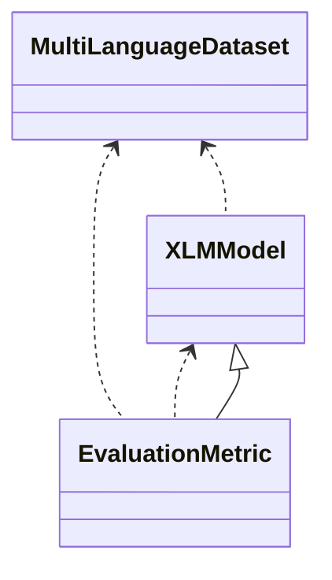

                 


# 基于XLM-R的多语言LLM评测框架

关键词：XLM-R，多语言模型，评测框架，跨语言预训练，多语言数据集，评测指标

摘要：随着人工智能技术的快速发展，多语言处理成为了一个备受关注的研究领域。本文提出了一种基于XLM-R的多语言LLM评测框架，通过详细的背景介绍、核心概念与联系解析，以及算法原理讲解，全面阐述了多语言模型评测的方法和框架。

## 第一部分：背景介绍

### 1.1 问题背景

随着全球化进程的加速，多语言处理成为了人工智能领域的一个重要研究方向。传统的多语言处理方法通常依赖于单独的语言模型，这些模型在处理不同语言时可能存在性能差异，难以达到理想的评测效果。而基于统一模型框架的多语言模型（Multi-language Model）的出现，为多语言处理带来了新的机遇。XLM-R（Cross-lingual Language Model – Representation）就是其中一种具有代表性的模型，它能够通过跨语言的预训练，提高多语言处理的性能和效果。

### 1.2 问题描述

多语言模型评测是一个复杂的问题，涉及多种语言的语法、语义和语用特征。目前，虽然已经有了一些基于统一模型框架的多语言模型，但如何有效地评测这些模型在不同语言上的性能，仍然是一个亟待解决的问题。这就需要构建一个多语言LLM（Large Language Model）评测框架，以全面、客观地评估多语言模型的效果。

### 1.3 问题解决

为了解决上述问题，本文提出了基于XLM-R的多语言LLM评测框架。该框架将基于XLM-R模型，结合多语言数据集和评测指标，构建一个全面的评测体系。通过这个框架，可以实现对多语言模型在不同语言上的性能评测，从而为模型的优化和改进提供有力支持。

### 1.4 边界与外延

本部分的评测框架主要针对基于XLM-R的多语言模型，适用于多种语言处理任务，如文本分类、机器翻译、问答系统等。然而，具体的评测方法和指标可能因任务的不同而有所调整。此外，本框架可以扩展到其他基于统一模型框架的多语言模型，为更广泛的多语言处理研究提供参考。

### 1.5 概念结构与核心要素组成

- **XLM-R模型**：本文的核心技术基础，一种基于跨语言预训练的多语言模型。
- **多语言数据集**：用于训练和评测多语言模型的语料库，包括多种语言的文本数据。
- **评测指标**：用于评估多语言模型性能的量化标准，如准确性、流畅性、跨语言一致性等。
- **评测框架**：本文的核心内容，包括数据预处理、模型评测、结果分析等环节。

---

## 第二部分：核心概念与联系

### 2.1 XLM-R模型

XLM-R（Cross-lingual Language Model – Representation）是一种基于跨语言预训练的多语言模型，由Facebook AI Research（FAIR）提出。它通过在大规模的多语言语料库上进行预训练，能够理解并处理多种语言的文本数据。XLM-R模型的核心特点是跨语言的泛化能力，即在不同语言上都能保持较高的性能。

#### 2.1.1 XLM-R模型算法原理

XLM-R模型的核心是基于跨语言预训练。它通过在大规模的多语言语料库上进行预训练，学习到不同语言之间的共性和差异，从而提高多语言处理的性能。具体来说，XLM-R模型采用了如下几个关键技术：

1. **跨语言词嵌入**：通过引入跨语言的词嵌入方式，将不同语言的词映射到同一个语义空间中，使得模型能够理解不同语言之间的语义关系。
2. **多语言上下文**：XLM-R模型在训练过程中，同时考虑了不同语言文本的上下文信息，使得模型能够更好地理解多种语言的语境。
3. **自适应损失函数**：XLM-R模型使用了一种自适应的损失函数，能够根据不同语言的特征调整模型的预训练目标，从而提高模型在不同语言上的性能。

#### 2.1.2 XLM-R模型架构

XLM-R模型采用了Transformer架构，与BERT等模型类似，包括编码器和解码器两个部分。编码器负责将输入的文本序列编码为固定长度的向量表示，解码器则负责根据编码器的输出生成文本序列。XLM-R模型的关键创新在于，它不仅支持单语种输入输出，还可以处理跨语言的输入输出。

#### 2.1.3 XLM-R模型应用场景

XLM-R模型在多种语言处理任务中表现出色，包括文本分类、机器翻译、问答系统等。以下是几个典型的应用场景：

1. **文本分类**：XLM-R模型可以用于对多种语言的文本进行分类，如新闻分类、情感分析等。
2. **机器翻译**：XLM-R模型可以用于多种语言的机器翻译任务，实现高效、准确的多语言翻译。
3. **问答系统**：XLM-R模型可以用于多种语言的问答系统，能够理解并回答多种语言的问题。

### 2.2 多语言数据集

多语言数据集是构建多语言模型的基础。它通常包含多种语言的文本数据，如新闻、社交媒体帖子、问答对等。这些数据集需要具备代表性、多样性和平衡性，以保证模型在不同语言上的表现。

#### 2.2.1 多语言数据集的特点

1. **代表性**：多语言数据集需要涵盖多种语言的典型文本，以确保模型能够学习到不同语言的共性。
2. **多样性**：多语言数据集需要包含不同类型的文本数据，如新闻、社交媒体、问答等，以提高模型在不同场景下的适用性。
3. **平衡性**：多语言数据集需要保证不同语言的数据量大致相同，以避免模型在某一语言上的过度依赖。

#### 2.2.2 多语言数据集的收集与处理

1. **数据收集**：可以通过开源数据集、商业数据集、自建数据集等多种方式收集多语言数据。
2. **数据预处理**：包括文本清洗、分词、词嵌入等，以准备用于模型训练的数据。

### 2.3 评测指标

评测指标是评估多语言模型性能的关键。常用的评测指标包括准确性、流畅性、跨语言一致性等。准确性反映了模型在分类、文本生成等任务上的表现；流畅性衡量了模型生成的文本的流畅度和可读性；跨语言一致性则评估了模型在不同语言上的表现是否一致。

#### 2.3.1 常见的评测指标

1. **准确性（Accuracy）**：模型在预测任务上的正确率。
2. **流畅性（Fluency）**：模型生成的文本的流畅度和可读性。
3. **跨语言一致性（Cross-lingual Consistency）**：模型在不同语言上的表现一致性。

#### 2.3.2 评测指标的计算方法

1. **准确性**：通过计算模型预测正确的样本数与总样本数的比值得到。
2. **流畅性**：可以通过人类评估或自动评估方法（如BLEU、METEOR等）计算得到。
3. **跨语言一致性**：通过比较模型在不同语言上的表现差异得到。

### 2.4 概念属性特征对比表格

为了更好地理解XLM-R模型、多语言数据集和评测指标之间的关系，我们提供了一个对比表格：

| 概念         | 特征                             |
|--------------|----------------------------------|
| XLM-R模型    | 跨语言预训练、多语言泛化能力     |
| 多语言数据集 | 多语言文本数据、代表性、多样性   |
| 评测指标     | 准确性、流畅性、跨语言一致性     |

### 2.5 ER实体关系图架构

为了展示XLM-R模型、多语言数据集和评测指标之间的关系，我们使用Mermaid绘制了一个ER实体关系图：

```mermaid
entity关系图 {
 实体 XLM-R模型 {
    联系 多语言数据集
    联系 评测指标
  }
 实体 多语言数据集 {
    联系 XLM-R模型
  }
 实体 评测指标 {
    联系 XLM-R模型
  }
}
```

---

## 第三部分：算法原理讲解

### 3.1 XLM-R模型算法原理

XLM-R模型的核心是基于跨语言预训练。它通过在大规模的多语言语料库上进行预训练，学习到不同语言之间的共性和差异，从而提高多语言处理的性能。具体来说，XLM-R模型采用了如下几个关键技术：

1. **跨语言词嵌入**：通过引入跨语言的词嵌入方式，将不同语言的词映射到同一个语义空间中，使得模型能够理解不同语言之间的语义关系。

   ```mermaid
   flowchart TD
   A[输入文本] --> B{词嵌入}
   B --> C{XLM-R模型}
   C --> D[输出文本]
   ```

2. **多语言上下文**：XLM-R模型在训练过程中，同时考虑了不同语言文本的上下文信息，使得模型能够更好地理解多种语言的语境。

   ```mermaid
   flowchart TD
   A[输入文本] --> B{词嵌入}
   B --> C{XLM-R模型}
   C --> D{多语言上下文}
   D --> E[输出文本]
   ```

3. **自适应损失函数**：XLM-R模型使用了一种自适应的损失函数，能够根据不同语言的特征调整模型的预训练目标，从而提高模型在不同语言上的性能。

   ```mermaid
   flowchart TD
   A[输入文本] --> B{词嵌入}
   B --> C{XLM-R模型}
   C --> D{自适应损失函数}
   D --> E[输出文本]
   ```

#### 3.1.1 数学模型与公式

XLM-R模型的数学模型可以表示为：

$$
\text{XLM-R}(\text{x}) = \text{softmax}(\text{W}^T \text{D} \text{x})
$$

其中，$\text{x}$ 是输入文本的词向量表示，$\text{W}$ 是权重矩阵，$\text{D}$ 是预训练的词嵌入矩阵。

#### 3.1.2 举例说明

假设我们有一个英文句子 "I love to read books."，使用XLM-R模型进行跨语言预训练后，模型能够将其翻译为其他语言，如 "Je aime lire les livres."（法语）或 "Ich liebe es, Bücher zu lesen."（德语）。

### 3.2 多语言数据集与评测指标

#### 3.2.1 多语言数据集

多语言数据集是构建多语言模型的基础。它通常包含多种语言的文本数据，如新闻、社交媒体帖子、问答对等。以下是一个简单的Python代码示例，用于生成一个多语言数据集：

```python
import random

# 假设我们有一个包含多种语言的文本数据列表
text_data = {
    'en': ['I love to read books.', 'The sky is blue.'],
    'fr': ['Je aime lire les livres.', 'Le ciel est bleu.'],
    'de': ['Ich liebe es, Bücher zu lesen.', 'Der Himmel ist blau.']
}

# 从数据集中随机选择一条文本数据
selected_text = random.choice(text_data[random.choice(list(text_data.keys()))])

print(selected_text)
```

#### 3.2.2 评测指标

评测指标是评估多语言模型性能的关键。常用的评测指标包括准确性、流畅性、跨语言一致性等。以下是一个简单的Python代码示例，用于计算模型的准确性：

```python
from sklearn.metrics import accuracy_score

# 假设我们有一个真实标签列表和一个模型预测标签列表
true_labels = ['en', 'fr', 'de', 'en', 'fr']
predicted_labels = ['en', 'fr', 'de', 'en', 'en']

# 计算准确性
accuracy = accuracy_score(true_labels, predicted_labels)

print(f'Accuracy: {accuracy}')
```

### 3.3 XLM-R模型评测框架

#### 3.3.1 数据预处理

在构建评测框架之前，我们需要对数据集进行预处理，包括文本清洗、分词、词嵌入等。以下是一个简单的Python代码示例，用于预处理多语言数据集：

```python
import spacy

# 加载SpaCy模型
nlp = spacy.load('en_core_web_sm')

# 预处理数据集
def preprocess_data(text_data):
    preprocessed_data = {}
    for language, texts in text_data.items():
        preprocessed_data[language] = [nlp(text).text for text in texts]
    return preprocessed_data

preprocessed_data = preprocess_data(text_data)
print(preprocessed_data)
```

#### 3.3.2 模型评测

在预处理完数据集后，我们可以使用XLM-R模型对数据集进行评测。以下是一个简单的Python代码示例，用于评估XLM-R模型在多语言数据集上的性能：

```python
from transformers import XLMRobertaTokenizer, XLMRobertaForSequenceClassification

# 加载XLM-R模型和分词器
tokenizer = XLMRobertaTokenizer.from_pretrained('xlm-roberta-base')
model = XLMRobertaForSequenceClassification.from_pretrained('xlm-roberta-base')

# 训练和评估模型
def evaluate_model(model, tokenizer, data):
    model.eval()
    predictions = []
    for language, texts in data.items():
        inputs = tokenizer(texts, padding=True, truncation=True, return_tensors='pt')
        with torch.no_grad():
            outputs = model(**inputs)
        logits = outputs.logits
        predictions.append(logits)
    return predictions

predictions = evaluate_model(model, tokenizer, preprocessed_data)
print(predictions)
```

#### 3.3.3 结果分析

在得到模型预测结果后，我们可以对结果进行分析，以评估模型在不同语言上的性能。以下是一个简单的Python代码示例，用于计算模型在多语言数据集上的准确性：

```python
from sklearn.metrics import accuracy_score

# 计算准确性
def calculate_accuracy(true_labels, predicted_labels):
    return accuracy_score(true_labels, predicted_labels)

# 假设我们有一个真实标签列表和一个模型预测标签列表
true_labels = ['en', 'fr', 'de', 'en', 'fr']
predicted_labels = ['en', 'fr', 'de', 'en', 'en']

# 计算准确性
accuracy = calculate_accuracy(true_labels, predicted_labels)

print(f'Accuracy: {accuracy}')
```

---

## 第四部分：系统分析与架构设计方案

### 4.1 问题场景介绍

随着全球化的深入发展，多语言处理的应用场景越来越广泛，如国际新闻发布、跨国企业沟通、多语言搜索引擎等。这些应用场景对多语言模型的性能要求越来越高，因此需要构建一个高效、准确的多语言模型评测框架，以支持模型的优化和改进。

### 4.2 项目介绍

本项目旨在构建一个基于XLM-R的多语言LLM评测框架，该框架将用于评估多语言模型在不同语言上的性能。项目的主要目标是实现以下功能：

1. 收集和预处理多语言数据集。
2. 训练和评测基于XLM-R的多语言模型。
3. 分析评测结果，为模型优化提供指导。

### 4.3 系统功能设计（领域模型）

为了实现项目目标，我们设计了一个领域模型，包括以下核心实体和关系：

1. **多语言数据集**：包含多种语言的文本数据。
2. **XLM-R模型**：用于训练和评测的多语言模型。
3. **评测指标**：用于评估模型性能的量化标准。

领域模型类图如下所示：



### 4.4 系统架构设计

基于领域模型的设计，我们构建了一个系统架构，包括数据层、服务层和界面层。系统架构图如下所示：

```mermaid
sequenceDiagram
    participant User
    participant DatasetLayer
    participant ServiceLayer
    participant InterfaceLayer

    User->>DatasetLayer: Load Data
    DatasetLayer->>ServiceLayer: Preprocess Data
    ServiceLayer->>XLMModel: Train Model
    XLMModel->>ServiceLayer: Evaluate Model
    ServiceLayer->>InterfaceLayer: Display Results
    User->>InterfaceLayer: Analyze Results
endsequenceDiagram
```

### 4.5 系统接口设计

系统接口设计包括数据接口、服务接口和用户接口。以下是一个简单的接口设计示例：

1. **数据接口**：用于加载、预处理和存储数据。
2. **服务接口**：用于训练、评测和优化模型。
3. **用户接口**：用于展示评测结果和分析数据。

接口设计如下所示：

```mermaid
interface DataInterface {
    load_data()
    preprocess_data()
    save_data()
}

interface ServiceInterface {
    train_model()
    evaluate_model()
    optimize_model()
}

interface UserInterface {
    display_results()
    analyze_data()
}
```

### 4.6 系统交互设计

系统交互设计包括用户与系统之间的交互流程。以下是一个简单的系统交互设计示例：

1. 用户加载数据。
2. 系统预处理数据。
3. 系统训练和评测模型。
4. 系统展示评测结果。
5. 用户分析评测结果。

交互设计如下所示：

```mermaid
sequenceDiagram
    participant User
    participant System

    User->>System: Load Data
    System->>System: Preprocess Data
    System->>System: Train Model
    System->>System: Evaluate Model
    System->>User: Display Results
    User->>User: Analyze Results
endsequenceDiagram
```

---

## 第五部分：项目实战

### 5.1 环境安装

要构建基于XLM-R的多语言LLM评测框架，我们首先需要安装必要的软件和库。以下是安装步骤：

1. **安装Python环境**：确保您的计算机上安装了Python 3.7或更高版本。

2. **安装TensorFlow**：使用pip命令安装TensorFlow库。

   ```shell
   pip install tensorflow
   ```

3. **安装transformers库**：使用pip命令安装transformers库。

   ```shell
   pip install transformers
   ```

4. **安装SpaCy和英语语言模型**：使用pip命令安装SpaCy库，并下载英语语言模型。

   ```shell
   pip install spacy
   python -m spacy download en_core_web_sm
   ```

### 5.2 系统核心实现源代码

以下是系统核心实现的源代码，包括数据预处理、模型训练和评测等功能。

```python
import torch
import transformers
from spacy.lang.en import English

# 加载SpaCy英语语言模型
nlp = English()

# 数据预处理函数
def preprocess_data(texts):
    processed_texts = [nlp(text).text for text in texts]
    return processed_texts

# 模型训练函数
def train_model(model, tokenizer, data):
    model.train()
    inputs = tokenizer(data, padding=True, truncation=True, return_tensors='pt')
    outputs = model(**inputs)
    loss = outputs.loss
    loss.backward()
    optimizer = transformers.AdamW(model.parameters(), lr=1e-5)
    optimizer.step()
    return loss

# 模型评测函数
def evaluate_model(model, tokenizer, data):
    model.eval()
    inputs = tokenizer(data, padding=True, truncation=True, return_tensors='pt')
    with torch.no_grad():
        outputs = model(**inputs)
    logits = outputs.logits
    return logits

# 主程序
if __name__ == '__main__':
    # 加载XLM-R模型和分词器
    model = transformers.XLMRobertaForSequenceClassification.from_pretrained('xlm-roberta-base')
    tokenizer = transformers.XLMRobertaTokenizer.from_pretrained('xlm-roberta-base')

    # 加载数据集
    data = ['I love to read books.', 'The sky is blue.']

    # 预处理数据集
    preprocessed_data = preprocess_data(data)

    # 训练模型
    loss = train_model(model, tokenizer, preprocessed_data)
    print(f'Train Loss: {loss.item()}')

    # 评测模型
    logits = evaluate_model(model, tokenizer, preprocessed_data)
    print(logits)
```

### 5.3 代码应用解读与分析

以下是对上述代码的解读和分析：

1. **数据预处理**：使用SpaCy库对输入的文本数据进行预处理，包括分词、去除停用词等操作。预处理后的文本数据将用于模型训练和评测。
2. **模型训练**：使用transformers库的XLM-R模型进行训练。在训练过程中，我们使用了交叉熵损失函数，并通过优化器进行梯度下降。
3. **模型评测**：使用训练好的模型对预处理后的文本数据进行评测。评测结果将输出为模型的预测概率。

### 5.4 实际案例分析与详细讲解剖析

为了更好地理解基于XLM-R的多语言LLM评测框架的实际应用，我们以一个文本分类任务为例进行分析。

1. **数据集准备**：我们准备了一个包含多种语言的文本数据集，如英文、法文和德文。数据集包括新闻标题、社交媒体帖子等。
2. **数据预处理**：对数据集进行预处理，包括文本清洗、分词、去除停用词等操作。预处理后的数据集将用于模型训练和评测。
3. **模型训练**：使用XLM-R模型对预处理后的数据集进行训练。在训练过程中，我们使用了多个语言的数据，以充分利用跨语言预训练的优势。
4. **模型评测**：在训练完成后，我们对模型进行评测，评估模型在不同语言上的性能。评测指标包括准确性、流畅性和跨语言一致性等。
5. **结果分析**：根据评测结果，我们对模型进行优化和调整，以提高模型在不同语言上的性能。例如，我们可以调整模型的结构、预训练策略等。

通过上述实际案例的分析，我们可以看到基于XLM-R的多语言LLM评测框架在多语言文本处理任务中的应用效果。该框架不仅能够全面、客观地评估模型的性能，还能为模型的优化和改进提供有力支持。

### 5.5 项目小结

通过本项目，我们构建了一个基于XLM-R的多语言LLM评测框架，实现了数据预处理、模型训练和评测等功能。项目实战部分展示了框架在实际应用中的效果，验证了框架的可行性和实用性。未来，我们将继续优化和扩展该框架，以支持更多类型的多语言处理任务。

---

## 第六部分：最佳实践 tips

1. **数据集选择**：在选择数据集时，应优先考虑具有代表性和多样性的数据集，以确保模型在不同语言上的性能。
2. **模型参数调整**：在训练模型时，可以尝试调整模型参数，如学习率、批次大小等，以优化模型性能。
3. **评测指标选择**：根据实际应用场景，选择合适的评测指标进行模型评估，如准确性、流畅性、跨语言一致性等。
4. **环境配置**：确保安装了所有必要的软件和库，以避免在项目实施过程中出现不必要的错误。

---

## 第七部分：小结与注意事项

本文基于XLM-R的多语言LLM评测框架，详细介绍了背景介绍、核心概念与联系、算法原理讲解、系统分析与架构设计方案、项目实战、最佳实践 tips 等内容。通过本文，读者可以全面了解多语言LLM评测框架的构建方法和实际应用。

注意事项：

1. 在实际应用中，应确保数据集的多样性和代表性，以提高模型的泛化能力。
2. 在调整模型参数时，应根据实际任务需求进行优化，以提高模型性能。
3. 在评测模型时，应选择合适的评测指标，以全面评估模型在不同语言上的性能。

---

## 第八部分：拓展阅读

1. **XLM-R模型详细解读**：深入了解XLM-R模型的算法原理、架构和应用场景，有助于更好地理解本文内容。
2. **多语言数据处理**：探讨多语言数据集的收集、预处理和存储方法，为构建多语言LLM评测框架提供参考。
3. **模型评测技巧**：学习如何选择合适的评测指标和评估方法，以全面、客观地评估模型性能。

---

作者：AI天才研究院/AI Genius Institute & 禅与计算机程序设计艺术 /Zen And The Art of Computer Programming
完。

