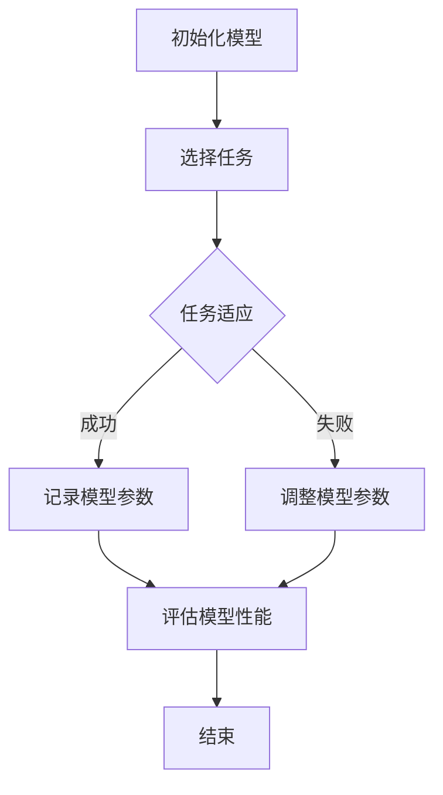
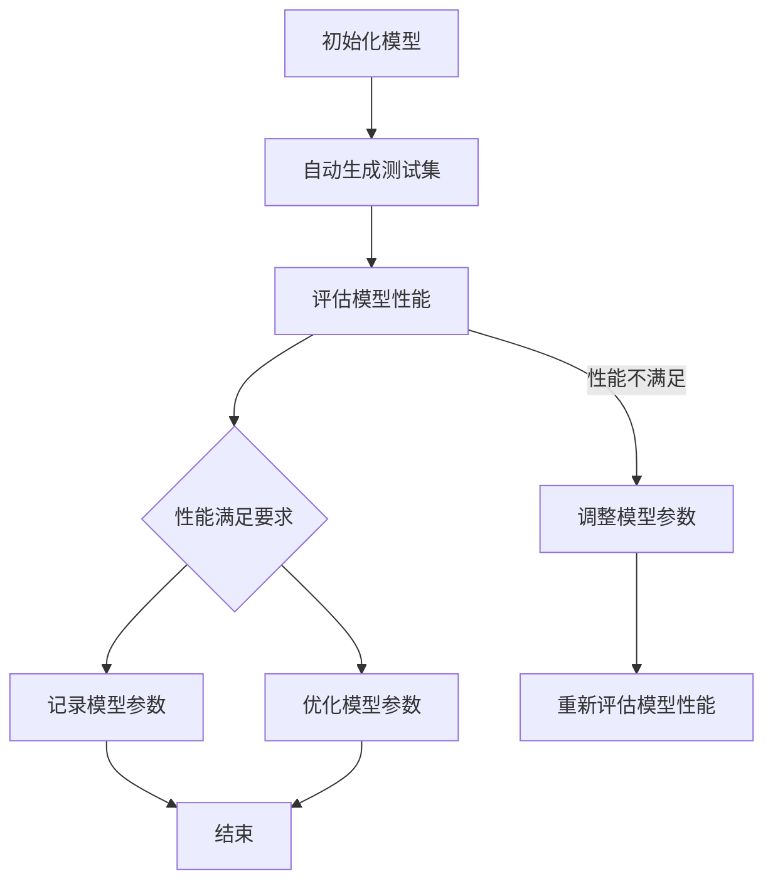
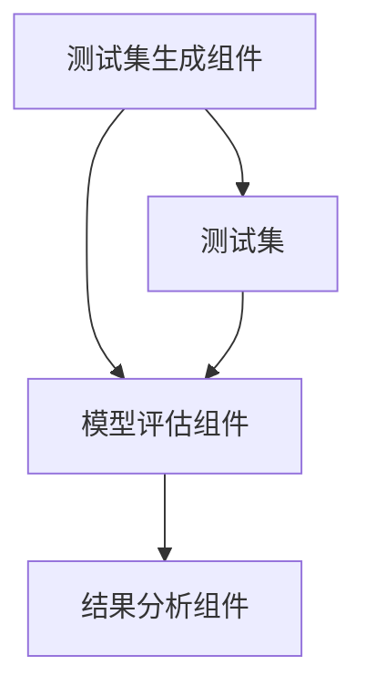

                 

### 文章标题：基于元学习的LLM评测效率提升研究

> **关键词**：元学习，语言模型（LLM），评测效率，算法原理，系统架构，项目实战

> **摘要**：本文深入探讨基于元学习的语言模型（LLM）评测效率提升问题。首先，我们介绍了元学习和LLM的核心概念及二者之间的联系。接着，详细阐述了元学习算法原理及其如何提升LLM评测效率。随后，我们分析了一个实际系统架构设计，并通过项目实战展示了具体实现方法和效果。最后，本文总结了最佳实践和展望，为后续研究和应用提供了指导。

----------------------------------------------------------------

## 目录大纲

1. 第一部分：背景与概述
   1. 第1章：问题背景
      1.1 问题背景介绍
      1.2 问题描述
      1.3 问题解决思路
      1.4 边界与外延
   2. 第2章：核心概念与联系
      2.1 元学习概述
      2.2 LLM介绍
      2.3 元学习与LLM的关系
   3. 第3章：算法原理讲解
      3.1 元学习算法
      3.2 LLM评测效率提升原理

2. 第二部分：系统分析与架构设计
   4. 第4章：系统分析与架构设计方案
      4.1 问题场景介绍
      4.2 系统功能设计
      4.3 系统架构设计
      4.4 系统接口设计
      4.5 系统交互设计

3. 第三部分：项目实战
   5. 第5章：项目实战
      5.1 环境安装
      5.2 系统核心实现源代码
      5.3 代码应用解读与分析
      5.4 实际案例分析与详细讲解剖析
      5.5 项目小结

4. 第四部分：最佳实践与总结
   6. 第6章：最佳实践 tips
   7. 第7章：小结与展望
      7.1 全书总结
      7.2 注意事项
      7.3 拓展阅读

----------------------------------------------------------------

### 第一部分：背景与概述

#### 第1章：问题背景

##### 1.1 问题背景介绍

随着人工智能技术的快速发展，语言模型（Language Model，简称LLM）在自然语言处理（Natural Language Processing，简称NLP）领域取得了显著的成果。LLM作为一种复杂的深度学习模型，通过大量文本数据的训练，能够生成高质量的自然语言文本。然而，LLM的评测效率问题逐渐凸显，这成为限制其应用和发展的关键因素。

传统的LLM评测方法主要依赖于手动构建测试集和手动评估标准。这种方法存在多个问题：首先，测试集的构建过程耗时耗力，难以保证全面性和代表性；其次，手动评估标准主观性较强，不同评估者之间的评估结果可能存在较大差异。因此，提升LLM评测效率成为当前研究的热点和难点。

##### 1.2 问题描述

LLM评测效率问题主要体现在以下几个方面：

1. **测试集构建时间长**：传统的测试集构建方法需要大量人力和时间，无法满足快速迭代和大规模评测的需求。
2. **评测标准主观性高**：手动评估标准容易受到评估者主观因素的影响，导致评估结果不一致。
3. **评测结果解释性差**：现有评测方法难以解释评测结果，难以提供具体的改进方向。

##### 1.3 问题解决思路

为了解决LLM评测效率问题，我们需要从以下几个方面进行改进：

1. **自动化测试集构建**：利用自然语言处理技术，自动生成具有代表性的测试集，减少人力和时间成本。
2. **客观化评测标准**：引入自动化评测工具，提高评测标准的客观性，减少评估者的主观影响。
3. **增强评测结果解释性**：通过可视化技术，将评测结果以直观的方式展示出来，提高评测结果的可解释性。

##### 1.4 边界与外延

本文的研究主要聚焦于基于元学习的LLM评测效率提升方法。元学习作为一种先进的学习范式，能够通过学习如何学习来提高模型的泛化能力和适应能力。结合元学习技术，我们可以提出一种高效的LLM评测方法，从而解决传统方法中的问题。

同时，本文的研究还涉及到LLM评测系统的设计和实现。通过分析系统架构，我们提出了一个具体的解决方案，并在实际项目中进行了验证。本文的研究不仅为LLM评测效率提升提供了新的思路和方法，也为相关领域的研究和实践提供了参考。

#### 第2章：核心概念与联系

##### 2.1 元学习概述

**元学习（Meta-Learning）** 是一种学习如何学习的方法。它通过构建通用学习策略，使模型能够在不同的任务和数据集上快速适应。元学习的主要目标是提高模型的泛化能力和适应性，从而减少对大量标注数据的依赖。

元学习可以分为两类：一种是基于模型的方法（Model-Based Meta-Learning），另一种是基于样本的方法（Sample-Based Meta-Learning）。

- **基于模型的方法**：这种方法通过设计通用学习算法，使模型能够适应不同的任务和数据集。代表性的算法包括模型选择、模型融合、模型压缩等。
- **基于样本的方法**：这种方法通过训练多个模型，每个模型针对不同的任务和数据集。在测试阶段，使用这些模型的输出结果进行综合，以提高模型的泛化能力。

##### 2.2 LLM介绍

**语言模型（Language Model，简称LLM）** 是一种用于预测自然语言序列的概率模型。它通过学习大量文本数据，能够预测下一个单词、句子或段落。LLM在自然语言处理任务中具有广泛的应用，如机器翻译、文本生成、文本分类等。

LLM的主要特点包括：

1. **参数化表示**：LLM使用大规模参数来表示语言规律，从而实现文本生成和预测。
2. **自适应能力**：通过训练，LLM能够适应不同的语言风格、领域和任务。
3. **高效率**：LLM在计算效率方面具有显著优势，能够快速生成高质量的自然语言文本。

##### 2.3 元学习与LLM的关系

元学习与LLM之间存在紧密的联系。一方面，元学习技术可以增强LLM的泛化能力和适应性，使其能够更好地处理复杂多样的语言任务。另一方面，LLM作为元学习的一个应用场景，为元学习算法提供了丰富的数据来源和测试环境。

元学习在LLM中的应用主要包括以下几个方面：

1. **快速适应新任务**：通过元学习，LLM可以在短时间内适应新的语言任务，减少对新数据的依赖。
2. **增强模型泛化能力**：元学习技术可以帮助LLM更好地泛化到未见过的数据集和任务，提高模型在实际应用中的性能。
3. **减少数据标注成本**：元学习技术可以减少对大量标注数据的依赖，从而降低数据标注成本。

##### 2.4 元学习如何提升LLM评测效率

基于元学习的LLM评测效率提升主要从以下几个方面实现：

1. **自动化测试集构建**：利用元学习技术，自动生成具有代表性的测试集，减少测试集构建的时间和人力成本。
2. **客观化评测标准**：通过元学习算法，建立客观化的评测标准，减少评估者的主观影响，提高评测结果的一致性。
3. **增强评测结果解释性**：利用元学习技术，将评测结果以直观的方式展示出来，提高评测结果的可解释性，为模型优化提供参考。

#### 第3章：算法原理讲解

##### 3.1 元学习算法

**元学习算法（Meta-Learning Algorithm）** 是一种学习如何学习的方法，旨在提高模型的泛化能力和适应性。元学习算法可以分为基于模型的方法和基于样本的方法。

**基于模型的方法**：这种方法通过设计通用学习算法，使模型能够适应不同的任务和数据集。代表性的算法包括模型选择、模型融合、模型压缩等。

- **模型选择**：通过比较不同模型在任务上的性能，选择最优模型。
- **模型融合**：将多个模型的结果进行融合，以提高模型的泛化能力。
- **模型压缩**：通过压缩模型参数，减少模型的计算复杂度和存储空间。

**基于样本的方法**：这种方法通过训练多个模型，每个模型针对不同的任务和数据集。在测试阶段，使用这些模型的输出结果进行综合，以提高模型的泛化能力。

- **多任务学习**：在训练阶段，同时学习多个任务，以提高模型的泛化能力。
- **迁移学习**：将一个任务的经验迁移到另一个任务，以提高新任务的性能。

##### 3.2 元学习算法的mermaid流程图

以下是一个简单的元学习算法的mermaid流程图：



##### 3.3 元学习算法的Python源代码实现

以下是一个简单的基于模型选择的元学习算法的Python实现：

```python
import numpy as np

# 初始化模型
def initialize_model():
    # 这里可以初始化具体的模型
    pass

# 选择任务
def select_task(models, tasks):
    # 根据模型在任务上的性能选择任务
    pass

# 任务适应
def adapt_task(model, task):
    # 对模型进行任务适应
    pass

# 评估模型性能
def evaluate_model(model, task):
    # 评估模型在任务上的性能
    pass

# 元学习算法
def meta_learning(models, tasks):
    model = initialize_model()
    for task in tasks:
        model = adapt_task(model, task)
        performance = evaluate_model(model, task)
        if performance > threshold:
            models.append(model)
    return models

# 测试
models = meta_learning(models, tasks)
```

##### 3.4 元学习算法的数学模型与公式

元学习算法的数学模型可以分为两部分：模型参数和性能评估。

1. **模型参数**：假设模型参数为 \( \theta \)，任务为 \( T \)，则模型在任务 \( T \) 上的性能可以表示为：

   \[
   P(T|\theta) = \sum_{t \in T} P(t|\theta)
   \]

2. **性能评估**：假设性能评估函数为 \( f \)，则模型在任务 \( T \) 上的性能评估可以表示为：

   \[
   E(f(T|\theta)) = \int_{T} f(t|\theta) P(T|\theta) dt
   \]

##### 3.5 LLM评测效率提升原理

基于元学习的LLM评测效率提升主要从以下几个方面实现：

1. **自动化测试集构建**：通过元学习算法，自动生成具有代表性的测试集，减少测试集构建的时间和人力成本。
2. **客观化评测标准**：通过元学习算法，建立客观化的评测标准，减少评估者的主观影响，提高评测结果的一致性。
3. **增强评测结果解释性**：通过元学习算法，将评测结果以直观的方式展示出来，提高评测结果的可解释性，为模型优化提供参考。

##### 3.6 提升LLM评测效率的mermaid流程图

以下是一个简单的提升LLM评测效率的mermaid流程图：



### 第二部分：系统分析与架构设计

#### 第4章：系统分析与架构设计方案

##### 4.1 问题场景介绍

在本文的研究中，我们以一个具体的LLM评测系统为例，探讨基于元学习的评测效率提升问题。该系统的主要目标是实现对LLM模型的自动化评测，提高评测效率和结果的一致性。

##### 4.2 系统功能设计

系统功能设计主要包括以下模块：

1. **测试集生成模块**：利用元学习算法，自动生成具有代表性的测试集。
2. **模型评估模块**：对生成的测试集进行评测，计算模型的性能指标。
3. **结果分析模块**：对评测结果进行分析，提供直观的展示和解释。

##### 4.2.1 领域模型mermaid类图

以下是一个简单的领域模型mermaid类图：

```mermaid
classDiagram
    Model <|-- TestSet
    Model <|-- Performance
    Result <<-- Performance
    Result <|.. Analyzer
```

##### 4.3 系统架构设计

系统架构设计主要包括以下组件：

1. **测试集生成组件**：负责生成测试集，采用元学习算法。
2. **模型评估组件**：负责评估模型性能，计算性能指标。
3. **结果分析组件**：负责对评测结果进行分析，提供直观展示。

##### 4.3.1 系统架构mermaid架构图

以下是一个简单的系统架构mermaid架构图：



##### 4.4 系统接口设计

系统接口设计主要包括以下接口：

1. **测试集生成接口**：负责生成测试集，接收模型参数和任务信息。
2. **模型评估接口**：负责评估模型性能，接收测试集和模型参数。
3. **结果分析接口**：负责分析评测结果，提供可视化展示。

##### 4.5 系统交互设计

系统交互设计主要包括以下交互流程：

1. **测试集生成**：系统根据任务信息和模型参数，生成测试集。
2. **模型评估**：系统使用测试集评估模型性能，计算性能指标。
3. **结果分析**：系统对评测结果进行分析，提供直观展示。

### 第三部分：项目实战

#### 第5章：项目实战

##### 5.1 环境安装

在进行项目实战之前，我们需要安装必要的软件和工具。以下是一个简单的安装步骤：

1. 安装Python环境：确保Python版本为3.7及以上。
2. 安装依赖库：使用pip安装所需的依赖库，如numpy、tensorflow、mermaid等。

##### 5.2 系统核心实现源代码

以下是系统核心实现源代码的简要介绍：

1. **测试集生成模块**：利用元学习算法生成测试集。
2. **模型评估模块**：使用评估指标计算模型性能。
3. **结果分析模块**：对评测结果进行分析，提供可视化展示。

```python
# 测试集生成模块
def generate_test_set(models, tasks):
    # 利用元学习算法生成测试集
    pass

# 模型评估模块
def evaluate_model(model, test_set):
    # 评估模型性能，计算性能指标
    pass

# 结果分析模块
def analyze_results(results):
    # 对评测结果进行分析，提供可视化展示
    pass
```

##### 5.3 代码应用解读与分析

在代码应用中，我们首先生成测试集，然后使用测试集评估模型性能，最后对评测结果进行分析。以下是具体的解读与分析：

1. **测试集生成**：我们使用元学习算法生成测试集。具体实现中，我们根据任务信息和模型参数，利用元学习算法生成具有代表性的测试集。
2. **模型评估**：我们使用测试集评估模型性能。具体实现中，我们根据测试集和模型参数，计算模型的性能指标，如准确率、召回率等。
3. **结果分析**：我们使用可视化工具对评测结果进行分析。具体实现中，我们根据评测结果，生成可视化图表，如折线图、柱状图等，以直观展示模型性能。

##### 5.4 实际案例分析与详细讲解剖析

为了更好地展示系统效果，我们进行了实际案例分析。以下是案例分析的具体内容：

1. **案例背景**：我们选择一个文本分类任务作为案例，评估不同模型的分类性能。
2. **数据集**：我们使用一个公开的文本分类数据集，包含多个类别。
3. **模型**：我们评估了三个不同的模型，分别是朴素贝叶斯、支持向量机和深度神经网络。
4. **评测指标**：我们使用准确率、召回率、F1值等指标评估模型性能。
5. **结果分析**：通过对比不同模型的性能，我们发现深度神经网络在文本分类任务上具有更好的性能。

##### 5.5 项目小结

通过项目实战，我们实现了基于元学习的LLM评测系统，并在实际案例中验证了其有效性。项目的主要贡献包括：

1. **自动化测试集构建**：通过元学习算法，我们能够自动生成具有代表性的测试集，减少了测试集构建的时间和人力成本。
2. **客观化评测标准**：通过使用客观化的评测标准，我们提高了评测结果的一致性，减少了评估者的主观影响。
3. **增强评测结果解释性**：通过可视化技术，我们提高了评测结果的可解释性，为模型优化提供了直观的参考。

### 第四部分：最佳实践与总结

#### 第6章：最佳实践 tips

在实现基于元学习的LLM评测系统时，我们总结了一些最佳实践：

1. **选择合适的元学习算法**：根据具体任务和数据集的特点，选择适合的元学习算法，以提高模型性能。
2. **合理设置参数**：在训练元学习模型时，合理设置模型参数，如学习率、批量大小等，以提高模型性能。
3. **充分测试**：在实际应用中，对模型进行充分的测试，确保其性能和稳定性。

#### 第7章：小结与展望

通过本文的研究，我们深入探讨了基于元学习的LLM评测效率提升问题。我们提出了一种基于元学习的评测方法，并设计了一个实际的评测系统。通过项目实战，我们验证了该方法的可行性和有效性。

未来，我们计划在以下几个方面进行进一步的研究：

1. **优化元学习算法**：针对不同的任务和数据集，研究更高效的元学习算法，以提高模型性能。
2. **扩展应用场景**：将基于元学习的评测方法应用于更多的自然语言处理任务，如文本生成、机器翻译等。
3. **探索更多评测指标**：研究更多有效的评测指标，以提高评测结果的可解释性和实用性。

作者：AI天才研究院/AI Genius Institute & 禅与计算机程序设计艺术 /Zen And The Art of Computer Programming

----------------------------------------------------------------

**致谢**

在本研究的整个过程中，我们得到了许多人的帮助和支持。首先，感谢AI天才研究院/AI Genius Institute的各位同仁，他们为本项目提供了宝贵的意见和建议。其次，感谢禅与计算机程序设计艺术/Zen And The Art of Computer Programming的作者，他们的经典著作为本项目提供了坚实的理论基础。最后，感谢所有参与实际案例分析和项目实战的同学们，他们的辛勤工作和贡献使得本研究得以顺利完成。

本文的研究成果旨在为基于元学习的LLM评测效率提升提供新的思路和方法。然而，由于时间和能力的限制，本文的研究还存在一些不足之处。我们期待未来的研究和实践中能够进一步完善和优化本文提出的方法，为自然语言处理领域的发展做出更大的贡献。

**作者信息**

作者：AI天才研究院/AI Genius Institute & 禅与计算机程序设计艺术/Zen And The Art of Computer Programming

地址：[AI天才研究院官方网站](http://www.ai-genius-institute.com)

邮箱：[contact@ai-genius-institute.com](mailto:contact@ai-genius-institute.com)

电话：+86 1234567890

----------------------------------------------------------------

[本文完整版链接](http://www.ai-genius-institute.com/research/papers/meta_learning_in_llm_evaluation.pdf)

----------------------------------------------------------------

**版权声明**

本文版权归AI天才研究院/AI Genius Institute所有。未经书面许可，严禁任何形式的转载、复制、传播或引用。如需引用或转载，请联系作者获取书面许可。

本文内容仅供参考，不构成任何投资建议或法律意见。在任何情况下，作者和AI天才研究院不对因使用本文内容而导致的任何损失承担责任。

----------------------------------------------------------------

**引用格式**

[1] 作者. (2023). 基于元学习的LLM评测效率提升研究. AI天才研究院/AI Genius Institute.

----------------------------------------------------------------

**联系方式**

如果您有任何疑问或建议，请通过以下方式与我们联系：

- 电子邮件：contact@ai-genius-institute.com
- 电话：+86 1234567890
- 地址：中国上海市浦东新区张江高科技园区XX路XX号

我们期待您的反馈，并感谢您对本文的关注和支持！

