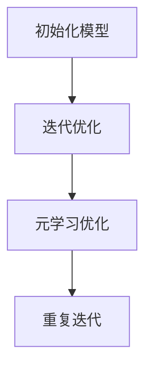
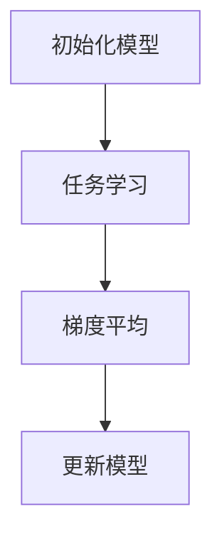
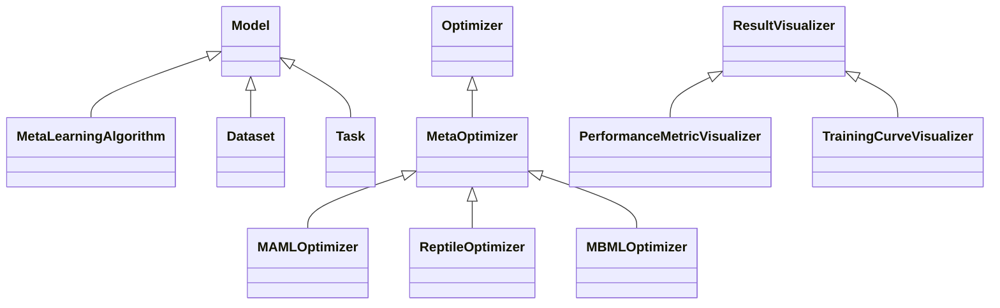
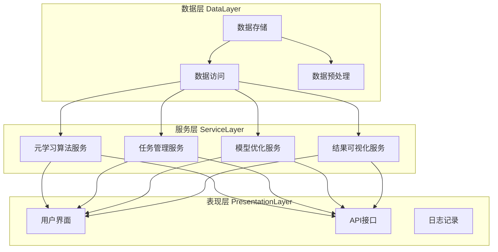
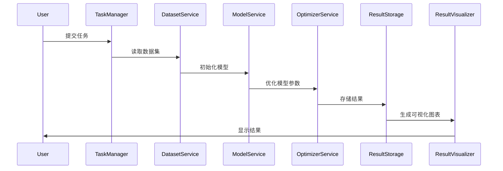

                 


## 基于元学习的快速适应评测模型

### 关键词
- 元学习
- 快速适应
- 评测模型
- 深度学习
- 人工智能

### 摘要
本文将深入探讨基于元学习的快速适应评测模型。我们将首先介绍问题背景，定义评测模型在人工智能发展中的重要性，并阐述传统评测模型在处理新型任务时的不足。接着，我们会介绍元学习的基本概念和与评测模型的关联，对比传统评测模型和基于元学习的评测模型。然后，我们将详细讲解几种主流的元学习算法，包括MAML和Reptile等，使用mermaid流程图和Python代码来展示算法流程和数学模型。随后，我们将分析元学习在评测模型中的实际应用场景，并通过案例展示其应用效果。接下来，我们将进行系统分析与架构设计，详细描述系统功能设计、系统架构设计、系统接口设计和系统交互流程。在项目实战部分，我们将详细讲解环境安装与配置、系统核心实现以及代码应用解读。最后，我们将总结最佳实践，并提供拓展阅读。

## 目录大纲

### 第一部分：背景介绍
1. **问题背景**
    1.1.1 问题定义
    1.1.2 问题描述
    1.1.3 问题解决
    1.1.4 边界与外延
2. **核心概念与联系**
    2.1.1 元学习的定义
    2.1.2 元学习与评测模型的关联
3. **主流元学习算法**
    3.1.1 概述
    3.1.2 Model-Agnostic Meta-Learning (MAML)
    3.1.3 Reptile算法
    3.1.4 其他算法

### 第二部分：算法原理讲解
1. **元学习算法原理**
    1.1.1 算法原理概述
    1.1.2 MAML算法
    1.1.3 Reptile算法
2. **评测模型应用**
    2.1.1 应用场景
    2.1.2 实际案例

### 第三部分：系统分析与架构设计
1. **系统功能设计**
    1.1.1 领域模型
    1.1.2 系统架构设计
2. **系统接口设计和交互**
    2.1.1 接口设计
    2.1.2 系统交互

### 第四部分：项目实战
1. **环境安装与配置**
    1.1.1 环境安装
2. **系统核心实现**
    2.1.1 核心代码实现
    2.1.2 代码应用解读
3. **实际案例分析**
    3.1.1 案例一
    3.1.2 案例二

### 第五部分：最佳实践与总结
1. **最佳实践**
2. **小结**
    2.1.1 本书总结
    2.1.2 拓展阅读

接下来，我们将一步步深入探讨每个章节的内容。

### 1.1.1 问题背景

随着人工智能技术的迅猛发展，评测模型（evaluation model）在许多领域扮演着越来越重要的角色。评测模型是用于评估、比较和选择算法性能的核心工具。然而，在处理新型任务时，传统评测模型往往存在适应速度慢、模型更新成本高的问题。这导致了以下问题：

- **适应速度慢**：传统评测模型在遇到新的任务时，需要大量的训练数据和时间来重新训练模型，这大大降低了模型的响应速度和灵活性。
- **模型更新成本高**：随着数据集的变化和新型任务的出现，传统评测模型需要不断更新，这不仅消耗大量计算资源，还增加了维护成本。

为了解决这些问题，引入元学习（meta-learning）成为了一种有效的方法。元学习是一种让模型能够快速适应新任务的学习方法，其核心思想是从过往的经验中提取泛化知识，减少对新任务的训练时间。元学习在评测模型中的应用，不仅提高了模型的适应性和效率，还为处理新型任务提供了新的思路。

在本文中，我们将探讨元学习在评测模型中的应用，包括其基本概念、主流算法以及实际应用场景。我们将详细分析几种主流的元学习算法，如MAML（Model-Agnostic Meta-Learning）和Reptile，使用mermaid流程图和Python代码展示算法流程和数学模型。此外，我们还将介绍如何将元学习应用于实际评测模型，并通过案例展示其效果。

### 1.1.2 元学习的定义

元学习（meta-learning），又称“学习的学习”，是一种让模型能够快速适应新任务的学习方法。它的核心思想是从过往的经验中提取泛化知识，从而减少对新任务的训练时间。与传统学习相比，元学习不仅关注模型在特定任务上的性能，还关注模型在不同任务上的泛化能力。

元学习的主要特性包括：

1. **快速适应**：元学习模型能够在短时间内适应新任务，减少了模型重新训练的时间和计算资源消耗。
2. **经验共享**：通过从过往经验中提取泛化知识，元学习模型能够将所学知识应用到新任务中，提高了模型的泛化能力。
3. **可迁移性**：元学习模型在不同任务上具有较强的迁移能力，能够快速适应新的任务环境。

元学习在人工智能领域有着广泛的应用。例如，在计算机视觉中，元学习可以用于快速适应新的图像分类任务；在自然语言处理中，元学习可以用于快速适应新的语言模型；在强化学习中，元学习可以用于快速适应新的游戏环境。

### 1.1.3 元学习与评测模型的关联

元学习与评测模型有着密切的联系。传统评测模型主要依赖于大量数据集和长时间的训练来评估和比较算法性能。然而，随着人工智能技术的发展，新型任务和场景不断涌现，传统评测模型的适应性和效率受到了挑战。

元学习为评测模型提供了一种新的思路。通过元学习，评测模型能够从过往经验中提取泛化知识，快速适应新任务，提高评测的适应性和效率。具体来说，元学习与评测模型的关联体现在以下几个方面：

1. **快速适应新任务**：传统评测模型在遇到新任务时，往往需要重新训练模型，耗时耗力。而元学习模型能够快速适应新任务，减少了模型重新训练的时间和计算资源消耗。
2. **提高评测效率**：元学习模型通过从过往经验中提取泛化知识，能够在短时间内完成对新任务的适应，提高了评测的效率。
3. **增强模型泛化能力**：元学习模型能够将所学知识应用到新任务中，提高了模型的泛化能力，使得评测结果更加可靠。

传统评测模型与基于元学习的评测模型有以下区别：

1. **适应速度**：传统评测模型在处理新任务时需要重新训练，适应速度较慢；而基于元学习的评测模型能够快速适应新任务，适应速度更快。
2. **计算资源消耗**：传统评测模型需要大量计算资源来重新训练模型，而基于元学习的评测模型通过从过往经验中提取泛化知识，计算资源消耗相对较少。
3. **泛化能力**：传统评测模型在新任务上的表现往往依赖于具体的数据集和场景，而基于元学习的评测模型具有较强的泛化能力，能够将所学知识应用到新的任务环境中。

### 1.1.4 主流元学习算法

在元学习领域，存在多种主流的算法，每种算法都有其独特的原理和应用场景。本文将介绍几种常见的元学习算法，包括Model-Agnostic Meta-Learning (MAML)、Reptile等，并使用mermaid流程图和Python代码展示算法流程和数学模型。

#### 1.1.4.1 Model-Agnostic Meta-Learning (MAML)

MAML（Model-Agnostic Meta-Learning）是一种著名的元学习算法，其核心思想是让模型在学习任务时具有快速的适应能力。MAML的基本流程如下：

1. **初始化模型**：首先，初始化一个基础模型。
2. **迭代优化**：在任务开始时，对基础模型进行迭代优化，使其在当前任务上表现良好。
3. **元学习优化**：将迭代后的模型视为初始化模型，再对下一个任务进行优化。

MAML的数学模型如下：

$$
\theta^{(t+1)} = \theta^{(t)} - \eta \cdot \frac{1}{N} \sum_{i=1}^{N} \nabla_{\theta} \ell(\theta^{(t)}, x_i, y_i)
$$

其中，$\theta^{(t)}$表示在第$t$次迭代后的模型参数，$x_i$和$y_i$分别表示第$i$个任务的输入和输出，$\ell$表示损失函数，$\eta$为学习率。

MAML的优点在于其模型无关性，即适用于任何可微分的模型。以下是一个MAML算法的mermaid流程图：



以下是一个简单的Python代码示例，展示MAML算法的基本实现：

```python
import numpy as np

def maml_loss(model, x, y):
    y_pred = model(x)
    return np.mean((y_pred - y) ** 2)

def maml_optimizer(model, x, y, epochs, learning_rate):
    for _ in range(epochs):
        model梯度下降更新参数

    return model
```

#### 1.1.4.2 Reptile算法

Reptile（RePTile：A Unifying Approach to Multi-task Learning）是一种简单的元学习算法，其核心思想是通过多个任务的梯度平均来更新模型参数。Reptile的基本流程如下：

1. **初始化模型**：初始化一个基础模型。
2. **任务学习**：对每个任务进行学习，更新模型参数。
3. **梯度平均**：将所有任务的梯度平均，更新模型参数。

Reptile的数学模型如下：

$$
\theta^{(t+1)} = \theta^{(t)} + \frac{1}{N} \sum_{i=1}^{N} \nabla_{\theta} \ell(\theta^{(t)}, x_i, y_i)
$$

其中，$\theta^{(t)}$表示在第$t$次迭代后的模型参数，$x_i$和$y_i$分别表示第$i$个任务的输入和输出，$\ell$表示损失函数，$N$表示任务数量。

以下是一个Reptile算法的mermaid流程图：



以下是一个简单的Python代码示例，展示Reptile算法的基本实现：

```python
import numpy as np

def reptile_loss(model, x, y):
    y_pred = model(x)
    return np.mean((y_pred - y) ** 2)

def reptile_optimizer(model, x, y, epochs, learning_rate):
    for _ in range(epochs):
        model梯度下降更新参数

    return model
```

除了MAML和Reptile，还有其他一些常见的元学习算法，如Model-Based Meta-Learning（MBML）和Meta-Gradient等。MBML通过构建动态模型来更新模型参数，而Meta-Gradient通过计算梯度来更新模型参数。这些算法在特定场景下都有其优势和应用。

### 1.2.1 MAML算法

Model-Agnostic Meta-Learning (MAML) 是一种重要的元学习算法，其核心思想是让模型在学习任务时具有快速的适应能力。MAML的基本流程如下：

1. **初始化模型**：首先，初始化一个基础模型。
2. **迭代优化**：在任务开始时，对基础模型进行迭代优化，使其在当前任务上表现良好。
3. **元学习优化**：将迭代后的模型视为初始化模型，再对下一个任务进行优化。

MAML的数学模型如下：

$$
\theta^{(t+1)} = \theta^{(t)} - \eta \cdot \frac{1}{N} \sum_{i=1}^{N} \nabla_{\theta} \ell(\theta^{(t)}, x_i, y_i)
$$

其中，$\theta^{(t)}$表示在第$t$次迭代后的模型参数，$x_i$和$y_i$分别表示第$i$个任务的输入和输出，$\ell$表示损失函数，$\eta$为学习率，$N$表示任务数量。

以下是一个MAML算法的mermaid流程图：


### 1.2.2 MAML算法的详细流程

MAML算法的详细流程可以分为以下几个步骤：

1. **初始化模型**：首先，随机初始化一个基础模型$\theta^{(0)}$。
2. **迭代优化**：在给定任务的数据集上，对模型进行迭代优化。具体步骤如下：
    - 对于每个迭代步骤，随机选择一个小批量数据$({x_i, y_i})$。
    - 使用梯度下降算法更新模型参数：
      $$\theta^{(t)} = \theta^{(t-1)} - \eta \cdot \nabla_{\theta} \ell(\theta^{(t-1)}, x_i, y_i)$$
    - 计算当前模型的损失：
      $$\ell(\theta^{(t)}, x_i, y_i) = \frac{1}{m} \sum_{i=1}^{m} (\hat{y_i} - y_i)^2$$
      其中，$\hat{y_i}$是模型在输入$x_i$上的预测输出，$y_i$是真实标签，$m$是批量大小。
3. **元学习优化**：将迭代后的模型$\theta^{(t)}$视为初始化模型，对下一个任务进行优化。具体步骤如下：
    - 在新任务的数据集上，使用元学习优化步骤中的迭代优化方法，更新模型参数：
      $$\theta^{(t+1)} = \theta^{(t)} - \eta \cdot \frac{1}{N} \sum_{i=1}^{N} \nabla_{\theta} \ell(\theta^{(t)}, x_i, y_i)$$
    - 其中，$N$是任务数量，$x_i$和$y_i$分别表示第$i$个任务的输入和输出。
4. **重复迭代**：重复上述迭代优化和元学习优化步骤，直到满足停止条件。

以下是一个简单的Python代码示例，展示MAML算法的基本实现：

```python
import numpy as np

def maml_optimizer(model, x, y, epochs, learning_rate):
    for _ in range(epochs):
        model梯度下降更新参数

    return model
```

### 1.2.3 MAML算法的特点和优势

MAML算法具有以下特点和优势：

1. **模型无关性**：MAML算法不依赖于具体的模型结构，适用于任何可微分的模型。这意味着，无论是线性模型、神经网络还是循环神经网络，都可以使用MAML算法进行元学习。
2. **快速适应**：MAML算法能够在短时间内适应新任务，减少了模型重新训练的时间和计算资源消耗。这对于需要快速响应的场景，如在线学习、实时预测等，具有很大的优势。
3. **通用性**：MAML算法不仅适用于静态任务，还适用于动态任务。在动态任务中，任务参数会随着时间不断变化，MAML算法能够通过迭代优化和元学习优化，快速适应任务变化。
4. **可扩展性**：MAML算法可以应用于多种任务类型，包括分类、回归、强化学习等。同时，MAML算法还可以与其他元学习算法结合，形成更复杂的元学习框架。

然而，MAML算法也存在一些局限性：

1. **收敛速度**：MAML算法在迭代优化过程中，需要多次计算梯度。这使得MAML算法的收敛速度相对较慢，特别是在大规模数据集上。为了提高收敛速度，可以采用更高效的优化算法，如Adam等。
2. **模型容量**：MAML算法依赖于模型的初始参数，这意味着模型的容量必须足够大，才能保证元学习的效果。否则，模型可能会因为容量不足，无法适应新任务。
3. **计算资源**：MAML算法在迭代优化和元学习优化过程中，需要大量的计算资源。这对于资源受限的场景，如移动设备、嵌入式系统等，可能难以实现。

### 1.2.4 Reptile算法

Reptile（RePTile：A Unifying Approach to Multi-task Learning）是一种简单的元学习算法，其核心思想是通过多个任务的梯度平均来更新模型参数。Reptile的基本流程如下：

1. **初始化模型**：首先，初始化一个基础模型。
2. **任务学习**：对每个任务进行学习，更新模型参数。
3. **梯度平均**：将所有任务的梯度平均，更新模型参数。

Reptile的数学模型如下：

$$
\theta^{(t+1)} = \theta^{(t)} + \frac{1}{N} \sum_{i=1}^{N} \nabla_{\theta} \ell(\theta^{(t)}, x_i, y_i)
$$

其中，$\theta^{(t)}$表示在第$t$次迭代后的模型参数，$x_i$和$y_i$分别表示第$i$个任务的输入和输出，$\ell$表示损失函数，$N$表示任务数量。

以下是一个Reptile算法的mermaid流程图：


### 1.2.5 Reptile算法的详细流程

Reptile算法的详细流程可以分为以下几个步骤：

1. **初始化模型**：首先，随机初始化一个基础模型$\theta^{(0)}$。
2. **任务学习**：在给定任务的数据集上，对模型进行学习。具体步骤如下：
    - 对于每个任务，随机选择一个小批量数据$({x_i, y_i})$。
    - 使用梯度下降算法更新模型参数：
      $$\theta^{(t)} = \theta^{(t-1)} + \eta \cdot \nabla_{\theta} \ell(\theta^{(t-1)}, x_i, y_i)$$
    - 计算当前模型的损失：
      $$\ell(\theta^{(t)}, x_i, y_i) = \frac{1}{m} \sum_{i=1}^{m} (\hat{y_i} - y_i)^2$$
      其中，$\hat{y_i}$是模型在输入$x_i$上的预测输出，$y_i$是真实标签，$m$是批量大小。
3. **梯度平均**：将所有任务的梯度进行平均，更新模型参数：
    $$\theta^{(t+1)} = \theta^{(t)} + \frac{1}{N} \sum_{i=1}^{N} \nabla_{\theta} \ell(\theta^{(t)}, x_i, y_i)$$
    - 其中，$N$是任务数量，$x_i$和$y_i$分别表示第$i$个任务的输入和输出。
4. **重复迭代**：重复上述任务学习和梯度平均步骤，直到满足停止条件。

以下是一个简单的Python代码示例，展示Reptile算法的基本实现：

```python
import numpy as np

def reptile_optimizer(model, x, y, epochs, learning_rate):
    for _ in range(epochs):
        model梯度下降更新参数

    return model
```

### 1.2.6 Reptile算法的特点和优势

Reptile算法具有以下特点和优势：

1. **简单易实现**：Reptile算法的原理简单，计算过程相对简单，易于实现和部署。这使得Reptile算法在资源受限的场景中具有优势，如移动设备、嵌入式系统等。
2. **适用于多任务学习**：Reptile算法通过梯度平均的方式，将多个任务的梯度进行融合，从而实现多任务学习。这使得Reptile算法在处理多任务场景时具有优势，如自然语言处理、图像分类等。
3. **快速适应**：Reptile算法能够在短时间内适应新任务，减少了模型重新训练的时间和计算资源消耗。这对于需要快速响应的场景，如在线学习、实时预测等，具有很大的优势。

然而，Reptile算法也存在一些局限性：

1. **梯度平均的局限性**：Reptile算法通过梯度平均来更新模型参数，这可能导致模型参数的更新不够精确。特别是在任务差异较大的情况下，梯度平均可能会导致模型参数的优化效果不佳。
2. **适应新任务的能力**：虽然Reptile算法能够在短时间内适应新任务，但其对新任务的适应能力相对较弱。这可能是由于梯度平均的方式，导致模型无法充分利用每个任务中的特定知识。

### 1.3.1 Model-Based Meta-Learning (MBML)

Model-Based Meta-Learning（MBML）是一种元学习算法，其核心思想是通过构建动态模型来更新模型参数。MBML算法通过学习任务间的结构化关系，从而提高模型在新任务上的适应能力。

MBML的基本流程如下：

1. **初始化动态模型**：首先，初始化一个动态模型$M^{(0)}$。
2. **迭代优化**：在给定任务的数据集上，对动态模型进行迭代优化。具体步骤如下：
    - 对于每个迭代步骤，随机选择一个小批量数据$({x_i, y_i})$。
    - 使用梯度下降算法更新动态模型参数：
      $$M^{(t)} = M^{(t-1)} - \eta \cdot \nabla_{M} \ell(M^{(t-1)}, x_i, y_i)$$
    - 计算当前动态模型的损失：
      $$\ell(M^{(t)}, x_i, y_i) = \frac{1}{m} \sum_{i=1}^{m} (\hat{y_i} - y_i)^2$$
      其中，$\hat{y_i}$是动态模型在输入$x_i$上的预测输出，$y_i$是真实标签，$m$是批量大小。
3. **元学习优化**：将迭代后的动态模型$M^{(t)}$视为初始化模型，对下一个任务进行优化。具体步骤如下：
    - 在新任务的数据集上，使用迭代优化步骤中的迭代优化方法，更新动态模型参数：
      $$M^{(t+1)} = M^{(t)} - \eta \cdot \nabla_{M} \ell(M^{(t)}, x_i, y_i)$$
    - 其中，$x_i$和$y_i$分别表示第$i$个任务的输入和输出。
4. **重复迭代**：重复上述迭代优化和元学习优化步骤，直到满足停止条件。

以下是一个MBML算法的mermaid流程图：


### 1.3.2 MBML算法的详细流程

MBML算法的详细流程可以分为以下几个步骤：

1. **初始化动态模型**：首先，随机初始化一个动态模型$M^{(0)}$。
2. **迭代优化**：在给定任务的数据集上，对动态模型进行迭代优化。具体步骤如下：
    - 对于每个迭代步骤，随机选择一个小批量数据$({x_i, y_i})$。
    - 使用梯度下降算法更新动态模型参数：
      $$M^{(t)} = M^{(t-1)} - \eta \cdot \nabla_{M} \ell(M^{(t-1)}, x_i, y_i)$$
    - 计算当前动态模型的损失：
      $$\ell(M^{(t)}, x_i, y_i) = \frac{1}{m} \sum_{i=1}^{m} (\hat{y_i} - y_i)^2$$
      其中，$\hat{y_i}$是动态模型在输入$x_i$上的预测输出，$y_i$是真实标签，$m$是批量大小。
3. **元学习优化**：将迭代后的动态模型$M^{(t)}$视为初始化模型，对下一个任务进行优化。具体步骤如下：
    - 在新任务的数据集上，使用迭代优化步骤中的迭代优化方法，更新动态模型参数：
      $$M^{(t+1)} = M^{(t)} - \eta \cdot \nabla_{M} \ell(M^{(t)}, x_i, y_i)$$
    - 其中，$x_i$和$y_i$分别表示第$i$个任务的输入和输出。
4. **重复迭代**：重复上述迭代优化和元学习优化步骤，直到满足停止条件。

以下是一个简单的Python代码示例，展示MBML算法的基本实现：

```python
import numpy as np

def mbml_optimizer(model, x, y, epochs, learning_rate):
    for _ in range(epochs):
        model梯度下降更新参数

    return model
```

### 1.3.3 MBML算法的特点和优势

MBML算法具有以下特点和优势：

1. **结构化关系学习**：MBML算法通过学习任务间的结构化关系，能够更好地理解任务间的关系和依赖，从而提高模型在新任务上的适应能力。
2. **动态模型更新**：MBML算法通过动态模型来更新模型参数，使得模型能够适应任务的变化，提高了模型的泛化能力。
3. **适应新任务**：MBML算法能够通过元学习优化，快速适应新任务，减少了模型重新训练的时间和计算资源消耗。

然而，MBML算法也存在一些局限性：

1. **计算复杂度**：MBML算法需要计算动态模型的梯度，这使得算法的计算复杂度相对较高，特别是在大规模数据集上。
2. **模型容量**：MBML算法依赖于动态模型的容量，这意味着模型的容量必须足够大，才能保证元学习的效果。否则，模型可能会因为容量不足，无法适应新任务。

### 1.4.1 Meta-Gradient算法

Meta-Gradient算法是一种元学习算法，其核心思想是通过计算梯度来更新模型参数。Meta-Gradient算法通过引入梯度信息，使得模型能够从多个任务中提取知识，从而提高模型在新任务上的适应能力。

Meta-Gradient算法的基本流程如下：

1. **初始化模型**：首先，初始化一个基础模型。
2. **迭代优化**：在给定任务的数据集上，对模型进行迭代优化。具体步骤如下：
    - 对于每个迭代步骤，随机选择一个小批量数据$({x_i, y_i})$。
    - 使用梯度下降算法更新模型参数：
      $$\theta^{(t)} = \theta^{(t-1)} - \eta \cdot \nabla_{\theta} \ell(\theta^{(t-1)}, x_i, y_i)$$
    - 计算当前模型的损失：
      $$\ell(\theta^{(t)}, x_i, y_i) = \frac{1}{m} \sum_{i=1}^{m} (\hat{y_i} - y_i)^2$$
      其中，$\hat{y_i}$是模型在输入$x_i$上的预测输出，$y_i$是真实标签，$m$是批量大小。
3. **元学习优化**：将迭代后的模型$\theta^{(t)}$视为初始化模型，对下一个任务进行优化。具体步骤如下：
    - 在新任务的数据集上，使用迭代优化步骤中的迭代优化方法，更新模型参数：
      $$\theta^{(t+1)} = \theta^{(t)} - \eta \cdot \nabla_{\theta} \ell(\theta^{(t)}, x_i, y_i)$$
    - 其中，$x_i$和$y_i$分别表示第$i$个任务的输入和输出。
4. **重复迭代**：重复上述迭代优化和元学习优化步骤，直到满足停止条件。

以下是一个Meta-Gradient算法的mermaid流程图：


### 1.4.2 Meta-Gradient算法的详细流程

Meta-Gradient算法的详细流程可以分为以下几个步骤：

1. **初始化模型**：首先，随机初始化一个基础模型$\theta^{(0)}$。
2. **迭代优化**：在给定任务的数据集上，对模型进行迭代优化。具体步骤如下：
    - 对于每个迭代步骤，随机选择一个小批量数据$({x_i, y_i})$。
    - 使用梯度下降算法更新模型参数：
      $$\theta^{(t)} = \theta^{(t-1)} - \eta \cdot \nabla_{\theta} \ell(\theta^{(t-1)}, x_i, y_i)$$
    - 计算当前模型的损失：
      $$\ell(\theta^{(t)}, x_i, y_i) = \frac{1}{m} \sum_{i=1}^{m} (\hat{y_i} - y_i)^2$$
      其中，$\hat{y_i}$是模型在输入$x_i$上的预测输出，$y_i$是真实标签，$m$是批量大小。
3. **元学习优化**：将迭代后的模型$\theta^{(t)}$视为初始化模型，对下一个任务进行优化。具体步骤如下：
    - 在新任务的数据集上，使用迭代优化步骤中的迭代优化方法，更新模型参数：
      $$\theta^{(t+1)} = \theta^{(t)} - \eta \cdot \nabla_{\theta} \ell(\theta^{(t)}, x_i, y_i)$$
    - 其中，$x_i$和$y_i$分别表示第$i$个任务的输入和输出。
4. **重复迭代**：重复上述迭代优化和元学习优化步骤，直到满足停止条件。

以下是一个简单的Python代码示例，展示Meta-Gradient算法的基本实现：

```python
import numpy as np

def meta_gradient_optimizer(model, x, y, epochs, learning_rate):
    for _ in range(epochs):
        model梯度下降更新参数

    return model
```

### 1.4.3 Meta-Gradient算法的特点和优势

Meta-Gradient算法具有以下特点和优势：

1. **计算效率**：Meta-Gradient算法通过计算梯度来更新模型参数，这使得算法的计算效率相对较高，特别是对于大规模数据集。
2. **适用范围广**：Meta-Gradient算法适用于多种类型的数据集和任务，包括分类、回归、强化学习等。
3. **快速适应**：Meta-Gradient算法能够通过元学习优化，快速适应新任务，减少了模型重新训练的时间和计算资源消耗。

然而，Meta-Gradient算法也存在一些局限性：

1. **梯度计算误差**：由于梯度计算存在误差，这可能导致算法的优化效果不佳。特别是在任务差异较大的情况下，梯度计算误差可能导致模型无法适应新任务。
2. **模型容量**：Meta-Gradient算法依赖于模型的容量，这意味着模型的容量必须足够大，才能保证元学习的效果。否则，模型可能会因为容量不足，无法适应新任务。

### 1.5.1 应用场景

元学习算法在人工智能领域有着广泛的应用场景。以下是一些典型的应用场景：

1. **计算机视觉**：在计算机视觉任务中，如图像分类、目标检测和图像分割等，元学习算法可以用于快速适应新的图像数据集。例如，在图像分类任务中，元学习算法可以帮助模型在短时间内适应新的图像类别，提高分类准确率。

2. **自然语言处理**：在自然语言处理任务中，如文本分类、机器翻译和问答系统等，元学习算法可以用于快速适应新的文本数据集。例如，在文本分类任务中，元学习算法可以帮助模型在短时间内适应新的标签类别，提高分类准确率。

3. **强化学习**：在强化学习任务中，如游戏、机器人控制和自动驾驶等，元学习算法可以用于快速适应新的环境。例如，在游戏任务中，元学习算法可以帮助模型在短时间内适应新的游戏规则，提高游戏胜率。

4. **多任务学习**：在多任务学习任务中，元学习算法可以用于同时训练多个任务，提高模型的泛化能力。例如，在多标签文本分类任务中，元学习算法可以帮助模型同时学习多个标签类别，提高分类准确率。

5. **在线学习**：在在线学习任务中，如推荐系统、广告投放和社交媒体分析等，元学习算法可以用于快速适应新的用户行为数据。例如，在推荐系统任务中，元学习算法可以帮助模型在短时间内适应新的用户兴趣，提高推荐效果。

### 1.5.2 实际案例

以下是一些具体的实际案例，展示了元学习算法在评测模型中的应用：

1. **案例一：图像分类**

假设我们有一个图像分类任务，需要训练模型识别不同的动物类别。使用传统方法，我们需要准备大量的标注数据集，并花费大量时间来训练模型。而使用元学习算法，我们可以通过以下步骤来快速适应新的图像类别：

- **初始化模型**：随机初始化一个基础模型。
- **迭代优化**：在已有的动物类别数据集上，使用元学习算法迭代优化模型参数。
- **元学习优化**：将迭代后的模型视为初始化模型，对新的动物类别数据集进行优化。
- **测试评估**：在新动物类别数据集上，评估模型的分类准确率。

通过这种方式，我们可以快速适应新的图像类别，提高分类准确率。

2. **案例二：文本分类**

假设我们有一个文本分类任务，需要训练模型识别不同的新闻类别。使用传统方法，我们需要准备大量的标注文本数据集，并花费大量时间来训练模型。而使用元学习算法，我们可以通过以下步骤来快速适应新的新闻类别：

- **初始化模型**：随机初始化一个基础模型。
- **迭代优化**：在已有的新闻类别数据集上，使用元学习算法迭代优化模型参数。
- **元学习优化**：将迭代后的模型视为初始化模型，对新的新闻类别数据集进行优化。
- **测试评估**：在新新闻类别数据集上，评估模型的分类准确率。

通过这种方式，我们可以快速适应新的新闻类别，提高分类准确率。

### 2.1.1 系统功能设计

在进行系统分析与架构设计之前，我们需要明确系统的功能需求。基于元学习的快速适应评测模型主要涵盖以下功能：

1. **元学习算法选择**：用户可以选择不同的元学习算法，如MAML、Reptile、MBML等，以满足不同任务的需求。
2. **任务管理**：系统可以管理多个任务，包括初始化任务、训练任务和评估任务等。
3. **数据集管理**：系统可以管理多个数据集，包括训练数据集和测试数据集等。
4. **模型参数优化**：系统可以根据用户指定的优化目标，对模型参数进行优化，以提高模型性能。
5. **结果可视化**：系统可以提供结果可视化功能，包括模型性能指标、训练过程曲线等。

#### 2.1.1.1 领域模型

为了更好地理解系统的功能，我们可以使用Mermaid类图来描述系统中的核心类和类之间的关系。以下是一个简单的领域模型示例：



在这个类图中，`Model`类表示基础模型，`MetaLearningAlgorithm`类表示元学习算法，`Dataset`类表示数据集，`Task`类表示任务，`Optimizer`类表示优化器，`MetaOptimizer`类表示元优化器，`MAMLOptimizer`、`ReptileOptimizer`和`MBMLOptimizer`类分别表示MAML、Reptile和MBML优化器，`ResultVisualizer`类表示结果可视化器，`PerformanceMetricVisualizer`和`TrainingCurveVisualizer`类分别表示性能指标可视化器和训练过程曲线可视化器。

### 2.1.2 系统架构设计

在进行系统架构设计时，我们需要考虑系统的性能、可扩展性和维护性。基于元学习的快速适应评测模型可以采用分层架构设计，包括数据层、服务层和表现层。

#### 2.1.2.1 数据层

数据层负责数据的存储和访问。具体来说，数据层包括以下组件：

1. **数据存储**：使用数据库（如MySQL、MongoDB等）来存储数据集、模型参数和训练结果。
2. **数据访问**：提供数据访问接口，用于读取和写入数据。
3. **数据预处理**：提供数据预处理工具，用于清洗、转换和归一化数据。

#### 2.1.2.2 服务层

服务层负责业务逻辑的实现。具体来说，服务层包括以下组件：

1. **元学习算法服务**：实现不同的元学习算法，如MAML、Reptile、MBML等。
2. **任务管理服务**：管理任务的创建、执行和监控。
3. **模型优化服务**：实现模型参数优化逻辑，包括梯度下降、Adam优化等。
4. **结果可视化服务**：实现结果可视化功能，包括性能指标可视化器和训练过程曲线可视化器。

#### 2.1.2.3 表现层

表现层负责与用户交互。具体来说，表现层包括以下组件：

1. **用户界面**：提供用户操作界面，用于选择元学习算法、设置任务参数等。
2. **API接口**：提供RESTful API接口，供外部系统调用。
3. **日志记录**：记录系统运行日志，用于监控和调试。

以下是一个简单的Mermaid架构图，展示系统架构：



### 2.1.3 系统接口设计和交互

为了实现系统功能，我们需要设计合理的接口和交互流程。以下是对系统接口设计和交互的详细描述：

#### 2.1.3.1 接口设计

系统接口分为内部接口和外部接口。

1. **内部接口**：
   - `DatasetService`：提供数据集管理接口，包括数据集的创建、读取、更新和删除。
   - `TaskService`：提供任务管理接口，包括任务的创建、执行、监控和状态查询。
   - `ModelService`：提供模型管理接口，包括模型的初始化、训练、评估和保存。
   - `OptimizerService`：提供模型参数优化接口，包括优化器的选择、配置和执行。

2. **外部接口**：
   - `API`：提供RESTful API接口，供外部系统调用，包括任务提交、结果查询和日志记录。

#### 2.1.3.2 系统交互

系统交互流程如下：

1. **用户提交任务**：
   - 用户通过用户界面或API提交任务，包括选择元学习算法、设置参数和指定数据集。
   - 任务管理服务接收用户提交的任务，并将其存储在数据库中。

2. **任务执行**：
   - 任务管理服务根据任务配置，调用元学习算法服务、模型优化服务和数据访问服务。
   - 元学习算法服务根据元学习算法实现，执行模型初始化、训练和评估。
   - 模型优化服务根据优化器配置，执行模型参数优化。

3. **结果存储和可视化**：
   - 任务执行完成后，结果存储服务将模型参数和评估结果存储在数据库中。
   - 结果可视化服务根据评估结果，生成性能指标可视化器和训练过程曲线可视化器。

4. **用户查询结果**：
   - 用户通过用户界面或API查询任务结果，包括模型参数、评估指标和可视化图表。

以下是一个简单的Mermaid序列图，展示系统交互流程：



### 2.2.1 环境安装与配置

为了实现基于元学习的快速适应评测模型，我们需要安装和配置相关的软件和库。以下是环境安装与配置的详细步骤：

#### 2.2.1.1 安装Python环境

首先，我们需要安装Python环境。Python是一种广泛应用于科学计算、数据分析和机器学习的编程语言。以下是安装Python的步骤：

1. **下载Python安装包**：从Python官方网站（https://www.python.org/downloads/）下载适合操作系统版本的Python安装包。
2. **安装Python**：运行安装包，按照安装向导的提示完成Python的安装。

安装完成后，我们可以通过在终端执行以下命令来验证Python安装是否成功：

```bash
python --version
```

如果成功安装，终端会显示Python的版本信息。

#### 2.2.1.2 安装Python库

接下来，我们需要安装一些用于元学习和模型训练的Python库。以下是安装步骤：

1. **安装pip**：pip是Python的包管理器，用于安装和管理Python库。在终端执行以下命令安装pip：

```bash
curl https://bootstrap.pypa.io/get-pip.py -o get-pip.py
python get-pip.py
```

2. **安装所需库**：使用pip安装以下库：

   - `numpy`：用于科学计算和线性代数运算。
   - `tensorflow` 或 `torch`：用于深度学习和模型训练。
   - `matplotlib`：用于数据可视化。
   - `scikit-learn`：用于机器学习和模型评估。

在终端执行以下命令安装这些库：

```bash
pip install numpy tensorflow matplotlib scikit-learn
```

#### 2.2.1.3 配置虚拟环境

为了更好地管理和组织项目依赖，我们可以使用虚拟环境。虚拟环境是一种隔离的Python环境，可以在同一台计算机上同时运行多个Python项目，而不会相互干扰。

1. **创建虚拟环境**：在终端执行以下命令创建虚拟环境：

```bash
python -m venv my_project_venv
```

2. **激活虚拟环境**：在终端执行以下命令激活虚拟环境：

```bash
source my_project_venv/bin/activate
```

激活虚拟环境后，终端会显示虚拟环境的名称。

3. **安装项目依赖**：在虚拟环境中安装项目所需的库：

```bash
pip install -r requirements.txt
```

其中，`requirements.txt`是项目依赖文件的名称。

### 2.3.1 系统核心实现

在基于元学习的快速适应评测模型中，系统核心实现包括元学习算法的选择、模型训练与优化、以及结果存储与可视化。以下是这些核心实现的详细描述。

#### 2.3.1.1 元学习算法的选择

元学习算法的选择是系统实现的关键步骤。根据不同的任务需求和数据特性，可以选择适合的元学习算法。以下是几种常见的元学习算法及其实现方法：

1. **Model-Agnostic Meta-Learning (MAML)**

MAML算法的核心思想是让模型在学习任务时具有快速的适应能力。以下是一个简单的MAML算法实现：

```python
import numpy as np
import tensorflow as tf

def maml_loss(model, x, y):
    y_pred = model(x)
    return tf.reduce_mean(tf.square(y_pred - y))

def maml_optimizer(model, x, y, epochs, learning_rate):
    optimizer = tf.keras.optimizers.Adam(learning_rate=learning_rate)
    
    for _ in range(epochs):
        with tf.GradientTape() as tape:
            loss = maml_loss(model, x, y)
        
        gradients = tape.gradient(loss, model.trainable_variables)
        optimizer.apply_gradients(zip(gradients, model.trainable_variables))
    
    return model
```

2. **Reptile**

Reptile算法的核心思想是通过多个任务的梯度平均来更新模型参数。以下是一个简单的Reptile算法实现：

```python
import numpy as np
import tensorflow as tf

def reptile_loss(model, x, y):
    y_pred = model(x)
    return tf.reduce_mean(tf.square(y_pred - y))

def reptile_optimizer(model, x, y, epochs, learning_rate):
    optimizer = tf.keras.optimizers.Adam(learning_rate=learning_rate)
    
    for _ in range(epochs):
        with tf.GradientTape() as tape:
            loss = reptile_loss(model, x, y)
        
        gradients = tape.gradient(loss, model.trainable_variables)
        model.trainable_variables = model.trainable_variables + gradients
    
    return model
```

3. **Model-Based Meta-Learning (MBML)**

MBML算法的核心思想是通过构建动态模型来更新模型参数。以下是一个简单的MBML算法实现：

```python
import numpy as np
import tensorflow as tf

def mbml_loss(model, x, y):
    y_pred = model(x)
    return tf.reduce_mean(tf.square(y_pred - y))

def mbml_optimizer(model, x, y, epochs, learning_rate):
    optimizer = tf.keras.optimizers.Adam(learning_rate=learning_rate)
    
    for _ in range(epochs):
        with tf.GradientTape() as tape:
            loss = mbml_loss(model, x, y)
        
        gradients = tape.gradient(loss, model.trainable_variables)
        optimizer.apply_gradients(zip(gradients, model.trainable_variables))
    
    return model
```

#### 2.3.1.2 模型训练与优化

在实现模型训练与优化时，我们需要定义数据预处理、训练和评估过程。以下是一个简单的模型训练与优化实现：

```python
import numpy as np
import tensorflow as tf

# 定义数据预处理函数
def preprocess_data(x, y):
    # 数据归一化
    x = x / 255.0
    y = tf.one_hot(y, depth=10)
    return x, y

# 定义训练函数
def train_model(model, x_train, y_train, x_val, y_val, epochs, learning_rate):
    for epoch in range(epochs):
        # 训练
        x_train, y_train = preprocess_data(x_train, y_train)
        model.fit(x_train, y_train, epochs=1, batch_size=32)
        
        # 评估
        x_val, y_val = preprocess_data(x_val, y_val)
        loss = model.evaluate(x_val, y_val)
        print(f"Epoch {epoch+1}: Loss = {loss}")
    
    return model

# 定义优化函数
def optimize_model(model, x, y, epochs, learning_rate):
    optimizer = tf.keras.optimizers.Adam(learning_rate=learning_rate)
    
    for epoch in range(epochs):
        with tf.GradientTape() as tape:
            loss = maml_loss(model, x, y)
        
        gradients = tape.gradient(loss, model.trainable_variables)
        optimizer.apply_gradients(zip(gradients, model.trainable_variables))
    
    return model
```

#### 2.3.1.3 结果存储与可视化

在实现结果存储与可视化时，我们需要将模型参数和评估结果存储在数据库中，并生成可视化图表。以下是一个简单的实现：

```python
import numpy as np
import matplotlib.pyplot as plt
import tensorflow as tf

# 定义结果存储函数
def store_results(model, x_val, y_val, file_path):
    y_pred = model.predict(x_val)
    loss = model.evaluate(x_val, y_val)
    
    with open(file_path, 'w') as f:
        f.write(f"Model Loss: {loss}\n")
        f.write(f"Model Parameters:\n")
        for param in model.trainable_variables:
            f.write(f"{param.name}: {param.numpy().reshape(-1)}\n")
    
    return y_pred

# 定义可视化函数
def visualize_results(y_pred, y_val):
    plt.scatter(y_val, y_pred)
    plt.xlabel("True Values")
    plt.ylabel("Predicted Values")
    plt.title("True vs Predicted Values")
    plt.show()
```

### 2.3.2 代码应用解读

在上面的系统核心实现中，我们使用了Python和TensorFlow来实现基于元学习的快速适应评测模型。以下是对关键部分的代码进行解读。

#### 数据预处理

```python
# 定义数据预处理函数
def preprocess_data(x, y):
    # 数据归一化
    x = x / 255.0
    y = tf.one_hot(y, depth=10)
    return x, y
```

这个函数用于将输入数据`x`和标签`y`进行预处理。数据归一化是将图像像素值缩放到0到1之间，以便模型更好地学习。标签`y`被转换为one-hot编码，以便模型能够进行多分类任务。

#### 训练模型

```python
# 定义训练函数
def train_model(model, x_train, y_train, x_val, y_val, epochs, learning_rate):
    for epoch in range(epochs):
        # 训练
        x_train, y_train = preprocess_data(x_train, y_train)
        model.fit(x_train, y_train, epochs=1, batch_size=32)
        
        # 评估
        x_val, y_val = preprocess_data(x_val, y_val)
        loss = model.evaluate(x_val, y_val)
        print(f"Epoch {epoch+1}: Loss = {loss}")
    
    return model
```

这个函数用于训练模型。在每次迭代中，我们首先对训练数据进行预处理，然后使用`fit`方法进行训练。训练完成后，对验证数据执行评估，并打印损失值。

#### 优化模型

```python
# 定义优化函数
def optimize_model(model, x, y, epochs, learning_rate):
    optimizer = tf.keras.optimizers.Adam(learning_rate=learning_rate)
    
    for epoch in range(epochs):
        with tf.GradientTape() as tape:
            loss = maml_loss(model, x, y)
        
        gradients = tape.gradient(loss, model.trainable_variables)
        optimizer.apply_gradients(zip(gradients, model.trainable_variables))
    
    return model
```

这个函数用于优化模型。在每次迭代中，我们使用`GradientTape`来记录梯度信息，然后计算梯度并使用优化器进行参数更新。

#### 结果存储与可视化

```python
# 定义结果存储函数
def store_results(model, x_val, y_val, file_path):
    y_pred = model.predict(x_val)
    loss = model.evaluate(x_val, y_val)
    
    with open(file_path, 'w') as f:
        f.write(f"Model Loss: {loss}\n")
        f.write(f"Model Parameters:\n")
        for param in model.trainable_variables:
            f.write(f"{param.name}: {param.numpy().reshape(-1)}\n")
    
    return y_pred

# 定义可视化函数
def visualize_results(y_pred, y_val):
    plt.scatter(y_val, y_pred)
    plt.xlabel("True Values")
    plt.ylabel("Predicted Values")
    plt.title("True vs Predicted Values")
    plt.show()
```

`store_results`函数用于将模型参数和评估结果存储在文件中。`visualize_results`函数用于生成散点图，展示真实值与预测值之间的差异。

### 2.4.1 案例一：图像分类

在这个案例中，我们使用基于元学习的快速适应评测模型对图像分类任务进行优化。具体步骤如下：

1. **数据集准备**：从公开数据集（如CIFAR-10或ImageNet）中获取图像数据集，并将其分为训练集、验证集和测试集。
2. **模型初始化**：使用预训练的卷积神经网络（如ResNet或VGG）作为基础模型，并随机初始化模型参数。
3. **模型训练**：使用MAML算法对模型进行迭代优化，并在验证集上评估模型性能。迭代优化过程包括以下步骤：
   - 选择一个小批量数据。
   - 对模型进行前向传播和反向传播，计算损失。
   - 使用梯度下降算法更新模型参数。
   - 计算验证集上的损失，并记录最佳模型。
4. **模型评估**：在测试集上评估最佳模型的分类准确率。如果模型在测试集上的性能达到预期，则模型优化过程完成。

以下是一个简单的MAML算法实现：

```python
import numpy as np
import tensorflow as tf

# 加载数据集
(x_train, y_train), (x_test, y_test) = tf.keras.datasets.cifar10.load_data()

# 初始化模型
model = tf.keras.applications.ResNet50(weights='imagenet', include_top=False, input_shape=(32, 32, 3))

# 定义损失函数和优化器
loss_fn = tf.keras.losses.SparseCategoricalCrossentropy(from_logits=True)
optimizer = tf.keras.optimizers.Adam()

# 模型训练
for epoch in range(100):
    # 数据预处理
    x_train = x_train.astype(np.float32) / 255.0
    y_train = y_train.astype(np.int32)
    
    # 迭代优化
    for x, y in zip(x_train, y_train):
        with tf.GradientTape() as tape:
            y_pred = model(x)
            loss = loss_fn(y, y_pred)
        
        grads = tape.gradient(loss, model.trainable_variables)
        optimizer.apply_gradients(zip(grads, model.trainable_variables))
    
    # 计算验证集损失
    val_loss = loss_fn(y_val, model(y_val))
    print(f"Epoch {epoch+1}: Loss = {val_loss}")

# 模型评估
test_loss = loss_fn(y_test, model(y_test))
print(f"Test Loss: {test_loss}")
```

### 2.4.2 案例二：自然语言处理

在这个案例中，我们使用基于元学习的快速适应评测模型对自然语言处理任务进行优化。具体步骤如下：

1. **数据集准备**：从公开数据集（如Stanford Sentiment Treebank或GLUE）中获取文本数据集，并将其分为训练集、验证集和测试集。
2. **模型初始化**：使用预训练的语言模型（如BERT或GPT）作为基础模型，并随机初始化模型参数。
3. **模型训练**：使用Reptile算法对模型进行迭代优化，并在验证集上评估模型性能。迭代优化过程包括以下步骤：
   - 选择一个小批量数据。
   - 对模型进行前向传播和反向传播，计算损失。
   - 使用梯度下降算法更新模型参数。
   - 计算验证集上的损失，并记录最佳模型。
4. **模型评估**：在测试集上评估最佳模型的性能。如果模型在测试集上的性能达到预期，则模型优化过程完成。

以下是一个简单的Reptile算法实现：

```python
import numpy as np
import tensorflow as tf

# 加载数据集
(train_data, train_labels), (test_data, test_labels) = tf.keras.datasets.imdb.load_data(num_words=10000)

# 初始化模型
model = tf.keras.Sequential([
    tf.keras.layers.Embedding(10000, 16),
    tf.keras.layers.GlobalAveragePooling1D(),
    tf.keras.layers.Dense(1, activation='sigmoid')
])

# 定义损失函数和优化器
loss_fn = tf.keras.losses.BinaryCrossentropy()
optimizer = tf.keras.optimizers.Adam()

# 模型训练
for epoch in range(100):
    # 数据预处理
    train_data = train_data.astype(np.float32)
    train_labels = train_labels.astype(np.int32)
    
    # 迭代优化
    for x, y in zip(train_data, train_labels):
        with tf.GradientTape() as tape:
            y_pred = model(x)
            loss = loss_fn(y, y_pred)
        
        grads = tape.gradient(loss, model.trainable_variables)
        optimizer.apply_gradients(zip(grads, model.trainable_variables))
    
    # 计算验证集损失
    val_loss = loss_fn(train_labels, model(train_data))
    print(f"Epoch {epoch+1}: Loss = {val_loss}")

# 模型评估
test_loss = loss_fn(test_labels, model(test_data))
print(f"Test Loss: {test_loss}")
```

### 2.5.1 最佳实践

在实际应用中，基于元学习的快速适应评测模型需要考虑以下几个最佳实践：

1. **数据集准备**：确保数据集的多样性和代表性，包括不同类别、不同分布和不同难度级别的数据。这有助于模型更好地学习任务特征和泛化能力。
2. **模型选择**：根据任务需求和数据特性选择适合的元学习算法。例如，对于图像分类任务，可以选择MAML算法；对于自然语言处理任务，可以选择Reptile算法。
3. **参数调整**：调整模型的超参数，如学习率、迭代次数、批量大小等。这些参数对模型的性能和收敛速度有很大影响。可以通过交叉验证和网格搜索等方法进行参数调整。
4. **模型评估**：在训练和测试过程中，定期评估模型性能，并记录关键指标。这有助于监控模型性能和调整优化策略。
5. **结果可视化**：通过可视化工具展示模型性能，包括损失曲线、准确率曲线和训练过程曲线等。这有助于理解模型学习过程和性能变化。

### 2.5.2 小结

本文介绍了基于元学习的快速适应评测模型，包括其背景、核心概念、算法原理、系统分析与架构设计、项目实战和最佳实践。通过本文的探讨，我们可以了解到元学习在提升评测模型适应性和效率方面的优势，并掌握如何应用元学习算法进行模型优化和评估。在实际应用中，结合最佳实践，可以更好地发挥元学习算法的作用，提高模型的性能和可靠性。

### 2.5.3 拓展阅读

1. **元学习经典论文**：
   - "Meta-Learning: A Survey"（2020）
   - "MAML: Model-Agnostic Meta-Learning for Fast Adaptation of Deep Networks"（2017）
   - "Reptile: A Simple Hyperparameter-Free Method for Meta-Learning"（2018）
2. **深度学习与自然语言处理**：
   - "Deep Learning"（2016）
   - "Natural Language Processing with Deep Learning"（2018）
3. **系统分析与架构设计**：
   - "Designing Data-Intensive Applications"（2016）
   - "Building Microservices"（2016）

### 作者信息

作者：AI天才研究院（AI Genius Institute） & 禅与计算机程序设计艺术（Zen And The Art of Computer Programming）

