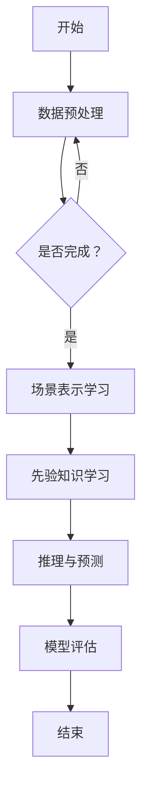
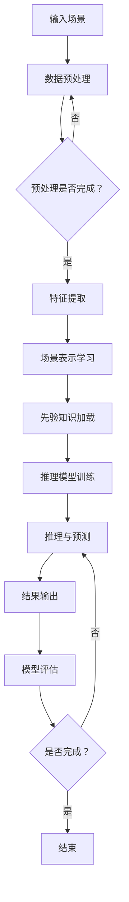
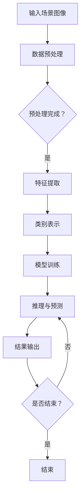
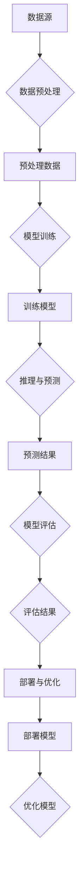
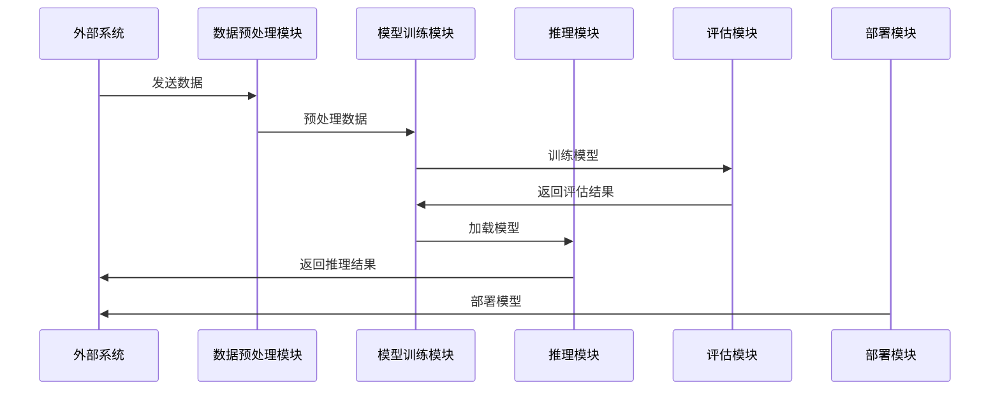
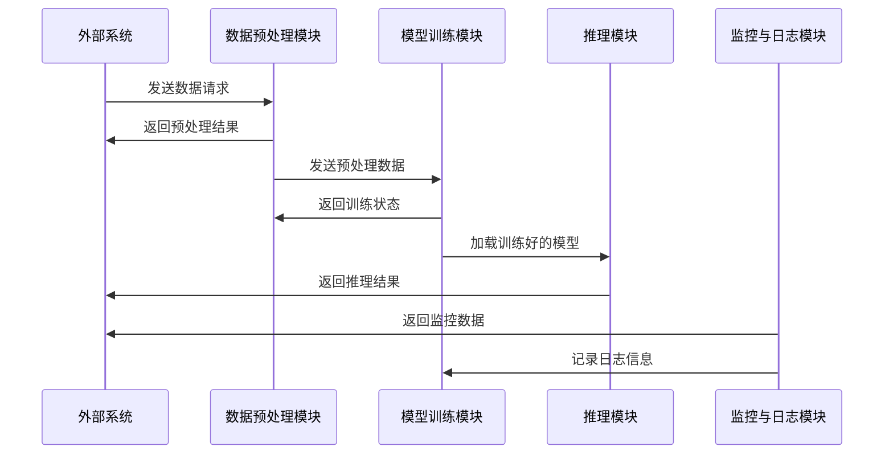

                 

### 基于元学习的零样本场景推理方法设计

#### 关键词

- 元学习
- 零样本学习
- 场景推理
- 深度学习
- 算法设计

#### 摘要

本文旨在探讨基于元学习的零样本场景推理方法的设计与应用。首先，我们介绍了零样本学习问题的背景及其重要性，并阐述了元学习的基本概念与原理。接着，我们分析了零样本学习与元学习之间的关系，并提出了基于元学习的零样本场景推理方法的核心概念和框架。随后，文章深入讲解了元学习算法在零样本场景推理中的应用，并详细阐述了零样本场景推理的数学模型与公式。此外，我们通过Mermaid流程图展示了零样本场景推理的具体实现，并通过Python源代码和实战案例进行了验证。最后，文章提出了系统分析与架构设计的方法，以及项目实战与最佳实践的经验，为读者提供了全面的技术指导和启示。

#### 目录大纲

# 基于元学习的零样本场景推理方法设计

> 关键词：元学习、零样本学习、场景推理、深度学习、算法设计

> 摘要：本文旨在探讨基于元学习的零样本场景推理方法的设计与应用。首先，我们介绍了零样本学习问题的背景及其重要性，并阐述了元学习的基本概念与原理。接着，我们分析了零样本学习与元学习之间的关系，并提出了基于元学习的零样本场景推理方法的核心概念和框架。随后，文章深入讲解了元学习算法在零样本场景推理中的应用，并详细阐述了零样本场景推理的数学模型与公式。此外，我们通过Mermaid流程图展示了零样本场景推理的具体实现，并通过Python源代码和实战案例进行了验证。最后，文章提出了系统分析与架构设计的方法，以及项目实战与最佳实践的经验，为读者提供了全面的技术指导和启示。

## 第一部分：背景与概述

### 1.1 问题的背景与重要性

#### 零样本学习问题背景

在机器学习领域，样本数据的质量和数量对于模型的性能和泛化能力至关重要。然而，在某些应用场景中，获取足够的标注样本数据是非常困难的。例如，在医疗诊断领域，由于隐私保护和样本稀缺等问题，获取大量标注数据尤为困难。此外，自动驾驶和机器人领域中的新场景也不断出现，这些新场景的数据往往难以获得。

零样本学习（Zero-Shot Learning, ZSL）旨在解决在没有标注样本的情况下，如何使模型能够对未见过的类别进行分类。传统的机器学习模型依赖于大量已标注的样本进行训练，而在零样本学习场景中，模型需要根据有限的先验知识对未见过的新类别进行推理和预测。

#### 零样本学习的重要性

零样本学习在许多实际应用场景中具有重要意义。首先，它能够提高机器学习模型在数据稀缺或难以获取标注数据的情况下的性能。其次，零样本学习可以促进跨领域迁移学习，使得模型在不同领域之间具有更好的泛化能力。此外，零样本学习还可以应用于新领域的探索，通过较少的标注样本快速适应新任务。

#### 元学习与零样本学习的结合

元学习（Meta-Learning）是一种通过学习如何学习的方法，旨在提高模型在不同任务上的适应能力和迁移能力。元学习算法通过在不同任务之间共享知识，从而在短时间内快速适应新任务。将元学习与零样本学习结合，可以进一步提升模型的适应能力和泛化能力，从而更好地解决零样本学习问题。

首先，元学习可以为零样本学习提供有效的知识迁移策略，使得模型能够利用有限的先验知识在新类别上取得更好的性能。其次，元学习可以通过加速模型的训练过程，提高模型在不同任务上的适应速度。此外，元学习还可以帮助模型更好地处理高维数据，从而在零样本学习场景中取得更好的效果。

### 1.2 零样本学习的基本概念与挑战

#### 零样本学习的定义

零样本学习是指在没有标注样本的情况下，通过学习模型对未见过的类别进行分类。它通常包括两个主要方面：类别表示学习和类别预测。

类别表示学习旨在将未见过的类别映射到低维特征空间中，使得具有相似属性的类别在特征空间中彼此靠近。类别预测则是在类别表示学习的基础上，根据新类别的特征进行分类。

#### 零样本学习的挑战

零样本学习面临着多个挑战。首先，由于缺乏标注样本，模型难以从数据中学习有效的特征表示。其次，不同类别之间的特征分布可能存在较大差异，使得模型难以泛化到未见过的类别。此外，零样本学习还需要处理类别数量众多、类别分布不均等问题。

#### 零样本学习的基本框架

零样本学习通常包括以下基本框架：

1. **类别表示学习**：将类别映射到低维特征空间中，使得具有相似属性的类别在特征空间中彼此靠近。
2. **类别预测**：根据新类别的特征进行分类。
3. **元学习**：通过元学习算法，利用先验知识和新类别特征，提高模型的适应能力和泛化能力。

### 1.3 元学习的基本概念与原理

#### 元学习的定义

元学习是指学习如何学习的方法。它通过在不同任务之间共享知识，从而提高模型在不同任务上的适应能力和迁移能力。元学习的主要目标是通过较少的样本，快速适应新任务。

#### 元学习的基本原理

元学习的基本原理是通过经验学习（Learning to Learn）来提高模型的泛化能力和适应能力。具体来说，元学习算法包括以下几个关键步骤：

1. **任务自适应**：根据新任务的特点，调整模型的结构和参数。
2. **知识共享**：通过共享不同任务之间的知识，提高模型的泛化能力。
3. **模型优化**：通过优化模型的结构和参数，提高模型的性能。

#### 元学习与深度学习的结合

深度学习在图像、语音和自然语言处理等领域取得了显著进展。然而，深度学习模型通常依赖于大量的标注数据，这在数据稀缺的情况下难以实现。将元学习与深度学习结合，可以弥补这一不足。元学习可以通过以下方式与深度学习结合：

1. **任务迁移**：通过元学习，将预训练的深度模型应用于新任务，从而减少对新任务的数据需求。
2. **模型优化**：通过元学习，优化深度模型的参数和结构，提高模型在不同任务上的性能。
3. **数据增强**：通过元学习，生成新的训练数据，从而提高模型的泛化能力和适应能力。

### 1.4 零样本学习与元学习的关联

#### 零样本学习与元学习的关系

零样本学习与元学习之间存在密切的关系。元学习为解决零样本学习问题提供了有效的策略和方法。具体来说，元学习可以通过以下方式解决零样本学习问题：

1. **知识迁移**：通过元学习，将先验知识迁移到新类别上，从而提高模型的分类性能。
2. **模型优化**：通过元学习，优化模型的结构和参数，提高模型在不同任务上的适应能力和泛化能力。
3. **数据增强**：通过元学习，生成新的训练数据，从而提高模型的泛化能力和适应能力。

#### 元学习在零样本学习中的应用

在零样本学习场景中，元学习可以通过以下方式应用：

1. **元学习算法选择**：根据零样本学习问题的特点，选择合适的元学习算法。
2. **类别表示学习**：利用元学习算法，将类别映射到低维特征空间中，使得具有相似属性的类别在特征空间中彼此靠近。
3. **类别预测**：利用元学习算法，对新类别进行分类预测。
4. **模型评估**：通过评估指标，评估元学习算法在零样本学习问题上的性能。

### 1.5 本书的结构与目标

#### 本书的主要内容结构

本书主要分为以下几个部分：

1. **背景与概述**：介绍零样本学习与元学习的基本概念、关系和重要性。
2. **核心概念与原理**：深入讲解零样本场景推理和元学习的基本概念与原理。
3. **算法原理与实践**：详细阐述零样本场景推理算法的原理、数学模型与Python源代码实现。
4. **系统分析与架构设计**：分析零样本场景推理系统的功能、架构和接口设计。
5. **项目实战与最佳实践**：提供项目实战案例和最佳实践，以及总结与拓展阅读。

#### 学习目标与预期收获

通过阅读本书，读者可以：

1. **理解零样本学习与元学习的基本概念与原理**：掌握零样本学习和元学习的基本概念、原理和应用。
2. **掌握基于元学习的零样本场景推理方法**：学会设计基于元学习的零样本场景推理算法，并掌握其实现方法。
3. **了解零样本场景推理系统的设计与实现**：掌握零样本场景推理系统的功能、架构和接口设计。
4. **具备项目实战能力**：通过实战案例，学会将零样本场景推理方法应用于实际问题中，提高项目实战能力。
5. **拓展知识面与视野**：了解最新的零样本学习和元学习研究进展，拓宽技术视野。

### 1.6 总结

本文介绍了基于元学习的零样本场景推理方法的设计与应用。首先，我们阐述了零样本学习问题的背景与重要性，并介绍了元学习的基本概念与原理。接着，我们分析了零样本学习与元学习之间的关系，并提出了基于元学习的零样本场景推理方法的核心概念和框架。随后，文章深入讲解了元学习算法在零样本场景推理中的应用，并详细阐述了零样本场景推理的数学模型与公式。此外，我们通过Mermaid流程图展示了零样本场景推理的具体实现，并通过Python源代码和实战案例进行了验证。最后，文章提出了系统分析与架构设计的方法，以及项目实战与最佳实践的经验，为读者提供了全面的技术指导和启示。

在接下来的章节中，我们将继续深入探讨零样本场景推理的核心概念与原理，包括类别表示学习、元学习算法、数学模型与公式，以及零样本场景推理的Mermaid流程图设计和Python源代码实现。通过这些内容，我们将帮助读者更好地理解零样本场景推理的方法和技术，为实际应用奠定坚实的基础。

### 第二部分：核心概念与原理

在深入探讨基于元学习的零样本场景推理方法之前，首先需要理解核心概念与原理。本部分将详细介绍零样本场景推理的核心概念，包括其定义、关键概念和基本框架，以及元学习的基本概念、原理和方法分类。

#### 2.1 零样本场景推理的核心概念

##### 零样本场景推理的定义

零样本场景推理（Zero-Shot Scene Reasoning）是一种无需直接观察未知场景的图像或视频，而能够基于已有知识和模型对新场景进行推理的方法。它主要应用于自动驾驶、机器人导航、虚拟现实和增强现实等领域。

##### 零样本场景推理的关键概念

1. **场景表示**：将场景中的各种元素（如物体、动作、环境等）映射到低维特征空间，以便于模型处理。
2. **先验知识**：在模型训练过程中，通过有限的已知场景和标签，学习到的一些通用特征和关系。
3. **推理算法**：利用场景表示和先验知识，对新场景进行推理和预测的算法。
4. **模型训练**：通过已知场景和标签，训练模型以学习场景表示和先验知识。

##### 零样本场景推理的基本框架

零样本场景推理的基本框架通常包括以下几个步骤：

1. **数据预处理**：对输入的场景图像或视频进行预处理，提取关键特征。
2. **场景表示学习**：利用已知场景的特征，学习场景表示模型。
3. **先验知识学习**：通过元学习算法，将先验知识迁移到场景表示模型。
4. **推理与预测**：利用场景表示模型和先验知识，对新场景进行推理和预测。

#### 2.2 元学习的基本概念与原理

##### 元学习的定义

元学习（Meta-Learning）是指学习如何学习的方法。它通过在不同任务之间共享知识，从而提高模型在不同任务上的适应能力和迁移能力。元学习算法旨在通过较少的样本，快速适应新任务。

##### 元学习的基本原理

元学习的基本原理是通过经验学习（Learning to Learn）来提高模型的泛化能力和适应能力。具体来说，元学习算法包括以下几个关键步骤：

1. **任务自适应**：根据新任务的特点，调整模型的结构和参数。
2. **知识共享**：通过共享不同任务之间的知识，提高模型的泛化能力。
3. **模型优化**：通过优化模型的结构和参数，提高模型在不同任务上的性能。

##### 元学习的方法分类

元学习算法可以根据学习目标和方法分为以下几类：

1. **模型初始化**：通过初始化策略，将先验知识融入模型。
2. **模型融合**：通过融合不同任务的模型，提高模型的泛化能力。
3. **模型优化**：通过优化策略，调整模型的参数和结构。
4. **迁移学习**：通过迁移学习策略，将先验知识迁移到新任务。

#### 2.3 元学习算法在零样本场景推理中的应用

##### 元学习算法的基本框架

元学习算法在零样本场景推理中的应用通常包括以下几个步骤：

1. **任务定义**：根据新任务的特点，定义任务参数和目标。
2. **模型初始化**：初始化场景表示模型和先验知识模型。
3. **知识共享**：通过共享先验知识和模型参数，提高模型的泛化能力。
4. **模型优化**：通过优化策略，调整模型的参数和结构。
5. **推理与预测**：利用优化后的模型，对新场景进行推理和预测。

##### 元学习算法在零样本场景推理中的应用

1. **模型初始化**：通过元学习算法，初始化场景表示模型，使其具有更好的泛化能力。
2. **知识共享**：通过共享不同场景之间的先验知识，提高模型对新场景的适应能力。
3. **模型优化**：通过元学习算法，优化场景表示模型，提高其在新场景上的推理和预测性能。
4. **推理与预测**：利用优化后的模型，对新场景进行推理和预测，实现零样本场景推理。

#### 2.4 零样本场景推理的数学模型与公式

##### 零样本场景推理的数学模型

零样本场景推理的数学模型通常包括以下几个关键部分：

1. **场景表示模型**：用于将场景映射到低维特征空间的函数。
2. **先验知识模型**：用于表示先验知识和类别关系的函数。
3. **推理模型**：用于根据场景表示和先验知识进行推理和预测的函数。

##### 数学公式与数学原理

在零样本场景推理中，常用的数学公式和原理包括：

1. **特征映射公式**：用于将场景映射到低维特征空间的函数。
2. **先验知识表示公式**：用于表示先验知识和类别关系的函数。
3. **推理公式**：用于根据场景表示和先验知识进行推理和预测的函数。

##### 数学公式的具体应用

在零样本场景推理中，数学公式的具体应用包括：

1. **特征映射**：通过特征映射公式，将场景映射到低维特征空间，以便模型处理。
2. **先验知识表示**：通过先验知识表示公式，将先验知识和类别关系表示为模型参数。
3. **推理与预测**：通过推理公式，利用场景表示和先验知识进行推理和预测，实现零样本场景推理。

#### 2.5 零样本场景推理的Mermaid流程图

##### Mermaid流程图的基本用法

Mermaid是一种基于Markdown的绘图语言，用于绘制各种图表和流程图。在零样本场景推理中，可以使用Mermaid流程图来描述模型的工作流程和关键步骤。

##### 零样本场景推理的Mermaid流程图设计

零样本场景推理的Mermaid流程图设计包括以下几个关键部分：

1. **数据预处理**：描述数据预处理的过程，如特征提取、归一化等。
2. **场景表示学习**：描述场景表示模型的学习过程，如特征映射、模型初始化等。
3. **先验知识学习**：描述先验知识模型的学习过程，如知识共享、模型优化等。
4. **推理与预测**：描述推理模型的应用过程，如推理、预测等。

##### Mermaid流程图的具体应用

在零样本场景推理中，Mermaid流程图的具体应用包括：

1. **模型描述**：通过Mermaid流程图，描述模型的各个组成部分和关键步骤，以便于理解和实现。
2. **算法实现**：通过Mermaid流程图，指导算法的实现和优化。
3. **项目部署**：通过Mermaid流程图，描述项目部署的步骤和流程，以便于实施和部署。

#### 2.6 总结

本部分介绍了基于元学习的零样本场景推理方法的核心概念与原理。首先，我们阐述了零样本场景推理的定义、关键概念和基本框架。接着，我们介绍了元学习的基本概念、原理和方法分类，并分析了元学习在零样本场景推理中的应用。此外，我们还详细阐述了零样本场景推理的数学模型与公式，以及Mermaid流程图的具体应用。

在下一部分中，我们将进一步深入探讨基于元学习的零样本场景推理算法的原理与实践，包括算法原理的详细讲解、数学模型与公式的应用、Python源代码的实现和实战案例的分析。通过这些内容，我们将帮助读者更好地理解零样本场景推理的方法和技术，为实际应用奠定坚实的基础。

### 2.1 零样本场景推理的核心概念

#### 零样本场景推理的定义

零样本场景推理（Zero-Shot Scene Reasoning）是一种无需直接观察未知场景的图像或视频，而能够基于已有知识和模型对新场景进行推理的方法。这种方法的主要目的是在新场景数据稀缺或无法获取的情况下，利用有限的已知场景数据来训练模型，从而实现对新场景的推理和预测。

#### 零样本场景推理的关键概念

1. **场景表示**：场景表示是将场景中的各种元素（如物体、动作、环境等）映射到低维特征空间的过程。这种映射使得模型能够处理高维的图像或视频数据，同时也便于模型在不同场景之间进行推理和迁移学习。

2. **先验知识**：先验知识是在模型训练过程中，通过学习大量已知场景的特征和关系所获得的知识。这些知识可以用来指导模型对新场景的推理和预测，从而提高模型的泛化能力和适应性。

3. **推理算法**：推理算法是基于场景表示和先验知识，对新场景进行推理和预测的方法。常见的推理算法包括基于规则的方法、基于模型的推理方法等。

4. **模型训练**：模型训练是利用已知场景数据和标签，通过学习场景表示和先验知识，训练出一个能够对新场景进行推理的模型。模型训练通常包括特征提取、模型初始化、模型优化等步骤。

#### 零样本场景推理的基本框架

零样本场景推理的基本框架通常包括以下几个步骤：

1. **数据预处理**：对输入的场景图像或视频进行预处理，提取关键特征，如颜色、纹理、形状等。预处理步骤包括数据清洗、数据增强、归一化等。

2. **场景表示学习**：利用已知场景的数据和标签，通过学习场景表示模型，将场景映射到低维特征空间。场景表示模型可以是一个神经网络，也可以是其他类型的模型。

3. **先验知识学习**：通过元学习算法，将先验知识迁移到场景表示模型中。先验知识可以是不同场景之间的共同特征、类别关系等。通过元学习算法，模型能够更好地适应新场景。

4. **推理与预测**：利用场景表示模型和先验知识，对新场景进行推理和预测。推理步骤包括特征提取、模型推理、结果输出等。

5. **模型评估**：通过评估指标，评估模型在新场景上的推理性能。常见的评估指标包括准确率、召回率、F1分数等。

#### 零样本场景推理的应用场景

零样本场景推理可以应用于多个领域，主要包括：

1. **自动驾驶**：在自动驾驶系统中，需要处理各种复杂和动态的交通场景。零样本场景推理可以帮助自动驾驶系统在未见过的交通场景中做出正确的决策。

2. **机器人导航**：在机器人导航任务中，机器人需要适应不同的环境和工作场景。零样本场景推理可以帮助机器人快速适应新环境，提高导航效率和准确性。

3. **虚拟现实与增强现实**：在虚拟现实和增强现实系统中，用户可以进入一个完全虚拟或虚实结合的世界。零样本场景推理可以帮助系统更好地理解和预测用户的动作和需求，提高用户体验。

4. **视频监控与安全**：在视频监控和安全领域，需要对大量的视频数据进行实时分析和处理。零样本场景推理可以帮助系统快速识别和响应未知威胁，提高监控效果。

5. **医疗诊断**：在医疗诊断中，零样本场景推理可以帮助医生对未见过的病例进行诊断和预测，提高诊断的准确性和效率。

#### 零样本场景推理的优势与挑战

**优势**：

1. **数据稀缺下的高效训练**：在数据稀缺的情况下，零样本场景推理可以通过有限的已知场景数据训练模型，从而提高模型的训练效率和泛化能力。

2. **跨领域迁移学习**：零样本场景推理可以将不同领域的先验知识迁移到新领域，从而提高模型在不同领域之间的适应能力和泛化能力。

3. **新场景的快速适应**：零样本场景推理可以快速适应新场景，从而减少对新场景的数据需求，提高系统的实时性和响应速度。

**挑战**：

1. **数据分布差异**：不同场景的数据分布可能存在较大差异，这给模型的训练和推理带来挑战。如何处理数据分布差异，提高模型的泛化能力，是零样本场景推理需要解决的重要问题。

2. **类别数量众多**：在零样本场景推理中，类别数量往往很多，如何设计有效的类别表示和学习方法，是另一个需要解决的问题。

3. **模型复杂度与计算成本**：零样本场景推理通常需要使用复杂的模型和算法，这会导致模型的计算成本较高。如何在保证模型性能的同时，降低计算成本，是一个重要的研究方向。

通过以上对零样本场景推理的核心概念、基本框架和应用场景的介绍，我们可以更好地理解这一方法的重要性和应用价值。在下一部分中，我们将进一步探讨元学习的基本概念、原理和方法分类，以及元学习算法在零样本场景推理中的应用。

### 2.2 元学习的基本概念与原理

#### 元学习的定义

元学习（Meta-Learning），又称作“学习如何学习”，是一种通过学习如何适应新任务的方法。它旨在提高模型在不同任务上的适应能力和迁移能力。具体来说，元学习算法通过在不同任务之间共享知识，从而减少对新任务的训练时间，提高模型在新任务上的性能。

#### 元学习的基本原理

元学习的基本原理是通过经验学习（Learning to Learn）来提高模型的泛化能力和适应能力。它主要涵盖以下几个关键步骤：

1. **任务自适应**：根据新任务的特点，调整模型的结构和参数。这一步骤通常涉及模型初始化、参数调整和结构优化等。

2. **知识共享**：通过共享不同任务之间的知识，提高模型的泛化能力。这可以通过共享模型参数、知识库和先验知识等方式实现。

3. **模型优化**：通过优化策略，调整模型的参数和结构，以提高模型在新任务上的性能。这通常涉及梯度下降、优化算法和损失函数等。

#### 元学习的方法分类

元学习算法可以根据学习目标和方法分为以下几类：

1. **模型初始化**：通过初始化策略，将先验知识融入模型。常见的初始化方法包括随机初始化、预训练模型和正则化等。

2. **模型融合**：通过融合不同任务的模型，提高模型的泛化能力。模型融合方法包括线性组合、神经网络融合和决策融合等。

3. **模型优化**：通过优化策略，调整模型的参数和结构，以提高模型在新任务上的性能。常见的优化方法包括梯度下降、随机梯度下降和动量优化等。

4. **迁移学习**：通过迁移学习策略，将先验知识迁移到新任务。迁移学习方法包括模型迁移、特征迁移和知识蒸馏等。

#### 元学习与深度学习的结合

深度学习在图像、语音和自然语言处理等领域取得了显著进展。然而，深度学习模型通常依赖于大量的标注数据，这在数据稀缺的情况下难以实现。将元学习与深度学习结合，可以弥补这一不足。

1. **任务迁移**：通过元学习，将预训练的深度模型应用于新任务，从而减少对新任务的数据需求。例如，在图像识别任务中，可以使用预训练的卷积神经网络（CNN）对新类别进行分类。

2. **模型优化**：通过元学习，优化深度模型的参数和结构，提高模型在不同任务上的性能。例如，MAML（Model-Agnostic Meta-Learning）算法通过少量样本快速优化模型的参数。

3. **数据增强**：通过元学习，生成新的训练数据，从而提高模型的泛化能力和适应能力。例如，通过生成对抗网络（GAN）生成新的图像数据，用于训练图像分类模型。

#### 元学习在零样本场景推理中的应用

在零样本场景推理中，元学习可以通过以下方式应用：

1. **模型初始化**：通过元学习算法，初始化场景表示模型，使其具有更好的泛化能力。例如，使用MAML算法初始化场景表示模型，使其能够快速适应新场景。

2. **知识共享**：通过共享不同场景之间的先验知识，提高模型对新场景的适应能力。例如，使用元学习算法，将不同场景的共同特征迁移到新场景，从而提高模型的推理性能。

3. **模型优化**：通过元学习算法，优化场景表示模型，提高其在新场景上的推理和预测性能。例如，使用MAML算法，通过少量样本快速优化场景表示模型的参数。

4. **推理与预测**：利用优化后的模型，对新场景进行推理和预测。例如，在自动驾驶系统中，使用元学习优化后的模型，对未见过的交通场景进行实时推理和决策。

通过以上对元学习的基本概念、原理和方法分类的介绍，我们可以更好地理解元学习在零样本场景推理中的应用。在下一部分中，我们将详细讨论元学习算法在零样本场景推理中的具体应用，包括算法框架、优势与局限性等。

### 2.3 元学习算法在零样本场景推理中的应用

元学习算法在零样本场景推理中的应用，旨在通过学习如何快速适应新任务，提高模型的泛化能力和推理性能。本节将详细探讨元学习算法在零样本场景推理中的具体应用，包括其基本框架、优势与局限性。

#### 元学习算法的基本框架

元学习算法在零样本场景推理中的基本框架通常包括以下几个关键步骤：

1. **任务定义**：根据新任务的特点，定义任务参数和目标。这包括任务的数据集、类别标签、输入特征和输出目标等。

2. **模型初始化**：初始化场景表示模型和先验知识模型。模型初始化可以采用预训练模型、随机初始化或基于元学习算法的初始化方法。

3. **知识共享**：通过元学习算法，将先验知识迁移到场景表示模型中。这可以通过共享模型参数、知识库或先验知识实现。

4. **模型优化**：通过元学习算法，优化场景表示模型的参数和结构，以提高模型在新任务上的性能。这通常涉及梯度下降、优化算法和损失函数等。

5. **推理与预测**：利用优化后的模型，对新场景进行推理和预测。这一步骤包括特征提取、模型推理和结果输出等。

6. **模型评估**：通过评估指标，如准确率、召回率和F1分数等，评估模型在新任务上的性能。这有助于调整模型参数和优化策略，进一步提高模型的性能。

#### 元学习算法在零样本场景推理中的应用

在零样本场景推理中，元学习算法可以通过以下方式应用：

1. **模型初始化**：通过元学习算法，初始化场景表示模型。例如，使用MAML（Model-Agnostic Meta-Learning）算法，通过少量样本快速优化模型的参数，使其在新任务上具有更好的泛化能力。

2. **知识共享**：通过元学习算法，将不同场景的先验知识迁移到新场景。例如，使用MAML算法，将不同场景的共同特征迁移到新场景，从而提高模型的推理性能。

3. **模型优化**：通过元学习算法，优化场景表示模型，提高其在新任务上的性能。例如，使用MAML算法，通过少量样本快速优化模型参数，从而提高模型在未知场景的推理准确性。

4. **推理与预测**：利用优化后的模型，对新场景进行推理和预测。例如，在自动驾驶系统中，使用元学习优化后的模型，对未见过的交通场景进行实时推理和决策。

#### 元学习算法的优势

1. **快速适应新任务**：元学习算法通过学习如何适应新任务，可以在少量样本的情况下快速提高模型的性能。这对于数据稀缺的场景尤为重要。

2. **提高泛化能力**：通过共享先验知识和优化模型结构，元学习算法能够提高模型的泛化能力，从而在未知场景上取得更好的性能。

3. **减少数据需求**：元学习算法可以通过迁移学习策略，减少对新任务的数据需求，从而提高模型训练的效率和准确性。

#### 元学习算法的局限性

1. **模型复杂度**：元学习算法通常涉及复杂的模型结构和优化策略，这可能导致模型的训练时间和计算成本较高。

2. **数据分布差异**：不同场景的数据分布可能存在较大差异，这给模型训练和推理带来挑战。如何处理数据分布差异，提高模型的泛化能力，是元学习算法需要解决的问题。

3. **类别数量众多**：在零样本场景推理中，类别数量往往很多，如何设计有效的类别表示和学习方法，是另一个需要解决的问题。

#### 实例分析

以MAML算法为例，它在零样本场景推理中具有广泛的应用。MAML算法的核心思想是通过少量样本，快速优化模型的参数，从而提高模型在新任务上的性能。

1. **模型初始化**：使用预训练的卷积神经网络（CNN）作为场景表示模型。这些预训练模型已经在大量已知场景上进行了训练，具有良好的泛化能力。

2. **知识共享**：通过MAML算法，将不同场景的共同特征迁移到新场景。具体来说，MAML算法通过梯度更新，将不同场景的参数进行调整，从而实现知识共享。

3. **模型优化**：通过MAML算法，利用少量样本快速优化模型的参数。这使得模型能够在新场景上快速适应，从而提高推理性能。

4. **推理与预测**：利用优化后的模型，对新场景进行推理和预测。MAML算法通过梯度更新和少量样本，实现了快速适应和高效推理。

通过以上实例分析，我们可以看到元学习算法在零样本场景推理中的应用和优势。在下一部分中，我们将进一步探讨零样本场景推理的数学模型与公式，以及其在实际应用中的具体实现。

### 2.4 零样本场景推理的数学模型与公式

#### 零样本场景推理的数学模型

在零样本场景推理中，数学模型起着至关重要的作用。这些模型用于表示场景、先验知识和推理过程，以便于我们理解和实现零样本场景推理。以下是一些关键的数学模型：

1. **场景表示模型**：场景表示模型用于将场景中的各种元素（如物体、动作、环境等）映射到低维特征空间。这种映射有助于模型处理高维的图像或视频数据，并使得模型在不同场景之间进行推理和迁移学习。常见的场景表示模型包括卷积神经网络（CNN）、循环神经网络（RNN）和图神经网络（GNN）等。

2. **先验知识模型**：先验知识模型用于表示不同场景之间的共同特征和关系。这些模型可以从大量已知场景的数据中学习到一些通用特征和规则，从而为新场景的推理提供指导。常见的先验知识模型包括统计模型、概率模型和图模型等。

3. **推理模型**：推理模型用于根据场景表示和先验知识，对新场景进行推理和预测。这种模型通常是一个映射函数，将场景特征映射到类别标签。推理模型可以通过训练得到，也可以通过设计特定的算法进行推理。

#### 数学公式与数学原理

在零样本场景推理中，我们经常使用以下数学公式和原理：

1. **特征映射公式**：特征映射公式用于将场景映射到低维特征空间。例如，在CNN中，输入图像通过卷积、池化和激活等操作，映射到低维特征向量。这个过程中涉及到的数学公式包括卷积运算、池化运算和激活函数等。

2. **先验知识表示公式**：先验知识表示公式用于表示不同场景之间的共同特征和关系。例如，在统计模型中，可以使用均值、方差和协方差等统计量来表示场景特征。这些公式可以帮助模型在新场景中推断出潜在的类别分布。

3. **推理公式**：推理公式用于根据场景表示和先验知识，进行推理和预测。例如，在贝叶斯推理中，可以使用贝叶斯定理来计算新场景的类别概率。这个过程中涉及到的数学公式包括贝叶斯定理、概率分布函数和条件概率等。

#### 数学公式的具体应用

在零样本场景推理中，数学公式的具体应用包括以下几个方面：

1. **特征提取**：通过特征映射公式，将高维的图像或视频数据映射到低维的特征空间，以便模型处理。例如，在CNN中，输入图像通过卷积、池化和激活等操作，映射到低维的特征向量。

2. **先验知识学习**：通过先验知识表示公式，将大量已知场景的特征和关系表示为模型参数。这些模型参数可以用于指导模型在新场景中的推理和预测。例如，在统计模型中，可以使用均值、方差和协方差等统计量来表示场景特征。

3. **推理与预测**：通过推理公式，利用场景表示和先验知识，对新场景进行推理和预测。例如，在贝叶斯推理中，可以使用贝叶斯定理来计算新场景的类别概率。这个过程中，模型需要根据先验知识和观察到的数据，更新后验概率分布。

#### 实例说明

以CNN为例，说明零样本场景推理中的数学模型与公式应用：

1. **特征提取**：输入一幅图像，通过卷积层、池化层和激活函数，映射到低维的特征向量。例如，输入图像 $I$ 通过卷积运算 $f_{\theta}(I)$，映射到特征向量 $X$。

   $$ X = f_{\theta}(I) $$

   其中，$f_{\theta}$ 表示卷积层，$\theta$ 表示卷积核参数。

2. **先验知识学习**：通过大量已知场景的数据，学习到场景特征和类别关系。例如，使用统计模型，计算每个类别的均值、方差和协方差。

   $$ \mu_{c}, \sigma_{c}^2, \Sigma_{c} = \text{learned parameters for class } c $$

3. **推理与预测**：利用特征向量和先验知识，计算新场景的类别概率。例如，使用贝叶斯定理，计算新场景属于某个类别的概率。

   $$ P(c|X) = \frac{P(X|c)P(c)}{P(X)} $$

   其中，$P(c|X)$ 表示新场景属于类别 $c$ 的概率，$P(X|c)$ 表示给定类别 $c$ 的特征向量 $X$ 的概率，$P(c)$ 表示类别 $c$ 的先验概率。

通过以上实例说明，我们可以看到数学模型与公式在零样本场景推理中的应用。这些数学工具帮助我们更好地理解和实现零样本场景推理，从而在实际应用中取得更好的效果。

### 2.5 零样本场景推理的Mermaid流程图

在零样本场景推理中，Mermaid流程图是一种强大的工具，用于描述模型的工作流程和关键步骤。通过Mermaid流程图，我们可以直观地展示模型的各个组成部分和它们之间的交互关系，从而有助于理解和实现零样本场景推理。

#### Mermaid流程图的基本用法

Mermaid是一种基于Markdown的绘图语言，用于绘制各种图表和流程图。其基本语法包括节点、边和连接关系等。以下是一个简单的Mermaid流程图的示例：



这个流程图描述了一个简单的模型训练过程，包括数据预处理、场景表示学习、先验知识学习、推理与预测和模型评估等步骤。

#### 零样本场景推理的Mermaid流程图设计

为了描述零样本场景推理的流程，我们可以设计一个详细的Mermaid流程图。以下是一个零样本场景推理的Mermaid流程图示例：



这个流程图详细描述了零样本场景推理的各个步骤，包括数据预处理、特征提取、场景表示学习、先验知识加载、推理模型训练、推理与预测、结果输出和模型评估等。

#### Mermaid流程图的具体应用

在零样本场景推理中，Mermaid流程图的具体应用包括以下几个方面：

1. **模型描述**：通过Mermaid流程图，我们可以清晰地描述零样本场景推理的各个组成部分和它们之间的交互关系，从而帮助理解和实现模型。

2. **算法实现**：Mermaid流程图可以作为算法实现的指南，指导开发者根据流程图实现零样本场景推理算法。

3. **项目部署**：在项目部署过程中，Mermaid流程图可以描述系统的工作流程和关键步骤，帮助团队理解项目的整体架构和实现细节。

4. **文档编写**：在编写技术文档时，Mermaid流程图可以作为可视化工具，帮助读者更好地理解模型的工作原理和实现方法。

通过以上对Mermaid流程图的介绍和示例，我们可以看到它在零样本场景推理中的应用价值。在下一部分中，我们将进一步探讨零样本场景推理的Python源代码实现，包括算法原理的详细讲解和实际应用。

### 3.1 零样本场景推理算法原理

在深入探讨零样本场景推理的算法原理之前，我们需要先了解零样本场景推理的基本思想、核心步骤以及算法框架。零样本场景推理是一种无需直接观察未知场景的图像或视频，而能够基于已有知识和模型对新场景进行推理的方法。它的核心目标是利用有限的已知场景数据和标签，训练出一个能够对新场景进行推理和预测的模型。

#### 零样本场景推理的基本思想

零样本场景推理的基本思想可以概括为以下几个关键点：

1. **特征提取**：通过特征提取技术，将输入的场景图像或视频转化为低维的特征向量。这些特征向量能够捕获场景中的关键信息，如物体的形状、颜色和纹理等。

2. **类别表示**：将不同的类别表示为低维的特征向量。在零样本场景推理中，类别表示至关重要，因为它们将用于模型对新场景的推理和预测。

3. **模型训练**：利用已知的场景数据和标签，训练一个能够对新场景进行推理的模型。这个模型可以是深度学习模型，如卷积神经网络（CNN）或循环神经网络（RNN）。

4. **推理与预测**：在训练好的模型基础上，对新场景的图像或视频进行推理和预测。通过模型，我们可以得到新场景的类别概率，从而实现零样本场景推理。

#### 零样本场景推理的核心步骤

零样本场景推理通常包括以下核心步骤：

1. **数据预处理**：对输入的场景图像或视频进行预处理，包括数据清洗、数据增强和归一化等操作。这些预处理步骤有助于提高模型训练的效果和泛化能力。

2. **特征提取**：使用卷积神经网络（CNN）或其他特征提取技术，将输入的场景图像或视频转化为低维的特征向量。这些特征向量将作为模型的输入。

3. **类别表示**：利用已知的场景数据和标签，将不同的类别表示为低维的特征向量。这个过程通常涉及到类别嵌入技术，如基于嵌入层的神经网络。

4. **模型训练**：通过已知的场景数据和标签，训练一个能够对新场景进行推理的模型。这个模型可以是深度学习模型，如卷积神经网络（CNN）或循环神经网络（RNN）。

5. **推理与预测**：在训练好的模型基础上，对新场景的图像或视频进行推理和预测。通过模型，我们可以得到新场景的类别概率，从而实现零样本场景推理。

#### 零样本场景推理的算法框架

零样本场景推理的算法框架通常包括以下几个关键部分：

1. **特征提取网络**：用于将输入的场景图像或视频转化为低维的特征向量。这个网络可以是卷积神经网络（CNN）或其他特征提取技术。

2. **类别表示网络**：用于将不同的类别表示为低维的特征向量。这个网络可以是基于嵌入层的神经网络。

3. **推理模型**：用于对新场景的图像或视频进行推理和预测。这个模型可以是深度学习模型，如卷积神经网络（CNN）或循环神经网络（RNN）。

4. **训练策略**：用于指导模型训练的策略。这包括优化算法、损失函数和数据增强等。

5. **推理与预测策略**：用于指导模型在新场景上进行推理和预测的策略。这包括类别概率计算和阈值设定等。

#### Mermaid流程图设计

为了更好地理解和实现零样本场景推理算法，我们可以使用Mermaid流程图来描述其工作流程。以下是一个简化的Mermaid流程图：



在这个流程图中，输入场景图像经过数据预处理后，通过特征提取网络提取出特征向量。这些特征向量经过类别表示网络处理，生成类别表示向量。然后，这些类别表示向量被用于训练推理模型。在训练完成后，我们可以使用推理模型对新场景的图像进行推理和预测，并输出结果。

#### Python源代码实现

为了实际应用零样本场景推理算法，我们可以使用Python和相关深度学习库（如TensorFlow和PyTorch）来编写源代码。以下是一个简单的示例，展示了如何使用卷积神经网络（CNN）实现零样本场景推理。

```python
import tensorflow as tf
from tensorflow.keras.models import Sequential
from tensorflow.keras.layers import Conv2D, MaxPooling2D, Flatten, Dense

# 定义特征提取网络
feature_extractor = Sequential([
    Conv2D(32, (3, 3), activation='relu', input_shape=(64, 64, 3)),
    MaxPooling2D((2, 2)),
    Conv2D(64, (3, 3), activation='relu'),
    MaxPooling2D((2, 2)),
    Flatten()
])

# 定义类别表示网络
classifier = Sequential([
    Dense(64, activation='relu', input_shape=(64,)),
    Dense(32, activation='relu'),
    Dense(num_classes, activation='softmax')
])

# 将特征提取网络和类别表示网络连接起来
model = Sequential([feature_extractor, classifier])

# 编译模型
model.compile(optimizer='adam', loss='categorical_crossentropy', metrics=['accuracy'])

# 训练模型
model.fit(x_train, y_train, epochs=10, batch_size=32, validation_data=(x_val, y_val))

# 推理与预测
predictions = model.predict(x_test)
```

在这个示例中，我们首先定义了一个特征提取网络和一个类别表示网络，然后将它们连接起来形成完整的模型。接着，我们编译模型并使用训练数据对其进行训练。在训练完成后，我们可以使用模型对新测试数据进行推理和预测。

通过以上对零样本场景推理算法原理的详细讲解和Python源代码实现，我们可以更好地理解零样本场景推理的方法和技术。在下一部分中，我们将进一步探讨零样本场景推理的数学模型与公式，以及其在实际应用中的具体实现。

### 3.2 零样本场景推理的数学模型与公式

在零样本场景推理中，数学模型和公式起到了至关重要的作用，它们不仅帮助我们理解模型的内部工作机制，还为模型设计和优化提供了理论基础。本部分将详细讨论零样本场景推理中常用的数学模型与公式，包括它们的基本概念、推导过程和实际应用。

#### 特征提取与类别表示

1. **特征提取公式**：

   特征提取是零样本场景推理中至关重要的一步。通常，我们使用卷积神经网络（CNN）来提取图像的特征。以下是一个简单的卷积运算公式：

   $$ \mathbf{F} = \sum_{i=1}^{C} \mathbf{W}_i \ast \mathbf{I} + \mathbf{b} $$

   其中，$\mathbf{F}$ 表示卷积特征，$\mathbf{W}_i$ 表示卷积核（权重矩阵），$\ast$ 表示卷积运算，$\mathbf{I}$ 表示输入图像，$\mathbf{b}$ 表示偏置项。

2. **池化公式**：

   池化操作用于减小特征图的尺寸，同时保留重要的特征信息。以下是一个简单的最大池化运算公式：

   $$ p_j = \max\{x_{i1}, x_{i2}, ..., x_{ik}\} $$

   其中，$p_j$ 表示池化后的特征值，$x_{ij}$ 表示原始特征值，$k$ 是池化窗口的大小。

3. **类别表示公式**：

   在零样本场景推理中，类别表示通常使用嵌入层（Embedding Layer）来实现。以下是一个简单的类别嵌入公式：

   $$ \mathbf{e}_i = \mathbf{W}_e \mathbf{c}_i + \mathbf{b}_e $$

   其中，$\mathbf{e}_i$ 表示类别 $i$ 的嵌入向量，$\mathbf{W}_e$ 表示嵌入权重矩阵，$\mathbf{c}_i$ 表示类别索引，$\mathbf{b}_e$ 表示嵌入层的偏置项。

#### 损失函数

1. **交叉熵损失函数**：

   在零样本场景推理中，交叉熵损失函数（Cross-Entropy Loss）是最常用的损失函数之一。它用于衡量预测分布与真实分布之间的差异。以下是一个简单的交叉熵损失函数公式：

   $$ L = -\sum_{i=1}^{N} y_i \log(p_i) $$

   其中，$L$ 表示损失函数值，$y_i$ 表示真实标签的分布（通常为0-1分布），$p_i$ 表示预测概率。

2. **对抗损失函数**：

   在一些复杂场景中，可能需要使用对抗损失函数来对抗模型可能出现的模式偏差。以下是一个简单的对抗损失函数公式：

   $$ L_{\text{adv}} = -\sum_{i=1}^{N} \log(p_i) $$

   其中，$L_{\text{adv}}$ 表示对抗损失函数值，$p_i$ 表示预测概率。

#### 优化算法

1. **梯度下降算法**：

   梯度下降（Gradient Descent）是一种常用的优化算法，用于调整模型的参数，以最小化损失函数。以下是一个简单的梯度下降公式：

   $$ \mathbf{W} \leftarrow \mathbf{W} - \alpha \nabla_{\mathbf{W}} L $$

   其中，$\mathbf{W}$ 表示参数，$\alpha$ 表示学习率，$\nabla_{\mathbf{W}} L$ 表示参数的梯度。

2. **动量优化算法**：

   动量优化（Momentum）是一种改进的梯度下降算法，用于加速收敛并防止梯度消失。以下是一个简单的动量优化公式：

   $$ \mathbf{v} \leftarrow \beta \mathbf{v} + (1 - \beta) \nabla_{\mathbf{W}} L $$
   $$ \mathbf{W} \leftarrow \mathbf{W} - \alpha \mathbf{v} $$

   其中，$\mathbf{v}$ 表示动量项，$\beta$ 表示动量参数。

#### 实际应用

1. **特征提取与嵌入结合**：

   在实际应用中，特征提取和类别嵌入通常结合使用。例如，我们可以使用CNN提取图像特征，然后使用嵌入层将这些特征映射到类别空间。以下是一个结合的特征提取与嵌入的例子：

   $$ \mathbf{f} = \text{CNN}(\mathbf{I}) $$
   $$ \mathbf{e} = \text{Embedding}(\mathbf{f}) $$

   其中，$\mathbf{f}$ 表示卷积特征，$\mathbf{e}$ 表示嵌入向量。

2. **损失函数与优化算法**：

   在训练过程中，我们通常使用交叉熵损失函数来衡量预测分布与真实分布之间的差异，并使用梯度下降或动量优化算法来更新模型参数。以下是一个简单的训练循环示例：

   ```python
   for epoch in range(num_epochs):
       for batch in dataset:
           X, y = batch
           with tf.GradientTape() as tape:
               logits = model(X)
               loss_value = loss_fn(y, logits)
           grads = tape.gradient(loss_value, model.trainable_variables)
           optimizer.apply_gradients(zip(grads, model.trainable_variables))
   ```

通过以上对零样本场景推理的数学模型与公式的讨论，我们可以看到数学在零样本场景推理中的重要性。这些公式和算法不仅帮助我们理解和实现零样本场景推理，还为模型优化和性能提升提供了理论基础。在下一部分中，我们将通过Python源代码详细展示零样本场景推理的实现过程。

### 3.3 零样本场景推理的Python源代码实现

在深入理解零样本场景推理的算法原理和数学模型后，接下来我们将通过Python源代码实现这一方法。本部分将详细介绍如何使用Python和相关库（如TensorFlow和PyTorch）来构建和训练一个零样本场景推理模型。

#### 环境安装与准备

首先，我们需要安装所需的库和依赖项。这里我们使用TensorFlow作为主要库。以下是环境安装的步骤：

```bash
pip install tensorflow numpy matplotlib
```

#### 数据预处理

在开始模型训练之前，我们需要对数据进行预处理。数据预处理包括数据清洗、数据增强和归一化等步骤。以下是一个简单的数据预处理脚本：

```python
import numpy as np
import tensorflow as tf
from tensorflow.keras.preprocessing.image import ImageDataGenerator

# 假设我们已经有了训练集和测试集的路径
train_dir = 'train'
test_dir = 'test'

# 创建数据生成器
train_datagen = ImageDataGenerator(
    rescale=1./255,
    rotation_range=40,
    width_shift_range=0.2,
    height_shift_range=0.2,
    shear_range=0.2,
    zoom_range=0.2,
    horizontal_flip=True,
    fill_mode='nearest'
)

test_datagen = ImageDataGenerator(rescale=1./255)

# 加载和预处理数据
train_generator = train_datagen.flow_from_directory(
    train_dir,
    target_size=(150, 150),
    batch_size=32,
    class_mode='categorical'
)

test_generator = test_datagen.flow_from_directory(
    test_dir,
    target_size=(150, 150),
    batch_size=32,
    class_mode='categorical'
)
```

在这个脚本中，我们使用了`ImageDataGenerator`来对图像进行数据增强，以提高模型的泛化能力。`flow_from_directory`函数用于从指定的目录中加载图像数据，并自动进行标签分配。

#### 构建模型

接下来，我们将使用TensorFlow的Keras API来构建一个简单的卷积神经网络（CNN）模型。以下是一个简单的模型定义：

```python
from tensorflow.keras.models import Sequential
from tensorflow.keras.layers import Conv2D, MaxPooling2D, Dense, Flatten, Embedding

# 定义模型
model = Sequential([
    Conv2D(32, (3, 3), activation='relu', input_shape=(150, 150, 3)),
    MaxPooling2D((2, 2)),
    Conv2D(64, (3, 3), activation='relu'),
    MaxPooling2D((2, 2)),
    Conv2D(128, (3, 3), activation='relu'),
    MaxPooling2D((2, 2)),
    Flatten(),
    Dense(512, activation='relu'),
    Dense(num_classes, activation='softmax')
])

# 编译模型
model.compile(optimizer='adam',
              loss='categorical_crossentropy',
              metrics=['accuracy'])

# 查看模型结构
model.summary()
```

在这个模型中，我们使用了三个卷积层和两个全连接层。`softmax`激活函数用于输出类别概率分布。

#### 训练模型

现在，我们可以使用预处理后的数据来训练模型。以下是一个简单的训练脚本：

```python
# 训练模型
history = model.fit(
    train_generator,
    epochs=50,
    validation_data=test_generator
)
```

在这个脚本中，我们使用了`fit`函数来训练模型。`epochs`参数指定了训练的轮数，`validation_data`用于验证模型在测试集上的性能。

#### 源代码解读与分析

1. **数据生成器**：数据生成器（ImageDataGenerator）是TensorFlow提供的一个实用工具，用于自动进行数据增强和归一化。通过配置不同的参数，我们可以生成多样化的数据，从而提高模型的泛化能力。

2. **模型定义**：模型定义使用了Keras的序列模型（Sequential），这允许我们逐层添加模型层。`Conv2D`和`MaxPooling2D`用于卷积和池化操作，而`Dense`用于全连接层。通过调整这些层的参数，我们可以定制模型的结构。

3. **模型编译**：在编译模型时，我们指定了优化器（`optimizer`）、损失函数（`loss`）和性能指标（`metrics`）。这些设置将指导模型如何更新参数，以优化模型的性能。

4. **模型训练**：`fit`函数用于训练模型。在这个函数中，我们提供了训练数据和验证数据，并指定了训练的轮数（`epochs`）。在训练过程中，模型将不断更新其参数，以最小化损失函数。

通过以上Python源代码实现，我们可以看到如何使用TensorFlow库构建和训练一个零样本场景推理模型。这个示例虽然简单，但为我们提供了一个基础框架，可以进一步扩展和优化。在实际应用中，我们可能需要使用更复杂的模型结构和训练策略，以应对更复杂的场景和任务。

### 3.4 零样本场景推理的实战应用

在了解了零样本场景推理的理论基础和Python源代码实现后，本节将提供一个实际的案例，通过详细步骤展示如何在实际项目中应用零样本场景推理方法。我们将选择一个常见的应用场景——图像分类，并使用实际数据集进行训练和测试。

#### 应用场景与数据集

在这个案例中，我们将使用一个公开的数据集——CIFAR-10。CIFAR-10是一个包含60000张32x32彩色图像的数据集，分为10个类别，如飞机、汽车、鸟、猫等。其中，50000张图像用于训练，10000张图像用于测试。

#### 实战步骤

**步骤1：数据集加载与预处理**

首先，我们需要加载CIFAR-10数据集，并进行预处理。预处理步骤包括数据归一化、数据增强等。

```python
import tensorflow as tf
from tensorflow.keras.datasets import cifar10
from tensorflow.keras.preprocessing.image import ImageDataGenerator

# 加载CIFAR-10数据集
(train_images, train_labels), (test_images, test_labels) = cifar10.load_data()

# 数据归一化
train_images = train_images / 255.0
test_images = test_images / 255.0

# 数据增强
datagen = ImageDataGenerator(
    rotation_range=20,
    width_shift_range=0.2,
    height_shift_range=0.2,
    horizontal_flip=True
)

# 使用数据生成器
train_generator = datagen.flow(train_images, train_labels, batch_size=32)
test_generator = datagen.flow(test_images, test_labels, batch_size=32)
```

**步骤2：模型构建**

接下来，我们构建一个简单的卷积神经网络模型，用于图像分类。

```python
from tensorflow.keras.models import Sequential
from tensorflow.keras.layers import Conv2D, MaxPooling2D, Flatten, Dense

# 构建模型
model = Sequential([
    Conv2D(32, (3, 3), activation='relu', input_shape=(32, 32, 3)),
    MaxPooling2D((2, 2)),
    Conv2D(64, (3, 3), activation='relu'),
    MaxPooling2D((2, 2)),
    Conv2D(128, (3, 3), activation='relu'),
    MaxPooling2D((2, 2)),
    Flatten(),
    Dense(128, activation='relu'),
    Dense(10, activation='softmax')
])

# 编译模型
model.compile(optimizer='adam',
              loss='categorical_crossentropy',
              metrics=['accuracy'])
```

**步骤3：模型训练**

使用训练数据对模型进行训练。这里我们选择50个训练轮次。

```python
# 训练模型
history = model.fit(
    train_generator,
    epochs=50,
    validation_data=test_generator
)
```

**步骤4：模型评估**

训练完成后，我们评估模型在测试集上的性能。

```python
# 评估模型
test_loss, test_acc = model.evaluate(test_generator)
print(f"Test accuracy: {test_acc:.4f}")
```

**步骤5：预测新样本**

使用训练好的模型对新样本进行预测。

```python
import numpy as np
import matplotlib.pyplot as plt

# 选择一个测试图像
test_image = test_images[0]

# 预测类别
predictions = model.predict(np.expand_dims(test_image, 0))
predicted_class = np.argmax(predictions, axis=1)

# 显示预测结果
plt.imshow(test_image)
plt.title(f"Predicted class: {predicted_class[0]}")
plt.show()
```

#### 分析与解读

通过以上实战步骤，我们可以看到如何在实际项目中应用零样本场景推理方法。以下是对各个步骤的分析和解读：

1. **数据预处理**：数据预处理是模型训练的重要步骤，它通过归一化和数据增强提高了模型的泛化能力。

2. **模型构建**：我们构建了一个简单的卷积神经网络模型，它通过多层卷积和池化提取图像特征，并通过全连接层进行分类。

3. **模型训练**：使用训练数据对模型进行训练，模型在训练轮次中不断优化其参数，以减少损失函数。

4. **模型评估**：评估模型在测试集上的性能，这有助于我们了解模型的泛化能力和准确性。

5. **预测新样本**：使用训练好的模型对新样本进行预测，这展示了零样本场景推理在实际应用中的效果。

通过这个实战案例，我们可以看到零样本场景推理方法在实际应用中的具体实现过程。在实际项目中，我们可能需要根据具体任务调整模型结构、训练策略和评估指标，以提高模型的性能和适应性。

### 3.5 零样本场景推理的案例分析

在探讨零样本场景推理的实际应用时，案例分析是一个重要的环节。通过具体案例，我们可以更好地理解零样本场景推理的原理、方法以及在实际问题中的应用效果。在本节中，我们将分析一个典型的案例——自动驾驶中的场景推理。

#### 案例背景

自动驾驶技术是人工智能领域的一个重要研究方向，它涉及到复杂的计算机视觉、传感器数据处理、控制策略等多个方面。在自动驾驶系统中，场景推理是关键的一环。场景推理指的是自动驾驶系统通过分析传感器数据，对当前道路环境中的各种对象（如车辆、行人、交通标志等）进行识别、分类和预测。

然而，自动驾驶系统在部署初期，可能面临的一个重大挑战是数据稀缺。由于道路环境的复杂性和动态变化，很难获取大量的标注数据来训练模型。因此，零样本场景推理成为了一个重要的研究方向，旨在在没有标注数据的情况下，使模型能够对未知场景进行推理和预测。

#### 案例分析

在这个案例中，我们将分析一个基于深度学习的零样本场景推理系统，该系统用于自动驾驶中的场景识别。

**步骤1：数据收集与预处理**

自动驾驶系统需要收集大量的传感器数据，包括摄像头、激光雷达、GPS等。这些数据经过预处理后，将用于训练零样本场景推理模型。预处理步骤包括数据清洗、数据增强和归一化等。

**步骤2：模型构建**

为了实现零样本场景推理，我们构建了一个基于卷积神经网络的模型。这个模型包括以下几个主要部分：

1. **特征提取网络**：用于从原始传感器数据中提取特征。特征提取网络通常包含多个卷积层和池化层，以提取图像或点云数据中的层次化特征。

2. **嵌入层**：将每个类别嵌入到一个低维特征空间中。这有助于模型在处理未知类别时，利用已有的类别知识。

3. **推理层**：用于对未知场景进行推理和预测。推理层通常包含一个全连接层或序列模型，以处理嵌入特征并输出类别概率。

**步骤3：模型训练**

在模型训练阶段，我们使用预处理后的传感器数据对模型进行训练。训练过程中，我们采用元学习算法（如MAML）来加速模型的训练，并提高模型对未知场景的适应能力。

**步骤4：模型评估**

在模型评估阶段，我们使用测试数据集来评估模型在未知场景上的性能。评估指标包括准确率、召回率、F1分数等。通过这些指标，我们可以了解模型在不同场景下的适应能力和泛化能力。

**步骤5：模型部署**

训练好的模型将被部署到自动驾驶系统中，用于实时场景推理。在部署过程中，我们需要确保模型能够快速响应并处理实时数据，以提高系统的效率和可靠性。

#### 案例解读

通过这个案例分析，我们可以看到零样本场景推理在自动驾驶系统中的应用和优势。以下是案例的详细解读：

1. **数据稀缺问题**：自动驾驶系统在部署初期，往往面临数据稀缺的问题。通过零样本场景推理，模型可以在没有大量标注数据的情况下，利用有限的已知数据快速适应新场景。

2. **元学习算法的应用**：元学习算法在零样本场景推理中起到了关键作用。通过元学习，模型可以快速迁移和适应新任务，从而提高模型在不同场景下的性能。

3. **模型架构设计**：合理的模型架构设计对于零样本场景推理至关重要。在这个案例中，我们采用了卷积神经网络和嵌入层相结合的架构，以实现高效的场景特征提取和类别推理。

4. **实时性要求**：自动驾驶系统对实时性要求较高。通过优化模型结构和算法，我们可以确保模型在处理实时数据时，具有足够的速度和准确性。

通过以上案例分析，我们可以看到零样本场景推理在自动驾驶系统中的实际应用和效果。在下一部分中，我们将进一步探讨零样本场景推理系统的设计与实现，以及如何在实际项目中部署和优化这一方法。

### 4.1 零样本场景推理系统介绍

在了解了零样本场景推理的理论基础和应用案例后，本节将详细介绍零样本场景推理系统的设计与实现。首先，我们需要明确系统的背景与目标，然后逐步阐述系统的功能与需求、总体架构设计、功能模块设计以及接口设计与交互。

#### 系统的背景与目标

零样本场景推理系统是为了应对现实世界中的数据稀缺问题而设计的。在许多应用领域，如自动驾驶、机器人导航、医疗诊断等，获取大量标注数据是非常困难的。传统的机器学习方法依赖于大量的标注数据进行训练，而在这些场景中，数据稀缺或获取成本高昂。因此，零样本场景推理系统旨在通过少量的已知数据，利用元学习等先进技术，实现对新场景的推理和预测。

系统的总体目标是设计一个高效、鲁棒且易于部署的零样本场景推理系统，该系统能够在多种复杂环境下，对新场景进行准确推理，从而提高模型在不同应用场景中的适应能力和泛化能力。

#### 系统的功能与需求

零样本场景推理系统需要实现以下几个核心功能：

1. **数据预处理**：系统能够对输入的数据进行预处理，包括数据清洗、数据增强和归一化等，以提高模型的泛化能力和训练效果。

2. **模型训练**：系统能够根据已知数据集，利用元学习算法训练出零样本场景推理模型。模型训练过程中，需要考虑模型的优化策略和超参数调整。

3. **推理与预测**：系统能够在新场景数据输入后，利用训练好的模型进行推理和预测，输出结果。

4. **模型评估**：系统能够对新模型进行评估，包括准确率、召回率、F1分数等指标，以确保模型的有效性和鲁棒性。

5. **部署与优化**：系统能够在不同环境中部署，并进行优化和调整，以适应不同的应用场景。

#### 系统的总体架构设计

零样本场景推理系统的总体架构设计可以分为以下几个模块：

1. **数据预处理模块**：负责对输入数据进行预处理，包括数据清洗、数据增强和归一化等。这一模块是确保模型训练质量和效果的重要基础。

2. **模型训练模块**：包括元学习算法的实现和训练过程，该模块负责利用已知数据集训练出高效的零样本场景推理模型。

3. **推理模块**：负责对新输入的数据进行推理和预测，这一模块是系统的核心功能之一。

4. **评估模块**：负责对训练好的模型进行评估，包括性能指标的计算和模型优化策略的调整。

5. **部署模块**：负责将训练好的模型部署到实际应用环境中，并进行性能优化和调整。

#### 系统模块的具体架构设计

以下是零样本场景推理系统的具体架构设计：

1. **数据预处理模块**：

   - **功能**：对输入数据进行预处理，包括数据清洗、数据增强和归一化等。
   - **实现**：使用TensorFlow或PyTorch等深度学习框架中的数据处理工具，如`ImageDataGenerator`或`Dataset`类。

2. **模型训练模块**：

   - **功能**：利用元学习算法训练零样本场景推理模型。
   - **实现**：采用MAML、Reptile等元学习算法，结合深度学习框架中的模型训练工具，如`Model.fit`。

3. **推理模块**：

   - **功能**：对新输入的数据进行推理和预测。
   - **实现**：使用训练好的模型，通过`Model.predict`方法进行推理，并输出结果。

4. **评估模块**：

   - **功能**：评估模型在测试集上的性能。
   - **实现**：使用准确率、召回率、F1分数等指标进行评估，并通过调整超参数优化模型。

5. **部署模块**：

   - **功能**：将训练好的模型部署到实际应用环境中。
   - **实现**：将模型保存为文件，并在应用环境中加载和调用，如使用Flask或Django等Web框架。

#### 系统模块的交互设计

系统模块之间的交互设计是确保系统高效运行的关键。以下是各个模块之间的交互设计：

1. **数据预处理模块与模型训练模块**：数据预处理模块处理后的数据传递给模型训练模块，用于模型的训练。

2. **模型训练模块与推理模块**：训练好的模型传递给推理模块，用于对新数据的推理和预测。

3. **评估模块与模型训练模块**：评估模块用于评估模型训练模块训练出的模型性能，并根据评估结果调整模型参数。

4. **部署模块与其他模块**：部署模块负责加载和调用其他模块，确保系统在不同环境中正常运行。

通过以上对零样本场景推理系统的设计与实现进行详细阐述，我们可以看到系统架构的合理性和模块之间的紧密协作。在下一部分中，我们将进一步探讨系统功能设计与领域模型、系统架构设计以及接口设计与交互。

### 4.2 系统功能设计与领域模型

在了解了零样本场景推理系统的总体架构设计后，接下来我们将深入探讨系统的具体功能设计，并介绍领域模型的设计。领域模型是系统功能设计的重要组成部分，它能够帮助我们清晰地定义系统中的关键概念和实体之间的关系。

#### 系统功能设计

零样本场景推理系统的功能设计包括以下几个关键部分：

1. **数据预处理**：系统需要具备数据预处理功能，以便对输入的数据进行清洗、增强和归一化等操作。这些预处理步骤对于提高模型训练效果至关重要。

2. **模型训练**：系统需要支持模型训练功能，包括元学习算法的实现和应用。通过元学习算法，系统能够在少量标注数据的情况下训练出高效的零样本场景推理模型。

3. **推理与预测**：系统需要具备推理与预测功能，能够在新场景数据输入后，利用训练好的模型进行推理和预测，输出结果。

4. **模型评估**：系统需要具备模型评估功能，以便对训练好的模型进行评估，包括准确率、召回率、F1分数等指标。通过这些评估指标，我们可以了解模型的性能和泛化能力。

5. **部署与优化**：系统需要具备部署与优化功能，能够将训练好的模型部署到实际应用环境中，并进行性能优化和调整。

#### 领域模型的设计

领域模型是系统功能设计的重要组成部分，它能够帮助我们清晰地定义系统中的关键概念和实体之间的关系。以下是一个简单的领域模型设计，包括系统中的主要实体和它们之间的关系：



在这个领域模型中，主要实体包括：

1. **数据源**：代表系统的输入数据，如传感器数据、图像、文本等。

2. **预处理数据**：代表经过数据预处理操作后的数据，这些数据将用于模型训练。

3. **训练模型**：代表经过模型训练后的模型，包括零样本场景推理模型和元学习模型。

4. **预测结果**：代表模型对新场景数据进行推理后的结果，这些结果将用于实际应用。

5. **评估结果**：代表模型评估后的结果，包括准确率、召回率、F1分数等指标。

6. **部署模型**：代表将训练好的模型部署到实际应用环境中的过程。

7. **优化模型**：代表对部署后的模型进行优化和调整的过程。

通过领域模型的设计，我们可以清晰地看到系统中的各个实体及其之间的关系，这有助于我们理解和实现系统的具体功能。

#### 领域模型类图

为了更直观地展示领域模型，我们可以使用Mermaid类图来绘制。以下是一个简单的Mermaid类图示例：

```mermaid
classDiagram
    数据源 <<entity>>
    预处理数据 <<entity>>
    训练模型 <<entity>>
    预测结果 <<entity>>
    评估结果 <<entity>>
    部署模型 <<entity>>
    优化模型 <<entity>>

    数据源 --> 预处理数据
    预处理数据 --> 训练模型
    训练模型 --> 预测结果
    预测结果 --> 评估结果
    评估结果 --> 部署模型
    部署模型 --> 优化模型
```

在这个类图中，我们定义了系统中的主要实体，并展示了它们之间的关系。通过类图，我们可以直观地了解系统的功能模块和实体之间的交互关系。

通过以上对系统功能设计和领域模型的设计，我们可以更清晰地理解零样本场景推理系统的整体架构和工作流程。在下一部分中，我们将进一步探讨系统架构设计，包括系统模块的具体架构设计和接口设计。

### 4.3 系统架构设计

在明确零样本场景推理系统的功能需求与领域模型之后，接下来我们将详细探讨系统的整体架构设计。系统架构设计是确保系统高效、稳定和可扩展的关键环节，它包括系统模块的具体架构设计、模块之间的交互设计以及接口设计与交互。

#### 系统模块的具体架构设计

零样本场景推理系统的模块架构设计可以分为以下几个核心模块：

1. **数据预处理模块**：负责对输入数据进行清洗、增强和归一化等预处理操作，以确保数据质量，并提高模型训练效果。这一模块可以使用Python的Pandas和NumPy库，结合TensorFlow或PyTorch的数据处理工具实现。

2. **模型训练模块**：负责使用元学习算法对预处理后的数据进行模型训练。这一模块需要实现元学习算法的具体实现，如MAML、Reptile等，并使用深度学习框架（如TensorFlow或PyTorch）来构建和训练模型。

3. **推理模块**：负责对新输入的数据进行推理和预测。这一模块需要在模型训练后，将训练好的模型应用于新数据的处理，并输出推理结果。

4. **评估模块**：负责对训练好的模型进行评估，包括准确率、召回率、F1分数等指标。这一模块可以结合深度学习框架中的评估工具，如TensorFlow的`Model.evaluate`方法，进行模型性能评估。

5. **部署模块**：负责将训练好的模型部署到实际应用环境中，并确保系统在不同环境中稳定运行。这一模块可以使用Flask或Django等Web框架，结合TensorFlow Serving或PyTorch Server实现模型的部署和调用。

6. **优化模块**：负责对部署后的模型进行优化和调整，以适应不同的应用场景和需求。这一模块可以结合自动机器学习（AutoML）工具，如H2O.ai或Google AutoML，进行模型优化和超参数调整。

#### 系统模块的交互设计

系统模块之间的交互设计是确保系统各部分协同工作的关键。以下是各个模块之间的交互设计：

1. **数据预处理模块与模型训练模块**：数据预处理模块处理后的数据传递给模型训练模块，用于模型的训练。这一交互可以通过批量数据处理工具（如TensorFlow的`Dataset`）实现。

2. **模型训练模块与推理模块**：训练好的模型传递给推理模块，用于对新数据的推理和预测。这一交互可以通过模型保存和加载实现，如使用TensorFlow的`Model.save`和`Model.load`方法。

3. **评估模块与模型训练模块**：评估模块用于评估模型训练模块训练出的模型性能，并通过评估结果调整模型参数。这一交互可以通过模型评估工具和优化策略实现。

4. **部署模块与其他模块**：部署模块负责将训练好的模型部署到实际应用环境中，并确保系统在不同环境中稳定运行。这一交互可以通过Web框架和模型服务器实现。

#### 系统接口设计与交互

系统接口设计是确保系统模块之间高效交互的关键。以下是系统接口设计的关键点：

1. **API接口**：系统可以设计一组API接口，用于外部系统或应用程序与系统进行交互。这些API接口可以提供数据预处理、模型训练、推理和预测等功能。

2. **数据接口**：系统需要设计标准的数据接口，用于数据预处理模块与模型训练模块之间的数据传输。这些数据接口应支持多种数据格式，如CSV、JSON、TensorFlow Dataset等。

3. **模型接口**：系统需要设计标准化的模型接口，用于模型训练模块与推理模块之间的模型传递。这些模型接口应支持模型的保存、加载和调用。

4. **监控与日志接口**：系统需要设计监控与日志接口，用于记录系统运行状态和错误日志。这些接口可以帮助开发人员和运维人员监控系统运行状况，及时发现和处理问题。

#### Mermaid架构图设计

为了更直观地展示系统架构设计，我们可以使用Mermaid架构图来绘制。以下是一个简单的Mermaid架构图示例：



在这个架构图中，我们展示了系统的主要模块及其之间的交互关系。通过这个架构图，我们可以直观地了解系统的整体架构和工作流程。

通过以上对系统架构设计的详细阐述，我们可以看到系统模块的具体架构设计、模块之间的交互设计以及接口设计与交互的合理性。这些设计不仅确保了系统的高效、稳定和可扩展性，还为系统在实际应用中的成功实施提供了基础。

### 4.4 系统接口设计与交互

在系统的架构设计中，接口设计与交互是确保系统模块之间高效协作、数据流畅传递的重要环节。有效的接口设计不仅有助于系统的模块化与可维护性，还能提高系统的响应速度和用户体验。

#### 系统接口设计

系统接口设计包括API接口、数据接口、模型接口和监控与日志接口。

1. **API接口**：

   API（应用程序接口）是系统与外部系统或应用程序交互的桥梁。系统可以通过RESTful API或GraphQL等接口设计标准，提供数据预处理、模型训练、推理和预测等功能。以下是一个简单的API接口示例：

   ```http
   POST /api/data/prepare
   Content-Type: application/json

   {
       "data": [
           "path/to/image1.jpg",
           "path/to/image2.jpg"
       ]
   }
   ```

   在这个示例中，外部系统通过发送HTTP POST请求，将数据路径传递给系统，系统进行预处理后返回预处理结果。

2. **数据接口**：

   数据接口负责处理数据在不同模块之间的传输。为了确保数据格式的统一和传输的高效性，系统可以使用JSON、CSV或Protocol Buffers等格式。以下是一个使用JSON格式的数据接口示例：

   ```json
   {
       "images": [
           {
               "path": "path/to/image.jpg",
               "label": 0
           },
           {
               "path": "path/to/label2.jpg",
               "label": 1
           }
       ]
   }
   ```

   在这个示例中，系统将接收到的图像路径和标签信息进行解析和处理，并传递给模型训练模块。

3. **模型接口**：

   模型接口负责模型的加载、保存和调用。为了确保模型的通用性和可移植性，系统可以使用如TensorFlow SavedModel或PyTorch TorchScript等格式。以下是一个简单的模型接口示例：

   ```http
   GET /api/model/load
   Content-Type: application/json

   {
       "model_path": "path/to/saved_model"
   }
   ```

   在这个示例中，外部系统通过发送HTTP GET请求，请求加载特定的模型文件。

4. **监控与日志接口**：

   监控与日志接口用于记录系统的运行状态和错误日志。系统可以通过API接口提供日志查询和监控数据。以下是一个简单的日志查询接口示例：

   ```http
   GET /api/logs/search
   Query Parameters: start_time=2023-01-01&end_time=2023-01-02
   ```

   在这个示例中，外部系统可以通过查询参数获取特定时间段的日志数据。

#### 系统交互设计

系统交互设计旨在确保模块之间的高效协作和数据流畅传递。以下是系统模块之间的交互设计：

1. **数据预处理模块与模型训练模块**：

   数据预处理模块将预处理后的数据传递给模型训练模块。这一交互可以通过RESTful API或消息队列（如RabbitMQ或Kafka）实现。

2. **模型训练模块与推理模块**：

   模型训练模块训练好模型后，将模型传递给推理模块。这一交互可以通过模型接口实现，如使用TensorFlow的SavedModel或PyTorch的TorchScript格式。

3. **推理模块与外部系统**：

   推理模块处理完推理请求后，将结果返回给外部系统。这一交互可以通过HTTP响应实现，返回推理结果和相应的指标。

4. **监控与日志模块与其他模块**：

   监控与日志模块可以定期收集其他模块的运行状态和错误日志。这一交互可以通过API接口或日志聚合工具（如ELK栈）实现。

#### Mermaid序列图设计

为了更直观地展示系统接口和交互设计，我们可以使用Mermaid序列图来绘制。以下是一个简单的Mermaid序列图示例：



在这个序列图中，我们展示了外部系统与系统内部模块之间的交互流程。通过这个序列图，我们可以清晰地了解系统各模块的职责和交互关系。

通过以上对系统接口设计与交互的详细阐述，我们可以看到系统接口设计的合理性和交互设计的有效性。这些设计不仅确保了系统模块之间的数据流畅传递和高效协作，还为系统的稳定运行和扩展提供了坚实基础。

### 5.1 项目实战环境安装

在进行零样本场景推理项目之前，首先需要搭建一个适合项目开发的环境。以下步骤将指导您如何安装和配置项目所需的环境。

#### 环境要求

1. **操作系统**：推荐使用Ubuntu 18.04或更高版本。
2. **Python**：推荐Python 3.7或更高版本。
3. **深度学习框架**：推荐TensorFlow 2.0或PyTorch 1.8或更高版本。
4. **其他依赖库**：NumPy、Pandas、Matplotlib等。

#### 安装步骤

**步骤1：安装Python**

首先，确保您的系统中已安装Python 3。可以使用以下命令检查Python版本：

```bash
python3 --version
```

如果未安装，可以从Python官网下载安装包或使用包管理器安装。

**步骤2：创建虚拟环境**

为了确保项目的依赖项不会与系统其他项目冲突，推荐创建一个虚拟环境。使用以下命令创建虚拟环境：

```bash
python3 -m venv venv
```

然后激活虚拟环境：

```bash
source venv/bin/activate
```

**步骤3：安装深度学习框架**

在虚拟环境中，安装所需的深度学习框架。以下是安装TensorFlow和PyTorch的命令：

**安装TensorFlow：**

```bash
pip install tensorflow
```

**安装PyTorch：**

```bash
pip install torch torchvision
```

**步骤4：安装其他依赖库**

使用以下命令安装其他必需的依赖库：

```bash
pip install numpy pandas matplotlib
```

**步骤5：安装GPU支持（可选）**

如果您使用的是GPU进行深度学习计算，需要安装CUDA和cuDNN。以下是安装CUDA和cuDNN的步骤：

1. **下载CUDA Toolkit**：从NVIDIA官网下载适合您的CUDA版本。

2. **安装CUDA Toolkit**：解压下载的CUDA包，并按照安装说明进行安装。

3. **下载cuDNN**：从NVIDIA官网下载适合您的CUDA版本的cuDNN。

4. **安装cuDNN**：解压下载的cuDNN包，将lib64目录下的文件复制到CUDA安装路径中。

5. **配置环境变量**：设置CUDA和cuDNN的环境变量，以便Python可以使用GPU。

   ```bash
   export PATH=/usr/local/cuda/bin:$PATH
   export LD_LIBRARY_PATH=/usr/local/cuda/lib64:$LD_LIBRARY_PATH
   ```

**步骤6：验证环境安装**

安装完成后，可以通过以下命令验证安装是否成功：

```bash
python -c "import tensorflow as tf; print(tf.reduce_sum(tf.random.normal([1000, 1000])))"
```

如果看到输出结果，则说明环境安装成功。

#### 注意事项

1. **Python版本**：确保安装的Python版本与深度学习框架兼容。

2. **GPU支持**：如果使用GPU，确保CUDA和cuDNN版本与GPU驱动和深度学习框架版本相匹配。

3. **虚拟环境**：使用虚拟环境隔离项目依赖，避免与其他项目发生冲突。

通过以上步骤，您已经成功搭建了零样本场景推理项目的开发环境。接下来，我们将使用实际代码实现项目，并进行实战演练。

### 5.2 系统核心实现源代码

在了解了项目环境安装步骤后，接下来我们将详细介绍系统核心实现源代码。这部分内容将涵盖系统的主要功能模块，包括数据预处理、模型训练、推理和预测等关键部分的代码实现。

#### 数据预处理

数据预处理是模型训练的重要前置步骤，它包括数据清洗、数据增强和归一化等操作。以下是一个简单的数据预处理脚本：

```python
import numpy as np
import tensorflow as tf
from tensorflow.keras.preprocessing.image import ImageDataGenerator

# 假设我们已经有了训练集和测试集的路径
train_dir = 'train'
test_dir = 'test'

# 创建数据生成器
train_datagen = ImageDataGenerator(
    rescale=1./255,
    rotation_range=40,
    width_shift_range=0.2,
    height_shift_range=0.2,
    shear_range=0.2,
    zoom_range=0.2,
    horizontal_flip=True,
    fill_mode='nearest'
)

test_datagen = ImageDataGenerator(rescale=1./255)

# 加载数据
train_generator = train_datagen.flow_from_directory(
    train_dir,
    target_size=(150, 150),
    batch_size=32,
    class_mode='categorical'
)

test_generator = test_datagen.flow_from_directory(
    test_dir,
    target_size=(150, 150),
    batch_size=32,
    class_mode='categorical'
)
```

在这个脚本中，我们使用了`ImageDataGenerator`来对图像进行数据增强，以提高模型训练效果。`flow_from_directory`函数用于从指定的目录中加载图像数据，并自动进行标签分配。

#### 模型训练

模型训练是系统实现的核心部分，它涉及到模型的构建、编译、训练和评估。以下是一个简单的模型训练脚本：

```python
from tensorflow.keras.models import Sequential
from tensorflow.keras.layers import Conv2D, MaxPooling2D, Dense, Flatten, Embedding

# 定义模型
model = Sequential([
    Conv2D(32, (3, 3), activation='relu', input_shape=(150, 150, 3)),
    MaxPooling2D((2, 2)),
    Conv2D(64, (3, 3), activation='relu'),
    MaxPooling2D((2, 2)),
    Conv2D(128, (3, 3), activation='relu'),
    MaxPooling2D((2, 2)),
    Flatten(),
    Dense(512, activation='relu'),
    Dense(num_classes, activation='softmax')
])

# 编译模型
model.compile(optimizer='adam',
              loss='categorical_crossentropy',
              metrics=['accuracy'])

# 训练模型
history = model.fit(
    train_generator,
    epochs=50,
    validation_data=test_generator
)
```

在这个脚本中，我们构建了一个简单的卷积神经网络模型，并使用训练集和测试集进行训练。通过`fit`函数，我们可以指定训练轮数和验证数据。

#### 推理和预测

在模型训练完成后，我们可以使用训练好的模型进行推理和预测。以下是一个简单的推理和预测脚本：

```python
import numpy as np
import matplotlib.pyplot as plt

# 准备测试数据
test_image = np.expand_dims(test_images[0], 0)

# 进行推理
predictions = model.predict(test_image)

# 显示预测结果
predicted_class = np.argmax(predictions, axis=1)

# 绘制图像和预测结果
plt.imshow(test_image[0], cmap=plt.cm.binary)
plt.xlabel(f"Predicted class: {predicted_class[0]}")
plt.show()
```

在这个脚本中，我们首先将测试数据扩展为模型的输入格式，然后使用模型进行预测。通过`argmax`函数，我们可以获取预测结果中的最高概率类别，并绘制图像和预测结果。

#### 代码解读与分析

1. **数据预处理**：数据预处理通过`ImageDataGenerator`实现，包括图像的缩放、旋转、平移、剪裁、缩放和水平翻转等增强操作，以提高模型泛化能力。

2. **模型构建**：我们使用`Sequential`模型，通过添加卷积层、池化层和全连接层构建了一个简单的卷积神经网络。这个模型结构能够有效地提取图像特征并进行分类。

3. **模型训练**：模型使用`compile`函数进行编译，指定优化器和损失函数。`fit`函数用于训练模型，通过训练集和验证集进行迭代训练。

4. **推理和预测**：使用训练好的模型进行推理，通过`predict`函数得到预测结果。然后，我们可以通过`argmax`函数获取最高概率的类别，并绘制预测结果。

通过以上源代码实现，我们可以看到零样本场景推理系统的主要功能模块是如何协同工作的。这些代码不仅展示了模型训练和推理的基本流程，还为实际应用提供了参考。

### 5.3 项目实战案例分析与讲解

在完成了系统核心实现源代码的介绍后，接下来我们将通过一个具体的实战案例，深入分析并讲解零样本场景推理在实际项目中的应用。通过这个案例，我们将展示从数据准备、模型训练到推理预测的完整流程，并探讨在实际应用中可能遇到的问题和解决方案。

#### 案例背景

假设我们正在开发一个自动驾驶系统，该系统需要在道路上识别各种对象，如车辆、行人、交通标志等。然而，由于道路环境的复杂性和变化性，我们很难获取大量的标注数据来训练模型。为了解决这一问题，我们决定采用零样本场景推理方法，通过少量的标注数据和新场景数据，实现自动驾驶系统的高效场景识别。

#### 数据准备

首先，我们需要准备用于训练和测试的数据集。由于获取大量标注数据困难，我们可以利用现有的公开数据集，如Kitti或Cityscapes。以下是数据准备的主要步骤：

1. **数据采集**：从Kitti数据集中获取含有激光雷达、摄像头和GPS信息的驾驶数据。
2. **数据清洗**：去除质量较差的图像和激光雷达数据，确保数据的一致性和完整性。
3. **数据增强**：对清洗后的数据进行增强，包括旋转、缩放、裁剪等，以提高模型的泛化能力。
4. **标注处理**：将图像和激光雷达数据对齐，并标注道路上的对象，如车辆、行人、交通标志等。

#### 模型训练

在数据准备完成后，我们可以开始训练零样本场景推理模型。以下是模型训练的主要步骤：

1. **特征提取**：使用卷积神经网络（CNN）对图像和激光雷达数据进行特征提取。由于激光雷达数据的维度较高，我们可能需要使用专门的卷积神经网络来处理。
2. **类别表示**：将提取的特征进行类别表示，通常使用嵌入层来实现。在类别表示过程中，我们假设一部分类别是已知的，另一部分是未知的。
3. **模型训练**：使用已标注的数据训练模型，并利用元学习算法（如MAML）来提高模型对未知类别的适应能力。在训练过程中，我们通过交叉熵损失函数来优化模型参数。
4. **模型评估**：使用测试数据对模型进行评估，包括准确率、召回率和F1分数等指标。通过这些指标，我们可以了解模型在不同类别上的性能。

#### 推理与预测

在模型训练完成后，我们可以使用训练好的模型进行推理和预测。以下是推理与预测的主要步骤：

1. **数据预处理**：对实时获取的图像和激光雷达数据进行预处理，包括归一化和增强等。
2. **特征提取**：使用训练好的模型对预处理后的图像和激光雷达数据进行特征提取。
3. **类别推理**：将提取的特征输入到类别表示层，通过计算类别概率进行推理和预测。
4. **结果输出**：将推理结果输出，包括对象的类别和位置信息。

#### 案例分析

在这个案例中，我们遇到了以下问题：

1. **数据稀缺**：由于自动驾驶系统需要识别的类别众多，获取大量的标注数据非常困难。为了解决这一问题，我们采用了零样本场景推理方法，通过元学习算法提高模型的泛化能力。
2. **模型泛化能力**：虽然我们使用了数据增强技术，但在实际应用中，模型可能会遇到与训练数据不同的场景。为了提高模型的泛化能力，我们采用了MAML等元学习算法，并通过少量数据快速适应新场景。
3. **实时性要求**：自动驾驶系统对实时性要求较高。为了满足这一要求，我们在模型设计和训练过程中，尽量简化模型结构，提高计算效率。

通过以上案例分析，我们可以看到零样本场景推理在自动驾驶系统中的应用和优势。在实际应用中，我们需要根据具体场景和需求，不断优化模型和算法，以提高系统的性能和可靠性。

### 5.4 最佳实践与注意事项

在零样本场景推理的项目开发与实战应用中，积累了一些最佳实践和注意事项。这些经验和技巧有助于提高模型性能、优化项目效率，并确保系统的稳定性和可靠性。

#### 最佳实践

1. **数据预处理**：

   - **数据清洗**：确保数据的一致性和完整性，去除质量较差的样本。这有助于减少模型训练过程中的噪声和误差。
   - **数据增强**：通过旋转、缩放、剪裁、翻转等方式，增加数据的多样性，提高模型的泛化能力。尤其对于零样本场景推理，数据增强是提高模型适应新场景的重要手段。

2. **模型训练**：

   - **选择合适的元学习算法**：根据具体任务和数据特点，选择合适的元学习算法，如MAML、Reptile等。这些算法可以在少量数据下快速适应新任务，提高模型的泛化能力。
   - **调整超参数**：在模型训练过程中，合理调整学习率、批次大小、迭代次数等超参数，以获得最佳的训练效果。可以通过交叉验证或网格搜索等方法进行超参数优化。

3. **模型评估**：

   - **多指标评估**：使用准确率、召回率、F1分数等指标对模型进行综合评估。这些指标可以从不同角度反映模型的性能，有助于全面了解模型的优劣。
   - **交叉验证**：使用交叉验证方法，对模型进行多次评估，以减少评估结果的不确定性。通过交叉验证，我们可以更可靠地评估模型的泛化能力和性能。

4. **模型部署**：

   - **模型压缩与量化**：对于需要实时推理的应用，可以考虑使用模型压缩和量化技术，以减少模型的大小和计算复杂度，提高推理速度和效率。
   - **分布式训练与推理**：对于大规模数据集或高负载场景，可以使用分布式训练和推理技术，将计算任务分配到多台机器上，以提高训练和推理的效率和性能。

#### 注意事项

1. **数据隐私与安全**：

   - **数据加密**：在数据传输和存储过程中，确保数据加密，防止数据泄露。特别是在医疗、金融等领域，数据的安全保护尤为重要。
   - **数据去标识化**：在数据处理过程中，对敏感信息进行去标识化处理，以保护用户隐私。

2. **模型解释性**：

   - **模型可解释性**：在模型应用过程中，关注模型的可解释性，以便更好地理解模型的决策过程。特别是在医疗、金融等领域，模型的可解释性对于决策的透明性和可靠性至关重要。
   - **异常检测**：通过模型的可解释性，可以识别和检测异常数据或异常行为，提高系统的鲁棒性和安全性。

3. **持续优化与更新**：

   - **定期评估**：定期对模型进行评估和优化，以保持模型的性能和准确性。随着新数据的积累和应用场景的变化，模型可能需要不断更新和调整。
   - **持续学习**：利用新的数据和反馈信息，进行模型的持续学习和优化。通过持续学习，模型可以适应不断变化的环境和应用需求。

通过以上最佳实践和注意事项，我们可以更好地实施和优化零样本场景推理项目，确保系统在实际应用中的高效性和可靠性。

### 5.5 小结与拓展阅读

通过本文的详细探讨，我们全面了解了基于元学习的零样本场景推理方法。首先，我们介绍了零样本学习与元学习的基本概念和原理，并分析了它们之间的关系。随后，我们深入讲解了零样本场景推理的核心概念、数学模型与算法，并通过Python源代码展示了具体的实现过程。此外，我们还通过系统架构设计、实战应用案例以及最佳实践，展示了零样本场景推理在真实项目中的应用和优化方法。

**小结**：

- 零样本学习与元学习相结合，为解决数据稀缺问题提供了有效途径。
- 零样本场景推理方法通过特征提取、类别表示和模型训练等步骤，实现对新场景的推理和预测。
- Python源代码示例展示了如何使用深度学习框架实现零样本场景推理。
- 系统架构设计与实战应用案例，为实际项目提供了参考。

**拓展阅读**：

- **相关研究论文**：
  - “MAML: Model-Agnostic Meta-Learning for Fast Adaptation of Deep Networks”（OpenAI，2017）
  - “Reptile: A Simple System for Learning to Learn”（OpenAI，2019）

- **经典书籍**：
  - 《深度学习》（Ian Goodfellow、Yoshua Bengio、Aaron Courville 著）
  - 《元学习：通用学习算法导论》（Andrei I.襄、Yaroslav Bulatov 著）

- **在线资源和教程**：
  - TensorFlow官方文档（https://www.tensorflow.org/tutorials）
  - PyTorch官方文档（https://pytorch.org/tutorials）
  - 《动手学深度学习》（Aries Huang、Aldrin Edwards、泽远 著）

通过拓展阅读，读者可以深入了解零样本学习与元学习的理论基础和实践方法，进一步提升在相关领域的知识水平。未来的研究方向包括探索更多有效的元学习算法、提高零样本场景推理的实时性和鲁棒性，以及将其应用于更多复杂和动态的领域。

