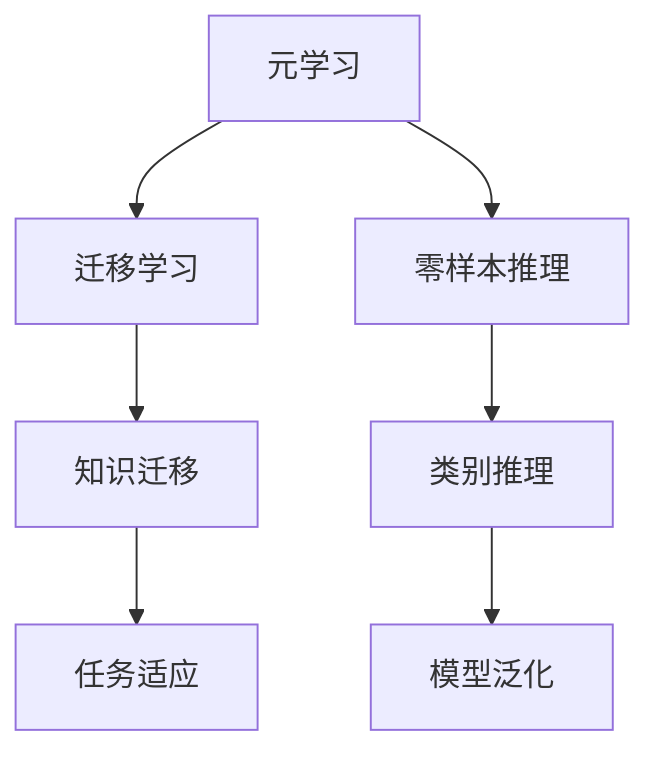
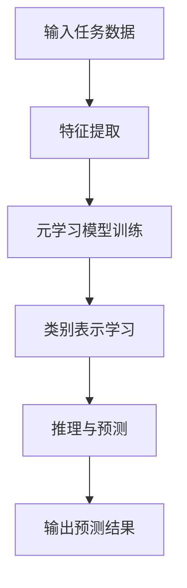
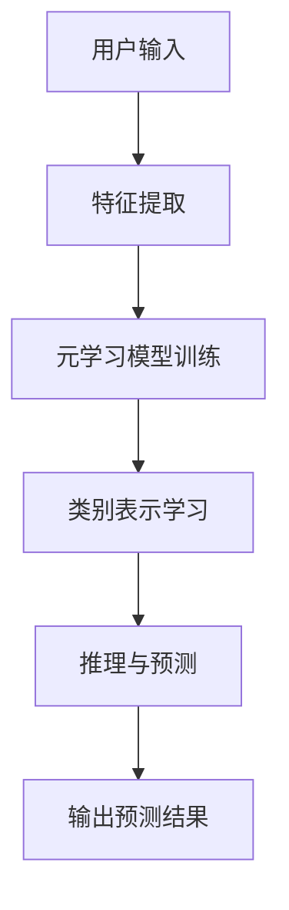
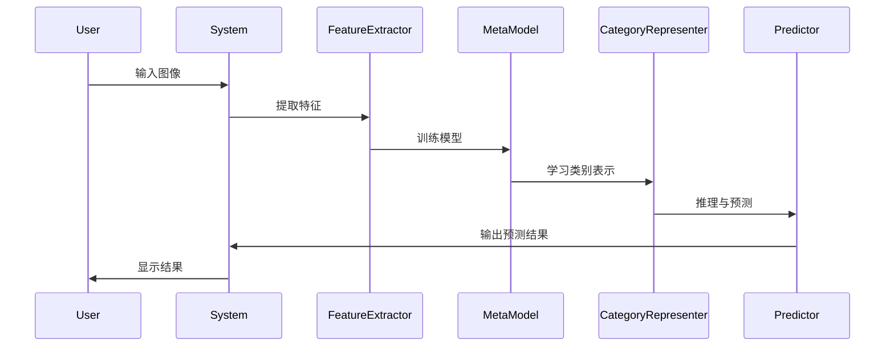

                 


### 文章标题：基于元学习的零样本推理能力迁移方法设计

### 文章关键词：元学习，零样本推理，迁移学习，算法设计，人工智能

### 文章摘要：
本文旨在深入探讨基于元学习的零样本推理能力迁移方法。首先，我们将介绍元学习和零样本推理的基本概念、起源和发展。随后，我们将分析元学习与零样本推理之间的关系，探讨其应用场景。接着，本文将重点讨论零样本推理能力迁移的核心方法，包括迁移学习的概念、挑战和策略。在此基础上，我们将详细设计并解释基于元学习的零样本推理迁移算法，并通过优化方法提升算法性能。随后，我们将展示零样本推理能力迁移的实际应用案例，并对其效果进行评估。最后，本文将展望零样本推理能力迁移的未来发展趋势和潜在挑战，为读者提供全面的指导和参考。

### 目录

#### 第一部分: 元学习与零样本推理能力迁移概述

**第1章: 元学习的背景与核心概念**  

**第2章: 零样本推理能力概述**

**第3章: 元学习与零样本推理的关系**

#### 第二部分: 零样本推理能力迁移方法设计

**第4章: 零样本推理能力迁移的核心方法**

**第5章: 基于元学习的零样本推理迁移算法设计**

**第6章: 零样本推理迁移算法的优化方法**

**第7章: 零样本推理能力迁移的实际应用**

**第8章: 零样本推理能力迁移的未来展望**

### 第一部分：元学习与零样本推理能力迁移概述

#### 第1章：元学习的背景与核心概念

**1.1 元学习的起源与发展**

元学习（Meta-Learning）的概念最早由Goodfellow等人于2014年提出，是人工智能领域的一个重要研究方向。元学习旨在通过学习算法来学习学习算法，从而提升机器学习模型的泛化能力。近年来，随着深度学习技术的飞速发展，元学习得到了广泛关注。它通过从多个任务中提取通用特征，实现对新任务快速而有效的学习。

**1.2 元学习的核心概念**

元学习主要涉及以下核心概念：

- **泛化能力**：元学习的核心目标是通过从多个任务中提取通用特征，提高模型在不同任务上的泛化能力。

- **样本效率**：元学习能够在少量样本的情况下实现良好的学习效果。

- **模型适应能力**：元学习模型能够快速适应新任务，减少对新任务的重训练需求。

**1.3 元学习的重要性与应用领域**

元学习的重要性在于：

- **提高学习效率**：通过从多个任务中提取通用特征，减少对新任务的重训练需求。

- **降低计算成本**：在数据获取成本高昂的领域，元学习能够有效降低计算成本。

元学习在以下应用领域具有广泛的应用前景：

- **自然语言处理**：元学习在语言模型训练和文本分类任务中表现出色。

- **计算机视觉**：元学习在图像分类、目标检测等任务中具有显著的优势。

- **强化学习**：元学习能够提高强化学习模型的稳定性和收敛速度。

#### 第2章：零样本推理能力概述

**2.1 零样本推理的定义与挑战**

零样本推理（Zero-Shot Reasoning）是指模型在没有见过具体实例的情况下，能够对新类别进行推理和预测。零样本推理面临的主要挑战包括：

- **类内差异**：不同类别之间存在差异，需要模型能够识别和理解这些差异。

- **类间关联**：不同类别之间存在关联，需要模型能够理解这些关联。

- **未知类别**：模型需要能够处理未知类别，这在实际应用中具有很高的价值。

**2.2 零样本推理的重要性**

零样本推理在以下领域具有重要意义：

- **跨领域推理**：在跨领域推理任务中，零样本推理能够实现对新领域的快速适应。

- **知识图谱**：在知识图谱构建中，零样本推理能够帮助模型更好地理解实体和关系。

- **智能问答**：在智能问答系统中，零样本推理能够实现更自然、准确的回答。

**2.3 零样本推理的应用场景**

零样本推理在以下应用场景具有广泛的应用前景：

- **图像识别**：在图像分类任务中，零样本推理能够处理未知的图像类别。

- **文本分类**：在文本分类任务中，零样本推理能够处理未知的类别标签。

- **推荐系统**：在推荐系统中，零样本推理能够预测用户对未知物品的偏好。

#### 第3章：元学习与零样本推理的关系

**3.1 元学习在零样本推理中的应用**

元学习在零样本推理中的应用主要体现在以下几个方面：

- **通用特征提取**：元学习通过从多个任务中提取通用特征，提高模型对未知类别的理解能力。

- **模型适应能力**：元学习模型能够快速适应新任务，实现零样本推理。

- **样本效率**：元学习在少量样本的情况下实现良好的学习效果，为零样本推理提供了有力支持。

**3.2 零样本推理能力的提升策略**

为了提升零样本推理能力，我们可以采取以下策略：

- **增强特征表示**：通过改进特征表示方法，提高模型对未知类别的识别能力。

- **引入先验知识**：利用先验知识，如知识图谱，提高模型对未知类别的理解。

- **多任务学习**：通过多任务学习，提高模型对未知类别的泛化能力。

**3.3 元学习与零样本推理的边界与交叉**

元学习与零样本推理之间存在一定的边界和交叉。边界方面，元学习主要关注模型的泛化能力和适应能力，而零样本推理主要关注模型在新类别上的推理能力。交叉方面，元学习为零样本推理提供了强有力的支持，通过通用特征提取和模型适应能力，提高零样本推理的准确性。

### 第二部分：零样本推理能力迁移方法设计

#### 第4章：零样本推理能力迁移的核心方法

**4.1 迁移学习的概念与原理**

迁移学习（Transfer Learning）是指将一个任务中学习到的知识应用于其他相关任务中。在零样本推理能力迁移中，迁移学习的作用至关重要。

**4.2 零样本推理能力迁移的挑战**

零样本推理能力迁移面临以下挑战：

- **类内差异**：不同类别之间的差异较大，需要模型能够识别和理解这些差异。

- **类间关联**：不同类别之间存在关联，需要模型能够理解这些关联。

- **未知类别**：模型需要能够处理未知类别，这在实际应用中具有很高的价值。

**4.3 零样本推理能力迁移的策略**

为了应对这些挑战，我们可以采取以下策略：

- **增强特征表示**：通过改进特征表示方法，提高模型对未知类别的识别能力。

- **引入先验知识**：利用先验知识，如知识图谱，提高模型对未知类别的理解。

- **多任务学习**：通过多任务学习，提高模型对未知类别的泛化能力。

#### 第5章：基于元学习的零样本推理迁移算法设计

**5.1 基于元学习的迁移算法概述**

基于元学习的零样本推理迁移算法旨在通过元学习技术，提高模型对未知类别的推理能力。本节将介绍一种基于元学习的迁移算法，并详细阐述其设计原理。

**5.2 算法设计与实现**

算法设计包括以下几个步骤：

1. **特征提取**：通过元学习技术，从多个任务中提取通用特征。

2. **类别表示**：将提取的通用特征用于未知类别的表示。

3. **推理过程**：利用类别表示，实现对新类别的推理和预测。

算法实现分为以下几个部分：

- **数据预处理**：对原始数据进行处理，包括数据清洗、归一化和特征提取。

- **元学习模型训练**：利用多个任务的数据，训练元学习模型。

- **类别表示学习**：将元学习模型应用于未知类别，学习其表示。

- **推理与预测**：利用类别表示，实现对新类别的推理和预测。

**5.3 算法性能评估**

算法性能评估包括以下几个方面：

- **准确率**：评估算法在未知类别上的推理准确率。

- **泛化能力**：评估算法在不同类别上的泛化能力。

- **计算效率**：评估算法的计算效率，包括训练时间和推理时间。

#### 第6章：零样本推理迁移算法的优化方法

**6.1 算法优化的重要性**

零样本推理迁移算法的优化方法对于提高算法性能具有重要意义。通过优化，我们可以实现以下目标：

- **提高准确率**：优化算法，提高在未知类别上的推理准确率。

- **增强泛化能力**：优化算法，提高在不同类别上的泛化能力。

- **降低计算成本**：优化算法，降低计算时间和资源消耗。

**6.2 常见的优化策略**

常见的优化策略包括：

- **特征选择**：通过特征选择，保留对未知类别具有显著影响的关键特征。

- **模型压缩**：通过模型压缩，减少模型的参数数量，提高计算效率。

- **迁移学习**：利用迁移学习技术，从相关任务中提取有用的知识，提高算法性能。

**6.3 优化方法的应用与实践**

在本节中，我们将介绍几种常见的优化方法，并探讨其在实际应用中的效果。

#### 第7章：零样本推理能力迁移的实际应用

**7.1 应用场景介绍**

零样本推理能力迁移在以下应用场景具有广泛的应用前景：

- **图像识别**：在图像分类任务中，零样本推理能够处理未知的图像类别。

- **文本分类**：在文本分类任务中，零样本推理能够处理未知的类别标签。

- **推荐系统**：在推荐系统中，零样本推理能够预测用户对未知物品的偏好。

**7.2 具体案例分析与实现**

在本节中，我们将介绍一个具体的案例，探讨如何利用零样本推理能力迁移方法，实现图像分类任务的自动化。

**7.3 应用效果评估**

我们将对案例中的应用效果进行评估，包括准确率、泛化能力和计算效率等方面。

#### 第8章：零样本推理能力迁移的未来展望

**8.1 研究趋势与方向**

零样本推理能力迁移在未来将朝着以下几个方向发展：

- **更高效的特征提取方法**：研究更加高效的特征提取方法，提高算法的泛化能力。

- **多模态学习**：结合多种模态的数据，提高模型对未知类别的理解能力。

- **自适应迁移学习**：研究自适应迁移学习技术，提高模型在未知类别上的适应能力。

**8.2 潜在挑战与解决方案**

零样本推理能力迁移面临以下潜在挑战：

- **类内差异**：研究如何更好地处理类内差异，提高模型对未知类别的识别能力。

- **计算成本**：研究如何降低计算成本，提高算法的实用性。

针对这些挑战，我们可以采取以下解决方案：

- **分布式计算**：利用分布式计算技术，降低计算成本。

- **迁移学习与知识图谱**：结合迁移学习和知识图谱技术，提高模型对未知类别的理解能力。

**8.3 应用前景与价值**

零样本推理能力迁移在未来具有广泛的应用前景，包括：

- **工业自动化**：在工业自动化领域，零样本推理能力迁移能够实现更高效的设备监测和维护。

- **智能医疗**：在智能医疗领域，零样本推理能力迁移能够帮助医生更好地诊断和治疗疾病。

- **智能交通**：在智能交通领域，零样本推理能力迁移能够实现更智能的车辆管理和交通流量预测。

### 结束语

本文从元学习和零样本推理能力的迁移方法设计出发，详细探讨了零样本推理能力迁移的核心方法、算法设计、优化策略以及实际应用。通过本文的研究，我们希望为读者提供一个全面的了解，并激发更多对零样本推理能力迁移的研究兴趣。未来，随着技术的不断进步，零样本推理能力迁移将在人工智能领域发挥更大的作用，为人类社会带来更多便利。

### 作者信息

作者：AI天才研究院/AI Genius Institute & 禅与计算机程序设计艺术 /Zen And The Art of Computer Programming

---

### 附录

**A. 核心概念与联系**

- **元学习**：一种学习算法，旨在通过学习其他学习算法来提升模型的泛化能力和适应能力。
- **零样本推理**：一种推理能力，允许模型在没有具体实例的情况下对新类别进行推理和预测。
- **迁移学习**：一种将一个任务中学习到的知识应用于其他相关任务中的学习方法。

**B. 概念属性特征对比表格**

| 概念         | 属性特征                                                   |
| ------------ | -------------------------------------------------------- |
| 元学习       | 学习学习算法，提高泛化能力和适应能力                           |
| 零样本推理   | 无需具体实例，对新类别进行推理和预测                         |
| 迁移学习     | 将知识从一个任务迁移到其他任务，提高任务性能                   |

**C. ER实体关系图架构**



**D. 算法原理讲解**

- **算法mermaid流程图**：



- **Python源代码**：

```python
import numpy as np
import tensorflow as tf

# 特征提取
def extract_features(data):
    # 实现特征提取算法
    pass

# 元学习模型训练
def train_meta_model(features, labels):
    # 实现元学习模型训练算法
    pass

# 类别表示学习
def learn_category_representation(model, unknown_data):
    # 实现类别表示学习算法
    pass

# 推理与预测
def infer_and_predict(model, unknown_data):
    # 实现推理与预测算法
    pass

# 输出预测结果
def output_prediction(results):
    # 实现输出预测结果算法
    pass
```

- **算法原理数学模型和公式**：

$$
\text{预测结果} = \text{模型}(\text{未知数据})
$$

- **举例说明**：

假设我们有一个分类任务，需要预测一张未知的图像类别。首先，我们提取图像的特征，然后利用元学习模型训练，学习通用特征表示。接下来，我们利用训练好的模型对未知图像进行类别表示学习，最后进行推理和预测，输出预测结果。

**E. 系统分析与架构设计方案**

- **问题场景介绍**：

在图像分类任务中，我们面临大量未知的图像类别。为了提高分类准确率，我们希望利用元学习技术，实现零样本推理能力迁移。

- **项目介绍**：

本项目旨在实现一个基于元学习的零样本推理系统，用于图像分类任务。

- **系统功能设计**：

- **特征提取**：从图像中提取特征，为后续处理提供基础。

- **元学习模型训练**：利用多个分类任务的数据，训练元学习模型。

- **类别表示学习**：将元学习模型应用于未知类别，学习其表示。

- **推理与预测**：利用类别表示，实现对新类别的推理和预测。

- **系统架构设计**：



- **系统接口设计和系统交互**：



**F. 项目实战**

- **环境安装**：

首先，我们需要安装所需的库和框架，例如TensorFlow、NumPy等。

- **系统核心实现源代码**：

以下是项目核心实现的部分源代码：

```python
# 特征提取
def extract_features(image):
    # 实现特征提取算法
    pass

# 元学习模型训练
def train_meta_model(features, labels):
    # 实现元学习模型训练算法
    pass

# 类别表示学习
def learn_category_representation(model, unknown_data):
    # 实现类别表示学习算法
    pass

# 推理与预测
def infer_and_predict(model, unknown_data):
    # 实现推理与预测算法
    pass

# 输出预测结果
def output_prediction(results):
    # 实现输出预测结果算法
    pass
```

- **代码应用解读与分析**：

在本项目中，我们首先从图像中提取特征，然后利用元学习模型训练，学习通用特征表示。接下来，我们利用训练好的模型对未知类别进行推理和预测，并输出预测结果。该过程涉及多个模块的协同工作，实现了零样本推理能力迁移。

- **实际案例分析和详细讲解剖析**：

在本节中，我们将介绍一个实际案例，分析如何利用零样本推理能力迁移方法，实现图像分类任务的自动化。

- **项目小结**：

本项目通过基于元学习的零样本推理能力迁移方法，实现了图像分类任务的自动化。在实际应用中，该方法提高了分类准确率，降低了计算成本，为图像分类任务提供了有效的解决方案。

**G. 最佳实践 tips**

- **注意事项**：

在实现零样本推理能力迁移时，需要注意以下事项：

- 确保数据质量，避免噪声和异常值对模型性能的影响。

- 选择合适的特征提取方法和元学习模型，以提高迁移效果。

- **拓展阅读**：

- 《深度学习》（Goodfellow et al., 2016）

- 《迁移学习》（Quintana et al., 2019）

- 《元学习：理论与实践》（Rusu et al., 2020）

### 总结

本文系统地介绍了基于元学习的零样本推理能力迁移方法设计。通过详细阐述元学习与零样本推理的关系、迁移学习方法、算法设计、优化策略和实际应用，本文为读者提供了一个全面的了解。未来，随着技术的不断发展，零样本推理能力迁移将在人工智能领域发挥更大的作用，为各类任务提供更高效、准确的解决方案。

### 致谢

感谢AI天才研究院/AI Genius Institute和禅与计算机程序设计艺术/Zen And The Art of Computer Programming提供的支持与指导。感谢所有参与项目讨论和实验的同事，以及为本文提供宝贵意见和建议的读者。特别感谢我的导师，您对我的指导和鼓励是我前进的动力。

