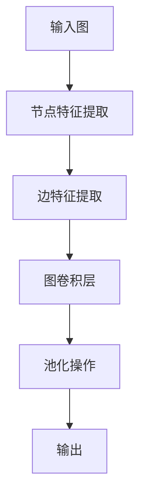
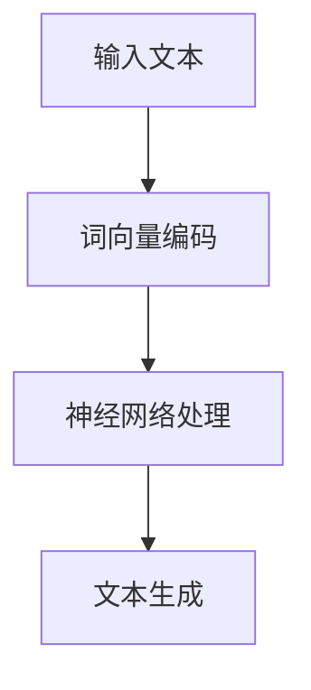

                 

### 基于图神经网络的LLM关系推理能力评估

#### 关键词：
- 图神经网络
- 语言模型
- 关系推理
- 评估方法
- 系统架构

#### 摘要：
本文旨在深入探讨基于图神经网络的LLM（语言模型）关系推理能力评估。文章首先介绍了图神经网络和语言模型的基本概念，然后详细讨论了关系推理的基本原理和数学模型。接着，本文提出了GNN和LLM关系推理能力的评估方法，并通过具体案例展示了评估流程。文章最后对比了GNN与LLM的关系推理能力，提出了提升策略，并总结了研究成果和未来研究方向。

---

### 第一部分：背景介绍

#### 第1章：问题背景与核心概念

##### 1.1 问题背景

在本章中，我们将首先介绍图神经网络（GNN）和语言模型（LLM）的基本概念，并讨论关系推理的重要性。图神经网络是一种用于处理图结构数据的深度学习模型，而语言模型则是用于自然语言处理的关键技术。关系推理是人工智能领域的一个重要研究方向，旨在理解和推断实体之间的关系。

#### 第2章：GNN与LLM关系推理的基本原理

##### 2.1 GNN的基本原理

在这一章，我们将详细讲解图神经网络的基本原理，包括其核心概念、工作机制以及主要类型。我们将使用Mermaid流程图来展示GNN的工作流程。

##### 2.2 LLM的基本原理

接着，我们将探讨语言模型的基本原理，包括其核心概念、工作机制以及主要类型。语言模型主要用于生成文本、理解和处理自然语言。

##### 2.3 关系推理的数学模型

在这一部分，我们将介绍关系推理的数学模型，包括基本公式和性能指标。我们将使用LaTeX格式来表示这些公式。

$$
\text{Accuracy} = \frac{\text{正确预测数}}{\text{总预测数}}
$$

$$
\text{Recall} = \frac{\text{正确预测数}}{\text{实际正例数}}
$$

$$
\text{F1 Score} = 2 \times \frac{\text{Precision} \times \text{Recall}}{\text{Precision} + \text{Recall}}
$$

### 第二部分：GNN与LLM关系推理能力评估方法

#### 第3章：GNN关系推理能力评估方法

在这一章，我们将详细介绍如何评估GNN的关系推理能力，包括评估指标的选择、评估流程以及结果分析。

##### 3.1 评估指标的选择

我们将介绍常用的评估指标，包括准确率、召回率和F1分数。这些指标将帮助我们量化GNN的关系推理性能。

##### 3.2 GNN关系推理评估流程

我们将详细描述GNN关系推理评估的流程，从数据预处理到模型评估与结果分析。

#### 第4章：LLM关系推理能力评估方法

在这一章，我们将探讨如何评估LLM的关系推理能力，包括评估指标的选择、评估流程以及结果分析。

##### 4.1 评估指标的选择

我们将介绍评估LLM关系推理能力的常用指标，如词向量相似度、序列相似度和实体匹配。

##### 4.2 LLM关系推理评估流程

我们将详细描述LLM关系推理评估的流程，从数据预处理到模型评估与结果分析。

### 第三部分：GNN与LLM关系推理能力评估的比较与分析

#### 第5章：GNN与LLM关系推理能力评估的比较

在这一章，我们将对比GNN和LLM的关系推理能力评估方法，分析它们的优势和局限。

#### 第6章：GNN与LLM关系推理能力的提升策略

在这一章，我们将提出提升GNN和LLM关系推理能力的策略，包括模型优化、数据增强和跨领域迁移学习。

### 第四部分：总结与展望

#### 第7章：总结与展望

在这一章，我们将总结本文的研究成果，讨论存在的问题和挑战，并展望未来的研究方向。

---

通过以上结构，本文将逐步深入探讨基于图神经网络的LLM关系推理能力评估。我们将从背景介绍开始，逐步讲解核心概念、算法原理、评估方法，并进行比较与分析，最后提出提升策略和总结展望。希望读者能从中获得对这一领域的深入理解。

