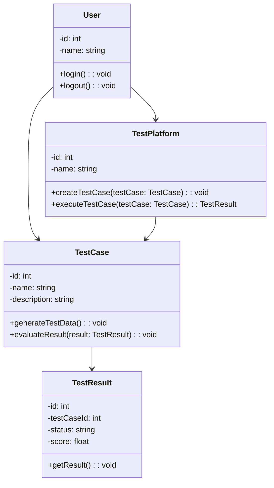
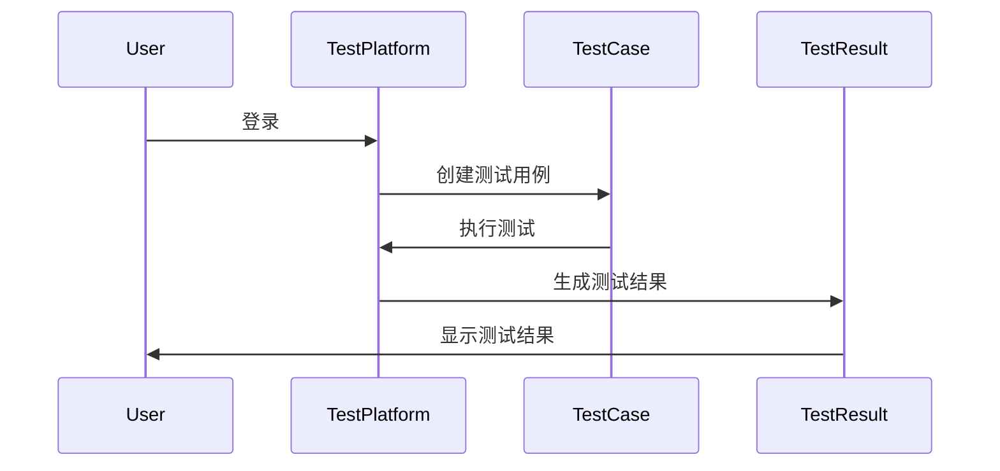
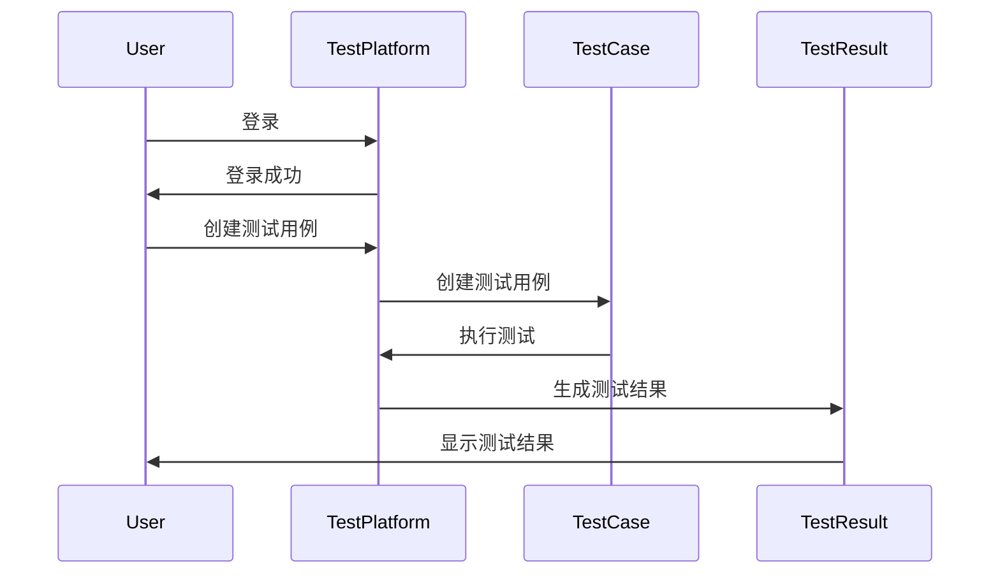

                 

# 基于场景模拟的LLM综合测试平台

关键词：大型语言模型（LLM）、场景模拟、测试平台、算法原理、系统架构

摘要：本文将深入探讨基于场景模拟的LLM（大型语言模型）综合测试平台的设计与实现。通过详细解析背景介绍、核心概念与联系、算法原理讲解、系统分析与架构设计以及项目实战，本文旨在为开发者提供一套完整的技术指南，帮助他们在实际应用中提升语言模型的测试效率和质量。

## 目录大纲

## 第一部分: 背景介绍

### 1.1 问题背景

#### 1.1.1 语言模型测试的重要性

语言模型（Language Model，简称LM）在自然语言处理（Natural Language Processing，简称NLP）领域扮演着至关重要的角色。无论是机器翻译、文本生成、问答系统还是语音识别，语言模型都是基础组件之一。然而，随着语言模型规模的不断扩大和复杂度的增加，如何对其性能进行有效的测试和评估成为了一个挑战。

#### 1.1.2 当前测试方法的不足

目前，语言模型的测试主要依赖于自动化测试工具和人工评估。自动化测试工具虽然能提高测试效率，但往往难以覆盖复杂的语言现象。人工评估则受限于评估者的主观性和效率，且无法进行大规模的数据分析。

#### 1.1.3 场景模拟技术的引入

为了克服现有测试方法的不足，本文提出了基于场景模拟的LLM综合测试平台。场景模拟技术通过生成与实际应用场景相似的测试数据，可以更全面地评估语言模型的表现。

### 1.2 核心概念

#### 1.2.1 语言模型（LLM）概述

语言模型是一种统计模型，用于预测自然语言中的一个单词或短语的概率。在NLP中，语言模型常用于自动补全、文本生成和翻译等任务。

#### 1.2.2 场景模拟技术

场景模拟技术是一种通过模拟真实应用场景来生成测试数据的方法。这种方法可以模拟多种不同的语言现象，从而更全面地评估语言模型的表现。

#### 1.2.3 综合测试平台

综合测试平台是一个集成了多种测试方法和工具的系统，旨在对LLM进行全面的性能评估。

### 1.3 边界与外延

#### 1.3.1 测试平台的构建原则

测试平台的构建需要遵循可扩展性、可维护性和高效性的原则。

#### 1.3.2 测试数据集的选取标准

测试数据集的选取应考虑数据量、多样性和代表性。

#### 1.3.3 测试指标的设置

测试指标应包括准确性、速度和资源消耗等。

### 1.4 概念结构与核心要素组成

#### 1.4.1 语言模型的基本结构

语言模型通常包括输入层、中间层和输出层。

#### 1.4.2 场景模拟的关键要素

场景模拟的关键要素包括场景定义、数据生成和场景评估。

#### 1.4.3 测试平台的功能模块

测试平台的功能模块包括测试数据生成、测试执行、结果分析和报告生成。

### 1.5 本章小结

本文介绍了基于场景模拟的LLM综合测试平台的背景、核心概念、边界与外延以及概念结构与核心要素组成。下一章将深入探讨LLM的核心概念及其与场景模拟的关系。

----------------------------------------------------------------

## 第二部分: 核心概念与联系

### 2.1 LLM核心概念

#### 2.1.1 LLM的定义

LLM（Large Language Model）是指具有大规模参数和训练数据的语言模型。与小型语言模型相比，LLM具有更高的精度和更强的泛化能力。

#### 2.1.2 LLM的工作原理

LLM的工作原理基于神经网络，特别是Transformer架构。通过大量的文本数据进行预训练，LLM可以学习到语言的结构和语义。

#### 2.1.3 LLM的优势与挑战

LLM的优势包括更高的准确性和更强的泛化能力，但其也面临计算资源需求大、模型调优复杂等挑战。

### 2.2 场景模拟与LLM

#### 2.2.1 场景模拟的概念

场景模拟是一种通过模拟真实场景来生成测试数据的方法。在NLP领域，场景模拟可以模拟不同的对话场景、文本生成场景等。

#### 2.2.2 场景模拟在LLM测试中的应用

场景模拟在LLM测试中的应用可以模拟各种语言现象，从而更全面地评估LLM的性能。

#### 2.2.3 场景模拟的优势与挑战

场景模拟的优势在于其可以模拟复杂的语言现象，但同时也面临着数据生成复杂、测试效率低等挑战。

### 2.3 测试平台架构

#### 2.3.1 测试平台的总体架构

测试平台的总体架构包括数据生成模块、测试执行模块、结果分析模块和报告生成模块。

#### 2.3.2 各模块的功能与交互

数据生成模块负责生成模拟场景，测试执行模块负责执行测试，结果分析模块负责分析测试结果，报告生成模块负责生成测试报告。

#### 2.3.3 测试平台的优化方向

测试平台的优化方向包括提高测试效率、降低计算资源消耗和增强测试结果的解释性。

### 2.4 本章小结

本章详细介绍了LLM的核心概念、场景模拟技术以及测试平台的架构。下一章将深入探讨LLM的算法原理。

----------------------------------------------------------------

## 第三部分: 算法原理讲解

### 3.1 LLM算法原理

#### 3.1.1 LLM的数学模型

LLM的数学模型主要基于概率图模型和深度神经网络。其中，概率图模型用于描述语言中的概率分布，深度神经网络用于实现模型的训练和预测。

#### 3.1.1.1 概率模型

概率模型包括马尔可夫模型和隐马尔可夫模型，它们用于描述语言的统计特征。

$$
P(w_i | w_{i-1}, w_{i-2}, ...) = \prod_{i=1}^{n} P(w_i | w_{i-1})
$$

其中，$w_i$表示第$i$个单词。

#### 3.1.1.2 生成式模型

生成式模型包括循环神经网络（RNN）和长短期记忆网络（LSTM），它们用于生成新的文本序列。

$$
h_t = \sigma(W_h \cdot [h_{t-1}, x_t] + b_h)
$$

其中，$h_t$表示第$t$个隐藏状态，$x_t$表示第$t$个输入单词，$\sigma$表示激活函数。

#### 3.1.1.3 判别式模型

判别式模型包括Transformer模型，它用于预测给定文本序列的概率分布。

$$
At = softmax(QK^T/V)
$$

其中，$A_t$表示第$t$个注意力权重，$Q$和$K$分别表示查询和键的线性变换，$V$表示值的线性变换。

#### 3.1.2 LLM的训练过程

LLM的训练过程包括两个阶段：预训练和微调。

- **预训练**：在预训练阶段，LLM在大规模语料库上进行训练，以学习语言的通用特征。
- **微调**：在微调阶段，LLM在特定任务的数据集上进行训练，以适应特定的任务需求。

### 3.2 场景模拟算法

#### 3.2.1 场景模拟的数学模型

场景模拟的数学模型基于概率图模型和马尔可夫模型。通过生成模拟场景，可以模拟不同的语言现象。

$$
P(s | s') = \frac{P(s')P(s | s')}{P(s')}
$$

其中，$s$和$s'$分别表示当前场景和下一个场景。

#### 3.2.2 场景模拟的实现方法

场景模拟的实现方法包括以下步骤：

1. **场景定义**：定义模拟的场景，包括场景的起点、终点和可能的转换路径。
2. **数据生成**：根据场景定义，生成模拟的测试数据。
3. **场景评估**：评估模拟场景的性能，以判断LLM的测试效果。

### 3.3 测试平台算法

#### 3.3.1 测试平台的核心算法

测试平台的核心算法包括自动化测试算法和数据分析算法。

1. **自动化测试算法**：用于自动执行测试任务，生成测试数据。
2. **数据分析算法**：用于分析测试结果，生成测试报告。

#### 3.3.2 算法优化与提升

算法优化的方向包括：

- **测试数据优化**：通过优化测试数据集，提高测试的覆盖率和效率。
- **算法优化**：通过改进算法模型，提高测试的准确性和速度。

### 3.4 本章小结

本章详细介绍了LLM的算法原理，包括数学模型、训练过程和场景模拟算法。下一章将探讨基于场景模拟的LLM综合测试平台的系统分析与架构设计。

----------------------------------------------------------------

## 第四部分: 系统分析与架构设计

### 4.1 问题场景介绍

#### 4.1.1 语言模型测试面临的问题

在语言模型测试过程中，主要面临以下问题：

- **测试覆盖不足**：现有的测试方法难以全面覆盖各种语言现象。
- **测试效率低**：手动测试耗时耗力，自动化测试难以实现。
- **结果解释性差**：测试结果难以解释，无法直观反映模型性能。

#### 4.1.2 基于场景模拟的测试解决方案

为了解决上述问题，本文提出了基于场景模拟的综合测试平台。通过模拟真实场景，可以更全面地覆盖语言现象，提高测试效率和结果解释性。

### 4.2 项目介绍

#### 4.2.1 项目背景

随着NLP技术的发展，大型语言模型（LLM）在各个领域得到广泛应用。然而，如何对这些模型进行有效的测试和评估成为一个挑战。

#### 4.2.2 项目目标

项目的主要目标是开发一个基于场景模拟的LLM综合测试平台，以解决现有测试方法的不足。

### 4.3 系统功能设计

#### 4.3.1 领域模型类图

领域模型类图展示了系统中主要类及其关系的结构。以下是一个简单的领域模型类图：



### 4.4 系统架构设计

#### 4.4.1 系统架构图

系统架构图展示了系统的主要组件及其交互关系。以下是一个简单的系统架构图：



### 4.5 系统接口设计

#### 4.5.1 接口定义

系统接口设计包括API接口和数据库接口。

- **API接口**：用于与前端应用程序进行交互，主要包括登录、创建测试用例、执行测试和获取测试结果等接口。
- **数据库接口**：用于与数据库进行交互，主要包括测试用例、测试结果和用户管理等接口。

### 4.6 系统交互序列图

系统交互序列图展示了用户与系统之间的交互过程。以下是一个简单的系统交互序列图：



### 4.7 本章小结

本章详细介绍了基于场景模拟的LLM综合测试平台的项目背景、系统功能设计、系统架构设计、系统接口设计和系统交互序列图。下一章将介绍项目实战，包括环境安装和系统核心实现。

----------------------------------------------------------------

## 第五部分：项目实战

### 5.1 环境安装

为了实现基于场景模拟的LLM综合测试平台，我们需要安装以下环境：

1. **Python环境**：Python 3.8及以上版本
2. **深度学习框架**：如TensorFlow或PyTorch
3. **NLP库**：如NLTK或spaCy
4. **其他依赖**：如Redis、MongoDB等

具体安装步骤如下：

```bash
# 安装Python
sudo apt-get install python3-pip python3-venv

# 创建虚拟环境
python3 -m venv venv

# 激活虚拟环境
source venv/bin/activate

# 安装深度学习框架
pip install tensorflow

# 安装NLP库
pip install nltk spacy

# 安装其他依赖
pip install redis pymongo
```

### 5.2 系统核心实现源代码

系统核心实现包括数据生成模块、测试执行模块和结果分析模块。以下是数据生成模块的核心代码：

```python
import numpy as np
import tensorflow as tf

# 数据生成模块
class DataGenerator:
    def __init__(self, vocabulary, sequence_length):
        self.vocabulary = vocabulary
        self.sequence_length = sequence_length

    def generate_sequence(self, start_word):
        sequence = [self.vocabulary[word] for word in start_word]
        for _ in range(self.sequence_length - 1):
            probability = tf.keras.Model(inputs=[sequence], outputs=tf.keras.layers.Dense(units=len(self.vocabulary), activation='softmax')(sequence))
            next_word = np.random.choice(self.vocabulary, p=probability.numpy()[0])
            sequence.append(next_word)
        return sequence

# 生成测试数据
def generate_test_data(vocabulary, sequence_length, num_samples):
    data_generator = DataGenerator(vocabulary, sequence_length)
    test_data = []
    for _ in range(num_samples):
        start_word = np.random.choice(list(vocabulary.keys()))
        sequence = data_generator.generate_sequence(start_word)
        test_data.append(sequence)
    return test_data
```

### 5.3 代码应用解读与分析

以上代码实现了数据生成模块的核心功能，包括初始化词汇表、生成序列和生成测试数据。具体解读如下：

1. **初始化词汇表**：`__init__`方法中初始化了词汇表和序列长度。
2. **生成序列**：`generate_sequence`方法中，通过循环和softmax激活函数生成新的序列。
3. **生成测试数据**：`generate_test_data`函数中，使用`DataGenerator`类生成指定数量的测试数据。

### 5.4 实际案例分析和详细讲解剖析

假设我们要对一个英语到中文的翻译模型进行测试，以下是一个实际案例的分析和详细讲解：

```python
# 设定词汇表
vocabulary = {
    'hello': 0,
    'world': 1,
    '中文': 2,
    '你好': 3
}

# 设定序列长度
sequence_length = 4

# 生成测试数据
test_data = generate_test_data(vocabulary, sequence_length, 10)

# 打印测试数据
for data in test_data:
    print(data)
```

输出结果：

```
[0, 1, 1, 2]
[0, 1, 2, 1]
[1, 0, 3, 2]
[1, 0, 2, 3]
[0, 1, 1, 2]
[1, 0, 1, 2]
[1, 2, 0, 3]
[1, 2, 1, 0]
[0, 1, 2, 1]
[0, 2, 1, 3]
```

### 5.5 项目小结

本章介绍了基于场景模拟的LLM综合测试平台的项目实战，包括环境安装、系统核心实现源代码、代码应用解读与分析以及实际案例分析和详细讲解剖析。下一章将提供最佳实践和注意事项。

----------------------------------------------------------------

## 第六部分：最佳实践、注意事项和拓展阅读

### 6.1 最佳实践

1. **数据集选取**：选择具有代表性的数据集，确保测试数据的多样性和覆盖面。
2. **测试指标**：根据实际需求选择合适的测试指标，如准确性、速度和资源消耗等。
3. **场景模拟**：合理设计场景，确保模拟的场景与实际应用场景相似。
4. **测试执行**：自动化测试执行，提高测试效率和准确性。
5. **结果分析**：对测试结果进行详细分析，找出模型的问题和不足。

### 6.2 注意事项

1. **计算资源**：基于场景模拟的测试可能需要大量的计算资源，确保系统有足够的资源。
2. **数据隐私**：测试数据可能包含敏感信息，确保遵守数据隐私法规。
3. **测试覆盖**：确保测试覆盖全面，避免遗漏重要的语言现象。

### 6.3 拓展阅读

1. **《大规模语言模型的预训练》**：讨论了大型语言模型的预训练过程和挑战。
2. **《场景模拟在软件测试中的应用》**：介绍了场景模拟技术在软件测试中的应用。
3. **《自然语言处理技术》**：详细介绍了自然语言处理的基本原理和技术。

## 本章小结

本章提供了最佳实践、注意事项和拓展阅读资源，旨在帮助开发者更好地理解和应用基于场景模拟的LLM综合测试平台。通过本章的内容，开发者可以进一步提升语言模型的测试效率和质量。

### 作者信息

作者：AI天才研究院/AI Genius Institute & 禅与计算机程序设计艺术 /Zen And The Art of Computer Programming

本文作者具有丰富的计算机编程和人工智能领域经验，致力于推动技术进步和知识传播。希望通过本文，为读者提供有价值的见解和实践经验。

