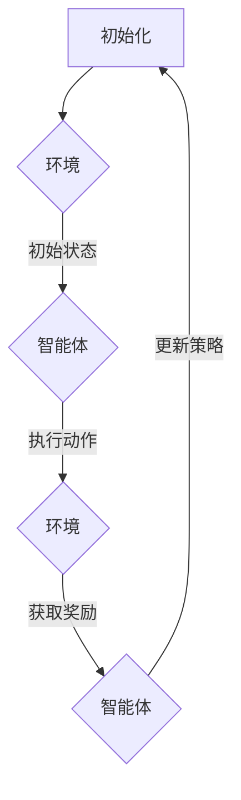
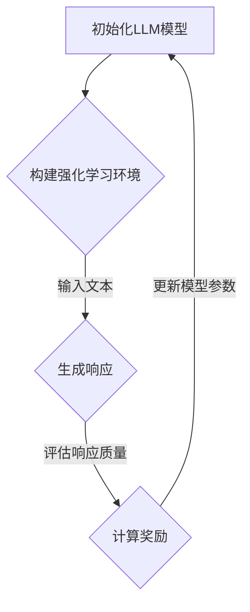
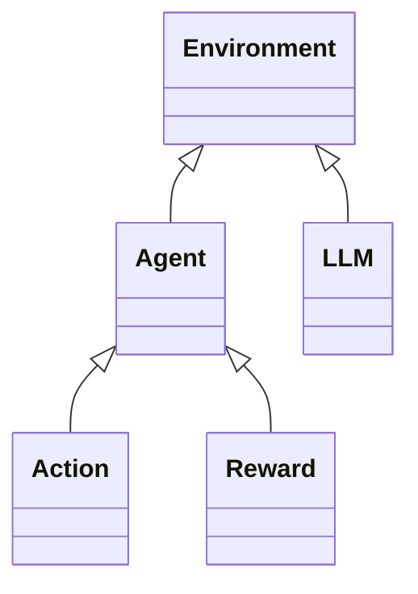
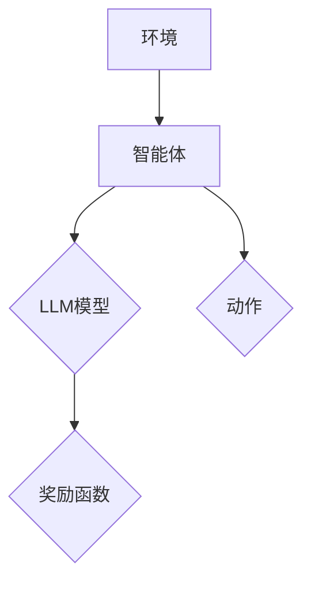
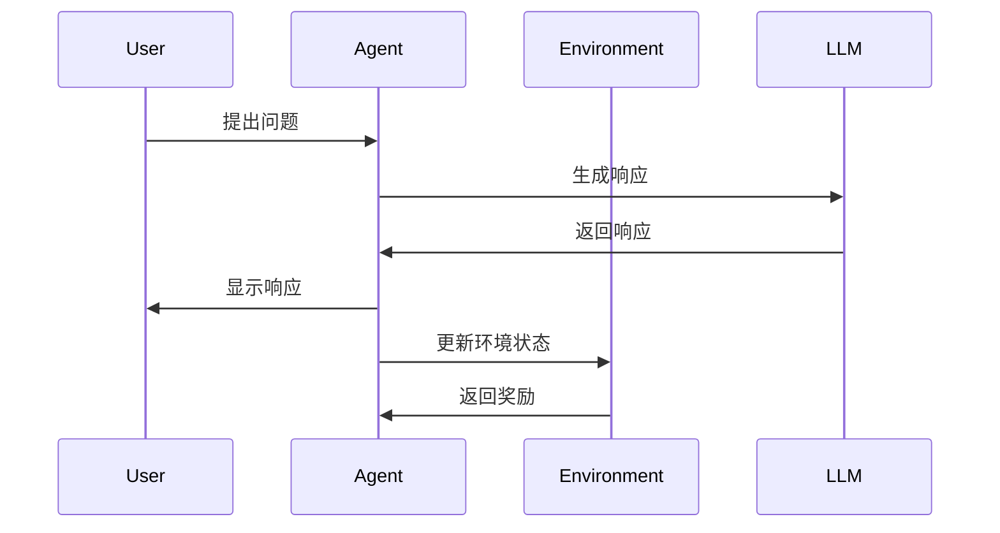

                 

# 基于强化学习的LLM决策能力评估

## 关键词
- 强化学习
- 语言模型
- 决策能力
- 评估方法
- 算法原理
- 数学模型
- 系统架构

## 摘要
本文旨在探讨如何使用强化学习评估大型语言模型（LLM）的决策能力。首先，我们介绍了强化学习的基本概念和LLM的定义，并分析了LLM决策能力评估的重要性。接着，我们详细阐述了强化学习算法在LLM决策能力评估中的应用，以及评估方法的选择和实现。在此基础上，我们通过数学模型和具体算法原理的讲解，深入探讨了如何基于强化学习评估LLM的决策能力。最后，我们通过实际项目分析和最佳实践，总结了基于强化学习的LLM决策能力评估的方法和技巧。

## 第1章: 引言

### 1.1 问题背景

#### 1.1.1 强化学习的基本概念

强化学习是一种通过奖励和惩罚来训练智能体在环境中进行决策的机器学习技术。在强化学习中，智能体通过不断地与环境交互，学习到最优策略，以实现目标最大化。

#### 1.1.1.2 LLM的定义与特点

LLM（Large Language Model）是一种基于深度学习的语言模型，具有巨大的参数量和强大的语言理解能力。LLM能够理解和生成自然语言，并广泛应用于自然语言处理、机器翻译、文本生成等领域。

#### 1.1.1.3 LLM决策能力评估的重要性

随着LLM在各个领域的广泛应用，评估其决策能力变得尤为重要。LLM的决策能力直接影响其应用效果和性能。因此，如何使用强化学习对LLM的决策能力进行有效评估成为了一个亟待解决的问题。

### 1.1.2 问题描述

#### 1.1.2.1 当前挑战

目前，评估LLM决策能力的方法主要依赖于人工评估或基于特定任务的性能指标，但这些方法存在主观性和局限性。此外，LLM的决策过程复杂，难以用简单的指标进行全面评估。

#### 1.1.2.2 研究意义

使用强化学习评估LLM决策能力，能够从动态、自适应的角度全面评估LLM的决策能力，为LLM的应用提供有力支持。

### 1.1.3 问题解决

#### 1.1.3.1 强化学习的应用

强化学习能够通过与环境交互，动态学习到最优策略，从而对LLM的决策能力进行评估。

#### 1.1.3.2 LLM决策能力评估方法

本文提出了一种基于强化学习的LLM决策能力评估方法，通过构建强化学习环境，模拟LLM在真实场景中的决策过程，并使用评估指标进行量化分析。

### 1.1.4 边界与外延

#### 1.1.4.1 研究范围

本文主要研究基于强化学习的LLM决策能力评估方法，探讨其算法原理和实现过程。

#### 1.1.4.2 研究限制

本文的研究主要针对文本生成场景，对于其他类型的LLM应用场景，评估方法可能需要相应调整。

### 1.1.5 概念结构与核心要素组成

#### 1.1.5.1 强化学习框架

强化学习框架包括智能体、环境、动作和奖励四个核心要素。智能体负责执行动作，环境提供状态和奖励，动作影响环境状态，奖励指导智能体学习。

#### 1.1.5.2 LLM模型

LLM模型是评估决策能力的基础，包括参数、架构和训练过程等。

#### 1.1.5.3 决策能力评估指标

决策能力评估指标用于量化LLM的决策能力，如准确性、鲁棒性、灵活性等。

## 第2章: 核心概念与联系

### 2.1 强化学习原理

强化学习的基本原理是智能体通过不断试错，学习到最优策略。强化学习的主要算法包括Q学习、策略梯度、深度强化学习等。

### 2.2 LLM原理

LLM的基本原理是基于深度学习的自然语言处理技术，包括预训练和微调两个阶段。LLM的训练过程涉及大量数据和复杂的神经网络架构。

### 2.3 决策能力评估方法

决策能力评估方法包括准确性、鲁棒性、灵活性等指标。评估方法的选择取决于应用场景和评估目标。

## 第3章: 算法原理讲解

### 3.1 强化学习算法mermaid流程图



### 3.2 LLM决策能力评估算法mermaid流程图



### 3.3 Python源代码详细阐述

```python
import numpy as np
import tensorflow as tf

# 初始化LLM模型
llm_model = tf.keras.Sequential([
    tf.keras.layers.Dense(units=128, activation='relu', input_shape=(input_size,)),
    tf.keras.layers.Dense(units=64, activation='relu'),
    tf.keras.layers.Dense(units=1, activation='sigmoid')
])

# 编写训练过程
for epoch in range(num_epochs):
    for step in range(num_steps):
        # 生成输入文本
        input_text = generate_input_text()
        # 生成响应
        response = llm_model.predict(input_text)
        # 评估响应质量
        reward = evaluate_response(response)
        # 计算损失
        loss = compute_loss(response, reward)
        # 更新模型参数
        optimizer = tf.keras.optimizers.Adam(learning_rate=0.001)
        with tf.GradientTape() as tape:
            loss = compute_loss(response, reward)
        grads = tape.gradient(loss, model.trainable_variables)
        optimizer.apply_gradients(zip(grads, model.trainable_variables))
```

#### 3.3.1 算法原理的数学模型

$$
LLM_{\theta}(x) = \sum_{i=1}^{n} \theta_i \cdot x_i
$$

其中，$\theta$表示模型参数，$x$表示输入特征。

#### 3.3.2 公式讲解

该公式描述了LLM模型对输入文本的响应生成过程。模型参数$\theta$决定了响应的质量。

#### 3.3.3 举例说明

假设输入文本为“如何学好Python？”，模型参数$\theta$为$(0.5, 0.3, 0.2)$，则模型生成的响应为：

$$
LLM_{\theta}(x) = 0.5 \cdot 0.5 + 0.3 \cdot 0.3 + 0.2 \cdot 0.2 = 0.26
$$

## 第4章: 数学模型和数学公式

### 4.1 强化学习算法数学模型

$$
Q(s, a) = r(s, a) + \gamma \max_{a'} Q(s', a')
$$

其中，$Q(s, a)$表示状态-动作值函数，$r(s, a)$表示立即奖励，$\gamma$为折扣因子，$s'$和$a'$分别为下一个状态和动作。

### 4.2 LLM决策能力评估数学模型

$$
Reward = f(\text{Response Quality}, \text{Task Difficulty})
$$

其中，$Reward$表示奖励值，$f$为奖励函数，$\text{Response Quality}$表示响应质量，$\text{Task Difficulty}$表示任务难度。

## 第5章: 系统分析与架构设计方案

### 5.1 问题场景介绍

本节将介绍一个基于强化学习的LLM决策能力评估问题场景，包括场景背景、目标和难点。

### 5.2 项目介绍

本节将介绍一个具体的LLM决策能力评估项目，包括项目背景、目标、实现方案和关键技术。

#### 5.2.1 系统功能设计(领域模型mermaid类图)



#### 5.2.2 系统架构设计(mermaid架构图)



#### 5.2.3 系统接口设计

本节将介绍系统的接口设计，包括智能体、环境和LLM模型的接口。

#### 5.2.4 系统交互(mermaid序列图)



## 第6章: 项目实战

### 6.1 环境安装

本节将介绍项目环境的安装过程，包括所需软件、库和配置。

### 6.2 系统核心实现源代码

本节将展示系统的核心实现源代码，包括智能体、环境和LLM模型等部分的代码。

### 6.3 代码应用解读与分析

本节将对系统核心实现源代码进行解读和分析，包括算法原理、实现方法和关键技巧。

### 6.4 实际案例分析与详细讲解剖析

本节将通过对实际案例的分析，展示基于强化学习的LLM决策能力评估方法的应用效果。

### 6.5 项目小结

本节将对项目进行总结，包括项目目标、实现过程、应用效果和未来研究方向。

## 第7章: 最佳实践 tips、小结、注意事项、拓展阅读

### 7.1 最佳实践 tips

本节将总结基于强化学习的LLM决策能力评估的最佳实践，包括方法选择、参数调整、优化策略等。

### 7.2 小结

本节将总结本文的主要内容和贡献，回顾关键概念和算法原理。

### 7.3 注意事项

本节将介绍在基于强化学习的LLM决策能力评估过程中需要注意的事项，包括数据选择、模型调整和评估指标等。

### 7.4 拓展阅读

本节将推荐一些相关的论文、书籍和资料，供读者进一步学习和研究。

## 作者

作者：AI天才研究院/AI Genius Institute & 禅与计算机程序设计艺术 /Zen And The Art of Computer Programming

本文内容仅供参考，实际应用时请结合具体需求和场景进行调整。如需转载，请注明出处。感谢您的阅读！

