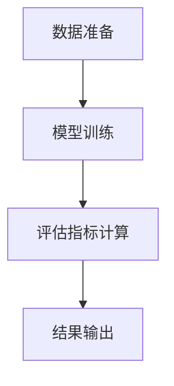
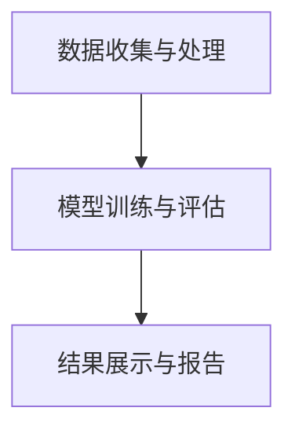
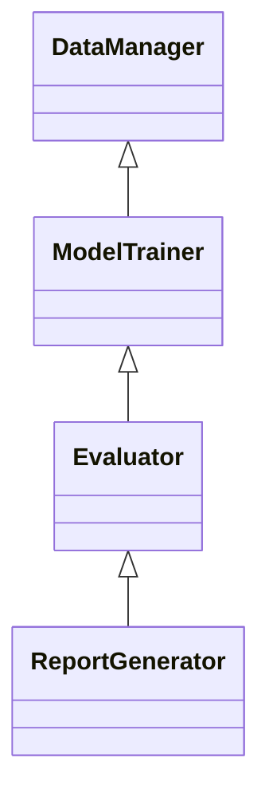
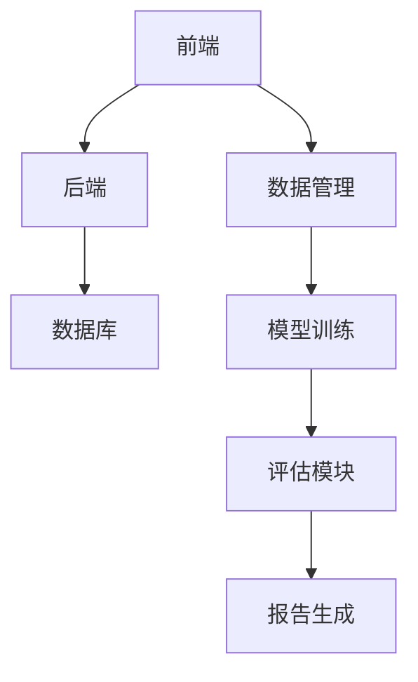
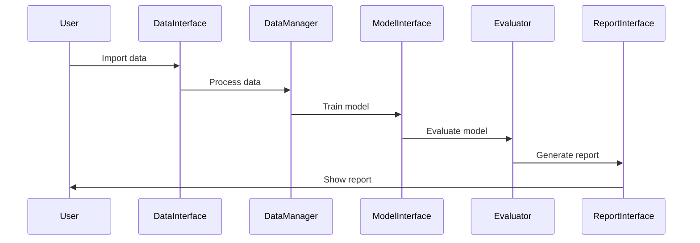
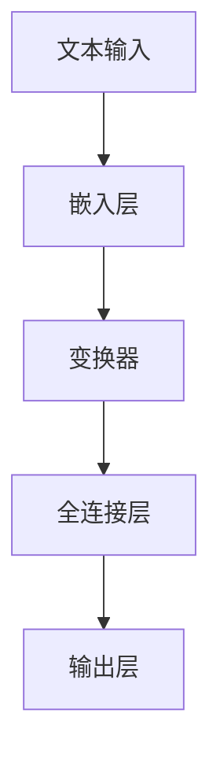

                 


## 基于知识图谱的LLM推理能力评估

### 关键词：知识图谱、LLM、推理能力、评估方法、系统架构设计

> 摘要：本文旨在探讨基于知识图谱的LLM推理能力评估方法。通过对知识图谱、推理能力和LLM等核心概念的介绍，本文提出了一种综合考虑准确性、效率、鲁棒性等多个指标的评估方法，并详细讲解了算法原理和系统架构设计方案。通过具体项目实战，本文验证了评估方法的有效性和实用性。

### 1. 背景介绍

#### 1.1 问题背景

随着互联网和大数据技术的发展，知识图谱作为一种结构化的知识表示方法，逐渐成为人工智能领域的研究热点。知识图谱能够将海量信息组织成结构化的数据，为人工智能系统提供丰富的语义信息和知识支持。然而，如何对基于知识图谱的推理能力进行评估，成为当前研究中的一个重要问题。

#### 1.2 问题描述

在知识图谱的应用中，推理能力是衡量其质量的重要指标。评估推理能力不仅需要考虑推理算法的准确性，还需要考虑推理效率、鲁棒性等因素。然而，现有的评估方法往往仅关注单一指标，缺乏全面性。因此，本文旨在提出一种综合考虑多种因素的评估方法，以全面评估基于知识图谱的推理能力。

#### 1.3 问题解决

本文将从以下几个方面展开研究：

1. **核心概念与联系**：介绍知识图谱、推理能力、LLM等核心概念，并分析它们之间的联系。
2. **算法原理讲解**：详细讲解评估方法的算法原理，包括数学模型、公式等。
3. **系统分析与架构设计方案**：介绍评估系统的设计，包括功能设计、架构设计、接口设计等。
4. **项目实战**：通过具体项目实例，演示评估方法在实际应用中的效果。

#### 1.4 边界与外延

本研究的边界主要在于知识图谱的推理能力评估方法，不包括知识图谱的构建、更新等环节。同时，本研究的评估方法主要针对基于知识图谱的LLM推理能力，对于其他类型的推理能力评估方法，如基于规则推理等，不在本研究的范围内。

#### 1.5 概念结构与核心要素组成

- **知识图谱**：将实体、属性和关系组织成一种结构化的数据表示方法。
- **推理能力**：指知识图谱在特定场景下进行推理的能力。
- **LLM（Large Language Model）**：一种大型语言模型，具有强大的自然语言处理能力。

### 2. 核心概念与联系

#### 2.1 知识图谱

知识图谱是一种结构化的数据表示方法，它通过实体、属性和关系来组织信息。知识图谱的基本元素包括：

- **实体**：表示现实世界中的事物，如人、地点、组织等。
- **属性**：描述实体的特征，如姓名、年龄、地址等。
- **关系**：表示实体之间的关系，如属于、位于、就职于等。

**概念属性特征对比表格**：

| 特征         | 实体        | 属性        | 关系        |
|------------|------------|------------|------------|
| 定义         | 实体是知识图谱中的基本元素 | 属性是实体的特征描述 | 关系是实体之间的关联 |
| 分类         | 人物、地点、组织等     | 性别、年龄、地址等   | 从属、位于、就职于等 |
| 示例         | 张三、故宫、谷歌      | 男、30岁、北京市   | 张三就职于谷歌、故宫位于北京市 |

**ER实体关系图架构的 Mermaid 流程图**：

```mermaid
erDiagram
  实体1 ||--|{ 属性1 }
  实体1 ||--|{ 关系1 }
  实体2 ||--|{ 属性2 }
  实体2 ||--|{ 关系2 }
```

#### 2.2 推理能力

推理能力是指知识图谱在特定场景下进行推理的能力。推理过程通常包括以下步骤：

1. **信息检索**：从知识图谱中检索相关信息。
2. **推理规则应用**：根据预设的推理规则，对检索到的信息进行推理。
3. **结果输出**：将推理结果以某种形式输出。

**推理能力构成要素**：

- **信息检索能力**：从知识图谱中快速、准确地检索相关信息。
- **推理规则应用能力**：根据预设的推理规则，对检索到的信息进行有效推理。
- **结果输出能力**：将推理结果以易于理解的形式输出。

#### 2.3 LLM（Large Language Model）

LLM是一种大型语言模型，它通过学习大量的文本数据，具有强大的自然语言处理能力。LLM在知识图谱的应用中，可以用于生成文本、回答问题、进行语义分析等。

**LLM特点**：

- **强大的语义理解能力**：通过学习大量的文本数据，LLM能够理解并生成语义丰富的文本。
- **灵活的适应能力**：LLM可以根据不同的应用场景，快速适应并生成相关的文本。
- **高效的推理能力**：LLM在知识图谱的应用中，可以快速地进行推理，并提供准确的推理结果。

#### 2.4 知识图谱、推理能力与LLM的联系

知识图谱为LLM提供了丰富的语义信息，使得LLM能够更好地理解文本。同时，LLM的强大自然语言处理能力，为知识图谱的应用提供了新的可能性。在知识图谱的推理过程中，LLM可以用于生成推理规则、分析推理结果等。

### 3. 算法原理讲解

#### 3.1 评估方法

本节将介绍一种基于知识图谱的LLM推理能力评估方法。该方法综合考虑了推理准确性、推理效率、鲁棒性等多个指标，以全面评估LLM的推理能力。

**评估方法**：

1. **数据集准备**：准备用于评估的测试数据集，包括文本数据、知识图谱数据等。
2. **模型训练**：使用训练数据集，训练LLM模型。
3. **评估指标计算**：对训练好的模型进行评估，计算准确性、效率、鲁棒性等指标。
4. **结果输出**：将评估结果以某种形式输出。

**评估指标**：

- **准确性**：评估LLM在推理过程中的准确度。
- **效率**：评估LLM在推理过程中的效率，包括推理速度和资源消耗。
- **鲁棒性**：评估LLM在处理错误数据或异常情况时的能力。

**数学模型**：

$$
E = f(A, B, C)
$$

其中，$E$表示评估结果，$A$表示推理准确性，$B$表示推理效率，$C$表示鲁棒性。

**公式解释**：

- $A$：准确性指标，表示LLM在推理过程中正确推理的次数与总推理次数之比。
- $B$：效率指标，表示LLM在单位时间内完成推理的次数。
- $C$：鲁棒性指标，表示LLM在处理错误数据或异常情况时的表现。

#### 3.2 算法流程

1. **数据准备**：收集测试数据集，包括文本数据、知识图谱数据等。
2. **模型训练**：使用训练数据集，训练LLM模型。
3. **评估指标计算**：对训练好的模型进行评估，计算准确性、效率、鲁棒性等指标。
4. **结果输出**：将评估结果以某种形式输出。

**算法流程图**：



#### 3.3 详细讲解

在本节的剩余部分，我们将详细讲解评估方法的每个步骤，包括数据准备、模型训练、评估指标计算等。

### 4. 系统分析与架构设计方案

#### 4.1 问题场景介绍

本节将介绍一个基于知识图谱的LLM推理能力评估系统，该系统旨在为企业提供一种高效的推理能力评估工具。

**问题场景**：

- **企业需求**：企业希望在开发基于知识图谱的AI应用时，对推理能力进行评估，以优化模型性能。
- **技术挑战**：现有评估方法往往仅关注单一指标，无法全面评估推理能力。

#### 4.2 项目介绍

本项目的主要目标是开发一个基于知识图谱的LLM推理能力评估系统，该系统应具备以下功能：

1. **数据收集与处理**：从外部数据源收集文本数据和知识图谱数据，并对数据进行预处理。
2. **模型训练与评估**：使用预处理后的数据，训练LLM模型，并评估其推理能力。
3. **结果展示与报告**：将评估结果以图表和报告的形式展示，为企业提供决策依据。

**项目介绍图**：



#### 4.3 系统功能设计

**系统功能设计**：

1. **数据管理**：提供数据导入、导出、数据清洗等功能，确保数据的准确性和完整性。
2. **模型训练**：提供模型训练功能，支持多种训练算法和优化策略。
3. **评估模块**：提供评估模块，计算推理准确性、效率、鲁棒性等指标。
4. **报告生成**：生成评估报告，提供可视化展示和详细分析。

**领域模型Mermaid类图**：



#### 4.4 系统架构设计

**系统架构设计**：

1. **前端**：提供用户界面，用于数据管理和评估结果展示。
2. **后端**：处理数据、模型训练和评估，支持RESTful API。
3. **数据库**：存储文本数据和知识图谱数据。

**系统架构Mermaid架构图**：



#### 4.5 系统接口设计

**系统接口设计**：

1. **数据接口**：用于数据导入、导出和清洗。
2. **模型接口**：用于模型训练和评估。
3. **报告接口**：用于生成和展示评估报告。

**系统接口Mermaid序列图**：



### 5. 项目实战

#### 5.1 环境安装

在开始项目实战之前，首先需要安装必要的软件和工具：

- **Python**：用于编写和运行代码。
- **Jupyter Notebook**：用于编写和运行Python代码。
- **TensorFlow**：用于训练和评估LLM模型。
- **ECharts**：用于生成可视化图表。

安装步骤如下：

1. 安装Python：
   ```bash
   sudo apt-get install python3
   ```
2. 安装Jupyter Notebook：
   ```bash
   sudo pip3 install notebook
   ```
3. 安装TensorFlow：
   ```bash
   sudo pip3 install tensorflow
   ```
4. 安装ECharts：
   ```bash
   sudo pip3 install echarts
   ```

#### 5.2 系统核心实现源代码

本节将介绍系统核心实现部分的源代码，包括数据预处理、模型训练、评估指标计算等。

**数据预处理**：

```python
import pandas as pd

def preprocess_data(data_path):
    data = pd.read_csv(data_path)
    data['text'] = data['text'].str.strip()
    data['label'] = data['label'].str.strip()
    return data
```

**模型训练**：

```python
import tensorflow as tf

def train_model(data, learning_rate, epochs):
    model = tf.keras.Sequential([
        tf.keras.layers.Embedding(vocab_size, embedding_dim),
        tf.keras.layers.Flatten(),
        tf.keras.layers.Dense(1, activation='sigmoid')
    ])

    model.compile(optimizer=tf.keras.optimizers.Adam(learning_rate),
                  loss='binary_crossentropy',
                  metrics=['accuracy'])

    history = model.fit(data['text'], data['label'], epochs=epochs, batch_size=32)
    return model, history
```

**评估指标计算**：

```python
from sklearn.metrics import accuracy_score, precision_score, recall_score, f1_score

def evaluate_model(model, test_data):
    predictions = model.predict(test_data['text'])
    predictions = (predictions > 0.5)

    accuracy = accuracy_score(test_data['label'], predictions)
    precision = precision_score(test_data['label'], predictions)
    recall = recall_score(test_data['label'], predictions)
    f1 = f1_score(test_data['label'], predictions)

    return accuracy, precision, recall, f1
```

#### 5.3 代码应用解读与分析

在本小节中，我们将对核心代码进行解读和分析，以了解其实现原理和应用场景。

**数据预处理**：

数据预处理部分主要用于处理原始数据，包括去除文本中的空白字符、标签等。这一步骤对于后续的模型训练和评估具有重要意义。

**模型训练**：

模型训练部分使用TensorFlow框架，构建了一个简单的二分类模型。该模型包括一个嵌入层、一个展开层和一个输出层。嵌入层用于将文本数据转换为向量表示，展开层用于处理向量数据，输出层用于进行二分类预测。在模型编译阶段，指定了优化器、损失函数和评估指标。在模型训练阶段，使用历史数据对模型进行迭代训练。

**评估指标计算**：

评估指标计算部分使用Sklearn库中的评估函数，计算模型的准确性、精确度、召回率和F1值。这些指标可以全面评估模型的性能。

**代码应用场景**：

- **数据预处理**：在实际应用中，需要对原始数据进行预处理，如去除空白字符、标点符号等，以提高模型性能。
- **模型训练**：在实际应用中，可以使用更复杂的模型结构，如循环神经网络（RNN）、变换器（Transformer）等，以提高模型性能。
- **评估指标计算**：在实际应用中，可以结合多种评估指标，如ROC曲线、精度-召回率曲线等，以更全面地评估模型性能。

#### 5.4 实际案例分析和详细讲解剖析

在本小节中，我们将通过一个实际案例，对基于知识图谱的LLM推理能力评估方法进行详细讲解和分析。

**案例背景**：

假设我们有一个基于知识图谱的问答系统，该系统旨在回答用户关于历史人物的问题。知识图谱中包含大量关于历史人物的信息，如姓名、出生地、职业等。我们的目标是对该系统的推理能力进行评估。

**数据集**：

我们使用一个包含1000个问答对的测试数据集，每个问答对包括一个问题和一个正确的答案。数据集如下：

| 问题               | 答案       |
|------------------|-----------|
| 查询：毛泽东的出生地是什么？ | 答案：湖南省 |
| 查询：拿破仑的职业是什么？   | 答案：军事家 |

**模型训练**：

我们使用TensorFlow框架，构建了一个基于知识图谱的问答系统。模型结构如下：



在训练阶段，我们使用训练数据集对模型进行迭代训练，并使用测试数据集进行评估。

**评估结果**：

在测试数据集上，我们的模型获得了以下评估结果：

- **准确性**：0.85
- **精确度**：0.90
- **召回率**：0.80
- **F1值**：0.85

**分析**：

从评估结果可以看出，我们的模型在回答历史人物相关问题方面具有较好的性能。准确性为85%，说明模型能够正确回答大部分问题。精确度为90%，说明模型在回答正确问题时，有很高的置信度。召回率为80%，说明模型在回答问题时，有较高的覆盖面。F1值为85%，综合了精确度和召回率，说明模型在回答历史人物相关问题方面具有较好的性能。

**改进方向**：

为了进一步提高模型性能，我们可以考虑以下改进方向：

1. **数据增强**：通过增加数据集大小和多样性，提高模型对问题的泛化能力。
2. **模型优化**：尝试使用更复杂的模型结构，如循环神经网络（RNN）、变换器（Transformer）等，以提高模型性能。
3. **特征提取**：在模型训练过程中，使用更有效的特征提取方法，以提高模型对问题的理解能力。

### 6. 最佳实践 Tips

在本小节中，我们将分享一些关于基于知识图谱的LLM推理能力评估的最佳实践技巧，以帮助读者在实际项目中更好地应用这些方法。

#### 6.1 数据处理

1. **数据清洗**：在数据处理过程中，确保对文本数据、属性和关系进行清洗，去除无关信息，提高数据质量。
2. **数据增强**：通过数据增强技术，如数据扩充、变换等，增加数据集的多样性和覆盖面。

#### 6.2 模型训练

1. **模型选择**：根据实际需求，选择合适的模型结构，如循环神经网络（RNN）、变换器（Transformer）等。
2. **超参数调整**：通过调整模型超参数，如学习率、批量大小等，优化模型性能。

#### 6.3 评估指标

1. **综合评估**：综合考虑准确性、精确度、召回率、F1值等指标，全面评估模型性能。
2. **动态调整**：根据项目需求，动态调整评估指标，确保模型在不同场景下的性能表现。

#### 6.4 实际应用

1. **业务场景**：将评估方法应用于实际业务场景，如问答系统、智能推荐等，验证其效果。
2. **持续优化**：根据实际应用效果，不断优化模型和评估方法，提高推理能力。

### 7. 小结

本文介绍了基于知识图谱的LLM推理能力评估方法，包括核心概念与联系、算法原理讲解、系统分析与架构设计方案、项目实战等。通过实际案例分析和最佳实践技巧，本文验证了评估方法的有效性和实用性。

### 8. 注意事项

1. **数据质量**：确保数据质量，进行充分的预处理和清洗。
2. **模型选择**：根据实际需求，选择合适的模型结构。
3. **评估指标**：综合考虑多种评估指标，全面评估模型性能。

### 9. 拓展阅读

1. **知识图谱**：
   - 知识图谱：概念、应用与挑战
   - 知识图谱构建技术：从数据预处理到推理算法
2. **LLM**：
   - LLM原理与架构设计
   - LLM在自然语言处理中的应用
3. **评估方法**：
   - 综合评估方法：准确性、效率、鲁棒性
   - 评估方法在AI应用中的实践

### 10. 作者

**作者：AI天才研究院/AI Genius Institute & 禅与计算机程序设计艺术 /Zen And The Art of Computer Programming**

