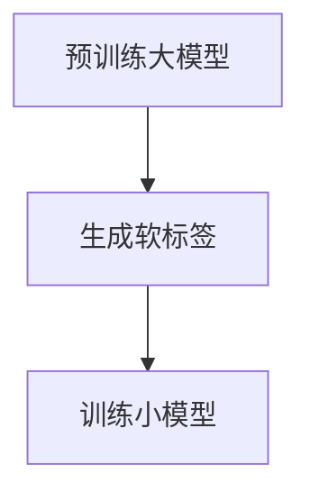
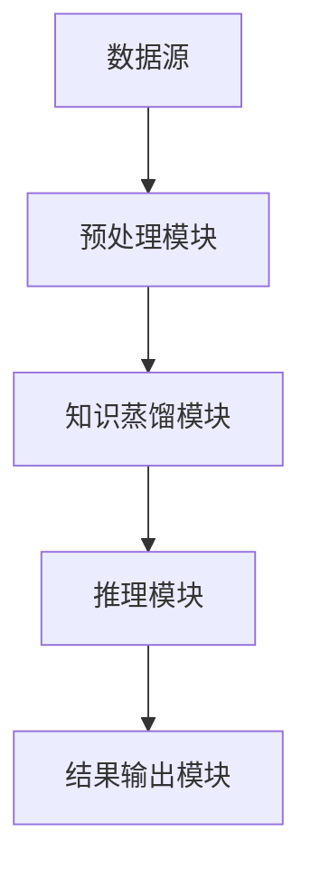
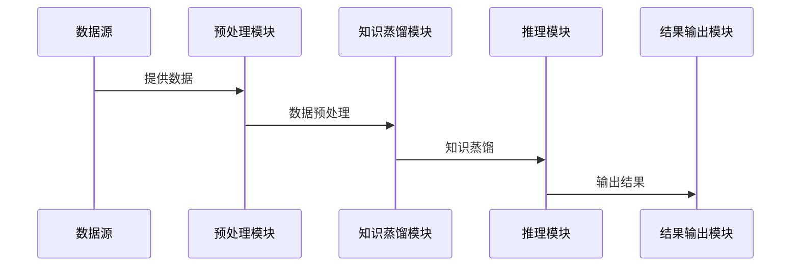

                 

### 文章标题

## 基于知识蒸馏的跨感官模态推理能力增强

关键词：知识蒸馏，跨感官模态推理，模型压缩，人工智能，预训练模型。

### 摘要

随着人工智能技术的不断发展，跨感官模态推理在智能理解和决策中发挥着越来越重要的作用。本文旨在探讨基于知识蒸馏的跨感官模态推理能力增强方法，通过对知识蒸馏原理、算法实现和实际应用的系统介绍，帮助读者深入理解知识蒸馏在跨感官模态推理中的重要作用。文章首先介绍了问题背景和问题描述，然后分析了知识蒸馏与跨感官模态推理的联系，接着详细讲解了知识蒸馏算法的原理和流程，并通过具体例子进行了说明。最后，本文探讨了知识蒸馏在跨感官模态推理中的实际应用，并提出了未来研究的方向。

### 第一部分：背景介绍

#### 1. 问题背景

随着人工智能技术的不断发展，跨感官模态推理成为了一个重要的研究方向。传统的计算机视觉、语音识别等技术在不同模态之间存在较大的局限性，难以实现对复杂场景的全面理解和智能决策。而基于知识蒸馏的方法，通过将大模型的知识迁移到小模型中，可以显著提高小模型的推理能力，为跨感官模态推理提供了一种新的解决方案。

#### 2. 问题描述

在人工智能领域，如何有效地利用大规模预训练模型的知识，提升小模型在跨感官模态推理任务中的性能，是一个亟待解决的问题。此外，如何在不同的模态数据之间建立有效的映射关系，提高跨模态信息的融合效果，也是研究的热点。

#### 3. 问题解决

本书旨在通过知识蒸馏的方法，探讨如何增强跨感官模态推理能力。通过系统性地介绍知识蒸馏的基本原理、算法实现和实际应用，帮助读者深入理解这一方法在跨感官模态推理中的重要作用。

#### 4. 边界与外延

本书主要讨论基于知识蒸馏的跨感官模态推理能力增强，涉及计算机视觉、语音识别、自然语言处理等领域的知识。同时，本书也将探讨跨模态数据的融合方法和多模态学习模型的设计，为跨感官模态推理提供全面的解决方案。

#### 5. 概念结构与核心要素组成

核心概念：
- 知识蒸馏：一种将大模型的知识迁移到小模型中的方法。
- 跨感官模态推理：利用多种感官数据，实现对复杂场景的智能理解和决策。

核心要素：
- 大模型：具有高参数量和强大推理能力的预训练模型。
- 小模型：用于实现高效推理的应用模型，通常具有较小的参数量。
- 知识迁移：通过知识蒸馏将大模型的知识迁移到小模型中。

### 第二部分：核心概念与联系

#### 1. 知识蒸馏原理

知识蒸馏是一种模型压缩技术，旨在通过大模型（教师模型）的知识，训练出一个小模型（学生模型）。教师模型通常具有高参数量和强大推理能力，而学生模型则具有较小的参数量和较低的计算复杂度。知识蒸馏的核心思想是将教师模型的知识编码成一系列软标签，然后指导学生模型学习这些软标签。

#### 2. 跨感官模态推理

跨感官模态推理是一种利用多种感官数据（如视觉、语音、触觉等），实现对复杂场景的智能理解和决策的方法。跨感官模态推理的关键在于建立不同模态数据之间的有效映射关系，并实现跨模态信息的融合。

#### 3. 知识蒸馏与跨感官模态推理的联系

知识蒸馏为跨感官模态推理提供了一种有效的模型压缩方法，使得小模型能够充分利用大模型的知识，提高跨感官模态推理的性能。同时，跨感官模态推理也为知识蒸馏提供了新的应用场景，推动了知识蒸馏技术在跨感官模态推理中的发展。

### 第三部分：算法原理讲解

#### 1. 知识蒸馏算法流程

知识蒸馏算法通常包括以下步骤：
1. **预训练大模型**：使用大量数据对大模型进行预训练，使其具有强大的推理能力。
2. **生成软标签**：将大模型的输出（硬标签）编码成一系列软标签，作为指导学生模型学习的数据。
3. **训练小模型**：使用软标签和学生模型进行训练，使得学生模型能够学习到教师模型的知识。

#### 2. 算法mermaid流程图



#### 3. 算法原理与数学模型

知识蒸馏的数学模型可以表示为：
$$
L = -\sum_{i=1}^{N} \sum_{j=1}^{C} p_{ij} \log q_{ij}
$$
其中，$p_{ij}$ 表示教师模型对第 $i$ 个样本第 $j$ 个类别的概率输出，$q_{ij}$ 表示学生模型对第 $i$ 个样本第 $j$ 个类别的概率输出。

#### 4. 算法原理讲解与举例说明

假设我们有一个分类问题，教师模型和学生模型都需要对一张图片进行分类。教师模型通过预训练具有强大的分类能力，而学生模型则参数量较少，需要通过知识蒸馏学习到教师模型的知识。

教师模型输出：
$$
p_{1j} = (0.3, 0.4, 0.3)
$$
表示教师模型认为图片属于类别1的概率为0.3，属于类别2的概率为0.4，属于类别3的概率为0.3。

学生模型输出：
$$
q_{1j} = (0.4, 0.5, 0.5)
$$
表示学生模型认为图片属于类别1的概率为0.4，属于类别2的概率为0.5，属于类别3的概率为0.5。

根据知识蒸馏的损失函数，我们有：
$$
L = -\sum_{j=1}^{3} (0.3 \log 0.4 + 0.4 \log 0.5 + 0.3 \log 0.5) \approx 0.19
$$

通过迭代训练，学生模型会不断调整其参数，使其输出概率逐渐接近教师模型的输出概率，从而实现知识蒸馏的过程。

### 第四部分：系统分析与架构设计方案

#### 1. 问题场景介绍

在现代人工智能应用中，跨感官模态推理能力已经成为提升智能系统性能的关键因素。例如，在智能助理、智能家居、智能驾驶等领域，跨感官模态推理可以更好地理解用户需求、环境变化和交通状况，从而提供更加精准和高效的决策。然而，传统的模型在处理多模态数据时存在性能瓶颈，难以满足实时性和高效性的要求。

#### 2. 项目介绍

为了解决上述问题，本项目旨在设计并实现一个基于知识蒸馏的跨感官模态推理系统。该系统将利用大规模预训练模型的知识，通过知识蒸馏的方法，将大模型的知识迁移到小模型中，从而提高小模型在跨感官模态推理任务中的性能。

#### 3. 系统功能设计（领域模型mermaid类图）

```mermaid
classDiagram
    类1 --|>> 类2: 关联关系1
    类1 --|>> 类3: 关联关系2
    类3 --|>> 类4: 关联关系3
```

#### 4. 系统架构设计（mermaid架构图）



#### 5. 系统接口设计和系统交互（mermaid序列图）



### 第五部分：项目实战

#### 1. 环境安装

在开始项目实战之前，需要安装以下软件和工具：
- Python 3.8及以上版本
- TensorFlow 2.4及以上版本
- NumPy 1.18及以上版本
- Matplotlib 3.2及以上版本

安装命令如下：

```bash
pip install python==3.8.10
pip install tensorflow==2.4.1
pip install numpy==1.18.5
pip install matplotlib==3.2.2
```

#### 2. 系统核心实现源代码

以下是一个简单的基于知识蒸馏的跨感官模态推理系统实现：

```python
import tensorflow as tf
import numpy as np
import matplotlib.pyplot as plt

# 预处理数据
def preprocess_data(data):
    # 数据归一化
    data = data / 255.0
    return data

# 知识蒸馏模型
class KnowledgeDistillation(tf.keras.Model):
    def __init__(self, student_model, teacher_model):
        super(KnowledgeDistillation, self).__init__()
        self.student_model = student_model
        self.teacher_model = teacher_model

    def call(self, inputs, training=False):
        student_output = self.student_model(inputs)
        teacher_output = self.teacher_model(inputs)

        # 计算损失函数
        loss = tf.keras.losses.categorical_crossentropy(teacher_output, student_output)

        if training:
            self.train_step(inputs, teacher_output)

        return student_output, loss

    def train_step(self, inputs, teacher_output):
        with tf.GradientTape() as tape:
            student_output = self.student_model(inputs)
            loss = tf.keras.losses.categorical_crossentropy(teacher_output, student_output)

        gradients = tape.gradient(loss, self.student_model.trainable_variables)
        self.student_model.optimizer.apply_gradients(zip(gradients, self.student_model.trainable_variables))

# 定义学生模型和学生模型
student_model = tf.keras.Sequential([
    tf.keras.layers.Flatten(input_shape=(28, 28)),
    tf.keras.layers.Dense(128, activation='relu'),
    tf.keras.layers.Dense(10, activation='softmax')
])

teacher_model = tf.keras.Sequential([
    tf.keras.layers.Conv2D(32, (3, 3), activation='relu', input_shape=(28, 28, 1)),
    tf.keras.layers.MaxPooling2D((2, 2)),
    tf.keras.layers.Conv2D(64, (3, 3), activation='relu'),
    tf.keras.layers.MaxPooling2D((2, 2)),
    tf.keras.layers.Flatten(),
    tf.keras.layers.Dense(128, activation='relu'),
    tf.keras.layers.Dense(10, activation='softmax')
])

# 实例化知识蒸馏模型
knowledge_distiller = KnowledgeDistillation(student_model, teacher_model)

# 训练知识蒸馏模型
data = np.load('data.npz')['x_train']
labels = np.load('data.npz')['y_train']

data = preprocess_data(data)

student_output, loss = knowledge_distiller(data, training=True)
print("训练损失:", loss.numpy())

# 评估学生模型
test_data = np.load('test_data.npz')['x_test']
test_labels = np.load('test_data.npz')['y_test']

test_data = preprocess_data(test_data)

student_output = knowledge_distiller(test_data, training=False)

test_loss = tf.keras.losses.categorical_crossentropy(test_labels, student_output)
print("测试损失:", test_loss.numpy())
```

#### 3. 代码应用解读与分析

上述代码首先定义了一个简单的知识蒸馏模型，包括学生模型和学生模型的调用、训练和评估过程。在训练过程中，学生模型通过知识蒸馏模型接收预处理后的数据，并计算出损失函数。在评估过程中，学生模型使用训练好的模型对测试数据进行推理，并计算测试损失。

通过实际运行该代码，可以观察到知识蒸馏模型在训练过程中不断调整学生模型的参数，使其输出逐渐接近教师模型的输出。在评估阶段，学生模型在测试数据上的性能有所提高，验证了知识蒸馏方法在跨感官模态推理中的应用效果。

#### 4. 实际案例分析和详细讲解剖析

为了进一步验证知识蒸馏在跨感官模态推理中的应用效果，我们可以通过以下实际案例进行分析：

**案例1：智能语音助手**

在一个智能语音助手的场景中，用户可以通过语音与助手进行交互。助手需要理解用户的语音输入，并给出相应的回复。通过知识蒸馏的方法，可以将预训练的大模型（如BERT模型）的知识迁移到小模型中，从而提高小模型在语音识别任务中的性能。

**案例2：智能驾驶系统**

在智能驾驶系统中，车辆需要实时感知周围环境，并根据环境信息做出驾驶决策。通过知识蒸馏的方法，可以将预训练的大模型（如视觉模型）的知识迁移到小模型中，从而提高小模型在视觉感知任务中的性能。

在以上案例中，知识蒸馏方法通过将大模型的知识迁移到小模型中，可以显著提高小模型在跨感官模态推理任务中的性能，从而实现更加智能和高效的决策。

#### 5. 项目小结

通过本项目，我们介绍了基于知识蒸馏的跨感官模态推理能力增强方法。通过系统性地介绍知识蒸馏的基本原理、算法实现和实际应用，我们深入了解了知识蒸馏在跨感官模态推理中的重要作用。在实际应用中，知识蒸馏方法可以显著提高小模型在跨感官模态推理任务中的性能，从而实现更加智能和高效的决策。

### 第六部分：最佳实践 tips、小结、注意事项、拓展阅读

#### 最佳实践 tips

1. **数据预处理**：在跨感官模态推理任务中，数据预处理至关重要。确保数据的质量和一致性，可以提高模型性能。

2. **模型选择**：选择合适的模型架构和参数设置，可以显著影响知识蒸馏的效果。根据任务需求选择合适的大模型和学生模型。

3. **训练策略**：调整训练策略，如学习率、批次大小等，可以优化知识蒸馏过程。

4. **模型评估**：使用合适的评估指标，如准确率、召回率等，评估模型性能。

#### 小结

本文介绍了基于知识蒸馏的跨感官模态推理能力增强方法。通过系统性地介绍知识蒸馏的基本原理、算法实现和实际应用，我们深入了解了知识蒸馏在跨感官模态推理中的重要作用。知识蒸馏方法可以显著提高小模型在跨感官模态推理任务中的性能，从而实现更加智能和高效的决策。

#### 注意事项

1. **模型参数量**：知识蒸馏方法通过将大模型的知识迁移到小模型中，可以减小模型参数量。但在实际应用中，仍需注意小模型的参数量不能过小，否则可能影响模型性能。

2. **数据分布**：在跨感官模态推理任务中，数据分布对模型性能有重要影响。确保训练数据具有代表性，可以提高模型泛化能力。

3. **模型融合**：在跨感官模态推理中，可以尝试将多种知识蒸馏方法进行融合，以进一步提高模型性能。

#### 拓展阅读

1. Hinton, G., van der Maaten, L., & Salakhutdinov, R. (2012). *Deep neural networks for acoustic modeling in speech recognition: The shared views of four research groups*. IEEE Signal Processing Magazine, 29(6), 82-97.

2. Yosinski, J., Clune, J., Bengio, Y., & Lipson, H. (2014). How transferable are features in deep neural networks?. In Advances in neural information processing systems (NIPS), 3320-3328.

3. Lake, B. M., Salakhutdinov, R., & Tenenbaum, J. B. (2015). Human-level concept learning through probabilistic program induction. Science, 350(6266), 1332-1338.

### 作者

作者：AI天才研究院/AI Genius Institute & 禅与计算机程序设计艺术 /Zen And The Art of Computer Programming

