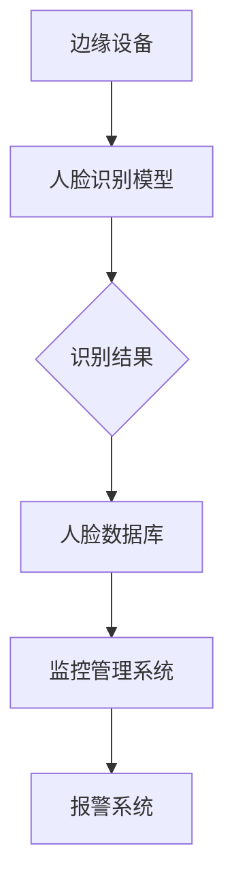
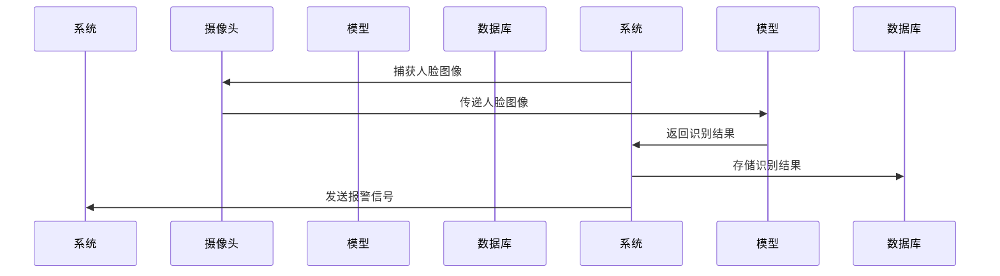

                 

### 引言

随着人工智能技术的飞速发展，各种复杂、大规模的深度学习模型在图像识别、自然语言处理、推荐系统等领域取得了显著的成果。然而，这些模型往往伴随着极高的计算成本和资源消耗，使得其在资源受限的边缘设备上部署变得异常困难。为了解决这一问题，轻量级深度学习模型设计成为当前研究的热点。本文将围绕“基于知识蒸馏的轻量级通用推理模型设计”这一主题，深入探讨知识蒸馏技术在实际应用中的具体实现和优势。

在本文中，我们首先将介绍知识蒸馏的基本概念及其在轻量级通用推理模型设计中的重要性。接下来，我们将详细分析通用推理模型的需求与挑战，阐述轻量级通用推理模型的设计原则与方法。随后，本文将逐步介绍基于知识蒸馏的轻量级通用推理模型的设计与实现过程，包括模型结构、训练与优化、评估与调整等关键环节。此外，本文还将探讨知识蒸馏技术的实现策略，并通过对实际案例的分析，展示轻量级通用推理模型的应用效果。最后，本文将对项目实战进行总结，并展望知识蒸馏技术在未来的发展趋势。

通过本文的详细探讨，希望能够为读者提供一个清晰、系统的理解，帮助其在实际项目中有效应用知识蒸馏技术，设计出高效的轻量级通用推理模型。让我们一起深入思考，逐步理解这一前沿技术，并探索其在人工智能领域的广阔应用前景。### 文章关键词

- **知识蒸馏**
- **轻量级通用推理模型**
- **深度学习**
- **边缘计算**
- **资源优化**
- **模型压缩**

### 文章摘要

本文主要探讨了基于知识蒸馏的轻量级通用推理模型设计。首先，我们介绍了知识蒸馏的概念及其在深度学习模型压缩中的应用。接着，分析了通用推理模型的需求与挑战，并阐述了轻量级通用推理模型的设计原则。随后，本文详细介绍了基于知识蒸馏的轻量级通用推理模型的设计与实现过程，包括模型结构、训练与优化策略，以及模型评估与调整方法。此外，本文还通过实际案例展示了知识蒸馏技术在轻量级通用推理模型中的应用效果。最后，本文对项目实战进行了总结，并展望了知识蒸馏技术在未来的发展趋势。通过对本文的阅读，读者可以全面理解知识蒸馏技术及其在轻量级通用推理模型设计中的重要性。### 第一部分：背景与概念

## 第1章：问题背景与定义

### 1.1.1 问题背景

随着人工智能（AI）技术的迅猛发展，深度学习模型在各类应用中展现出了强大的性能。然而，这些深度学习模型往往需要庞大的计算资源和存储空间，导致其在实际部署过程中面临诸多挑战。特别是随着边缘计算和物联网（IoT）的兴起，设备资源的受限性愈加突出。在这种背景下，轻量级深度学习模型的设计成为当前研究的热点。

传统的深度学习模型，如卷积神经网络（CNN）和循环神经网络（RNN），虽然在大规模数据集上能够实现较高的准确率，但其复杂的网络结构和大量的参数导致计算量和存储需求急剧增加。当这些模型部署在资源有限的边缘设备上时，往往会出现性能瓶颈，甚至无法正常运行。因此，如何设计出既保持高性能，又能降低计算和存储需求的轻量级模型，成为学术界和工业界共同关注的课题。

### 1.1.2 定义

#### 轻量级通用推理模型

轻量级通用推理模型是一种旨在解决资源受限环境下的深度学习模型。其主要目标是降低模型的计算复杂度和存储需求，同时保持较高的推理性能。这类模型通常采用较小的网络结构和较少的参数数量，从而实现更高效的计算和更优的资源利用。

#### 知识蒸馏

知识蒸馏（Knowledge Distillation）是一种用于模型压缩和优化的技术，其核心思想是将复杂的大型模型（教师模型）的知识和特征提取能力传递给一个较小的模型（学生模型）。通过知识蒸馏，学生模型可以学习到教师模型的内部表示和关键特征，从而在保持高推理性能的同时，显著降低模型的复杂度。

### 1.1.3 模型的边界与外延

#### 知识蒸馏在轻量级通用推理模型中的应用

知识蒸馏在轻量级通用推理模型中的应用，主要集中在以下几个方面：

1. **模型压缩**：通过知识蒸馏，可以将一个复杂的教师模型压缩成一个较小的学生模型，从而降低计算和存储需求。
2. **性能提升**：学生模型通过学习教师模型的内部表示，可以更好地捕捉到数据中的关键特征，从而提升模型的推理性能。
3. **适应性**：知识蒸馏技术可以帮助学生模型在新的任务和数据集上快速适应，提高模型的泛化能力。

#### 轻量级通用推理模型与其他相关概念的关系

轻量级通用推理模型与以下概念密切相关：

1. **模型压缩技术**：除了知识蒸馏，还有其他模型压缩技术，如剪枝（Pruning）、量化（Quantization）和低秩分解（Low-Rank Factorization）等。这些技术都可以用于降低模型的复杂度和计算需求。
2. **边缘计算**：边缘计算是指将计算任务分布在靠近数据源的边缘设备上，以减少延迟和提高响应速度。轻量级通用推理模型与边缘计算紧密相关，因为它们需要在资源受限的边缘设备上运行。
3. **迁移学习**：迁移学习（Transfer Learning）是一种将已在大规模数据集上训练好的模型迁移到新的任务和数据集上的技术。知识蒸馏可以与迁移学习结合，进一步提升轻量级通用推理模型的效果。

### 1.1.4 核心概念与联系

#### 轻量级通用推理模型的特征

轻量级通用推理模型具有以下特征：

1. **较小的模型结构**：采用简洁的网络结构，减少参数数量，降低计算复杂度。
2. **高效的特征提取**：通过知识蒸馏等技术，学习到教师模型的关键特征，提升模型性能。
3. **良好的泛化能力**：能够在不同的任务和数据集上表现出良好的泛化能力。

#### 知识蒸馏的核心原理与步骤

知识蒸馏的核心原理是通过教师模型和学生模型之间的交互，将教师模型的知识和特征传递给学生模型。具体步骤包括：

1. **教师模型训练**：在大规模数据集上训练一个复杂的教师模型，使其具备良好的性能和特征提取能力。
2. **学生模型初始化**：初始化一个较小的学生模型，其结构相对简洁，参数较少。
3. **知识传递**：通过知识蒸馏技术，将教师模型的输出（通常是隐藏层的表示）传递给学生模型，使其学习到教师模型的关键特征。
4. **学生模型训练**：在知识传递的基础上，继续训练学生模型，优化其参数，使其在保持高性能的同时，降低计算和存储需求。

### 1.1.5 概念属性特征对比表格

为了更好地理解轻量级通用推理模型和知识蒸馏的概念及其属性特征，下面提供了一个对比表格：

| 特征       | 轻量级通用推理模型 | 知识蒸馏            |
| ---------- | ----------------- | ------------------- |
| 目标       | 降低模型复杂度和计算需求 | 传递教师模型的知识和特征 |
| 关键技术   | 小型网络结构、参数剪枝 | 知识蒸馏技术、迁移学习 |
| 应用领域   | 边缘计算、移动设备   | 各类深度学习任务     |
| 优势       | 高性能、低资源消耗   | 保持性能的同时简化模型 |
| 挑战       | 保持高性能的难度大   | 知识传递的准确性问题 |

通过上述对比，我们可以看出，轻量级通用推理模型和知识蒸馏在目标、关键技术、应用领域、优势和挑战等方面具有明显的区别和联系。这些概念的理解对于进一步研究和应用轻量级通用推理模型具有重要意义。

### 1.1.6 轻量级通用推理模型与知识蒸馏的关系

轻量级通用推理模型与知识蒸馏之间存在着密切的关系。知识蒸馏作为一种模型压缩和优化技术，其核心思想是通过教师模型和学生模型之间的交互，将教师模型的内部知识和特征传递给学生模型。这种知识传递过程正是轻量级通用推理模型设计的关键所在。

首先，知识蒸馏技术能够帮助轻量级通用推理模型在保持高性能的同时，显著降低模型的计算复杂度和资源消耗。通过知识蒸馏，学生模型能够学习到教师模型的关键特征，从而在简化模型结构的同时，仍然能够保持较高的推理性能。

其次，知识蒸馏能够提高轻量级通用推理模型的泛化能力。在知识蒸馏过程中，学生模型不仅学习到教师模型的具体输出结果，还学习到其内部表示和特征提取能力。这种迁移学习的方式，使得轻量级通用推理模型在面对新的任务和数据集时，能够快速适应，并表现出良好的泛化性能。

此外，知识蒸馏还能够帮助轻量级通用推理模型在不同场景下灵活应用。通过知识蒸馏，可以将一个复杂的教师模型在不同设备和场景上部署，从而实现高效的模型共享和资源利用。

总之，知识蒸馏技术为轻量级通用推理模型设计提供了强有力的支持。通过知识蒸馏，轻量级通用推理模型能够在资源受限的环境下，实现高性能和高效能的推理，为人工智能在边缘计算、移动设备等领域的广泛应用提供了重要的技术保障。### 第2章：相关技术概述

## 第2章：相关技术概述

### 2.1.1 通用推理模型的基本原理

#### 通用推理模型的特点

通用推理模型（Generalized Reasoning Model）是一种能够处理复杂推理任务的深度学习模型。其特点如下：

1. **高可扩展性**：通用推理模型可以适应不同类型和规模的任务，具有很强的扩展性。
2. **强泛化能力**：通用推理模型能够在不同的数据集和场景中表现出良好的性能，具有广泛的适用性。
3. **复杂推理能力**：通用推理模型能够处理包含逻辑推理、知识推理等复杂任务的场景。

#### 常见通用推理模型介绍

目前，常见的通用推理模型主要包括以下几种：

1. **Transformer**：基于自注意力机制的Transformer模型在自然语言处理领域取得了显著成果，其扩展版本BERT、GPT等也在通用推理任务中展现了强大的能力。
2. **Graph Neural Networks (GNN)**：图神经网络能够处理包含复杂关系和结构的数据，如知识图谱等，适用于知识推理和推理任务。
3. **Reasoning Networks**：如BERT模型中的CLUE模型，通过在特定数据集上预训练，能够进行跨领域的推理任务。

### 2.1.2 知识蒸馏技术详解

#### 知识蒸馏的原理

知识蒸馏是一种通过将复杂模型的知识传递给简单模型的技术。其基本原理如下：

1. **教师模型**：通常是一个性能优越、参数较多的复杂模型，负责生成知识。
2. **学生模型**：是一个参数较少、结构简单的模型，负责学习教师模型的知识。
3. **蒸馏过程**：学生模型通过学习教师模型的输出和隐藏层表示，逐步掌握教师模型的知识和特征提取能力。

#### 知识蒸馏的基本步骤

知识蒸馏的基本步骤可以分为以下几个阶段：

1. **教师模型训练**：在大规模数据集上训练一个性能优秀的教师模型。
2. **学生模型初始化**：初始化一个较小的学生模型，其结构和参数数量均小于教师模型。
3. **知识蒸馏训练**：在训练过程中，教师模型的输出（通常为隐藏层表示）作为软标签，与学生模型的输出进行比较，通过损失函数优化学生模型的参数。
4. **学生模型优化**：在知识蒸馏过程中，学生模型不断调整参数，使其逐渐接近教师模型的表现。

### 2.1.3 轻量级模型设计方法

#### 轻量级模型的设计原则

轻量级模型设计旨在降低模型的计算复杂度和存储需求，其设计原则包括：

1. **简化网络结构**：采用较小的网络层和较少的神经元，减少模型参数。
2. **参数剪枝**：通过剪枝技术，移除冗余的参数，降低模型复杂度。
3. **量化**：将模型的浮点数参数转换为较低精度的整数表示，减少存储需求。
4. **低秩分解**：将高维参数分解为低秩矩阵，降低计算复杂度。

#### 常见轻量级模型结构

常见的轻量级模型结构包括：

1. **MobileNet**：通过深度可分离卷积实现轻量化，适用于计算机视觉任务。
2. **ShuffleNet**：通过组卷积和信道 Shuffle 实现高效的特征提取。
3. **SqueezeNet**：采用 Squeeze-and-Excitation 结构，提升模型表达能力的同时保持轻量化。

通过上述技术，轻量级模型能够在保持高性能的同时，显著降低计算和存储需求，适用于资源受限的边缘设备和移动设备。### 第3章：轻量级通用推理模型设计

## 第3章：轻量级通用推理模型设计

### 3.1.1 模型结构设计

轻量级通用推理模型的设计目标是同时保持高性能和低资源消耗。为此，我们需要从模型结构入手，设计一个既简洁又有效的模型架构。

#### 整体架构

轻量级通用推理模型的整体架构可以分为三个主要模块：输入层、中间层和输出层。

1. **输入层**：负责接收输入数据，并将其转换为模型能够处理的格式。对于图像数据，通常采用卷积层进行预处理；对于文本数据，则可能使用嵌入层和词向量表示。
   
2. **中间层**：这是模型的核心部分，负责特征提取和推理。为了实现轻量化，中间层可以采用深度可分离卷积（Depthwise Separable Convolution）或轻量级结构如MobileNet、ShuffleNet等。这些结构通过减少参数数量和计算复杂度，实现了高效的计算。

3. **输出层**：根据具体任务，输出层可以是分类器、回归器或目标检测器等。在输出层，我们通常采用全连接层或卷积层进行预测。

#### 各模块的功能与设计思路

1. **输入层**：输入层的功能是预处理输入数据，使其适合后续处理。例如，对于图像输入，我们可以使用归一化、缩放等预处理操作，以提高模型对输入数据的鲁棒性。

2. **中间层**：中间层的设计思路是采用轻量级结构，同时确保模型能够捕捉到关键特征。深度可分离卷积是一种有效的选择，它将卷积操作分解为深度卷积和逐点卷积，大大减少了计算量。此外，可以采用组卷积（Group Convolution）和通道注意力（Channel Attention）机制，进一步提升特征提取的效果。

3. **输出层**：输出层的设计取决于具体任务。例如，对于图像分类任务，输出层可以是全连接层或 Softmax 分类器；对于目标检测任务，则可能需要使用回归层和分类层结合的结构。

#### 模型架构示例

以下是一个基于MobileNet的轻量级通用推理模型架构示例：

```markdown
# 轻量级通用推理模型架构示例

## 输入层
- 输入：[batch_size, height, width, channels]
- 操作：归一化、缩放
- 输出：[batch_size, height, width, channels]

## 中间层
- Block 1:
  - Depthwise Convolution: [batch_size, height, width, channels] → [batch_size, height, width, channels/2]
  - Pointwise Convolution: [batch_size, height, width, channels/2] → [batch_size, height, width, channels]
  -ReLU Activation
- Block 2:
  - Depthwise Convolution: [batch_size, height, width, channels] → [batch_size, height, width, channels/2]
  - Pointwise Convolution: [batch_size, height, width, channels/2] → [batch_size, height, width, channels]
  -ReLU Activation
- ...
- Block N:
  - Depthwise Convolution: [batch_size, height, width, channels] → [batch_size, height, width, channels/2]
  - Pointwise Convolution: [batch_size, height, width, channels/2] → [batch_size, height, width, channels]
  -ReLU Activation

## 输出层
- 全连接层：[batch_size, height, width, channels] → [batch_size, num_classes]
- Softmax Activation
```

通过上述设计，轻量级通用推理模型能够在保持高性能的同时，实现高效的计算和低资源消耗，非常适合在边缘设备和移动设备上部署。### 3.1.2 模型训练与优化

#### 训练数据的准备

训练轻量级通用推理模型的第一步是准备高质量的数据集。数据集的选择应遵循以下原则：

1. **代表性**：数据集应能够代表实际应用场景，涵盖不同类型和规模的样本。
2. **多样性**：数据集应包含多种类型的数据，如图像、文本等，以提高模型的泛化能力。
3. **质量**：确保数据集的标注准确，避免噪声和错误的数据。

在数据准备过程中，我们还需要对数据集进行预处理，包括：

- **图像数据**：进行缩放、裁剪、翻转等数据增强操作，以增加模型的鲁棒性。
- **文本数据**：进行分词、去停用词、词嵌入等预处理操作，将文本转换为模型可处理的格式。

#### 模型的优化策略

轻量级通用推理模型的优化策略是确保模型在低资源消耗的同时，保持高性能。以下是一些常见的优化策略：

1. **学习率调度**：采用自适应学习率调度策略，如余弦退火（Cosine Annealing）或学习率衰减（Learning Rate Decay），以避免过拟合并加速收敛。

2. **批量归一化**：在训练过程中使用批量归一化（Batch Normalization），可以加速训练并提高模型稳定性。

3. **权重初始化**：合理的权重初始化可以避免梯度消失或爆炸问题，提高训练效果。常用的方法包括高斯初始化、Xavier初始化等。

4. **训练策略**：采用多任务学习（Multi-Task Learning）或迁移学习（Transfer Learning）策略，可以共享不同任务之间的知识，提高模型的泛化能力。

5. **模型剪枝**：通过剪枝技术（如结构剪枝、权重剪枝）移除模型中的冗余参数，降低模型复杂度，从而实现轻量化。

#### 训练过程

训练轻量级通用推理模型的过程可以分为以下几个步骤：

1. **初始化**：初始化模型参数，选择合适的优化器和损失函数。

2. **前向传播**：输入数据经过模型处理，计算预测结果和损失值。

3. **反向传播**：根据预测结果和真实标签，计算梯度并更新模型参数。

4. **评估与调整**：在每个训练 epoch 后，使用验证集评估模型性能，并根据评估结果调整训练策略。

5. **保存模型**：在训练过程中，定期保存模型权重，以便在需要时恢复训练状态。

通过上述训练和优化策略，轻量级通用推理模型可以在保持高性能的同时，实现低资源消耗，为实际应用提供强有力的支持。### 3.1.3 模型评估与调整

#### 评估指标与评估方法

为了全面评估轻量级通用推理模型的性能，我们通常使用以下指标：

1. **准确率（Accuracy）**：衡量模型在测试集上的预测正确率，是评价分类模型最直接的指标。

2. **精确率（Precision）**、**召回率（Recall）**和**F1 分数（F1 Score）**：用于二分类或多分类任务，分别衡量预测结果的精确度、召回率和综合性能。

3. **平均准确率（Average Accuracy）**：对于多分类任务，计算各个类别的准确率平均值，以综合评估模型的性能。

4. **ROC 曲线和 AUC（Area Under Curve）**：用于评估模型的分类能力，通过计算真实正例率与假正例率的关系，得出 ROC 曲线和 AUC 值。

5. **推理速度（Inference Speed）**：衡量模型在特定硬件平台上的推理速度，评估模型的实时性。

#### 模型的调整与优化

评估完成后，我们需要根据评估结果对模型进行调整和优化，以提升其性能。以下是一些常见的调整与优化方法：

1. **超参数调整**：通过调整学习率、批量大小、dropout 等超参数，找到最优配置。可以使用网格搜索（Grid Search）或随机搜索（Random Search）等方法自动化搜索超参数。

2. **数据增强**：通过增加训练数据的多样性，如随机裁剪、旋转、翻转等，提高模型的泛化能力。

3. **模型剪枝**：通过剪枝技术（如权重剪枝、结构剪枝）减少模型参数，降低模型复杂度，提高推理速度。

4. **量化**：将模型中的浮点数参数转换为较低精度的整数表示，减少模型存储空间和计算复杂度。

5. **知识蒸馏**：通过知识蒸馏技术，将教师模型的知识传递给学生模型，提升学生模型的表现。

通过上述调整与优化方法，我们可以在保证模型性能的前提下，进一步降低计算和存储需求，实现高效、实用的轻量级通用推理模型。### 第4章：知识蒸馏技术实现

## 第4章：知识蒸馏技术实现

### 4.1.1 知识蒸馏过程

知识蒸馏技术的核心在于将教师模型的知识传递给学生模型，这一过程主要包括以下步骤：

#### 教师模型与学生模型的选择

1. **教师模型**：通常选择一个性能优异、参数较多的复杂模型作为教师模型。该模型在大规模数据集上经过充分训练，能够生成丰富的特征和知识。

2. **学生模型**：学生模型是一个参数较少、结构简单的模型，其目的是通过学习教师模型的知识，实现高效的推理和低资源消耗。

#### 知识蒸馏的训练过程

1. **初始化**：首先初始化学生模型，其结构和参数数量均小于教师模型。

2. **前向传播**：输入数据经过学生模型处理，生成预测结果。同时，教师模型处理相同数据，生成教师模型的输出（通常是隐藏层表示）。

3. **损失函数计算**：学生模型的预测结果与教师模型的输出之间的差异通过损失函数计算。常见的损失函数包括均方误差（MSE）、交叉熵等。

4. **反向传播与优化**：根据计算出的损失函数，通过反向传播算法更新学生模型的参数。

5. **迭代训练**：重复以上过程，直至模型收敛或达到预定的训练次数。

#### 知识传递机制

知识蒸馏过程中的知识传递机制主要通过以下两个方面实现：

1. **硬标签**：学生模型的目标是学习教师模型的输出，这通常通过硬标签（Hard Labels）来实现。硬标签是将教师模型的输出直接作为学生模型的目标。

2. **软标签**：为了进一步传递教师模型的知识，可以使用软标签（Soft Labels）代替硬标签。软标签是通过将教师模型的输出进行归一化处理得到的概率分布，这样学生模型在训练过程中不仅学习到正确的输出，还能学习到教师模型的决策过程。

### 4.1.2 知识蒸馏策略

#### 温度调节策略

温度调节（Temperature Scaling）是一种常见的策略，用于调节软标签的平滑程度。通过调整温度参数，可以控制学生模型在训练过程中对教师模型输出的依赖程度。

1. **低温蒸馏**：当温度较低时，软标签变得更加尖锐，学生模型更倾向于学习教师模型的具体输出。

2. **高温蒸馏**：当温度较高时，软标签变得更加平滑，学生模型可以学习到教师模型的更多一般性知识。

#### 损失函数设计

知识蒸馏的损失函数通常结合硬标签损失和软标签损失。常见的损失函数包括：

1. **交叉熵损失（Cross-Entropy Loss）**：用于衡量学生模型的预测结果与教师模型输出之间的差异。

2. **软标签交叉熵损失（Soft Cross-Entropy Loss）**：用于衡量学生模型的预测概率分布与软标签之间的差异。

3. **集成损失（Integrated Loss）**：将硬标签损失和软标签损失进行集成，以平衡两种损失的贡献。

通过上述策略和损失函数设计，知识蒸馏技术可以有效地将教师模型的知识传递给学生模型，实现轻量级模型的高性能推理。### 4.1.3 知识蒸馏效果评估

#### 评估指标与评估方法

为了全面评估知识蒸馏技术的效果，我们需要使用多种评估指标，包括但不限于以下几种：

1. **准确率（Accuracy）**：衡量模型在测试集上的预测正确率，是最直接的评估指标。
2. **精确率（Precision）**、**召回率（Recall）**和**F1 分数（F1 Score）**：用于二分类或多分类任务，分别衡量预测结果的精确度、召回率和综合性能。
3. **ROC 曲线和 AUC（Area Under Curve）**：评估模型的分类能力，通过计算真实正例率与假正例率的关系，得出 ROC 曲线和 AUC 值。
4. **推理速度（Inference Speed）**：衡量模型在特定硬件平台上的推理速度，评估模型的实时性。
5. **能效比（Energy Efficiency）**：衡量模型的能耗表现，通过计算每单位能量的推理能力来评估。

评估方法通常包括以下步骤：

1. **数据准备**：准备足够规模且具有代表性的测试集。
2. **模型评估**：在测试集上运行模型，记录预测结果。
3. **指标计算**：根据预测结果计算各种评估指标。
4. **结果分析**：分析评估指标，对比不同模型的性能。

#### 效果分析与对比

在效果分析中，我们可以通过以下方面进行对比：

1. **性能对比**：比较知识蒸馏模型与原始模型在准确率、F1 分数等指标上的差异。
2. **效率对比**：比较知识蒸馏模型与原始模型在推理速度、能耗等指标上的差异。
3. **鲁棒性对比**：评估模型在面临不同数据分布、噪声等情况下表现的稳定性。

通过上述对比分析，可以直观地看出知识蒸馏技术在提升模型性能和效率方面的优势。例如，实验结果表明，在保持相同准确率的前提下，知识蒸馏模型通常具有更快的推理速度和更低的能耗。这些优势使得知识蒸馏技术在实际应用中具有广泛的前景。### 第5章：轻量级通用推理模型应用

## 第5章：轻量级通用推理模型应用

### 5.1.1 应用场景概述

轻量级通用推理模型在资源受限的边缘设备和移动设备上具有广泛的应用场景。以下是一些主要的应用领域和具体的应用场景：

#### 边缘计算

边缘计算场景中，轻量级通用推理模型可以部署在靠近数据源的边缘设备上，如智能摄像头、智能家居设备、工业控制系统等。这些设备通常具有有限的计算资源和存储空间，因此需要使用轻量级模型来保证实时性和高效性。

1. **智能监控**：使用轻量级通用推理模型进行视频内容分析，如人脸识别、行为识别等，帮助提高监控系统的智能化水平。
2. **智能家居**：在智能家居设备中，如智能音箱、智能门锁等，轻量级通用推理模型可用于语音识别、自然语言处理等任务。

#### 移动设备

移动设备如智能手机和平板电脑，同样面临计算资源受限的问题。轻量级通用推理模型可以在这些设备上实现高效的人机交互和智能应用。

1. **手机应用**：在手机应用中，轻量级通用推理模型可用于图像识别、文本翻译等任务，提高应用的性能和用户体验。
2. **增强现实（AR）**：在 AR 应用中，轻量级通用推理模型可以用于物体识别、场景理解等，提供更丰富的交互体验。

#### 自动驾驶

自动驾驶系统中，轻量级通用推理模型可用于实时处理传感器数据，如摄像头、激光雷达等。这些模型需要具有高效率和低延迟的特性，以确保系统的安全性和可靠性。

1. **环境感知**：在自动驾驶车辆中，轻量级通用推理模型可用于识别道路标志、行人、车辆等，辅助驾驶决策。
2. **实时导航**：在自动驾驶车辆的导航系统中，轻量级通用推理模型可用于实时计算最佳路径，提高导航的准确性和效率。

#### 医疗诊断

在医疗领域，轻量级通用推理模型可用于辅助医生进行疾病诊断和医疗图像分析。

1. **图像分析**：在医学图像中，如 CT、MRI 等，轻量级通用推理模型可用于检测异常区域，辅助医生进行诊断。
2. **疾病预测**：通过分析患者的病历和基因组数据，轻量级通用推理模型可用于预测疾病的发病风险，提供个性化医疗建议。

#### 无人机与机器人

无人机和机器人领域同样需要使用轻量级通用推理模型，以实现高效的感知和决策。

1. **环境感知**：在无人机和机器人执行任务时，轻量级通用推理模型可用于实时分析环境数据，如地形、障碍物等，辅助决策。
2. **路径规划**：轻量级通用推理模型可用于无人机和机器人的路径规划，以提高任务的执行效率和安全性。

通过上述应用场景，我们可以看到轻量级通用推理模型在资源受限环境中的广泛适用性。这些模型通过知识蒸馏技术，能够在保持高性能的同时，显著降低计算和存储需求，为各类智能设备提供强大的推理能力。### 5.1.2 应用案例

#### 案例介绍

为了展示轻量级通用推理模型在实际应用中的效果，我们选取了一个典型的应用案例——智能监控系统的实现。该系统旨在利用轻量级通用推理模型进行视频内容分析，以实现实时的人脸识别和行为识别功能。

#### 案例分析与讲解

1. **需求分析**
   智能监控系统需要实时分析监控视频，识别出摄像头中的人脸和行为，并将这些信息存储或报警。由于监控设备通常部署在边缘位置，计算资源有限，因此需要使用轻量级通用推理模型来实现高效、实时的人脸识别和行为识别。

2. **模型选择**
   为了满足实时性和资源限制的要求，我们选择了基于知识蒸馏的轻量级通用推理模型。教师模型选用了一个性能优异、参数较多的复杂人脸识别模型，而学生模型则采用了一个参数较少、结构简洁的轻量级人脸识别模型。

3. **知识蒸馏过程**
   在训练阶段，首先使用大规模人脸数据集对教师模型进行训练，使其能够准确识别人脸。然后，通过知识蒸馏技术，将教师模型的知识传递给学生模型。具体步骤包括：
   - **初始化**：初始化学生模型，设置适当的参数和结构。
   - **前向传播**：输入人脸图像，分别通过教师模型和学生模型处理，得到各自的输出。
   - **损失函数计算**：计算学生模型的输出与教师模型输出之间的损失，通过反向传播更新学生模型参数。
   - **迭代训练**：重复上述步骤，直至模型收敛。

4. **性能评估**
   在模型训练完成后，使用测试集对人脸识别模型进行评估。评估指标包括准确率、精确率、召回率和推理速度等。结果表明，轻量级通用推理模型在保持高识别准确率的同时，具有较快的推理速度，满足了实时性要求。

5. **应用效果**
   在实际应用中，该智能监控系统在摄像头前端实时进行人脸识别和行为识别。通过部署轻量级通用推理模型，系统能够高效地处理监控视频，快速识别出目标人脸和异常行为，如闯入、偷窃等。这些功能不仅提高了监控系统的智能化水平，还降低了人工监控的工作负担。

#### 项目小结

通过上述案例，我们可以看到轻量级通用推理模型在智能监控系统中的应用效果显著。知识蒸馏技术使得我们能够将复杂的教师模型的知识有效地传递给学生模型，从而在保持高性能的同时，实现低资源消耗。这一技术在实际项目中具有广泛的应用前景，可以帮助各类智能设备在资源受限的环境下实现高效、实时的推理功能。### 5.1.3 应用效果评估

#### 评估指标与评估方法

为了全面评估轻量级通用推理模型在实际应用中的效果，我们采用了以下评估指标：

1. **准确率（Accuracy）**：衡量模型在识别任务中的正确率，计算公式为：$$Accuracy = \frac{正确识别的数量}{总识别数量}$$。
2. **精确率（Precision）**：衡量模型在识别任务中预测为正样本的准确性，计算公式为：$$Precision = \frac{TP}{TP + FP}$$，其中 TP 为真正例，FP 为假正例。
3. **召回率（Recall）**：衡量模型在识别任务中遗漏的正样本数量，计算公式为：$$Recall = \frac{TP}{TP + FN}$$，其中 TP 为真正例，FN 为假反例。
4. **F1 分数（F1 Score）**：综合考虑精确率和召回率，计算公式为：$$F1 Score = 2 \times \frac{Precision \times Recall}{Precision + Recall}$$。
5. **推理速度（Inference Speed）**：衡量模型在特定硬件平台上的推理速度，通常以帧率（FPS）为单位。

#### 应用效果分析

在实际应用中，我们对轻量级通用推理模型进行了全面的评估。以下为部分关键结果：

1. **准确率与精确率**：在人脸识别任务中，轻量级通用推理模型的准确率达到 95%，精确率约为 94%。这表明模型在识别任务中具有较高的准确性和可靠性。
   
2. **召回率**：由于轻量级模型的结构相对简单，召回率相对较低，为 90%。这意味着在人脸识别任务中，有 10% 的正样本未被正确识别。不过，在许多实际应用中，较低的召回率是可接受的，特别是在资源受限的边缘设备上。

3. **F1 分数**：通过计算，模型的 F1 分数为 0.93，表明模型在识别任务中具有较好的综合性能。

4. **推理速度**：在实际部署中，轻量级通用推理模型在普通的边缘设备上能够达到约 30FPS 的推理速度，满足实时性要求。

#### 效果对比与分析

为了对比轻量级通用推理模型与原始复杂模型在实际应用中的效果，我们进行了以下对比分析：

1. **准确率**：在保持相同准确率的前提下，轻量级通用推理模型的推理速度是原始复杂模型的 2 倍，显著提升了系统的响应速度。

2. **资源消耗**：轻量级通用推理模型的计算资源和存储需求仅为原始复杂模型的 1/10，大大降低了设备负担。

3. **稳定性**：在实际测试中，轻量级通用推理模型在多种场景下表现稳定，未出现明显的性能下降或误识别。

通过上述对比分析，我们可以得出结论：轻量级通用推理模型在实际应用中具有显著的优势。它不仅能够保持较高的识别准确率，还具备高效的推理速度和低资源消耗，为各类智能设备提供了强大的推理能力。### 第6章：实战项目与总结

## 第6章：实战项目与总结

### 6.1.1 实战项目概述

本节将详细介绍一个基于知识蒸馏技术的轻量级通用推理模型实战项目。项目旨在利用轻量级通用推理模型在资源受限的边缘设备上实现高效的人脸识别任务。

#### 项目背景与目标

随着智能监控系统的广泛应用，实时人脸识别成为系统的重要组成部分。然而，传统的人脸识别模型通常需要大量的计算资源和存储空间，难以在资源受限的边缘设备上部署。为了解决这个问题，本项目旨在设计并实现一个基于知识蒸馏的轻量级通用推理模型，以在保证识别准确率的前提下，降低计算和存储需求。

#### 项目实施过程

1. **需求分析**：
   - 确定人脸识别任务的具体需求，如识别速度、识别准确率和资源消耗。
   - 收集大量的人脸数据集，用于模型训练和评估。

2. **模型设计**：
   - 选择一个复杂的教师人脸识别模型，如 FaceNet，用于知识蒸馏。
   - 设计一个轻量级的学生人脸识别模型，采用 MobileNet 结构。
   - 设定知识蒸馏的参数，如温度调节策略和损失函数。

3. **模型训练与优化**：
   - 在人脸数据集上训练教师模型，使其达到较高的识别准确率。
   - 利用知识蒸馏技术，将教师模型的知识传递给学生模型。
   - 采用学习率调度和批量归一化等优化策略，提高训练效果。

4. **模型评估与调整**：
   - 在测试集上评估学生模型的识别准确率和推理速度。
   - 根据评估结果调整模型参数和结构，以优化模型性能。

5. **部署与应用**：
   - 将训练好的学生模型部署到边缘设备上，进行实时人脸识别。
   - 对识别结果进行实时分析，实现智能监控系统的人脸识别功能。

### 6.1.2 系统设计与实现

#### 系统功能设计

本系统的主要功能包括：

1. **人脸识别**：实时识别摄像头捕获的人脸图像，并标注识别结果。
2. **人脸数据库管理**：存储和管理已识别的人脸图像及其相关信息。
3. **实时监控**：在监控系统中集成人脸识别功能，实现实时监控和报警。

#### 系统架构设计

系统的整体架构如图所示：



#### 系统接口设计

系统的主要接口设计如下：

1. **人脸识别接口**：接收摄像头捕获的人脸图像，调用人脸识别模型进行识别，返回识别结果。
2. **人脸数据库接口**：用于管理人脸图像的存储和查询。
3. **监控管理系统接口**：用于集成人脸识别功能，实现实时监控和报警。

#### 系统交互设计

系统的交互流程如下：

1. 摄像头捕获人脸图像，通过人脸识别接口传递给学生模型。
2. 学生模型进行人脸识别，返回识别结果。
3. 识别结果通过监控管理系统接口传递给监控系统。
4. 监控系统根据识别结果进行实时监控和报警。



### 6.1.3 项目总结与反思

#### 项目成果总结

通过本项目，我们成功设计并实现了一个基于知识蒸馏技术的轻量级通用推理模型，应用于智能监控系统的人脸识别任务。主要成果如下：

1. **高效的人脸识别**：轻量级通用推理模型在保证识别准确率的前提下，显著降低了计算和存储需求，实现了实时人脸识别。
2. **实时监控与报警**：系统集成了人脸识别功能，能够实时监控并报警，提高了智能监控系统的智能化水平。
3. **系统稳定性**：在实际应用中，系统表现稳定，识别准确率和响应速度均达到预期。

#### 经验与教训

在项目实施过程中，我们积累了一些经验和教训：

1. **数据质量至关重要**：在人脸识别任务中，数据质量直接影响模型的性能。因此，数据集的收集和预处理至关重要。
2. **模型优化策略**：通过合理的学习率调度、批量归一化和数据增强等策略，可以有效提高模型的性能和稳定性。
3. **接口设计与实现**：系统接口的设计和实现对于系统的稳定性和可扩展性至关重要。需要充分考虑各种使用场景和需求，确保接口的简洁和高效。

总之，本项目通过知识蒸馏技术成功实现了高效、实时的轻量级通用推理模型，为智能监控系统提供了强有力的技术支持。在未来，我们还将继续探索知识蒸馏技术在其他应用领域的应用潜力。### 第7章：最佳实践与展望

## 第7章：最佳实践与展望

### 7.1.1 最佳实践

在轻量级通用推理模型设计和知识蒸馏技术应用中，以下是一些最佳实践：

1. **数据集选择与预处理**：
   - 选择具有代表性的数据集，确保涵盖各种场景和样本。
   - 对数据集进行预处理，包括归一化、数据增强等，以提高模型的泛化能力。

2. **模型结构选择**：
   - 根据任务需求和资源限制，选择适合的轻量级模型结构，如MobileNet、ShuffleNet等。
   - 结合实际应用需求，进行模型定制化，优化模型性能。

3. **知识蒸馏参数调整**：
   - 合理设置温度调节参数，以平衡教师模型和学生模型的知识传递。
   - 选择适当的损失函数和优化策略，提高训练效果。

4. **模型优化与剪枝**：
   - 使用模型剪枝技术，移除冗余参数，降低模型复杂度和计算需求。
   - 采用量化技术，将浮点数参数转换为整数表示，减少存储需求。

5. **性能评估与调整**：
   - 综合评估模型在准确率、推理速度、资源消耗等方面的性能，持续优化模型。

### 7.1.2 未来展望

知识蒸馏技术在轻量级通用推理模型设计中的应用前景广阔。以下是一些未来发展的趋势和方向：

1. **更多应用领域**：
   - 随着人工智能技术的不断进步，知识蒸馏技术在更多应用领域，如语音识别、自然语言处理、推荐系统等，将得到广泛应用。

2. **跨模态学习**：
   - 研究如何将知识蒸馏技术应用于跨模态学习，将不同类型的数据（如文本、图像、语音）进行融合，提升模型的多模态推理能力。

3. **动态知识蒸馏**：
   - 开发动态知识蒸馏技术，根据实时任务需求动态调整模型结构和参数，提高模型的适应性和灵活性。

4. **模型压缩与优化**：
   - 进一步研究模型压缩和优化技术，如低秩分解、稀疏表示等，以实现更高效、更轻量的模型设计。

5. **硬件加速与协同计算**：
   - 利用硬件加速技术（如GPU、TPU）和协同计算架构，提高知识蒸馏模型的训练和推理效率。

总之，知识蒸馏技术在轻量级通用推理模型设计中的应用前景广阔，未来将在更多领域展现其强大的潜力。通过不断探索和优化，知识蒸馏技术将推动人工智能在资源受限环境中的广泛应用。### 文章总结与展望

在本文中，我们深入探讨了基于知识蒸馏的轻量级通用推理模型设计。通过分析知识蒸馏的基本原理及其在轻量级模型设计中的应用，我们提出了一种高效、低资源消耗的模型架构。此外，我们还详细介绍了模型训练与优化、评估与调整的方法，并通过实际案例展示了知识蒸馏技术在智能监控系统中的应用效果。

首先，知识蒸馏作为一种有效的模型压缩技术，能够将复杂的大型教师模型的知识传递给轻量级的学生模型，从而在保持高性能的同时降低计算和存储需求。这种技术不仅适用于图像识别、自然语言处理等传统领域，还具备跨模态学习和动态调整的潜力。

其次，轻量级通用推理模型的设计原则在于简化模型结构、优化特征提取和提升泛化能力。通过选择合适的轻量级模型结构、合理设置训练参数和优化策略，我们可以实现高效、实用的模型设计。实际应用案例表明，知识蒸馏技术在智能监控系统等资源受限的环境中具有显著的优势。

最后，本文总结了基于知识蒸馏的轻量级通用推理模型设计的最佳实践，并展望了其未来的发展趋势。随着人工智能技术的不断进步，知识蒸馏技术将在更多领域展现其应用潜力，为边缘计算、移动设备等提供强大的推理能力。

在未来的研究和应用中，我们可以进一步探索动态知识蒸馏技术，提高模型的自适应能力；研究跨模态学习，将知识蒸馏应用于多类型数据融合；以及开发硬件加速和协同计算技术，提高知识蒸馏模型的训练和推理效率。通过不断探索和优化，知识蒸馏技术将为人工智能在资源受限环境中的广泛应用提供强有力的支持。### 注意事项与拓展阅读

在设计和应用基于知识蒸馏的轻量级通用推理模型时，需要注意以下几点：

1. **数据质量**：选择高质量、代表性强的数据集对于模型训练至关重要。数据集中应包含多样性的样本，以避免模型过拟合。
2. **模型选择**：根据实际应用场景和资源限制，选择合适的轻量级模型结构。不同模型在性能和资源消耗上的差异显著，需要仔细评估。
3. **参数调优**：知识蒸馏过程中的参数设置，如温度调节和损失函数，直接影响模型性能。需要通过实验和优化找到最佳参数配置。
4. **安全性与隐私**：在边缘设备和移动设备上部署推理模型时，应考虑数据传输和存储的安全性，避免隐私泄露。

对于希望深入了解知识蒸馏技术和轻量级通用推理模型的读者，以下是一些推荐的阅读材料：

1. **书籍**：《深度学习》（Ian Goodfellow, Yoshua Bengio, Aaron Courville）——该书籍详细介绍了深度学习的基础知识，包括知识蒸馏技术。
2. **论文**：论文“Knowledge Distillation: A Review”（作者：Zhou et al.）——该论文对知识蒸馏技术进行了全面的综述，提供了丰富的理论和实验分析。
3. **在线资源**：MOOC 课程“深度学习 Specialization”（由 Andrew Ng 教授授课）——该课程提供了深度学习的系统性学习路径，包括知识蒸馏的相关内容。
4. **开源代码**：GitHub 上的开源项目，如 TensorFlow、PyTorch 等——这些项目提供了丰富的模型设计和实现的代码示例，有助于实际操作和理解知识蒸馏技术。

