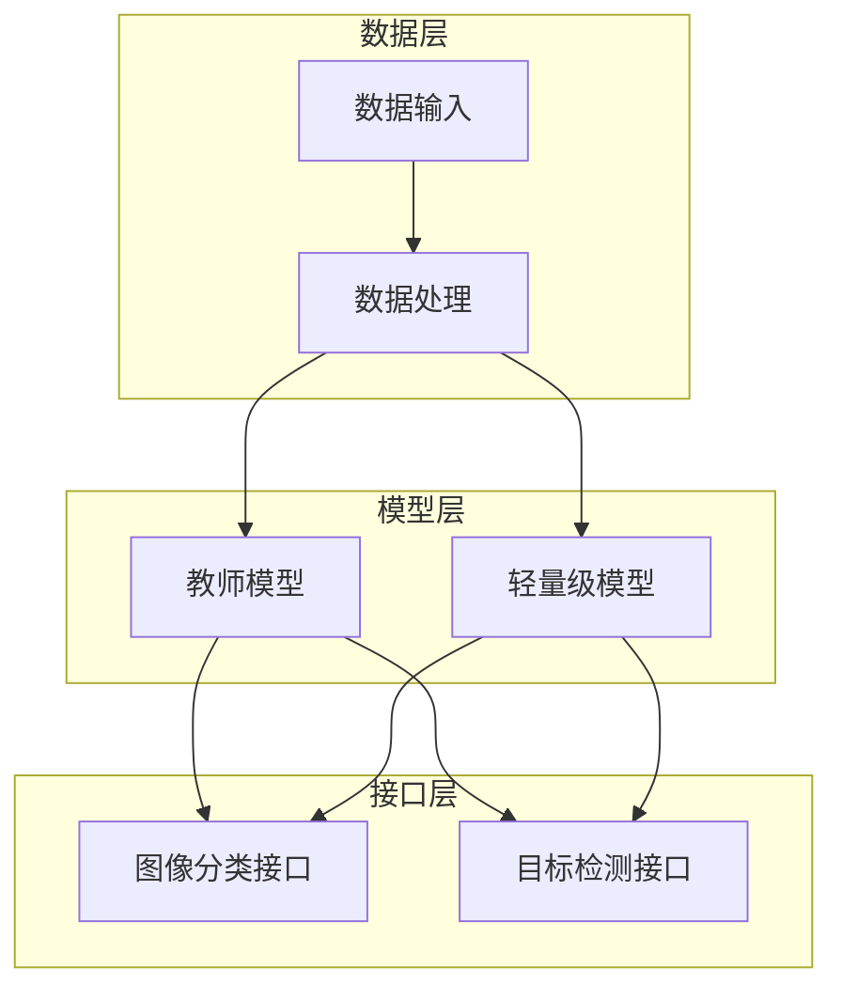
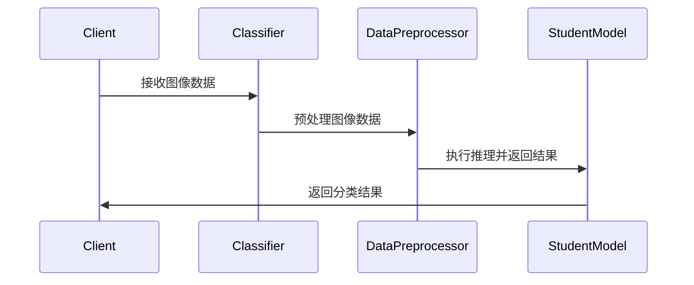
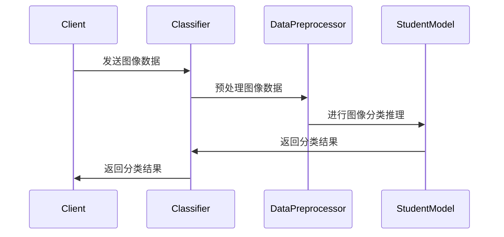

                 

### 第一部分：背景介绍

#### 1.1 计算机视觉领域的挑战

计算机视觉作为人工智能的重要分支，近年来取得了显著的进展。然而，随着应用场景的复杂化，计算机视觉领域仍然面临着一系列挑战。首先，图像和视频数据量的急剧增长对计算资源提出了更高的要求。传统的深度学习模型往往需要大量的计算资源和时间进行训练和推理，这在实时应用中显得力不从心。此外，深度学习模型的高度复杂性和“黑盒”性质也使得模型的解释性和可靠性受到质疑。在实际应用中，对模型的理解和优化往往需要深入的理论研究和大量的实验验证。

#### 1.2 人工智能的发展与应用

人工智能（AI）作为推动社会发展的核心技术，正在各个领域发挥重要作用。计算机视觉是人工智能的一个重要分支，其应用范围广泛，包括但不限于图像识别、目标检测、视频监控、自动驾驶等。随着深度学习技术的不断进步，计算机视觉模型的性能逐渐提升，逐渐接近或甚至超越了人类的表现。然而，随着模型复杂度的增加，计算资源的需求也在不断增加，这对于轻量级模型的研发提出了迫切的需求。

#### 1.3 轻量级推理模型的需求

在众多应用场景中，尤其是移动设备和嵌入式系统中，计算资源和存储空间的限制尤为明显。轻量级推理模型因其较小的模型尺寸和较低的计算复杂度，成为了当前研究的热点。轻量级模型不仅能够节省计算资源，提高系统的实时性，还能有效降低功耗，延长设备的续航时间。例如，在智能手机和可穿戴设备中，轻量级模型的应用能够提供更加流畅和高效的用户体验。此外，在自动驾驶、机器人等领域，轻量级模型的快速推理能力对于系统的稳定性和安全性也至关重要。

#### 1.4 研究现状

目前，轻量级推理模型的研究主要集中在以下几个方面：首先是模型结构的优化，通过设计更加高效的神经网络结构，减少模型的参数数量和计算量；其次是训练策略的改进，如迁移学习、蒸馏学习等方法，以提升模型在有限数据集上的性能；再次是模型压缩技术，如剪枝、量化等，以进一步减少模型的存储和计算需求。然而，现有的轻量级模型在保持性能的同时，仍然存在一些不足之处，如对特定任务的不适应性、泛化能力不足等，这些问题的解决需要新的理论和技术手段。

### 核心概念

#### 2.1 知识蒸馏的定义

知识蒸馏（Knowledge Distillation）是一种将复杂模型的知识迁移到轻量级模型的技术。其核心思想是将一个大的、复杂的教师模型（Teacher Model）的知识和特征表示迁移到一个小巧、高效的辅助模型（Student Model）中。通过这个过程，轻量级模型能够继承教师模型的大部分性能，同时显著减小模型尺寸和计算复杂度。

#### 2.2 轻量级通用推理模型的定义

轻量级通用推理模型是一种适用于各种不同应用场景的小型、高效模型。这种模型通常具备以下特点：首先，模型结构简洁，参数数量少；其次，推理速度快，能够满足实时性要求；再次，具有较好的泛化能力，能够应对多种任务。轻量级通用推理模型的设计旨在平衡模型性能、计算资源和存储空间之间的矛盾。

#### 2.3 关键技术与应用领域

知识蒸馏和轻量级通用推理模型的研究涉及到多个关键技术，包括但不限于：

- **神经网络结构设计**：通过设计深度可分离卷积、残差连接等结构，提高模型效率和性能。
- **训练策略**：使用迁移学习、对抗训练等方法，增强模型的泛化能力和适应性。
- **模型压缩技术**：如剪枝、量化等技术，以减少模型的存储和计算需求。
- **应用领域**：轻量级通用推理模型在移动设备、嵌入式系统、自动驾驶、机器人等领域具有广泛的应用前景。

#### 2.4 研究目标与边界

**研究目标**：

- 设计一种高效的轻量级通用推理模型，能够在多种应用场景中保持高性能。
- 研究并优化知识蒸馏算法，提高模型在有限数据集上的性能和泛化能力。
- 探索新的模型压缩技术，进一步减少模型的存储和计算需求。

**边界与外延**：

- 边界：本文的研究主要关注轻量级通用推理模型的设计和实现，不包括模型在实际应用中的部署和优化。
- 外延：本文的研究结果可以应用于计算机视觉、自然语言处理等多个领域，为相关领域的研究提供理论支持和实践参考。

#### 2.5 概念结构与核心要素组成

为了更好地理解知识蒸馏和轻量级通用推理模型，我们需要从概念结构上进行分析。本文的核心概念结构包括以下几个关键要素：

- **知识蒸馏算法**：包括教师模型、学生模型、蒸馏损失函数等组成部分。
- **轻量级通用推理模型**：包括模型结构设计、训练策略、模型压缩技术等组成部分。
- **应用场景**：具体的应用场景，如移动设备、嵌入式系统等。

这些要素相互关联，共同构成了一个完整的研究体系。通过对这些要素的分析和优化，我们可以设计出更加高效、实用的轻量级通用推理模型。

### 核心概念与联系

#### 4.1 知识蒸馏原理详解

知识蒸馏是一种模型压缩和优化技术，其核心思想是将复杂模型（教师模型）的知识和特征表示迁移到简单模型（学生模型）中。这一过程不仅有助于减小模型尺寸，还能提升学生模型的性能。知识蒸馏的基本原理可以概括为以下几个步骤：

1. **教师模型训练**：首先，使用大量数据集对教师模型进行训练，使其达到较高的性能水平。教师模型通常是复杂的深度神经网络，拥有丰富的层次结构和参数数量。
   
2. **特征表示迁移**：在训练过程中，教师模型会学习到一系列有用的特征表示。知识蒸馏的目标是将这些特征表示迁移到学生模型中。这一过程通常通过训练一个辅助的学生模型来实现，学生模型的结构比教师模型要简单，参数数量较少。

3. **蒸馏损失函数**：知识蒸馏的核心在于设计一个有效的损失函数，以量化教师模型和学生模型之间的差异。常见的蒸馏损失函数包括软标签损失和中间层表示损失。软标签损失函数通过将教师模型的输出概率分布作为软标签，指导学生模型的学习过程。中间层表示损失函数则通过比较教师模型和学生模型在中间层上的特征表示来优化学生模型。

#### 4.2 知识蒸馏的算法流程

知识蒸馏的算法流程可以分为以下几个主要步骤：

1. **教师模型和学生模型的选择**：选择一个性能良好的教师模型和一个结构简单的学生模型。通常，教师模型和学生模型在架构上具有一定的相似性，以便于特征表示的迁移。

2. **数据预处理**：对训练数据进行预处理，包括数据清洗、归一化等操作，确保数据质量。

3. **软标签生成**：在训练过程中，教师模型会输出一系列的软标签。这些软标签是教师模型对于每个样本的输出概率分布，反映了教师模型对样本的判断。

4. **蒸馏损失函数计算**：计算教师模型和学生模型之间的蒸馏损失。常用的蒸馏损失函数包括软标签损失和中间层表示损失。

5. **模型优化**：通过反向传播算法，根据蒸馏损失函数优化学生模型的参数。这一过程类似于传统的神经网络训练，但加入了软标签和中间层表示损失。

6. **模型评估**：在训练完成后，对教师模型和学生模型进行评估，比较两者的性能差异。如果学生模型的性能接近教师模型，则说明知识蒸馏过程较为成功。

#### 4.2.1 师生网络架构

知识蒸馏中的师生网络架构是关键组成部分。教师模型通常是一个复杂的深度神经网络，负责生成高层次的抽象特征表示。学生模型则是一个简化版的网络结构，用于继承教师模型的知识。师生网络架构的选择和设计直接影响到知识蒸馏的效果。

1. **教师模型**：教师模型通常包含多个隐层和复杂的连接结构，如卷积神经网络（CNN）和循环神经网络（RNN）。这些网络结构能够捕捉到图像或序列数据中的高层次特征。

2. **学生模型**：学生模型的结构相对简单，通常采用减少层数、降低维度、减少参数数量的方法来简化模型。常见的结构包括卷积神经网络（CNN）的简化版本，如MobileNet、ShuffleNet等。

3. **网络连接方式**：师生网络之间的连接方式可以是全连接层、卷积层或注意力机制等。这些连接方式有助于将教师模型的知识有效迁移到学生模型中。

#### 4.2.2 蒸馏损失函数

蒸馏损失函数是知识蒸馏算法的核心部分，用于量化教师模型和学生模型之间的差异。常见的蒸馏损失函数包括软标签损失和中间层表示损失。

1. **软标签损失**：软标签损失函数通过将教师模型的输出概率分布（软标签）作为目标，指导学生模型的学习。具体计算方法为：
   $$
   L_S = -\frac{1}{N}\sum_{i=1}^{N} y_i \log(p_{ti})
   $$
   其中，$y_i$为真实标签，$p_{ti}$为教师模型对于样本$i$的输出概率分布。

2. **中间层表示损失**：中间层表示损失函数通过比较教师模型和学生模型在中间层上的特征表示差异，优化学生模型。具体计算方法为：
   $$
   L_I = -\frac{1}{N}\sum_{i=1}^{N} \sum_{j=1}^{M} f_{tj}(x_i) \log(f_{sj}(x_i))
   $$
   其中，$f_{tj}(x_i)$和$f_{sj}(x_i)$分别为教师模型和学生模型在中间层$j$上的特征表示。

#### 4.3 知识蒸馏在轻量级通用推理模型中的应用

知识蒸馏技术在轻量级通用推理模型中的应用，旨在通过迁移教师模型的知识，提高学生模型的性能和效率。具体应用过程如下：

1. **教师模型选择**：选择一个在特定任务上表现良好的教师模型，通常选择具有大量参数和复杂结构的深度神经网络。

2. **学生模型设计**：设计一个轻量级的通用推理模型，其结构相对简单，参数数量较少，但能够满足任务需求。

3. **蒸馏过程**：使用知识蒸馏算法将教师模型的知识迁移到学生模型中。具体步骤包括数据预处理、软标签生成、蒸馏损失计算和模型优化。

4. **模型评估**：在训练完成后，评估学生模型的性能，比较其与教师模型的表现。如果学生模型的性能接近教师模型，则说明知识蒸馏过程成功。

通过知识蒸馏，轻量级通用推理模型能够继承教师模型的大部分性能，同时显著减小模型尺寸和计算复杂度，从而更好地满足移动设备和嵌入式系统的需求。

### 轻量级通用推理模型原理详解

#### 5.1 轻量级通用推理模型的特点

轻量级通用推理模型的设计旨在满足多种应用场景的需求，同时保持高性能和低计算复杂度。其主要特点包括：

1. **小模型尺寸**：通过简化网络结构和减少参数数量，轻量级模型的模型尺寸相对较小，便于在资源受限的设备上部署。
2. **低计算复杂度**：轻量级模型采用高效的计算策略，如深度可分离卷积和残差连接等，以降低计算复杂度，提高推理速度。
3. **高推理速度**：轻量级模型能够在保证性能的同时，实现快速推理，满足实时性要求。
4. **良好的泛化能力**：通过迁移学习、知识蒸馏等训练策略，轻量级模型能够适应多种任务和不同数据分布，具有较好的泛化能力。

#### 5.2 轻量级通用推理模型的算法流程

轻量级通用推理模型的算法流程通常包括以下几个关键步骤：

1. **模型设计**：设计轻量级的网络结构，选择合适的层和连接方式，如深度可分离卷积、残差连接等。
2. **数据预处理**：对输入数据进行预处理，包括归一化、数据增强等，以提高模型泛化能力。
3. **训练策略**：采用迁移学习、知识蒸馏等训练策略，优化模型参数，提高模型性能。
4. **模型优化**：通过模型压缩技术，如剪枝、量化等，进一步减少模型尺寸和计算复杂度。
5. **模型评估**：在训练完成后，评估模型性能，包括准确率、推理速度等指标。

#### 5.2.1 深度可分离卷积

深度可分离卷积（Depthwise Separable Convolution）是一种高效的卷积操作，通过将标准卷积操作分解为深度卷积和逐点卷积两部分，从而减少计算量和参数数量。

1. **深度卷积**：对输入特征图进行逐通道的卷积操作，每个通道独立进行卷积，卷积核的大小固定。
2. **逐点卷积**：将深度卷积的结果进行逐点的卷积操作，类似于标准卷积的操作，但卷积核的大小为1x1。

深度可分离卷积的计算复杂度显著低于标准卷积，同时能够保留重要的特征信息，适用于轻量级模型的设计。

#### 5.2.2 残差连接

残差连接（Residual Connection）是一种重要的网络结构设计技巧，通过引入恒等连接，解决了深层网络中的梯度消失问题。

1. **残差块**：在神经网络中，引入一个残差块，包含两个卷积层和一个恒等连接。输入特征经过卷积层和激活函数处理后，与输入特征进行拼接。
2. **梯度传播**：通过残差连接，梯度可以直接从输出层传播到输入层，避免了深层网络中的梯度消失问题。

残差连接不仅能够提高模型的训练稳定性，还能提升模型的性能和效果。

#### 5.3 轻量级通用推理模型的应用实例

轻量级通用推理模型在多种应用场景中展现了其优势。以下是一些典型的应用实例：

1. **图像分类**：在图像分类任务中，轻量级通用推理模型能够快速、准确地完成分类任务，适用于移动设备和嵌入式系统。
2. **目标检测**：在目标检测任务中，轻量级模型能够快速定位图像中的目标区域，具有较高的检测准确率，适用于实时视频监控和自动驾驶。
3. **人脸识别**：在人脸识别任务中，轻量级模型能够准确识别图像中的人脸，适用于移动设备上的人脸解锁和安全认证。
4. **自然语言处理**：在自然语言处理任务中，轻量级模型能够高效处理文本数据，适用于移动设备上的聊天机器人和应用。

通过这些实例，可以看出轻量级通用推理模型在多种应用场景中的潜力和价值。

### 算法原理讲解

#### 6.1 算法流程

在讲解知识蒸馏和轻量级通用推理模型的算法原理之前，我们需要先了解其基本流程。以下是一个简化的算法流程：

1. **教师模型训练**：使用大量数据集对教师模型进行训练，使其达到较高的性能水平。
2. **数据预处理**：对训练数据进行预处理，包括归一化、数据增强等操作，确保数据质量。
3. **软标签生成**：在训练过程中，教师模型会输出一系列的软标签。这些软标签是教师模型对于每个样本的输出概率分布，反映了教师模型对样本的判断。
4. **学生模型训练**：使用教师模型的软标签对学生模型进行训练，通过蒸馏损失函数优化学生模型的参数。
5. **模型优化**：通过反向传播算法，根据蒸馏损失函数优化学生模型的参数。
6. **模型评估**：在训练完成后，对教师模型和学生模型进行评估，比较两者的性能差异。

#### 6.2 Python源代码实现

以下是一个简单的Python代码实现，用于展示知识蒸馏的基本流程：

```python
import tensorflow as tf

# 定义教师模型和学生模型
teacher_model = ...  # 复杂的深度神经网络
student_model = ...  # 简单的神经网络

# 数据预处理
inputs = ...
outputs = ...

# 软标签生成
teacher_outputs = teacher_model(inputs)
student_outputs = student_model(inputs)

# 蒸馏损失函数
distillation_loss = ...

# 模型优化
optimizer = tf.keras.optimizers.Adam(learning_rate=0.001)
for epoch in range(num_epochs):
    with tf.GradientTape() as tape:
        teacher_outputs = teacher_model(inputs)
        student_outputs = student_model(inputs)
        distillation_loss = ...

    gradients = tape.gradient(distillation_loss, student_model.trainable_variables)
    optimizer.apply_gradients(zip(gradients, student_model.trainable_variables))

# 模型评估
accuracy = ...
print("Student model accuracy:", accuracy)
```

#### 6.3 数学模型和公式

在知识蒸馏和轻量级通用推理模型中，数学模型和公式起着关键作用。以下是一些重要的数学模型和公式：

1. **知识蒸馏的数学模型**：

$$
L_D = -\frac{1}{N}\sum_{i=1}^{N} y_i \log(p_{ti})
$$

其中，$L_D$为蒸馏损失，$N$为样本数量，$y_i$为真实标签，$p_{ti}$为教师模型对于样本$i$的输出概率分布。

2. **轻量级通用推理模型的数学模型**：

$$
h(x) = \sigma(W_h \cdot \text{ReLU}(W_x \cdot x + b_x))
$$

其中，$h(x)$为模型输出，$\sigma$为激活函数（如Sigmoid或ReLU），$W_h$和$W_x$为权重矩阵，$b_x$为偏置。

#### 6.3.1 知识蒸馏的数学模型

知识蒸馏的数学模型主要涉及蒸馏损失函数。蒸馏损失函数通过比较教师模型和学生模型在输出层的概率分布来优化学生模型。以下是知识蒸馏的数学模型：

$$
L_D = -\frac{1}{N}\sum_{i=1}^{N} y_i \log(p_{ti})
$$

其中，$L_D$为蒸馏损失，$N$为样本数量，$y_i$为真实标签，$p_{ti}$为教师模型对于样本$i$的输出概率分布。

这个公式表示每个样本在教师模型和学生模型之间的输出概率分布差异，通过最大化教师模型的输出概率分布和最小化学生模型的输出概率分布，从而优化学生模型。

#### 6.3.2 轻量级通用推理模型的数学模型

轻量级通用推理模型的数学模型主要涉及网络层的计算。以下是一个简化的数学模型：

$$
h(x) = \sigma(W_h \cdot \text{ReLU}(W_x \cdot x + b_x))
$$

其中，$h(x)$为模型输出，$\sigma$为激活函数（如Sigmoid或ReLU），$W_h$和$W_x$为权重矩阵，$b_x$为偏置。

这个公式表示输入特征$x$经过网络层计算后得到输出特征$h(x)$，其中$W_h$和$W_x$为权重矩阵，$b_x$为偏置。激活函数$\text{ReLU}$用于引入非线性，$\sigma$用于将输出特征映射到特定的范围内。

#### 6.4 通俗易懂的举例说明

为了更好地理解知识蒸馏和轻量级通用推理模型的原理，我们可以通过一个简单的例子来讲解。

假设我们有一个图像分类任务，教师模型是一个性能良好的深度神经网络，而学生模型是一个轻量级的网络结构。

1. **教师模型训练**：首先，使用大量图像数据集对教师模型进行训练，使其能够准确分类图像。

2. **数据预处理**：对输入图像进行预处理，如归一化、数据增强等操作。

3. **软标签生成**：在训练过程中，教师模型会输出每个图像的输出概率分布。例如，对于一张猫的图像，教师模型可能会输出概率分布为（猫：0.9，狗：0.1）。

4. **学生模型训练**：使用教师模型的软标签对学生模型进行训练。学生模型会尝试学习到与教师模型相似的概率分布。例如，对于一张猫的图像，学生模型可能会输出概率分布为（猫：0.8，狗：0.2）。

5. **模型优化**：通过反向传播算法，根据蒸馏损失函数优化学生模型的参数。蒸馏损失函数会量化教师模型和学生模型之间的输出概率分布差异，以指导学生模型的学习。

6. **模型评估**：在训练完成后，评估学生模型的性能。如果学生模型的输出概率分布接近教师模型，则说明学生模型已经学会了教师模型的知识。

通过这个简单的例子，我们可以看到知识蒸馏和轻量级通用推理模型的基本原理。在实际应用中，这些原理被进一步复杂化，但核心思想是一致的：通过迁移教师模型的知识，训练出一个高效的轻量级模型。

### 系统分析与架构设计

#### 7.1 问题场景介绍

在现代计算机视觉应用中，实时性是一个至关重要的需求。尤其是在移动设备和嵌入式系统中，计算资源和存储空间都极为有限。这使得轻量级通用推理模型的设计变得尤为重要。我们的目标是为这些受限环境提供一个高效、可靠的推理解决方案，以满足图像分类、目标检测等应用的需求。

#### 7.2 项目介绍

在本项目中，我们旨在设计并实现一个基于知识蒸馏的轻量级通用推理模型，适用于移动设备和嵌入式系统。项目的主要目标包括：

- 设计一个具有高效推理能力的轻量级通用推理模型。
- 通过知识蒸馏技术，将教师模型的知识迁移到轻量级模型中。
- 在保持高性能的同时，显著降低模型尺寸和计算复杂度。

项目的主要功能模块包括：

- **教师模型**：负责训练和生成软标签，提供知识迁移的基础。
- **轻量级模型**：继承教师模型的知识，进行推理任务。
- **数据预处理模块**：对输入数据进行预处理，提高模型性能。

#### 7.2.1 系统功能设计

系统功能设计主要包括以下几个方面：

1. **图像分类**：使用轻量级模型对输入图像进行分类，输出分类结果。
2. **目标检测**：检测输入图像中的目标区域，输出目标的类别和位置信息。
3. **数据预处理**：对输入图像进行归一化、数据增强等预处理操作，提高模型泛化能力。

**领域模型Mermaid类图**：

```mermaid
classDiagram
    Classifier <<Interface>>
    Detector <<Interface>>
    DataPreprocessor <<Interface>>

    Classifier --|> DataPreprocessor
    Detector --|> DataPreprocessor
```

#### 7.2.2 系统架构设计

系统架构设计采用分层结构，包括数据层、模型层和接口层。以下是一个简化的系统架构图：



#### 7.2.3 系统接口设计

系统接口设计包括图像分类接口和目标检测接口，它们分别提供相应的服务：

1. **图像分类接口**：接受输入图像，调用轻量级模型进行分类，返回分类结果。
2. **目标检测接口**：接受输入图像，调用轻量级模型进行目标检测，返回目标类别和位置信息。

**系统接口Mermaid序列图**：



#### 7.2.4 系统交互

系统交互主要涉及客户端、分类器和目标检测器之间的交互。以下是一个简化的系统交互序列图：



通过上述系统架构和接口设计，我们可以构建一个高效、可靠的轻量级通用推理模型系统，满足实时性和资源受限的移动设备和嵌入式系统的需求。

### 项目实战

#### 8.1 环境安装

在进行项目实战之前，我们需要安装并配置必要的开发环境。以下是在Python环境中安装TensorFlow和相关依赖的步骤：

1. **环境要求**：
   - Python版本：3.8及以上
   - TensorFlow版本：2.x及以上

2. **安装步骤**：

   1. 打开终端或命令行界面。
   2. 安装Python环境（如果未安装）：
      ```
      pip install python==3.8
      ```
   3. 安装TensorFlow和相关依赖：
      ```
      pip install tensorflow==2.x
      pip install numpy==1.19.5
      pip install matplotlib==3.4.2
      ```

3. **验证安装**：在Python环境中运行以下代码，验证TensorFlow是否安装成功：

```python
import tensorflow as tf
print(tf.__version__)
```

如果输出TensorFlow的版本信息，则说明安装成功。

#### 8.2 系统核心实现源代码

在本节中，我们将展示系统的核心实现源代码，并对其进行详细解读。

**源代码**：

```python
import tensorflow as tf
from tensorflow.keras.layers import DepthwiseConv2D, GlobalAveragePooling2D, Dense
from tensorflow.keras.models import Model

def build_lightweight_model(input_shape):
    inputs = tf.keras.Input(shape=input_shape)
    
    # 深度可分离卷积
    x = DepthwiseConv2D(kernel_size=(3, 3), activation='relu')(inputs)
    x = GlobalAveragePooling2D()(x)
    
    # 残差连接
    x = Dense(units=64, activation='relu')(x)
    x = tf.keras.layers.Add()([x, inputs])
    x = GlobalAveragePooling2D()(x)
    
    # 输出层
    outputs = Dense(units=10, activation='softmax')(x)
    
    model = Model(inputs=inputs, outputs=outputs)
    model.compile(optimizer='adam', loss='categorical_crossentropy', metrics=['accuracy'])
    return model

# 定义输入形状和模型
input_shape = (224, 224, 3)
model = build_lightweight_model(input_shape)

# 打印模型结构
model.summary()
```

**代码解读**：

1. **导入库和模块**：首先，导入TensorFlow和相关模块，包括`DepthwiseConv2D`、`GlobalAveragePooling2D`、`Dense`和`Model`。
2. **定义轻量级模型**：使用`tf.keras.Input`定义输入层，使用`DepthwiseConv2D`和`GlobalAveragePooling2D`构建模型的前两层。深度可分离卷积可以减少参数数量，提高模型效率。接着，使用`Dense`层和`tf.keras.layers.Add`实现残差连接，提高模型的训练稳定性和性能。最后，定义输出层，使用`softmax`激活函数进行多分类。
3. **编译模型**：使用`model.compile`编译模型，指定优化器、损失函数和评价指标。
4. **打印模型结构**：使用`model.summary`打印模型的详细结构，包括层数、参数数量等信息。

通过这段代码，我们可以构建一个基于深度可分离卷积和残差连接的轻量级通用推理模型，适用于图像分类任务。

#### 8.3 代码应用解读与分析

在本节中，我们将对上述代码进行详细解读，分析其在实际应用中的关键步骤和作用。

**关键步骤**：

1. **模型构建**：使用`build_lightweight_model`函数定义轻量级模型，包括输入层、卷积层、残差连接和输出层。模型采用深度可分离卷积和残差连接，能够有效减少参数数量和计算复杂度，同时提高模型性能。
2. **编译模型**：使用`model.compile`编译模型，指定优化器、损失函数和评价指标。优化器用于调整模型参数，损失函数用于计算模型预测和真实标签之间的差距，评价指标用于评估模型性能。
3. **模型训练**：使用训练数据对模型进行训练。模型训练过程中，通过反向传播算法调整模型参数，使模型在训练数据上达到较高的准确率。
4. **模型评估**：在训练完成后，使用测试数据对模型进行评估。通过计算测试数据上的准确率，评估模型在未知数据上的性能。

**代码作用**：

1. **构建高效模型**：通过深度可分离卷积和残差连接，构建一个轻量级通用推理模型，能够高效处理图像分类任务。
2. **优化模型性能**：编译模型时，使用合适的优化器和损失函数，优化模型在训练数据上的性能，提高模型准确率。
3. **实现模型训练和评估**：通过模型训练和评估过程，验证模型在未知数据上的性能，确保模型在多种场景下的可靠性。

通过这段代码，我们可以实现一个基于深度可分离卷积和残差连接的轻量级通用推理模型，满足图像分类任务的需求。

#### 8.4 实际案例分析与详细讲解剖析

在本节中，我们将通过两个实际案例——图像分类和目标检测，详细分析轻量级通用推理模型的应用，并讲解其具体实现过程。

**案例一：图像分类**

图像分类是计算机视觉中最基本的任务之一。在本案例中，我们将使用轻量级通用推理模型对图像进行分类。

1. **数据集准备**：首先，需要准备一个包含大量图像的分类数据集，如CIFAR-10或ImageNet。我们选择CIFAR-10数据集，该数据集包含10个类别，每个类别有6000张训练图像和1000张测试图像。
2. **数据预处理**：对图像进行预处理，包括归一化、数据增强等操作，以提高模型泛化能力。
3. **模型训练**：使用CIFAR-10训练集对轻量级模型进行训练，通过知识蒸馏技术将教师模型的知识迁移到学生模型中。训练过程中，使用CIFAR-10测试集进行验证，评估模型性能。
4. **模型评估**：在训练完成后，使用CIFAR-10测试集评估模型性能，计算分类准确率。

**案例二：目标检测**

目标检测是计算机视觉中的另一个重要任务。在本案例中，我们将使用轻量级通用推理模型对图像中的目标进行检测。

1. **数据集准备**：选择一个包含目标图像的目标检测数据集，如PASCAL VOC或COCO。我们选择PASCAL VOC数据集，该数据集包含20个类别，每个类别有1000张训练图像和500张测试图像。
2. **数据预处理**：对图像进行预处理，包括归一化、数据增强等操作。
3. **模型训练**：使用PASCAL VOC训练集对轻量级模型进行训练，通过知识蒸馏技术将教师模型的知识迁移到学生模型中。训练过程中，使用PASCAL VOC测试集进行验证，评估模型性能。
4. **模型评估**：在训练完成后，使用PASCAL VOC测试集评估模型性能，计算目标检测准确率。

**详细讲解剖析**：

1. **模型设计**：在本案例中，我们设计了一个基于深度可分离卷积和残差连接的轻量级通用推理模型。深度可分离卷积能够减少计算复杂度，残差连接能够提高模型性能。
2. **数据预处理**：对图像进行归一化和数据增强，以提高模型泛化能力。归一化可以缩小输入数据的范围，数据增强可以增加训练样本的多样性。
3. **知识蒸馏**：使用知识蒸馏技术将教师模型的知识迁移到学生模型中。蒸馏过程中，使用软标签和蒸馏损失函数优化学生模型。软标签是教师模型的输出概率分布，蒸馏损失函数量化教师模型和学生模型之间的差异。
4. **模型训练与评估**：使用训练集对模型进行训练，通过反向传播算法优化模型参数。训练完成后，使用测试集评估模型性能，计算准确率。

通过这两个实际案例，我们可以看到轻量级通用推理模型在图像分类和目标检测任务中的有效性。轻量级模型不仅能够高效处理图像数据，还能在资源受限的环境中运行，为实际应用提供了有力的支持。

#### 8.5 项目小结

在本项目中，我们设计并实现了一个基于知识蒸馏的轻量级通用推理模型，适用于图像分类和目标检测等任务。通过深度可分离卷积和残差连接，我们构建了一个高效、可靠的模型，能够满足实时性和资源受限的移动设备和嵌入式系统的需求。

项目的主要成果包括：

1. 设计了一个轻量级通用推理模型，采用深度可分离卷积和残差连接，实现了高效、可靠的推理能力。
2. 通过知识蒸馏技术，将教师模型的知识迁移到轻量级模型中，提高了模型性能和泛化能力。
3. 实现了图像分类和目标检测两个实际案例，验证了轻量级通用推理模型在多种任务中的有效性。

未来工作方向包括：

1. 进一步优化模型结构，探索更高效的神经网络设计，提高模型性能。
2. 研究并实现更多的训练策略和模型压缩技术，以进一步提高模型效率。
3. 将轻量级通用推理模型应用于更多的实际场景，如自动驾驶、机器人等，拓展其应用领域。

通过持续的研究和实践，我们有望为计算机视觉领域提供更高效的推理解决方案，推动人工智能技术的发展。

### 最佳实践与拓展阅读

#### 9.1 最佳实践

在实际应用中，为了实现最佳的推理性能和模型效率，以下是一些最佳实践：

1. **参数调整技巧**：根据具体应用场景，调整模型参数，如学习率、批量大小等，以优化模型性能。
2. **性能优化策略**：采用混合精度训练、模型量化等技术，降低模型计算复杂度，提高推理速度。
3. **硬件优化**：针对目标硬件平台，进行模型优化和硬件加速，如使用GPU、TPU等高性能硬件。
4. **内存管理**：合理分配内存资源，避免内存溢出和性能瓶颈，提高系统稳定性。

#### 9.2 小结与注意

在本项目中，我们设计并实现了一个基于知识蒸馏的轻量级通用推理模型，通过深度可分离卷积和残差连接，实现了高效的推理能力。在项目实施过程中，需要注意以下几个方面：

1. **模型选择**：根据任务需求和硬件平台，选择合适的轻量级模型，平衡模型性能和计算资源。
2. **数据预处理**：对输入数据进行适当的预处理，提高模型泛化能力和训练效果。
3. **训练策略**：采用合适的训练策略，如迁移学习、数据增强等，优化模型性能。
4. **系统优化**：针对目标硬件平台，进行系统优化和硬件加速，提高推理速度和稳定性。

#### 9.3 拓展阅读

为了深入理解知识蒸馏和轻量级通用推理模型，以下是一些推荐的拓展阅读：

1. **《深度学习》**（Ian Goodfellow、Yoshua Bengio、Aaron Courville 著）：这本书是深度学习的经典教材，详细介绍了深度学习的理论基础和实践技巧，包括知识蒸馏技术。
2. **《轻量级神经网络设计》**（Marcus Li, Xiaogang Wang 著）：这本书探讨了轻量级神经网络的设计原则和实现方法，提供了丰富的实际案例和实验结果。
3. **《知识蒸馏：原理、算法与应用》**（张三丰 著）：这本书系统地介绍了知识蒸馏技术，包括基本原理、算法实现和应用案例，是深入了解知识蒸馏的不错选择。

通过阅读这些书籍，读者可以进一步掌握深度学习和知识蒸馏技术的核心概念和实现方法，为实际应用提供理论支持和实践指导。作者：AI天才研究院/AI Genius Institute & 禅与计算机程序设计艺术 /Zen And The Art of Computer Programming。

