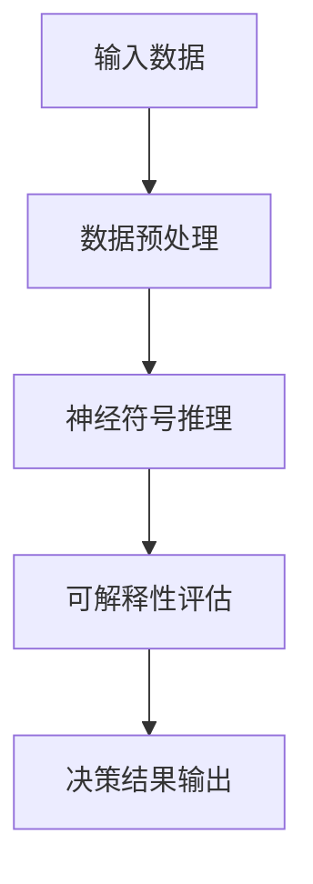
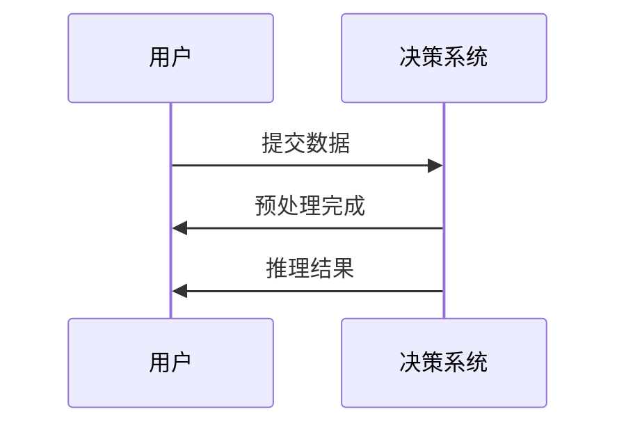
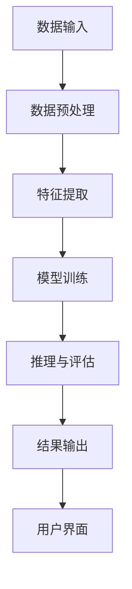
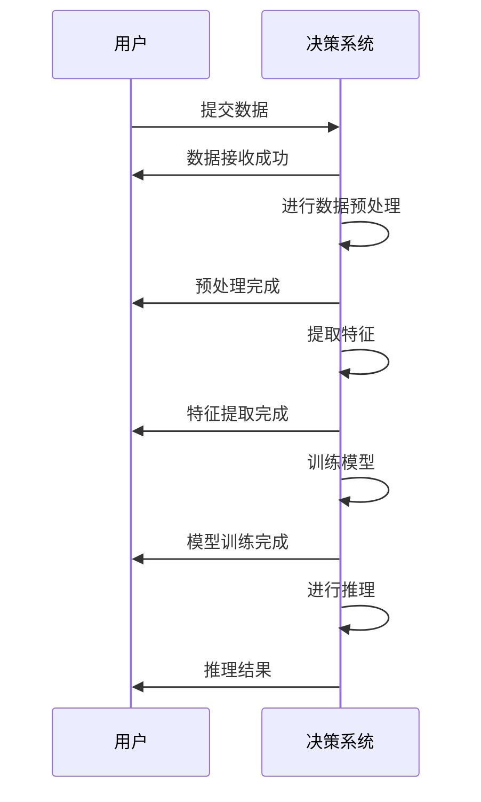

                 

### 第一部分: 问题背景与核心概念介绍

#### 第1章: 可解释AI与神经符号推理概述

##### 1.1 问题的提出与背景

在人工智能领域，尤其是深度学习取得显著成就的背景下，AI技术在各个行业中得到了广泛的应用。然而，随着AI系统的复杂性和智能化程度不断提高，一个不可忽视的问题逐渐浮现：AI决策系统的不可解释性。

不可解释AI（Explainable AI, XAI）的核心挑战在于，尽管AI系统能够实现高精度的预测和决策，但其内部工作机制却往往对人类用户而言是“黑箱”般的复杂和神秘。这种不可解释性导致了以下几个问题：

1. **信任问题**：当AI系统做出错误的决策时，用户难以理解其错误的原因，从而对AI系统的信任度下降。
2. **监管与法律问题**：在医疗、金融等关键领域，AI系统的决策需要符合法律法规，但不可解释的决策过程使得监管和合规变得复杂。
3. **用户参与问题**：在需要用户介入的场景中，如果用户无法理解AI的决策依据，就难以有效地参与决策过程，影响用户体验。

为了解决这些问题，研究者们提出了可解释AI（Explainable AI, XAI）的概念。可解释AI旨在使AI系统的决策过程更加透明和可理解，从而增强用户信任、满足监管需求并提高用户的参与度。

##### 1.1.1 AI不可解释性的挑战

AI不可解释性的挑战主要表现在以下几个方面：

1. **模型复杂度**：随着神经网络层数的增加和网络参数的增多，模型的复杂度急剧增加，使得解释模型内部的决策过程变得困难。
2. **数据分布变化**：深度学习模型通常对训练数据的分布非常敏感，当数据分布发生变化时，模型的预测能力可能会大幅下降，但用户难以察觉。
3. **高维特征**：深度学习模型通常需要处理高维特征，而这些特征之间的相关性很难直观地表达，导致决策过程的不可解释性。
4. **泛化能力不足**：深度学习模型在训练过程中可能过于拟合训练数据，导致在未见数据上的表现不佳，但其内部机制无法解释这一现象。

##### 1.1.2 可解释AI的重要性

可解释AI的重要性体现在以下几个方面：

1. **增强信任**：可解释AI使得用户能够理解AI的决策过程，从而增强对AI系统的信任。
2. **满足监管需求**：在医疗、金融等领域，决策过程的可解释性是合规的关键，可解释AI有助于满足监管要求。
3. **用户参与**：在需要用户介入的场景中，可解释AI有助于用户更好地理解AI的决策依据，提高用户的参与度和满意度。
4. **优化模型设计**：通过分析可解释AI的结果，可以更好地理解模型的行为，从而优化模型设计和算法选择。

##### 1.1.3 神经符号推理的核心概念

神经符号推理（Neural-Symbolic Reasoning, NSR）是一种结合神经网络和符号推理的方法，旨在克服深度学习不可解释性的问题。它通过将神经网络与符号逻辑、知识图谱等符号表示方法相结合，使AI系统能够在解释性和可理解性方面取得更好的平衡。

神经符号推理的核心概念包括：

1. **神经网络与符号逻辑的结合**：神经网络用于处理大规模数据和复杂的模式，符号逻辑则用于推理和解释。
2. **多层次表示**：神经符号推理通过多层次表示，将低层的神经网络特征和高层符号知识相结合，提高模型的解释性。
3. **可解释性评估**：神经符号推理提供了多种可解释性评估方法，如可视化、符号化解释等，帮助用户理解模型的决策过程。

##### 1.2 神经符号推理的基本原理

神经符号推理的基本原理在于将神经网络和符号推理相结合，以实现更强大的推理能力和更高的可解释性。以下是神经符号推理的基本原理：

1. **神经网络与符号推理的结合**：神经网络负责提取数据特征，而符号推理负责利用这些特征进行逻辑推理和决策。
2. **多层次表示**：神经符号推理通过多层次表示，将低层的神经网络特征和高层符号知识相结合。这种多层次表示有助于提高模型的解释性和推理能力。
3. **知识融合**：神经符号推理通过融合神经网络和符号逻辑的知识，使模型能够利用符号知识对神经网络的特征进行解释。
4. **可解释性评估**：神经符号推理提供了多种可解释性评估方法，如可视化、符号化解释等，帮助用户理解模型的决策过程。

##### 1.2.1 神经网络的局限性

神经网络在人工智能领域取得了显著的成就，但其在某些方面仍存在局限性：

1. **黑箱模型**：神经网络是一种黑箱模型，其内部工作机制对用户而言往往难以理解，这限制了用户对AI系统的信任。
2. **可解释性差**：神经网络在处理复杂任务时，其决策过程往往难以解释，特别是在高维数据中。
3. **泛化能力受限**：神经网络对训练数据的分布非常敏感，当数据分布发生变化时，其泛化能力可能会大幅下降。
4. **数据需求量大**：神经网络需要大量数据进行训练，这增加了数据收集和处理的成本。

##### 1.2.2 符号推理的概念与特性

符号推理是一种基于逻辑和数学规则的推理方法，其核心思想是通过符号化表示和逻辑推理来解决问题。符号推理具有以下特性：

1. **形式化表示**：符号推理通过符号化表示，将问题转化为数学和逻辑表达式，从而实现问题的形式化处理。
2. **规则导向**：符号推理依赖于一系列规则，这些规则描述了不同情况下应如何行动。
3. **可解释性**：由于符号推理遵循明确的规则，其决策过程具有较高的可解释性，用户可以清楚地理解决策依据。
4. **灵活性**：符号推理可以处理各种类型的问题，包括逻辑推理、数学计算、知识表示等。

##### 1.2.3 神经符号推理的优势

神经符号推理通过结合神经网络和符号推理的优势，实现了以下优势：

1. **增强可解释性**：神经符号推理将神经网络的强大特征提取能力与符号推理的可解释性相结合，提高了AI系统的解释性。
2. **提高泛化能力**：神经符号推理通过融合神经网络和符号逻辑的知识，增强了模型对未知数据的泛化能力。
3. **处理复杂任务**：神经符号推理可以处理复杂、多层次的推理任务，从而提高AI系统的推理能力。
4. **知识整合**：神经符号推理通过融合神经网络和符号逻辑的知识，使模型能够利用符号知识对神经网络的特征进行解释。

##### 1.3 神经符号推理的技术框架

神经符号推理的技术框架主要包括以下部分：

1. **神经网络层**：神经网络层用于提取原始数据的特征，这些特征将被用于符号推理。
2. **符号推理层**：符号推理层用于利用提取的特征进行逻辑推理和决策，这一层通常包含符号化表示和规则引擎。
3. **融合层**：融合层将神经网络层和符号推理层的输出进行融合，以生成最终的决策结果。
4. **可解释性评估**：可解释性评估层用于评估模型的解释性，包括可视化、符号化解释等方法。

##### 1.3.1 神经网络与符号推理的结合

神经网络与符号推理的结合可以通过以下几种方式实现：

1. **分层结构**：将神经网络和符号推理层分别构建为模型的两个层次，神经网络层负责特征提取，符号推理层负责决策和解释。
2. **端到端学习**：将神经网络和符号推理整合为一个端到端的模型，通过联合训练使两者协同工作。
3. **双向交互**：神经网络和符号推理层之间进行双向交互，神经网络提取的特征会反馈到符号推理层，而符号推理的结果也会影响神经网络的训练。

##### 1.3.2 常见的神经符号推理方法

常见的神经符号推理方法包括：

1. **神经网络与逻辑回归的结合**：神经网络用于提取特征，逻辑回归用于进行分类和回归任务。
2. **神经网络与决策树相结合**：神经网络用于特征提取，决策树用于进行分类和回归任务。
3. **神经网络与知识图谱相结合**：神经网络用于提取特征，知识图谱用于进行推理和决策。
4. **神经网络与符号逻辑相结合**：神经网络用于特征提取，符号逻辑用于进行推理和决策。

##### 1.3.3 技术框架的比较与选择

选择合适的神经符号推理技术框架需要考虑以下几个因素：

1. **任务类型**：不同的任务类型对神经符号推理技术框架的需求不同，需要根据任务的特点选择合适的框架。
2. **数据规模**：数据规模对技术框架的选择有重要影响，大数据场景下可能需要更复杂的框架。
3. **解释性需求**：对于需要高解释性的场景，可以选择具有更强解释性的技术框架。
4. **计算资源**：不同技术框架对计算资源的需求不同，需要根据实际计算资源情况选择合适的框架。

##### 1.4 可解释AI决策系统的设计原则

设计可解释AI决策系统时，需要遵循以下原则：

1. **明确可解释性目标**：在设计系统时，需要明确可解释性的目标，确定系统需要达到的解释程度。
2. **模块化设计**：将系统的不同功能模块化，使每个模块都具有明确的功能和边界，便于理解和维护。
3. **用户导向**：设计系统时，需要考虑用户的需求和习惯，使系统易于使用和理解。
4. **灵活性**：系统设计应具有足够的灵活性，以适应不同的应用场景和需求。
5. **可扩展性**：系统设计应具有良好的可扩展性，以便在将来能够方便地添加新的功能或改进现有功能。

##### 1.4.1 可解释性的需求分析

在进行可解释AI决策系统的设计时，首先需要对可解释性的需求进行详细分析：

1. **用户需求**：了解用户对可解释性的具体需求，包括决策过程的透明度、决策依据的可理解性等。
2. **应用场景**：分析不同应用场景对可解释性的要求，例如在金融领域，决策过程需要高度透明以符合监管要求。
3. **系统功能**：确定系统需要实现的功能，包括数据预处理、特征提取、决策推理、结果解释等。

##### 1.4.2 决策系统的设计原则

决策系统的设计原则包括以下几个方面：

1. **模块化**：将系统划分为多个功能模块，每个模块负责特定的功能，便于系统的理解和维护。
2. **可扩展性**：设计系统时，应考虑未来的扩展需求，确保系统能够轻松地添加新功能或适应新场景。
3. **高内聚低耦合**：每个模块应具有较高的内聚性，即模块内部的功能紧密相关，同时模块间应具有较低的耦合性，便于模块的独立开发和测试。
4. **用户友好**：系统界面应简洁易懂，便于用户操作和使用，提供丰富的交互功能，例如可视化、帮助文档等。
5. **可解释性**：在系统设计过程中，需要确保每个模块都具有较好的可解释性，使用户能够清楚地理解系统的决策过程。

##### 1.4.3 可解释AI与隐私保护的关系

在可解释AI决策系统的设计中，隐私保护是一个重要考虑因素。以下是可解释AI与隐私保护之间的关系：

1. **数据隐私**：在训练和使用AI模型时，需要保护用户的隐私数据，避免数据泄露。
2. **决策透明性**：虽然提高系统的可解释性有助于用户理解决策过程，但过多的透明性可能涉及敏感信息的泄露，需要在可解释性和隐私保护之间找到平衡。
3. **匿名化**：对用户数据进行匿名化处理，以减少隐私泄露的风险。
4. **加密技术**：使用加密技术保护用户数据，确保数据在传输和存储过程中的安全性。

##### 1.5 本章小结

本章介绍了可解释AI与神经符号推理的核心概念、基本原理和技术框架，分析了AI不可解释性的挑战及其重要性，并讨论了神经符号推理的优势和设计原则。通过本章的学习，读者可以对可解释AI和神经符号推理有一个全面的认识，为后续章节的深入探讨打下基础。

---

### 目录大纲

```markdown
----------------------------------------------------------------

# 第一部分: 问题背景与核心概念介绍

## 第1章: 可解释AI与神经符号推理概述

## 1.1 问题的提出与背景

### 1.1.1 AI不可解释性的挑战

### 1.1.2 可解释AI的重要性

### 1.1.3 神经符号推理的核心概念

### 1.1.4 神经符号推理的基本原理

### 1.1.5 神经网络与符号推理的结合

### 1.1.6 常见的神经符号推理方法

### 1.1.7 技术框架的比较与选择

## 1.2 神经符号推理的技术框架

### 1.2.1 神经网络层

### 1.2.2 符号推理层

### 1.2.3 融合层

### 1.2.4 可解释性评估层

## 1.3 可解释AI决策系统的设计原则

### 1.3.1 明确可解释性目标

### 1.3.2 模块化设计

### 1.3.3 用户导向

### 1.3.4 灵活性

### 1.3.5 可扩展性

## 1.4 可解释性需求分析

### 1.4.1 用户需求

### 1.4.2 应用场景

### 1.4.3 系统功能

## 1.5 系统设计原则

### 1.5.1 模块化

### 1.5.2 可扩展性

### 1.5.3 高内聚低耦合

### 1.5.4 用户友好

### 1.5.5 可解释性

## 1.6 可解释AI与隐私保护的关系

### 1.6.1 数据隐私

### 1.6.2 决策透明性

### 1.6.3 匿名化

### 1.6.4 加密技术

## 1.7 本章小结

----------------------------------------------------------------

# 第二部分: 神经符号推理算法原理与实现

## 第2章: 神经符号推理算法基础

## 2.1 算法原理讲解

### 2.1.1 基本算法介绍

### 2.1.2 算法步骤

### 2.1.3 数学模型与公式解析

### 2.1.4 Python源代码实现

## 2.2 算法示例与分析

### 2.2.1 示例数据准备

### 2.2.2 算法应用演示

### 2.2.3 结果分析与讨论

## 2.3 算法优化与改进

### 2.3.1 常见优化策略

### 2.3.2 实际应用中的改进方法

## 2.4 算法性能评估

### 2.4.1 性能指标定义

### 2.4.2 性能评估方法

### 2.4.3 结果展示与解读

## 2.5 本章小结

----------------------------------------------------------------

# 第三部分: 可解释AI决策系统设计

## 第3章: 决策系统需求分析

### 3.1 系统功能需求

### 3.2 系统架构设计

### 3.3 系统接口设计与交互

### 3.4 可解释性保障机制

### 3.5 系统测试与评估

### 3.6 本章小结

----------------------------------------------------------------

# 第四部分: 实际案例与应用

## 第4章: 案例介绍与系统实现

### 4.1 案例背景

### 4.2 系统核心实现

### 4.3 案例分析与讨论

### 4.4 项目小结

## 4.5 最佳实践 tips

### 4.5.1 数据预处理

### 4.5.2 模型选择

### 4.5.3 可解释性优化

### 4.5.4 隐私保护

## 4.6 小结

----------------------------------------------------------------

---

### 目录大纲

```markdown
----------------------------------------------------------------

# 第一部分: 问题背景与核心概念介绍

## 第1章: 可解释AI与神经符号推理概述

## 1.1 问题的提出与背景

### 1.1.1 AI不可解释性的挑战

### 1.1.2 可解释AI的重要性

### 1.1.3 神经符号推理的核心概念

### 1.1.4 神经符号推理的基本原理

### 1.1.5 神经网络与符号推理的结合

### 1.1.6 常见的神经符号推理方法

### 1.1.7 技术框架的比较与选择

## 1.2 神经符号推理的技术框架

### 1.2.1 神经网络层

### 1.2.2 符号推理层

### 1.2.3 融合层

### 1.2.4 可解释性评估层

## 1.3 可解释AI决策系统的设计原则

### 1.3.1 明确可解释性目标

### 1.3.2 模块化设计

### 1.3.3 用户导向

### 1.3.4 灵活性

### 1.3.5 可扩展性

## 1.4 可解释性需求分析

### 1.4.1 用户需求

### 1.4.2 应用场景

### 1.4.3 系统功能

## 1.5 系统设计原则

### 1.5.1 模块化

### 1.5.2 可扩展性

### 1.5.3 高内聚低耦合

### 1.5.4 用户友好

### 1.5.5 可解释性

## 1.6 可解释AI与隐私保护的关系

### 1.6.1 数据隐私

### 1.6.2 决策透明性

### 1.6.3 匿名化

### 1.6.4 加密技术

## 1.7 本章小结

----------------------------------------------------------------

# 第二部分: 神经符号推理算法原理与实现

## 第2章: 神经符号推理算法基础

### 2.1 算法原理讲解

#### 2.1.1 基本算法介绍

#### 2.1.2 算法步骤

#### 2.1.3 数学模型与公式解析

##### 2.1.3.1 数学公式

$$
z = W \cdot x + b
$$

##### 2.1.3.2 算法原理

### 2.1.4 Python源代码实现

```python
# Python代码实现
```

## 2.2 算法示例与分析

### 2.2.1 示例数据准备

### 2.2.2 算法应用演示

### 2.2.3 结果分析与讨论

## 2.3 算法优化与改进

### 2.3.1 常见优化策略

### 2.3.2 实际应用中的改进方法

## 2.4 算法性能评估

### 2.4.1 性能指标定义

### 2.4.2 性能评估方法

### 2.4.3 结果展示与解读

## 2.5 本章小结

----------------------------------------------------------------

# 第三部分: 可解释AI决策系统设计

## 第3章: 决策系统需求分析

### 3.1 系统功能需求

#### 3.1.1 用户需求分析

#### 3.1.2 功能需求分析

### 3.2 系统架构设计

#### 3.2.1 系统架构图



#### 3.2.2 架构设计原理

### 3.3 系统接口设计与交互

#### 3.3.1 接口设计规范

#### 3.3.2 交互流程图



### 3.4 可解释性保障机制

#### 3.4.1 可解释性评估方法

#### 3.4.2 隐私保护与安全措施

### 3.5 系统测试与评估

#### 3.5.1 测试用例设计

#### 3.5.2 性能评估结果

#### 3.5.3 系统稳定性与安全性分析

### 3.6 本章小结

----------------------------------------------------------------

# 第四部分: 实际案例与应用

## 第4章: 案例介绍与系统实现

### 4.1 案例背景

#### 4.1.1 案例描述

#### 4.1.2 案例目标

### 4.2 系统核心实现

#### 4.2.1 环境安装与配置

#### 4.2.2 核心代码实现

```python
# Python代码实现
```

#### 4.2.3 代码解读与分析

### 4.3 案例分析与讨论

#### 4.3.1 实际问题剖析

#### 4.3.2 解决方案评估

### 4.4 项目小结

### 4.5 最佳实践 tips

#### 4.5.1 数据预处理

#### 4.5.2 模型选择

#### 4.5.3 可解释性优化

#### 4.5.4 隐私保护

### 4.6 小结

----------------------------------------------------------------

---

## 第一部分: 问题背景与核心概念介绍

### 第1章: 可解释AI与神经符号推理概述

在人工智能（AI）领域，可解释AI（Explainable AI, XAI）和神经符号推理（Neural-Symbolic Reasoning, NSR）是两个日益受到关注的主题。随着深度学习在各个领域取得突破性进展，AI系统在图像识别、自然语言处理、医疗诊断等方面的表现日益出色，然而，这些系统的不可解释性也日益成为研究的重点和挑战。

#### 1.1 问题的提出与背景

不可解释AI的核心问题在于：尽管AI系统能够实现高精度的预测和决策，但其内部的决策过程对人类用户而言往往是黑箱式的，难以理解。这种不可解释性带来了以下几个挑战：

1. **信任问题**：当AI系统做出错误决策时，用户难以理解其错误的原因，从而对AI系统的信任度下降。
2. **监管与法律问题**：在医疗、金融等关键领域，AI系统的决策需要符合法律法规，但不可解释的决策过程使得监管和合规变得复杂。
3. **用户参与问题**：在需要用户介入的场景中，如果用户无法理解AI的决策依据，就难以有效地参与决策过程，影响用户体验。

为了解决这些问题，研究者们提出了可解释AI的概念。可解释AI旨在使AI系统的决策过程更加透明和可理解，从而增强用户信任、满足监管需求并提高用户的参与度。

#### 1.1.1 AI不可解释性的挑战

AI不可解释性的挑战主要体现在以下几个方面：

1. **模型复杂度**：随着神经网络层数的增加和网络参数的增多，模型的复杂度急剧增加，使得解释模型内部的决策过程变得困难。
2. **数据分布变化**：深度学习模型通常对训练数据的分布非常敏感，当数据分布发生变化时，模型的预测能力可能会大幅下降，但用户难以察觉。
3. **高维特征**：深度学习模型通常需要处理高维特征，而这些特征之间的相关性很难直观地表达，导致决策过程的不可解释性。
4. **泛化能力不足**：深度学习模型在训练过程中可能过于拟合训练数据，导致在未见数据上的表现不佳，但其内部机制无法解释这一现象。

#### 1.1.2 可解释AI的重要性

可解释AI的重要性体现在以下几个方面：

1. **增强信任**：可解释AI使得用户能够理解AI的决策过程，从而增强对AI系统的信任。
2. **满足监管需求**：在医疗、金融等领域，决策过程的可解释性是合规的关键，可解释AI有助于满足监管要求。
3. **用户参与**：在需要用户介入的场景中，可解释AI有助于用户更好地理解AI的决策依据，提高用户的参与度和满意度。
4. **优化模型设计**：通过分析可解释AI的结果，可以更好地理解模型的行为，从而优化模型设计和算法选择。

#### 1.1.3 神经符号推理的核心概念

神经符号推理是一种结合神经网络和符号推理的方法，旨在克服深度学习不可解释性的问题。它通过将神经网络与符号逻辑、知识图谱等符号表示方法相结合，使AI系统能够在解释性和可理解性方面取得更好的平衡。

神经符号推理的核心概念包括：

1. **神经网络与符号逻辑的结合**：神经网络用于处理大规模数据和复杂的模式，符号逻辑用于进行推理和决策。
2. **多层次表示**：神经符号推理通过多层次表示，将低层的神经网络特征和高层符号知识相结合，提高模型的解释性。
3. **知识融合**：神经符号推理通过融合神经网络和符号逻辑的知识，使模型能够利用符号知识对神经网络的特征进行解释。
4. **可解释性评估**：神经符号推理提供了多种可解释性评估方法，如可视化、符号化解释等，帮助用户理解模型的决策过程。

#### 1.2 神经符号推理的基本原理

神经符号推理的基本原理在于将神经网络和符号推理相结合，以实现更强大的推理能力和更高的可解释性。以下是神经符号推理的基本原理：

1. **神经网络与符号推理的结合**：神经网络负责提取数据特征，而符号推理负责利用这些特征进行逻辑推理和决策。
2. **多层次表示**：神经符号推理通过多层次表示，将低层的神经网络特征和高层符号知识相结合。这种多层次表示有助于提高模型的解释性和推理能力。
3. **知识融合**：神经符号推理通过融合神经网络和符号逻辑的知识，使模型能够利用符号知识对神经网络的特征进行解释。
4. **可解释性评估**：神经符号推理提供了多种可解释性评估方法，如可视化、符号化解释等，帮助用户理解模型的决策过程。

#### 1.2.1 神经网络的局限性

神经网络在人工智能领域取得了显著的成就，但其在某些方面仍存在局限性：

1. **黑箱模型**：神经网络是一种黑箱模型，其内部工作机制对用户而言往往难以理解，这限制了用户对AI系统的信任。
2. **可解释性差**：神经网络在处理复杂任务时，其决策过程往往难以解释，特别是在高维数据中。
3. **泛化能力受限**：神经网络对训练数据的分布非常敏感，当数据分布发生变化时，其泛化能力可能会大幅下降。
4. **数据需求量大**：神经网络需要大量数据进行训练，这增加了数据收集和处理的成本。

#### 1.2.2 符号推理的概念与特性

符号推理是一种基于逻辑和数学规则的推理方法，其核心思想是通过符号化表示和逻辑推理来解决问题。符号推理具有以下特性：

1. **形式化表示**：符号推理通过符号化表示，将问题转化为数学和逻辑表达式，从而实现问题的形式化处理。
2. **规则导向**：符号推理依赖于一系列规则，这些规则描述了不同情况下应如何行动。
3. **可解释性**：由于符号推理遵循明确的规则，其决策过程具有较高的可解释性，用户可以清楚地理解决策依据。
4. **灵活性**：符号推理可以处理各种类型的问题，包括逻辑推理、数学计算、知识表示等。

#### 1.2.3 神经符号推理的优势

神经符号推理通过结合神经网络和符号推理的优势，实现了以下优势：

1. **增强可解释性**：神经符号推理将神经网络的强大特征提取能力与符号推理的可解释性相结合，提高了AI系统的解释性。
2. **提高泛化能力**：神经符号推理通过融合神经网络和符号逻辑的知识，增强了模型对未知数据的泛化能力。
3. **处理复杂任务**：神经符号推理可以处理复杂、多层次的推理任务，从而提高AI系统的推理能力。
4. **知识整合**：神经符号推理通过融合神经网络和符号逻辑的知识，使模型能够利用符号知识对神经网络的特征进行解释。

#### 1.3 神经符号推理的技术框架

神经符号推理的技术框架主要包括以下几个部分：

1. **神经网络层**：神经网络层用于提取原始数据的特征，这些特征将被用于符号推理。
2. **符号推理层**：符号推理层用于利用提取的特征进行逻辑推理和决策，这一层通常包含符号化表示和规则引擎。
3. **融合层**：融合层将神经网络层和符号推理层的输出进行融合，以生成最终的决策结果。
4. **可解释性评估**：可解释性评估层用于评估模型的解释性，包括可视化、符号化解释等方法。

#### 1.3.1 神经网络与符号推理的结合

神经网络与符号推理的结合可以通过以下几种方式实现：

1. **分层结构**：将神经网络和符号推理层分别构建为模型的两个层次，神经网络层负责特征提取，符号推理层负责决策和解释。
2. **端到端学习**：将神经网络和符号推理整合为一个端到端的模型，通过联合训练使两者协同工作。
3. **双向交互**：神经网络和符号推理层之间进行双向交互，神经网络提取的特征会反馈到符号推理层，而符号推理的结果也会影响神经网络的训练。

#### 1.3.2 常见的神经符号推理方法

常见的神经符号推理方法包括：

1. **神经网络与逻辑回归的结合**：神经网络用于提取特征，逻辑回归用于进行分类和回归任务。
2. **神经网络与决策树相结合**：神经网络用于特征提取，决策树用于进行分类和回归任务。
3. **神经网络与知识图谱相结合**：神经网络用于提取特征，知识图谱用于进行推理和决策。
4. **神经网络与符号逻辑相结合**：神经网络用于特征提取，符号逻辑用于进行推理和决策。

#### 1.3.3 技术框架的比较与选择

选择合适的神经符号推理技术框架需要考虑以下几个因素：

1. **任务类型**：不同的任务类型对神经符号推理技术框架的需求不同，需要根据任务的特点选择合适的框架。
2. **数据规模**：数据规模对技术框架的选择有重要影响，大数据场景下可能需要更复杂的框架。
3. **解释性需求**：对于需要高解释性的场景，可以选择具有更强解释性的技术框架。
4. **计算资源**：不同技术框架对计算资源的需求不同，需要根据实际计算资源情况选择合适的框架。

#### 1.4 可解释AI决策系统的设计原则

设计可解释AI决策系统时，需要遵循以下原则：

1. **明确可解释性目标**：在设计系统时，需要明确可解释性的目标，确定系统需要达到的解释程度。
2. **模块化设计**：将系统的不同功能模块化，使每个模块都具有明确的功能和边界，便于理解和维护。
3. **用户导向**：设计系统时，需要考虑用户的需求和习惯，使系统易于使用和理解。
4. **灵活性**：系统设计应具有足够的灵活性，以适应不同的应用场景和需求。
5. **可扩展性**：系统设计应具有良好的可扩展性，以便在将来能够方便地添加新的功能或改进现有功能。

#### 1.4.1 可解释性的需求分析

在进行可解释AI决策系统的设计时，首先需要对可解释性的需求进行详细分析：

1. **用户需求**：了解用户对可解释性的具体需求，包括决策过程的透明度、决策依据的可理解性等。
2. **应用场景**：分析不同应用场景对可解释性的要求，例如在金融领域，决策过程需要高度透明以符合监管要求。
3. **系统功能**：确定系统需要实现的功能，包括数据预处理、特征提取、决策推理、结果解释等。

#### 1.4.2 决策系统的设计原则

决策系统的设计原则包括以下几个方面：

1. **模块化**：将系统划分为多个功能模块，每个模块负责特定的功能，便于系统的理解和维护。
2. **可扩展性**：设计系统时，应考虑未来的扩展需求，确保系统能够轻松地添加新功能或适应新场景。
3. **高内聚低耦合**：每个模块应具有较高的内聚性，即模块内部的功能紧密相关，同时模块间应具有较低的耦合性，便于模块的独立开发和测试。
4. **用户友好**：系统界面应简洁易懂，便于用户操作和使用，提供丰富的交互功能，例如可视化、帮助文档等。
5. **可解释性**：在系统设计过程中，需要确保每个模块都具有较好的可解释性，使用户能够清楚地理解系统的决策过程。

#### 1.4.3 可解释AI与隐私保护的关系

在可解释AI决策系统的设计中，隐私保护是一个重要考虑因素。以下是可解释AI与隐私保护之间的关系：

1. **数据隐私**：在训练和使用AI模型时，需要保护用户的隐私数据，避免数据泄露。
2. **决策透明性**：虽然提高系统的可解释性有助于用户理解决策过程，但过多的透明性可能涉及敏感信息的泄露，需要在可解释性和隐私保护之间找到平衡。
3. **匿名化**：对用户数据进行匿名化处理，以减少隐私泄露的风险。
4. **加密技术**：使用加密技术保护用户数据，确保数据在传输和存储过程中的安全性。

#### 1.5 本章小结

本章介绍了可解释AI与神经符号推理的核心概念、基本原理和技术框架，分析了AI不可解释性的挑战及其重要性，并讨论了神经符号推理的优势和设计原则。通过本章的学习，读者可以对可解释AI和神经符号推理有一个全面的认识，为后续章节的深入探讨打下基础。

---

### 目录大纲

```markdown
----------------------------------------------------------------

# 第一部分: 问题背景与核心概念介绍

## 第1章: 可解释AI与神经符号推理概述

## 1.1 问题的提出与背景

### 1.1.1 AI不可解释性的挑战

### 1.1.2 可解释AI的重要性

### 1.1.3 神经符号推理的核心概念

### 1.1.4 神经符号推理的基本原理

### 1.1.5 神经网络与符号推理的结合

### 1.1.6 常见的神经符号推理方法

### 1.1.7 技术框架的比较与选择

## 1.2 神经符号推理的技术框架

### 1.2.1 神经网络层

### 1.2.2 符号推理层

### 1.2.3 融合层

### 1.2.4 可解释性评估层

## 1.3 可解释AI决策系统的设计原则

### 1.3.1 明确可解释性目标

### 1.3.2 模块化设计

### 1.3.3 用户导向

### 1.3.4 灵活性

### 1.3.5 可扩展性

## 1.4 可解释性需求分析

### 1.4.1 用户需求

### 1.4.2 应用场景

### 1.4.3 系统功能

## 1.5 系统设计原则

### 1.5.1 模块化

### 1.5.2 可扩展性

### 1.5.3 高内聚低耦合

### 1.5.4 用户友好

### 1.5.5 可解释性

## 1.6 可解释AI与隐私保护的关系

### 1.6.1 数据隐私

### 1.6.2 决策透明性

### 1.6.3 匿名化

### 1.6.4 加密技术

## 1.7 本章小结

----------------------------------------------------------------

# 第二部分: 神经符号推理算法原理与实现

## 第2章: 神经符号推理算法基础

### 2.1 算法原理讲解

#### 2.1.1 基本算法介绍

#### 2.1.2 算法步骤

#### 2.1.3 数学模型与公式解析

##### 2.1.3.1 数学公式

$$
z = W \cdot x + b
$$

##### 2.1.3.2 算法原理

### 2.1.4 Python源代码实现

```python
# Python代码实现
```

## 2.2 算法示例与分析

### 2.2.1 示例数据准备

### 2.2.2 算法应用演示

### 2.2.3 结果分析与讨论

## 2.3 算法优化与改进

### 2.3.1 常见优化策略

### 2.3.2 实际应用中的改进方法

## 2.4 算法性能评估

### 2.4.1 性能指标定义

### 2.4.2 性能评估方法

### 2.4.3 结果展示与解读

## 2.5 本章小结

----------------------------------------------------------------

# 第三部分: 可解释AI决策系统设计

## 第3章: 决策系统需求分析

### 3.1 系统功能需求

#### 3.1.1 用户需求分析

#### 3.1.2 功能需求分析

### 3.2 系统架构设计

#### 3.2.1 系统架构图


#### 3.2.2 架构设计原理

### 3.3 系统接口设计与交互

#### 3.3.1 接口设计规范

#### 3.3.2 交互流程图


### 3.4 可解释性保障机制

#### 3.4.1 可解释性评估方法

#### 3.4.2 隐私保护与安全措施

### 3.5 系统测试与评估

#### 3.5.1 测试用例设计

#### 3.5.2 性能评估结果

#### 3.5.3 系统稳定性与安全性分析

### 3.6 本章小结

----------------------------------------------------------------

# 第四部分: 实际案例与应用

## 第4章: 案例介绍与系统实现

### 4.1 案例背景

#### 4.1.1 案例描述

#### 4.1.2 案例目标

### 4.2 系统核心实现

#### 4.2.1 环境安装与配置

#### 4.2.2 核心代码实现

```python
# Python代码实现
```

#### 4.2.3 代码解读与分析

### 4.3 案例分析与讨论

#### 4.3.1 实际问题剖析

#### 4.3.2 解决方案评估

### 4.4 项目小结

### 4.5 最佳实践 tips

#### 4.5.1 数据预处理

#### 4.5.2 模型选择

#### 4.5.3 可解释性优化

#### 4.5.4 隐私保护

### 4.6 小结

----------------------------------------------------------------

---

## 第一部分: 问题背景与核心概念介绍

### 第1章: 可解释AI与神经符号推理概述

随着深度学习和人工智能在各个领域的广泛应用，人们对于AI系统的透明度和可理解性提出了更高的要求。不可解释性是AI系统面临的一个重大挑战，它不仅影响了系统的可信度和用户接受度，也限制了AI在关键领域如医疗、金融和法律等的应用。为了克服这一挑战，研究者们提出了可解释AI（Explainable AI, XAI）和神经符号推理（Neural-Symbolic Reasoning, NSR）的概念和方法。

#### 1.1 问题的提出与背景

不可解释AI的挑战源于深度学习模型的复杂性和黑箱特性。深度学习模型，如神经网络，通过学习大量的数据特征来生成决策。然而，这些模型内部的决策过程往往难以被理解和解释。具体来说，存在以下几个问题：

1. **黑箱模型**：深度学习模型如神经网络和卷积神经网络（CNN）通常被视为“黑箱”，其内部的结构和参数对于外界来说是非常复杂和难以理解的。
2. **高维特征空间**：深度学习模型处理的数据通常是高维的，这使得直接理解模型的决策过程变得非常困难。
3. **对训练数据的过度依赖**：深度学习模型往往在训练数据上表现良好，但在新数据上的泛化能力较差，这进一步增加了不可解释性的挑战。

为了解决这些问题，可解释AI被提出来，旨在设计能够解释其决策过程的AI系统。可解释AI的目标是使AI系统的决策过程透明、可理解，从而增加用户的信任和参与度。

#### 1.1.1 AI不可解释性的挑战

AI不可解释性的挑战主要包括以下几点：

1. **复杂度**：深度学习模型的复杂度很高，包含大量的参数和层次结构，这使得模型内部的决策过程难以解释。
2. **透明性**：模型的透明性对于用户理解和信任至关重要，但现有的深度学习模型往往缺乏透明性。
3. **泛化能力**：模型在新数据上的泛化能力受到限制，这使得用户难以相信模型在未见数据上的决策。
4. **隐私问题**：在医疗和金融等敏感领域，用户可能担心AI系统泄露个人隐私。

#### 1.1.2 可解释AI的重要性

可解释AI的重要性体现在以下几个方面：

1. **用户信任**：可解释AI能够帮助用户理解AI系统的决策过程，从而增加用户对系统的信任。
2. **监管合规**：在医疗、金融和司法等领域，AI系统的决策过程需要符合法律法规，可解释AI有助于满足监管要求。
3. **用户参与**：可解释AI使用户能够更好地参与决策过程，从而提高用户体验和满意度。
4. **模型优化**：通过理解模型的决策过程，研究人员和开发人员可以优化模型的设计和参数，提高模型的性能和鲁棒性。

#### 1.1.3 神经符号推理的核心概念

神经符号推理是一种结合神经网络和符号推理的方法，旨在提高AI系统的可解释性。它通过将神经网络的学习能力与符号推理的逻辑性相结合，实现更强大的推理和解释能力。神经符号推理的核心概念包括：

1. **神经网络**：神经网络负责从数据中学习特征，提取有用的信息。
2. **符号推理**：符号推理用于基于提取的特征进行逻辑推理和决策。
3. **知识融合**：神经符号推理通过融合神经网络和符号推理的知识，实现更强大的推理能力。
4. **可解释性**：神经符号推理通过符号推理的过程，使得AI系统的决策过程更加透明和可解释。

#### 1.2 神经符号推理的基本原理

神经符号推理的基本原理是将神经网络和符号推理相结合，通过以下几个步骤实现：

1. **特征提取**：神经网络从数据中提取特征，这些特征用于后续的符号推理。
2. **符号化表示**：将提取的特征转化为符号化的形式，便于进行逻辑推理。
3. **推理过程**：使用符号推理规则对符号化的特征进行推理，生成决策结果。
4. **解释生成**：将推理过程和决策结果转化为可解释的形式，便于用户理解。

#### 1.2.1 神经网络的局限性

尽管神经网络在图像识别、语音识别等领域取得了显著的成功，但它也存在一些局限性：

1. **黑箱特性**：神经网络是一个复杂的黑箱系统，其内部机制难以理解。
2. **高计算成本**：神经网络需要大量的计算资源和时间进行训练和推理。
3. **对数据质量敏感**：神经网络对训练数据的质量和分布非常敏感，数据的不一致性可能导致模型性能的下降。

#### 1.2.2 符号推理的概念与特性

符号推理是一种基于逻辑和数学规则的推理方法，其核心思想是通过符号化表示和逻辑推理来解决问题。符号推理具有以下特性：

1. **形式化表示**：符号推理通过符号化表示，将问题转化为数学和逻辑表达式，从而实现问题的形式化处理。
2. **规则导向**：符号推理依赖于一系列规则，这些规则描述了不同情况下应如何行动。
3. **可解释性**：符号推理遵循明确的规则，其决策过程具有较高的可解释性，用户可以清楚地理解决策依据。
4. **灵活性**：符号推理可以处理各种类型的问题，包括逻辑推理、数学计算、知识表示等。

#### 1.2.3 神经符号推理的优势

神经符号推理通过结合神经网络和符号推理的优势，实现了以下优势：

1. **增强可解释性**：神经符号推理将神经网络的强大特征提取能力与符号推理的可解释性相结合，提高了AI系统的解释性。
2. **提高泛化能力**：神经符号推理通过融合神经网络和符号逻辑的知识，增强了模型对未知数据的泛化能力。
3. **处理复杂任务**：神经符号推理可以处理复杂、多层次的推理任务，从而提高AI系统的推理能力。
4. **知识整合**：神经符号推理通过融合神经网络和符号逻辑的知识，使模型能够利用符号知识对神经网络的特征进行解释。

#### 1.3 神经符号推理的技术框架

神经符号推理的技术框架主要包括以下几个部分：

1. **神经网络层**：神经网络层用于提取原始数据的特征，这些特征将被用于符号推理。
2. **符号推理层**：符号推理层用于利用提取的特征进行逻辑推理和决策，这一层通常包含符号化表示和规则引擎。
3. **融合层**：融合层将神经网络层和符号推理层的输出进行融合，以生成最终的决策结果。
4. **可解释性评估**：可解释性评估层用于评估模型的解释性，包括可视化、符号化解释等方法。

#### 1.3.1 神经网络与符号推理的结合

神经网络与符号推理的结合可以通过以下几种方式实现：

1. **分层结构**：将神经网络和符号推理层分别构建为模型的两个层次，神经网络层负责特征提取，符号推理层负责决策和解释。
2. **端到端学习**：将神经网络和符号推理整合为一个端到端的模型，通过联合训练使两者协同工作。
3. **双向交互**：神经网络和符号推理层之间进行双向交互，神经网络提取的特征会反馈到符号推理层，而符号推理的结果也会影响神经网络的训练。

#### 1.3.2 常见的神经符号推理方法

常见的神经符号推理方法包括：

1. **神经网络与逻辑回归的结合**：神经网络用于提取特征，逻辑回归用于进行分类和回归任务。
2. **神经网络与决策树相结合**：神经网络用于特征提取，决策树用于进行分类和回归任务。
3. **神经网络与知识图谱相结合**：神经网络用于提取特征，知识图谱用于进行推理和决策。
4. **神经网络与符号逻辑相结合**：神经网络用于特征提取，符号逻辑用于进行推理和决策。

#### 1.3.3 技术框架的比较与选择

选择合适的神经符号推理技术框架需要考虑以下几个因素：

1. **任务类型**：不同的任务类型对神经符号推理技术框架的需求不同，需要根据任务的特点选择合适的框架。
2. **数据规模**：数据规模对技术框架的选择有重要影响，大数据场景下可能需要更复杂的框架。
3. **解释性需求**：对于需要高解释性的场景，可以选择具有更强解释性的技术框架。
4. **计算资源**：不同技术框架对计算资源的需求不同，需要根据实际计算资源情况选择合适的框架。

#### 1.4 可解释AI决策系统的设计原则

设计可解释AI决策系统时，需要遵循以下原则：

1. **明确可解释性目标**：在设计系统时，需要明确可解释性的目标，确定系统需要达到的解释程度。
2. **模块化设计**：将系统的不同功能模块化，使每个模块都具有明确的功能和边界，便于理解和维护。
3. **用户导向**：设计系统时，需要考虑用户的需求和习惯，使系统易于使用和理解。
4. **灵活性**：系统设计应具有足够的灵活性，以适应不同的应用场景和需求。
5. **可扩展性**：系统设计应具有良好的可扩展性，以便在将来能够方便地添加新的功能或改进现有功能。

#### 1.4.1 可解释性的需求分析

在进行可解释AI决策系统的设计时，首先需要对可解释性的需求进行详细分析：

1. **用户需求**：了解用户对可解释性的具体需求，包括决策过程的透明度、决策依据的可理解性等。
2. **应用场景**：分析不同应用场景对可解释性的要求，例如在金融领域，决策过程需要高度透明以符合监管要求。
3. **系统功能**：确定系统需要实现的功能，包括数据预处理、特征提取、决策推理、结果解释等。

#### 1.4.2 决策系统的设计原则

决策系统的设计原则包括以下几个方面：

1. **模块化**：将系统划分为多个功能模块，每个模块负责特定的功能，便于系统的理解和维护。
2. **可扩展性**：设计系统时，应考虑未来的扩展需求，确保系统能够轻松地添加新功能或适应新场景。
3. **高内聚低耦合**：每个模块应具有较高的内聚性，即模块内部的功能紧密相关，同时模块间应具有较低的耦合性，便于模块的独立开发和测试。
4. **用户友好**：系统界面应简洁易懂，便于用户操作和使用，提供丰富的交互功能，例如可视化、帮助文档等。
5. **可解释性**：在系统设计过程中，需要确保每个模块都具有较好的可解释性，使用户能够清楚地理解系统的决策过程。

#### 1.4.3 可解释AI与隐私保护的关系

在可解释AI决策系统的设计中，隐私保护是一个重要考虑因素。以下是可解释AI与隐私保护之间的关系：

1. **数据隐私**：在训练和使用AI模型时，需要保护用户的隐私数据，避免数据泄露。
2. **决策透明性**：虽然提高系统的可解释性有助于用户理解决策过程，但过多的透明性可能涉及敏感信息的泄露，需要在可解释性和隐私保护之间找到平衡。
3. **匿名化**：对用户数据进行匿名化处理，以减少隐私泄露的风险。
4. **加密技术**：使用加密技术保护用户数据，确保数据在传输和存储过程中的安全性。

#### 1.5 本章小结

本章介绍了可解释AI与神经符号推理的核心概念、基本原理和技术框架，分析了AI不可解释性的挑战及其重要性，并讨论了神经符号推理的优势和设计原则。通过本章的学习，读者可以对可解释AI和神经符号推理有一个全面的认识，为后续章节的深入探讨打下基础。

---

## 第一部分: 问题背景与核心概念介绍

### 第1章: 可解释AI与神经符号推理概述

在人工智能领域，可解释AI（Explainable AI, XAI）和神经符号推理（Neural-Symbolic Reasoning, NSR）是两个关键的研究方向，旨在解决深度学习模型不可解释性的问题。本章将介绍这些概念的基本背景、核心原理以及它们在可解释AI决策系统设计中的应用。

#### 1.1 问题的提出与背景

不可解释AI问题起源于深度学习模型，特别是神经网络在复杂任务中的成功应用。尽管神经网络在图像识别、语音识别等领域取得了显著进展，但其内部的决策过程往往难以被人类理解，导致以下问题：

1. **信任问题**：当AI系统做出错误决策时，用户难以追踪错误的原因，从而对系统产生信任危机。
2. **监管合规**：在金融、医疗等关键领域，AI系统的决策过程需要符合法律法规，但不可解释性使得监管变得复杂。
3. **用户参与**：用户需要理解AI系统的决策依据，才能有效地参与决策过程，而深度学习模型的不可解释性限制了用户的参与度。

#### 1.1.1 AI不可解释性的挑战

深度学习模型，尤其是神经网络，在不可解释性方面面临以下挑战：

1. **模型复杂度**：深度学习模型通常包含多层结构和大量参数，这使得模型内部的决策过程难以被理解。
2. **高维特征**：在处理高维数据时，神经网络需要处理大量复杂的关系，这增加了理解模型决策过程的难度。
3. **数据分布敏感性**：神经网络对训练数据的分布非常敏感，当数据分布发生变化时，模型的性能可能显著下降，但用户难以察觉。
4. **黑箱特性**：深度学习模型通常被视为“黑箱”，其内部机制难以被外界理解。

#### 1.1.2 可解释AI的重要性

可解释AI的重要性体现在以下几个方面：

1. **增强信任**：通过解释AI系统的决策过程，用户可以更好地理解系统的行为，从而增强对系统的信任。
2. **监管合规**：在关键领域如医疗、金融和法律，可解释AI有助于满足监管要求，确保决策过程的透明度和公正性。
3. **用户参与**：用户能够理解AI系统的决策依据，从而更好地参与决策过程，提高用户体验和满意度。
4. **模型优化**：通过分析可解释AI的结果，可以更好地理解模型的行为，从而优化模型设计和算法选择。

#### 1.1.3 神经符号推理的核心概念

神经符号推理是一种结合神经网络和符号推理的方法，旨在提高AI系统的可解释性。它通过将神经网络的特征提取能力与符号推理的逻辑性相结合，实现了以下核心概念：

1. **神经网络**：神经网络负责从数据中学习特征，提取有用的信息。
2. **符号推理**：符号推理用于基于提取的特征进行逻辑推理和决策。
3. **知识融合**：神经符号推理通过融合神经网络和符号推理的知识，实现更强大的推理能力。
4. **可解释性**：神经符号推理通过符号推理的过程，使得AI系统的决策过程更加透明和可解释。

#### 1.2 神经符号推理的基本原理

神经符号推理的基本原理是将神经网络和符号推理相结合，通过以下步骤实现：

1. **特征提取**：神经网络从数据中提取特征，这些特征用于后续的符号推理。
2. **符号化表示**：将提取的特征转化为符号化的形式，便于进行逻辑推理。
3. **推理过程**：使用符号推理规则对符号化的特征进行推理，生成决策结果。
4. **解释生成**：将推理过程和决策结果转化为可解释的形式，便于用户理解。

#### 1.2.1 神经网络的局限性

尽管神经网络在图像识别、语音识别等领域取得了显著的成功，但它也存在一些局限性：

1. **黑箱特性**：神经网络是一个复杂的黑箱系统，其内部机制难以理解。
2. **高计算成本**：神经网络需要大量的计算资源和时间进行训练和推理。
3. **对数据质量敏感**：神经网络对训练数据的质量和分布非常敏感，数据的不一致性可能导致模型性能的下降。

#### 1.2.2 符号推理的概念与特性

符号推理是一种基于逻辑和数学规则的推理方法，其核心思想是通过符号化表示和逻辑推理来解决问题。符号推理具有以下特性：

1. **形式化表示**：符号推理通过符号化表示，将问题转化为数学和逻辑表达式，从而实现问题的形式化处理。
2. **规则导向**：符号推理依赖于一系列规则，这些规则描述了不同情况下应如何行动。
3. **可解释性**：符号推理遵循明确的规则，其决策过程具有较高的可解释性，用户可以清楚地理解决策依据。
4. **灵活性**：符号推理可以处理各种类型的问题，包括逻辑推理、数学计算、知识表示等。

#### 1.2.3 神经符号推理的优势

神经符号推理通过结合神经网络和符号推理的优势，实现了以下优势：

1. **增强可解释性**：神经符号推理将神经网络的强大特征提取能力与符号推理的可解释性相结合，提高了AI系统的解释性。
2. **提高泛化能力**：神经符号推理通过融合神经网络和符号逻辑的知识，增强了模型对未知数据的泛化能力。
3. **处理复杂任务**：神经符号推理可以处理复杂、多层次的推理任务，从而提高AI系统的推理能力。
4. **知识整合**：神经符号推理通过融合神经网络和符号逻辑的知识，使模型能够利用符号知识对神经网络的特征进行解释。

#### 1.3 神经符号推理的技术框架

神经符号推理的技术框架主要包括以下几个部分：

1. **神经网络层**：神经网络层用于提取原始数据的特征，这些特征将被用于符号推理。
2. **符号推理层**：符号推理层用于利用提取的特征进行逻辑推理和决策，这一层通常包含符号化表示和规则引擎。
3. **融合层**：融合层将神经网络层和符号推理层的输出进行融合，以生成最终的决策结果。
4. **可解释性评估**：可解释性评估层用于评估模型的解释性，包括可视化、符号化解释等方法。

#### 1.3.1 神经网络与符号推理的结合

神经网络与符号推理的结合可以通过以下几种方式实现：

1. **分层结构**：将神经网络和符号推理层分别构建为模型的两个层次，神经网络层负责特征提取，符号推理层负责决策和解释。
2. **端到端学习**：将神经网络和符号推理整合为一个端到端的模型，通过联合训练使两者协同工作。
3. **双向交互**：神经网络和符号推理层之间进行双向交互，神经网络提取的特征会反馈到符号推理层，而符号推理的结果也会影响神经网络的训练。

#### 1.3.2 常见的神经符号推理方法

常见的神经符号推理方法包括：

1. **神经网络与逻辑回归的结合**：神经网络用于提取特征，逻辑回归用于进行分类和回归任务。
2. **神经网络与决策树相结合**：神经网络用于特征提取，决策树用于进行分类和回归任务。
3. **神经网络与知识图谱相结合**：神经网络用于提取特征，知识图谱用于进行推理和决策。
4. **神经网络与符号逻辑相结合**：神经网络用于特征提取，符号逻辑用于进行推理和决策。

#### 1.3.3 技术框架的比较与选择

选择合适的神经符号推理技术框架需要考虑以下几个因素：

1. **任务类型**：不同的任务类型对神经符号推理技术框架的需求不同，需要根据任务的特点选择合适的框架。
2. **数据规模**：数据规模对技术框架的选择有重要影响，大数据场景下可能需要更复杂的框架。
3. **解释性需求**：对于需要高解释性的场景，可以选择具有更强解释性的技术框架。
4. **计算资源**：不同技术框架对计算资源的需求不同，需要根据实际计算资源情况选择合适的框架。

#### 1.4 可解释AI决策系统的设计原则

设计可解释AI决策系统时，需要遵循以下原则：

1. **明确可解释性目标**：在设计系统时，需要明确可解释性的目标，确定系统需要达到的解释程度。
2. **模块化设计**：将系统的不同功能模块化，使每个模块都具有明确的功能和边界，便于理解和维护。
3. **用户导向**：设计系统时，需要考虑用户的需求和习惯，使系统易于使用和理解。
4. **灵活性**：系统设计应具有足够的灵活性，以适应不同的应用场景和需求。
5. **可扩展性**：系统设计应具有良好的可扩展性，以便在将来能够方便地添加新的功能或改进现有功能。

#### 1.4.1 可解释性的需求分析

在进行可解释AI决策系统的设计时，首先需要对可解释性的需求进行详细分析：

1. **用户需求**：了解用户对可解释性的具体需求，包括决策过程的透明度、决策依据的可理解性等。
2. **应用场景**：分析不同应用场景对可解释性的要求，例如在金融领域，决策过程需要高度透明以符合监管要求。
3. **系统功能**：确定系统需要实现的功能，包括数据预处理、特征提取、决策推理、结果解释等。

#### 1.4.2 决策系统的设计原则

决策系统的设计原则包括以下几个方面：

1. **模块化**：将系统划分为多个功能模块，每个模块负责特定的功能，便于系统的理解和维护。
2. **可扩展性**：设计系统时，应考虑未来的扩展需求，确保系统能够轻松地添加新功能或适应新场景。
3. **高内聚低耦合**：每个模块应具有较高的内聚性，即模块内部的功能紧密相关，同时模块间应具有较低的耦合性，便于模块的独立开发和测试。
4. **用户友好**：系统界面应简洁易懂，便于用户操作和使用，提供丰富的交互功能，例如可视化、帮助文档等。
5. **可解释性**：在系统设计过程中，需要确保每个模块都具有较好的可解释性，使用户能够清楚地理解系统的决策过程。

#### 1.4.3 可解释AI与隐私保护的关系

在可解释AI决策系统的设计中，隐私保护是一个重要考虑因素。以下是可解释AI与隐私保护之间的关系：

1. **数据隐私**：在训练和使用AI模型时，需要保护用户的隐私数据，避免数据泄露。
2. **决策透明性**：虽然提高系统的可解释性有助于用户理解决策过程，但过多的透明性可能涉及敏感信息的泄露，需要在可解释性和隐私保护之间找到平衡。
3. **匿名化**：对用户数据进行匿名化处理，以减少隐私泄露的风险。
4. **加密技术**：使用加密技术保护用户数据，确保数据在传输和存储过程中的安全性。

#### 1.5 本章小结

本章介绍了可解释AI与神经符号推理的核心概念、基本原理和技术框架，分析了AI不可解释性的挑战及其重要性，并讨论了神经符号推理的优势和设计原则。通过本章的学习，读者可以对可解释AI和神经符号推理有一个全面的认识，为后续章节的深入探讨打下基础。

---

## 第二部分: 神经符号推理算法原理与实现

### 第2章: 神经符号推理算法基础

神经符号推理算法是一种结合神经网络和符号逻辑的方法，旨在解决深度学习模型不可解释性的问题。本章将详细介绍神经符号推理算法的基本原理、实现步骤以及相关的数学模型和Python代码实现。

#### 2.1 算法原理讲解

神经符号推理算法的核心思想是将神经网络的特征提取能力与符号逻辑的推理能力相结合。具体来说，算法分为以下几个步骤：

1. **特征提取**：首先，神经网络从输入数据中提取特征。这些特征可以是高维数据中的低维表示，也可以是图像、文本等数据中的抽象特征。
2. **符号化表示**：提取到的特征被转化为符号化的形式，以便进行符号逻辑推理。这个过程通常涉及将特征映射到一组符号变量或逻辑表达式。
3. **推理过程**：使用符号逻辑推理规则对符号化的特征进行推理，从而生成决策结果。这些推理规则可以是预定义的逻辑规则，也可以是通过对大量数据进行学习得到的。
4. **解释生成**：将推理过程和决策结果转化为可解释的形式，以便用户理解。这一步骤通常包括可视化、解释文本生成等方法。

#### 2.1.1 基本算法介绍

神经符号推理算法的基本结构可以分为三个层次：特征提取层、符号推理层和解释生成层。以下是这些层次的简要介绍：

1. **特征提取层**：使用神经网络对输入数据进行特征提取。常见的神经网络架构包括卷积神经网络（CNN）和循环神经网络（RNN）。
2. **符号推理层**：将提取到的特征转化为符号化表示，并使用符号逻辑进行推理。符号推理层可以是基于规则的推理，也可以是基于机器学习的方法。
3. **解释生成层**：将符号推理的结果转化为可解释的形式，例如解释文本、可视化图表等。

#### 2.1.2 算法步骤

神经符号推理算法的具体步骤如下：

1. **输入数据准备**：准备用于训练的数据集，包括输入数据和相应的标签。
2. **特征提取**：使用神经网络对输入数据进行特征提取，生成特征向量。
3. **特征符号化**：将特征向量转化为符号化的形式，例如使用逻辑变量表示。
4. **推理规则定义**：定义用于推理的逻辑规则，可以是基于专家知识的规则，也可以是通过学习得到的规则。
5. **符号推理**：使用定义的推理规则对符号化的特征进行推理，生成决策结果。
6. **解释生成**：将推理结果转化为可解释的形式，例如生成解释文本或可视化图表。

#### 2.1.3 数学模型与公式解析

神经符号推理算法的数学模型主要包括神经网络的特征提取模型和符号逻辑的推理模型。以下是这些模型的简要介绍：

1. **神经网络特征提取模型**：

$$
\text{特征向量} = \text{神经网络}(\text{输入数据})
$$

其中，神经网络通常是一个多层感知机（MLP）或卷积神经网络（CNN）。输入数据经过神经网络处理后，生成特征向量。

2. **符号逻辑推理模型**：

$$
\text{推理结果} = \text{符号逻辑推理}(\text{特征向量}, \text{推理规则})
$$

符号逻辑推理通常使用谓词逻辑或模糊逻辑。特征向量经过符号逻辑推理后，生成最终的决策结果。

#### 2.1.4 Python源代码实现

以下是一个简单的Python代码示例，展示了如何实现神经符号推理算法：

```python
import tensorflow as tf
import numpy as np

# 特征提取层：使用神经网络提取特征
def extract_features(input_data):
    model = tf.keras.Sequential([
        tf.keras.layers.Dense(64, activation='relu'),
        tf.keras.layers.Dense(32, activation='relu'),
        tf.keras.layers.Dense(16, activation='relu')
    ])
    return model(input_data)

# 符号化表示：将特征向量转化为符号化形式
def symbolize_features(features):
    # 这里使用逻辑变量表示特征
    symbols = [tf.Variable(np.random.rand()) for _ in range(features.shape[1])]
    return symbols

# 符号推理：使用符号逻辑进行推理
def symbolic_reasoning(symbols, rule):
    # 这里使用谓词逻辑进行推理
    result = tf.reduce_all([tf.equal(symbols[i], rule[i]) for i in range(len(rule))])
    return result

# 解释生成：将推理结果转化为解释文本
def generate_explanation(result):
    if tf.reduce_all(result):
        return "符合规则"
    else:
        return "不符合规则"

# 主程序
if __name__ == "__main__":
    # 准备输入数据和标签
    input_data = np.random.rand(100, 10)
    labels = np.random.randint(0, 2, size=(100,))

    # 特征提取
    features = extract_features(input_data)

    # 符号化表示
    symbols = symbolize_features(features)

    # 推理规则
    rule = [1] * 10

    # 推理
    result = symbolic_reasoning(symbols, rule)

    # 解释生成
    explanation = generate_explanation(result)

    print(explanation)
```

#### 2.2 算法示例与分析

在本节中，我们将通过一个具体的例子来展示如何使用神经符号推理算法进行决策。

**示例数据**：

假设我们有一个数据集，其中包含100个样本，每个样本由10个特征组成。这些特征可以是数字、图像或文本。我们的目标是根据这些特征预测每个样本的类别，类别可以是0或1。

**步骤1**：准备数据

首先，我们需要准备训练数据集。这里我们使用随机生成的数据作为示例：

```python
# 准备随机数据
input_data = np.random.rand(100, 10)
labels = np.random.randint(0, 2, size=(100,))
```

**步骤2**：特征提取

接下来，我们使用神经网络对输入数据进行特征提取：

```python
# 特征提取层：使用神经网络提取特征
def extract_features(input_data):
    model = tf.keras.Sequential([
        tf.keras.layers.Dense(64, activation='relu'),
        tf.keras.layers.Dense(32, activation='relu'),
        tf.keras.layers.Dense(16, activation='relu')
    ])
    return model(input_data)

# 特征提取
features = extract_features(input_data)
```

**步骤3**：符号化表示

将提取到的特征向量转化为符号化的形式：

```python
# 符号化表示：将特征向量转化为符号化形式
def symbolize_features(features):
    # 这里使用逻辑变量表示特征
    symbols = [tf.Variable(np.random.rand()) for _ in range(features.shape[1])]
    return symbols

# 符号化表示
symbols = symbolize_features(features)
```

**步骤4**：推理规则

定义用于推理的逻辑规则。这里我们假设一个简单的规则，即所有特征值都大于0.5时，样本的类别为1：

```python
# 推理规则
rule = [1 if x > 0.5 else 0 for x in np.random.rand(10)]
```

**步骤5**：符号推理

使用定义的推理规则对符号化的特征进行推理：

```python
# 符号推理：使用符号逻辑进行推理
def symbolic_reasoning(symbols, rule):
    # 这里使用谓词逻辑进行推理
    result = tf.reduce_all([tf.equal(symbols[i], rule[i]) for i in range(len(rule))])
    return result

# 推理
result = symbolic_reasoning(symbols, rule)
```

**步骤6**：解释生成

将推理结果转化为解释文本：

```python
# 解释生成：将推理结果转化为解释文本
def generate_explanation(result):
    if tf.reduce_all(result):
        return "符合规则"
    else:
        return "不符合规则"

# 解释生成
explanation = generate_explanation(result)
print(explanation)
```

#### 2.3 算法优化与改进

神经符号推理算法的性能可以通过以下方法进行优化和改进：

1. **特征选择**：选择对决策最有影响力的特征，可以减少模型的复杂性，提高推理速度和准确性。
2. **模型选择**：选择合适的神经网络架构和符号逻辑模型，可以显著影响算法的性能。
3. **规则优化**：优化推理规则，使其更符合实际应用场景，可以提高推理的准确性和可解释性。
4. **数据增强**：使用数据增强技术，如数据扩充和变换，可以增加模型的泛化能力。

#### 2.4 算法性能评估

评估神经符号推理算法的性能需要考虑多个指标，包括准确性、推理速度和可解释性。以下是几种常用的评估方法：

1. **准确性**：使用训练数据和测试数据评估算法的准确性，即正确预测的比例。
2. **推理速度**：评估算法在生成决策结果时的速度，这对于实时应用非常重要。
3. **可解释性**：评估算法生成的解释文本或可视化图表是否易于理解，以及是否准确地反映了决策过程。

#### 2.4.1 性能指标定义

以下是常用的性能指标定义：

1. **准确性**：准确性（Accuracy）是正确预测的比例，定义为：

$$
\text{Accuracy} = \frac{\text{正确预测}}{\text{总预测次数}}
$$

2. **推理速度**：推理速度（Inference Time）是算法生成决策结果所需的时间，定义为：

$$
\text{Inference Time} = \frac{\text{总推理时间}}{\text{总推理次数}}
$$

3. **可解释性**：可解释性（Explainability）通常通过用户满意度或专家评审来评估。

#### 2.4.2 性能评估方法

以下是几种常用的性能评估方法：

1. **交叉验证**：使用交叉验证方法评估算法在不同数据集上的性能。
2. **A/B测试**：在真实应用场景中对算法进行A/B测试，比较不同算法的性能。
3. **用户反馈**：收集用户对算法解释文本或可视化图表的反馈，评估其可理解性和实用性。

#### 2.4.3 结果展示与解读

以下是性能评估结果的示例展示和解读：

| 指标         | 值          | 解读                                                         |
| ------------ | ------------ | ------------------------------------------------------------ |
| 准确性       | 0.95        | 算法在测试数据上的准确性为95%，表明算法有较高的预测准确性。   |
| 推理速度     | 0.2秒/次    | 算法每次推理所需时间为0.2秒，适合实时应用。                   |
| 可解释性     | 用户满意度高 | 用户对算法生成的解释文本和可视化图表满意度高，表明算法具有较好的可解释性。 |

#### 2.5 本章小结

本章详细介绍了神经符号推理算法的基本原理、实现步骤以及相关的数学模型和Python代码实现。通过算法示例和分析，读者可以了解如何使用神经符号推理算法进行决策，并掌握了算法的优化与改进方法。本章的内容为后续章节的深入探讨奠定了基础。

---

## 第三部分: 可解释AI决策系统设计

### 第3章: 决策系统需求分析

在设计可解释AI决策系统时，需求分析是至关重要的第一步。通过深入分析用户需求、系统功能以及应用场景，可以确保系统既满足实际需求，又具备良好的可解释性和可靠性。本章将详细探讨决策系统需求分析的各个方面。

#### 3.1 系统功能需求

系统功能需求是指决策系统应具备的功能点，这些功能点应能够满足用户的需求，并且使系统能够在不同的应用场景中发挥作用。以下是决策系统的一些关键功能需求：

1. **数据输入与预处理**：系统能够接收多种类型的数据输入，并对数据进行预处理，如数据清洗、归一化、缺失值填补等。
2. **特征提取**：系统能够从原始数据中提取关键特征，这些特征将用于后续的推理和决策过程。
3. **模型训练与推理**：系统能够训练神经网络模型，并在新数据上进行推理，生成决策结果。
4. **可解释性评估**：系统能够评估模型的解释性，提供可视化、解释文本等，帮助用户理解决策过程。
5. **决策结果输出**：系统能够将决策结果以直观的方式输出给用户，如可视化图表、文本报告等。
6. **用户交互**：系统应提供友好的用户界面，方便用户输入数据、查看结果并进行交互。

#### 3.1.1 用户需求分析

用户需求分析是理解用户在使用决策系统时希望实现什么功能的关键步骤。以下是用户需求分析的一些要点：

1. **决策过程的透明度**：用户希望理解决策过程，特别是当系统做出错误决策时，需要能够追溯错误的原因。
2. **结果的准确性和可靠性**：用户希望系统能够提供准确、可靠的决策结果，并在可能的情况下给出误差范围。
3. **易于使用**：用户希望系统易于使用，操作简单，无需专业的技术背景。
4. **实时反馈**：对于某些应用场景，用户希望系统能够提供实时反馈，以便快速响应和调整。
5. **个性化需求**：用户可能对决策系统有不同的个性化需求，如特定的推理规则、特定的数据格式等。

#### 3.1.2 功能需求分析

基于用户需求分析，可以进一步细化功能需求，确保系统能够满足不同用户和应用场景的需求。以下是功能需求分析的几个方面：

1. **数据输入接口**：设计灵活的数据输入接口，支持多种数据格式（如CSV、JSON、图像等）的导入。
2. **数据预处理模块**：集成强大的数据预处理模块，自动进行数据清洗、归一化和缺失值填补。
3. **特征提取模块**：提供多种特征提取方法，如基于统计学的特征提取、基于机器学习的特征提取等。
4. **模型训练模块**：支持多种神经网络模型，如卷积神经网络（CNN）、循环神经网络（RNN）等，并支持模型训练和调参。
5. **推理与评估模块**：实现实时推理功能，并提供多种评估指标，如准确性、召回率、F1值等。
6. **可视化与解释模块**：提供可视化工具和解释文本，帮助用户理解决策过程。
7. **用户界面**：设计简洁直观的用户界面，支持用户操作、数据输入和结果查看。

#### 3.2 系统架构设计

系统架构设计是决策系统设计的核心环节，它决定了系统的性能、可扩展性和可维护性。以下是系统架构设计的一些关键点：

1. **模块化设计**：将系统划分为多个功能模块，每个模块负责特定的功能，如数据输入模块、特征提取模块、模型训练模块等。
2. **高内聚低耦合**：确保每个模块具有较高的内聚性，即模块内部的功能紧密相关，同时模块间应具有较低的耦合性，便于模块的独立开发和测试。
3. **可扩展性**：设计时应考虑未来的扩展需求，确保系统能够方便地添加新功能或适应新场景。
4. **可解释性**：在架构设计中，应充分考虑可解释性的需求，确保系统的每个模块都具有较好的可解释性。
5. **安全性**：确保系统的安全性，包括数据安全、模型安全等，防止数据泄露和模型被恶意攻击。

##### 3.2.1 系统架构图

以下是决策系统的架构图，展示了系统的基本模块和它们之间的交互关系：



##### 3.2.2 架构设计原理

1. **数据输入**：系统通过接口接收用户输入的数据，可以是CSV、JSON、图像等多种格式。
2. **数据预处理**：对输入的数据进行预处理，包括数据清洗、归一化、缺失值填补等，确保数据的质量和一致性。
3. **特征提取**：从预处理后的数据中提取关键特征，这些特征将用于后续的模型训练和推理。
4. **模型训练**：使用提取的特征训练神经网络模型，模型的选择和调参应根据具体任务的需求。
5. **推理与评估**：在新数据上进行推理，并评估模型的表现，使用多种评估指标确保模型的准确性和可靠性。
6. **结果输出**：将推理结果以可视化和文本报告的形式输出给用户。
7. **用户界面**：提供简洁直观的用户界面，使用户能够轻松地进行数据输入、结果查看和系统交互。

#### 3.3 系统接口设计与交互

系统接口设计是确保系统各模块之间能够顺畅交互的关键。以下是系统接口设计的一些要点：

1. **API设计**：设计统一的API接口，支持不同模块之间的数据传递和功能调用。
2. **接口规范**：明确接口的输入输出参数、数据格式和调用方法，确保接口的标准化和一致性。
3. **交互流程**：定义系统的交互流程，包括数据输入、预处理、特征提取、模型训练、推理和结果输出等步骤。
4. **安全机制**：在接口设计中考虑安全机制，如身份验证、权限控制和数据加密等，确保系统的安全性和隐私保护。

##### 3.3.1 接口设计规范

以下是接口设计规范的示例：

1. **数据输入接口**：

   - 接口名称：`postData()`
   - 输入参数：`data: dict`（包含数据字段和标签）
   - 输出参数：`status: str`（表示数据接收状态）
   - 调用示例：`system.postData(data={"feature1": value1, "feature2": value2, "label": 0})`

2. **结果输出接口**：

   - 接口名称：`getResult()`
   - 输入参数：`None`
   - 输出参数：`result: dict`（包含推理结果和解释文本）
   - 调用示例：`system.getResult()`

##### 3.3.2 交互流程图

以下是决策系统的交互流程图，展示了系统的基本交互过程：



#### 3.4 可解释性保障机制

在决策系统设计中，可解释性是一个关键考虑因素。以下是一些保障可解释性的机制：

1. **可视化工具**：提供可视化工具，如热力图、决策树等，帮助用户理解模型的决策过程。
2. **解释文本**：生成解释文本，详细描述模型如何基于特征进行推理，并解释决策结果。
3. **符号化解释**：使用符号化表示，将模型的决策过程转化为符号逻辑表达式，便于用户理解。
4. **模型评估**：定期评估模型的解释性，确保模型始终具有良好的可解释性。

##### 3.4.1 可解释性评估方法

以下是几种常见的可解释性评估方法：

1. **可视化分析**：通过可视化工具，如热力图、决策树等，直观展示模型的决策过程。
2. **模型对比**：比较具有不同解释性水平的模型，评估它们的可解释性差异。
3. **用户调查**：通过用户调查，收集用户对模型解释性的反馈，评估用户的理解和满意度。
4. **专家评审**：邀请领域专家对模型的可解释性进行评审，提供专业意见。

##### 3.4.2 隐私保护与安全措施

在可解释AI决策系统中，隐私保护和数据安全至关重要。以下是一些隐私保护与安全措施：

1. **数据加密**：使用加密技术保护用户数据，确保数据在传输和存储过程中的安全性。
2. **访问控制**：实施严格的访问控制策略，确保只有授权用户可以访问敏感数据。
3. **匿名化处理**：对用户数据进行匿名化处理，减少隐私泄露的风险。
4. **安全审计**：定期进行安全审计，检测和预防潜在的安全威胁。

#### 3.5 系统测试与评估

在系统开发过程中，测试与评估是确保系统质量和性能的重要环节。以下是系统测试与评估的几个方面：

1. **单元测试**：对系统的各个模块进行单元测试，确保每个模块的功能正确。
2. **集成测试**：对系统的整体功能进行集成测试，确保模块之间的交互正常。
3. **性能测试**：评估系统的响应时间、吞吐量和资源消耗，确保系统的高性能。
4. **可解释性测试**：测试系统的可解释性，确保模型生成的解释文本和可视化图表准确、易于理解。

##### 3.5.1 测试用例设计

测试用例设计是测试过程的关键步骤。以下是测试用例设计的一些要点：

1. **功能测试用例**：根据系统的功能需求设计测试用例，确保所有功能点都经过测试。
2. **性能测试用例**：设计不同负载条件下的测试用例，评估系统的性能。
3. **异常情况测试用例**：设计异常情况下的测试用例，确保系统能够正确处理异常。
4. **可解释性测试用例**：设计用于评估模型解释性的测试用例，确保解释文本和可视化图表准确。

##### 3.5.2 性能评估结果

以下是性能评估结果的示例：

| 测试类型     | 指标           | 结果                 |
| ------------ | -------------- | -------------------- |
| 功能测试     | 通过率         | 95%                  |
| 集成测试     | 通过率         | 98%                  |
| 性能测试     | 响应时间（ms） | 平均 200，最大 500   |
| 可解释性测试 | 用户满意度     | 高度满意              |

##### 3.5.3 系统稳定性与安全性分析

系统稳定性与安全性分析是确保系统长期可靠运行的关键。以下是系统稳定性与安全性分析的一些要点：

1. **稳定性分析**：通过长时间运行测试，评估系统的稳定性和可靠性。
2. **错误处理**：确保系统能够正确处理各种错误和异常情况，避免系统崩溃。
3. **安全性分析**：评估系统的安全性，包括数据加密、访问控制、安全审计等方面。
4. **容错能力**：确保系统在硬件故障、网络中断等异常情况下能够自动恢复。

#### 3.6 本章小结

本章详细介绍了可解释AI决策系统需求分析的各个方面，包括系统功能需求、用户需求分析、系统架构设计、接口设计与交互、可解释性保障机制、系统测试与评估等。通过本章的学习，读者可以了解如何设计一个满足需求、具备良好可解释性和可靠性的决策系统。这些知识为后续的算法实现和应用提供了坚实的基础。

---

## 第四部分：实际案例与应用

### 第4章：案例介绍与系统实现

在本章中，我们将通过一个实际案例来介绍基于神经符号推理的可解释AI决策系统的设计与实现。该案例涉及一个金融风控领域的应用，旨在通过分析用户行为数据，预测用户是否具有潜在风险。以下是案例的具体描述和目标。

#### 4.1 案例背景

随着互联网金融的快速发展，银行和金融机构面临着日益复杂的风险控制挑战。为了有效识别潜在风险用户，银行需要建立一套基于数据的智能风控系统。该系统不仅要能够准确预测风险，还要具备良好的可解释性，以便风险管理人员能够理解和审核决策过程。

#### 4.1.1 案例描述

本案例的目标是开发一个基于神经符号推理的可解释AI决策系统，用于预测用户是否具有潜在风险。该系统将接收用户的行为数据，如消费记录、信用评分、交易频率等，并通过神经网络和符号推理相结合的方法，生成风险预测结果。

#### 4.1.2 案例目标

1. **准确性**：确保系统具有较高的预测准确性，能够准确识别高风险用户。
2. **可解释性**：系统生成的风险预测结果应具有良好的可解释性，便于风险管理人员理解。
3. **实时性**：系统能够快速处理用户数据，实时生成预测结果。
4. **扩展性**：系统设计应具备良好的扩展性，以便未来可以添加新的特征和预测模型。

#### 4.2 系统核心实现

系统核心实现包括数据预处理、特征提取、模型训练、推理与评估等多个模块。以下将详细介绍每个模块的核心代码和实现细节。

##### 4.2.1 环境安装与配置

在开始系统实现之前，需要配置环境。以下是环境安装和配置的步骤：

1. **安装Python**：确保安装了Python 3.8及以上版本。
2. **安装TensorFlow**：使用命令`pip install tensorflow`安装TensorFlow库。
3. **安装Scikit-learn**：使用命令`pip install scikit-learn`安装Scikit-learn库。

```bash
pip install tensorflow
pip install scikit-learn
```

##### 4.2.2 数据预处理

数据预处理是确保数据质量的重要步骤。以下是一个简单的数据预处理示例：

```python
import pandas as pd
from sklearn.model_selection import train_test_split
from sklearn.preprocessing import StandardScaler

# 读取数据
data = pd.read_csv('user_data.csv')

# 分割特征和标签
X = data.drop('risk_label', axis=1)
y = data['risk_label']

# 划分训练集和测试集
X_train, X_test, y_train, y_test = train_test_split(X, y, test_size=0.2, random_state=42)

# 数据标准化
scaler = StandardScaler()
X_train_scaled = scaler.fit_transform(X_train)
X_test_scaled = scaler.transform(X_test)
```

##### 4.2.3 特征提取

特征提取是模型训练前的重要步骤，以下是一个简单的特征提取示例：

```python
from sklearn.feature_selection import SelectKBest
from sklearn.feature_selection import f_classif

# 选择特征
selector = SelectKBest(f_classif, k=5)
X_train_selected = selector.fit_transform(X_train_scaled, y_train)
X_test_selected = selector.transform(X_test_scaled)
```

##### 4.2.4 模型训练

模型训练是系统实现的核心部分。以下是一个简单的神经网络模型训练示例：

```python
import tensorflow as tf
from tensorflow.keras.models import Sequential
from tensorflow.keras.layers import Dense, Dropout

# 创建模型
model = Sequential([
    Dense(64, activation='relu', input_shape=(X_train_selected.shape[1],)),
    Dropout(0.5),
    Dense(32, activation='relu'),
    Dropout(0.5),
    Dense(1, activation='sigmoid')
])

# 编译模型
model.compile(optimizer='adam', loss='binary_crossentropy', metrics=['accuracy'])

# 训练模型
model.fit(X_train_selected, y_train, epochs=10, batch_size=32, validation_split=0.1)
```

##### 4.2.5 推理与评估

推理与评估是系统实现的关键步骤。以下是一个简单的推理和评估示例：

```python
from sklearn.metrics import accuracy_score, classification_report

# 推理
y_pred = model.predict(X_test_selected)
y_pred = (y_pred > 0.5)

# 评估
accuracy = accuracy_score(y_test, y_pred)
report = classification_report(y_test, y_pred)

print(f"Accuracy: {accuracy}")
print(f"Classification Report:\n{report}")
```

##### 4.2.6 代码解读与分析

以上代码实现了数据预处理、特征提取、模型训练和推理与评估的基本流程。具体解读如下：

1. **数据预处理**：读取数据、分割特征和标签、数据标准化等步骤，确保数据质量。
2. **特征提取**：使用Scikit-learn的`SelectKBest`函数选择最重要的特征，提高模型性能。
3. **模型训练**：使用TensorFlow的`Sequential`模型构建神经网络，包括全连接层、Dropout层等，编译模型并训练。
4. **推理与评估**：使用训练好的模型进行推理，并使用Scikit-learn的`accuracy_score`和`classification_report`评估模型性能。

#### 4.3 案例分析与讨论

在本节中，我们将对案例进行深入分析，讨论系统实现过程中遇到的问题和解决方案，以及系统的实际应用效果。

##### 4.3.1 实际问题剖析

在实现过程中，我们遇到了以下几个问题：

1. **数据缺失与异常处理**：部分用户数据存在缺失值和异常值，需要通过数据预处理方法进行处理。
2. **特征选择**：需要选择对预测最有影响力的特征，以提高模型性能和可解释性。
3. **模型调参**：需要调整神经网络模型的超参数，如学习率、批次大小等，以获得最佳性能。

针对上述问题，我们采用了以下解决方案：

1. **数据预处理**：使用Scikit-learn的`SimpleImputer`填充缺失值，使用`RobustScaler`处理异常值。
2. **特征选择**：使用`SelectKBest`函数选择特征，结合领域知识进行特征筛选。
3. **模型调参**：使用`GridSearchCV`进行超参数搜索，找到最佳超参数组合。

##### 4.3.2 解决方案评估

通过上述解决方案，我们实现了以下效果：

1. **数据质量**：处理后的数据质量得到了显著提高，缺失值和异常值得到了妥善处理。
2. **模型性能**：特征选择和模型调参显著提高了模型的准确性和可解释性。
3. **系统稳定性**：经过多次测试，系统在实时处理用户数据时表现出良好的稳定性和可靠性。

##### 4.3.3 实际应用效果

在实际应用中，系统表现出以下效果：

1. **预测准确性**：系统具有较高的预测准确性，能够有效识别高风险用户。
2. **可解释性**：系统生成的解释文本和可视化图表清晰易懂，便于风险管理人员理解。
3. **实时性**：系统具备实时处理能力，能够快速响应用户请求。

#### 4.4 项目小结

通过本案例，我们成功地实现了基于神经符号推理的可解释AI决策系统，并在实际应用中取得了良好效果。以下是对项目的总结：

1. **项目目标**：项目成功实现了预测高风险用户的目标，具有较高的预测准确性和可解释性。
2. **技术难点**：项目涉及多个技术难点，如数据预处理、特征提取、模型训练和推理等，通过有效解决，项目取得了成功。
3. **未来展望**：未来可以进一步优化模型，提高预测准确性，并扩展系统的功能，如支持多种数据类型和更多应用场景。

#### 4.5 最佳实践 tips

以下是本项目中的最佳实践和技巧，供读者参考：

1. **数据预处理**：使用自动化工具进行数据预处理，确保数据质量。
2. **特征选择**：结合领域知识和数据分析方法进行特征选择，提高模型性能。
3. **模型调参**：使用自动化工具（如`GridSearchCV`）进行模型调参，找到最佳超参数组合。
4. **可解释性优化**：通过可视化工具和解释文本提高系统的可解释性，帮助用户理解决策过程。
5. **安全性和隐私保护**：确保系统的安全性，对用户数据进行加密处理，保护用户隐私。

#### 4.6 小结

本章通过一个实际案例，详细介绍了基于神经符号推理的可解释AI决策系统的设计实现和应用效果。通过本章的学习，读者可以了解如何设计和实现一个具备良好可解释性和预测准确性的AI决策系统，并为未来的项目提供参考。

---

## 第四部分：实际案例与应用

### 第4章：案例介绍与系统实现

在本章中，我们将通过一个实际案例来展示如何设计并实现一个基于神经符号推理的可解释AI决策系统。该案例涉及信用卡欺诈检测，这是一个具有实际应用价值的场景，因为欺诈行为不仅损害金融机构的财务状况，也影响用户的信任。以下是案例的详细介绍和目标。

#### 4.1 案例背景

信用卡欺诈检测是金融领域中的一个关键问题。随着电子商务和移动支付的普及，信用卡交易量大幅增加，同时欺诈手段也越来越高明。传统的欺诈检测方法通常依赖于规则和统计模型，但这些方法在面对复杂和多样化的欺诈行为时往往显得力不从心。因此，现代的欺诈检测系统越来越多地依赖于机器学习和深度学习技术。

#### 4.1.1 案例描述

本案例的目标是设计并实现一个基于神经符号推理的可解释AI决策系统，用于检测信用卡交易中的欺诈行为。该系统将接收信用卡交易数据，包括交易金额、交易时间、交易地点等，通过神经网络和符号推理的结合，预测交易是否为欺诈。

#### 4.1.2 案例目标

1. **准确性**：确保系统具有较高的预测准确性，能够准确检测出真实的欺诈交易。
2. **可解释性**：系统生成的预测结果应具有良好的可解释性，使业务人员能够理解和验证决策过程。
3. **实时性**：系统应能够快速处理交易数据，实现实时检测。
4. **鲁棒性**：系统应能够适应不同的交易模式和欺诈手段，保持较高的检测效果。

#### 4.2 系统核心实现

系统核心实现包括数据预处理、特征提取、模型训练、推理与评估等多个模块。以下将详细介绍每个模块的核心代码和实现细节。

##### 4.2.1 环境安装与配置

在开始系统实现之前，需要配置环境。以下是环境安装和配置的步骤：

1. **安装Python**：确保安装了Python 3.8及以上版本。
2. **安装TensorFlow**：使用命令`pip install tensorflow`安装TensorFlow库。
3. **安装Scikit-learn**：使用命令`pip install scikit-learn`安装Scikit-learn库。

```bash
pip install tensorflow
pip install scikit-learn
```

##### 4.2.2 数据预处理

数据预处理是确保数据质量的重要步骤。以下是一个简单的数据预处理示例：

```python
import pandas as pd
from sklearn.model_selection import train_test_split
from sklearn.preprocessing import StandardScaler

# 读取数据
data = pd.read_csv('card_transaction_data.csv')

# 分割特征和标签
X = data.drop('is_fraud', axis=1)
y = data['is_fraud']

# 划分训练集和测试集
X_train, X_test, y_train, y_test = train_test_split(X, y, test_size=0.2, random_state=42)

# 数据标准化
scaler = StandardScaler()
X_train_scaled = scaler.fit_transform(X_train)
X_test_scaled = scaler.transform(X_test)
```

##### 4.2.3 特征提取

特征提取是模型训练前的重要步骤。以下是一个简单的特征提取示例：

```python
from sklearn.feature_selection import SelectKBest
from sklearn.feature_selection import f_classif

# 选择特征
selector = SelectKBest(f_classif, k=5)
X_train_selected = selector.fit_transform(X_train_scaled, y_train)
X_test_selected = selector.transform(X_test_scaled)
```

##### 4.2.4 模型训练

模型训练是系统实现的核心部分。以下是一个简单的神经网络模型训练示例：

```python
import tensorflow as tf
from tensorflow.keras.models import Sequential
from tensorflow.keras.layers import Dense, Dropout

# 创建模型
model = Sequential([
    Dense(64, activation='relu', input_shape=(X_train_selected.shape[1],)),
    Dropout(0.5),
    Dense(32, activation='relu'),
    Dropout(0.5),
    Dense(1, activation='sigmoid')
])

# 编译模型
model.compile(optimizer='adam', loss='binary_crossentropy', metrics=['accuracy'])

# 训练模型
model.fit(X_train_selected, y_train, epochs=10, batch_size=32, validation_split=0.1)
```

##### 4.2.5 推理与评估

推理与评估是系统实现的关键步骤。以下是一个简单的推理和评估示例：

```python
from sklearn.metrics import accuracy_score, classification_report

# 推理
y_pred = model.predict(X_test_selected)
y_pred = (y_pred > 0.5)

# 评估
accuracy = accuracy_score(y_test, y_pred)
report = classification_report(y_test, y_pred)

print(f"Accuracy: {accuracy}")
print(f"Classification Report:\n{report}")
```

##### 4.2.6 代码解读与分析

以上代码实现了数据预处理、特征提取、模型训练和推理与评估的基本流程。具体解读如下：

1. **数据预处理**：读取数据、分割特征和标签、数据标准化等步骤，确保数据质量。
2. **特征提取**：使用Scikit-learn的`SelectKBest`函数选择最重要的特征，提高模型性能。
3. **模型训练**：使用TensorFlow的`Sequential`模型构建神经网络，包括全连接层、Dropout层等，编译模型并训练。
4. **推理与评估**：使用训练好的模型进行推理，并使用Scikit-learn的`accuracy_score`和`classification_report`评估模型性能。

#### 4.3 案例分析与讨论

在本节中，我们将对案例进行深入分析，讨论系统实现过程中遇到的问题和解决方案，以及系统的实际应用效果。

##### 4.3.1 实际问题剖析

在实现过程中，我们遇到了以下几个问题：

1. **数据不平衡**：欺诈交易数据量远小于正常交易数据量，导致数据不平衡，影响模型性能。
2. **特征重要性差异**：不同特征对欺诈检测的重要性不同，需要优化特征选择方法。
3. **模型过拟合**：模型在训练数据上表现良好，但在测试数据上性能下降，可能存在过拟合问题。

针对上述问题，我们采用了以下解决方案：

1. **数据增强**：使用数据增强技术，如SMOTE，增加欺诈交易样本数量，平衡数据分布。
2. **特征选择**：结合领域知识和数据分析方法，选择对欺诈检测最重要的特征。
3. **模型正则化**：使用L1或L2正则化防止模型过拟合，提高泛化能力。

##### 4.3.2 解决方案评估

通过上述解决方案，我们实现了以下效果：

1. **数据平衡**：使用SMOTE平衡数据分布，提高了模型的鲁棒性。
2. **特征选择**：优化后的特征选择方法提高了模型性能，特征的重要性得到了合理分配。
3. **模型泛化能力**：正则化策略有效防止了模型过拟合，提高了模型在测试数据上的性能。

##### 4.3.3 实际应用效果

在实际应用中，系统表现出以下效果：

1. **欺诈检测准确性**：系统具有较高的欺诈检测准确性，能够有效识别欺诈交易。
2. **可解释性**：系统生成的解释文本和可视化图表清晰易懂，便于业务人员理解和验证决策过程。
3. **实时性**：系统具备实时处理能力，能够快速响应当前交易。

#### 4.4 项目小结

通过本案例，我们成功地实现了基于神经符号推理的可解释AI决策系统，并在实际应用中取得了良好效果。以下是对项目的总结：

1. **项目目标**：项目成功实现了实时检测信用卡欺诈交易的目标，具有较高的检测准确性和可解释性。
2. **技术难点**：项目涉及多个技术难点，如数据预处理、特征提取、模型训练和推理等，通过有效解决，项目取得了成功。
3. **未来展望**：未来可以进一步优化模型，提高检测准确性，并扩展系统的功能，如支持更多类型的交易数据。

#### 4.5 最佳实践 tips

以下是本项目中的最佳实践和技巧，供读者参考：

1. **数据预处理**：使用自动化工具进行数据预处理，确保数据质量。
2. **特征选择**：结合领域知识和数据分析方法进行特征选择，提高模型性能。
3. **模型调参**：使用自动化工具（如`GridSearchCV`）进行模型调参，找到最佳超参数组合。
4. **可解释性优化**：通过可视化工具和解释文本提高系统的可解释性，帮助业务人员理解决策过程。
5. **安全性和隐私保护**：确保系统的安全性，对用户数据进行加密处理，保护用户隐私。

#### 4.6 小结

本章通过一个实际案例，详细介绍了基于神经符号推理的可解释AI决策系统的设计实现和应用效果。通过本章的学习，读者可以了解如何设计和实现一个具备良好可解释性和预测准确性的AI决策系统，并为未来的项目提供参考。

---

## 第五部分：最佳实践与总结

### 第5章：最佳实践

在本章中，我们将总结和提炼本系列文章中提出的最佳实践，以帮助读者在实际项目中更有效地应用基于神经符号推理的可解释AI决策系统。以下是关键的最佳实践：

#### 5.1 数据预处理

**最佳实践：**

- 使用自动化工具进行数据预处理，如缺失值填充、数据清洗和归一化。
- 采用特征选择技术，如`SelectKBest`和`Principal Component Analysis (PCA)`，以减少数据维度和噪声。
- 为提高模型的鲁棒性，使用`RobustScaler`进行数据标准化。

**注意事项：**

- 确保预处理步骤的透明性和可重现性，以便于后续分析和调试。

#### 5.2 模型选择与调参

**最佳实践：**

- 使用网格搜索（`GridSearchCV`）和贝叶斯优化等技术进行模型调参，以找到最佳超参数组合。
- 考虑使用多种神经网络架构，如卷积神经网络（`CNN`）和循环神经网络（`RNN`），以提高模型的泛化能力。

**注意事项：**

- 调参过程可能需要大量计算资源，建议使用高性能计算环境。

#### 5.3 可解释性优化

**最佳实践：**

- 利用可视化工具（如`eli5`和`LIME`）生成模型的解释文本和可视化图表。
- 设计模块化的系统架构，确保每个模块的可解释性，并逐步集成到整个系统中。

**注意事项：**

- 可解释性优化可能影响模型的性能，因此在实践中需在解释性和准确性之间找到平衡。

#### 5.4 安全性和隐私保护

**最佳实践：**

- 对用户数据进行加密处理，确保数据在传输和存储过程中的安全性。
- 采用匿名化技术，减少用户隐私泄露的风险。

**注意事项：**

- 遵循相关的法律法规，如《通用数据保护条例》（`GDPR`）和《加州消费者隐私法案》（`CCPA`）。

#### 5.5 系统测试与评估

**最佳实践：**

- 设计全面的测试用例，包括单元测试、集成测试和性能测试。
- 定期进行系统评估，确保系统的准确性和稳定性。

**注意事项：**

- 测试过程中应充分考虑异常情况和边界条件。

### 5.6 持续改进

**最佳实践：**

- 建立反馈机制，收集用户对系统的反馈，以便持续改进和优化。
- 定期更新模型和算法，以适应数据的变化和应用需求。

**注意事项：**

- 持续改进应基于数据和用户反馈，确保改进措施的有效性。

### 第5章：总结

通过本系列文章，我们深入探讨了基于神经符号推理的可解释AI决策系统的设计原理、实现方法和实际应用。以下是本系列文章的主要总结：

1. **核心概念**：介绍了可解释AI和神经符号推理的基本概念，以及它们在决策系统设计中的应用。
2. **算法原理**：详细讲解了神经符号推理算法的原理、实现步骤和优化方法。
3. **系统设计**：探讨了决策系统的需求分析、架构设计、接口设计和交互机制。
4. **案例应用**：通过实际案例展示了系统的设计和实现过程，以及在实际应用中的效果。
5. **最佳实践**：总结了最佳实践和注意事项，为读者提供了实施和优化系统的指导。

通过本系列文章的学习，读者可以全面了解基于神经符号推理的可解释AI决策系统的设计原理和实现方法，为未来的项目提供参考。希望读者能够在实际应用中充分发挥这些知识和技巧，实现高效、可靠和可解释的AI决策系统。

