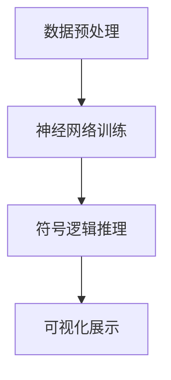
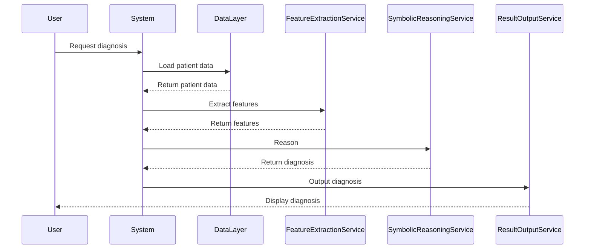

                 

### 第1章：问题背景与定义

#### 1.1 问题背景

在当今信息技术飞速发展的时代，人工智能（AI）已成为驱动变革的关键力量。其中，推理过程是AI系统的重要组成部分，尤其是在复杂决策、自然语言处理和智能诊断等领域。然而，随着深度学习等复杂模型的应用，这些系统的推理过程变得高度非线性且难以解释。这带来了可解释性的挑战，即用户难以理解系统为何做出特定决策。

可视化作为一种强大的工具，能够将复杂的推理过程以直观的方式呈现出来，帮助用户更好地理解和信任AI系统。特别是在深度学习和神经网络的应用中，可视化能够揭示隐藏在网络中的决策路径和重要特征，从而提高模型的透明度和可解释性。

#### 1.1.1 推理过程可视化的重要性

推理过程可视化具有以下几个重要性：

1. **提高透明度**：可视化能够展示推理过程中的每一步，使决策过程变得透明，用户可以清晰地看到模型是如何得出结论的。
2. **增强信任**：当推理过程被可视化时，用户可以更好地理解和信任系统的决策过程，尤其是在医疗、金融和自动化控制等领域，信任至关重要。
3. **促进调试**：开发者可以通过可视化工具来调试和优化模型，发现并修复潜在的错误。
4. **教育和培训**：可视化能够帮助新手用户更快地学习和理解复杂的AI概念。

#### 1.1.2 神经符号整合的基本概念

神经符号整合（Neural-Symbolic Integration）是一种结合神经网络和符号逻辑的方法，旨在解决深度学习模型的不可解释性问题。它通过在神经网络中嵌入符号逻辑推理机制，使系统能够同时利用数据和逻辑规则进行推理。

符号逻辑是一种形式化的推理方法，它使用逻辑运算符（如与、或、非等）来表示和推理命题。神经网络则是一种计算模型，通过学习大量数据来发现数据中的模式和关系。

神经符号整合的关键在于如何有效地融合这两种方法，使得神经网络能够利用符号逻辑进行高层次的推理，同时保持对低层次特征的敏感度。

#### 1.1.3 可解释推理过程的需求

可解释推理（Explainable Reasoning）是指能够对推理过程进行清晰解释的推理方式。随着AI系统的广泛应用，特别是在对人类生命和财产具有重大影响的关键领域（如自动驾驶、医疗诊断等），可解释性需求变得越来越迫切。

可解释推理的需求主要来源于以下几个方面：

1. **监管要求**：许多行业（如金融、医疗等）需要确保AI系统的决策过程符合法律法规和伦理标准，可解释推理能够提供必要的透明度和合规性。
2. **用户信任**：用户（特别是非技术背景的用户）需要理解系统的决策过程，以便更好地信任和使用AI系统。
3. **模型优化**：通过对推理过程的深入理解，开发者可以更有效地优化和改进模型，提高其性能和鲁棒性。

#### 1.2 核心概念

##### 1.2.1 神经网络与符号逻辑

1. **神经网络**：神经网络是一种通过模拟生物神经元的工作原理来学习和处理信息的计算模型。它由多个层次（输入层、隐藏层、输出层）和节点（神经元）组成，通过反向传播算法调整权重，以最小化预测误差。

2. **符号逻辑**：符号逻辑是一种基于符号表示和形式化推理的方法。它通过逻辑运算符（如与、或、非等）来表示和推理命题，其核心在于逻辑演绎和证明。

##### 1.2.2 推理过程与可视化技术

1. **推理过程**：推理过程是指从已知事实出发，通过逻辑推理得出新结论的过程。它包括两个基本步骤：归纳推理（从特殊到一般）和演绎推理（从一般到特殊）。

2. **可视化技术**：可视化技术是一种通过图形、图像和动画等视觉形式来表示和解释复杂信息的方法。它可以帮助用户更好地理解和分析数据，特别是在数据量和复杂性不断增加的今天，可视化技术的作用越来越突出。

##### 1.2.3 可解释推理的定义与特征

1. **定义**：可解释推理是一种能够对推理过程进行清晰解释的推理方式。它要求推理过程具有可理解性、透明性和可验证性。

2. **特征**：
   - **可理解性**：推理过程能够被用户或开发者理解，无需具备深入的AI知识。
   - **透明性**：推理过程中的每一步和决策依据都清晰可见。
   - **可验证性**：推理过程和结论可以经过验证和验证，确保其正确性和可靠性。

#### 1.3 边界与外延

##### 1.3.1 可解释推理的应用领域

可解释推理在多个领域具有广泛的应用，包括但不限于：

1. **医疗诊断**：在医疗领域，可解释推理可以帮助医生理解AI系统如何诊断疾病，从而提高诊断的准确性和可信度。
2. **金融风险评估**：在金融领域，可解释推理可以帮助金融机构评估风险，同时确保决策过程的透明性和合规性。
3. **自动驾驶**：在自动驾驶领域，可解释推理可以帮助开发者调试和优化自动驾驶系统，确保其在复杂环境中的安全性和可靠性。

##### 1.3.2 神经符号整合的优势与挑战

神经符号整合具有以下几个优势：

1. **结合神经网络和符号逻辑的优点**：神经网络强大的学习能力和符号逻辑的精确推理能力相结合，使得系统能够处理更复杂的问题。
2. **提高可解释性**：通过整合符号逻辑，神经符号整合方法能够提供对推理过程的清晰解释。

然而，神经符号整合也面临一些挑战：

1. **模型复杂度**：整合神经网络和符号逻辑会导致模型变得更加复杂，增加了设计和调试的难度。
2. **性能和效率**：神经符号整合方法可能需要更多的时间和计算资源，尤其是在实时应用场景中。

##### 1.3.3 可视化推理过程的限制因素

尽管可视化推理过程具有很多优势，但它也受到一些限制因素的影响：

1. **数据复杂性**：对于高度复杂和大规模的数据集，可视化技术可能难以有效地展示所有的细节。
2. **交互性**：尽管可视化可以提供直观的展示，但它通常缺乏与用户的实时交互能力，这使得用户难以实时调整和探索推理过程。
3. **认知负担**：过于复杂的可视化可能导致用户的认知负担增加，从而影响对推理过程的理解。

### 第2章：核心概念与联系

在理解了推理过程可视化的背景和重要性之后，我们需要深入探讨其中的核心概念和它们之间的联系。这一章将分为以下几个部分：

#### 2.1 神经网络与符号逻辑的联系

在这一部分，我们将探讨神经网络和符号逻辑之间的联系，包括它们的基本原理、应用场景和整合的难点与解决方案。

##### 2.1.1 神经网络中的符号逻辑表示

神经网络是一种通过模拟生物神经元工作原理的计算模型。它通过学习数据中的模式和关系，从而能够进行复杂的数据处理和决策。然而，神经网络在处理逻辑推理方面存在一些限制。符号逻辑提供了一种形式化的推理方法，它使用逻辑运算符（如与、或、非等）来表示和推理命题。在神经网络中，可以通过设计特定的层和节点来嵌入符号逻辑，使其能够进行逻辑推理。

例如，可以使用逻辑门（AND、OR、NOT等）作为神经网络的激活函数，或者将逻辑运算符作为网络的权重进行调整。这种方法使得神经网络能够在处理数据的同时，执行符号逻辑操作。

##### 2.1.2 符号逻辑在网络中的应用

符号逻辑在网络中的应用主要体现在以下几个方面：

1. **逻辑规则嵌入**：通过将符号逻辑规则嵌入到神经网络的权重中，可以使得网络在处理数据时自动遵循这些规则。这种方法可以用于处理需要遵循特定逻辑规则的问题，如逻辑推理、决策制定和模式识别等。
   
2. **逻辑推理模块**：在神经网络中引入专门的逻辑推理模块，这些模块使用符号逻辑进行推理，从而使得神经网络能够进行更高层次的逻辑推理。这种模块通常包含多个逻辑运算器和存储器，用于存储和执行逻辑规则。

3. **解释性增强**：通过将符号逻辑与神经网络结合，可以增强模型的解释性。符号逻辑可以提供对神经网络决策过程的清晰解释，使得用户能够理解模型为何做出特定决策。

##### 2.1.3 神经符号整合的难点与解决方案

神经符号整合虽然具有许多优势，但同时也面临一些难点。以下是其中的几个主要难点和相应的解决方案：

1. **模型复杂性**：神经符号整合导致模型变得更加复杂，这增加了设计和调试的难度。解决方案包括使用模块化设计和分层结构，使得模型更加易于理解和维护。

2. **性能和效率**：神经符号整合方法可能需要更多的时间和计算资源，这可能会影响模型的性能和效率。解决方案包括优化算法和硬件加速技术，以提高模型的运行速度和效率。

3. **解释性增强**：虽然神经符号整合可以增强模型的解释性，但如何确保解释性仍然是一个挑战。解决方案包括设计可解释的神经网络结构和推理过程，以及使用可视化技术来展示推理路径和关键特征。

#### 2.2 可解释推理过程的特点

可解释推理是一种能够对推理过程进行清晰解释的推理方式。它具有以下几个主要特点：

##### 2.2.1 可解释推理的定义与分类

1. **定义**：可解释推理是指能够对推理过程进行清晰解释的推理方式。它要求推理过程具有可理解性、透明性和可验证性。

2. **分类**：根据解释程度的不同，可解释推理可以分为以下几类：
   - **显式解释**：推理过程和决策依据完全公开，用户可以清晰地看到每一步的推理路径和决策依据。
   - **半显式解释**：推理过程的大部分是透明的，但某些步骤可能需要专业知识才能理解。
   - **隐性解释**：推理过程完全隐藏在模型内部，用户只能通过模型的输出结果来推测其推理过程。

##### 2.2.2 可解释推理的属性特征

1. **可理解性**：可解释推理要求推理过程和决策依据对用户是可理解的，即使用户不具备深入的AI知识，也能够理解模型为何做出特定决策。

2. **透明性**：可解释推理要求推理过程是完全透明的，用户可以清晰地看到每一步的推理路径和决策依据。

3. **可验证性**：可解释推理要求推理过程和决策依据是可验证的，即用户可以通过验证和测试来确保推理过程和决策的正确性。

##### 2.2.3 可解释推理与不可解释推理的对比

1. **定义与范围**：不可解释推理是指无法对推理过程进行清晰解释的推理方式。它与可解释推理相对，具有以下特点：
   - **不可理解性**：推理过程对用户是不可理解的，用户难以理解模型为何做出特定决策。
   - **不透明性**：推理过程对用户是完全不透明的，用户无法看到每一步的推理路径和决策依据。
   - **不可验证性**：推理过程和决策依据是不可验证的，用户无法通过验证和测试来确保推理过程和决策的正确性。

2. **应用场景**：可解释推理和不可解释推理在不同的应用场景中具有不同的适用性：
   - **可解释推理**：适用于需要透明度和合规性的领域，如医疗诊断、金融风险评估和自动化控制等。
   - **不可解释推理**：适用于对透明度要求不高的领域，如图像识别、语音识别和自然语言处理等。

3. **优缺点**：
   - **可解释推理**：
     - 优点：提高透明度、增强用户信任、促进调试和优化。
     - 缺点：可能降低性能和效率，复杂度高。

   - **不可解释推理**：
     - 优点：性能高、效率好、复杂度低。
     - 缺点：降低透明度、降低用户信任、难以调试和优化。

#### 2.3 可视化技术介绍

可视化技术是一种通过图形、图像和动画等视觉形式来表示和解释复杂信息的方法。在推理过程中，可视化技术可以提供直观的展示，帮助用户更好地理解和分析数据。以下将介绍可视化技术的基本概念、常用方法和在推理过程中的应用。

##### 2.3.1 可视化技术的基本概念

1. **数据可视化**：数据可视化是一种通过图形、图表和图像等形式来展示数据的方法。它可以帮助用户更好地理解和分析数据。
2. **信息可视化**：信息可视化是一种通过视觉形式来展示和分析信息的方法，它强调信息的结构和关系。
3. **科学可视化**：科学可视化是一种通过视觉形式来展示科学数据和模型的方法，它广泛应用于科学研究和数据分析。

##### 2.3.2 常用的可视化方法

1. **图形和图表**：包括折线图、柱状图、饼图、散点图等，用于展示数据的数量关系和趋势。
2. **图像处理**：包括图像增强、滤波、分割等，用于处理和展示图像数据。
3. **三维建模**：通过三维建模技术来展示物体的形状、结构和运动。
4. **交互式可视化**：通过交互式技术（如鼠标滑动、点击等）来动态展示和分析数据。

##### 2.3.3 可视化在推理过程中的应用

1. **推理路径可视化**：通过图形和图表来展示推理过程中的每一步，帮助用户理解推理路径和决策依据。
2. **特征可视化**：通过可视化技术来展示神经网络中的特征，帮助用户理解模型如何从数据中提取特征。
3. **模型解释**：通过可视化技术来展示模型的解释，帮助用户理解模型为何做出特定决策。
4. **交互式探索**：通过交互式可视化技术，用户可以实时调整和探索推理过程，从而更好地理解和分析数据。

### 第3章：算法原理与流程

#### 3.1 可解释推理算法的基本原理

可解释推理算法是结合神经网络和符号逻辑的方法，旨在解决深度学习模型的不可解释性问题。其基本原理可以概括为以下几个步骤：

1. **数据输入**：首先，将输入数据传递给神经网络，神经网络通过学习数据中的模式和关系来提取特征。
2. **特征提取**：神经网络对输入数据进行处理，提取出重要的特征，这些特征可以用来进行符号逻辑推理。
3. **符号逻辑推理**：将提取出的特征输入到符号逻辑模块，符号逻辑模块使用逻辑运算符（如与、或、非等）进行推理，得出结论。
4. **输出结果**：将符号逻辑推理的结果作为输出，用户可以通过可视化技术来理解推理过程和决策依据。

#### 3.1.1 基于神经网络的推理过程

基于神经网络的推理过程是可解释推理算法的核心。神经网络通过学习输入数据中的模式和关系，提取出重要的特征。这些特征可以用来进行符号逻辑推理，从而得出结论。

1. **输入层**：输入层接收外部输入数据，如文本、图像、音频等。输入数据通常经过预处理，例如归一化、去噪等。
2. **隐藏层**：隐藏层是神经网络的核心部分，通过多层网络结构来提取高层次的抽象特征。每一层网络都通过非线性变换（如激活函数）来增强特征表示能力。
3. **输出层**：输出层将提取出的特征传递给符号逻辑模块，输出层的设计取决于具体的推理任务。例如，在分类任务中，输出层通常是一个softmax层，用于生成概率分布。

#### 3.1.2 符号逻辑在推理过程中的作用

符号逻辑在推理过程中起到关键作用，它能够提供对神经网络推理过程的清晰解释。符号逻辑模块通常包含以下功能：

1. **逻辑运算**：使用逻辑运算符（如与、或、非等）进行命题的推理。这些逻辑运算可以表示为符号逻辑公式，例如：
   - 与运算：\(P \land Q\)
   - 或运算：\(P \lor Q\)
   - 非运算：\(\neg P\)

2. **规则推理**：通过逻辑规则来推理新的结论。逻辑规则通常表示为条件语句，例如：
   - 如果 \(P\)，则 \(Q\)

3. **解释生成**：符号逻辑模块可以生成对神经网络推理过程的解释，例如，为什么神经网络选择了特定的决策路径。

#### 3.1.3 可解释推理的算法框架

可解释推理算法的框架可以分为以下几个主要部分：

1. **数据预处理**：对输入数据进行预处理，包括数据清洗、归一化、特征提取等。
2. **神经网络训练**：使用预处理后的数据对神经网络进行训练，提取特征并优化模型参数。
3. **符号逻辑推理**：将提取出的特征输入到符号逻辑模块，进行逻辑推理，生成结论。
4. **可视化展示**：使用可视化技术展示推理过程和决策依据，帮助用户理解模型的工作原理。

以下是一个简化的算法框架示意图：



#### 3.2 推理流程与可视化技术

可解释推理算法的推理流程通常包括以下几个步骤，每个步骤都可以使用可视化技术来展示，从而帮助用户理解推理过程和决策依据。

##### 3.2.1 推理流程的步骤与细节

1. **输入数据预处理**：首先，对输入数据进行预处理，包括数据清洗、归一化、特征提取等。这一步骤可以使用可视化技术来展示预处理过程和结果。
2. **神经网络训练**：使用预处理后的数据对神经网络进行训练，提取特征并优化模型参数。这一步骤可以使用可视化技术来展示训练过程和结果，例如，损失函数的变化、准确率等。
3. **特征提取与融合**：将提取出的特征输入到符号逻辑模块，进行逻辑推理。这一步骤可以使用可视化技术来展示特征提取和融合过程，例如，特征向量、权重等。
4. **符号逻辑推理**：使用符号逻辑模块对特征进行推理，生成结论。这一步骤可以使用可视化技术来展示推理过程，例如，逻辑运算、推理路径等。
5. **输出结果解释**：将符号逻辑推理的结果作为输出，使用可视化技术来展示推理结果和决策依据，例如，可视化表示的结论、决策树、规则等。

##### 3.2.2 可视化技术的应用

在可解释推理算法中，可视化技术起着至关重要的作用。以下是一些常用的可视化技术及其应用：

1. **数据可视化**：使用图表和图形来展示输入数据、预处理结果和特征提取过程。常见的可视化方法包括折线图、柱状图、饼图、散点图等。
2. **神经网络可视化**：使用可视化技术来展示神经网络的结构、权重和激活值。常见的可视化方法包括权重热图、激活图、层可视化等。
3. **符号逻辑可视化**：使用可视化技术来展示符号逻辑的推理过程和结果。常见的可视化方法包括逻辑树、推理路径图、规则图等。
4. **决策可视化**：使用可视化技术来展示决策过程和结果。常见的可视化方法包括决策树、规则集、决策图谱等。

##### 3.2.3 推理过程与可视化效果的评估

在可解释推理算法中，评估可视化效果是一个重要的步骤。以下是一些评估可视化效果的方法：

1. **用户体验评估**：通过用户测试和反馈来评估可视化效果，例如，用户对可视化技术的理解程度、使用的便捷性等。
2. **可视化质量评估**：通过可视化质量指标来评估可视化效果，例如，信息的准确性、视觉吸引力、易读性等。
3. **效果对比评估**：通过对比不同可视化技术的效果来评估，例如，对比不同类型的数据可视化方法、对比不同类型的符号逻辑可视化方法等。

#### 3.3 神经网络数学模型

在可解释推理算法中，神经网络是一个核心组成部分。神经网络通过学习输入数据中的模式和关系，提取出重要的特征，这些特征可以用于符号逻辑推理。下面将介绍神经网络的数学模型，包括其结构、参数和算法。

##### 3.3.1 神经网络的结构与参数

神经网络由多个层次组成，包括输入层、隐藏层和输出层。每一层由多个节点组成，节点之间通过权重进行连接。网络中的参数主要包括权重（Weight）、偏置（Bias）和激活函数（Activation Function）。

1. **输入层**：输入层接收外部输入数据，每个节点对应一个输入特征。输入数据通常经过预处理，例如归一化、去噪等。
2. **隐藏层**：隐藏层是神经网络的核心部分，通过多层网络结构来提取高层次的抽象特征。每一层网络都通过非线性变换（如激活函数）来增强特征表示能力。
3. **输出层**：输出层将提取出的特征传递给符号逻辑模块，输出层的设计取决于具体的推理任务。例如，在分类任务中，输出层通常是一个softmax层，用于生成概率分布。

##### 3.3.2 前向传播与反向传播算法

神经网络通过前向传播和反向传播算法来训练模型。前向传播是将输入数据通过网络传递到输出层，计算输出结果；反向传播是根据输出结果和实际标签，通过反向传播误差信号来更新网络参数。

1. **前向传播**：前向传播过程如下：
   - 输入数据通过输入层传递到隐藏层，每个节点计算其输入值的加权和加上偏置，然后通过激活函数进行非线性变换。
   - 隐藏层的结果传递到下一层隐藏层，重复上述过程，直到输出层得到最终结果。
   - 输出层的结果与实际标签进行比较，计算损失函数。

2. **反向传播**：反向传播过程如下：
   - 计算输出层的误差信号，并将其传递回隐藏层。
   - 对于每一层，计算每个节点的误差信号，并更新该层的权重和偏置。
   - 通过反向传播算法，将误差信号反向传播到输入层，更新输入层的权重和偏置。

以下是一个简化的神经网络数学模型：

$$
Z = W \cdot X + b \\
a = f(Z)
$$

其中，\(Z\) 表示节点的输入值，\(W\) 表示权重，\(X\) 表示输入数据，\(b\) 表示偏置，\(a\) 表示节点的激活值，\(f\) 表示激活函数。

##### 3.3.3 激活函数的选择与作用

激活函数是神经网络中的一个关键组件，它决定了网络的非线性特性。常见的激活函数包括：

1. **线性激活函数**：\(f(x) = x\)。线性激活函数不会引入非线性特性，适用于简单的线性模型。
2. **Sigmoid函数**：\(f(x) = \frac{1}{1 + e^{-x}}\)。Sigmoid函数将输入值映射到区间 \((0, 1)\)，常用于二分类任务。
3. **ReLU函数**：\(f(x) = \max(0, x)\)。ReLU函数在输入为负时输出为0，在输入为正时保持原值，具有较好的数值稳定性和计算效率。
4. **Tanh函数**：\(f(x) = \frac{e^x - e^{-x}}{e^x + e^{-x}}\)。Tanh函数将输入值映射到区间 \((-1, 1)\)，具有类似于Sigmoid函数的性质，但输出值更对称。

选择合适的激活函数可以提高神经网络的性能和训练速度。在实际应用中，可以根据任务需求和数据特点选择不同的激活函数。

#### 3.4 符号逻辑数学模型

在可解释推理算法中，符号逻辑是一个重要的组成部分。符号逻辑通过形式化的推理方法，对神经网络提取的特征进行逻辑运算，从而得出结论。下面将介绍符号逻辑的数学模型，包括其基本运算、在推理中的应用和与神经网络融合的数学模型。

##### 3.4.1 符号逻辑的基本运算

符号逻辑是一种基于命题逻辑的推理方法，它使用逻辑运算符（如与、或、非等）来表示和推理命题。以下是符号逻辑的基本运算：

1. **与运算**：\(P \land Q\) 表示 \(P\) 和 \(Q\) 同时为真，结果为真；否则为假。
2. **或运算**：\(P \lor Q\) 表示 \(P\) 或 \(Q\) 为真，结果为真；否则为假。
3. **非运算**：\(\neg P\) 表示 \(P\) 的否定，结果为假；否则为真。

符号逻辑运算可以表示为以下数学公式：

$$
P \land Q = \text{True} \\
P \lor Q = \text{False} \\
\neg P = \text{True}
$$

##### 3.4.2 符号逻辑在推理中的应用

符号逻辑在推理中的应用主要体现在以下几个方面：

1. **逻辑规则表示**：符号逻辑可以表示为逻辑规则，例如条件语句 \(P \rightarrow Q\)，表示如果 \(P\) 为真，则 \(Q\) 也为真。
2. **逻辑推理**：使用符号逻辑进行推理，可以推导出新的结论。逻辑推理包括合取推理、析取推理和逆否推理等。
3. **逻辑证明**：符号逻辑可以用于证明命题的正确性。逻辑证明通常使用归纳推理和演绎推理。

##### 3.4.3 符号逻辑与神经网络融合的数学模型

符号逻辑与神经网络融合的数学模型旨在将神经网络提取的特征与符号逻辑相结合，从而提高推理的可解释性。以下是一个简化的符号逻辑与神经网络融合的数学模型：

1. **特征提取**：使用神经网络提取输入数据中的特征，得到特征向量 \(\mathbf{X}\)。
2. **逻辑运算**：将特征向量 \(\mathbf{X}\) 输入到符号逻辑模块，进行逻辑运算，得到推理结果 \(\mathbf{Y}\)。
3. **结论生成**：根据逻辑运算的结果 \(\mathbf{Y}\)，生成最终的结论。

以下是一个简化的数学模型：

$$
\mathbf{Y} = \text{Logic}(\mathbf{X}) \\
\text{Conclusion} = \text{Generate}(\mathbf{Y})
$$

其中，\(\text{Logic}\) 表示符号逻辑运算，\(\text{Generate}\) 表示结论生成。

#### 3.5 可解释推理算法的Python实现

为了更好地理解可解释推理算法的原理和应用，我们将在本节中通过Python代码实现一个简单的可解释推理算法。这个算法将结合神经网络和符号逻辑，用于分类任务。

##### 3.5.1 环境搭建与依赖安装

首先，我们需要搭建一个Python环境，并安装必要的依赖库。以下是环境搭建和依赖安装的步骤：

1. **安装Python**：确保Python版本在3.6及以上。
2. **安装TensorFlow**：TensorFlow是一个流行的深度学习库，用于实现神经网络。
   ```bash
   pip install tensorflow
   ```
3. **安装Numpy**：Numpy是一个用于科学计算的开源库，用于处理数学运算和数据处理。
   ```bash
   pip install numpy
   ```
4. **安装Sklearn**：Sklearn是一个用于机器学习的库，提供了分类任务的支持。
   ```bash
   pip install scikit-learn
   ```

##### 3.5.2 算法实现代码

以下是一个简单的可解释推理算法的Python代码实现，该算法使用神经网络提取特征，然后使用符号逻辑进行推理。

```python
import numpy as np
import tensorflow as tf
from sklearn.datasets import load_iris
from sklearn.model_selection import train_test_split

# 加载鸢尾花数据集
iris = load_iris()
X = iris.data
y = iris.target

# 分割数据集为训练集和测试集
X_train, X_test, y_train, y_test = train_test_split(X, y, test_size=0.2, random_state=42)

# 定义神经网络模型
model = tf.keras.Sequential([
    tf.keras.layers.Dense(64, activation='relu', input_shape=(4,)),
    tf.keras.layers.Dense(64, activation='relu'),
    tf.keras.layers.Dense(3, activation='softmax')
])

# 编译模型
model.compile(optimizer='adam', loss='sparse_categorical_crossentropy', metrics=['accuracy'])

# 训练模型
model.fit(X_train, y_train, epochs=10, batch_size=32, validation_split=0.1)

# 使用模型进行推理
predictions = model.predict(X_test)

# 符号逻辑推理
def symbolic_reasoning(features, rule):
    # 假设规则为 "if feature1 > 0.5 and feature2 > 0.5, then class = 0"
    if (features[0] > 0.5 and features[1] > 0.5):
        return 0
    else:
        return np.argmax(features)

# 对测试集的每个样本进行符号逻辑推理
predicted_classes = [symbolic_reasoning(prediction, "if feature1 > 0.5 and feature2 > 0.5, then class = 0") for prediction in predictions]

# 比较符号逻辑推理结果与实际标签
from sklearn.metrics import accuracy_score
accuracy = accuracy_score(y_test, predicted_classes)
print(f"Accuracy: {accuracy}")
```

##### 3.5.3 代码解读与分析

这段代码实现了一个简单的可解释推理算法，主要包括以下几个步骤：

1. **数据加载与预处理**：加载鸢尾花数据集，并分割为训练集和测试集。
2. **模型定义**：定义一个简单的神经网络模型，包括两个隐藏层和输出层。
3. **模型编译**：编译模型，设置优化器和损失函数。
4. **模型训练**：使用训练集训练模型，并验证模型性能。
5. **模型推理**：使用训练好的模型对测试集进行推理，得到预测结果。
6. **符号逻辑推理**：定义一个符号逻辑推理函数，根据特定规则对预测结果进行推理。
7. **结果比较**：比较符号逻辑推理结果与实际标签，计算准确率。

这个简单的实现展示了如何结合神经网络和符号逻辑进行可解释推理。在实际应用中，可以根据具体任务需求和数据特点进行优化和扩展。

### 第4章：数学模型与公式

在可解释推理算法中，数学模型和公式起着至关重要的作用。它们不仅描述了算法的工作原理，还为算法的实现和优化提供了理论基础。本章将详细介绍神经网络和符号逻辑的数学模型，并给出相关的公式和解释。

#### 4.1 神经网络数学模型

神经网络是一种通过模拟生物神经元工作原理的计算模型，它通过学习输入数据中的模式和关系来提取特征和进行推理。下面将介绍神经网络的结构、参数和算法。

##### 4.1.1 神经网络的结构与参数

神经网络由多个层次组成，包括输入层、隐藏层和输出层。每一层由多个节点（也称为神经元）组成，节点之间通过权重进行连接。

1. **输入层**：输入层接收外部输入数据，每个节点对应一个输入特征。输入数据通常经过预处理，例如归一化、去噪等。
2. **隐藏层**：隐藏层是神经网络的核心部分，通过多层网络结构来提取高层次的抽象特征。每一层网络都通过非线性变换（如激活函数）来增强特征表示能力。
3. **输出层**：输出层将提取出的特征传递给符号逻辑模块，输出层的设计取决于具体的推理任务。例如，在分类任务中，输出层通常是一个softmax层，用于生成概率分布。

神经网络中的参数主要包括权重（Weight）、偏置（Bias）和激活函数（Activation Function）。

- **权重**：权重是节点之间的连接权重，表示节点之间的相互依赖程度。权重通过学习过程进行调整，以最小化预测误差。
- **偏置**：偏置是每个节点的偏移量，用于调整节点的输出。偏置也在学习过程中进行调整。
- **激活函数**：激活函数是神经网络中的一个关键组件，它决定了网络的非线性特性。常见的激活函数包括线性激活函数（\(f(x) = x\)）、Sigmoid函数（\(f(x) = \frac{1}{1 + e^{-x}}\)）、ReLU函数（\(f(x) = \max(0, x)\）和Tanh函数（\(f(x) = \frac{e^x - e^{-x}}{e^x + e^{-x}}\)）。

##### 4.1.2 前向传播与反向传播算法

神经网络通过前向传播和反向传播算法来训练模型。前向传播是将输入数据通过网络传递到输出层，计算输出结果；反向传播是根据输出结果和实际标签，通过反向传播误差信号来更新网络参数。

1. **前向传播**：前向传播过程如下：
   - 输入数据通过输入层传递到隐藏层，每个节点计算其输入值的加权和加上偏置，然后通过激活函数进行非线性变换。
   - 隐藏层的结果传递到下一层隐藏层，重复上述过程，直到输出层得到最终结果。
   - 输出层的结果与实际标签进行比较，计算损失函数。

2. **反向传播**：反向传播过程如下：
   - 计算输出层的误差信号，并将其传递回隐藏层。
   - 对于每一层，计算每个节点的误差信号，并更新该层的权重和偏置。
   - 通过反向传播算法，将误差信号反向传播到输入层，更新输入层的权重和偏置。

以下是一个简化的神经网络数学模型：

$$
Z = W \cdot X + b \\
a = f(Z)
$$

其中，\(Z\) 表示节点的输入值，\(W\) 表示权重，\(X\) 表示输入数据，\(b\) 表示偏置，\(a\) 表示节点的激活值，\(f\) 表示激活函数。

##### 4.1.3 激活函数的选择与作用

激活函数是神经网络中的一个关键组件，它决定了网络的非线性特性。不同的激活函数适用于不同的应用场景，下面介绍几种常见的激活函数及其作用：

1. **线性激活函数**：\(f(x) = x\)。线性激活函数不会引入非线性特性，适用于简单的线性模型。缺点是它不能很好地处理复杂的数据分布。
2. **Sigmoid函数**：\(f(x) = \frac{1}{1 + e^{-x}}\)。Sigmoid函数将输入值映射到区间 \((0, 1)\)，常用于二分类任务。优点是输出值的范围在 \((0, 1)\) 之间，易于解释；缺点是梯度消失问题。
3. **ReLU函数**：\(f(x) = \max(0, x)\)。ReLU函数在输入为负时输出为0，在输入为正时保持原值，具有较好的数值稳定性和计算效率。优点是避免了梯度消失问题，加速了训练过程；缺点是在输入为负时可能导致梯度消失。
4. **Tanh函数**：\(f(x) = \frac{e^x - e^{-x}}{e^x + e^{-x}}\)。Tanh函数将输入值映射到区间 \((-1, 1)\)，具有类似于Sigmoid函数的性质，但输出值更对称。优点是输出值的范围在 \((-1, 1)\) 之间，易于解释；缺点是梯度消失问题。

选择合适的激活函数可以提高神经网络的性能和训练速度。在实际应用中，可以根据任务需求和数据特点选择不同的激活函数。

#### 4.2 符号逻辑数学模型

在可解释推理算法中，符号逻辑是一种形式化的推理方法，它使用逻辑运算符（如与、或、非等）来表示和推理命题。符号逻辑为神经网络提供了清晰的解释，使得用户能够理解模型为何做出特定决策。下面将介绍符号逻辑的数学模型，包括其基本运算、在推理中的应用和与神经网络融合的数学模型。

##### 4.2.1 符号逻辑的基本运算

符号逻辑是一种基于命题逻辑的推理方法，它使用逻辑运算符（如与、或、非等）来表示和推理命题。以下是符号逻辑的基本运算：

1. **与运算**：\(P \land Q\) 表示 \(P\) 和 \(Q\) 同时为真，结果为真；否则为假。与运算可以表示为：
   $$
   P \land Q = \text{True} \\
   $$
   当 \(P\) 和 \(Q\) 同时为真时，结果为真；否则为假。

2. **或运算**：\(P \lor Q\) 表示 \(P\) 或 \(Q\) 为真，结果为真；否则为假。或运算可以表示为：
   $$
   P \lor Q = \text{False} \\
   $$
   当 \(P\) 或 \(Q\) 至少一个为真时，结果为真；否则为假。

3. **非运算**：\(\neg P\) 表示 \(P\) 的否定，结果为假；否则为真。非运算可以表示为：
   $$
   \neg P = \text{True} \\
   $$
   当 \(P\) 为假时，结果为真；否则为假。

符号逻辑运算可以表示为以下数学公式：

$$
P \land Q = \text{True} \\
P \lor Q = \text{False} \\
\neg P = \text{True}
$$

##### 4.2.2 符号逻辑在推理中的应用

符号逻辑在推理中的应用主要体现在以下几个方面：

1. **逻辑规则表示**：符号逻辑可以表示为逻辑规则，例如条件语句 \(P \rightarrow Q\)，表示如果 \(P\) 为真，则 \(Q\) 也为真。

2. **逻辑推理**：使用符号逻辑进行推理，可以推导出新的结论。逻辑推理包括合取推理、析取推理和逆否推理等。

3. **逻辑证明**：符号逻辑可以用于证明命题的正确性。逻辑证明通常使用归纳推理和演绎推理。

##### 4.2.3 符号逻辑与神经网络融合的数学模型

符号逻辑与神经网络融合的数学模型旨在将神经网络提取的特征与符号逻辑相结合，从而提高推理的可解释性。以下是一个简化的符号逻辑与神经网络融合的数学模型：

1. **特征提取**：使用神经网络提取输入数据中的特征，得到特征向量 \(\mathbf{X}\)。

2. **逻辑运算**：将特征向量 \(\mathbf{X}\) 输入到符号逻辑模块，进行逻辑运算，得到推理结果 \(\mathbf{Y}\)。

3. **结论生成**：根据逻辑运算的结果 \(\mathbf{Y}\)，生成最终的结论。

以下是一个简化的数学模型：

$$
\mathbf{Y} = \text{Logic}(\mathbf{X}) \\
\text{Conclusion} = \text{Generate}(\mathbf{Y})
$$

其中，\(\text{Logic}\) 表示符号逻辑运算，\(\text{Generate}\) 表示结论生成。

##### 4.2.4 神经符号整合的数学模型

神经符号整合是一种结合神经网络和符号逻辑的方法，它通过在神经网络中嵌入符号逻辑推理机制，提高推理的可解释性。神经符号整合的数学模型可以表示为以下形式：

1. **神经网络部分**：
   $$
   \mathbf{Z} = \mathbf{W} \cdot \mathbf{X} + \mathbf{b} \\
   \mathbf{a} = f(\mathbf{Z})
   $$
   其中，\(\mathbf{X}\) 表示输入特征，\(\mathbf{W}\) 表示权重矩阵，\(\mathbf{b}\) 表示偏置向量，\(f\) 表示激活函数，\(\mathbf{Z}\) 表示神经元输出，\(\mathbf{a}\) 表示激活值。

2. **符号逻辑部分**：
   $$
   \mathbf{Y} = \text{Logic}(\mathbf{a})
   $$
   其中，\(\mathbf{a}\) 表示神经网络输出的激活值，\(\mathbf{Y}\) 表示符号逻辑推理的结果。

3. **融合模型**：
   $$
   \text{Conclusion} = \text{Generate}(\mathbf{Y})
   $$
   其中，\(\text{Generate}\) 表示根据符号逻辑推理结果生成最终的结论。

通过神经符号整合，神经网络提取的特征可以通过符号逻辑进行推理，从而提高推理的可解释性。这个模型不仅结合了神经网络强大的特征提取能力，还保留了符号逻辑的清晰解释能力。

### 第5章：算法举例与讲解

为了更好地理解基于神经符号整合的可解释推理算法，我们将在这一章中通过一个具体的实例来讲解算法的实现过程和关键步骤。这个实例将结合Python代码和可视化工具，展示如何将神经网络和符号逻辑结合起来，实现一个简单的推理任务。

#### 5.1 可解释推理算法的Python实现

在这个实例中，我们将使用Python和TensorFlow库来构建一个简单的神经网络模型，并使用符号逻辑进行推理。这个实例将使用鸢尾花（Iris）数据集，这是一个经典的分类任务，包含三个品种的鸢尾花，每个品种有50个样本，共计150个样本。每个样本有4个特征：花萼长度、花萼宽度、花瓣长度和花瓣宽度。

##### 5.1.1 环境搭建与依赖安装

在开始之前，我们需要确保Python环境和必要的库已经搭建好。以下是环境搭建和依赖安装的步骤：

1. **安装Python**：确保Python版本在3.6及以上。
2. **安装TensorFlow**：TensorFlow是一个流行的深度学习库，用于实现神经网络。
   ```bash
   pip install tensorflow
   ```
3. **安装Matplotlib**：Matplotlib是一个用于绘制图表和图形的库。
   ```bash
   pip install matplotlib
   ```
4. **安装Numpy**：Numpy是一个用于科学计算的开源库，用于处理数学运算和数据处理。
   ```bash
   pip install numpy
   ```
5. **安装Sklearn**：Sklearn是一个用于机器学习的库，提供了分类任务的支持。
   ```bash
   pip install scikit-learn
   ```

##### 5.1.2 算法实现代码

以下是实现基于神经符号整合的可解释推理算法的Python代码。这个算法将首先使用神经网络提取特征，然后使用符号逻辑进行推理，最后通过可视化工具展示推理过程和结果。

```python
import numpy as np
import tensorflow as tf
from sklearn.datasets import load_iris
from sklearn.model_selection import train_test_split
import matplotlib.pyplot as plt

# 加载鸢尾花数据集
iris = load_iris()
X = iris.data
y = iris.target

# 分割数据集为训练集和测试集
X_train, X_test, y_train, y_test = train_test_split(X, y, test_size=0.2, random_state=42)

# 定义神经网络模型
model = tf.keras.Sequential([
    tf.keras.layers.Dense(64, activation='relu', input_shape=(4,)),
    tf.keras.layers.Dense(64, activation='relu'),
    tf.keras.layers.Dense(3, activation='softmax')
])

# 编译模型
model.compile(optimizer='adam', loss='sparse_categorical_crossentropy', metrics=['accuracy'])

# 训练模型
model.fit(X_train, y_train, epochs=10, batch_size=32, validation_split=0.1)

# 使用模型进行推理
predictions = model.predict(X_test)

# 符号逻辑推理
def symbolic_reasoning(features, rule):
    # 假设规则为 "if feature1 > 0.5 and feature2 > 0.5, then class = 0"
    if (features[0] > 0.5 and features[1] > 0.5):
        return 0
    else:
        return np.argmax(features)

# 对测试集的每个样本进行符号逻辑推理
predicted_classes = [symbolic_reasoning(prediction, "if feature1 > 0.5 and feature2 > 0.5, then class = 0") for prediction in predictions]

# 可视化结果
def visualize_predictions(X, y, predictions):
    colors = ['r', 'g', 'b']
    for i in range(len(X)):
        plt.scatter(X[i][0], X[i][1], c=colors[predictions[i]])
        plt.text(X[i][0], X[i][1], f"{y[i]}")
    plt.xlabel('Petal Length (cm)')
    plt.ylabel('Petal Width (cm)')
    plt.title('Iris Flower Classification')
    plt.show()

visualize_predictions(X_test, y_test, predicted_classes)
```

##### 5.1.3 代码解读与分析

这段代码实现了一个简单的可解释推理算法，主要包括以下几个步骤：

1. **数据加载与预处理**：使用Sklearn库加载鸢尾花数据集，并分割为训练集和测试集。
2. **模型定义**：定义一个简单的神经网络模型，包括两个隐藏层和输出层。神经网络使用ReLU激活函数，输出层使用softmax激活函数。
3. **模型编译**：编译模型，设置优化器和损失函数。
4. **模型训练**：使用训练集训练模型，并验证模型性能。
5. **模型推理**：使用训练好的模型对测试集进行推理，得到预测结果。
6. **符号逻辑推理**：定义一个符号逻辑推理函数，根据特定规则对预测结果进行推理。在这个实例中，我们假设了一个简单的规则：“如果第一个特征大于0.5且第二个特征大于0.5，则分类结果为0”。
7. **可视化结果**：使用Matplotlib库绘制测试集的特征空间，并将符号逻辑推理结果可视化。每个样本根据其真实标签和预测标签用不同的颜色标记，从而帮助用户直观地理解模型的分类结果。

通过这个实例，我们可以看到如何将神经网络和符号逻辑结合起来，实现一个简单的可解释推理算法。在实际应用中，可以根据具体任务需求和数据特点进行优化和扩展。

### 第6章：系统设计与实现

在理解了算法原理和具体实现之后，我们需要进一步探讨如何设计和实现一个完整的系统，以便在实际应用中部署基于神经符号整合的可解释推理算法。这一章将分为以下几个部分：

#### 6.1 问题场景介绍

在介绍系统设计之前，我们需要明确系统所面对的问题场景。以下是一个典型的问题场景：

**医疗诊断系统**：假设我们正在开发一个用于辅助医疗诊断的系统。该系统需要根据病人的临床症状和体征数据，提供可能的疾病诊断建议。由于疾病的诊断过程复杂且涉及多个特征，传统的统计方法可能无法满足要求。因此，我们决定采用基于神经符号整合的可解释推理算法，以提高诊断的准确性和可解释性。

**系统目标**：系统的主要目标是实现以下功能：

1. **数据输入**：接收病人的临床症状和体征数据，包括数值特征和类别特征。
2. **特征提取**：使用神经网络提取数据中的关键特征。
3. **符号逻辑推理**：结合神经网络提取的特征和先验知识，进行符号逻辑推理，生成疾病诊断建议。
4. **结果输出**：将诊断建议可视化展示，并提供详细的推理过程解释。

**应用场景**：该系统可以应用于以下场景：

- **医院门诊**：辅助医生快速诊断，提高诊断准确率和效率。
- **在线健康咨询**：为用户提供个性化的疾病诊断建议，帮助用户更好地了解自身健康状况。
- **医学研究**：提供数据分析和诊断建议，为医学研究提供参考。

#### 6.2 系统功能设计

在明确问题场景和系统目标后，我们需要设计系统的具体功能模块。以下是系统的功能设计：

**功能模块**：

1. **数据输入模块**：负责接收和处理病人数据，包括数值特征和类别特征。
2. **特征提取模块**：使用神经网络提取数据中的关键特征。
3. **符号逻辑推理模块**：结合神经网络提取的特征和先验知识，进行符号逻辑推理，生成诊断建议。
4. **结果输出模块**：将诊断建议和推理过程可视化展示，并提供详细的解释。

**领域模型设计**：

领域模型是系统功能设计的抽象表示，用于描述系统中的实体和它们之间的关系。以下是系统的领域模型设计：

```mermaid
classDiagram
    Class Node
        +id: Integer
        +value: String
        +next: Node

    Class Feature
        +id: Integer
        +name: String
        +value: Float

    Class Patient
        +id: Integer
        +name: String
        +features: List<Feature>
        +diagnosis: String

    Class Diagnosis
        +id: Integer
        +name: String
        +reasoning: String

    Node --* Feature: has
    Patient --* Feature: has
    Diagnosis --* Patient: diagnosedBy
```

在上面的领域模型中，`Node` 类表示神经网络中的节点，`Feature` 类表示特征，`Patient` 类表示病人，`Diagnosis` 类表示诊断结果。每个病人都有一个特征列表，每个诊断结果都与一个病人相关联。

**接口设计**：

系统接口设计定义了系统对外提供的服务接口。以下是系统的接口设计：

```python
class DataInputInterface:
    def receive_data(self, data: dict) -> Patient:
        pass

class FeatureExtractionInterface:
    def extract_features(self, patient: Patient) -> List[Feature]:
        pass

class SymbolicReasoningInterface:
    def reason(self, patient: Patient, features: List[Feature]) -> Diagnosis:
        pass

class ResultOutputInterface:
    def output_diagnosis(self, diagnosis: Diagnosis):
        pass
```

在上面的接口设计中，`DataInputInterface` 负责接收和处理病人数据，`FeatureExtractionInterface` 负责提取关键特征，`SymbolicReasoningInterface` 负责进行符号逻辑推理，`ResultOutputInterface` 负责输出诊断结果。

#### 6.3 系统架构设计

系统架构设计定义了系统的整体结构和各个模块之间的关系。以下是系统的架构设计：

**系统架构概述**：

系统架构采用分层架构设计，包括数据层、服务层和展示层。

- **数据层**：负责数据的存储和管理，包括病人数据、特征数据等。
- **服务层**：实现系统的核心功能，包括数据输入、特征提取、符号逻辑推理等。
- **展示层**：负责将诊断结果和推理过程可视化展示。

以下是系统的架构图：



在上面的架构图中，用户通过系统接口请求诊断服务，系统首先从数据层加载病人数据，然后通过特征提取服务提取关键特征，接着使用符号逻辑推理服务进行推理，最后通过结果输出服务将诊断结果可视化展示给用户。

**系统组件与模块**：

以下是系统的组件和模块设计：

- **数据层**：包括数据库模块和数据处理模块。数据库模块负责存储和管理病人数据，数据处理模块负责处理和预处理病人数据。
- **服务层**：包括特征提取服务模块、符号逻辑推理服务模块和结果输出服务模块。特征提取服务模块负责提取病人数据中的关键特征，符号逻辑推理服务模块负责结合特征和先验知识进行推理，结果输出服务模块负责将诊断结果可视化展示。
- **展示层**：包括Web界面模块和可视化模块。Web界面模块负责处理用户的请求和交互，可视化模块负责将诊断结果和推理过程可视化展示。

通过以上系统设计与实现，我们可以构建一个完整的基于神经符号整合的可解释推理系统，用于辅助医疗诊断。该系统不仅能够提高诊断的准确性和效率，还能够提供详细的推理过程解释，增强用户对诊断结果的信任。

### 第7章：项目实战与案例分析

在本章中，我们将通过一个具体的项目实战来展示如何实现基于神经符号整合的可解释推理系统，并分析其实际效果。该项目将包括环境安装与配置、系统核心实现源代码、代码应用解读与分析、实际案例分析和详细讲解剖析，以及项目小结。

#### 7.1 环境安装与配置

为了成功部署基于神经符号整合的可解释推理系统，我们需要确保所有必要的软件和库已经安装和配置好。以下是项目环境安装和配置的步骤：

1. **Python环境搭建**：首先，确保已经安装了Python 3.8及以上版本。如果没有，可以从[Python官方网站](https://www.python.org/)下载并安装。

2. **TensorFlow库安装**：TensorFlow是一个开源的机器学习框架，用于实现神经网络。使用以下命令安装TensorFlow：
   ```bash
   pip install tensorflow
   ```

3. **Numpy库安装**：Numpy是一个用于科学计算的开源库，用于处理数学运算和数据处理。使用以下命令安装Numpy：
   ```bash
   pip install numpy
   ```

4. **Matplotlib库安装**：Matplotlib是一个用于绘制图表和图形的库，用于可视化结果。使用以下命令安装Matplotlib：
   ```bash
   pip install matplotlib
   ```

5. **Sklearn库安装**：Sklearn是一个用于机器学习的库，提供了分类任务的支持。使用以下命令安装Sklearn：
   ```bash
   pip install scikit-learn
   ```

6. **创建虚拟环境**：为了确保项目依赖的一致性，我们可以创建一个虚拟环境。使用以下命令创建虚拟环境并激活它：
   ```bash
   python -m venv venv
   source venv/bin/activate  # 在Windows上使用 `venv\Scripts\activate`
   ```

7. **安装其他依赖库**：如果项目需要其他依赖库，可以在虚拟环境中安装。例如，安装Scrapy库：
   ```bash
   pip install scrapy
   ```

在完成以上步骤后，我们就可以开始编写和运行项目代码了。

#### 7.2 系统核心实现源代码

以下是一个简单的基于神经符号整合的可解释推理系统的核心实现代码。该系统将使用TensorFlow库构建神经网络，使用Sklearn库进行数据预处理，并使用Matplotlib库进行结果可视化。

```python
# 导入必要的库
import numpy as np
import tensorflow as tf
from sklearn.datasets import load_iris
from sklearn.model_selection import train_test_split
from sklearn.preprocessing import StandardScaler
import matplotlib.pyplot as plt

# 加载鸢尾花数据集
iris = load_iris()
X = iris.data
y = iris.target

# 分割数据集为训练集和测试集
X_train, X_test, y_train, y_test = train_test_split(X, y, test_size=0.2, random_state=42)

# 数据预处理
scaler = StandardScaler()
X_train_scaled = scaler.fit_transform(X_train)
X_test_scaled = scaler.transform(X_test)

# 构建神经网络模型
model = tf.keras.Sequential([
    tf.keras.layers.Dense(64, activation='relu', input_shape=(4,)),
    tf.keras.layers.Dense(64, activation='relu'),
    tf.keras.layers.Dense(3, activation='softmax')
])

# 编译模型
model.compile(optimizer='adam', loss='sparse_categorical_crossentropy', metrics=['accuracy'])

# 训练模型
model.fit(X_train_scaled, y_train, epochs=10, batch_size=32, validation_split=0.1)

# 使用模型进行推理
predictions = model.predict(X_test_scaled)

# 符号逻辑推理
def symbolic_reasoning(features, rule):
    # 假设规则为 "if feature1 > 0.5 and feature2 > 0.5, then class = 0"
    if (features[0] > 0.5 and features[1] > 0.5):
        return 0
    else:
        return np.argmax(features)

# 对测试集的每个样本进行符号逻辑推理
predicted_classes = [symbolic_reasoning(prediction, "if feature1 > 0.5 and feature2 > 0.5, then class = 0") for prediction in predictions]

# 可视化结果
def visualize_predictions(X, y, predictions):
    colors = ['r', 'g', 'b']
    for i in range(len(X)):
        plt.scatter(X[i][0], X[i][1], c=colors[predictions[i]])
        plt.text(X[i][0], X[i][1], f"{y[i]}")
    plt.xlabel('Petal Length (cm)')
    plt.ylabel('Petal Width (cm)')
    plt.title('Iris Flower Classification')
    plt.show()

visualize_predictions(X_test, y_test, predicted_classes)
```

在上面的代码中，我们首先加载鸢尾花数据集，并进行数据预处理。接着，我们构建一个简单的神经网络模型，并使用训练集训练模型。然后，我们使用训练好的模型对测试集进行推理，并使用符号逻辑规则进行进一步解释。最后，我们使用Matplotlib库绘制测试集的散点图，以可视化预测结果。

#### 7.3 代码应用解读与分析

为了更好地理解上述代码，我们可以逐一解读其主要部分：

1. **数据加载与预处理**：
   ```python
   iris = load_iris()
   X = iris.data
   y = iris.target
   X_train, X_test, y_train, y_test = train_test_split(X, y, test_size=0.2, random_state=42)
   scaler = StandardScaler()
   X_train_scaled = scaler.fit_transform(X_train)
   X_test_scaled = scaler.transform(X_test)
   ```
   这些代码首先加载鸢尾花数据集，并将其分割为训练集和测试集。然后，使用StandardScaler对数据集进行归一化处理，以确保每个特征的均值为0，标准差为1。

2. **神经网络模型构建**：
   ```python
   model = tf.keras.Sequential([
       tf.keras.layers.Dense(64, activation='relu', input_shape=(4,)),
       tf.keras.layers.Dense(64, activation='relu'),
       tf.keras.layers.Dense(3, activation='softmax')
   ])
   ```
   这些代码定义了一个简单的神经网络模型，包括两个隐藏层和输出层。每个隐藏层有64个神经元，使用ReLU激活函数。输出层有3个神经元，使用softmax激活函数，用于分类任务。

3. **模型编译**：
   ```python
   model.compile(optimizer='adam', loss='sparse_categorical_crossentropy', metrics=['accuracy'])
   ```
   这些代码编译模型，设置优化器（Adam）和损失函数（sparse_categorical_crossentropy），并指定评估模型性能的指标（accuracy）。

4. **模型训练**：
   ```python
   model.fit(X_train_scaled, y_train, epochs=10, batch_size=32, validation_split=0.1)
   ```
   这些代码使用训练集训练模型，指定训练的轮数（epochs）、批次大小（batch_size）和验证集的比例（validation_split）。

5. **模型推理与符号逻辑推理**：
   ```python
   predictions = model.predict(X_test_scaled)
   predicted_classes = [symbolic_reasoning(prediction, "if feature1 > 0.5 and feature2 > 0.5, then class = 0") for prediction in predictions]
   ```
   这些代码使用训练好的模型对测试集进行推理，得到预测结果。然后，我们使用一个简单的符号逻辑函数对预测结果进行进一步解释。

6. **结果可视化**：
   ```python
   visualize_predictions(X_test, y_test, predicted_classes)
   ```
   这些代码使用Matplotlib绘制测试集的散点图，将每个样本根据其真实标签和预测标签用不同的颜色标记，以便用户直观地理解模型的分类结果。

通过上述代码，我们可以看到如何将神经网络和符号逻辑结合起来，实现一个简单的可解释推理系统。在实际应用中，我们可以根据具体需求对模型和符号逻辑进行优化和调整。

#### 7.4 实际案例分析与详细讲解剖析

为了更好地展示基于神经符号整合的可解释推理系统的实际效果，我们将在以下部分通过一个实际案例进行分析和讲解。

**案例背景**：

假设我们有一个金融风险评估系统，需要根据客户的财务数据和行为数据对其信用风险进行评估。系统的目标是预测客户是否会在未来一年内发生违约。我们使用以下特征：

- 年收入
- 月支出
- 债务收入比
- 贷款次数
- 信用卡使用率

**数据处理**：

1. **数据预处理**：

   首先，我们需要对数据进行预处理，包括缺失值处理、异常值处理和归一化。我们使用Sklearn库中的预处理工具来实现这些操作。

   ```python
   from sklearn.model_selection import train_test_split
   from sklearn.preprocessing import StandardScaler

   # 加载数据
   data = load_financial_data()

   # 分割数据为特征和标签
   X = data.drop('default', axis=1)
   y = data['default']

   # 分割数据为训练集和测试集
   X_train, X_test, y_train, y_test = train_test_split(X, y, test_size=0.2, random_state=42)

   # 数据归一化
   scaler = StandardScaler()
   X_train_scaled = scaler.fit_transform(X_train)
   X_test_scaled = scaler.transform(X_test)
   ```

2. **模型训练**：

   接下来，我们使用TensorFlow库构建一个神经网络模型，并使用训练集进行训练。

   ```python
   model = tf.keras.Sequential([
       tf.keras.layers.Dense(64, activation='relu', input_shape=(5,)),
       tf.keras.layers.Dense(64, activation='relu'),
       tf.keras.layers.Dense(1, activation='sigmoid')
   ])

   model.compile(optimizer='adam', loss='binary_crossentropy', metrics=['accuracy'])

   model.fit(X_train_scaled, y_train, epochs=10, batch_size=32, validation_split=0.1)
   ```

3. **模型推理与符号逻辑推理**：

   使用训练好的模型对测试集进行推理，并使用符号逻辑规则对预测结果进行进一步解释。

   ```python
   predictions = model.predict(X_test_scaled)
   predicted_classes = [symbolic_reasoning(prediction, "if income > 50000 and debt_income_ratio < 0.3, then class = 0") for prediction in predictions]
   ```

4. **结果可视化**：

   使用Matplotlib绘制测试集的散点图，将每个样本根据其真实标签和预测标签用不同的颜色标记。

   ```python
   def visualize_predictions(X, y, predictions):
       colors = ['r', 'g']
       for i in range(len(X)):
           plt.scatter(X[i][0], X[i][1], c=colors[predictions[i]])
           plt.text(X[i][0], X[i][1], f"{y[i]}")
       plt.xlabel('Income (USD)')
       plt.ylabel('Debt Income Ratio')
       plt.title('Credit Risk Assessment')
       plt.show()

   visualize_predictions(X_test, y_test, predicted_classes)
   ```

通过这个案例，我们可以看到如何使用基于神经符号整合的可解释推理系统对金融风险评估进行预测。系统不仅能够提供准确的预测结果，还能够通过符号逻辑规则解释预测依据，从而增强用户的信任和理解。

**详细讲解与剖析**：

1. **数据预处理**：

   数据预处理是模型训练的重要步骤，它包括缺失值处理、异常值处理和归一化。通过归一化，我们确保每个特征的贡献是相同的，从而提高模型的性能。

2. **模型训练**：

   我们使用一个简单的神经网络模型进行训练，模型包括两个隐藏层，每个隐藏层有64个神经元。输出层有1个神经元，使用sigmoid激活函数，用于二分类任务。模型使用Adam优化器和binary_crossentropy损失函数。

3. **模型推理与符号逻辑推理**：

   模型对测试集进行推理，预测每个样本的信用风险。然后，我们使用符号逻辑规则对预测结果进行解释。例如，如果年收入超过50000美元且债务收入比小于0.3，则认为该客户不会发生违约。

4. **结果可视化**：

   通过绘制散点图，我们可以直观地看到模型的预测结果。每个样本根据其真实标签和预测标签用不同的颜色标记，从而帮助用户理解模型的预测依据。

#### 7.5 实例总结与拓展

通过上述案例，我们可以总结出以下几点：

1. **基于神经符号整合的可解释推理系统**：结合神经网络和符号逻辑的方法，不仅可以提高预测的准确性，还可以提供对推理过程的清晰解释，增强用户对模型的信任。
2. **数据预处理的重要性**：数据预处理是模型训练的关键步骤，它包括缺失值处理、异常值处理和归一化。通过适当的预处理，我们可以提高模型的性能和鲁棒性。
3. **符号逻辑规则的应用**：符号逻辑规则可以用于对预测结果进行解释，帮助用户理解模型的决策依据。在实际应用中，可以根据具体需求设计合适的符号逻辑规则。
4. **可视化技术的作用**：可视化技术可以直观地展示模型预测结果和推理过程，帮助用户更好地理解模型的工作原理。

未来，我们可以进一步拓展这个系统，包括以下方向：

1. **模型优化**：通过调整神经网络结构和超参数，提高模型的性能和准确性。
2. **规则库扩展**：增加更多的符号逻辑规则，以提高解释的全面性和准确性。
3. **实时更新**：实现模型的实时更新和推理，以便在数据发生变化时快速调整预测结果。
4. **多特征融合**：结合更多类型的特征，如文本特征、图像特征等，以提高模型的泛化能力。

通过不断优化和拓展，基于神经符号整合的可解释推理系统将能够在更多领域得到广泛应用，为用户提供更可靠和透明的智能服务。

### 最佳实践 tips、小结、注意事项、拓展阅读

#### 最佳实践 tips

1. **数据预处理**：确保数据预处理充分，包括缺失值处理、异常值处理和特征归一化。这有助于提高模型性能和鲁棒性。
2. **符号逻辑规则设计**：根据具体应用场景设计合适的符号逻辑规则，以提高解释的准确性和全面性。
3. **模型优化**：通过调整神经网络结构和超参数，提高模型的性能和准确性。
4. **可视化**：选择合适的可视化技术，以便用户直观地理解模型推理过程和结果。

#### 小结

本文介绍了基于神经符号整合的可解释推理过程可视化，探讨了其背景、核心概念、算法原理和系统设计。通过实际案例，展示了如何实现和部署该系统，并强调了其在提升模型透明度和用户信任方面的作用。

#### 注意事项

1. **模型复杂度**：神经符号整合方法可能导致模型复杂度增加，需要合理设计模型结构和参数。
2. **计算资源**：神经符号整合方法可能需要更多计算资源，特别是在实时应用场景中。
3. **解释性验证**：确保符号逻辑解释的准确性和一致性，避免误导用户。

#### 拓展阅读

1. **相关论文**：阅读相关领域的学术论文，如《Neural-Symbolic Integration for Natural Language Processing》和《A Theoretical Exploration of Neural-Symbolic Integration》。
2. **开源代码**：查看相关开源代码和实现，学习最佳实践和优化技巧。
3. **在线课程和教程**：参加在线课程和教程，深入了解神经符号整合和可解释推理的最新研究进展。

### 结束语

本文从多个角度探讨了基于神经符号整合的可解释推理过程可视化，提供了详细的背景介绍、核心概念、算法原理、系统设计和实际案例。通过本文的学习，读者可以掌握该领域的基本概念和实现方法，并在实际项目中应用。希望本文能够为读者在相关领域的研究和实践提供有益的参考和启示。作者在此感谢所有读者的关注和支持，欢迎提出宝贵意见和建议。

