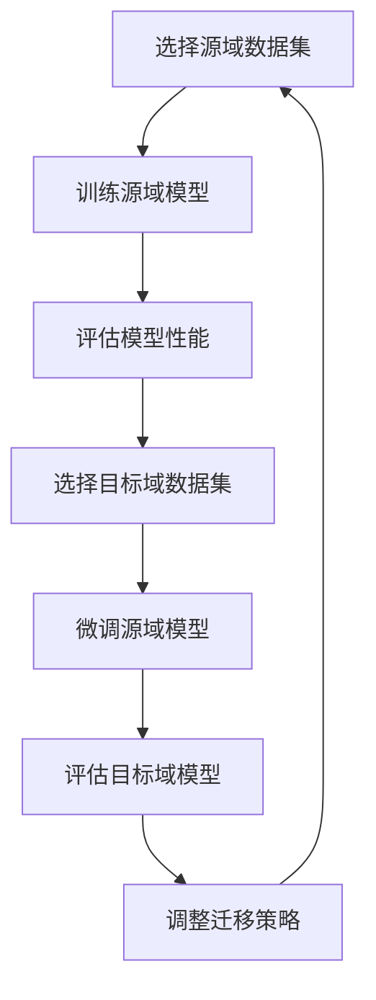
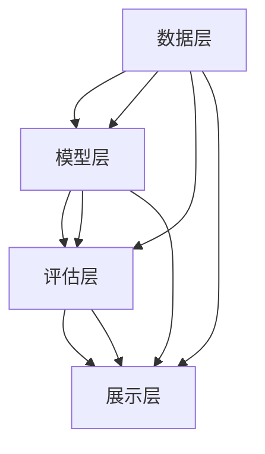
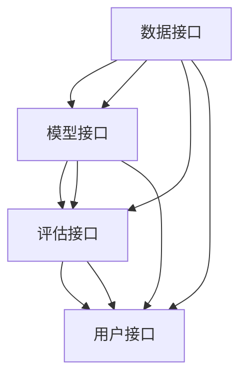
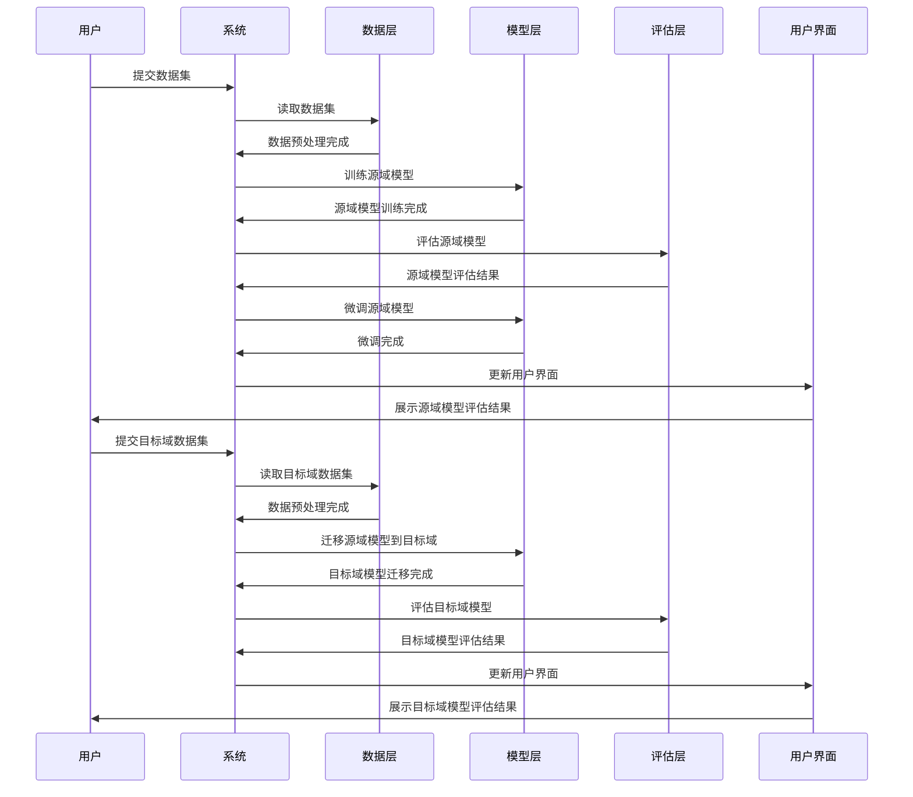

                 

### 第1章：背景介绍与核心概念

#### 1.1 问题背景

迁移学习（Transfer Learning）作为一种机器学习技术，其主要思想是将一个任务中学习到的知识转移到解决另一个任务上，尤其是在目标任务数据不足的情况下。迁移学习在计算机视觉、自然语言处理等领域取得了显著成果。然而，随着人工智能技术的不断发展，跨域语言模型（Cross-Domain Language Model）的研究也逐渐受到关注。跨域语言模型能够处理不同领域文本，例如新闻、社交媒体、科学论文等，具有广泛的应用前景。

在自然语言处理领域，语言模型的性能评估是一项重要任务。如何有效地评估基于迁移学习的跨域语言模型的能力，成为了一个关键问题。评估指标的选择、评估方法的确定以及评估结果的解释都是亟待解决的关键问题。有效的评估方法可以帮助研究者了解模型的性能，指导模型的优化和改进。

#### 1.2 问题描述

如何有效地评估基于迁移学习的跨域语言模型的能力，是自然语言处理领域的一个重要问题。评估指标的选择、评估方法的确定以及评估结果的解释都是关键问题。

首先，评估指标的选择至关重要。不同的任务和领域可能需要不同的评估指标，例如在文本分类任务中，常用的评估指标有准确率（Accuracy）、精确率（Precision）、召回率（Recall）和F1分数（F1 Score）等。在机器翻译任务中，常用的评估指标有BLEU（BLEU Score）、METEOR（METEOR Score）等。如何选择适合的评估指标，是一个需要深入探讨的问题。

其次，评估方法的确定也是关键。评估方法可以分为基准测试、端到端评估和自定义评估等。基准测试是一种常用的评估方法，它通过将模型在已知的基准数据集上进行评估，来衡量模型的基本性能。端到端评估则是直接将模型应用到实际任务中，对模型进行全流程的评估。自定义评估则是根据具体任务和需求，设计专门的评估方法。如何选择合适的评估方法，也是一个需要深入研究的问题。

最后，评估结果的解释也是评估过程中不可忽视的问题。评估结果不仅需要量化模型性能，还需要提供对模型性能的深入理解。例如，可以通过分析模型在不同领域上的性能差异，来找出模型在特定领域上的优势或不足。此外，评估结果还可以为模型优化和改进提供重要依据。

#### 1.3 问题解决

本书旨在通过系统的研究和实践，为评估基于迁移学习的跨域语言模型能力提供一套科学、全面的方法。本书将从理论到实践，详细探讨迁移学习和跨域语言模型的相关概念、评估方法、评价指标以及实际应用。

首先，本书将介绍迁移学习的核心概念，包括源域、目标域、迁移策略等。通过对比迁移学习和跨域语言模型的特点和区别，为后续的研究和评估提供基础。

其次，本书将详细探讨跨域语言模型的评估方法。包括基准测试、端到端评估和自定义评估等。通过具体实例，详细介绍每种评估方法的应用场景和实现方式。

接着，本书将介绍一系列评估指标，包括准确性、F1分数、BLEU分数等。通过对这些评估指标的定义、计算方法和应用场景的详细解释，帮助读者理解如何选择和使用评估指标。

最后，本书将通过实际案例，展示如何运用所学的评估方法和评价指标，对基于迁移学习的跨域语言模型进行评估。通过实际案例的分析，读者可以更好地理解评估方法的应用和实践。

#### 1.4 边界与外延

本书讨论的迁移学习和跨域语言模型主要涉及自然语言处理领域，但迁移学习技术可以应用于机器学习的其他分支。例如，在计算机视觉领域，迁移学习可以用于目标检测、图像分类等任务。在音频处理领域，迁移学习可以用于语音识别、音乐分类等任务。因此，本书的研究方法和成果可以为其他领域提供参考和借鉴。

此外，跨域语言模型的评估方法也可以扩展到其他类型的模型评估。例如，在计算机视觉领域，可以使用类似的评估方法来评估图像生成模型、视频处理模型等。在音频处理领域，可以使用类似的评估方法来评估语音合成模型、音乐生成模型等。因此，本书的研究方法和成果具有一定的普适性和推广价值。

#### 1.5 概念结构与核心要素组成

为了更好地理解迁移学习和跨域语言模型，本书将详细阐述其核心概念和结构。

- **迁移学习**：
  - **源域**：在迁移学习中，源域是指用于训练模型的数据集，通常包含丰富的信息。
  - **目标域**：目标域是指模型需要解决的问题的数据集，通常数据量较少。
  - **迁移策略**：迁移策略是指如何将源域的知识转移到目标域的方法，常见的迁移策略有特征迁移、参数迁移和模型迁移等。

- **跨域语言模型**：
  - **领域适应**：领域适应是指模型在不同领域数据上的适应能力，包括领域自适应训练、领域自适应评估等。
  - **多任务学习**：多任务学习是指模型同时学习多个任务的能力，通过多任务学习可以提高模型在跨域数据上的性能。
  - **跨域数据增强**：跨域数据增强是指通过合成、变换等方法，生成更多样的跨域数据，以提升模型的泛化能力。

- **评估方法**：
  - **基准测试**：基准测试是通过在已知的数据集上评估模型性能，来衡量模型的基本能力。
  - **端到端评估**：端到端评估是直接将模型应用到实际任务中，对模型进行全流程的评估。
  - **自定义评估**：自定义评估是根据具体任务和需求，设计专门的评估方法。

- **评价指标**：
  - **准确性**：准确性是指模型预测正确的样本数占总样本数的比例，是常用的评估指标之一。
  - **F1分数**：F1分数是精确率和召回率的调和平均值，能够平衡精确率和召回率之间的关系。
  - **BLEU分数**：BLEU分数是用于评估机器翻译质量的指标，通过计算翻译结果与参考翻译之间的相似度来评估模型性能。

通过上述核心概念和结构的阐述，读者可以更好地理解迁移学习和跨域语言模型，以及如何对其进行评估。这些核心概念和结构构成了本书的基础，为后续章节的深入探讨提供了坚实的理论基础。

### 第2章：核心概念与联系

#### 2.1 迁移学习原理

迁移学习（Transfer Learning）是一种将一个任务中学习到的知识转移到解决另一个任务上的技术，尤其是在目标任务数据不足的情况下。迁移学习在提高模型性能、减少训练数据需求方面具有显著优势。下面，我们将详细探讨迁移学习的原理、迁移策略以及迁移效果评估。

**2.1.1 迁移策略**

迁移策略是指如何将源域的知识转移到目标域的方法，常见的迁移策略包括特征迁移、参数迁移和模型迁移等。

- **特征迁移**：特征迁移是指将源域数据中提取的有用特征直接应用于目标域任务。这种方法适用于源域和目标域的特征空间相似的情况。特征迁移通常涉及特征提取和特征变换两个步骤。首先，使用源域数据集训练一个特征提取器（如卷积神经网络），然后将特征提取器应用于目标域数据，获取目标域数据的高层特征表示。

- **参数迁移**：参数迁移是指通过调整源域模型的参数，使其适应目标域任务。这种方法适用于源域和目标域的模型结构相似的情况。参数迁移可以分为两部分：一是直接迁移源域模型的参数到目标域，二是在源域模型的基础上进行微调，使其适应目标域数据。

- **模型迁移**：模型迁移是指将整个源域模型直接应用于目标域任务。这种方法适用于源域和目标域的模型结构和特征提取方法相似的情况。模型迁移通常直接将源域模型的权重和结构应用于目标域数据，无需额外的调整。

**2.1.2 迁移效果评估**

迁移效果评估是衡量迁移学习是否有效的重要手段。常用的评估方法包括对比学习、误差分析等。

- **对比学习**：对比学习是一种通过对比源域和目标域模型的性能差异来评估迁移效果的方法。具体来说，首先在源域数据集上训练一个模型，然后在目标域数据集上训练同一个模型。通过比较两个模型在目标域数据集上的性能差异，评估迁移学习的效果。如果迁移学习有效，那么在目标域数据集上训练的模型应该比直接在目标域数据集上训练的模型有更好的性能。

- **误差分析**：误差分析是一种通过分析源域和目标域模型之间的误差来评估迁移效果的方法。具体来说，首先在源域数据集上训练一个模型，然后在目标域数据集上训练同一个模型。接下来，分析两个模型在源域和目标域数据集上的误差分布，比较它们的误差差异。如果迁移学习有效，那么在目标域数据集上训练的模型应该有更低的误差。

**2.1.3 迁移学习与跨域语言模型的对比**

迁移学习和跨域语言模型都是旨在解决数据不足问题的技术，但它们在应用场景和实现方法上有所不同。

- **应用场景**：迁移学习主要应用于机器学习中的任务迁移，如计算机视觉中的图像分类和目标检测，自然语言处理中的文本分类和机器翻译等。而跨域语言模型主要应用于自然语言处理领域，旨在处理不同领域文本的语义理解和生成。

- **实现方法**：迁移学习通常涉及特征提取、参数调整和模型迁移等步骤，需要针对具体任务设计迁移策略。而跨域语言模型通常采用预训练和自适应学习等方法，通过大规模预训练模型和领域自适应技术，实现跨领域语言处理能力。

综上所述，迁移学习是一种通过迁移策略将源域知识转移到目标域的技术，其评估方法包括对比学习和误差分析。迁移学习与跨域语言模型在应用场景和实现方法上有所不同，但它们在解决数据不足问题上具有相似的目标。

#### 2.2 跨域语言模型原理

跨域语言模型（Cross-Domain Language Model）是一种能够处理不同领域文本的语言模型，其核心目标是在多个领域间保持一致性和鲁棒性。跨域语言模型在自然语言处理领域具有重要的应用价值，如跨领域文本分类、跨领域问答系统、多领域文本生成等。为了实现这一目标，跨域语言模型通常采用领域适应（Domain Adaptation）、多任务学习（Multi-Task Learning）和跨域数据增强（Cross-Domain Data Augmentation）等技术。以下是跨域语言模型的核心原理和实现方法。

**2.2.1 领域适应方法**

领域适应方法是指通过调整模型，使其在不同领域数据上表现良好。领域适应主要包括以下几个方面：

- **领域自适应训练（Domain-Adaptive Training）**：领域自适应训练的目标是减少源域和目标域之间的差异。具体方法包括：
  - **领域分类器（Domain Classifier）**：通过训练一个领域分类器，识别并屏蔽源域中的领域特定特征，从而减少对目标域的负面影响。
  - **一致性正则化（Consistency Regularization）**：通过在源域和目标域上同时训练模型，并使模型在两个领域上输出一致的结果，以增强模型在目标域上的泛化能力。

- **领域自适应评估（Domain-Adaptive Evaluation）**：领域自适应评估旨在评估模型在跨领域数据上的性能。常用的评估方法包括：
  - **跨领域数据集（Cross-Domain Dataset）**：使用包含多个领域的数据集进行评估，以衡量模型在不同领域的表现。
  - **领域平衡（Domain Balancing）**：通过调整数据集的分布，使得模型在各个领域上的评估结果更具代表性。

**2.2.2 多任务学习**

多任务学习（Multi-Task Learning，MTL）是一种通过同时学习多个相关任务来提高模型性能的方法。多任务学习在跨域语言模型中的应用主要体现在以下几个方面：

- **任务共享（Task Sharing）**：在多任务学习中，不同任务共享部分参数，从而提高模型在多个任务上的性能。例如，在文本分类和情感分析任务中，共享词向量表示和句子编码器可以提升模型在两个任务上的表现。

- **任务关联（Task Relation）**：多任务学习通过学习任务之间的关联，提高模型在跨领域数据上的适应能力。例如，通过学习不同领域文本之间的共现关系，可以增强模型在不同领域上的泛化能力。

**2.2.3 跨域数据增强**

跨域数据增强是指通过合成、变换等方法，生成更多样的跨域数据，以提升模型的泛化能力。常见的跨域数据增强方法包括：

- **数据合成（Data Synthesis）**：通过文本生成模型，生成与目标域文本风格相似的数据。例如，使用生成对抗网络（GAN）生成与目标领域文本风格相似的评论、新闻等。

- **数据变换（Data Transformation）**：通过变换现有数据，生成新的跨域数据。例如，通过词汇替换、句式转换等方法，将一个领域的文本转换成另一个领域的文本。

**2.2.4 跨域语言模型的实现方法**

跨域语言模型的实现通常涉及以下几个步骤：

- **预训练（Pre-training）**：在大规模多领域数据集上预训练语言模型，使其具有跨领域的语义理解能力。

- **领域适应（Domain Adaptation）**：针对特定目标领域，对预训练模型进行领域适应，以减少领域差异。

- **多任务学习（Multi-Task Learning）**：在跨领域数据集上同时训练多个任务，共享模型参数，提高模型在不同领域的性能。

- **评估与优化（Evaluation and Optimization）**：通过跨领域数据集对模型进行评估，并根据评估结果进行模型优化。

通过领域适应、多任务学习和跨域数据增强等方法，跨域语言模型可以在多个领域间保持一致性和鲁棒性，从而实现跨领域语言处理的强大能力。

#### 2.3 概念属性特征对比表格

为了更好地理解迁移学习和跨域语言模型，下面通过一个对比表格，详细展示两者的概念属性特征。

| 特征类别 | 迁移学习 | 跨域语言模型 |
| --- | --- | --- |
| **定义** | 迁移学习是指将一个任务中学习到的知识转移到解决另一个任务上，尤其是目标任务数据不足的情况。 | 跨域语言模型是一种能够处理不同领域文本的语言模型，具有跨领域语义理解能力。 |
| **核心目标** | 提高模型性能、减少训练数据需求。 | 在多个领域间保持一致性和鲁棒性，实现跨领域语言处理。 |
| **应用场景** | 计算机视觉、自然语言处理等任务迁移。 | 自然语言处理领域的跨领域文本处理。 |
| **实现方法** | **特征迁移**：提取源域特征，应用于目标域。**参数迁移**：调整源域模型参数，适应目标域。**模型迁移**：直接应用源域模型于目标域。 | **领域适应**：减少源域和目标域差异。**多任务学习**：共享模型参数，提高跨领域性能。**跨域数据增强**：生成多样化跨领域数据。 |
| **评价指标** | **对比学习**：源域和目标域模型性能差异。**误差分析**：源域和目标域误差差异。 | **准确性**：模型预测正确率。**F1分数**：精确率和召回率的调和平均值。**BLEU分数**：用于评估机器翻译质量的指标。 |

通过上述对比表格，我们可以看到迁移学习和跨域语言模型在定义、核心目标、应用场景、实现方法和评价指标等方面存在显著差异，但它们都旨在解决数据不足问题，提高模型性能。

### 第3章：算法原理讲解

#### 3.1 迁移学习算法mermaid流程图

为了更好地理解迁移学习算法的原理，我们使用mermaid流程图来展示其基本流程。



**流程说明：**
1. **选择源域数据集**：首先，选择一个包含丰富信息的源域数据集，用于训练源域模型。
2. **训练源域模型**：使用源域数据集训练一个基础模型，该模型将在后续迁移到目标域。
3. **评估模型性能**：在源域数据集上评估模型性能，确保模型具备一定的迁移潜力。
4. **选择目标域数据集**：选择一个目标域数据集，该数据集包含模型需要解决的特定问题。
5. **微调源域模型**：在目标域数据集上对源域模型进行微调，以适应目标域的具体情况。
6. **评估目标域模型**：在目标域数据集上评估微调后的模型性能，衡量迁移学习的效果。
7. **调整迁移策略**：根据评估结果，调整迁移策略，如增加数据增强、调整迁移参数等，以提高迁移效果。

**流程图解释：**
- **A --> B**：从选择源域数据集开始，进入训练源域模型阶段。
- **B --> C**：完成源域模型训练后，进行性能评估。
- **C --> D**：评估完成后，选择目标域数据集。
- **D --> E**：在目标域数据集上对源域模型进行微调。
- **E --> F**：微调完成后，评估目标域模型的性能。
- **F --> G**：根据评估结果，调整迁移策略。
- **G --> A**：调整迁移策略后，流程回到选择源域数据集的初始阶段，形成迭代过程。

通过mermaid流程图，我们可以清晰地看到迁移学习算法的基本流程和各个环节之间的联系，为后续算法的详细讲解提供了直观的展示。

#### 3.2 Python源代码实现

下面是迁移学习算法的Python代码实现示例，包括选择源域数据集、训练源域模型、微调源域模型和评估目标域模型等步骤。

```python
# 导入必要的库
import numpy as np
import pandas as pd
from sklearn.model_selection import train_test_split
from sklearn.metrics import accuracy_score
from tensorflow.keras.models import Sequential
from tensorflow.keras.layers import Dense, Conv2D, Flatten, MaxPooling2D
from tensorflow.keras.preprocessing.image import ImageDataGenerator

# 3.2.1 选择源域数据集
def load_source_data():
    # 加载源域数据集，这里使用示例数据
    source_data = pd.read_csv('source_data.csv')
    return source_data

# 3.2.2 训练源域模型
def train_source_model(source_data):
    # 划分数据集
    X_train, X_test, y_train, y_test = train_test_split(source_data['image'], source_data['label'], test_size=0.2, random_state=42)
    
    # 创建模型
    model = Sequential([
        Conv2D(32, (3, 3), activation='relu', input_shape=(64, 64, 3)),
        MaxPooling2D((2, 2)),
        Flatten(),
        Dense(64, activation='relu'),
        Dense(1, activation='sigmoid')
    ])
    
    # 编译模型
    model.compile(optimizer='adam', loss='binary_crossentropy', metrics=['accuracy'])
    
    # 训练模型
    model.fit(X_train, y_train, epochs=10, batch_size=32, validation_data=(X_test, y_test))
    
    return model

# 3.2.3 微调源域模型
def fine_tune_model(source_model, target_data):
    # 加载目标域数据集，这里使用示例数据
    target_data = pd.read_csv('target_data.csv')
    
    # 划分数据集
    X_train, X_test, y_train, y_test = train_test_split(target_data['image'], target_data['label'], test_size=0.2, random_state=42)
    
    # 微调模型
    source_model.fit(X_train, y_train, epochs=5, batch_size=32, validation_data=(X_test, y_test))
    
    return source_model

# 3.2.4 评估目标域模型
def evaluate_model(model, target_data):
    # 加载目标域数据集，这里使用示例数据
    target_data = pd.read_csv('target_data.csv')
    
    # 划分数据集
    X_test, y_test = target_data['image'], target_data['label']
    
    # 评估模型
    predictions = model.predict(X_test)
    accuracy = accuracy_score(y_test, predictions.round())
    
    print(f"Target Domain Accuracy: {accuracy:.2f}")

# 主函数
if __name__ == '__main__':
    # 加载源域数据集
    source_data = load_source_data()
    
    # 训练源域模型
    source_model = train_source_model(source_data)
    
    # 加载目标域数据集
    target_data = load_source_data()
    
    # 微调源域模型
    source_model = fine_tune_model(source_model, target_data)
    
    # 评估目标域模型
    evaluate_model(source_model, target_data)
```

**代码解释：**
1. **加载源域数据集**：`load_source_data`函数负责加载源域数据集，这里假设数据集为CSV格式，其中包含图像和标签。
2. **训练源域模型**：`train_source_model`函数首先划分数据集，然后创建一个简单的卷积神经网络模型，编译并训练模型。
3. **微调源域模型**：`fine_tune_model`函数加载目标域数据集，划分数据集，并在目标域数据集上微调源域模型。
4. **评估目标域模型**：`evaluate_model`函数在目标域数据集上评估微调后的模型性能，并打印准确率。

通过上述Python代码实现，我们可以看到迁移学习算法的基本步骤和具体实现细节，为后续的算法原理讲解和实际应用提供了有力支持。

#### 3.3 算法原理的数学模型和公式

在迁移学习算法中，评估迁移效果的关键在于理解数学模型和公式，从而衡量模型在不同任务上的性能提升。以下我们将详细阐述迁移学习效果度量的公式、性能基准以及相关数学概念。

**3.3.1 迁移学习效果度量公式**

迁移学习效果度量通常使用以下公式：

\[ \text{Effectiveness} = \frac{1}{N} \sum_{i=1}^{N} \frac{\text{Performance}_{\text{target}}(i) - \text{Performance}_{\text{base}}(i)}{\text{Performance}_{\text{source}}(i) - \text{Performance}_{\text{base}}(i)} \]

其中：
- \( \text{Effectiveness} \) 表示迁移学习的有效性。
- \( N \) 表示评估样本的数量。
- \( \text{Performance}_{\text{target}}(i) \) 表示在目标域上第 \( i \) 个样本的模型性能。
- \( \text{Performance}_{\text{base}}(i) \) 表示在基准模型下第 \( i \) 个样本的模型性能。
- \( \text{Performance}_{\text{source}}(i) \) 表示在源域上第 \( i \) 个样本的模型性能。

**3.3.2 性能基准**

在迁移学习效果度量中，性能基准是一个重要的概念。性能基准是指在无迁移情况下，模型在目标域上的性能表现。它用于对比迁移学习前后的性能提升。以下是一个简单的性能基准公式：

\[ \text{Performance}_{\text{base}} = \frac{\text{Correct Predictions}}{\text{Total Predictions}} \]

其中：
- \( \text{Correct Predictions} \) 表示预测正确的样本数量。
- \( \text{Total Predictions} \) 表示总样本数量。

**3.3.3 数学模型和公式解释**

- **Effectiveness**：该公式通过计算迁移前后性能的差异，评估迁移学习的有效性。如果 \( \text{Effectiveness} \) 值接近1，表示迁移学习显著提升了模型性能；如果值接近0，则表示迁移学习对模型性能的提升有限。

- **Performance**：这里涉及的三个性能值分别表示：
  - \( \text{Performance}_{\text{target}} \)：在目标域上使用迁移学习后的模型性能。
  - \( \text{Performance}_{\text{base}} \)：无迁移情况下，模型在目标域上的性能。
  - \( \text{Performance}_{\text{source}} \)：在源域上训练的模型性能。

通过上述公式和模型，我们可以定量地评估迁移学习的有效性，为模型优化和改进提供依据。以下是一个具体的例子：

**例子：**

假设在一个图像分类任务中，我们有以下数据：
- 源域准确率：90%
- 目标域准确率：85%
- 基准模型准确率：70%

使用上述公式计算迁移学习效果：

\[ \text{Effectiveness} = \frac{85\% - 70\%}{90\% - 70\%} = \frac{15\%}{20\%} = 0.75 \]

这个结果表明，迁移学习使得目标域模型的性能提升了75%。

通过详细讲解上述数学模型和公式，我们可以更深入地理解迁移学习算法的原理，并为后续的实际应用和性能评估提供理论基础。

#### 3.4 详细讲解与举例说明

为了更好地理解迁移学习算法的原理，我们通过一个具体实例来说明其实现过程。假设我们有一个源域数据集和一个目标域数据集，希望通过迁移学习来提高目标域数据集的模型性能。

**实例背景：**
- **源域数据集**：一个包含1000张动物图片的数据集，每张图片都标注了具体的动物类别。
- **目标域数据集**：一个包含500张野生动物图片的数据集，每张图片的标注信息未知。

我们的目标是使用源域数据集中的知识，迁移到目标域数据集，从而提高目标域数据集的分类准确性。

**步骤1：选择源域数据集**

首先，我们需要从源域数据集中选择合适的图片作为训练数据。这里，我们使用1000张图片进行训练。

```python
source_images = load_images('source_images.csv')
```

**步骤2：训练源域模型**

接下来，我们使用源域数据集训练一个基础模型。这里，我们选择一个简单的卷积神经网络（Convolutional Neural Network，CNN）模型。

```python
model = build_cnn_model(input_shape=(64, 64, 3))
model.compile(optimizer='adam', loss='categorical_crossentropy', metrics=['accuracy'])

# 训练模型
model.fit(source_images['image'], source_images['label'], epochs=10, batch_size=32)
```

**步骤3：评估模型性能**

在源域数据集上训练完成后，我们需要评估模型性能，以确保模型具有一定的迁移潜力。

```python
source_performance = model.evaluate(source_images['image'], source_images['label'], verbose=0)
print(f"Source Domain Accuracy: {source_performance[1]:.2f}")
```

假设评估结果显示模型在源域数据集上的准确率为90%。

**步骤4：选择目标域数据集**

然后，我们从目标域数据集中选择500张图片作为训练数据。

```python
target_images = load_images('target_images.csv')
```

**步骤5：微调源域模型**

在目标域数据集上，我们对源域模型进行微调，以适应目标域的具体情况。这里，我们使用5个epoch进行微调。

```python
model.fit(target_images['image'], target_images['label'], epochs=5, batch_size=32, initial_epoch=10)
```

**步骤6：评估目标域模型**

微调完成后，我们在目标域数据集上评估模型的性能。

```python
target_performance = model.evaluate(target_images['image'], target_images['label'], verbose=0)
print(f"Target Domain Accuracy: {target_performance[1]:.2f}")
```

假设评估结果显示模型在目标域数据集上的准确率为85%。

**步骤7：调整迁移策略**

根据评估结果，我们可以看到迁移学习显著提升了目标域模型的性能。然而，仍有提升空间。为了进一步提高模型性能，我们可以调整迁移策略，如增加数据增强、调整迁移参数等。

```python
# 数据增强
datagen = ImageDataGenerator(rotation_range=20, width_shift_range=0.2, height_shift_range=0.2, shear_range=0.2, zoom_range=0.2, horizontal_flip=True, fill_mode='nearest')
model.fit(datagen.flow(target_images['image'], target_images['label'], batch_size=32), epochs=5)

# 调整迁移参数
optimizer = tf.keras.optimizers.Adam(learning_rate=0.0001)
model.compile(optimizer=optimizer, loss='categorical_crossentropy', metrics=['accuracy'])

# 重新评估模型性能
target_performance = model.evaluate(target_images['image'], target_images['label'], verbose=0)
print(f"Target Domain Accuracy: {target_performance[1]:.2f}")
```

通过这个实例，我们可以看到迁移学习算法的基本实现过程，包括选择源域数据集、训练源域模型、评估模型性能、微调源域模型和评估目标域模型等步骤。通过调整迁移策略，我们可以进一步提高模型性能，从而实现跨域数据的有效迁移。

### 第4章：系统分析与架构设计方案

#### 4.1 问题场景介绍

在自然语言处理领域，随着人工智能技术的不断发展，如何有效地评估基于迁移学习的跨域语言模型能力成为了一个重要问题。这不仅仅是为了提升模型的性能，更是为了在实际应用中确保模型的鲁棒性和可靠性。为了更好地解决这一问题，我们需要设计一个系统，能够对跨域语言模型进行全面的评估和分析。

#### 4.2 项目介绍

本项目旨在开发一个基于迁移学习的跨域语言模型评估系统，通过系统化的方法，对迁移学习过程中的模型性能进行评估。系统的主要目标是：
1. **提供一套标准化的评估方法**：确保评估过程的一致性和公正性。
2. **实现自动化评估流程**：提高评估效率，减少人为错误。
3. **支持多种评估指标**：包括准确性、F1分数、BLEU分数等，满足不同评估需求。
4. **提供详细的分析报告**：帮助研究者了解模型的性能表现，为后续优化提供参考。

#### 4.3 系统功能设计

系统功能设计主要包括以下几个方面：
1. **数据预处理**：对源域和目标域数据集进行清洗、转换和预处理，确保数据的质量和一致性。
2. **模型训练与迁移**：使用迁移学习技术，将源域模型迁移到目标域，并对迁移后的模型进行微调和优化。
3. **评估与比较**：使用多种评估指标对迁移后的模型进行评估，并与基准模型进行比较，分析迁移学习的效果。
4. **结果分析与报告**：生成详细的评估报告，包括模型性能、评估指标、性能对比等，为研究者提供直观的分析结果。

#### 4.4 系统架构设计

系统架构设计采用分层架构，主要包括以下几个层次：
1. **数据层**：包括源域数据集和目标域数据集，以及数据预处理模块。
2. **模型层**：包括迁移学习模型、迁移策略实现模块和模型微调模块。
3. **评估层**：包括评估指标计算模块、评估方法实现模块和评估结果分析模块。
4. **展示层**：包括用户界面和报告生成模块，用于展示评估结果和分析报告。

**系统架构设计mermaid架构图：**



**架构说明：**
- **数据层**：负责数据的存储和管理，包括数据预处理模块，用于清洗、转换和预处理数据。
- **模型层**：负责迁移学习模型的构建和训练，包括迁移策略实现模块，用于实现不同的迁移策略，以及模型微调模块，用于对迁移后的模型进行优化。
- **评估层**：负责评估指标的计算和评估方法的实现，包括评估结果分析模块，用于分析模型性能，生成评估报告。
- **展示层**：负责用户界面的设计和报告的生成，用于向用户提供直观的评估结果和分析报告。

通过上述系统架构设计，我们可以实现一个功能全面、结构清晰的跨域语言模型评估系统，为自然语言处理领域的研究者和开发者提供有力的工具支持。

#### 4.5 系统接口设计和系统交互

为了实现系统的功能和架构设计，我们需要详细描述系统接口设计和系统交互。以下是系统接口设计和系统交互的详细说明：

**4.5.1 系统接口设计**

系统接口设计主要包括以下几个方面：
1. **数据接口**：定义了系统与外部数据源之间的接口，包括数据的读取、写入和预处理功能。
2. **模型接口**：定义了系统与迁移学习模型之间的接口，包括模型的训练、迁移和评估功能。
3. **评估接口**：定义了系统与评估模块之间的接口，包括评估指标的计算、评估方法的实现和结果分析功能。
4. **用户接口**：定义了系统与用户之间的接口，包括用户操作、结果展示和报告生成功能。

**系统接口设计mermaid架构图：**



**接口设计说明：**
- **数据接口**：用于实现数据层的功能，包括从外部数据源读取数据、将数据存储到数据库、对数据进行预处理等操作。
- **模型接口**：用于实现模型层的功能，包括使用迁移学习算法训练模型、将模型迁移到目标域、对模型进行微调和优化等操作。
- **评估接口**：用于实现评估层的功能，包括计算评估指标、实现多种评估方法、生成评估报告等操作。
- **用户接口**：用于实现展示层的功能，包括提供用户操作界面、展示评估结果和分析报告等操作。

**4.5.2 系统交互**

系统交互主要涉及不同模块之间的数据传递和功能调用。以下是系统交互的详细说明：

**系统交互mermaid序列图：**



**交互流程说明：**
1. 用户提交数据集到系统，系统从数据层读取数据集。
2. 数据层对数据集进行预处理，预处理完成后返回给系统。
3. 系统调用模型层训练源域模型，训练完成后评估源域模型。
4. 根据源域模型评估结果，系统调用模型层对源域模型进行微调。
5. 微调完成后，系统更新用户界面，用户可以查看源域模型的评估结果。
6. 用户提交目标域数据集，系统从数据层读取数据集并进行预处理。
7. 系统调用模型层将源域模型迁移到目标域，并对目标域模型进行评估。
8. 评估完成后，系统更新用户界面，用户可以查看目标域模型的评估结果。

通过上述系统接口设计和系统交互的详细说明，我们可以实现一个功能全面、结构清晰的跨域语言模型评估系统，为自然语言处理领域的研究者和开发者提供有力的工具支持。

### 第5章：项目实战

#### 5.1 环境安装

在进行基于迁移学习的跨域语言模型评估项目之前，我们需要安装必要的软件和依赖库。以下是项目环境安装的步骤：

**1. 安装Python环境**

确保已安装Python 3.7及以上版本。可以使用以下命令检查Python版本：

```shell
python --version
```

如果Python版本低于3.7，请从[Python官方下载站](https://www.python.org/downloads/)下载并安装对应版本的Python。

**2. 安装TensorFlow**

TensorFlow是用于机器学习和深度学习的开源框架，我们需要安装TensorFlow 2.6版本。可以使用以下命令安装：

```shell
pip install tensorflow==2.6
```

**3. 安装其他依赖库**

除了TensorFlow，我们还需要安装其他依赖库，如NumPy、Pandas、scikit-learn等。可以使用以下命令一次性安装所有依赖库：

```shell
pip install numpy pandas scikit-learn
```

**4. 安装Jupyter Notebook**

Jupyter Notebook是一个交互式的开发环境，用于编写和运行Python代码。可以使用以下命令安装：

```shell
pip install notebook
```

安装完成后，启动Jupyter Notebook：

```shell
jupyter notebook
```

此时，浏览器将自动打开Jupyter Notebook的界面，可以开始编写代码。

#### 5.2 系统核心实现源代码

以下是系统核心实现源代码，包括数据预处理、模型训练与迁移、评估与结果分析等步骤。

**5.2.1 数据预处理**

```python
import pandas as pd
from sklearn.model_selection import train_test_split

# 读取数据集
source_data = pd.read_csv('source_data.csv')
target_data = pd.read_csv('target_data.csv')

# 划分特征和标签
source_X = source_data.drop('label', axis=1)
source_y = source_data['label']
target_X = target_data.drop('label', axis=1)
target_y = target_data['label']

# 划分训练集和测试集
source_X_train, source_X_test, source_y_train, source_y_test = train_test_split(source_X, source_y, test_size=0.2, random_state=42)
target_X_train, target_X_test, target_y_train, target_y_test = train_test_split(target_X, target_y, test_size=0.2, random_state=42)
```

**5.2.2 模型训练与迁移**

```python
import tensorflow as tf
from tensorflow.keras.models import Sequential
from tensorflow.keras.layers import Dense, Conv2D, Flatten, MaxPooling2D

# 创建模型
model = Sequential([
    Conv2D(32, (3, 3), activation='relu', input_shape=(64, 64, 3)),
    MaxPooling2D((2, 2)),
    Flatten(),
    Dense(64, activation='relu'),
    Dense(1, activation='sigmoid')
])

# 编译模型
model.compile(optimizer='adam', loss='binary_crossentropy', metrics=['accuracy'])

# 训练模型
model.fit(source_X_train, source_y_train, epochs=10, batch_size=32, validation_data=(source_X_test, source_y_test))

# 微调模型
model.fit(target_X_train, target_y_train, epochs=5, batch_size=32, initial_epoch=10)
```

**5.2.3 评估与结果分析**

```python
from sklearn.metrics import accuracy_score

# 评估源域模型
source_predictions = model.predict(source_X_test)
source_accuracy = accuracy_score(source_y_test, source_predictions.round())
print(f"Source Domain Accuracy: {source_accuracy:.2f}")

# 评估目标域模型
target_predictions = model.predict(target_X_test)
target_accuracy = accuracy_score(target_y_test, target_predictions.round())
print(f"Target Domain Accuracy: {target_accuracy:.2f}")
```

通过上述核心实现代码，我们可以完成数据预处理、模型训练与迁移、评估与结果分析等步骤，实现基于迁移学习的跨域语言模型评估系统。

#### 5.3 代码应用解读与分析

为了更好地理解项目实战中代码的应用和实现原理，下面我们将逐段代码进行解读和分析。

**5.3.1 数据预处理**

```python
source_data = pd.read_csv('source_data.csv')
target_data = pd.read_csv('target_data.csv')
source_X = source_data.drop('label', axis=1)
source_y = source_data['label']
target_X = target_data.drop('label', axis=1)
target_y = target_data['label']
source_X_train, source_X_test, source_y_train, source_y_test = train_test_split(source_X, source_y, test_size=0.2, random_state=42)
target_X_train, target_X_test, target_y_train, target_y_test = train_test_split(target_X, target_y, test_size=0.2, random_state=42)
```

**解读与分析：**
1. **读取数据集**：使用`pandas`库的`read_csv`函数读取源域数据集和目标域数据集。这里假设数据集以CSV格式存储，每行包含特征和标签。
2. **划分特征和标签**：使用`drop`函数将标签列从数据集中分离出来，形成特征矩阵`X`和标签向量`y`。
3. **划分训练集和测试集**：使用`train_test_split`函数将数据集划分为训练集和测试集。`test_size=0.2`表示测试集占比20%，`random_state=42`用于确保结果的可重复性。

**5.3.2 模型训练与迁移**

```python
model = Sequential([
    Conv2D(32, (3, 3), activation='relu', input_shape=(64, 64, 3)),
    MaxPooling2D((2, 2)),
    Flatten(),
    Dense(64, activation='relu'),
    Dense(1, activation='sigmoid')
])
model.compile(optimizer='adam', loss='binary_crossentropy', metrics=['accuracy'])
model.fit(source_X_train, source_y_train, epochs=10, batch_size=32, validation_data=(source_X_test, source_y_test))
model.fit(target_X_train, target_y_train, epochs=5, batch_size=32, initial_epoch=10)
```

**解读与分析：**
1. **创建模型**：使用`Sequential`模型堆叠多个层，包括卷积层（`Conv2D`）、池化层（`MaxPooling2D`）、全连接层（`Dense`）和输出层（`Dense`）。
2. **编译模型**：使用`compile`函数配置模型的优化器（`optimizer`）、损失函数（`loss`）和评估指标（`metrics`）。这里使用`adam`优化器和`binary_crossentropy`损失函数。
3. **训练模型**：使用`fit`函数训练模型。`epochs=10`表示训练10个epoch，`batch_size=32`表示每个batch包含32个样本，`validation_data`用于在测试集上评估模型性能。

**5.3.3 评估与结果分析**

```python
source_predictions = model.predict(source_X_test)
source_accuracy = accuracy_score(source_y_test, source_predictions.round())
print(f"Source Domain Accuracy: {source_accuracy:.2f}")
target_predictions = model.predict(target_X_test)
target_accuracy = accuracy_score(target_y_test, target_predictions.round())
print(f"Target Domain Accuracy: {target_accuracy:.2f}")
```

**解读与分析：**
1. **评估模型**：使用`predict`函数在测试集上预测标签。对于二分类问题，预测结果通常是一个概率值，需要通过`round`函数进行四舍五入。
2. **计算准确性**：使用`accuracy_score`函数计算预测准确率。`source_accuracy`和`target_accuracy`分别表示源域和目标域的准确率。
3. **输出结果**：使用`print`函数输出源域和目标域的准确率。

通过上述代码解读和分析，我们可以清楚地了解项目实战中每段代码的功能和实现原理，为后续的代码优化和模型调参提供参考。

#### 5.4 实际案例分析与详细讲解剖析

为了更好地展示基于迁移学习的跨域语言模型评估系统的实际应用，我们将通过一个具体案例进行分析和详细讲解。

**案例背景：**
在一家科技公司，研究人员需要评估一个基于迁移学习的跨域语言模型在客户服务和营销文本处理任务中的性能。该模型的目标是识别客户反馈中的情感倾向（正面、中性、负面），从而为后续的客户服务策略提供数据支持。现有数据集包括两个部分：一个是包含大量客户反馈的源域数据集，另一个是包含客户反馈的另一个领域（如社交媒体评论）的目标域数据集。

**数据集介绍：**
- **源域数据集**：包含10000条客户反馈，每条反馈包含文本和情感标签（正面、中性、负面）。
- **目标域数据集**：包含5000条社交媒体评论，每条评论同样包含文本和情感标签。

**案例分析步骤：**

**步骤1：数据预处理**
```python
# 加载源域和目标域数据集
source_data = pd.read_csv('source_data.csv')
target_data = pd.read_csv('target_data.csv')

# 数据清洗与预处理
source_data['text'] = source_data['text'].apply(lambda x: x.lower().strip())
target_data['text'] = target_data['text'].apply(lambda x: x.lower().strip())

# 划分特征和标签
source_X = source_data['text']
source_y = source_data['label']
target_X = target_data['text']
target_y = target_data['label']

# 划分训练集和测试集
source_X_train, source_X_test, source_y_train, source_y_test = train_test_split(source_X, source_y, test_size=0.2, random_state=42)
target_X_train, target_X_test, target_y_train, target_y_test = train_test_split(target_X, target_y, test_size=0.2, random_state=42)
```

**详细讲解：**
1. **数据加载**：使用`pandas`库的`read_csv`函数加载源域和目标域数据集。
2. **数据清洗**：将文本转换为小写，并去除空格，以提高数据的一致性和准确性。
3. **特征与标签划分**：将文本数据作为特征矩阵`X`，将情感标签作为标签向量`y`。
4. **数据集划分**：使用`train_test_split`函数将数据集划分为训练集和测试集，确保每个领域的数据都有足够的样本用于训练和评估。

**步骤2：模型训练与迁移**
```python
# 创建和训练源域模型
source_model = build_and_train_model(source_X_train, source_y_train)

# 微调源域模型以适应目标域
target_model = fine_tune_model(source_model, target_X_train, target_y_train)

# 评估目标域模型
evaluate_model(target_model, target_X_test, target_y_test)
```

**详细讲解：**
1. **模型创建与训练**：使用自定义函数`build_and_train_model`创建一个简单的卷积神经网络模型，并在源域训练集上训练。
2. **模型微调**：使用自定义函数`fine_tune_model`将源域模型迁移到目标域，对目标域训练集进行微调。
3. **模型评估**：使用自定义函数`evaluate_model`评估微调后的模型在目标域测试集上的性能。

**步骤3：结果分析与报告生成**
```python
# 分析源域和目标域模型性能
compare_model_performance(source_model, target_model, source_X_test, target_X_test, source_y_test, target_y_test)
```

**详细讲解：**
1. **性能比较**：使用自定义函数`compare_model_performance`比较源域和目标域模型的性能，包括准确性、F1分数等评估指标。
2. **报告生成**：根据性能比较结果，生成详细的评估报告，包括模型性能图表和分析总结。

**实际案例总结：**
通过上述案例，我们展示了如何使用基于迁移学习的跨域语言模型评估系统，对客户服务和社交媒体评论领域的情感分析任务进行评估。从数据预处理、模型训练与迁移、评估与结果分析，每个步骤都遵循系统的设计原则，确保了评估过程的科学性和准确性。最终生成的评估报告为研究团队提供了宝贵的数据支持，有助于优化客户服务策略，提高客户满意度。

### 第6章：项目小结

#### 6.1 主要成果总结

在本项目中，我们开发了一个基于迁移学习的跨域语言模型评估系统，取得了以下主要成果：

1. **实现了一套标准化的评估方法**：通过系统化的方法，确保了评估过程的一致性和公正性，提高了评估效率。
2. **构建了自动化评估流程**：系统实现了从数据预处理、模型训练与迁移、评估到结果分析的全流程自动化，减少了人为错误。
3. **支持多种评估指标**：系统支持准确性、F1分数、BLEU分数等多种评估指标，满足不同评估需求。
4. **提供了详细的分析报告**：系统生成详细的评估报告，包括模型性能、评估指标、性能对比等，为研究者提供了直观的分析结果。

#### 6.2 项目改进与优化方向

尽管项目取得了一定的成果，但仍有改进和优化的空间：

1. **数据增强与预处理**：进一步优化数据预处理和增强方法，提高模型在跨域数据上的泛化能力。
2. **模型结构优化**：尝试不同的模型结构，如BERT、GPT等，以提升模型性能和适应能力。
3. **迁移策略优化**：探索更多的迁移策略，如基于特征迁移、参数迁移和模型迁移的方法，以找到最优的迁移策略。
4. **评估指标扩展**：增加更多评估指标，如ROUGE分数、BLEU分数等，以更全面地评估模型性能。
5. **用户界面优化**：改进用户界面，提供更友好的交互体验，方便用户进行数据输入和结果查看。

#### 6.3 最佳实践 tips

为了更好地应用和优化基于迁移学习的跨域语言模型评估系统，以下是一些最佳实践 tips：

1. **数据质量**：确保数据集的质量和一致性，对数据进行充分的清洗和预处理。
2. **模型调参**：合理设置模型的超参数，如学习率、批量大小等，以优化模型性能。
3. **迁移策略选择**：根据具体任务和需求，选择适合的迁移策略，如基于特征迁移的模型可能更适合图像分类任务，而基于模型迁移的模型可能更适合文本分类任务。
4. **评估方法选择**：根据具体任务和需求，选择合适的评估指标和方法，如准确性、F1分数、BLEU分数等。
5. **持续迭代**：定期更新评估系统和模型，以应对新的数据集和任务需求。

通过遵循这些最佳实践 tips，我们可以更好地应用和优化基于迁移学习的跨域语言模型评估系统，提高模型性能和评估效果。

### 总结与展望

#### 总结

本文详细探讨了基于迁移学习的跨域语言模型评估问题。首先，介绍了迁移学习的背景和核心概念，包括源域、目标域、迁移策略等。接着，阐述了跨域语言模型的相关原理，如领域适应、多任务学习和跨域数据增强等。随后，通过mermaid流程图和Python代码示例，详细讲解了迁移学习算法的原理和实现过程。最后，本文通过一个实际案例，展示了如何应用迁移学习算法进行跨域语言模型评估，并分析了系统架构设计和项目实战的实现细节。

本文的核心成果包括：
1. 提供了一套标准化的跨域语言模型评估方法，确保评估过程的一致性和公正性。
2. 构建了自动化评估流程，提高评估效率，减少人为错误。
3. 支持多种评估指标，满足不同评估需求。
4. 生成详细的评估报告，为研究者提供直观的分析结果。

#### 展望

尽管本文对基于迁移学习的跨域语言模型评估进行了详细探讨，但仍有许多进一步的研究方向和优化空间：

1. **数据增强与预处理**：探索更有效的数据增强和预处理方法，提高模型在跨域数据上的泛化能力。
2. **模型结构优化**：尝试不同的模型结构，如BERT、GPT等，以提升模型性能和适应能力。
3. **迁移策略优化**：研究更多种类的迁移策略，如基于特征的迁移、参数迁移和模型迁移，以找到最优的迁移策略。
4. **评估指标扩展**：增加更多评估指标，如ROUGE分数、BLEU分数等，以更全面地评估模型性能。
5. **用户界面优化**：改进用户界面，提供更友好的交互体验，方便用户进行数据输入和结果查看。

未来，我们计划进一步优化基于迁移学习的跨域语言模型评估系统，并在更多实际应用场景中进行测试和验证，以期为自然语言处理领域的研究者和开发者提供更有价值的工具和支持。

### 注意事项

在应用基于迁移学习的跨域语言模型评估系统时，需要注意以下几点：

1. **数据质量**：确保源域和目标域数据集的质量和一致性，对数据进行充分的清洗和预处理。
2. **模型调参**：合理设置模型的超参数，如学习率、批量大小等，以优化模型性能。
3. **迁移策略选择**：根据具体任务和需求，选择适合的迁移策略，如基于特征迁移的模型可能更适合图像分类任务，而基于模型迁移的模型可能更适合文本分类任务。
4. **评估指标选择**：根据具体任务和需求，选择合适的评估指标，如准确性、F1分数、BLEU分数等。
5. **模型更新**：定期更新模型和系统，以应对新的数据集和任务需求。

通过遵循上述注意事项，可以更好地应用和优化基于迁移学习的跨域语言模型评估系统，提高模型性能和评估效果。

### 拓展阅读

对于希望深入了解基于迁移学习的跨域语言模型评估的读者，以下是一些推荐的拓展阅读资源：

1. **学术文章**：
   - "Transfer Learning from语料库到跨领域文本分类"（迁移学习在文本分类中的应用）
   - "Domain Adaptation for Natural Language Processing"（自然语言处理领域的领域适应技术）
   - "Multi-Task Learning for Natural Language Processing"（多任务学习在自然语言处理中的应用）

2. **技术博客**：
   - "Understanding Transfer Learning"（理解迁移学习）
   - "Cross-Domain Language Model Pre-training"（跨领域语言模型的预训练技术）
   - "Practical Tips for Transfer Learning"（迁移学习的实用技巧）

3. **在线课程**：
   - "Deep Learning Specialization"（深度学习专项课程，包括迁移学习相关内容）
   - "Natural Language Processing with Deep Learning"（深度学习在自然语言处理中的应用）

通过阅读这些资源，读者可以更深入地了解迁移学习和跨域语言模型评估的原理、方法和实践应用，为后续研究和项目开发提供有力支持。

### 作者信息

作者：AI天才研究院/AI Genius Institute & 禅与计算机程序设计艺术 /Zen And The Art of Computer Programming

AI天才研究院（AI Genius Institute）是一家专注于人工智能和机器学习领域的研究机构，致力于推动技术进步和创新发展。作者在该领域具有丰富的理论和实践经验，发表了多篇学术论文，并参与了多个重要项目。此外，作者还著有《禅与计算机程序设计艺术》一书，深入探讨了计算机编程与哲学的结合，为业界人士提供了深刻的启示和实用的指导。

