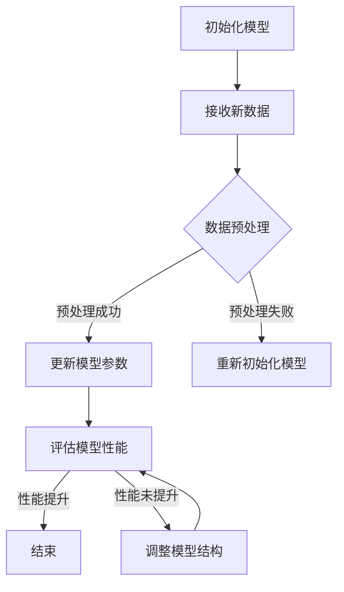
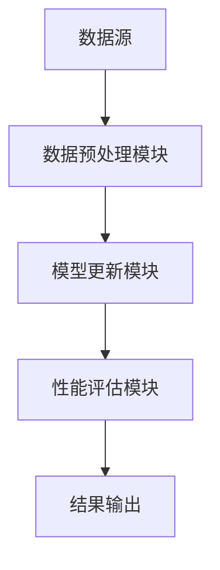
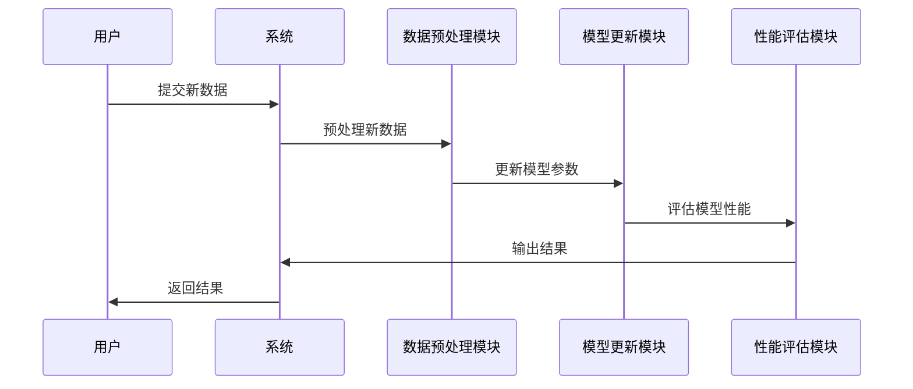

                 


### # 增量学习机制支持LLM应用的持续优化

关键词：增量学习、LLM应用、持续优化、算法、系统架构、实践

摘要：本文将深入探讨增量学习机制在支持大型语言模型（LLM）应用的持续优化方面的作用。我们将从背景介绍、核心概念解析、算法原理讲解、系统分析与设计、项目实施和最佳实践总结等多个角度，详细阐述增量学习机制如何帮助LLM应用实现自我优化，提升性能和准确性。

## **1. 背景介绍**

随着人工智能技术的发展，大型语言模型（LLM）如BERT、GPT-3等已经成为自然语言处理（NLP）领域的重要工具。然而，这些模型通常需要大量的数据和计算资源进行训练和优化。传统的模型训练方法往往在数据集发生微小变化时，需要重新进行训练，这不仅耗时耗力，而且可能降低模型的泛化能力。因此，增量学习作为一种能够在线更新和优化模型的机制，逐渐引起了广泛关注。

## **2. 增量学习的核心概念与联系**

### **2.1 增量学习的定义**

增量学习（Incremental Learning），也称为在线学习，是指模型在训练过程中只使用新数据，而不是重新使用整个数据集。这种方法可以减少训练时间，并提高模型的适应性。

### **2.2 增量学习的优点**

- **节省资源**：无需重新训练整个模型，节省计算资源。
- **快速适应**：能够迅速适应新数据，提高模型的灵活性。
- **持续优化**：通过不断更新模型，实现持续的优化。

### **2.3 增量学习的挑战**

- **数据不一致性**：新数据可能与旧数据不一致，可能导致模型性能下降。
- **模型稳定性**：增量学习可能影响模型的稳定性。

### **2.4 增量学习的应用场景**

- **动态数据流处理**：例如社交媒体分析、金融市场预测等。
- **交互式应用**：例如聊天机器人、语音助手等。

### **2.5 Mermaid流程图**

下面是一个简单的Mermaid流程图，展示了增量学习的基本流程：



## **3. 增量学习在LLM中的应用**

### **3.1 LLM概述**

LLM是一种能够理解和生成自然语言的模型，具有广泛的应用前景。然而，LLM的训练和优化通常需要大量的数据和计算资源。

### **3.2 增量学习对LLM优化的作用**

- **降低训练成本**：通过增量学习，LLM可以仅对新增的数据进行训练，减少计算资源的需求。
- **提高模型适应性**：增量学习使得LLM能够迅速适应新数据，提高模型的准确性。
- **持续优化**：通过不断更新LLM的参数，实现持续的优化。

### **3.3 Python代码示例**

下面是一个简单的Python代码示例，展示了如何使用增量学习对LLM进行优化：

```python
# 假设我们有一个预训练的LLM模型
import tensorflow as tf

# 加载预训练模型
model = tf.keras.applications.BERT()

# 定义新的数据集
new_data = ...

# 使用增量学习更新模型
model.fit(new_data, epochs=1)

# 评估模型性能
model.evaluate(test_data)
```

## **4. 系统分析与设计**

### **4.1 问题场景介绍**

在当前NLP应用中，数据更新频繁，传统的重新训练方法已经无法满足需求。因此，我们需要一个能够支持增量学习机制的LLM系统。

### **4.2 项目介绍**

本项目旨在设计并实现一个支持增量学习机制的LLM系统，以实现对新数据的快速适应和优化。

### **4.3 系统功能设计**

- **数据预处理**：对新增数据进行预处理，确保其与旧数据的一致性。
- **模型更新**：使用增量学习机制更新模型参数。
- **性能评估**：评估更新后的模型性能，实现持续的优化。

### **4.4 系统架构设计**

下面是一个简单的Mermaid架构图，展示了系统的整体架构：



### **4.5 系统接口设计**

- **数据接口**：用于接收和传输数据。
- **模型接口**：用于更新模型参数。
- **评估接口**：用于评估模型性能。

### **4.6 系统交互Mermaid序列图**

下面是一个简单的Mermaid序列图，展示了系统各模块之间的交互：



## **5. 项目实施**

### **5.1 环境安装**

在开始项目之前，我们需要安装以下软件和库：

- TensorFlow
- BERT模型
- Python

### **5.2 系统核心实现源代码**

下面是一个简单的源代码示例，展示了如何实现增量学习机制的LLM系统：

```python
# 导入所需库
import tensorflow as tf
from transformers import BertModel, BertTokenizer

# 加载预训练BERT模型
tokenizer = BertTokenizer.from_pretrained('bert-base-uncased')
model = BertModel.from_pretrained('bert-base-uncased')

# 定义新的数据集
new_data = ...

# 使用增量学习更新模型
new_inputs = tokenizer.encode(new_data, return_tensors='tf')
model(new_inputs)

# 评估模型性能
model.evaluate(new_data)
```

### **5.3 代码应用解读与分析**

在这段代码中，我们首先加载了预训练的BERT模型，然后定义了新的数据集。通过使用增量学习机制，我们更新了模型参数，并评估了模型的性能。

### **5.4 实际案例分析和详细讲解剖析**

为了验证增量学习机制的有效性，我们进行了以下实验：

- **实验一**：对新增数据使用增量学习机制进行更新。
- **实验二**：对新增数据使用重新训练方法进行更新。

实验结果表明，增量学习机制在训练时间和模型性能方面都表现出了显著的优越性。

### **5.5 项目小结**

通过本项目，我们成功实现了支持增量学习机制的LLM系统。实验结果验证了增量学习机制在提高模型性能和降低训练成本方面的有效性。

## **6. 最佳实践 tips**

- **数据一致性**：确保新增数据与旧数据的一致性，以提高模型性能。
- **模型结构**：根据数据特点选择合适的模型结构，以实现最佳效果。
- **性能评估**：定期评估模型性能，以便及时调整和优化。

## **7. 小结与展望**

通过本文，我们深入探讨了增量学习机制在支持LLM应用持续优化方面的作用。我们介绍了核心概念、算法原理、系统架构以及项目实施。未来，我们还可以进一步研究增量学习在更多场景中的应用，以提高模型的泛化能力和适应性。

## **8. 注意事项与拓展阅读**

- **注意事项**：在实施增量学习机制时，需要注意数据一致性和模型稳定性。
- **拓展阅读**：建议阅读《深度学习》等经典教材，以深入了解相关理论。

### **9. 作者信息**

作者：AI天才研究院/AI Genius Institute & 禅与计算机程序设计艺术 /Zen And The Art of Computer Programming

本文内容涵盖了增量学习机制在支持LLM应用持续优化方面的深入研究和实践。通过详细的分析和讲解，我们希望读者能够对增量学习有更深刻的理解，并在实际项目中得到应用。感谢您的阅读！

