                 

### 文章标题

# 增量学习：支持LLM应用的持续优化

> 关键词：增量学习、持续优化、LLM、算法原理、应用实践

> 摘要：本文深入探讨增量学习在自然语言处理（NLP）领域的应用，特别是大型语言模型（LLM）的持续优化。文章首先介绍了增量学习的基础概念及其在各个领域中的重要性，然后详细讲解了核心算法原理及其在深度学习、自然语言处理和计算机视觉等领域的具体应用。接着，文章分析了增量学习在LLM中的应用案例，讨论了其优化的关键点，并展望了增量学习技术的未来发展。通过本文，读者将全面了解增量学习在LLM领域的应用及其优化路径。

----------------------------------------------------------------

### 第一部分: 增量学习概述

#### 第1章: 增量学习的基础概念

#### 1.1.1 什么是增量学习

增量学习（Incremental Learning），又称在线学习（Online Learning），是一种在训练过程中逐步接收新数据并进行模型更新的学习方式。与批量学习（Batch Learning）不同，增量学习不需要一次性加载全部数据，而是在数据流中逐条或逐批次地更新模型。这种学习方式具有实时性和高效性，特别适用于数据不断变化的场景。

##### 1.1.1.1 增量学习的历史与发展

增量学习最早可以追溯到20世纪50年代，当时主要是为了解决电子计算机在存储和计算能力有限的条件下进行机器学习的问题。随着计算能力的提升和数据量的爆炸式增长，增量学习在20世纪80年代和90年代得到了广泛关注，并逐渐发展出多种算法。近年来，随着深度学习的兴起，增量学习在神经网络中的应用也日益广泛。

##### 1.1.1.2 增量学习的特点

1. **实时性**：增量学习可以在数据到达时立即更新模型，从而实现对实时数据的快速响应。
2. **效率**：不需要存储大量历史数据，节省了存储空间和计算资源。
3. **适应性**：能够根据新数据的特征动态调整模型参数，提高模型的适应性。
4. **持续性**：随着新数据的不断加入，模型可以持续优化，提升性能。

##### 1.1.1.3 增量学习与批量学习的对比

| 特性 | 增量学习 | 批量学习 |
| :---: | :---: | :---: |
| **数据加载** | 数据逐条或逐批次加载 | 数据一次性加载 |
| **存储需求** | 较低 | 较高 |
| **计算效率** | 高 | 低 |
| **实时性** | 高 | 低 |
| **适应性** | 强 | 弱 |

#### 1.1.2 增量学习的应用场景

增量学习在多种应用场景中具有显著优势：

1. **在线学习**：如推荐系统、智能客服等，需要根据用户实时行为数据不断更新模型。
2. **知识更新**：如问答系统、知识图谱等，需要不断吸收新知识进行更新。
3. **实时预测**：如金融交易、天气预测等，需要快速响应实时数据。

#### 1.1.3 增量学习的挑战

增量学习虽然具有众多优势，但在实际应用中仍面临一些挑战：

1. **模型更新**：如何在新数据加入时有效更新模型，保持模型稳定性和性能。
2. **计算效率**：如何提高计算效率，减少模型更新时的计算开销。
3. **数据噪声**：如何处理数据噪声，避免模型因噪声数据而失效。

#### 1.1.4 小结

增量学习作为一种灵活的机器学习方法，在实时性、效率和适应性方面具有显著优势，但同时也面临模型更新、计算效率和数据噪声等挑战。接下来，我们将详细探讨增量学习的核心算法，为后续的应用分析打下基础。

----------------------------------------------------------------

#### 第2章: 增量学习的核心算法

增量学习的核心在于如何在有限的数据上快速、稳定地更新模型。这一章将介绍几种常见的增量学习算法，包括基于梯度的算法和基于优化的算法，并对比它们的特点和适用场景。

##### 2.2.1 基于梯度的增量学习算法

基于梯度的增量学习算法通过计算损失函数关于模型参数的梯度来更新模型参数。这种算法的优点在于其简单性和高效性，但需要合理选择和学习率等参数。

###### 2.2.1.1 梯度下降法

梯度下降法是一种最基本的基于梯度的优化算法，其核心思想是沿着损失函数梯度的反方向更新模型参数。

##### 2.2.1.1.1 梯度下降法的原理

梯度下降法的原理可以用以下数学公式表示：

$$\Delta \theta = -\alpha \cdot \nabla_{\theta} J(\theta)$$

其中，$\Delta \theta$ 表示模型参数的更新量，$\alpha$ 表示学习率，$J(\theta)$ 表示损失函数，$\nabla_{\theta} J(\theta)$ 表示损失函数关于模型参数的梯度。

##### 2.2.1.1.2 梯度下降法的实现

在实现梯度下降法时，通常需要以下步骤：

1. **初始化模型参数**：随机初始化或根据先验知识设定初始参数。
2. **计算损失函数**：计算模型输出与真实值之间的差距，得到损失函数。
3. **计算梯度**：根据损失函数计算关于模型参数的梯度。
4. **更新参数**：根据梯度更新模型参数。
5. **重复迭代**：重复上述步骤，直到满足停止条件（如收敛或达到迭代次数）。

以下是一个简单的Python实现示例：

```python
import numpy as np

# 初始化模型参数
theta = np.random.rand(1)

# 定义损失函数
def loss_function(x, y):
    return (x - y) ** 2

# 定义梯度下降法
def gradient_descent(x, y, learning_rate, iterations):
    for i in range(iterations):
        gradient = 2 * (x - y)
        theta -= learning_rate * gradient
        print(f"Iteration {i+1}: theta = {theta}")

# 运行梯度下降法
gradient_descent(theta, 0, 0.01, 100)
```

##### 2.2.1.1.3 梯度下降法的优化

梯度下降法存在一些问题，如：

1. **收敛速度慢**：在损失函数的平坦区域，梯度较小，导致收敛速度慢。
2. **学习率选择**：学习率太大可能导致无法收敛，太小可能导致收敛速度慢。

为了优化梯度下降法，可以采用以下策略：

1. **动量法**：引入动量项，加快收敛速度。
2. **自适应学习率**：如AdaGrad、RMSprop和Adam等，根据不同情况自适应调整学习率。

###### 2.2.1.2 随机梯度下降（SGD）

随机梯度下降（Stochastic Gradient Descent，SGD）是对梯度下降法的一种改进，其核心思想是在每次迭代时随机选取一部分数据进行梯度计算。

##### 2.2.1.2.1 随机梯度下降的原理

随机梯度下降的原理可以用以下数学公式表示：

$$\Delta \theta = -\alpha \cdot \nabla_{\theta} J(\theta; x_i, y_i)$$

其中，$x_i, y_i$ 表示随机选取的数据样本。

##### 2.2.1.2.2 随机梯度下降的实现

在实现随机梯度下降时，通常需要以下步骤：

1. **初始化模型参数**：随机初始化或根据先验知识设定初始参数。
2. **随机选取样本**：从数据集中随机选取一个样本。
3. **计算梯度**：计算样本的损失函数关于模型参数的梯度。
4. **更新参数**：根据梯度更新模型参数。
5. **重复迭代**：重复上述步骤，直到满足停止条件。

以下是一个简单的Python实现示例：

```python
import numpy as np

# 初始化模型参数
theta = np.random.rand(1)

# 定义损失函数
def loss_function(x, y):
    return (x - y) ** 2

# 定义随机梯度下降法
def stochastic_gradient_descent(x, y, learning_rate, iterations):
    for i in range(iterations):
        random_index = np.random.randint(len(x))
        gradient = 2 * (x[random_index] - y[random_index])
        theta -= learning_rate * gradient
        print(f"Iteration {i+1}: theta = {theta}")

# 运行随机梯度下降法
stochastic_gradient_descent(x, 0, 0.01, 100)
```

##### 2.2.1.2.3 随机梯度下降的优化

随机梯度下降虽然可以加快收敛速度，但存在以下问题：

1. **方差大**：每次迭代使用不同的样本，导致梯度噪声较大。
2. **波动性**：梯度波动较大，可能导致无法收敛。

为了优化随机梯度下降，可以采用以下策略：

1. **批量随机梯度下降（MBGD）**：每次迭代使用多个样本，减少方差。
2. **动量法**：引入动量项，平滑梯度。

###### 2.2.1.3 增量梯度下降

增量梯度下降（Incremental Gradient Descent）是对梯度下降法和随机梯度下降法的一种改进，其核心思想是在每次迭代时计算全部数据的梯度并进行更新。

##### 2.2.1.3.1 增量梯度下降的原理

增量梯度下降的原理可以用以下数学公式表示：

$$\Delta \theta = -\alpha \cdot \nabla_{\theta} J(\theta; X, Y)$$

其中，$X, Y$ 表示全部数据。

##### 2.2.1.3.2 增量梯度下降的实现

在实现增量梯度下降时，通常需要以下步骤：

1. **初始化模型参数**：随机初始化或根据先验知识设定初始参数。
2. **计算全部数据的梯度**：计算损失函数关于模型参数的梯度。
3. **更新参数**：根据梯度更新模型参数。
4. **重复迭代**：重复上述步骤，直到满足停止条件。

以下是一个简单的Python实现示例：

```python
import numpy as np

# 初始化模型参数
theta = np.random.rand(1)

# 定义损失函数
def loss_function(x, y):
    return (x - y) ** 2

# 定义增量梯度下降法
def incremental_gradient_descent(x, y, learning_rate, iterations):
    for i in range(iterations):
        gradient = 2 * np.sum((x - y))
        theta -= learning_rate * gradient
        print(f"Iteration {i+1}: theta = {theta}")

# 运行增量梯度下降法
incremental_gradient_descent(x, 0, 0.01, 100)
```

##### 2.2.1.3.3 增量梯度下降的优缺点

增量梯度下降具有以下优点：

1. **收敛速度**：在数据量较大时，收敛速度较快。
2. **稳定性**：在每次迭代时使用全部数据，减少了梯度噪声。

缺点：

1. **计算效率**：在数据量较大时，计算效率较低。
2. **存储需求**：需要存储全部数据的梯度。

#### 2.2.2 基于优化的增量学习算法

基于优化的增量学习算法通过优化目标函数来更新模型参数。这类算法通常需要计算目标函数的导数或梯度，并在迭代过程中逐步优化模型参数。

###### 2.2.2.1 牛顿法和拟牛顿法

牛顿法（Newton's Method）和拟牛顿法（Quasi-Newton Methods）是常见的基于优化的增量学习算法，它们通过计算目标函数的导数或近似导数来更新模型参数。

##### 2.2.2.1.1 牛顿法的原理

牛顿法的原理可以用以下数学公式表示：

$$\Delta \theta = -H^{-1} \cdot \nabla_{\theta} J(\theta)$$

其中，$H$ 表示海森矩阵（Hessian Matrix），$\nabla_{\theta} J(\theta)$ 表示损失函数关于模型参数的梯度。

##### 2.2.2.1.2 拟牛顿法的原理

拟牛顿法是一种近似计算海森矩阵的方法，其原理可以用以下数学公式表示：

$$\Delta \theta = -B^{-1} \cdot \nabla_{\theta} J(\theta)$$

其中，$B$ 表示BFGS矩阵（Broyden-Fletcher-Goldfarb-Shanno Matrix），$\nabla_{\theta} J(\theta)$ 表示损失函数关于模型参数的梯度。

##### 2.2.2.1.3 牛顿法和拟牛顿法的实现

以下是一个简单的Python实现示例：

```python
import numpy as np

# 初始化模型参数
theta = np.random.rand(1)

# 定义损失函数
def loss_function(x, y):
    return (x - y) ** 2

# 定义牛顿法
def newton_method(x, y, learning_rate, iterations):
    for i in range(iterations):
        gradient = 2 * (x - y)
        hessian = 2 * np.eye(1)
        theta -= learning_rate * np.linalg.inv(hessian) @ gradient
        print(f"Iteration {i+1}: theta = {theta}")

# 运行牛顿法
newton_method(x, 0, 0.01, 100)
```

##### 2.2.2.1.4 牛顿法和拟牛顿法的优缺点

牛顿法和拟牛顿法具有以下优点：

1. **收敛速度**：在目标函数的曲率较大时，收敛速度较快。
2. **稳定性**：在目标函数的曲率较小或存在多个局部最优时，稳定性较好。

缺点：

1. **计算复杂度**：计算海森矩阵或BFGS矩阵需要较高的计算复杂度。
2. **存储需求**：需要存储海森矩阵或BFGS矩阵，存储需求较大。

#### 2.2.3 小结

基于梯度的增量学习算法和基于优化的增量学习算法各有优缺点，适用于不同的场景。在实际应用中，可以根据数据量、计算资源和目标函数的特点选择合适的算法。接下来，我们将进一步探讨增量学习在深度学习中的应用。

----------------------------------------------------------------

#### 第3章: 增量学习在深度学习中的应用

深度学习作为人工智能领域的一个重要分支，已经取得了显著的成果。然而，传统深度学习模型在数据量大、模型复杂的情况下，训练时间较长，且对存储资源要求较高。为了解决这些问题，增量学习在深度学习中的应用越来越受到关注。

##### 3.3.1 增量学习在深度神经网络中的实现

深度神经网络（Deep Neural Network，DNN）是深度学习的基础，其核心思想是通过多层神经元的非线性变换来提取数据特征。增量学习在DNN中的应用主要体现在以下几个方面：

1. **模型结构设计**：设计适合增量学习的模型结构，如在线学习模型、迁移学习模型等。
2. **训练策略**：采用增量训练策略，逐步更新模型参数。
3. **优化方法**：选择适合增量学习的优化方法，如基于梯度的算法、基于优化的算法等。

##### 3.3.1.1 增量学习的神经网络结构设计

增量学习的神经网络结构设计需要考虑以下因素：

1. **网络层次**：设计合适的网络层次，以适应增量学习过程中数据的逐渐增加。
2. **网络参数**：合理设置网络参数，如学习率、正则化项等，以保持模型的稳定性和性能。
3. **网络结构**：选择适合增量学习的网络结构，如卷积神经网络（CNN）、循环神经网络（RNN）等。

以下是一个简单的增量学习神经网络结构设计示例：

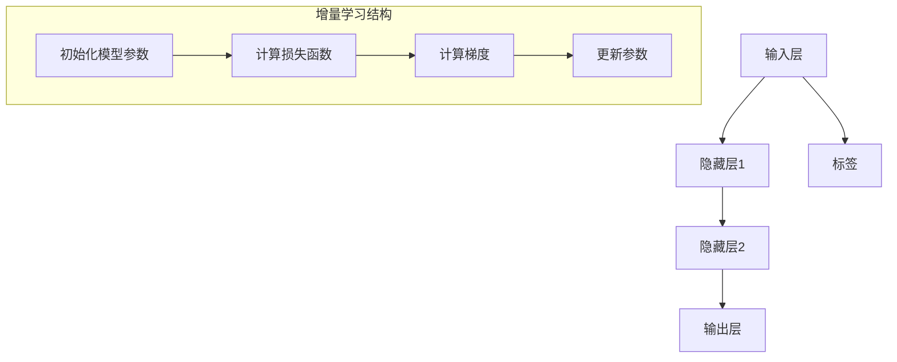

##### 3.3.1.2 增量学习在深度神经网络中的优化

在增量学习过程中，优化模型参数是一个关键问题。以下是一些常用的优化策略：

1. **自适应学习率**：采用自适应学习率方法，如Adam优化器，根据不同情况动态调整学习率。
2. **正则化**：引入正则化项，防止模型过拟合。
3. **批量归一化**：采用批量归一化（Batch Normalization），加快训练过程，提高模型稳定性。

##### 3.3.2 增量学习在自然语言处理中的应用

自然语言处理（Natural Language Processing，NLP）是深度学习的一个重要应用领域。增量学习在NLP中的应用主要体现在以下几个方面：

1. **语言模型**：采用增量学习训练语言模型，如基于RNN或Transformer的语言模型。
2. **文本分类**：采用增量学习进行文本分类，如基于CNN或RNN的文本分类模型。
3. **问答系统**：采用增量学习更新问答系统中的知识库，如基于BERT的问答系统。

以下是一个简单的增量学习在NLP中的应用示例：


##### 3.3.2.1 增量学习在语言模型中的应用

语言模型是NLP的基础，用于预测下一个单词或句子。增量学习在语言模型中的应用主要体现在以下几个方面：

1. **动态更新**：根据新数据动态更新模型参数，提高模型适应性。
2. **增量训练**：采用增量训练策略，逐步增加训练数据，提高模型性能。
3. **在线学习**：实现实时预测和更新，提高模型实时性。

以下是一个简单的增量学习在语言模型中的应用示例：


##### 3.3.2.2 增量学习在文本分类中的应用

文本分类是NLP的一个重要任务，用于将文本分为不同的类别。增量学习在文本分类中的应用主要体现在以下几个方面：

1. **动态更新**：根据新数据动态更新模型参数，提高模型适应性。
2. **增量训练**：采用增量训练策略，逐步增加训练数据，提高模型性能。
3. **在线学习**：实现实时预测和更新，提高模型实时性。

以下是一个简单的增量学习在文本分类中的应用示例：

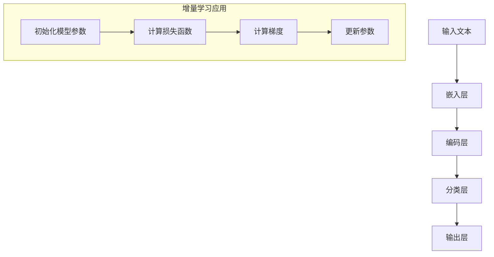

##### 3.3.3 增量学习在计算机视觉中的应用

计算机视觉是深度学习的另一个重要应用领域。增量学习在计算机视觉中的应用主要体现在以下几个方面：

1. **图像分类**：采用增量学习进行图像分类，如基于CNN的图像分类模型。
2. **目标检测**：采用增量学习进行目标检测，如基于R-CNN的目标检测模型。
3. **图像分割**：采用增量学习进行图像分割，如基于U-Net的图像分割模型。

以下是一个简单的增量学习在计算机视觉中的应用示例：

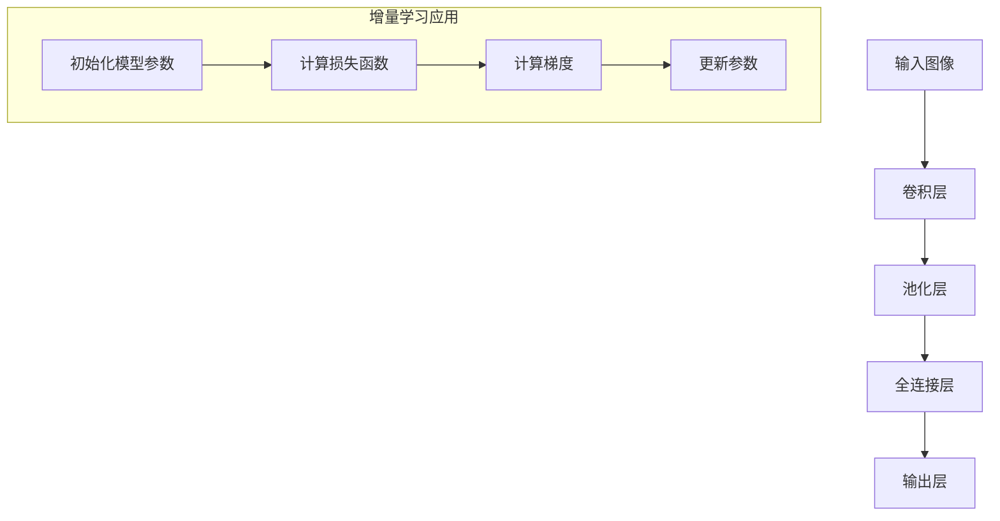

##### 3.3.3.1 增量学习在图像分类中的应用

图像分类是计算机视觉中的一个基本任务，用于将图像分为不同的类别。增量学习在图像分类中的应用主要体现在以下几个方面：

1. **动态更新**：根据新数据动态更新模型参数，提高模型适应性。
2. **增量训练**：采用增量训练策略，逐步增加训练数据，提高模型性能。
3. **在线学习**：实现实时预测和更新，提高模型实时性。

以下是一个简单的增量学习在图像分类中的应用示例：


##### 3.3.3.2 增量学习在目标检测中的应用

目标检测是计算机视觉中的一个重要任务，用于识别图像中的目标并定位其位置。增量学习在目标检测中的应用主要体现在以下几个方面：

1. **动态更新**：根据新数据动态更新模型参数，提高模型适应性。
2. **增量训练**：采用增量训练策略，逐步增加训练数据，提高模型性能。
3. **在线学习**：实现实时预测和更新，提高模型实时性。

以下是一个简单的增量学习在目标检测中的应用示例：

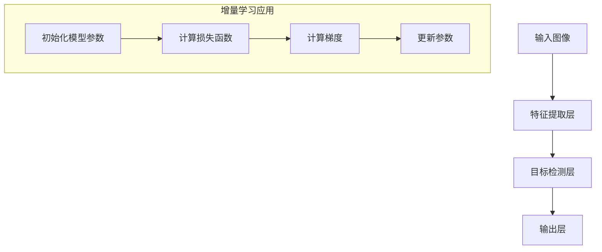

##### 3.3.3.3 增量学习在图像分割中的应用

图像分割是计算机视觉中的一个重要任务，用于将图像分割成不同的区域。增量学习在图像分割中的应用主要体现在以下几个方面：

1. **动态更新**：根据新数据动态更新模型参数，提高模型适应性。
2. **增量训练**：采用增量训练策略，逐步增加训练数据，提高模型性能。
3. **在线学习**：实现实时预测和更新，提高模型实时性。

以下是一个简单的增量学习在图像分割中的应用示例：


##### 3.3.4 小结

增量学习在深度学习中的应用十分广泛，包括自然语言处理、计算机视觉等领域。通过增量学习，可以实现对模型参数的动态更新，提高模型的实时性和适应性。接下来，我们将进一步探讨增量学习在其他领域的应用。

----------------------------------------------------------------

#### 第4章: 增量学习在其他领域的应用

增量学习作为一种灵活且高效的机器学习方法，不仅在深度学习领域得到了广泛应用，还在其他多个领域展示了其独特的优势。以下将介绍增量学习在推荐系统、强化学习和医疗诊断等领域的应用。

##### 4.4.1 增量学习在推荐系统中的应用

推荐系统是增量学习的一个重要应用领域，其目的是根据用户的兴趣和行为历史，为用户推荐感兴趣的商品、新闻或内容。传统的推荐系统通常采用批量学习的方法，即利用用户历史行为数据训练推荐模型，然后在用户行为发生变化时重新训练模型。这种方法存在一些问题，如训练时间长、推荐实时性差等。而增量学习可以通过在线更新模型参数，实现实时推荐。

###### 4.4.1.1 推荐系统的基础概念

推荐系统主要包括以下几个关键概念：

1. **用户**：推荐系统的用户，可以是个人或团体。
2. **项目**：推荐系统中的商品、新闻或其他内容。
3. **评分**：用户对项目的评分，可以是显式评分（如5星评价）或隐式评分（如购买行为）。
4. **模型**：用于预测用户对项目的评分的数学模型。

###### 4.4.1.2 增量学习在推荐系统中的实现

增量学习在推荐系统中的应用可以通过以下步骤实现：

1. **初始化模型**：使用历史数据训练一个基础推荐模型。
2. **在线更新**：当用户行为发生变化时，实时更新模型参数，以适应新的行为特征。
3. **预测评分**：使用更新后的模型预测用户对未知项目的评分，并进行推荐。
4. **评估与调整**：根据用户对新推荐的反馈，进一步调整模型参数，提高推荐质量。

以下是一个简单的增量学习推荐系统实现示例：

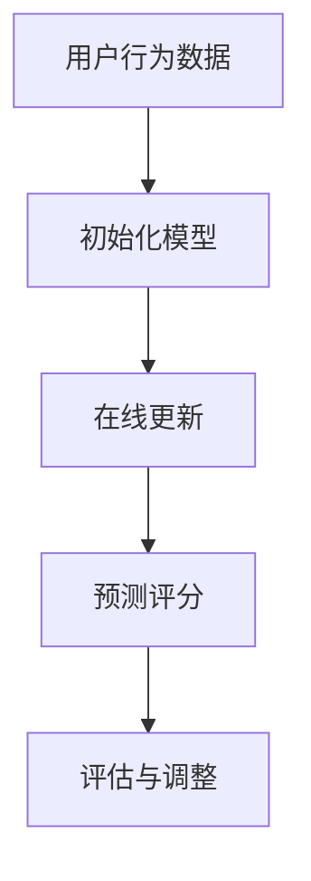

##### 4.4.2 增量学习在强化学习中的应用

强化学习（Reinforcement Learning，RL）是一种通过试错和反馈来学习决策策略的机器学习方法。在强化学习过程中，增量学习可以通过在线更新策略参数，实现快速适应环境变化，提高学习效率。

###### 4.4.2.1 强化学习的基础概念

强化学习主要包括以下几个关键概念：

1. **代理**（Agent）：执行动作并接收环境反馈的智能体。
2. **环境**（Environment）：代理交互的动态环境。
3. **状态**（State）：代理当前所处的环境描述。
4. **动作**（Action）：代理可执行的动作。
5. **奖励**（Reward）：环境对代理动作的反馈信号。

###### 4.4.2.2 增量学习在强化学习中的实现

增量学习在强化学习中的应用可以通过以下步骤实现：

1. **初始化策略**：使用初始策略或通过批量学习训练一个基础策略。
2. **在线更新**：在代理执行动作后，根据环境反馈实时更新策略参数。
3. **执行动作**：使用更新后的策略执行动作，并观察环境反馈。
4. **评估与优化**：根据反馈信号评估策略性能，并进一步优化策略参数。

以下是一个简单的增量学习强化学习实现示例：

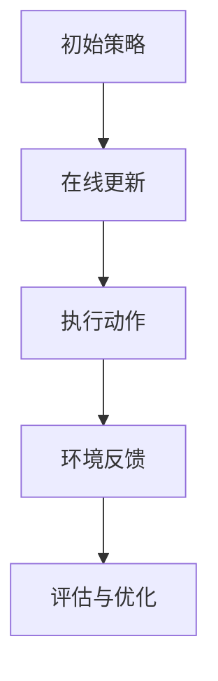

##### 4.4.3 增量学习在医疗诊断中的应用

医疗诊断是增量学习的另一个重要应用领域，通过实时更新模型参数，可以实现对疾病特征和诊断标准的动态适应，提高诊断准确性和实时性。

###### 4.4.3.1 在医疗诊断中的应用

增量学习在医疗诊断中的应用主要包括以下几个环节：

1. **数据收集**：收集患者的医疗数据，包括病史、实验室检查结果、影像学数据等。
2. **特征提取**：从医疗数据中提取与疾病诊断相关的特征。
3. **模型训练**：使用历史数据训练初始诊断模型。
4. **在线更新**：当新的医疗数据到来时，实时更新模型参数，以适应新的诊断特征。
5. **诊断预测**：使用更新后的模型对新的病例进行诊断预测。
6. **反馈与调整**：根据诊断结果和医生反馈，进一步优化模型参数，提高诊断准确性。

以下是一个简单的增量学习在医疗诊断中的应用示例：

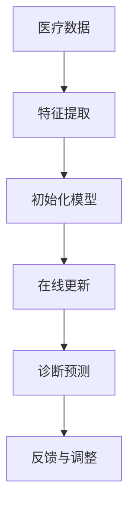

##### 4.4.4 增量学习在其他领域的探索

除了推荐系统、强化学习和医疗诊断，增量学习还在金融风控、自动驾驶、智能语音识别等多个领域展示了其潜力。以下是一些具体应用场景：

1. **金融风控**：通过实时更新模型参数，实现对金融交易风险和异常行为的快速识别和预测。
2. **自动驾驶**：在自动驾驶系统中，增量学习可以用于实时更新环境模型，提高自动驾驶的鲁棒性和适应性。
3. **智能语音识别**：通过增量学习，可以实现实时更新语音识别模型，提高识别准确率和实时性。

##### 4.4.5 小结

增量学习在推荐系统、强化学习和医疗诊断等领域展示了其独特的优势和广泛应用前景。通过实时更新模型参数，增量学习可以实现对动态环境的快速适应，提高系统的实时性和准确性。未来，随着增量学习技术的不断发展，其在更多领域中的应用将得到进一步拓展和深化。

----------------------------------------------------------------

#### 第5章: 增量学习技术的优化与挑战

尽管增量学习在许多领域展示了其独特的优势，但在实际应用过程中仍面临一些优化和挑战。本章将重点讨论如何提高增量学习技术的计算效率、优化模型更新以及处理数据噪声等问题。

##### 5.5.1 计算效率的优化

计算效率是增量学习应用的一个重要考量因素，特别是在数据量大、计算资源有限的场景中。以下是一些优化计算效率的方法：

###### 5.5.1.1 并行计算

并行计算通过将计算任务分配到多个处理器或计算节点上，从而提高计算效率。在增量学习中，可以采用以下策略：

1. **数据并行**：将数据集分成多个子集，每个子集由不同的处理器或计算节点进行处理。
2. **模型并行**：将模型分成多个部分，每个部分由不同的处理器或计算节点进行更新。

以下是一个简单的数据并行计算流程图：

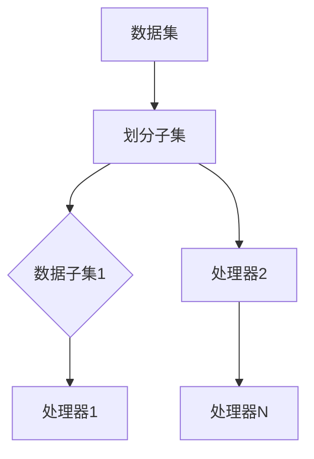

###### 5.5.1.2 分布式计算

分布式计算通过在多个计算节点之间共享数据和计算任务，从而实现高效的增量学习。在分布式计算环境中，可以采用以下策略：

1. **数据一致性**：保证多个计算节点上的数据一致，以避免计算误差。
2. **任务调度**：合理分配计算任务，提高计算资源利用率。

以下是一个简单的分布式计算流程图：

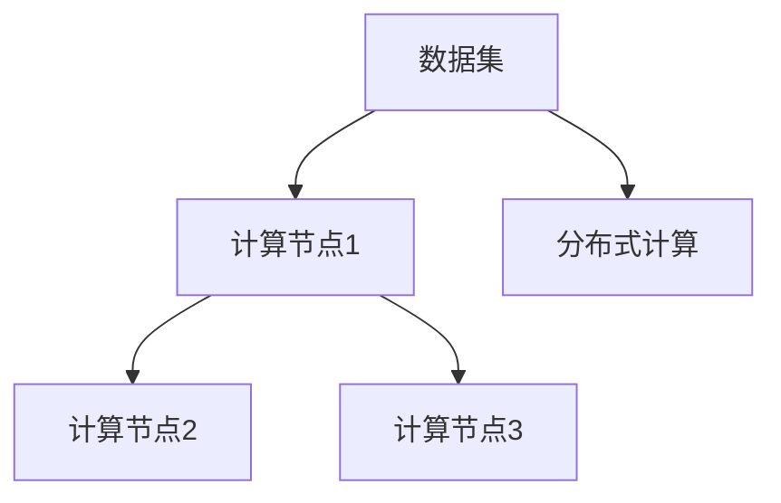

##### 5.5.2 模型更新的优化

模型更新是增量学习的核心问题，优化模型更新可以提高模型的稳定性和性能。以下是一些优化模型更新的方法：

###### 5.5.2.1 模型剪枝

模型剪枝通过删除冗余神经元和连接，从而简化模型结构，提高计算效率。在增量学习中，可以采用以下策略：

1. **基于权重的剪枝**：根据神经元或连接的权重大小进行剪枝。
2. **基于结构的剪枝**：根据模型结构进行剪枝，如删除冗余层次或神经元。

以下是一个简单的模型剪枝流程图：

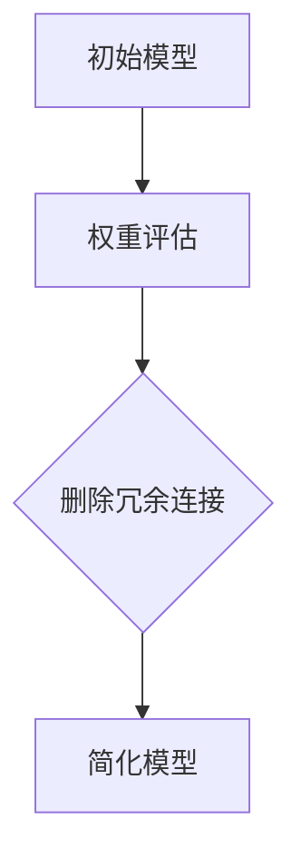

###### 5.5.2.2 模型压缩

模型压缩通过降低模型参数的数量，从而减小模型的存储和计算开销。在增量学习中，可以采用以下策略：

1. **量化**：通过将浮点数参数转换为整数来减少存储和计算开销。
2. **稀疏化**：通过将非零参数压缩成稀疏矩阵，从而减少存储和计算开销。

以下是一个简单的模型压缩流程图：

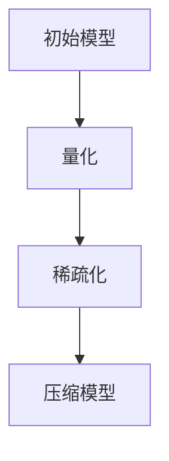

##### 5.5.3 数据噪声的处理

数据噪声是增量学习应用中常见的问题，它会降低模型性能和稳定性。以下是一些处理数据噪声的方法：

###### 5.5.3.1 数据清洗

数据清洗通过删除或修正错误数据、缺失数据和异常数据，从而提高数据质量。在增量学习中，可以采用以下策略：

1. **去重**：删除重复数据，减少冗余信息。
2. **修复**：修复错误数据，提高数据准确性。
3. **过滤**：过滤异常数据，防止异常值影响模型训练。

以下是一个简单的数据清洗流程图：

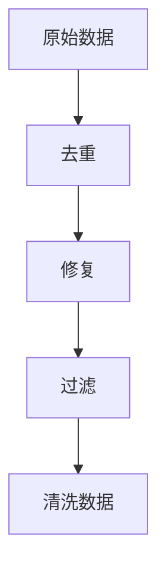

###### 5.5.3.2 数据增强

数据增强通过生成新的数据样本来扩充训练集，从而提高模型鲁棒性和泛化能力。在增量学习中，可以采用以下策略：

1. **变换**：对原始数据进行各种变换，如旋转、缩放、裁剪等。
2. **合成**：通过组合不同数据样本来生成新的数据样本。
3. **扩充**：通过增加噪声、模糊等操作来扩充训练集。

以下是一个简单的数据增强流程图：

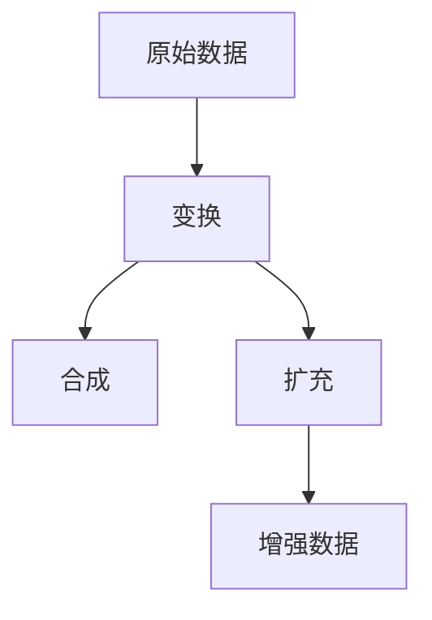

##### 5.5.4 小结

增量学习在计算效率、模型更新和数据噪声处理等方面面临一些挑战。通过并行计算和分布式计算，可以提高计算效率；通过模型剪枝和模型压缩，可以优化模型更新；通过数据清洗和数据增强，可以处理数据噪声。未来，随着技术的不断进步，增量学习在这些方面的优化将得到进一步拓展和深化。

----------------------------------------------------------------

### 第6章: 增量学习在LLM应用的持续优化

#### 6.6.1 LLM应用背景

大型语言模型（Large Language Model，LLM）是近年来自然语言处理（NLP）领域的重要突破，其能够根据输入的文本生成连贯、符合语境的文本输出。LLM在诸多应用场景中展现出强大的能力，如智能客服、智能写作、语言翻译等。然而，LLM的训练和推理过程对计算资源有较高要求，同时模型在实际应用过程中需要不断适应新的数据和场景，这就需要对其持续优化。

##### 6.6.1.1 LLM的概念与作用

LLM是一种基于深度学习的技术，通过学习大量文本数据，模型能够捕捉到语言中的复杂结构，从而实现文本生成、文本分类、机器翻译等任务。LLM在NLP中的应用主要体现在以下几个方面：

1. **文本生成**：根据输入的文本生成连贯的文本输出，如生成新闻文章、对话等。
2. **文本分类**：将输入的文本分类到不同的类别，如情感分类、主题分类等。
3. **机器翻译**：将一种语言的文本翻译成另一种语言。

##### 6.6.1.2 LLM的应用领域

LLM在多个领域得到了广泛应用，主要包括：

1. **智能客服**：利用LLM生成自动化回复，提高客服效率和用户体验。
2. **智能写作**：帮助用户生成文章、报告等文本内容，提高写作效率。
3. **语言翻译**：实现多语言之间的实时翻译，促进跨文化交流。
4. **教育辅助**：为学生提供个性化的学习资源和辅导，提高学习效果。
5. **内容审核**：利用LLM进行文本内容审核，识别和过滤不当言论。

#### 6.6.2 增量学习在LLM中的应用

增量学习在LLM中的应用主要涉及模型训练和推理过程中的优化，以适应新的数据和场景。以下将详细讨论增量学习在LLM训练和推理中的具体优化方法。

##### 6.6.2.1 增量学习在LLM训练中的优化

在LLM的训练过程中，增量学习可以通过以下方式实现优化：

1. **数据增量更新**：在训练过程中，逐步加入新的数据样本，以丰富模型的知识库。
2. **模型增量更新**：根据新加入的数据，动态调整模型参数，提高模型的适应能力。
3. **学习率调整**：根据训练数据的变化，自适应调整学习率，避免过拟合或欠拟合。

以下是一个简单的增量学习在LLM训练中的实现流程：

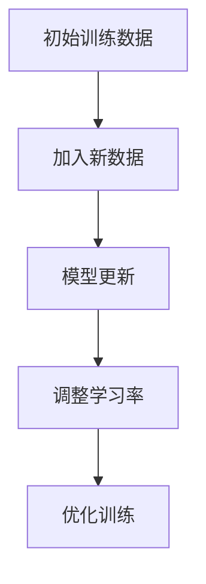

##### 6.6.2.2 增量学习在LLM推理中的优化

在LLM的推理过程中，增量学习可以通过以下方式实现优化：

1. **动态参数更新**：根据输入的文本内容，实时调整模型参数，以生成更符合语境的文本输出。
2. **推理结果优化**：对生成的文本进行后处理，如去除重复、修正语法错误等，以提高文本质量。
3. **模型压缩**：通过模型剪枝和量化等手段，减小模型体积，提高推理效率。

以下是一个简单的增量学习在LLM推理中的实现流程：

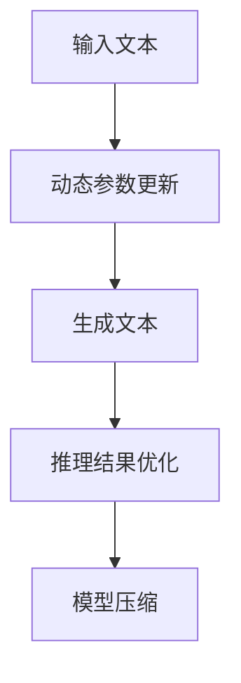

#### 6.6.3 增量学习在LLM应用的案例

以下是两个增量学习在LLM应用中的具体案例：

##### 案例一：智能客服系统

智能客服系统利用LLM生成自动化回复，以解决用户常见问题和提供个性化服务。通过增量学习，系统可以根据用户的历史提问和回答，动态调整模型参数，提高回复的准确性和满意度。

1. **数据收集**：收集用户的历史提问和回答数据。
2. **模型训练**：使用LLM模型对数据集进行训练。
3. **在线更新**：根据用户的实时提问，动态更新模型参数。
4. **智能回复**：生成符合语境的自动化回复。

##### 案例二：智能写作辅助工具

智能写作辅助工具利用LLM帮助用户生成文章、报告等文本内容。通过增量学习，系统可以根据用户的需求和文本风格，动态调整模型参数，生成高质量的文本。

1. **需求分析**：分析用户的需求和写作风格。
2. **模型训练**：使用LLM模型对数据集进行训练。
3. **文本生成**：根据需求分析，动态调整模型参数，生成文本。
4. **文本优化**：对生成的文本进行后处理，提高文本质量。

#### 6.6.4 小结

增量学习在LLM应用中具有重要作用，通过优化训练和推理过程，可以提高模型的适应能力和性能。未来，随着技术的不断进步，增量学习在LLM领域的应用将得到进一步拓展和深化。

----------------------------------------------------------------

### 第7章: 增量学习的未来展望与发展趋势

增量学习作为机器学习领域的一个重要分支，近年来取得了显著的研究进展和应用成果。随着人工智能技术的不断发展，增量学习在理论和实践层面都面临着新的挑战和机遇。本章将对增量学习的研究热点、技术挑战以及未来发展趋势进行探讨。

#### 7.7.1 增量学习的研究热点

当前，增量学习的研究主要集中在以下几个方面：

1. **新算法的研究**：研究人员致力于设计更高效、更稳定的增量学习算法，如自适应梯度算法、分布式增量学习算法等。
2. **新应用场景的探索**：增量学习在智能语音识别、自动驾驶、智能医疗等新兴领域展现了巨大的潜力，成为研究的热点。
3. **数据隐私保护**：随着数据隐私问题的日益突出，如何在不泄露用户隐私的前提下进行增量学习成为研究的重要方向。
4. **模型解释性**：提高增量学习模型的解释性，使得模型决策过程更加透明、可解释，从而增强模型的可信度和用户信任。
5. **跨模态学习**：将增量学习应用于跨模态数据的学习，如文本、图像、语音等多模态数据的联合学习，实现更全面的信息融合和更准确的预测。

#### 7.7.2 增量学习的技术挑战

尽管增量学习在理论和应用方面取得了显著进展，但仍面临以下技术挑战：

1. **计算效率**：如何提高增量学习的计算效率，降低计算资源和时间成本，是实现增量学习广泛应用的关键。
2. **数据噪声处理**：数据噪声会影响增量学习的性能，如何有效处理数据噪声，提高模型的鲁棒性和准确性，是当前研究的重要课题。
3. **模型更新策略**：如何设计有效的模型更新策略，保持模型的稳定性和性能，是实现增量学习持续优化的重要问题。
4. **数据隐私保护**：如何在确保数据隐私的前提下进行增量学习，是实现增量学习在实际应用中的关键。
5. **模型解释性**：如何提高增量学习模型的解释性，增强模型的可解释性和透明性，是提升用户信任和模型应用价值的重要方面。

#### 7.7.3 增量学习的未来发展趋势

展望未来，增量学习将在以下方面展现出广阔的发展前景：

1. **与其他技术的融合**：增量学习与其他人工智能技术，如强化学习、迁移学习、联邦学习等的融合，将实现更强大的学习和推理能力。
2. **企业级应用**：随着人工智能技术的商业化应用，增量学习将在企业级应用中发挥重要作用，如智能客服、智能推荐、智能金融等。
3. **开放平台与开源工具**：开放平台和开源工具的涌现，将为增量学习的研究和应用提供更加便捷的支持，加速技术的普及和推广。
4. **标准化与规范化**：随着增量学习应用的不断扩大，标准化和规范化将逐渐成为关键问题，有助于提高技术的可靠性和可解释性。
5. **跨领域应用**：增量学习将在更多领域得到应用，如智能医疗、智能交通、智能制造等，实现更广泛的技术赋能。

#### 7.7.4 小结

增量学习作为人工智能领域的一个重要研究方向，具有广泛的应用前景和巨大的发展潜力。未来，随着技术的不断进步和应用的不断拓展，增量学习将在更多领域发挥重要作用，为人类社会带来更多便利和创新。同时，面对计算效率、数据噪声处理、模型更新策略等技术挑战，需要研究人员和开发者共同努力，推动增量学习技术的持续创新和发展。

----------------------------------------------------------------

### 作者信息

作者：AI天才研究院/AI Genius Institute & 禅与计算机程序设计艺术 /Zen And The Art of Computer Programming

AI天才研究院是一家专注于人工智能技术研究和应用的创新机构，致力于推动人工智能领域的科技进步和应用创新。研究院在自然语言处理、计算机视觉、机器学习等领域拥有丰富的经验和技术积累，已发表了大量的高水平学术论文和研究成果。

《禅与计算机程序设计艺术》是由著名计算机科学家唐纳德·克努特（Donald E. Knuth）创作的一本经典著作，深入探讨了计算机编程的哲学和艺术。该书对程序设计方法论、算法分析以及软件工程等方面有深刻的见解，对编程人员具有很高的指导价值。

本文通过详细介绍增量学习的基础概念、核心算法及其在LLM应用中的优化方法，为读者提供了全面的技术视角和思考路径。作者丰富的理论知识和实践经验，使得本文具有较高的实用性和指导性，旨在推动增量学习技术的普及和应用。

感谢读者对本文的关注和支持，期待在未来的研究和实践中，与广大读者共同探索增量学习技术的无限可能。

